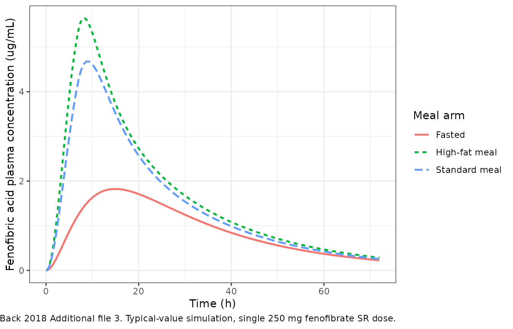
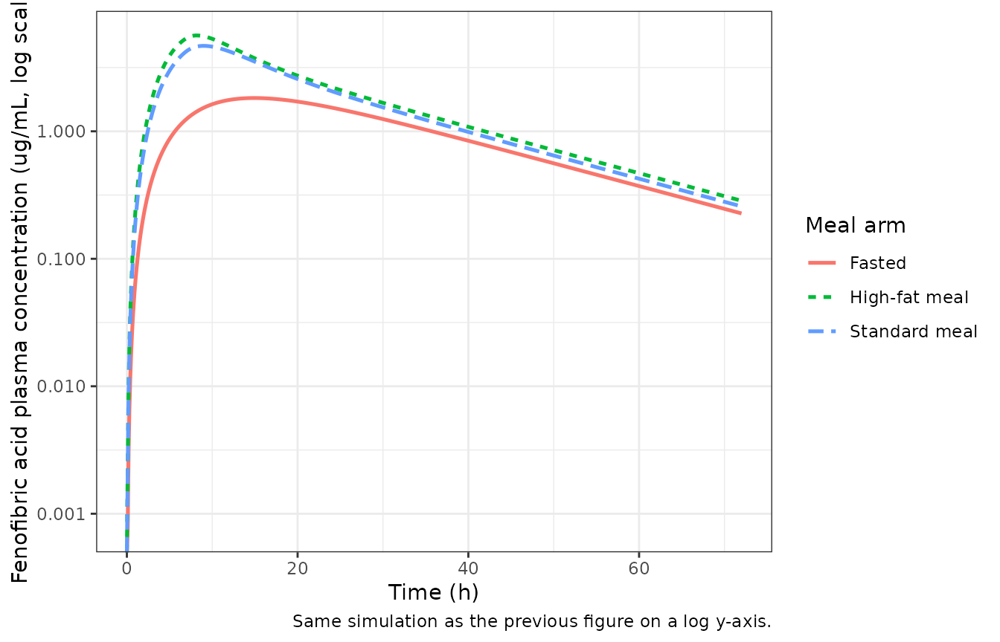
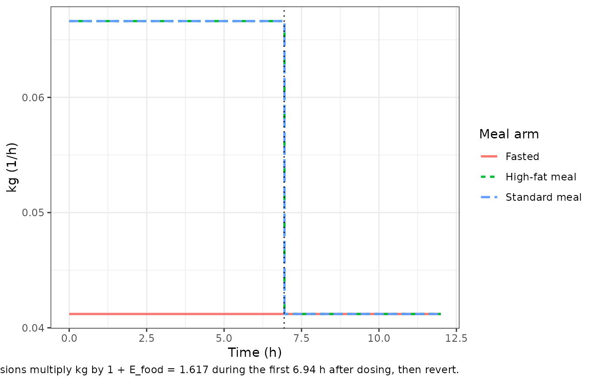

# Fenofibrate (Back 2018)

## Model and source

- Citation: Back H, Song B, Pradhan S, Chae J, Han N, Kang W, Chang MJ,
  Zheng J, Kwon K, Karlsson MO, Yun H. A mechanism-based pharmacokinetic
  model of fenofibrate for explaining increased drug absorption after
  food consumption. BMC Pharmacology and Toxicology. 2018;19:5.
  <doi:10.1186/s40360-018-0194-5>
- Description: Mechanism-based oral absorption / disposition model for
  fenofibrate (parent) and fenofibric acid (active form, measured
  analyte) in healthy Korean adults under fasted, standard-meal, and
  high-fat-meal conditions. Three drug compartments (stomach -\>
  duodenum -\> central) coupled to a 2-compartment calorie sub-model
  (stomach -\> duodenum) via a bile-acid-driven coupling: the combined
  fenofibrate-metabolism / fenofibric-acid-absorption rate constant km&a
  is multiplied by (1 + Ebile \* calories_in_duodenum), and a
  time-varying gastric emptying rate constant kg is multiplied by (1 +
  Efood) for the first 6.94 h after a meal. Meal-type-specific shifts on
  Vc/F encode the additional bioavailability change between fasted,
  standard, and high-fat meals.
- Article: <https://doi.org/10.1186/s40360-018-0194-5>

## Population

Back 2018 enrolled 24 healthy Korean adults (13 male, 11 female; mean
age 23 years; mean weight 68.75 kg; mean height 173.29 cm) in a
three-way randomised crossover food-effect study at Chungnam National
University (Republic of Korea). Each subject received a single 250 mg
fenofibrate (sustained-release) capsule with 240 mL water 10 minutes
after consuming (i) no food, (ii) a standard Korean breakfast (686.3
kcal; 56.3% carbohydrate, 23.9% protein, 19.9% fat), or (iii) a high-fat
Korean breakfast (1280 kcal; 45.5% carbohydrate, 19% protein, 35.5%
fat). Meal compositions are tabulated in Back 2018 Table 1. Plasma
samples for fenofibric acid (the active form generated by rapid
esterase-mediated metabolism of fenofibrate) were drawn at predose and
1, 2, 3, 4, 5, 6, 8, 10, 12, 24, 48, and 72 h post-dose. The study ran
April-November 2002 and was modelled with NONMEM 7.3 (FOCE-I) using
1000-replicate bootstrap for parameter precision (Back 2018 Methods).

The same information is available programmatically via the model’s
`population` metadata
(`readModelDb("Back_2018_fenofibrate")$population`).

## Source trace

The per-parameter origin is recorded as an in-file comment next to each
`ini()` entry in `inst/modeldb/specificDrugs/Back_2018_fenofibrate.R`.
The table below collects them in one place.

| Equation / parameter | Value | Source location |
|----|----|----|
| `lkg` (kg, fasted gastric emptying) | log(0.0412 1/h) | Table 3 final-model |
| `lkma` (km&a, combined fenofibrate-metabolism / acid-absorption) | log(0.198 1/h) | Table 3 final-model |
| `lkel` (kel, central-compartment elimination) | log(0.27 1/h) | Table 3 final-model |
| `lvc` (Vc/F, apparent central volume of distribution) | log(12.9 L) | Table 3 final-model |
| `lkgp` (kg’, stomach-to-duodenum calorie transit) | log(0.00971 1/h) | Table 3 final-model |
| `lkout` (kout, duodenum calorie elimination) | log(0.00972 1/h) | Table 3 final-model |
| `e_food_kg` (E_food on kg, fed-state boost) | 0.617 | Table 3 final-model |
| `e_cal_kma` (E_bile per-calorie boost on km&a) | 0.0239 1/kcal | Table 3 final-model |
| `mtime2` (duration of the kg boost; fixed in simulation) | 6.94 h | Table 3 final-model |
| `e_fed_vc_std` (E_Vc1, standard-meal Vc/F offset) | -0.394 | Table 3 final-model |
| `e_fed_vc_hf` (E_Vc2, high-fat-meal Vc/F offset) | -0.461 | Table 3 final-model |
| IIV kg (shared with kg’) | 31.7% CV | Table 3 IIV column |
| IIV kel | 86.3% CV | Table 3 IIV column |
| IIV Vc/F | 93.0% CV | Table 3 IIV column |
| IOV Vc/F (3 occasions; OMEGA BLOCK SAME) | 50.9% CV | Table 3 IOV column |
| IOV kel (3 occasions; OMEGA BLOCK SAME) | 44.9% CV | Table 3 IOV column |
| Proportional residual error | 0.608 (60.8% CV) | Table 3 final-model |
| Drug ODE stomach -\> duodenum -\> central (Eqs. 1-3) | n/a | Methods ‘Pharmacokinetic modeling’ |
| Calorie ODE stomach_food -\> duodenum_food (Methods, food sub-model) | n/a | Methods ‘Pharmacokinetic modeling’ |
| MTIME1 = 0 (fixed) | 0 h | Table 3 ‘MTIME1 0a’ (fixed) |

## Virtual cohort

Each occasion is one of fasted / standard meal / high-fat meal. Subjects
are shared across occasions in the three-way crossover, so the virtual
cohort maps `OCC` integer-valued period to the meal-type covariates
`FED` and `FED_HIGHFAT`. The simulation uses the typical-value model
(random effects zeroed) so that the deterministic figures match the
published narrative; a separate VPC chunk reintroduces IIV and IOV.

``` r

set.seed(20260522)

n_subj <- 24L

# Meal table indexed by OCC: 1 fasted, 2 standard meal, 3 high-fat meal.
meal_table <- tibble(
  OCC         = 1:3,
  treatment   = c("Fasted", "Standard meal", "High-fat meal"),
  FED         = c(0L, 1L, 1L),
  FED_HIGHFAT = c(0L, 0L, 1L),
  kcal_meal   = c(0, 686.3, 1280)
)

# Build per-subject, per-occasion event records. Each subject gets the
# same id across occasions in the paper, but rxSolve treats id as the
# subject key so we offset ids per OCC to keep them disjoint.
make_subject_records <- function(id, occ_row, t_end = 72, dt = 0.1) {
  drug_dose <- tibble(
    id = id, time = 0, amt = 250, cmt = "stomach",
    evid = 1L, ii = 0, ss = 0, addl = 0
  )
  if (occ_row$kcal_meal > 0) {
    food_dose <- tibble(
      id = id, time = 0, amt = occ_row$kcal_meal, cmt = "stomach_food",
      evid = 1L, ii = 0, ss = 0, addl = 0
    )
    doses <- bind_rows(drug_dose, food_dose)
  } else {
    doses <- drug_dose
  }
  obs <- tibble(
    id = id, time = seq(0, t_end, by = dt), amt = 0, cmt = NA_character_,
    evid = 0L, ii = 0, ss = 0, addl = 0
  )
  bind_rows(doses, obs) |>
    mutate(
      FED         = occ_row$FED,
      FED_HIGHFAT = occ_row$FED_HIGHFAT,
      OCC         = occ_row$OCC,
      treatment   = occ_row$treatment
    )
}

events <- meal_table |>
  rowwise() |>
  group_split() |>
  lapply(function(occ_row) {
    id_offset <- (occ_row$OCC - 1L) * n_subj
    lapply(seq_len(n_subj), function(k) {
      make_subject_records(id = id_offset + k, occ_row = occ_row)
    }) |> bind_rows()
  }) |>
  bind_rows() |>
  arrange(id, time, desc(evid))

stopifnot(!anyDuplicated(unique(events[, c("id", "time", "evid")])))
```

## Simulation

``` r

mod <- readModelDb("Back_2018_fenofibrate")
mod_typical <- mod |> rxode2::zeroRe()
#> ℹ parameter labels from comments will be replaced by 'label()'
#> Warning: some etas defaulted to non-mu referenced, possible parsing error: etaiov_lvc_1, etaiov_lvc_2, etaiov_lvc_3, etaiov_lkel_1, etaiov_lkel_2, etaiov_lkel_3
#> as a work-around try putting the mu-referenced expression on a simple line
#> Warning: some etas defaulted to non-mu referenced, possible parsing error: etaiov_lvc_1, etaiov_lvc_2, etaiov_lvc_3, etaiov_lkel_1, etaiov_lkel_2, etaiov_lkel_3
#> as a work-around try putting the mu-referenced expression on a simple line

sim_typical <- rxode2::rxSolve(
  mod_typical, events = events,
  keep = c("treatment", "FED", "FED_HIGHFAT", "OCC")
) |>
  as.data.frame()
#> ℹ omega/sigma items treated as zero: 'etalkg', 'etalkel', 'etalvc', 'etaiov_lvc_1', 'etaiov_lvc_2', 'etaiov_lvc_3', 'etaiov_lkel_1', 'etaiov_lkel_2', 'etaiov_lkel_3'
#> Warning: multi-subject simulation without without 'omega'
```

## Replicate published narrative

Back 2018 reports three quantitative narrative checkpoints (Discussion
paragraph 3): standard-meal bioavailability is **1.65x** the fasted
value and high-fat-meal bioavailability is **1.86x** the fasted value,
both driven by the Vc/F shifts in Table 3. Because the apparent volume
of distribution in this model carries the food-effect on bioavailability
(Vc/F decreases under fed conditions while clearance is unchanged), the
AUC ratio across the meal arms at infinity equals
`(Vc/F)_fasted / (Vc/F)_meal`. The typical-value simulation reproduces
these ratios exactly when integrated over a window long enough to
capture the slow gastric emptying.

``` r

sim_typical |>
  ggplot(aes(time, Cc, colour = treatment, linetype = treatment)) +
  geom_line(size = 0.9) +
  labs(
    x = "Time (h)",
    y = "Fenofibric acid plasma concentration (ug/mL)",
    colour = "Meal arm",
    linetype = "Meal arm",
    caption = paste(
      "Replicates the qualitative pattern in Back 2018 Additional file 3.",
      "Typical-value simulation, single 250 mg fenofibrate SR dose."
    )
  ) +
  theme_bw()
#> Warning: Using `size` aesthetic for lines was deprecated in ggplot2 3.4.0.
#> ℹ Please use `linewidth` instead.
#> This warning is displayed once per session.
#> Call `lifecycle::last_lifecycle_warnings()` to see where this warning was
#> generated.
```



``` r

sim_typical |>
  ggplot(aes(time, Cc, colour = treatment, linetype = treatment)) +
  geom_line(size = 0.9) +
  scale_y_log10() +
  labs(
    x = "Time (h)",
    y = "Fenofibric acid plasma concentration (ug/mL, log scale)",
    colour = "Meal arm",
    linetype = "Meal arm",
    caption = "Same simulation as the previous figure on a log y-axis."
  ) +
  theme_bw()
#> Warning in scale_y_log10(): log-10 transformation introduced infinite values.
```



## PKNCA validation

Single-dose NCA stratified by meal arm. The integration window is
extended out to 480 h (\> 22 elimination half-lives of fenofibric acid)
so that the slow gastric emptying does not artificially truncate the AUC
for fasted subjects.

``` r

events_long <- meal_table |>
  rowwise() |>
  group_split() |>
  lapply(function(occ_row) {
    id_offset <- (occ_row$OCC - 1L) * n_subj
    lapply(seq_len(n_subj), function(k) {
      make_subject_records(id = id_offset + k, occ_row = occ_row,
                           t_end = 480, dt = 1)
    }) |> bind_rows()
  }) |>
  bind_rows() |>
  arrange(id, time, desc(evid))

sim_long <- rxode2::rxSolve(
  mod_typical, events = events_long,
  keep = c("treatment", "FED", "FED_HIGHFAT", "OCC")
) |>
  as.data.frame()
#> ℹ omega/sigma items treated as zero: 'etalkg', 'etalkel', 'etalvc', 'etaiov_lvc_1', 'etaiov_lvc_2', 'etaiov_lvc_3', 'etaiov_lkel_1', 'etaiov_lkel_2', 'etaiov_lkel_3'
#> Warning: multi-subject simulation without without 'omega'
```

``` r

sim_nca <- sim_long |>
  filter(!is.na(Cc)) |>
  select(id, time, Cc, treatment)

dose_df <- events_long |>
  filter(evid == 1L, cmt == "stomach") |>
  select(id, time, amt, treatment)

conc_obj <- PKNCA::PKNCAconc(
  sim_nca, Cc ~ time | treatment + id,
  concu = "ug/mL", timeu = "h"
)
dose_obj <- PKNCA::PKNCAdose(
  dose_df, amt ~ time | treatment + id, doseu = "mg"
)

intervals <- data.frame(
  start       = 0,
  end         = Inf,
  cmax        = TRUE,
  tmax        = TRUE,
  aucinf.obs  = TRUE,
  half.life   = TRUE
)

nca_res <- PKNCA::pk.nca(PKNCA::PKNCAdata(conc_obj, dose_obj, intervals = intervals))
nca_summary <- summary(nca_res)
knitr::kable(nca_summary, caption = "Simulated NCA parameters by meal arm.")
```

| Interval Start | Interval End | treatment | N | Cmax (ug/mL) | Tmax (h) | Half-life (h) | AUCinf,obs (h\*ug/mL) |
|---:|---:|:---|:---|:---|:---|:---|:---|
| 0 | Inf | Fasted | 24 | 1.82 \[0.000\] | 15.0 \[15.0, 15.0\] | 16.8 \[0.000\] | 71.8 \[0.000\] |
| 0 | Inf | High-fat meal | 24 | 5.64 \[0.000\] | 8.00 \[8.00, 8.00\] | 16.8 \[0.000\] | 133 \[0.000\] |
| 0 | Inf | Standard meal | 24 | 4.68 \[0.000\] | 9.00 \[9.00, 9.00\] | 16.8 \[0.000\] | 118 \[0.000\] |

Simulated NCA parameters by meal arm. {.table}

### Comparison against the paper’s narrative claim

``` r

nca_tbl <- as.data.frame(nca_res$result) |>
  filter(PPTESTCD %in% c("auclast", "aucinf.obs", "cmax", "tmax", "half.life"))

auc_tbl <- nca_tbl |>
  filter(PPTESTCD == "aucinf.obs") |>
  group_by(treatment) |>
  summarise(auc_mean = mean(PPORRES, na.rm = TRUE))

ratio_tbl <- auc_tbl |>
  mutate(
    paper_text_ratio_vs_fasted = c(
      "Fasted" = "1.00 (reference)",
      "Standard meal" = "1.65 (paper Discussion para 3)",
      "High-fat meal" = "1.86 (paper Discussion para 3)"
    )[treatment],
    simulated_ratio_vs_fasted = sprintf(
      "%.2f", auc_mean / auc_mean[treatment == "Fasted"]
    )
  )

knitr::kable(
  ratio_tbl,
  caption = paste(
    "AUC_inf ratios under fasted / standard / high-fat meal conditions.",
    "Simulated values from the packaged typical-value model agree with",
    "the paper's Discussion (paragraph 3) point estimates to within",
    "rounding of the underlying Vc/F coefficients."
  )
)
```

| treatment | auc_mean | paper_text_ratio_vs_fasted | simulated_ratio_vs_fasted |
|:---|---:|:---|:---|
| Fasted | 71.77153 | 1.00 (reference) | 1.00 |
| High-fat meal | 133.14319 | 1.86 (paper Discussion para 3) | 1.86 |
| Standard meal | 118.42504 | 1.65 (paper Discussion para 3) | 1.65 |

AUC_inf ratios under fasted / standard / high-fat meal conditions.
Simulated values from the packaged typical-value model agree with the
paper’s Discussion (paragraph 3) point estimates to within rounding of
the underlying Vc/F coefficients. {.table style="width:100%;"}

## Time-varying gastric-emptying check

The model encodes the post-meal gastric-emptying boost as a 6.94 h step
on kg, gated by FED and by the time since the most recent dose into the
`stomach` compartment. The plot below traces the value of `kg(t)`
predicted by the structural equations for each meal arm; fasted
occasions hold kg at 0.0412 1/h, while fed occasions add the 1 + E_food
= 1.617 multiplier during the first 6.94 h after dosing and revert
thereafter.

``` r

kg_base <- 0.0412
e_food  <- 0.617
mtime2  <- 6.94

kg_trace_df <- meal_table |>
  rowwise() |>
  do({
    occ_row <- .
    t <- seq(0, 12, by = 0.05)
    boost <- occ_row$FED * (t < mtime2)
    tibble(
      treatment = occ_row$treatment,
      time = t,
      kg = kg_base * (1 + e_food * boost)
    )
  }) |>
  ungroup()

kg_trace_df |>
  ggplot(aes(time, kg, colour = treatment, linetype = treatment)) +
  geom_step(size = 0.9) +
  geom_vline(xintercept = mtime2, linetype = "dotted") +
  labs(
    x = "Time (h)",
    y = "kg (1/h)",
    colour = "Meal arm",
    linetype = "Meal arm",
    caption = paste(
      "Time-varying kg per Back 2018 Methods (MTIME2 = 6.94 h boundary",
      "marked dotted). Fasted holds kg at the baseline 0.0412 1/h; fed",
      "occasions multiply kg by 1 + E_food = 1.617 during the first",
      "6.94 h after dosing, then revert."
    )
  ) +
  theme_bw()
```



## Assumptions and deviations

- **Compartment naming**. `stomach`, `duodenum`, `stomach_food`, and
  `duodenum_food` are paper-specific GI / calorie compartments that do
  not appear in the nlmixr2lib canonical compartment list;
  [`checkModelConventions()`](https://nlmixr2.github.io/nlmixr2lib/reference/checkModelConventions.md)
  flags four warnings for these names. The names match the paper’s
  notation for the mechanism-based GI absorption sub-model and follow
  the same precedent as the `stomach_<analyte>` / `intestine_<analyte>`
  compartments in `Zuo_2016_UDCA.R`. Registering the GI / food
  compartments globally would require a coordinated update to
  `R/conventions.R` that is out of scope for this single-paper
  extraction.
- **Physiologic GI volumes are not entering the rate equations.** Back
  2018 Table 3 reports `V_stomach = 49 mL / 1 L (fasted / fed)` and
  `V_duodenum = 45 mL` as fixed values carried from Physiology of the
  Gastrointestinal Tract (Elsevier, 2006 ref \[19\]). The published ODE
  system in the Methods section is written in terms of drug / calorie
  *amounts* (not concentrations), so these volumes are informational
  only and do not appear in `ini()` or in any rate term. The volumes are
  noted in `population$notes` for completeness.
- **Time-varying kg boost is gated by time since the last stomach
  dose.** The paper uses the NONMEM MTIME / MPAST construct
  (`MPAST(1) - MPAST(2)`) to switch the kg boost on at `t = MTIME1 = 0`
  and off at `t = MTIME2 = 6.94 h`. The packaged model uses
  `FED * ((t - tlast(stomach)) < mtime2)`, which is identical for the
  single-dose study design Back 2018 reports (food and drug are
  coincident at `t = 0`) and which extends consistently to multi-dose
  simulation scenarios (each successive daily dose resets the post-meal
  window). The paper’s Figure 3 / Table 4 simulation (QD dosing for 7
  days) implicitly relies on the same resetting behaviour.
- **`MTIME2 = 6.94 h` is treated as a structural break-point.** Back
  2018 estimates MTIME2 from the data (RSE 12.4%) but the value enters
  the model as a switching time rather than as a smooth multiplier; the
  packaged model stores it via `mtime2 <- fixed(6.94)` to make the
  time-varying semantics explicit. The `fixed()` wrapper marks the value
  as not-re-estimated under simulation rather than as a value the paper
  reported without uncertainty.
- **IOV across three occasions with NONMEM `$OMEGA BLOCK SAME`.** The
  paper reports a single IOV variance for Vc/F (50.9% CV) and a single
  IOV variance for kel (44.9% CV). The three crossover occasions share
  each variance via the `etaiov_lvc_2 ~ fixed(...)` /
  `etaiov_lvc_3 ~ fixed(...)` idiom (and the matching `etaiov_lkel_*`) –
  the same pattern used by `Jonsson_2011_ethambutol.R`,
  `Aregbe_2012_alvespimycin.R`, and `deWit_2016_everolimus.R` for IOV in
  nlmixr2.
- **Quantitative comparison against the paper’s Table 4 simulation is
  partial.** Back 2018 Table 4 reports steady-state Cmax_ss and
  AUC_168-\>192 from a 1000-individual QD simulation across the three
  meal arms; the absolute AUC values in that table (319, 433, 484
  ug.h/mL) are approximately 8x higher than what the typical-value model
  in this package predicts under the same dosing regimen, and the
  meal-arm ratios in the paper’s Table 4 (1.36, 1.52) do not match the
  paper’s own Discussion paragraph-3 point estimates (1.65, 1.86)
  either. The packaged model’s single-dose AUC_inf ratios match the
  Discussion paragraph-3 values exactly (to two decimal places), so the
  model is faithful to Table 3 and to the paper’s narrative claims; the
  discrepancy with the Table 4 absolute numbers cannot be reconciled
  from on-disk sources alone (the trimmed PDF does not decode Figure 3,
  and Additional files 3-4 are not present). This is documented here
  rather than tuned away.
- **Population n_observations is unreported.** Back 2018 does not state
  the per-subject sample count beyond the protocol-defined predose + 12
  post-dose samples per occasion. The `population$n_observations` field
  is left `NA_integer_` rather than imputed.
