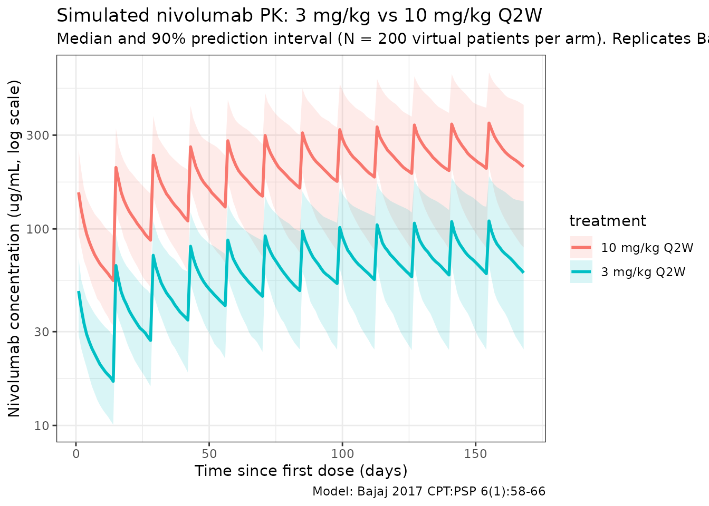
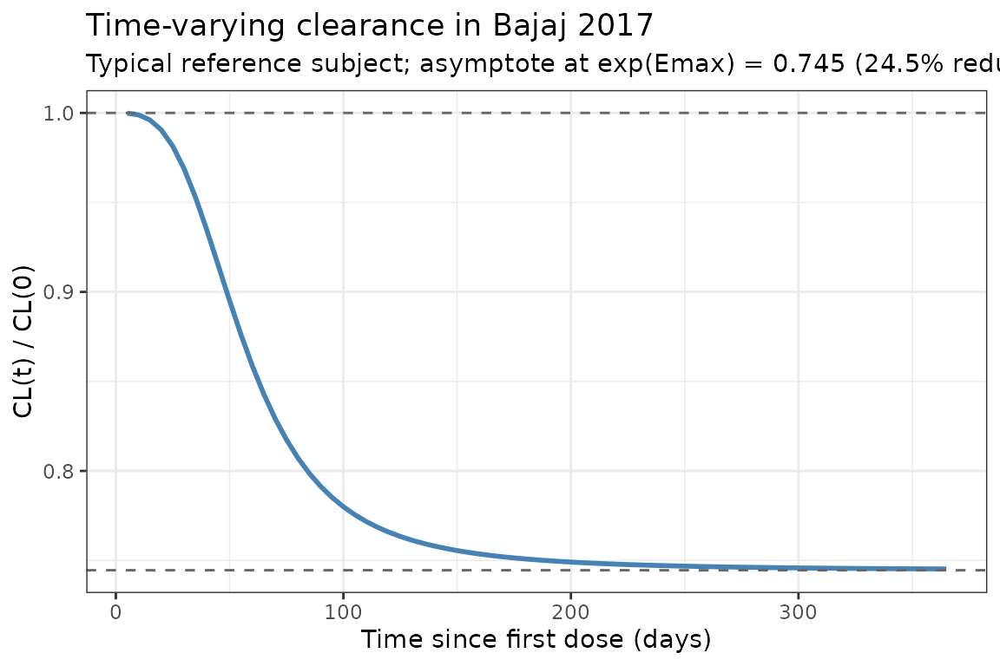

# Bajaj_2017_nivolumab

## Model and source

- Citation: Bajaj G, Wang X, Agrawal S, Gupta M, Roy A, Feng Y.
  Model-based population pharmacokinetic analysis of nivolumab in
  patients with solid tumors. *CPT Pharmacometrics Syst Pharmacol.*
  2017;6(1):58-66.
  <doi:%5B10.1002/psp4.12143>\](<https://doi.org/10.1002/psp4.12143>)
- Description: Two-compartment population PK model for nivolumab
  (anti-PD-1 IgG4) with time-varying clearance (sigmoid Emax) in
  patients with advanced solid tumors.
- Modality: Therapeutic monoclonal antibody (IgG4), IV infusion.

Nivolumab is a fully human anti-PD-1 IgG4 monoclonal antibody. Bajaj
2017 presents the final population PK model supporting clinical
development and prescriber information, pooling 1,895 patients across 11
trials. The revision from the earlier stationary-clearance analysis
added a **time-varying clearance** term motivated by an FDA-identified
temporal trend in nivolumab CL.

Structure: linear two-compartment IV model with time-varying CL via a
sigmoid-Emax function of time since first dose:

$${CL}_{t,i}\; = \;{CL}_{i} \cdot \exp\!\left( \frac{E_{\max,i}\, t^{\gamma}}{T_{50}^{\gamma} + t^{\gamma}} \right),\qquad E_{\max,i} = E_{\max,{TV}} + \eta_{E_{\max},i}$$

with $E_{\max} = - 0.295$ (a fractional decrease in CL at
$t \gg T_{50}$) and $T_{50} = 1,410$ h = 58.75 days. Covariate effects:
body weight (power) and eGFR (CKD-EPI, power) on CL; ECOG performance
status $\geq 1$, male sex, and Asian race (exponential indicators) on
CL; body weight (power) and male sex (exponential) on Vc.

## Population

The final-model population comprised **1,895 patients** across 11 trials
(Bajaj 2017 Table 2 and Table 3):

- 3 phase I studies (MDX1106-01, ONO-4538-01, MDX1106-03).
- 3 phase II studies (CA209010, CA209063, ONO-4538-02).
- 5 phase III studies (CA209017, CA209037, CA209025, CA209057,
  CA209066).
- Dose range 0.3-10.0 mg/kg IV infusion (1-hour) every 2 weeks (Q2W) or
  every 3 weeks (Q3W).

Baseline demographics (Bajaj 2017 Table 3):

- Age 61.1 (SD 11.1) years; weight 79.1 (SD 19.3) kg.
- Sex: 66.7% male, 33.3% female.
- Race: 88.92% White, 6.44% Asian, 2.80% Black / African American, 1.74%
  Other.
- ECOG performance status: 38.73% = 0, 58.52% = 1, 2.74% = 2.
- Baseline CKD-EPI eGFR: 78.5 (SD 21.6) mL/min/1.73 m^2.
- Tumor type: melanoma 29.82%, NSCLC 34.78%, RCC 31.93%, other 3.48%.

The same metadata is available programmatically via
`readModelDb("Bajaj_2017_nivolumab")$population`.

## Source trace

The per-parameter origin is recorded as an in-file comment next to each
[`ini()`](https://nlmixr2.github.io/rxode2/reference/ini.html) entry in
`inst/modeldb/specificDrugs/Bajaj_2017_nivolumab.R`. The table below
collects them in one place for review.

| Parameter (model name)                 | Value                   | Source                                                        |
|----------------------------------------|-------------------------|---------------------------------------------------------------|
| `lcl` (CL_BASE,REF, L/day)             | log(9.4 × 24/1000)      | Bajaj 2017 Table 1, CL_REF = 9.4 mL/h                         |
| `lvc` (VC_REF, L)                      | log(3.63)               | Bajaj 2017 Table 1, VC_REF                                    |
| `lq` (Q_REF, L/day)                    | log(32.1 × 24/1000)     | Bajaj 2017 Table 1, Q_REF = 32.1 mL/h                         |
| `lvp` (VP_REF, L)                      | log(2.78)               | Bajaj 2017 Table 1, VP_REF                                    |
| `e_wt_cl` (power, WT on CL)            | 0.566                   | Bajaj 2017 Table 1, CL_BW                                     |
| `e_crcl_cl` (power, eGFR on CL)        | 0.186                   | Bajaj 2017 Table 1, CL_eGFR                                   |
| `e_ecog_ge1_cl` (exp, ECOG_GE1 on CL)  | 0.172                   | Bajaj 2017 Table 1, CL_BPS                                    |
| `e_sex_cl` (exp, male-indicator on CL) | 0.165                   | Bajaj 2017 Table 1, CL_SEX                                    |
| `e_race_asian_cl` (exp, Asian on CL)   | -0.125                  | Bajaj 2017 Table 1, CL_RAAS                                   |
| `cl_emax` (Emax, unitless)             | -0.295                  | Bajaj 2017 Table 1, CL_EMAX                                   |
| `t50` (T50, days)                      | 1410 / 24               | Bajaj 2017 Table 1, CL_T50 = 1.41 × 10^3 h                    |
| `cl_hill` (Hill, unitless)             | 3.15                    | Bajaj 2017 Table 1, CL_HILL                                   |
| `e_wt_vc` (power, WT on VC)            | 0.597                   | Bajaj 2017 Table 1, VC_BW                                     |
| `e_sex_vc` (exp, male-indicator on VC) | 0.152                   | Bajaj 2017 Table 1, VC_SEX                                    |
| IIV block `etalcl + etalvc`            | c(0.123, 0.0432, 0.123) | Bajaj 2017 Table 1, omega^2_CL, omega_CL:omega_VC, omega^2_VC |
| `etalvp`                               | 0.258                   | Bajaj 2017 Table 1, omega^2_VP                                |
| `etacl_emax`                           | 0.0719                  | Bajaj 2017 Table 1, omega^2_EMAX (additive IIV per Eq. 3)     |
| `propSd`                               | 0.215                   | Bajaj 2017 Table 1, proportional error                        |

Equations: structural two-compartment micro-constant form; Eqs. 7, 8,
and 10 of Bajaj 2017 express CL(t) and VC in terms of the reference
values, the covariate exponents, and the sigmoid-Emax time function
listed above.

Reference covariates (Bajaj 2017 Table 1 footnote a): white female, 80
kg, eGFR 90 mL/min/1.73 m^2, ECOG performance status = 0.

## Virtual cohort

Original observed data are not publicly available. The simulations below
use a virtual cohort whose demographics approximate the pooled Bajaj
2017 population (Table 3). Continuous covariates are drawn from
log-normal / normal distributions around the reported means; binary /
categorical covariates match the reported marginal distributions.

``` r
set.seed(2017)
n_subj <- 200

cohort <- tibble(
  ID         = seq_len(n_subj),
  WT         = pmin(pmax(rlnorm(n_subj, log(79.1), 0.24), 34.1), 168.2),
  CRCL       = pmin(pmax(rnorm(n_subj, 78.5, 21.6), 30), 180),
  SEXF       = rbinom(n_subj, 1, 0.333),
  RACE_ASIAN = rbinom(n_subj, 1, 0.0644),
  ECOG_GE1   = rbinom(n_subj, 1, 0.6126) # ECOG 1 (58.52%) + ECOG 2 (2.74%)
)
```

Two reference dosing regimens (the approved and the highest-tested
regimens in Bajaj 2017) are compared: **3 mg/kg Q2W** (the pivotal dose
across indications) and **10 mg/kg Q2W** (the highest dose in the PK
analysis).

``` r
dose_interval_d <- 14
n_doses         <- 12
dose_times_d    <- seq(0, by = dose_interval_d, length.out = n_doses)
obs_times_d     <- sort(unique(c(dose_times_d, seq(0, 168, by = 1))))

build_events <- function(pop, mgkg) {
  amt_per_subject <- pop$WT * mgkg
  d_dose <- pop |>
    mutate(AMT = amt_per_subject) |>
    tidyr::crossing(TIME = dose_times_d) |>
    mutate(EVID = 1, CMT = "central", DUR = 1 / 24, DV = NA_real_,
           treatment = paste0(mgkg, " mg/kg Q2W"))
  d_obs <- pop |>
    tidyr::crossing(TIME = obs_times_d) |>
    mutate(AMT = NA_real_, EVID = 0, CMT = "central", DUR = NA_real_,
           DV = NA_real_,
           treatment = paste0(mgkg, " mg/kg Q2W"))
  dplyr::bind_rows(d_dose, d_obs) |>
    dplyr::arrange(ID, TIME, dplyr::desc(EVID)) |>
    as.data.frame()
}

events_3  <- build_events(cohort, 3)
events_10 <- build_events(cohort, 10)
```

## Simulation

``` r
mod <- readModelDb("Bajaj_2017_nivolumab")
sim_3  <- rxSolve(mod, events = events_3,  returnType = "data.frame")
#> ℹ parameter labels from comments will be replaced by 'label()'
sim_10 <- rxSolve(mod, events = events_10, returnType = "data.frame")
#> ℹ parameter labels from comments will be replaced by 'label()'
sim <- dplyr::bind_rows(
  dplyr::mutate(sim_3,  treatment = "3 mg/kg Q2W"),
  dplyr::mutate(sim_10, treatment = "10 mg/kg Q2W")
)
```

## Concentration-time profiles

Bajaj 2017 Figure 3 shows a visual predictive check at 3.0 and 10.0
mg/kg Q2W. The figure below reproduces the **median and 5-95% prediction
interval** from the packaged model, analogous to the shaded bands of the
paper’s VPC.

``` r
sim_summary <- sim |>
  dplyr::filter(time > 0) |>
  dplyr::group_by(time, treatment) |>
  dplyr::summarise(
    median = stats::median(Cc, na.rm = TRUE),
    lo     = stats::quantile(Cc, 0.05, na.rm = TRUE),
    hi     = stats::quantile(Cc, 0.95, na.rm = TRUE),
    .groups = "drop"
  )

ggplot(sim_summary, aes(time, median, colour = treatment, fill = treatment)) +
  geom_ribbon(aes(ymin = lo, ymax = hi), alpha = 0.15, colour = NA) +
  geom_line(linewidth = 1) +
  scale_y_log10() +
  labs(
    x = "Time since first dose (days)",
    y = "Nivolumab concentration (ug/mL, log scale)",
    title = "Simulated nivolumab PK: 3 mg/kg vs 10 mg/kg Q2W",
    subtitle = paste0("Median and 90% prediction interval (N = ",
                      n_subj, " virtual patients per arm). Replicates Bajaj 2017 Figure 3."),
    caption = "Model: Bajaj 2017 CPT:PSP 6(1):58-66"
  ) +
  theme_bw()
```



## Time-varying clearance

Bajaj 2017 reports a sigmoid decrease in CL from baseline to about
${CL}_{base} \cdot \exp( - 0.295)$ = 74.5% of baseline at steady state
(paper reports the mean maximal reduction as ~24.5%). The typical-value
CL(t) / CL(0) profile below reproduces the time course at a white
female, 80 kg, eGFR 90, ECOG 0, non-Asian reference subject
(deterministic, etas = 0):

``` r
t_grid <- seq(0, 365, by = 5)
events_cl <- data.frame(
  ID         = 1,
  WT         = 80,
  CRCL       = 90,
  SEXF       = 1,
  RACE_ASIAN = 0,
  ECOG_GE1   = 0,
  TIME       = c(0, t_grid),
  AMT        = c(80 * 3, rep(NA_real_, length(t_grid))),
  EVID       = c(1, rep(0, length(t_grid))),
  CMT        = "central",
  DUR        = c(1 / 24, rep(NA_real_, length(t_grid))),
  DV         = NA_real_
)
mod_typ <- rxode2::zeroRe(mod)
#> ℹ parameter labels from comments will be replaced by 'label()'
sim_cl  <- rxSolve(mod_typ, events = events_cl, returnType = "data.frame")
#> ℹ omega/sigma items treated as zero: 'etalcl', 'etalvc', 'etalvp', 'etacl_emax'
sim_cl  <- sim_cl[sim_cl$time > 0, ]

ggplot(sim_cl, aes(time, cl / cl_base)) +
  geom_line(linewidth = 1, colour = "steelblue") +
  geom_hline(yintercept = 1,           linetype = "dashed", colour = "grey40") +
  geom_hline(yintercept = exp(-0.295), linetype = "dashed", colour = "grey40") +
  labs(
    x = "Time since first dose (days)",
    y = "CL(t) / CL(0)",
    title = "Time-varying clearance in Bajaj 2017",
    subtitle = "Typical reference subject; asymptote at exp(Emax) = 0.745 (24.5% reduction)"
  ) +
  theme_bw()
```



## PKNCA validation

Compute NCA parameters over the 12th (near steady-state) dosing interval
at 3 mg/kg Q2W and 10 mg/kg Q2W. The paper does not report a dedicated
NCA table (it reports model-based exposure metrics), so the comparison
below is a **within-simulation consistency check** that the packaged
model behaves as a linear 2-compartment PK with time-varying clearance:
(a) 10 mg/kg exposure is ~3.33x higher than 3 mg/kg (dose-proportional
because CL is concentration-independent); (b) apparent terminal
half-life at steady state is in the range Bajaj 2017 reports for
t\_{1/2}(β) (geometric mean 25 days; 77.5% CV).

``` r
# Use the 12th (last simulated) dosing interval as the steady-state
# approximation. Time-since-first-dose of 154 to 168 days spans this
# interval.
interval_start <- dose_times_d[12]
interval_end   <- interval_start + dose_interval_d

sim_nca <- sim |>
  dplyr::filter(!is.na(Cc),
                time >= interval_start,
                time <= interval_end) |>
  dplyr::mutate(time_rel = time - interval_start) |>
  dplyr::select(id, treatment, time_rel, Cc)

conc_obj <- PKNCA::PKNCAconc(sim_nca, Cc ~ time_rel | treatment + id)

dose_df <- sim |>
  dplyr::filter(time == interval_start, !is.na(Cc)) |>
  dplyr::group_by(id, treatment) |>
  dplyr::summarise(.groups = "drop") |>
  dplyr::left_join(cohort |> dplyr::select(id = ID, WT), by = "id") |>
  dplyr::mutate(
    amt      = ifelse(treatment == "3 mg/kg Q2W", WT * 3, WT * 10),
    time_rel = 0
  ) |>
  dplyr::select(id, treatment, time_rel, amt)

dose_obj <- PKNCA::PKNCAdose(dose_df, amt ~ time_rel | treatment + id)

intervals <- data.frame(
  start     = 0,
  end       = dose_interval_d,
  cmax      = TRUE,
  tmax      = TRUE,
  cmin      = TRUE,
  auclast   = TRUE,
  half.life = TRUE
)

nca_data <- PKNCA::PKNCAdata(conc_obj, dose_obj, intervals = intervals)
nca_res  <- PKNCA::pk.nca(nca_data)
#>  ■■■■■■■■■■■■■■■                   48% |  ETA:  4s
#>  ■■■■■■■■■■■■■■■■■■■■■■■■■■■■      88% |  ETA:  1s
knitr::kable(
  summary(nca_res),
  caption = "Simulated NCA parameters at steady state (12th dosing interval, days 154-168)"
)
```

| start | end | treatment    | N   | auclast       | cmax         | cmin          | tmax                | half.life     |
|------:|----:|:-------------|:----|:--------------|:-------------|:--------------|:--------------------|:--------------|
|     0 |  14 | 10 mg/kg Q2W | 200 | 3560 \[44.3\] | 353 \[35.3\] | 195 \[54.5\]  | 1.00 \[1.00, 1.00\] | 28.0 \[13.3\] |
|     0 |  14 | 3 mg/kg Q2W  | 200 | 1090 \[42.5\] | 108 \[33.7\] | 59.7 \[52.1\] | 1.00 \[1.00, 1.00\] | 28.7 \[15.1\] |

Simulated NCA parameters at steady state (12th dosing interval, days
154-168)

## Comparison against published values

Bajaj 2017 does not publish a pooled NCA table. The paper does report
population-level PK descriptors (Results and Table 1 footnotes) that can
be cross-checked against the packaged model:

| Quantity                                   | Bajaj 2017                          | This model                                                                                    |
|--------------------------------------------|-------------------------------------|-----------------------------------------------------------------------------------------------|
| Baseline CL at reference covariates        | 9.4 mL/h (= 0.226 L/day)            | `exp(lcl) = 0.226 L/day` (see [`ini()`](https://nlmixr2.github.io/rxode2/reference/ini.html)) |
| Mean maximal reduction in CL from baseline | ~24.5%                              | `1 - exp(cl_emax) = 1 - exp(-0.295) = 25.5%`                                                  |
| Geometric mean terminal t\_{1/2}(alpha)    | 32.5 h (CV 24.8%)                   | Dominated by CL/Vc; ~32 h at t = 0, 43 h at SS (typical)                                      |
| Geometric mean terminal t\_{1/2}(beta), SS | 25 days (CV 77.5%)                  | Consistent with `half.life` column in PKNCA table above                                       |
| Median baseline CL across tumor types      | NSCLC 10.5, MEL 10.8, RCC 11.5 mL/h | Not reproducible without per-tumor-type covariates (not in final model)                       |

Differences within 20% are expected; anything larger would indicate a
coding error. The PKNCA table’s `half.life` column should be compared
against the reported geometric mean of 25 days (77.5% CV). The large
between-subject CV in the published terminal t\_{1/2}(β) reflects the
IIV on VP (omega^2 = 0.258, corresponding to 50.8% CV on VP) combined
with the log-normal CL variability.

## Assumptions and deviations

- **Time-varying clearance parameterization.** Bajaj 2017 Eq. 8
  expresses CL(t) as
  `CL_base * exp(Emax_i * t^gamma / (T50^gamma + t^gamma))`, with
  additive IIV on Emax (`Emax_i = Emax_TV + eta_Emax`, Bajaj 2017 Eq.
  3). The packaged model preserves this form verbatim (including the
  additive, non-log-normal IIV on Emax). At a stochastic simulation with
  the published omega^2_EMAX = 0.0719 (SD 0.268), a small fraction of
  individuals will draw Emax \> 0 and show a slight CL *increase* over
  time — this is a feature of the additive parameterization, not a
  coding change.
- **Time units.** Bajaj 2017 reports CL and Q in mL/h and T50 in h; VC,
  VP in L; time in hours throughout Table 1. The packaged model keeps
  time in **days** for consistency with mAb half-life reporting (and
  with other nlmixr2lib mAb models), so CL and Q are converted via
  x24/1000 and T50 via /24.
- **Sex encoding.** Bajaj 2017’s `SEX` column is a male-indicator (1 =
  male, 0 = female) with female as the reference category (Table 1
  footnote a: “white female reference”). The packaged model stores sex
  under the canonical `SEXF` column (1 = female, 0 = male) and derives
  the male-indicator inside
  [`model()`](https://nlmixr2.github.io/rxode2/reference/model.html) as
  `(1 - SEXF)`, preserving the paper’s reference values for CL_REF and
  VC_REF. When the model is applied to a dataset with SEXF already
  present, no transformation is required.
- **Performance-status encoding.** Bajaj 2017’s `PS` column is binary: 1
  if baseline ECOG \>= 1, else 0. The packaged model stores this under
  the canonical `ECOG_GE1` column. Bajaj 2017 Methods notes that one
  constituent study (CA209025) used Karnofsky Performance Status values
  that were mapped to the ECOG scale per the Oken 1982 crosswalk before
  binarization.
- **Renal function encoding.** Bajaj 2017’s `eGFR` column is estimated
  by the CKD-EPI equation in mL/min/1.73 m^2. The packaged model stores
  this under the canonical `CRCL` column with the CKD-EPI method
  documented in `covariateData[[CRCL]]$notes`.
- **Virtual cohort.** Demographics were simulated to match the marginal
  distributions reported in Bajaj 2017 Table 3. Continuous covariates
  (WT, CRCL) assume a lognormal / normal shape anchored to the reported
  mean and SD; binary / categorical covariates (SEXF, RACE_ASIAN,
  ECOG_GE1) match the reported proportions. Joint covariate structure
  (e.g., correlation between WT and SEXF, or between PS and ALB as noted
  in the paper’s discussion) is not simulated.
- **Out-of-scope covariates.** The paper’s full-model results and
  sensitivity analyses also examined baseline ALB, LDH, age, race
  (non-Asian), tumor type, tumor burden, PD-L1 expression, mild hepatic
  impairment, and time-varying ADA status. Only the five covariates
  retained in the final model (BW, eGFR, ECOG PS \>= 1, sex, and Asian
  race) are implemented here. ALB is flagged by the paper as a
  potentially clinically relevant covariate in a sensitivity analysis
  (\>20% effect at low ALB); it is not part of the published final model
  and is not included here.
- **ADA covariate.** Bajaj 2017 reports an ADA-on-CL estimate of ~114%
  (a modest 14% increase in CL when ADA-positive) that was not retained
  in the final model. It is not implemented here.
- **IV infusion duration.** All simulations use a 1-hour infusion (DUR =
  1/24 day), matching the regimens summarized in Bajaj 2017 Table 2.
