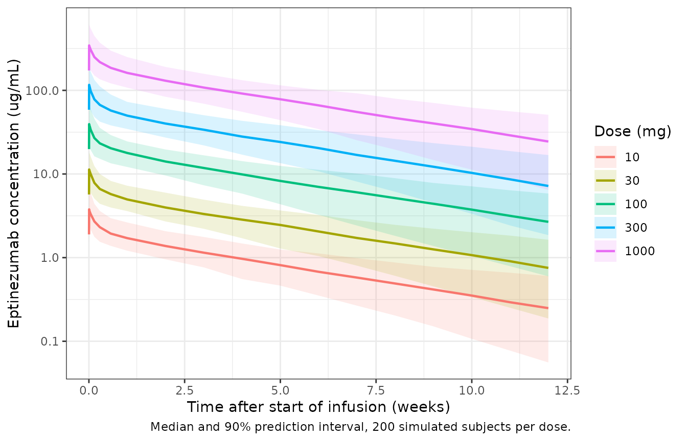

# Eptinezumab (Baker 2020)

``` r

library(nlmixr2lib)
library(rxode2)
#> rxode2 5.1.8 using 2 threads (see ?getRxThreads)
#>   no cache: create with `rxCreateCache()`
library(dplyr)
#> 
#> Attaching package: 'dplyr'
#> The following objects are masked from 'package:stats':
#> 
#>     filter, lag
#> The following objects are masked from 'package:base':
#> 
#>     intersect, setdiff, setequal, union
library(tidyr)
library(ggplot2)
library(PKNCA)
#> 
#> Attaching package: 'PKNCA'
#> The following object is masked from 'package:stats':
#> 
#>     filter
```

## Eptinezumab population PK model

Eptinezumab is a humanized IgG1 monoclonal antibody that binds both the
alpha and beta forms of calcitonin gene-related peptide (CGRP). It is
given as an intravenous infusion every 12 weeks for the prevention of
episodic and chronic migraine. Baker et al. (2020) pooled eight studies
(2123 healthy participants and patients, IV doses 1-1000 mg) and
described the free-eptinezumab plasma concentrations with a
two-compartment model with linear elimination, fitted in Phoenix NLME
8.0 (FOCE-ELS).

The journal article reports the typical clearance (0.00620 L/h) and
central volume (3.64 L), the between-subject variability on both, the
additive residual error, the alpha and beta half-lives (0.93 and 27
days) and the list of retained covariates, but not the covariate
coefficients, the peripheral parameters or the proportional residual
error. Those come from the sponsor’s parameter table (report
ALD403-088-PK Table 7), which is reproduced as Table 12 of the FDA
Clinical Pharmacology Review of BLA 761119 (Vyepti). The EMA assessment
report (EMA/9446/2022) Table 6 gives the stepwise covariate build, which
shows how many parameters each weight effect used.

- Article: [Pharmacol Res Perspect
  2020;8(2):e00567](https://doi.org/10.1002/prp2.567)
- FDA review: [BLA 761119 Clinical Pharmacology
  Review](https://www.accessdata.fda.gov/drugsatfda_docs/nda/2020/761119Orig1s000ClinPharmR.pdf)
- EMA assessment report: [Vyepti
  EPAR](https://www.ema.europa.eu/en/documents/assessment-report/vyepti-epar-public-assessment-report_en.pdf)

### Population

From Baker 2020 section 3.1 and Table 1: 2123 participants from studies
CLIN-001, -002, -005, -006, -010, -011, -012 and -013 received
eptinezumab. They were mostly female (83.8%), white (88.5%) and
ADA-negative at baseline (83.8%), with median age 39.0 years (18-71) and
median body weight 74.2 kg (39.2-190). Renal function was normal in
55.3%, mildly decreased in 41.9% and moderately decreased in 2.7%. The
FDA review (section 4.3.1) gives the disease split: 83 healthy
participants, 727 with episodic migraine (EM) and 1313 with chronic
migraine (CM), contributing 15135 quantifiable concentrations. Mean
baseline monthly migraine days (MMD) were 16.5 (CLIN-005, CM), 8.7
(CLIN-006, EM) and 16.1 (CLIN-011, CM).

The same information is recorded in the model file’s `population`
metadata.

### Source trace

| Element | Source location | Value / form |
|----|----|----|
| Structure | Baker 2020 section 3.2; FDA review section 4.3.1 | 2-compartment, IV infusion, linear elimination |
| CL | Baker 2020 section 3.2; FDA review Table 12 | 0.00620 L/h |
| Vc | FDA review Table 12 (Baker 2020 section 3.2: 3.64 L) | 3.636 L |
| Q (CLp) | FDA review Table 12 | 0.039 L/h |
| Vp (‘Vd’) | FDA review Table 12 and its footnote | 2.012 L |
| WT on CL and Q | FDA review Table 12; EMA report Table 6 step 1 | (WT/70)^0.709, one shared exponent |
| WT on Vc and Vp | FDA review Table 12; EMA report Table 6 step 2 | (WT/70)^0.544, one shared exponent |
| EM, CM on CL | FDA review Table 12 | exp(-0.231), exp(-0.272) |
| Baseline MMD on CL | FDA review Table 12 | (MDBASE/13.0)^0.044 |
| Capped CrCl on CL | FDA review Table 12 and footnote | (min(CrCl, 150)/118)^0.162 |
| EM, CM on Vc | FDA review Table 12 | exp(-0.311), exp(-0.422) |
| Male on Vc | FDA review Table 12 | exp(0.091) |
| BSV CL, Vc | Baker 2020 section 3.2; FDA review Table 12 | 29.0%, 31.0% CV; omega = log(CV^2 + 1) (Table 12 Note 1) |
| BSV Q, Vp | FDA review Table 12 | 111.3%, 34.8% CV |
| CLp-Vp correlation | EMA report Table 6 footnote a | estimated, value not printed; set to 0 |
| Residual error form | Baker 2020 section 2.2.1 equation | C = f (1 + eps_p) + eps_a |
| Additive error | Baker 2020 section 3.2; FDA review Table 12 | 37.5 ng/mL = 0.0375 ug/mL |
| Proportional error | FDA review Table 12; EMA report | 25.2% |
| Alpha, beta half-life | Baker 2020 section 3.2 | 0.93 and 27 days (used as a check) |
| Covariate forest plot | Baker 2020 Figure 4 | AUCtau,ss ratios (used as a check) |
| Single-dose exposure | Baker 2020 Table 2 | AUC0-12wk, Cmax, Cavg, Ctrough by dose |
| Accumulation | Baker 2020 Table 3 | Rac(AUC) 1.13-1.15, Rac(Cmax) 1.08-1.10 |

### Typical-value checks

#### Alpha and beta half-lives

The paper’s half-lives were not used to build the model, so recovering
them from the Table 12 disposition parameters is an independent check
that Q and Vp were read correctly. This is a closed-form calculation on
the reference subject.

``` r

mod <- readModelDb("Baker_2020_eptinezumab")
ini_df <- rxode2::rxode2(mod)$iniDf
#> ℹ parameter labels from comments will be replaced by 'label()'
th <- setNames(ini_df$est, ini_df$name)
cl <- exp(th[["lcl"]])
vc <- exp(th[["lvc"]])
q <- exp(th[["lq"]])
vp <- exp(th[["lvp"]])
k10 <- cl / vc
k12 <- q / vc
k21 <- q / vp
s <- k10 + k12 + k21
p <- k10 * k21
lambda <- c((s + sqrt(s^2 - 4 * p)) / 2, (s - sqrt(s^2 - 4 * p)) / 2)
thalf_day <- log(2) / lambda / 24
hl <- data.frame(
  Phase = c("alpha", "beta"),
  Model = signif(thalf_day, 3),
  Published = c(0.93, 27)
)
knitr::kable(hl, caption = "Half-lives (days), reference subject vs Baker 2020 section 3.2.")
```

| Phase | Model | Published |
|:------|------:|----------:|
| alpha |  0.94 |      0.93 |
| beta  | 26.90 |     27.00 |

Half-lives (days), reference subject vs Baker 2020 section 3.2. {.table}

``` r

stopifnot(
  abs(thalf_day[1] - 0.93) < 0.02,
  abs(thalf_day[2] - 27) < 0.5
)
```

#### Figure 4: covariate effects on steady-state exposure

Figure 4 reports the ratio of steady-state AUC over a 12-week dosing
interval for each covariate value against a typical healthy female, 70
kg, capped CrCl 118 mL/min and baseline MMD 13 days. At steady state
AUCtau = dose / CL, so the ratios depend only on the clearance terms.
They are computed below from the individual `cl` the model returns for
typical subjects (no random effects), so the comparison is exact up to
the rounding of the published values.

``` r

mod_typ <- rxode2::zeroRe(mod)
#> ℹ parameter labels from comments will be replaced by 'label()'
ref <- data.frame(
  WT = 70, CRCL = 118, MIGRAINE_DAYS_BL = 13, SEXF = 1,
  DIS_MIGRAINE_EPISODIC = 0, DIS_MIGRAINE_CHRONIC = 0
)
forest <- tribble(
  ~panel, ~level, ~column, ~value, ~published,
  "Body weight", "190 kg", "WT", 190, 0.49,
  "Body weight", "88 kg", "WT", 88, 0.85,
  "Body weight", "74 kg", "WT", 74, 0.96,
  "Body weight", "63 kg", "WT", 63, 1.08,
  "Body weight", "39 kg", "WT", 39, 1.51,
  "CLcr_cap", "150 mL/min", "CRCL", 150, 0.96,
  "CLcr_cap", "146 mL/min", "CRCL", 146, 0.96,
  "CLcr_cap", "96 mL/min", "CRCL", 96, 1.03,
  "CLcr_cap", "45 mL/min", "CRCL", 45, 1.18,
  "MMD", "28", "MIGRAINE_DAYS_BL", 28, 0.97,
  "MMD", "18", "MIGRAINE_DAYS_BL", 18, 0.99,
  "MMD", "9", "MIGRAINE_DAYS_BL", 9, 1.01,
  "MMD", "4", "MIGRAINE_DAYS_BL", 4, 1.05,
  "Disease", "EM", "DIS_MIGRAINE_EPISODIC", 1, 1.32,
  "Disease", "CM", "DIS_MIGRAINE_CHRONIC", 1, 1.27
)
subj <- ref[rep(1, nrow(forest) + 1), ]
subj$id <- seq_len(nrow(subj))
for (i in seq_len(nrow(forest))) {
  subj[[forest$column[i]]][i + 1] <- forest$value[i]
}
ev_forest <- subj |>
  mutate(time = 0, amt = 100, rate = 100, evid = 1, cmt = "central") |>
  bind_rows(subj |> mutate(time = 1, amt = NA_real_, rate = NA_real_, evid = 0, cmt = "central"))
sim_forest <- rxSolve(mod_typ, ev_forest, returnType = "data.frame") |>
  distinct(id, cl)
#> ℹ omega/sigma items treated as zero: 'etalcl', 'etalvc', 'etalq', 'etalvp'
#> Warning: multi-subject simulation without without 'omega'
cl_ref <- sim_forest$cl[sim_forest$id == 1]
forest$model <- cl_ref / sim_forest$cl[match(seq_len(nrow(forest)) + 1, sim_forest$id)]
forest |>
  mutate(model = round(model, 3)) |>
  select(panel, level, published, model) |>
  dplyr::rename(
    "Covariate" = panel, "Value" = level,
    "Published ratio" = published, "Model ratio" = model
  ) |>
  knitr::kable(caption = "AUCtau,ss ratio relative to the reference subject. Replicates Figure 4 of Baker 2020.")
```

| Covariate   | Value      | Published ratio | Model ratio |
|:------------|:-----------|----------------:|------------:|
| Body weight | 190 kg     |            0.49 |       0.493 |
| Body weight | 88 kg      |            0.85 |       0.850 |
| Body weight | 74 kg      |            0.96 |       0.961 |
| Body weight | 63 kg      |            1.08 |       1.078 |
| Body weight | 39 kg      |            1.51 |       1.514 |
| CLcr_cap    | 150 mL/min |            0.96 |       0.962 |
| CLcr_cap    | 146 mL/min |            0.96 |       0.966 |
| CLcr_cap    | 96 mL/min  |            1.03 |       1.034 |
| CLcr_cap    | 45 mL/min  |            1.18 |       1.169 |
| MMD         | 28         |            0.97 |       0.967 |
| MMD         | 18         |            0.99 |       0.986 |
| MMD         | 9          |            1.01 |       1.016 |
| MMD         | 4          |            1.05 |       1.053 |
| Disease     | EM         |            1.32 |       1.260 |
| Disease     | CM         |            1.27 |       1.313 |

AUCtau,ss ratio relative to the reference subject. Replicates Figure 4
of Baker 2020. {.table}

``` r


# Weight, CrCl and MMD: the only difference is rounding of the published value.
cont <- forest$panel != "Disease"
stopifnot(all(abs(forest$model[cont] - forest$published[cont]) < 0.015))
```

The weight, CrCl and MMD ratios reproduce Figure 4 to its printed
precision. The two disease-state ratios do not: the parameter table
gives exp(0.231) = 1.26 for EM and exp(0.272) = 1.31 for CM, while
Figure 4 (and the FDA and EMA text that quotes it) prints 1.32 for EM
and 1.27 for CM. The values match once the two labels are swapped, so
either the figure or the table has EM and CM transposed. No other
published number separates the two readings. The model follows the
parameter table, and the practical difference is 4% in CL between the
two migraine groups.

``` r

dis <- forest[!cont, ]
stopifnot(
  # table-coded EM matches the figure's CM value and vice versa
  abs(dis$model[dis$level == "EM"] - dis$published[dis$level == "CM"]) < 0.015,
  abs(dis$model[dis$level == "CM"] - dis$published[dis$level == "EM"]) < 0.015
)
```

### Virtual cohort

Table 2 of Baker 2020 summarises single-dose exposure by dose across all
studies, so the disease mix of each dose arm follows Table 1 (for
example, the 10 mg arm is almost entirely the CM study CLIN-005 and the
1000 mg arm mostly the frequent-EM study CLIN-002). The paper gives only
the median and range of body weight, so weight is drawn log-normally
around 74.2 kg and clipped to 39-190 kg. Creatinine clearance, baseline
MMD by disease and the 83.8% female fraction are also assumed
distributions (see Assumptions). Each arm has 200 subjects; every
infusion lasts 1 hour.

``` r

set.seed(2020)
rxode2::rxSetSeed(2020)
n_arm <- 200
arms <- tribble(
  ~dose, ~n_hv, ~n_em, ~n_cm,
  10, 5, 0, 125,
  30, 6, 211, 119,
  100, 36, 216, 475,
  300, 20, 219, 594,
  1000, 6, 81, 0
)
make_arm <- function(dose, n_hv, n_em, n_cm, offset) {
  dis <- sample(c("HV", "EM", "CM"), n_arm, replace = TRUE, prob = c(n_hv, n_em, n_cm))
  tibble(
    id = offset + seq_len(n_arm),
    dose_mg = dose,
    disease = dis,
    WT = pmin(pmax(exp(rnorm(n_arm, log(74.2), 0.2)), 39), 190),
    CRCL = pmin(pmax(rnorm(n_arm, 118, 25), 30), 200),
    SEXF = rbinom(n_arm, 1, 0.838),
    DIS_MIGRAINE_EPISODIC = as.integer(dis == "EM"),
    DIS_MIGRAINE_CHRONIC = as.integer(dis == "CM"),
    MIGRAINE_DAYS_BL = case_when(
      dis == "EM" ~ pmin(pmax(rnorm(n_arm, 8.7, 2.5), 4), 14),
      dis == "CM" ~ pmin(pmax(rnorm(n_arm, 16.3, 4), 8), 28),
      TRUE ~ 13
    )
  )
}
cohort <- bind_rows(lapply(seq_len(nrow(arms)), function(i) {
  make_arm(arms$dose[i], arms$n_hv[i], arms$n_em[i], arms$n_cm[i], (i - 1) * n_arm)
}))
count(cohort, dose_mg, disease) |>
  pivot_wider(names_from = disease, values_from = n, values_fill = 0) |>
  knitr::kable(caption = "Simulated subjects by dose and disease state.")
```

| dose_mg |  CM |  HV |  EM |
|--------:|----:|----:|----:|
|      10 | 192 |   8 |   0 |
|      30 |  70 |   2 | 128 |
|     100 | 130 |   9 |  61 |
|     300 | 155 |   6 |  39 |
|    1000 |   0 |  13 | 187 |

Simulated subjects by dose and disease state. {.table}

### Simulation

``` r

obs_times <- sort(unique(c(0, 0.5, 1, 2, 4, 8, 24, 48, 96, 168 * (1:12))))
dose_rows <- cohort |>
  mutate(time = 0, amt = dose_mg, rate = dose_mg, evid = 1, cmt = "central")
obs_rows <- cohort |>
  tidyr::crossing(time = obs_times) |>
  mutate(amt = NA_real_, rate = NA_real_, evid = 0, cmt = "central")
events <- bind_rows(dose_rows, obs_rows) |>
  arrange(id, time, desc(evid))

sim <- rxSolve(mod, events, returnType = "data.frame", keep = c("dose_mg", "disease")) |>
  as_tibble()
#> ℹ parameter labels from comments will be replaced by 'label()'
```

``` r

sim |>
  filter(time > 0) |>
  group_by(dose_mg, time) |>
  summarise(
    median = median(Cc), lo = quantile(Cc, 0.05), hi = quantile(Cc, 0.95),
    .groups = "drop"
  ) |>
  ggplot(aes(time / 168, median, colour = factor(dose_mg), fill = factor(dose_mg))) +
  geom_ribbon(aes(ymin = lo, ymax = hi), alpha = 0.15, colour = NA) +
  geom_line(linewidth = 0.8) +
  scale_y_log10() +
  labs(
    x = "Time after start of infusion (weeks)",
    y = "Eptinezumab concentration (ug/mL)",
    colour = "Dose (mg)", fill = "Dose (mg)",
    caption = "Median and 90% prediction interval, 200 simulated subjects per dose."
  ) +
  theme_bw()
```



### PKNCA: single-dose exposure (Table 2)

AUC0-12wk, Cmax and Cavg are computed over 0-2016 h. Ctrough is the
concentration at the end of the 12-week interval, which PKNCA reports as
`clast.obs` because the last sample is at 2016 h. Table 2 reports
arithmetic means, so the simulated values are summarised as means before
the comparison.

``` r

conc <- sim |>
  filter(!is.na(Cc)) |>
  select(id, time, Cc, dose_mg) |>
  mutate(treatment = paste(dose_mg, "mg"))
dose_df <- cohort |>
  transmute(id, time = 0, amt = dose_mg, treatment = paste(dose_mg, "mg"))
conc_obj <- PKNCAconc(conc, Cc ~ time | treatment + id)
dose_obj <- PKNCAdose(dose_df, amt ~ time | treatment + id, route = "intravascular", duration = 1)
intervals <- data.frame(
  start = 0, end = 2016,
  auclast = TRUE, cmax = TRUE, cav = TRUE, clast.obs = TRUE
)
nca <- pk.nca(PKNCAdata(conc_obj, dose_obj, intervals = intervals))

sim_means <- as.data.frame(nca$result) |>
  group_by(treatment, PPTESTCD) |>
  summarise(PPORRES = mean(PPORRES), .groups = "drop")

published <- tribble(
  ~treatment, ~auclast, ~cmax, ~cav, ~clast.obs,
  "10 mg", 2050, 4.32, 1.02, 0.294,
  "30 mg", 5770, 12.4, 2.87, 0.821,
  "100 mg", 17900, 37.3, 8.95, 2.66,
  "300 mg", 54500, 114, 27.2, 8.06,
  "1000 mg", 164000, 348, 81.3, 23.3
)

cmp <- nlmixr2lib::ncaComparisonTable(
  simulated = sim_means,
  reference = published,
  by = "treatment",
  units = c(auclast = "h*ug/mL", cmax = "ug/mL", cav = "ug/mL", clast.obs = "ug/mL"),
  tolerance_pct = 20
)
knitr::kable(cmp, caption = "Simulated vs published (Baker 2020 Table 2) mean single-dose exposure. * differs by >20%.")
```

| NCA parameter      | treatment | Reference | Simulated | % diff |
|:-------------------|:----------|:----------|:----------|:-------|
| Cmax (ug/mL)       | 10 mg     | 4.32      | 4.13      | -4.5%  |
| Cmax (ug/mL)       | 30 mg     | 12.4      | 11.8      | -4.5%  |
| Cmax (ug/mL)       | 100 mg    | 37.3      | 41.6      | +11.4% |
| Cmax (ug/mL)       | 300 mg    | 114       | 121       | +6.3%  |
| Cmax (ug/mL)       | 1000 mg   | 348       | 369       | +6.1%  |
| Clast (ug/mL)      | 10 mg     | 0.294     | 0.272     | -7.3%  |
| Clast (ug/mL)      | 30 mg     | 0.821     | 0.814     | -0.9%  |
| Clast (ug/mL)      | 100 mg    | 2.66      | 2.83      | +6.4%  |
| Clast (ug/mL)      | 300 mg    | 8.06      | 8.23      | +2.1%  |
| Clast (ug/mL)      | 1000 mg   | 23.3      | 26.2      | +12.6% |
| AUClast (h\*ug/mL) | 10 mg     | 2050      | 1780      | -13.2% |
| AUClast (h\*ug/mL) | 30 mg     | 5770      | 5210      | -9.7%  |
| AUClast (h\*ug/mL) | 100 mg    | 17900     | 18200     | +1.6%  |
| AUClast (h\*ug/mL) | 300 mg    | 54500     | 52800     | -3.1%  |
| AUClast (h\*ug/mL) | 1000 mg   | 164000    | 169000    | +3.2%  |
| Cavg (ug/mL)       | 10 mg     | 1.02      | 0.883     | -13.4% |
| Cavg (ug/mL)       | 30 mg     | 2.87      | 2.58      | -10.0% |
| Cavg (ug/mL)       | 100 mg    | 8.95      | 9.02      | +0.8%  |
| Cavg (ug/mL)       | 300 mg    | 27.2      | 26.2      | -3.7%  |
| Cavg (ug/mL)       | 1000 mg   | 81.3      | 84        | +3.3%  |

Simulated vs published (Baker 2020 Table 2) mean single-dose exposure.
\* differs by \>20%. {.table}

``` r

attr(cmp, "footnote")
#> NULL
```

All rows are within 20% of Table 2. The 100 mg Cmax is about 11% high
and the 10 and 30 mg AUC and Cavg about 10-13% low. The simulated arms
approximate each dose group’s study mix and covariate distributions,
which the paper does not tabulate by dose, so differences of this size
are expected.

``` r

pct <- sim_means |>
  inner_join(
    pivot_longer(published, -treatment, names_to = "PPTESTCD", values_to = "ref"),
    by = c("treatment", "PPTESTCD")
  ) |>
  mutate(pct_diff = 100 * (PPORRES - ref) / ref)
stopifnot(
  # Structural: a mis-read clearance, volume or dose unit shifts every row.
  abs(median(pct$pct_diff)) < 10,
  # Envelope, robust to which arm draws the heaviest or lightest subjects.
  quantile(abs(pct$pct_diff), 0.9) < 25
)
```

### Accumulation (Table 3)

Table 3 reports accumulation ratios of about 1.15 for AUCtau and 1.08
for Cmax with dosing every 12 weeks. For a typical subject these follow
from the disposition parameters alone, so the check uses the reference
subject and 100 mg every 2016 h for five doses.

``` r

typ <- ref |> mutate(id = 1)
ev_md <- bind_rows(
  typ |> tidyr::crossing(time = 2016 * 0:4) |>
    mutate(amt = 100, rate = 100, evid = 1, cmt = "central"),
  typ |> tidyr::crossing(time = sort(unique(c(seq(0, 2016 * 5, by = 24), 2016 * 0:4 + 1)))) |>
    mutate(amt = NA_real_, rate = NA_real_, evid = 0, cmt = "central")
) |> arrange(time, desc(evid))
sim_md <- rxSolve(mod_typ, ev_md, returnType = "data.frame")
#> ℹ omega/sigma items treated as zero: 'etalcl', 'etalvc', 'etalq', 'etalvp'
conc_md <- sim_md |> transmute(id = 1, time, Cc)
dose_md <- ev_md |> filter(evid == 1) |> transmute(id, time, amt)
int_md <- data.frame(
  start = c(0, 2016 * 4), end = c(2016, 2016 * 5),
  auclast = TRUE, cmax = TRUE
)
nca_md <- pk.nca(PKNCAdata(
  PKNCAconc(conc_md, Cc ~ time | id),
  PKNCAdose(dose_md, amt ~ time | id, route = "intravascular", duration = 1),
  intervals = int_md
))
res_md <- as.data.frame(nca_md$result)
rac <- res_md |>
  group_by(PPTESTCD) |>
  summarise(Rac = PPORRES[start == 2016 * 4] / PPORRES[start == 0], .groups = "drop")
knitr::kable(rac, digits = 3, caption = "Typical-subject accumulation ratio; Baker 2020 Table 3 means are 1.13-1.15 (AUC) and 1.08-1.10 (Cmax).")
```

| PPTESTCD |   Rac |
|:---------|------:|
| auclast  | 1.126 |
| cmax     | 1.080 |

Typical-subject accumulation ratio; Baker 2020 Table 3 means are
1.13-1.15 (AUC) and 1.08-1.10 (Cmax). {.table}

``` r

stopifnot(
  abs(rac$Rac[rac$PPTESTCD == "auclast"] - 1.14) < 0.03,
  abs(rac$Rac[rac$PPTESTCD == "cmax"] - 1.08) < 0.03
)
```

The typical-subject AUC ratio (1.13) sits at the low end of the Table 3
means (1.13-1.15), which are averages over individuals with
between-subject variability; the Cmax ratio (1.08) matches.

### Exposure-response models not included

Baker 2020 relates the change in monthly migraine days over weeks 1-12
to exposure with a placebo-anchored inhibitory Emax model, E0 + Imax x
AUC/(AUC50 + AUC), fitted separately for EM and CM. Only the EC50 values
(Table 4) are published; E0 and Imax are not given in the article, the
FDA review (Table 13) or the EMA report (Table 14). The logistic
regressions for the 50% and 75% responder rates are published as slopes
only (Figure 7), without intercepts. Neither model can be reproduced, so
the package contains the population PK model only.

### Assumptions and deviations

- **Source of the covariate coefficients.** The journal article names
  the retained covariates but does not print their coefficients, Q, Vp,
  the Q/Vp variability or the proportional error. All of these come from
  the sponsor parameter table reproduced as FDA review Table 12. The
  article’s own values (CL, Vc, BSV on CL and Vc, additive error,
  half-lives) agree with that table.
- **Shared weight exponents.** Table 12 prints the weight term on Q and
  Vp without its own exponent. EMA report Table 6 adds weight on CL and
  Q as one fitted parameter (step 1) and on Vc and Vp as one fitted
  parameter (step 2), so Q uses the CL exponent (0.709) and Vp uses the
  Vc exponent (0.544). The recovered alpha and beta half-lives above
  confirm the reference values.
- **EM/CM labels.** Table 12 and Figure 4 disagree on which migraine
  group has the larger CL effect (see the Figure 4 section). The model
  follows Table 12.
- **Q-Vp correlation.** The base model had a correlated Q-Vp eta block
  (EMA report Table 6, footnote a), but the covariance is not printed in
  any source. The etas are independent in this implementation. This
  affects only the spread of the distribution phase.
- **Baseline MMD for healthy participants.** The paper does not say what
  value healthy participants carried. They are simulated at the 13-day
  reference, which matches the typical healthy subject of Figure 4.
- **Creatinine clearance.** The model applies the 150 mL/min cap
  internally; supply the uncapped Cockcroft-Gault value in mL/min.
- **Virtual cohort.** Weight (log-normal around the median, clipped to
  the observed range), creatinine clearance (normal, mean 118 mL/min, SD
  25), baseline MMD by disease and sex are assumed distributions. The
  disease mix per dose follows Table 1; all infusions last 1 hour.
- **Low-dose nonlinearity.** The EMA report notes a departure from dose
  proportionality at 10 mg and below, possibly target-mediated, that the
  linear model does not describe. Predictions for doses below 10 mg
  should be read with that in mind.
