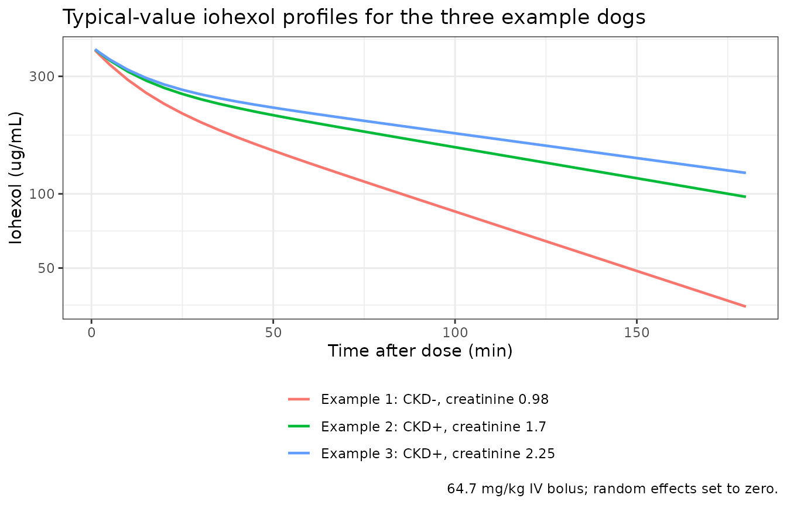
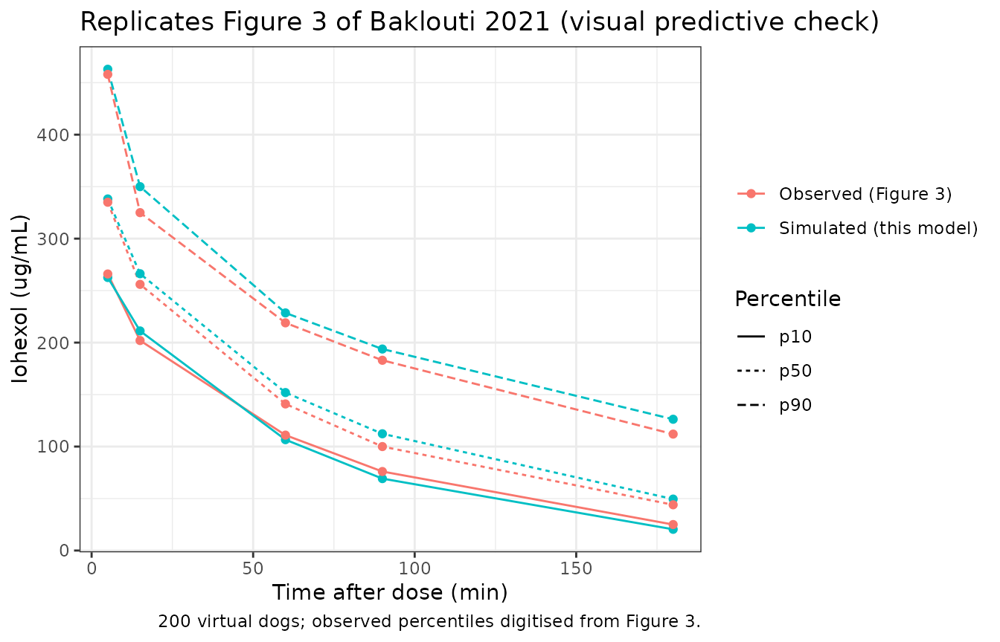
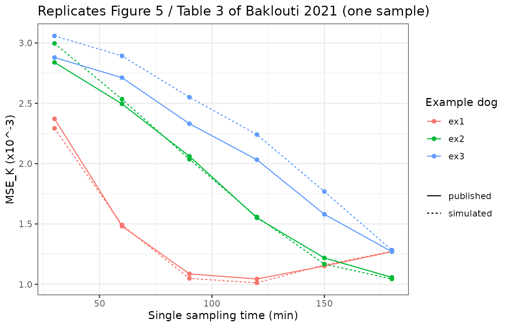

# Iohexol in dogs (Baklouti 2021)

## Model and source

``` r

ui <- rxode2::rxode(readModelDb("Baklouti_2021_iohexol_dog"))
#> ℹ parameter labels from comments will be replaced by 'label()'
```

- Citation: Baklouti S, Concordet D, Borromeo V, Pocar P, Scarpa P,
  Cagnardi P. Population pharmacokinetic model of iohexol in dogs to
  estimate glomerular filtration rate and optimize sampling time. Front
  Pharmacol. 2021;12:634404. <doi:10.3389/fphar.2021.634404>. All
  parameter values are the final estimates of Table 2; the covariate
  equation is the display equation of Results, ‘Population
  Pharmacokinetics’.
- Article: <https://doi.org/10.3389/fphar.2021.634404>
- PubMed Central:
  <https://www.ncbi.nlm.nih.gov/pmc/articles/PMC8116701/>

Iohexol is a radiographic contrast agent that is eliminated almost
entirely by glomerular filtration, so its plasma clearance is a direct
measure of the glomerular filtration rate (GFR). Baklouti and colleagues
gave a single 64.7 mg/kg intravenous bolus of iohexol to 49 client-owned
dogs, fitted a two-compartment population PK model in Monolix, and then
used the model to choose the one, two or three sampling times that
estimate an individual dog’s clearance (its GFR) most precisely.

All four disposition parameters are published **per kg body weight**, so
this model is dosed in mg/kg, carries compartment amounts in mg/kg, and
reports concentrations in ug/mL (equivalently mg/L) with no scaling
factor. Time is in minutes. The individual clearance `cl` is the dog’s
GFR in L/min/kg.

``` r

str(ui$units)
#> List of 3
#>  $ time         : chr "min"
#>  $ dosing       : chr "mg/kg"
#>  $ concentration: chr "ug/mL"
```

## Population

49 client-owned dogs scheduled for various clinical procedures at the
University Veterinary Teaching Hospital of the University of Milan were
enrolled (Methods, “Animals”; Table 1). Ten were mongrels and 39
represented 21 pure breeds. Age ranged from 0.4 to 16 years (median 4.5)
and body weight from 3.9 to 46 kg (median 27.6). Nineteen dogs were
male, 6 female and 24 female neutered. By the International Renal
Interest Society (IRIS) guidelines, 29 dogs had healthy kidney status
(CKD-) and 20 had chronic kidney disease (CKD+). Serum creatinine was
1.47 +/- 1.99 mg/dL (range 0.67-14.4, median 1.09) and serum urea 44.95
+/- 34.81 mg/dL.

Each dog gave five plasma samples at 5, 15, 60, 90 and 180 min, 245
samples in all, assayed by HPLC (LOQ 1.80 ug/mL). The same information
is available programmatically:

``` r

str(readModelDb("Baklouti_2021_iohexol_dog")()$population)
#> List of 14
#>  $ species       : chr "dog (client-owned Canis lupus familiaris; 10 mongrels and 39 dogs across 21 pure breeds)"
#>  $ n_subjects    : int 49
#>  $ n_studies     : int 1
#>  $ n_observations: int 245
#>  $ age_range     : chr "0.4-16 years"
#>  $ age_median    : chr "4.5 years"
#>  $ weight_range  : chr "3.9-46 kg"
#>  $ weight_median : chr "27.6 kg"
#>  $ sex_female_pct: num 61.2
#>  $ disease_state : chr "29 dogs with healthy kidney status (CKD-) and 20 with chronic kidney disease (CKD+) by IRIS criteria, all sched"| __truncated__
#>  $ dose_range    : chr "64.7 mg/kg (nominal) iohexol as a single 60-s intravenous bolus"
#>  $ regions       : chr "Italy (University Veterinary Teaching Hospital, University of Milan)"
#>  $ renal_function: chr "Serum creatinine 1.47 +/- 1.99 mg/dL, range 0.67-14.4 mg/dL, median 1.09 mg/dL; serum urea 44.95 +/- 34.81 mg/dL (Table 1)"
#>  $ notes         : chr "Demographics from Table 1 and Results, 'Animals and Iohexol Concentrations'. Five plasma samples per dog at 5, "| __truncated__
```

Nine covariates were screened: weight, age, creatinine, urea and urine
specific gravity as continuous covariates, and kidney status, sex and
breed as categorical ones. The final model keeps two, both on clearance:
centred serum creatinine (`CREAT`, mg/dL) and chronic kidney disease
(`DIS_RENAL`, 1 = CKD+). The screened-out covariates are documented in
the model file’s `covariatesDataExcluded` metadata:

``` r

names(readModelDb("Baklouti_2021_iohexol_dog")()$covariateData)
#> [1] "CREAT"     "DIS_RENAL"
names(readModelDb("Baklouti_2021_iohexol_dog")()$covariatesDataExcluded)
#> [1] "WT"             "AGE"            "UREA"           "USG"           
#> [5] "SEXF"           "NEUTERED"       "BREED_PUREBRED"
```

## Source trace

| Equation / parameter | Value | Source location |
|----|----|----|
| Two-compartment disposition, IV bolus into `central` | n/a | Results, “Population Pharmacokinetics” (“A two-compartment model best fitted the data”) and Discussion (“a two-compartment model with a linear elimination”) |
| Individual parameters `phi_i = h(A_i, theta) exp(eta_i)` | n/a | Methods, “Population Pharmacokinetics”, model display equation |
| `lcl` (theta_Cl) | 0.00212 L/min/kg | Table 2 (SE 0.00010, RSE 4.68%) |
| `lvc` (theta_V1) | 0.163 L/kg | Table 2 (SE 0.00661, RSE 4.07%) |
| `lvp` (theta_V2) | 0.058 L/kg | Table 2 (SE 0.00387, RSE 6.64%) |
| `lq` (theta_Q) | 0.0034 L/min/kg | Table 2 (SE 0.00042, RSE 12.21%) |
| Covariate model `ln(Cl) = ln(theta_Cl) + theta_1 1[CKD+] + theta_2 ccreatinine + eta_Cl` | n/a | Results, “Population Pharmacokinetics”, display equation |
| `e_dis_renal_cl` (theta_1) | -0.379 | Table 2, row “theta 1 (diseased dogs)” (SE 0.07002, RSE 18.49%) |
| `e_creat_cl` (theta_2) | -0.421 dL/mg | Table 2, row “theta 2 (creatinine)” (SE 0.05356, RSE 12.72%) |
| Creatinine centring value | 1.47 mg/dL | Not printed (“centered around an average value”); Table 1 cohort mean. Confirmed by the Table 3 reproduction below |
| `etalcl` variance | 0.208^2 | Table 2, row “eta Cl” = 0.208, a Monolix standard deviation |
| `etalvc` variance | 0.248^2 | Table 2, row “eta V1” = 0.248 (SD) |
| `etalvp` variance | 0.199^2 | Table 2, row “eta V2” = 0.199 (SD) |
| No IIV on Q, no correlations | n/a | Discussion (“except intercompartmental clearance that was fixed”); Results (“correlations … were low (\< 30%) and were therefore not included”) |
| `propSd` | 0.0617 | Table 2, row “Residual error”; Results (“proportional error … The value of the residual error was 6.17%”) |
| Dose | 64.7 mg/kg IV bolus over 60 s | Methods, “Sample Collection and Analysis”; Supplementary File S1 |
| EBE objective and MSE_K | n/a | Methods, “Optimal Sampling Time”, eq. 1, eq. 2 and the MSE_K display equation |

Monolix reports each omega as the standard deviation of its random
effect, and the Discussion reads Table 2 back that way (“the
interindividual variability was around 20% on all the parameters” and
RSEs “for the standard deviation of the random effects”). The variances
in `ini()` are therefore the squared Table 2 values. The reproduction of
Table 3 below confirms this reading: that table depends directly on the
size of the IIV relative to the residual error.

``` r

omega <- ui$omega
sd_published <- c(etalcl = 0.208, etalvc = 0.248, etalvp = 0.199)
knitr::kable(
  data.frame(
    `Random effect` = names(sd_published),
    `Table 2 (SD)` = unname(sd_published),
    `sqrt(model variance)` = unname(sqrt(diag(omega))[names(sd_published)]),
    check.names = FALSE
  ),
  digits = 4,
  caption = "Table 2 IIV standard deviations versus the packaged variances."
)
```

| Random effect | Table 2 (SD) | sqrt(model variance) |
|:--------------|-------------:|---------------------:|
| etalcl        |        0.208 |                0.208 |
| etalvc        |        0.248 |                0.248 |
| etalvp        |        0.199 |                0.199 |

Table 2 IIV standard deviations versus the packaged variances. {.table}

``` r

# Deterministic arithmetic on transcribed constants: a tight bound is correct.
stopifnot(
  identical(sort(rownames(omega)), sort(names(sd_published))),
  max(abs(sqrt(diag(omega))[names(sd_published)] - sd_published)) < 1e-9
)
```

## The three example dogs

The paper illustrates its sampling-time analysis with three example dogs
that span renal function (Methods, “Optimal Sampling Time”). Their
typical-value clearances follow directly from the Table 2 constants and
the covariate equation.

``` r

theta <- setNames(ui$theta, names(ui$theta))
creat_ref <- 1.47

examples <- tibble::tibble(
  treatment = c(
    "Example 1: CKD-, creatinine 0.98",
    "Example 2: CKD+, creatinine 1.7",
    "Example 3: CKD+, creatinine 2.25"
  ),
  DIS_RENAL = c(0, 1, 1),
  CREAT = c(0.98, 1.7, 2.25)
) |>
  dplyr::mutate(
    id = dplyr::row_number(),
    cl_typical = exp(
      theta[["lcl"]] + theta[["e_dis_renal_cl"]] * DIS_RENAL +
        theta[["e_creat_cl"]] * (CREAT - creat_ref)
    )
  )

knitr::kable(
  examples |>
    dplyr::select(treatment, DIS_RENAL, CREAT, cl_typical) |>
    dplyr::mutate(`GFR (mL/min/kg)` = 1000 * cl_typical) |>
    dplyr::rename(
      Dog = treatment,
      `CKD (DIS_RENAL)` = DIS_RENAL,
      `Creatinine (mg/dL)` = CREAT,
      `Typical CL (L/min/kg)` = cl_typical
    ),
  digits = 5,
  caption = "Typical clearance (GFR) of the three example dogs of Baklouti 2021."
)
```

| Dog | CKD (DIS_RENAL) | Creatinine (mg/dL) | Typical CL (L/min/kg) | GFR (mL/min/kg) |
|:---|---:|---:|---:|---:|
| Example 1: CKD-, creatinine 0.98 | 0 | 0.98 | 0.00261 | 2.60571 |
| Example 2: CKD+, creatinine 1.7 | 1 | 1.70 | 0.00132 | 1.31730 |
| Example 3: CKD+, creatinine 2.25 | 1 | 2.25 | 0.00105 | 1.04502 |

Typical clearance (GFR) of the three example dogs of Baklouti 2021.
{.table}

The typical profiles are simulated with the random effects zeroed. The
same profiles are also computed from the closed-form biexponential
solution of an IV bolus into a two-compartment model; the closed form is
reused below for the sampling-time analysis, so it is checked against
the ODE solve first.

``` r

dose_mgkg <- 64.7
obs_times <- c(0, 1, 2, 5, 10, 15, seq(20, 180, by = 5))

events_typ <- dplyr::bind_rows(
  examples |> dplyr::mutate(time = 0, amt = dose_mgkg, evid = 1L, cmt = "central"),
  tidyr::crossing(examples, tibble::tibble(time = obs_times)) |>
    dplyr::mutate(amt = NA_real_, evid = 0L, cmt = "central")
) |>
  dplyr::select(id, time, amt, evid, cmt, DIS_RENAL, CREAT) |>
  dplyr::arrange(id, time, dplyr::desc(evid))

sim_typ <- rxode2::rxSolve(
  rxode2::zeroRe(ui),
  events = events_typ,
  keep = c("DIS_RENAL", "CREAT"),
  returnType = "data.frame"
) |>
  dplyr::left_join(examples |> dplyr::select(id, treatment), by = "id")
#> ℹ omega/sigma items treated as zero: 'etalcl', 'etalvc', 'etalvp'
#> Warning: multi-subject simulation without without 'omega'

# Closed-form concentration for a 2-compartment IV bolus.
conc_2cmt <- function(t, dose, cl, vc, vp, q) {
  k10 <- cl / vc
  k12 <- q / vc
  k21 <- q / vp
  s <- k10 + k12 + k21
  p <- k10 * k21
  alpha <- (s + sqrt(s^2 - 4 * p)) / 2
  beta <- (s - sqrt(s^2 - 4 * p)) / 2
  dose / vc * ((alpha - k21) / (alpha - beta) * exp(-alpha * t) +
    (k21 - beta) / (alpha - beta) * exp(-beta * t))
}

closed <- sim_typ |>
  dplyr::filter(time > 0) |>
  dplyr::left_join(examples |> dplyr::select(id, cl_typical), by = "id") |>
  dplyr::mutate(
    Cc_closed = conc_2cmt(
      time, dose_mgkg, cl_typical,
      exp(theta[["lvc"]]), exp(theta[["lvp"]]), exp(theta[["lq"]])
    )
  )
# Same parameters on both sides, so the difference is pure solver error.
stopifnot(max(abs(closed$Cc / closed$Cc_closed - 1)) < 1e-4)

ggplot(sim_typ |> dplyr::filter(time > 0), aes(time, Cc, colour = treatment)) +
  geom_line(linewidth = 0.8) +
  scale_y_log10() +
  labs(
    x = "Time after dose (min)", y = "Iohexol (ug/mL)", colour = NULL,
    title = "Typical-value iohexol profiles for the three example dogs",
    caption = "64.7 mg/kg IV bolus; random effects set to zero."
  ) +
  theme_bw() +
  theme(legend.position = "bottom", legend.direction = "vertical")
```



The Discussion states that “all dogs CKD+ with the high creatinine value
had an iohexol concentration greater than 100 ug/ml at 180 min”. The
typical example 3 dog agrees:

``` r

c180 <- sim_typ |>
  dplyr::filter(time == 180) |>
  dplyr::select(treatment, Cc)
knitr::kable(
  c180 |> dplyr::rename(Dog = treatment, `Cc at 180 min (ug/mL)` = Cc),
  digits = 1
)
```

| Dog                              | Cc at 180 min (ug/mL) |
|:---------------------------------|----------------------:|
| Example 1: CKD-, creatinine 0.98 |                  34.9 |
| Example 2: CKD+, creatinine 1.7  |                  97.3 |
| Example 3: CKD+, creatinine 2.25 |                 121.6 |

``` r

stopifnot(c180$Cc[3] > 100)
```

## Virtual cohort and visual predictive check

Original observed data are not publicly available. Figure 3 of the paper
is a visual predictive check of the observed 10th, 50th and 90th
percentiles at the five sampling times. Its percentiles were digitised
by the maintainers from the published figure and are compared here with
a virtual cohort of 200 dogs.

The cohort needs creatinine values and kidney status. The paper gives
only the pooled creatinine summary (mean 1.47, SD 1.99, median 1.09,
range 0.67-14.4 mg/dL) and 20 of 49 dogs with CKD, so the maintainers
assumed the split below: 82 of 200 dogs (41%) are CKD+; healthy dogs
draw creatinine from a log-normal with median 0.95 mg/dL (CV about 20%)
truncated to 0.67-1.39 mg/dL (IRIS stage 1 is below 1.4 mg/dL), and CKD+
dogs from a log-normal with median 1.6 mg/dL (CV about 36%) truncated to
1.0-14.4 mg/dL. This distribution is an assumption, and it mostly
affects the late time points where clearance dominates.

``` r

# Covariates are drawn with base R's generator, which is identical on every
# machine. The random effects are drawn by rxode2; rxSetSeed() fixes that
# stream per solver thread but not across thread counts or rxode2 builds, so
# the assertions below tolerate any cohort the model can produce.
set.seed(20210429)
rxode2::rxSetSeed(20210429)

n_dogs <- 200L
n_ckd <- 82L
creat_healthy <- pmin(pmax(exp(rnorm(n_dogs - n_ckd, log(0.95), 0.2)), 0.67), 1.39)
creat_ckd <- pmin(pmax(exp(rnorm(n_ckd, log(1.6), 0.35)), 1.0), 14.4)

cohort <- tibble::tibble(
  id = seq_len(n_dogs),
  DIS_RENAL = c(rep(0, n_dogs - n_ckd), rep(1, n_ckd)),
  CREAT = c(creat_healthy, creat_ckd),
  treatment = ifelse(DIS_RENAL == 1, "CKD+", "CKD-")
)

vpc_times <- c(5, 15, 60, 90, 180)
events_vpc <- dplyr::bind_rows(
  cohort |> dplyr::mutate(time = 0, amt = dose_mgkg, evid = 1L, cmt = "central"),
  tidyr::crossing(cohort, tibble::tibble(time = vpc_times)) |>
    dplyr::mutate(amt = NA_real_, evid = 0L, cmt = "central")
) |>
  dplyr::select(id, time, amt, evid, cmt, DIS_RENAL, CREAT) |>
  dplyr::arrange(id, time, dplyr::desc(evid))

sim_vpc <- rxode2::rxSolve(
  ui,
  events = events_vpc,
  keep = c("DIS_RENAL", "CREAT"),
  returnType = "data.frame"
)

vpc_sim <- sim_vpc |>
  dplyr::filter(time %in% vpc_times) |>
  dplyr::group_by(time) |>
  dplyr::summarise(
    p10 = quantile(sim, 0.1),
    p50 = median(sim),
    p90 = quantile(sim, 0.9),
    .groups = "drop"
  )

# Figure 3 of Baklouti 2021, empirical percentiles read off the published
# figure by the maintainers (ug/mL).
vpc_fig3 <- tibble::tibble(
  time = vpc_times,
  p10 = c(266, 202, 111, 76, 25),
  p50 = c(335, 256, 141, 100, 44),
  p90 = c(458, 325, 219, 183, 112)
)

vpc_long <- dplyr::bind_rows(
  vpc_sim |> dplyr::mutate(source = "Simulated (this model)"),
  vpc_fig3 |> dplyr::mutate(source = "Observed (Figure 3)")
) |>
  tidyr::pivot_longer(c(p10, p50, p90), names_to = "percentile", values_to = "conc")

ggplot(vpc_long, aes(time, conc, colour = source, linetype = percentile)) +
  geom_line() +
  geom_point() +
  labs(
    x = "Time after dose (min)", y = "Iohexol (ug/mL)", colour = NULL,
    linetype = "Percentile",
    title = "Replicates Figure 3 of Baklouti 2021 (visual predictive check)",
    caption = "200 virtual dogs; observed percentiles digitised from Figure 3."
  ) +
  theme_bw()
```



``` r


vpc_cmp <- vpc_sim |>
  dplyr::left_join(vpc_fig3, by = "time", suffix = c("_sim", "_fig3")) |>
  dplyr::mutate(pct_diff_median = 100 * (p50_sim / p50_fig3 - 1))

knitr::kable(
  vpc_cmp |>
    dplyr::select(time, p50_fig3, p50_sim, pct_diff_median, p10_fig3, p10_sim, p90_fig3, p90_sim) |>
    dplyr::rename(
      `Time (min)` = time,
      `Median, Figure 3` = p50_fig3,
      `Median, simulated` = p50_sim,
      `Median % diff` = pct_diff_median,
      `P10, Figure 3` = p10_fig3,
      `P10, simulated` = p10_sim,
      `P90, Figure 3` = p90_fig3,
      `P90, simulated` = p90_sim
    ),
  digits = 1,
  caption = "Simulated versus observed (Figure 3) percentiles, ug/mL."
)
```

| Time (min) | Median, Figure 3 | Median, simulated | Median % diff | P10, Figure 3 | P10, simulated | P90, Figure 3 | P90, simulated |
|---:|---:|---:|---:|---:|---:|---:|---:|
| 5 | 335 | 338.2 | 0.9 | 266 | 262.6 | 458 | 462.9 |
| 15 | 256 | 266.2 | 4.0 | 202 | 211.2 | 325 | 350.0 |
| 60 | 141 | 151.9 | 7.8 | 111 | 106.6 | 219 | 228.6 |
| 90 | 100 | 112.3 | 12.3 | 76 | 69.2 | 183 | 193.8 |
| 180 | 44 | 49.5 | 12.5 | 25 | 20.4 | 112 | 126.3 |

Simulated versus observed (Figure 3) percentiles, ug/mL. {.table}

``` r


stopifnot(
  # The early times are governed by V1 and the dose, not by the assumed
  # creatinine distribution: a mis-transcribed volume or dose moves them by
  # tens of percent.
  all(abs(vpc_cmp$pct_diff_median[vpc_cmp$time <= 15]) < 15),
  # Centre of the whole comparison, robust to the assumed cohort.
  median(abs(vpc_cmp$pct_diff_median)) < 15
)
```

The medians agree within a few percent through 60 min. At 90 and 180 min
the simulated medians sit about 10-25% above the observed ones (the
exact figure depends on the random-effect draw). Those time points are
driven by clearance, so they depend on the creatinine distribution of
the 49 real dogs, which the paper does not publish, and the assumed
cohort above may carry somewhat more low-clearance dogs than the real
one did. The model’s clearance is validated independently of any assumed
cohort by the reproduction of Table 3 below.

## PKNCA validation

Iohexol clearance measured by NCA as dose / AUC0-inf is the GFR
reference method the paper compares against (Pocar 2019; Figure 4). For
each typical example dog, the NCA clearance of a densely sampled
simulated profile should equal the model clearance of the table above.
That comparison checks the dose, the units and the covariate equation
together.

``` r

nca_times <- c(0, 1, 2, 5, 10, 15, 20, 30, 45, seq(60, 1440, by = 30))

events_nca <- dplyr::bind_rows(
  examples |> dplyr::mutate(time = 0, amt = dose_mgkg, evid = 1L, cmt = "central"),
  tidyr::crossing(examples, tibble::tibble(time = nca_times)) |>
    dplyr::mutate(amt = NA_real_, evid = 0L, cmt = "central")
) |>
  dplyr::select(id, time, amt, evid, cmt, DIS_RENAL, CREAT) |>
  dplyr::arrange(id, time, dplyr::desc(evid))

sim_nca <- rxode2::rxSolve(
  rxode2::zeroRe(ui),
  events = events_nca,
  keep = c("DIS_RENAL", "CREAT"),
  returnType = "data.frame"
) |>
  dplyr::left_join(examples |> dplyr::select(id, treatment), by = "id")
#> ℹ omega/sigma items treated as zero: 'etalcl', 'etalvc', 'etalvp'
#> Warning: multi-subject simulation without without 'omega'

conc_df <- sim_nca |>
  dplyr::filter(!is.na(Cc)) |>
  dplyr::select(id, treatment, time, Cc)
# The bolus gives a non-zero concentration at time 0; PKNCA back-extrapolates
# C0 for an IV bolus, so the time-0 row is kept as simulated.
dose_df <- examples |>
  dplyr::transmute(id, treatment, time = 0, amt = dose_mgkg)

conc_obj <- PKNCA::PKNCAconc(conc_df, Cc ~ time | treatment + id)
dose_obj <- PKNCA::PKNCAdose(dose_df, amt ~ time | treatment + id, route = "intravascular")
intervals <- data.frame(
  start = 0, end = Inf,
  cmax = TRUE, aucinf.obs = TRUE, half.life = TRUE, cl.obs = TRUE
)
nca_res <- PKNCA::pk.nca(PKNCA::PKNCAdata(conc_obj, dose_obj, intervals = intervals))

reference <- examples |>
  dplyr::transmute(
    treatment,
    cl.obs = cl_typical,
    aucinf.obs = dose_mgkg / cl_typical
  )

nca_units <- c(cl.obs = "L/min/kg", aucinf.obs = "ug*min/mL")
cmp <- nlmixr2lib::ncaComparisonTable(
  simulated = nca_res,
  reference = reference,
  by = "treatment",
  params = c("aucinf.obs", "cl.obs"),
  units = nca_units,
  tolerance_pct = 20
)
knitr::kable(
  cmp,
  caption = "PKNCA on the typical example dogs versus the Table 2 clearance (reference = dose / CL).",
  align = c("l", "l", "r", "r", "r")
)
```

| NCA parameter | treatment | Reference | Simulated | % diff |
|:---|:---|---:|---:|---:|
| AUC0-∞ (obs) (ug\*min/mL) | Example 1: CKD-, creatinine 0.98 | 24800 | 24900 | +0.1% |
| AUC0-∞ (obs) (ug\*min/mL) | Example 2: CKD+, creatinine 1.7 | 49100 | 49100 | +0.1% |
| AUC0-∞ (obs) (ug\*min/mL) | Example 3: CKD+, creatinine 2.25 | 61900 | 61900 | +0.1% |
| CL/F (L/min/kg) | Example 1: CKD-, creatinine 0.98 | 0.00261 | 0.0026 | -0.1% |
| CL/F (L/min/kg) | Example 2: CKD+, creatinine 1.7 | 0.00132 | 0.00132 | -0.1% |
| CL/F (L/min/kg) | Example 3: CKD+, creatinine 2.25 | 0.00105 | 0.00104 | -0.1% |

PKNCA on the typical example dogs versus the Table 2 clearance
(reference = dose / CL). {.table}

``` r


diff_col <- grep("diff", names(cmp), value = TRUE)
pct <- suppressWarnings(as.numeric(gsub("[%*]", "", cmp[[diff_col]])))
# Deterministic typical-value profiles sampled to 24 h: only the trapezoidal
# and extrapolation error of NCA separates the two sides.
stopifnot(length(pct) == 6L, !anyNA(pct), max(abs(pct)) < 2)
```

## Optimal sampling times: reproducing Tables 3-5

For each example dog, the paper simulated 5,000 profiles, computed each
simulated dog’s empirical Bayes estimate (EBE) of its random effects
from one, two or three samples taken between 30 and 180 min, and scored
each sampling design K by

``` math
MSE_K = \frac{1}{5000}\sqrt{\sum_{i=1}^{5000}\left(\widehat{\eta}^{*}_{i,K} - \eta^{*}_i\right)^2},
```

the EBE error in the clearance random effect (Methods, “Optimal Sampling
Time”). Note that this “MSE” is a root-sum-of-squares divided by the
number of simulations, i.e. the root-mean-square error divided by
`sqrt(5000)`; the value is reported in units of 10^-3. The EBE is the
mode of the conditional distribution, which the paper writes as
minimising (eq. 2)

``` math
\sum_{t \in K} \frac{(Y_t - f_t)^2}{g_t^2} + \ln g_t^2 + \eta' \Omega^{-1} \eta,
\qquad g_t = b\, f_t .
```

The reproduction below uses 200 simulated dogs per example dog, draws
the random effects and residuals with base R’s generator from the
packaged `ini()` values, reuses the same draws for every design of a
table (common random numbers), and scales the root-mean-square error to
the paper’s `1 / sqrt(5000)` form so the numbers are directly
comparable. This analysis exercises the whole stochastic model – the
covariate equation, the three IIV standard deviations and the 6.17%
residual error – because the EBE precision is set by the ratio of the
IIV to the residual error.

``` r

omega_diag <- diag(ui$omega)[c("etalcl", "etalvc", "etalvp")]
prop_sd <- theta[["propSd"]]
sampling_grid <- c(30, 60, 90, 120, 150, 180)

ind_par <- function(eta, dis_renal, creat) {
  list(
    cl = exp(theta[["lcl"]] + theta[["e_dis_renal_cl"]] * dis_renal +
      theta[["e_creat_cl"]] * (creat - creat_ref) + eta[1]),
    vc = exp(theta[["lvc"]] + eta[2]),
    vp = exp(theta[["lvp"]] + eta[3]),
    q = exp(theta[["lq"]])
  )
}

# Eq. 2 of Baklouti 2021 (the constant factor 1/2 does not move the mode).
ebe_objective <- function(eta, y, t, dis_renal, creat) {
  p <- ind_par(eta, dis_renal, creat)
  f <- conc_2cmt(t, dose_mgkg, p$cl, p$vc, p$vp, p$q)
  g2 <- (prop_sd * f)^2
  sum((y - f)^2 / g2 + log(g2)) + sum(eta^2 / omega_diag)
}

# Squared EBE error in the clearance random effect for simulated dog i under
# sampling design tk.
ebe_sq_err <- function(i, tk, eta_true, eps, dis_renal, creat) {
  idx <- match(tk, sampling_grid)
  p <- ind_par(eta_true[i, ], dis_renal, creat)
  y <- conc_2cmt(tk, dose_mgkg, p$cl, p$vc, p$vp, p$q) * (1 + prop_sd * eps[i, idx])
  fit <- stats::optim(
    c(0, 0, 0), ebe_objective,
    y = y, t = tk, dis_renal = dis_renal, creat = creat,
    method = "BFGS"
  )
  (fit$par[1] - eta_true[i, 1])^2
}

# The paper's MSE_K (x10^-3) for one design: RMSE / sqrt(5000).
mse_k <- function(tk, eta_true, eps, dis_renal, creat) {
  sq_err <- vapply(
    seq_len(nrow(eta_true)), ebe_sq_err, numeric(1),
    tk = tk, eta_true = eta_true, eps = eps,
    dis_renal = dis_renal, creat = creat
  )
  1000 * sqrt(mean(sq_err)) / sqrt(5000)
}

# One example dog: draw the true random effects and residuals once and reuse
# them for every design (common random numbers).
mse_designs <- function(j, designs, n_sim) {
  eta_true <- cbind(
    rnorm(n_sim, 0, sqrt(omega_diag[[1]])),
    rnorm(n_sim, 0, sqrt(omega_diag[[2]])),
    rnorm(n_sim, 0, sqrt(omega_diag[[3]]))
  )
  eps <- matrix(rnorm(n_sim * length(sampling_grid)), n_sim, length(sampling_grid))
  vapply(
    designs, mse_k, numeric(1),
    eta_true = eta_true, eps = eps,
    dis_renal = examples$DIS_RENAL[j], creat = examples$CREAT[j]
  )
}

run_table <- function(designs, n_sim, seed) {
  set.seed(seed)
  res <- vapply(seq_len(nrow(examples)), mse_designs, numeric(length(designs)),
    designs = designs, n_sim = n_sim
  )
  tibble::tibble(
    design = vapply(designs, paste, character(1), collapse = "_"),
    ex1 = res[, 1], ex2 = res[, 2], ex3 = res[, 3]
  )
}

n_sim_mse <- 200L
designs_1 <- as.list(sampling_grid)
designs_2 <- combn(sampling_grid, 2, simplify = FALSE)
designs_3 <- combn(sampling_grid, 3, simplify = FALSE)
```

The published values of Tables 3-5 (x10^-3):

``` r

published_1 <- tibble::tibble(
  design = c("30", "60", "90", "120", "150", "180"),
  ex1 = c(2.37144, 1.48213, 1.08587, 1.04398, 1.15137, 1.27023),
  ex2 = c(2.83923, 2.49541, 2.06094, 1.55052, 1.21796, 1.05704),
  ex3 = c(2.87982, 2.71283, 2.33112, 2.03204, 1.58001, 1.27007)
)
published_2 <- tibble::tibble(
  design = c(
    "30_60", "30_90", "30_120", "30_150", "30_180", "60_90", "60_120",
    "60_150", "60_180", "90_120", "90_150", "90_180", "120_150", "120_180",
    "150_180"
  ),
  ex1 = c(
    1.59044, 1.04184, 0.8313, 0.77656, 0.76386, 1.01744, 0.8628, 0.84146,
    0.83782, 0.90116, 0.89505, 0.91048, 0.99535, 1.00764, 1.17352
  ),
  ex2 = c(
    2.94597, 2.02553, 1.52744, 1.24404, 1.04572, 2.11078, 1.53112, 1.18311,
    1.00331, 1.65281, 1.23837, 1.00323, 1.22089, 0.9865, 0.97719
  ),
  ex3 = c(
    3.38164, 2.47435, 1.88487, 1.54674, 1.29145, 2.63993, 1.91978, 1.49829,
    1.21676, 2.14052, 1.6483, 1.29749, 1.67092, 1.34951, 1.24635
  )
)
published_3 <- tibble::tibble(
  design = c(
    "30_60_90", "30_60_120", "30_60_150", "30_60_180", "30_90_120",
    "30_90_150", "30_90_180", "30_120_150", "30_120_180", "30_150_180",
    "60_90_120", "60_90_150", "60_90_180", "60_120_150", "60_120_180",
    "60_150_180", "90_120_150", "90_120_180", "90_150_180", "120_150_180"
  ),
  ex1 = c(
    1.01127, 0.79361, 0.72799, 0.68501, 0.75675, 0.69878, 0.67861, 0.68581,
    0.67313, 0.67858, 0.79057, 0.75929, 0.75331, 0.76469, 0.75608, 0.77419,
    0.82071, 0.81691, 0.86003, 0.95395
  ),
  ex2 = c(
    2.00212, 1.49464, 1.20321, 0.98346, 1.43671, 1.17373, 0.97652, 1.09122,
    0.93237, 0.8623, 1.47998, 1.1665, 0.96534, 1.07649, 0.9122, 0.84264,
    1.14447, 0.94613, 0.88547, 0.884564
  ),
  ex3 = c(
    2.43594, 1.81317, 1.48077, 1.22154, 1.80194, 1.45919, 1.2322, 1.38739,
    1.18603, 1.10814, 1.86321, 1.50283, 1.23779, 1.396, 1.16991, 1.08415,
    1.55208, 1.2775, 1.18735, 1.23236
  )
)
```

``` r

mse_1 <- run_table(designs_1, n_sim_mse, seed = 1)
mse_2 <- run_table(designs_2, n_sim_mse, seed = 2)
mse_3 <- run_table(designs_3, n_sim_mse, seed = 3)

compare_mse <- function(sim, pub, n_samples) {
  dplyr::inner_join(
    tidyr::pivot_longer(pub, -design, names_to = "example", values_to = "published"),
    tidyr::pivot_longer(sim, -design, names_to = "example", values_to = "simulated"),
    by = c("design", "example")
  ) |>
    dplyr::mutate(
      samples = n_samples,
      pct_diff = 100 * (simulated / published - 1)
    )
}

mse_cmp <- dplyr::bind_rows(
  compare_mse(mse_1, published_1, 1L),
  compare_mse(mse_2, published_2, 2L),
  compare_mse(mse_3, published_3, 3L)
)
stopifnot(nrow(mse_cmp) == 3L * (6L + 15L + 20L))

mse_wide <- mse_cmp |>
  dplyr::mutate(cell = sprintf("%.3f / %.3f", published, simulated)) |>
  dplyr::select(samples, design, example, cell) |>
  tidyr::pivot_wider(names_from = example, values_from = cell)

knitr::kable(
  mse_wide |>
    dplyr::rename(
      `Samples` = samples,
      `Times (min)` = design,
      `Example 1 (CKD-, 0.98)` = ex1,
      `Example 2 (CKD+, 1.7)` = ex2,
      `Example 3 (CKD+, 2.25)` = ex3
    ),
  caption = "Replicates Tables 3-5 of Baklouti 2021: MSE_K (x10^-3), published / simulated."
)
```

| Samples | Times (min) | Example 1 (CKD-, 0.98) | Example 2 (CKD+, 1.7) | Example 3 (CKD+, 2.25) |
|---:|:---|:---|:---|:---|
| 1 | 30 | 2.371 / 2.293 | 2.839 / 2.997 | 2.880 / 3.059 |
| 1 | 60 | 1.482 / 1.492 | 2.495 / 2.535 | 2.713 / 2.893 |
| 1 | 90 | 1.086 / 1.049 | 2.061 / 2.037 | 2.331 / 2.551 |
| 1 | 120 | 1.044 / 1.012 | 1.551 / 1.558 | 2.032 / 2.241 |
| 1 | 150 | 1.151 / 1.160 | 1.218 / 1.167 | 1.580 / 1.769 |
| 1 | 180 | 1.270 / 1.273 | 1.057 / 1.044 | 1.270 / 1.283 |
| 2 | 30_60 | 1.590 / 1.555 | 2.946 / 2.410 | 3.382 / 2.429 |
| 2 | 30_90 | 1.042 / 0.996 | 2.026 / 1.874 | 2.474 / 2.035 |
| 2 | 30_120 | 0.831 / 0.820 | 1.527 / 1.294 | 1.885 / 1.581 |
| 2 | 30_150 | 0.777 / 0.630 | 1.244 / 1.105 | 1.547 / 1.298 |
| 2 | 30_180 | 0.764 / 0.634 | 1.046 / 0.891 | 1.291 / 1.055 |
| 2 | 60_90 | 1.017 / 1.012 | 2.111 / 2.037 | 2.640 / 2.313 |
| 2 | 60_120 | 0.863 / 0.860 | 1.531 / 1.361 | 1.920 / 1.742 |
| 2 | 60_150 | 0.841 / 0.693 | 1.183 / 1.131 | 1.498 / 1.406 |
| 2 | 60_180 | 0.838 / 0.747 | 1.003 / 0.907 | 1.217 / 1.086 |
| 2 | 90_120 | 0.901 / 0.902 | 1.653 / 1.437 | 2.141 / 1.800 |
| 2 | 90_150 | 0.895 / 0.803 | 1.238 / 1.162 | 1.648 / 1.459 |
| 2 | 90_180 | 0.910 / 0.806 | 1.003 / 0.924 | 1.297 / 1.104 |
| 2 | 120_150 | 0.995 / 1.073 | 1.221 / 1.146 | 1.671 / 1.495 |
| 2 | 120_180 | 1.008 / 1.081 | 0.987 / 0.909 | 1.350 / 1.126 |
| 2 | 150_180 | 1.174 / 1.130 | 0.977 / 0.859 | 1.246 / 1.123 |
| 3 | 30_60_90 | 1.011 / 0.945 | 2.002 / 1.687 | 2.436 / 2.095 |
| 3 | 30_60_120 | 0.794 / 0.716 | 1.495 / 1.323 | 1.813 / 1.638 |
| 3 | 30_60_150 | 0.728 / 0.611 | 1.203 / 1.043 | 1.481 / 1.196 |
| 3 | 30_60_180 | 0.685 / 0.576 | 0.983 / 0.856 | 1.222 / 1.020 |
| 3 | 30_90_120 | 0.757 / 0.726 | 1.437 / 1.267 | 1.802 / 1.552 |
| 3 | 30_90_150 | 0.699 / 0.623 | 1.174 / 1.016 | 1.459 / 1.184 |
| 3 | 30_90_180 | 0.679 / 0.578 | 0.977 / 0.835 | 1.232 / 0.997 |
| 3 | 30_120_150 | 0.686 / 0.629 | 1.091 / 0.947 | 1.387 / 1.127 |
| 3 | 30_120_180 | 0.673 / 0.597 | 0.932 / 0.774 | 1.186 / 0.921 |
| 3 | 30_150_180 | 0.679 / 0.591 | 0.862 / 0.728 | 1.108 / 0.830 |
| 3 | 60_90_120 | 0.791 / 0.757 | 1.480 / 1.299 | 1.863 / 1.778 |
| 3 | 60_90_150 | 0.759 / 0.669 | 1.167 / 1.085 | 1.503 / 1.320 |
| 3 | 60_90_180 | 0.753 / 0.642 | 0.965 / 0.859 | 1.238 / 1.065 |
| 3 | 60_120_150 | 0.765 / 0.665 | 1.076 / 0.991 | 1.396 / 1.294 |
| 3 | 60_120_180 | 0.756 / 0.642 | 0.912 / 0.801 | 1.170 / 1.017 |
| 3 | 60_150_180 | 0.774 / 0.657 | 0.843 / 0.757 | 1.084 / 0.935 |
| 3 | 90_120_150 | 0.821 / 0.811 | 1.144 / 1.061 | 1.552 / 1.389 |
| 3 | 90_120_180 | 0.817 / 0.774 | 0.946 / 0.852 | 1.278 / 1.044 |
| 3 | 90_150_180 | 0.860 / 0.807 | 0.885 / 0.787 | 1.187 / 0.957 |
| 3 | 120_150_180 | 0.954 / 0.894 | 0.885 / 0.828 | 1.232 / 1.057 |

Replicates Tables 3-5 of Baklouti 2021: MSE_K (x10^-3), published /
simulated. {.table}

``` r


ggplot(
  mse_cmp |> dplyr::filter(samples == 1L) |>
    dplyr::mutate(time = as.numeric(design)) |>
    tidyr::pivot_longer(c(published, simulated), names_to = "source", values_to = "mse"),
  aes(time, mse, colour = example, linetype = source)
) +
  geom_line() +
  geom_point() +
  labs(
    x = "Single sampling time (min)", y = "MSE_K (x10^-3)",
    colour = "Example dog", linetype = NULL,
    title = "Replicates Figure 5 / Table 3 of Baklouti 2021 (one sample)"
  ) +
  theme_bw()
```



``` r


mse_summary <- mse_cmp |>
  dplyr::group_by(samples) |>
  dplyr::summarise(
    `Median % diff` = median(pct_diff),
    `Median |% diff|` = median(abs(pct_diff)),
    `90th percentile |% diff|` = quantile(abs(pct_diff), 0.9),
    .groups = "drop"
  )
knitr::kable(mse_summary, digits = 1, caption = "Agreement with Tables 3-5 by number of samples.")
```

| samples | Median % diff | Median \|% diff\| | 90th percentile \|% diff\| |
|--------:|--------------:|------------------:|---------------------------:|
|       1 |           0.7 |               3.2 |                        9.7 |
|       2 |         -10.7 |              10.7 |                       17.7 |
|       3 |         -12.9 |              12.9 |                       18.8 |

Agreement with Tables 3-5 by number of samples. {.table}

``` r


best_single <- mse_1 |>
  tidyr::pivot_longer(-design, names_to = "example", values_to = "mse") |>
  dplyr::group_by(example) |>
  dplyr::slice_min(mse, n = 1) |>
  dplyr::ungroup()
knitr::kable(best_single, digits = 3, caption = "Best single sampling time per example dog.")
```

| design | example |   mse |
|:-------|:--------|------:|
| 120    | ex1     | 1.012 |
| 180    | ex2     | 1.044 |
| 180    | ex3     | 1.283 |

Best single sampling time per example dog. {.table}

With one sample, the simulated best time is 90-120 min for the healthy
dog and 180 min for both CKD+ dogs, as the paper reports (“90 or 120 min
for example 1 dogs …, 150 or 180 min for example 2 dogs …, and 180 min
for example 3 dogs”). Table 3 is reproduced cell by cell, with a median
difference close to zero.

Tables 4 and 5 (two and three samples) are reproduced in their ordering:
the rank correlation between the published and simulated MSE_K is above
0.85 for every example dog, and for example 3 the best two-sample
designs all include the 180-min sample, as the paper notes. Their level,
however, sits about 10-15% **below** the published values: here a second
or third sample improves the EBE of clearance somewhat more than it did
in the paper. The one-sample Table 3, which uses the same model,
simulation and EBE code, shows no such offset, so the offset is not a
transcription error in the model parameters, which would shift all three
tables. The paper does not describe its EBE optimiser beyond “a Gauss
Newton algorithm can be used”, and a mode search that stops short of the
optimum on the harder, multi-sample objectives would inflate the
published multi-sample MSE_K in exactly this way. That is the
maintainers’ leading explanation, but it cannot be confirmed from the
published text.

``` r

# The draws come from base R's generator, so these numbers are identical on
# every machine; the bounds still leave room for the Monte Carlo error of 200
# versus 5,000 simulations (about 5% relative on a root-mean-square error).
cmp_1 <- mse_cmp |> dplyr::filter(samples == 1L)
cmp_23 <- mse_cmp |> dplyr::filter(samples > 1L)
rank_agreement <- cmp_23 |>
  dplyr::group_by(samples, example) |>
  dplyr::summarise(
    rho = stats::cor(published, simulated, method = "spearman"),
    .groups = "drop"
  )
knitr::kable(
  rank_agreement |>
    dplyr::rename(Samples = samples, Example = example, `Spearman rho` = rho),
  digits = 3,
  caption = "Rank agreement of simulated and published MSE_K, Tables 4 and 5."
)
```

| Samples | Example | Spearman rho |
|--------:|:--------|-------------:|
|       2 | ex1     |        0.896 |
|       2 | ex2     |        0.946 |
|       2 | ex3     |        0.979 |
|       3 | ex1     |        0.952 |
|       3 | ex2     |        0.964 |
|       3 | ex3     |        0.973 |

Rank agreement of simulated and published MSE_K, Tables 4 and 5.
{.table}

``` r

best_two_ex3 <- mse_2 |>
  dplyr::slice_min(ex3, n = 3) |>
  dplyr::pull(design)

stopifnot(
  # Table 3 -- structural: a wrong IIV scale (variance read as SD), residual
  # error or creatinine centring moves the whole table by 20-100%.
  abs(median(cmp_1$pct_diff)) < 7,
  quantile(abs(cmp_1$pct_diff), 0.9) < 15,
  best_single$design[best_single$example == "ex1"] %in% c("90", "120"),
  best_single$design[best_single$example == "ex2"] %in% c("150", "180"),
  best_single$design[best_single$example == "ex3"] == "180",
  # Tables 4-5 -- ordering, plus the documented level offset kept visible.
  all(rank_agreement$rho > 0.85),
  median(cmp_23$pct_diff) > -25,
  median(cmp_23$pct_diff) < 0,
  all(grepl("180", best_two_ex3))
)
```

## Assumptions and deviations

- **Creatinine centring value.** The paper says only that creatinine is
  “centered around an average value”. The model uses 1.47 mg/dL, the
  Table 1 cohort mean. The reproduction of Table 3 supports it: with
  1.47 mg/dL the Table 3 cells agree within a few percent, while
  centring on the median (1.09 mg/dL) makes the typical clearance of
  every dog 15% lower and puts Table 3 off by up to about 20%.
- **IIV scale.** Table 2’s omegas are Monolix standard deviations, so
  the packaged variances are their squares. The Discussion’s “around
  20%” wording and the Table 3 reproduction both support this reading.
- **Tables 4 and 5 level offset.** The multi-sample MSE_K values
  reproduce the published ordering but sit about 10-15% below the
  published level (see “Optimal sampling times”). The cause is not
  identifiable from the paper; the one-sample Table 3 has no such
  offset.
- **Dose administration.** Iohexol was injected over 60 s; it is
  modelled as an instantaneous bolus, as in the paper (“IV bolus
  injection”).
- **Sampling times.** Methods and Supplementary File S1 give five
  samples at 5, 15, 60, 90 and 180 min; Results lists “5, 15, 30, 60,
  90, and 180 min”. The total of 245 samples (49 x 5) matches the
  five-time protocol, which is used for the visual predictive check.
- **Virtual cohort covariates.** The creatinine distribution by kidney
  status is not published; the split used for the visual predictive
  check is an assumption (see “Virtual cohort”). It affects only the
  late-time comparison with Figure 3, not the model.
- **Figure 3 percentiles** were digitised from the published figure by
  the maintainers and carry reading error of a few ug/mL.
- **Sampling-time reproduction size.** The paper used 5,000 simulated
  profiles per example dog; the reproduction uses 200, with the paper’s
  normalisation applied so the numbers are on the same scale.
- **Body weight.** The per-kg parameterisation means no weight covariate
  is needed; dose in mg/kg and read `cl` as GFR in L/min/kg.
