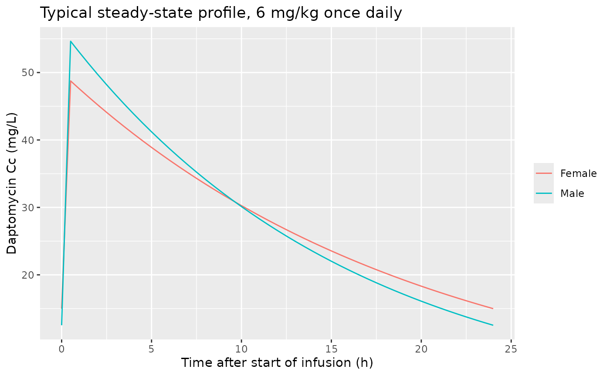
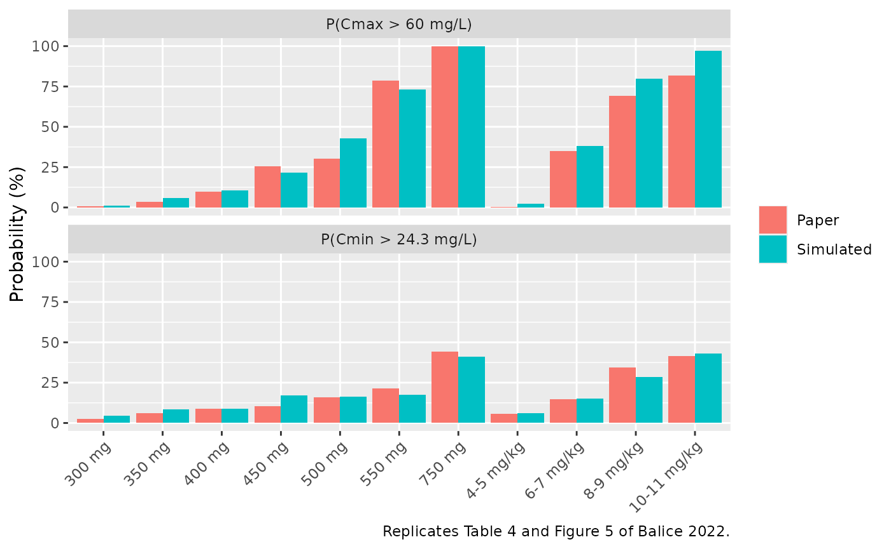
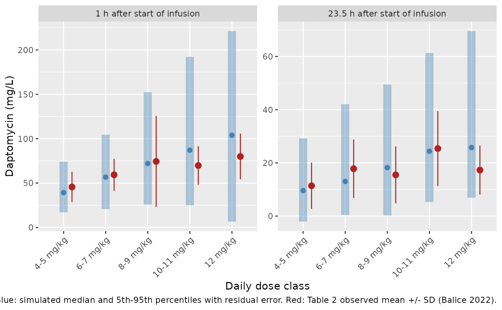

# Daptomycin (Balice 2022)

## Model and source

- Citation: Balice G, Passino C, Bongiorni MG, Segreti L, Russo A,
  Lastella M, Luci G, Falcone M, Di Paolo A. Daptomycin Population
  Pharmacokinetics in Patients Affected by Severe Gram-Positive
  Infections: An Update. Antibiotics (Basel). 2022;11(7):914.
  <doi:10.3390/antibiotics11070914>.
- Description: One-compartment population PK model with first-order
  elimination for intravenous daptomycin (30-min infusion, 4-12 mg/kg
  once daily) in hospitalised adults with severe Gram-positive
  infections, built from routine therapeutic drug monitoring peak and
  trough samples (Pisa, Italy; DAPTOLIN study). Clearance is
  additive-linear in Cockcroft-Gault creatinine clearance centred at
  63.35 mL/min with an additive (normal, L/h) between-subject random
  effect; the volume of distribution is additive-linear in female sex
  centred at the model-building cohort’s female fraction of 0.309.
  Residual error is piecewise: an intercept-plus-slope standard
  deviation (additive + proportional summed linearly) for individual
  predictions below 80 mg/L and a purely proportional standard deviation
  at or above 80 mg/L.
- Article: <https://doi.org/10.3390/antibiotics11070914> (open access)

Balice et al. updated the earlier Di Paolo et al. daptomycin model with
routine therapeutic drug monitoring (TDM) data from Pisa University
Hospital. The final model is a one-compartment model with first-order
elimination, fitted in NONMEM 7.2:

- Eq 1: `Cl (L/h) = theta1 + theta5 x (ClCr - 63.35) / 100 + eta`
- Eq 2: `Vd (L) = theta2 - theta6 x (Sex - 0.309)`, with Sex = 0 for
  males and 1 for females.

Residual error is piecewise. For individual predictions (IPRED) below 80
mg/L the residual SD is an intercept-plus-slope function of the additive
and proportional thetas. At or above 80 mg/L it is proportional to a
third theta, the “error slope for higher iPRED”.

## Population

The final model was estimated on a model-building subset of 94 adults
(65 men, 29 women; age 65.7 +/- 13.2 years, weight 72.6 +/- 10.9 kg,
Cockcroft-Gault creatinine clearance 74.6 +/- 39.7 mL/min; Table 1).
These patients were hospitalised in a medical or surgical ward with a
severe Gram-positive infection. They received daptomycin 4-12 mg/kg once
daily (mean 6.8 +/- 1.6 mg/kg), usually as a 30-min infusion, during the
DAPTOLIN observational retrospective study. A further 40 patients formed
an external-validation subset, and 22 patients from a second enrolment
round (156 in total, 424 concentrations) were used only for exploratory
covariate analyses. Sampling followed the routine TDM protocol: a peak 1
h after the start of infusion and a trough about 23.5 h later (Table 2),
measured by HPLC-UV. Race and ethnicity were not reported.

The same information is available programmatically via
`readModelDb("Balice_2022_daptomycin")()$population`.

## Source trace

| Equation / parameter | Value | Source location |
|----|----|----|
| `lcl_int` (CL intercept) | `log(0.636)` L/h | Table 3, theta1 |
| `lvc` (V at SEXF = 0.309) | `log(10.925)` L | Table 3, theta2 |
| `e_crcl_cl` | 0.109 L/h per 100 mL/min | Table 3, theta5 (kCrCl); Eq 1 |
| `e_sexf_vc` | -2.524 L | Table 3, theta6 (kSex); Eq 2 |
| `etacl` (additive, variance) | 0.027 (L/h)^2 | Table 3, IIV Cl; Eq 1 `+ eta` |
| `addSd` | 3.805 mg/L | Table 3, theta3 |
| `propSd` | 0.296 | Table 3, theta4 |
| `propSdHigh` | -0.546 | Table 3, theta7 (“Error Slope for Higher iPRED”) |
| CL equation | `exp(lcl_int) + e_crcl_cl * (CRCL - 63.35) / 100 + etacl` | Eq 1 |
| V equation | `exp(lvc) - e_sexf_vc * (SEXF - 0.309)` | Eq 2; Sex coding in Results 2.3 |
| Residual SD | `addSd + propSd * Cc` below 80 mg/L; `abs(propSdHigh) * Cc` at or above | Results 2.3, paragraph after Table 3 |
| `d/dt(central) <- -kel * central` | n/a | Results 2.3 (“one-compartment first-order elimination”) |

## Typical-value profiles

At the Eq 1 reference creatinine clearance (63.35 mL/min), typical CL is
0.636 L/h. Typical V is 10.15 L for men and 12.67 L for women. These
give a terminal half-life of about 11-14 h.

``` r

mod <- readModelDb("Balice_2022_daptomycin")
mod_typ <- rxode2::zeroRe(mod)
#> ℹ parameter labels from comments will be replaced by 'label()'
#> Warning: No sigma parameters in the model

ev_typ <- tidyr::crossing(
  SEXF = c(0, 1),
  time = c(seq(0, 1, by = 0.05), seq(1.5, 24, by = 0.5))
) |>
  dplyr::mutate(
    id = SEXF + 1L,
    evid = 0L, amt = 0, rate = 0, ii = 0, ss = 0L
  ) |>
  dplyr::bind_rows(
    data.frame(
      id = 1:2, SEXF = c(0, 1), time = 0, evid = 1L,
      amt = 6 * 73, rate = 6 * 73 / 0.5, ii = 24, ss = 1L
    )
  ) |>
  dplyr::mutate(cmt = "central", CRCL = 63.35) |>
  dplyr::arrange(id, time, dplyr::desc(evid))

sim_typ <- rxode2::rxSolve(
  mod_typ, ev_typ,
  maxsteps = 1e6, keep = "SEXF", returnType = "data.frame"
) |>
  dplyr::mutate(sex = ifelse(SEXF == 1, "Female", "Male"))
#> ℹ omega/sigma items treated as zero: 'etacl'
#> Warning: multi-subject simulation without without 'omega'

# Closed form for a one-compartment model at steady state after a 0.5-h
# infusion, sampled after the end of infusion.
closed_ss <- function(dose, cl, v, t, tinf = 0.5, tau = 24) {
  k <- cl / v
  dose / tinf / cl * (1 - exp(-k * tinf)) * exp(-k * (t - tinf)) /
    (1 - exp(-k * tau))
}
chk <- sim_typ |>
  dplyr::filter(time %in% c(1, 23.5)) |>
  dplyr::mutate(
    v = 10.925 + 2.524 * (SEXF - 0.309),
    closed = closed_ss(6 * 73, 0.636, v, time)
  )
knitr::kable(
  chk |>
    dplyr::select(sex, time, Cc, closed) |>
    dplyr::rename(
      "Sex" = sex, "Time after start of infusion (h)" = time,
      "Simulated Cc (mg/L)" = Cc, "Closed form (mg/L)" = closed
    ),
  digits = 2,
  caption = "Typical steady-state peak and trough at 6 mg/kg (438 mg for 73 kg), CRCL 63.35 mL/min."
)
```

| Sex | Time after start of infusion (h) | Simulated Cc (mg/L) | Closed form (mg/L) |
|:---|---:|---:|---:|
| Male | 1.0 | 52.95 | 52.95 |
| Male | 23.5 | 12.92 | 12.92 |
| Female | 1.0 | 47.55 | 47.55 |
| Female | 23.5 | 15.37 | 15.37 |

Typical steady-state peak and trough at 6 mg/kg (438 mg for 73 kg), CRCL
63.35 mL/min. {.table}

``` r

# Both sides use the same parameters, so the difference is integration
# error only (LSODA at the default tolerances).
stopifnot(max(abs(chk$Cc / chk$closed - 1)) < 1e-3)

ggplot(sim_typ, aes(time, Cc, colour = sex)) +
  geom_line() +
  labs(
    x = "Time after start of infusion (h)", y = "Daptomycin Cc (mg/L)",
    colour = NULL,
    title = "Typical steady-state profile, 6 mg/kg once daily"
  )
```



## Monte-Carlo probabilities: Table 4 and Figure 5

The paper simulated 10,000 patients from the descriptive statistics of
its simulation dataset (n = 134; Table 1: weight 72.9 +/- 10.6 kg,
creatinine clearance 74.6 +/- 39.9 mL/min, 44 of 134 female). It
reported the probabilities of a trough above the toxicity cut-off of
24.3 mg/L and a peak above the efficacy cut-off of 60 mg/L. Results were
given for fixed daily doses (Table 4) and for weight-based dose classes
(Figure 5 and Results text). The virtual cohort below uses the same
summary statistics, with 200 patients per regimen.

``` r

rxode2::rxSetSeed(20220707)
set.seed(20220707)

n_arm <- 200L
make_mc <- function(regimen, dose_mg = NA, dose_mgkg = NA, id_offset) {
  wt <- pmax(rnorm(n_arm, 72.9, 10.6), 40)
  subj <- data.frame(
    id = id_offset + seq_len(n_arm),
    regimen = regimen,
    WT = wt,
    CRCL = pmax(rnorm(n_arm, 74.6, 39.9), 5),
    SEXF = rbinom(n_arm, 1, 44 / 134),
    amt = if (is.na(dose_mg)) dose_mgkg * wt else dose_mg
  )
  dose <- subj |>
    dplyr::mutate(time = 0, evid = 1L, rate = amt / 0.5, ii = 24, ss = 1L)
  obs <- subj |>
    dplyr::select(-amt) |>
    tidyr::crossing(time = c(1, 23.5, 24)) |>
    dplyr::mutate(evid = 0L, amt = 0, rate = 0, ii = 0, ss = 0L)
  dplyr::bind_rows(dose, obs) |>
    dplyr::mutate(cmt = "central") |>
    dplyr::arrange(id, time, dplyr::desc(evid))
}

regimens <- tibble::tribble(
  ~regimen, ~dose_mg, ~dose_mgkg, ~kind,
  "300 mg", 300, NA, "fixed",
  "350 mg", 350, NA, "fixed",
  "400 mg", 400, NA, "fixed",
  "450 mg", 450, NA, "fixed",
  "500 mg", 500, NA, "fixed",
  "550 mg", 550, NA, "fixed",
  "750 mg", 750, NA, "fixed",
  "4-5 mg/kg", NA, 4.5, "weight-based",
  "6-7 mg/kg", NA, 6.5, "weight-based",
  "8-9 mg/kg", NA, 8.5, "weight-based",
  "10-11 mg/kg", NA, 10.5, "weight-based"
)
ev_mc <- dplyr::bind_rows(lapply(seq_len(nrow(regimens)), function(i) {
  make_mc(
    regimens$regimen[i], regimens$dose_mg[i], regimens$dose_mgkg[i],
    id_offset = (i - 1L) * n_arm
  )
}))
stopifnot(!anyDuplicated(unique(ev_mc[, c("id", "time", "evid")])))
```

``` r

sim_mc <- rxode2::rxSolve(
  mod, ev_mc,
  maxsteps = 1e6, keep = "regimen", returnType = "data.frame"
)
#> ℹ parameter labels from comments will be replaced by 'label()'
stopifnot(!anyNA(sim_mc$Cc))

# The paper's probabilities are for model-predicted concentrations: with
# residual error added, the 4-5 mg/kg peak could not stay below 60 mg/L in
# ~99% of patients. The individual prediction Cc is therefore used. Peak = 1 h
# after the start of infusion (the TDM peak time); trough = 24 h (pre-dose).
mc <- sim_mc |>
  dplyr::filter(time %in% c(1, 24)) |>
  dplyr::mutate(what = ifelse(time == 1, "peak", "trough")) |>
  dplyr::select(id, regimen, what, Cc) |>
  tidyr::pivot_wider(names_from = what, values_from = Cc) |>
  dplyr::group_by(regimen) |>
  dplyr::summarise(
    p_cmin = 100 * mean(trough > 24.3),
    p_cmax = 100 * mean(peak > 60),
    .groups = "drop"
  )

# Paper values: Table 4 (fixed doses); Results text for the 6-7 (abstract),
# 8-9 and 10-11 mg/kg classes; 4-5 mg/kg read from Figure 5 by the maintainers.
published_mc <- tibble::tribble(
  ~regimen, ~pub_cmin, ~pub_cmax,
  "300 mg", 2.40, 0.70,
  "350 mg", 6.20, 3.60,
  "400 mg", 8.70, 9.70,
  "450 mg", 10.50, 25.70,
  "500 mg", 16.05, 30.40,
  "550 mg", 21.50, 78.60,
  "750 mg", 44.10, 100,
  "4-5 mg/kg", 5.5, 0.5,
  "6-7 mg/kg", 14.8, 35,
  "8-9 mg/kg", 34.23, 69.24,
  "10-11 mg/kg", 41.58, 81.76
)
mc_cmp <- regimens |>
  dplyr::select(regimen, kind) |>
  dplyr::left_join(published_mc, by = "regimen") |>
  dplyr::left_join(mc, by = "regimen")
stopifnot(nrow(mc_cmp) == 11L, !anyNA(mc_cmp))

mc_cmp |>
  dplyr::rename(
    "Regimen (once daily)" = regimen, "Type" = kind,
    "P(Cmin > 24.3) paper (%)" = pub_cmin,
    "P(Cmin > 24.3) simulated (%)" = p_cmin,
    "P(Cmax > 60) paper (%)" = pub_cmax,
    "P(Cmax > 60) simulated (%)" = p_cmax
  ) |>
  knitr::kable(
    digits = 1,
    caption = "Replicates Table 4 and Figure 5 of Balice 2022 (200 virtual patients per regimen; paper used 10,000)."
  )
```

| Regimen (once daily) | Type | P(Cmin \> 24.3) paper (%) | P(Cmax \> 60) paper (%) | P(Cmin \> 24.3) simulated (%) | P(Cmax \> 60) simulated (%) |
|:---|:---|---:|---:|---:|---:|
| 300 mg | fixed | 2.4 | 0.7 | 4.5 | 1.0 |
| 350 mg | fixed | 6.2 | 3.6 | 8.5 | 6.0 |
| 400 mg | fixed | 8.7 | 9.7 | 9.0 | 10.5 |
| 450 mg | fixed | 10.5 | 25.7 | 17.0 | 21.5 |
| 500 mg | fixed | 16.0 | 30.4 | 16.5 | 43.0 |
| 550 mg | fixed | 21.5 | 78.6 | 17.5 | 73.0 |
| 750 mg | fixed | 44.1 | 100.0 | 41.0 | 100.0 |
| 4-5 mg/kg | weight-based | 5.5 | 0.5 | 6.0 | 2.5 |
| 6-7 mg/kg | weight-based | 14.8 | 35.0 | 15.0 | 38.0 |
| 8-9 mg/kg | weight-based | 34.2 | 69.2 | 28.5 | 80.0 |
| 10-11 mg/kg | weight-based | 41.6 | 81.8 | 43.0 | 97.0 |

Replicates Table 4 and Figure 5 of Balice 2022 (200 virtual patients per
regimen; paper used 10,000). {.table}

``` r

mc_cmp |>
  tidyr::pivot_longer(
    c(pub_cmin, p_cmin, pub_cmax, p_cmax),
    names_to = "key", values_to = "pct"
  ) |>
  dplyr::mutate(
    source = ifelse(grepl("^pub", key), "Paper", "Simulated"),
    endpoint = ifelse(
      grepl("cmin", key), "P(Cmin > 24.3 mg/L)", "P(Cmax > 60 mg/L)"
    ),
    regimen = factor(regimen, levels = regimens$regimen)
  ) |>
  ggplot(aes(regimen, pct, fill = source)) +
  geom_col(position = "dodge") +
  facet_wrap(~endpoint, ncol = 1) +
  labs(
    x = NULL, y = "Probability (%)", fill = NULL,
    caption = "Replicates Table 4 and Figure 5 of Balice 2022."
  ) +
  theme(axis.text.x = element_text(angle = 45, hjust = 1))
```



The fixed-dose trough probabilities are the sharpest test of the
clearance random effect. Mass-dosed patients differ only through
clearance and the sex-dependent volume, so the tail of the trough
distribution is set almost entirely by the variance of `etacl`. The
checks below average over the seven fixed doses (1,400 virtual
patients). For the trough endpoint, the binomial standard error of that
average is about 0.9 percentage points. The model’s long-run value, from
a 20,000-patient analytic Monte-Carlo, is 16.2% against the paper’s
15.6%. The two alternative readings of the Table 3 IIV entry discussed
under Assumptions give long-run averages of 4.1% and 8.2%. Each is far
outside the 5-point bound.

``` r

fixed <- dplyr::filter(mc_cmp, kind == "fixed")
stopifnot(
  abs(mean(fixed$p_cmin) - mean(fixed$pub_cmin)) < 5,
  abs(mean(fixed$p_cmax) - mean(fixed$pub_cmax)) < 6
)
```

## Peak and trough concentrations by dose class: Table 2

Table 2 reports the mean measured concentrations 1 h and 23.5 h after
the start of infusion, by daily-dose class, across all 155 patients with
data. The simulation below uses the full-cohort covariate summary from
Table 1 (weight 73.9 +/- 11.2 kg, creatinine clearance 73.6 +/- 38.3
mL/min, 48 of 156 female). It gives each class its midpoint dose and 200
virtual patients. It also samples a dense steady-state grid so that
PKNCA can compute exposure. TDM samples are assumed to be at steady
state, which the paper does not state.

``` r

make_cls <- function(cls, mgkg, id_offset) {
  wt <- pmax(rnorm(n_arm, 73.9, 11.2), 40)
  subj <- data.frame(
    id = id_offset + seq_len(n_arm),
    dose_class = cls,
    CRCL = pmax(rnorm(n_arm, 73.6, 38.3), 5),
    SEXF = rbinom(n_arm, 1, 48 / 156),
    amt = mgkg * wt
  )
  dose <- subj |>
    dplyr::mutate(time = 0, evid = 1L, rate = amt / 0.5, ii = 24, ss = 1L)
  obs <- subj |>
    dplyr::select(-amt) |>
    tidyr::crossing(time = sort(unique(c(seq(0, 1, 0.25), 23.5, seq(2, 24, 1))))) |>
    dplyr::mutate(evid = 0L, amt = 0, rate = 0, ii = 0, ss = 0L)
  dplyr::bind_rows(dose, obs) |>
    dplyr::mutate(cmt = "central") |>
    dplyr::arrange(id, time, dplyr::desc(evid))
}
classes <- tibble::tribble(
  ~dose_class, ~mgkg,
  "4-5 mg/kg", 4.5,
  "6-7 mg/kg", 6.5,
  "8-9 mg/kg", 8.5,
  "10-11 mg/kg", 10.5,
  "12 mg/kg", 12
)
ev_cls <- dplyr::bind_rows(lapply(seq_len(nrow(classes)), function(i) {
  make_cls(classes$dose_class[i], classes$mgkg[i], id_offset = (i - 1L) * n_arm)
}))
stopifnot(!anyDuplicated(unique(ev_cls[, c("id", "time", "evid")])))

sim_cls <- rxode2::rxSolve(
  mod, ev_cls,
  maxsteps = 1e6, keep = "dose_class", returnType = "data.frame"
)
stopifnot(!anyNA(sim_cls$Cc))
```

``` r

# Simulated observations (with residual error, column `sim`) at the TDM
# sampling times, against Table 2 means +/- SD.
tab2 <- tibble::tribble(
  ~dose_class, ~time, ~obs_mean, ~obs_sd,
  "4-5 mg/kg", 1, 45.6, 17.1,
  "6-7 mg/kg", 1, 59.3, 18.0,
  "8-9 mg/kg", 1, 74.4, 51.3,
  "10-11 mg/kg", 1, 69.8, 21.7,
  "12 mg/kg", 1, 80.0, 25.7,
  "4-5 mg/kg", 23.5, 11.4, 8.7,
  "6-7 mg/kg", 23.5, 17.8, 11.0,
  "8-9 mg/kg", 23.5, 15.5, 10.7,
  "10-11 mg/kg", 23.5, 25.4, 14.1,
  "12 mg/kg", 23.5, 17.3, 9.2
)
sim_tdm <- sim_cls |>
  dplyr::filter(time %in% c(1, 23.5)) |>
  dplyr::group_by(dose_class, time) |>
  dplyr::summarise(
    q05 = quantile(sim, 0.05), q50 = median(sim), q95 = quantile(sim, 0.95),
    .groups = "drop"
  ) |>
  dplyr::left_join(tab2, by = c("dose_class", "time")) |>
  dplyr::mutate(dose_class = factor(dose_class, levels = classes$dose_class))

ggplot(sim_tdm, aes(dose_class)) +
  geom_linerange(aes(ymin = q05, ymax = q95), colour = "steelblue", linewidth = 4, alpha = 0.4) +
  geom_point(aes(y = q50), colour = "steelblue", size = 2) +
  geom_pointrange(
    aes(y = obs_mean, ymin = obs_mean - obs_sd, ymax = obs_mean + obs_sd),
    colour = "firebrick", position = position_nudge(x = 0.2)
  ) +
  facet_wrap(~ paste0(time, " h after start of infusion"), scales = "free_y") +
  labs(
    x = "Daily dose class", y = "Daptomycin (mg/L)",
    caption = paste(
      "Blue: simulated median and 5th-95th percentiles with residual error.",
      "Red: Table 2 observed mean +/- SD (Balice 2022)."
    )
  ) +
  theme(axis.text.x = element_text(angle = 45, hjust = 1))
```



## PKNCA validation

PKNCA computes the steady-state exposure for each dose class. A 1-23.5 h
interval reproduces the TDM sampling design: its `cmax` is the 1-h peak
and its `cmin` the 23.5-h trough. A 0-24 h interval gives the
dosing-interval AUC. Table 2 reports arithmetic means, so the simulated
values are summarised as per-class means before comparison.

``` r

sim_nca <- sim_cls |>
  dplyr::filter(!is.na(Cc)) |>
  dplyr::select(id, time, Cc, dose_class)
# The observation grid carries a time-zero (steady-state pre-dose) row for
# every subject, so the 0-24 h AUC is anchored without adding rows.
stopifnot(
  all(tapply(sim_nca$time == 0, sim_nca$id, any)),
  !anyNA(sim_nca$Cc)
)

conc_obj <- PKNCA::PKNCAconc(sim_nca, Cc ~ time | dose_class + id)
dose_df <- ev_cls |>
  dplyr::filter(evid == 1) |>
  dplyr::select(id, time, amt, dose_class)
dose_obj <- PKNCA::PKNCAdose(dose_df, amt ~ time | dose_class + id)

intervals <- data.frame(
  start = c(1, 0), end = c(23.5, 24),
  cmax = c(TRUE, FALSE), cmin = c(TRUE, FALSE),
  auclast = c(FALSE, TRUE)
)
nca_res <- PKNCA::pk.nca(PKNCA::PKNCAdata(conc_obj, dose_obj, intervals = intervals))

nca_ind <- as.data.frame(nca_res) |>
  dplyr::filter(PPTESTCD %in% c("cmax", "cmin", "auclast")) |>
  dplyr::select(id, dose_class, PPTESTCD, PPORRES) |>
  tidyr::pivot_wider(names_from = PPTESTCD, values_from = PPORRES)

# AUC over the steady-state dosing interval must equal dose / CL (paper
# Methods 4.5: 'AUC = dose/Cl'); the residual is trapezoid error on the
# hourly grid.
auc_chk <- nca_ind |>
  dplyr::left_join(dose_df |> dplyr::select(id, amt), by = "id") |>
  dplyr::left_join(
    sim_cls |> dplyr::distinct(id, cl),
    by = "id"
  ) |>
  dplyr::mutate(ratio = auclast / (amt / cl))
stopifnot(abs(median(auc_chk$ratio) - 1) < 0.02)

sim_means <- nca_ind |>
  dplyr::group_by(dose_class) |>
  dplyr::summarise(
    cmax = mean(cmax), cmin = mean(cmin), auclast = mean(auclast),
    .groups = "drop"
  )
reference <- tab2 |>
  dplyr::mutate(code = ifelse(time == 1, "cmax", "cmin")) |>
  dplyr::select(dose_class, code, obs_mean) |>
  tidyr::pivot_wider(names_from = code, values_from = obs_mean)

cmp <- nlmixr2lib::ncaComparisonTable(
  simulated = sim_means,
  reference = reference,
  by = "dose_class",
  params = c("cmax", "cmin"),
  units = c(cmax = "mg/L", cmin = "mg/L"),
  tolerance_pct = 20
)
knitr::kable(
  cmp,
  caption = paste(
    "Simulated steady-state mean 1-h peak (Cmax) and 23.5-h trough (Cmin)",
    "versus Table 2 observed means. * differs from reference by >20%."
  )
)
```

| NCA parameter | dose_class  | Reference | Simulated | % diff   |
|:--------------|:------------|:----------|:----------|:---------|
| Cmax (mg/L)   | 4-5 mg/kg   | 45.6      | 40.4      | -11.3%   |
| Cmax (mg/L)   | 6-7 mg/kg   | 59.3      | 58        | -2.2%    |
| Cmax (mg/L)   | 8-9 mg/kg   | 74.4      | 74.1      | -0.4%    |
| Cmax (mg/L)   | 10-11 mg/kg | 69.8      | 92.8      | +32.9%\* |
| Cmax (mg/L)   | 12 mg/kg    | 80        | 109       | +36.2%\* |
| Cmin (mg/L)   | 4-5 mg/kg   | 11.4      | 11.7      | +2.6%    |
| Cmin (mg/L)   | 6-7 mg/kg   | 17.8      | 16.7      | -6.0%    |
| Cmin (mg/L)   | 8-9 mg/kg   | 15.5      | 20.9      | +34.8%\* |
| Cmin (mg/L)   | 10-11 mg/kg | 25.4      | 26.9      | +6.0%    |
| Cmin (mg/L)   | 12 mg/kg    | 17.3      | 32.2      | +86.1%\* |

Simulated steady-state mean 1-h peak (Cmax) and 23.5-h trough (Cmin)
versus Table 2 observed means. \* differs from reference by \>20%.
{.table}

``` r


sim_means |>
  dplyr::mutate(dose_class = factor(dose_class, levels = classes$dose_class)) |>
  dplyr::arrange(dose_class) |>
  dplyr::rename(
    "Dose class" = dose_class, "Mean 1-h peak (mg/L)" = cmax,
    "Mean 23.5-h trough (mg/L)" = cmin, "Mean AUC0-24,ss (mg*h/L)" = auclast
  ) |>
  knitr::kable(digits = 1, caption = "Simulated steady-state exposure by dose class.")
```

| Dose class | Mean 1-h peak (mg/L) | Mean 23.5-h trough (mg/L) | Mean AUC0-24,ss (mg\*h/L) |
|:---|---:|---:|---:|
| 4-5 mg/kg | 40.4 | 11.7 | 554.7 |
| 6-7 mg/kg | 58.0 | 16.7 | 794.4 |
| 8-9 mg/kg | 74.1 | 20.9 | 1007.0 |
| 10-11 mg/kg | 92.8 | 26.9 | 1275.1 |
| 12 mg/kg | 108.9 | 32.2 | 1508.5 |

Simulated steady-state exposure by dose class. {.table}

``` r


# The 6-7 mg/kg class holds 96 of the 155 patients, so its observed means are
# the most precise (SE of the mean about 1.8 mg/L for the peak and 1.1 mg/L
# for the trough).
ref67 <- dplyr::filter(sim_means, dose_class == "6-7 mg/kg")
stopifnot(
  abs(ref67$cmax / 59.3 - 1) < 0.15,
  abs(ref67$cmin / 17.8 - 1) < 0.25
)
```

The 6-7 mg/kg class holds 96 of the 155 patients. There, the simulated
mean peak and trough agree with the observed means. The flagged rows are
in the sparse classes. The observed means there do not rise with dose:
the 12 mg/kg trough (17.3 mg/L) is below the 10-11 mg/kg trough (25.4
mg/L), and the 8-9 mg/kg trough is below the 6-7 mg/kg trough. The
model’s prediction rises with dose, as a linear model must. The paper
itself notes that the 10 mg/kg peak “seems lower than expected” and the
trough higher. It attributes this to the 10-12 mg/kg regimens being the
least often prescribed (8 and 4 patients), which makes those means “more
susceptible to random sampling fluctuation”. Dose adjustments made in
response to TDM may also contribute; this is not stated in the paper.
Doses within each class also vary around the simulated midpoint.

## Assumptions and deviations

- **Additive random effect on clearance, entered as a variance.** Eq 1
  prints `+ eta` on the linear CL scale, so `etacl` is additive in L/h.
  The Table 3 entry “IIV Cl = 0.027” is taken as the NONMEM OMEGA
  variance, giving an SD of 0.164 L/h, about 25% of the typical CL. The
  abstract and Discussion describe this as “2.7% IIV”, which restates
  the variance as a percentage. The maintainers tested three readings
  against the paper’s Monte-Carlo Table 4. Only the variance reading
  reproduces it: the fixed-dose trough probabilities average 16.2%
  (model, analytic 20,000-patient Monte-Carlo) against the paper’s
  15.6%. Reading 0.027 as an additive SD gives 4.1%, and reading it as a
  log-normal variance gives 8.2%. An additive normal effect can in
  principle make CL negative. With the published values that needs an
  eta about 4 SD below zero (probability about 4e-5 per subject), and no
  such subject arises at the cohort sizes used here.
- **Residual error form.** The paper describes the residual model only
  in words: an intercept-plus-slope model in the additive and
  proportional thetas below an IPRED of 80 mg/L, and a model
  “proportional to a lone third parameter” above it. It is encoded as SD
  = theta3 + theta4 x IPRED below 80 mg/L and SD = \|theta7\| x IPRED at
  or above. The negative sign of theta7 is immaterial because NONMEM
  uses the SD squared. A continuous form (theta7 as a change in slope
  above 80 mg/L) and a quadrature-summed form below 80 mg/L were also
  simulated. Only the forms with the theta7-proportional branch
  reproduce the wide upper 95th-percentile band (about 100-178 mg/L) of
  the Figure 3 VPC at the 1-h peak. The residual SD is discontinuous at
  80 mg/L (27.5 vs 43.7 mg/L), as the verbal description implies.
- **Creatinine clearance units.** Table 1 labels creatinine clearance
  mL/min/1.73 m^2, but Methods 4.1 states it was calculated with the
  Cockcroft-Gault equation, which yields raw mL/min. The model follows
  the Methods; supply raw Cockcroft-Gault mL/min. Because the CL slope
  is only 0.109 L/h per 100 mL/min, the choice changes CL by a few
  percent at most.
- **Centring constants.** 63.35 mL/min (Eq 1) is not identified in the
  paper as a cohort statistic. 0.309 (Eq 2) equals the female fraction
  of the model-building subset (29/94).
- **Sex effect direction.** With theta6 = -2.524 entering as
  `- theta6 x (Sex - 0.309)`, women have the larger volume (12.67 vs
  10.15 L), as printed. The paper does not state the direction in words.
- **Monte-Carlo cohort.** Weight and creatinine clearance were drawn
  from normal distributions with the Table 1 means and SDs, truncated at
  40 kg and 5 mL/min. The paper does not state its sampling
  distributions or truncation. Weight-based dose classes were simulated
  at their midpoints. The 4-5 mg/kg probabilities and the 6-7 mg/kg peak
  probability were read from Figure 5 by the maintainers; the other
  values are printed. The peak was taken 1 h after the start of infusion
  and the trough at 24 h, both at steady state. The probabilities use
  model-predicted concentrations, without residual error.
- **Steady state for the TDM comparison.** Table 2 samples are compared
  with steady-state simulations. The paper does not report on which day
  TDM samples were drawn.
- **Not reproduced.** The supplementary probability-of-target-attainment
  tables (S1-S3) and Figure 6 depend on EUCAST MIC distributions that
  are not reproduced here.
- No correction notice for this article was found in Europe PMC as of
  2026-10-03.
