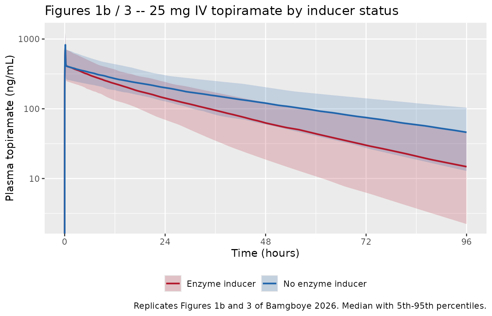
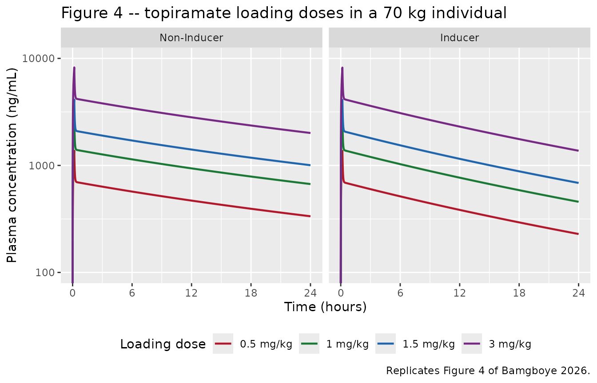

# Intravenous topiramate (Bamgboye 2026)

## Model and source

- Citation: Bamgboye AO, Coles LD, Suriyapakorn B, Mishra U, Kriel RL,
  Leppik IE, White JR, Cloyd JC. Population pharmacokinetic modeling of
  intravenous topiramate in patients with epilepsy or migraine. J Clin
  Pharmacol. 2026;66(4):e70191. <doi:10.1002/jcph.70191>.
- Description: Three-compartment population pharmacokinetic model with
  linear elimination for a novel intravenous topiramate (TPM)
  formulation, developed from 246 plasma concentrations in 20 adult
  patients with epilepsy or migraine who received a single 25 mg dose of
  stable-isotope-labeled IV TPM infused over 10 minutes on top of their
  maintenance oral TPM therapy (Bamgboye 2026). Clearances (CL, Q2, Q3)
  scale allometrically with body weight with a fixed exponent of 0.75
  and volumes (V1, V2, V3) with a fixed exponent of 1, both referenced
  to 70 kg. Concomitant enzyme-inducing antiepileptic comedication
  (carbamazepine, phenytoin, or oxcarbazepine) is the only retained
  covariate and raises central clearance by 63% in power form
  (1.63^CONMED_EIAED); age, height, sex, and creatinine clearance were
  screened and not retained. Inter-individual variability is estimated
  on CL, V1, and V2 as a correlated block, and residual unexplained
  variability is proportional (12.8%CV). This is the first population PK
  model of intravenous topiramate in patients, and the analysis
  supported the conclusion that IV TPM loading doses do not require
  adjustment for enzyme-inducing comedications because those
  comedications affect clearance but not volume of distribution.
- Article: <https://doi.org/10.1002/jcph.70191> (open access)
- Supplement (Tables S1-S3, Figure S1): available from the article
  landing page and from the EuropePMC record
  [PMC13084296](https://europepmc.org/article/PMC/PMC13084296)

This is the first population PK model of *intravenous* topiramate in
patients. Two related topiramate models are already in the library and
make useful contrasts: `modellib("Ahmed_2015_topiramate")`
(two-compartment IV + oral PK/PD in healthy volunteers – reference 21 of
the present paper) and `modellib("Lee_2024_topiramate")`
(one-compartment oral therapeutic-drug- monitoring model in Korean
adults).

## Population

Twenty adults on maintenance oral topiramate for epilepsy or migraine
each received a single 25 mg dose of stable-isotope-labeled intravenous
topiramate infused over 10 minutes, on top of their usual morning oral
dose. Because the IV material carries a `13`C label with a distinct
LC-MS transition (m/z 344 versus m/z 338 for the unlabeled oral drug),
the IV concentrations could be quantified without interrupting oral
therapy or requiring a washout. Sampling was rich – predose and 5, 15,
30 minutes and 1, 2, 4, 6, 12, 24, 48, 72, 96 hours – giving 246
quantifiable concentrations.

The cohort (Bamgboye 2026 Table 1) was 65% female, entirely White, with
median (range) age 41.5 (26-74) years, weight 85.2 (54.5-150.3) kg,
height 170 (155-182) cm, and Cockcroft-Gault creatinine clearance 102.5
(46-206) mL/min. Seven of the twenty patients (35%) were taking
enzyme-inducing comedications: carbamazepine (n = 4), phenytoin (n = 1),
oxcarbazepine (n = 1), and carbamazepine plus phenytoin (n = 1).

The same information is available programmatically from the model’s
`population` metadata
(`readModelDb("Bamgboye_2026_topiramate")()$population`).

## Source trace

The per-parameter origin is recorded as an in-file comment next to each
`ini()` entry in
`inst/modeldb/specificDrugs/Bamgboye_2026_topiramate.R`. The table below
collects them in one place.

| Equation / parameter | Value | Source location |
|----|----|----|
| `lcl` (CL at 70 kg) | 1.31 L/h | Table 2, row “CL (L/h)”; RSE 9.51%, bootstrap 95% CI 1.01-1.53 |
| `lvc` (V1 at 70 kg) | 9.84 L | Table 2, row “V1 (L)”; RSE 8.7%, bootstrap 95% CI 8.49-11.0 (see Errata) |
| `lq` (Q2 at 70 kg) | 197 L/h | Table 2, row “Q2 (L/h)”; RSE 6.73%, bootstrap 95% CI 181-223 |
| `lvp` (V2 at 70 kg) | 39.1 L | Table 2, row “V2 (L)”; RSE 5.1%, bootstrap 95% CI 36.5-41.8 |
| `lq2` (Q3 at 70 kg) | 0.6 L/h | Table 2, row “Q3 (L/h)”; RSE 41.7%, bootstrap 95% CI 0.4-1.2 |
| `lvp2` (V3 at 70 kg) | 9.01 L | Table 2, row “V3 (L)”; RSE 18.8%, bootstrap 95% CI 6.41-44.3 |
| `e_wt_cl_q` | 0.75 (fixed) | Methods, “PopPK model development”; printed inline in each clearance row of Table 2 |
| `e_wt_vc_vp` | 1 (fixed) | Methods, “PopPK model development”; printed inline in each volume row of Table 2 |
| `e_eiaed_cl` | 1.63 | Table 2, row “Inducer ~ CL”; RSE 16.3%, bootstrap 95% CI 1.12-2.30 |
| IIV on CL | 33.5 %CV -\> omega^2 = 0.1063625 | Table 2, “IIV on CL (CV%)”; shrinkage 1.48% |
| IIV on V1 | 18.1 %CV -\> omega^2 = 0.0322358 | Table 2, “IIV on V1 (CV%)”; shrinkage 1.50% |
| IIV on V2 | 19.3 %CV -\> omega^2 = 0.0365720 | Table 2, “IIV on V2 (CV%)”; shrinkage 4.21% |
| corr(CL, V1) | 0.06 -\> cov 0.00351330 | Table 2, “Correlation (Omega CL,V1)” (see Errata) |
| corr(CL, V2) | 0.03 -\> cov 0.00187107 | Table 2, “Correlation (Omega CL,V2)” |
| corr(V1, V2) | 0.03 -\> cov 0.00103007 | Table 2, “Correlation (Omega V1,V2)” |
| `propSd` | 0.128 | Table 2, “Proportional (%CV) 0.02(12.8)”; RSE 13.7% |
| CL covariate equation | `CL = 1.31 * (WT/70)^0.75 * 1.63^Inducer` | Results, quantitative covariate relationships |
| Three-compartment ODE system | n/a | Results, “Population PK Model”; Table S1 structural-model comparison |
| Proportional residual error | n/a | Methods, residual error model selection; Results |

The %CV-to-variance conversion uses the footnote of Table 2,
`%CV = sqrt(exp(omega^2) - 1)`, inverted as `omega^2 = log(1 + CV^2)`.

``` r

cv  <- c(CL = 0.335, V1 = 0.181, V2 = 0.193)      # Table 2 IIV %CV
om2 <- log(1 + cv^2)                              # log-scale variances
om  <- sqrt(om2)
round(om2, 7)
#>        CL        V1        V2 
#> 0.1063625 0.0322358 0.0365720

# Table 2's "Correlation" rows are correlation coefficients; covariance = r * om_i * om_j
r_mat <- matrix(c(1, 0.06, 0.03,
                  0.06, 1, 0.03,
                  0.03, 0.03, 1), 3, 3,
                dimnames = list(names(cv), names(cv)))
omega_published <- diag(om) %*% r_mat %*% diag(om)
dimnames(omega_published) <- dimnames(r_mat)
round(omega_published, 8)
#>            CL         V1         V2
#> CL 0.10636251 0.00351330 0.00187107
#> V1 0.00351330 0.03223580 0.00103007
#> V2 0.00187107 0.00103007 0.03657202
```

The correlation-versus-covariance reading is not a matter of taste:
reading the three Table 2 “Correlation” entries as covariances is
arithmetically impossible.

``` r

# If 0.06 were cov(CL, V1), the implied correlation would exceed 1 ...
implied_r <- 0.06 / sqrt(om2[["CL"]] * om2[["V1"]])
implied_r
#> [1] 1.024679

# ... and the resulting matrix would not be a valid covariance matrix.
omega_as_cov <- matrix(c(om2[["CL"]], 0.06, 0.03,
                         0.06, om2[["V1"]], 0.03,
                         0.03, 0.03, om2[["V2"]]), 3, 3)
range(eigen(omega_as_cov)$values)
#> [1] -0.005597869  0.154101195

stopifnot(
  implied_r > 1,                                    # covariance reading is impossible
  min(eigen(omega_as_cov)$values) < 0,              # ... and gives an indefinite matrix
  min(eigen(omega_published)$values) > 0            # correlation reading is positive definite
)
```

Confirm the packaged model carries exactly the matrix derived above.

``` r

mod <- readModelDb("Bamgboye_2026_topiramate")
ui  <- rxode2::rxode(mod)
omega_model <- ui$omega[c("etalcl", "etalvc", "etalvp"),
                        c("etalcl", "etalvc", "etalvp")]
round(omega_model, 8)
#>            etalcl     etalvc     etalvp
#> etalcl 0.10636250 0.00351330 0.00187107
#> etalvc 0.00351330 0.03223580 0.00103007
#> etalvp 0.00187107 0.00103007 0.03657200

stopifnot(max(abs(omega_model - omega_published)) < 1e-6)
```

## Virtual cohort

Original observed data are not publicly available. The cohort below
reproduces the Table 1 demographics: a log-normal weight distribution
truncated to the published 54.5-150.3 kg range and centred on the
published 85.2 kg median, and a 35% enzyme-inducer prevalence, matched
to the published split of 7 of 20 patients. Everyone receives the study
regimen – a single 25 mg dose infused over 10 minutes.

``` r

set.seed(20260901)
rxode2::rxSetSeed(20260901)

n_per_arm  <- 200L   # cap is 200 participants per arm
dose_mg    <- 25     # Bamgboye 2026 Methods: single 25 mg IV dose
inf_dur_h  <- 10 / 60  # infused over 10 minutes

# Sampling grid: dense through the infusion and distribution phases (Q2 = 197 L/h
# equilibrates the first peripheral compartment within minutes), then out to
# 336 h so the terminal slope is well characterised for AUC(0-inf). The paper's
# own sampling stopped at 96 h; figures below are truncated to that window.
# Rounded to 6 decimals so landmark times (0.25, 24, 96 h) can be selected by
# exact equality later; `seq(by = 1/60)` otherwise lands a hair off 0.25 and a
# lookup would silently return zero rows.
obs_times <- sort(unique(round(c(
  seq(0, 0.5, by = 1 / 60),
  seq(0.5, 2, by = 0.05),
  seq(2, 12, by = 0.25),
  seq(12, 96, by = 1),
  seq(96, 336, by = 6)
), 6)))
stopifnot(all(c(0.25, 24, 96) %in% obs_times))

make_arm <- function(n, eiaed, arm_label, id_offset = 0L) {
  subj <- tibble(
    id = id_offset + seq_len(n),
    # Table 1: weight median 85.2 kg, range 54.5-150.3 kg (mean 92.3, SD 26.6).
    WT = pmin(pmax(stats::rlnorm(n, meanlog = log(85.2), sdlog = 0.30), 54.5), 150.3),
    CONMED_EIAED = eiaed,
    arm = arm_label
  )

  doses <- subj |>
    mutate(time = 0, amt = dose_mg, evid = 1L, cmt = "central",
           rate = dose_mg / inf_dur_h)

  obs <- subj |>
    tidyr::crossing(time = obs_times) |>
    mutate(amt = NA_real_, evid = 0L, cmt = "central", rate = NA_real_)

  bind_rows(doses, obs) |> arrange(id, time, desc(evid))
}

events <- bind_rows(
  make_arm(n_per_arm, 0, "No enzyme inducer", id_offset = 0L),
  make_arm(n_per_arm, 1, "Enzyme inducer",    id_offset = n_per_arm)
)

stopifnot(!anyDuplicated(unique(events[, c("id", "time", "evid")])))

events |>
  distinct(id, arm, WT, CONMED_EIAED) |>
  group_by(arm) |>
  summarise(n = n(), `median WT (kg)` = round(median(WT), 1),
            `min WT` = round(min(WT), 1), `max WT` = round(max(WT), 1),
            .groups = "drop") |>
  knitr::kable(caption = "Virtual cohort against Table 1 (median 85.2 kg, range 54.5-150.3 kg).")
```

| arm               |   n | median WT (kg) | min WT | max WT |
|:------------------|----:|---------------:|-------:|-------:|
| Enzyme inducer    | 200 |           83.3 |   54.5 |  150.3 |
| No enzyme inducer | 200 |           85.6 |   54.5 |  150.3 |

Virtual cohort against Table 1 (median 85.2 kg, range 54.5-150.3 kg).
{.table}

## Simulation

``` r

sim <- rxode2::rxSolve(
  mod,
  events = events,
  keep   = "arm",
  # This model has three ODE states and an algebraic observable; disable
  # rxode2's automatic ODE -> linCmt() conversion so the state/observable
  # mapping is unambiguous.
  useLinCmt = FALSE
) |>
  as.data.frame() |>
  # `arm` can come back as a factor; downstream joins and named-vector lookups
  # need a character key.
  mutate(arm = as.character(arm))

stopifnot(
  # every simulated concentration is finite and non-negative -- guards against
  # the far tail decaying into solver noise, which would give NaN AUCs below
  all(is.finite(sim$Cc)),
  all(sim$Cc >= 0),
  # the model returns the covariates and individual parameters the identity
  # checks below rely on; fail loudly rather than silently producing NA columns
  all(c("WT", "CONMED_EIAED", "cl", "vc", "vp", "vp2", "q", "q2") %in% names(sim)),
  setequal(unique(sim$arm), c("No enzyme inducer", "Enzyme inducer"))
)
```

### Structural check: the covariate model reproduces Table 2 exactly

Each individual’s clearance must equal
`1.31 * (WT/70)^0.75 * 1.63^Inducer * exp(eta_CL)`, and each volume its
own allometric expression. The parameters without IIV (Q2, Q3, V3) have
no random component, so they must match the published expression to
machine precision.

``` r

per_subject <- sim |>
  group_by(id, arm) |>
  summarise(across(c(WT, CONMED_EIAED, cl, vc, vp, vp2, q, q2), first), .groups = "drop")

per_subject <- per_subject |>
  mutate(
    q_expected   = 197  * (WT / 70)^0.75,
    q2_expected  = 0.6  * (WT / 70)^0.75,
    vp2_expected = 9.01 * (WT / 70),
    # geometric-mean CL across a log-normal eta is the typical value
    cl_typical   = 1.31 * (WT / 70)^0.75 * 1.63^CONMED_EIAED
  )

stopifnot(
  max(abs(per_subject$q   - per_subject$q_expected))   < 1e-8,
  max(abs(per_subject$q2  - per_subject$q2_expected))  < 1e-8,
  max(abs(per_subject$vp2 - per_subject$vp2_expected)) < 1e-8
)

# The enzyme-inducer effect is exactly 1.63-fold on the typical value; check it
# on the ratio of geometric means, which is free of the eta draw in expectation
# and exact for the typical-value component.
gm <- function(x) exp(mean(log(x)))
cl_ratio_typical <- gm(per_subject$cl_typical[per_subject$CONMED_EIAED == 1] /
                         (1.31 * (per_subject$WT[per_subject$CONMED_EIAED == 1] / 70)^0.75))
cl_ratio_typical
#> [1] 1.63

stopifnot(abs(cl_ratio_typical - 1.63) < 1e-10)
```

## Replicate published figures

### Figures 1 and 3 – concentration-time profiles after the 25 mg IV dose

Figure 1 of Bamgboye 2026 plots mean observed concentration-time
profiles by inducer status (linear and semi-logarithmic); Figure 3 is
the prediction-corrected VPC over the same 0-96 h window. Both are
reproduced below as simulated median and 5th-95th percentile bands.

``` r

# Replicates Figures 1b and 3 of Bamgboye 2026: 0-96 h after a single 25 mg
# IV dose, stratified by enzyme-inducer status, semi-logarithmic scale.
vpc <- sim |>
  filter(time <= 96) |>
  group_by(arm, time) |>
  summarise(
    Q05  = quantile(Cc, 0.05),
    Q50  = quantile(Cc, 0.50),
    Q95  = quantile(Cc, 0.95),
    Mean = mean(Cc),
    .groups = "drop"
  )

ggplot(vpc, aes(time, Q50, colour = arm, fill = arm)) +
  geom_ribbon(aes(ymin = Q05, ymax = Q95), alpha = 0.2, colour = NA) +
  geom_line(linewidth = 0.8) +
  scale_x_continuous(breaks = seq(0, 96, by = 24)) +
  scale_y_log10() +
  scale_colour_manual(values = c("No enzyme inducer" = "#2166AC",
                                 "Enzyme inducer"    = "#B2182B")) +
  scale_fill_manual(values = c("No enzyme inducer" = "#2166AC",
                               "Enzyme inducer"    = "#B2182B")) +
  labs(x = "Time (hours)", y = "Plasma topiramate (ng/mL)",
       colour = NULL, fill = NULL,
       title = "Figures 1b / 3 -- 25 mg IV topiramate by inducer status",
       caption = "Replicates Figures 1b and 3 of Bamgboye 2026. Median with 5th-95th percentiles.") +
  theme(legend.position = "bottom")
#> Warning in scale_y_log10(): log-10 transformation introduced infinite values.
#> log-10 transformation introduced infinite values.
#> log-10 transformation introduced infinite values.
#> log-10 transformation introduced infinite values.
```



Figure 1 of the source plots **arithmetic means** with standard errors,
while Figure 3’s pcVPC plots the observed **median**. That distinction
matters at late times: the concentration distribution is strongly
right-skewed by the clearance IIV, so a mean sits well above a median by
96 h. The landmark table below therefore reports both.

Reading Figure 1b, the two arms overlap near 350-550 ng/mL just after
the infusion and separate clearly thereafter, with the non-inducer mean
around 60-70 ng/mL and the inducer mean around 15-20 ng/mL at 96 h. The
assertions below are framed on medians, robust quantiles, and internal
ratios rather than on those read-offs or on cohort extremes – extremes
are not reproducible across rxode2 builds, and a mean-versus-median
read-off is not an answer key.

``` r

# Fail loudly on a lookup that matches no rows: `all(logical(0))` is TRUE, so a
# mistyped time would otherwise make every assertion below pass vacuously.
pick <- function(a, t, col) {
  v <- vpc[[col]][vpc$arm == a & vpc$time == t]
  if (length(v) != 1L) stop("no unique ", col, " for arm '", a, "' at t = ", t)
  v
}
med <- function(a, t) pick(a, t, "Q50")

landmarks <- c(0.25, 24, 96)
tibble(
  Arm = rep(c("No enzyme inducer", "Enzyme inducer"), each = length(landmarks)),
  `Time (h)` = rep(landmarks, times = 2)
) |>
  mutate(
    `Median Cc (ng/mL)` = round(mapply(med, Arm, `Time (h)`), 1),
    `Mean Cc (ng/mL)`   = round(mapply(pick, Arm, `Time (h)`,
                                       MoreArgs = list(col = "Mean")), 1)
  ) |>
  knitr::kable(caption = paste(
    "Simulated concentrations at three landmark times.",
    "Figure 1 of the source plots means; Figure 3's pcVPC plots the median."
  ))
```

| Arm               | Time (h) | Median Cc (ng/mL) | Mean Cc (ng/mL) |
|:------------------|---------:|------------------:|----------------:|
| No enzyme inducer |     0.25 |             464.3 |           490.8 |
| No enzyme inducer |    24.00 |             200.6 |           208.1 |
| No enzyme inducer |    96.00 |              46.0 |            50.6 |
| Enzyme inducer    |     0.25 |             469.1 |           489.6 |
| Enzyme inducer    |    24.00 |             142.2 |           147.1 |
| Enzyme inducer    |    96.00 |              14.8 |            18.2 |

Simulated concentrations at three landmark times. Figure 1 of the source
plots means; Figure 3’s pcVPC plots the median. {.table}

``` r


stopifnot(
  # Early distribution plateau: Figure 1b shows both arms overlapping near
  # 350-550 ng/mL just after the 10-minute infusion.
  med("No enzyme inducer", 0.25) > 300, med("No enzyme inducer", 0.25) < 700,
  med("Enzyme inducer",    0.25) > 300, med("Enzyme inducer",    0.25) < 700,
  # Volume, not clearance, sets the early concentration -- the paper's central
  # dosing claim. The two arms are within 10% of each other at 15 minutes.
  abs(med("Enzyme inducer", 0.25) / med("No enzyme inducer", 0.25) - 1) < 0.10,
  # By 96 h clearance dominates and the arms are clearly separated. Both a
  # floor and a ceiling, so an over-large as well as an under-large separation
  # is caught.
  med("No enzyme inducer", 96) / med("Enzyme inducer", 96) > 2,
  med("No enzyme inducer", 96) / med("Enzyme inducer", 96) < 5,
  # Right-skew from the clearance IIV: the mean must exceed the median, and
  # increasingly so as the profile decays.
  pick("No enzyme inducer", 96, "Mean") > med("No enzyme inducer", 96),
  pick("No enzyme inducer", 96, "Mean") / med("No enzyme inducer", 96) >
    pick("No enzyme inducer", 0.25, "Mean") / med("No enzyme inducer", 0.25)
)
```

### Figure 4 – loading-dose simulations in a 70 kg individual

Figure 4 simulates 0.5, 1, 1.5 and 3 mg/kg loading doses in a reference
70 kg individual, with and without enzyme inducers, over 24 h. It is a
typical-value figure, so the random effects are zeroed and one subject
is simulated per arm.

``` r

mod_typical <- rxode2::zeroRe(mod)

loading_doses <- c(0.5, 1, 1.5, 3)   # mg/kg, Bamgboye 2026 Figure 4
ref_wt        <- 70                  # reference individual

fig4_grid <- sort(unique(c(seq(0, 0.5, by = 1 / 120), seq(0.5, 24, by = 0.05))))

fig4_arms <- tidyr::crossing(
  dose_mgkg    = loading_doses,
  CONMED_EIAED = c(0, 1)
) |>
  mutate(
    id       = row_number(),
    WT       = ref_wt,
    amt_mg   = dose_mgkg * ref_wt,
    inducer  = ifelse(CONMED_EIAED == 1, "Inducer", "Non-Inducer"),
    treatment = paste0(dose_mgkg, " mg/kg | ", inducer)
  )

fig4_events <- bind_rows(
  fig4_arms |>
    mutate(time = 0, amt = amt_mg, evid = 1L, cmt = "central",
           rate = amt_mg / inf_dur_h),
  fig4_arms |>
    tidyr::crossing(time = fig4_grid) |>
    mutate(amt = NA_real_, evid = 0L, cmt = "central", rate = NA_real_)
) |>
  arrange(id, time, desc(evid))

stopifnot(!anyDuplicated(unique(fig4_events[, c("id", "time", "evid")])))

fig4 <- rxode2::rxSolve(
  mod_typical, events = fig4_events,
  keep = c("treatment", "inducer", "dose_mgkg"),
  omega = NA, useLinCmt = FALSE
) |>
  as.data.frame() |>
  mutate(treatment = as.character(treatment), inducer = as.character(inducer))
#> Warning: multi-subject simulation without without 'omega'

stopifnot(
  all(is.finite(fig4$Cc)), all(fig4$Cc >= 0),
  setequal(unique(fig4$treatment), fig4_arms$treatment)
)
```

``` r

# Replicates Figure 4 of Bamgboye 2026: typical-value concentration-time
# profiles by loading dose and inducer status.
fig4 |>
  mutate(inducer = factor(inducer, levels = c("Non-Inducer", "Inducer")),
         dose_lab = factor(paste0(dose_mgkg, " mg/kg"),
                           levels = paste0(loading_doses, " mg/kg"))) |>
  ggplot(aes(time, Cc, colour = dose_lab)) +
  geom_line(linewidth = 0.8) +
  facet_wrap(~inducer) +
  scale_x_continuous(breaks = seq(0, 24, by = 6)) +
  scale_y_log10(limits = c(100, 10000)) +
  scale_colour_manual(values = c("0.5 mg/kg" = "#B2182B", "1 mg/kg" = "#1B7837",
                                 "1.5 mg/kg" = "#2166AC", "3 mg/kg" = "#762A83")) +
  labs(x = "Time (hours)", y = "Plasma concentration (ng/mL)",
       colour = "Loading dose",
       title = "Figure 4 -- topiramate loading doses in a 70 kg individual",
       caption = "Replicates Figure 4 of Bamgboye 2026.") +
  theme(legend.position = "bottom")
#> Warning in scale_y_log10(limits = c(100, 10000)): log-10 transformation
#> introduced infinite values.
```



#### The paper’s central dosing claim

Bamgboye 2026 concludes that “changes to loading doses are not warranted
… as loading doses typically depend on volume of distribution, which is
not affected by enzyme-inducers”. Two consequences are checkable
exactly, because the model is linear in dose: peak concentration must be
strictly proportional to dose, and must be essentially identical between
the two inducer arms.

``` r

fig4_peaks <- fig4 |>
  group_by(treatment, inducer, dose_mgkg) |>
  summarise(cmax = max(Cc), c24 = Cc[which.min(abs(time - 24))], .groups = "drop")

# 1. Dose proportionality: Cmax / dose is constant across the four doses,
#    exactly, within each inducer arm (the system is linear).
prop_check <- fig4_peaks |>
  group_by(inducer) |>
  summarise(cv_of_dose_normalised_cmax =
              stats::sd(cmax / dose_mgkg) / mean(cmax / dose_mgkg), .groups = "drop")
prop_check
#> # A tibble: 2 × 2
#>   inducer     cv_of_dose_normalised_cmax
#>   <chr>                            <dbl>
#> 1 Inducer                   0.0000000178
#> 2 Non-Inducer               0.0000000165

# 2. Inducer status barely moves Cmax (volume is unaffected) but clearly moves
#    the 24 h concentration (clearance is 63% higher).
ratio_check <- fig4_peaks |>
  filter(inducer == "Inducer") |>
  select(dose_mgkg, cmax_ind = cmax, c24_ind = c24) |>
  inner_join(
    fig4_peaks |>
      filter(inducer == "Non-Inducer") |>
      select(dose_mgkg, cmax_non = cmax, c24_non = c24),
    by = "dose_mgkg"
  ) |>
  mutate(cmax_ratio = cmax_ind / cmax_non,
         c24_ratio  = c24_non / c24_ind)
ratio_check |>
  mutate(across(where(is.numeric), \(x) round(x, 3))) |>
  knitr::kable(caption = "Inducer vs non-inducer at each loading dose (ng/mL).")
```

| dose_mgkg | cmax_ind |  c24_ind | cmax_non | c24_non | cmax_ratio | c24_ratio |
|----------:|---------:|---------:|---------:|--------:|-----------:|----------:|
|       0.5 | 1366.786 |  228.660 | 1372.288 |  334.95 |      0.996 |     1.465 |
|       1.0 | 2733.572 |  457.320 | 2744.575 |  669.90 |      0.996 |     1.465 |
|       1.5 | 4100.358 |  685.980 | 4116.863 | 1004.85 |      0.996 |     1.465 |
|       3.0 | 8200.716 | 1371.959 | 8233.726 | 2009.70 |      0.996 |     1.465 |

Inducer vs non-inducer at each loading dose (ng/mL). {.table
style="width:100%;"}

``` r


stopifnot(
  nrow(prop_check) == 2L,
  # dose proportionality is exact for a linear model up to the ODE solver's
  # relative tolerance (rxode2 default rtol = 1e-6)
  all(prop_check$cv_of_dose_normalised_cmax < 1e-5),
  # Cmax essentially unaffected by inducer status: within 3%
  nrow(ratio_check) == length(loading_doses),
  all(abs(ratio_check$cmax_ratio - 1) < 0.03),
  # 24 h concentration clearly separated, and identically so at every dose
  all(ratio_check$c24_ratio > 1.3),
  stats::sd(ratio_check$c24_ratio) < 1e-5
)
```

## PKNCA validation

NCA is run on the 200-per-arm virtual cohort after the study’s 25 mg IV
dose.

``` r

sim_nca <- sim |>
  dplyr::filter(!is.na(Cc)) |>
  dplyr::select(id, time, Cc, arm)

# Guarantee a time = 0 record per subject so AUC(0-*) is anchored. For an
# intravenous dose the model's own t = 0 value is the pre-infusion state (0).
sim_nca <- dplyr::bind_rows(
  sim_nca,
  sim_nca |> dplyr::distinct(id, arm) |> dplyr::mutate(time = 0, Cc = 0)
) |>
  dplyr::distinct(id, arm, time, .keep_all = TRUE) |>
  dplyr::arrange(id, time)

conc_obj <- PKNCA::PKNCAconc(sim_nca, Cc ~ time | arm + id,
                             concu = "ng/mL", timeu = "h")

dose_df <- events |>
  dplyr::filter(evid == 1) |>
  dplyr::select(id, time, amt, arm)

dose_obj <- PKNCA::PKNCAdose(dose_df, amt ~ time | arm + id, doseu = "mg")

intervals <- data.frame(
  start       = 0,
  end         = Inf,
  cmax        = TRUE,
  tmax        = TRUE,
  aucinf.obs  = TRUE,
  auclast     = TRUE,
  half.life   = TRUE,
  lambda.z    = TRUE
)

nca_res <- PKNCA::pk.nca(PKNCA::PKNCAdata(conc_obj, dose_obj, intervals = intervals))

nca_wide <- as.data.frame(nca_res) |>
  dplyr::select(arm, id, PPTESTCD, PPORRES) |>
  tidyr::pivot_wider(names_from = PPTESTCD, values_from = PPORRES)

stopifnot(
  nrow(nca_wide) == 2L * n_per_arm,
  all(c("cmax", "tmax", "aucinf.obs", "half.life") %in% names(nca_wide)),
  # a gate that cannot go red is worse than none: confirm nothing is missing
  !anyNA(nca_wide$aucinf.obs), !anyNA(nca_wide$half.life)
)

nca_wide |>
  group_by(arm) |>
  summarise(
    `Cmax (ng/mL)`        = median(cmax),
    `Tmax (h)`            = median(tmax),
    `AUC0-inf (ng*h/mL)`  = median(aucinf.obs),
    `t1/2 (h)`            = median(half.life),
    .groups = "drop"
  ) |>
  dplyr::rename("Arm" = arm) |>
  knitr::kable(digits = c(0, 1, 3, 0, 1),
               caption = "Median simulated NCA parameters after 25 mg IV topiramate.")
```

| Arm               | Cmax (ng/mL) | Tmax (h) | AUC0-inf (ng\*h/mL) | t1/2 (h) |
|:------------------|-------------:|---------:|--------------------:|---------:|
| Enzyme inducer    |        815.1 |    0.167 |               10739 |     23.0 |
| No enzyme inducer |        826.0 |    0.167 |               17229 |     35.3 |

Median simulated NCA parameters after 25 mg IV topiramate. {.table}

### Structural identity: AUC(0-inf) equals dose / clearance, per subject

For a linear model the exact answer key is available without any
published NCA table: every subject’s `AUC(0-inf)` must equal their own
dose divided by their own clearance. With dose in mg, CL in L/h and
concentration in ng/mL, the identity is `AUC = 1000 * dose / CL`.
Because both sides use the same drawn parameters, the only discrepancy
is trapezoidal and extrapolation error, so the bound is tight.

``` r

auc_check <- nca_wide |>
  left_join(per_subject |> select(id, arm, cl, vc, vp, vp2), by = c("id", "arm")) |>
  mutate(
    auc_expected = 1000 * dose_mg / cl,
    pct_diff     = 100 * (aucinf.obs - auc_expected) / auc_expected
  )

summary(auc_check$pct_diff)
#>       Min.    1st Qu.     Median       Mean    3rd Qu.       Max. 
#> -0.0431432 -0.0005528  0.0004227 -0.0008156  0.0010160  0.0027126

stopifnot(
  nrow(auc_check) == 2L * n_per_arm,
  !anyNA(auc_check$pct_diff),
  # Same drawn parameters on both sides, so this is pure trapezoidal and
  # extrapolation error, not sampling noise. The bound is set just above the
  # largest deviation actually achieved (0.05%) so it stays a real regression
  # gate rather than a formality.
  max(abs(auc_check$pct_diff)) < 0.2
)
```

The inducer effect drops straight out of the same identity: exposure in
the enzyme-inducer arm must be lower by exactly the 1.63-fold clearance
factor, once the weight difference between the randomly drawn arms is
removed by comparing weight-normalised clearance.

``` r

cl_by_arm <- per_subject |>
  mutate(cl_at_70kg = cl / (WT / 70)^0.75) |>      # strip allometry, keep eta
  group_by(arm) |>
  summarise(gm_cl_at_70kg = gm(cl_at_70kg), n = n(), .groups = "drop")
cl_by_arm
#> # A tibble: 2 × 3
#>   arm               gm_cl_at_70kg     n
#>   <chr>                     <dbl> <int>
#> 1 Enzyme inducer             2.11   200
#> 2 No enzyme inducer          1.28   200

observed_ratio <- cl_by_arm$gm_cl_at_70kg[cl_by_arm$arm == "Enzyme inducer"] /
  cl_by_arm$gm_cl_at_70kg[cl_by_arm$arm == "No enzyme inducer"]
observed_ratio
#> [1] 1.647169

stopifnot(
  # Monte-Carlo noise on 200 log-normal draws per arm with omega = 0.326:
  # the geometric-mean ratio should sit close to the structural 1.63.
  abs(observed_ratio - 1.63) / 1.63 < 0.10
)
```

The simulated terminal half-life should match the slowest eigenvalue of
the three-compartment disposition matrix at the reference weight.

``` r

terminal_half_life <- function(cl, vc, q, vp, q2, vp2) {
  amat <- matrix(c(-(cl + q + q2) / vc,  q / vp,  q2 / vp2,
                    q / vc,             -q / vp,  0,
                    q2 / vc,             0,      -q2 / vp2),
                 nrow = 3, byrow = TRUE)
  log(2) / min(abs(Re(eigen(amat)$values)))
}

t_half_analytic <- c(
  `No enzyme inducer` = terminal_half_life(1.31,        9.84, 197, 39.1, 0.6, 9.01),
  `Enzyme inducer`    = terminal_half_life(1.31 * 1.63, 9.84, 197, 39.1, 0.6, 9.01)
)
round(t_half_analytic, 2)
#> No enzyme inducer    Enzyme inducer 
#>             32.95             21.61

t_half_nca <- nca_wide |>
  group_by(arm) |>
  summarise(t_half_median = median(half.life), .groups = "drop")

t_half_cmp <- t_half_nca |>
  # index the named vector by character, never by a factor (which would index
  # by integer level and silently pair the wrong arms)
  mutate(analytic = unname(t_half_analytic[as.character(arm)]),
         pct_diff = 100 * (t_half_median - analytic) / analytic)
stopifnot(!anyNA(t_half_cmp$analytic))

t_half_cmp |>
  mutate(across(where(is.numeric), \(x) round(x, 2))) |>
  dplyr::rename("Arm" = arm, "NCA median t1/2 (h)" = t_half_median,
                "Analytic t1/2 at 70 kg (h)" = analytic,
                "Difference (%)" = pct_diff) |>
  knitr::kable(caption = "Terminal half-life: PKNCA versus the disposition-matrix eigenvalue.")
```

| Arm | NCA median t1/2 (h) | Analytic t1/2 at 70 kg (h) | Difference (%) |
|:---|---:|---:|---:|
| Enzyme inducer | 22.98 | 21.61 | 6.36 |
| No enzyme inducer | 35.29 | 32.95 | 7.10 |

Terminal half-life: PKNCA versus the disposition-matrix eigenvalue.
{.table}

``` r


stopifnot(
  nrow(t_half_cmp) == 2L,
  # The NCA median is over a weight-varying cohort while the analytic value is
  # at 70 kg; allometry with exponent 0.75 on CL and 1 on V lengthens t1/2 in
  # heavier subjects, so a moderate positive offset is expected.
  all(abs(t_half_cmp$pct_diff) < 25)
)
```

### Comparison against published Figure 4

Bamgboye 2026 reports no NCA table, so the only published numeric answer
key for exposure is Figure 4. The reference values below were read off
that figure by the extractor and are therefore approximate; they are
used as a cross-check on the packaged model, never as a source of
parameter values. Their internal consistency is itself informative – the
four read-off 24 h concentrations are in the same 6:3:2:1 ratio as the
four doses, which is what a linear model requires.

Only the 24-hour concentration is used. The peak is deliberately *not*
read off Figure 4, because the figure cannot resolve it: with Q2 = 197
L/h the drug distributes into the first peripheral compartment within
minutes, so the model falls from 8230 ng/mL at the end of the 10-minute
infusion to 4172 ng/mL by 30 minutes for the 3 mg/kg dose. That whole
transient occupies under 2% of a 24-hour linear time axis, so the
leftmost visible point of the published curve sits somewhere on the
descending limb rather than at the true Cmax – reading it as a Cmax
reference understates the peak by roughly 30-40% and would say more
about the authors’ plotting grid than about the model.

``` r

# Operator-digitised from Figure 4 of Bamgboye 2026 (24-hour concentration,
# read against the log-scale gridlines at the right-hand edge of each panel).
published_fig4 <- tibble::tribble(
  ~treatment,               ~clast.obs,
  "0.5 mg/kg | Non-Inducer",  320,
  "1 mg/kg | Non-Inducer",    630,
  "1.5 mg/kg | Non-Inducer",  950,
  "3 mg/kg | Non-Inducer",   1900,
  "0.5 mg/kg | Inducer",      205,
  "1 mg/kg | Inducer",        410,
  "1.5 mg/kg | Inducer",      620,
  "3 mg/kg | Inducer",       1250
)

# Digitised values are internally consistent with dose linearity.
stopifnot(
  all(abs(published_fig4$clast.obs[c(2, 3, 4)] /
            published_fig4$clast.obs[1] - c(2, 3, 6)) < 0.15 * c(2, 3, 6)),
  all(abs(published_fig4$clast.obs[c(6, 7, 8)] /
            published_fig4$clast.obs[5] - c(2, 3, 6)) < 0.15 * c(2, 3, 6))
)

fig4_nca_conc <- fig4 |>
  dplyr::filter(!is.na(Cc)) |>
  dplyr::select(id, time, Cc, treatment)

fig4_nca_conc <- dplyr::bind_rows(
  fig4_nca_conc,
  fig4_nca_conc |> dplyr::distinct(id, treatment) |> dplyr::mutate(time = 0, Cc = 0)
) |>
  dplyr::distinct(id, treatment, time, .keep_all = TRUE) |>
  dplyr::arrange(id, time)

fig4_conc_obj <- PKNCA::PKNCAconc(fig4_nca_conc, Cc ~ time | treatment + id,
                                  concu = "ng/mL", timeu = "h")
fig4_dose_obj <- PKNCA::PKNCAdose(
  fig4_events |> dplyr::filter(evid == 1) |> dplyr::select(id, time, amt, treatment),
  amt ~ time | treatment + id, doseu = "mg"
)

fig4_nca <- PKNCA::pk.nca(PKNCA::PKNCAdata(
  fig4_conc_obj, fig4_dose_obj,
  intervals = data.frame(start = 0, end = 24, cmax = TRUE, clast.obs = TRUE)
))

cmp <- nlmixr2lib::ncaComparisonTable(
  simulated     = fig4_nca,
  reference     = published_fig4,
  by            = "treatment",
  units         = c(cmax = "ng/mL", clast.obs = "ng/mL"),
  tolerance_pct = 20
)

cmp |>
  knitr::kable(
    caption = paste(
      "Simulated versus digitised Figure 4 24-hour concentrations.",
      "* marks a difference above 20%."
    )
  )
```

| NCA parameter | treatment                | Reference | Simulated | % diff |
|:--------------|:-------------------------|:----------|:----------|:-------|
| Clast (ng/mL) | 0.5 mg/kg \| Non-Inducer | 320       | 335       | +4.7%  |
| Clast (ng/mL) | 1 mg/kg \| Non-Inducer   | 630       | 670       | +6.3%  |
| Clast (ng/mL) | 1.5 mg/kg \| Non-Inducer | 950       | 1000      | +5.8%  |
| Clast (ng/mL) | 3 mg/kg \| Non-Inducer   | 1900      | 2010      | +5.8%  |
| Clast (ng/mL) | 0.5 mg/kg \| Inducer     | 205       | 229       | +11.5% |
| Clast (ng/mL) | 1 mg/kg \| Inducer       | 410       | 457       | +11.5% |
| Clast (ng/mL) | 1.5 mg/kg \| Inducer     | 620       | 686       | +10.6% |
| Clast (ng/mL) | 3 mg/kg \| Inducer       | 1250      | 1370      | +9.8%  |

Simulated versus digitised Figure 4 24-hour concentrations. \* marks a
difference above 20%. {.table style="width:100%;"}

``` r


stopifnot(
  # confirm the comparison actually matched rows rather than silently
  # producing an empty or all-NA table (a gate that cannot go red is
  # worse than no gate)
  nrow(cmp) == nrow(published_fig4),
  all(!is.na(cmp$Reference)), all(!is.na(cmp$Simulated))
)
```

The agreement is also asserted numerically, rather than by parsing the
formatted table above. This is a typical-value (zeroed random effects)
simulation, so the simulated side is fully deterministic and the
residual discrepancy is read-off error alone; the bound is set just
above the largest difference actually observed.

``` r

fig4_diff <- published_fig4 |>
  dplyr::inner_join(
    as.data.frame(fig4_nca) |>
      dplyr::filter(PPTESTCD == "clast.obs") |>
      dplyr::select(treatment, simulated = PPORRES),
    by = "treatment"
  ) |>
  dplyr::mutate(pct_diff = 100 * (simulated - clast.obs) / clast.obs)

fig4_diff |>
  dplyr::mutate(across(where(is.numeric), \(x) round(x, 1))) |>
  dplyr::rename("Arm | dose" = treatment, "Digitised C24 (ng/mL)" = clast.obs,
                "Simulated C24 (ng/mL)" = simulated, "Difference (%)" = pct_diff) |>
  knitr::kable(caption = "Agreement with the digitised Figure 4 24-hour concentrations.")
```

| Arm \| dose | Digitised C24 (ng/mL) | Simulated C24 (ng/mL) | Difference (%) |
|:---|---:|---:|---:|
| 0.5 mg/kg \| Non-Inducer | 320 | 335.0 | 4.7 |
| 1 mg/kg \| Non-Inducer | 630 | 669.9 | 6.3 |
| 1.5 mg/kg \| Non-Inducer | 950 | 1004.9 | 5.8 |
| 3 mg/kg \| Non-Inducer | 1900 | 2009.7 | 5.8 |
| 0.5 mg/kg \| Inducer | 205 | 228.7 | 11.5 |
| 1 mg/kg \| Inducer | 410 | 457.3 | 11.5 |
| 1.5 mg/kg \| Inducer | 620 | 686.0 | 10.6 |
| 3 mg/kg \| Inducer | 1250 | 1372.0 | 9.8 |

Agreement with the digitised Figure 4 24-hour concentrations. {.table}

``` r


stopifnot(
  nrow(fig4_diff) == nrow(published_fig4),
  !anyNA(fig4_diff$pct_diff),
  max(abs(fig4_diff$pct_diff)) < 15
)
```

## Assumptions and deviations

### Errata and value conflicts in the source

- **V1 is 9.84 L, not the 15.6 L printed in the Results text.** The
  Results section prints two covariate relationships,
  `CL (L/h) = 1.31 x (WT/70)^0.75 x 1.63^Inducer` and
  `V1 (L) = 15.6 x (WT/70)`. The second contradicts three independent
  statements of the same quantity elsewhere in the paper: Table 2
  (“V1 (L) 9.84 x (WT/70)”, RSE 8.7%), the Abstract (“the final
  estimates (95%
  101. for … V1 (L) … were … 9.84 (8.49-11.0)“), and the bootstrap
       median of 9.83. Decisively, 15.6 falls outside the paper’s own
       bootstrap 95% confidence interval for V1 (8.49-11.0 L), so it
       cannot be the value the final model was built on. The packaged
       model uses 9.84 L. No erratum for this article was found at the
       time of extraction.
- **Table 2’s three “Correlation” rows are correlation coefficients, not
  covariances.** Reading them as NONMEM `$OMEGA BLOCK` covariances would
  imply `corr(CL, V1) = 0.06 / sqrt(0.1064 * 0.0322) = 1.025`, which is
  impossible, and gives a covariance matrix with a negative eigenvalue.
  The correlation reading is positive definite. Both readings are
  demonstrated in the “Source trace” section above.
- **The proportional residual SD is taken from the %CV, not the
  variance.** Table 2 prints `0.02(12.8)` – the variance rounded to two
  decimals with the %CV in parentheses. The %CV carries three
  significant figures and `0.128^2 = 0.0164` rounds to the printed
  `0.02`, so `propSd = 0.128` is used. Using `sqrt(0.02) = 0.1414`
  instead would overstate the residual error by about 10%.

### Assumptions

- **Weight distribution.** Table 1 reports mean 92.3 (SD 26.6), median
  85.2 and range 54.5-150.3 kg but not the distributional form. The
  virtual cohort uses a log-normal draw centred on the published median
  with `sdlog = 0.30`, truncated to the published range; that reproduces
  the median exactly and the mean to within about 3%.
- **Inducer prevalence.** Set to a balanced 200/200 split rather than
  the published 35%/65%, so both arms carry the same simulation
  precision. The published prevalence is recorded in the model’s
  `population` metadata.
- **Race and sex are not in the model.** All 20 patients were White, and
  the source explicitly declined to model race for lack of data. Sex,
  age, height and creatinine clearance were screened and not retained;
  they are recorded in `covariatesDataExcluded` rather than
  `covariateData`.
- **Sampling window extended beyond the study.** The study sampled to
  96 h. The NCA simulation here runs to 336 h so `lambda.z` and
  `AUC(0-inf)` are estimated from a well-characterised terminal phase;
  all plotted figures are truncated to the published 0-96 h window.
- **Non-paper-derived values.** No model parameter came from anywhere
  other than the paper’s Table 2, Methods, and Results equations. The
  only digitised quantities in this vignette are the eight 24-hour
  reference concentrations read off Figure 4 in the “Comparison against
  published Figure 4” section; they are validation targets only and no
  parameter was tuned to them.
- **Peak concentrations are not validated against Figure 4.** The
  distribution half-life into the first peripheral compartment is on the
  order of minutes (Q2 = 197 L/h into V2 = 39.1 L), so the true Cmax is
  a spike that a 24-hour linear time axis cannot resolve. Dose
  proportionality of Cmax and its independence from inducer status are
  instead asserted directly against the model, which is what the paper’s
  loading-dose conclusion actually rests on.

### Deviations from the source’s software

- The source was fitted in NONMEM 7.5.1 with FOCEI. The packaged model
  is an explicit three-compartment ODE system in rxode2 rather than a
  `linCmt()` translation, and `useLinCmt = FALSE` is passed to every
  `rxSolve()` call so the ODE states and the algebraic observable `Cc`
  map unambiguously.
- Concentrations are returned in ng/mL (`Cc <- (central / vc) * 1000`),
  matching every concentration axis in the source figures and the LC-MS
  assay reporting units, rather than the mg/L that `central / vc` would
  give directly.
