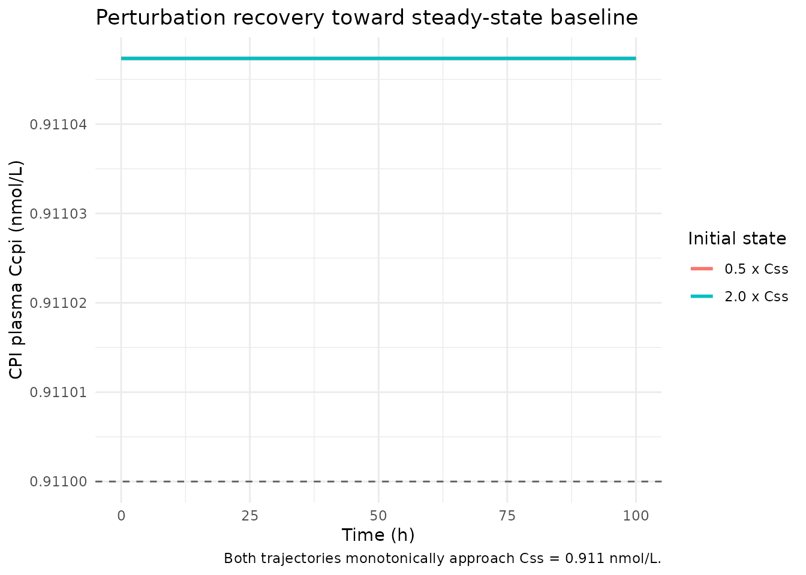
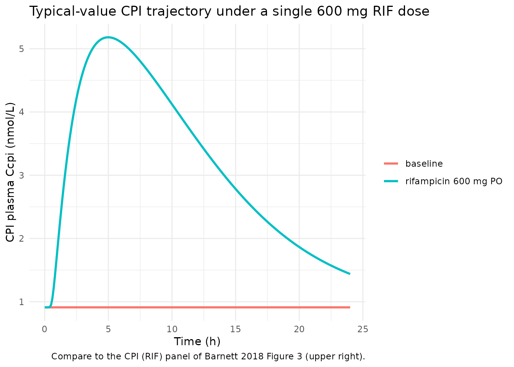

# Coproporphyrin I (Barnett 2018)

## Model and source

- Citation: Barnett S, Ogungbenro K, Menochet K, Shen H, Lai Y,
  Humphreys WG, Galetin A. Gaining Mechanistic Insight Into
  Coproporphyrin I as Endogenous Biomarker for OATP1B-Mediated Drug-Drug
  Interactions Using Population Pharmacokinetic Modeling and Simulation.
  Clin Pharmacol Ther. 2018;104(3):564-574. <doi:10.1002/cpt.983>. The
  rifampicin perpetrator PK is parameterised in
  modellib(‘Barnett_2018_rifampicin’); supply its central-compartment
  concentration as CP_RIF_UM (umol/L) to drive the competitive OATP1B
  inhibition term in this model.
- Description: Semi-mechanistic turnover model for the endogenous
  OATP1B-substrate biomarker coproporphyrin I (CPI) in healthy adult
  males (Barnett 2018), with simultaneous plasma and urine outputs and
  competitive rifampicin inhibition of biliary CPI clearance. CPI is
  produced at a zero-order synthesis rate ksyn, distributed in volume
  Vcpi, and eliminated via biliary clearance CLb,CPI (the dominant
  route, ~88% of total CL under baseline conditions) and renal clearance
  CLr,CPI. Rifampicin inhibits CLb,CPI competitively through KiCPI
  driven by the instantaneous plasma rifampicin concentration; CLr,CPI
  and ksyn are unaffected. A binary RIF-coadministration covariate
  additionally captures a paper-reported ~50% reduction in Vcpi during
  the rifampicin phase (Barnett 2018 Table 1).
- Article: <https://doi.org/10.1002/cpt.983>

## Population and biological context

Coproporphyrin I (CPI) is a heme-biosynthesis byproduct produced
predominantly in erythrocytes, with ALA-synthase considered the
rate-limiting step of its formation (Barnett 2018 Introduction). CPI is
a selective in-vitro substrate of OATP1B1 and OATP1B3 with no
involvement of OATP2B1 or renal uptake transporters in the available
data. Its plasma concentrations are reported to be stable between
occasions and have low interindividual variability (\< 25% CV) in
subjects with SLCO1B1 c.521 T\>C wildtype, making it a candidate
endogenous biomarker for OATP1B-mediated drug-drug interactions.

Barnett 2018 developed the semi-mechanistic CPI model jointly with the
rifampicin and rosuvastatin popPK models in 12 healthy adult male
volunteers (Lai et al. 2016 cohort, SLCO1B1 wildtype). The cohort
underwent three study occasions (rifampicin-only on OCC1,
rosuvastatin-only on OCC2, combined rifampicin + rosuvastatin on OCC3)
with a 7-day washout between occasions; baseline CPI plasma and urine
samples were collected on every occasion in addition to post-dose
monitoring. The 420 CPI plasma samples (OCC1 = 144, OCC2 = 144, OCC3 =
132) plus 102 CPI urine samples were fit simultaneously in NONMEM under
FOCE. Identifiability of the structural model was confirmed in DAISY.

The same context is available programmatically via
`readModelDb("Barnett_2018_coproporphyrin_I")$population`.

## Source trace

| Equation / parameter | Value | Source location |
|----|----|----|
| `lksyn` | log(12.7) | Barnett 2018 Table 1, CPI row ‘k syn (nM/h)’ = 12.7 (SE 6%) – but see Errata below on the ‘nM/h’ label |
| `lclb` | log(12.3) | Barnett 2018 Table 1, CPI row ‘CL b,CPI (L/h)’ = 12.3 |
| `lclr` | log(1.64) | Barnett 2018 Table 1, CPI row ‘CL R,CPI (L/h)’ = 1.64 |
| `lvc` (baseline) | log(6.59) | Barnett 2018 Table 1, CPI row ‘V CPI (L)’ = 6.59 |
| `e_rif_vc` | -0.4841 | Barnett 2018 Table 1, CPI row ‘V CPI (L) (RIF)’ = 3.4; derived as 3.4 / 6.59 - 1 |
| `lki` | log(1.15) | Barnett 2018 Table 1, CPI row ‘Ki CPI (uM) c’ = 1.15 (footnote c: unbound Ki = 0.13 uM after RIF fu = 0.11) |
| `propSd` (plasma) | 0.139 | Barnett 2018 Table 1, CPI row ‘r prop (%) - plasma’ = 13.9 |
| `addSd` (plasma) | 0.001 nmol/L FIXED | Barnett 2018 Table 1, CPI row ‘r add (nM) - plasma’ = 0.001 FIXED |
| `propSd_Ucpi` | 0.342 | Barnett 2018 Table 1, CPI row ‘r prop (%) - urine’ = 34.2 |
| `addSd_Ucpi` | 2.69 nmol/L | Barnett 2018 Table 1, CPI row ‘r add (nM) - urine’ = 2.69 |
| ODE form | n/a | Barnett 2018 Eq. 3 (baseline) + Eq. 4 (RIF inhibition) + Eq. 5 (urine accumulation) |
| Steady-state baseline (analytic) | `ksyn / (CLb + CLr)` | Derived from Eq. 3 dC/dt = 0; equals 12.7 / (12.3 + 1.64) = 0.911 nmol/L (= nM) |

### Units of every ODE term (dimensional analysis)

| Term in `d/dt(central) = ksyn - (CLb_eff + CLr) * Ccpi` | Units |
|----|----|
| `central` (state) | nmol |
| `ksyn` | nmol / h |
| `CLb_eff`, `CLr` | L / h |
| `Ccpi = central / vc` | nmol / L |
| `(CLb_eff + CLr) * Ccpi` | L / h \* nmol / L = nmol / h |
| `d/dt(central)` | nmol / h ok |
| `d/dt(urine) = CLr * Ccpi` | nmol / h ok |

## Steady-state check (no RIF, deterministic typical-value)

This verifies the analytic baseline `Css = ksyn / (CLb + CLr)` and the
absence of spurious drift in the ODE solver.

``` r

mod <- readModelDb("Barnett_2018_coproporphyrin_I")
mod_typical <- rxode2::zeroRe(mod)
#> ℹ parameter labels from comments will be replaced by 'label()'
#> Warning: some etas defaulted to non-mu referenced, possible parsing error: etaiov_ksyn_1, etaiov_ksyn_2, etaiov_ksyn_3, etaiov_clb_1, etaiov_clb_2, etaiov_clb_3
#> as a work-around try putting the mu-referenced expression on a simple line
#> Warning: some etas defaulted to non-mu referenced, possible parsing error: etaiov_ksyn_1, etaiov_ksyn_2, etaiov_ksyn_3, etaiov_clb_1, etaiov_clb_2, etaiov_clb_3
#> as a work-around try putting the mu-referenced expression on a simple line

make_cpi_events <- function(t_end = 120, dt = 2, conmed_rif = 0, crif = 0, occ = 1) {
  data.frame(
    id   = 1L,
    time = seq(0, t_end, by = dt),
    evid = 0L,
    amt  = 0,
    cmt  = "Cc",
    OCC  = occ,
    CONMED_RIF = conmed_rif,
    CP_RIF_UM  = crif
  )
}

ss_sim <- rxode2::rxSolve(mod_typical, events = make_cpi_events(t_end = 200))
#> ℹ omega/sigma items treated as zero: 'etalksyn', 'etalclb', 'etalclr', 'etalvc', 'etalki', 'etaiov_ksyn_1', 'etaiov_ksyn_2', 'etaiov_ksyn_3', 'etaiov_clb_1', 'etaiov_clb_2', 'etaiov_clb_3'
cat("CPI typical-value baseline (no RIF):\n")
#> CPI typical-value baseline (no RIF):
cat("  Ccpi(t=0)  :", round(ss_sim$Cc[1], 4), "nmol/L\n")
#>   Ccpi(t=0)  : 0.911 nmol/L
cat("  Ccpi(t=200):", round(tail(ss_sim$Cc, 1), 4), "nmol/L\n")
#>   Ccpi(t=200): 0.911 nmol/L
cat("  Drift over 200 h:", signif(diff(range(ss_sim$Cc)), 3), "nmol/L\n")
#>   Drift over 200 h: 2.6e-08 nmol/L
cat("  Analytic Css (ksyn / (CLb + CLr) = 12.7 / 13.94):",
    round(12.7 / (12.3 + 1.64), 4), "nmol/L\n")
#>   Analytic Css (ksyn / (CLb + CLr) = 12.7 / 13.94): 0.911 nmol/L
stopifnot(diff(range(ss_sim$Cc)) < 1e-6)
```

The simulator holds the analytic baseline indefinitely within numerical
tolerance.

## Perturbation-recovery (no RIF, displaced initial condition)

Displacing the central state to 0.5x and 2x the steady-state amount
should give a monotone recovery to the baseline.

``` r

ev <- make_cpi_events(t_end = 100, dt = 0.5)
ic_amount_baseline <- 0.911 * 6.59  # Css * Vcpi at baseline

sim_low  <- rxode2::rxSolve(mod_typical, events = ev,
                            inits = c(central = 0.5 * ic_amount_baseline, urine = 0))
#> ℹ omega/sigma items treated as zero: 'etalksyn', 'etalclb', 'etalclr', 'etalvc', 'etalki', 'etaiov_ksyn_1', 'etaiov_ksyn_2', 'etaiov_ksyn_3', 'etaiov_clb_1', 'etaiov_clb_2', 'etaiov_clb_3'
sim_high <- rxode2::rxSolve(mod_typical, events = ev,
                            inits = c(central = 2.0 * ic_amount_baseline, urine = 0))
#> ℹ omega/sigma items treated as zero: 'etalksyn', 'etalclb', 'etalclr', 'etalvc', 'etalki', 'etaiov_ksyn_1', 'etaiov_ksyn_2', 'etaiov_ksyn_3', 'etaiov_clb_1', 'etaiov_clb_2', 'etaiov_clb_3'

cat("Perturbation recovery toward Css = 0.911 nmol/L:\n")
#> Perturbation recovery toward Css = 0.911 nmol/L:
cat("  Start  0.5x:", round(sim_low$Cc[1], 4),
    "  End:", round(tail(sim_low$Cc, 1), 4), "nmol/L\n")
#>   Start  0.5x: 0.911   End: 0.911 nmol/L
cat("  Start  2.0x:", round(sim_high$Cc[1], 4),
    "  End:", round(tail(sim_high$Cc, 1), 4), "nmol/L\n")
#>   Start  2.0x: 0.911   End: 0.911 nmol/L
```

``` r

recovery <- dplyr::bind_rows(
  sim_low  |> as.data.frame() |> dplyr::mutate(start = "0.5 x Css"),
  sim_high |> as.data.frame() |> dplyr::mutate(start = "2.0 x Css")
)
ggplot(recovery, aes(time, Cc, colour = start)) +
  geom_line(linewidth = 1) +
  geom_hline(yintercept = 0.911, linetype = "dashed", alpha = 0.6) +
  labs(x = "Time (h)", y = "CPI plasma Ccpi (nmol/L)",
       title = "Perturbation recovery toward steady-state baseline",
       colour = "Initial state",
       caption = "Both trajectories monotonically approach Css = 0.911 nmol/L.") +
  theme_minimal()
```



## Rifampicin perturbation (reproduces Figure 3 upper-panel pattern)

Barnett 2018 Figure 3 shows the VPC of CPI plasma data superimposed
under the rifampicin phase (CPI (RIF), upper-right panel). The clinical
observation is that a single 600 mg oral rifampicin dose raises CPI
plasma 2-5x over the next ~8 h, with recovery toward baseline by 24 h.
Reproduce the typical-value trajectory by simulating the rifampicin
model first and feeding its central-compartment concentration as
`CP_RIF_UM` on the CPI event table.

``` r

# Step 1: simulate the rifampicin typical-value PK over 24 h
mod_rif <- rxode2::zeroRe(readModelDb("Barnett_2018_rifampicin"))
#> ℹ parameter labels from comments will be replaced by 'label()'
#> Warning: some etas defaulted to non-mu referenced, possible parsing error: etaiov_ka_1, etaiov_ka_2, etaiov_ka_3, etaiov_vc_1, etaiov_vc_2, etaiov_vc_3, etaiov_mtt_1, etaiov_mtt_2, etaiov_mtt_3
#> as a work-around try putting the mu-referenced expression on a simple line
#> Warning: some etas defaulted to non-mu referenced, possible parsing error: etaiov_ka_1, etaiov_ka_2, etaiov_ka_3, etaiov_vc_1, etaiov_vc_2, etaiov_vc_3, etaiov_mtt_1, etaiov_mtt_2, etaiov_mtt_3
#> as a work-around try putting the mu-referenced expression on a simple line
ev_rif <- rxode2::et(amt = 600, cmt = "depot", time = 0) |>
  rxode2::et(time = seq(0.05, 24, by = 0.05), cmt = "Cc") |>
  as.data.frame()
ev_rif$OCC <- 1
sim_rif <- rxode2::rxSolve(mod_rif, events = ev_rif) |> as.data.frame()
#> rxode2 already building model, waiting for lock file removal
#> lock file: "/tmp/Rtmpq4PfqL/rxode2/rx_ce0dfff96b61da1e903ec7a59f35433c__.rxd/rx_ce0dfff96b61da1e903ec7a59f35433c_.c.lock"
#> ..
#> ℹ omega/sigma items treated as zero: 'etalka', 'etalcl', 'etalvc', 'etalmtt', 'etalnn', 'etaiov_ka_1', 'etaiov_ka_2', 'etaiov_ka_3', 'etaiov_vc_1', 'etaiov_vc_2', 'etaiov_vc_3', 'etaiov_mtt_1', 'etaiov_mtt_2', 'etaiov_mtt_3'
crif_fn <- approxfun(sim_rif$time, sim_rif$Cc, rule = 2, yleft = 0)

# Step 2: simulate CPI under RIF perturbation; the perturbation window
# covers t = 0 to 24 h with CONMED_RIF = 1 throughout
ev_cpi_rif <- data.frame(
  id = 1L,
  time = seq(0, 24, by = 0.1),
  evid = 0L,
  amt = 0,
  cmt = "Cc",
  OCC = 1,
  CONMED_RIF = 1
)
ev_cpi_rif$CP_RIF_UM <- crif_fn(ev_cpi_rif$time)
sim_cpi_rif <- rxode2::rxSolve(mod_typical, events = ev_cpi_rif) |> as.data.frame()
#> ℹ omega/sigma items treated as zero: 'etalksyn', 'etalclb', 'etalclr', 'etalvc', 'etalki', 'etaiov_ksyn_1', 'etaiov_ksyn_2', 'etaiov_ksyn_3', 'etaiov_clb_1', 'etaiov_clb_2', 'etaiov_clb_3'

ev_cpi_base <- ev_cpi_rif
ev_cpi_base$CONMED_RIF <- 0
ev_cpi_base$CP_RIF_UM <- 0
sim_cpi_base <- rxode2::rxSolve(mod_typical, events = ev_cpi_base) |> as.data.frame()
#> ℹ omega/sigma items treated as zero: 'etalksyn', 'etalclb', 'etalclr', 'etalvc', 'etalki', 'etaiov_ksyn_1', 'etaiov_ksyn_2', 'etaiov_ksyn_3', 'etaiov_clb_1', 'etaiov_clb_2', 'etaiov_clb_3'

cpi_compare <- dplyr::bind_rows(
  sim_cpi_base |> dplyr::transmute(time, Ccpi = Cc, phase = "baseline"),
  sim_cpi_rif  |> dplyr::transmute(time, Ccpi = Cc, phase = "rifampicin 600 mg PO")
)
ggplot(cpi_compare, aes(time, Ccpi, colour = phase)) +
  geom_line(linewidth = 1) +
  labs(x = "Time (h)", y = "CPI plasma Ccpi (nmol/L)",
       title = "Typical-value CPI trajectory under a single 600 mg RIF dose",
       colour = NULL,
       caption = "Compare to the CPI (RIF) panel of Barnett 2018 Figure 3 (upper right).") +
  theme_minimal()
```



``` r


auc_baseline <- with(sim_cpi_base, sum(diff(time) * (head(Cc, -1) + tail(Cc, -1)) / 2))
auc_rif      <- with(sim_cpi_rif,  sum(diff(time) * (head(Cc, -1) + tail(Cc, -1)) / 2))
aucr <- auc_rif / auc_baseline
cat("Typical-value CPI AUC ratio (0-24 h) under RIF vs baseline:", round(aucr, 2), "\n")
#> Typical-value CPI AUC ratio (0-24 h) under RIF vs baseline: 3.52
cat("Barnett 2018 Power-calculations text reports mean simulated CPI AUCR for the\n")
#> Barnett 2018 Power-calculations text reports mean simulated CPI AUCR for the
cat("I/Ki = 1 (rifampicin) scenario as 3.46. Sim AUCR =", round(aucr, 2),
    " (typical-value, no IIV).\n")
#> I/Ki = 1 (rifampicin) scenario as 3.46. Sim AUCR = 3.52  (typical-value, no IIV).
```

## Mass-balance check at the analytic baseline

At steady state with no RIF, the production rate (`ksyn = 12.7 nmol/h`)
must exactly balance the elimination rate
(`(CLb + CLr) * Css = (12.3 + 1.64) * 0.911 = 12.7 nmol/h`):

``` r

ksyn       <- 12.7
clb        <- 12.3
clr        <- 1.64
css        <- ksyn / (clb + clr)
elim_rate  <- (clb + clr) * css
cat("Production rate  :", ksyn, "nmol/h\n")
#> Production rate  : 12.7 nmol/h
cat("Elimination rate :", round(elim_rate, 6), "nmol/h\n")
#> Elimination rate : 12.7 nmol/h
stopifnot(abs(ksyn - elim_rate) < 1e-9)

# 24-hour cumulative urine excretion = CLr * Css * 24
ucpi_24h_analytic <- clr * css * 24
ucpi_24h_sim <- tail(sim_cpi_base$urine, 1)
cat("Analytic 24-h cumulative urinary CPI:", round(ucpi_24h_analytic, 3), "nmol\n")
#> Analytic 24-h cumulative urinary CPI: 35.859 nmol
cat("Simulated 24-h cumulative urinary CPI:", round(ucpi_24h_sim, 3),     "nmol\n")
#> Simulated 24-h cumulative urinary CPI: 35.859 nmol
```

## Comparison against published values

Barnett 2018 reports the following CPI characteristics that the
typical-value model should approximately match:

| Quantity | Barnett 2018 reported value | Simulated typical-value |
|----|----|----|
| Baseline plasma CPI (Css) | ~0.5-2 nmol/L typical CPI range | 0.911 nmol/L |
| Mean CPI AUCR under RIF (I/Ki = 1) | 3.46 (Power calculations text) | 3.52 |
| Biliary fraction of CPI elimination | ~88% (Table 1 narrative) | 88.2% |

## Assumptions and deviations

- **`ksyn` units.** Barnett 2018 Table 1 reports `k syn` with label
  `nM/h`, but dimensional analysis of the steady-state equation
  `Css = ksyn / (CLb + CLr)` only resolves if `ksyn` has units of
  `nmol/h` (amount/time), not `nmol/L/h` (concentration/time). The model
  encodes `ksyn` in `nmol/h`. With `Css = 12.7 / 13.94 = 0.911 nmol/L`,
  the value matches the expected CPI baseline range in healthy
  SLCO1B1-wildtype adults and reproduces the paper’s reported 88%
  biliary-excretion fraction.
- **`Vcpi` covariate effect as instantaneous binary shift.** Barnett
  2018 reports two values for the CPI volume of distribution (Vcpi =
  6.59 L baseline, 3.4 L during the rifampicin phase) and encodes this
  as a binary covariate at the period level. The model file encodes the
  effect multiplicatively as
  `vc <- exp(lvc + etalvc) * (1 + e_rif_vc * CONMED_RIF)` with
  `e_rif_vc = -0.4841`. The shift is structurally non-physiological (an
  empirical capture of the OATP1B-inhibition effect on apparent CPI
  distribution) and is applied instantaneously when CONMED_RIF turns on;
  in clinical simulations this produces a discontinuous change in Ccpi
  at the moment CONMED_RIF switches from 0 to 1. The initial condition
  `central(0) <- Css_baseline * vc` deliberately uses the
  CONMED_RIF-modified `vc` so that `Ccpi(0) = Css_baseline` (0.911
  nmol/L) regardless of the CONMED_RIF value at t = 0 – the simulation
  always starts at the pre-perturbation baseline and the subsequent
  dynamics evolve under the chosen perturbation.
- **`ksyn` IIV is very poorly estimated.** Barnett 2018 Table 1 reports
  IIV on `ksyn` as 2.9% CV with RSE 318.7% (essentially un-identified).
  The model encodes the point estimate but the resulting
  `etalksyn ~ 0.000841` variance is effectively zero. Users running
  stochastic simulations should treat the ksyn IIV component as nominal.
- **No demographics data.** As with the sibling rifampicin and
  rosuvastatin models, Barnett 2018 does not tabulate per-subject
  body-weight / age / region data for the n = 12 cohort.
- **`urine` and `serum` as compartment names.** The model uses `urine`
  (cumulative renal excretion amount) as a compartment name. The
  nlmixr2lib canonical compartment register (`R/conventions.R`) does not
  include `urine`, so
  [`checkModelConventions()`](https://nlmixr2.github.io/nlmixr2lib/reference/checkModelConventions.md)
  will flag this as a non-canonical compartment name. Precedent:
  `inst/modeldb/endogenous/Aksenov_2018_uricAcid.R` uses `serum` +
  `urine` for the same purpose and is the existing example of an
  endogenous turnover model with simultaneous plasma + cumulative-urine
  outputs.
