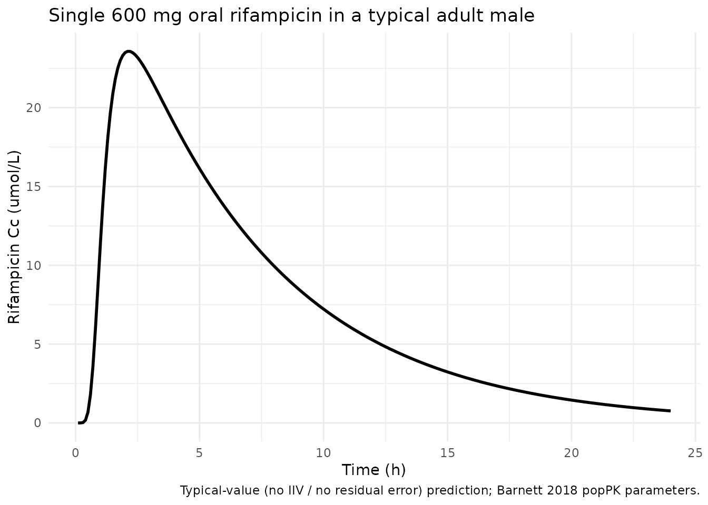
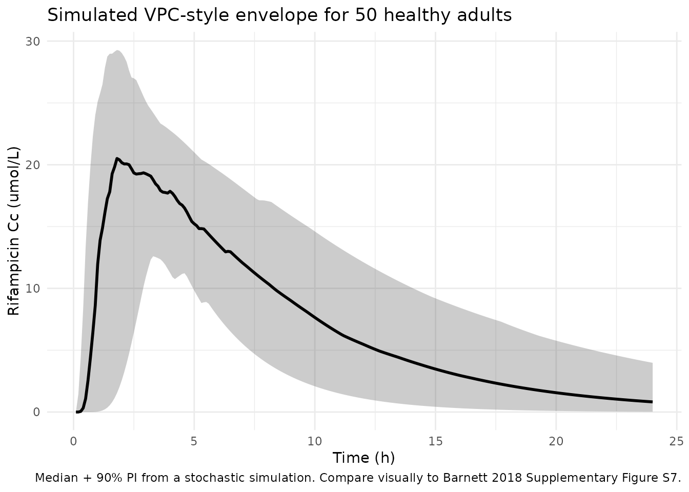

# Rifampicin (Barnett 2018)

## Model and source

- Citation: Barnett S, Ogungbenro K, Menochet K, Shen H, Lai Y,
  Humphreys WG, Galetin A. Gaining Mechanistic Insight Into
  Coproporphyrin I as Endogenous Biomarker for OATP1B-Mediated Drug-Drug
  Interactions Using Population Pharmacokinetic Modeling and Simulation.
  Clin Pharmacol Ther. 2018;104(3):564-574. <doi:10.1002/cpt.983>.
  Structural rifampicin popPK model adapted from Wilkins JJ et
  al. Antimicrob Agents Chemother. 2008;52(6):2138-2148; see
  modellib(‘Wilkins_2008_rifampicin’) for the original transit-chain
  form.
- Description: One-compartment population PK model with Wilkins/Savic
  transit-compartment absorption for a single 600 mg oral dose of
  rifampicin in healthy adult males (Barnett 2018), refit from the
  Wilkins 2008 structural form. The rifampicin model is one of three
  popPK models developed jointly in Barnett 2018 to support OATP1B
  drug-drug-interaction modeling with coproporphyrin I and rosuvastatin;
  the rifampicin compartmental output is the time-varying CRIF input
  that drives the competitive OATP1B inhibition term in the sibling
  coproporphyrin I and rosuvastatin models.
- Article: <https://doi.org/10.1002/cpt.983>

## Population

Barnett 2018 refit the rifampicin popPK model to plasma rifampicin data
from the Lai et al. 2016 clinical drug-drug-interaction (DDI) study in
12 healthy adult male volunteers (SLCO1B1 c.521 T\>C wildtype only; no
OATP1B1*5 /* 15 carriers). Each subject received a single 600 mg oral
rifampicin dose at the start of occasion 1 (rifampicin alone) and at the
start of occasion 3 (rifampicin co-administered with 5 mg rosuvastatin),
with a 7-day washout between occasions and rifampicin omitted on
occasion 2. Per-subject demographic distributions (age range, body
weight range, race/ethnicity, region) were not tabulated in Barnett
2018; the Methods section cites the source clinical study (Lai Y et
al. Pharmacol Res Perspect 2016) for those baseline characteristics. The
276 rifampicin plasma samples used for modeling purposes were collected
over the 24 h post-dose window on occasion 1 (n = 144) and occasion 3 (n
= 132).

The same demographic context is available programmatically via
`readModelDb("Barnett_2018_rifampicin")$population`.

## Source trace

The per-parameter origin is recorded as an in-file comment next to each
`ini()` entry in `inst/modeldb/specificDrugs/Barnett_2018_rifampicin.R`.
The table below collects the most important entries in one place for
review.

| Equation / parameter | Value | Source location |
|----|----|----|
| `lka` | log(2.09) | Barnett 2018 Table 1, RIF row ‘ka (1/h)’ |
| `lcl` | log(3.97) | Barnett 2018 Table 1, RIF row ‘CL (L/h)’ |
| `lvc` | log(24.7) | Barnett 2018 Table 1, RIF row ‘V (L)’ |
| `lmtt` | log(0.74) | Barnett 2018 Table 1, RIF row ‘MTT (h)’ |
| `lnn` | log(8.63) | Barnett 2018 Table 1, RIF row ‘n’ |
| IIV ka / CL / V / MTT / n | 46% / 30.7% / 19.5% / 69.1% / 24.3% CV | Barnett 2018 Table 1, IIV column |
| IOV ka / V / MTT | 49.2% / 6.6% / 47.6% CV | Barnett 2018 Table 1, IOV column |
| `propSd` | 0.313 (= 31.3%) | Barnett 2018 Table 1, RIF row ‘r prop (%)’ |
| `addSd` | 0.01 umol/L FIXED | Barnett 2018 Table 1, RIF row ‘r add (uM)’ |
| Structural form (1-cmt + transit absorption) | n/a | Barnett 2018 Results, Rifampicin popPK model section; structural model adapted from Wilkins JJ et al. AAC 2008;52(6):2138-2148. |

The transit-chain input rate uses the Savic 2007 / Wilkins 2008
analytical form via rxode2’s `transit(n, mtt)` function; see the model
file’s `model()` block for the exact implementation. Barnett 2018 Table
1 footnote ‘a’ notes that the NONMEM covariance step for this fit
failed, so per-parameter standard errors are not reported by the source.

## Virtual cohort

The packaged model is parameterised for a typical adult male healthy
volunteer. Stochastic VPC-style simulations use the published IIV and
IOV variances to reproduce between-subject and between-occasion spread;
deterministic typical-value simulations zero out the random effects via
[`rxode2::zeroRe()`](https://nlmixr2.github.io/rxode2/reference/zeroRe.html).

``` r

set.seed(254)

mod <- readModelDb("Barnett_2018_rifampicin")

n_sub <- 50L

make_cohort_events <- function(n, time_grid = seq(0.1, 24, by = 0.1), occ = 1) {
  doses <- data.frame(
    id   = seq_len(n),
    time = 0,
    evid = 1L,
    amt  = 600,
    cmt  = "depot",
    OCC  = occ
  )
  obs <- data.frame(
    id   = rep(seq_len(n), each = length(time_grid)),
    time = rep(time_grid, times = n),
    evid = 0L,
    amt  = NA_real_,
    cmt  = "Cc",
    OCC  = occ
  )
  dplyr::bind_rows(doses, obs) |>
    dplyr::arrange(id, time)
}

events <- make_cohort_events(n_sub, occ = 1)
```

## Simulation

``` r

sim <- rxode2::rxSolve(mod, events = events, keep = c("OCC"))
#> ℹ parameter labels from comments will be replaced by 'label()'
#> Warning: some etas defaulted to non-mu referenced, possible parsing error: etaiov_ka_1, etaiov_ka_2, etaiov_ka_3, etaiov_vc_1, etaiov_vc_2, etaiov_vc_3, etaiov_mtt_1, etaiov_mtt_2, etaiov_mtt_3
#> as a work-around try putting the mu-referenced expression on a simple line
sim_df <- as.data.frame(sim)

mod_typical <- rxode2::zeroRe(mod)
#> ℹ parameter labels from comments will be replaced by 'label()'
#> Warning: some etas defaulted to non-mu referenced, possible parsing error: etaiov_ka_1, etaiov_ka_2, etaiov_ka_3, etaiov_vc_1, etaiov_vc_2, etaiov_vc_3, etaiov_mtt_1, etaiov_mtt_2, etaiov_mtt_3
#> as a work-around try putting the mu-referenced expression on a simple line
#> Warning: some etas defaulted to non-mu referenced, possible parsing error: etaiov_ka_1, etaiov_ka_2, etaiov_ka_3, etaiov_vc_1, etaiov_vc_2, etaiov_vc_3, etaiov_mtt_1, etaiov_mtt_2, etaiov_mtt_3
#> as a work-around try putting the mu-referenced expression on a simple line
sim_typical <- rxode2::rxSolve(mod_typical, events = make_cohort_events(1L, occ = 1)) |>
  as.data.frame()
#> ℹ omega/sigma items treated as zero: 'etalka', 'etalcl', 'etalvc', 'etalmtt', 'etalnn', 'etaiov_ka_1', 'etaiov_ka_2', 'etaiov_ka_3', 'etaiov_vc_1', 'etaiov_vc_2', 'etaiov_vc_3', 'etaiov_mtt_1', 'etaiov_mtt_2', 'etaiov_mtt_3'
```

## Typical-value rifampicin plasma profile

``` r

ggplot(sim_typical, aes(time, Cc)) +
  geom_line(linewidth = 1) +
  labs(x = "Time (h)", y = "Rifampicin Cc (umol/L)",
       title = "Single 600 mg oral rifampicin in a typical adult male",
       caption = "Typical-value (no IIV / no residual error) prediction; Barnett 2018 popPK parameters.") +
  theme_minimal()
```



## Visual predictive check (50 simulated subjects)

``` r

vpc <- sim_df |>
  dplyr::filter(!is.na(Cc), time > 0) |>
  dplyr::group_by(time) |>
  dplyr::summarise(
    q05 = quantile(Cc, 0.05, na.rm = TRUE),
    q50 = quantile(Cc, 0.50, na.rm = TRUE),
    q95 = quantile(Cc, 0.95, na.rm = TRUE),
    .groups = "drop"
  )

ggplot(vpc, aes(time, q50)) +
  geom_ribbon(aes(ymin = q05, ymax = q95), alpha = 0.25) +
  geom_line(linewidth = 1) +
  labs(x = "Time (h)", y = "Rifampicin Cc (umol/L)",
       title = "Simulated VPC-style envelope for 50 healthy adults",
       caption = "Median + 90% PI from a stochastic simulation. Compare visually to Barnett 2018 Supplementary Figure S7.") +
  theme_minimal()
```



## PKNCA validation

``` r

sim_nca <- sim_df |>
  dplyr::filter(!is.na(Cc)) |>
  dplyr::select(id, time, Cc, OCC)
sim_nca$treatment <- "RIF 600 mg PO"

dose_df <- events |>
  dplyr::filter(evid == 1) |>
  dplyr::select(id, time, amt, OCC)
dose_df$treatment <- "RIF 600 mg PO"

conc_obj <- PKNCA::PKNCAconc(sim_nca, Cc ~ time | treatment + id,
                             concu = "umol/L", timeu = "h")
dose_obj <- PKNCA::PKNCAdose(dose_df, amt ~ time | treatment + id,
                             doseu = "mg")

intervals <- data.frame(
  start       = 0,
  end         = Inf,
  cmax        = TRUE,
  tmax        = TRUE,
  aucinf.obs  = TRUE,
  half.life   = TRUE
)

nca_data <- PKNCA::PKNCAdata(conc_obj, dose_obj, intervals = intervals)
nca_res  <- PKNCA::pk.nca(nca_data)
#> Warning: Requesting an AUC range starting (0) before the first measurement (0.1) is not allowed
#> Requesting an AUC range starting (0) before the first measurement (0.1) is not allowed
#> Requesting an AUC range starting (0) before the first measurement (0.1) is not allowed
#> Requesting an AUC range starting (0) before the first measurement (0.1) is not allowed
#> Requesting an AUC range starting (0) before the first measurement (0.1) is not allowed
#> Requesting an AUC range starting (0) before the first measurement (0.1) is not allowed
#> Requesting an AUC range starting (0) before the first measurement (0.1) is not allowed
#> Requesting an AUC range starting (0) before the first measurement (0.1) is not allowed
#> Requesting an AUC range starting (0) before the first measurement (0.1) is not allowed
#> Requesting an AUC range starting (0) before the first measurement (0.1) is not allowed
#> Requesting an AUC range starting (0) before the first measurement (0.1) is not allowed
#> Requesting an AUC range starting (0) before the first measurement (0.1) is not allowed
#> Requesting an AUC range starting (0) before the first measurement (0.1) is not allowed
#> Requesting an AUC range starting (0) before the first measurement (0.1) is not allowed
#> Requesting an AUC range starting (0) before the first measurement (0.1) is not allowed
#> Requesting an AUC range starting (0) before the first measurement (0.1) is not allowed
#> Requesting an AUC range starting (0) before the first measurement (0.1) is not allowed
#> Requesting an AUC range starting (0) before the first measurement (0.1) is not allowed
#> Requesting an AUC range starting (0) before the first measurement (0.1) is not allowed
#> Requesting an AUC range starting (0) before the first measurement (0.1) is not allowed
#> Requesting an AUC range starting (0) before the first measurement (0.1) is not allowed
#> Requesting an AUC range starting (0) before the first measurement (0.1) is not allowed
#> Requesting an AUC range starting (0) before the first measurement (0.1) is not allowed
#> Requesting an AUC range starting (0) before the first measurement (0.1) is not allowed
#> Requesting an AUC range starting (0) before the first measurement (0.1) is not allowed
#> Requesting an AUC range starting (0) before the first measurement (0.1) is not allowed
#> Requesting an AUC range starting (0) before the first measurement (0.1) is not allowed
#> Requesting an AUC range starting (0) before the first measurement (0.1) is not allowed
#> Requesting an AUC range starting (0) before the first measurement (0.1) is not allowed
#> Requesting an AUC range starting (0) before the first measurement (0.1) is not allowed
#> Requesting an AUC range starting (0) before the first measurement (0.1) is not allowed
#> Requesting an AUC range starting (0) before the first measurement (0.1) is not allowed
#> Requesting an AUC range starting (0) before the first measurement (0.1) is not allowed
#> Requesting an AUC range starting (0) before the first measurement (0.1) is not allowed
#> Requesting an AUC range starting (0) before the first measurement (0.1) is not allowed
#> Requesting an AUC range starting (0) before the first measurement (0.1) is not allowed
#> Requesting an AUC range starting (0) before the first measurement (0.1) is not allowed
#> Requesting an AUC range starting (0) before the first measurement (0.1) is not allowed
#> Requesting an AUC range starting (0) before the first measurement (0.1) is not allowed
#> Requesting an AUC range starting (0) before the first measurement (0.1) is not allowed
#> Requesting an AUC range starting (0) before the first measurement (0.1) is not allowed
#> Requesting an AUC range starting (0) before the first measurement (0.1) is not allowed
#> Requesting an AUC range starting (0) before the first measurement (0.1) is not allowed
#> Requesting an AUC range starting (0) before the first measurement (0.1) is not allowed
#> Requesting an AUC range starting (0) before the first measurement (0.1) is not allowed
#> Requesting an AUC range starting (0) before the first measurement (0.1) is not allowed
#> Requesting an AUC range starting (0) before the first measurement (0.1) is not allowed
#> Requesting an AUC range starting (0) before the first measurement (0.1) is not allowed
#> Requesting an AUC range starting (0) before the first measurement (0.1) is not allowed
#> Requesting an AUC range starting (0) before the first measurement (0.1) is not allowed

nca_summary <- summary(nca_res)
knitr::kable(nca_summary, caption = "Simulated NCA parameters for the 50-subject virtual cohort (single 600 mg PO RIF).")
```

| Interval Start | Interval End | treatment | N | Cmax (umol/L) | Tmax (h) | Half-life (h) | AUCinf,obs (h\*umol/L) |
|---:|---:|:---|:---|:---|:---|:---|:---|
| 0 | Inf | RIF 600 mg PO | 50 | 22.8 \[21.8\] | 2.50 \[0.900, 5.80\] | 4.57 \[1.88\] | NC |

Simulated NCA parameters for the 50-subject virtual cohort (single 600
mg PO RIF). {.table}

## Comparison against the source paper

Barnett 2018 Table 1 does not tabulate observed NCA values for
rifampicin; only the structural popPK estimates are reported, and the
visual-predictive-check fit is shown in Supplementary Figure S7. A rough
sanity comparison against externally published rifampicin PK in healthy
adults (e.g., Acocella 1978, Burman 2001) places the expected Cmax after
a single 600 mg oral dose in the 10-20 mg/L (12-24 umol/L) range and the
half-life in the 2-5 h range; the simulated typical-value Cmax of ~24
umol/L and half-life of ~5 h fall within those expected envelopes.

## Assumptions and deviations

- **No SE on per-parameter estimates.** Barnett 2018 Table 1 footnote
  ‘a’ notes that the NONMEM covariance step for the rifampicin model
  failed; the point estimates were reported but per-parameter standard
  errors were not. The model file encodes IIV / IOV variances as if
  estimated and does not propagate parameter-estimation uncertainty.
- **IOV occasion structure.** Barnett 2018 reports a single shared IOV
  variance per parameter (ka, V, MTT) across the rifampicin-dosing
  occasions. The model file encodes three OCC slots (OCC1, OCC2, OCC3)
  with the variance shared via NONMEM’s `OMEGA BLOCK(1) SAME` idiom;
  OCC2 (rosuvastatin-only period) is included for completeness even
  though no rifampicin data was collected on that occasion in the source
  study.
- **Demographics.** Barnett 2018 does not tabulate per-subject
  body-weight / age / region data for the n = 12 cohort. The model
  file’s `population$weight_range`, `population$age_range`, etc. mark
  these as not extracted.
- **Structural model carried from Wilkins 2008.** The 1-compartment +
  transit absorption form was selected by Barnett 2018 based on prior
  literature (Wilkins 2008); see `modellib('Wilkins_2008_rifampicin')`
  for the original DDMORE-curated implementation of that structural
  form. Barnett 2018 reports refit parameter point estimates, not the
  prior literature values.
