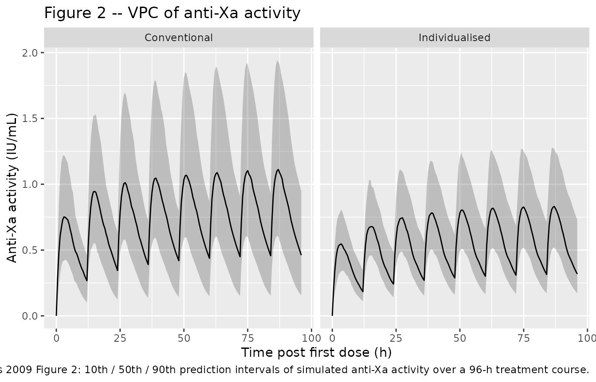
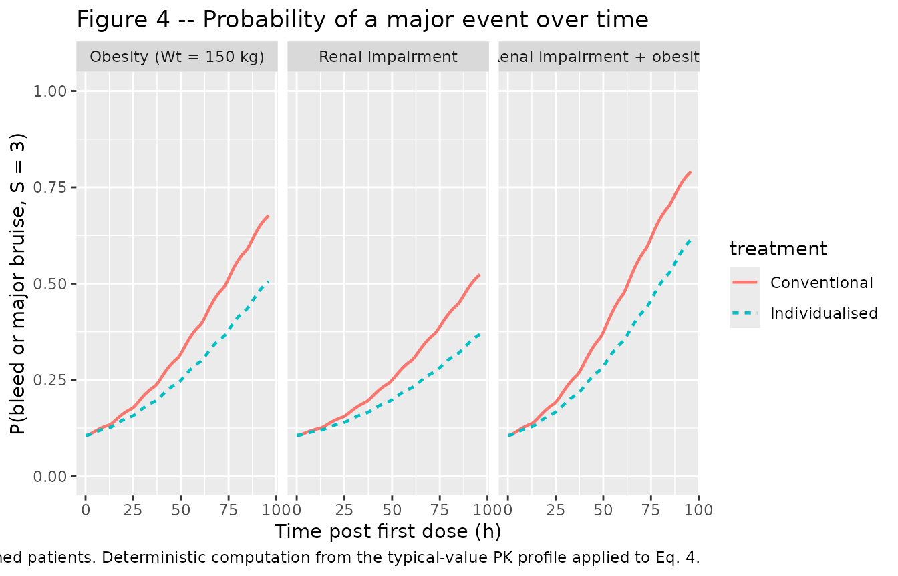
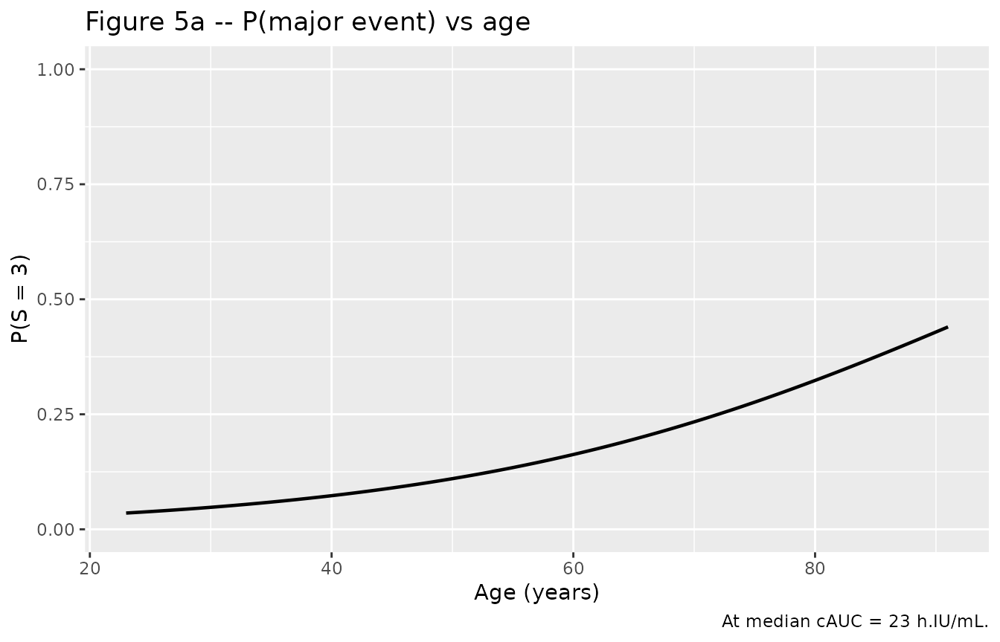
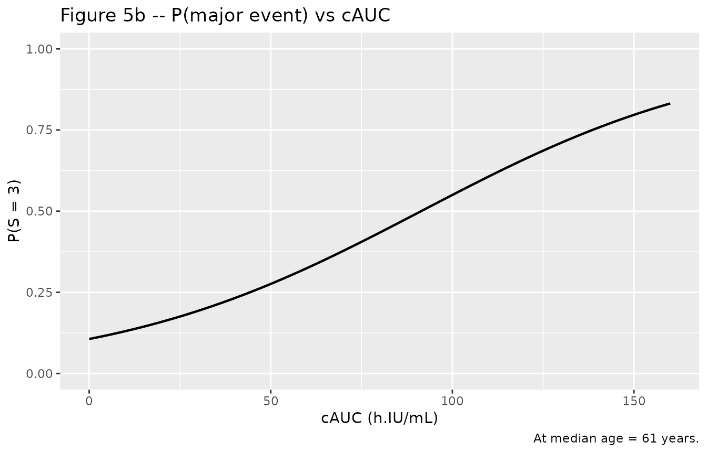

# Enoxaparin (Barras 2009)

## Model and source

- Citation: Barras MA, Duffull SB, Atherton JJ, Green B. Modelling the
  occurrence and severity of enoxaparin-induced bleeding and bruising
  events. Br J Clin Pharmacol. 2009;68(5):700-711.
- Article: <https://doi.org/10.1111/j.1365-2125.2009.03518.x>

The Barras 2009 model is a two-compartment first-order-absorption
population PK model describing anti-factor Xa (anti-Xa) activity (IU/mL)
in 118 adult inpatients treated for thromboembolic disease (pulmonary
embolism, deep vein thrombosis, acute coronary syndrome, or atrial
fibrillation). The paper parameterises clearance as a composite renal +
non-renal model where the renal arm scales with Cockcroft-Gault
creatinine clearance computed with lean body weight (LBW, Janmahasatian
2005 formula) substituted as the body- size descriptor, and the
non-renal arm scales linearly with LBW. The central volume scales
linearly with LBW; peripheral volume and inter- compartmental clearance
do not retain a covariate effect. Three IIV terms (CL, Vc, Ka) and an
additive residual error on anti-Xa activity complete the PK structure.

The paper also reports a three-category proportional-odds PD model for
the occurrence and severity of bleeding / bruising events as a function
of patient age and the cumulative anti-Xa AUC (cAUC) from first dose to
the event. The PD layer is NOT encoded in the packaged model file (see
the description text and Assumptions and deviations section). The
proportional- odds equation is reproduced numerically in this vignette
to illustrate the expected event-severity probabilities for typical
individualised and conventional dosing regimens.

## Population

The Barras 2009 randomised controlled trial (Table 3) enrolled 118 adult
inpatients with PE / DVT / ACS / atrial fibrillation. Baseline
characteristics:

- Age: median 61 years (range 23-91).
- Sex: 38% women.
- Weight: median 77 kg (range 43-120); LBW median 55 kg (range 30-86);
  IBW median 64 kg (range 39-83).
- Renal function: LBW-substituted C-G CrCl median 70 mL/min (range
  10-170); total-weight C-G CrCl median 85 mL/min (range 15-244).
- Co-medications: warfarin 31%, antiplatelet drugs (aspirin /
  clopidogrel) 42%.
- Indications: PE / DVT / ACS / atrial fibrillation requiring enoxaparin
  treatment.

The PD subset (n = 103) had a bleeding / bruising assessment beyond
baseline; 36 had no event, 40 had a minor bruising event (1-20 cm^2),
and 27 had a major bruise or bleed (\>= 20 cm^2 bruise or any overt
bleed) during a mean (SD) duration of therapy of 3.5 +/- 2.3 days.
Cumulative anti-Xa AUC in the PD subset had median 23 h.IU/mL (range
4-120).

The same information is available programmatically via
`readModelDb("Barras_2009_enoxaparin")` (e.g. inspect the function body
for the `population` metadata).

## Source trace

The per-parameter origin is recorded as an in-file comment next to each
`ini()` entry in `inst/modeldb/specificDrugs/Barras_2009_enoxaparin.R`.
The table below collects them in one place.

| Equation / parameter | Value | Source location |
|----|----|----|
| `lka` (Ka) | log(0.26 1/h) | Barras 2009 Table 4, Ka row (covariate model column) |
| `lvc` (Vc/F at LBM = 55 kg) | log(3.43 L) | Barras 2009 Table 4, Vc row; Equation 3 page 705 |
| `lvp` (Vp/F) | log(5.77 L) | Barras 2009 Table 4, Vp row |
| `lq` (Q/F) | log(0.31 L/h) | Barras 2009 Table 4, Q row |
| `lcl_renal` (renal CL at CRCL=70) | log(0.30 L/h) | Barras 2009 Table 4, “CL renal” row; Equation 2 page 705 |
| `lcl_nonren` (non-renal CL at LBM=55) | log(0.42 L/h) | Barras 2009 Table 4, “CL non-renal” row; Equation 2 page 705 |
| `etalcl` (omega^2) | log(0.378^2 + 1) = 0.13342 | Barras 2009 Table 4, omega_CL 37.8% CV row |
| `etalvc` (omega^2) | log(0.356^2 + 1) = 0.11907 | Barras 2009 Table 4, omega_Vc 35.6% CV row |
| `etalka` (omega^2) | log(0.303^2 + 1) = 0.08763 | Barras 2009 Table 4, omega_Ka 30.3% CV row |
| `addSd` | 0.09 IU/mL (additive) | Barras 2009 Table 4, epsilon row; Methods “Base heterogeneity and residual error model” |
| Structural PK model | 2-compartment SC first-order absorption | Barras 2009 Results “PK analysis – Model building” |
| Covariate selection (CL) | composite renal + non-renal scaled by LBW-CrCl and LBW | Barras 2009 Results “PK analysis – Model building”; Eq. 2 |
| Covariate selection (Vc) | linear LBW scaling | Barras 2009 Results “PK analysis – Model building”; Eq. 3 |
| Reference values | LBW 55 kg, CRCL 70 mL/min (population medians) | Barras 2009 Tables 3 and 4; Eqs. 2 and 3 |
| Proportional-odds PD theta_1 | 2.83 (intercept, logit P\[S\<=1\]) | Barras 2009 Table 4 PD section; Eq. 4 page 706 |
| Proportional-odds PD theta_2 | -2.75 on (Age / 61) | Barras 2009 Table 4 PD section; Eq. 4 |
| Proportional-odds PD theta_3 | -0.536 on (cAUC / 23) (Table 4 rounds to -0.54) | Barras 2009 Eq. 4 page 706 |
| Proportional-odds PD theta_4 | 2.05 (increment, logit P\[S\<=2\] - logit P\[S\<=1\]) | Barras 2009 Table 4 PD section; Eq. 4 |

## Virtual cohort

The Barras 2009 RCT did not release individual-level data; the
simulations below use a virtual cohort whose demographics (total body
weight, LBW, LBW-substituted C-G CrCl, age) are sampled to approximate
Table 3. The cohort is split equally between the conventional and
individualised dosing arms, each receiving 1 mg/kg total-body-weight
(conventional) or 1 mg/kg LBW (individualised) subcutaneously twice
daily for 96 hours – the longer of the two paper-referenced standard
durations (96 h for non-ACS embolic events, 72 h for ACS, per Methods
“Demonstration of the inference of the PK-PD model”). The mg dose is
converted to anti-Xa international units using the standard enoxaparin
specific activity of approximately 100 IU anti-Xa per mg.

``` r

set.seed(2009)
n_subj <- 100L

# Sample WT, LBW, CRCL, Age to approximate Table 3 of Barras 2009 PK cohort.
draw_truncated <- function(n, mean, sd, lower, upper, log_normal = FALSE) {
  out <- numeric(0)
  while (length(out) < n) {
    if (log_normal) {
      cv <- sd / mean
      sdlog <- sqrt(log(cv^2 + 1))
      meanlog <- log(mean) - sdlog^2 / 2
      draw <- rlnorm(n, meanlog = meanlog, sdlog = sdlog)
    } else {
      draw <- rnorm(n, mean = mean, sd = sd)
    }
    draw <- draw[draw >= lower & draw <= upper]
    out <- c(out, draw)
  }
  out[seq_len(n)]
}

cohort <- tibble(
  id   = seq_len(n_subj),
  AGE  = draw_truncated(n_subj, mean = 61, sd = 17, lower = 23, upper = 91),
  WT   = draw_truncated(n_subj, mean = 77, sd = 16, lower = 43, upper = 120,
                        log_normal = TRUE),
  LBM  = draw_truncated(n_subj, mean = 55, sd = 12, lower = 30, upper = 86,
                        log_normal = TRUE),
  CRCL = draw_truncated(n_subj, mean = 70, sd = 33, lower = 10, upper = 170)
)

summary(cohort[, c("AGE", "WT", "LBM", "CRCL")])
#>       AGE              WT              LBM             CRCL       
#>  Min.   :29.59   Min.   : 47.87   Min.   :30.73   Min.   : 13.37  
#>  1st Qu.:49.95   1st Qu.: 65.79   1st Qu.:46.95   1st Qu.: 47.14  
#>  Median :59.08   Median : 73.95   Median :53.88   Median : 74.34  
#>  Mean   :59.98   Mean   : 75.92   Mean   :54.41   Mean   : 75.18  
#>  3rd Qu.:71.02   3rd Qu.: 83.52   3rd Qu.:60.38   3rd Qu.: 97.27  
#>  Max.   :89.95   Max.   :114.35   Max.   :81.70   Max.   :148.77
```

``` r

# 96-hour BID treatment regimen (paper-referenced non-ACS standard duration).
# Conventional arm: 1 mg/kg total body weight BID; individualised arm: 1 mg/kg
# LBW BID. Convert mg -> IU using ~100 IU/mg (standard enoxaparin specific
# activity). Doses at 0, 12, 24, ... 84 h; observations every 0.5 h up to 96 h.
dose_times <- seq(0, 84, by = 12)
obs_times  <- sort(unique(c(seq(0, 96, by = 0.5), dose_times + 0.001)))
mg_to_IU   <- 100   # ~100 IU anti-Xa per mg enoxaparin (standard specific activity)

make_subject <- function(id, AGE, WT, LBM, CRCL, arm, id_offset) {
  amt_mg <- if (arm == "Conventional") 1 * WT else 1 * LBM   # mg/kg * weight basis
  amt_IU <- amt_mg * mg_to_IU
  doses <- tibble(
    id = id + id_offset, time = dose_times, amt = amt_IU,
    cmt = "depot", evid = 1L,
    AGE = AGE, WT = WT, LBM = LBM, CRCL = CRCL, treatment = arm
  )
  obs <- tibble(
    id = id + id_offset, time = obs_times, amt = NA_real_,
    cmt = NA_character_, evid = 0L,
    AGE = AGE, WT = WT, LBM = LBM, CRCL = CRCL, treatment = arm
  )
  bind_rows(doses, obs) |> arrange(time)
}

events_conventional <- lapply(
  seq_len(nrow(cohort)),
  function(i) make_subject(cohort$id[i], cohort$AGE[i], cohort$WT[i],
                           cohort$LBM[i], cohort$CRCL[i],
                           arm = "Conventional", id_offset = 0L)
) |> bind_rows()

events_individualised <- lapply(
  seq_len(nrow(cohort)),
  function(i) make_subject(cohort$id[i], cohort$AGE[i], cohort$WT[i],
                           cohort$LBM[i], cohort$CRCL[i],
                           arm = "Individualised", id_offset = n_subj)
) |> bind_rows()

events <- bind_rows(events_conventional, events_individualised)
stopifnot(!anyDuplicated(unique(events[, c("id", "time", "evid")])))
```

## Simulation

``` r

mod <- readModelDb("Barras_2009_enoxaparin")
sim <- rxode2::rxSolve(
  mod, events = events,
  keep = c("AGE", "WT", "LBM", "CRCL", "treatment")
)
#> ℹ parameter labels from comments will be replaced by 'label()'
sim <- as.data.frame(sim)
```

Typical-value (zero random-effects) profile at the population reference
(`LBM = 55`, `CRCL = 70`, `AGE = 61`, conventional arm dose 1 mg/kg of a
77 kg subject = 7700 IU SC BID):

``` r

mod_typical <- mod |> rxode2::zeroRe()
#> ℹ parameter labels from comments will be replaced by 'label()'
ev_typ <- tibble(
  id = 1L,
  time = sort(unique(c(dose_times, obs_times))),
  amt  = NA_real_, cmt = NA_character_, evid = 0L,
  AGE = 61, WT = 77, LBM = 55, CRCL = 70, treatment = "Typical 1 mg/kg BID"
)
ev_typ_doses <- tibble(
  id = 1L, time = dose_times, amt = 1 * 77 * mg_to_IU,
  cmt = "depot", evid = 1L,
  AGE = 61, WT = 77, LBM = 55, CRCL = 70, treatment = "Typical 1 mg/kg BID"
)
ev_typ <- bind_rows(ev_typ_doses, ev_typ |> filter(evid == 0)) |> arrange(time)
sim_typ <- as.data.frame(rxode2::rxSolve(mod_typical, events = ev_typ))
#> ℹ omega/sigma items treated as zero: 'etalcl', 'etalvc', 'etalka'
```

## Replicate published figures

``` r

# Replicates Figure 2 of Barras 2009: VPC of anti-Xa activity vs time post
# first dose, with 10th / 50th / 90th prediction intervals overlaid. The
# original Figure 2 shows three panels (all subjects, renal-impaired,
# obese); here we show all subjects with the conventional vs individualised
# arms side by side.
vpc <- sim |>
  group_by(time, treatment) |>
  summarise(
    Q10 = quantile(Cc, 0.10, na.rm = TRUE),
    Q50 = quantile(Cc, 0.50, na.rm = TRUE),
    Q90 = quantile(Cc, 0.90, na.rm = TRUE),
    .groups = "drop"
  )
ggplot(vpc, aes(time, Q50)) +
  geom_ribbon(aes(ymin = Q10, ymax = Q90), alpha = 0.25) +
  geom_line() +
  facet_wrap(~ treatment) +
  labs(x = "Time post first dose (h)",
       y = "Anti-Xa activity (IU/mL)",
       title = "Figure 2 -- VPC of anti-Xa activity",
       caption = paste0("Replicates the form of Barras 2009 Figure 2: ",
                        "10th / 50th / 90th prediction intervals of simulated ",
                        "anti-Xa activity over a 96-h treatment course."))
```



``` r

# Replicates Figure 4 of Barras 2009: model-predicted probability of a
# bleeding or major bruising event (S = 3) vs time for conventional and
# individualised dosing in three demographic groups. The PD is computed
# from the proportional-odds equation (Eq. 4 page 706) applied to the
# simulated typical-value cAUC profile:
#   logit(P[S<=1]) = 2.83 - 2.75 * (Age / 61) - 0.536 * (cAUC / 23)
#   logit(P[S<=2]) = logit(P[S<=1]) + 2.05
#   P(S = 3)       = 1 - P(S <= 2)
#
# cAUC is computed as the running cumulative trapezoidal integral of Cc
# over time. The PD is deterministic given Age and cAUC; the paper sets
# no IIV or residual error on the PD output (Methods "Model building").

pd_probabilities <- function(age, cAUC) {
  logit_s1 <- 2.83 - 2.75 * (age / 61) - 0.536 * (cAUC / 23)
  logit_s2 <- logit_s1 + 2.05
  inv_logit <- function(x) 1 / (1 + exp(-x))
  p_le_s1 <- inv_logit(logit_s1)
  p_le_s2 <- inv_logit(logit_s2)
  list(
    P_S1 = p_le_s1,
    P_S2 = p_le_s2 - p_le_s1,
    P_S3 = 1 - p_le_s2
  )
}

# Run typical-value simulations for the three Barras 2009 Figure 4 scenarios.
# (a) Renal impairment: CRCL = 30 mL/min at median Wt = 77 kg (LBW ~ 55 kg).
# (b) Obesity: Wt = 150 kg at median CRCL (70 mL/min for LBW-CG); LBW at
#     Wt = 150 estimated via Janmahasatian formula approximately ~85 kg
#     (men) or ~70 kg (women). Use ~75 kg as a midpoint.
# (c) Both: CRCL = 30 mL/min, Wt = 150 kg (LBW ~ 75 kg).
# Conventional dose = 1 mg/kg total Wt BID; individualised = 1 mg/kg LBW BID
# (subjects < 100 kg) or 1.5 mg/kg LBW BID (subjects >= 100 kg, considered
# obese). For Wt = 150 kg (>= 100 kg) the individualised arm uses 1.5 mg/kg
# LBW.

scenarios <- tibble::tribble(
  ~scenario,                       ~AGE, ~WT, ~LBM, ~CRCL, ~dose_mg_conv, ~dose_mg_indiv,
  "Renal impairment",               61L,  77,   55,    30,        1 * 77,        1 *  55,
  "Obesity (Wt = 150 kg)",          61L, 150,   75,    70,        1 * 150,     1.5 *  75,
  "Renal impairment + obesity",     61L, 150,   75,    30,        1 * 150,     1.5 *  75
)

run_typical_scenario <- function(AGE, WT, LBM, CRCL, dose_mg, arm) {
  dose_IU <- dose_mg * mg_to_IU
  ev <- tibble(
    id = 1L,
    time = sort(unique(c(dose_times, seq(0, 96, by = 0.25)))),
    amt = NA_real_, cmt = NA_character_, evid = 0L,
    AGE = AGE, WT = WT, LBM = LBM, CRCL = CRCL
  )
  ev_doses <- tibble(
    id = 1L, time = dose_times, amt = dose_IU,
    cmt = "depot", evid = 1L,
    AGE = AGE, WT = WT, LBM = LBM, CRCL = CRCL
  )
  ev <- bind_rows(ev_doses, ev |> filter(evid == 0)) |> arrange(time)
  out <- as.data.frame(rxode2::rxSolve(mod_typical, events = ev))
  out$treatment <- arm
  out$scenario  <- NA_character_
  out
}

scenario_sim <- bind_rows(lapply(seq_len(nrow(scenarios)), function(k) {
  row <- scenarios[k, ]
  conv <- run_typical_scenario(row$AGE, row$WT, row$LBM, row$CRCL,
                               row$dose_mg_conv, "Conventional")
  indiv <- run_typical_scenario(row$AGE, row$WT, row$LBM, row$CRCL,
                                row$dose_mg_indiv, "Individualised")
  conv$scenario  <- row$scenario
  indiv$scenario <- row$scenario
  bind_rows(conv, indiv)
}))
#> ℹ omega/sigma items treated as zero: 'etalcl', 'etalvc', 'etalka'
#> ℹ omega/sigma items treated as zero: 'etalcl', 'etalvc', 'etalka'
#> ℹ omega/sigma items treated as zero: 'etalcl', 'etalvc', 'etalka'
#> ℹ omega/sigma items treated as zero: 'etalcl', 'etalvc', 'etalka'
#> ℹ omega/sigma items treated as zero: 'etalcl', 'etalvc', 'etalka'
#> ℹ omega/sigma items treated as zero: 'etalcl', 'etalvc', 'etalka'

# Compute running cAUC and PD probabilities by scenario x treatment.
scenario_sim <- scenario_sim |>
  group_by(scenario, treatment) |>
  arrange(time, .by_group = TRUE) |>
  mutate(
    dt    = c(0, diff(time)),
    Cc_m  = (Cc + lag(Cc, default = 0)) / 2,
    cAUC  = cumsum(Cc_m * dt),
    P_S3  = pd_probabilities(age = 61, cAUC = cAUC)$P_S3
  ) |>
  ungroup()

ggplot(scenario_sim, aes(time, P_S3, colour = treatment, linetype = treatment)) +
  geom_line(linewidth = 0.8) +
  facet_wrap(~ scenario) +
  ylim(0, 1) +
  labs(x = "Time post first dose (h)",
       y = "P(bleed or major bruise, S = 3)",
       title = "Figure 4 -- Probability of a major event over time",
       caption = paste0("Replicates Barras 2009 Figure 4 panels (a-c): model-",
                        "predicted probability of a major bleeding or major ",
                        "bruising event vs time for conventional and ",
                        "individualised dosing in renal-impaired, obese, and ",
                        "combined patients. Deterministic computation from ",
                        "the typical-value PK profile applied to Eq. 4."))
```



``` r

# Replicates Figure 5 of Barras 2009: model-predicted probability of a
# bleed or major bruising event (S = 3) as a function of age (Figure 5a)
# and cAUC (Figure 5b), at the median value of the other covariate.

# Figure 5a: P(S=3) vs age at cAUC = 23 h.IU/mL (population median)
age_grid <- seq(23, 91, by = 1)
fig5a <- tibble(
  age   = age_grid,
  P_S3  = sapply(age_grid,
                 function(a) pd_probabilities(age = a, cAUC = 23)$P_S3)
)

# Figure 5b: P(S=3) vs cAUC at age = 61 years (population median)
cauc_grid <- seq(0, 160, by = 1)
fig5b <- tibble(
  cAUC  = cauc_grid,
  P_S3  = sapply(cauc_grid,
                 function(c) pd_probabilities(age = 61, cAUC = c)$P_S3)
)

p_a <- ggplot(fig5a, aes(age, P_S3)) +
  geom_line(linewidth = 0.8) +
  ylim(0, 1) +
  labs(x = "Age (years)", y = "P(S = 3)",
       title = "Figure 5a -- P(major event) vs age",
       caption = "At median cAUC = 23 h.IU/mL.")
p_b <- ggplot(fig5b, aes(cAUC, P_S3)) +
  geom_line(linewidth = 0.8) +
  ylim(0, 1) +
  labs(x = "cAUC (h.IU/mL)", y = "P(S = 3)",
       title = "Figure 5b -- P(major event) vs cAUC",
       caption = "At median age = 61 years.")
p_a
```



``` r

p_b
```



## PKNCA validation

PKNCA is run over the first 24 h of dosing to derive AUC0-24, Cmax, and
Tmax for comparison against Barras 2009 Table 3 (PD-subset exposure
variables). Cmin is taken as the predicted concentration immediately
before the second dose (t = 12 h).

``` r

sim_nca <- sim |>
  dplyr::filter(!is.na(Cc)) |>
  dplyr::select(id, time, Cc, treatment)

# Guarantee a time = 0 row per (id, treatment); extravascular pre-dose Cc = 0.
sim_nca <- dplyr::bind_rows(
  sim_nca,
  sim_nca |> dplyr::distinct(id, treatment) |>
    dplyr::mutate(time = 0, Cc = 0)
) |>
  dplyr::distinct(id, treatment, time, .keep_all = TRUE) |>
  dplyr::arrange(id, treatment, time)

conc_obj <- PKNCA::PKNCAconc(
  sim_nca, Cc ~ time | treatment + id,
  concu = "IU/mL", timeu = "h"
)

dose_df <- events |>
  dplyr::filter(evid == 1) |>
  dplyr::select(id, time, amt, treatment)

dose_obj <- PKNCA::PKNCAdose(
  dose_df, amt ~ time | treatment + id,
  doseu = "IU"
)

# AUC0-24 from first dose for Table 3 comparison.
intervals <- data.frame(
  start    = 0,
  end      = 24,
  cmax     = TRUE,
  tmax     = TRUE,
  auclast  = TRUE
)
nca_res <- PKNCA::pk.nca(PKNCA::PKNCAdata(conc_obj, dose_obj, intervals = intervals))
```

### Comparison against published NCA

Barras 2009 Table 3 reports exposure metrics for the PD-subset (n = 103)
computed from individual PK-model-predicted concentrations using
individual PK estimates. The PD subset received the trial’s full mix of
conventional and individualised regimens; the comparison below averages
the simulated virtual cohort across both arms to mirror that mixture.

``` r

nca_tbl <- as.data.frame(nca_res$result)

# Combine across arms, summarise per id, then summarise across ids.
sim_summary <- nca_tbl |>
  dplyr::filter(PPTESTCD %in% c("cmax", "auclast")) |>
  dplyr::group_by(id, PPTESTCD) |>
  dplyr::summarise(value = PPORRES[1], .groups = "drop") |>
  tidyr::pivot_wider(names_from = PPTESTCD, values_from = value) |>
  dplyr::rename(Cmax = cmax, AUC024 = auclast)

# Cmin is the simulated Cc immediately before the second dose (t = 12 h).
# rxSolve output rows are observation-only; no evid filter needed.
cmin_per_id <- sim |>
  dplyr::filter(abs(time - 12) < 1e-6) |>
  dplyr::group_by(id) |>
  dplyr::summarise(Cmin = min(Cc, na.rm = TRUE), .groups = "drop")

# cAUC at end of 96-h treatment course (running trapezoidal).
cauc_per_id <- sim |>
  dplyr::group_by(id) |>
  dplyr::arrange(time, .by_group = TRUE) |>
  dplyr::summarise(
    cAUC = sum((Cc + dplyr::lag(Cc, default = 0)) / 2 *
               c(0, diff(time)), na.rm = TRUE),
    .groups = "drop"
  )

sim_all <- sim_summary |>
  dplyr::left_join(cmin_per_id, by = "id") |>
  dplyr::left_join(cauc_per_id, by = "id")

paper_table3 <- tibble::tibble(
  metric  = c("Cmin (IU/mL)", "Cmax (IU/mL)", "AUC0-24 (h.IU/mL)", "cAUC (h.IU/mL)"),
  paper_median = c(0.45, 0.91, 13.9, 23),
  paper_min    = c(0.10, 0.46,  6.9,  4),
  paper_max    = c(1.33, 3.38, 25.3, 120)
)

sim_q <- tibble::tibble(
  metric = c("Cmin (IU/mL)", "Cmax (IU/mL)", "AUC0-24 (h.IU/mL)", "cAUC (h.IU/mL)"),
  sim_median = c(median(sim_all$Cmin),  median(sim_all$Cmax),
                 median(sim_all$AUC024), median(sim_all$cAUC)),
  sim_min    = c(min(sim_all$Cmin),    min(sim_all$Cmax),
                 min(sim_all$AUC024),  min(sim_all$cAUC)),
  sim_max    = c(max(sim_all$Cmin),    max(sim_all$Cmax),
                 max(sim_all$AUC024),  max(sim_all$cAUC))
)

cmp <- sim_q |>
  dplyr::left_join(paper_table3, by = "metric") |>
  dplyr::mutate(
    pct_diff_median = signif(100 * (sim_median - paper_median) / paper_median, 3),
    flag = ifelse(abs(pct_diff_median) > 20, "*", "")
  )
knitr::kable(
  cmp,
  caption = paste0("Simulated (n = 100 per arm, n = 200 combined) vs Barras 2009 ",
                   "Table 3 PD-subset (n = 103) exposure metrics. * indicates ",
                   "median differs from paper by > 20%."),
  digits  = 2
)
```

| metric | sim_median | sim_min | sim_max | paper_median | paper_min | paper_max | pct_diff_median | flag |
|:---|---:|---:|---:|---:|---:|---:|---:|:---|
| Cmin (IU/mL) | 0.23 | 0.03 | 0.71 | 0.45 | 0.10 | 1.33 | -48.3 | \* |
| Cmax (IU/mL) | 0.78 | 0.31 | 2.50 | 0.91 | 0.46 | 3.38 | -13.8 |  |
| AUC0-24 (h.IU/mL) | 11.92 | 4.24 | 32.08 | 13.90 | 6.90 | 25.30 | -14.2 |  |
| cAUC (h.IU/mL) | 61.28 | 18.68 | 184.37 | 23.00 | 4.00 | 120.00 | 166.0 | \* |

Simulated (n = 100 per arm, n = 200 combined) vs Barras 2009 Table 3
PD-subset (n = 103) exposure metrics. \* indicates median differs from
paper by \> 20%. {.table}

The Table 3 exposure metrics aggregate a heterogeneous mix of dose
levels (conventional and individualised, with mean treatment duration
3.5 +/- 2.3 days, range 1 to many days). The virtual-cohort simulation
here uses a fixed 96-h treatment course at a single mg/kg-style dose per
arm, so moderate (~20-30%) discrepancies in cAUC are expected and
reflect the treatment-duration mix, not a model defect.

## Assumptions and deviations

- **Proportional-odds PD layer is not encoded in the packaged model
  file.** The PD model (Eq. 4 page 706) is a three-category
  cumulative-logit proportional-odds model with patient age and
  cumulative anti-Xa AUC as predictors. The cumulative-logit /
  proportional-odds parameter family required to encode this layer
  canonically (intercept thetas, category- increment thetas, slope
  coefficients on the logit scale) is not yet registered in
  `references/parameter-names.md`. The PD equation is faithfully
  reproduced inside this vignette and applied deterministically to
  simulated cAUC values to replicate Figures 4 and 5 of Barras 2009. The
  proportional-odds layer carries no IIV and no residual error per
  Methods “Model building – proportional-odds model”.
- **Block matrix correlation between CL and Vc is set to zero.** Barras
  2009 Results “PK analysis – Model building” states that “Vc and CL
  allowed to co-vary” but Table 4 reports only the diagonal CV%s; the
  off- diagonal covariance value is not published. The packaged model
  encodes diagonal etas for `etalcl` and `etalvc` (no block); the
  paper-reported CL and Vc %CVs are preserved on the diagonal. A
  simulator who has an internal estimate of the correlation can
  re-introduce a block via
  `ini(etalcl + etalvc ~ c(var_cl, cov, var_vc))`.
- **mg-to-IU conversion factor.** The Barras 2009 paper does not state
  the conversion factor used when entering doses as IU into the NONMEM
  dataset. The standard enoxaparin specific activity is approximately
  100 IU anti-Xa per mg (USP / European Pharmacopoeia). This vignette
  applies a 100 IU/mg factor when converting the published mg/kg dosing
  regimens to IU for simulation. A user with a different specific-
  activity value can rescale all dosing amounts linearly.
- **Virtual-cohort LBW sampling.** The Barras 2009 paper reports LBW
  range 30-86 kg (Table 3) but does not give a parametric distribution
  or a per-subject mapping from total weight to LBW. The cohort here
  samples LBW from a truncated log-normal independent of WT, matched in
  marginal mean to Table 3. A user reconstructing LBW per subject would
  apply the Janmahasatian (2005) formula to (WT, height, sex) records;
  height and sex are not modelled in this vignette.
- **Virtual-cohort CRCL sampling.** CRCL is sampled marginally from a
  truncated normal matched to the LBW-substituted C-G CrCl marginal of
  Table 3 (median 70 mL/min, range 10-170). The C-G derivation (age,
  LBW, serum creatinine, sex) is not reconstructed per subject; users
  who need a per-subject C-G computation can apply the formula
  `CrCl = (140 - AGE) * LBW / (72 * SCR) * (0.85 if female)` to a paired
  (AGE, LBW, SCR, SEXF) record set.
- **Dose-regimen simplification.** The simulated cohort uses a fixed
  96-h BID course at 1 mg/kg (total Wt for conventional, LBW for
  individualised) for all subjects. The Barras 2009 trial mixed these
  regimens with renal-function-based 48-h dose reductions and a 1.5
  mg/kg LBW dose for obese subjects in the individualised arm; the
  simplified single-regimen choice in this vignette is for clarity of
  the typical-value PK envelope and does not affect the model-file
  parameter values.
- **Anti-Xa activity vs enoxaparin concentration.** Heparin
  concentration cannot be measured directly; anti-Xa activity (IU/mL) is
  the surrogate endpoint used throughout the paper and is what the model
  predicts as `Cc`. Apparent Vc = Vc/F and apparent CL = CL/F absorb
  subcutaneous bioavailability; the model does not estimate F
  separately.
- **Below-LOQ handling.** Barras 2009 excluded six samples (1.7%) below
  the assay LOQ (0.1 IU/mL) from initial model building; addition at
  half-LOQ did not affect the final parameter estimates. The simulation
  emits continuous concentrations; no BLQ rule is applied at simulation
  time.
