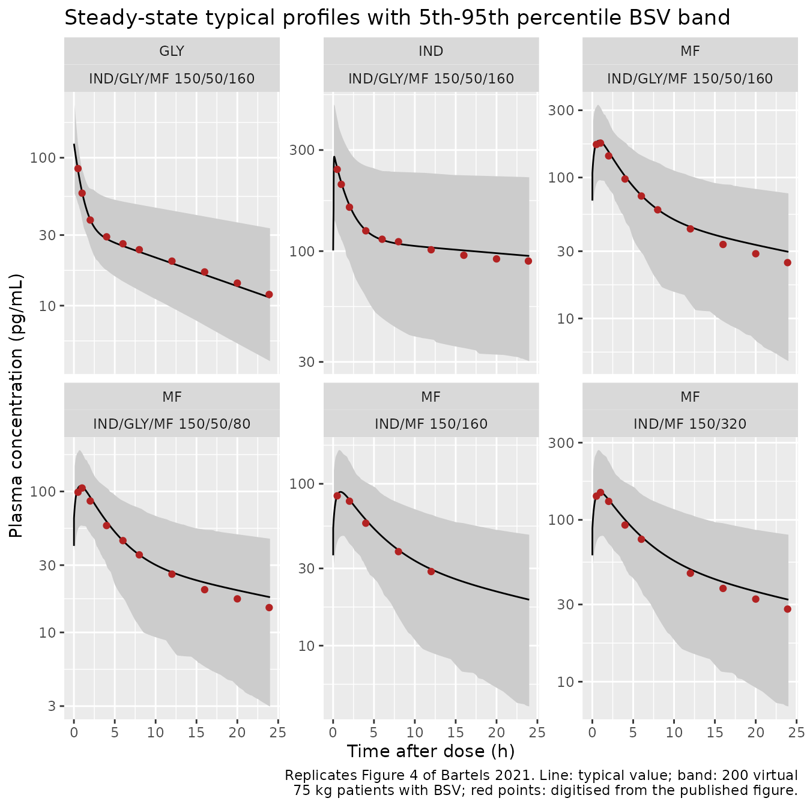

# Indacaterol, glycopyrronium and mometasone furoate (Bartels 2021)

## Model and source

Bartels 2021 developed one population PK model per component of the
indacaterol/glycopyrronium/mometasone furoate (IND/GLY/MF) inhaled
triple therapy, fitted to asthma patients who received IND/MF or
IND/GLY/MF via the Breezhaler device. The three models are independent
and ship as three files that share this article:

- `Bartels_2021_indacaterol`: Two-compartment population PK model with
  sequential zero-order/first-order absorption for inhaled indacaterol
  in adults and adolescents with asthma receiving the
  indacaterol/mometasone furoate (IND/MF) or
  indacaterol/glycopyrronium/mometasone furoate (IND/GLY/MF) fixed-dose
  combinations via the Breezhaler device (PALLADIUM and IRIDIUM Phase
  III studies), with estimated allometric body-weight exponents on CL/F
  and Vc/F, fixed allometric exponents on Q/F and Vp/F, a
  Japanese-ethnicity effect on Vc/F and an IRIDIUM study effect on Vc/F
  (Bartels 2021)
- `Bartels_2021_glycopyrronium`: Two-compartment population PK model
  with bolus input for inhaled glycopyrronium in adults and adolescents
  with asthma receiving the indacaterol/glycopyrronium/mometasone
  furoate (IND/GLY/MF) fixed-dose combination or glycopyrronium
  monotherapy via the Breezhaler device (IRIDIUM Phase III study), with
  fixed allometric body-weight exponents on all clearance and volume
  terms and grouped-race (Japanese, other) effects on Vc/F (Bartels
  2021)
- `Bartels_2021_mometasoneFuroate`: Two-compartment population PK model
  with mixed (simultaneous) zero-order/first-order absorption for
  inhaled mometasone furoate in adults and adolescents with asthma
  receiving the indacaterol/mometasone furoate (IND/MF) or
  indacaterol/glycopyrronium/mometasone furoate (IND/GLY/MF) fixed-dose
  combinations, or MF monotherapy, via the Breezhaler device (PALLADIUM,
  IRIDIUM and E2201 studies), with estimated allometric body-weight
  exponents on CL/F and Vc/F, baseline FEV1 on CL/F and Vc/F, and
  formulation (IND/GLY/MF; medium-dose MF strength) and IRIDIUM-study
  effects on Vc/F and relative bioavailability (Bartels 2021). The MF
  Twisthaler monotherapy comparator arms are not covered: their Vc/F, F
  and Vp/F formulation effects are not reported.
- Citation: Bartels C, Jain M, Yu J, Tillmann HC, Vaidya S. Population
  Pharmacokinetic Analysis of Indacaterol/Glycopyrronium/Mometasone
  Furoate After Administration of Combination Therapies Using the
  Breezhaler Device in Patients with Asthma. Eur J Drug Metab
  Pharmacokinet. 2021;46(4):489-506. <doi:10.1007/s13318-021-00689-x>
- Article (open access): <https://doi.org/10.1007/s13318-021-00689-x>
- Supplement (Online Resources 1-4):
  <https://static-content.springer.com/esm/art%3A10.1007%2Fs13318-021-00689-x/MediaObjects/13318_2021_689_MOESM1_ESM.pdf>

No correction notice for the article was registered with CrossRef as of
2026-09-28.

## Population

The analysis pooled 698 patients with asthma from two Phase III studies,
PALLADIUM (NCT02554786, n = 273) and IRIDIUM (NCT02571777, n = 249), and
the Phase II Breezhaler-versus-Twisthaler device-bridging study E2201
(NCT01555151, n = 176) (Bartels 2021 Table 4). 398 patients (57%) were
female. The grouped-race covariate had 523 Caucasian/White, 107 Japanese
and 68 other patients. Study means were 44.6-52.7 years of age (range
11-79), 74.7-82 kg of body weight (range 33.6-156 kg), 1.9-2.1 L
baseline FEV1 and 84-96 mL/min/1.73 m2 eGFR. The Phase III studies
sampled sparsely up to 1 h after the dose on Days 30 and 84/86. E2201
took six MF samples over 24 h.

Each drug was fitted to the studies that gave it:

- Indacaterol, 150 ug once daily, in PALLADIUM and IRIDIUM, as IND/MF
  150/160 or 150/320 ug or IND/GLY/MF 150/50/80 or 150/50/160 ug.
- Glycopyrronium, 50 ug once daily, in IRIDIUM, as IND/GLY/MF.
- Mometasone furoate in all three studies, as the two FDCs, as MF alone
  via Breezhaler (80 or 320 ug, E2201), or as MF alone via Twisthaler
  (200-800 ug per day, PALLADIUM and E2201).

The `population` element of each model holds the same information, for
example `readModelDb("Bartels_2021_indacaterol")()$population`.

## Source trace

Every `ini()` value carries an in-file comment naming its source. Unless
stated otherwise, the values come from Bartels 2021 Table 5, which gives
the final-model estimates for all three drugs. Monolix reports random
effects as SDs, so each variance below is SD squared and each CL/F-Vc/F
covariance is r x SD_CL x SD_Vc.

| Parameter | IND | GLY | MF | Source |
|----|----|----|----|----|
| `lcl` (CL/F, L/h) | log(54) | log(89) | log(210) | Table 5 |
| `lvc` (Vc/F, L) | log(600) | log(440) | log(1800) | Table 5 |
| `lq` (Q/F, L/h) | log(380) | log(350) | log(250) | Table 5 |
| `lvp` (Vp/F, L) | log(5700) | fixed(log(1300)) | log(3700) | Table 5 (GLY fixed from the COPD model, Sect. 2.3) |
| `lka` (Ka, 1/h) | fixed(log(50)) | \- | log(2.4) | Table 5 |
| `ld1` (zero-order duration, h) | log(0.055) | \- | fixed(log(0.01)) | Table 5 |
| `logitffo` (logit of 1 - Fr) | qlogis(1 - 0.33) | \- | qlogis(1 - 0.37) | Table 5 ‘Fr’ |
| `e_wt_cl` | 0.28 | fixed(0.75) | 0.34 | Table 5 |
| `e_wt_vc` | 0.43 | fixed(1) | 0.33 | Table 5 |
| `e_wt_q`, `e_wt_vp` | fixed(0.75), fixed(1) | fixed(0.75), fixed(1) | fixed(0.75), fixed(1) | Table 5 |
| `e_race_japanese_vc` | -0.29 | -0.65 | \- | Table 5 |
| `e_race_other_vc` | not reported | -0.063 | \- | Sect. 3.4 text (GLY) |
| `e_study_iridium_vc` | 0.25 | \- | 0.19 | Table 5 |
| `e_fev1_cl`, `e_fev1_vc` | \- | \- | -0.17, -0.23 | Table 5 |
| `e_form_mf_indglymf_vc` | \- | \- | -0.32 | Table 5 |
| `e_form_mf_indglymf_f` | \- | \- | fixed(2) | Sect. 2.3 factor 0.5, applied as a dose divisor |
| `e_form_mf_medium_f` | \- | \- | 0.18 | Table 5 |
| `etalcl + etalvc` | c(0.2304, 0.098496, 0.1444) | c(0.1521, 0.10335, 0.2809) | c(0.2401, 0.07644, 0.1521) | Table 5 SDs and correlations |
| `etalq` | 0.0225 | \- | 0.1521 | Table 5 |
| `etalvp` | 1.69 | \- | 4 | Table 5 |
| `etalogitffo` | 1.44 | \- | 0.0484 | Table 5 ‘BSV on Fr’ |
| `propSd` | 0.24 | 0.34 | 0.36 | Table 5 |
| Covariate form: power of WT/75, FEV1/2; exp(theta x indicator) |  |  |  | Sect. 2.4 Eqs. 1-2, Table 3 reference values |
| Two-compartment disposition, first-order elimination |  |  |  | Sect. 3.4 |
| IND: sequential zero-order (fraction Fr over D) then first-order |  |  |  | Sect. 3.2, 3.4 |
| GLY: bolus input to the central compartment |  |  |  | Sect. 3.2 |
| MF: simultaneous zero-order (Fr over D) and first-order |  |  |  | Sect. 3.2, 3.4 |

### Dosing the models

The IND and MF models split each inhalation between a zero-order input
to the central compartment and a first-order input from the depot.
**Every inhaled dose is therefore two records with the same `amt` at the
same time**: one on `cmt = "central"` with `rate = -2`, so rxode2
applies the modelled duration `d1`, and one on `cmt = "depot"`. The
model’s `f()` statements divide the dose between the two records. Doses
are the nominal ug of each component (MF as the nominal ug of the FDC
strength). The GLY model takes one bolus record on `cmt = "central"`.
Concentrations are returned in pg/mL.

rxode2 cannot combine `ss = 2` with a modelled `f()`, so steady state
cannot be imposed with `ss = 1` / `ss = 2` pairs on these split doses.
The article reaches steady state with a 60-day once-daily run-in
instead. The IND terminal half-life is about 90 h, and 14 days leaves
IND about 8% short of steady state.

``` r

n_run <- 60 # once-daily doses before the evaluated interval
t_last <- (n_run - 1) * 24 # time of the last dose

# One dose-plus-observation event table per subject. `subj` has one row per
# subject: an `id`, every covariate, the eta columns and a `variant` label.
make_events <- function(subj, amt, split, obs_tad) {
  dose_t <- (seq_len(n_run) - 1) * 24
  doses <- if (split) {
    tidyr::expand_grid(id = subj$id, time = dose_t, cmt = c("central", "depot")) |>
      dplyr::mutate(rate = ifelse(cmt == "central", -2, 0))
  } else {
    tidyr::expand_grid(id = subj$id, time = dose_t, cmt = "central") |>
      dplyr::mutate(rate = 0)
  }
  doses <- dplyr::mutate(doses, evid = 1L, amt = amt)
  obs <- tidyr::expand_grid(id = subj$id, time = t_last + obs_tad) |>
    dplyr::mutate(cmt = "central", rate = 0, evid = 0L, amt = 0)
  dplyr::bind_rows(doses, obs) |>
    dplyr::left_join(subj, by = "id") |>
    dplyr::arrange(id, time, dplyr::desc(evid))
}

# Draw subject-level random effects in R. Solving the zeroRe() model with these
# columns in the data gives each virtual subject the same etas in every
# covariate variant, and makes the cohort identical on every machine.
draw_etas <- function(mod, n) {
  om <- rxode2::rxode2(mod)$omega
  z <- matrix(stats::rnorm(n * ncol(om)), n) %*% chol(om)
  colnames(z) <- colnames(om)
  as.data.frame(z)
}

# PKNCA run separately for each treatment. One call over all treatments
# spends most of its time subsetting the full data set for every subject, and
# took more than 5 min for the covariate cohort below; per-treatment calls take
# about 2 s each. Returns the long `$result` data frame.
nca_one <- function(d, intervals) {
  dose <- d |> dplyr::distinct(treatment, id) |> dplyr::mutate(tad = 0, amt = 1)
  res <- PKNCA::pk.nca(PKNCA::PKNCAdata(
    PKNCA::PKNCAconc(d, Cc ~ tad | treatment + id),
    PKNCA::PKNCAdose(dose, amt ~ tad | treatment + id),
    intervals = intervals
  ))
  as.data.frame(res$result)
}
nca_by_treatment <- function(conc, intervals) {
  dplyr::bind_rows(lapply(split(conc, conc$treatment), nca_one, intervals = intervals))
}

mod_ind <- rxode2::rxode2(readModelDb("Bartels_2021_indacaterol"))
#> ℹ parameter labels from comments will be replaced by 'label()'
mod_gly <- rxode2::rxode2(readModelDb("Bartels_2021_glycopyrronium"))
#> ℹ parameter labels from comments will be replaced by 'label()'
mod_mf <- rxode2::rxode2(readModelDb("Bartels_2021_mometasoneFuroate"))
#> ℹ parameter labels from comments will be replaced by 'label()'
```

## Typical-value profiles (Figure 4)

Figure 4 of Bartels 2021 shows the steady-state typical profile of each
drug under each FDC. The IND curves of all four FDCs coincide, as do the
GLY curves of both IND/GLY/MF strengths. The MF curves differ by product
and strength. The maintainers digitised the curves from the vector
graphic in the article PDF. The coordinates are exact, so the only error
is the width of the plotted line, about 1% on the log axis. The figure’s
IND and MF curves match the IRIDIUM study effect (the only study that
gave all four FDCs), so the typical patient below is a 75 kg Caucasian
from IRIDIUM with a baseline FEV1 of 2 L.

``` r

fig4_digitised <- tibble::tribble(
  ~drug, ~product, ~tad, ~conc,
  "IND", "IND/GLY/MF 150/50/160", 0.5, 243.1,
  "IND", "IND/GLY/MF 150/50/160", 1, 206.6,
  "IND", "IND/GLY/MF 150/50/160", 2, 161.2,
  "IND", "IND/GLY/MF 150/50/160", 4, 124.7,
  "IND", "IND/GLY/MF 150/50/160", 6, 113.8,
  "IND", "IND/GLY/MF 150/50/160", 8, 110.8,
  "IND", "IND/GLY/MF 150/50/160", 12, 101.5,
  "IND", "IND/GLY/MF 150/50/160", 16, 95.6,
  "IND", "IND/GLY/MF 150/50/160", 20, 91.9,
  "IND", "IND/GLY/MF 150/50/160", 23.9, 89.8,
  "GLY", "IND/GLY/MF 150/50/160", 0.5, 84.5,
  "GLY", "IND/GLY/MF 150/50/160", 1, 57.6,
  "GLY", "IND/GLY/MF 150/50/160", 2, 37.9,
  "GLY", "IND/GLY/MF 150/50/160", 4, 29.2,
  "GLY", "IND/GLY/MF 150/50/160", 6, 26.2,
  "GLY", "IND/GLY/MF 150/50/160", 8, 23.9,
  "GLY", "IND/GLY/MF 150/50/160", 12, 20.0,
  "GLY", "IND/GLY/MF 150/50/160", 16, 16.9,
  "GLY", "IND/GLY/MF 150/50/160", 20, 14.2,
  "GLY", "IND/GLY/MF 150/50/160", 23.9, 11.9,
  "MF", "IND/GLY/MF 150/50/160", 0.5, 171.6,
  "MF", "IND/GLY/MF 150/50/160", 1, 175.5,
  "MF", "IND/GLY/MF 150/50/160", 2, 142.4,
  "MF", "IND/GLY/MF 150/50/160", 4, 97.6,
  "MF", "IND/GLY/MF 150/50/160", 6, 73.9,
  "MF", "IND/GLY/MF 150/50/160", 8, 59.0,
  "MF", "IND/GLY/MF 150/50/160", 12, 43.2,
  "MF", "IND/GLY/MF 150/50/160", 16, 33.5,
  "MF", "IND/GLY/MF 150/50/160", 20, 28.8,
  "MF", "IND/GLY/MF 150/50/160", 23.9, 24.9,
  "MF", "IND/MF 150/320", 0.5, 140.2,
  "MF", "IND/MF 150/320", 1, 147.7,
  "MF", "IND/MF 150/320", 2, 130.1,
  "MF", "IND/MF 150/320", 4, 92.9,
  "MF", "IND/MF 150/320", 6, 75.9,
  "MF", "IND/MF 150/320", 12, 46.8,
  "MF", "IND/MF 150/320", 16, 37.7,
  "MF", "IND/MF 150/320", 20, 32.4,
  "MF", "IND/MF 150/320", 23.9, 28.1,
  "MF", "IND/GLY/MF 150/50/80", 0.5, 98.8,
  "MF", "IND/GLY/MF 150/50/80", 1, 105.8,
  "MF", "IND/GLY/MF 150/50/80", 2, 85.6,
  "MF", "IND/GLY/MF 150/50/80", 4, 57.3,
  "MF", "IND/GLY/MF 150/50/80", 6, 44.8,
  "MF", "IND/GLY/MF 150/50/80", 8, 35.5,
  "MF", "IND/GLY/MF 150/50/80", 12, 25.9,
  "MF", "IND/GLY/MF 150/50/80", 16, 20.1,
  "MF", "IND/GLY/MF 150/50/80", 20, 17.3,
  "MF", "IND/GLY/MF 150/50/80", 23.9, 15.0,
  "MF", "IND/MF 150/160", 0.5, 84.3,
  "MF", "IND/MF 150/160", 2, 78.1,
  "MF", "IND/MF 150/160", 4, 57.1,
  "MF", "IND/MF 150/160", 8, 38.1,
  "MF", "IND/MF 150/160", 12, 28.7
)
# Digitised curve maxima (concentration only; the time of a sub-hour peak is
# not resolvable at the plotted line width).
fig4_peaks <- tibble::tribble(
  ~drug, ~product, ~cmax_fig,
  "IND", "IND/GLY/MF 150/50/160", 278.7,
  "GLY", "IND/GLY/MF 150/50/160", 129.7,
  "MF", "IND/GLY/MF 150/50/160", 176.9,
  "MF", "IND/MF 150/320", 148.2,
  "MF", "IND/GLY/MF 150/50/80", 106.3,
  "MF", "IND/MF 150/160", 88.4
)
```

``` r

# MF products: nominal dose and the two formulation indicators.
mf_products <- tibble::tribble(
  ~product, ~amt, ~FORM_MF_INDGLYMF, ~FORM_MF_MEDIUM,
  "IND/MF 150/320", 320, 0, 0,
  "IND/GLY/MF 150/50/160", 160, 1, 0,
  "IND/MF 150/160", 160, 0, 1,
  "IND/GLY/MF 150/50/80", 80, 1, 1
)
tad_fine <- sort(unique(round(c(seq(0.005, 1, by = 0.005), seq(1, 24, by = 0.05)), 6)))

typ_one <- function(mod, amt, split, cov, drug, product) {
  ev <- make_events(dplyr::bind_cols(tibble::tibble(id = 1L), cov), amt, split, tad_fine)
  rxode2::rxSolve(rxode2::zeroRe(mod), events = ev, returnType = "data.frame") |>
    dplyr::transmute(drug = drug, product = product, tad = round(time - t_last, 6), Cc)
}

typ <- dplyr::bind_rows(
  typ_one(mod_ind, 150, TRUE, tibble::tibble(WT = 75, RACE_JAPANESE = 0, STUDY_IRIDIUM = 1),
          "IND", "IND/GLY/MF 150/50/160"),
  typ_one(mod_gly, 50, FALSE, tibble::tibble(WT = 75, RACE_JAPANESE = 0, RACE_OTHER = 0),
          "GLY", "IND/GLY/MF 150/50/160"),
  dplyr::bind_rows(lapply(seq_len(nrow(mf_products)), function(i) {
    p <- mf_products[i, ]
    typ_one(mod_mf, p$amt, TRUE,
            tibble::tibble(WT = 75, FEV1 = 2, STUDY_IRIDIUM = 1,
                           FORM_MF_INDGLYMF = p$FORM_MF_INDGLYMF, FORM_MF_MEDIUM = p$FORM_MF_MEDIUM),
            "MF", p$product)
  }))
)
#> ℹ omega/sigma items treated as zero: 'etalcl', 'etalvc', 'etalq', 'etalvp', 'etalogitffo'
#> ℹ omega/sigma items treated as zero: 'etalcl', 'etalvc'
#> ℹ omega/sigma items treated as zero: 'etalcl', 'etalvc', 'etalq', 'etalvp', 'etalogitffo'
#> ℹ omega/sigma items treated as zero: 'etalcl', 'etalvc', 'etalq', 'etalvp', 'etalogitffo'
#> ℹ omega/sigma items treated as zero: 'etalcl', 'etalvc', 'etalq', 'etalvp', 'etalogitffo'
#> ℹ omega/sigma items treated as zero: 'etalcl', 'etalvc', 'etalq', 'etalvp', 'etalogitffo'

fig4_check <- fig4_digitised |>
  dplyr::inner_join(typ, by = c("drug", "product", "tad"), relationship = "one-to-one") |>
  dplyr::mutate(pct_diff = 100 * (Cc / conc - 1))
peak_check <- typ |>
  dplyr::group_by(drug, product) |>
  dplyr::summarise(cmax_model = max(Cc), tmax_model = tad[which.max(Cc)], .groups = "drop") |>
  dplyr::inner_join(fig4_peaks, by = c("drug", "product")) |>
  dplyr::mutate(pct_diff = 100 * (cmax_model / cmax_fig - 1))
stopifnot(nrow(fig4_check) == nrow(fig4_digitised), nrow(peak_check) == nrow(fig4_peaks))

fig4_check |>
  dplyr::group_by(drug, product) |>
  dplyr::summarise(
    n_points = dplyr::n(),
    `max abs % diff, tad <= 6 h` = max(abs(pct_diff[tad <= 6])),
    `max abs % diff, tad > 6 h` = max(abs(pct_diff[tad > 6])),
    .groups = "drop"
  ) |>
  dplyr::left_join(
    peak_check |> dplyr::select(drug, product, `Cmax % diff` = pct_diff), by = c("drug", "product")
  ) |>
  knitr::kable(digits = 1, caption = "Typical-value model vs. digitised Figure 4 curves.")
```

| drug | product | n_points | max abs % diff, tad \<= 6 h | max abs % diff, tad \> 6 h | Cmax % diff |
|:---|:---|---:|---:|---:|---:|
| GLY | IND/GLY/MF 150/50/160 | 10 | 3.3 | 4.6 | -4.1 |
| IND | IND/GLY/MF 150/50/160 | 10 | 2.1 | 6.4 | 0.1 |
| MF | IND/GLY/MF 150/50/160 | 10 | 6.9 | 19.6 | 3.2 |
| MF | IND/GLY/MF 150/50/80 | 10 | 6.8 | 18.8 | 2.8 |
| MF | IND/MF 150/160 | 5 | 5.1 | 3.3 | 0.8 |
| MF | IND/MF 150/320 | 9 | 7.9 | 14.6 | 0.5 |

Typical-value model vs. digitised Figure 4 curves. {.table}

The IND and GLY curves reproduce Figure 4 to within 7% at every
digitised point, and within 5% at the peak. The MF curves match through
the absorption and early distribution phase and at the peak. From about
8 h onward the model runs up to about 20% above the figure for three of
the four products (see the second assertion block and the Assumptions
section).

``` r

# Deterministic comparison (typical values, no random numbers). Measured maxima:
# IND 6.4%, GLY 4.6% (all points); peaks 4.1% (GLY), MF tad <= 6 h 7.9%.
stopifnot(
  max(abs(fig4_check$pct_diff[fig4_check$drug != "MF"])) < 9,
  max(abs(peak_check$pct_diff)) < 6,
  max(abs(fig4_check$pct_diff[fig4_check$drug == "MF" & fig4_check$tad <= 6])) < 11
)
# Known deviation, kept visible rather than hidden: after 6 h the MF points sit
# above the figure, by up to 15-20% for three of the four products (measured
# maximum 19.6%). Guard only against a gross error such as a dropped
# peripheral compartment.
stopifnot(max(abs(fig4_check$pct_diff[fig4_check$drug == "MF" & fig4_check$tad > 6])) < 30)
```

## Covariate simulations (Section 3.6)

Section 3.6 of Bartels 2021 quantifies the covariate effects by
simulating steady-state profiles for 200 virtual patients per covariate
variant, with BSV and without residual error. It samples every 6 min
over 24 h and compares population-mean AUC0-24h, Cmax and Ctrough
against a 75 kg reference patient. The simulation below repeats that
design. The same 200 sets of random effects are used in every variant,
so each ratio compares like with like. The paired design, together with
R’s own random-number generator, makes the cohort identical on every
machine.

``` r

set.seed(20210522)
n_sub <- 200 # per variant (Bartels 2021 Sect. 2.6)
etas <- list(
  IND = draw_etas(mod_ind, n_sub),
  GLY = draw_etas(mod_gly, n_sub),
  MF = draw_etas(mod_mf, n_sub)
)

variants <- tibble::tribble(
  ~drug, ~variant, ~amt, ~WT, ~RACE_JAPANESE, ~RACE_OTHER, ~STUDY_IRIDIUM, ~FEV1, ~FORM_MF_INDGLYMF, ~FORM_MF_MEDIUM,
  "IND", "reference (PALLADIUM)", 150, 75, 0, 0, 0, NA, NA, NA,
  "IND", "55 kg", 150, 55, 0, 0, 0, NA, NA, NA,
  "IND", "105 kg", 150, 105, 0, 0, 0, NA, NA, NA,
  "IND", "Japanese", 150, 75, 1, 0, 0, NA, NA, NA,
  "IND", "IRIDIUM", 150, 75, 0, 0, 1, NA, NA, NA,
  "GLY", "reference", 50, 75, 0, 0, NA, NA, NA, NA,
  "GLY", "55 kg", 50, 55, 0, 0, NA, NA, NA, NA,
  "GLY", "105 kg", 50, 105, 0, 0, NA, NA, NA, NA,
  "GLY", "Japanese", 50, 75, 1, 0, NA, NA, NA, NA,
  "GLY", "other race", 50, 75, 0, 1, NA, NA, NA, NA,
  "MF", "reference (IND/MF 150/320, PALLADIUM)", 320, 75, NA, NA, 0, 2, 0, 0,
  "MF", "55 kg", 320, 55, NA, NA, 0, 2, 0, 0,
  "MF", "105 kg", 320, 105, NA, NA, 0, 2, 0, 0,
  "MF", "FEV1 1.2 L", 320, 75, NA, NA, 0, 1.2, 0, 0,
  "MF", "FEV1 3 L", 320, 75, NA, NA, 0, 3, 0, 0,
  "MF", "IND/MF 150/320", 320, 75, NA, NA, 1, 2, 0, 0,
  "MF", "IND/GLY/MF 150/50/160", 160, 75, NA, NA, 1, 2, 1, 0,
  "MF", "IND/MF 150/160", 160, 75, NA, NA, 1, 2, 0, 1,
  "MF", "IND/GLY/MF 150/50/80", 80, 75, NA, NA, 1, 2, 1, 1
) |>
  dplyr::mutate(vidx = dplyr::row_number())

tad_grid <- round(seq(0.1, 24, by = 0.1), 6) # 6-min grid of Bartels 2021 Sect. 2.6

build_variant <- function(v) {
  cov_cols <- c(IND = list(c("WT", "RACE_JAPANESE", "STUDY_IRIDIUM")),
                GLY = list(c("WT", "RACE_JAPANESE", "RACE_OTHER")),
                MF = list(c("WT", "FEV1", "STUDY_IRIDIUM", "FORM_MF_INDGLYMF", "FORM_MF_MEDIUM")))[[v$drug]]
  subj <- dplyr::bind_cols(
    tibble::tibble(id = (v$vidx - 1L) * n_sub + seq_len(n_sub), variant = v$variant),
    v[rep(1, n_sub), cov_cols],
    etas[[v$drug]]
  )
  make_events(subj, v$amt, split = v$drug != "GLY", obs_tad = tad_grid)
}

solve_drug <- function(drug, mod) {
  vv <- variants[variants$drug == drug, ]
  ev <- dplyr::bind_rows(lapply(split(vv, seq_len(nrow(vv))), build_variant))
  stopifnot(!anyDuplicated(unique(ev[, c("id", "time", "evid", "cmt")])))
  rxode2::rxSolve(rxode2::zeroRe(mod), events = ev, keep = "variant",
                  returnType = "data.frame", maxsteps = 1e6) |>
    dplyr::transmute(drug = drug, id, variant, tad = round(time - t_last, 6), Cc)
}

sim_cov <- dplyr::bind_rows(
  solve_drug("IND", mod_ind),
  solve_drug("GLY", mod_gly),
  solve_drug("MF", mod_mf)
)
#> ℹ omega/sigma items treated as zero: 'etalcl', 'etalvc', 'etalq', 'etalvp', 'etalogitffo'
#> Warning: multi-subject simulation without without 'omega'
#> ℹ omega/sigma items treated as zero: 'etalcl', 'etalvc'
#> Warning: multi-subject simulation without without 'omega'
#> ℹ omega/sigma items treated as zero: 'etalcl', 'etalvc', 'etalq', 'etalvp', 'etalogitffo'
#> Warning: multi-subject simulation without without 'omega'
stopifnot(!anyNA(sim_cov$Cc), all(sim_cov$Cc > 0))
```

### PKNCA over the steady-state interval

At steady state the pre-dose concentration equals the concentration 24 h
after the dose. Each profile therefore gets a time-zero row that carries
its 24 h value. This anchors AUC0-24 and Ctrough without an observation
at the dosing instant, where a GLY bolus would already have raised the
level.

``` r

nca_in <- dplyr::bind_rows(
  sim_cov,
  sim_cov |> dplyr::filter(abs(tad - 24) < 1e-8) |> dplyr::mutate(tad = 0)
) |>
  dplyr::filter(!is.na(Cc)) |>
  dplyr::mutate(treatment = paste(drug, variant, sep = ": ")) |>
  dplyr::arrange(treatment, id, tad)

nca_cov <- nca_by_treatment(
  nca_in,
  intervals = data.frame(start = 0, end = 24, cmax = TRUE, cmin = TRUE, auclast = TRUE)
)

nca_means <- nca_cov |>
  dplyr::filter(PPTESTCD %in% c("cmax", "cmin", "auclast")) |>
  dplyr::group_by(treatment, PPTESTCD) |>
  dplyr::summarise(mean = mean(PPORRES), .groups = "drop") |>
  tidyr::pivot_wider(names_from = PPTESTCD, values_from = mean)
stopifnot(nrow(nca_means) == nrow(variants))
```

### Comparison against the published covariate effects

Each published figure is the percent difference of a population mean
from the reference variant, rounded to whole percent. The IND reference
is PALLADIUM, as in Section 3.6. The MF formulation comparisons use
IRIDIUM, the only study that gave all four FDCs.

``` r

claims <- tibble::tribble(
  ~drug, ~variant, ~reference, ~metric, ~published,
  "IND", "55 kg", "reference (PALLADIUM)", "auclast", 10,
  "IND", "105 kg", "reference (PALLADIUM)", "auclast", -10,
  "IND", "55 kg", "reference (PALLADIUM)", "cmax", 12,
  "IND", "105 kg", "reference (PALLADIUM)", "cmax", -12,
  "IND", "Japanese", "reference (PALLADIUM)", "cmax", 20,
  "IND", "Japanese", "reference (PALLADIUM)", "auclast", 0,
  "IND", "IRIDIUM", "reference (PALLADIUM)", "auclast", 0,
  "GLY", "55 kg", "reference", "auclast", 26,
  "GLY", "105 kg", "reference", "auclast", -22,
  "GLY", "55 kg", "reference", "cmax", 33,
  "GLY", "105 kg", "reference", "cmax", -27,
  "GLY", "Japanese", "reference", "cmax", 60,
  "GLY", "other race", "reference", "cmax", 5,
  "GLY", "Japanese", "reference", "cmin", -8,
  "GLY", "Japanese", "reference", "auclast", 0,
  "MF", "55 kg", "reference (IND/MF 150/320, PALLADIUM)", "auclast", 11,
  "MF", "105 kg", "reference (IND/MF 150/320, PALLADIUM)", "auclast", -11,
  "MF", "FEV1 1.2 L", "reference (IND/MF 150/320, PALLADIUM)", "auclast", -8,
  "MF", "FEV1 3 L", "reference (IND/MF 150/320, PALLADIUM)", "auclast", 7,
  "MF", "55 kg", "reference (IND/MF 150/320, PALLADIUM)", "cmax", 11,
  "MF", "105 kg", "reference (IND/MF 150/320, PALLADIUM)", "cmax", -11,
  "MF", "FEV1 1.2 L", "reference (IND/MF 150/320, PALLADIUM)", "cmax", -10,
  "MF", "FEV1 3 L", "reference (IND/MF 150/320, PALLADIUM)", "cmax", 9,
  "MF", "reference (IND/MF 150/320, PALLADIUM)", "IND/MF 150/320", "cmax", 13,
  "MF", "IND/GLY/MF 150/50/160", "IND/MF 150/320", "auclast", 0,
  "MF", "IND/GLY/MF 150/50/80", "IND/MF 150/160", "auclast", 0
)

mean_of <- function(drug, variant, metric) {
  v <- nca_means[[metric]][nca_means$treatment == paste(drug, variant, sep = ": ")]
  if (length(v) != 1L) stop("no unique NCA row for ", drug, ": ", variant)
  v
}
claims$simulated <- vapply(seq_len(nrow(claims)), function(i) {
  c_i <- claims[i, ]
  100 * (mean_of(c_i$drug, c_i$variant, c_i$metric) / mean_of(c_i$drug, c_i$reference, c_i$metric) - 1)
}, numeric(1))
claims$difference <- claims$simulated - claims$published

claims |>
  dplyr::mutate(metric = dplyr::recode(metric, auclast = "AUC0-24", cmax = "Cmax", cmin = "Ctrough")) |>
  dplyr::rename(
    Drug = drug, Variant = variant, `Compared with` = reference, Metric = metric,
    `Published (%)` = published, `Simulated (%)` = simulated, `Difference (points)` = difference
  ) |>
  knitr::kable(digits = 1, caption = "Covariate effects on population-mean exposure, Bartels 2021 Section 3.6 vs. simulation.")
```

| Drug | Variant | Compared with | Metric | Published (%) | Simulated (%) | Difference (points) |
|:---|:---|:---|:---|---:|---:|---:|
| IND | 55 kg | reference (PALLADIUM) | AUC0-24 | 10 | 10.9 | 0.9 |
| IND | 105 kg | reference (PALLADIUM) | AUC0-24 | -10 | -11.0 | -1.0 |
| IND | 55 kg | reference (PALLADIUM) | Cmax | 12 | 12.8 | 0.8 |
| IND | 105 kg | reference (PALLADIUM) | Cmax | -12 | -12.4 | -0.4 |
| IND | Japanese | reference (PALLADIUM) | Cmax | 20 | 21.7 | 1.7 |
| IND | Japanese | reference (PALLADIUM) | AUC0-24 | 0 | 0.0 | 0.0 |
| IND | IRIDIUM | reference (PALLADIUM) | AUC0-24 | 0 | -0.1 | -0.1 |
| GLY | 55 kg | reference | AUC0-24 | 26 | 26.1 | 0.1 |
| GLY | 105 kg | reference | AUC0-24 | -22 | -22.2 | -0.2 |
| GLY | 55 kg | reference | Cmax | 33 | 33.4 | 0.4 |
| GLY | 105 kg | reference | Cmax | -27 | -26.8 | 0.2 |
| GLY | Japanese | reference | Cmax | 60 | 61.0 | 1.0 |
| GLY | other race | reference | Cmax | 5 | 4.9 | -0.1 |
| GLY | Japanese | reference | Ctrough | -8 | -7.6 | 0.4 |
| GLY | Japanese | reference | AUC0-24 | 0 | -0.9 | -0.9 |
| MF | 55 kg | reference (IND/MF 150/320, PALLADIUM) | AUC0-24 | 11 | 11.6 | 0.6 |
| MF | 105 kg | reference (IND/MF 150/320, PALLADIUM) | AUC0-24 | -11 | -11.3 | -0.3 |
| MF | FEV1 1.2 L | reference (IND/MF 150/320, PALLADIUM) | AUC0-24 | -8 | -8.1 | -0.1 |
| MF | FEV1 3 L | reference (IND/MF 150/320, PALLADIUM) | AUC0-24 | 7 | 7.0 | 0.0 |
| MF | 55 kg | reference (IND/MF 150/320, PALLADIUM) | Cmax | 11 | 11.2 | 0.2 |
| MF | 105 kg | reference (IND/MF 150/320, PALLADIUM) | Cmax | -11 | -11.0 | 0.0 |
| MF | FEV1 1.2 L | reference (IND/MF 150/320, PALLADIUM) | Cmax | -10 | -9.9 | 0.1 |
| MF | FEV1 3 L | reference (IND/MF 150/320, PALLADIUM) | Cmax | 9 | 8.5 | -0.5 |
| MF | reference (IND/MF 150/320, PALLADIUM) | IND/MF 150/320 | Cmax | 13 | 12.3 | -0.7 |
| MF | IND/GLY/MF 150/50/160 | IND/MF 150/320 | AUC0-24 | 0 | -0.1 | -0.1 |
| MF | IND/GLY/MF 150/50/80 | IND/MF 150/160 | AUC0-24 | 0 | -0.1 | -0.1 |

Covariate effects on population-mean exposure, Bartels 2021 Section 3.6
vs. simulation. {.table}

``` r

# The cohort is fixed by set.seed() and the zeroRe() solve, so this is
# deterministic. Measured maximum |difference| 1.7 points (IND Japanese Cmax).
# The published values are themselves 200-subject Monte-Carlo means rounded to
# whole percent, so the bound leaves room for their own sampling error.
stopifnot(nrow(claims) == 26, !anyNA(claims$simulated), max(abs(claims$difference)) < 4)
```

Section 4.2 also gives an absolute value: the simulated mean GLY Cmax in
Japanese patients was 208.8 pg/mL for IND/GLY/MF 150/50/160 ug.

``` r

gly_jap_cmax <- mean_of("GLY", "Japanese", "cmax")
gly_jap_cmax
#> [1] 203.9151
# Measured 203.9 (-2.3%); the paper's own figure is a 200-subject Monte-Carlo
# mean with its own sampling error.
stopifnot(abs(gly_jap_cmax / 208.8 - 1) < 0.08)
```

### Variability bands (Figure 4)

``` r

band <- sim_cov |>
  dplyr::filter(
    (drug == "IND" & variant == "IRIDIUM") |
      (drug == "GLY" & variant == "reference") |
      (drug == "MF" & variant %in% mf_products$product)
  ) |>
  dplyr::mutate(product = dplyr::if_else(drug == "MF", variant, "IND/GLY/MF 150/50/160")) |>
  dplyr::group_by(drug, product, tad) |>
  dplyr::summarise(Q05 = quantile(Cc, 0.05), Q95 = quantile(Cc, 0.95), .groups = "drop")

ggplot() +
  geom_ribbon(data = band, aes(tad, ymin = Q05, ymax = Q95), fill = "grey80") +
  geom_line(data = typ, aes(tad, Cc)) +
  geom_point(data = fig4_digitised, aes(tad, conc), colour = "firebrick", size = 1.5) +
  facet_wrap(~ drug + product, scales = "free_y") +
  scale_y_log10() +
  labs(
    x = "Time after dose (h)", y = "Plasma concentration (pg/mL)",
    title = "Steady-state typical profiles with 5th-95th percentile BSV band",
    caption = paste0(
      "Replicates Figure 4 of Bartels 2021. Line: typical value; band: 200 virtual\n",
      "75 kg patients with BSV; red points: digitised from the published figure."
    )
  )
```



## Observed Day 86 concentrations (Online Resource 2)

Online Resource 2 lists the observed mean Ctrough and Cmax on Day 86 for
each FDC arm. As in Figure 1, Cmax is the largest sample up to 1 h after
the dose. For IND the 2-min sample is excluded, and for GLY it is
included (IRIDIUM sampled at -25 min, 2 min, 15 min and 1 h). Ctrough is
the -25 min pre-dose sample. The comparison below simulates 200 virtual
patients per arm. Body weight is drawn from each study’s Table 4 mean
and SD, truncated to the study range. The grouped-race indicators are
drawn at each study’s Table 4 frequency. Proportional residual error is
added in R, and values below the LLOQ are set to the LLOQ, as the
paper’s summary statistics were.

``` r

set.seed(86)
studies <- tibble::tribble(
  ~study, ~wt_mean, ~wt_sd, ~wt_min, ~wt_max, ~p_jap, ~p_oth,
  "PALLADIUM", 79.5, 19, 33.6, 156, 21 / 273, 51 / 273,
  "IRIDIUM", 82, 17.6, 44, 136, 13 / 249, 17 / 249
)
obs_arms <- tibble::tribble(
  ~drug, ~study, ~treatment, ~amt, ~cmin, ~cmax,
  "IND", "PALLADIUM", "IND PALLADIUM IND/MF 150/320", 150, 106.8, 302.2,
  "IND", "PALLADIUM", "IND PALLADIUM IND/MF 150/160", 150, 94.0, 340.3,
  "IND", "IRIDIUM", "IND IRIDIUM IND/GLY/MF 150/50/160", 150, 96.6, 275.3,
  "IND", "IRIDIUM", "IND IRIDIUM IND/GLY/MF 150/50/80", 150, 101.0, 285.9,
  "IND", "IRIDIUM", "IND IRIDIUM IND/MF 150/320", 150, 84.7, 261.6,
  "IND", "IRIDIUM", "IND IRIDIUM IND/MF 150/160", 150, 87.0, 265.4,
  "GLY", "IRIDIUM", "GLY IRIDIUM IND/GLY/MF 150/50/160", 50, 13.1, 140.6,
  "GLY", "IRIDIUM", "GLY IRIDIUM IND/GLY/MF 150/50/80", 50, 12.3, 157.7
) |>
  dplyr::mutate(aidx = dplyr::row_number())

rtnorm <- function(n, mean, sd, lo, hi) {
  x <- stats::rnorm(n, mean, sd)
  while (any(out <- x < lo | x > hi)) x[out] <- stats::rnorm(sum(out), mean, sd)
  x
}

build_arm <- function(a) {
  s <- studies[studies$study == a$study, ]
  grp <- sample(c("cau", "jap", "oth"), n_sub, replace = TRUE,
                prob = c(1 - s$p_jap - s$p_oth, s$p_jap, s$p_oth))
  subj <- tibble::tibble(
    id = 10000L + (a$aidx - 1L) * n_sub + seq_len(n_sub),
    treatment = a$treatment,
    WT = rtnorm(n_sub, s$wt_mean, s$wt_sd, s$wt_min, s$wt_max),
    RACE_JAPANESE = as.integer(grp == "jap"),
    RACE_OTHER = as.integer(grp == "oth"),
    STUDY_IRIDIUM = as.integer(a$study == "IRIDIUM")
  )
  subj <- dplyr::bind_cols(subj, draw_etas(if (a$drug == "IND") mod_ind else mod_gly, n_sub))
  if (a$drug == "IND") subj$RACE_OTHER <- NULL else subj$STUDY_IRIDIUM <- NULL
  # -25 min before the Day-86 dose is 23 h 35 min after the previous dose.
  samp <- if (a$drug == "IND") c(-25 / 60, 0.25, 1) else c(-25 / 60, 2 / 60, 0.25, 1)
  make_events(subj, a$amt, split = a$drug == "IND", obs_tad = samp)
}

solve_arms <- function(drug, mod, prop_sd, lloq) {
  aa <- obs_arms[obs_arms$drug == drug, ]
  ev <- dplyr::bind_rows(lapply(split(aa, seq_len(nrow(aa))), build_arm))
  rxode2::rxSolve(rxode2::zeroRe(mod), events = ev, keep = "treatment",
                  returnType = "data.frame", maxsteps = 1e6) |>
    dplyr::mutate(
      tad = pmax(round(time - t_last, 6), 0), # the pre-dose sample anchors the interval at 0
      Cc = pmax(Cc * (1 + prop_sd * stats::rnorm(dplyr::n())), lloq)
    ) |>
    dplyr::select(id, treatment, tad, Cc)
}

sim_obs <- dplyr::bind_rows(
  solve_arms("IND", mod_ind, 0.24, 5),
  solve_arms("GLY", mod_gly, 0.34, 0.25)
)
#> ℹ omega/sigma items treated as zero: 'etalcl', 'etalvc', 'etalq', 'etalvp', 'etalogitffo'
#> Warning: multi-subject simulation without without 'omega'
#> ℹ omega/sigma items treated as zero: 'etalcl', 'etalvc'
#> Warning: multi-subject simulation without without 'omega'

nca_obs <- nca_by_treatment(
  dplyr::filter(sim_obs, !is.na(Cc)),
  intervals = data.frame(start = 0, end = 1, cmax = TRUE, cmin = TRUE)
)

# The paper reports arithmetic means; ncaComparisonTable() would otherwise
# summarise the simulated subjects by their median.
obs_means <- nca_obs |>
  dplyr::filter(PPTESTCD %in% c("cmax", "cmin")) |>
  dplyr::group_by(treatment, PPTESTCD) |>
  dplyr::summarise(PPORRES = mean(PPORRES), .groups = "drop")

cmp_obs <- nlmixr2lib::ncaComparisonTable(
  simulated = obs_means,
  reference = dplyr::select(obs_arms, treatment, cmax, cmin),
  by = "treatment",
  units = c(cmax = "pg/mL", cmin = "pg/mL"),
  tolerance_pct = 20
)
knitr::kable(cmp_obs, caption = paste(
  "Simulated vs. observed Day 86 mean concentrations (Online Resource 2).",
  "Cmin over the sparse 0-1 h samples is the pre-dose trough. * differs by >20%."
))
```

| NCA parameter | treatment                         | Reference | Simulated | % diff |
|:--------------|:----------------------------------|:----------|:----------|:-------|
| Cmax (pg/mL)  | IND PALLADIUM IND/MF 150/320      | 302       | 339       | +12.2% |
| Cmax (pg/mL)  | IND PALLADIUM IND/MF 150/160      | 340       | 340       | -0.2%  |
| Cmax (pg/mL)  | IND IRIDIUM IND/GLY/MF 150/50/160 | 275       | 279       | +1.2%  |
| Cmax (pg/mL)  | IND IRIDIUM IND/GLY/MF 150/50/80  | 286       | 294       | +2.8%  |
| Cmax (pg/mL)  | IND IRIDIUM IND/MF 150/320        | 262       | 291       | +11.1% |
| Cmax (pg/mL)  | IND IRIDIUM IND/MF 150/160        | 265       | 291       | +9.6%  |
| Cmax (pg/mL)  | GLY IRIDIUM IND/GLY/MF 150/50/160 | 141       | 138       | -2.0%  |
| Cmax (pg/mL)  | GLY IRIDIUM IND/GLY/MF 150/50/80  | 158       | 153       | -3.3%  |
| Cmin (pg/mL)  | IND PALLADIUM IND/MF 150/320      | 107       | 94.1      | -11.9% |
| Cmin (pg/mL)  | IND PALLADIUM IND/MF 150/160      | 94        | 90.7      | -3.5%  |
| Cmin (pg/mL)  | IND IRIDIUM IND/GLY/MF 150/50/160 | 96.6      | 93.8      | -2.9%  |
| Cmin (pg/mL)  | IND IRIDIUM IND/GLY/MF 150/50/80  | 101       | 99        | -2.0%  |
| Cmin (pg/mL)  | IND IRIDIUM IND/MF 150/320        | 84.7      | 100       | +18.5% |
| Cmin (pg/mL)  | IND IRIDIUM IND/MF 150/160        | 87        | 94.1      | +8.1%  |
| Cmin (pg/mL)  | GLY IRIDIUM IND/GLY/MF 150/50/160 | 13.1      | 12.5      | -4.3%  |
| Cmin (pg/mL)  | GLY IRIDIUM IND/GLY/MF 150/50/80  | 12.3      | 13.9      | +13.2% |

Simulated vs. observed Day 86 mean concentrations (Online Resource 2).
Cmin over the sparse 0-1 h samples is the pre-dose trough. \* differs by
\>20%. {.table}

The simulated means sit close to the observed ones. The largest
differences are in the IRIDIUM IND/MF arms, whose observed IND Cmax was
4-9% and Ctrough 10-16% below those of the IRIDIUM IND/GLY/MF arms. The
model has no IND formulation effect (Sect. 3.4), so it gives all four
IRIDIUM arms the same exposure, and the observed spread between arms
stays in the residual.

``` r

obs_pct <- obs_means |>
  dplyr::inner_join(
    obs_arms |> dplyr::select(treatment, cmax, cmin) |>
      tidyr::pivot_longer(c(cmax, cmin), names_to = "PPTESTCD", values_to = "published"),
    by = c("treatment", "PPTESTCD")
  ) |>
  dplyr::mutate(pct = 100 * (PPORRES / published - 1))
stopifnot(nrow(obs_pct) == 16)
obs_pct |>
  dplyr::group_by(PPTESTCD) |>
  dplyr::summarise(median_pct = median(pct), max_abs_pct = max(abs(pct)), .groups = "drop") |>
  knitr::kable(digits = 1, caption = "Summary of the simulated-vs-observed differences.")
```

| PPTESTCD | median_pct | max_abs_pct |
|:---------|-----------:|------------:|
| cmax     |        2.0 |        12.2 |
| cmin     |       -2.5 |        18.5 |

Summary of the simulated-vs-observed differences. {.table}

``` r

# Observed data sit behind this comparison, and the covariate distributions
# are reconstructed from summaries, so the gate is on the centre and a wide
# envelope. Measured: median +2.0% (Cmax) and -2.5% (Ctrough), largest single
# row 18.5% (IND IRIDIUM IND/MF 150/320 trough). A mis-transcribed CL/F, Vc/F,
# dose or unit moves every row by tens of percent.
stopifnot(abs(median(obs_pct$pct)) < 8, max(abs(obs_pct$pct)) < 30)
```

## Assumptions and deviations

- **Three models, one article.** Bartels 2021 fitted a separate model to
  each drug, so each ships as its own file.
- **Split dose records.** Each IND or MF inhalation is two records of
  the same `amt`: one on `central` with `rate = -2` and one on `depot`
  (see “Dosing the models”). The Monolix absorption macros are not
  reproduced literally; the split reproduces them.
- **IND absorption is sequential.** Section 3.2 describes “a short
  zero-order absorption of a fraction of the drug followed by a rapid
  first-order absorption of the rest”, so the first-order fraction
  starts when the zero-order input ends (`alag(depot) <- d1`). With Ka
  fixed at 50 1/h the lag moves the profile by only a few minutes. For
  MF the paper describes the first-order input as “overlaid” on the
  zero-order one, so both start at the dose.
- **Fr is a dose split, not a time fraction.** Taking Fr as the
  zero-order share of the absorption time, D / (D + 1/Ka), gives 0.73
  for IND and 0.02 for MF, not the tabulated 0.33 and 0.37. The
  canonical `logitffo` holds the first-order share, 1 - Fr.
- **BSV on Fr is on the logit scale.** Section 2.3 says that BSV was
  modelled with “multiplicative exponential random effects”. Applied to
  IND’s Fr (0.33, SD 1.2), a log-normal effect would give about 18% of
  patients a zero-order fraction above 1, which is impossible. The
  maintainers therefore used the logit-normal distribution that Monolix
  uses for fractions for both drugs. Because logit(1 - Fr) = -logit(Fr),
  the variance on `logitffo` equals the published variance on logit(Fr).
- **MF dose-normalisation factor.** Section 2.3 describes “a fixed
  multiplicative factor on the bioavailability … 2.5 in Twisthaler, 1.0
  as part of IND/MF FDC …, and 0.5 as part of IND/GLY/MF FDC”. Read as
  an F multiplier, IND/GLY/MF 150/50/160 ug would give 160 x 0.5 = 80
  ug-equivalents against 320 for IND/MF 150/320 ug. That is a four-fold
  exposure difference, but Section 3.6 reports equal AUC0-24h and Figure
  4 shows overlapping curves. Read as a divisor of the nominal dose, the
  factors match the Table 2 pairs (80/160 ug in IND/GLY/MF = 160/320 ug
  in IND/MF = 400/800 ug via Twisthaler), and the model gives the equal
  AUCs shown above. The model therefore carries a fixed relative
  bioavailability of 1/0.5 = 2 for IND/GLY/MF.
- **MF Twisthaler monotherapy is not covered.** The final MF model has
  Vc/F and F effects for MF via Twisthaler and a Vp/F effect for the
  E2201 Twisthaler puff strengths, but the paper does not report them
  (“Formulation effects for monotherapies … are not shown”, Table 5
  legend). The file covers the Breezhaler products only. The reported
  Twisthaler AUCs (25% and 37% below the high- and medium-dose FDCs)
  together imply a Twisthaler F effect of about log(0.75), but the Vc/F
  and Vp/F effects cannot be recovered.
- **The IND grouped-race level ‘other’ is not encoded.** Section 3.4
  lists grouped race (Caucasian/White, Japanese, other) on IND Vc/F, but
  only the Japanese coefficient is reported. Patients of the ‘other’
  group are simulated as the Caucasian reference; Section 3.6 puts their
  Cmax only 5% above Caucasian patients. The GLY ‘other’ coefficient
  (-0.063) is reported in the Section 3.4 text and is included.
- **GLY ‘other’ race uses the `RACE_OTHER` canonical** for the residual
  level of the paper’s grouped-race covariate. It pools non-Japanese
  Asian, Black, Native American and other-race patients.
- **Residual error is proportional only.** Section 2.3 used a combined
  error model but dropped the additive term when it tended to zero.
  Table 5 lists only the proportional term for all three final models.
- **Figure 4 study.** The Figure 4 IND curve matches the IRIDIUM study
  effect to 3% and would sit 17% higher at Cmax under PALLADIUM. IRIDIUM
  is also the only study that gave all four FDCs, so the typical-value
  replication uses IRIDIUM.
- **MF late-phase deviation from Figure 4.** The MF typical curves match
  Figure 4 through 6 h (within 8%) and at Cmax (within 4%), but run up
  to 15-20% above the figure from about 8 h to the trough for three of
  the four products. The late phase of a two-compartment model depends
  on Q/F and Vp/F, and the MF Vp/F carries a very large BSV (SD 2).
  Figure 4 may show a median rather than a strict typical-value
  simulation, or use slightly different reference covariates. The
  parameters were not tuned to close the gap.
- **Covariate claims are population means.** Section 3.6 reports percent
  differences of 200-patient population means. The simulation reproduces
  them with a paired 200-patient cohort. The largest gap is 1.7
  percentage points (IND Japanese Cmax, +21.7% simulated against +20%
  published).
- **Covariate distributions for the Day-86 comparison** were drawn from
  the Table 4 means, SDs and ranges of each study (normal, truncated).
  The source gives only these summaries.
- **Steady state by run-in.** rxode2 cannot combine `ss = 2` with a
  modelled `f()`, so steady state is reached by 60 once-daily doses.
