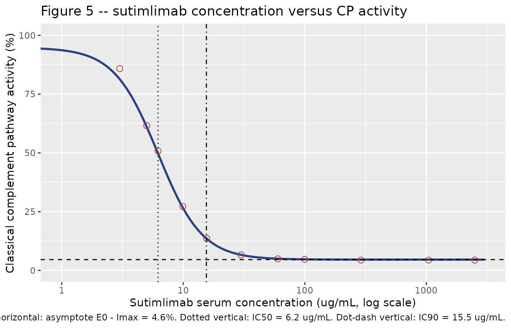

# Sutimlimab (Bartko 2018)

## Model and source

- Citation: Bartko J, Schoergenhofer C, Schwameis M, Firbas C, Beliveau
  M, Chang C, Marier JF, Nix D, Gilbert JC, Panicker S, Jilma B (2018).
  A Randomized, First-in-Human, Healthy Volunteer Trial of sutimlimab, a
  Humanized Antibody for the Specific Inhibition of the Classical
  Complement Pathway. Clin Pharmacol Ther 104(4):655-663.
  <doi:10.1002/cpt.1111>.
- Description: Population pharmacodynamic sigmoidal inhibitory Emax
  (Imax) model for sutimlimab (BIVV009 / TNT009), a humanized monoclonal
  IgG4 antibody against complement factor C1s, describing knockdown of
  classical complement pathway (CP) activity in healthy volunteers. The
  direct-effect model has no delay component: Bartko 2018 first checked
  for hysteresis, found none, and therefore time-matched each individual
  sutimlimab serum concentration with the CP activity measured in the
  same sample. PD-only model: the sutimlimab serum concentration is
  supplied as a time-varying covariate CP_SUTIMLIMAB_UGML (ug/mL). The
  source publication characterised sutimlimab PK by model-independent
  NCA only (Cmax / tmax / AUC / half-life in Table 2) and did not
  develop a structural population PK model, so the PD model has no
  coupled PK component. The authors note the PK is nonlinear below about
  100 ug/mL, consistent with target-mediated elimination. Population: 48
  healthy volunteers who received sutimlimab in a phase I,
  first-in-human, double-blind, randomized, placebo-controlled single-
  (part A) and multiple- (part B) ascending-dose trial (NCT02502903).
- Article: <https://doi.org/10.1002/cpt.1111>

Sutimlimab (BIVV009 / TNT009; now marketed as Enjaymo) is a humanized
monoclonal IgG4 antibody directed against complement factor C1s. By
binding C1s it blocks the enzymatic propagation of the classical
complement pathway (CP) while leaving the alternative and lectin
pathways, and the opsonic function of C1q, intact. Bartko 2018 is the
first-in-human trial: a phase I, double-blind, randomized,
placebo-controlled, single- (part A) and multiple- (part B)
ascending-dose study in healthy volunteers (NCT02502903).

The packaged model is the trial’s **pharmacodynamic** model: a
direct-effect sigmoidal inhibitory Emax (Imax) relationship between
serum sutimlimab concentration and CP activity. Bartko 2018 first
checked the concentration-effect relationship for hysteresis, found
none, and therefore time-matched each individual serum concentration
with the CP activity measured in the same sample (Methods, “PK/PD”).

There is **no packaged PK model**, because the paper does not contain
one: the sutimlimab pharmacokinetics are characterised by
model-independent NCA only (Table 2). See *Assumptions and deviations*
below.

## Population

Bartko 2018 enrolled 64 healthy volunteers at a single centre
(Department of Clinical Pharmacology, Medical University of Vienna,
Austria), of whom 48 received sutimlimab and 16 received placebo. Part A
gave a single ~60-minute i.v. infusion of 0.3, 1, 3, 10, 30, 60, or 100
mg/kg (n = 3 active for the two lowest doses, n = 6 active for the rest,
3:1 active:placebo). Part B gave four once-weekly ~60-minute i.v.
infusions of 30 or 60 mg/kg (n = 6 active per dose level) with a
two-week follow-up.

Across the sutimlimab arms the median age was 32 years (range 19-59) in
part A and 27 years (22-41) in part B; 22 of 48 (45.8%) were female; 46
of 48 (95.8%) were Caucasian and 2 (4.2%) African. Cohort mean body
weights ran from 55 kg (the 100 mg/kg cohort, which had a 58 kg protocol
weight cap) to 79 kg; all other cohorts were capped at 98 kg. Baseline
CP activity was normal in every subject (part A sutimlimab 97 +/- 14%,
part B sutimlimab 94 +/- 18%). Baseline demographics are Bartko 2018
Table 1.

The same demographics are exposed programmatically via the model’s
`population` metadata:

``` r

pop <- rxode2::rxode(readModelDb("Bartko_2018_sutimlimab"))$population
str(pop, max.level = 1)
#> List of 13
#>  $ species       : chr "human"
#>  $ n_subjects    : int 48
#>  $ n_studies     : int 1
#>  $ age_range     : chr "19-59 years (part A sutimlimab arms, median 32); 22-41 years (part B sutimlimab arms, median 27)"
#>  $ age_median    : chr "32 years (part A sutimlimab); 27 years (part B sutimlimab)"
#>  $ weight_range  : chr "not tabulated as a range; cohort means (SD) ran 55 (3) to 79 (4) kg. Protocol excluded body weight > 98 kg, and"| __truncated__
#>  $ weight_median : chr NA
#>  $ sex_female_pct: num 45.8
#>  $ race_ethnicity: Named num [1:2] 95.8 4.2
#>   ..- attr(*, "names")= chr [1:2] "Caucasian" "African"
#>  $ disease_state : chr "healthy volunteers (no complement-mediated disorder); all vaccinated against encapsulated bacterial pathogens before dosing"
#>  $ dose_range    : chr "Part A (single ascending dose): 0.3, 1, 3, 10, 30, 60, or 100 mg/kg sutimlimab or placebo as a single ~60-minut"| __truncated__
#>  $ regions       : chr "Single centre: Department of Clinical Pharmacology, Medical University of Vienna, Austria"
#>  $ notes         : chr "Baseline demographics are Bartko 2018 Table 1; 48 of the 64 enrolled volunteers received sutimlimab (36 in part"| __truncated__
```

## Source trace

The per-parameter origin is recorded as in-file comments next to each
`ini()` entry in `inst/modeldb/specificDrugs/Bartko_2018_sutimlimab.R`.
The table below collects them in one place for review. All four typical
values come from Supplementary Table S3, “PK/PD parameters of BIVV009
and CP activity - parts A and B”; the parenthesised figures in that
table are relative standard errors of the estimate (RSE%),
i.e. parameter precision, and are **not** interindividual variability.

| Equation / parameter | Value (RSE%) | Source location |
|----|----|----|
| `E0` (`le0 = log(94.8)`) | 94.8% (1.1) | Bartko 2018 Supplementary Table S3 |
| `Imax` (`limax = log(90.2)`) | 90.2 percentage points (1.1) | Bartko 2018 Supplementary Table S3; also Results, “PK/PD correlations” |
| `IC50` (`lic50 = log(6.2)`) | 6.2 ug/mL (27.5) | Bartko 2018 Supplementary Table S3; also Results, “PK/PD correlations” |
| `hill` (`lhill = log(2.4)`) | 2.4 (19.9) | Bartko 2018 Supplementary Table S3; also Abstract and Results |
| `addSd = fixed(0)` | not reported | Not tabulated anywhere in Bartko 2018 or its five supplementary files – see *Assumptions and deviations* |
| Sigmoidal Imax equation `CPactivity = e0 - imax * C^hill / (ic50^hill + C^hill)` | n/a | Bartko 2018 Methods, “PK/PD” (“inhibitory Emax model”), Results “PK/PD correlations”, and the fitted curve in Figure 5 |
| Direct effect (no effect compartment, no hysteresis) | n/a | Bartko 2018 Results, “PK/PD correlations” (“no delay was observed in CP activity”; concentrations and CP activity were time-matched) |
| Driving covariate `CP_SUTIMLIMAB_UGML` | ug/mL | Bartko 2018 Methods, “Pharmacokinetics” (validated immunoassay, Vela Laboratories) |
| IC90 = 15.5 ug/mL (cross-check, not a model parameter) | 15.5 ug/mL | Bartko 2018 Abstract and Results, “PK/PD correlations” |

### Internal consistency of the published parameter set

The paper reports an IC90 of 15.5 ug/mL separately from IC50 and the
Hill coefficient. Under the sigmoidal form, the concentration producing
90% of the maximum effect is `IC50 * 9^(1/hill)`. That identity
over-determines the parameter set and validates all three transcriptions
at once:

``` r

ic50 <- 6.2
hill <- 2.4
ic90_implied <- ic50 * 9^(1 / hill)
c(published_IC90 = 15.5, implied_IC90 = round(ic90_implied, 3))
#> published_IC90   implied_IC90 
#>         15.500         15.488
stopifnot(abs(ic90_implied - 15.5) < 0.05)
```

## Which Imax parameterisation?

Supplementary Table S3 reports `E0 (%) = 94.8` and `Imax (%) = 90.2`
without writing out the equation, which leaves two readings of how
`Imax` enters:

- **additive** – `Imax` is in the same units as `E0` (percentage
  points), so the saturating asymptote is `E0 - Imax = 4.6%`;
- **multiplicative** – `Imax` is a fraction of `E0`, so the asymptote is
  `E0 * (1 - 0.902) = 9.29%`.

The paper’s own fitted curve in Figure 5 settles it. Digitising the blue
“Predicted” line (300 dpi render of the published page; y-axis
calibrated on the 0/50/100/150 major ticks, x-axis on the
1/10/100/1000/10000 decade ticks) gives a curve that runs from 94.5% at
its left end down to a high-concentration plateau of 4.2-4.4%. That is a
span of **90.3 percentage points**, which reproduces `Imax = 90.2`
directly and is only possible under the additive form.

``` r

# Anchor points read off the published Figure 5 "Predicted" curve.
fig5 <- tibble::tribble(
  ~conc,   ~digitised,
     3.0,       85.88,
     5.0,       61.61,
     6.2,       50.84,
     9.9,       27.20,
    15.6,       13.60,
    29.9,        6.59,
    59.9,        4.92,
   100.0,        4.71,
   290.0,        4.39,
  1045.9,        4.39,
  2502.2,        4.39
)

e0 <- 94.8; imax <- 90.2
frac <- function(cc) cc^hill / (ic50^hill + cc^hill)

fig5 <- fig5 |>
  dplyr::mutate(
    additive       = e0 - imax * frac(conc),
    multiplicative = e0 * (1 - (imax / 100) * frac(conc))
  )

knitr::kable(
  fig5 |>
    dplyr::mutate(dplyr::across(c(digitised, additive, multiplicative), \(x) round(x, 2))) |>
    dplyr::rename(
      "Sutimlimab (ug/mL)"       = conc,
      "Figure 5 (digitised, %)"  = digitised,
      "Additive form (%)"        = additive,
      "Multiplicative form (%)"  = multiplicative
    ),
  caption = "Published Figure 5 fitted curve versus the two candidate Imax parameterisations."
)
```

| Sutimlimab (ug/mL) | Figure 5 (digitised, %) | Additive form (%) | Multiplicative form (%) |
|---:|---:|---:|---:|
| 3.0 | 85.88 | 81.36 | 82.06 |
| 5.0 | 61.61 | 61.09 | 62.84 |
| 6.2 | 50.84 | 49.70 | 52.05 |
| 9.9 | 27.20 | 26.74 | 30.28 |
| 15.6 | 13.60 | 13.48 | 17.71 |
| 29.9 | 6.59 | 6.62 | 11.21 |
| 59.9 | 4.92 | 4.99 | 9.66 |
| 100.0 | 4.71 | 4.71 | 9.40 |
| 290.0 | 4.39 | 4.61 | 9.30 |
| 1045.9 | 4.39 | 4.60 | 9.29 |
| 2502.2 | 4.39 | 4.60 | 9.29 |

Published Figure 5 fitted curve versus the two candidate Imax
parameterisations. {.table}

``` r


# Root-mean-square disagreement with the published curve, over the anchors at
# or above 5 ug/mL (the left-most terminus of the drawn line is a rendering
# artefact and is excluded; see the narrative below).
keep <- fig5$conc >= 5
rmse <- c(
  additive       = sqrt(mean((fig5$digitised[keep] - fig5$additive[keep])^2)),
  multiplicative = sqrt(mean((fig5$digitised[keep] - fig5$multiplicative[keep])^2))
)
round(rmse, 3)
#>       additive multiplicative 
#>          0.440          4.089

# The additive form must beat the multiplicative form by a wide margin. Both
# sides here are deterministic (fixed published constants against fixed
# digitised anchors), so an exact bound is appropriate.
stopifnot(
  rmse[["additive"]] < 1,
  rmse[["multiplicative"]] > 3,
  rmse[["multiplicative"]] > 4 * rmse[["additive"]]
)
```

Over the full digitised trace (403 sampled columns; the 349 at or above
5 ug/mL) the additive form reproduces the published curve with an RMSE
of 0.35 percentage points and a maximum absolute error of 1.17, while
the multiplicative form is systematically 3-5 percentage points high
with an RMSE of 4.32. The two forms are nearly indistinguishable below
~3 ug/mL, so the left-most few pixels of the drawn line – where the
published curve terminates at the lowest observed concentration and
reads about 8 points above *both* candidate forms – cannot discriminate
between them and is excluded above.

## Virtual cohort

The model is algebraic and carries no interindividual variability and no
residual error (see *Assumptions and deviations*), so it is fully
deterministic: one “subject” evaluated over a concentration grid
reproduces the population prediction exactly, and a larger cohort would
add nothing. The grid below spans the range of serum concentrations
actually observed in the trial, from below the IC50 up to the highest
mean Cmax (2073 ug/mL, part B multiple 60 mg/kg; Table 2).

``` r

conc_grid <- c(0, exp(seq(log(0.5), log(3000), length.out = 200)))

events <- tibble::tibble(
  id                 = 1L,
  time               = seq_along(conc_grid) - 1,
  evid               = 0L,
  amt                = 0,
  CP_SUTIMLIMAB_UGML = conc_grid
)
```

## Simulation

``` r

mod <- readModelDb("Bartko_2018_sutimlimab")

sim <- rxode2::rxSolve(
  mod,
  events = events,
  keep   = "CP_SUTIMLIMAB_UGML"
) |>
  as.data.frame()

head(sim[, c("time", "CP_SUTIMLIMAB_UGML", "CPactivity")])
#>   time CP_SUTIMLIMAB_UGML CPactivity
#> 1    0          0.0000000   94.80000
#> 2    1          0.5000000   94.58622
#> 3    2          0.5223429   94.56264
#> 4    3          0.5456842   94.53645
#> 5    4          0.5700685   94.50740
#> 6    5          0.5955425   94.47514
```

## Replicate published figures

### Figure 5 – CP activity versus serum sutimlimab concentration

``` r

# Replicates the "Predicted" curve of Figure 5 of Bartko 2018.
sim |>
  dplyr::filter(CP_SUTIMLIMAB_UGML > 0) |>
  ggplot(aes(CP_SUTIMLIMAB_UGML, CPactivity)) +
  geom_line(linewidth = 1, colour = "#28418c") +
  geom_point(
    data = fig5, aes(conc, digitised),
    inherit.aes = FALSE, shape = 1, size = 2.5, colour = "#c0392b"
  ) +
  geom_hline(yintercept = 94.8 - 90.2, linetype = "dashed") +
  geom_vline(xintercept = 6.2,  linetype = "dotted") +
  geom_vline(xintercept = 15.5, linetype = "dotdash") +
  scale_x_log10(breaks = c(1, 10, 100, 1000, 10000)) +
  coord_cartesian(xlim = c(1, 3000), ylim = c(0, 100)) +
  labs(
    x       = "Sutimlimab serum concentration (ug/mL, log scale)",
    y       = "Classical complement pathway activity (%)",
    title   = "Figure 5 -- sutimlimab concentration versus CP activity",
    caption = paste(
      "Line: packaged model. Open circles: anchors digitised from the published",
      "Figure 5 curve. Dashed horizontal: asymptote E0 - Imax = 4.6%.",
      "Dotted vertical: IC50 = 6.2 ug/mL. Dot-dash vertical: IC90 = 15.5 ug/mL."
    )
  )
```



## PD checks (no PKNCA)

Bartko 2018 characterises sutimlimab PK with model-independent NCA only
(Cmax, tmax, AUC0-inf, AUC0-168 and half-life by cohort in Table 2) and
does not fit a structural population PK model. The packaged model is
PD-only – driven by an externally supplied `CP_SUTIMLIMAB_UGML`
covariate – so there is no model-predicted concentration-time profile to
integrate and the PKNCA validation pattern used elsewhere in the package
does not apply. The checks below take its place.

### Closed-form agreement

Every quantity here is deterministic (no etas, residual error fixed to
zero), so the solver output must match the closed form to numerical
tolerance.

``` r

closed <- e0 - imax * frac(sim$CP_SUTIMLIMAB_UGML)
max_abs_dev <- max(abs(sim$CPactivity - closed))
max_abs_dev
#> [1] 4.263256e-14
stopifnot(max_abs_dev < 1e-8)
```

### Published anchor points

``` r

anchor_conc <- c(0, 6.2, 15.5, 100, 1e5)
anchors <- rxode2::rxSolve(
  mod,
  events = tibble::tibble(
    id = 1L, time = seq_along(anchor_conc) - 1, evid = 0L, amt = 0,
    CP_SUTIMLIMAB_UGML = anchor_conc
  ),
  keep = "CP_SUTIMLIMAB_UGML"
) |>
  as.data.frame()

# Fraction of the maximum effect achieved at each anchor.
anchors$frac_of_imax <- (e0 - anchors$CPactivity) / imax

knitr::kable(
  anchors |>
    dplyr::transmute(
      "Sutimlimab (ug/mL)"    = CP_SUTIMLIMAB_UGML,
      "CP activity (%)"       = round(CPactivity, 3),
      "Fraction of Imax"      = round(frac_of_imax, 4),
      "Published anchor"      = c(
        "E0 = 94.8% (Table S3)",
        "IC50 = 6.2 ug/mL -> 50% of Imax (Table S3)",
        "IC90 = 15.5 ug/mL -> 90% of Imax (Abstract, Results)",
        "'concentrations above 100 ug/mL ... near-maximal knockdown' (Results)",
        "asymptote E0 - Imax = 4.6% (Table S3)"
      )
    ),
  caption = "Typical-value evaluation at the concentrations Bartko 2018 anchors explicitly."
)
```

| Sutimlimab (ug/mL) | CP activity (%) | Fraction of Imax | Published anchor |
|---:|---:|---:|:---|
| 0.0 | 94.800 | 0.0000 | E0 = 94.8% (Table S3) |
| 6.2 | 49.700 | 0.5000 | IC50 = 6.2 ug/mL -\> 50% of Imax (Table S3) |
| 15.5 | 13.605 | 0.9002 | IC90 = 15.5 ug/mL -\> 90% of Imax (Abstract, Results) |
| 100.0 | 4.714 | 0.9987 | ‘concentrations above 100 ug/mL … near-maximal knockdown’ (Results) |
| 100000.0 | 4.600 | 1.0000 | asymptote E0 - Imax = 4.6% (Table S3) |

Typical-value evaluation at the concentrations Bartko 2018 anchors
explicitly. {.table}

``` r


stopifnot(
  # Zero concentration returns the published baseline exactly.
  abs(anchors$CPactivity[1] - 94.8) < 1e-9,
  # IC50 delivers exactly half of Imax.
  abs(anchors$frac_of_imax[2] - 0.50) < 1e-9,
  # The paper's separately reported IC90 delivers 90% of Imax. This is the
  # strongest single check available: it ties the published IC90 to the
  # published IC50 and Hill coefficient without using any of them twice.
  abs(anchors$frac_of_imax[3] - 0.90) < 0.001,
  # 100 ug/mL is within a quarter of a percentage point of the asymptote,
  # which is what "near-maximal knockdown" means quantitatively.
  anchors$CPactivity[4] - (94.8 - 90.2) < 0.25,
  # The saturating asymptote is E0 - Imax, not E0 * (1 - Imax/100).
  abs(anchors$CPactivity[5] - (94.8 - 90.2)) < 1e-6
)
```

## Comparison against published observations

Bartko 2018 reports no NCA of the PD endpoint, but it does make several
quantitative claims about the depth of CP-activity knockdown at the
observed exposures. Feeding the paper’s own mean Cmax values (Table 2)
through the model reproduces them.

``` r

cmax_tab <- tibble::tribble(
  ~part,                        ~dose_mgkg, ~cmax_ugml,
  "A, single",                         3,          40,
  "A, single",                        10,         211,
  "A, single",                        30,         602,
  "A, single",                        60,        1464,
  "A, single",                       100,        2036,
  "B, single (first dose)",           30,         653,
  "B, single (first dose)",           60,        1252,
  "B, multiple (4th dose)",           30,         832,
  "B, multiple (4th dose)",           60,        2073
)

cmax_sim <- rxode2::rxSolve(
  mod,
  events = tibble::tibble(
    id = 1L, time = seq_len(nrow(cmax_tab)) - 1, evid = 0L, amt = 0,
    CP_SUTIMLIMAB_UGML = cmax_tab$cmax_ugml
  ),
  keep = "CP_SUTIMLIMAB_UGML"
) |>
  as.data.frame()

cmax_tab <- cmax_tab |>
  dplyr::mutate(
    cp_at_cmax  = cmax_sim$CPactivity,
    suppression = 100 * (e0 - cp_at_cmax) / e0
  )

knitr::kable(
  cmax_tab |>
    dplyr::transmute(
      "Part"                        = part,
      "Dose (mg/kg)"                = dose_mgkg,
      "Published mean Cmax (ug/mL)" = cmax_ugml,
      "Predicted CP activity (%)"   = round(cp_at_cmax, 2),
      "Suppression vs E0 (%)"       = round(suppression, 1)
    ),
  caption = paste(
    "Predicted CP activity at each cohort's published mean Cmax",
    "(Bartko 2018 Table 2)."
  )
)
```

| Part | Dose (mg/kg) | Published mean Cmax (ug/mL) | Predicted CP activity (%) | Suppression vs E0 (%) |
|:---|---:|---:|---:|---:|
| A, single | 3 | 40 | 5.62 | 94.1 |
| A, single | 10 | 211 | 4.62 | 95.1 |
| A, single | 30 | 602 | 4.60 | 95.1 |
| A, single | 60 | 1464 | 4.60 | 95.1 |
| A, single | 100 | 2036 | 4.60 | 95.1 |
| B, single (first dose) | 30 | 653 | 4.60 | 95.1 |
| B, single (first dose) | 60 | 1252 | 4.60 | 95.1 |
| B, multiple (4th dose) | 30 | 832 | 4.60 | 95.1 |
| B, multiple (4th dose) | 60 | 2073 | 4.60 | 95.1 |

Predicted CP activity at each cohort’s published mean Cmax (Bartko 2018
Table 2). {.table}

``` r


stopifnot(
  # "complete inhibition, defined by CP activity < 10%, was achieved in all
  # subjects who received a sutimlimab dose of 3 mg/kg or higher" (Discussion).
  all(cmax_tab$cp_at_cmax < 10),
  # "A single infusion of 3, 10, 30, 60, and 100 mg/kg sutimlimab suppressed CP
  # activity by > 90% within 1 hour after the start of the infusion" (Results,
  # Pharmacodynamics).
  all(cmax_tab$suppression > 90)
)
```

Every cohort’s mean Cmax sits far above the IC90 of 15.5 ug/mL – the
lowest, 40 ug/mL at 3 mg/kg, is already 2.6-fold above it – so the model
predicts CP activity between 4.6% and 5.6% at peak in every cohort,
i.e. 94-95% suppression. That is consistent with both published claims,
and with the observation that the 0.3 and 1 mg/kg cohorts (whose serum
concentrations were below the limit of quantification throughout) showed
“little effect on CP activity”.

The model deliberately says nothing about the *duration* of suppression,
which the paper reports as ranging from 8 hours at 3 mg/kg to 14 days at
100 mg/kg. Duration is a function of the concentration-time profile, and
reproducing it would require a PK model that Bartko 2018 does not
provide.

## Assumptions and deviations

- **No structural PK model, by construction.** Bartko 2018 characterises
  sutimlimab PK with model-independent NCA only (Methods,
  “Pharmacokinetics”; Table 2) and explicitly reports that elimination
  is nonlinear below about 100 ug/mL, consistent with target-mediated
  disposition: AUC0-168 rose 12.2-fold from 3 to 10 mg/kg and 7.7-fold
  from 10 to 30 mg/kg, but only 2.5- and 1.6-fold over 30-60 and 60-100
  mg/kg, and mean half-life lengthened from 19 to 132 hours across the
  10-100 mg/kg range. A linear compartmental model would not capture
  that, and the paper fits none. The packaged model is therefore
  PD-only: users must supply their own `CP_SUTIMLIMAB_UGML` trajectory
  (observed concentrations, or a PK model from another source). No
  sutimlimab population PK model currently exists in the nlmixr2lib
  registry.
- **`Imax` enters additively; established by digitising the published
  Figure 5.** Supplementary Table S3 gives `E0 (%)` and `Imax (%)`
  without the equation. The additive reading (asymptote `E0 - Imax` =
  4.6%) and the multiplicative reading (asymptote `E0 * (1 - Imax/100)`
  = 9.29%) are both grammatical. The published fitted curve spans 94.5%
  down to a 4.2-4.4% plateau – a 90.3-percentage-point span that
  reproduces `Imax = 90.2` – and matches the additive form with an RMSE
  of 0.35 percentage points against 4.32 for the multiplicative form.
  The digitisation is used **only** to choose between two readings of
  the paper’s own printed parameters; no parameter value is taken from
  the figure. See the section “Which Imax parameterisation?” above.
- **No interindividual variability and no residual error are reported,
  so none are invented.** Supplementary Table S3 lists exactly four
  values, each with an RSE% (parameter precision, not IIV): E0 94.8
  (1.1), Imax 90.2 (1.1), IC50 6.2 (27.5), H 2.4 (19.9). No omega, no
  sigma, and no residual-error model appear anywhere in the paper or in
  any of its five supplementary files. `addSd` is therefore encoded as
  `fixed(0)` rather than given an invented magnitude, and the model
  predicts typical values only. A user fitting this model to new data
  should estimate both IIV and residual error from that data. Note that
  the paper’s own Figure 5 shows substantial scatter around the fitted
  line, particularly in the dense low-concentration column, so real
  between-subject and residual variability is clearly non-zero – it is
  simply not quantified in the source.
- **Supplementary Table S3 was retrieved separately from the lead PDF.**
  The four parameter values are not printed in the main text as a set;
  the main text quotes Imax (90.2%), IC50 (6.2 ug/mL), the Hill
  coefficient (2.4) and the IC90 (15.5 ug/mL) in prose, but the baseline
  `E0 = 94.8%` and all four RSE% figures appear only in Supplementary
  Table S3. That file (`CPT-104-655-s003.docx`) was obtained from the
  PMC supplementary-file endpoint for PMC6175298 and its byte size and
  MD5 match the manifest in the Europe PMC full-text XML.
- **Direct effect, no hysteresis.** Bartko 2018 states that exploratory
  analysis found “no delay … in CP activity” and that individual
  concentrations and CP activities were therefore time-matched (Results,
  “PK/PD correlations”). The packaged model has no effect compartment.
  The supporting hysteresis analysis itself is described as “results
  retained on file” and is not reproducible from the publication.
- **Healthy volunteers only.** The trial’s part C, in patients with a
  complement-mediated disorder (cold agglutinin disease, warm autoimmune
  hemolytic anemia, bullous pemphigoid, or antibody-mediated transplant
  rejection), was ongoing at publication and is not reported here. The
  paper cautions that PD may differ in the target populations. The
  packaged model’s parameters are healthy-volunteer estimates.
- **Anti-drug antibodies are not modelled.** Confirmed ADA was detected
  in two part A subjects (42 and 28 ng/mL) and in four part B subjects.
  The paper argues the measured ADA concentrations were 500-1000-fold
  below the drug levels needed for a PD effect and reports no
  distinguishable CP-activity difference, so no ADA covariate is
  included. One part B 30 mg/kg subject with pre-existing ADA did show
  faster CP-activity reversal (Figure S1); that individual behaviour is
  not captured by a typical-value model.
- **Body weight is not a covariate.** Figure 3 shows negative regression
  slopes of AUClast, Cmax, and half-life against body weight, but the
  authors deliberately did **not** perform a formal covariate analysis
  (fewer than 50 subjects), and describe those plots as exploratory
  only. No weight effect is encoded. Note also that dosing was already
  mg/kg, so body size is partly accounted for in the dose.
- **Observation variable name `CPactivity` (not `Cc`).**
  [`checkModelConventions()`](https://nlmixr2.github.io/nlmixr2lib/reference/checkModelConventions.md)
  warns that `CPactivity` is not a canonical single-output observation
  name. The convention default `Cc` is reserved for drug concentrations;
  the Bartko 2018 observation is classical complement pathway activity
  expressed as a percentage of the assay’s normal reference, not a
  concentration. The paper’s own term is retained for source-trace
  fidelity, no rename is performed, and no new canonical is registered.
  This is the same accepted deviation carried by `Weber_1993_remikiren`
  (observation `APR`), the closest structural sibling in the registry.
- **Units of CP activity.** CP activity is a semiquantitative readout of
  the commercial WIESLAB Complement System Classical Pathway enzyme
  immunoassay (Euro Diagnostica, Malmo, Sweden), reported as a
  percentage of the assay’s normal reference. Values above 100% are
  therefore possible and are visible in Figure 5; the model’s `E0` of
  94.8% is the fitted population baseline, close to but not identical
  with the observed group means (97% part A, 94% part B).
