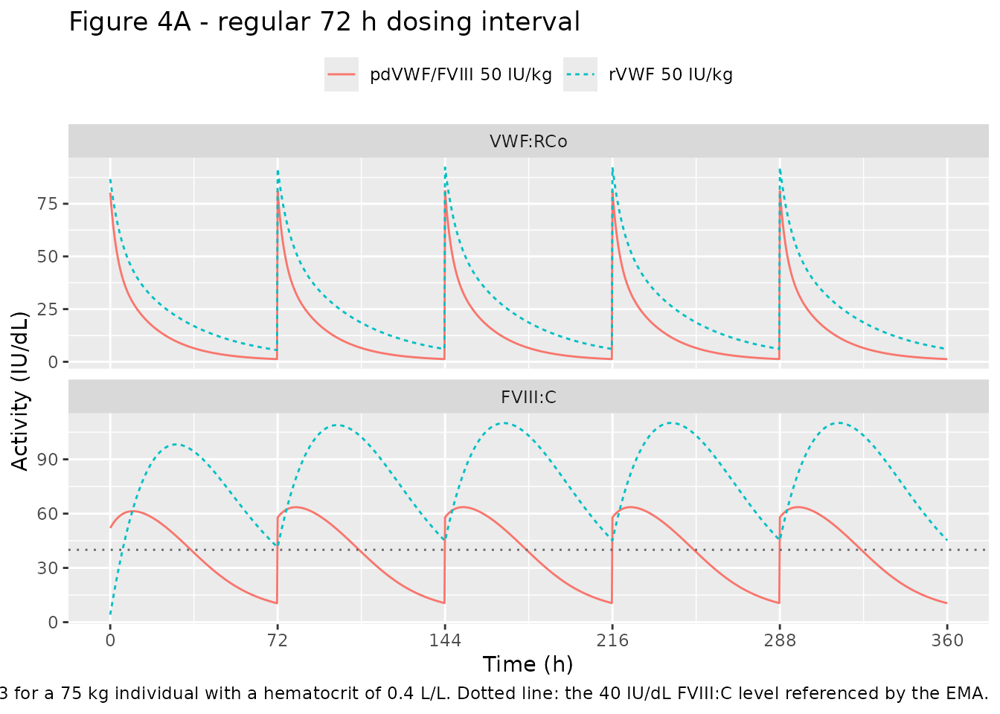
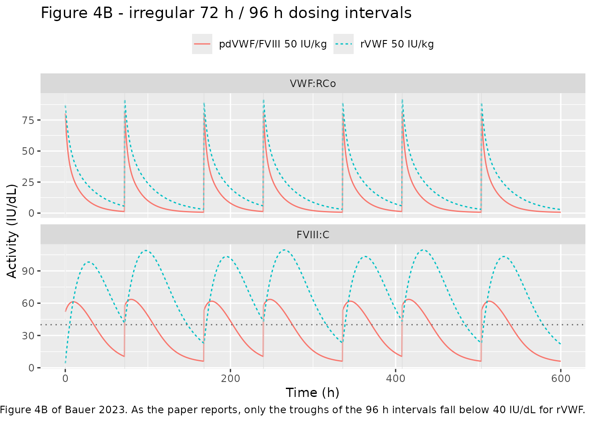
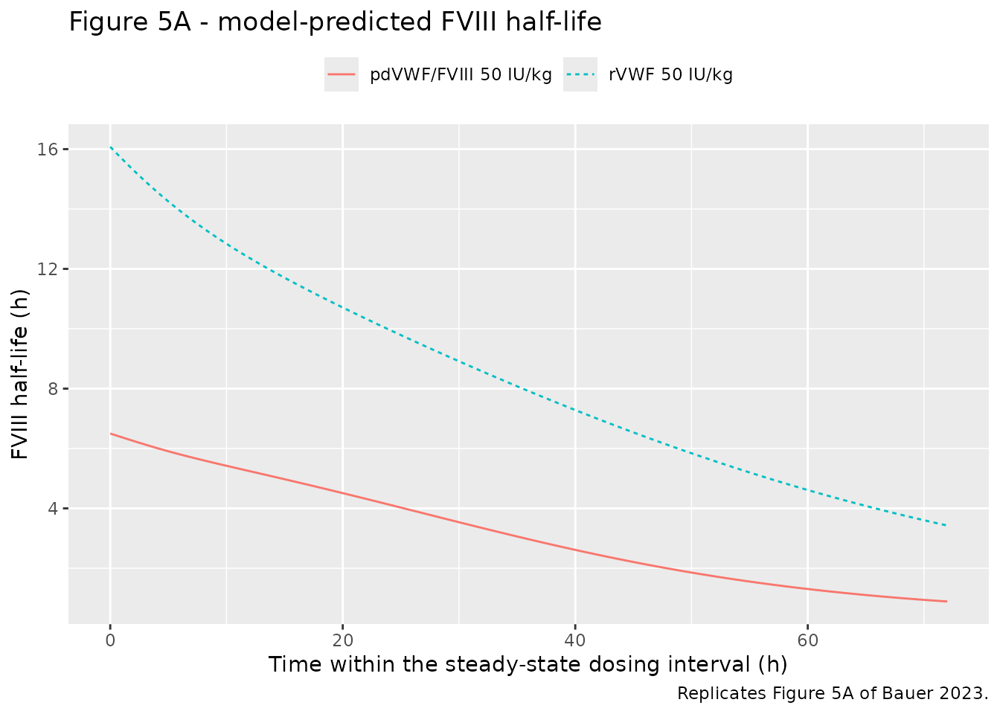
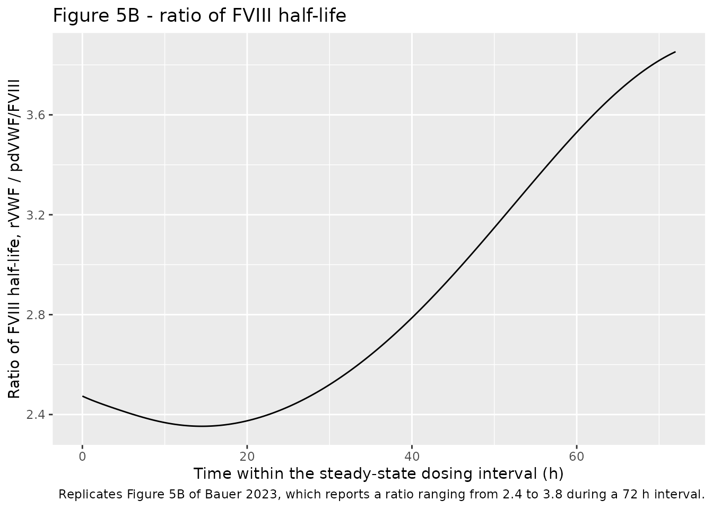
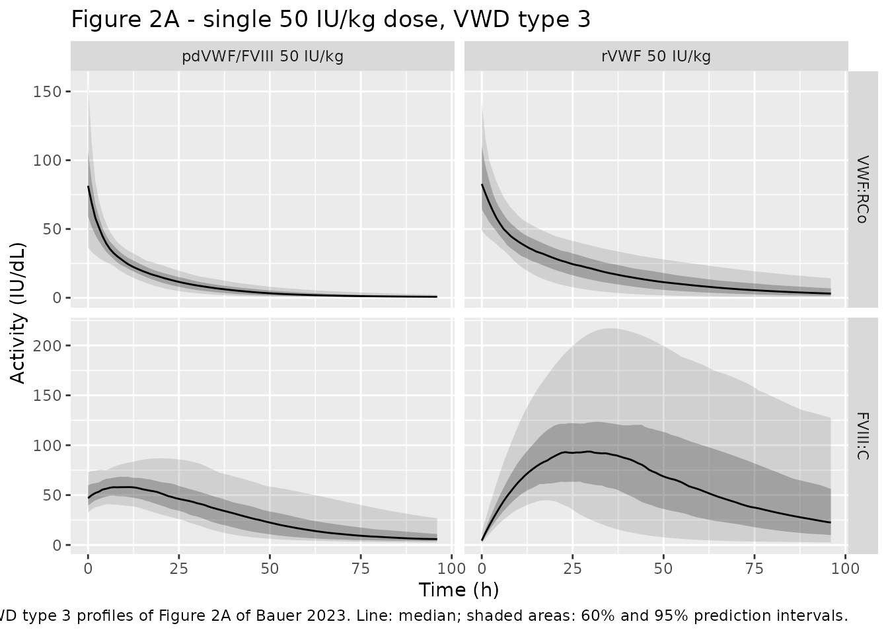

# Recombinant vs plasma-derived von Willebrand factor (Bauer 2023)

## Model and source

Bauer 2023 developed two population PK/PD models, one per product, and
used them for an in-silico comparison in von Willebrand disease (VWD)
type 3. This paper therefore contributes two model files, both
documented here.

- Article: <https://doi.org/10.2147/JBM.S395845>
- Supplement:
  <https://www.dovepress.com/get_supplementary_file.php?f=395845.docx>

``` r

mod_rvwf <- readModelDb("Bauer_2023_vonicogAlfa")
mod_pd   <- readModelDb("Bauer_2023_vwfFviii_humateP")

rxode2::rxode(mod_rvwf)$reference
#> ℹ parameter labels from comments will be replaced by 'label()'
#> [1] "Bauer A, Friberg-Hietala S, Smania G, Wolfsegger M. Pharmacokinetic-pharmacodynamic comparison of recombinant and plasma-derived von Willebrand factor in patients with von Willebrand disease type 3. J Blood Med. 2023;14:399-411. doi:10.2147/JBM.S395845."
```

Recombinant von Willebrand factor (rVWF, vonicog alfa):

``` r

rxode2::rxode(mod_rvwf)$description
#> ℹ parameter labels from comments will be replaced by 'label()'
#> [1] "Two-compartment population PK model for von Willebrand factor:ristocetin cofactor activity (VWF:RCo) after intravenous recombinant von Willebrand factor (rVWF, vonicog alfa) coupled to an indirect-response PK/PD model for endogenous factor VIII activity (FVIII:C), from Bauer 2023. VWF:RCo disposition is linear two-compartment with first-order elimination from the central compartment plus an additive endogenous background activity E_VWF, fixed at half the assay LLOQ (0.5 IU/dL) for von Willebrand disease (VWD) type 3. CL and Q are allometrically scaled by body weight with a fixed exponent of 0.75, Vc and Vp with a fixed exponent of 1, both referenced to 75 kg; Vc additionally decreases with hematocrit as (HCT/40)^-0.334. FVIII:C is a turnover pool with zero-order production kin = FVIII0 * kout and first-order removal kout (15.9 1/h) that VWF:RCo inhibits through an Imax function, 1 - Imax * VWF:RCo / (IC50 + VWF:RCo), so that rising VWF:RCo protects FVIII from clearance; FVIII0 is the theoretical baseline FVIII:C at VWF:RCo = 0 IU/dL and scales with hematocrit as (HCT/39)^-0.571. Fitted to 1664 VWF:RCo samples from 79 patients across four studies (VWD types 1, 2, 3 and severe hemophilia A) and 686 FVIII:C samples from the 41 patients of the two phase 3 VWD studies."
```

Plasma-derived von Willebrand factor / factor VIII concentrate
(pdVWF/FVIII; Humate-P, VWF:RCo/FVIII:C 2.4:1):

``` r

rxode2::rxode(mod_pd)$description
#> ℹ parameter labels from comments will be replaced by 'label()'
#> [1] "Two-compartment population PK model for von Willebrand factor:ristocetin cofactor activity (VWF:RCo) after intravenous plasma-derived von Willebrand factor / factor VIII concentrate (pdVWF/FVIII; Humate-P, VWF:RCo/FVIII:C 2.4:1) coupled to an indirect-response PK/PD model for factor VIII activity (FVIII:C), from Bauer 2023. The structure is the one developed for recombinant VWF (see modellib('Bauer_2023_vonicogAlfa')) refitted to the plasma-derived product: linear two-compartment VWF:RCo disposition with first-order elimination from the central compartment plus an additive endogenous background E_VWF fixed at half the assay LLOQ (0.5 IU/dL) for von Willebrand disease (VWD) type 3, allometric body weight on CL and Q (exponent 0.75) and on Vc and Vp (exponent 1) with a 75 kg reference, and (HCT/40)^-0.334 on Vc. FVIII:C is a turnover pool whose first-order removal kout is inhibited by VWF:RCo through 1 - Imax * VWF:RCo / (IC50 + VWF:RCo). Because the product delivers FVIII as well as VWF, a volume of distribution for FVIII (V FVIII = 32.9 dL) is added so that the administered FVIII:C dose enters the FVIII pool; the elimination of plasma-derived FVIII is assumed identical to that of endogenous FVIII and is therefore carried by kout. The system-specific parameters FVIII0, kout and the hematocrit effect on FVIII0 are fixed to the recombinant-VWF model estimates. VWF:RCo clearance is roughly twice that of recombinant VWF (4.14 vs 2.10 dL/h), giving a 1.76-fold shorter mean residence time. Fitted to 281 VWF:RCo and FVIII:C samples from 20 patients with VWD type 3."
```

Both models share one structure. VWF:RCo activity follows linear
two-compartment disposition with first-order elimination from the
central compartment, plus an additive endogenous background activity
`E_VWF` that is fixed at half the assay LLOQ (0.5 IU/dL) for VWD type 3.
Factor VIII activity (FVIII:C) is a turnover pool whose first-order
removal `kout` is inhibited by VWF:RCo through an Imax function,

``` math
\text{VWF effect} = 1 - I_{\max}\frac{\text{VWF:RCo}}{IC_{50} + \text{VWF:RCo}}
```

with production fixed by the steady-state condition
`kin = FVIII0 * kout`. This is the mechanism by which VWF chaperones
FVIII and protects it from clearance: as VWF:RCo rises, `kout` falls and
FVIII accumulates. The pdVWF/FVIII model adds a volume of distribution
for FVIII (`V FVIII` = 32.9 dL) because that product delivers FVIII as
well as VWF, and fixes the system-specific parameters (`FVIII0`, `kout`,
and the hematocrit effect on `FVIII0`) to the rVWF estimates.

## Population

The rVWF VWF:RCo PK model was fitted to 1664 samples from 79 adults
pooled across four studies: the phase 1 dose-escalation study
NCT00816660 (29 patients, 479 samples), the phase 3 on-demand study
NCT01410227 (31 / 694), the phase 3 surgery study NCT02283268 (11 /
241), and the phase 1 severe-hemophilia-A proof-of-concept study EudraCT
2011-004314-42 (10 / 250) (Bauer 2023 Table 1). Median (range) age was
35 (18-70) years, body weight 74 (43.8-145) kg and hematocrit 0.417
(0.310-0.480) L/L; 42% were female and 92% White. Disease composition
was VWD type 1 n=5, type 2 n=7, type 3 n=57, and severe hemophilia A
n=10 (Bauer 2023 Table 2). The hemophilia A cohort was retained because,
once individual endogenous VWF:RCo levels were accounted for, no PK
differences between VWD types and hemophilia A remained. The FVIII PK/PD
model used only the 41 patients (686 FVIII:C samples) of the two phase 3
studies, because patients in the phase 1 studies received concomitant
exogenous FVIII concentrates.

The pdVWF/FVIII models were fitted to 281 VWF:RCo and FVIII:C samples
from 20 patients with VWD type 3, all White, 55% female, median (range)
age 30 (18-60) years, body weight 66.3 (43.8-132) kg and hematocrit
0.406 (0.334-0.483) L/L (Bauer 2023 Table 3). These came from a single
crossover cohort of NCT00816660 in which patients received either rVWF
plus recombinant FVIII or pdVWF/FVIII; only the pdVWF/FVIII arm
contributes here.

The same information is available programmatically:

``` r

str(mod_rvwf()$population, max.level = 1)
#> List of 16
#>  $ species          : chr "human"
#>  $ n_subjects       : int 79
#>  $ n_studies        : int 4
#>  $ age_range        : chr "18-70 years"
#>  $ age_median       : chr "35 years"
#>  $ weight_range     : chr "43.8-145 kg"
#>  $ weight_median    : chr "74 kg"
#>  $ sex_female_pct   : num 42
#>  $ race_ethnicity   : Named num [1:2] 92 8
#>   ..- attr(*, "names")= chr [1:2] "White" "Asian"
#>  $ disease_state    : chr "Adults with severe von Willebrand disease (type 1 n=5, type 2 n=7, type 3 n=57) or severe hemophilia A with FVI"| __truncated__
#>  $ dose_range       : chr "2-80 IU/kg VWF:RCo intravenously (rVWF, vonicog alfa)"
#>  $ regions          : chr "North America, Europe, Australia, Japan, India, Taiwan, Turkey"
#>  $ n_observations   : int 1664
#>  $ n_observations_pd: int 686
#>  $ biomarkers       : chr [1:2] "VWF:RCo -- von Willebrand factor:ristocetin cofactor activity (IU/dL)" "FVIII:C -- factor VIII activity by one-stage clotting assay (IU/dL)"
#>  $ notes            : chr "VWF:RCo PK model: 1664 samples from 79 patients pooled across NCT00816660 (phase 1, dose escalation, 29 patient"| __truncated__
```

## Source trace

Every `ini()` entry carries an in-file comment naming its source
location. The table below collects them. Values marked FIX were held
constant during estimation and are wrapped in `fixed()` in the model
files.

| Equation / parameter | rVWF value | pdVWF/FVIII value | Source location |
|----|----|----|----|
| `lcl` – CL (dL/h) | 2.10 | 4.14 | Table 4, VWF:RCo PK model |
| `lvc` – Vc (dL) | 43.5 | 47.0 | Table 4, VWF:RCo PK model |
| `lq` – Q (dL/h) | 2.29 | 4.47 | Table 4, VWF:RCo PK model |
| `lvp` – Vp (dL) | 15.8 | 19.3 | Table 4, VWF:RCo PK model |
| `bl_vwf` – E_VWF, VWD type 3 (IU/dL) | 0.500 (FIX) | 0.500 (FIX) | Table 4; Supplementary Results (“set to half the LLOQ”) |
| `e_wt_cl_q` – exponent of (WT/75) on CL, Q | 0.750 (FIX) | 0.750 (FIX) | Table 4; Supplementary Results CL and Q equations |
| `e_wt_vc_vp` – exponent of (WT/75) on Vc, Vp | 1.00 (FIX) | 1.00 (FIX) | Table 4; Supplementary Results Vc and Vp equations |
| `e_hct_vc` – exponent of (HCT/40) on Vc | -0.334 | -0.334 (FIX) | Table 4; Supplementary Results Vc equation (reference 0.4 L/L) |
| `lrbase` – FVIII0 (IU/dL) | 0.500 | 0.500 (FIX) | Table 4, FVIII PK/PD model; footnotes c, d |
| `lkout` – kout (1/h) | 15.9 | 15.9 (FIX) | Table 4, FVIII PK/PD model; footnote c |
| `limax` – Imax | 0.998 | 0.994 | Table 4, FVIII PK/PD model |
| `lec50` – IC50 (IU/dL) | 0.0658 | 0.0577 | Table 4, FVIII PK/PD model |
| `e_hct_rbase` – exponent of (HCT/39) on FVIII0 | -0.571 | -0.571 (FIX) | Table 4; Supplementary Results baseline FVIII equation (reference 0.39 L/L) |
| `lvd` – V FVIII (dL) | not in model | 32.9 | Table 4, FVIII PK/PD model |
| `etalcl` – IIV CL | CV 0.401 | CV 0.235 | Table 4 (converted as omega^2 = log(1 + CV^2)) |
| `etalvc` – IIV Vc | CV 0.292 | CV 0.373 | Table 4 (converted) |
| `etalrbase` – IIV FVIII0 | CV 0.296 | CV 0.215 | Table 4 (converted) |
| `etalec50` – IIV IC50 | CV 0.588 | CV 0.542 | Table 4 (converted) |
| `propSd`, `addSd` – VWF:RCo RUV | 0.138, 2.80 IU/dL | 0.0479, 1.48 IU/dL | Table 4, VWF:RCo PK model |
| `propSd_Cfviii`, `addSd_Cfviii` – FVIII:C RUV | 0.190, 1.55 IU/dL | 0.172, 2.91 IU/dL | Table 4, FVIII PK/PD model |
| Two-compartment VWF:RCo disposition, first-order elimination from central | n/a | n/a | Discussion; Supplementary Methods, Structural Models; Supplementary Figure 1 |
| `Cc = central/vc + bl_vwf` (endogenous background) | n/a | n/a | Supplementary Methods (“a component describing endogenous VWF:RCo activity levels”) |
| `VWF effect = 1 - Imax * VWF:RCo / (IC50 + VWF:RCo)` | n/a | n/a | Supplementary Methods, Structural Models (displayed equation) |
| `kin = FVIII0 * kout` | n/a | n/a | Supplementary Methods, Structural Models |
| `f(fviii) = 1 / V FVIII` (pdFVIII dose input) | n/a | n/a | Supplementary Results, PK/PD Model for pdVWF/FVIII |
| Exponential IIV, `P_i = TVP * exp(eta_i)` | n/a | n/a | Supplementary Methods, Stochastic Model |
| Combined additive + proportional RUV | n/a | n/a | Supplementary Methods, Stochastic Model |

Hematocrit is carried in the canonical percent unit, so the paper’s L/L
reference values 0.4 and 0.39 become 40 and 39. The power ratio is
numerically identical under either unit as long as the supplied `HCT`
column and the reference share a unit.

## Typical-patient replication of Figures 4 and 5

Figures 4 and 5 of Bauer 2023 are typical-value predictions for a 75 kg
individual with a hematocrit of 0.4 L/L, so between-subject variability
is switched off via `omega = NA`.

``` r

WT_TYP  <- 75
HCT_TYP <- 40   # % (0.4 L/L)

# Observation rows use the ODE state `central` with dvid = 1; both models
# declare two endpoints (Cc and Cfviii), so an observation record must carry a
# dvid to resolve the endpoint mapping. rxode2 returns every algebraic
# observable as a column regardless of which state the row points at.
obs_rows <- function(times) {
  data.frame(
    id = 1L, time = times, amt = NA_real_, evid = 0L,
    cmt = "central", dvid = 1L
  )
}

vwf_doses <- function(times) {
  data.frame(
    id = 1L, time = times, amt = 50 * WT_TYP, evid = 1L,
    cmt = "central", dvid = 1L
  )
}

# pdVWF/FVIII has VWF:RCo/FVIII:C = 2.4:1, so a 50 IU/kg VWF:RCo dose also
# delivers 50/2.4 IU/kg FVIII:C into the FVIII pool.
fviii_doses <- function(times) {
  data.frame(
    id = 1L, time = times, amt = 50 * WT_TYP / 2.4, evid = 1L,
    cmt = "fviii", dvid = 1L
  )
}

solve_typical <- function(mod, dose_df, times) {
  ev <- bind_rows(dose_df, obs_rows(times)) |>
    arrange(time, desc(evid)) |>
    mutate(WT = WT_TYP, HCT = HCT_TYP)
  rxode2::rxSolve(mod, ev, omega = NA, sigma = NA, returnType = "data.frame")
}

grid_reg <- sort(unique(c(seq(0, 360, by = 0.25))))
dose_times_reg <- seq(0, 288, by = 72)

typ_reg <- bind_rows(
  solve_typical(mod_rvwf, vwf_doses(dose_times_reg), grid_reg) |>
    mutate(treatment = "rVWF 50 IU/kg"),
  solve_typical(
    mod_pd,
    bind_rows(vwf_doses(dose_times_reg), fviii_doses(dose_times_reg)),
    grid_reg
  ) |>
    mutate(treatment = "pdVWF/FVIII 50 IU/kg")
)
#> ℹ parameter labels from comments will be replaced by 'label()'
#> ℹ parameter labels from comments will be replaced by 'label()'
```

``` r

# Replicates Figure 4A of Bauer 2023: typical VWF:RCo and FVIII:C profiles
# following repeated administration at a regular 72 h interval.
typ_reg |>
  select(time, treatment, `VWF:RCo` = Cc, `FVIII:C` = Cfviii) |>
  pivot_longer(c(`VWF:RCo`, `FVIII:C`), names_to = "analyte", values_to = "activity") |>
  mutate(analyte = factor(analyte, levels = c("VWF:RCo", "FVIII:C"))) |>
  ggplot(aes(time, activity, colour = treatment, linetype = treatment)) +
  geom_line() +
  geom_hline(
    data = data.frame(analyte = factor("FVIII:C", levels = c("VWF:RCo", "FVIII:C"))),
    aes(yintercept = 40), linetype = "dotted", colour = "grey40"
  ) +
  facet_wrap(~analyte, ncol = 1, scales = "free_y") +
  scale_x_continuous(breaks = seq(0, 360, by = 72)) +
  labs(
    x = "Time (h)", y = "Activity (IU/dL)", colour = NULL, linetype = NULL,
    title = "Figure 4A - regular 72 h dosing interval",
    caption = paste(
      "Replicates Figure 4A of Bauer 2023 for a 75 kg individual with a",
      "hematocrit of 0.4 L/L. Dotted line: the 40 IU/dL FVIII:C level",
      "referenced by the EMA."
    )
  ) +
  theme(legend.position = "top")
```



The paper’s headline simulation claim is that “following repeated
administration of rVWF (50 IU/kg), a FVIII:C activity of \>40 IU/dL can
be maintained for the full 72 h dosing interval”. The steady-state
interval of the replication is summarised below.

``` r

ss_summary <- typ_reg |>
  filter(time >= 288, time <= 360) |>
  group_by(treatment) |>
  summarise(
    `VWF:RCo Cmax` = max(Cc),
    `VWF:RCo trough` = min(Cc),
    `FVIII:C Cmax` = max(Cfviii),
    `FVIII:C trough` = min(Cfviii),
    `% interval FVIII:C > 40 IU/dL` = 100 * mean(Cfviii > 40),
    .groups = "drop"
  )

ss_summary |>
  rename("Treatment" = treatment) |>
  knitr::kable(
    digits = 1,
    caption = paste(
      "Steady-state dosing interval (288-360 h) of the typical-patient",
      "replication of Figure 4A."
    )
  )
```

| Treatment | VWF:RCo Cmax | VWF:RCo trough | FVIII:C Cmax | FVIII:C trough | % interval FVIII:C \> 40 IU/dL |
|:---|---:|---:|---:|---:|---:|
| pdVWF/FVIII 50 IU/kg | 81.1 | 1.3 | 63.6 | 10.5 | 48.8 |
| rVWF 50 IU/kg | 92.3 | 6.1 | 110.1 | 45.2 | 100.0 |

Steady-state dosing interval (288-360 h) of the typical-patient
replication of Figure 4A. {.table}

``` r

# Replicates Figure 4B of Bauer 2023: irregular 72 h / 96 h dosing intervals.
dose_times_irr <- cumsum(c(0, rep(c(72, 96), times = 3)))
grid_irr <- sort(unique(c(seq(0, max(dose_times_irr) + 96, by = 0.25), dose_times_irr)))

typ_irr <- bind_rows(
  solve_typical(mod_rvwf, vwf_doses(dose_times_irr), grid_irr) |>
    mutate(treatment = "rVWF 50 IU/kg"),
  solve_typical(
    mod_pd,
    bind_rows(vwf_doses(dose_times_irr), fviii_doses(dose_times_irr)),
    grid_irr
  ) |>
    mutate(treatment = "pdVWF/FVIII 50 IU/kg")
)

typ_irr |>
  select(time, treatment, `VWF:RCo` = Cc, `FVIII:C` = Cfviii) |>
  pivot_longer(c(`VWF:RCo`, `FVIII:C`), names_to = "analyte", values_to = "activity") |>
  mutate(analyte = factor(analyte, levels = c("VWF:RCo", "FVIII:C"))) |>
  ggplot(aes(time, activity, colour = treatment, linetype = treatment)) +
  geom_line() +
  geom_hline(
    data = data.frame(analyte = factor("FVIII:C", levels = c("VWF:RCo", "FVIII:C"))),
    aes(yintercept = 40), linetype = "dotted", colour = "grey40"
  ) +
  geom_vline(xintercept = dose_times_irr, colour = "grey85", linewidth = 0.2) +
  facet_wrap(~analyte, ncol = 1, scales = "free_y") +
  labs(
    x = "Time (h)", y = "Activity (IU/dL)", colour = NULL, linetype = NULL,
    title = "Figure 4B - irregular 72 h / 96 h dosing intervals",
    caption = paste(
      "Replicates Figure 4B of Bauer 2023. As the paper reports, only the",
      "troughs of the 96 h intervals fall below 40 IU/dL for rVWF."
    )
  ) +
  theme(legend.position = "top")
```



Figure 5 plots the model-predicted FVIII half-life during a steady-state
dosing interval, and its rVWF-to-pdVWF/FVIII ratio. Because VWF:RCo
inhibits `kout`, the FVIII half-life is time-varying within the
interval: `t1/2 = ln(2) / (kout * VWF effect)`. Both `kout` and
`vwfEffect` are returned as columns by `rxSolve`.

``` r

# Replicates Figures 5A and 5B of Bauer 2023.
half_life <- typ_reg |>
  filter(time >= 288, time <= 360) |>
  mutate(
    time_in_interval = time - 288,
    fviii_half_life = log(2) / (kout * vwfEffect)
  ) |>
  select(time_in_interval, treatment, fviii_half_life)

ratio <- half_life |>
  pivot_wider(names_from = treatment, values_from = fviii_half_life) |>
  mutate(ratio = `rVWF 50 IU/kg` / `pdVWF/FVIII 50 IU/kg`)

ggplot(half_life, aes(time_in_interval, fviii_half_life,
                      colour = treatment, linetype = treatment)) +
  geom_line() +
  labs(
    x = "Time within the steady-state dosing interval (h)",
    y = "FVIII half-life (h)", colour = NULL, linetype = NULL,
    title = "Figure 5A - model-predicted FVIII half-life",
    caption = "Replicates Figure 5A of Bauer 2023."
  ) +
  theme(legend.position = "top")
```



``` r


ggplot(ratio, aes(time_in_interval, ratio)) +
  geom_line() +
  labs(
    x = "Time within the steady-state dosing interval (h)",
    y = "Ratio of FVIII half-life, rVWF / pdVWF/FVIII",
    title = "Figure 5B - ratio of FVIII half-life",
    caption = paste(
      "Replicates Figure 5B of Bauer 2023, which reports a ratio ranging",
      "from 2.4 to 3.8 during a 72 h interval."
    )
  )
```



``` r

tibble::tibble(
  Quantity = "Ratio of FVIII half-life (rVWF / pdVWF/FVIII) over the 72 h interval",
  Simulated = sprintf("%.2f - %.2f", min(ratio$ratio), max(ratio$ratio)),
  Published = "2.4 - 3.8"
) |>
  knitr::kable(caption = "Bauer 2023 Figure 5B and text.")
```

| Quantity | Simulated | Published |
|:---|:---|:---|
| Ratio of FVIII half-life (rVWF / pdVWF/FVIII) over the 72 h interval | 2.35 - 3.85 | 2.4 - 3.8 |

Bauer 2023 Figure 5B and text. {.table}

## Virtual cohort

Original observed data are not publicly available. The stochastic
simulation below uses virtual populations whose body-weight and
hematocrit distributions approximate the published demographics: median
72.5 kg (range 45-143) and hematocrit 0.402 L/L (range 0.31-0.48) for
the rVWF FVIII PK/PD population (Table 2), and median 66.3 kg (range
43.8-132) and hematocrit 0.406 L/L (range 0.334-0.483) for the
pdVWF/FVIII population (Table 3). Weight is drawn log-normally and
hematocrit normally, both truncated to the published range; the paper
reports only medians and ranges, so the dispersion is an assumption (see
Assumptions and deviations).

``` r

set.seed(20230612)

N_PER_ARM <- 150  # <= 200 per arm

make_arm <- function(n, treatment, wt_med, wt_lo, wt_hi,
                     hct_med, hct_lo, hct_hi, id_offset = 0L) {
  tibble::tibble(
    id        = id_offset + seq_len(n),
    treatment = treatment,
    WT        = pmin(pmax(stats::rlnorm(n, log(wt_med), 0.27), wt_lo), wt_hi),
    HCT       = pmin(pmax(stats::rnorm(n, hct_med, 3.6), hct_lo), hct_hi)
  )
}

obs_times <- seq(0, 96, by = 1)

expand_arm <- function(subj, with_fviii_dose) {
  doses <- subj |>
    mutate(time = 0, amt = 50 * WT, evid = 1L, cmt = "central", dvid = 1L)
  if (with_fviii_dose) {
    doses <- bind_rows(
      doses,
      subj |>
        mutate(time = 0, amt = 50 * WT / 2.4, evid = 1L, cmt = "fviii", dvid = 1L)
    )
  }
  obs <- subj |>
    tidyr::crossing(time = obs_times) |>
    mutate(amt = NA_real_, evid = 0L, cmt = "central", dvid = 1L)
  bind_rows(doses, obs) |> arrange(id, time, desc(evid))
}

subj_rvwf <- make_arm(N_PER_ARM, "rVWF 50 IU/kg",
                      72.5, 45, 143, 40.2, 31.0, 48.0, id_offset = 0L)
subj_pd   <- make_arm(N_PER_ARM, "pdVWF/FVIII 50 IU/kg",
                      66.3, 43.8, 132, 40.6, 33.4, 48.3, id_offset = 1000L)

ev_rvwf <- expand_arm(subj_rvwf, with_fviii_dose = FALSE)
ev_pd   <- expand_arm(subj_pd,   with_fviii_dose = TRUE)

stopifnot(!anyDuplicated(unique(ev_rvwf[, c("id", "time", "evid", "cmt")])))
stopifnot(!anyDuplicated(unique(ev_pd[, c("id", "time", "evid", "cmt")])))
stopifnot(length(intersect(subj_rvwf$id, subj_pd$id)) == 0L)
```

## Simulation

``` r

sim <- bind_rows(
  rxode2::rxSolve(mod_rvwf, ev_rvwf, keep = c("treatment", "WT", "HCT")) |>
    as.data.frame(),
  rxode2::rxSolve(mod_pd, ev_pd, keep = c("treatment", "WT", "HCT")) |>
    as.data.frame()
)

nrow(sim)
#> [1] 29100
```

``` r

# Replicates the VWD type 3 panel of Figure 2A of Bauer 2023: simulated
# VWF:RCo and FVIII activity-time profiles following a single 50 IU/kg dose,
# with the 60% and 95% prediction intervals.
sim |>
  select(time, treatment, `VWF:RCo` = Cc, `FVIII:C` = Cfviii) |>
  pivot_longer(c(`VWF:RCo`, `FVIII:C`), names_to = "analyte", values_to = "activity") |>
  mutate(analyte = factor(analyte, levels = c("VWF:RCo", "FVIII:C"))) |>
  group_by(time, treatment, analyte) |>
  summarise(
    Q025 = quantile(activity, 0.025),
    Q20  = quantile(activity, 0.20),
    Q50  = quantile(activity, 0.50),
    Q80  = quantile(activity, 0.80),
    Q975 = quantile(activity, 0.975),
    .groups = "drop"
  ) |>
  ggplot(aes(time, Q50)) +
  geom_ribbon(aes(ymin = Q025, ymax = Q975), alpha = 0.15) +
  geom_ribbon(aes(ymin = Q20, ymax = Q80), alpha = 0.30) +
  geom_line() +
  facet_grid(analyte ~ treatment, scales = "free_y") +
  labs(
    x = "Time (h)", y = "Activity (IU/dL)",
    title = "Figure 2A - single 50 IU/kg dose, VWD type 3",
    caption = paste(
      "Replicates the VWD type 3 profiles of Figure 2A of Bauer 2023.",
      "Line: median; shaded areas: 60% and 95% prediction intervals."
    )
  )
```



## PKNCA validation

### VWF:RCo, typical patient

VWF:RCo is the dosed analyte, so NCA is run on it. Two points of care:

1.  The model carries a non-decaying endogenous background `E_VWF` = 0.5
    IU/dL. Leaving it in place would bias the terminal slope and make
    `aucinf.obs` diverge, so the NCA is run on the baseline-corrected
    exogenous activity, which is the standard convention for
    coagulation-factor NCA. `E_VWF` is the same fixed 0.5 IU/dL in both
    models.
2.  The values reported in Table 4 are those of the reference patient
    (75 kg, hematocrit 0.4 L/L), at which every covariate factor
    equals 1. The comparison against them is therefore run on a
    **typical-value** single-dose profile with variability switched off
    and a fine observation grid, so that neither between-subject
    variability nor trapezoidal discretisation contaminates the check.

``` r

E_VWF <- 0.5
grid_nca <- sort(unique(c(seq(0, 240, by = 0.1))))

typ_single <- bind_rows(
  solve_typical(mod_rvwf, vwf_doses(0), grid_nca) |>
    mutate(treatment = "rVWF 50 IU/kg"),
  solve_typical(mod_pd, bind_rows(vwf_doses(0), fviii_doses(0)), grid_nca) |>
    mutate(treatment = "pdVWF/FVIII 50 IU/kg")
) |>
  mutate(id = 1L)

nca_typ_conc <- typ_single |>
  filter(!is.na(Cc)) |>
  mutate(Cc = pmax(Cc - E_VWF, 0)) |>
  select(id, time, Cc, treatment)

# Guarantee a time = 0 record. For an IV bolus the natural t = 0 row already
# holds dose/Vc, so the existing row wins via .keep_all = TRUE.
nca_typ_conc <- bind_rows(
  nca_typ_conc,
  nca_typ_conc |> distinct(id, treatment) |> mutate(time = 0, Cc = 0)
) |>
  distinct(id, treatment, time, .keep_all = TRUE) |>
  arrange(id, treatment, time)

nca_typ_dose <- tibble::tibble(
  id = 1L, time = 0, amt = 50 * WT_TYP,
  treatment = c("rVWF 50 IU/kg", "pdVWF/FVIII 50 IU/kg")
)

# Intravenous bolus: duration 0 so PKNCA does not offset the MRT estimate.
intervals_vwf <- data.frame(
  start = 0, end = Inf,
  cmax = TRUE, tmax = TRUE, aucinf.obs = TRUE,
  half.life = TRUE, mrt.iv.obs = TRUE, cl.obs = TRUE
)

nca_vwf_typ <- PKNCA::pk.nca(
  PKNCA::PKNCAdata(
    PKNCA::PKNCAconc(nca_typ_conc, Cc ~ time | treatment + id),
    PKNCA::PKNCAdose(
      nca_typ_dose, amt ~ time | treatment + id,
      route = "intravascular", duration = 0
    ),
    intervals = intervals_vwf
  )
)
```

### VWF:RCo, virtual cohort

The same NCA run across the virtual cohort shows the spread the model
implies. No published values exist to compare these against; they are
reported so the population behaviour is visible.

``` r

sim_nca <- sim |>
  filter(!is.na(Cc)) |>
  mutate(Cc = pmax(Cc - E_VWF, 0)) |>
  select(id, time, Cc, treatment)

sim_nca <- bind_rows(
  sim_nca,
  sim_nca |> distinct(id, treatment) |> mutate(time = 0, Cc = 0)
) |>
  distinct(id, treatment, time, .keep_all = TRUE) |>
  arrange(id, treatment, time)

dose_df <- bind_rows(ev_rvwf, ev_pd) |>
  filter(evid == 1, cmt == "central") |>
  select(id, time, amt, treatment)

dose_obj <- PKNCA::PKNCAdose(
  dose_df, amt ~ time | treatment + id,
  route = "intravascular", duration = 0
)

nca_vwf_pop <- PKNCA::pk.nca(
  PKNCA::PKNCAdata(
    PKNCA::PKNCAconc(sim_nca, Cc ~ time | treatment + id),
    dose_obj,
    intervals = intervals_vwf
  )
)

as.data.frame(nca_vwf_pop) |>
  filter(PPTESTCD %in% c("cmax", "aucinf.obs", "half.life", "cl.obs")) |>
  group_by(treatment, PPTESTCD) |>
  summarise(
    summary = sprintf("%.1f (%.1f - %.1f)", median(PPORRES),
                      quantile(PPORRES, 0.05), quantile(PPORRES, 0.95)),
    .groups = "drop"
  ) |>
  pivot_wider(names_from = PPTESTCD, values_from = summary) |>
  rename(
    "Treatment" = treatment,
    "Cmax (IU/dL)" = cmax,
    "AUC0-inf (IU*h/dL)" = aucinf.obs,
    "t1/2 (h)" = half.life,
    "CL (dL/h)" = cl.obs
  ) |>
  knitr::kable(
    caption = paste(
      "Simulated single-dose VWF:RCo NCA across the virtual cohort:",
      "median (5th - 95th percentile). Baseline-corrected for E_VWF."
    )
  )
```

| Treatment | AUC0-inf (IU\*h/dL) | CL (dL/h) | Cmax (IU/dL) | t1/2 (h) |
|:---|:---|:---|:---|:---|
| pdVWF/FVIII 50 IU/kg | 892.1 (616.5 - 1321.1) | 3.9 (2.4 - 6.0) | 80.9 (41.1 - 130.6) | 12.3 (7.8 - 20.1) |
| rVWF 50 IU/kg | 1894.1 (868.4 - 3454.0) | 2.0 (1.0 - 4.3) | 82.3 (50.5 - 131.3) | 22.3 (10.7 - 43.8) |

Simulated single-dose VWF:RCo NCA across the virtual cohort: median
(5th - 95th percentile). Baseline-corrected for E_VWF. {.table}

### FVIII:C

The paper summarises FVIII exposure as AUC during the dosing interval
(AUC72) and maximum activity (Cmax) (Figure 2C and 2D), so the FVIII:C
block computes those over 0-72 h on the uncorrected activity.

``` r

sim_nca_fviii <- sim |>
  filter(!is.na(Cfviii)) |>
  select(id, time, Cc = Cfviii, treatment)

conc_fviii <- PKNCA::PKNCAconc(sim_nca_fviii, Cc ~ time | treatment + id)

intervals_fviii <- data.frame(
  start = 0, end = 72,
  cmax = TRUE, tmax = TRUE, auclast = TRUE
)

nca_fviii <- PKNCA::pk.nca(
  PKNCA::PKNCAdata(conc_fviii, dose_obj, intervals = intervals_fviii)
)

as.data.frame(nca_fviii) |>
  filter(PPTESTCD %in% c("cmax", "tmax", "auclast")) |>
  group_by(treatment, PPTESTCD) |>
  summarise(median = median(PPORRES), .groups = "drop") |>
  pivot_wider(names_from = PPTESTCD, values_from = median) |>
  rename(
    "Treatment" = treatment,
    "FVIII:C Cmax (IU/dL)" = cmax,
    "FVIII:C Tmax (h)" = tmax,
    "FVIII:C AUC72 (IU*h/dL)" = auclast
  ) |>
  knitr::kable(
    digits = 1,
    caption = paste(
      "Simulated single-dose FVIII exposure over the 72 h dosing interval,",
      "medians across the virtual cohort. Bauer 2023 reports the",
      "corresponding summary statistics only inside the panels of Figure 2C",
      "and 2D, so no numeric comparison is possible."
    )
  )
```

| Treatment | FVIII:C AUC72 (IU\*h/dL) | FVIII:C Cmax (IU/dL) | FVIII:C Tmax (h) |
|:---|---:|---:|---:|
| pdVWF/FVIII 50 IU/kg | 2555.6 | 60.7 | 9 |
| rVWF 50 IU/kg | 5120.0 | 95.5 | 28 |

Simulated single-dose FVIII exposure over the 72 h dosing interval,
medians across the virtual cohort. Bauer 2023 reports the corresponding
summary statistics only inside the panels of Figure 2C and 2D, so no
numeric comparison is possible. {.table style="width:100%;"}

### Comparison against published values

Bauer 2023 does not tabulate NCA parameters for either product. What it
does report numerically are the primary PK parameter estimates (Table 4)
and the rVWF-to-pdVWF/FVIII ratios of mean residence time, half-life and
AUC0-inf (Results, PK Model for pdVWF/FVIII). The reference column below
is therefore computed analytically from the Table 4 estimates, which for
a linear two-compartment IV bolus in the reference patient are exact:
`Cmax = Dose / Vc`, `AUC0-inf = Dose / CL`, `CL = CL`,
`MRT = (Vc + Vp) / CL`, and the terminal half-life from the smaller
eigenvalue of the disposition matrix. Agreement therefore confirms that
the packaged ODE implementation reproduces the published
parameterisation, rather than merely running.

``` r

analytic <- function(cl, vc, q, vp, dose) {
  k10 <- cl / vc; k12 <- q / vc; k21 <- q / vp
  a <- k10 + k12 + k21
  lambda_z <- (a - sqrt(a^2 - 4 * k10 * k21)) / 2
  c(
    cmax       = dose / vc,
    tmax       = 0,
    aucinf.obs = dose / cl,
    half.life  = log(2) / lambda_z,
    mrt.iv.obs = (vc + vp) / cl,
    cl.obs     = cl
  )
}

dose_typ <- 50 * WT_TYP  # 50 IU/kg in the 75 kg reference patient

published <- bind_rows(
  tibble::tibble(treatment = "rVWF 50 IU/kg",
                 !!!as.list(analytic(2.10, 43.5, 2.29, 15.8, dose_typ))),
  tibble::tibble(treatment = "pdVWF/FVIII 50 IU/kg",
                 !!!as.list(analytic(4.14, 47.0, 4.47, 19.3, dose_typ)))
)

cmp <- nlmixr2lib::ncaComparisonTable(
  simulated = nca_vwf_typ,
  reference = published,
  by        = "treatment",
  units     = c(cmax = "IU/dL", tmax = "h", aucinf.obs = "IU*h/dL",
                half.life = "h", mrt.iv.obs = "h", cl.obs = "dL/h"),
  tolerance_pct = 20
)

knitr::kable(
  cmp,
  digits  = 3,
  caption = paste(
    "Typical-patient simulated VWF:RCo NCA vs the values implied analytically",
    "by the Bauer 2023 Table 4 estimates. * differs from reference by >20%."
  )
)
```

| NCA parameter           | treatment            | Reference | Simulated | % diff |
|:------------------------|:---------------------|:----------|:----------|:-------|
| Cmax (IU/dL)            | rVWF 50 IU/kg        | 86.2      | 86.2      | +0.0%  |
| Cmax (IU/dL)            | pdVWF/FVIII 50 IU/kg | 79.8      | 79.8      | +0.0%  |
| Tmax (h)                | rVWF 50 IU/kg        | 0         | 0         | —      |
| Tmax (h)                | pdVWF/FVIII 50 IU/kg | 0         | 0         | —      |
| AUC0-∞ (obs) (IU\*h/dL) | rVWF 50 IU/kg        | 1790      | 1790      | +0.0%  |
| AUC0-∞ (obs) (IU\*h/dL) | pdVWF/FVIII 50 IU/kg | 906       | 906       | +0.0%  |
| t½ (h)                  | rVWF 50 IU/kg        | 21.1      | 21        | -0.4%  |
| t½ (h)                  | pdVWF/FVIII 50 IU/kg | 12.2      | 12.1      | -0.3%  |
| CL/F (dL/h)             | rVWF 50 IU/kg        | 2.1       | 2.1       | -0.0%  |
| CL/F (dL/h)             | pdVWF/FVIII 50 IU/kg | 4.14      | 4.14      | -0.0%  |
| MRT (IV) (h)            | rVWF 50 IU/kg        | 28.2      | 28.2      | -0.0%  |
| MRT (IV) (h)            | pdVWF/FVIII 50 IU/kg | 16        | 16        | -0.0%  |

Typical-patient simulated VWF:RCo NCA vs the values implied analytically
by the Bauer 2023 Table 4 estimates. \* differs from reference by \>20%.
{.table style="width:100%;"}

The three ratios the paper reports directly:

``` r

ratio_sim <- as.data.frame(nca_vwf_typ) |>
  filter(PPTESTCD %in% c("mrt.iv.obs", "half.life", "aucinf.obs")) |>
  select(treatment, PPTESTCD, PPORRES) |>
  pivot_wider(names_from = treatment, values_from = PPORRES) |>
  mutate(Simulated = `rVWF 50 IU/kg` / `pdVWF/FVIII 50 IU/kg`)

ratio_pub <- tibble::tribble(
  ~PPTESTCD,     ~Quantity,                    ~Published,
  "mrt.iv.obs",  "Mean residence time ratio",  1.76,
  "half.life",   "Terminal half-life ratio",   1.74,
  "aucinf.obs",  "AUC0-inf ratio",             1.97
)

ratio_pub |>
  left_join(ratio_sim |> select(PPTESTCD, Simulated), by = "PPTESTCD") |>
  mutate(`Difference (%)` = 100 * (Simulated - Published) / Published) |>
  select(Quantity, Simulated, Published, `Difference (%)`) |>
  knitr::kable(
    digits  = 2,
    caption = paste(
      "rVWF-to-pdVWF/FVIII ratios of VWF:RCo exposure, typical patient.",
      "Published values from Bauer 2023 Results, PK Model for pdVWF/FVIII."
    )
  )
```

| Quantity                  | Simulated | Published | Difference (%) |
|:--------------------------|----------:|----------:|---------------:|
| Mean residence time ratio |      1.76 |      1.76 |           0.19 |
| Terminal half-life ratio  |      1.73 |      1.74 |          -0.33 |
| AUC0-inf ratio            |      1.97 |      1.97 |           0.07 |

rVWF-to-pdVWF/FVIII ratios of VWF:RCo exposure, typical patient.
Published values from Bauer 2023 Results, PK Model for pdVWF/FVIII.
{.table}

Both products were dosed at 50 IU/kg VWF:RCo in the same reference
patient, so the AUC0-inf ratio reduces to the clearance ratio 4.14 /
2.10 = 1.97 exactly, and the MRT and half-life ratios follow from the
four disposition parameters alone.

## Assumptions and deviations

- **Initial condition of the FVIII pool.** The paper defines `FVIII0` as
  the FVIII:C level at VWF:RCo = 0 IU/dL and derives
  `kin = FVIII0 * kout` from the steady-state condition, but does not
  state the pre-dose initial condition. A VWD type 3 patient carries the
  endogenous `E_VWF` = 0.5 IU/dL, at which the VWF effect is already
  0.118, so `FVIII0` itself is not a steady state of the system. Both
  model files therefore initialise the pool at the drug-free steady
  state implied by `E_VWF`,
  `fviii(0) = FVIII0_i / (1 - Imax * E_VWF / (IC50 + E_VWF))`, which for
  the typical patient is 4.17 IU/dL. Initialising at `FVIII0` instead
  would make FVIII:C drift upward before the first dose, which no figure
  in the paper shows.
- **Hematocrit unit.** The paper reports hematocrit in L/L; the
  canonical covariate unit in nlmixr2lib is percent. The reference
  values 0.4 and 0.39 L/L are encoded as 40 and 39 %. The power ratio is
  unit-invariant provided the supplied `HCT` column uses the same unit
  as the reference.
- **Intravenous dosing represented as a bolus.** The paper describes
  intravenous infusion but does not report an infusion duration, so
  doses are encoded as bolus inputs. This affects only the first minutes
  of each profile.
- **Imax rounding.** The FVIII half-life is extremely sensitive to
  `Imax` because the effective removal rate is `kout * (1 - Imax * ...)`
  and `Imax` is reported to three significant figures (0.998, 1 - Imax =
  0.002). Using the reported 0.998 with the reported `kout` = 15.9 1/h
  at VWF:RCo = 50 IU/dL gives an adjusted `kout` of 0.053 1/h and an
  FVIII half-life of 13.2 h, whereas the paper’s Supplementary Results
  quote 0.06 1/h and 11.5 h (95% CI 10.1-13.3 h) for the same
  calculation. The simulated value falls inside the published CI, and
  the paper’s point estimate is recovered with `Imax` = 0.9975 –
  i.e. the discrepancy is the rounding of the published `Imax`, not a
  structural difference. Absolute FVIII:C predictions should be read
  with this in mind; the ratio comparisons in Figure 5 are unaffected
  because both products carry the same sensitivity.
- **VWD type 3 parameterisation only.** The rVWF VWF:RCo PK model was
  fitted across VWD types 1, 2, 3 and severe hemophilia A, with the
  typical endogenous VWF level entering as a structural covariate on
  disease group. Table 4 reports only the VWD type 3 value (0.500 IU/dL,
  fixed at half the LLOQ); the values for non-type-3 VWD and for severe
  hemophilia A are not reported in the paper or its supplement. Both
  model files therefore encode the VWD type 3 parameterisation, which is
  also the population the paper simulates. To model a patient with no
  endogenous VWF at all, set `bl_vwf` to 0.
- **Interindividual variability on `E_VWF` omitted.** The paper states
  that the variability in endogenous VWF differed between patient
  populations but was set to 0 for VWD type 3, because only about 9%
  (5/57) of type 3 patients had estimated endogenous levels above the
  LLOQ. `bl_vwf` therefore carries no eta.
- **IIV magnitudes converted from CV.** Table 4 reports the IIV
  magnitudes as
  105. The Supplementary Methods specify an exponential IIV model
       `P_i = TVP * exp(eta_i)`, so the reported CVs are converted to
       log-scale variances with `omega^2 = log(1 + CV^2)`. If the
       authors instead reported the standard deviations of the etas
       directly (the common `CV% ~ omega` approximation), the variances
       would be about 8% larger.
- **No interoccasion variability.** Interoccasion variability was tested
  during model development (Supplementary Methods, Stochastic Model) but
  is not part of the final parameter set in Table 4, so it is not
  encoded.
- **Virtual-cohort covariate dispersion.** The paper reports only
  medians and ranges for body weight and hematocrit. Weight is drawn
  log-normally (`sdlog` = 0.27) and hematocrit normally (`sd` = 3.6 %),
  both truncated to the published range. The dispersion is chosen so the
  simulated interquartile spread is plausible for the published range;
  it is not a published quantity.
- **Baseline-corrected NCA.** The VWF:RCo NCA subtracts the fixed
  endogenous `E_VWF` = 0.5 IU/dL before computing the terminal slope and
  AUC. Without the correction the non-decaying background inflates
  `aucinf.obs` without bound.
- **No published NCA table to compare against.** Bauer 2023 reports no
  NCA parameter table. The comparison table therefore uses reference
  values computed analytically from the Table 4 point estimates, and the
  ratio table uses the three ratios the paper reports in prose. All
  values in the comparison originate in the paper; none were tuned.
- **Covariates screened but not retained.** Age, sex, race, disease
  type, blood group, rFVIII coadministration and hematocrit on Vp were
  screened in the stepwise covariate procedure (Supplementary Table 1)
  but not retained. They are recorded in each model file’s
  `covariatesDataExcluded` metadata rather than `covariateData`, since
  they are not referenced in `model()`. A formal covariate analysis was
  not possible at all for the pdVWF/FVIII model given n=20, so the rVWF
  covariates were carried over unchanged.
