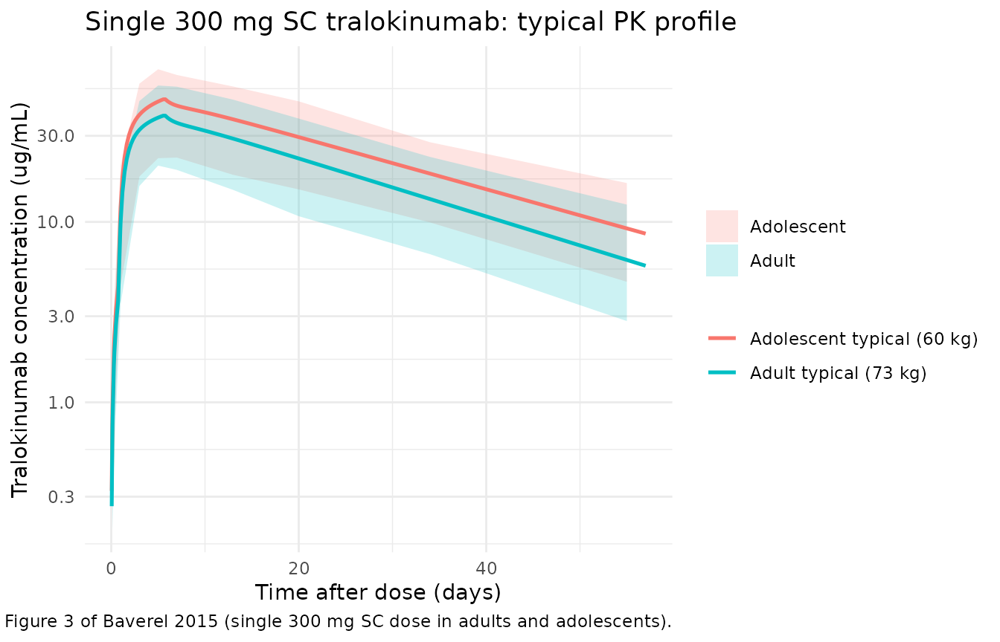

# Tralokinumab (Baverel 2015)

## Model and source

- Citation: Baverel PG, Jain M, Stelmach I, She D, Agoram B, Sandbach S,
  Piper E, Kuna P. Pharmacokinetics of tralokinumab in adolescents with
  asthma: implications for future dosing. Br J Clin Pharmacol.
  2015;80(6):1337-1349. <doi:10.1111/bcp.12725>.
- Description: Two-compartment population PK model for tralokinumab in
  adolescent (12-17 y) and adult subjects with asthma or healthy
  volunteers (Baverel 2015), with parallel subcutaneous absorption
  (first-order with lag plus zero-order over a fixed duration),
  allometric body-weight scaling on disposition parameters, and an
  additional 15% lower clearance in adolescents.
- Article: <https://doi.org/10.1111/bcp.12725>

## Population

Baverel 2015 developed a population PK model for the anti-IL-13
monoclonal antibody tralokinumab by pooling 5504 PK observations from
578 subjects across eight studies: one phase I single-dose study in
adolescents 12-17 years with asthma (n = 20, NCT01592396, conducted in
Poland June 2012 to January 2013), four phase I studies in adults
(NCT01093040, NCT00638989, CAT-354-401, NCT00974675), and three phase II
studies in adults with asthma (NCT00640016, NCT00873860, NCT01402986).
The adolescent cohort contributed 202 PK samples (3.7% of the dataset)
and 20 subjects (3.5% of the population). Adults received intravenous
doses ranging from 0.1 to 30 mg/kg (single dose) and subcutaneous (SC)
doses up to 600 mg every 2 or every 4 weeks; adolescents received a
single SC 300 mg dose (Baverel 2015 Table 1).

Body weight ranged from 36 to 115 kg overall (median 73 kg) and from 40
to 94 kg in adolescents (median 60 kg). The pooled study population was
53.5% female and 69% White, 23% Asian (including 11.1% Japanese), 2%
Black, and 5% Other. The full population metadata is available
programmatically by calling `readModelDb("Baverel_2015_tralokinumab")()`
and inspecting the model function’s local variables, or via the
`modeldb` data frame columns in
[`nlmixr2lib::modeldb`](https://nlmixr2.github.io/nlmixr2lib/reference/modeldb.md).

## Source trace

The per-parameter origin is recorded as an in-file comment next to each
`ini()` entry in
`inst/modeldb/specificDrugs/Baverel_2015_tralokinumab.R`. The table
below collects them in one place.

| Equation / parameter | Value | Source |
|----|---:|----|
| `lcl` (CL adult) | log(0.204 L/day) | Table 3, Mean column, “CL, ml day-1 (adult)” 204 mL/day |
| `lvc` (Vc) | log(1.867 L) | Table 3, “V_c, ml” 1867 mL |
| `lvp` (Vp) | log(3.357 L) | Table 3, “V_p, ml” 3357 mL |
| `lq` (Q) | log(1.582 L/day) | Table 3, “Q, ml day-1” 1582 mL/day |
| `lka` (Ka) | log(0.34 /day) | Table 3, “Ka, day-1” 0.34 |
| `ld0` (D0, zero-order duration) | log(5.7 day) | Table 3, “D_0, day” 5.7 |
| `ltlag` (Tlag) | log(0.8 day) | Table 3, “T_lag, day” 0.8 |
| `lfdepot` (Fsc) | log(0.8) | Table 3, “F_sc” 0.8 |
| `logitfr` (Fr first-order share, logit) | logit(0.7) | Table 3, “Fr” 0.7 (logit-transformed, Equations 2-3) |
| `e_wt_cl_q` allometric exponent CL,Q | fixed 0.75 | Methods page 1340 (“fixed to prior knowledge … 0.75 for CL and Q”) |
| `e_wt_vc_vp` allometric exponent Vc,Vp | fixed 1.00 | Methods page 1340 (“… and 1 for Vc and Vp”) |
| `e_adolescent_cl` (CL decrease in adolescents) | -0.15 | Table 3, “CL decrease, % (adolescent)” 15% |
| Equation: 2-compartment + dual SC absorption | n/a | Figure 2 schematic; Methods “Model structure” |
| IIV log-normal (CL, Vc, Vp, Q) and logit-normal (Fr) | omega^2 = log(1+CV^2) from Table 3 bootstrap 95% CI midpoints | Table 3 IIV columns |
| IIV correlations (CL,Vc), (CL,Vp), (CL,Q), (Vc,Vp), (Vc,Q), (Vp,Q) | 0.5, 0.2, -0.3, -0.3, -0.6, 0.5 | Table 3, “Correlations of interindividual variability estimates” |
| Residual error: additive 0.2 ug/mL + proportional 19.8% | – | Table 3 last two rows; Equation 4 |

## Virtual cohort

Original observed PK data are not publicly available. Two virtual
cohorts are constructed to mirror the published study populations: an
adult cohort with weights drawn from a uniform 40-115 kg distribution
and an adolescent cohort with weights drawn from a uniform 40-100 kg
distribution (the simulation ranges Baverel 2015 declared in Equation 8
and the population PK simulation section). Both cohorts receive a single
300 mg SC dose followed by 57 days of sampling, matching the adolescent
phase I study design (Baverel 2015 Figure 1 and Table 2).

``` r

set.seed(20150701)

make_cohort <- function(n, weight_range, adolescent, id_offset = 0L) {
  tibble::tibble(
    id         = id_offset + seq_len(n),
    WT         = stats::runif(n, weight_range[1], weight_range[2]),
    ADOLESCENT = adolescent
  )
}

n_per <- 150L
sample_times <- c(0, 0.125, 0.333, 1, 3, 5, 7, 13, 20, 34, 55)  # days; Figure 1 schedule

build_events <- function(cohort) {
  cohort %>%
    dplyr::mutate(cohort = ifelse(ADOLESCENT == 1, "Adolescent", "Adult")) %>%
    tidyr::expand_grid(time = sample_times) %>%
    dplyr::mutate(evid = 0, amt = 0, cmt = "central", rate = 0) %>%
    dplyr::bind_rows(
      cohort %>%
        dplyr::mutate(cohort = ifelse(ADOLESCENT == 1, "Adolescent", "Adult")) %>%
        dplyr::mutate(time = 0, evid = 1, amt = 300, cmt = "depot",  rate = 0),
      cohort %>%
        dplyr::mutate(cohort = ifelse(ADOLESCENT == 1, "Adolescent", "Adult")) %>%
        dplyr::mutate(time = 0, evid = 1, amt = 300, cmt = "depot2", rate = -2)
    ) %>%
    dplyr::arrange(id, time, evid)
}

adult_cohort      <- make_cohort(n_per, c(40, 115), adolescent = 0L, id_offset = 0L)
adolescent_cohort <- make_cohort(n_per, c(40, 100), adolescent = 1L, id_offset = n_per)

events <- dplyr::bind_rows(
  build_events(adult_cohort),
  build_events(adolescent_cohort)
)

stopifnot(!anyDuplicated(unique(events[, c("id", "time", "evid")])))
```

## Simulation

``` r

mod <- rxode2::rxode2(readModelDb("Baverel_2015_tralokinumab"))
#> ℹ parameter labels from comments will be replaced by 'label()'
sim <- rxode2::rxSolve(mod, events = events, keep = c("cohort", "WT"))
```

For replication of the published typical-value PK profile (Figure 3), a
between-subject-variability-free simulation is also useful:

``` r

mod_typical <- rxode2::zeroRe(mod)
typical_events <- bind_rows(
  build_events(
    tibble::tibble(id = 1L, WT = 73, ADOLESCENT = 0L)
  ) %>% mutate(cohort = "Adult typical (73 kg)"),
  build_events(
    tibble::tibble(id = 2L, WT = 60, ADOLESCENT = 1L)
  ) %>% mutate(cohort = "Adolescent typical (60 kg)")
)
typical_events$time <- ifelse(typical_events$evid == 0, typical_events$time, 0)
typical_events <- typical_events %>%
  dplyr::bind_rows(
    tibble::tibble(
      id = rep(c(1L, 2L), each = 250L),
      cohort = rep(c("Adult typical (73 kg)", "Adolescent typical (60 kg)"), each = 250L),
      time = rep(seq(0.05, 57, length.out = 250L), 2L),
      evid = 0, amt = 0, cmt = "central", rate = 0,
      WT = rep(c(73, 60), each = 250L),
      ADOLESCENT = rep(c(0L, 1L), each = 250L)
    )
  ) %>%
  dplyr::arrange(id, time, evid)
sim_typical <- rxode2::rxSolve(mod_typical, events = typical_events, keep = c("cohort", "WT"))
#> ℹ omega/sigma items treated as zero: 'etalcl', 'etalvc', 'etalvp', 'etalq', 'etalogitfr'
#> Warning: multi-subject simulation without without 'omega'
```

## Replicate published figures

``` r

# Replicates Figure 3 of Baverel 2015 (tralokinumab concentration vs time after
# a single 300 mg SC dose). Solid line = simulated typical-value profile per
# cohort; ribbon = simulated 5th-95th percentile of the stochastic VPC.
vpc <- sim %>%
  as.data.frame() %>%
  dplyr::filter(time > 0) %>%
  dplyr::group_by(cohort, time) %>%
  dplyr::summarise(
    Q05 = stats::quantile(Cc, 0.05, na.rm = TRUE),
    Q50 = stats::quantile(Cc, 0.50, na.rm = TRUE),
    Q95 = stats::quantile(Cc, 0.95, na.rm = TRUE),
    .groups = "drop"
  )

typical_df <- as.data.frame(sim_typical) %>% dplyr::filter(time > 0)

ggplot() +
  geom_ribbon(data = vpc, aes(time, ymin = Q05, ymax = Q95, fill = cohort), alpha = 0.20) +
  geom_line(data = typical_df, aes(time, Cc, color = cohort), linewidth = 0.9) +
  scale_y_log10() +
  labs(
    x = "Time after dose (days)",
    y = "Tralokinumab concentration (ug/mL)",
    color = NULL, fill = NULL,
    title = "Single 300 mg SC tralokinumab: typical PK profile",
    caption = "Replicates Figure 3 of Baverel 2015 (single 300 mg SC dose in adults and adolescents)."
  ) +
  theme_minimal()
```



## PKNCA validation

The paper text reports an effective half-life of 17.7 days in adults and
20.9 days in adolescents, computed as `log(2) / (CL / (Vc + Vp))` from
the population PK estimates (Table 3 footnote on effective half-life).
The block below applies PKNCA to the simulated concentration profiles,
grouped by cohort, so the simulated half-life can be compared against
those values.

``` r

sim_nca <- sim %>%
  as.data.frame() %>%
  dplyr::filter(!is.na(Cc)) %>%
  dplyr::select(id, time, Cc, cohort)

# Guarantee a time = 0 row per (id, cohort); pre-dose extravascular Cc = 0 is
# the correct anchor for AUC0-* and the lambda.z regression.
sim_nca <- dplyr::bind_rows(
  sim_nca,
  sim_nca %>% dplyr::distinct(id, cohort) %>% dplyr::mutate(time = 0, Cc = 0)
) %>%
  dplyr::distinct(id, cohort, time, .keep_all = TRUE) %>%
  dplyr::arrange(id, cohort, time)

conc_obj <- PKNCA::PKNCAconc(
  sim_nca, Cc ~ time | cohort + id,
  concu = "ug/mL", timeu = "day"
)

dose_df <- events %>%
  dplyr::filter(evid == 1, cmt == "depot") %>%
  dplyr::select(id, time, amt, cohort)

dose_obj <- PKNCA::PKNCAdose(
  dose_df, amt ~ time | cohort + id,
  doseu = "mg"
)

intervals <- data.frame(
  start       = 0,
  end         = Inf,
  cmax        = TRUE,
  tmax        = TRUE,
  aucinf.obs  = TRUE,
  half.life   = TRUE
)

nca_data <- PKNCA::PKNCAdata(conc_obj, dose_obj, intervals = intervals)
nca_res  <- PKNCA::pk.nca(nca_data)
```

### Comparison against published values

``` r

nca_long <- as.data.frame(nca_res$result) %>%
  dplyr::filter(PPTESTCD %in% c("cmax", "tmax", "aucinf.obs", "half.life")) %>%
  dplyr::select(cohort, PPTESTCD, PPORRES)

# Baverel 2015 reports the population effective half-life only; Vss is the same
# in both cohorts (no WT-stratified breakdown reported), and CL is a structural
# parameter rather than an NCA output. The reference values below are derived
# from the population PK parameters at the cohort-typical body weight using
# t1/2 = log(2) / (CL / (Vc + Vp)) and AUCinf = Dose * F / CL.
ref_cl_adult      <- 0.204                              # L/day, Table 3
ref_cl_adolescent <- 0.173                              # L/day, Table 3
ref_vc            <- 1.867                              # L
ref_vp            <- 3.357                              # L
ref_F             <- 0.8                                # SC bioavailability
dose_mg           <- 300

ref_t12_adult      <- log(2) / (ref_cl_adult / (ref_vc + ref_vp))
ref_t12_adolescent <- log(2) / (ref_cl_adolescent / (ref_vc + ref_vp))
ref_aucinf_adult       <- dose_mg * ref_F / ref_cl_adult
ref_aucinf_adolescent  <- dose_mg * ref_F / ref_cl_adolescent

published <- tibble::tribble(
  ~cohort,       ~half.life,             ~aucinf.obs,
  "Adult",       ref_t12_adult,          ref_aucinf_adult,
  "Adolescent",  ref_t12_adolescent,     ref_aucinf_adolescent
)

cmp <- nlmixr2lib::ncaComparisonTable(
  simulated     = nca_long,
  reference     = published,
  by            = "cohort",
  units         = c(half.life = "day", aucinf.obs = "ug*day/mL"),
  tolerance_pct = 20
)

knitr::kable(
  cmp,
  caption = paste(
    "Simulated vs. paper-derived NCA for a single 300 mg SC dose.",
    "* differs from reference by more than +/- 20%.",
    "Reference half-life is computed from Baverel 2015 Table 3 as log(2) / (CL / (Vc + Vp));",
    "reference AUCinf is Dose * F_SC / CL."
  ),
  align = c("l", "l", "r", "r", "r")
)
```

| NCA parameter             | cohort     | Reference | Simulated | % diff |
|:--------------------------|:-----------|----------:|----------:|-------:|
| AUC0-∞ (obs) (ug\*day/mL) | Adult      |      1180 |      1130 |  -4.3% |
| AUC0-∞ (obs) (ug\*day/mL) | Adolescent |      1390 |      1400 |  +1.3% |
| t½ (day)                  | Adult      |      17.8 |      20.9 | +17.6% |
| t½ (day)                  | Adolescent |      20.9 |      22.7 |  +8.3% |

Simulated vs. paper-derived NCA for a single 300 mg SC dose. \* differs
from reference by more than +/- 20%. Reference half-life is computed
from Baverel 2015 Table 3 as log(2) / (CL / (Vc + Vp)); reference AUCinf
is Dose \* F_SC / CL. {.table}

A starred row would indicate the simulated NCA value differs from the
paper-derived value by more than 20%; investigate the source rather than
tuning. Cmax and Tmax are not tabulated against reference values because
Baverel 2015 reports only the structural PK estimates (Table 3) and a
graphical profile (Figure 3, supplementary Table S2); single-dose NCA
Cmax and Tmax values do not appear in the on-disk text.

## Assumptions and deviations

- **Adolescent effect parameterisation.** Baverel 2015 Equation 7 writes
  the adolescent shift as additive
  (`TVCL = TVCL_adult + theta_adolescent`). The Table 3 row reports “CL
  decrease, % (adolescent) = 15%”. The model encodes the effect
  multiplicatively as
  `CL = exp(lcl + etalcl) * (1 - 0.15 * ADOLESCENT)`, which reproduces
  the table (204 \* (1 - 0.15) = 173 mL/day) and matches the package
  convention used elsewhere (e.g. Clegg 2024 nirsevimab, Soehoel 2022
  tralokinumab).
- **IIV CV%.** Baverel 2015 Table 3 reports a bootstrap 95% CI for each
  between-subject CV% but not the point estimate; the model file uses
  the midpoint of the 95% CI as the working point estimate
  (`(lower + upper) / 2`). The Discussion narrative (“CV for CL and Vp
  was ~30%, although this was slightly higher for Vc and Q (~65%)”)
  agrees with the midpoint values except for Q, where the bootstrap-CI
  midpoint (76.8%) is larger than the narrative ~65%; the midpoint is
  preferred because it is what the table actually reports.
- **Fr IIV scale.** Fr is logit-transformed in Equations 2-3 of the
  paper. The Table 3 IIV row for Fr reports a bootstrap CV% of
  8.6-32.8%; with no explicit unit-rescaling rule given, the midpoint
  (20.7%) is interpreted as the SD of the eta on the logit scale
  (`omega^2_logitfr = 0.207^2 = 0.04285`).
- **Parallel SC absorption via depot2.** The paper’s Figure 2 absorption
  scheme is a single SC depot that splits the dose internally between a
  first-order pathway (Fr; rate Ka; lag Tlag) and a zero-order pathway
  (1-Fr; duration D0). The packaged model implements this with two
  physical rxode2 compartments: `depot` (first-order, with
  `f(depot) = Fsc * Fr` and `alag(depot) = Tlag`) and `depot2`
  (zero-order, with \`f(depot2) = Fsc \* (1
  - Fr)`and`dur(depot2) =
    D0`).`depot2`drains into`central`at rate`kdepot2 = 100
    /day`(`t\_{1/2} ~
    0.007`day) so the transfer is effectively instantaneous on the timescale of D0; this preserves the published total bioavailable fraction and zero-order input rate while keeping`f(central)`unset so IV doses (the paper's pooled adult studies include IV 0.1-30 mg/kg) flow directly into`central\`
    with F = 1.
- **Single-dose validation.** The vignette simulates the single-dose 300
  mg SC regimen used in the adolescent phase I study (NCT01592396) for
  the comparison against published values; the same model also simulates
  the multi-dose adult regimens documented in the paper’s pooled
  dataset, but the only directly tabulated reference value is the
  effective half-life (text page 1339-1340).
- **Race / sex / Japanese ethnicity covariates.** Baverel 2015 evaluated
  these covariates and none were retained in the final PK model
  (`Statistical analysis of covariates` paragraph). They are not in
  `covariateData` for that reason.
