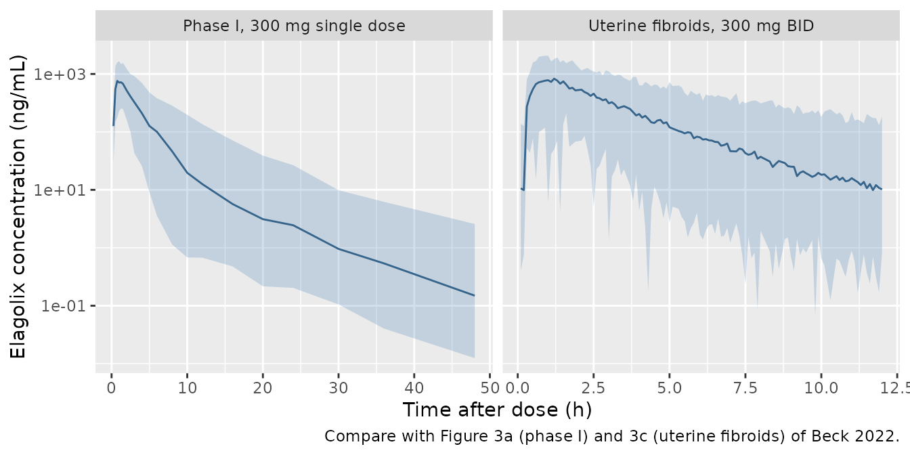

# Elagolix (Beck 2022)

## Model and source

- Citation: Beck D, Winzenborg I, Liu M, Degner J, Mostafa NM,
  Noertersheuser P, Shebley M. Population Pharmacokinetics of Elagolix
  in Combination with Low-Dose Estradiol/Norethindrone Acetate in Women
  with Uterine Fibroids. Clin Pharmacokinet. 2022;61(4):577-587.
  <doi:10.1007/s40262-021-01096-w>. Parameter estimates are from Table 3
  and its footnotes c and d; the residual-error equation is Equation 2
  of the Electronic Supplementary Material
  (40262_2021_1096_MOESM1_ESM.pdf).
- Description: Two-compartment population pharmacokinetic model with
  first-order absorption, absorption lag time and first-order
  elimination for oral elagolix (a gonadotropin-releasing hormone
  receptor antagonist) in 2168 premenopausal women pooled from six phase
  I studies in healthy women, four phase III studies in endometriosis
  and three phase III studies in uterine fibroids, where elagolix 300 mg
  BID was given alone or with estradiol 1 mg / norethindrone acetate 0.5
  mg QD add-back therapy (Beck 2022). OATP1B1 c.521T\>C (rs4149056)
  transporter status acts on relative bioavailability (intermediate,
  poor and missing-genotype strata) and body weight acts on the apparent
  central volume by a power function. Combined
  proportional-plus-additive residual error with separate magnitudes for
  the phase I and phase III studies.
- Article: <https://doi.org/10.1007/s40262-021-01096-w> (open access,
  PMC8975762)
- Electronic Supplementary Material:
  <https://static-content.springer.com/esm/art%3A10.1007%2Fs40262-021-01096-w/MediaObjects/40262_2021_1096_MOESM1_ESM.pdf>

Beck 2022 extends the earlier elagolix population PK model for
endometriosis (Winzenborg 2018, Clin Pharmacokinet 57:1295) with the
phase III uterine-fibroid studies, in which elagolix 300 mg twice daily
was given alone or with estradiol 1 mg / norethindrone acetate 0.5 mg
once daily (E2/NETA add-back). Co-administration of E2/NETA was tested
on CL/F and was not a significant covariate, so the model has no
add-back term.

## Population

The analysis pooled 17,915 elagolix plasma concentrations from 2168
premenopausal women in 13 studies (Beck 2022 Table 1): 175 healthy women
in six phase I studies with intensive sampling, 1310 women with
endometriosis-associated pain in four phase III studies (Elaris EM-1,
EM-2 and their extensions) and 683 women with heavy menstrual bleeding
associated with uterine fibroids in three phase III studies (Elaris
UF-1, UF-2 and UF-Extend), all with sparse monthly sampling. Regimens
ranged from single doses of 150-300 mg to 150 mg once daily through 400
mg twice daily for 9 days to 12 months.

Baseline characteristics (Table 2) were median (range) age 36 (18-53)
years, body weight 76 (40-160) kg and BMI 28.2 (16.2-61.5) kg/m^2; 30.4%
of the women were Black and 69.6% White or other races. OATP1B1
c.521T\>C (rs4149056) transporter status was extensive (homozygous wild
type) in 57.9%, intermediate (heterozygous) in 15.5%, poor (homozygous
variant) in 1.48%, and missing in 25.1% (no pharmacogenetic sample).

The same information is available programmatically via
`readModelDb("Beck_2022_elagolix")()$population`.

## Source trace

Every `ini()` value carries an in-file comment pointing to its source.
The table collects them.

| Equation / parameter | Value | Source location |
|----|----|----|
| `lcl` (CL/F) | log(125 L/h) | Table 3 |
| `lvc` (Vc/F at 76 kg) | log(279 L) | Table 3 |
| `lka` (ka) | log(2.46 1/h) | Table 3 (printed unit ‘L/h’ is a typo for 1/h) |
| `lq` (Q/F) | log(5.63 L/h) | Table 3 |
| `lvp` (Vp/F) | log(51.7 L) | Table 3 |
| `ltlag` (lag time) | log(0.207 h) | Table 3 |
| `lfdepot` (F1, reference) | fixed(log(1)) | Table 3 ‘F1 1.00 (fix)’ |
| `e_wt_vc` | 0.160 | Table 3; footnote c `Vc/F = 279 * (WT/76)^0.160` |
| `e_slco1b1_521_het_fdepot` | 0.421 | Table 3 ‘Intermediate transporter on F1’; footnote d F1 = 1.42 |
| `e_slco1b1_521_hom_fdepot` | 0.963 | Table 3 ‘Poor transporter on F1’; footnote d F1 = 1.96 |
| `e_slco1b1_521_missing_fdepot` | 0.101 | Table 3 ‘Missing transporter on F1’; footnote d F1 = 1.10 |
| `etalcl` | 0.198 (46.8% CV) | Table 3, footnote b |
| `etalvc` | 0.208 (48.1% CV) | Table 3, footnote b |
| `propSdPh1` | sqrt(0.145) | Table 3 ‘Proportional error (phase I studies)’, a variance |
| `addSdPh1` | sqrt(5.26e-05) ng/mL | Table 3 ‘Additive error (phase I studies)’, a variance |
| `propSdPh3` | sqrt(0.284) | Table 3 ‘Proportional error (phase III studies)’, a variance |
| `addSdPh3` | sqrt(0.266) ng/mL | Table 3 ‘Additive error (phase III studies)’, a variance |
| Covariate form `theta * (cov/ref)^e * (1 + theta_q * cov_q) * exp(eta)` | n/a | ESM Equation 3 |
| `Cc ~ add(addSd) + prop(propSd)` | n/a | ESM Equation 2 |
| Two-compartment model, first-order absorption with lag time, first-order elimination | n/a | Results 3.2; Abstract |

## Typical-value single-dose profile

Beck 2022 cites a time to maximum concentration of 1.0-1.5 h and a
half-life of 4-6 h for elagolix (Introduction, from Shebley 2020). The
typical-value model gives a single 300 mg profile consistent with that,
and its AUC to infinity must equal `F * Dose / (CL/F)` exactly.

``` r

mod <- readModelDb("Beck_2022_elagolix")
mod_typ <- rxode2::zeroRe(mod)
#> ℹ parameter labels from comments will be replaced by 'label()'
#> Warning: No sigma parameters in the model

typ_grid <- c(seq(0, 4, by = 0.02), seq(4.05, 24, by = 0.05), seq(24.25, 120, by = 0.25))
typ_ev <- data.frame(
  id = 1L,
  time = c(0, typ_grid),
  evid = c(1L, rep(0L, length(typ_grid))),
  amt = c(300, rep(0, length(typ_grid))),
  cmt = "depot"
)
typ_ev$cmt[typ_ev$evid == 0] <- "central"
typ_ev$WT <- 76
typ_ev$SNP_SLCO1B1_RS4149056_HET <- 0
typ_ev$SNP_SLCO1B1_RS4149056_HOM <- 0
typ_ev$SNP_SLCO1B1_RS4149056_MISSING <- 0
typ_ev$STUDY_PHASE3 <- 0

typ <- rxode2::rxSolve(mod_typ, typ_ev, returnType = "data.frame",
                       atol = 1e-10, rtol = 1e-10)
#> ℹ omega/sigma items treated as zero: 'etalcl', 'etalvc'
typ_obs <- typ[typ$time > 0 | typ$Cc == 0, ]

tmax_typ <- typ_obs$time[which.max(typ_obs$Cc)]
auc_typ <- sum(diff(typ_obs$time) * (head(typ_obs$Cc, -1) + tail(typ_obs$Cc, -1)) / 2)
auc_tail <- tail(typ_obs$Cc, 1) /
  (-coef(lm(log(Cc) ~ time, typ_obs[typ_obs$time >= 72, ]))[[2]])
auc_expected <- 300 / 125 * 1000

stopifnot(
  tmax_typ >= 1.0, tmax_typ <= 1.5,
  abs((auc_typ + auc_tail) / auc_expected - 1) < 0.005
)
data.frame(
  quantity = c("Cmax (ng/mL)", "tmax (h)", "AUC0-inf (ng*h/mL)", "F*Dose/(CL/F) (ng*h/mL)"),
  value = signif(c(max(typ_obs$Cc), tmax_typ, auc_typ + auc_tail, auc_expected), 4)
) |>
  knitr::kable(caption = "Typical woman (76 kg, extensive transporter), 300 mg single dose.")
```

| quantity                |   value |
|:------------------------|--------:|
| Cmax (ng/mL)            |  728.30 |
| tmax (h)                |    1.04 |
| AUC0-inf (ng\*h/mL)     | 2400.00 |
| F*Dose/(CL/F) (ng*h/mL) | 2400.00 |

Typical woman (76 kg, extensive transporter), 300 mg single dose.
{.table}

## Virtual cohorts

Original observed data are not public. Two virtual cohorts of 200 women
each are used below:

- **Phase I, 300 mg single dose** (`STUDY_PHASE3 = 0`): intensive
  sampling to 48 h, the phase I residual error.
- **Uterine fibroids, 300 mg BID** (`STUDY_PHASE3 = 1`): 14 days of
  twice-daily dosing, sampled densely over the last dosing interval, the
  phase III residual error.

Body weight is log-normal around the 76 kg median and redrawn (never
clamped) until it lies in the observed 40-160 kg range; OATP1B1 status
is drawn from the Table 2 frequencies, including the missing-genotype
stratum.

``` r

set.seed(20220401)
rxode2::rxSetSeed(20220401)

draw_wt <- function(n) {
  wt <- exp(rnorm(n, log(76), 0.22))
  bad <- wt < 40 | wt > 160
  while (any(bad)) {
    wt[bad] <- exp(rnorm(sum(bad), log(76), 0.22))
    bad <- wt < 40 | wt > 160
  }
  wt
}

draw_subjects <- function(n, id_offset) {
  status <- sample(
    c("extensive", "intermediate", "poor", "missing"),
    n, replace = TRUE, prob = c(57.9, 15.5, 1.48, 25.1)
  )
  data.frame(
    id = id_offset + seq_len(n),
    WT = draw_wt(n),
    status = status,
    SNP_SLCO1B1_RS4149056_HET = as.integer(status == "intermediate"),
    SNP_SLCO1B1_RS4149056_HOM = as.integer(status == "poor"),
    SNP_SLCO1B1_RS4149056_MISSING = as.integer(status == "missing")
  )
}

make_events <- function(subj, dose_times, obs_times, amt, treatment, phase3) {
  per_id <- function(i) {
    rbind(
      data.frame(id = subj$id[i], time = dose_times, evid = 1L, amt = amt, cmt = "depot"),
      data.frame(id = subj$id[i], time = obs_times, evid = 0L, amt = 0, cmt = "central")
    )
  }
  ev <- do.call(rbind, lapply(seq_len(nrow(subj)), per_id))
  ev <- merge(ev, subj, by = "id")
  ev$treatment <- treatment
  ev$STUDY_PHASE3 <- phase3
  ev[order(ev$id, ev$time, -ev$evid), ]
}

n_arm <- 200
subj_sd <- draw_subjects(n_arm, id_offset = 0L)
subj_uf <- draw_subjects(n_arm, id_offset = 1000L)

obs_sd <- c(0, 0.25, 0.5, 0.75, 1, 1.25, 1.5, 2, 2.5, 3, 4, 5, 6, 8, 10, 12, 16, 20, 24, 30, 36, 48)
ev_sd <- make_events(subj_sd, dose_times = 0, obs_times = obs_sd, amt = 300,
                     treatment = "Phase I, 300 mg single dose", phase3 = 0L)

tau <- 12
t_last <- 13 * 24 + 12
ev_uf <- make_events(
  subj_uf,
  dose_times = seq(0, t_last, by = tau),
  obs_times = t_last + seq(0, tau, by = 0.1),
  amt = 300, treatment = "Uterine fibroids, 300 mg BID", phase3 = 1L
)

events <- dplyr::bind_rows(ev_sd, ev_uf)
stopifnot(!anyDuplicated(unique(events[, c("id", "time", "evid")])))
```

## Simulation

``` r

sim <- rxode2::rxSolve(
  mod, events = events,
  keep = c("treatment", "status", "WT"),
  returnType = "data.frame"
)
#> ℹ parameter labels from comments will be replaced by 'label()'
```

## Replicate published figures

### Figure 3 – concentration-time profiles

Figure 3 of Beck 2022 shows visual predictive checks of the observed
data by population. The observed data are not available, so the panels
below show the simulated median and 5th/95th percentiles of observations
(with residual error) for the two virtual designs.

``` r

sim |>
  dplyr::mutate(tad = ifelse(treatment == "Phase I, 300 mg single dose", time, time - t_last)) |>
  dplyr::filter(tad > 0) |>
  dplyr::group_by(treatment, tad) |>
  dplyr::summarise(
    Q05 = quantile(sim, 0.05, na.rm = TRUE),
    Q50 = quantile(sim, 0.50, na.rm = TRUE),
    Q95 = quantile(sim, 0.95, na.rm = TRUE),
    .groups = "drop"
  ) |>
  dplyr::filter(Q05 > 0) |>
  ggplot(aes(tad, Q50)) +
  geom_ribbon(aes(ymin = Q05, ymax = Q95), alpha = 0.25, fill = "steelblue") +
  geom_line(colour = "steelblue4") +
  facet_wrap(~treatment, scales = "free_x") +
  scale_y_log10() +
  labs(
    x = "Time after dose (h)", y = "Elagolix concentration (ng/mL)",
    caption = "Compare with Figure 3a (phase I) and 3c (uterine fibroids) of Beck 2022."
  )
```



### Figure 4 – covariate effects on Cavg

Figure 4 shows the ratio of elagolix average concentration at 300 mg BID
for each OATP1B1 transporter status (relative to extensive transporters)
and for body weights of 51, 76 and 101 kg (median +/- 25 kg; relative to
76 kg). The model ratios below come from typical-value steady-state
solves.

``` r

fig4_scen <- data.frame(
  scenario = c("Extensive (reference)", "Intermediate", "Poor",
               "51 kg", "76 kg (reference)", "101 kg"),
  WT = c(76, 76, 76, 51, 76, 101),
  SNP_SLCO1B1_RS4149056_HET = c(0, 1, 0, 0, 0, 0),
  SNP_SLCO1B1_RS4149056_HOM = c(0, 0, 1, 0, 0, 0)
)
fig4_scen$id <- seq_len(nrow(fig4_scen))
fig4_ev <- do.call(rbind, lapply(fig4_scen$id, function(i) {
  rbind(
    data.frame(id = i, time = seq(0, t_last, by = tau), evid = 1L, amt = 300, cmt = "depot"),
    data.frame(id = i, time = t_last + seq(0, tau, by = 0.01), evid = 0L, amt = 0, cmt = "central")
  )
}))
fig4_ev <- merge(fig4_ev, fig4_scen, by = "id")
fig4_ev$SNP_SLCO1B1_RS4149056_MISSING <- 0
fig4_ev$STUDY_PHASE3 <- 1
fig4_ev <- fig4_ev[order(fig4_ev$id, fig4_ev$time, -fig4_ev$evid), ]

fig4_sim <- rxode2::rxSolve(mod_typ, fig4_ev, returnType = "data.frame",
                            atol = 1e-10, rtol = 1e-10)
#> ℹ omega/sigma items treated as zero: 'etalcl', 'etalvc'
#> Warning: multi-subject simulation without without 'omega'
cavg_typ <- fig4_sim |>
  dplyr::filter(time >= t_last) |>
  dplyr::group_by(id) |>
  dplyr::summarise(
    cavg = sum(diff(time) * (head(Cc, -1) + tail(Cc, -1)) / 2) / tau,
    .groups = "drop"
  ) |>
  dplyr::left_join(fig4_scen[, c("id", "scenario")], by = "id")

ref_geno <- cavg_typ$cavg[cavg_typ$scenario == "Extensive (reference)"]
ref_wt <- cavg_typ$cavg[cavg_typ$scenario == "76 kg (reference)"]
fig4_tab <- cavg_typ |>
  dplyr::mutate(
    ratio = ifelse(grepl("kg", scenario), cavg / ref_wt, cavg / ref_geno),
    published = c(1, 1.45, 2.09, NA, 1, NA)[match(scenario, fig4_scen$scenario)]
  )

# Structural identities: Cavg = F * Dose / (CL * tau), so the genotype ratio
# is exactly 1 + theta and body weight (which acts only on Vc/F) cannot move it.
stopifnot(
  abs(fig4_tab$ratio[fig4_tab$scenario == "Intermediate"] / 1.421 - 1) < 0.002,
  abs(fig4_tab$ratio[fig4_tab$scenario == "Poor"] / 1.963 - 1) < 0.002,
  all(abs(fig4_tab$ratio[grepl("kg", fig4_tab$scenario)] - 1) < 0.002)
)

fig4_tab |>
  dplyr::mutate(
    cavg = signif(cavg, 4),
    ratio = round(ratio, 3),
    pct_diff = round(100 * (ratio / published - 1), 1)
  ) |>
  dplyr::select(scenario, cavg, ratio, published, pct_diff) |>
  dplyr::rename(
    "Scenario" = scenario,
    "Typical Cavg,ss (ng/mL)" = cavg,
    "Model ratio" = ratio,
    "Published median ratio (Figure 4 / Results 3.4)" = published,
    "% diff" = pct_diff
  ) |>
  knitr::kable(caption = "Cavg ratios at elagolix 300 mg BID (full compliance).")
```

| Scenario | Typical Cavg,ss (ng/mL) | Model ratio | Published median ratio (Figure 4 / Results 3.4) | % diff |
|:---|---:|---:|---:|---:|
| Extensive (reference) | 200.0 | 1.000 | 1.00 | 0.0 |
| Intermediate | 284.2 | 1.421 | 1.45 | -2.0 |
| Poor | 392.6 | 1.963 | 2.09 | -6.1 |
| 51 kg | 200.0 | 1.000 | NA | NA |
| 76 kg (reference) | 200.0 | 1.000 | 1.00 | 0.0 |
| 101 kg | 200.0 | 1.000 | NA | NA |

Cavg ratios at elagolix 300 mg BID (full compliance). {.table
style="width:100%;"}

The model’s intermediate- and poor-transporter ratios are exactly the
Table 3 bioavailability factors 1.42 and 1.96. Beck 2022 reports
simulated median ratios of 1.45 and 2.09 (Results 3.4; the Discussion
rounds them to 1.5-fold and 2.1-fold), 2% and 6% higher. Both published
values lie between the final estimates (0.421, 0.963) and the bootstrap
medians (0.484, 1.25) of Table 3, which suggests the Figure 4 simulation
carried parameter uncertainty; the paper does not say so, and the model
reproduces the point estimates. Body weight has no effect on Cavg
because it acts only on the central volume, consistent with the paper’s
statement that its effect on Cavg is below 1%.

## PKNCA validation

``` r

sim_nca <- sim |>
  dplyr::filter(!is.na(Cc)) |>
  dplyr::select(id, time, Cc, treatment, status)

# Single-dose arm has a time-zero record from the grid; add one defensively.
sim_nca <- dplyr::bind_rows(
  sim_nca,
  sim_nca |>
    dplyr::filter(treatment == "Phase I, 300 mg single dose") |>
    dplyr::distinct(id, treatment, status) |>
    dplyr::mutate(time = 0, Cc = 0)
) |>
  dplyr::distinct(id, treatment, time, .keep_all = TRUE) |>
  dplyr::arrange(id, treatment, time)

dose_df <- events |>
  dplyr::filter(evid == 1) |>
  dplyr::select(id, time, amt, treatment)

conc_obj <- PKNCA::PKNCAconc(sim_nca, Cc ~ time | treatment + id)
dose_obj <- PKNCA::PKNCAdose(dose_df, amt ~ time | treatment + id)

intervals <- data.frame(
  treatment = c("Phase I, 300 mg single dose", "Uterine fibroids, 300 mg BID"),
  start = c(0, t_last),
  end = c(Inf, t_last + tau),
  cmax = TRUE,
  tmax = TRUE,
  aucinf.obs = c(TRUE, FALSE),
  half.life = c(TRUE, FALSE),
  auclast = c(FALSE, TRUE),
  cav = c(FALSE, TRUE),
  cmin = c(FALSE, TRUE)
)

nca_res <- PKNCA::pk.nca(PKNCA::PKNCAdata(conc_obj, dose_obj, intervals = intervals))
summary(nca_res)
#>  start end                    treatment   N     auclast       cmax       cmin
#>      0 Inf  Phase I, 300 mg single dose 200           . 783 [42.1]          .
#>    324 336 Uterine fibroids, 300 mg BID 200 2580 [53.6] 821 [40.1] 13.1 [269]
#>                tmax        cav    half.life  aucinf.obs
#>  1.00 [0.500, 1.50]          . 6.71 [0.330] 2650 [55.4]
#>  1.00 [0.600, 1.50] 215 [53.6]            .           .
#> 
#> Caption: auclast, cmax, cmin, cav, aucinf.obs: geometric mean and geometric coefficient of variation; tmax: median and range; half.life: arithmetic mean and standard deviation; N: number of subjects
```

The simulated median tmax (1.0 h) lies in the 1.0-1.5 h range the paper
cites. The PKNCA half-life of the single-dose arm (about 6.7 h, fitted
to the terminal samples up to 48 h) is slightly above the cited 4-6 h,
which comes from non-compartmental analyses of the phase I studies
(Shebley 2020); the model’s two-compartment terminal phase, driven by
the small peripheral volume, is reached only after the first day. Beck
2022 does not report its own NCA, so no other published NCA values are
available for comparison.

At steady state `AUCtau / tau` must equal each woman’s
`F * Dose / (CL/F * tau)`, using her own drawn clearance and
bioavailability; this checks the dosing, bioavailability and unit
handling of the packaged model end to end.

``` r

ind_par <- sim |>
  dplyr::filter(treatment == "Uterine fibroids, 300 mg BID") |>
  dplyr::group_by(id) |>
  dplyr::summarise(cl = dplyr::first(cl), fdepot = dplyr::first(fdepot), status = dplyr::first(status),
                   .groups = "drop")

cav_uf <- as.data.frame(nca_res) |>
  dplyr::filter(treatment == "Uterine fibroids, 300 mg BID", PPTESTCD == "cav") |>
  dplyr::select(id, cav = PPORRES) |>
  dplyr::left_join(ind_par, by = "id") |>
  dplyr::mutate(cav_expected = 1000 * fdepot * 300 / (cl * tau),
                rel_err = cav / cav_expected - 1)

# Same drawn parameters on both sides, so the difference is numerical only
# (default solver tolerances plus trapezoids on a 0.1 h grid). Observed when
# written: all errors negative, largest 0.53%. A wrong dose, F1 or unit
# factor moves this by tens of percent.
stopifnot(max(abs(cav_uf$rel_err)) < 0.01)
```

### Comparison against the published Cavg

Beck 2022 (Results 3.4) reports a median (5th, 95th percentile) elagolix
Cavg of 189 (97.2, 391) ng/mL in women with uterine fibroids at 300 mg
BID. Its Cavg equation multiplies `F1 * D / (CL/F)` by each woman’s
average taken dose ratio (TDOR); the individual TDORs are not published,
so the simulated Cavg is scaled by the phase III average compliance of
87.9% (Methods 2.7).

``` r

tdor <- 0.879
sim_cav <- data.frame(PPTESTCD = "cav", PPORRES = tdor * cav_uf$cav)
published_cav <- data.frame(cav = 189)

cmp <- nlmixr2lib::ncaComparisonTable(
  simulated = sim_cav,
  reference = published_cav,
  units = c(cav = "ng/mL")
)
knitr::kable(cmp, caption = "Median Cavg at 300 mg BID, uterine fibroids: simulated (x 0.879 compliance) vs Beck 2022 Results 3.4. * differs by >20%.")
```

| NCA parameter | Reference | Simulated | % diff |
|:--------------|:----------|:----------|:-------|
| Cavg (ng/mL)  | 189       | 184       | -2.8%  |

Median Cavg at 300 mg BID, uterine fibroids: simulated (x 0.879
compliance) vs Beck 2022 Results 3.4. \* differs by \>20%. {.table}

``` r


cav_q <- quantile(tdor * cav_uf$cav, c(0.05, 0.5, 0.95))
knitr::kable(
  data.frame(
    percentile = c("5th", "50th", "95th"),
    simulated = signif(unname(cav_q), 3),
    published = c(97.2, 189, 391)
  ) |>
    dplyr::rename("Percentile" = percentile, "Simulated (ng/mL)" = simulated,
                  "Published (ng/mL)" = published),
  caption = "Distribution of Cavg at 300 mg BID in uterine fibroids."
)
```

| Percentile | Simulated (ng/mL) | Published (ng/mL) |
|:-----------|------------------:|------------------:|
| 5th        |              82.1 |              97.2 |
| 50th       |             184.0 |             189.0 |
| 95th       |             436.0 |             391.0 |

Distribution of Cavg at 300 mg BID in uterine fibroids. {.table}

``` r


# Centre only: the 5th/95th percentiles of a 200-woman cohort are not
# reproducible across rxode2 builds, and the published interval comes from
# shrunken empirical Bayes estimates with individual compliance.
stopifnot(abs(cav_q[["50%"]] / 189 - 1) < 0.15)
```

The published interval (97.2-391 ng/mL) comes from empirical Bayes
estimates with individual compliance, which shrink towards the typical
value, so a simulated interval somewhat wider than the published one is
expected.

## Assumptions and deviations

- **Residual-error scale.** Table 3 prints the four residual-error rows
  without a unit or %CV. The Electronic Supplementary Material
  (Equation 2) defines the errors as `eps ~ N(0, sigma^2)`, and the same
  group’s companion paper (Beck 2022, Br J Clin Pharmacol 88:5257,
  Table 2) labels the identical table block ‘Residual variability
  (sigma^2)’. The values are therefore read as NONMEM SIGMA variances
  and square-rooted for nlmixr2 (proportional SD 38.1% phase I, 53.3%
  phase III; additive SD 0.0073 ng/mL phase I, 0.516 ng/mL phase III).
- **IIV covariance.** The Methods state that the starting and base
  models estimated a CL/F-Vc/F covariance with a block OMEGA, but Table
  3 reports only the two variances. The covariance is set to zero. It
  does not affect Cavg (which depends on CL/F only) but does affect
  joint CL/F-Vc/F draws.
- **Missing-genotype stratum.** The model keeps the published
  missing-genotype bioavailability factor (1.10) through the
  `SNP_SLCO1B1_RS4149056_MISSING` indicator. The paper’s covariate
  simulations did not use this stratum.
- **Study phase.** `STUDY_PHASE3` only selects the residual-error
  magnitudes; typical-value predictions are the same for both values.
- **Compliance.** The published Cavg multiplies by each woman’s average
  taken dose ratio. Here the phase III mean of 87.9% is applied to all
  simulated women; the model itself doses exactly what the event table
  supplies.
- **Virtual cohort.** Body weight is log-normal (median 76 kg, log-SD
  0.22, redrawn into 40-160 kg); the uterine-fibroid subgroup’s own
  weight distribution is not reported. OATP1B1 status is drawn from the
  Table 2 frequencies of the whole analysis population.
- **Table 3 typo.** The ka row is printed with unit ‘L/h’; the value
  2.46 is a first-order rate constant in 1/h.
- No erratum or correction notice for Beck 2022 was found in Europe PMC
  as of 2026-09-30.
