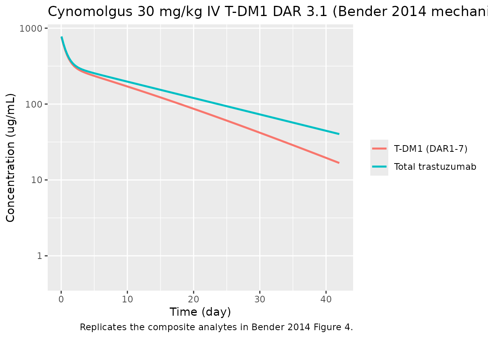
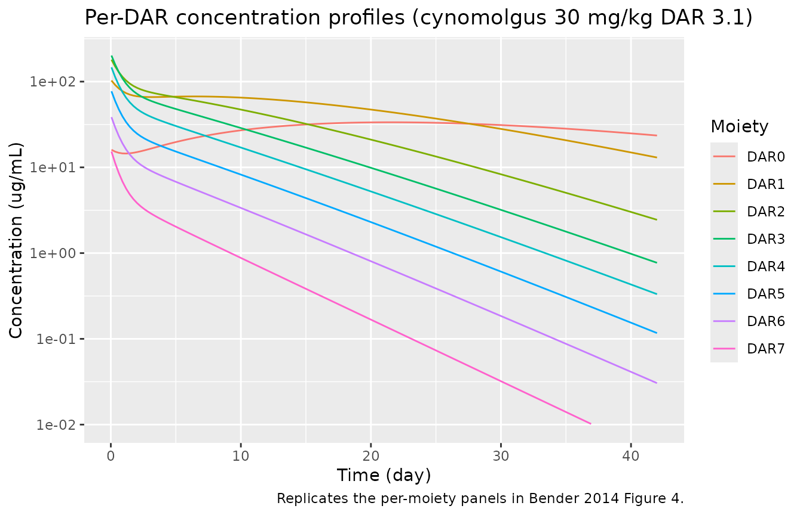

# Trastuzumab emtansine (T-DM1) preclinical mechanistic DAR PK model (Bender 2014)

``` r
library(nlmixr2lib)
library(rxode2)
#> rxode2 5.0.2 using 2 threads (see ?getRxThreads)
#>   no cache: create with `rxCreateCache()`
library(dplyr)
#> 
#> Attaching package: 'dplyr'
#> The following objects are masked from 'package:stats':
#> 
#>     filter, lag
#> The following objects are masked from 'package:base':
#> 
#>     intersect, setdiff, setequal, union
library(ggplot2)
library(tidyr)
```

## Overview

This vignette exercises the **mechanistic model** (Bender 2014 Table
II), which tracks each drug-to-antibody-ratio moiety DAR0, DAR1, …, DAR7
individually. Each moiety has its own three-compartment distribution
that shares the central volume `V1`, peripheral volumes `V2`/`V3`, and
distributional clearances `CLd2`/`CLd3` with every other DAR species. A
first-order deconjugation chain carries DAR_n toward DAR\_(n-1) at rates

- `k_7->6 = k_6->5 = k_5->4 = k_4->3 = k_3->2` — a single shared
  upper-chain rate estimated in both species (`k_7->3` in the model
  file);
- `k_2->1` and `k_1->0` — two separate first-order rate constants.

See the companion `Bender_2014_trastuzumabEmtansine_reduced` model /
vignette for the simpler two-species (T-DM1 + DAR0) lumping (Bender 2014
Table III).

## Scope and species

Cynomolgus monkey estimates populate the default
[`ini()`](https://nlmixr2.github.io/rxode2/reference/ini.html) block.
The rat parameter set is documented in the model’s
`population$species_parameters` metadata and in the model-file comments.

``` r
mod <- rxode2::rxode(readModelDb("Bender_2014_trastuzumabEmtansine_mechanistic"))
#> ℹ parameter labels from comments will be replaced by 'label()'
str(mod$meta$population$species_parameters, max.level = 2)
#> List of 2
#>  $ cynomolgus:List of 12
#>   ..$ source  : chr "Bender 2014 Table II, cynomolgus columns"
#>   ..$ CL_TT   : chr "17.4 mL/day (IIV CV 24.8%)"
#>   ..$ k_plasma: chr "0.0939 /day"
#>   ..$ V1      : chr "148 mL (IIV CV 11.7%)"
#>   ..$ CLd2    : chr "25.5 mL/day (no IIV)"
#>   ..$ V2      : chr "57.2 mL (IIV CV 46.8%)"
#>   ..$ CLd3    : chr "81.2 mL/day (no IIV)"
#>   ..$ V3      : chr "127 mL (no IIV)"
#>   ..$ k_7_to_3: chr "0.341 /day (no IIV)  [shared k_7->6 = k_6->5 = k_5->4 = k_4->3 = k_3->2]"
#>   ..$ k_2_to_1: chr "0.255 /day (no IIV)"
#>   ..$ k_1_to_0: chr "0.0939 /day (no IIV)"
#>   ..$ res_err : chr "15.3% proportional"
#>  $ rat       :List of 13
#>   ..$ source  : chr "Bender 2014 Table II, rat columns"
#>   ..$ CL_TT   : chr "2.42 mL/day (IIV CV 24.0%)"
#>   ..$ k_plasma: chr "0.156 /day"
#>   ..$ V1      : chr "11.0 mL (IIV CV 18.5%)"
#>   ..$ CLd2    : chr "49.0 mL/day (no IIV)"
#>   ..$ V2      : chr "3.44 mL (IIV CV 49.4%)"
#>   ..$ CLd3    : chr "12.0 mL/day (no IIV)"
#>   ..$ V3      : chr "16.7 mL (IIV CV 16.8%)"
#>   ..$ k_7_to_3: chr "0.543 /day (IIV CV 21.8%)"
#>   ..$ k_2_to_1: chr "0.388 /day (no IIV)"
#>   ..$ k_1_to_0: chr "0.114 /day (IIV CV 15.1%)"
#>   ..$ res_err : chr "11.1% proportional"
#>   ..$ notes   : chr "Rat fit has additional IIV terms on V3, k_7->3, and k_1->0 not active in the cynomolgus default. To switch to r"| __truncated__
str(mod$meta$population$dose_products, max.level = 2)
#> List of 3
#>  $ note        : chr "Paper reports two preclinical dose products. The DAR-specific fractions below are seeded into the DAR0_central."| __truncated__
#>  $ T_DM1_DAR3_1:List of 8
#>   ..$ DAR7: num 0.02
#>   ..$ DAR6: num 0.05
#>   ..$ DAR5: num 0.1
#>   ..$ DAR4: num 0.19
#>   ..$ DAR3: num 0.26
#>   ..$ DAR2: num 0.23
#>   ..$ DAR1: num 0.13
#>   ..$ DAR0: num 0.02
#>  $ T_DM1_DAR1_5:List of 8
#>   ..$ DAR7: num 0
#>   ..$ DAR6: num 0
#>   ..$ DAR5: num 0.01
#>   ..$ DAR4: num 0.04
#>   ..$ DAR3: num 0.13
#>   ..$ DAR2: num 0.26
#>   ..$ DAR1: num 0.35
#>   ..$ DAR0: num 0.21
```

## Source trace

Every [`ini()`](https://nlmixr2.github.io/rxode2/reference/ini.html)
value in
`inst/modeldb/specificDrugs/Bender_2014_trastuzumabEmtansine_mechanistic.R`
comes from Bender 2014
([doi:10.1208/s12248-014-9618-3](https://doi.org/10.1208/s12248-014-9618-3))
Table II:

| Parameter  |             Cynomolgus |                    Rat | Notes       |
|------------|-----------------------:|-----------------------:|-------------|
| `CL_TT`    | 17.4 mL/day (CV 24.8%) | 2.42 mL/day (CV 24.0%) | Table II    |
| `k_plasma` |            0.0939 /day |             0.156 /day | Table II    |
| `V1`       |      148 mL (CV 11.7%) |     11.0 mL (CV 18.5%) | Table II    |
| `CLd2`     |            25.5 mL/day |            49.0 mL/day | Table II    |
| `V2`       |     57.2 mL (CV 46.8%) |     3.44 mL (CV 49.4%) | Table II    |
| `CLd3`     |            81.2 mL/day |            12.0 mL/day | Table II    |
| `V3`       |                 127 mL |     16.7 mL (CV 16.8%) | Table II    |
| `k_7->3`   |             0.341 /day |  0.543 /day (CV 21.8%) | Shared rate |
| `k_2->1`   |             0.255 /day |             0.388 /day | Table II    |
| `k_1->0`   |            0.0939 /day |  0.114 /day (CV 15.1%) | Table II    |
| Residual   |     15.3% proportional |     11.1% proportional | Table II    |

## Cynomolgus 30 mg/kg IV T-DM1 DAR 3.1 replication

Bender 2014 Figure 4 (cynomolgus panel) shows TT and per-DAR
concentration profiles after a single 30 mg/kg IV T-DM1 DAR 3.1 dose.
Simulating the mechanistic model requires seeding each `dar*_central`
compartment with the DAR-3.1 dose-product fraction multiplied by the
total dose amount.

``` r
dose_mg <- 120  # 30 mg/kg * 4 kg body weight
dar_fracs <- list(
  dar7_central = 0.02, dar6_central = 0.05,
  dar5_central = 0.10, dar4_central = 0.19,
  dar3_central = 0.26, dar2_central = 0.23,
  dar1_central = 0.13, dar0_central = 0.02
)

events <- rxode2::et()
for (cmt in names(dar_fracs)) {
  events <- rxode2::et(events,
                       amt = dose_mg * dar_fracs[[cmt]],
                       cmt = cmt, time = 0)
}
events <- rxode2::et(events, seq(0.05, 42, length.out = 150), cmt = "Cc")

sim <- rxode2::rxSolve(mod |> rxode2::zeroRe(), events = events)
#> ℹ omega/sigma items treated as zero: 'etalcl', 'etalvc', 'etalvp'
```

``` r
sim_long <- as.data.frame(sim) |>
  pivot_longer(c(Cc, Ctt), names_to = "analyte", values_to = "conc") |>
  mutate(analyte = recode(analyte,
                          Cc  = "T-DM1 (DAR1-7)",
                          Ctt = "Total trastuzumab"))

ggplot(sim_long, aes(time, conc, colour = analyte)) +
  geom_line(size = 0.9) +
  scale_y_log10(limits = c(0.5, NA)) +
  labs(x = "Time (day)", y = "Concentration (ug/mL)",
       colour = NULL,
       title  = "Cynomolgus 30 mg/kg IV T-DM1 DAR 3.1 (Bender 2014 mechanistic)",
       caption = "Replicates the composite analytes in Bender 2014 Figure 4.")
#> Warning: Using `size` aesthetic for lines was deprecated in ggplot2 3.4.0.
#> ℹ Please use `linewidth` instead.
#> This warning is displayed once per session.
#> Call `lifecycle::last_lifecycle_warnings()` to see where this warning was
#> generated.
```



``` r
dar_cols <- paste0("Cdar", 0:7)
sim_dar <- as.data.frame(sim) |>
  select(time, all_of(dar_cols)) |>
  pivot_longer(-time, names_to = "moiety", values_to = "conc") |>
  mutate(moiety = factor(moiety, levels = dar_cols, labels = paste0("DAR", 0:7)))

ggplot(sim_dar, aes(time, conc, colour = moiety)) +
  geom_line() +
  scale_y_log10(limits = c(0.01, NA)) +
  labs(x = "Time (day)", y = "Concentration (ug/mL)",
       colour = "Moiety",
       title  = "Per-DAR concentration profiles (cynomolgus 30 mg/kg DAR 3.1)",
       caption = "Replicates the per-moiety panels in Bender 2014 Figure 4.")
#> Warning: Removed 18 rows containing missing values or values outside the scale range
#> (`geom_line()`).
```



The per-DAR profiles reproduce the expected qualitative features from
the paper: DAR7 and DAR6 decline monotonically (no higher species feed
them); DAR3–DAR5 peak early and decay; DAR1 and DAR0 build up over time
as they are fed by deconjugation from the higher moieties.

## Assumptions and deviations

- Cynomolgus body weight fixed at 4 kg to convert paper’s mg/kg doses to
  absolute mg; the model treats volumes as absolute (mL in the paper, L
  in the [`ini()`](https://nlmixr2.github.io/rxode2/reference/ini.html)
  block).
- Residual error applied to `Cc` (T-DM1) and `Ctt` (TT) only; per-DAR
  concentrations are exposed as deterministic derived outputs (`Cdar0` …
  `Cdar7`) for VPC-style comparison.
- The model’s `k_plasma` parameter is retained for future in-vitro
  plasma stability simulations, even though in the in-vivo ODE the sum
  `CL_in_vivo/V1 + k_plasma` simplifies to `CL_TT/V1`.
