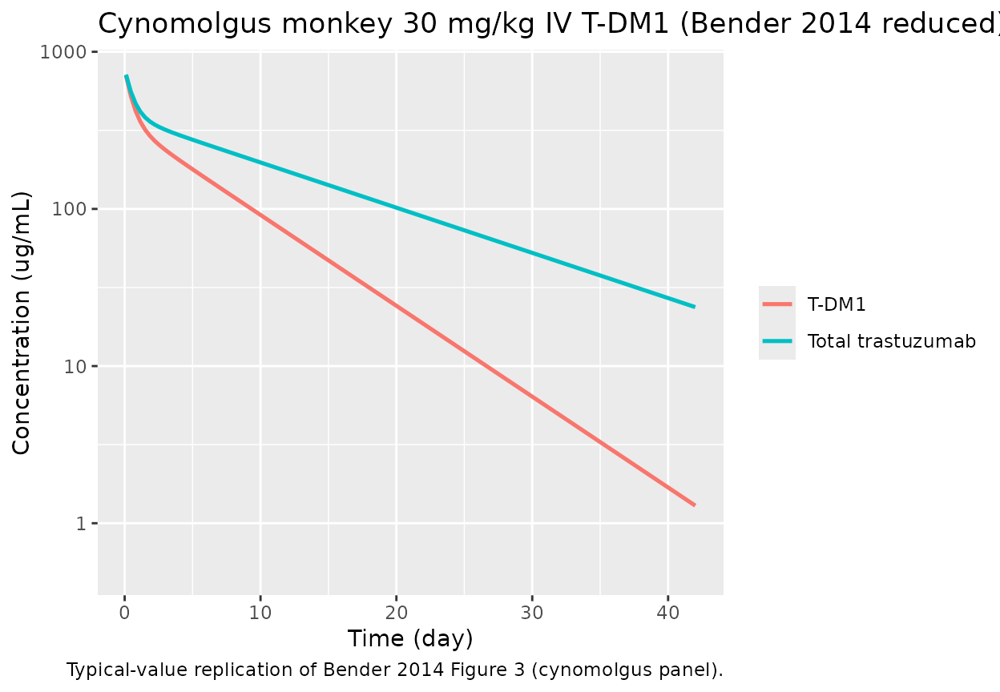
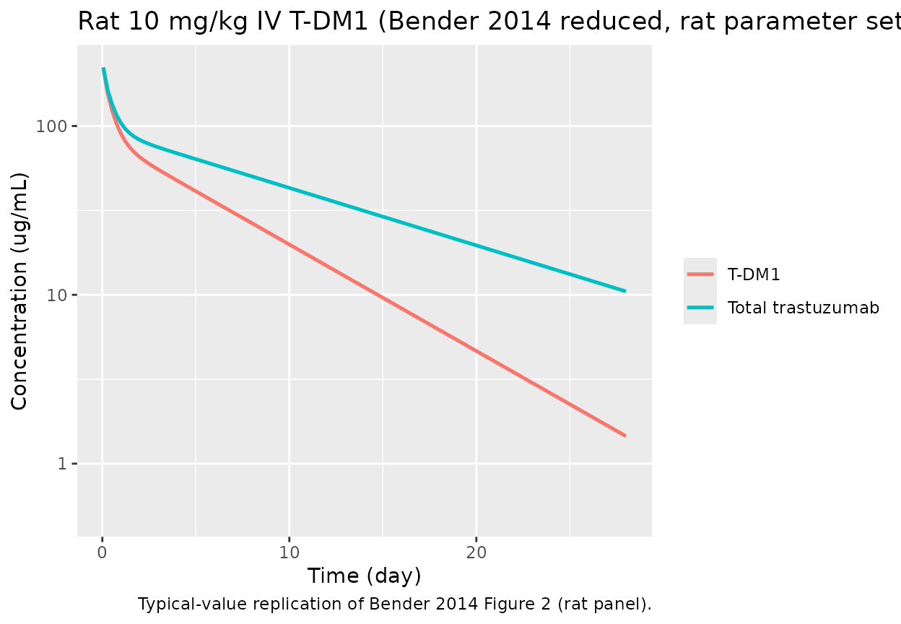

# Trastuzumab emtansine (T-DM1) preclinical reduced PK model (Bender 2014)

``` r
library(nlmixr2lib)
library(rxode2)
#> rxode2 5.0.2 using 2 threads (see ?getRxThreads)
#>   no cache: create with `rxCreateCache()`
library(dplyr)
#> 
#> Attaching package: 'dplyr'
#> The following objects are masked from 'package:stats':
#> 
#>     filter, lag
#> The following objects are masked from 'package:base':
#> 
#>     intersect, setdiff, setequal, union
library(ggplot2)
library(tidyr)
```

## Overview

Bender et al. (2014) developed two preclinical PK models for trastuzumab
emtansine (T-DM1), an antibody-drug conjugate (ADC) of trastuzumab and
the maytansine derivative DM1 linked via SMCC. The dataset combined rat
(n = 34) and cynomolgus monkey (n = 18) PK, plus in vitro plasma
stability.

This vignette exercises the **reduced model** (Bender 2014 Table III),
which collapses the conjugated species into a single lumped “T-DM1”
compartment and tracks naked trastuzumab (DAR0) separately. T-DM1
deconjugates to DAR0 via a single first-order deconjugation clearance
`CL_DEC`. Both forms share the same central / two peripheral volumes and
distributional clearances.

See the companion `Bender_2014_trastuzumabEmtansine_mechanistic` model /
vignette for the full DAR0–DAR7 catenary chain (Bender 2014 Table II).

## Scope and species

Both rat and cynomolgus monkey parameter sets are documented in the
model’s `population$species_parameters` metadata. The
[`ini()`](https://nlmixr2.github.io/rxode2/reference/ini.html) block is
populated with the cynomolgus estimates (Table III, cyno column). The
rat alternates are noted in the in-file comments and can be applied by
updating the fixed effects (converting published mL/day values to L/day
via `/1000`).

``` r
mod <- rxode2::rxode(readModelDb("Bender_2014_trastuzumabEmtansine_reduced"))
#> ℹ parameter labels from comments will be replaced by 'label()'
str(mod$meta$population$species_parameters, max.level = 2)
#> List of 2
#>  $ cynomolgus:List of 9
#>   ..$ source : chr "Bender 2014 Table III, cynomolgus columns"
#>   ..$ CL_TT  : chr "19.9 mL/day (IIV CV 19.8%)"
#>   ..$ V1     : chr "154 mL (IIV CV 7.65%)"
#>   ..$ CLd2   : chr "56.8 mL/day (no IIV)"
#>   ..$ V2     : chr "50.0 mL (no IIV)"
#>   ..$ CLd3   : chr "60.4 mL/day (no IIV)"
#>   ..$ V3     : chr "84.7 mL (IIV CV 27.3%)"
#>   ..$ CL_DEC : chr "22.0 mL/day (IIV CV 11.9%)"
#>   ..$ res_err: chr "9.64% proportional"
#>  $ rat       :List of 10
#>   ..$ source : chr "Bender 2014 Table III, rat columns"
#>   ..$ CL_TT  : chr "2.37 mL/day (IIV CV 24.6%)"
#>   ..$ V1     : chr "10.7 mL (IIV CV 19.8%)"
#>   ..$ CLd2   : chr "59.7 mL/day (no IIV)"
#>   ..$ V2     : chr "2.52 mL (IIV CV 68.0%)"
#>   ..$ CLd3   : chr "13.9 mL/day (no IIV)"
#>   ..$ V3     : chr "15.5 mL (IIV CV 16.5%)"
#>   ..$ CL_DEC : chr "2.24 mL/day (IIV CV 15.3%)"
#>   ..$ res_err: chr "10.9% proportional"
#>   ..$ notes  : chr "Rat fit adds IIV on V2; to switch from the cynomolgus default to the rat parameter set, call ini() on the resul"| __truncated__
```

## Source trace

Every [`ini()`](https://nlmixr2.github.io/rxode2/reference/ini.html)
value in
`inst/modeldb/specificDrugs/Bender_2014_trastuzumabEmtansine_reduced.R`
comes from Bender 2014
([doi:10.1208/s12248-014-9618-3](https://doi.org/10.1208/s12248-014-9618-3)):

| Parameter |       Cynomolgus value |              Rat value | Source    |
|-----------|-----------------------:|-----------------------:|-----------|
| `CL_TT`   | 19.9 mL/day (CV 19.8%) | 2.37 mL/day (CV 24.6%) | Table III |
| `V1`      |      154 mL (CV 7.65%) |     10.7 mL (CV 19.8%) | Table III |
| `CLd2`    |            56.8 mL/day |            59.7 mL/day | Table III |
| `V2`      |                50.0 mL |     2.52 mL (CV 68.0%) | Table III |
| `CLd3`    |            60.4 mL/day |            13.9 mL/day | Table III |
| `V3`      |     84.7 mL (CV 27.3%) |     15.5 mL (CV 16.5%) | Table III |
| `CL_DEC`  | 22.0 mL/day (CV 11.9%) | 2.24 mL/day (CV 15.3%) | Table III |
| Residual  |     9.64% proportional |     10.9% proportional | Table III |

Values in the
[`ini()`](https://nlmixr2.github.io/rxode2/reference/ini.html) block are
expressed in L and L/day (mL and mL/day divided by 1000) so that dose in
mg and volume in L give concentrations in mg/L = ug/mL directly.

## Cynomolgus 30 mg/kg IV single-dose replication

Bender 2014 Figure 3 (bottom panel) displays total trastuzumab (TT) and
T-DM1 concentration–time profiles after a single 30 mg/kg IV T-DM1 DAR
3.1 dose in four cynomolgus monkeys. Reference body weight for
cynomolgus monkeys is ~4 kg, giving a nominal 120 mg absolute dose.

``` r
dose_mg <- 120  # 30 mg/kg * 4 kg body weight
events  <- rxode2::et(amt = dose_mg, cmt = "central", time = 0) |>
  rxode2::et(seq(0.1, 42, length.out = 120), cmt = "Cc")

sim <- rxode2::rxSolve(mod |> rxode2::zeroRe(), events = events)
#> ℹ omega/sigma items treated as zero: 'etalcl', 'etalvc', 'etalvp2', 'etalcldec'
```

``` r
sim_long <- as.data.frame(sim) |>
  pivot_longer(c(Cc, Ctt), names_to = "analyte", values_to = "conc") |>
  mutate(analyte = recode(analyte,
                          Cc  = "T-DM1",
                          Ctt = "Total trastuzumab"))

ggplot(sim_long, aes(time, conc, colour = analyte)) +
  geom_line(size = 0.9) +
  scale_y_log10(limits = c(0.5, NA)) +
  labs(x = "Time (day)", y = "Concentration (ug/mL)",
       colour = NULL,
       title  = "Cynomolgus monkey 30 mg/kg IV T-DM1 (Bender 2014 reduced)",
       caption = "Typical-value replication of Bender 2014 Figure 3 (cynomolgus panel).")
#> Warning: Using `size` aesthetic for lines was deprecated in ggplot2 3.4.0.
#> ℹ Please use `linewidth` instead.
#> This warning is displayed once per session.
#> Call `lifecycle::last_lifecycle_warnings()` to see where this warning was
#> generated.
```



## Rat 10 mg/kg IV single-dose replication

Switching the ini() fixed effects to the Table III rat estimates is a
two-step update: convert published mL and mL/day to L and L/day (divide
by 1000), then pass to
[`ini()`](https://nlmixr2.github.io/rxode2/reference/ini.html) on the
model object. IIV on `V2` is reported in rat but the cyno default ini
has no `etalvp` term, so we illustrate the typical-value simulation
only.

``` r
mod_rat <- mod |>
  ini(
    lcl    = log(0.00237),
    lvc    = log(0.0107),
    lqd2   = log(0.0597),
    lvp    = log(0.00252),
    lqd3   = log(0.0139),
    lvp2   = log(0.0155),
    lcldec = log(0.00224),
    CcpropSd  = 0.109,
    CttpropSd = 0.109
  )
#> ℹ change initial estimate of `lcl` to `-6.0448653238351`
#> ℹ change initial estimate of `lvc` to `-4.53751153751428`
#> ℹ change initial estimate of `lqd2` to `-2.81842325858358`
#> ℹ change initial estimate of `lvp` to `-5.98349637745881`
#> ℹ change initial estimate of `lqd3` to `-4.27586643884549`
#> ℹ change initial estimate of `lvp2` to `-4.16691525505694`
#> ℹ change initial estimate of `lcldec` to `-6.10127941311519`
#> ℹ change initial estimate of `CcpropSd` to `0.109`
#> ℹ change initial estimate of `CttpropSd` to `0.109`

rat_dose <- 3  # 10 mg/kg * 0.3 kg typical rat BW
events_rat <- rxode2::et(amt = rat_dose, cmt = "central", time = 0) |>
  rxode2::et(seq(0.05, 28, length.out = 120), cmt = "Cc")

sim_rat <- rxode2::rxSolve(mod_rat |> rxode2::zeroRe(), events = events_rat)
#> ℹ omega/sigma items treated as zero: 'etalcl', 'etalvc', 'etalvp2', 'etalcldec'
```

``` r
sim_rat_long <- as.data.frame(sim_rat) |>
  pivot_longer(c(Cc, Ctt), names_to = "analyte", values_to = "conc") |>
  mutate(analyte = recode(analyte,
                          Cc  = "T-DM1",
                          Ctt = "Total trastuzumab"))

ggplot(sim_rat_long, aes(time, conc, colour = analyte)) +
  geom_line(size = 0.9) +
  scale_y_log10(limits = c(0.5, NA)) +
  labs(x = "Time (day)", y = "Concentration (ug/mL)",
       colour = NULL,
       title  = "Rat 10 mg/kg IV T-DM1 (Bender 2014 reduced, rat parameter set)",
       caption = "Typical-value replication of Bender 2014 Figure 2 (rat panel).")
```



## Derived terminal half-lives

Bender 2014 Table III reports derived terminal half-lives for total
trastuzumab and T-DM1 in each species. Computing them from the simulated
log-linear terminal phase provides an end-to-end sanity check against
the published values.

``` r
late <- as.data.frame(sim) |>
  filter(time >= 25)

t12 <- function(t, c) log(2) / -coef(lm(log(c) ~ t))[2]
data.frame(
  analyte = c("T-DM1", "Total trastuzumab"),
  simulated_t12_days = c(t12(late$time, late$Cc),
                         t12(late$time, late$Ctt)),
  paper_t12_days = c(5.21, 10.5)
)
#>             analyte simulated_t12_days paper_t12_days
#> 1             T-DM1           5.207294           5.21
#> 2 Total trastuzumab          10.465739          10.50
```

## Assumptions and deviations

- Cynomolgus body weight fixed at 4 kg and rat body weight fixed at 0.3
  kg to convert paper mg/kg doses to absolute mg inputs; the model
  itself does not scale by body weight, matching the paper’s
  absolute-volume parameterization.
- Residual error treated as pure proportional in linear space; Bender
  2014 reports residual error as additive on log-scale, which is
  equivalent to proportional in nlmixr2’s linear space.
- BSV zeroed out with
  [`rxode2::zeroRe()`](https://nlmixr2.github.io/rxode2/reference/zeroRe.html)
  for typical-value replication; Table III IIV estimates remain
  available in
  [`ini()`](https://nlmixr2.github.io/rxode2/reference/ini.html) for
  stochastic simulation.
