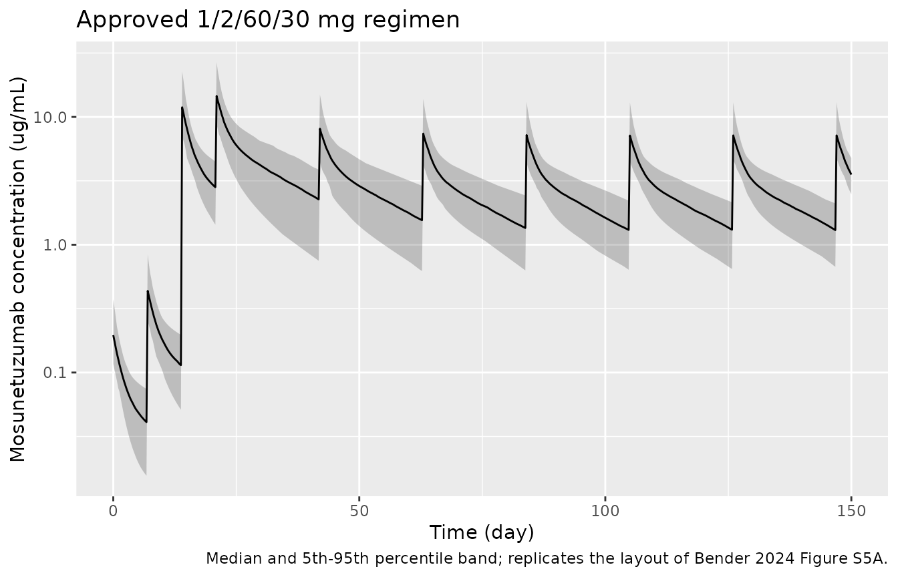
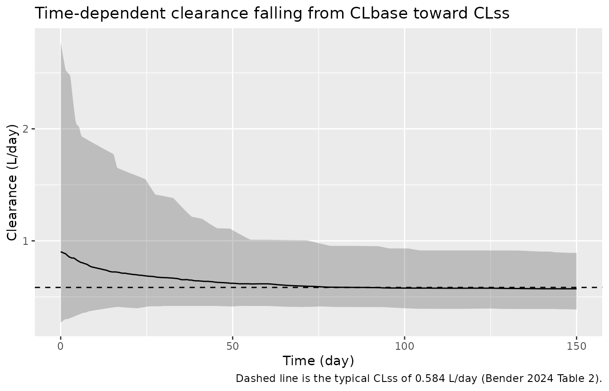
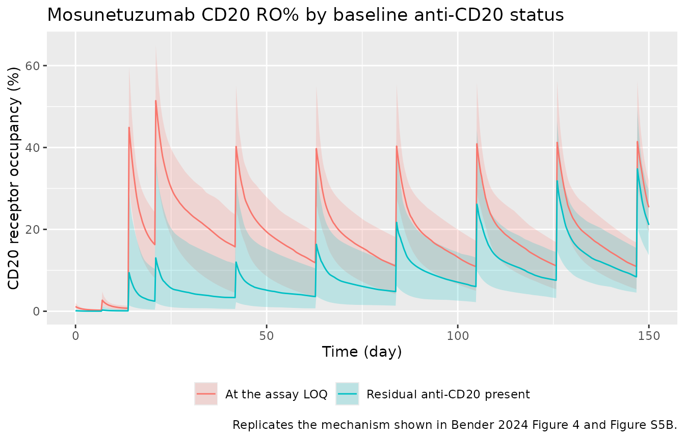

# Mosunetuzumab (Bender 2024)

## Model and source

- Citation: Bender B, Li C-C, Marchand M, Turner DC, Li F, Vadhavkar S,
  Wang B, Deng R, Lu J, Jin J, Li C, Yin S, Wei M, Chanu P. Population
  pharmacokinetics and CD20 binding dynamics for mosunetuzumab in
  relapsed/refractory B-cell non-Hodgkin lymphoma. Clin Transl Sci.
  2024;17(5):e13825. <doi:10.1111/cts.13825>
- Article: <https://doi.org/10.1111/cts.13825> (open access;
  PMC11134317)
- Supplement: `CTS-17-e13825-s001.docx`, retrieved from the EuropePMC
  supplementary-files endpoint for PMC11134317. **Table S3 of that
  supplement is the full NONMEM control stream and is load-bearing for
  this extraction** – the main article renders every governing equation
  as an undecodable formula image, so the covariate functional forms,
  the competing-drug ODEs and the receptor-occupancy expression are
  recoverable only from the control stream.

Mosunetuzumab is a CD20xCD3 T-cell engaging bispecific antibody. Bender
2024 describes a two-compartment IV disposition model with
**time-dependent clearance**, coupled to a competitive
equilibrium-binding calculation of the CD20 **receptor occupancy
percentage (RO%)** that accounts for residual rituximab and obinutuzumab
carried over from patients’ prior lines of therapy.

``` r

mod <- readModelDb("Bender_2024_mosunetuzumab")
mod
#> function() {
#>   description <- "Two-compartment population PK model of mosunetuzumab (CD20xCD3 T-cell engaging bispecific antibody) in adults with relapsed/refractory B-cell non-Hodgkin lymphoma, with time-dependent clearance transitioning from a baseline clearance CLbase to a steady-state clearance CLss with a transition half-life HLtrans. Body weight, sex and tumor SPD act on CLss; albumin and the composite baseline anti-CD20 drug concentration act on CLbase; body weight, albumin and sex act on V1. Residual predose rituximab and obinutuzumab from prior therapy are carried as states decaying at fixed literature terminal half-lives and drive a competitive equilibrium-binding CD20 receptor-occupancy percentage (RO%) observable (Bender 2024)."
#>   reference <- "Bender B, Li C-C, Marchand M, Turner DC, Li F, Vadhavkar S, Wang B, Deng R, Lu J, Jin J, Li C, Yin S, Wei M, Chanu P. Population pharmacokinetics and CD20 binding dynamics for mosunetuzumab in relapsed/refractory B-cell non-Hodgkin lymphoma. Clin Transl Sci. 2024;17(5):e13825. doi:10.1111/cts.13825"
#>   vignette <- "Bender_2024_mosunetuzumab"
#>   units <- list(time = "day", dosing = "mg", concentration = "ug/mL")
#> 
#>   # `ritux` and `obin` hold the residual plasma CONCENTRATION (ug/mL) of a
#>   # competing anti-CD20 antibody left over from the patient's prior lines of
#>   # therapy. They are not amounts, are never dosed, and exist only to supply
#>   # the competing-ligand terms of the receptor-occupancy observable. Bender
#>   # 2024 Table S3 declares them as NONMEM compartments 3 and 5
#>   # (COMP=(RITUXIMAB), COMP=(OBINUTUZUMAB)) for exactly the same reason.
#>   #
#>   # `auc` and `auc_ro` are the paper's own cumulative-endpoint integrators,
#>   # Table S3 compartments 4 and 6 (COMP=(PK_AUC), COMP=(RO_AUC)); they carry
#>   # no drug and follow the established auc_<scope> bookkeeping-state pattern.
#>   paper_specific_compartments <- c("ritux", "obin", "auc", "auc_ro")
#> 
#>   covariateData <- list(
#>     WT = list(
#>       description        = "Baseline body weight",
#>       units              = "kg",
#>       type               = "continuous",
#>       reference_category = NULL,
#>       notes              = "Power model normalised to the cohort median of 78 kg, on CLss, V1 and V2 only. Bender 2024 Table S3 $PK: CLBWT=(BBWT/78)**THETA(8), VBWT=(BBWT/78)**THETA(9), V2BWT=(BBWT/78)**THETA(11). The weight effect on Q, THETA(10), was fixed to 0 and is therefore absent here. Note the $THETA comment block mislabels THETA(8) as 'WT_CLbase', but the code applies it to TVCLSS; Table 2 and the Results text both name the affected parameter as CLss.",
#>       source_name        = "BWT"
#>     ),
#>     ALB = list(
#>       description        = "Baseline serum albumin",
#>       units              = "g/L",
#>       type               = "continuous",
#>       reference_category = NULL,
#>       notes              = "Power model normalised to the cohort median of 39 g/L, acting on both CLbase and V1. Bender 2024 Table S3 $PK: CL0ALBUM=(ALBUMT/39.00)**THETA(12) and V1ALBUM=(ALBUMT/39.00)**THETA(16). The control stream guards a unit-error record with IF(ALBUM.GT.200) ALBUMT=39.00, visible in Table 1 as an implausible 480 g/L maximum; that guard is a data-cleaning step and is not reproduced in model().",
#>       source_name        = "ALBUM"
#>     ),
#>     SEXF = list(
#>       description        = "Female sex indicator (1 = female, 0 = male)",
#>       units              = "(binary)",
#>       type               = "binary",
#>       reference_category = "male (SEXF = 0)",
#>       notes              = "Bender 2024 Table S3 codes SEX = 2 for male (the reference, 64.7% of the cohort) and SEX = 1 for female, and applies the effect as the linear multiplier (1 + THETA), not as a power or exponential term. SEXF = 1 - (SEX == 2) recovers the canonical coding with no change of reference level, so the printed coefficients carry over unchanged.",
#>       source_name        = "SEX"
#>     ),
#>     TUMSZ = list(
#>       description        = "Baseline tumor burden, sum of the products of perpendicular diameters (SPD)",
#>       units              = "mm^2",
#>       type               = "continuous",
#>       reference_category = NULL,
#>       notes              = "Enters on CLss as a power model in the SQUARE ROOT of SPD, normalised to 54.5 mm: Bender 2024 Table S3 $PK LTS2=SQRT(LTS1); CLSSBSPD=(LTS2/54.5)**THETA(14). The reference is exactly sqrt(2970 mm^2) = 54.5 mm, the cohort median SPD of Table 1, and Figure 2 plots the square root of tumor size on its x-axis for this reason. Units are mm^2 SPD, matching the anti-CD20 sibling model Gibiansky_2014_obinutuzumab.R for the same disease.",
#>       source_name        = "BSPD"
#>     ),
#>     CP_RITUXIMAB_UGML = list(
#>       description        = "Observed predose (baseline) plasma rituximab concentration remaining from prior therapy",
#>       units              = "ug/mL",
#>       type               = "continuous",
#>       reference_category = NULL,
#>       notes              = "BASELINE usage: read once at t = 0 to seed the initial condition of the `ritux` state (Bender 2024 Table S3 $PK: A_0(3) = BLRITUX), which then decays at a fixed 24-day terminal half-life. It does NOT carry the clearance covariate effect -- that acts on the composite CP_ACD20_UGML. 195 of 439 patients had detectable residual rituximab; the reported values are floored at the 0.5 ug/mL assay LOQ (Table 1 median 0.500, maximum 151).",
#>       source_name        = "BLRITUX"
#>     ),
#>     CP_OBINUTUZUMAB_UGML = list(
#>       description        = "Observed predose (baseline) plasma obinutuzumab concentration remaining from prior therapy",
#>       units              = "ug/mL",
#>       type               = "continuous",
#>       reference_category = NULL,
#>       notes              = "BASELINE usage: read once at t = 0 to seed the initial condition of the `obin` state (Bender 2024 Table S3 $PK: A_0(5) = BLOBIN), which then decays at a fixed 28-day terminal half-life. 35 of 439 patients had detectable residual obinutuzumab; Table 1 reports a median of 0 with a maximum of 305 ug/mL. Set to 0 for a patient with no prior obinutuzumab exposure.",
#>       source_name        = "BLOBIN"
#>     ),
#>     CP_ACD20_UGML = list(
#>       description        = "Composite baseline anti-CD20 drug concentration: the maximum of the predose rituximab and obinutuzumab concentrations",
#>       units              = "ug/mL",
#>       type               = "continuous",
#>       reference_category = NULL,
#>       notes              = "Bender 2024 Table 1 footnote e: 'aCD20 is the maximum concentration between rituximab and obinutuzumab'; Table S3 derives it as IF(BLOBIN.GT.BLRITUX2) ACD20=BLOBIN / IF(BLRITUX2.GT.BLOBIN) ACD20=BLRITUX2. Supplied as a column rather than computed with max() inside model() because the control stream feeds the covariate an NHL-type-dependent IMPUTED rituximab value (aggressive or unknown NHL -> 2105 ng/mL, indolent NHL -> 500 ng/mL) for the 4.6% of patients with a missing measurement, while seeding the ODE from the raw value. The effect enters as a ratio of LOGARITHMS on the ng/mL scale and is therefore not scale-invariant; see the conversion comment in model().",
#>       source_name        = "ACD20"
#>     )
#>   )
#> 
#>   compartmentData <- list(
#>     central     = list(analyte = "mosunetuzumab", units = "mg", specimen = "plasma", verified = TRUE),
#>     peripheral1 = list(analyte = "mosunetuzumab", units = "mg", specimen = "plasma", verified = TRUE),
#>     ritux       = list(analyte = "rituximab", units = "ug/mL", specimen = "plasma", verified = TRUE),
#>     obin        = list(analyte = "obinutuzumab", units = "ug/mL", specimen = "plasma", verified = TRUE),
#>     auc         = list(analyte = "mosunetuzumab", units = "ug/mL*day", specimen = "not applicable", verified = TRUE),
#>     auc_ro      = list(analyte = "mosunetuzumab", units = "%*day", specimen = "not applicable", verified = TRUE)
#>   )
#> 
#>   population <- list(
#>     species        = "human",
#>     n_subjects     = 439,
#>     n_studies      = 2,
#>     age_range      = "19-96 years",
#>     age_median     = "63 years",
#>     weight_range   = "37.1-163 kg",
#>     weight_median  = "77.9 kg",
#>     sex_female_pct = 35.3,
#>     race_ethnicity = c(White = 75.9, Asian = 17.5, Black = 2.7,
#>                        `American Indian/Alaskan Native` = 0.5, Multiple = 0.5,
#>                        Unknown = 3.0),
#>     disease_state  = "relapsed/refractory B-cell non-Hodgkin lymphoma (61.5% aggressive, 38.3% indolent; DLBCL 35.8%, FL 37.1%, MCL 8.9%, transformed FL 13.0%)",
#>     dose_range     = "0.05-2.8 mg IV q3w fixed dosing (Group A, n = 32) and 0.4/1/2.8 up to 1/2/60/30 mg IV q3w Cycle 1 step-up dosing (Group B, n = 407); 19 dose levels; approved regimen 1/2/60/30 mg IV q3w",
#>     albumin_median = "39 g/L (range 19-480; the 480 g/L maximum is a unit-error record guarded in the control stream)",
#>     tumor_median   = "SPD 2970 mm^2 (range 96.0-70,900)",
#>     prior_therapy  = "median 3 prior lines; ~50% of patients carried residual anti-CD20 drug at baseline (rituximab n = 195, obinutuzumab n = 35, both n = 7)",
#>     notes          = "Study GO29781 (phase I/II), 7250 PK observations from 439 patients after exclusions. Baseline characteristics from Bender 2024 Table 1. Fitted in NONMEM 7.4.3 with ADVAN13/TRANS1 and FOCE-I (Table S3)."
#>   )
#> 
#>   ini({
#>     # ---- Structural disposition (Bender 2024 Table 2, final model estimates) ----
#>     # NOTE: Table S3's $THETA block lists INITIAL estimates (1, 5.4, 0.57, 18,
#>     # 6.1, 1.47, 0.25, ...). Every value below is the FINAL estimate from
#>     # Table 2.
#>     lcl <- log(1.08); label("Baseline clearance CLbase at t = 0 (L/day)") # Bender 2024 Table 2 CLbase = 1.08 L/day (%RSE 5.6; 95% CI 0.962, 1.20)
#>     lcl_exp_inf <- log(0.584); label("Steady-state (asymptotic) clearance CLss (L/day)") # Bender 2024 Table 2 CLss = 0.584 L/day (%RSE 2.0; 95% CI 0.561, 0.607)
#>     lcl_exp_thalf <- log(16.3); label("Half-life of the CLbase to CLss transition, HLtrans (day)") # Bender 2024 Table 2 HLtrans = 16.3 day (%RSE 7.1; 95% CI 14.026, 18.6)
#>     lvc <- log(5.49); label("Central volume of distribution V1 (L)") # Bender 2024 Table 2 V1 = 5.49 L (%RSE 2.5; 95% CI 5.221, 5.76)
#>     lvp <- log(6.17); label("Peripheral volume of distribution V2 (L)") # Bender 2024 Table 2 V2 = 6.17 L (%RSE 3.6; 95% CI 5.729, 6.61)
#>     lq <- log(1.46); label("Intercompartmental clearance Q (L/day)") # Bender 2024 Table 2 Q = 1.46 L/day (%RSE 3.7; 95% CI 1.354, 1.57)
#> 
#>     # ---- Covariate effects (Bender 2024 Table 2) ----
#>     # Body weight enters as a power model on (WT / 78 kg). The weight effect on
#>     # Q is THETA(10) = 0 FIX in Table S3 and is not reported in Table 2, so no
#>     # e_wt_q term exists.
#>     e_wt_cl_exp_inf <- 0.549; label("Power exponent for body weight on CLss (unitless)") # Bender 2024 Table 2 WT_CLss = 0.549 (%RSE 10.5; 95% CI 0.436, 0.662). Table S3 applies THETA(8) to TVCLSS despite its stale 'WT_CLbase' $THETA comment.
#>     e_wt_vc <- 0.433; label("Power exponent for body weight on V1 (unitless)") # Bender 2024 Table 2 WT_V1 = 0.433 (%RSE 13.4; 95% CI 0.319, 0.547)
#>     e_wt_vp <- 0.737; label("Power exponent for body weight on V2 (unitless)") # Bender 2024 Table 2 WT_V2 = 0.737 (%RSE 15.9; 95% CI 0.508, 0.966)
#> 
#>     # Albumin enters as a power model on (ALB / 39 g/L).
#>     e_alb_cl <- -1.51; label("Power exponent for serum albumin on CLbase (unitless)") # Bender 2024 Table 2 ALB_CLbase = -1.51 (%RSE 19.1; 95% CI -2.074, -0.946)
#>     e_alb_vc <- -0.481; label("Power exponent for serum albumin on V1 (unitless)") # Bender 2024 Table 2 ALB_V1 = -0.481 (%RSE 23.3; 95% CI -0.701, -0.261)
#> 
#>     # Composite baseline anti-CD20 drug concentration on CLbase. See the
#>     # ratio-of-logarithms comment in model() -- this exponent is NOT applied to
#>     # a concentration ratio.
#>     e_acd20_cl <- -0.573; label("Power exponent for the composite baseline anti-CD20 concentration on CLbase (unitless)") # Bender 2024 Table 2 aCD20_CLbase = -0.573 (%RSE 20.2; 95% CI -0.800, -0.346)
#> 
#>     # Tumor SPD enters as a power model on sqrt(SPD) / 54.5 mm.
#>     e_tumsz_cl_exp_inf <- 0.0935; label("Power exponent for sqrt(tumor SPD) on CLss (unitless)") # Bender 2024 Table 2 SPD_CLss = 0.0935 (%RSE 26.6; 95% CI 0.045, 0.142)
#> 
#>     # Sex enters as the LINEAR multiplier (1 + theta) for female relative to
#>     # the male reference, not as a power or exponential term (Table S3
#>     # V1SEX / CLSSSEX definition blocks).
#>     e_sexf_cl_exp_inf <- -0.128; label("Fractional change in CLss for female vs male (unitless)") # Bender 2024 Table 2 Sex_CLss = -0.128 (%RSE 18.8; 95% CI -0.175, -0.081); Results: '12.8% slower in female subjects'
#>     e_sexf_vc <- -0.126; label("Fractional change in V1 for female vs male (unitless)") # Bender 2024 Table 2 Sex_V1 = -0.126 (%RSE 18.9; 95% CI -0.173, -0.079); Results: '12.6% lower in female subjects'
#> 
#>     # ---- CD20 equilibrium-binding constants (Bender 2024 Table S3 $PK) ----
#>     # Scatchard-derived dissociation constants, fixed (they are not $THETAs and
#>     # carry no uncertainty). Converted from the control stream's ng/mL to the
#>     # model's declared ug/mL by dividing by 1000; the receptor-occupancy
#>     # expression is a ratio of concentrations, so the conversion is exact
#>     # provided every term shares one scale (see model()).
#>     lkd_mosun <- fixed(log(10.2)); label("Mosunetuzumab CD20 dissociation constant KD (ug/mL)") # Bender 2024 Table S3 KD_TDB = 10200 ng/mL
#>     lkd_ritux <- fixed(log(0.675)); label("Rituximab CD20 dissociation constant KD (ug/mL)") # Bender 2024 Table S3 KD_R = 675 ng/mL
#>     lkd_obin <- fixed(log(0.600)); label("Obinutuzumab CD20 dissociation constant KD (ug/mL)") # Bender 2024 Table S3 KD_G = 600 ng/mL
#> 
#>     # ---- Competing-drug elimination half-lives (Bender 2024 Table S3 $DES) ----
#>     # Fixed to published terminal half-lives, not estimated. Methods: 'Initial
#>     # values for rituximab (Ritux) and obinutuzumab (Obin) model compartments
#>     # were set to the observed baseline value, and elimination rates fixed to
#>     # the respective terminal half-life value: HL_Ritux = 24 days and
#>     # HL_Obin = 28 days.'
#>     lthalf_ritux <- fixed(log(24)); label("Rituximab terminal half-life (day)") # Bender 2024 Table S3 DADT(3) = (-0.693/24)*A(3)
#>     lthalf_obin <- fixed(log(28)); label("Obinutuzumab terminal half-life (day)") # Bender 2024 Table S3 DADT(5) = (-0.693/28)*A(5)
#> 
#>     # ---- Interindividual variability (Bender 2024 Table 2, variances) ----
#>     # $OMEGA BLOCK(2) on (CLbase, V1). Table 2 labels the covariance row with
#>     # the symbol 'omega_CLbase,CLss', but the $OMEGA BLOCK comments in Table S3
#>     # and the reported correlation both identify it as CLbase-V1:
#>     # 0.180 / sqrt(0.426 * 0.0981) = 0.881, matching footnote c's 0.882.
#>     etalcl + etalvc ~ c(0.426,
#>                         0.180, 0.0981) # Bender 2024 Table 2: omega^2 CLbase 0.426 (%RSE 8.4, shrinkage 4.8%), covariance 0.180 (%RSE 7.3), omega^2 V1 0.0981 (%RSE 5.8, shrinkage 4.6%)
#> 
#>     # $OMEGA BLOCK(2) on (CLss, HLtrans); correlation
#>     # -0.0892 / sqrt(0.0343 * 0.739) = -0.560, matching footnote d.
#>     etalcl_exp_inf + etalcl_exp_thalf ~ c(0.0343,
#>                                           -0.0892, 0.739) # Bender 2024 Table 2: omega^2 CLss 0.0343 (%RSE 11.5, shrinkage 33.8%), covariance -0.0892 (%RSE 24.8), omega^2 HLtrans 0.739 (%RSE 15.8, shrinkage 40.9%)
#> 
#>     etalvp ~ 0.0621 # Bender 2024 Table 2 omega^2 V2 = 0.0621 (%RSE 16.7, shrinkage 49.9%)
#> 
#>     # No IIV on Q: Table S3 declares $OMEGA 0 FIX for it and Table 2 reports no
#>     # omega^2 Q row.
#> 
#>     # ---- Residual unexplained variability ----
#>     # Table S3 uses the log-transformed-both-sides pattern: IPRED = LOG(F),
#>     # Y = IPRED + ERR(1)*W with W = THETA(7) and $SIGMA 1 FIX. Additive on the
#>     # log scale is exponential (log-normal) on the linear scale, which Table 2
#>     # footnote e states outright ('Corresponds to proportional on normal
#>     # scale').
#>     expSd <- 0.259; label("Exponential (log-scale additive) residual error SD") # Bender 2024 Table 2 residual variability = 0.259 (%RSE 0.257; 95% CI 0.258, 0.260)
#>   })
#> 
#>   model({
#>     # ---- 1. Derived covariate multipliers ----
#>     # All power models are normalised to the cohort median of the covariate
#>     # (Bender 2024 Table 1): WT 78 kg, ALB 39 g/L, SPD 2970 mm^2. Sex enters as
#>     # a linear (1 + theta) multiplier with male as the reference.
#>     cov_cl_alb <- (ALB / 39)^e_alb_cl
#>     cov_vc_alb <- (ALB / 39)^e_alb_vc
#> 
#>     # The composite anti-CD20 covariate is a power model on the RATIO OF
#>     # LOGARITHMS, not on the concentration ratio:
#>     #   Bender 2024 Table S3: CL0BLRITUX = (LOG(ACD20)/LOG(500))**THETA(13)
#>     # with ACD20 in ng/mL and a reference of 500 ng/mL (= 0.5 ug/mL, the
#>     # rituximab LOQ and the value Figure 2 assigns the typical patient). This
#>     # form is NOT scale-invariant, so the ug/mL column must be converted back
#>     # to ng/mL INSIDE the logarithm -- rewriting it as log(CP_ACD20_UGML/0.5)
#>     # gives a different, and at high concentrations undefined, function.
#>     #
#>     # The naive concentration-ratio reading (ACD20/500)^-0.573 is falsified by
#>     # the paper's own text: at the 95th percentile (55.91 ug/mL) it predicts a
#>     # 93% fall in CLbase, whereas the Results state that 'with the exception of
#>     # albumin, all covariate effects resulted in <=31% change from the typical
#>     # parameter values of CLbase, CLss, and V1 when evaluated at the extremes'.
#>     # The ratio-of-logs form gives 28%, inside that bound. Methods likewise
#>     # says the anti-CD20 concentrations 'were log-transformed'.
#>     cov_cl_acd20 <- (log(CP_ACD20_UGML * 1000) / log(500))^e_acd20_cl
#> 
#>     # Tumor burden enters through the SQUARE ROOT of SPD, referenced to
#>     # sqrt(2970 mm^2) = 54.5 mm (Bender 2024 Table S3 CLSSBSPD block).
#>     cov_cl_exp_inf_tumsz <- (sqrt(TUMSZ) / 54.5)^e_tumsz_cl_exp_inf
#> 
#>     # ---- 2. Individual parameters ----
#>     # CLbase carries albumin and aCD20; CLss carries body weight, sex and
#>     # tumor SPD; V1 carries body weight, albumin and sex; V2 carries body
#>     # weight only; Q carries no covariate (its weight exponent was fixed to 0).
#>     clbase <- exp(lcl + etalcl) * cov_cl_alb * cov_cl_acd20
#>     cl_exp_inf <- exp(lcl_exp_inf + etalcl_exp_inf) * (WT / 78)^e_wt_cl_exp_inf *
#>       cov_cl_exp_inf_tumsz * (1 + e_sexf_cl_exp_inf * SEXF)
#>     cl_exp_thalf <- exp(lcl_exp_thalf + etalcl_exp_thalf)
#>     vc <- exp(lvc + etalvc) * (WT / 78)^e_wt_vc * cov_vc_alb * (1 + e_sexf_vc * SEXF)
#>     vp <- exp(lvp + etalvp) * (WT / 78)^e_wt_vp
#>     q <- exp(lq)
#> 
#>     kd_mosun <- exp(lkd_mosun)
#>     kd_ritux <- exp(lkd_ritux)
#>     kd_obin <- exp(lkd_obin)
#>     kel_ritux <- log(2) / exp(lthalf_ritux)
#>     kel_obin <- log(2) / exp(lthalf_obin)
#> 
#>     # ---- 3. Time-dependent clearance and micro-constants ----
#>     # Bender 2024 supplement Table S1, Model 2 (the selected model):
#>     #   CL = CLbase + (CLss - CLbase) * {1 - exp[-(ln(2)/HLtrans) * t]}
#>     # so CL starts at CLbase, decays exponentially and approaches CLss. Table
#>     # S3's $DES writes the same expression with 0.693 substituted for ln(2);
#>     # log(2) is used here because it is the form the published equation
#>     # prints.
#>     #
#>     # `time` is elapsed simulation time from t = 0, which for this analysis is
#>     # the first mosunetuzumab dose (Table S3 uses NONMEM's $DES variable T).
#>     cl <- clbase + (cl_exp_inf - clbase) * (1 - exp(-log(2) / cl_exp_thalf * time))
#> 
#>     k12 <- q / vc
#>     k21 <- q / vp
#> 
#>     # ---- 4. ODE system ----
#>     d/dt(central) <- -cl / vc * central - k12 * central + k21 * peripheral1
#>     d/dt(peripheral1) <- k12 * central - k21 * peripheral1
#> 
#>     # Residual competing anti-CD20 antibody from prior therapy. These states
#>     # hold CONCENTRATIONS (ug/mL), are seeded from the patient's observed
#>     # predose value, and decay first-order at a fixed literature terminal
#>     # half-life. They are never dosed.
#>     ritux(0) <- CP_RITUXIMAB_UGML
#>     obin(0) <- CP_OBINUTUZUMAB_UGML
#>     d/dt(ritux) <- -kel_ritux * ritux
#>     d/dt(obin) <- -kel_obin * obin
#> 
#>     # ---- 5. Observation, receptor occupancy and cumulative endpoints ----
#>     Cc <- central / vc
#> 
#>     # Bender 2024 Equation 1 / Table S3 DADT(6). Competitive equilibrium
#>     # binding of mosunetuzumab, rituximab and obinutuzumab to CD20:
#>     #   RO% = 100*Cmosun / (Cmosun + KD_M + (KD_M/KD_R)*Critux + (KD_M/KD_G)*Cobin)
#>     # The published expression multiplies each concentration by 1000 to work in
#>     # ng/mL against ng/mL dissociation constants. Because RO% is a ratio in
#>     # which every term carries the same concentration units, the factor cancels
#>     # exactly; here all four concentrations and all three KDs are in ug/mL.
#>     RO <- 100 * Cc / (Cc + kd_mosun + (kd_mosun / kd_ritux) * ritux +
#>                         (kd_mosun / kd_obin) * obin)
#> 
#>     # Cumulative exposure endpoints, carried as states so that the paper's
#>     # AUC0-42 (Table S2, Figure 2) and average-RO metrics are available
#>     # directly from a solve. Bender 2024 Table S3 DADT(4) and DADT(6).
#>     d/dt(auc) <- Cc
#>     d/dt(auc_ro) <- RO
#> 
#>     Cc ~ lnorm(expSd)
#>   })
#> }
#> <environment: 0x55870a13c1e0>
```

## Population

The model was fit to 7250 mosunetuzumab PK observations from 439
patients with relapsed/refractory B-cell non-Hodgkin lymphoma enrolled
in study GO29781 (Bender 2024 Table 1). Median age was 63 years (range
19-96), median body weight 77.9 kg (37.1-163), median albumin 39 g/L and
median baseline tumor SPD 2970 mm^2 (96-70,900). 35.3% were female;
75.9% White, 17.5% Asian, 2.7% Black. Histology was 61.5% aggressive and
38.3% indolent NHL. Patients received 19 different dose levels across a
q3w fixed-dosing group (Group A, n = 32, 0.05-2.8 mg) and a Cycle 1
step-up group (Group B, n = 407, 0.4/1/2.8 mg up to the approved
1/2/60/30 mg regimen).

The defining feature of this population is prior anti-CD20 exposure:
roughly half the patients still carried measurable drug at their first
mosunetuzumab dose (rituximab n = 195, obinutuzumab n = 35, both n = 7),
with a median residual concentration of 10 ug/mL among those affected.

The same information is available programmatically:

``` r

str(readModelDb("Bender_2024_mosunetuzumab")()$population)
#> List of 15
#>  $ species       : chr "human"
#>  $ n_subjects    : num 439
#>  $ n_studies     : num 2
#>  $ age_range     : chr "19-96 years"
#>  $ age_median    : chr "63 years"
#>  $ weight_range  : chr "37.1-163 kg"
#>  $ weight_median : chr "77.9 kg"
#>  $ sex_female_pct: num 35.3
#>  $ race_ethnicity: Named num [1:6] 75.9 17.5 2.7 0.5 0.5 3
#>   ..- attr(*, "names")= chr [1:6] "White" "Asian" "Black" "American Indian/Alaskan Native" ...
#>  $ disease_state : chr "relapsed/refractory B-cell non-Hodgkin lymphoma (61.5% aggressive, 38.3% indolent; DLBCL 35.8%, FL 37.1%, MCL 8"| __truncated__
#>  $ dose_range    : chr "0.05-2.8 mg IV q3w fixed dosing (Group A, n = 32) and 0.4/1/2.8 up to 1/2/60/30 mg IV q3w Cycle 1 step-up dosin"| __truncated__
#>  $ albumin_median: chr "39 g/L (range 19-480; the 480 g/L maximum is a unit-error record guarded in the control stream)"
#>  $ tumor_median  : chr "SPD 2970 mm^2 (range 96.0-70,900)"
#>  $ prior_therapy : chr "median 3 prior lines; ~50% of patients carried residual anti-CD20 drug at baseline (rituximab n = 195, obinutuz"| __truncated__
#>  $ notes         : chr "Study GO29781 (phase I/II), 7250 PK observations from 439 patients after exclusions. Baseline characteristics f"| __truncated__
```

## Source trace

Every `ini()` entry in
`inst/modeldb/specificDrugs/Bender_2024_mosunetuzumab.R` carries an
in-file comment naming its source location. They are collected here for
review.

| Equation / parameter | Value | Source location |
|----|----|----|
| `lcl` (CLbase) | 1.08 L/day | Bender 2024 Table 2 |
| `lcl_exp_inf` (CLss) | 0.584 L/day | Bender 2024 Table 2 |
| `lcl_exp_thalf` (HLtrans) | 16.3 day | Bender 2024 Table 2 |
| `lvc` (V1) | 5.49 L | Bender 2024 Table 2 |
| `lvp` (V2) | 6.17 L | Bender 2024 Table 2 |
| `lq` (Q) | 1.46 L/day | Bender 2024 Table 2 |
| `e_wt_cl_exp_inf` | 0.549 | Bender 2024 Table 2 (WT on CLss) |
| `e_wt_vc` | 0.433 | Bender 2024 Table 2 (WT on V1) |
| `e_wt_vp` | 0.737 | Bender 2024 Table 2 (WT on V2) |
| `e_alb_cl` | -1.51 | Bender 2024 Table 2 (ALB on CLbase) |
| `e_alb_vc` | -0.481 | Bender 2024 Table 2 (ALB on V1) |
| `e_acd20_cl` | -0.573 | Bender 2024 Table 2 (aCD20 on CLbase) |
| `e_tumsz_cl_exp_inf` | 0.0935 | Bender 2024 Table 2 (SPD on CLss) |
| `e_sexf_cl_exp_inf` | -0.128 | Bender 2024 Table 2 (Sex on CLss) |
| `e_sexf_vc` | -0.126 | Bender 2024 Table 2 (Sex on V1) |
| `lkd_mosun`, `lkd_ritux`, `lkd_obin` | 10.2, 0.675, 0.600 ug/mL | Bender 2024 Table S3 `$PK` (`KD_TDB`, `KD_R`, `KD_G`, printed in ng/mL) |
| `lthalf_ritux`, `lthalf_obin` | 24, 28 day | Bender 2024 Methods; Table S3 `$DES` `DADT(3)`, `DADT(5)` |
| `etalcl + etalvc` block | 0.426 / 0.180 / 0.0981 | Bender 2024 Table 2 |
| `etalcl_exp_inf + etalcl_exp_thalf` block | 0.0343 / -0.0892 / 0.739 | Bender 2024 Table 2 |
| `etalvp` | 0.0621 | Bender 2024 Table 2 |
| `expSd` | 0.259 | Bender 2024 Table 2 (additive on log scale) |
| CL(t) transition equation | n/a | Bender 2024 Table S1 Model 2; Table S3 `$DES` `CLT` |
| Weight / albumin / tumor power models | n/a | Bender 2024 Table S3 `$PK` definition blocks |
| aCD20 ratio-of-logs covariate | n/a | Bender 2024 Table S3 `$PK` `CL0BLRITUX` |
| Sex linear `(1 + theta)` multiplier | n/a | Bender 2024 Table S3 `$PK` `V1SEX`, `CLSSSEX` |
| Rituximab / obinutuzumab decay ODEs | n/a | Bender 2024 Table S3 `$DES` `DADT(3)`, `DADT(5)` |
| RO% equilibrium-binding expression | n/a | Bender 2024 Equation 1; Table S3 `$DES` `DADT(6)` |

## Structural checks against the published equations

These checks use the typical-value model (`zeroRe()`), so they are fully
deterministic: no random draw, no seed, and no dependence on solver
thread count. Every constant on the right-hand side is transcribed from
the paper, so each check can go red if a value in the model file is
wrong.

``` r

mod_typ <- rxode2::zeroRe(mod)
#> ℹ parameter labels from comments will be replaced by 'label()'

# Approved regimen (Bender 2024 Introduction): 1 mg Day 1, 2 mg Day 8, two
# 60 mg loading doses on Days 15 and 22, then 30 mg q3w beginning Day 43.
# Time origin t = 0 is Day 1.
dose_times <- c(0, 7, 14, 21)
dose_amts  <- c(1, 2, 60, 60)
maint_time <- 42

typical_covariates <- function(d,
                               WT = 78, ALB = 39, SEXF = 0, TUMSZ = 2970,
                               ritux = 0.5, obin = 0) {
  d$WT <- WT
  d$ALB <- ALB
  d$SEXF <- SEXF
  d$TUMSZ <- TUMSZ
  d$CP_RITUXIMAB_UGML <- ritux
  d$CP_OBINUTUZUMAB_UGML <- obin
  # Bender 2024 Table 1 footnote e: aCD20 is the maximum of the two.
  d$CP_ACD20_UGML <- pmax(ritux, obin)
  d
}

# Sample the peak exactly: mosunetuzumab is given as an IV bolus in this
# model, so Cmax sits at the dose time itself. A grid that only lands near
# the dose turns max(Cc) into a sampling artefact.
obs_times <- sort(unique(c(
  seq(0, 200, by = 0.25),
  dose_times + 1e-6,
  seq(maint_time, 200, by = 21) + 1e-6
)))

ev_typ <- rxode2::et(amt = dose_amts, time = dose_times, cmt = "central") |>
  rxode2::et(amt = 30, time = maint_time, ii = 21, addl = 7, cmt = "central") |>
  rxode2::et(obs_times, cmt = "central")

sim_typ <- rxode2::rxSolve(
  mod_typ,
  typical_covariates(as.data.frame(ev_typ)),
  returnType = "data.frame"
)
#> ℹ omega/sigma items treated as zero: 'etalcl', 'etalvc', 'etalcl_exp_inf', 'etalcl_exp_thalf', 'etalvp'

at_time <- function(d, tt) d[which.min(abs(d$time - tt)), ]
```

### Time-dependent clearance

Bender 2024 supplement Table S1 selects Model 2,
`CL = CLbase + (CLss - CLbase) * {1 - exp[-(ln(2)/HLtrans) * t]}`. The
check below compares the model’s solved `cl` against that closed form
evaluated with the **printed Table 2 estimates**, so a mis-transcribed
CLbase, CLss or HLtrans breaks it.

``` r

CLBASE  <- 1.08   # Bender 2024 Table 2
CLSS    <- 0.584  # Bender 2024 Table 2
HLTRANS <- 16.3   # Bender 2024 Table 2

cl_closed <- CLSS + (CLBASE - CLSS) * exp(-log(2) / HLTRANS * sim_typ$time)
cl_reldiff <- abs(sim_typ$cl - cl_closed) / cl_closed

# Deterministic comparison against hard-coded published values, so a tight
# bound is correct (this is NOT a cohort statistic). The residual is 3.9e-6,
# not zero, because the tumor covariate's reference is the ROUNDED 54.5 mm
# rather than the exact sqrt(2970) = 54.4977 mm, leaving the typical patient
# a factor (54.4977/54.5)^0.0935 = 1 - 3.9e-6 away from a bare CLss. Any real
# transcription error in CLbase, CLss or HLtrans is a percent-level effect,
# so 1e-4 still goes red on one.
stopifnot(max(cl_reldiff) < 1e-4)

# The paper's own summary of the transition: "CLss dominates after 54 days
# (i.e., 3.3 * HLtrans corresponds to 90% of steady state)". 1 - 2^-3.3
# = 0.8985, so the exponential reading is confirmed to three digits. A
# Hill/Emax-in-time transition would give 3.3/4.3 = 77% and fail here.
frac_complete <- (CLBASE - at_time(sim_typ, 3.3 * HLTRANS)$cl) / (CLBASE - CLSS)
stopifnot(abs(frac_complete - 0.90) < 0.01)

data.frame(
  Check = c("CL(0) = CLbase", "CL(HLtrans) midpoint", "CL(inf) = CLss",
            "Fraction complete at 3.3*HLtrans"),
  Model = c(at_time(sim_typ, 0)$cl, at_time(sim_typ, HLTRANS)$cl,
            at_time(sim_typ, 200)$cl, frac_complete),
  Published = c(CLBASE, CLSS + (CLBASE - CLSS) * 0.5, CLSS, 0.90)
) |>
  knitr::kable(digits = 4, caption = "Time-dependent clearance versus Bender 2024 Table S1 Model 2 and Table 2.")
```

| Check                             |  Model | Published |
|:----------------------------------|-------:|----------:|
| CL(0) = CLbase                    | 1.0800 |     1.080 |
| CL(HLtrans) midpoint              | 0.8325 |     0.832 |
| CL(inf) = CLss                    | 0.5841 |     0.584 |
| Fraction complete at 3.3\*HLtrans | 0.8983 |     0.900 |

Time-dependent clearance versus Bender 2024 Table S1 Model 2 and Table
2. {.table}

### Residual competing-drug decay

Bender 2024 Methods: *“Initial values for rituximab (Ritux) and
obinutuzumab (Obin) model compartments were set to the observed baseline
value, and elimination rates fixed to the respective terminal half-life
value: HL_Ritux = 24 days and HL_Obin = 28 days.”* Each state must
therefore start at the patient’s supplied baseline and halve exactly
once over its half-life.

``` r

sim_cd <- rxode2::rxSolve(
  mod_typ,
  typical_covariates(as.data.frame(ev_typ), ritux = 20, obin = 40),
  returnType = "data.frame"
)
#> ℹ omega/sigma items treated as zero: 'etalcl', 'etalvc', 'etalcl_exp_inf', 'etalcl_exp_thalf', 'etalvp'

stopifnot(
  abs(at_time(sim_cd, 0)$ritux - 20) < 1e-6,   # seeded from CP_RITUXIMAB_UGML
  abs(at_time(sim_cd, 0)$obin  - 40) < 1e-6,   # seeded from CP_OBINUTUZUMAB_UGML
  abs(at_time(sim_cd, 24)$ritux / 20 - 0.5) < 1e-6,  # 24-day half-life
  abs(at_time(sim_cd, 28)$obin  / 40 - 0.5) < 1e-6   # 28-day half-life
)
```

### Covariate effects at the distribution extremes

Bender 2024 Results state: *“With the exception of albumin, all
covariate effects resulted in \<= 31% change from the typical parameter
values of CLbase, CLss, and V1 when evaluated at the extremes (i.e., 5th
and 95th percentiles) of their distributions. Patients with albumin
levels of 28 g/L (5th percentile) had 65% higher CLbase values than the
typical patient.”*

Both statements are reproduced below directly from the model.

``` r

param_at <- function(param, ...) {
  s <- rxode2::rxSolve(
    mod_typ,
    typical_covariates(as.data.frame(ev_typ), ...),
    returnType = "data.frame"
  )
  s[[param]][1]
}

ref <- c(
  clbase     = param_at("clbase"),
  cl_exp_inf = param_at("cl_exp_inf"),
  vc         = param_at("vc")
)
#> ℹ omega/sigma items treated as zero: 'etalcl', 'etalvc', 'etalcl_exp_inf', 'etalcl_exp_thalf', 'etalvp'
#> ℹ omega/sigma items treated as zero: 'etalcl', 'etalvc', 'etalcl_exp_inf', 'etalcl_exp_thalf', 'etalvp'
#> ℹ omega/sigma items treated as zero: 'etalcl', 'etalvc', 'etalcl_exp_inf', 'etalcl_exp_thalf', 'etalvp'

cov_tab <- dplyr::bind_rows(
  data.frame(Covariate = "Albumin 28 g/L (5th pct)",   Parameter = "CLbase",
             Ratio = param_at("clbase", ALB = 28) / ref[["clbase"]]),
  data.frame(Covariate = "Albumin 46 g/L (95th pct)",  Parameter = "CLbase",
             Ratio = param_at("clbase", ALB = 46) / ref[["clbase"]]),
  data.frame(Covariate = "aCD20 55.91 ug/mL (95th pct)", Parameter = "CLbase",
             Ratio = param_at("clbase", ritux = 55.91) / ref[["clbase"]]),
  data.frame(Covariate = "Weight 50 kg (5th pct)",     Parameter = "CLss",
             Ratio = param_at("cl_exp_inf", WT = 50) / ref[["cl_exp_inf"]]),
  data.frame(Covariate = "Weight 112 kg (95th pct)",   Parameter = "CLss",
             Ratio = param_at("cl_exp_inf", WT = 112) / ref[["cl_exp_inf"]]),
  data.frame(Covariate = "Female",                     Parameter = "CLss",
             Ratio = param_at("cl_exp_inf", SEXF = 1) / ref[["cl_exp_inf"]]),
  data.frame(Covariate = "Tumor SPD 400 mm^2 (5th pct)",   Parameter = "CLss",
             Ratio = param_at("cl_exp_inf", TUMSZ = 400) / ref[["cl_exp_inf"]]),
  data.frame(Covariate = "Tumor SPD 13,900 mm^2 (95th pct)", Parameter = "CLss",
             Ratio = param_at("cl_exp_inf", TUMSZ = 13900) / ref[["cl_exp_inf"]]),
  data.frame(Covariate = "Female",                     Parameter = "V1",
             Ratio = param_at("vc", SEXF = 1) / ref[["vc"]]),
  data.frame(Covariate = "Albumin 28 g/L (5th pct)",   Parameter = "V1",
             Ratio = param_at("vc", ALB = 28) / ref[["vc"]])
)
#> ℹ omega/sigma items treated as zero: 'etalcl', 'etalvc', 'etalcl_exp_inf', 'etalcl_exp_thalf', 'etalvp'
#> ℹ omega/sigma items treated as zero: 'etalcl', 'etalvc', 'etalcl_exp_inf', 'etalcl_exp_thalf', 'etalvp'
#> ℹ omega/sigma items treated as zero: 'etalcl', 'etalvc', 'etalcl_exp_inf', 'etalcl_exp_thalf', 'etalvp'
#> ℹ omega/sigma items treated as zero: 'etalcl', 'etalvc', 'etalcl_exp_inf', 'etalcl_exp_thalf', 'etalvp'
#> ℹ omega/sigma items treated as zero: 'etalcl', 'etalvc', 'etalcl_exp_inf', 'etalcl_exp_thalf', 'etalvp'
#> ℹ omega/sigma items treated as zero: 'etalcl', 'etalvc', 'etalcl_exp_inf', 'etalcl_exp_thalf', 'etalvp'
#> ℹ omega/sigma items treated as zero: 'etalcl', 'etalvc', 'etalcl_exp_inf', 'etalcl_exp_thalf', 'etalvp'
#> ℹ omega/sigma items treated as zero: 'etalcl', 'etalvc', 'etalcl_exp_inf', 'etalcl_exp_thalf', 'etalvp'
#> ℹ omega/sigma items treated as zero: 'etalcl', 'etalvc', 'etalcl_exp_inf', 'etalcl_exp_thalf', 'etalvp'
#> ℹ omega/sigma items treated as zero: 'etalcl', 'etalvc', 'etalcl_exp_inf', 'etalcl_exp_thalf', 'etalvp'
cov_tab$`Change (%)` <- 100 * (cov_tab$Ratio - 1)

knitr::kable(cov_tab, digits = 3,
             caption = "Covariate effects at the 5th / 95th percentiles of their distributions.")
```

| Covariate                        | Parameter | Ratio | Change (%) |
|:---------------------------------|:----------|------:|-----------:|
| Albumin 28 g/L (5th pct)         | CLbase    | 1.649 |     64.930 |
| Albumin 46 g/L (95th pct)        | CLbase    | 0.779 |    -22.063 |
| aCD20 55.91 ug/mL (95th pct)     | CLbase    | 0.724 |    -27.646 |
| Weight 50 kg (5th pct)           | CLss      | 0.783 |    -21.662 |
| Weight 112 kg (95th pct)         | CLss      | 1.220 |     21.972 |
| Female                           | CLss      | 0.872 |    -12.800 |
| Tumor SPD 400 mm^2 (5th pct)     | CLss      | 0.911 |     -8.947 |
| Tumor SPD 13,900 mm^2 (95th pct) | CLss      | 1.075 |      7.482 |
| Female                           | V1        | 0.874 |    -12.600 |
| Albumin 28 g/L (5th pct)         | V1        | 1.173 |     17.279 |

Covariate effects at the 5th / 95th percentiles of their distributions.
{.table}

``` r


# Statement 1, exact: albumin 28 g/L gives 65% higher CLbase.
alb_low <- cov_tab$Ratio[cov_tab$Covariate == "Albumin 28 g/L (5th pct)" &
                           cov_tab$Parameter == "CLbase"]
stopifnot(abs(alb_low - 1.65) < 0.005)

# Statement 2: every NON-albumin effect changes its parameter by <= 31%.
non_alb <- cov_tab[!grepl("^Albumin", cov_tab$Covariate), ]
stopifnot(max(abs(non_alb$Ratio - 1)) <= 0.31)

# The sex effect is a linear (1 + theta) multiplier, so it must reproduce the
# Results text exactly: "12.8% slower" on CLss and "12.6% lower" on V1.
stopifnot(
  abs(cov_tab$Ratio[cov_tab$Covariate == "Female" & cov_tab$Parameter == "CLss"] - 0.872) < 1e-6,
  abs(cov_tab$Ratio[cov_tab$Covariate == "Female" & cov_tab$Parameter == "V1"]   - 0.874) < 1e-6
)
```

#### Why the aCD20 covariate is a ratio of logarithms

Bender 2024 Table S3 writes the effect as
`CL0BLRITUX = (LOG(ACD20)/LOG(500))**THETA(13)`, with `ACD20` in
**ng/mL**. That is a power model on the *ratio of logarithms*, not on
the concentration ratio, and the article’s generic covariate notation
does not distinguish the two. The paper’s own `<= 31%` statement settles
it, and this check records the falsification so a future reader cannot
silently “simplify” the model back to the naive form.

``` r

acd20_95 <- 55.91  # ug/mL, the 95th percentile (Bender 2024 Figure 2)
THETA_ACD20 <- -0.573

ratio_of_logs   <- (log(acd20_95 * 1000) / log(500))^THETA_ACD20
concentration_ratio <- (acd20_95 * 1000 / 500)^THETA_ACD20

data.frame(
  Reading = c("Ratio of logarithms (implemented)", "Concentration ratio (rejected)"),
  `CLbase fold change` = c(ratio_of_logs, concentration_ratio),
  `Change (%)` = 100 * (c(ratio_of_logs, concentration_ratio) - 1),
  `Within the paper's 31% bound` = c(abs(ratio_of_logs - 1) <= 0.31,
                                     abs(concentration_ratio - 1) <= 0.31),
  check.names = FALSE
) |>
  knitr::kable(digits = 3,
               caption = "The two readings of the aCD20 covariate. Only the ratio-of-logarithms form is compatible with Bender 2024's statement that no non-albumin covariate moves a typical parameter by more than 31%.")
```

| Reading | CLbase fold change | Change (%) | Within the paper’s 31% bound |
|:---|---:|---:|:---|
| Ratio of logarithms (implemented) | 0.724 | -27.646 | TRUE |
| Concentration ratio (rejected) | 0.067 | -93.298 | FALSE |

The two readings of the aCD20 covariate. Only the ratio-of-logarithms
form is compatible with Bender 2024’s statement that no non-albumin
covariate moves a typical parameter by more than 31%. {.table}

``` r


stopifnot(
  abs(ratio_of_logs - 1) <= 0.31,        # implemented form is admissible
  abs(concentration_ratio - 1) > 0.31    # naive form is falsified by the paper
)
```

## Receptor occupancy (Equation 1)

Bender 2024 Equation 1 / Table S3 `DADT(6)` gives the competitive
equilibrium-binding receptor occupancy

``` math
\mathrm{RO\%} = \frac{100 \cdot C_{\mathrm{mosun}}}
  {C_{\mathrm{mosun}} + K_{D,\mathrm{mosun}}
   + \frac{K_{D,\mathrm{mosun}}}{K_{D,\mathrm{ritux}}} C_{\mathrm{ritux}}
   + \frac{K_{D,\mathrm{mosun}}}{K_{D,\mathrm{obin}}} C_{\mathrm{obin}}}
```

with Scatchard dissociation constants `KD_TDB = 10200`, `KD_R = 675` and
`KD_G = 600` ng/mL. The published expression works in ng/mL; because RO%
is a ratio in which every term carries the same concentration units, the
model carries all four concentrations and all three KDs in ug/mL
instead, which is exact.

### The model’s RO output matches the published expression

``` r

KD_M <- 10.2; KD_R <- 0.675; KD_G <- 0.600  # ug/mL; Bender 2024 Table S3

sim_ro <- rxode2::rxSolve(
  mod_typ,
  typical_covariates(as.data.frame(ev_typ), ritux = 12, obin = 30),
  returnType = "data.frame"
)
#> ℹ omega/sigma items treated as zero: 'etalcl', 'etalvc', 'etalcl_exp_inf', 'etalcl_exp_thalf', 'etalvp'

ro_closed <- 100 * sim_ro$Cc /
  (sim_ro$Cc + KD_M + (KD_M / KD_R) * sim_ro$ritux + (KD_M / KD_G) * sim_ro$obin)

stopifnot(max(abs(sim_ro$RO - ro_closed)) < 1e-9)
```

### Figure 4: the published individual RO values are self-consistent

Bender 2024 Figure 4 reports Day-21 RO% for four individual patients on
the 1/2/60/30 regimen. The two patients in the top row are described as
having *“similar”* mosunetuzumab concentrations but RO% of **55%** and
**0.86%** – the second patient carried 160 ug/mL of residual
obinutuzumab.

Inverting Equation 1 for each patient must therefore return roughly the
same mosunetuzumab concentration. This is a strong test of the
competing-ligand structure specifically: it exercises the `KD_M / KD_G`
scaling factor, which is the part of the equation the article text does
not spell out.

``` r

invert_ro <- function(ro_pct, ritux, obin) {
  # Solve RO = 100*C/(C + D) for C, where D collects the competing terms.
  D <- KD_M + (KD_M / KD_R) * ritux + (KD_M / KD_G) * obin
  ro_pct * D / (100 - ro_pct)
}

fig4 <- data.frame(
  Patient = c("Top left (R 0.5, no G)", "Top right (R 0.5, G 160)"),
  `RO% at Day 21` = c(55, 0.86),
  `Rituximab (ug/mL)` = c(0.5, 0.5),
  `Obinutuzumab (ug/mL)` = c(0, 160),
  check.names = FALSE
)
fig4$`Implied Cmosun (ug/mL)` <- invert_ro(fig4$`RO% at Day 21`,
                                           fig4$`Rituximab (ug/mL)`,
                                           fig4$`Obinutuzumab (ug/mL)`)

# Falsification arm: drop the KD_M/KD_G scaling on the obinutuzumab term, as
# a reader might if they took "competing concentration" literally.
invert_ro_unscaled <- function(ro_pct, ritux, obin) {
  D <- KD_M + (KD_M / KD_R) * ritux + obin
  ro_pct * D / (100 - ro_pct)
}
fig4$`Implied Cmosun, unscaled obin term` <-
  invert_ro_unscaled(fig4$`RO% at Day 21`, fig4$`Rituximab (ug/mL)`,
                     fig4$`Obinutuzumab (ug/mL)`)

knitr::kable(fig4, digits = 3,
             caption = "Inverting Bender 2024 Equation 1 on the two Figure 4 patients the paper describes as having similar mosunetuzumab concentrations.")
```

| Patient | RO% at Day 21 | Rituximab (ug/mL) | Obinutuzumab (ug/mL) | Implied Cmosun (ug/mL) | Implied Cmosun, unscaled obin term |
|:---|---:|---:|---:|---:|---:|
| Top left (R 0.5, no G) | 55.00 | 0.5 | 0 | 21.701 | 21.701 |
| Top right (R 0.5, G 160) | 0.86 | 0.5 | 160 | 23.749 | 1.542 |

Inverting Bender 2024 Equation 1 on the two Figure 4 patients the paper
describes as having similar mosunetuzumab concentrations. {.table}

``` r


implied <- fig4$`Implied Cmosun (ug/mL)`
implied_unscaled <- fig4$`Implied Cmosun, unscaled obin term`

# As implemented, the two patients agree to within about 10%, matching the
# paper's description of their mosunetuzumab concentrations as "similar".
stopifnot(abs(diff(implied)) / mean(implied) < 0.20)

# Without the KD ratio the same two patients disagree by more than tenfold,
# so this check genuinely discriminates the two readings.
stopifnot(abs(diff(implied_unscaled)) / mean(implied_unscaled) > 1.0)
```

## Typical-value replication of Table S2

Bender 2024 supplement Table S2 reports geometric-mean exposure
endpoints for the approved 1/2/60/30 mg regimen. The comparison below
uses the **typical patient** (all covariates at their cohort medians, no
random effects), so it is deterministic. Because the model’s parameters
are log-normally distributed, the cohort geometric mean and the
typical-value prediction coincide to first order, which is why this
comparison is meaningful at all – it is recorded as an approximate
identity, not an exact one.

Cycle boundaries follow the regimen: Cycle 3 Day 1 is study Day 43 (t =
42), so Cycle 4 spans t = 63 to t = 84.

``` r

auc_between <- function(d, t0, t1) at_time(d, t1)$auc - at_time(d, t0)$auc
in_window <- function(d, t0, t1) d[d$time >= t0 & d$time <= t1, ]

c4 <- in_window(sim_typ, 63, 84)

s2 <- data.frame(
  Endpoint = c("AUC0-42 (day*ug/mL)", "Cmax over Cycles 1-2 (ug/mL)",
               "Cycle 4 AUC (day*ug/mL)", "Cycle 4 Cmax (ug/mL)",
               "Cycle 4 Cmin (ug/mL)", "AUCss = 30 mg / CLss (day*ug/mL)"),
  Model = c(
    auc_between(sim_typ, 0, 42),
    max(in_window(sim_typ, 0, 42)$Cc),
    auc_between(sim_typ, 63, 84),
    max(c4$Cc),
    min(c4$Cc),
    30 / at_time(sim_typ, 84)$cl
  ),
  `Bender 2024 Table S2` = c(126, 13.6, 52.9, 7.02, 1.29, 55.3),
  check.names = FALSE
)
s2$`% difference` <- 100 * (s2$Model - s2$`Bender 2024 Table S2`) /
  s2$`Bender 2024 Table S2`

knitr::kable(s2, digits = 3,
             caption = "Typical-value predictions versus the geometric means of Bender 2024 Table S2.")
```

| Endpoint                          |   Model | Bender 2024 Table S2 | % difference |
|:----------------------------------|--------:|---------------------:|-------------:|
| AUC0-42 (day\*ug/mL)              | 125.145 |               126.00 |       -0.678 |
| Cmax over Cycles 1-2 (ug/mL)      |  13.499 |                13.60 |       -0.744 |
| Cycle 4 AUC (day\*ug/mL)          |  52.670 |                52.90 |       -0.434 |
| Cycle 4 Cmax (ug/mL)              |   6.936 |                 7.02 |       -1.193 |
| Cycle 4 Cmin (ug/mL)              |   1.335 |                 1.29 |        3.523 |
| AUCss = 30 mg / CLss (day\*ug/mL) |  50.173 |                55.30 |       -9.272 |

Typical-value predictions versus the geometric means of Bender 2024
Table S2. {.table}

``` r


# The five directly simulated endpoints reproduce Table S2 to within a few
# percent. A mis-transcribed clearance, volume, dose or unit moves these by
# tens of percent, so 6% has ample headroom while still being able to go red.
# (The AUCss row is excluded: Table S2 derives it from the distribution of
# individual CLss empirical Bayes estimates rather than from a solve, so the
# typical-value identity 30/CLss is only an approximation of it.)
stopifnot(max(abs(s2$`% difference`[1:5])) < 6)
```

## Virtual cohort

The original observed data are not public. The cohort below approximates
the Bender 2024 Table 1 covariate distributions: log-normal body weight
and tumor SPD, a truncated normal albumin, and a residual anti-CD20
mixture in which 44.4% of patients (195/439) carry detectable rituximab
and 8.0% (35/439) carry detectable obinutuzumab, with a median of about
10 ug/mL among those affected (Bender 2024 Discussion).

``` r

# set.seed() seeds R's RNG, which is what the covariate draws below use. It
# does NOT seed rxode2's simulation RNG, and rxode2's streams are partitioned
# per solver thread -- so the residual-error draw differs between a 2-thread
# CI runner and a 16-thread workstation. Every assertion downstream is
# therefore written on a robust central statistic, never on an extreme.
set.seed(20240513)
rxode2::rxSetSeed(20240513)

n_sub <- 200L

rtrunc_norm <- function(n, mean, sd, lower, upper) {
  x <- stats::rnorm(n, mean, sd)
  pmin(pmax(x, lower), upper)
}

cohort <- tibble::tibble(
  id = seq_len(n_sub),
  # Median 77.9 kg; sdlog chosen so the 95th percentile lands near 112 kg
  # (Bender 2024 Figure 2). Truncated to the Table 1 range.
  WT = pmin(pmax(stats::rlnorm(n_sub, log(78), 0.22), 37.1), 163),
  # Median 39 g/L. The Table 1 maximum of 480 g/L is a unit-error record that
  # the control stream explicitly guards; it is excluded here.
  ALB = rtrunc_norm(n_sub, 39, 5.5, 19, 50),
  SEXF = stats::rbinom(n_sub, 1L, 0.353),
  # Median SPD 2970 mm^2, truncated to the Table 1 range.
  TUMSZ = pmin(pmax(stats::rlnorm(n_sub, log(2970), 0.94), 96), 70900)
) |>
  dplyr::mutate(
    # 195/439 = 44.4% carried detectable rituximab; the remainder sit at the
    # 0.5 ug/mL assay LOQ, which is why Table 1 reports a median of 0.500.
    CP_RITUXIMAB_UGML = ifelse(
      stats::rbinom(n_sub, 1L, 0.444) == 1L,
      pmin(stats::rlnorm(n_sub, log(10), 1.1), 151),
      0.5
    ),
    # 35/439 = 8.0% carried detectable obinutuzumab; Table 1 median is 0.
    CP_OBINUTUZUMAB_UGML = ifelse(
      stats::rbinom(n_sub, 1L, 0.080) == 1L,
      pmin(stats::rlnorm(n_sub, log(10), 1.3), 305),
      0
    )
  ) |>
  dplyr::mutate(
    CP_ACD20_UGML = pmax(CP_RITUXIMAB_UGML, CP_OBINUTUZUMAB_UGML),
    acd20_group = ifelse(CP_ACD20_UGML > 1,
                         "Residual anti-CD20 present",
                         "At the assay LOQ"),
    treatment = "1/2/60/30 mg IV q3w"
  )

stopifnot(
  nrow(cohort) == n_sub,
  # The covariate is a ratio of logarithms on the ng/mL scale, so it needs
  # aCD20 > 1 ng/mL. The rituximab LOQ floor guarantees it.
  all(cohort$CP_ACD20_UGML >= 0.5)
)

cohort_events <- rxode2::et(amt = dose_amts, time = dose_times, cmt = "central") |>
  rxode2::et(amt = 30, time = maint_time, ii = 21, addl = 7, cmt = "central") |>
  rxode2::et(obs_times, cmt = "central") |>
  as.data.frame() |>
  # Materialise the event table first: covariate columns assigned onto an
  # rxEt object are silently dropped.
  tidyr::crossing(cohort) |>
  dplyr::arrange(id, time, dplyr::desc(evid))
```

## Simulation

``` r

sim <- rxode2::rxSolve(
  mod,
  cohort_events,
  keep = c("treatment", "acd20_group", "CP_ACD20_UGML"),
  returnType = "data.frame"
)
#> ℹ parameter labels from comments will be replaced by 'label()'
```

### Mosunetuzumab and clearance time courses

Replicates the structure of Bender 2024 Figure S5A: the
concentration-time profile of the approved regimen alongside the falling
individual clearance.

``` r

conc_bands <- sim |>
  dplyr::filter(time <= 150) |>
  dplyr::group_by(time) |>
  dplyr::summarise(
    Q05 = quantile(Cc, 0.05), Q50 = median(Cc), Q95 = quantile(Cc, 0.95),
    .groups = "drop"
  )

ggplot(conc_bands, aes(time, Q50)) +
  geom_ribbon(aes(ymin = Q05, ymax = Q95), alpha = 0.25) +
  geom_line() +
  scale_y_log10() +
  labs(x = "Time (day)", y = "Mosunetuzumab concentration (ug/mL)",
       title = "Approved 1/2/60/30 mg regimen",
       caption = "Median and 5th-95th percentile band; replicates the layout of Bender 2024 Figure S5A.")
```



``` r

sim |>
  dplyr::filter(time <= 150) |>
  dplyr::group_by(time) |>
  dplyr::summarise(
    Q05 = quantile(cl, 0.05), Q50 = median(cl), Q95 = quantile(cl, 0.95),
    .groups = "drop"
  ) |>
  ggplot(aes(time, Q50)) +
  geom_ribbon(aes(ymin = Q05, ymax = Q95), alpha = 0.25) +
  geom_line() +
  geom_hline(yintercept = CLSS, linetype = "dashed") +
  labs(x = "Time (day)", y = "Clearance (L/day)",
       title = "Time-dependent clearance falling from CLbase toward CLss",
       caption = "Dashed line is the typical CLss of 0.584 L/day (Bender 2024 Table 2).")
```



### Receptor occupancy over time

Replicates the message of Bender 2024 Figure 4 and Figure S5B: the 60 mg
loading doses lift RO% in Cycle 1, and RO% is far lower while residual
anti-CD20 drug is still competing for the target.

``` r

sim |>
  dplyr::filter(time <= 150) |>
  dplyr::group_by(time, acd20_group) |>
  dplyr::summarise(
    Q05 = quantile(RO, 0.05), Q50 = median(RO), Q95 = quantile(RO, 0.95),
    .groups = "drop"
  ) |>
  ggplot(aes(time, Q50, fill = acd20_group, colour = acd20_group)) +
  geom_ribbon(aes(ymin = Q05, ymax = Q95), alpha = 0.20, colour = NA) +
  geom_line() +
  labs(x = "Time (day)", y = "CD20 receptor occupancy (%)",
       colour = NULL, fill = NULL,
       title = "Mosunetuzumab CD20 RO% by baseline anti-CD20 status",
       caption = "Replicates the mechanism shown in Bender 2024 Figure 4 and Figure S5B.") +
  theme(legend.position = "bottom")
```



``` r

ro_by_group <- sim |>
  dplyr::filter(abs(time - 20) < 0.3) |>
  dplyr::group_by(acd20_group) |>
  dplyr::summarise(median_ro = median(RO), .groups = "drop")

knitr::kable(ro_by_group, digits = 2,
             caption = "Median Day-21 RO% by baseline anti-CD20 status.")
```

| acd20_group                | median_ro |
|:---------------------------|----------:|
| At the assay LOQ           |     17.08 |
| Residual anti-CD20 present |      2.59 |

Median Day-21 RO% by baseline anti-CD20 status. {.table}

``` r


# Bender 2024: "higher rituximab/obinutuzumab levels compete for the CD20
# target, thereby reducing Mosun CD20 RO%". The direction of this effect is
# structural (a strictly larger denominator), not a noisy contrast, so
# asserting it is safe across cohorts.
stopifnot(
  ro_by_group$median_ro[ro_by_group$acd20_group == "At the assay LOQ"] >
    ro_by_group$median_ro[ro_by_group$acd20_group == "Residual anti-CD20 present"]
)

# "Mosun CD20 RO% troughs are shown to maintain above 5%, even with the dose
# reduction from 60 mg to 30 mg, due to the washout of residual
# rituximab/obinutuzumab" (Discussion). Checked on the cohort median at the
# Cycle 5 trough (t = 84), a central statistic rather than an extreme.
trough_ro <- median(sim$RO[abs(sim$time - 84) < 0.3])
stopifnot(trough_ro > 5)
```

## PKNCA validation

``` r

sim_nca <- sim |>
  dplyr::filter(!is.na(Cc)) |>
  dplyr::select(id, time, Cc, treatment)

# Guarantee a time-zero record per subject so AUC intervals starting at 0 are
# anchored. Mosunetuzumab is given intravenously and these are the first
# doses, so the pre-dose concentration is 0.
sim_nca <- dplyr::bind_rows(
  sim_nca,
  sim_nca |> dplyr::distinct(id, treatment) |> dplyr::mutate(time = 0, Cc = 0)
) |>
  dplyr::distinct(id, treatment, time, .keep_all = TRUE) |>
  dplyr::arrange(id, treatment, time)

conc_obj <- PKNCA::PKNCAconc(sim_nca, Cc ~ time | treatment + id)

dose_df <- cohort_events |>
  dplyr::filter(evid == 1) |>
  dplyr::select(id, time, amt, treatment)

dose_obj <- PKNCA::PKNCAdose(dose_df, amt ~ time | treatment + id)

# Two windows, matching the two columns of Table S2 that are directly
# simulable: the early two-cycle endpoint AUC0-42, and Cycle 4 (t = 63-84),
# which the supplement identifies as a steady-state surrogate.
intervals <- data.frame(
  start   = c(0, 63),
  end     = c(42, 84),
  auclast = TRUE,
  cmax    = TRUE,
  cmin    = c(FALSE, TRUE),
  tmax    = TRUE
)

nca_res <- PKNCA::pk.nca(PKNCA::PKNCAdata(conc_obj, dose_obj, intervals = intervals))
```

### Comparison against Bender 2024 Table S2

[`ncaComparisonTable()`](https://nlmixr2.github.io/nlmixr2lib/reference/ncaComparisonTable.md)
pools the simulated subjects by their **median**. Table S2 reports
geometric means; for the log-normally distributed parameters of this
model the two coincide to first order, so the rows below are directly
comparable.

``` r

# Keep `id` here: the per-subject frame is what the numeric gate below pivots
# and summarises. `ncaComparisonTable()` pools across subjects itself, so it
# gets the same frame with `id` dropped.
nca_by_id <- as.data.frame(nca_res) |>
  dplyr::mutate(
    window = dplyr::case_when(
      start == 0  & end == 42 ~ "Cycles 1-2 (Days 1-42)",
      start == 63 & end == 84 ~ "Cycle 4"
    )
  ) |>
  dplyr::filter(!is.na(window)) |>
  dplyr::select(id, window, PPTESTCD, PPORRES)

nca_long <- dplyr::select(nca_by_id, window, PPTESTCD, PPORRES)

published <- tibble::tribble(
  ~window,                  ~auclast, ~cmax,
  "Cycles 1-2 (Days 1-42)", 126,      13.6,
  "Cycle 4",                52.9,     7.02
)

cmp <- nlmixr2lib::ncaComparisonTable(
  simulated = nca_long,
  reference = published,
  by        = "window",
  units     = c(auclast = "day*ug/mL", cmax = "ug/mL"),
  tolerance_pct = 20
)

knitr::kable(cmp, caption = "Simulated cohort medians versus the Bender 2024 Table S2 geometric means. * marks a difference above 20%.")
```

| NCA parameter        | window                 | Reference | Simulated | % diff |
|:---------------------|:-----------------------|:----------|:----------|:-------|
| Cmax (ug/mL)         | Cycles 1-2 (Days 1-42) | 13.6      | 14.6      | +7.3%  |
| Cmax (ug/mL)         | Cycle 4                | 7.02      | 7.4       | +5.5%  |
| AUClast (day\*ug/mL) | Cycles 1-2 (Days 1-42) | 126       | 138       | +9.4%  |
| AUClast (day\*ug/mL) | Cycle 4                | 52.9      | 54.9      | +3.8%  |

Simulated cohort medians versus the Bender 2024 Table S2 geometric
means. \* marks a difference above 20%. {.table style="width:100%;"}

``` r

nca_wide <- nca_by_id |>
  tidyr::pivot_wider(names_from = PPTESTCD, values_from = PPORRES)
med <- function(w, p) median(nca_wide[[p]][nca_wide$window == w], na.rm = TRUE)

nca_gate <- data.frame(
  Endpoint  = c("AUC0-42", "Cmax Cycles 1-2", "Cycle 4 AUC", "Cycle 4 Cmax", "Cycle 4 Cmin"),
  Simulated = c(med("Cycles 1-2 (Days 1-42)", "auclast"),
                med("Cycles 1-2 (Days 1-42)", "cmax"),
                med("Cycle 4", "auclast"), med("Cycle 4", "cmax"),
                med("Cycle 4", "cmin")),
  Published = c(126, 13.6, 52.9, 7.02, 1.29)
)
nca_gate$`% difference` <- 100 * (nca_gate$Simulated - nca_gate$Published) /
  nca_gate$Published

knitr::kable(nca_gate, digits = 3,
             caption = "Cohort NCA medians versus Bender 2024 Table S2.")
```

| Endpoint        | Simulated | Published | % difference |
|:----------------|----------:|----------:|-------------:|
| AUC0-42         |   137.802 |    126.00 |        9.366 |
| Cmax Cycles 1-2 |    14.588 |     13.60 |        7.265 |
| Cycle 4 AUC     |    54.915 |     52.90 |        3.809 |
| Cycle 4 Cmax    |     7.403 |      7.02 |        5.459 |
| Cycle 4 Cmin    |     1.353 |      1.29 |        4.860 |

Cohort NCA medians versus Bender 2024 Table S2. {.table}

``` r


# Cohort statistic, so a looser bound than the typical-value gate above: the
# assumed covariate distributions are approximations of Table 1, and the
# median of a 200-subject draw carries its own sampling noise. 25% still goes
# red on a mis-transcribed clearance, volume, dose or unit, which move these
# endpoints by tens of percent.
stopifnot(max(abs(nca_gate$`% difference`)) < 25)

# Structural, not statistical: the two 60 mg loading doses make the early
# two-cycle exposure larger than a maintenance cycle's, which is the whole
# reason Bender 2024 defines AUC0-42 as a separate endpoint.
stopifnot(med("Cycles 1-2 (Days 1-42)", "auclast") > med("Cycle 4", "auclast"))
```

## Assumptions and deviations

### Covariate distributions

- Body weight, albumin and tumor SPD distributions are **assumed**
  parametric forms (log-normal, truncated normal, log-normal) chosen to
  match the medians and approximate 5th/95th percentiles of Bender 2024
  Table 1 and Figure 2. The paper publishes only medians and ranges.
- The residual anti-CD20 mixture (44.4% with detectable rituximab, 8.0%
  with detectable obinutuzumab, median about 10 ug/mL among those
  affected) is assembled from the patient counts in Table 1 and the
  median quoted in the Discussion; the joint distribution of the two
  drugs is **assumed independent**, whereas the paper reports 7 patients
  with both.
- The Table 1 albumin maximum of 480 g/L is a unit-error record. The
  control stream guards it (`IF(ALBUM.GT.200) ALBUMT = 39.00`); that
  guard is a data-cleaning step and is deliberately **not** reproduced
  in `model()`, so a user supplying an out-of-range albumin will get an
  out-of-range prediction rather than a silent substitution.

### Model-file decisions

- **`aCD20` is supplied as a column, not computed with
  [`max()`](https://rdrr.io/r/base/Extremes.html) inside `model()`.**
  The control stream feeds the covariate an NHL-type-dependent *imputed*
  rituximab value (aggressive or unknown NHL -\> 2105 ng/mL, indolent
  NHL -\> 500 ng/mL) for the 4.6% of patients with a missing
  measurement, while seeding the ODE initial condition from the *raw*
  value. A [`max()`](https://rdrr.io/r/base/Extremes.html) taken inside
  `model()` could not reproduce that split. This vignette’s cohort has
  no missing values, so it sets `CP_ACD20_UGML = pmax(...)` directly.
- **The transition is parameterised by its half-life (`lcl_exp_thalf`),
  not by a rate constant.** Bender 2024 selected this parameterisation
  explicitly (Table S1: *“Model 2 was selected as the final model given
  that the HLtrans and CLss parameterization was more amenable for
  steady-state calculations and covariate analyses”*). Converting to the
  registered `cl_exp_kdes` rate constant is mathematically exact but
  negates the HLtrans eta, which flips the sign of the printed
  CLss-HLtrans covariance and would leave no number in the model file
  matching Table 2.
- `ritux`, `obin`, `auc` and `auc_ro` are declared as
  `paper_specific_compartments`. The first two hold concentrations
  rather than amounts, exactly as NONMEM compartments 3 and 5 do in
  Table S3; the last two are the paper’s own cumulative-endpoint
  integrators (compartments 4 and 6).
- The receptor-occupancy expression is carried in ug/mL rather than the
  control stream’s ng/mL. RO% is a ratio in which every term shares the
  same concentration units, so the `* 1000` factors cancel exactly. The
  **aCD20 covariate is different**: it is a ratio of logarithms and is
  *not* scale-invariant, so `model()` converts back to ng/mL inside the
  logarithm.

### Errata and internal inconsistencies in the source

1.  **`CL0DRUGMAT` is undefined in the printed control stream.** Table
    S3 sets `CL0COV = CL0ALBUM * CL0BLRITUX * CL0DRUGMAT`, but
    `CL0DRUGMAT` is never assigned anywhere in the listing. NONMEM would
    default it to 0, which would zero CLbase entirely, so the printed
    listing cannot be the run as executed (its `$INPUT` and `$DATA`
    blocks are likewise annotated “removed extraneous info”). Table 2
    and the Results text both enumerate exactly two CLbase covariates –
    albumin and aCD20 – so the term is treated as absent from the final
    model.
2.  **The body-weight `$THETA` comment is stale.** Table S3 labels
    `THETA(8)` as `WT_CLbase`, but `$PK` applies it as
    `CLBWT = (BBWT/78)**THETA(8)` feeding `TVCLSS`. The code’s usage
    agrees with Table 2 (“Body weight on CLss”) and with the Results
    text, and is what the model implements.
3.  **Table 2 row-label typo.** The CLbase-V1 covariance row carries the
    symbol `omega_CLbase,CLss`. The `$OMEGA BLOCK(2)` comments in Table
    S3 and the reported correlation both identify it as CLbase-V1:
    `0.180 / sqrt(0.426 * 0.0981) = 0.881`, matching footnote c’s 0.882.
    The prose label is correct; the symbol is wrong.
4.  **IIV on CLbase.** The Results text says 63%, while
    `sqrt(0.426) = 65.3%`. The other four IIVs match the `sqrt(omega^2)`
    convention exactly (HLtrans 86.0 vs 86, CLss 18.5 vs 18, V1 31.3 vs
    31, V2 24.9 vs 25), so 63% appears to be a transcription slip. The
    model uses the Table 2 variance 0.426.
5.  **HLss = 16.1 days is not exactly reproducible** from the printed
    CLss / V1 / V2 / Q. The standard two-compartment beta gives 15.54
    days. Beta is a near-cancellation (0.60895 - 0.51974), so it
    amplifies three-significant-figure rounding of its inputs; V2 = 6.61
    L (the upper 95% CI bound) alone recovers 16.2 days. This is a
    derived summary quantity, not a model input, and nothing in the
    model file depends on it.
6.  **`RO_TDBT`, an output-only duplicate of the RO expression in
    `$DES`, references an undefined `GAZYVAI`** where `OBINI` is clearly
    meant. It feeds no `DADT`; the `DADT(6)` form is well defined and is
    the one implemented.
7.  **The initial condition and the covariate use different rituximab
    values.** The control stream seeds `A_0(3)` from the raw `BLRITUX`
    but passes the imputed `BLRITUX2` into the covariate term, so for
    the 4.6% of patients with a missing rituximab measurement the ODE
    and the covariate disagree by construction. The model file preserves
    this by keeping `CP_RITUXIMAB_UGML` and `CP_ACD20_UGML` as separate
    columns.

### Not modelled

- Bender 2024 Figure 2’s covariate forest plot reports median AUC0-42
  fold changes with 90% confidence intervals derived by resampling the
  **observed** 439-patient covariate set. That dataset is not public, so
  the forest plot itself is not reproduced here; the underlying
  covariate relationships are instead checked directly at the published
  5th/95th percentiles above.
- The dose-delay restart simulations of Figure 5 are a clinical-guidance
  application of the same model rather than a property of the model, and
  are not reproduced.
