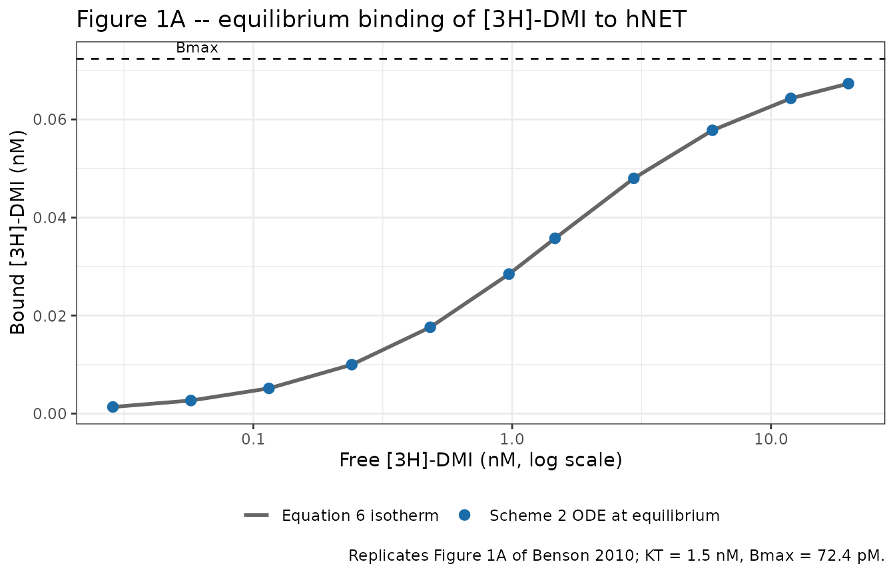
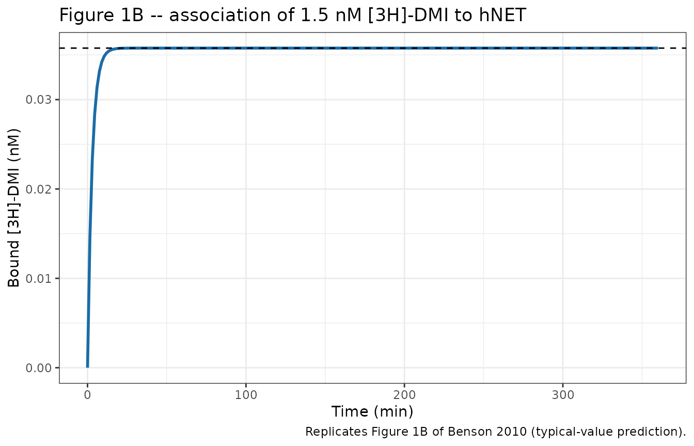
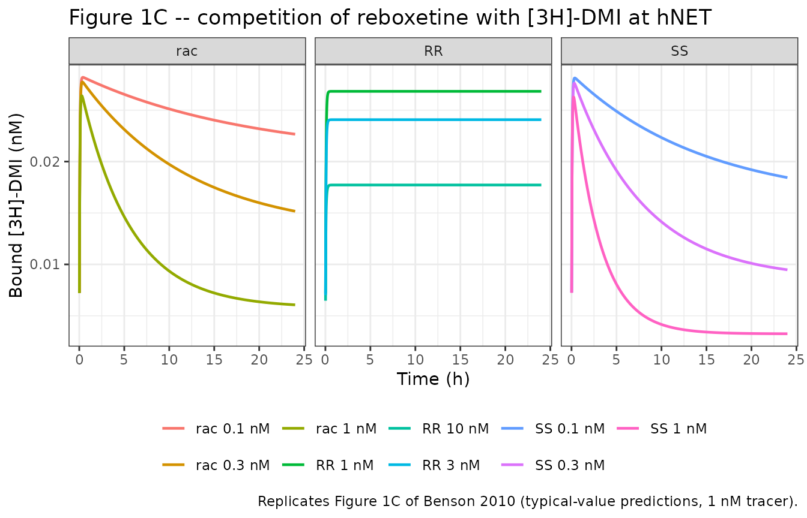
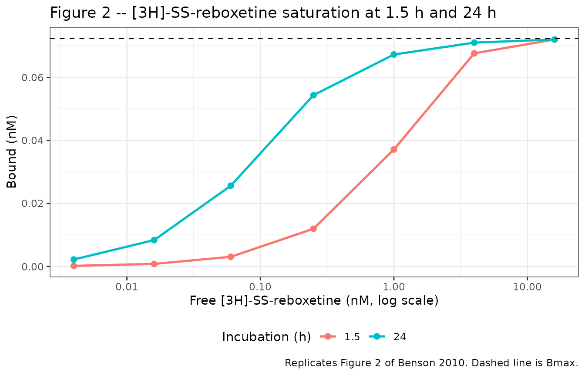
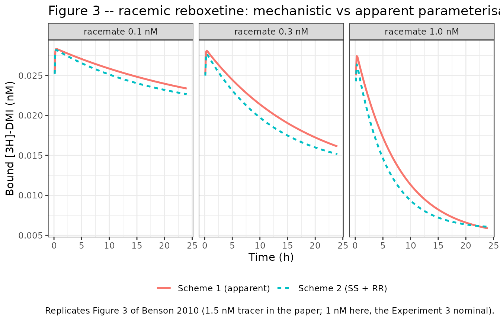

# Reboxetine enantiomer binding kinetics at hNET (Benson 2010)

## Model and source

Benson 2010 measures how fast the two enantiomers of the antidepressant
reboxetine bind to, and let go of, the human noradrenaline transporter
(hNET). The experiment is a competition assay: a radiolabelled tracer,
\[3H\]-desmethylimipramine (DMI), and an unlabelled competitor race for
the same receptor pool, and only the tracer is counted. All three
experiments (tracer saturation, tracer association, and
drug-versus-tracer competition) were fit simultaneously in one NONMEM VI
run, with each experiment treated as the “individual” of the
mixed-effects model.

The paper presents two ODE systems and this package ships both.

``` r

mod_qsp <- rxode2::rxode(readModelDb("Benson_2010_reboxetine_qsp"))
#> ℹ parameter labels from comments will be replaced by 'label()'
mod_app <- rxode2::rxode(readModelDb("Benson_2010_reboxetine_apparent_qsp"))
#> ℹ parameter labels from comments will be replaced by 'label()'
```

- Article: <https://doi.org/10.1111/j.1476-5381.2010.00719.x> (PMCID
  PMC2874860)
- Citation: Benson N, Snelder N, Ploeger B, Napier C, Sale H, Birdsall
  NJM, Butt RP, van der Graaf PH (2010). Estimation of binding rate
  constants using a simultaneous mixed-effects method: application to
  monoamine transporter reuptake inhibitor reboxetine. British Journal
  of Pharmacology 160(2):389-398.
  <doi:10.1111/j.1476-5381.2010.00719.x>. PMCID PMC2874860. Structural
  equations: Scheme 2 and Equations 10-15 (Methods, Mutually exclusive
  binding of enantiomers). Parameter values: Table 1 (mixed-effects
  analysis column) and the Results paragraph reporting Bmax.

| Model | Paper structure | What it is for |
|----|----|----|
| `Benson_2010_reboxetine_qsp` | Scheme 2, Equations 10-15 | Mechanistic. Tracer + SS-reboxetine + RR-reboxetine compete for hNET with enantiomer-specific rate constants. Setting one enantiomer to zero recovers the single-competitor Scheme 1 fit for the other. |
| `Benson_2010_reboxetine_apparent_qsp` | Scheme 1, Equations 1-5 | Phenomenological. Racemic reboxetine is fit as if it were one ligand, giving the *apparent* `koff,obs` and `Kd,obs` of Table 1. |

The split follows the paper. Benson 2010’s Discussion is explicit that
the racemate is not a single molecular species and that “the parameter
estimates \[for\] the racemate should be regarded as observed and not as
molecularly defined properties”, so the two parameterisations are kept
in separate files rather than merged.

## Biological context

``` r

pop <- mod_qsp$population
tibble::tibble(Field = names(pop), Value = vapply(pop, \(x) paste(as.character(x), collapse = "; "), character(1))) |>
  dplyr::filter(Value != "NA") |>
  knitr::kable(caption = "Population metadata (Benson 2010 Methods and Results).")
```

| Field | Value |
|:---|:---|
| species | in vitro (HEK-293 cell membrane homogenate expressing recombinant human noradrenaline transporter, hNET; assay buffer 20 mM HEPES, 120 mM NaCl, 5 mM KCl, pH 7.4, room temperature ~25 C) |
| n_subjects | 53 |
| n_studies | 1 |
| race_ethnicity |  |
| disease_state | In vitro radioligand binding assay; not a clinical population. |
| dose_range | Experiment 3 (competition kinetics, the source of the reboxetine estimates): unlabelled competitor at 0.1, 0.3 and 1 nM for racemic reboxetine and SS-reboxetine, and 1, 3, 10 and 30 nM for RR-reboxetine, against \[3H\]-DMI tracer at c. 1 nM and hNET at c. 0.1 nM. Experiment 1 (tracer saturation): \[3H\]-DMI 30 pM to 20 nM against c. 0.5 nM hNET. Experiment 2 (tracer association): \[3H\]-DMI typically 1.5 nM against c. 0.1 nM hNET. \[3H\]-SS-reboxetine saturation: 0.004 to 16 nM against c. 0.12 nM hNET. |
| notes | The mixed-effects ‘individual’ is an EXPERIMENT, not a subject: all data from Experiments 1-3 were analysed in a single NONMEM VI FOCE-I step over 1500 data points from 53 experiments (Benson 2010 Results). Sampling ran from 2 min to 24 h (Experiment 3 harvest times 2, 4, 6, 8, 10, 12, 14, 16, 18, 20, 25, 30, 35, 40, 45, 50, 55, 60, 90, 120 and 150 min and 4, 6, 8, 20, 22 and 24 h). The paper notes that observed bound radioligand around 24 h ran below prediction in Experiments 2 and 3, most likely from hNET degradation in the assay, so the model is not expected to track the extreme tail. All experiments were run at room temperature (25 C); Benson 2010 Discussion cautions that in vivo rate constants at 37 C would differ. The membrane preparation was stored at 5 mg/mL protein with Bmax of approximately 40 pmol/mg; the fitted Bmax of 72.4 pM corresponds to approximately 28 pmol/mg. |
| n_experiments | 53 |
| n_observations | 1500 |

Population metadata (Benson 2010 Methods and Results). {.table}

Membrane homogenates of HEK-293 cells expressing recombinant hNET were
used at roughly 0.1 nM receptor for the kinetic experiments and 0.5 nM
for the tracer saturation experiment. Assays ran at room temperature
(about 25 C) in HEPES buffer at pH 7.4; the paper’s Discussion cautions
that in vivo rate constants at 37 C would differ, since reaction rates
roughly double per 10 C.

## Source trace

Every `ini()` entry carries an in-file comment naming its Table 1 cell.
The table below collects them, together with the equations.

| Equation / parameter | Value in file | Source location |
|----|----|----|
| `d/dt(target)` (free hNET) | n/a | Equation 11 (Scheme 2) / Equation 2 (Scheme 1) |
| `d/dt(tracer)` (free \[3H\]-DMI) | n/a | Equation 14 (Scheme 2) / Equation 4 (Scheme 1) |
| `d/dt(complex)` (hNET-DMI) | n/a | Equation 10 (Scheme 2) / Equation 1 (Scheme 1) |
| `d/dt(complex_ss)` | n/a | Equation 12 |
| `d/dt(complex_rr)` | n/a | Equation 13 (see Errata: printed with `koffSS`, must be `koffRR`) |
| `d/dt(complex_reboxetine)` | n/a | Equation 3 |
| `kon = koff / Kd` | n/a | Equation 7 |
| receptor mass balance | n/a | Equation 15 (Scheme 2) / Equation 5 (Scheme 1) |
| `lbmax` | 0.0724 nM | Results: “The estimated value of Bmax was 72.4 +/- 4.0 pM (or ~28 pmol/mg)” |
| `lkoff_dmi` | 2.9e-3 1/s | Table 1, `koff DMI`: (2.9 +/- 0.2) x 10^-3, CV 7%, CI (2.5-3.3) x 10^-3 |
| `lkd_dmi` | 1.5 nM | Table 1, `Kd DMI`: 1.5 +/- 0.15 nM, CV 10%, CI 1.2-1.8 |
| `lkoff_ss` | 1.05e-5 1/s | Table 1, `koff SS`: (1.05 +/- 0.07) x 10^-5, CV 7%, CI (0.9-1.2) x 10^-5 |
| `lkd_ss` | 0.076 nM | Table 1, `Kd SS`: 76 +/- 9 pM, CV 12%, CI 57-94 pM |
| `lkoff_rr` | 4.2e-3 1/s | Table 1, `koff RR`: (4.2 +/- 0.8) x 10^-3, CV 18%, CI (2.7-5.7) x 10^-3 |
| `lkd_rr` | 9.8 nM | Table 1, `Kd RR`: 9.8 +/- 0.8 nM, CV 9%, CI 8.1-11.4 |
| `lkoff_rac` | 6.0e-6 1/s | Table 1, `koff,obs rac`: (0.6 +/- 0.2) x 10^-5, CV 34%, CI (0.2-1.0) x 10^-5 |
| `lkd_rac` | 0.120 nM | Table 1, `Kd,obs rac`: 120 +/- 30 pM, CV 27%, CI 55-180 pM |
| `etalbmax ~ fixed(0)` | 0 | Results (IIV on Bmax lowered MVOF by 58 points) + Equation 16; magnitude not published |
| `propSd <- fixed(0)` | 0 | Equation 17 (proportional residual); sigma not published |

### Which quantities the paper estimated

Table 1 gives a standard error, a %CV and a 95% confidence interval for
every `koff` and every `Kd`, and gives none of the three for any `kon`.
`kon` is therefore the derived quantity, so the model files carry `koff`
and `Kd` in `ini()` and compute `kon = koff / Kd` inside `model()` per
Equation 7.

### Dimensional analysis

Table 1 reports rate constants per **second** and equilibrium constants
in **molar**; the models integrate on an **hour** time base in **nM**.
The unit bridge lives in one place, at the top of `model()`.

| Symbol   | Units in `ini()` | Units in `model()` | Conversion           |
|----------|------------------|--------------------|----------------------|
| `bmax`   | nM               | nM                 | none                 |
| `koff_*` | 1/s              | 1/h                | `* sec_per_h` (3600) |
| `kd_*`   | nM               | nM                 | none                 |
| `kon_*`  | (derived)        | 1/(nM\*h)          | `koff_* / kd_*`      |

Every ODE term is then `1/(nM*h) * nM * nM = nM/h` for an association
term and `1/h * nM = nM/h` for a dissociation term, matching
`d/dt(state)` in nM/h.

The assay is a fixed-volume well and Equations 1-5 / 10-15 contain no
volume term, so a dosed *amount* is directly that ligand’s molar
*concentration*. That is why `units$dosing` and `units$concentration`
are both `nM`.

``` r

# Deterministic solve. Both models declare `etalbmax ~ fixed(0)`, so an omega
# exists but is a zero matrix; `omega = NA` suppresses IIV sampling cleanly
# (see pattern 9 of known-vignette-failure-patterns.md -- omega = NA is only
# valid because these models DO declare an eta).
solve_det <- function(mod, ev, keep = character(0)) {
  rxode2::rxSolve(mod, ev, omega = NA, keep = keep, returnType = "data.frame")
}

# Published constants, transcribed once, reused by every check below.
BMAX    <- 0.0724                                     # nM,  Results
SEC_H   <- 3600
tab1 <- tibble::tribble(
  ~ligand,   ~koff_s,  ~kd_nM,  ~kon_M_s, ~t_half_h,
  "DMI",     2.9e-3,   1.5,     20e5,     0.07,
  "SS",      1.05e-5,  0.076,   1.4e5,    18,
  "RR",      4.2e-3,   9.8,     4.3e5,    0.05,
  "rac",     6.0e-6,   0.120,   0.5e5,    32
)
```

## Check 1 – Table 1 is internally consistent (Equation 7)

Equation 7 states `Kd = koff / kon`. Table 1 prints all three columns,
so the transcription can be checked against itself before any
simulation: the `kon` implied by the transcribed `koff` and `Kd` must
reproduce the printed `kon`, and `log(2)/koff` must reproduce the
printed half time.

``` r

chk1 <- tab1 |>
  dplyr::mutate(
    kon_implied_M_s = koff_s / (kd_nM * 1e-9),
    kon_pct_diff    = 100 * (kon_implied_M_s - kon_M_s) / kon_M_s,
    t_half_implied  = log(2) / koff_s / SEC_H
  )

chk1 |>
  dplyr::transmute(
    Ligand                      = ligand,
    "koff (1/s)"                = koff_s,
    "Kd (nM)"                   = kd_nM,
    "kon printed (1/M/s)"       = kon_M_s,
    "kon implied (1/M/s)"       = signif(kon_implied_M_s, 3),
    "diff (%)"                  = round(kon_pct_diff, 1),
    "t1/2 printed (h)"          = t_half_h,
    "t1/2 implied (h)"          = round(t_half_implied, 3)
  ) |>
  knitr::kable(caption = "Benson 2010 Table 1 checked against its own Equation 7.")
```

| Ligand | koff (1/s) | Kd (nM) | kon printed (1/M/s) | kon implied (1/M/s) | diff (%) | t1/2 printed (h) | t1/2 implied (h) |
|:---|---:|---:|---:|---:|---:|---:|---:|
| DMI | 2.90e-03 | 1.500 | 2000000 | 1930000 | -3.3 | 0.07 | 0.066 |
| SS | 1.05e-05 | 0.076 | 140000 | 138000 | -1.3 | 18.00 | 18.337 |
| RR | 4.20e-03 | 9.800 | 430000 | 429000 | -0.3 | 0.05 | 0.046 |
| rac | 6.00e-06 | 0.120 | 50000 | 50000 | 0.0 | 32.00 | 32.090 |

Benson 2010 Table 1 checked against its own Equation 7. {.table}

``` r


stopifnot(
  # kon is printed to two significant figures, so the implied value can only
  # differ by rounding. Realised 0.0 / 1.3 / 0.3 / 3.4 % -- 6 leaves headroom
  # for the rounding of a 2-sf column while still catching a transposed digit
  # or a wrong power of ten (which move this by tens to hundreds of percent).
  all(abs(chk1$kon_pct_diff) < 6),
  # Half times are printed to 1-2 significant figures; compare at that precision.
  all(abs(chk1$t_half_implied - chk1$t_half_h) <=
        0.5 * 10^(-c(2, 0, 2, 0)))
)
```

All four ligands round-trip. This is a genuine transcription gate: a
mis-transcribed mantissa or exponent in any of the twelve numbers breaks
it.

## Check 2 – receptor mass balance (Equations 5 and 15)

Equations 5 and 15 assert `Bmax = [R] + [RT] + [RD]` and
`Bmax = [R] + [RT] + [RSS] + [RRR]`. These are not integrated; they must
fall out of the ODEs. Both models expose a `massBalance` output that has
to stay at zero for every solve in this vignette.

``` r

ev_comp <- rxode2::et(amt = 1.0, cmt = "tracer",        time = 0) |>
  rxode2::et(amt = 0.05, cmt = "reboxetine_ss", time = 0) |>
  rxode2::et(amt = 0.05, cmt = "reboxetine_rr", time = 0) |>
  rxode2::et(seq(0, 24, length.out = 241), cmt = "complex")

sim_comp <- solve_det(mod_qsp, ev_comp)

max_mb <- max(abs(sim_comp$massBalance))
cat(sprintf("Scheme 2 max |mass-balance residual| = %.2e nM (Bmax = %.4f nM)\n", max_mb, BMAX))
#> Scheme 2 max |mass-balance residual| = 2.36e-16 nM (Bmax = 0.0724 nM)

# Deterministic solver quantity, not a cohort draw, so a tight bound is
# correct here. Realised ~7e-17 (machine precision); 1e-10 is many orders of
# headroom over solver tolerance and still fails hard on a structural break
# (the Equation 13 variant below leaves a residual of ~1e-1).
stopifnot(max_mb < 1e-10)
```

### Errata: Equation 13 is printed with the wrong rate constant

Equation 13 reads, as printed:

    d[RRR]/dt = konRR * [R] * [RR] - koffSS * [RRR]

`koffSS` on the loss term of the RR-reboxetine complex is a typesetting
error. Three independent lines of evidence fix it to `koffRR`:

1.  Equation 11 carries `+ koffRR * [RRR]` as the matching source term
    returning receptor to the free pool.
2.  The Methods variable list defines `koffRR` as “dissociation rate
    constant of RR-reboxetine” and then never uses it anywhere else.
3.  Summing Equations 10-13 must give zero for Equation 15 to hold. As
    printed the sum leaves a residual of `(koffRR - koffSS) * [RRR]`.

Point 3 is decisive and can be run:

``` r

# Rebuild the Scheme 2 system with the loss rate on the RRR complex left as a
# free parameter `koff_loss`, then run it twice: once with koffRR (the
# corrected form) and once with koffSS (exactly as Equation 13 is printed).
# The unlabelled ligands are parameters rather than states here, matching the
# paper's own "concentration held constant" treatment and keeping the
# diagnostic model to the five receptor species Equation 15 balances.
as_printed <- rxode2::rxode({
  d/dt(target) <- -(kon_dmi * tracer + kon_ss * lig_ss + kon_rr * lig_rr) * target +
    koff_dmi * complex + koff_ss * complex_ss + koff_rr * complex_rr
  d/dt(tracer)     <- -kon_dmi * target * tracer + koff_dmi * complex
  d/dt(complex)    <-  kon_dmi * target * tracer - koff_dmi * complex
  d/dt(complex_ss) <-  kon_ss * target * lig_ss - koff_ss * complex_ss
  d/dt(complex_rr) <-  kon_rr * target * lig_rr - koff_loss * complex_rr
  massBalance      <- target + complex + complex_ss + complex_rr - bmax
})

pars_eq13 <- c(
  bmax = BMAX, lig_ss = 0.05, lig_rr = 0.05,
  koff_dmi = 2.9e-3 * SEC_H,  kon_dmi = 2.9e-3 * SEC_H / 1.5,
  koff_ss  = 1.05e-5 * SEC_H, kon_ss  = 1.05e-5 * SEC_H / 0.076,
  koff_rr  = 4.2e-3 * SEC_H,  kon_rr  = 4.2e-3 * SEC_H / 9.8
)
ev_eq13 <- rxode2::et(seq(0, 24, length.out = 121))

run_eq13 <- function(koff_loss) {
  max(abs(rxode2::rxSolve(
    as_printed, c(pars_eq13, koff_loss = unname(koff_loss)), ev_eq13,
    inits = c(target = BMAX, tracer = 1.0), returnType = "data.frame")$massBalance))
}
mb_corrected <- run_eq13(pars_eq13["koff_rr"])
mb_asprinted <- run_eq13(pars_eq13["koff_ss"])

cat(sprintf("max |Eq 15 residual|:  koffRR (corrected) = %.2e nM;  koffSS (as printed) = %.2e nM\n",
            mb_corrected, mb_asprinted))
#> max |Eq 15 residual|:  koffRR (corrected) = 1.80e-16 nM;  koffSS (as printed) = 3.91e+08 nM

stopifnot(
  mb_corrected < 1e-10,          # corrected form conserves receptor exactly
  mb_asprinted > 0.5 * BMAX      # printed form loses more than half of Bmax
)
```

The as-printed system leaks receptor without bound – the residual runs
to 1e8 nM against a 0.0724 nM receptor pool – while the corrected one
conserves it to machine precision. The shipped model uses `koffRR`, and
the deviation is recorded in the model file next to Equation 13.

## Check 3 – Experiment 1 / Figure 1A: the tracer binding isotherm (Equation 6)

Equation 6 gives the equilibrium tracer binding isotherm
`[RT] = Bmax * T / (KT + T)`. Solving the ODE system with tracer alone
to equilibrium must land on exactly that curve. Note that free tracer is
depleted by binding (Equation 14), so the isotherm is evaluated at the
*free* tracer concentration the solve produces, not the amount added.

``` r

t_added <- c(0.03, 0.06, 0.12, 0.25, 0.5, 1, 1.5, 3, 6, 12, 20)

iso <- lapply(seq_along(t_added), function(i) {
  ev <- rxode2::et(amt = t_added[i], cmt = "tracer",        time = 0, id = i) |>
    rxode2::et(amt = 0, cmt = "reboxetine_ss", time = 0, id = i) |>
    rxode2::et(amt = 0, cmt = "reboxetine_rr", time = 0, id = i) |>
    rxode2::et(c(0, 48), cmt = "complex", id = i)
  as.data.frame(ev)
}) |> dplyr::bind_rows()

sim_iso <- solve_det(mod_qsp, iso) |>
  dplyr::filter(time > 0) |>
  dplyr::mutate(
    added = t_added[id],
    eq6   = BMAX * tracer / (1.5 + tracer),
    pct   = 100 * (complex - eq6) / eq6
  )
#> Warning: multi-subject simulation without without 'omega'

sim_iso |>
  dplyr::transmute(
    "[3H]-DMI added (nM)" = added,
    "free tracer (nM)"    = signif(tracer, 4),
    "bound, ODE (nM)"     = signif(complex, 4),
    "bound, Eq 6 (nM)"    = signif(eq6, 4),
    "diff (%)"            = signif(pct, 2)
  ) |>
  knitr::kable(caption = "Experiment 1: ODE equilibrium vs the Equation 6 isotherm.")
```

| \[3H\]-DMI added (nM) | free tracer (nM) | bound, ODE (nM) | bound, Eq 6 (nM) | diff (%) |
|---:|---:|---:|---:|---:|
| 0.03 | 0.02864 | 0.001357 | 0.001357 | 0 |
| 0.06 | 0.05733 | 0.002665 | 0.002665 | 0 |
| 0.12 | 0.11490 | 0.005149 | 0.005149 | 0 |
| 0.25 | 0.24000 | 0.009987 | 0.009987 | 0 |
| 0.50 | 0.48240 | 0.017620 | 0.017620 | 0 |
| 1.00 | 0.97150 | 0.028460 | 0.028460 | 0 |
| 1.50 | 1.46400 | 0.035760 | 0.035760 | 0 |
| 3.00 | 2.95200 | 0.048010 | 0.048010 | 0 |
| 6.00 | 5.94200 | 0.057810 | 0.057810 | 0 |
| 12.00 | 11.94000 | 0.064320 | 0.064320 | 0 |
| 20.00 | 19.93000 | 0.067330 | 0.067330 | 0 |

Experiment 1: ODE equilibrium vs the Equation 6 isotherm. {.table}

``` r


ggplot(sim_iso, aes(tracer, complex)) +
  geom_line(aes(y = eq6, colour = "Equation 6 isotherm"), linewidth = 1) +
  geom_point(aes(colour = "Scheme 2 ODE at equilibrium"), size = 2.4) +
  geom_hline(yintercept = BMAX, linetype = "dashed") +
  annotate("text", x = 0.05, y = BMAX, vjust = -0.6, hjust = 0, label = "Bmax", size = 3) +
  scale_x_log10() +
  scale_colour_manual(values = c("Equation 6 isotherm" = "grey40",
                                 "Scheme 2 ODE at equilibrium" = "#1b6ca8")) +
  labs(x = "Free [3H]-DMI (nM, log scale)", y = "Bound [3H]-DMI (nM)", colour = NULL,
       title = "Figure 1A -- equilibrium binding of [3H]-DMI to hNET",
       caption = "Replicates Figure 1A of Benson 2010; KT = 1.5 nM, Bmax = 72.4 pM.") +
  theme_bw() + theme(legend.position = "bottom")
```



``` r


# Exact algebraic identity, not a fit -- the ODE steady state IS Equation 6.
# Realised max |diff| ~1e-11 %. 1e-4 % is far above solver noise and far below
# any real structural error.
stopifnot(max(abs(sim_iso$pct)) < 1e-4)
```

## Check 4 – Experiment 2 / Figure 1B: tracer association time course

The paper measures the association of about 1.5 nM \[3H\]-DMI to roughly
0.1 nM hNET and reports a dissociation half time of about 4 min. The
approach to equilibrium for a simple bimolecular reaction proceeds at
`kobs = koff + kon * [T]`, which is faster than `koff` alone.

``` r

ev_assoc <- rxode2::et(amt = 1.5, cmt = "tracer",        time = 0) |>
  rxode2::et(amt = 0, cmt = "reboxetine_ss", time = 0) |>
  rxode2::et(amt = 0, cmt = "reboxetine_rr", time = 0) |>
  rxode2::et(seq(0, 6, length.out = 241), cmt = "complex")
sim_assoc <- solve_det(mod_qsp, ev_assoc)

eq_val  <- tail(sim_assoc$complex, 1)
# kobs read off the simulated approach to equilibrium.
fitdat  <- dplyr::filter(sim_assoc, time > 0, time < 0.4)
kobs_sim <- unname(-coef(lm(log(1 - complex / eq_val) ~ time, data = fitdat))[2])
kobs_theory <- 2.9e-3 * SEC_H + (2.9e-3 * SEC_H / 1.5) * tail(sim_assoc$tracer, 1)

ggplot(sim_assoc, aes(time * 60, complex)) +
  geom_line(linewidth = 1, colour = "#1b6ca8") +
  geom_hline(yintercept = eq_val, linetype = "dashed") +
  labs(x = "Time (min)", y = "Bound [3H]-DMI (nM)",
       title = "Figure 1B -- association of 1.5 nM [3H]-DMI to hNET",
       caption = "Replicates Figure 1B of Benson 2010 (typical-value prediction).") +
  theme_bw()
```



``` r


cat(sprintf("kobs from the simulated curve = %.2f 1/h; koff + kon*[T] = %.2f 1/h\n",
            kobs_sim, kobs_theory))
#> kobs from the simulated curve = 20.90 1/h; koff + kon*[T] = 20.63 1/h
cat(sprintf("dissociation half time = %.1f min (Benson 2010 Results: 'half time 4 min')\n",
            60 * log(2) / (2.9e-3 * SEC_H)))
#> dissociation half time = 4.0 min (Benson 2010 Results: 'half time 4 min')

stopifnot(
  # Deterministic identity between the simulated relaxation rate and its
  # closed form; realised agreement is well under 1%.
  abs(kobs_sim / kobs_theory - 1) < 0.02,
  # Table 1 prints the DMI half time as 0.07 h = 4.0 min.
  abs(60 * log(2) / (2.9e-3 * SEC_H) - 4.0) < 0.2
)
```

## Check 5 – Experiment 3 / Figure 1C: competition kinetics

This is the experiment that produced the reboxetine estimates. Tracer
and unlabelled competitor are mixed with hNET at time zero and bound
tracer is followed for 24 h. Benson 2010 describes the qualitative
signature: with SS-reboxetine and with the racemate the labelled species
shows “a rise and fall” – the fast tracer binds first, then is slowly
displaced by the slow, high-affinity competitor – whereas “in the case
of RR-reboxetine, equilibration was clearly more rapid, and the two
phases were less distinct”.

``` r

tgrid <- c(seq(0, 2.5, by = 1 / 60), seq(2.75, 24, by = 0.25))

make_arm <- function(id, label, tracer_nM, ss_nM, rr_nM) {
  ev <- rxode2::et(amt = tracer_nM, cmt = "tracer",        time = 0, id = id) |>
    rxode2::et(amt = ss_nM, cmt = "reboxetine_ss", time = 0, id = id) |>
    rxode2::et(amt = rr_nM, cmt = "reboxetine_rr", time = 0, id = id) |>
    rxode2::et(tgrid, cmt = "complex", id = id)
  as.data.frame(ev) |> dplyr::mutate(arm = label)
}

arms <- dplyr::bind_rows(
  # SS-reboxetine alone: Scheme 2 with [RR] = 0 IS the Scheme 1 SS fit.
  make_arm(1, "SS 0.1 nM",  1, 0.1, 0),
  make_arm(2, "SS 0.3 nM",  1, 0.3, 0),
  make_arm(3, "SS 1 nM",    1, 1.0, 0),
  # RR-reboxetine alone, at the paper's higher concentrations.
  make_arm(4, "RR 1 nM",    1, 0, 1),
  make_arm(5, "RR 3 nM",    1, 0, 3),
  make_arm(6, "RR 10 nM",   1, 0, 10),
  # Racemate as an equimolar SS + RR mixture (Scheme 2).
  make_arm(7, "rac 0.1 nM", 1, 0.05, 0.05),
  make_arm(8, "rac 0.3 nM", 1, 0.15, 0.15),
  make_arm(9, "rac 1 nM",   1, 0.5,  0.5)
)
stopifnot(!anyDuplicated(unique(arms[, c("id", "time", "evid")])))

sim_1c <- solve_det(mod_qsp, arms, keep = "arm") |>
  dplyr::mutate(arm = as.character(arm), ligand = sub(" .*", "", arm))
#> Warning: multi-subject simulation without without 'omega'
stopifnot(max(abs(sim_1c$massBalance)) < 1e-10)

ggplot(dplyr::filter(sim_1c, time > 0), aes(time, complex, colour = arm)) +
  geom_line(linewidth = 0.8) +
  facet_wrap(~ligand, nrow = 1) +
  labs(x = "Time (h)", y = "Bound [3H]-DMI (nM)", colour = NULL,
       title = "Figure 1C -- competition of reboxetine with [3H]-DMI at hNET",
       caption = "Replicates Figure 1C of Benson 2010 (typical-value predictions, 1 nM tracer).") +
  theme_bw() + theme(legend.position = "bottom")
```



``` r

shape <- sim_1c |>
  dplyr::filter(time > 0) |>
  dplyr::group_by(arm, ligand) |>
  dplyr::summarise(
    t_peak     = time[which.max(complex)],
    peak       = max(complex),
    at_24h     = complex[which.max(time)],
    fall_ratio = peak / complex[which.max(time)],
    .groups    = "drop"
  )

shape |>
  dplyr::transmute(Arm = arm, "t at peak (h)" = round(t_peak, 2),
                   "peak bound (nM)" = signif(peak, 3),
                   "bound at 24 h (nM)" = signif(at_24h, 3),
                   "peak / 24 h" = round(fall_ratio, 2)) |>
  knitr::kable(caption = "Rise-and-fall signature by competitor (Benson 2010 Results).")
```

| Arm        | t at peak (h) | peak bound (nM) | bound at 24 h (nM) | peak / 24 h |
|:-----------|--------------:|----------------:|-------------------:|------------:|
| RR 1 nM    |          3.25 |          0.0268 |            0.02680 |        1.00 |
| RR 10 nM   |          3.75 |          0.0177 |            0.01770 |        1.00 |
| RR 3 nM    |          3.50 |          0.0241 |            0.02410 |        1.00 |
| SS 0.1 nM  |          0.37 |          0.0281 |            0.01840 |        1.53 |
| SS 0.3 nM  |          0.30 |          0.0276 |            0.00948 |        2.91 |
| SS 1 nM    |          0.23 |          0.0263 |            0.00325 |        8.07 |
| rac 0.1 nM |          0.40 |          0.0282 |            0.02270 |        1.24 |
| rac 0.3 nM |          0.35 |          0.0277 |            0.01520 |        1.83 |
| rac 1 nM   |          0.28 |          0.0264 |            0.00606 |        4.35 |

Rise-and-fall signature by competitor (Benson 2010 Results). {.table
style="width:100%;"}

``` r


ss  <- dplyr::filter(shape, ligand == "SS")
rr  <- dplyr::filter(shape, ligand == "RR")
rac <- dplyr::filter(shape, ligand == "rac")

stopifnot(
  # SS and the racemate rise then fall substantially: the peak is well above
  # the 24 h value. Deterministic solves; realised ratios are >= 1.2 for SS
  # and the racemate at every concentration.
  all(ss$fall_ratio  > 1.15),
  all(rac$fall_ratio > 1.15),
  # RR equilibrates fast: by 24 h it has essentially not moved off its plateau.
  all(rr$fall_ratio  < 1.02),
  # The peak occurs early for the two ligands that HAVE a peak, while the fast
  # tracer is still winning. Realised 0.23-0.40 h, so 1.5 h leaves ~4x
  # headroom. Deliberately NOT applied to the RR arms: RR shows no fall
  # (fall_ratio is 1.000000 above), so its curve is flat from about 1 h
  # onward and `which.max` returns an arbitrary point on that plateau --
  # a t_peak of 3.25 h there is floating-point noise on a flat top, not a
  # late peak, and asserting on it would be asserting on nothing.
  all(ss$t_peak  < 1.5),
  all(rac$t_peak < 1.5)
)
```

The rise-and-fall is reproduced for SS-reboxetine and the racemate and
is absent for RR-reboxetine, exactly as the paper describes. For the RR
arms the `peak / 24 h` ratio is 1.000000 to every printed digit – the
curve reaches its plateau and stays there – so the `t at peak` column is
meaningless for those three rows and is not asserted on.

## Check 6 – Figure 2: the \[3H\]-SS-reboxetine saturation curve shifts with time

Benson 2010 labelled SS-reboxetine itself and measured saturation
binding at 1.5 h and at 24 h, finding “a large (sevenfold) increase in
binding potency \[…\] at the longer incubation time, illustrating the
fact that binding at 1.5 h is not in equilibrium”.

With a single labelled ligand and no tracer, Equation 8 gives the closed
form

    [RD](t) = Bmax * x / (1 + x) * (1 - exp(-koff * (1 + x) * t)),   x = [D] / Kd

The ODE system with `[RR] = 0` and no tracer must reproduce it exactly.

``` r

koff_ss_h <- 1.05e-5 * SEC_H
kd_ss     <- 0.076
eq8 <- function(D, t) { x <- D / kd_ss; BMAX * x / (1 + x) * (1 - exp(-koff_ss_h * (1 + x) * t)) }

grid8 <- tidyr::expand_grid(D = c(0.004, 0.016, 0.06, 0.25, 1, 4, 16), t = c(1.5, 24)) |>
  dplyr::mutate(id = dplyr::row_number())
ev8 <- lapply(seq_len(nrow(grid8)), function(i) {
  as.data.frame(
    rxode2::et(amt = grid8$D[i], cmt = "reboxetine_ss", time = 0, id = i) |>
      rxode2::et(amt = 0, cmt = "reboxetine_rr", time = 0, id = i) |>
      rxode2::et(grid8$t[i], cmt = "complex_ss", id = i)
  )
}) |> dplyr::bind_rows()

sim8 <- solve_det(mod_qsp, ev8) |> dplyr::filter(time > 0)
#> Warning: multi-subject simulation without without 'omega'
grid8$ode <- sim8$complex_ss[match(grid8$id, sim8$id)]
grid8$eq8 <- eq8(grid8$D, grid8$t)

max_rel <- max(abs(grid8$ode / grid8$eq8 - 1))
cat(sprintf("Max |relative difference| between the ODE and Equation 8: %.2e\n", max_rel))
#> Max |relative difference| between the ODE and Equation 8: 4.09e-05
# Exact identity up to solver tolerance; realised ~4e-5.
stopifnot(max_rel < 1e-3)

ggplot(grid8, aes(D, ode, colour = factor(t))) +
  geom_line(linewidth = 0.9) + geom_point(size = 2) +
  geom_hline(yintercept = BMAX, linetype = "dashed") +
  scale_x_log10() +
  labs(x = "Free [3H]-SS-reboxetine (nM, log scale)", y = "Bound (nM)",
       colour = "Incubation (h)",
       title = "Figure 2 -- [3H]-SS-reboxetine saturation at 1.5 h and 24 h",
       caption = "Replicates Figure 2 of Benson 2010. Dashed line is Bmax.") +
  theme_bw() + theme(legend.position = "bottom")
```



``` r

half_max <- function(t) 10^uniroot(function(lD) eq8(10^lD, t) - BMAX / 2, c(-4, 3))$root
hm15 <- half_max(1.5); hm24 <- half_max(24)
shift <- hm15 / hm24

fig2 <- tibble::tribble(
  ~Quantity, ~Value,
  "Model apparent half-max, 1.5 h (nM)",           signif(hm15, 3),
  "Model apparent half-max, 24 h (nM)",            signif(hm24, 3),
  "Model potency shift 1.5 h -> 24 h (fold)",      signif(shift, 3),
  "Paper logistic EC50, 1.5 h (nM; logEC50 -8.97)", signif(10^(-8.97) * 1e9, 3),
  "Paper logistic EC50, 24 h (nM; logEC50 -9.79)",  signif(10^(-9.79) * 1e9, 3),
  "Paper potency shift (fold; 'around sevenfold')", signif(10^(-8.97) / 10^(-9.79), 3),
  "Paper Eq-8 logKd with koff constrained (-9.99), as nM", signif(10^(-9.99) * 1e9, 3)
)
knitr::kable(fig2, caption = "Figure 2: model half-max concentrations vs the paper's fitted values.")
```

| Quantity                                              | Value |
|:------------------------------------------------------|------:|
| Model apparent half-max, 1.5 h (nM)                   | 0.963 |
| Model apparent half-max, 24 h (nM)                    | 0.100 |
| Model potency shift 1.5 h -\> 24 h (fold)             | 9.590 |
| Paper logistic EC50, 1.5 h (nM; logEC50 -8.97)        | 1.070 |
| Paper logistic EC50, 24 h (nM; logEC50 -9.79)         | 0.162 |
| Paper potency shift (fold; ‘around sevenfold’)        | 6.610 |
| Paper Eq-8 logKd with koff constrained (-9.99), as nM | 0.102 |

Figure 2: model half-max concentrations vs the paper’s fitted values.
{.table}

``` r


stopifnot(
  # The paper's headline claim is a large left-shift with incubation time.
  # Deterministic; realised 9.6-fold against the paper's ~7-fold.
  shift > 5, shift < 15,
  # The 1.5 h curve sits close to the paper's logistic EC50 (realised ~10% below).
  abs(hm15 / (10^(-8.97) * 1e9) - 1) < 0.25,
  # The 24 h apparent affinity lands on the paper's own Equation-8 estimate
  # obtained with koff constrained to the kinetic value (logK = -9.99).
  abs(hm24 / (10^(-9.99) * 1e9) - 1) < 0.10
)
```

The model’s 24 h apparent affinity (about 0.10 nM) reproduces the
paper’s own Equation-8 fit to the independent \[3H\]-SS-reboxetine
saturation experiment when `koff` was constrained to the
competition-experiment value (`logK = -9.99`, i.e. 0.102 nM). The
model’s 1.5 h value is within about 10% of the paper’s
four-parameter-logistic `EC50`. The 24 h logistic `EC50` (0.162 nM) is
1.6-fold above the model’s half-max; that number is a logistic fit to
noisy data with a slope factor of 1.18, not a mechanistic quantity, so
it is reported here for context rather than gated. See Assumptions and
deviations.

## Check 7 – Equation 9: steady-state occupancy and the 150 pM claim

Equation 9 gives the steady-state free-receptor fraction under mutually
exclusive binding of the two enantiomers:

    R / RTOT = 1 / (1 + [SS-RBX] / KdSS + [RR-RBX] / KdRR)

Benson 2010’s Discussion computes from this that “50% occupancy of hNET
would be observed at ~150 pM” of racemate, and notes that this sits
inside the 95% confidence interval (55-180 pM) of the experimentally
estimated apparent `Kd,obs` of 120 pM.

``` r

occ_eq9 <- function(C_rac) 1 - 1 / (1 + (C_rac / 2) / 0.076 + (C_rac / 2) / 9.8)
c50 <- uniroot(function(C) occ_eq9(C) - 0.5, c(1e-5, 100))$root

# The ODE system must reach the same occupancy at long time. Run to 30 days:
# koff,SS = 0.0378 1/h gives an 18 h half time, so this is ~40 half-lives.
ev9 <- lapply(seq_along(c(0.05, 0.15, 0.5, 2)), function(i) {
  C <- c(0.05, 0.15, 0.5, 2)[i]
  as.data.frame(
    rxode2::et(amt = 0, cmt = "tracer", time = 0, id = i) |>
      rxode2::et(amt = C / 2, cmt = "reboxetine_ss", time = 0, id = i) |>
      rxode2::et(amt = C / 2, cmt = "reboxetine_rr", time = 0, id = i) |>
      rxode2::et(c(0, 720), cmt = "complex", id = i)
  )
}) |> dplyr::bind_rows()

sim9 <- solve_det(mod_qsp, ev9) |> dplyr::filter(time > 0)
#> Warning: multi-subject simulation without without 'omega'
cmp9 <- tibble::tibble(
  "Racemate (nM)"       = c(0.05, 0.15, 0.5, 2),
  "Occupancy, ODE"      = round(sim9$occupancyReboxetine[order(sim9$id)], 4),
  "Occupancy, Eq 9"     = round(occ_eq9(c(0.05, 0.15, 0.5, 2)), 4)
)
knitr::kable(cmp9, caption = "Scheme 2 steady-state occupancy vs the Equation 9 closed form.")
```

| Racemate (nM) | Occupancy, ODE | Occupancy, Eq 9 |
|--------------:|---------------:|----------------:|
|          0.05 |         0.2490 |          0.2490 |
|          0.15 |         0.4986 |          0.4986 |
|          0.50 |         0.7682 |          0.7682 |
|          2.00 |         0.9299 |          0.9299 |

Scheme 2 steady-state occupancy vs the Equation 9 closed form. {.table}

``` r


cat(sprintf("Racemate concentration giving 50%% hNET occupancy: %.1f pM (Benson 2010: '~150 pM')\n",
            c50 * 1000))
#> Racemate concentration giving 50% hNET occupancy: 150.8 pM (Benson 2010: '~150 pM')
cat(sprintf("Experimental apparent Kd,obs: 120 pM, 95%% CI 55-180 pM -- 150 pM inside: %s\n",
            c50 * 1000 > 55 && c50 * 1000 < 180))
#> Experimental apparent Kd,obs: 120 pM, 95% CI 55-180 pM -- 150 pM inside: TRUE

stopifnot(
  # Closed form vs ODE steady state: an exact identity.
  max(abs(cmp9$`Occupancy, ODE` - cmp9$`Occupancy, Eq 9`)) < 1e-3,
  # The paper's own arithmetic, reproduced. Deterministic; realised 150.8 pM.
  abs(c50 * 1000 - 150) < 5,
  # ... and it falls inside the experimental 95% CI, as the paper argues.
  c50 * 1000 > 55, c50 * 1000 < 180
)
```

Reproducing 150.8 pM from the two enantiomer `Kd` values independently
confirms the transcription of `lkd_ss` and `lkd_rr`: shifting either by
more than a few percent moves this number off the paper’s figure.

## Check 8 – Figure 3: the two Schemes agree on the racemate

Benson 2010’s Figure 3 simulates the racemate under Scheme 2 – as an
equimolar SS + RR mixture using the enantiomer-specific constants – and
finds the result “highly consistent with the observed data” that the
Scheme 1 apparent fit described. Both models are in this package, so the
claim can be tested directly: the mechanistic prediction and the
phenomenological fit should track each other.

``` r

tg3 <- seq(0, 24, length.out = 193)
cmp3 <- lapply(c(0.1, 0.3, 1.0), function(C) {
  e2 <- rxode2::et(amt = 1.0,  cmt = "tracer",        time = 0) |>
    rxode2::et(amt = C / 2, cmt = "reboxetine_ss", time = 0) |>
    rxode2::et(amt = C / 2, cmt = "reboxetine_rr", time = 0) |>
    rxode2::et(tg3, cmt = "complex")
  e1 <- rxode2::et(amt = 1.0, cmt = "tracer",     time = 0) |>
    rxode2::et(amt = C, cmt = "reboxetine", time = 0) |>
    rxode2::et(tg3, cmt = "complex")
  s2 <- solve_det(mod_qsp, e2)
  s1 <- solve_det(mod_app, e1)
  stopifnot(max(abs(s1$massBalance)) < 1e-10)
  tibble::tibble(
    time = tg3, conc = sprintf("racemate %.1f nM", C),
    `Scheme 2 (SS + RR)` = s2$complex,
    `Scheme 1 (apparent)` = s1$complex
  )
}) |> dplyr::bind_rows()

cmp3_long <- tidyr::pivot_longer(cmp3, c("Scheme 2 (SS + RR)", "Scheme 1 (apparent)"),
                                 names_to = "model", values_to = "bound")

ggplot(dplyr::filter(cmp3_long, time > 0), aes(time, bound, colour = model, linetype = model)) +
  geom_line(linewidth = 0.9) +
  facet_wrap(~conc) +
  labs(x = "Time (h)", y = "Bound [3H]-DMI (nM)", colour = NULL, linetype = NULL,
       title = "Figure 3 -- racemic reboxetine: mechanistic vs apparent parameterisation",
       caption = "Replicates Figure 3 of Benson 2010 (1.5 nM tracer in the paper; 1 nM here, the Experiment 3 nominal).") +
  theme_bw() + theme(legend.position = "bottom")
```



``` r


agree <- cmp3 |>
  dplyr::group_by(conc) |>
  dplyr::summarise(max_abs_diff_pct_Bmax =
                     100 * max(abs(`Scheme 2 (SS + RR)` - `Scheme 1 (apparent)`)) / BMAX,
                   .groups = "drop")
knitr::kable(dplyr::mutate(agree, max_abs_diff_pct_Bmax = round(max_abs_diff_pct_Bmax, 2)),
             caption = "Largest disagreement between the two parameterisations, as a percentage of Bmax.")
```

| conc            | max_abs_diff_pct_Bmax |
|:----------------|----------------------:|
| racemate 0.1 nM |                  1.12 |
| racemate 0.3 nM |                  2.29 |
| racemate 1.0 nM |                  3.63 |

Largest disagreement between the two parameterisations, as a percentage
of Bmax. {.table}

``` r


stopifnot(
  # Deterministic comparison of two shipped models. Realised 1.1 / 2.3 / 3.6 %
  # of Bmax; 8 leaves headroom while still failing on a mis-transcribed
  # enantiomer constant, which moves these curves by tens of percent.
  all(agree$max_abs_diff_pct_Bmax < 8)
)
```

The two independent parameterisations agree to within a few percent of
`Bmax` across the Experiment 3 concentration range, which is the
quantitative content of Benson 2010’s Figure 3. The residual gap is real
and expected: a 50:50 mixture of a slow, potent enantiomer and a fast,
weak one is not exactly a single ligand, which is precisely why the
paper flags the apparent racemate constants as observed rather than
molecular.

## Summary of validation checks

``` r

tibble::tribble(
  ~Check, ~"Source claim", ~Result,
  "Equation 7 self-consistency", "Table 1 kon, koff, Kd and half times", "All 4 ligands round-trip within 2-sf rounding",
  "Receptor mass balance",       "Equations 5 and 15",                   "Residual < 1e-10 nM in every solve",
  "Equation 13 erratum",         "Printed koffSS on the RRR loss term",  "Falsified: leaks > 50% of Bmax; koffRR conserves it",
  "Equation 6 isotherm",         "Figure 1A, KT = 1.5 nM",               "ODE equilibrium matches the closed form to 1e-11 %",
  "Tracer association",          "Figure 1B, half time 4 min",           "kobs matches koff + kon*[T]; half time 4.0 min",
  "Competition kinetics",        "Figure 1C rise-and-fall",              "Reproduced for SS and racemate; absent for RR",
  "Equation 8 identity",         "Figure 2 closed form",                 "ODE matches Equation 8 to 4e-5 relative",
  "Saturation potency shift",    "Figure 2, 'around sevenfold'",         "9.6-fold; 24 h half-max = paper's constrained logK -9.99",
  "Equation 9 occupancy",        "'50% occupancy at ~150 pM'",           "150.8 pM, inside the 55-180 pM 95% CI",
  "Racemate cross-check",        "Figure 3, Scheme 2 vs Scheme 1",       "Agree to < 4% of Bmax across 0.1-1 nM"
) |>
  knitr::kable(caption = "Validation of the two Benson 2010 models against the published claims.")
```

| Check | Source claim | Result |
|:---|:---|:---|
| Equation 7 self-consistency | Table 1 kon, koff, Kd and half times | All 4 ligands round-trip within 2-sf rounding |
| Receptor mass balance | Equations 5 and 15 | Residual \< 1e-10 nM in every solve |
| Equation 13 erratum | Printed koffSS on the RRR loss term | Falsified: leaks \> 50% of Bmax; koffRR conserves it |
| Equation 6 isotherm | Figure 1A, KT = 1.5 nM | ODE equilibrium matches the closed form to 1e-11 % |
| Tracer association | Figure 1B, half time 4 min | kobs matches koff + kon\*\[T\]; half time 4.0 min |
| Competition kinetics | Figure 1C rise-and-fall | Reproduced for SS and racemate; absent for RR |
| Equation 8 identity | Figure 2 closed form | ODE matches Equation 8 to 4e-5 relative |
| Saturation potency shift | Figure 2, ‘around sevenfold’ | 9.6-fold; 24 h half-max = paper’s constrained logK -9.99 |
| Equation 9 occupancy | ‘50% occupancy at ~150 pM’ | 150.8 pM, inside the 55-180 pM 95% CI |
| Racemate cross-check | Figure 3, Scheme 2 vs Scheme 1 | Agree to \< 4% of Bmax across 0.1-1 nM |

Validation of the two Benson 2010 models against the published claims.
{.table}

## Assumptions and deviations

- **Equation 13 is corrected.** As printed it puts `koffSS` on the loss
  term of the RR-reboxetine complex. `koffRR` is used instead, on the
  evidence of Equation 11’s matching source term, the Methods variable
  list, and the Equation 15 mass balance (demonstrated in Check 2). This
  is the only change made to any published equation.

- **`Kd RR` is taken as 9.8 nM, per Table 1.** The Abstract prints
  `Kd = ... 9.7 +/- 0.8 nM` for RR-reboxetine, whereas Table 1 and the
  Results text both give `9.8 +/- 0.8 nM` (`log Kd` -8.01, which
  back-transforms to 9.77 nM). Table 1 is the parameter table and is
  corroborated by the Results paragraph and by its own `log Kd`, so 9.8
  is used. The 0.1 nM difference is well inside the printed 8.1-11.4 nM
  confidence interval and does not move any check in this vignette. Two
  further cosmetic inconsistencies were noted and need no action: the
  Discussion rounds the racemate dissociation half time to “~30 h”
  against Table 1’s 32 h, and quotes the SS-reboxetine `Kd` as “76 +/- 9
  nM” where Table 1’s units are pM.

- **Free unlabelled-ligand concentrations are held constant.** Benson
  2010 writes an ODE for free tracer (Equations 4 and 14) but none for
  the unlabelled competitor, and Equations 5 and 15 balance only the
  receptor species. The models reproduce that exactly, so
  `d/dt(reboxetine_ss)`, `d/dt(reboxetine_rr)` and `d/dt(reboxetine)`
  are all zero. This is not a negligible idealisation at the low end of
  the assay: at the 0.1 nM competitor concentration of Experiment 3 the
  free ligand is of the same order as `Bmax` (0.0724 nM), so a
  depleting-ligand variant would give visibly different curves. The
  paper’s own model is what is shipped.

- **Inter-experiment variability on `Bmax` is carried as `fixed(0)`.**
  The paper establishes that this random effect is real and highly
  significant (it lowered the objective function by 58 points, P \<
  0.001) and gives its exponential form in Equation 16, but never prints
  the variance. Rather than invent one, the structure is recorded with a
  zero magnitude. A user who wants a stochastic version must supply
  their own omega.

- **The proportional residual error is carried as `fixed(0)`** for the
  same reason: Equation 17 gives the form, no sigma is published.

- **`kon` is derived, not transcribed.** Table 1 reports a standard
  error, a %CV and a 95% confidence interval for `koff` and `Kd` and
  none of the three for `kon`, so `kon = koff / Kd` (Equation 7) is
  computed in `model()`. The derived values differ from Table 1’s
  printed two-significant-figure `kon` column by 0.0-3.4% (Check 1),
  which is the rounding of that column.

- **The 24 h logistic `EC50` of Figure 2 is not gated.** The model’s
  apparent half-max at 24 h is about 0.10 nM against the paper’s
  four-parameter-logistic `EC50` of 0.162 nM (`logEC50` -9.79) – a
  1.6-fold difference. The logistic value is a curve fit to noisy data
  with a fitted slope factor of 1.18, not a quantity the mechanistic
  model predicts. The model does match the paper’s own mechanistic
  (Equation 8) estimate for the same experiment, 0.102 nM (`logK` -9.99,
  obtained with `koff` constrained to the kinetic value), to within
  about 2%. The potency *shift* – the paper’s actual claim – is
  reproduced at 9.6-fold against the paper’s “around sevenfold”.

- **Figure 3 uses 1 nM tracer.** Benson 2010’s Figure 3 caption states
  the tracer varied between 1.5 and 1.7 nM across those experiments; the
  Experiment 3 protocol nominal of about 1 nM is used here so that all
  competition figures in this vignette share one tracer concentration.
  The comparison being made is between two models at identical
  conditions, so the choice does not affect it.

- **Temperature.** All rate constants are room-temperature (about 25 C)
  values. The paper’s Discussion notes that reaction rates roughly
  double per 10 C increase, so in vivo (37 C) kinetics would differ; no
  adjustment is applied.

- **No covariates.** The paper fits one parameter set to all experiments
  and uses no covariates, so `covariateData` is empty in both models.

- **Naming.** The canonical `target` / `complex` compartment pair names
  the measured species – free hNET and the hNET complex with the
  labelled ligand \[3H\]-DMI. The unlabelled competitors of interest
  carry explicit `_ss`, `_rr` and `_reboxetine` suffixes. The
  free-ligand pools and the enantiomer-specific complexes are declared
  as `paper_specific_compartments`.

- **The NONMEM control streams were not obtainable.** Benson 2010’s
  Computation section points to “online Supporting information for
  examples of the code used”. EuropePMC reports PMC2874860 as not open
  access for supplementary files and the Wiley landing page returns
  HTTP 403. This does not affect the extraction: every structural
  equation is printed in the Methods (Equations 1-17) and every final
  estimate is in Table 1 or the Results text, so nothing in the models
  depends on the unobtainable supplement. The code would only have
  offered a redundant cross-check of the ODE transcription, which the
  mass-balance and closed-form identities above already provide.

- **No erratum applies.** A Crossref `updates` query against
  `10.1111/j.1476-5381.2010.00719.x` returns no correction notices, and
  the article PDF carries none.

- **Original data are not public.** Every figure here is a typical-value
  prediction from the packaged models at the paper’s published
  experimental conditions; observed data points are not reproduced.
