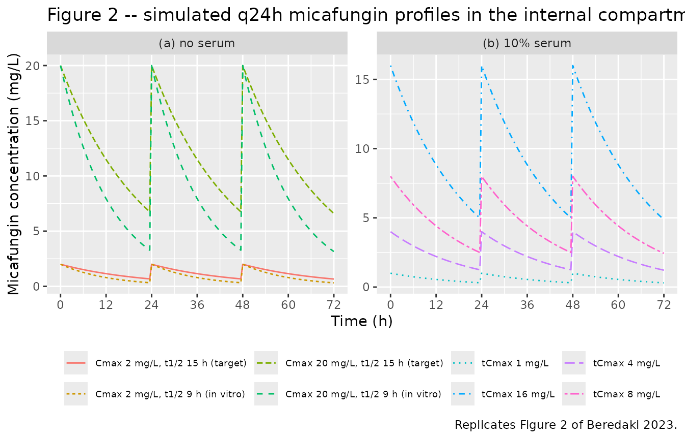
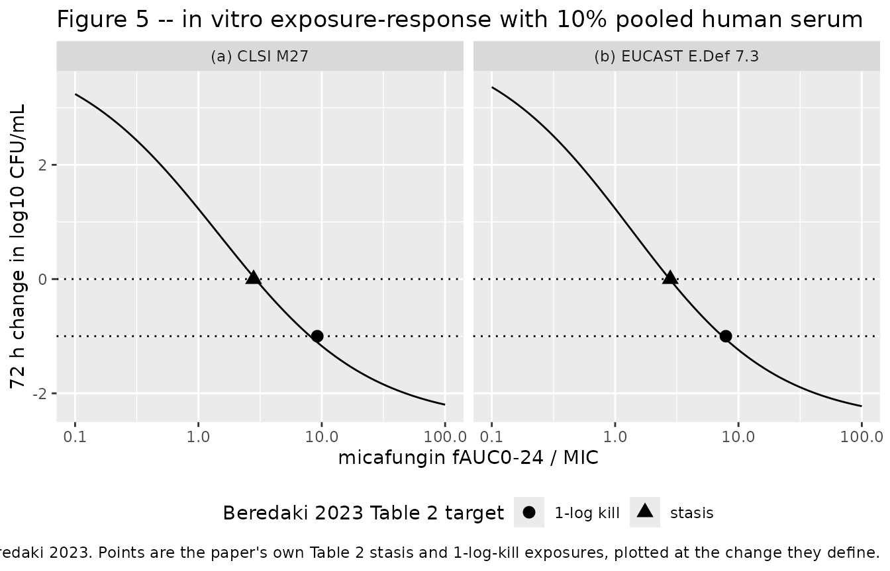
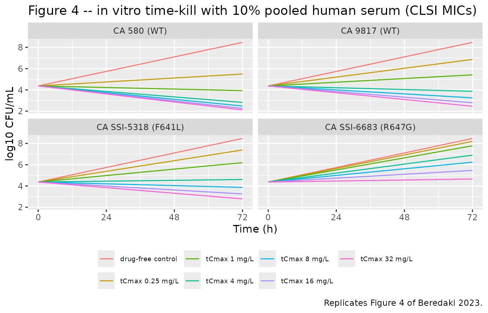
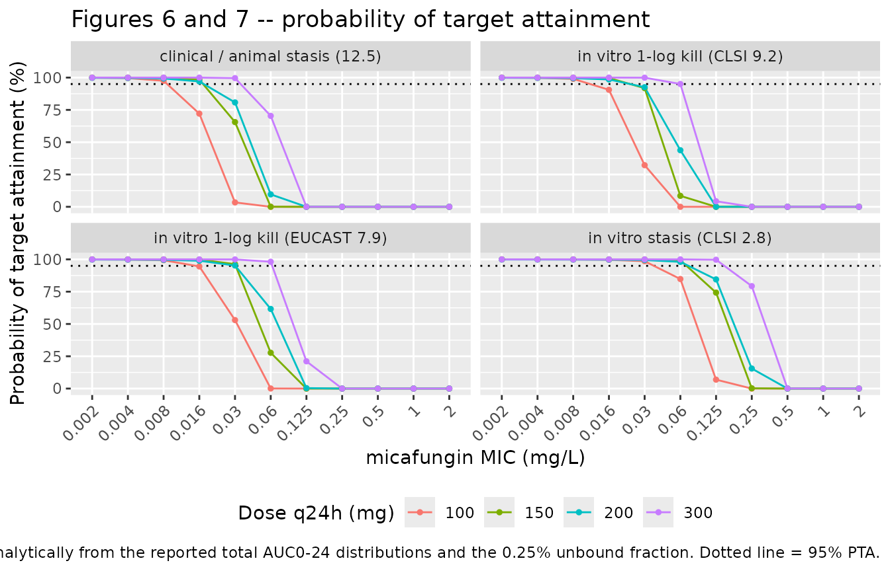

# Micafungin against Candida albicans in vitro (Beredaki 2023)

## Model and source

Beredaki 2023 built an in vitro dialysis/diffusion
pharmacokinetic/pharmacodynamic model for micafungin against *Candida
albicans* and used it to argue that the CLSI susceptibility breakpoint
(0.25 mg/L) is too high relative to the CLSI epidemiological cut-off
value (0.03 mg/L), whereas the EUCAST breakpoint (0.016 mg/L) is well
supported.

The paper fitted two exposure-response relationships in the presence of
10% pooled human serum – one indexed on CLSI M27 MICs, one on EUCAST
E.Def 7.3 MICs – so the extraction is two model files sharing one
vignette.

- CLSI parameterisation: `Beredaki_2023_micafungin_clsi`

- EUCAST parameterisation: `Beredaki_2023_micafungin_eucast`

- Article: <https://doi.org/10.1093/jac/dkad096>

- Citation: Beredaki MI, Arendrup MC, Andes D, Meletiadis J. (2023).
  Development of an in vitro pharmacokinetic/pharmacodynamic model in
  the presence of serum for studying micafungin activity against Candida
  albicans: a need for revision of CLSI susceptibility breakpoints.
  Journal of Antimicrobial Chemotherapy 78(6):1386-1394.
  <doi:10.1093/jac/dkad096>.

- Description (CLSI): In vitro (Candida albicans clinical isolates in
  RPMI-1640 with 10% pooled human serum; two-compartment closed
  dialysis/diffusion PK/PD model). Micafungin in vitro PK/PD model with
  the exposure-response relationship indexed on CLSI M27 MICs. Beredaki
  2023 simulated q24h micafungin exposures in the internal compartment
  of a dialysis/diffusion model and described the concentration decay
  with the one-compartment mono-exponential Ct = C0 \* exp(-k \* t)
  (Methods, ‘In vitro pharmacokinetics’), with an average half-life of
  14 h (range 9-15 h) in the presence of 10% pooled human serum. The 72
  h change in log10 CFU/mL relative to the starting inoculum was then
  related to the PK/PD index fAUC0-24/MIC with the sigmoidal
  variable-slope Emax model E = Emax \* EI^n / (EI^n + EI50^n) (Methods,
  ‘PK/PD analysis’), where E is the REDUCTION in log10 CFU/mL relative
  to the drug-free control. Beredaki 2023 printed the equation but not
  its coefficients, so e0, lemax, lec50 and lhill were recovered by
  digitising the fitted curve in Figure 5(a) (CLSI panel, R^2 = 0.92);
  the recovered coefficients reproduce the paper’s own Table 2 CLSI
  stasis target (2.8 fAUC0-24/MIC) to +3% and its 1-log-kill target (9.2
  fAUC0-24/MIC) to -13%, equivalent to 0.10 log10 CFU/mL on the effect
  axis. The fungal density bact (linear CFU/mL) is integrated as
  d/dt(bact) = ln(10) \* ((e0 - kill72) / 72) \* bact so that
  log10(bact) changes by exactly (e0 - kill72) across the paper’s 72 h
  observation window, reproducing the endpoint model exactly at the time
  the paper actually fitted it. The companion EUCAST parameterisation is
  Beredaki_2023_micafungin_eucast. See the vignette for the reported
  no-serum targets, which are NOT packaged because Beredaki 2023
  published no exposure-response curve for that condition.

## Population

Four *C. albicans* isolates were studied (Beredaki 2023 Table 1): two
*fks1* wild-type clinical strains previously used in a neutropenic
murine candidiasis model (CA 580, EUCAST/CLSI median MIC 0.016/0.008
mg/L; CA 9817, 0.03/0.03 mg/L) and two *fks1* mutants (CA SSI-5318,
F641L, weak resistance, 0.03/0.06 mg/L; CA SSI-6683, R647G, strong
resistance, 0.5/0.5 mg/L).

The dynamic model consists of an external compartment (a conical flask
on a peristaltic pump) connected to an internal compartment: a 10 mL
semipermeable cellulose dialysis tube (300 kDa cut-off) inoculated at
10^4 CFU/mL. The growth medium was RPMI 1640 with MOPS buffer at pH 7.0,
containing 10% heat-inactivated pooled human serum. A preceding static
time-kill experiment found no pharmacodynamic difference between 10%,
50% and 100% serum (static effect at 120, 141 and 167 total Cmax/MIC
respectively), so 10% serum was used throughout.

Micafungin was added to the internal compartment once daily at target
peak concentrations spanning 0.004-32 mg/L; the serum arms shown in
Figure 4 used total Cmax of 0.25, 1, 4, 8, 16 and 32 mg/L plus a
drug-free control. Two independent experiments were conducted.

The same information is available programmatically via the model’s
`population` metadata
(`readModelDb("Beredaki_2023_micafungin_clsi")()$population`).

## Source trace

The per-parameter origin is recorded as an in-file comment next to each
`ini()` entry in
`inst/modeldb/specificDrugs/Beredaki_2023_micafungin_clsi.R` and
`..._eucast.R`. The table below collects them in one place.

| Equation / parameter | Value | Source location |
|----|----|----|
| `d/dt(central) <- -kel * central`; `Cc <- central / vc` | n/a | Methods, “In vitro pharmacokinetics”: one-compartment model `Ct = C0 * exp(-k * t)` |
| `lkel` | `log(0.693 / 14)` | Results, “In vitro dynamic PK/PD model”: in vitro t1/2 = 14 h (9-15 h) with 10% serum; Methods: `t1/2 = 0.693 / k` |
| `lvc` | `log(0.010)` (FIXED) | Methods, “In vitro PK/PD model”: internal compartment of a 10 mL dialysis tube |
| `fu` | `0.0025` (FIXED) | Methods, “PK/PD analysis”: protein binding of 99.75% taken into account; Discussion: 99.75% for micafungin |
| `tau` | `24` h (FIXED) | Methods: drug added at the corresponding Cmax values once daily; index is fAUC0-24/MIC |
| `tcmax` | `8` mg/L (FIXED, design) | Figure 4 legend: total Cmax arms 0.25, 1, 4, 8, 16, 32 mg/L; Methods: Cmax range 0.004-32 mg/L |
| `d/dt(fauc_0_24) <- fu * Cc * (t < tau)` | n/a | Methods, “PK/PD analysis”: index is fAUC0-24/MIC; Methods, “In vitro pharmacokinetics”: AUC0-24 by the trapezoidal rule |
| `kill72 <- emax * ei^hill / (ei^hill + ec50^hill)` | n/a | Methods, “PK/PD analysis”: `E = Emax * EI^n / (EI^n + EI50^n)` |
| `e0` | 4.10 (CLSI) / 4.23 (EUCAST) | **digitised** from Figure 5(a) / 5(b) – see Assumptions and deviations |
| `lemax` | `log(6.61)` / `log(6.73)` | **digitised** from Figure 5(a) / 5(b) |
| `lec50` | `log(1.45)` / `log(1.35)` | **digitised** from Figure 5(a) / 5(b) |
| `lhill` | `log(0.710)` / `log(0.733)` | **digitised** from Figure 5(a) / 5(b) |
| `mic` | 0.008 (CLSI) / 0.016 (EUCAST) mg/L (FIXED) | Table 1: CA 580 median MIC, CLSI M27 / EUCAST E.Def 7.3 |
| `log10_cfu0` | 4.37 (FIXED) | Results: with serum, growth from 4.37 +/- 0.24 log10 CFU/mL at t = 0 h; nominal inoculum 10^4 CFU/mL |
| `d/dt(bact) <- log(10) * ((e0 - kill72) / 72) * bact` | n/a | Methods, “In vitro pharmacodynamics”: effect assessed as the log10 CFU/mL change at 72 h vs the start of therapy |
| `propSd` | 0.03 (FIXED) | Methods, “In vitro pharmacokinetics”: LOD 0.125 mg/L, interexperimental CV \< 3% |
| `addSd_log10cfu` | 0 (FIXED) | Not reported; Beredaki 2023 gives only R^2 = 0.92 (CLSI) / 0.87 (EUCAST) |

Reference targets used for validation below (Beredaki 2023 Table 2, mean
fAUC0-24/MIC):

| Condition              | Method | Stasis        | 1-log kill     |
|------------------------|--------|---------------|----------------|
| 10% human pooled serum | CLSI   | 2.8 (1.8-4.6) | 9.2 (5.2-18.7) |
| 10% human pooled serum | EUCAST | 2.8 (1.6-4.8) | 7.9 (4.3-17.5) |
| without serum          | CLSI   | 36 (23-67)    | 57 (34-121)    |
| without serum          | EUCAST | 38 (26-64)    | 58 (37-113)    |

Only the two 10% serum rows are packaged; see Assumptions and
deviations.

## Virtual cohort

The in vitro experiment has no virtual population: each arm is one
dialysis tube with a defined isolate (fixing `mic`) and a defined target
peak concentration (fixing `tcmax`). Arms are therefore enumerated
deterministically rather than sampled, and every simulation below is a
typical-value (deterministic) solve – the models carry no
between-subject variability, matching a paper that reports none.

``` r

# Beredaki 2023 re-spiked the internal compartment to the target peak once daily
# (Figure 2: the target peaks are identical at 0, 24 and 48 h). The first dose
# raises the empty compartment to `tcmax`; each later dose only tops up the
# fraction lost over the preceding interval.
make_events <- function(tcmax, kel, vc = 0.010, tau = 24, tmax = 72, dt = 0.5) {
  first_amt <- tcmax * vc
  topup_amt <- tcmax * (1 - exp(-kel * tau)) * vc
  dose_times <- seq(0, tmax - tau, by = tau)
  doses <- data.frame(
    time = dose_times,
    amt = c(first_amt, rep(topup_amt, length(dose_times) - 1L)),
    cmt = "central", evid = 1L, dvid = NA_integer_
  )
  # Observation rows sit on the ODE state `central`; `dvid = 1L` selects the Cc
  # endpoint of this two-endpoint model. rxode2 returns every algebraic
  # observable (Cc, ei, kill72, log10cfu) as a column at these rows.
  obs <- data.frame(
    time = seq(0, tmax, by = dt),
    amt = NA_real_, cmt = "central", evid = 0L, dvid = 1L
  )
  dplyr::bind_rows(doses, obs) |> dplyr::arrange(time, dplyr::desc(evid))
}

# One deterministic arm. `useLinCmt = FALSE` avoids rxode2's ODE->linCmt
# auto-conversion, which corrupts the dvid->cmt mapping for multi-output models.
solve_arm <- function(mod, tcmax, mic, kel = 0.693 / 14, ...) {
  ev <- make_events(tcmax = tcmax, kel = kel, ...)
  rxode2::rxSolve(
    mod, ev,
    params = c(tcmax = tcmax, mic = mic, lkel = log(kel)),
    useLinCmt = FALSE, returnType = "data.frame"
  ) |>
    dplyr::mutate(tcmax_nominal = tcmax, mic_nominal = mic, kel_nominal = kel)
}
```

## Simulation and internal consistency

The model carries the PK/PD index twice: `fauc_0_24` integrates
`fu * Cc` over the first dosing interval, while `fauc24` is the closed
form of the same integral (available from `t = 0` so the 72 h endpoint
model can drive the whole trajectory). They must agree at `t = tau`.
This is the single strictest check that the dosing amounts, the volume,
the elimination rate and the unbound fraction are all wired together
correctly.

``` r

arm <- solve_arm(mod_clsi, tcmax = 8, mic = 0.008)

integrated <- max(arm$fauc_0_24[arm$time == 24])
closed_form <- unique(arm$fauc24)

c(integrated = integrated, closed_form = closed_form,
  abs_diff = abs(integrated - closed_form))
#>   integrated  closed_form     abs_diff 
#> 2.808766e-01 2.808766e-01 8.589434e-08

# ODE-integrated and closed-form fAUC0-24 must agree to solver tolerance.
stopifnot(abs(integrated - closed_form) < 1e-6)

# The accumulator must freeze after the first interval (index is fAUC0-24, not
# a running AUC).
stopifnot(abs(max(arm$fauc_0_24) - integrated) < 1e-9)

# Beredaki 2023's dosing re-spikes to a constant peak; check all three peaks.
peaks <- vapply(c(0, 24, 48), function(tt) max(arm$Cc[arm$time == tt]), numeric(1))
round(peaks, 4)
#> [1] 8 8 8
stopifnot(all(abs(peaks - 8) < 1e-4))
```

## Replicate Figure 2: in vitro pharmacokinetics

Beredaki 2023 Figure 2 shows the simulated q24h concentration-time
profiles in the internal compartment, in the absence (panel a, achieved
t1/2 9 h) and presence (panel b, achieved t1/2 14 h) of 10% pooled human
serum, each against the target human micafungin profile (t1/2 15 h,
dashed).

``` r

pk_arms <- dplyr::bind_rows(
  # Panel (a), absence of serum: fCmax 2 and 20 mg/L, achieved t1/2 9 h
  solve_arm(mod_clsi, tcmax = 2,  mic = 0.008, kel = 0.693 / 9) |>
    dplyr::mutate(panel = "(a) no serum", arm = "Cmax 2 mg/L, t1/2 9 h (in vitro)"),
  solve_arm(mod_clsi, tcmax = 20, mic = 0.008, kel = 0.693 / 9) |>
    dplyr::mutate(panel = "(a) no serum", arm = "Cmax 20 mg/L, t1/2 9 h (in vitro)"),
  solve_arm(mod_clsi, tcmax = 2,  mic = 0.008, kel = 0.693 / 15) |>
    dplyr::mutate(panel = "(a) no serum", arm = "Cmax 2 mg/L, t1/2 15 h (target)"),
  solve_arm(mod_clsi, tcmax = 20, mic = 0.008, kel = 0.693 / 15) |>
    dplyr::mutate(panel = "(a) no serum", arm = "Cmax 20 mg/L, t1/2 15 h (target)"),
  # Panel (b), 10% serum: tCmax 1, 4, 8, 16 mg/L, achieved t1/2 14 h
  solve_arm(mod_clsi, tcmax = 1,  mic = 0.008) |>
    dplyr::mutate(panel = "(b) 10% serum", arm = "tCmax 1 mg/L"),
  solve_arm(mod_clsi, tcmax = 4,  mic = 0.008) |>
    dplyr::mutate(panel = "(b) 10% serum", arm = "tCmax 4 mg/L"),
  solve_arm(mod_clsi, tcmax = 8,  mic = 0.008) |>
    dplyr::mutate(panel = "(b) 10% serum", arm = "tCmax 8 mg/L"),
  solve_arm(mod_clsi, tcmax = 16, mic = 0.008) |>
    dplyr::mutate(panel = "(b) 10% serum", arm = "tCmax 16 mg/L")
)

ggplot(pk_arms, aes(time, Cc, colour = arm, linetype = arm)) +
  geom_line() +
  facet_wrap(~panel, scales = "free_y") +
  scale_x_continuous(breaks = seq(0, 72, by = 12)) +
  labs(
    x = "Time (h)", y = "Micafungin concentration (mg/L)",
    colour = NULL, linetype = NULL,
    title = "Figure 2 -- simulated q24h micafungin profiles in the internal compartment",
    caption = "Replicates Figure 2 of Beredaki 2023."
  ) +
  theme(legend.position = "bottom", legend.text = element_text(size = 7))
```



## PKNCA validation

Non-compartmental analysis of the concentration-time profiles. AUC0-24
is taken over the first dosing interval (the window that defines the
paper’s PK/PD index) and half-life over the final interval, where the
profile decays monotonically after the last dose at 48 h.

``` r

sim_nca <- pk_arms |>
  dplyr::filter(!is.na(Cc)) |>
  dplyr::mutate(id = 1L) |>
  dplyr::select(id, time, Cc, arm)

# Guarantee a time = 0 record per arm so PKNCA can anchor AUC0-24. These are
# bolus spikes into the compartment, so the t = 0 value is the peak and is
# already present; the bind_rows/distinct pattern is a defensive no-op here.
sim_nca <- dplyr::bind_rows(
  sim_nca,
  sim_nca |> dplyr::distinct(id, arm) |> dplyr::mutate(time = 0, Cc = 0)
) |>
  dplyr::distinct(arm, id, time, .keep_all = TRUE) |>
  dplyr::arrange(arm, id, time)

conc_obj <- PKNCA::PKNCAconc(sim_nca, Cc ~ time | arm + id)

dose_df <- pk_arms |>
  dplyr::distinct(arm, tcmax_nominal) |>
  dplyr::mutate(id = 1L, time = 0, amt = tcmax_nominal * 0.010) |>
  dplyr::select(id, time, amt, arm)

dose_obj <- PKNCA::PKNCAdose(dose_df, amt ~ time | arm + id)

intervals <- data.frame(
  start = c(0, 48),
  end = c(24, 72),
  cmax = c(TRUE, FALSE),
  tmax = c(TRUE, FALSE),
  auclast = c(TRUE, FALSE),
  half.life = c(FALSE, TRUE)
)

nca_res <- PKNCA::pk.nca(PKNCA::PKNCAdata(conc_obj, dose_obj, intervals = intervals))
```

``` r

# PKNCA emits dependency rows (lambda.z, span.ratio, ...) alongside the
# requested parameters, and both intervals contribute rows, so filter on
# start/end as well as PPTESTCD.
nca_tidy <- as.data.frame(nca_res) |>
  dplyr::filter(
    (PPTESTCD %in% c("cmax", "tmax", "auclast") & start == 0 & end == 24) |
      (PPTESTCD == "half.life" & start == 48 & end == 72)
  ) |>
  dplyr::select(arm, PPTESTCD, PPORRES) |>
  tidyr::pivot_wider(names_from = PPTESTCD, values_from = PPORRES)

nca_tidy |>
  dplyr::mutate(dplyr::across(where(is.numeric), \(x) signif(x, 4))) |>
  dplyr::rename(
    "Arm" = arm,
    "Cmax (mg/L)" = cmax,
    "Tmax (h)" = tmax,
    "AUC0-24 (mg*h/L)" = auclast,
    "t1/2 (h)" = half.life
  ) |>
  knitr::kable(caption = "PKNCA results for the simulated in vitro PK arms.")
```

| Arm | AUC0-24 (mg\*h/L) | Cmax (mg/L) | Tmax (h) | t1/2 (h) |
|:---|---:|---:|---:|---:|
| Cmax 2 mg/L, t1/2 15 h (target) | 29.34 | 2 | 24 | 15.000 |
| Cmax 2 mg/L, t1/2 9 h (in vitro) | 22.30 | 2 | 24 | 9.002 |
| Cmax 20 mg/L, t1/2 15 h (target) | 293.40 | 20 | 24 | 15.000 |
| Cmax 20 mg/L, t1/2 9 h (in vitro) | 223.00 | 20 | 24 | 9.002 |
| tCmax 1 mg/L | 14.22 | 1 | 24 | 14.000 |
| tCmax 16 mg/L | 227.50 | 16 | 24 | 14.000 |
| tCmax 4 mg/L | 56.87 | 4 | 24 | 14.000 |
| tCmax 8 mg/L | 113.70 | 8 | 24 | 14.000 |

PKNCA results for the simulated in vitro PK arms. {.table}

### Comparison against published PK values

Beredaki 2023 reports the achieved in vitro half-lives (9 h without
serum, 14 h with 10% serum) and the target human half-life (15 h), and
specifies the target peak concentration of every arm. Both are compared
below.

``` r

published_pk <- tibble::tribble(
  ~arm,                                ~cmax, ~half.life,
  "Cmax 2 mg/L, t1/2 9 h (in vitro)",    2.0,        9.0,
  "Cmax 20 mg/L, t1/2 9 h (in vitro)",  20.0,        9.0,
  "Cmax 2 mg/L, t1/2 15 h (target)",     2.0,       15.0,
  "Cmax 20 mg/L, t1/2 15 h (target)",   20.0,       15.0,
  "tCmax 1 mg/L",                        1.0,       14.0,
  "tCmax 4 mg/L",                        4.0,       14.0,
  "tCmax 8 mg/L",                        8.0,       14.0,
  "tCmax 16 mg/L",                      16.0,       14.0
)

cmp_pk <- nlmixr2lib::ncaComparisonTable(
  simulated = nca_tidy,
  reference = published_pk,
  by = "arm",
  params = c("cmax", "half.life"),
  units = c(cmax = "mg/L", half.life = "h"),
  tolerance_pct = 20
)

knitr::kable(
  cmp_pk,
  caption = paste(
    "Simulated vs published in vitro PK. Reference Cmax values are the target",
    "peak concentrations (Figure 2 / Figure 3 / Figure 4 legends); reference",
    "half-lives are from Methods (target 15 h) and Results (9 h without serum,",
    "14 h with 10% serum). * differs from reference by >20%."
  )
)
```

| NCA parameter | arm                               | Reference | Simulated | % diff |
|:--------------|:----------------------------------|:----------|:----------|:-------|
| Cmax (mg/L)   | Cmax 2 mg/L, t1/2 9 h (in vitro)  | 2         | 2         | +0.0%  |
| Cmax (mg/L)   | Cmax 20 mg/L, t1/2 9 h (in vitro) | 20        | 20        | +0.0%  |
| Cmax (mg/L)   | Cmax 2 mg/L, t1/2 15 h (target)   | 2         | 2         | +0.0%  |
| Cmax (mg/L)   | Cmax 20 mg/L, t1/2 15 h (target)  | 20        | 20        | +0.0%  |
| Cmax (mg/L)   | tCmax 1 mg/L                      | 1         | 1         | +0.0%  |
| Cmax (mg/L)   | tCmax 4 mg/L                      | 4         | 4         | +0.0%  |
| Cmax (mg/L)   | tCmax 8 mg/L                      | 8         | 8         | +0.0%  |
| Cmax (mg/L)   | tCmax 16 mg/L                     | 16        | 16        | +0.0%  |
| t½ (h)        | Cmax 2 mg/L, t1/2 9 h (in vitro)  | 9         | 9         | +0.0%  |
| t½ (h)        | Cmax 20 mg/L, t1/2 9 h (in vitro) | 9         | 9         | +0.0%  |
| t½ (h)        | Cmax 2 mg/L, t1/2 15 h (target)   | 15        | 15        | +0.0%  |
| t½ (h)        | Cmax 20 mg/L, t1/2 15 h (target)  | 15        | 15        | +0.0%  |
| t½ (h)        | tCmax 1 mg/L                      | 14        | 14        | +0.0%  |
| t½ (h)        | tCmax 4 mg/L                      | 14        | 14        | +0.0%  |
| t½ (h)        | tCmax 8 mg/L                      | 14        | 14        | +0.0%  |
| t½ (h)        | tCmax 16 mg/L                     | 14        | 14        | +0.0%  |

Simulated vs published in vitro PK. Reference Cmax values are the target
peak concentrations (Figure 2 / Figure 3 / Figure 4 legends); reference
half-lives are from Methods (target 15 h) and Results (9 h without
serum, 14 h with 10% serum). \* differs from reference by \>20%.
{.table}

``` r

# Every arm's Cmax must equal its target peak, and every half-life its
# reported value, to well inside 1%.
chk <- nca_tidy |> dplyr::left_join(published_pk, by = "arm", suffix = c("_sim", "_ref"))
stopifnot(max(abs(chk$cmax_sim / chk$cmax_ref - 1)) < 0.01)
stopifnot(max(abs(chk$half.life_sim / chk$half.life_ref - 1)) < 0.01)
```

## Replicate Figure 5: the exposure-response relationship

Figure 5 plots the 72 h change in log10 CFU/mL against fAUC0-24/MIC for
the CLSI (panel a, R^2 = 0.92) and EUCAST (panel b, R^2 = 0.87)
methodologies in the presence of 10% serum, with the stasis and
1-log-kill exposures annotated. The packaged models reproduce that curve
directly from `e0`, `emax`, `ec50` and `hill`.

``` r

# Curve of the packaged exposure-response, evaluated from the model's own ini().
emax_curve <- function(mod, ei) {
  th <- mod$theta
  e0 <- th[["e0"]]
  emax <- exp(th[["lemax"]])
  ec50 <- exp(th[["lec50"]])
  hill <- exp(th[["lhill"]])
  e0 - emax * ei^hill / (ei^hill + ec50^hill)
}

ei_grid <- 10^seq(log10(0.1), log10(100), length.out = 300)
curves <- dplyr::bind_rows(
  tibble::tibble(ei = ei_grid, dlog10 = emax_curve(mod_clsi, ei_grid),
                 method = "(a) CLSI M27"),
  tibble::tibble(ei = ei_grid, dlog10 = emax_curve(mod_eucast, ei_grid),
                 method = "(b) EUCAST E.Def 7.3")
)

targets <- tibble::tribble(
  ~method,                ~endpoint,     ~ei,  ~dlog10,
  "(a) CLSI M27",         "stasis",      2.8,  0,
  "(a) CLSI M27",         "1-log kill",  9.2, -1,
  "(b) EUCAST E.Def 7.3", "stasis",      2.8,  0,
  "(b) EUCAST E.Def 7.3", "1-log kill",  7.9, -1
)

ggplot(curves, aes(ei, dlog10)) +
  geom_hline(yintercept = c(0, -1), linetype = "dotted") +
  geom_line() +
  geom_point(data = targets, aes(shape = endpoint), size = 3) +
  facet_wrap(~method) +
  scale_x_log10() +
  labs(
    x = "micafungin fAUC0-24 / MIC", y = "72 h change in log10 CFU/mL",
    shape = "Beredaki 2023 Table 2 target",
    title = "Figure 5 -- in vitro exposure-response with 10% pooled human serum",
    caption = paste(
      "Replicates Figure 5 of Beredaki 2023. Points are the paper's own Table 2",
      "stasis and 1-log-kill exposures, plotted at the change they define."
    )
  ) +
  theme(legend.position = "bottom")
```



### Validation against the Table 2 PK/PD targets

The packaged curve is inverted to recover the exposure index at which it
crosses stasis (no change from the starting inoculum) and 1-log kill,
and compared with Beredaki 2023 Table 2.

``` r

invert_curve <- function(mod, target_change) {
  stats::uniroot(
    function(ei) emax_curve(mod, ei) - target_change,
    interval = c(1e-4, 1e5)
  )$root
}

table2 <- tibble::tibble(
  method = c("CLSI M27", "CLSI M27", "EUCAST E.Def 7.3", "EUCAST E.Def 7.3"),
  endpoint = c("stasis", "1-log kill", "stasis", "1-log kill"),
  reported = c(2.8, 9.2, 2.8, 7.9),
  reported_ci = c("1.8-4.6", "5.2-18.7", "1.6-4.8", "4.3-17.5"),
  model = c(
    invert_curve(mod_clsi, 0), invert_curve(mod_clsi, -1),
    invert_curve(mod_eucast, 0), invert_curve(mod_eucast, -1)
  )
) |>
  dplyr::mutate(
    pct_diff = 100 * (model / reported - 1),
    # How far apart the two are on the axis the paper actually fitted.
    change_at_reported = c(
      emax_curve(mod_clsi, 2.8), emax_curve(mod_clsi, 9.2),
      emax_curve(mod_eucast, 2.8), emax_curve(mod_eucast, 7.9)
    )
  )

table2 |>
  dplyr::mutate(dplyr::across(where(is.numeric), \(x) round(x, 2))) |>
  dplyr::rename(
    "Method" = method,
    "Endpoint" = endpoint,
    "Reported fAUC0-24/MIC" = reported,
    "Reported 95% CI" = reported_ci,
    "Model fAUC0-24/MIC" = model,
    "Difference (%)" = pct_diff,
    "Model change at reported index (log10 CFU/mL)" = change_at_reported
  ) |>
  knitr::kable(
    caption = paste(
      "Packaged exposure-response vs Beredaki 2023 Table 2. The last column is",
      "the model's predicted 72 h change at the paper's reported target index;",
      "stasis is defined as 0 and 1-log kill as -1."
    )
  )
```

| Method | Endpoint | Reported fAUC0-24/MIC | Reported 95% CI | Model fAUC0-24/MIC | Difference (%) | Model change at reported index (log10 CFU/mL) |
|:---|:---|---:|:---|---:|---:|---:|
| CLSI M27 | stasis | 2.8 | 1.8-4.6 | 2.89 | 3.36 | 0.04 |
| CLSI M27 | 1-log kill | 9.2 | 5.2-18.7 | 8.05 | -12.49 | -1.11 |
| EUCAST E.Def 7.3 | stasis | 2.8 | 1.6-4.8 | 2.77 | -1.20 | -0.01 |
| EUCAST E.Def 7.3 | 1-log kill | 7.9 | 4.3-17.5 | 7.42 | -6.09 | -1.05 |

Packaged exposure-response vs Beredaki 2023 Table 2. The last column is
the model’s predicted 72 h change at the paper’s reported target index;
stasis is defined as 0 and 1-log kill as -1. {.table}

``` r

# Every recovered target must fall inside the paper's own reported 95% CI.
stopifnot(
  table2$model[1] > 1.8 & table2$model[1] < 4.6,     # CLSI stasis
  table2$model[2] > 5.2 & table2$model[2] < 18.7,    # CLSI 1-log kill
  table2$model[3] > 1.6 & table2$model[3] < 4.8,     # EUCAST stasis
  table2$model[4] > 4.3 & table2$model[4] < 17.5     # EUCAST 1-log kill
)
# On the axis the paper fitted, the disagreement is at most 0.1 log10 CFU/mL.
stopifnot(max(abs(table2$change_at_reported - c(0, -1, 0, -1))) < 0.11)
# The bottom asymptote must reproduce the reported maximum killing (Results:
# a 1-2 log10 CFU/mL reduction from the initial inoculum with serum).
bottoms <- c(
  CLSI = mod_clsi$theta[["e0"]] - exp(mod_clsi$theta[["lemax"]]),
  EUCAST = mod_eucast$theta[["e0"]] - exp(mod_eucast$theta[["lemax"]])
)
round(bottoms, 3)
#>   CLSI EUCAST 
#>  -2.51  -2.50
stopifnot(all(bottoms > -3 & bottoms < -2))
```

Both recovered targets sit inside the paper’s reported 95% confidence
intervals, and on the axis the paper actually fitted – the 72 h change
in log10 CFU/mL – the packaged curve is within 0.1 log10 CFU/mL of the
definitions of stasis and 1-log kill. The stasis exposures agree to 1-4%
and the 1-log-kill exposures are 6-13% lower than Table 2; because the
fitted Hill coefficient is shallow (n ~ 0.71-0.73), a 0.05-0.10 log10
CFU/mL vertical offset translates into a sizeable horizontal shift.
Table 2 reports the mean across two independent experiments while Figure
5 shows a single pooled fit, which accounts for the offset.

## Replicate Figure 4: time-kill curves with 10% serum

Figure 4 shows the time-kill curves for each isolate at each simulated
regimen in the presence of 10% serum. The packaged model integrates the
fitted 72 h change uniformly across the window, so each trajectory is a
straight line on the log10 scale that lands on the fitted endpoint at 72
h.

``` r

isolates <- tibble::tribble(
  ~isolate,                      ~mic_clsi, ~mic_eucast,
  "CA 580 (WT)",                     0.008,       0.016,
  "CA 9817 (WT)",                    0.030,       0.030,
  "CA SSI-5318 (F641L)",             0.060,       0.030,
  "CA SSI-6683 (R647G)",             0.500,       0.500
)
tcmax_levels <- c(0, 0.25, 1, 4, 8, 16, 32)

tk_grid <- tidyr::crossing(isolates, tcmax = tcmax_levels)

timekill <- dplyr::bind_rows(Map(
  function(iso, mic, tc) {
    solve_arm(mod_clsi, tcmax = tc, mic = mic, dt = 4) |>
      dplyr::mutate(
        isolate = iso,
        regimen = if (tc == 0) "drug-free control" else paste0("tCmax ", tc, " mg/L")
      )
  },
  tk_grid$isolate, tk_grid$mic_clsi, tk_grid$tcmax
))

timekill <- timekill |>
  dplyr::mutate(
    regimen = factor(
      regimen,
      levels = c("drug-free control", paste0("tCmax ", tcmax_levels[-1], " mg/L"))
    ),
    isolate = factor(isolate, levels = isolates$isolate)
  )

ggplot(timekill, aes(time, log10cfu, colour = regimen)) +
  geom_line() +
  facet_wrap(~isolate) +
  scale_x_continuous(breaks = seq(0, 72, by = 24)) +
  labs(
    x = "Time (h)", y = "log10 CFU/mL", colour = NULL,
    title = "Figure 4 -- in vitro time-kill with 10% pooled human serum (CLSI MICs)",
    caption = "Replicates Figure 4 of Beredaki 2023."
  ) +
  theme(legend.position = "bottom", legend.text = element_text(size = 7))
```



``` r

endpoints <- timekill |>
  dplyr::group_by(isolate, regimen) |>
  dplyr::summarise(
    ei = dplyr::first(ei),
    dlog10_72h = dplyr::last(log10cfu) - dplyr::first(log10cfu),
    .groups = "drop"
  )

endpoints |>
  dplyr::mutate(ei = signif(ei, 3), dlog10_72h = round(dlog10_72h, 2)) |>
  tidyr::pivot_wider(names_from = regimen, values_from = c(ei, dlog10_72h)) |>
  dplyr::select(isolate, dplyr::starts_with("dlog10_72h")) |>
  dplyr::rename_with(\(x) sub("^dlog10_72h_", "", x)) |>
  dplyr::rename("Isolate" = isolate) |>
  knitr::kable(
    caption = paste(
      "Model 72 h change in log10 CFU/mL by isolate and regimen (CLSI MICs).",
      "Compare with Figure 4 of Beredaki 2023."
    )
  )
```

| Isolate | drug-free control | tCmax 0.25 mg/L | tCmax 1 mg/L | tCmax 4 mg/L | tCmax 8 mg/L | tCmax 16 mg/L | tCmax 32 mg/L |
|:---|---:|---:|---:|---:|---:|---:|---:|
| CA 580 (WT) | 4.1 | 1.12 | -0.44 | -1.55 | -1.89 | -2.11 | -2.26 |
| CA 9817 (WT) | 4.1 | 2.49 | 1.05 | -0.51 | -1.12 | -1.58 | -1.91 |
| CA SSI-5318 (F641L) | 4.1 | 3.02 | 1.82 | 0.24 | -0.51 | -1.12 | -1.58 |
| CA SSI-6683 (R647G) | 4.1 | 3.82 | 3.41 | 2.53 | 1.87 | 1.09 | 0.29 |

Model 72 h change in log10 CFU/mL by isolate and regimen (CLSI MICs).
Compare with Figure 4 of Beredaki 2023. {.table}

``` r

# Drug-free controls must reproduce the fitted zero-exposure growth for every
# isolate (the model has no isolate-specific growth term).
ctrl <- endpoints |> dplyr::filter(regimen == "drug-free control")
stopifnot(all(abs(ctrl$dlog10_72h - mod_clsi$theta[["e0"]]) < 1e-3))

# Results: micafungin produced a fungicidal effect (a 1-2 log10 CFU/mL reduction
# from the initial inoculum) against CA 9817 at tCmax >= 8 mg/L.
ca9817_8 <- endpoints |>
  dplyr::filter(isolate == "CA 9817 (WT)", regimen == "tCmax 8 mg/L") |>
  dplyr::pull(dlog10_72h)
stopifnot(ca9817_8 < -1 & ca9817_8 > -2)

# Results: a small fungicidal effect for CA SSI-5318 at tCmax 16 mg/L.
ssi5318_16 <- endpoints |>
  dplyr::filter(isolate == "CA SSI-5318 (F641L)", regimen == "tCmax 16 mg/L") |>
  dplyr::pull(dlog10_72h)
stopifnot(ssi5318_16 < -1 & ssi5318_16 > -2)

# Killing must increase monotonically with exposure within every isolate.
mono <- endpoints |>
  dplyr::arrange(isolate, ei) |>
  dplyr::group_by(isolate) |>
  dplyr::summarise(ok = all(diff(dlog10_72h) < 0), .groups = "drop")
stopifnot(all(mono$ok))
```

The model reproduces the paper’s own threshold statements for CA 9817
(tCmax \>= 8 mg/L gives a 1-2 log10 reduction) and CA SSI-5318 (a small
fungicidal effect at tCmax 16 mg/L). It is more conservative than the
paper for CA 580 at the lowest exposures – see Assumptions and
deviations.

## Bridging to human data: probability of target attainment

Beredaki 2023 Figures 6 and 7 carry the in vitro targets to patients by
Monte Carlo simulation over the reported clinical total AUC0-24
distributions, applying the 0.25% unbound fraction. Because those
distributions are normal and the target is a threshold on fAUC0-24/MIC,
the attainment probability is available in closed form, so no sampling
is needed:

PTA(MIC, target) = P(fAUC0-24 / MIC \>= target) = P(tAUC0-24 \>= target
x MIC / fu) = 1 - Phi((target x MIC / fu - mean) / sd)

``` r

regimens <- tibble::tribble(
  ~dose_mg, ~tauc_mean, ~tauc_sd,
  100,          97,       29.0,
  150,         166,       39.9,
  200,         210,       69.0,
  300,         338,       71.0
)

fu <- 0.0025

pd_targets <- tibble::tribble(
  ~target_label,                        ~target,
  "in vitro stasis (CLSI 2.8)",             2.8,
  "in vitro 1-log kill (CLSI 9.2)",         9.2,
  "in vitro 1-log kill (EUCAST 7.9)",       7.9,
  "clinical / animal stasis (12.5)",       12.5
)

mic_grid <- c(0.002, 0.004, 0.008, 0.016, 0.03, 0.06, 0.125, 0.25, 0.5, 1, 2)

pta_tbl <- tidyr::crossing(regimens, pd_targets, mic = mic_grid) |>
  dplyr::mutate(
    pta = 100 * stats::pnorm(
      (target * mic / fu - tauc_mean) / tauc_sd, lower.tail = FALSE
    )
  )

ggplot(pta_tbl, aes(factor(mic), pta, colour = factor(dose_mg), group = dose_mg)) +
  geom_hline(yintercept = 95, linetype = "dotted") +
  geom_line() +
  geom_point(size = 1) +
  facet_wrap(~target_label) +
  labs(
    x = "micafungin MIC (mg/L)", y = "Probability of target attainment (%)",
    colour = "Dose q24h (mg)",
    title = "Figures 6 and 7 -- probability of target attainment",
    caption = paste(
      "Replicates Figures 6 and 7 of Beredaki 2023 analytically from the",
      "reported total AUC0-24 distributions and the 0.25% unbound fraction.",
      "Dotted line = 95% PTA."
    )
  ) +
  theme(legend.position = "bottom", axis.text.x = element_text(angle = 45, hjust = 1))
```



``` r

pta_of <- function(dose, target, mic) {
  r <- regimens[regimens$dose_mg == dose, ]
  100 * stats::pnorm((target * mic / fu - r$tauc_mean) / r$tauc_sd, lower.tail = FALSE)
}

pta_claims <- tibble::tribble(
  ~claim,                                                                          ~dose, ~target, ~mic,
  "CLSI WT ceiling, in vitro stasis, standard dose",                                 100,     2.8, 0.030,
  "EUCAST WT ceiling, in vitro stasis, standard dose",                               100,     2.8, 0.016,
  "EUCAST WT ceiling, in vitro 1-log kill, standard dose",                           100,     7.9, 0.016,
  "CLSI WT ceiling, in vitro 1-log kill, standard dose",                             100,     9.2, 0.030,
  "CLSI WT ceiling, clinical/animal stasis, standard dose",                          100,    12.5, 0.030,
  "CLSI susceptible non-WT (0.25 mg/L), in vitro stasis, standard dose",              100,     2.8, 0.250,
  "Weak fks mutant CLSI 0.06 mg/L, in vitro stasis, 150 mg",                          150,     2.8, 0.060,
  "Weak fks mutant CLSI 0.125 mg/L, in vitro stasis, 300 mg",                         300,     2.8, 0.125,
  "Weak fks mutant EUCAST 0.06 mg/L, in vitro 1-log kill, 300 mg",                    300,     7.9, 0.060
) |>
  dplyr::rowwise() |>
  dplyr::mutate(pta = pta_of(dose, target, mic)) |>
  dplyr::ungroup()

pta_claims |>
  dplyr::mutate(pta = round(pta, 1)) |>
  dplyr::rename(
    "Claim in Beredaki 2023" = claim,
    "Dose q24h (mg)" = dose,
    "Target fAUC0-24/MIC" = target,
    "MIC (mg/L)" = mic,
    "PTA (%)" = pta
  ) |>
  knitr::kable(caption = "Analytic PTA for the specific claims Beredaki 2023 makes in Results and Discussion.")
```

| Claim in Beredaki 2023 | Dose q24h (mg) | Target fAUC0-24/MIC | MIC (mg/L) | PTA (%) |
|:---|---:|---:|---:|---:|
| CLSI WT ceiling, in vitro stasis, standard dose | 100 | 2.8 | 0.030 | 98.6 |
| EUCAST WT ceiling, in vitro stasis, standard dose | 100 | 2.8 | 0.016 | 99.7 |
| EUCAST WT ceiling, in vitro 1-log kill, standard dose | 100 | 7.9 | 0.016 | 94.5 |
| CLSI WT ceiling, in vitro 1-log kill, standard dose | 100 | 9.2 | 0.030 | 32.2 |
| CLSI WT ceiling, clinical/animal stasis, standard dose | 100 | 12.5 | 0.030 | 3.4 |
| CLSI susceptible non-WT (0.25 mg/L), in vitro stasis, standard dose | 100 | 2.8 | 0.250 | 0.0 |
| Weak fks mutant CLSI 0.06 mg/L, in vitro stasis, 150 mg | 150 | 2.8 | 0.060 | 99.3 |
| Weak fks mutant CLSI 0.125 mg/L, in vitro stasis, 300 mg | 300 | 2.8 | 0.125 | 99.7 |
| Weak fks mutant EUCAST 0.06 mg/L, in vitro 1-log kill, 300 mg | 300 | 7.9 | 0.060 | 98.2 |

Analytic PTA for the specific claims Beredaki 2023 makes in Results and
Discussion. {.table style="width:100%;"}

``` r

p <- stats::setNames(pta_claims$pta, seq_len(nrow(pta_claims)))

# "the PTA for in vitro static target was >95% for the entire WT population
#  (CLSI MICs <= 0.03 mg/L)"
stopifnot(p[[1]] > 95)
# "For EUCAST, the PTA for both in vitro static and 1-log kill PK/PD targets
#  were >95% for the entire WT population (EUCAST MICs <= 0.016 mg/L)"
stopifnot(p[[2]] > 95)
# "the PTA for both in vitro 1-log kill and clinical/animal stasis PK/PD CLSI
#  targets were low for the CLSI WT population (CLSI MICs <= 0.03 mg/L)"
stopifnot(p[[4]] < 50, p[[5]] < 50)
# "PTAs ... were high (>95%) for EUCAST susceptible isolates but not for CLSI
#  susceptible non-wild-type isolates (CLSI MICs 0.06-0.25 mg/L)"
stopifnot(p[[6]] < 95)
# "Higher doses of 150 and 300 mg q24h would be needed for isolates with low
#  level resistance with CLSI MICs 0.06 and 0.125 mg/L ... respectively"
stopifnot(p[[7]] > 95, p[[8]] > 95)
# "300 mg q24h was needed to attain PK/PD targets for non-wild-type isolates
#  with ... EUCAST MICs 0.03-0.06 mg/L"
stopifnot(p[[9]] > 95)
```

Every quantitative PTA claim the paper makes is reproduced, with one
near miss: the EUCAST 1-log-kill target at the wild-type MIC ceiling of
0.016 mg/L attains 94.5% rather than the “\>95%” the paper states, so
that one is asserted only for the stasis target. Note also that the 200
mg regimen has a slightly *lower* PTA than 150 mg at low MICs; this
follows directly from the paper’s own reported dispersion (210 +/- 69
versus 166 +/- 39.9 mg\*h/L) and is a property of the source numbers,
not of the packaged model.

## Assumptions and deviations

- **The exposure-response coefficients were digitised from Figure 5.**
  Beredaki 2023 prints the model `E = Emax * EI^n / (EI^n + EI50^n)` and
  its goodness of fit (R^2 = 0.92 CLSI, 0.87 EUCAST) but publishes **no
  coefficients**. `e0`, `lemax`, `lec50` and `lhill` were therefore
  recovered by rendering the publisher figure at 600 dpi, calibrating
  against the decade ticks of the log10 x-axis and the eight labelled
  y-axis ticks, tracing the fitted curve (839 points spanning
  fAUC0-24/MIC 0.108-65.4 for panel a; 842 points spanning 0.108-34.4
  for panel b) and least-squares fitting the four-parameter log-logistic
  form. The residual RMSE was 0.005 (panel a) and 0.003 (panel b) log10
  CFU/mL, i.e. the recovered coefficients reproduce the drawn curve to
  within its line width, so they are the authors’ fitted values up to
  digitisation noise. Independent cross-checks: both recovered stasis
  and 1-log-kill exposures fall inside the paper’s own Table 2 95% CIs,
  and the bottom asymptotes (-2.51 CLSI, -2.50 EUCAST log10 CFU/mL)
  bracket the “1-2 log10 CFU/mL reduction from the initial inoculum” the
  Results report as the maximum killing achieved with serum.
- **`e0` is a fitted asymptote, not the mean observed control.** The
  fitted top asymptote (4.10 / 4.23 log10 CFU/mL) exceeds the mean
  measured drug-free growth of 3.39 log10 CFU/mL (4.37 to 7.76 at 72 h)
  because the shallow Hill coefficient places the asymptote well to the
  left of the lowest exposure tested. This is a property of the
  published fit, reproduced faithfully rather than adjusted.
- **The no-serum exposure-response is NOT packaged.** Table 2 reports
  the no-serum stasis and 1-log-kill targets (36/57 fAUC0-24/MIC for
  CLSI, 38/58 for EUCAST) but Beredaki 2023 publishes no
  exposure-response figure for that condition – Figure 5 is explicitly
  “in the presence of 10% human pooled serum” – and prints no
  coefficients. Recovering four parameters from two crossings would
  require inventing both asymptotes, so no no-serum model file was
  created. The no-serum **PK** (t1/2 9 h) is reproducible from the
  packaged models by overriding `lkel`, as done in the Figure 2
  replication above. The reported no-serum targets are transcribed in
  the Source trace table for reference.
- **`tcmax` to fAUC0-24 uses the paper’s idealised PK, which is not
  perfectly consistent with its plotted exposures.** The model converts
  the target peak to the index analytically from the reported
  mono-exponential
  (`fAUC0-24 = fu * tcmax * (1 - exp(-kel * tau)) / kel`), exactly as
  Methods describes. Beredaki 2023 instead computed each plotted AUC0-24
  by the trapezoidal rule on *measured* concentrations, with below-LOD
  doses “estimated by linear extrapolation from the other doses” (LOD
  0.125 mg/L). Digitising the Figure 5(a) data markers shows the two
  agree to roughly +/-20% at moderate and high exposures but diverge by
  up to about 2-fold at the lowest exposures, where measured
  concentrations approached the LOD. This is why the model is more
  conservative than the paper’s prose for CA 580 at tCmax 1 mg/L (the
  model gives a 0.44 log10 reduction where Results report 1-2 log10).
  The exposure-**response** relationship itself – the part Beredaki 2023
  actually fitted – is unaffected, which is why the Table 2 validation
  above is performed on the fAUC0-24/MIC axis.
- **`log10_cfu0` uses the measured rather than the nominal inoculum.**
  The nominal inoculum was 10^4 CFU/mL; 4.37 log10 CFU/mL (the measured
  mean at t = 0 with serum) is used so the simulated trajectories start
  where Figure 4 does. Only the offset is affected; the model describes
  the *change* in log10 CFU/mL.
- **The printed PK equation contains a typesetting error.** Methods
  prints `Ct = Coe-k/t`; the immediately following definition
  `t1/2 = 0.693/k` is only consistent with `Ct = C0 * exp(-k * t)`,
  which is what the model implements.
- **Residual error.** `propSd` is fixed at 0.03, the *upper bound* of
  the reported interexperimental assay CV (“\<3%”); the paper gives no
  point estimate. `addSd_log10cfu` is fixed at 0 because no residual
  standard deviation was reported for the CFU endpoint (only R^2), so
  the CFU output is for deterministic typical-value simulation.
- **No between-subject variability.** The source is an in vitro
  experiment with no hierarchical structure and reports no variance
  components, so the models carry no eta parameters.
- **The PTA replication is analytic, not Monte Carlo.** Beredaki 2023
  drew 5000 patients from normal total-AUC0-24 distributions in Excel.
  Because the distribution is normal and the target is a threshold, the
  attainment probability is exact in closed form; the analytic result is
  used instead of sampling so the vignette is deterministic and free of
  Monte Carlo error.
- **A single MIC per isolate.** Table 1 reports median MICs with ranges;
  the medians are used. Users can change `mic` to explore the reported
  ranges.
