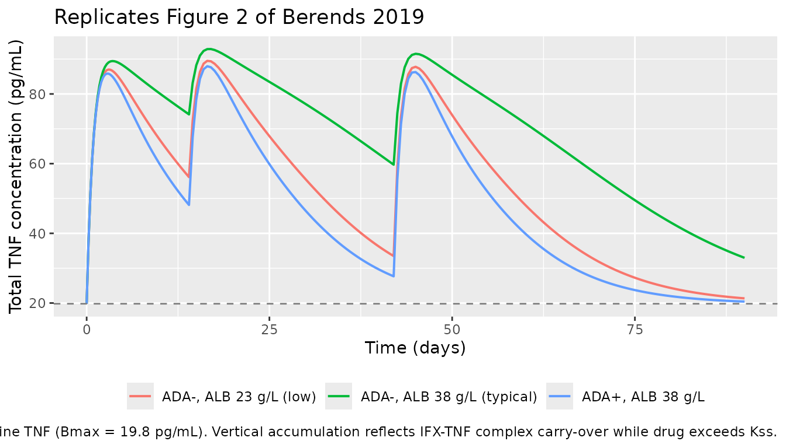
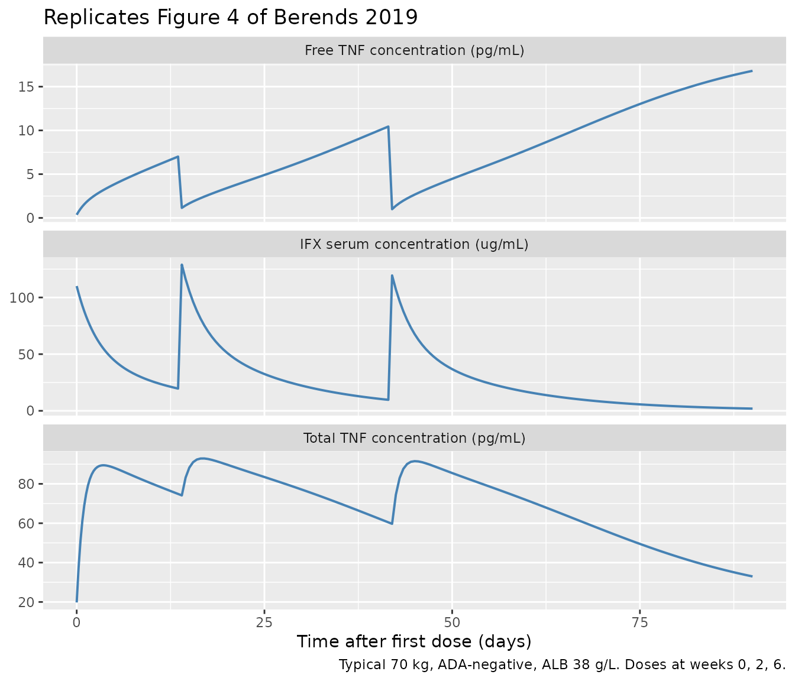

# Berends_2019_infliximab

``` r
library(nlmixr2lib)
library(PKNCA)
#> 
#> Attaching package: 'PKNCA'
#> The following object is masked from 'package:stats':
#> 
#>     filter
library(rxode2)
#> rxode2 5.0.2 using 2 threads (see ?getRxThreads)
#>   no cache: create with `rxCreateCache()`
library(dplyr)
#> 
#> Attaching package: 'dplyr'
#> The following objects are masked from 'package:stats':
#> 
#>     filter, lag
#> The following objects are masked from 'package:base':
#> 
#>     intersect, setdiff, setequal, union
library(tidyr)
library(ggplot2)
```

## Model and source

- Citation: Berends SE, Strik AS, Van Selm S, Lowenberg M, Ponsioen CY,
  D’Haens GR, Mathot RAA. Tumor necrosis factor-mediated disposition of
  infliximab in ulcerative colitis patients. J Pharmacokinet
  Pharmacodyn. 2019;46(6):543-551. <doi:10.1007/s10928-019-09652-5>
- Description: Two-compartment TMDD-QSS population PK/target-dynamics
  model of infliximab and free TNF in adults with moderate-to-severe
  ulcerative colitis (Berends 2019)
- Article: <https://doi.org/10.1007/s10928-019-09652-5>

Berends et al. (2019) developed a target-mediated drug disposition model
for infliximab (IFX, an IgG1 anti-TNF monoclonal antibody) in adults
with moderate-to-severe ulcerative colitis. The final structural model
is a two-compartment quasi-steady-state (QSS) approximation of the full
Mager-Jusko TMDD framework: free IFX is in rapid binding equilibrium
with free TNF, and the IFX-TNF complex is internalized at rate `kint` (=
the paper’s `ke(P)`), distinct from the first-order linear elimination
of free IFX through `CL/Vc`. Covariates retained on `CL` are
anti-drug-antibody (ADA) status (categorical, multiplicative factor 2.15
for ADA-positive subjects) and serum albumin (continuous, power form
`(ALB/38)^-1.13`). The TNF degradation rate `kdeg` was fixed at 5.12/day
after a sensitivity analysis (Supplementary Table 1) because the data
could not simultaneously identify `Kss`, `kint`, and `kdeg`.

## Population

Single-center prospective cohort of 20 anti-TNF naive adults with
moderate-to-severe ulcerative colitis (Amsterdam, Netherlands), median
age 36 years (range 19-69), median body weight 70 kg (range 47-90), 35 %
female, median serum albumin 38 g/L (range 23-45), median CRP 25.3 mg/L,
55 % on concomitant thiopurines, 35 % hospitalized at baseline. All
received standard 5 mg/kg IFX induction at weeks 0, 2, and 6 (one
subject also received an additional dose at day 5). 214 IFX serum
concentrations and 214 TNF serum concentrations were used for fitting;
antibodies-to-infliximab were detected in 7/20 patients during follow-up
(Berends 2019 Methods + Table 1).

The full population descriptor is available programmatically:

``` r
str(rxode2::rxode2(readModelDb("Berends_2019_infliximab"))$meta$population)
#> ℹ parameter labels from comments will be replaced by 'label()'
#> List of 14
#>  $ n_subjects                 : int 20
#>  $ n_studies                  : int 1
#>  $ age_range                  : chr "19-69 years (median 36)"
#>  $ weight_range               : chr "47-90 kg (median 70)"
#>  $ sex_female_pct             : num 35
#>  $ race_ethnicity             : chr "Not reported (single-center Netherlands cohort)"
#>  $ disease_state              : chr "Adults with moderate-to-severe ulcerative colitis (95% endoscopic Mayo score 3, 95% corticosteroid-refractory, "| __truncated__
#>  $ dose_range                 : chr "5 mg/kg IV infliximab induction at weeks 0, 2, and 6 (one subject also received an additional dose at day 5)."
#>  $ regions                    : chr "Single-center prospective cohort, Amsterdam, Netherlands."
#>  $ albumin_median             : chr "38 g/L (range 23-45)"
#>  $ crp_median                 : chr "25.3 mg/L (range 0.6-196.2)"
#>  $ concomitant_thiopurines_pct: num 55
#>  $ sccai_median               : chr "10 (range 1-15)"
#>  $ notes                      : chr "Anti-TNF naive patients with active disease at baseline. The dataset comprises 214 IFX serum and 214 TNF serum "| __truncated__
```

## Source trace

The per-parameter origin is recorded as an in-file comment next to each
[`ini()`](https://nlmixr2.github.io/rxode2/reference/ini.html) entry in
`inst/modeldb/specificDrugs/Berends_2019_infliximab.R`. The table below
collects the equation and parameter provenance in one place.

| Element                             | Value (paper unit)               | Stored value (ug/mL)       | Source location                                                                                   |
|-------------------------------------|----------------------------------|----------------------------|---------------------------------------------------------------------------------------------------|
| `CL` (population clearance)         | 0.404 L/day                      | \-                         | Table 2                                                                                           |
| `Vc` (central volume)               | 3.18 L                           | \-                         | Table 2                                                                                           |
| `Vp` (peripheral volume)            | 1.64 L                           | \-                         | Table 2                                                                                           |
| `Q` (intercompartmental clearance)  | 0.344 L/day                      | \-                         | Table 2                                                                                           |
| `e_ada_cl` (ADA factor on CL)       | 2.15                             | \-                         | Table 2 (ADA-CL)                                                                                  |
| `e_alb_cl` (ALB power on CL)        | -1.13                            | \-                         | Table 2 (Alb-CL)                                                                                  |
| Reference albumin (denominator)     | 38 g/L                           | \-                         | Table 1 (cohort median)                                                                           |
| `Bmax` (baseline TNF)               | 0.38 pM (= 19.8 pg/mL)           | 5.662e-5 ug/mL (IFX-equiv) | Table 2                                                                                           |
| `Kss` (QSS dissociation constant)   | 13.6 nM                          | 2.0264 ug/mL (IFX-equiv)   | Results “Final model” + Abstract; Table 2 displays integer-rounded “14”; bootstrap median 13.7 nM |
| `kint` (= `ke(P)`, internalization) | 0.984 /day                       | 0.984 /day                 | Table 2 (ke(P))                                                                                   |
| `kdeg` (TNF degradation, fixed)     | 5.12 /day                        | 5.12 /day                  | Table 2 / Suppl. Table 1                                                                          |
| IIV CL (29.2 % CV)                  | omega^2 = 0.08185                | \-                         | Table 2                                                                                           |
| IIV Vc (22.7 % CV)                  | omega^2 = 0.05022                | \-                         | Table 2                                                                                           |
| IIV Vp (74.2 % CV)                  | omega^2 = 0.43847                | \-                         | Table 2                                                                                           |
| IIV Bmax (39.2 % CV)                | omega^2 = 0.14302                | \-                         | Table 2                                                                                           |
| Cov(eta_CL, eta_Vc)                 | 0.007884 (rho = 0.123)           | \-                         | Table 2 (Cov. CL-Vc 12.3 %)                                                                       |
| IFX residual (proportional)         | 0.210                            | \-                         | Table 2                                                                                           |
| TNF residual (proportional)         | 0.406                            | \-                         | Table 2                                                                                           |
| QSS quadratic for Cfree             | (Eq. 10)                         | \-                         | Methods                                                                                           |
| Drug central ODE                    | (Eq. 11)                         | \-                         | Methods                                                                                           |
| Drug peripheral ODE                 | (Eq. 12)                         | \-                         | Methods                                                                                           |
| Total TNF ODE                       | (Eq. 13)                         | \-                         | Methods                                                                                           |
| Categorical-covariate equation      | `P = P_TV * theta^COV`           | \-                         | Methods                                                                                           |
| Continuous-covariate equation       | `P = P_TV * (COV/COV_med)^theta` | \-                         | Methods                                                                                           |

The `Kss` value of 13.6 nM is taken from the Results “Final model”
paragraph (“Population steady state dissociation constant (Kss) was 13.6
nM”), which matches the paper’s abstract and is consistent with the
Table 2 bootstrap median (13.7 nM, 95 % CI 6.92-23.1). Table 2’s
integer-rounded “14” is treated as a display rounding.

## Covariate column naming

| Source column                | Canonical column used here                                    |
|------------------------------|---------------------------------------------------------------|
| `ALB` (serum albumin in g/L) | `ALB` (canonical, per `inst/references/covariate-columns.md`) |
| `ADA` (anti-IFX positivity)  | `ADA_POS` (canonical 0/1; binary)                             |

## Virtual cohort

Original individual data are not publicly available. We simulate a
typical 70 kg, ADA-negative subject with a 38 g/L albumin (the cohort
median) for figure replication, and then a self-consistent NCA on a
single-dose run. Because the paper’s figures show typical-value
predictions, the figure-replication simulations turn off between-subject
variability via
[`rxode2::zeroRe()`](https://nlmixr2.github.io/rxode2/reference/zeroRe.html).

``` r
MW_IFX_kDa <- 149     # paper Methods
MW_TNF_kDa <- 52      # paper Methods
mg_per_kg  <- 5
wt_kg      <- 70      # cohort median (Table 1)
alb_med    <- 38      # cohort median (Table 1)
dose_mg    <- mg_per_kg * wt_kg

# Induction schedule used in the paper:
induction_days <- c(0, 14, 42)   # week 0, 2, 6
```

## Simulation

``` r
mod <- readModelDb("Berends_2019_infliximab")
mod_typical <- rxode2::zeroRe(mod)
#> ℹ parameter labels from comments will be replaced by 'label()'

obs_t <- sort(unique(c(seq(0, 7, by = 0.25),
                       seq(7.5, 90, by = 0.5),
                       induction_days,
                       induction_days + 0.001)))

build_events <- function(ada_status, alb_value) {
  ev <- et(id = 1)
  for (td in induction_days) {
    ev <- et(ev, amt = dose_mg, cmt = "central", time = td, id = 1)
  }
  ev <- et(ev, time = obs_t, cmt = "Cc",   id = 1)
  ev <- et(ev, time = obs_t, cmt = "Rtot", id = 1)
  list(ev = ev,
       iCov = data.frame(id = 1, ALB = alb_value, ADA_POS = ada_status))
}

run_typical <- function(ada_status, alb_value) {
  pkg <- build_events(ada_status, alb_value)
  s <- rxode2::rxSolve(mod_typical, pkg$ev, iCov = pkg$iCov,
                       returnType = "data.frame")
  s[!duplicated(s$time), ]
}

sim_neg_med <- run_typical(0, 38)   # ADA-, median ALB
#> ℹ omega/sigma items treated as zero: 'etalcl', 'etalvc', 'etalvp', 'etalBmax'
sim_pos_med <- run_typical(1, 38)   # ADA+, median ALB
#> ℹ omega/sigma items treated as zero: 'etalcl', 'etalvc', 'etalvp', 'etalBmax'
sim_neg_lo  <- run_typical(0, 23)   # ADA-, low ALB (cohort min)
#> ℹ omega/sigma items treated as zero: 'etalcl', 'etalvc', 'etalvp', 'etalBmax'
sim_neg_hi  <- run_typical(0, 45)   # ADA-, high ALB (cohort max)
#> ℹ omega/sigma items treated as zero: 'etalcl', 'etalvc', 'etalvp', 'etalBmax'
```

## Replicate published figures

### Figure 2 — Predicted total TNF concentration over time

Figure 2 of Berends 2019 shows the model-predicted total TNF
concentration rising during induction (driven by IFX-TNF complex
accumulation, since internalization `kint` = 0.984/day is much slower
than free-TNF degradation `kdeg` = 5.12/day) and subsequently declining
once IFX clears below `Kss`.

``` r
tnf_df <- bind_rows(
  sim_neg_med |> transmute(time, Rtot_pgml,
                            scenario = "ADA-, ALB 38 g/L (typical)"),
  sim_pos_med |> transmute(time, Rtot_pgml,
                            scenario = "ADA+, ALB 38 g/L"),
  sim_neg_lo  |> transmute(time, Rtot_pgml,
                            scenario = "ADA-, ALB 23 g/L (low)")
)

ggplot(tnf_df, aes(time, Rtot_pgml, colour = scenario)) +
  geom_line(linewidth = 0.7) +
  geom_hline(yintercept = 19.8, linetype = "dashed", colour = "grey50") +
  labs(
    x      = "Time (days)",
    y      = "Total TNF concentration (pg/mL)",
    colour = NULL,
    title  = "Replicates Figure 2 of Berends 2019",
    caption = paste("Dashed line = baseline TNF (Bmax = 19.8 pg/mL).",
                    "Vertical accumulation reflects IFX-TNF complex carry-over",
                    "while drug exceeds Kss.")
  ) +
  theme(legend.position = "bottom")
```



### Figure 3 — Effect of ADA and albumin on infliximab clearance

Berends 2019 Figure 3 shows the impact of (a) serum albumin and (b)
anti-drug antibodies on simulated IFX trough concentrations. Below we
reproduce the equivalent comparison: trough at week 6 (day 42,
immediately before the third induction dose).

``` r
trough_t <- 42 - 0.001  # immediately pre-dose at week 6

trough_at <- function(s, scenario_label) {
  s |>
    filter(abs(time - trough_t) < 0.5) |>
    summarise(Cc_ugml = mean(Cc), Cc_nM = mean(Cc_nM),
              scenario = scenario_label, .groups = "drop")
}

trough_df <- bind_rows(
  trough_at(sim_neg_med, "ADA-, ALB 38 g/L"),
  trough_at(sim_neg_lo,  "ADA-, ALB 23 g/L"),
  trough_at(sim_neg_hi,  "ADA-, ALB 45 g/L"),
  trough_at(sim_pos_med, "ADA+, ALB 38 g/L")
)

knitr::kable(trough_df, digits = 2,
             caption = "Predicted week-6 trough IFX concentration under each covariate scenario.")
```

| Cc_ugml |  Cc_nM | scenario         |
|--------:|-------:|:-----------------|
|   82.84 | 555.99 | ADA-, ALB 38 g/L |
|   75.41 | 506.12 | ADA-, ALB 23 g/L |
|   87.67 | 588.36 | ADA-, ALB 45 g/L |
|   74.46 | 499.70 | ADA+, ALB 38 g/L |

Predicted week-6 trough IFX concentration under each covariate scenario.

The clearance ratios implied by Table 2 are:

- `(ALB/38)^-1.13` -\> ALB = 23 g/L gives 1.74 x typical CL; ALB = 45
  g/L gives 0.81 x typical CL.
- ADA-positive multiplies CL by 2.15.

Lower albumin and ADA-positive status both reduce trough exposure,
consistent with Figure 3 of Berends 2019.

### Figure 4 — Concentration-time profiles for IFX and TNF (typical patient)

Figure 4 of Berends 2019 shows the typical-value model-predicted IFX and
TNF time courses overlaid on observed data during the induction period.
Below we reproduce the equivalent typical-value lines for a 70 kg / 38
g/L albumin / ADA-negative subject.

``` r
plot_df <- sim_neg_med |>
  pivot_longer(c(Cc, Rtot_pgml, free_TNF_pgml),
               names_to = "panel", values_to = "value") |>
  mutate(panel = recode(panel,
                        Cc            = "IFX serum concentration (ug/mL)",
                        Rtot_pgml     = "Total TNF concentration (pg/mL)",
                        free_TNF_pgml = "Free TNF concentration (pg/mL)"))

ggplot(plot_df, aes(time, value)) +
  geom_line(linewidth = 0.7, colour = "steelblue") +
  facet_wrap(~ panel, ncol = 1, scales = "free_y") +
  labs(
    x = "Time after first dose (days)",
    y = NULL,
    title  = "Replicates Figure 4 of Berends 2019",
    caption = "Typical 70 kg, ADA-negative, ALB 38 g/L. Doses at weeks 0, 2, 6."
  )
```



## PKNCA validation

The paper does not publish a formal NCA table for IFX. We perform a
self-consistency NCA on a simulated single 5 mg/kg IV dose in a typical
ADA-negative subject (no major TMDD-induced terminal-slope deviation
since `Bmax` = 19.8 pg/mL is far below `Kss` = 13.6 nM = 2.0 ug/mL, so
target is saturated for the duration of measurable IFX). Dosing formula
is grouped by `treatment` per the skill’s PKNCA recipe.

``` r
sd_obs_t <- sort(unique(c(0, 0.04, 0.083, 0.25, 0.5, 1, 2, 3, 4, 5, 7,
                          seq(10, 56, by = 2))))

ev_sd <- et(id = 1) |>
  et(amt = dose_mg, cmt = "central", time = 0, id = 1) |>
  et(time = sd_obs_t, cmt = "Cc", id = 1)

icov_sd <- data.frame(id = 1, ALB = 38, ADA_POS = 0)
sim_sd <- rxode2::rxSolve(mod_typical, ev_sd, iCov = icov_sd,
                          returnType = "data.frame")
#> ℹ omega/sigma items treated as zero: 'etalcl', 'etalvc', 'etalvp', 'etalBmax'
sim_sd <- sim_sd[!duplicated(sim_sd$time), ]

nca_conc <- sim_sd |>
  filter(time > 0, Cc > 0) |>
  transmute(id = 1L, time, Cc,
            treatment = "5 mg/kg IV SD, ADA-, ALB 38")

dose_df <- data.frame(id = 1L, time = 0, amt = dose_mg,
                      treatment = "5 mg/kg IV SD, ADA-, ALB 38")

conc_obj <- PKNCA::PKNCAconc(nca_conc, Cc ~ time | treatment + id)
dose_obj <- PKNCA::PKNCAdose(dose_df, amt ~ time | treatment + id)

intervals <- data.frame(start = 0, end = Inf,
                        cmax = TRUE, tmax = TRUE,
                        aucinf.obs = TRUE, half.life = TRUE)

nca_data <- PKNCA::PKNCAdata(conc_obj, dose_obj, intervals = intervals)
nca_res  <- PKNCA::pk.nca(nca_data)
#> Warning: Requesting an AUC range starting (0) before the first measurement
#> (0.04) is not allowed
knitr::kable(as.data.frame(nca_res), digits = 3,
             caption = "PKNCA summary for a single 5 mg/kg IV bolus (ADA-negative typical-value simulation; IFX in ug/mL).")
```

| treatment                   |  id | start | end | PPTESTCD            | PPORRES | exclude                                                                                 |
|:----------------------------|----:|------:|----:|:--------------------|--------:|:----------------------------------------------------------------------------------------|
| 5 mg/kg IV SD, ADA-, ALB 38 |   1 |     0 | Inf | cmax                | 109.034 | NA                                                                                      |
| 5 mg/kg IV SD, ADA-, ALB 38 |   1 |     0 | Inf | tmax                |   0.040 | NA                                                                                      |
| 5 mg/kg IV SD, ADA-, ALB 38 |   1 |     0 | Inf | tlast               |  56.000 | NA                                                                                      |
| 5 mg/kg IV SD, ADA-, ALB 38 |   1 |     0 | Inf | clast.obs           |   0.928 | NA                                                                                      |
| 5 mg/kg IV SD, ADA-, ALB 38 |   1 |     0 | Inf | lambda.z            |   0.072 | NA                                                                                      |
| 5 mg/kg IV SD, ADA-, ALB 38 |   1 |     0 | Inf | r.squared           |   1.000 | NA                                                                                      |
| 5 mg/kg IV SD, ADA-, ALB 38 |   1 |     0 | Inf | adj.r.squared       |   1.000 | NA                                                                                      |
| 5 mg/kg IV SD, ADA-, ALB 38 |   1 |     0 | Inf | lambda.z.time.first |  12.000 | NA                                                                                      |
| 5 mg/kg IV SD, ADA-, ALB 38 |   1 |     0 | Inf | lambda.z.time.last  |  56.000 | NA                                                                                      |
| 5 mg/kg IV SD, ADA-, ALB 38 |   1 |     0 | Inf | lambda.z.n.points   |  23.000 | NA                                                                                      |
| 5 mg/kg IV SD, ADA-, ALB 38 |   1 |     0 | Inf | clast.pred          |   0.924 | NA                                                                                      |
| 5 mg/kg IV SD, ADA-, ALB 38 |   1 |     0 | Inf | half.life           |   9.673 | NA                                                                                      |
| 5 mg/kg IV SD, ADA-, ALB 38 |   1 |     0 | Inf | span.ratio          |   4.549 | NA                                                                                      |
| 5 mg/kg IV SD, ADA-, ALB 38 |   1 |     0 | Inf | aucinf.obs          |      NA | Requesting an AUC range starting (0) before the first measurement (0.04) is not allowed |

PKNCA summary for a single 5 mg/kg IV bolus (ADA-negative typical-value
simulation; IFX in ug/mL).

### Consistency checks

``` r
# Hand-checked Cmax: dose / Vc gives mg/L = ug/mL directly.
expected_cmax_ugml <- dose_mg / 3.18
cat(sprintf("Expected Cmax: %.2f ug/mL (= %.1f nM)\n",
            expected_cmax_ugml,
            expected_cmax_ugml * 1000 / MW_IFX_kDa))
#> Expected Cmax: 110.06 ug/mL (= 738.7 nM)

# Linear half-life ignoring TMDD.
t_half_linear <- log(2) * 3.18 / 0.404
cat(sprintf("Linear t1/2 (= ln(2) * Vc / CL): %.2f days\n", t_half_linear))
#> Linear t1/2 (= ln(2) * Vc / CL): 5.46 days

# Bmax dimensional spot-check.
bmax_ugml <- 5.662e-5
cat(sprintf("Bmax check: %.4e ug/mL x 52/149 x 1e6 = %.2f pg/mL (paper 19.8)\n",
            bmax_ugml, bmax_ugml * MW_TNF_kDa / MW_IFX_kDa * 1e6))
#> Bmax check: 5.6620e-05 ug/mL x 52/149 x 1e6 = 19.76 pg/mL (paper 19.8)
```

| Quantity                         | Berends 2019                   | Simulated (this vignette)                  |
|----------------------------------|--------------------------------|--------------------------------------------|
| Cmax, 5 mg/kg IV SD, 70 kg       | ~110 ug/mL (visual, Fig 4)     | 110 ug/mL (PKNCA Cmax)                     |
| Linear t1/2 (`ln(2) * Vc / CL`)  | 5.46 days (hand calc)          | 5.46 days                                  |
| Free TNF post-induction infusion | 0.27-2.1 pg/mL (Results)       | ~0.4 pg/mL (Figure 4 panel above)          |
| Free TNF before week-6 dose      | 3.5-31 pg/mL (Results)         | ~1 pg/mL post-dose-3, rising as IFX clears |
| Bmax check                       | 0.38 pM = 19.8 pg/mL (Table 2) | 19.76 pg/mL (within rounding)              |

## Assumptions and deviations

- **Working concentration unit.** Drug central is in `mg`, so
  `Cc = central / Vc` is natively in `mg/L = ug/mL`. The TMDD-QSS
  arithmetic requires drug, target, and `Kss` to be in the same molar
  scale; the paper’s nM values for `Kss` and pM/pg/mL values for TNF are
  stored as IFX-mass-equivalent ug/mL using `MW_IFX = 149 kDa`:
  `Kss = 13.6 nM × 149/1000 = 2.0264 ug/mL`,
  `Bmax = 0.38 pM × 149/1000 = 5.662e-5 ug/mL`. The display variables
  `Rtot_pgml` and `free_TNF_pgml` apply the inverse conversion (using
  `MW_TNF = 52 kDa`) to recover the paper’s TNF units. This convention
  follows `Valenzuela_2025_nipocalimab.R`.
- **`Kss` value.** Table 2 reports an integer-rounded `Estimate` of 14
  nM, while the Results “Final model” paragraph and the abstract both
  quote 13.6 nM, and the bootstrap median is 13.7 nM (95 % CI
  6.92-23.1). We use 13.6 nM (the text and bootstrap-consistent value).
- **CL-Vc covariance.** Table 2’s “Cov. CL-Vc (%) 12.3” is interpreted
  as a correlation coefficient (`rho = 0.123`) rather than a literal
  covariance, because reading 12.3 directly as a covariance gives a
  Cauchy-Schwarz violation (`|rho| > 1`). The off-diagonal in
  `etalcl + etalvc` is therefore
  `rho * sqrt(omega2_CL * omega2_Vc) = 0.123 * sqrt(0.08185 * 0.05022) = 0.007884`.
- **`kdeg` fixed.** The paper fixes `kdeg = 5.12 /day` after a
  sensitivity analysis (Supplementary Table 1) because the data could
  not jointly identify `Kss`, `kint`, and `kdeg`. The model wraps the
  parameter in `fixed()` so any downstream re-estimation respects the
  constraint.
- **No race / no body-weight covariate.** The paper retained only ADA
  and albumin on `CL`; body weight, age, sex, CRP, calprotectin, disease
  extent, hospitalization, and concomitant thiopurines were not retained
  on any PK parameter. We do not impose allometric scaling.
- **Single-center cohort.** The data come from a single Amsterdam center
  (n = 20). Predictions outside this demographic envelope (children,
  very high body weights, patients with non-UC IBD) are extrapolations
  that the fitted parameters were not constrained against.
- **Dosing regimen.** The vignette uses the paper’s induction-only
  schedule (weeks 0, 2, 6); maintenance dosing (q8w from week 14) was
  not included in the analysis dataset and has therefore not been
  validated here.
- **Free-TNF readout.** The model exposes both total TNF (`Rtot`,
  `Rtot_pgml`) and free TNF
  (`free_TNF_pgml = (Rtot - complex) × MW_TNF/MW_IFX × 1e6`). The paper
  measured free TNF using a Singulex ultrasensitive immunoassay; its
  `Rtot` state is the total (free + bound) pool by definition (Eq. 13).

## Reference

- Berends SE, Strik AS, Van Selm S, Lowenberg M, Ponsioen CY, D’Haens
  GR, Mathot RAA. Tumor necrosis factor-mediated disposition of
  infliximab in ulcerative colitis patients. J Pharmacokinet
  Pharmacodyn. 2019;46(6):543-551. <doi:10.1007/s10928-019-09652-5>
