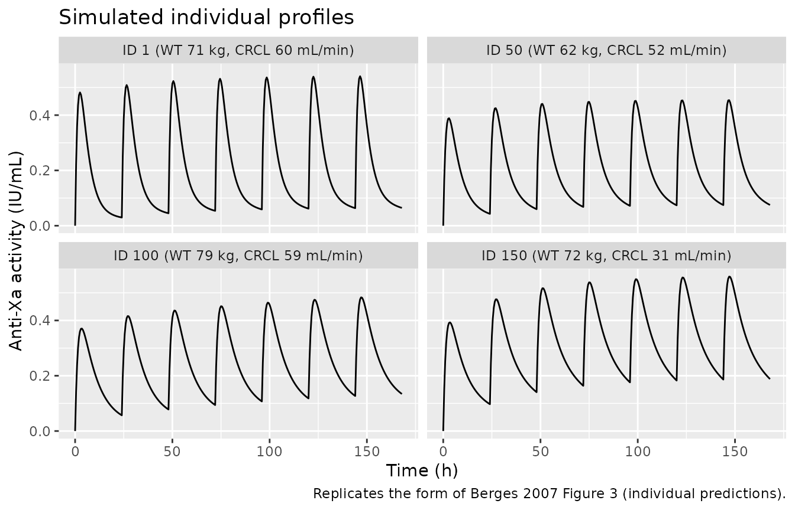
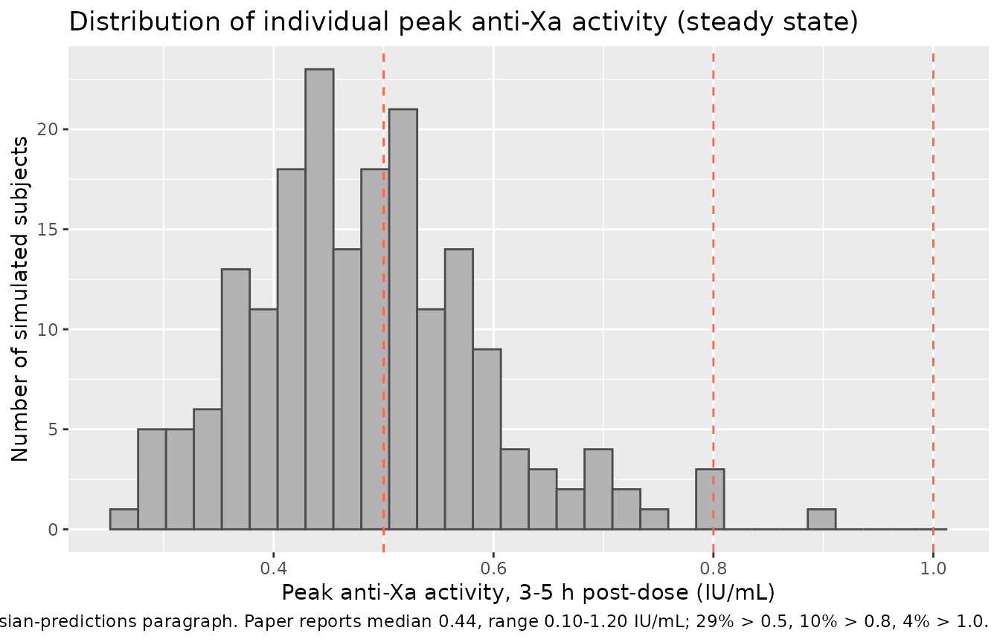

# Enoxaparin (Berges 2007)

## Model and source

- Citation: Berges A, Laporte S, Epinat M, Zufferey P, Alamartine E,
  Tranchand B, Decousus H, Mismetti P. Anti-factor Xa activity of
  enoxaparin administered at prophylactic dosage to patients over 75
  years old. Br J Clin Pharmacol. 2007;64(4):428-438.
- Article: <https://doi.org/10.1111/j.1365-2125.2007.02920.x>

The Berges 2007 PROPHRE.75 model is a two-compartment
first-order-absorption population PK model that describes anti-factor Xa
(anti-Xa) activity as a surrogate for enoxaparin concentration after
once-daily prophylactic subcutaneous injections of 4000 IU in elderly
patients (\>75 years). Body weight enters as a power-form covariate on
apparent clearance and central volume, and creatinine clearance
estimated by the simplified Modification of Diet in Renal Disease (MDRD)
formula enters as a power-form covariate on apparent clearance.

## Population

The PROPHRE.75 study (Berges 2007 Table 1) enrolled 189 elderly
inpatients treated with subcutaneous enoxaparin 4000 IU once daily for
VTE prophylaxis in medical and surgical contexts:

- Age: mean 82 +/- 5 years (range 75-95, median 81); 50% were over 81
  years.
- Sex: 62% women.
- Weight: mean 66 +/- 14 kg (range 38-108); 22% under 55 kg; 8% obese
  (BMI \> 30 kg/m^2).
- Renal function (median, range): Cockcroft-Gault CrCl 52 mL/min
  (24-93); simplified-MDRD CrCl 69 mL/min (27-127). Half had moderate or
  severe renal failure by Cockcroft-Gault (CrCl \< 50 mL/min); only 18%
  by simplified MDRD.
- Indications: 63% immobility from acute medical disease, 15%
  orthopaedic surgery, 22% stroke.
- Common comorbidities: hypertension 57%, diabetes 24%, cancer 19%; 36%
  concomitant antiplatelet agents.

The mean duration of treatment was 7 days. A total of 451 anti-Xa
activity samples were analysed (mean 2.4 per patient – very sparse).

The same information is available programmatically via
`readModelDb("Berges_2007_enoxaparin")` (e.g. inspect the function body
for the `population` metadata).

## Source trace

The per-parameter origin is recorded as an in-file comment next to each
`ini()` entry in `inst/modeldb/specificDrugs/Berges_2007_enoxaparin.R`.
The table below collects them in one place.

| Equation / parameter | Value | Source location |
|----|----|----|
| `lka` (Ka) | log(0.63 1/h) | Berges 2007 Table 3, KA row |
| `lcl` (CL/F at WT=65, CRCL=69) | log(0.70 L/h) | Berges 2007 Table 3, theta1 row |
| `lvc` (V2/F at WT=65) | log(6.43 L) | Berges 2007 Table 3, theta2 row |
| `lq` (Q/F) | log(0.34 L/h) | Berges 2007 Table 3, Q row |
| `lvp` (V3/F) | log(8.18 L) | Berges 2007 Table 3, V3 row |
| `e_wt_cl` | 0.78 | Berges 2007 Table 3, theta6 row; Discussion confirms agreement with allometric 0.75 |
| `e_crcl_cl` | 0.25 | Berges 2007 Table 3, theta7 row |
| `e_wt_vc` | 1.25 | Berges 2007 Table 3, theta8 row; Discussion confirms agreement with allometric 1.0 |
| `etalcl` (omega^2) | 0.0654 | Berges 2007 Table 3, CL IIV 26% CV converted via omega^2 = log(CV^2 + 1) |
| `etalvc` (omega^2) | 0.0223 | Berges 2007 Table 3, V2 IIV 15% CV converted via omega^2 = log(CV^2 + 1) |
| `etalvp` (omega^2) | 0.6229 | Berges 2007 Table 3, V3 IIV 93% CV converted via omega^2 = log(CV^2 + 1) |
| KA, Q IIV | 0 (fixed) | Berges 2007 Table 3, “0 FIXED” entries |
| `propSd` | 0.30 | Berges 2007 Table 3, residual variability sigma row |
| Structural model | 2-compartment, first-order SC absorption | Berges 2007 Results \> Model building |
| Covariate selection | weight + simplified-MDRD CrCl on CL, weight on V2 | Berges 2007 Table 2 (forward + backward selection, p \< 0.01 backward); gender was dropped at backward elimination |

## Virtual cohort

The PROPHRE.75 study did not release individual-level data; the
simulations below use a virtual cohort whose demographics (weight,
simplified-MDRD CrCl) were sampled to approximate Berges 2007 Table 1.

``` r

set.seed(2007)
n_subj <- 189L

# Weight: paper reports mean 66 +/- 14 kg, range 38-108. A truncated log-normal
# with the right mean and SD that respects the lower bound (38 kg) gives a
# defensible match without a published density. Resample any draw that falls
# outside the [38, 108] envelope (rejection sampling).
draw_truncated <- function(n, mean, sd, lower, upper, log_normal = FALSE) {
  out <- numeric(0)
  while (length(out) < n) {
    if (log_normal) {
      cv <- sd / mean
      sdlog <- sqrt(log(cv^2 + 1))
      meanlog <- log(mean) - sdlog^2 / 2
      draw <- rlnorm(n, meanlog = meanlog, sdlog = sdlog)
    } else {
      draw <- rnorm(n, mean = mean, sd = sd)
    }
    draw <- draw[draw >= lower & draw <= upper]
    out <- c(out, draw)
  }
  out[seq_len(n)]
}

cohort <- tibble(
  id   = seq_len(n_subj),
  WT   = draw_truncated(n_subj, mean = 66, sd = 14, lower = 38, upper = 108, log_normal = TRUE),
  CRCL = draw_truncated(n_subj, mean = 69, sd = 20, lower = 27, upper = 127)
)

summary(cohort[, c("WT", "CRCL")])
#>        WT              CRCL       
#>  Min.   : 39.54   Min.   : 27.18  
#>  1st Qu.: 57.66   1st Qu.: 56.71  
#>  Median : 65.14   Median : 69.18  
#>  Mean   : 66.20   Mean   : 69.57  
#>  3rd Qu.: 73.95   3rd Qu.: 82.53  
#>  Max.   :103.69   Max.   :115.73

# Build the event table for a 7-day prophylactic regimen (paper-reported mean
# treatment duration). Doses at 0, 24, 48, ... 144 h; observations every 0.5 h
# up to 168 h (one day after the last dose, so the simulation covers the full
# steady-state cycle).
dose_times <- seq(0, 144, by = 24)
obs_times  <- seq(0, 168, by = 0.5)

make_subject <- function(id, WT, CRCL) {
  doses <- tibble(
    id = id, time = dose_times, amt = 4000, cmt = "depot",
    evid = 1L, WT = WT, CRCL = CRCL
  )
  obs <- tibble(
    id = id, time = obs_times, amt = NA_real_, cmt = NA_character_,
    evid = 0L, WT = WT, CRCL = CRCL
  )
  bind_rows(doses, obs) |> arrange(time)
}

events <- lapply(
  seq_len(nrow(cohort)),
  function(i) make_subject(cohort$id[i], cohort$WT[i], cohort$CRCL[i])
) |> bind_rows()
stopifnot(!anyDuplicated(unique(events[, c("id", "time", "evid")])))
```

## Simulation

``` r

mod <- readModelDb("Berges_2007_enoxaparin")
sim <- rxode2::rxSolve(mod, events = events, keep = c("WT", "CRCL"))
#> ℹ parameter labels from comments will be replaced by 'label()'
sim <- as.data.frame(sim)
```

Typical-value (zero random-effects) profile at the reference patient
(`WT = 65`, `CRCL = 69`):

``` r

mod_typical <- mod |> rxode2::zeroRe()
#> ℹ parameter labels from comments will be replaced by 'label()'
ev_typ <- tibble(
  id = 1L,
  time = c(dose_times, obs_times),
  amt  = c(rep(4000, length(dose_times)), rep(NA_real_, length(obs_times))),
  cmt  = c(rep("depot", length(dose_times)), rep(NA_character_, length(obs_times))),
  evid = c(rep(1L, length(dose_times)), rep(0L, length(obs_times))),
  WT   = 65,
  CRCL = 69
) |> arrange(time)
sim_typ <- as.data.frame(rxode2::rxSolve(mod_typical, events = ev_typ))
#> ℹ omega/sigma items treated as zero: 'etalcl', 'etalvc', 'etalvp'
```

## Replicate published figures

``` r

# Replicates Figure 3 of Berges 2007: individual predictions vs. observations
# for four representative patients. The paper's plot showed observation + the
# individual-Bayesian fit; here we show a few simulated trajectories with
# different (WT, CRCL) draws from the virtual cohort to illustrate the typical
# concentration-time profile across the demographic range.
example_ids <- c(1L, 50L, 100L, 150L)
ex_sim <- sim |> filter(id %in% example_ids)
ggplot(ex_sim, aes(time, Cc, group = id)) +
  geom_line() +
  facet_wrap(~ id, labeller = function(x) {
    df <- cohort |> filter(id %in% example_ids)
    list(id = sprintf("ID %d (WT %.0f kg, CRCL %.0f mL/min)",
                     df$id, df$WT, df$CRCL))
  }) +
  labs(x = "Time (h)", y = "Anti-Xa activity (IU/mL)",
       title = "Simulated individual profiles",
       caption = "Replicates the form of Berges 2007 Figure 3 (individual predictions).")
```



``` r

# Replicates Berges 2007 Results > Bayesian predictions: distribution of
# individual peak anti-Xa activities between 3-5 h after subcutaneous
# injection. Paper reports range 0.10-1.20 IU/mL, median 0.44; 29% > 0.5, 10% > 0.8,
# 4% > 1.0.
peak_window <- sim |>
  group_by(id) |>
  filter(time >= 144 + 3, time <= 144 + 5) |>   # peak window after the final dose
  summarise(peak = max(Cc, na.rm = TRUE), .groups = "drop")

paper_thresholds <- tibble(
  threshold_IU_mL = c(0.5, 0.8, 1.0),
  paper_pct       = c(29, 10, 4)
)
sim_pct <- paper_thresholds |>
  mutate(sim_pct = sapply(threshold_IU_mL,
                          function(th) 100 * mean(peak_window$peak > th)))
print(sim_pct)
#> # A tibble: 3 × 3
#>   threshold_IU_mL paper_pct sim_pct
#>             <dbl>     <dbl>   <dbl>
#> 1             0.5        29   40.7 
#> 2             0.8        10    1.59
#> 3             1           4    0

ggplot(peak_window, aes(peak)) +
  geom_histogram(bins = 30, fill = "grey70", colour = "grey30") +
  geom_vline(xintercept = c(0.5, 0.8, 1.0), colour = "tomato", linetype = "dashed") +
  labs(x = "Peak anti-Xa activity, 3-5 h post-dose (IU/mL)",
       y = "Number of simulated subjects",
       title = "Distribution of individual peak anti-Xa activity (steady state)",
       caption = paste0("Replicates Berges 2007 Bayesian-predictions paragraph. ",
                        "Paper reports median 0.44, range 0.10-1.20 IU/mL; ",
                        "29% > 0.5, 10% > 0.8, 4% > 1.0."))
```



## PKNCA validation

PKNCA is run on the per-cycle steady-state interval (the final 24-hour
dosing interval, 144-168 h) so the reported NCA reflects steady-state
prophylactic dosing.

``` r

sim_nca <- sim |>
  dplyr::filter(!is.na(Cc)) |>
  dplyr::select(id, time, Cc, WT, CRCL) |>
  dplyr::mutate(treatment = "Enoxaparin 4000 IU SC QD")

# Guarantee a time = 0 row per subject (extravascular pre-dose Cc = 0).
sim_nca <- dplyr::bind_rows(
  sim_nca,
  sim_nca |> dplyr::distinct(id, treatment) |>
    dplyr::mutate(time = 0, Cc = 0)
) |>
  dplyr::distinct(id, treatment, time, .keep_all = TRUE) |>
  dplyr::arrange(id, treatment, time)

conc_obj <- PKNCA::PKNCAconc(
  sim_nca, Cc ~ time | treatment + id,
  concu = "IU/mL", timeu = "h"
)

dose_df <- events |>
  dplyr::filter(evid == 1) |>
  dplyr::select(id, time, amt) |>
  dplyr::mutate(treatment = "Enoxaparin 4000 IU SC QD")

dose_obj <- PKNCA::PKNCAdose(
  dose_df, amt ~ time | treatment + id,
  doseu = "IU"
)

# Steady-state interval: the last full dosing cycle (144-168 h).
intervals <- data.frame(
  start    = 144,
  end      = 168,
  cmax     = TRUE,
  tmax     = TRUE,
  cmin     = TRUE,
  auclast  = TRUE,
  cav      = TRUE
)

nca_res <- PKNCA::pk.nca(PKNCA::PKNCAdata(conc_obj, dose_obj, intervals = intervals))
```

### Comparison against published anti-Xa peak distribution

Berges 2007 does not tabulate Cmax / Tmax / AUC as a formal NCA, but the
Bayesian-predictions paragraph reports the median peak anti-Xa activity
in the 3-5 h post-dose window and the fraction of subjects above three
clinically interesting thresholds (0.5, 0.8, 1.0 IU/mL).

``` r

sim_peak_summary <- tibble(
  treatment    = "Enoxaparin 4000 IU SC QD",
  median_peak  = median(peak_window$peak),
  min_peak     = min(peak_window$peak),
  max_peak     = max(peak_window$peak),
  pct_gt_0_5   = round(100 * mean(peak_window$peak > 0.5), 1),
  pct_gt_0_8   = round(100 * mean(peak_window$peak > 0.8), 1),
  pct_gt_1_0   = round(100 * mean(peak_window$peak > 1.0), 1)
)
sim_peak_summary
#> # A tibble: 1 × 7
#>   treatment       median_peak min_peak max_peak pct_gt_0_5 pct_gt_0_8 pct_gt_1_0
#>   <chr>                 <dbl>    <dbl>    <dbl>      <dbl>      <dbl>      <dbl>
#> 1 Enoxaparin 400…       0.478    0.264    0.892       40.7        1.6          0

published_peak <- tibble::tibble(
  treatment    = "Enoxaparin 4000 IU SC QD",
  median_peak  = 0.44,
  min_peak     = 0.10,
  max_peak     = 1.20,
  pct_gt_0_5   = 29,
  pct_gt_0_8   = 10,
  pct_gt_1_0   = 4
)

cmp <- bind_rows(
  sim_peak_summary |> mutate(source = "Simulated"),
  published_peak  |> mutate(source = "Berges 2007 (Bayesian predictions)")
) |> relocate(source)

knitr::kable(
  cmp,
  caption = "Steady-state peak anti-Xa (3-5 h post final dose): simulated virtual cohort vs Berges 2007 Bayesian predictions.",
  digits  = 2
)
```

| source | treatment | median_peak | min_peak | max_peak | pct_gt_0_5 | pct_gt_0_8 | pct_gt_1_0 |
|:---|:---|---:|---:|---:|---:|---:|---:|
| Simulated | Enoxaparin 4000 IU SC QD | 0.48 | 0.26 | 0.89 | 40.7 | 1.6 | 0 |
| Berges 2007 (Bayesian predictions) | Enoxaparin 4000 IU SC QD | 0.44 | 0.10 | 1.20 | 29.0 | 10.0 | 4 |

Steady-state peak anti-Xa (3-5 h post final dose): simulated virtual
cohort vs Berges 2007 Bayesian predictions. {.table}

PKNCA steady-state per-subject Cmax / Tmax / AUC0-tau summary (no
published counterpart):

``` r

nca_tbl <- as.data.frame(nca_res$result)
nca_summary <- nca_tbl |>
  dplyr::group_by(PPTESTCD) |>
  dplyr::summarise(
    median = signif(median(PPORRES, na.rm = TRUE), 3),
    q05    = signif(quantile(PPORRES, 0.05, na.rm = TRUE), 3),
    q95    = signif(quantile(PPORRES, 0.95, na.rm = TRUE), 3),
    .groups = "drop"
  )
knitr::kable(
  nca_summary,
  caption = "Steady-state NCA summary (144-168 h cycle, virtual PROPHRE.75-like cohort)."
)
```

| PPTESTCD | median |    q05 |   q95 |
|:---------|-------:|-------:|------:|
| auclast  | 5.8400 | 3.5500 | 8.800 |
| cav      | 0.2430 | 0.1480 | 0.367 |
| cmax     | 0.4780 | 0.3210 | 0.699 |
| cmin     | 0.0915 | 0.0387 | 0.187 |
| tmax     | 3.0000 | 2.5000 | 3.500 |

Steady-state NCA summary (144-168 h cycle, virtual PROPHRE.75-like
cohort). {.table}

## Assumptions and deviations

- **Block matrix correlation between CL and V2 is set to zero.** Berges
  2007 Results \> Model building states that “A block matrix was added
  to take into account the correlation between CL and V2,” but Table 3
  reports only the diagonal CV%s; the off-diagonal covariance value is
  not published. The model encodes diagonal etas for `etalcl` and
  `etalvc` (no block); the paper-reported CL and V2 %CVs are preserved
  on the diagonal. A simulator who has an internal estimate of the
  correlation can re-introduce a block via
  `ini(etalcl + etalvc ~ c(var_cl, cov, var_vc))`.
- **Virtual-cohort covariate sampling.** The PROPHRE.75 study did not
  release individual-level data; weight is drawn from a truncated
  log-normal matched to Berges 2007 Table 1 (mean 66 kg, SD 14 kg,
  truncated to \[38, 108\]), and simplified-MDRD CrCl from a truncated
  normal (mean 69 mL/min, SD 20, truncated to \[27, 127\]). Sex,
  indication category, and concomitant medications are not simulated
  because they were not retained in the final covariate model.
- **Gender effect on CL is excluded.** Berges 2007 Table 2 retained
  gender on CL through forward selection (p \< 0.01) but dropped it at
  backward elimination (p \< 0.02 did not meet the \< 0.01 threshold).
  Table 3 final-parameter estimates do not include a gender effect; the
  model file faithfully omits it.
- **Anti-Xa activity vs enoxaparin concentration.** Heparin
  concentration cannot be measured directly; anti-Xa activity (IU/mL) is
  the surrogate endpoint used throughout the paper and is what the model
  predicts as `Cc`. Apparent V2 = V2/F absorbs subcutaneous
  bioavailability; the model does not estimate F separately.
- **Below-LOQ handling.** Berges 2007 excluded 56 of 451 anti-Xa
  activity samples below the assay LOQ (0.05 IU/mL) from estimation. The
  simulation emits continuous concentrations; no BLQ rule is applied at
  simulation time.
