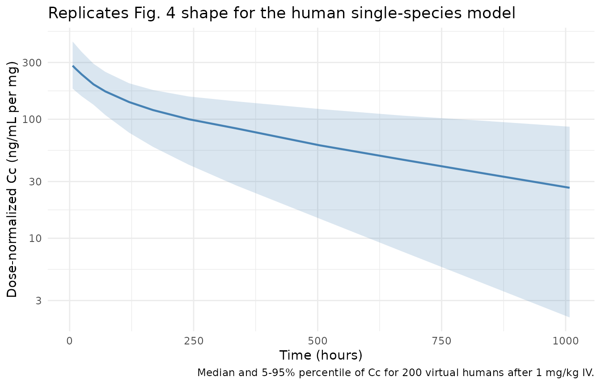
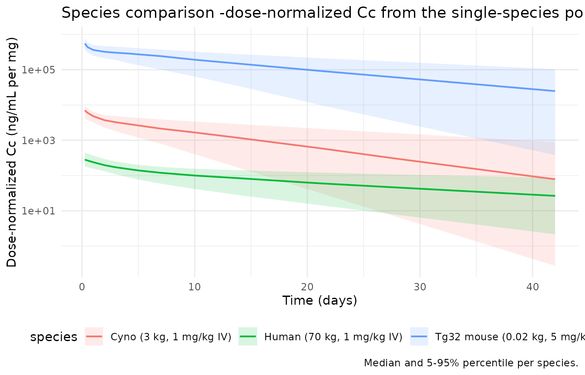
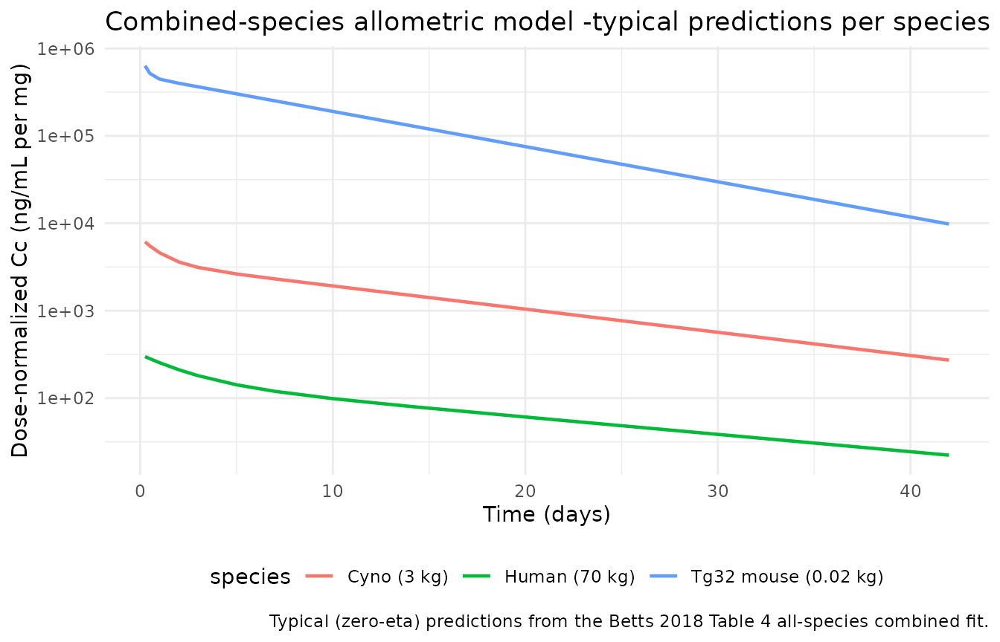

# Linear monoclonal antibody PK across species (Betts 2018)

## Model and source

Betts et al. (2018) pooled individual-level IV concentration-time data
for 27 Pfizer monoclonal antibodies (mAbs) with linear
(non-target-mediated) clearance across three species (human, cynomolgus
monkey, and hFcRn Tg32 transgenic mouse). The analysis yields a single
set of typical class-level two-compartment popPK parameters per species
(Table 2), and a combined jointly-fitted model with bodyweight-based
allometric scaling on all four disposition parameters (Table 4).

Four model files are packaged for this paper. Each represents an
independent NONMEM fit reported in the source:

- `Betts_2018_mAb_human` -Table 2, Human column (n=18 mAbs).
- `Betts_2018_mAb_cyno` -Table 2, Cynomolgus Monkey column (n=23 mAbs).
- `Betts_2018_mAb_tg32mouse` -Table 2, Tg32 hFcRn Transgenic Mouse
  column (n=11 mAbs).
- `Betts_2018_mAb_combined` -Table 4, all-species combined fit with
  allometric scaling (n=27 mAbs).

Article: <https://doi.org/10.1080/19420862.2018.1462429>

``` r

mod_human    <- readModelDb("Betts_2018_mAb_human")
mod_cyno     <- readModelDb("Betts_2018_mAb_cyno")
mod_tg32     <- readModelDb("Betts_2018_mAb_tg32mouse")
mod_combined <- readModelDb("Betts_2018_mAb_combined")

cat(mod_human()$description, "\n\n", mod_human()$reference, sep = "")
#> Class-level typical two-compartment population PK model for monoclonal antibodies with linear clearance in adult humans (Betts 2018, n=18 mAbs).
#> 
#> Betts A, Keunecke A, van Steeg TJ, van der Graaf PH, Avery LB, Jones H, Berkhout J. Linear pharmacokinetic parameters for monoclonal antibodies are similar within a species and across different pharmacological targets: A comparison between human, cynomolgus monkey and hFcRn Tg32 transgenic mouse using a population-modeling approach. MAbs. 2018;10(5):751-64. doi:10.1080/19420862.2018.1462429
```

## Population

The source dataset pools Pfizer historical individual concentration-time
data from 27 mAbs with linear PK. Human data (n=18 mAbs) were from
healthy volunteers or patients receiving single-dose IV mAb at 3-24
individuals per dose level. Cynomolgus monkey data (n=23 mAbs) were
single-dose IV preclinical PK at 1-3 dose levels with two monkeys per
dose. hFcRn Tg32 transgenic mouse data (n=11 mAbs) were single-dose IV
at 3.5 mg/kg (1 mAb) or 5 mg/kg (10 mAbs), n=5-6 per mAb. Non-linear
(target-mediated) doses were excluded from the fits by combining visual
inspection with a linear dose-vs.-AUC deviation test (Betts 2018 Fig.
1). Reference body weights for the assumed preclinical species were 3 kg
(cynomolgus monkey) and 0.02 kg (hFcRn Tg32 mouse); human body weights
were subject-specific.

Table 1 of the source lists each of the 27 mAbs, its immunoglobulin
subclass (12 IgG1, 15 IgG2), its target class (16 soluble, 9 membrane, 2
mixed), and the retained linear dose range per species.

## Source trace

The per-parameter origin is recorded as an in-file comment next to each
`ini()` entry in `inst/modeldb/specificDrugs/Betts_2018_mAb_*.R`. The
consolidated table below spans all four packaged models.

| Model | Parameter | Value (paper units) | Absolute value used | Source location |
|----|----|----|----|----|
| Human | CL | 0.15 mL/h/kg | 0.252 L/day (70 kg) | Table 2, Human column |
| Human | V1 | 46.31 mL/kg | 3.2417 L (70 kg) | Table 2, Human column |
| Human | Q | 0.27 mL/h/kg | 0.4536 L/day (70 kg) | Table 2, Human column |
| Human | V2 | 31.47 mL/kg | 2.2029 L (70 kg) | Table 2, Human column |
| Human | IIV CL / cov / V1 | 0.48 / 0.09 / 0.09 | (log-scale variances) | Table 2, Human column |
| Cynomolgus monkey | CL | 0.27 mL/h/kg | 0.01944 L/day (3 kg) | Table 2, Cynomolgus column |
| Cynomolgus monkey | V1 | 39.29 mL/kg | 0.11787 L (3 kg) | Table 2, Cynomolgus column |
| Cynomolgus monkey | Q | 1.00 mL/h/kg | 0.072 L/day (3 kg) | Table 2, Cynomolgus column |
| Cynomolgus monkey | V2 | 27.56 mL/kg | 0.08268 L (3 kg) | Table 2, Cynomolgus column |
| Cynomolgus monkey | IIV CL / cov / V1 | 0.38 / 0.09 / 0.10 | (log-scale variances) | Table 2, Cynomolgus column |
| hFcRn Tg32 mouse | CL | 0.35 mL/h/kg | 0.000168 L/day (0.02 kg) | Table 2, Tg32 Mouse column |
| hFcRn Tg32 mouse | V1 | 59.28 mL/kg | 0.0011856 L (0.02 kg) | Table 2, Tg32 Mouse column |
| hFcRn Tg32 mouse | Q | 4.40 mL/h/kg | 0.002112 L/day (0.02 kg) | Table 2, Tg32 Mouse column |
| hFcRn Tg32 mouse | V2 | 60.54 mL/kg | 0.0012108 L (0.02 kg) | Table 2, Tg32 Mouse column |
| hFcRn Tg32 mouse | IIV CL / cov / V1 | 0.41 / 0.11 / 0.12 | (log-scale variances) | Table 2, Tg32 Mouse column |
| Combined (all species) | CL | 0.16 mL/h/kg | 0.2688 L/day (70 kg ref) | Table 4, all-species column |
| Combined (all species) | V1 | 45.19 mL/kg | 3.1633 L (70 kg ref) | Table 4, all-species column |
| Combined (all species) | Q | 0.28 mL/h/kg | 0.4704 L/day (70 kg ref) | Table 4, all-species column |
| Combined (all species) | V2 | 30.81 mL/kg | 2.1567 L (70 kg ref) | Table 4, all-species column |
| Combined (all species) | alpha (CL) | 0.89 | 0.89 | Table 4, all-species column |
| Combined (all species) | beta (V1) | 0.98 | 0.98 | Table 4, all-species column |
| Combined (all species) | gamma (Q) | 0.67 | 0.67 | Table 4, all-species column |
| Combined (all species) | delta (V2) | 0.95 | 0.95 | Table 4, all-species column |
| Combined (all species) | IIV CL / cov / V1 | 0.47 / 0.08 / 0.11 | (log-scale variances) | Table 4, all-species column |
| All models | 2-cpt IV disposition | \- | \- | Fig. 1a and Materials and methods “PK model” |
| All models | Proportional error per cpd | \- | fixed(0) per policy | Table 2 / Table 4 footnote, per-compound values in Supp. Table 1 / 2 (not on disk) |

All weight-normalized values were converted to absolute units at the
species-representative body weight used in the source fit (70 kg human,
3 kg cynomolgus monkey, 0.02 kg hFcRn Tg32 mouse) and to days for
tractability of the mAb ~2-4 week terminal half-life.

## Virtual cohort -human single-dose 1 mg/kg IV

The Betts 2018 popPK model is a class-level “typical” 2-compartment IV
model. To reproduce the source Fig. 4 concentration-vs-time envelope, we
simulate a virtual cohort of 200 typical adults each receiving a single
1 mg/kg IV dose (70 kg reference body weight), followed for 42 days.

``` r

set.seed(29634430L)

sim_time_days <- 42
grid_days     <- c(0, 0.25, 0.5, 1, 2, 3, 5, 7, 10, 14, 21, 28, 35, 42)

n_human <- 200
events_human <- dplyr::bind_rows(
  tibble::tibble(
    id   = seq_len(n_human),
    time = 0,
    amt  = 70,           # 1 mg/kg * 70 kg
    evid = 1,
    cmt  = "central"
  ),
  tidyr::expand_grid(
    id   = seq_len(n_human),
    time = grid_days
  ) |>
    dplyr::mutate(amt = NA_real_, evid = 0, cmt = "central")
) |>
  dplyr::arrange(id, time, dplyr::desc(evid))
```

## Human simulation

``` r

sim_human <- rxode2::rxSolve(mod_human, events = events_human) |>
  as.data.frame() |>
  dplyr::mutate(species = "Human (70 kg, 1 mg/kg IV)")
```

### Replicating Fig. 4 -dose-normalized concentration envelope

Fig. 4 of Betts 2018 shows the median plus 5th and 95th percentiles of
200 bootstrap samples of the combined-species PK model, plotted as
dose-normalized concentration (ng/mL) vs time (hours). Here we render
the same envelope for the human single-species model, keeping the same
concentration axis by expressing the simulated Cc per mg dose and
converting from mg/L to ng/mL (multiplying by 1000).

``` r

env_human <- sim_human |>
  dplyr::group_by(time) |>
  dplyr::summarise(
    Q05 = quantile(Cc, 0.05, na.rm = TRUE),
    Q50 = quantile(Cc, 0.50, na.rm = TRUE),
    Q95 = quantile(Cc, 0.95, na.rm = TRUE),
    .groups = "drop"
  ) |>
  dplyr::mutate(
    time_h = time * 24,
    Q05_ngml_per_mg = Q05 / 70 * 1000,
    Q50_ngml_per_mg = Q50 / 70 * 1000,
    Q95_ngml_per_mg = Q95 / 70 * 1000
  ) |>
  dplyr::filter(time > 0)

ggplot(env_human, aes(time_h, Q50_ngml_per_mg)) +
  geom_ribbon(aes(ymin = Q05_ngml_per_mg, ymax = Q95_ngml_per_mg),
              alpha = 0.2, fill = "steelblue") +
  geom_line(colour = "steelblue", linewidth = 0.8) +
  scale_x_continuous(name = "Time (hours)") +
  scale_y_log10(name = "Dose-normalized Cc (ng/mL per mg)") +
  labs(title = "Replicates Fig. 4 shape for the human single-species model",
       caption = "Median and 5-95% percentile of Cc for 200 virtual humans after 1 mg/kg IV.") +
  theme_minimal()
```



## Cross-species simulation

We simulate 100 virtual subjects per preclinical species at their
species-typical single IV dose and plot the typical concentration-time
profiles (no residual noise) on the same absolute time axis, in units of
dose-normalized Cc.

``` r

n_pre  <- 100
grid_h <- c(0, 6, 12, 24, 48, 72, 96, 168, 240, 336, 504, 672, 1008) / 24  # hours -> days

make_events <- function(n, dose_mg, id_offset = 0L) {
  dplyr::bind_rows(
    tibble::tibble(id = id_offset + seq_len(n), time = 0, amt = dose_mg,
                   evid = 1, cmt = "central"),
    tidyr::expand_grid(id = id_offset + seq_len(n), time = grid_h) |>
      dplyr::mutate(amt = NA_real_, evid = 0, cmt = "central")
  ) |> dplyr::arrange(id, time, dplyr::desc(evid))
}

events_cyno <- make_events(n_pre, dose_mg = 3,     id_offset =    0L) # 1 mg/kg * 3 kg
events_tg32 <- make_events(n_pre, dose_mg = 0.10,  id_offset = 1000L) # 5 mg/kg * 0.02 kg

sim_cyno <- rxode2::rxSolve(mod_cyno, events = events_cyno) |>
  as.data.frame() |>
  dplyr::mutate(species = "Cyno (3 kg, 1 mg/kg IV)",
                dose_mg = 3)

sim_tg32 <- rxode2::rxSolve(mod_tg32, events = events_tg32) |>
  as.data.frame() |>
  dplyr::mutate(species = "Tg32 mouse (0.02 kg, 5 mg/kg IV)",
                dose_mg = 0.10)

sim_human_h <- sim_human |>
  dplyr::mutate(dose_mg = 70)

cross <- dplyr::bind_rows(
  sim_human_h |> dplyr::select(id, time, Cc, species, dose_mg),
  sim_cyno    |> dplyr::select(id, time, Cc, species, dose_mg),
  sim_tg32    |> dplyr::select(id, time, Cc, species, dose_mg)
) |>
  dplyr::group_by(species, time) |>
  dplyr::summarise(
    Q05 = quantile(Cc / dose_mg[1] * 1000, 0.05, na.rm = TRUE),
    Q50 = quantile(Cc / dose_mg[1] * 1000, 0.50, na.rm = TRUE),
    Q95 = quantile(Cc / dose_mg[1] * 1000, 0.95, na.rm = TRUE),
    .groups = "drop"
  ) |>
  dplyr::filter(time > 0)

ggplot(cross, aes(time, Q50, colour = species, fill = species)) +
  geom_ribbon(aes(ymin = Q05, ymax = Q95), alpha = 0.15, colour = NA) +
  geom_line(linewidth = 0.7) +
  scale_x_continuous(name = "Time (days)") +
  scale_y_log10(name = "Dose-normalized Cc (ng/mL per mg)") +
  labs(title = "Species comparison -dose-normalized Cc from the single-species popPK fits",
       caption = "Median and 5-95% percentile per species.") +
  theme_minimal() +
  theme(legend.position = "bottom")
```



Consistent with Betts 2018 Fig. 2 and 3: mouse concentration falls
fastest (highest weight-normalized CL, smallest volume), then cyno, then
human; volumes of distribution approximate species plasma volume (30-60
mL/kg).

## Combined-species allometric model demonstration

The combined-species model in Table 4 is a single joint fit of all 27
mAbs across all three species using estimated bodyweight allometric
exponents on CL (0.89), V1 (0.98), Q (0.67), and V2 (0.95) with
reference 70 kg. We compare the typical predictions from the
combined-species model at species-representative body weights (70 kg, 3
kg, 0.02 kg) against the single-species fits above.

``` r

mod_combined_typical <- mod_combined |> rxode2::zeroRe()

grid_combined <- c(0, 0.25, 0.5, 1, 2, 3, 5, 7, 10, 14, 21, 28, 35, 42)

events_combined <- dplyr::bind_rows(
  tibble::tibble(id = 1L, time = 0, amt = 70,    evid = 1, cmt = "central", WT = 70),
  tibble::tibble(id = 2L, time = 0, amt = 3,     evid = 1, cmt = "central", WT = 3),
  tibble::tibble(id = 3L, time = 0, amt = 0.10,  evid = 1, cmt = "central", WT = 0.02),
  tidyr::expand_grid(
    id   = c(1L, 2L, 3L),
    time = grid_combined
  ) |>
    dplyr::mutate(amt = NA_real_, evid = 0, cmt = "central",
                  WT = dplyr::case_when(id == 1L ~ 70,
                                        id == 2L ~ 3,
                                        id == 3L ~ 0.02))
) |>
  dplyr::arrange(id, time, dplyr::desc(evid))

sim_combined <- rxode2::rxSolve(mod_combined_typical,
                                events = events_combined,
                                keep = c("WT")) |>
  as.data.frame() |>
  dplyr::mutate(
    species = dplyr::case_when(
      id == 1L ~ "Human (70 kg)",
      id == 2L ~ "Cyno (3 kg)",
      id == 3L ~ "Tg32 mouse (0.02 kg)"
    ),
    dose_mg = dplyr::case_when(
      id == 1L ~ 70,
      id == 2L ~ 3,
      id == 3L ~ 0.10
    ),
    Cc_ngml_per_mg = Cc / dose_mg * 1000
  )
#> ℹ omega/sigma items treated as zero: 'etalcl', 'etalvc'
#> Warning: multi-subject simulation without without 'omega'

ggplot(sim_combined |> dplyr::filter(time > 0),
       aes(time, Cc_ngml_per_mg, colour = species)) +
  geom_line(linewidth = 0.8) +
  scale_x_continuous(name = "Time (days)") +
  scale_y_log10(name = "Dose-normalized Cc (ng/mL per mg)") +
  labs(title = "Combined-species allometric model -typical predictions per species",
       caption = "Typical (zero-eta) predictions from the Betts 2018 Table 4 all-species combined fit.") +
  theme_minimal() +
  theme(legend.position = "bottom")
```



## PKNCA validation

We run PKNCA on the human single-species simulation to derive Cmax,
Tmax, AUC0-inf, and terminal t1/2 per subject, then summarize the median
and IQR across the 200-subject cohort. All computed values are for a
single 1 mg/kg IV dose (dose_mg = 70) in a typical 70 kg adult.

``` r

sim_nca <- sim_human |>
  dplyr::filter(!is.na(Cc)) |>
  dplyr::select(id, time, Cc) |>
  dplyr::mutate(treatment = "1 mg/kg IV")

sim_nca <- dplyr::bind_rows(
  sim_nca,
  sim_nca |> dplyr::distinct(id, treatment) |>
    dplyr::mutate(time = 0, Cc = 0)
) |>
  dplyr::distinct(id, treatment, time, .keep_all = TRUE) |>
  dplyr::arrange(id, treatment, time)

conc_obj <- suppressMessages(
  PKNCA::PKNCAconc(sim_nca, Cc ~ time | treatment + id)
)

dose_df <- events_human |>
  dplyr::filter(evid == 1) |>
  dplyr::mutate(treatment = "1 mg/kg IV") |>
  dplyr::select(id, time, amt, treatment)

dose_obj <- suppressMessages(
  PKNCA::PKNCAdose(dose_df, amt ~ time | treatment + id)
)

intervals <- data.frame(
  start       = 0,
  end         = Inf,
  cmax        = TRUE,
  tmax        = TRUE,
  aucinf.obs  = TRUE,
  half.life   = TRUE
)

nca_data <- suppressMessages(
  PKNCA::PKNCAdata(conc_obj, dose_obj, intervals = intervals)
)
nca_res  <- suppressMessages(suppressWarnings(PKNCA::pk.nca(nca_data)))

nca_summary <- as.data.frame(nca_res$result) |>
  dplyr::filter(PPTESTCD %in% c("cmax", "tmax", "aucinf.obs", "half.life")) |>
  dplyr::group_by(PPTESTCD) |>
  dplyr::summarise(
    median = median(PPORRES, na.rm = TRUE),
    p05    = quantile(PPORRES, 0.05, na.rm = TRUE),
    p95    = quantile(PPORRES, 0.95, na.rm = TRUE),
    .groups = "drop"
  )

nca_summary |>
  dplyr::rename(`NCA parameter` = PPTESTCD,
                `Median` = median,
                `5th percentile` = p05,
                `95th percentile` = p95) |>
  knitr::kable(digits = 3,
               caption = "PKNCA-derived Cmax (mg/L), Tmax (day), AUC0-inf (mg*day/L), and terminal t1/2 (day) across the 200-subject virtual human cohort after 1 mg/kg IV.")
```

| NCA parameter |  Median | 5th percentile | 95th percentile |
|:--------------|--------:|---------------:|----------------:|
| aucinf.obs    | 281.555 |        104.321 |         763.554 |
| cmax          |  20.972 |         13.196 |          34.181 |
| half.life     |  16.692 |          7.613 |          43.189 |
| tmax          |   0.000 |          0.000 |           0.000 |

PKNCA-derived Cmax (mg/L), Tmax (day), AUC0-inf (mg\*day/L), and
terminal t1/2 (day) across the 200-subject virtual human cohort after 1
mg/kg IV. {.table}

### Consistency with paper’s reported literature comparators

Betts 2018 Table 3 lists CL, V1, Q, V2 for five clinical mAbs with
linear PK (bevacizumab, infliximab, pertuzumab, rituximab, trastuzumab)
alongside the human popPK estimates from this study. The comparison
below shows the paper’s own reported values, converted to absolute units
for a 70 kg adult, next to the Betts 2018 Human popPK typical-value
column that this vignette’s `Betts_2018_mAb_human` model encodes. This
is a fidelity check on the encoding rather than an external validation
-the observed similarity between the five clinical mAbs and the Betts
2018 human popPK typical values is a headline result of the paper (Table
3).

``` r

tab3 <- tibble::tribble(
  ~mAb,                     ~cl_mLhkg, ~vc_mLkg, ~q_mLhkg, ~vp_mLkg,
  "Betts 2018 Human popPK", 0.15,      46.31,    0.27,     31.47,
  "Bevacizumab",            0.12,      38.0,     0.35,     39.4,
  "Infliximab (AS)",        0.16,      43.7,     1.02,     42.0,
  "Infliximab (UC)",        0.24,      47.0,     4.25,     59.0,
  "Pertuzumab",             0.13,      39.1,     0.33,     30.9,
  "Rituximab",              0.15,      42.6,     0.39,     52.0,
  "Trastuzumab",            0.13,      42.1,     0.29,     68.4
)

tab3 |>
  dplyr::rename(
    "mAb"           = mAb,
    "CL (mL/h/kg)"  = cl_mLhkg,
    "V1 (mL/kg)"    = vc_mLkg,
    "Q (mL/h/kg)"   = q_mLhkg,
    "V2 (mL/kg)"    = vp_mLkg
  ) |>
  knitr::kable(caption = "Betts 2018 Table 3: Human popPK typical values vs five literature comparator clinical mAbs.")
```

| mAb                    | CL (mL/h/kg) | V1 (mL/kg) | Q (mL/h/kg) | V2 (mL/kg) |
|:-----------------------|-------------:|-----------:|------------:|-----------:|
| Betts 2018 Human popPK |         0.15 |      46.31 |        0.27 |      31.47 |
| Bevacizumab            |         0.12 |      38.00 |        0.35 |      39.40 |
| Infliximab (AS)        |         0.16 |      43.70 |        1.02 |      42.00 |
| Infliximab (UC)        |         0.24 |      47.00 |        4.25 |      59.00 |
| Pertuzumab             |         0.13 |      39.10 |        0.33 |      30.90 |
| Rituximab              |         0.15 |      42.60 |        0.39 |      52.00 |
| Trastuzumab            |         0.13 |      42.10 |        0.29 |      68.40 |

Betts 2018 Table 3: Human popPK typical values vs five literature
comparator clinical mAbs. {.table style="width:100%;"}

Infliximab for ulcerative colitis is an outlier (CL 0.24 mL/h/kg, Q 4.25
mL/h/kg) as noted in Betts 2018; the other four literature comparators
sit inside the reported 95% CIs of the class-level human popPK
estimates.

## Assumptions and deviations

- **Class-level, not compound-specific.** All four packaged models
  represent the pooled typical class-level PK across many mAbs (18, 23,
  11, and 27 respectively). They are intended for early-stage popPK
  simulation, cross-species prediction, and initial-value seeding for
  compound-specific fits -not for reproducing any single named mAb’s PK
  profile. Per-compound residual errors were reported per-compound in
  the Betts 2018 Supplementary Tables 1 and 2.
- **Residual error fixed at 0.** The paper’s Table 2 and Table 4
  footnotes state “Residual errors per compound are shown in
  Supplementary Table 1” (or 2); the supplement was not available on
  disk during extraction, so no class-level typical proportional
  residual value could be sourced. Per the skill’s standing policy for
  unreported RUV, `propSd` is wrapped in `fixed(0)` in every packaged
  model. Users needing residual noise for simulation should override
  with a domain-appropriate typical value (mAb popPK residuals are
  commonly 15-25% CV) or supply the compound-specific value from the
  supplement when acquired.
- **Reference body weights.** The single-species preclinical models
  (`Betts_2018_mAb_cyno`, `Betts_2018_mAb_tg32mouse`) fix the absolute
  parameters at the species-representative body weights the paper’s
  Materials and methods declared (3 kg and 0.02 kg respectively). Real
  subjects are unlikely to sit exactly at those weights; the combined-
  species model (`Betts_2018_mAb_combined`) is the appropriate choice
  when species-specific body weight varies materially across the
  simulated cohort, via its allometric exponents on all four disposition
  parameters.
- **Absolute unit conversion.** Betts 2018 reports parameters in
  weight-normalized units (mL/h/kg for CL and Q, mL/kg for V1 and V2,
  per hour of time). All packaged models express parameters in absolute
  units (L for volumes, L/day for clearances) -day units align with
  typical mAb elimination timescales, and absolute-unit rxode2 event
  tables need no weight-normalization guard-rails per subject. The
  arithmetic conversions are recorded in-line in every model file’s
  `ini()` block.
- **Body-weight ranges outside published support.** The combined-species
  allometric model’s exponents (Table 4) were fit on data spanning
  0.02-70 kg. Simulating outside this range (e.g. rat or dog body
  weights in the interior, or elephant / whale body weights beyond it)
  is extrapolation and not validated against the source data.
- **Excluded from packaging.** The two intermediate combined-dataset
  fits (Cyno + Human column of Table 4, and Tg32 Mouse + Human column of
  Table 4) are structural duplicates of `Betts_2018_mAb_combined` with
  only the fitted dataset differing. Their function is illustrative
  (comparing the allometric exponents that a single preclinical species
  yields against the all-species fit) rather than distinct simulation
  targets, so they are not shipped as separate model files. Their
  exponents are listed in Betts 2018 Table 4 for readers who need them.
