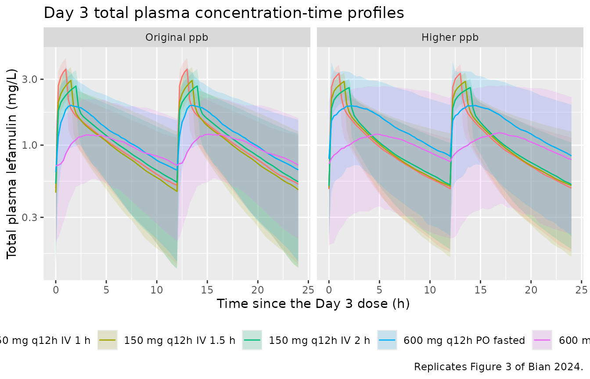
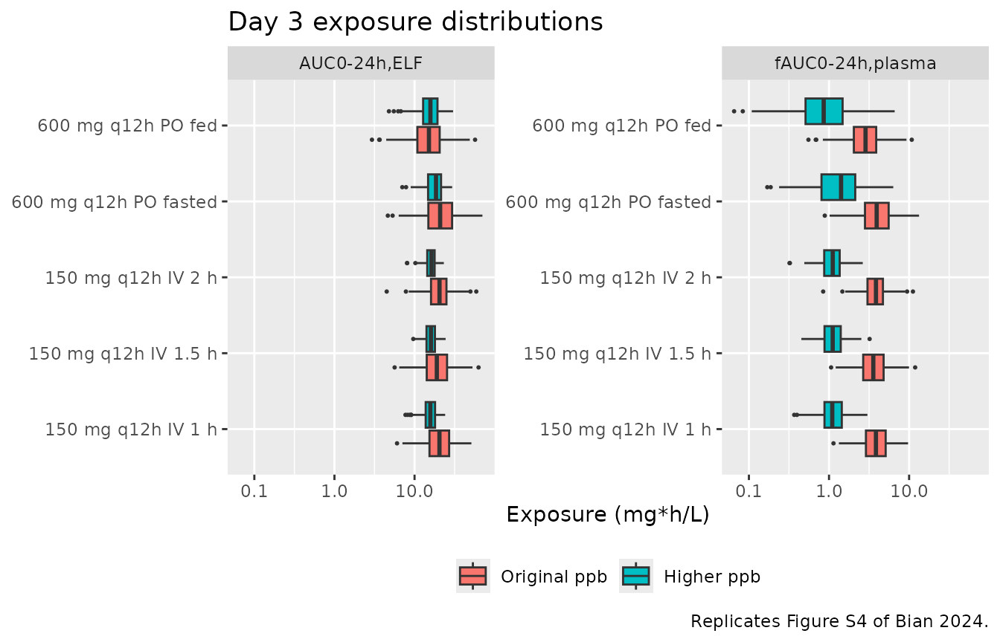

# Lefamulin popPK with ELF penetration and PK/PD target attainment (Bian 2024)

## Model and source

Bian 2024 contributes **two** models to nlmixr2lib. They share one
structure and one covariate model but are separate fits under two
different plasma protein binding (ppb) assumptions, and they attach the
epithelial lining fluid (ELF) layer in two different ways, so they are
packaged as two files.

- `Bian_2024_lefamulin_original_ppb` – the diluted-plasma binding fit
  (Supplementary Table S1), with ELF as an effect compartment.

- `Bian_2024_lefamulin_higher_ppb` – the non-diluted binding fit
  (Supplementary Table S2), with ELF as an algebraic power-penetration
  function adopted from the FDA XENLETA review.

- Citation: Bian X, Li N, Li Y, Zhu X, Yu J, Hu Y, Yang H, Wei Q, Wu X,
  Wang J, Cao G, Wu J, Wang Y, Zhang J. Lefamulin dosing optimization
  using population pharmacokinetic and pharmacokinetic/pharmacodynamic
  assessment in Chinese patients with community-acquired bacterial
  pneumonia. Front Pharmacol. 2024;15:1456741.
  <doi:10.3389/fphar.2024.1456741>. Structural equations from Equations
  1-20; parameter values from Supplementary Table S1. The underlying
  popPK plus ELF framework was developed in Zhang L, Wicha SG, Bhavnani
  SM, et al. J Antimicrob Chemother. 2019;74(Suppl 3):iii27-iii34.
  <doi:10.1093/jac/dkz088>, and in the FDA XENLETA Multi-Discipline
  Review, NDA 211672/211673 (2019).

- Article: <https://doi.org/10.3389/fphar.2024.1456741>

- Upstream framework paper (Zhang 2019):
  <https://doi.org/10.1093/jac/dkz088>

- FDA XENLETA Multi-Discipline Review, NDA 211672/211673 (2019):
  <https://www.accessdata.fda.gov/drugsatfda_docs/nda/2019/211672Orig1s000,211673Orig1s000MultidisciplineR.pdf>

``` r

mod_orig   <- readModelDb("Bian_2024_lefamulin_original_ppb")
mod_higher <- readModelDb("Bian_2024_lefamulin_higher_ppb")
```

## Population

The model was developed on a pooled foreign dataset of 849 subjects: 98
Phase 1 healthy adults, 129 Phase 2 patients with acute bacterial skin
and skin structure infections, and 622 Phase 3 patients with
community-acquired bacterial pneumonia (CABP). Median age 57 years
(18-97), median weight 78 kg (31-174.6), median albumin 4.1 g/dL
(2-5.6), 38.8% female, 78.2% White / 8.5% Asian / 8.1% Black
(Supplementary Table S5). Study phase enters the model as a covariate on
CL, CLd1 and Vp1, with Phase 3 as the reference stratum; albumin acts on
CL and body weight on Vp1, both as linear proportional shifts around the
pooled medians.

Bian 2024 externally validated that model against 33 Chinese CABP
patients from a Phase III trial (median age 56.1 years, weight 69.38 kg,
albumin 3.88 g/dL, 100% Asian, 18.2% female) and then ran Monte Carlo
simulations on 5000 virtual CABP patients whose baseline weight and
albumin were resampled from 125 Chinese CABP patients. The virtual
cohort below reproduces that simulation population.

The same information is available programmatically via
`readModelDb("Bian_2024_lefamulin_original_ppb")()$population`.

## Source trace

Per-parameter origins are recorded as in-file comments next to each
`ini()` entry in
`inst/modeldb/specificDrugs/Bian_2024_lefamulin_original_ppb.R` and
`..._higher_ppb.R`. They are collected here for review. “S1” / “S2”
refer to Bian 2024 Supplementary Tables S1 and S2; equation numbers are
from the main text.

| Equation / parameter | Original ppb | Higher ppb | Source location |
|----|----|----|----|
| `lcl` (CL, L/h) | 79.4 | 282 | theta1, S1 / S2 |
| `lvc` (Vc, L) | 46.3 | 138 | theta2, S1 / S2 |
| `lq` (CLd1, L/h) | 40.6 | 187 | theta3, S1 / S2 |
| `lvp` (Vp1, L) | 249 | 1300 | theta4, S1 / S2 |
| `lq2` (CLd2, L/h) | 199 | 421 | theta5, S1 / S2 |
| `lvp2` (Vp2, L) | 259 | 449 | theta6, S1 / S2 |
| `lka` (1/h) | 1.2 | 0.686 | theta7, S1 / S2 |
| `lka2` (1/h) | 2.12 | 1.34 | theta8, S1 / S2 |
| `logitfdepot` (Ftot) | 0.244 | 0.293 | theta9, S1 / S2; Equations 9, 10 |
| `logitfrac` (FS) | 0.802 | 0.622 | theta10, S1 / S2; Equations 11, 12 |
| `ltlag` (ALAG, h) | 0.15 | 0.124 | theta11, S1 / S2; Equation 15 |
| `fumin` (fixed) | 0.0997 | 0.0260 | theta12, S1 / S2; Equations 16, 17 |
| `fumax` (fixed) | 0.259 | 0.194 | theta13, S1 / S2; Equations 16, 18 |
| `cup50` (mg/L, fixed) | 1.35 | 0.814 | theta14, S1 / S2; Equations 16, 19 |
| `e_fed_ka2` | 0.445 | 0.513 | theta17, S1 / S2; Equation 8 |
| `e_fed_fdepot` | 0.763 | 0.802 | theta18, S1 / S2; Equation 9 |
| `e_fed_ka` | 0.0541 | 0.0525 | theta19, S1 / S2; Equation 7 |
| `e_alb_cl` (per g/dL) | 0.214 | 0.2 | theta20, S1 / S2 printed as 1 + theta; Equation 1 |
| `e_phase2_cl` | 0.827 | 0.707 | theta21, S1 / S2 printed as 1 + theta; Equation 1 |
| `e_phase1_cl` | 0.766 | 0.710 | theta22, S1 / S2 printed as 1 + theta; Equation 1 |
| `e_phase2_q` | 0.44 | 0.192 | theta23, S1 / S2 printed as 1 + theta; Equation 3 |
| `e_phase1_q` | 1.12 | 0.788 | theta24, S1 / S2 printed as 1 + theta; Equation 3 |
| `e_phase2_vp` | 0.985 | 0.28 | theta25, S1 / S2 printed as 1 + theta; Equation 4 |
| `e_phase1_vp` | 1.75 | 0.889 | theta26, S1 / S2 printed as 1 + theta; Equation 4 |
| `e_wt_vp` (per kg) | 0.0129 | 0.00637 | theta27, S1 / S2 printed as 1 + theta; Equation 4 |
| `lkin_elf` (1/h) | 2.71 | n/a | theta28 KELF,in, S1; Figure 2 |
| `lkout_elf` (1/h) | 0.51 | n/a | theta29 KELF,out, S1; Figure 2 |
| `lpenratio_elf` | n/a | 3.45 | **back-solved from Table S6** – S2 prints 2.71; see Errata |
| `pwr_penratio_elf` | n/a | 0.51 | theta29 Power, S2; Equation 21 |
| `etalcl` … `etalogitfrac` | 0.171, 0.39, 0.119, 0.623, 0.800, 0.400, 0.100, 0.170 | 0.151, 0.195, 0.064, 0.0875, 2.65, 0.264, 0.791, 0.716 | eta1-4, 7-10, S1 / S2 (variances) |
| `propSd`, `addSd`, `propSd_Celf` | 0.3209, 0.005857, 0.6099 | 0.30952, 0.004087, 0.43818 | sqrt of sigma^2 eps1-3, S1 / S2; Equation 20 |
| Disposition ODEs, parallel absorption, transit chain | – | – | Figure 2 (model diagram) |
| ELF effect compartment | – | – | Methods “PopPK model integrating ELF distribution compartment”; Figure 2 |
| ELF power penetration `Celf = penratio_elf * (Cc * 0.0379)^power` | – | – | Equation 21; FDA review section 16.3.2.4.1 |

## Virtual cohort

Original observed data are not publicly available. The cohort below
reproduces the paper’s simulation population: Chinese CABP patients
(study Phase 3, the reference stratum) whose baseline weight and albumin
match the Chinese Phase III distributions in Supplementary Table S5
(weight median 69.38 kg, range 40-112; albumin median 3.88 g/dL, range
2.9-4.8).

``` r

set.seed(20241025)

n_per_arm <- 200L

arms <- tibble::tribble(
  ~arm,                      ~route, ~dose, ~dur, ~fed,
  "150 mg q12h IV 1 h",      "iv",   150,   1.0,  0,
  "150 mg q12h IV 1.5 h",    "iv",   150,   1.5,  0,
  "150 mg q12h IV 2 h",      "iv",   150,   2.0,  0,
  "600 mg q12h PO fasted",   "po",   600,   NA,   0,
  "600 mg q12h PO fed",      "po",   600,   NA,   1
)

dose_times <- seq(0, 72, by = 12)
# Observations cover Day 1 (0-24 h) and Day 3 (48-72 h), the two windows over
# which Supplementary Table S6 integrates exposure.
obs_times  <- c(seq(0, 24, by = 0.25), seq(48, 72, by = 0.25))

#' Build one treatment arm as a self-contained event table.
#'
#' `id_offset` shifts subject IDs so arms can be bind_rows()-ed without
#' colliding: rxSolve treats id as the subject key, and duplicate ids across
#' arms silently collapse into single (wrong) subjects.
make_arm <- function(n, arm, route, dose, dur, fed, id_offset) {
  subj <- tibble(
    id  = id_offset + seq_len(n),
    # Log-normal weight and normal albumin truncated to the observed Chinese
    # Phase III ranges (Supplementary Table S5, External validation column).
    WT  = pmin(pmax(stats::rlnorm(n, log(69.38), 0.20), 40), 112),
    ALB = pmin(pmax(stats::rnorm(n, 3.88, 0.45), 2.9), 4.8) * 10, # g/dL -> g/L
    STUDY_LEFAMULIN_PHASE1 = 0,
    STUDY_LEFAMULIN_PHASE2 = 0,
    FED = fed,
    arm = arm
  )

  doses <-
    if (route == "iv") {
      tidyr::expand_grid(subj, time = dose_times) |>
        mutate(evid = 1L, amt = dose, cmt = "central", rate = dose / dur)
    } else {
      # An oral dose is presented to BOTH depots; f(depot) and f(depot2) split
      # it into the immediate and delayed fractions (Equations 13, 14).
      bind_rows(
        tidyr::expand_grid(subj, time = dose_times) |>
          mutate(evid = 1L, amt = dose, cmt = "depot",  rate = 0),
        tidyr::expand_grid(subj, time = dose_times) |>
          mutate(evid = 1L, amt = dose, cmt = "depot2", rate = 0)
      )
    }

  obs <- tidyr::expand_grid(subj, time = obs_times) |>
    # Two `~` endpoints means observation rows need a dvid; cmt must stay NA so
    # rxode2 does not auto-inject a compartment slot for an algebraic output.
    mutate(evid = 0L, amt = 0, cmt = NA_character_, rate = 0)

  bind_rows(doses, obs) |>
    mutate(dvid = ifelse(evid == 0L, 1L, NA_integer_)) |>
    arrange(id, time, desc(evid))
}

events <- do.call(
  bind_rows,
  lapply(seq_len(nrow(arms)), function(i) {
    make_arm(
      n = n_per_arm, arm = arms$arm[i], route = arms$route[i],
      dose = arms$dose[i], dur = arms$dur[i], fed = arms$fed[i],
      id_offset = (i - 1L) * n_per_arm
    )
  })
)

# ids must not collide across arms: rxSolve keys subjects by `id` alone, so a
# repeated id would silently merge two regimens into a single (wrong) subject.
stopifnot(max(table(unique(events[, c("id", "arm")])$id)) == 1L)
nrow(events)
#> [1] 203800
```

## Simulation

``` r

sim_orig <- rxode2::rxSolve(
  mod_orig, events,
  keep = c("arm", "WT", "ALB"), returnType = "data.frame"
)
sim_higher <- rxode2::rxSolve(
  mod_higher, events,
  keep = c("arm", "WT", "ALB"), returnType = "data.frame"
)
```

### Typical-value replication of Supplementary Table S6

The paper’s Table S6 reports medians over 5000 virtual patients. As a
deterministic cross-check that is independent of cohort sampling noise,
the block below solves the typical Chinese CABP patient (weight 69.38
kg, albumin 3.88 g/dL, Phase 3) with every eta set to zero and
integrates the Day 3 (48-72 h) window on a fine grid.

``` r

etas <- c("etalcl", "etalvc", "etalq", "etalvp", "etalka", "etalka2",
          "etalogitfdepot", "etalogitfrac")

typical_events <- events |>
  # NB the parentheses: `%in%` binds tighter than `*` and `+` in R.
  filter(id %in% ((seq_len(nrow(arms)) - 1L) * n_per_arm + 1L)) |>
  mutate(WT = 69.38, ALB = 38.8)
for (e in etas) typical_events[[e]] <- 0

trapz <- function(t, y) sum(diff(t) * (head(y, -1) + tail(y, -1)) / 2)

typical_exposure <- function(mod, label) {
  s <- rxode2::rxSolve(mod, typical_events, omega = NA, keep = "arm",
                       addDosing = FALSE, returnType = "data.frame")
  s |>
    filter(time >= 48, time <= 72) |>
    group_by(arm) |>
    summarise(
      ppb        = label,
      fAUC_24    = trapz(time, Cu),
      AUC_ELF_24 = trapz(time, Celf),
      .groups    = "drop"
    )
}

typical_tbl <- bind_rows(
  typical_exposure(mod_orig,   "Original ppb"),
  typical_exposure(mod_higher, "Higher ppb")
)
#> Warning: multi-subject simulation without without 'omega'
#> Warning: multi-subject simulation without without 'omega'

published_s6 <- tibble::tribble(
  ~ppb,           ~arm,                     ~paper_fAUC, ~paper_ELF,
  "Original ppb", "150 mg q12h IV 1 h",     3.87,        20.51,
  "Original ppb", "150 mg q12h IV 1.5 h",   3.86,        20.51,
  "Original ppb", "150 mg q12h IV 2 h",     3.86,        20.50,
  "Original ppb", "600 mg q12h PO fasted",  3.71,        19.69,
  "Original ppb", "600 mg q12h PO fed",     2.76,        14.64,
  "Higher ppb",   "150 mg q12h IV 1 h",     1.08,        16.12,
  "Higher ppb",   "150 mg q12h IV 1.5 h",   1.08,        16.32,
  "Higher ppb",   "150 mg q12h IV 2 h",     1.08,        16.48,
  "Higher ppb",   "600 mg q12h PO fasted",  1.26,        18.10,
  "Higher ppb",   "600 mg q12h PO fed",     0.89,        16.49
)

typical_tbl |>
  left_join(published_s6, by = c("ppb", "arm")) |>
  mutate(
    `fAUC % diff` = round(100 * (fAUC_24 / paper_fAUC - 1), 1),
    `ELF % diff`  = round(100 * (AUC_ELF_24 / paper_ELF - 1), 1)
  ) |>
  select(ppb, arm, fAUC_24, paper_fAUC, `fAUC % diff`,
         AUC_ELF_24, paper_ELF, `ELF % diff`) |>
  dplyr::rename(
    "Binding"                    = ppb,
    "Regimen"                    = arm,
    "fAUC0-24 simulated"         = fAUC_24,
    "fAUC0-24 Table S6"          = paper_fAUC,
    "AUC0-24,ELF simulated"      = AUC_ELF_24,
    "AUC0-24,ELF Table S6"       = paper_ELF
  ) |>
  knitr::kable(
    digits  = 2,
    caption = paste(
      "Typical-value Day 3 (48-72 h) exposures in mg*h/L versus the medians",
      "reported in Bian 2024 Supplementary Table S6."
    )
  )
```

| Binding | Regimen | fAUC0-24 simulated | fAUC0-24 Table S6 | fAUC % diff | AUC0-24,ELF simulated | AUC0-24,ELF Table S6 | ELF % diff |
|:---|:---|---:|---:|---:|---:|---:|---:|
| Original ppb | 150 mg q12h IV 1 h | 3.96 | 3.87 | 2.3 | 21.03 | 20.51 | 2.5 |
| Original ppb | 150 mg q12h IV 1.5 h | 3.96 | 3.86 | 2.6 | 21.03 | 20.51 | 2.5 |
| Original ppb | 150 mg q12h IV 2 h | 3.96 | 3.86 | 2.6 | 21.03 | 20.50 | 2.6 |
| Original ppb | 600 mg q12h PO fasted | 3.87 | 3.71 | 4.2 | 20.52 | 19.69 | 4.2 |
| Original ppb | 600 mg q12h PO fed | 2.93 | 2.76 | 6.1 | 15.54 | 14.64 | 6.2 |
| Higher ppb | 150 mg q12h IV 1 h | 1.11 | 1.08 | 2.8 | 15.78 | 16.12 | -2.1 |
| Higher ppb | 150 mg q12h IV 1.5 h | 1.11 | 1.08 | 2.8 | 16.00 | 16.32 | -2.0 |
| Higher ppb | 150 mg q12h IV 2 h | 1.11 | 1.08 | 2.7 | 16.18 | 16.48 | -1.8 |
| Higher ppb | 600 mg q12h PO fasted | 1.30 | 1.26 | 3.3 | 18.00 | 18.10 | -0.6 |
| Higher ppb | 600 mg q12h PO fed | 0.99 | 0.89 | 11.3 | 16.80 | 16.49 | 1.9 |

Typical-value Day 3 (48-72 h) exposures in mg\*h/L versus the medians
reported in Bian 2024 Supplementary Table S6. {.table}

Both fits reproduce Table S6 closely. The original-ppb model runs
uniformly a little high (fAUC +2.3% to +6.1%, ELF +2.5% to +6.2%), which
is consistent with the typical patient being simulated against a
published *median* over a 5000-patient virtual population. The
higher-ppb model is within +2.7% to +3.3% on free plasma for four of
five regimens and -2.1% to +1.9% on ELF throughout; its one outlier is
the fed oral arm at +11.3% on free plasma, the regimen whose exposure
depends most heavily on the food-effect multipliers.

A second, structural check: for the original-ppb model the ELF effect
compartment implies an exact steady-state exposure ratio
`AUC(ELF) / fAUC(plasma) = kin_elf / kout_elf`.

``` r

ratio_sim   <- typical_tbl$AUC_ELF_24[1] / typical_tbl$fAUC_24[1]
ratio_theor <- 2.71 / 0.51
c(simulated = ratio_sim, `kin_elf / kout_elf` = ratio_theor,
  `Table S6 20.51 / 3.87` = 20.51 / 3.87)
#>             simulated    kin_elf / kout_elf Table S6 20.51 / 3.87 
#>              5.312001              5.313725              5.299742
```

Zhang 2019 states the same result independently: “the median lefamulin
total-drug ELF AUC(0-24):free-drug plasma AUC(0-24) ratio was ~5:1”.

## Replicate published figures

``` r

# Replicates Figure 3 of Bian 2024: steady-state (Day 3) total plasma
# concentration-time profiles by administration route, under both binding
# assumptions.
bind_rows(
  sim_orig   |> mutate(ppb = "Original ppb"),
  sim_higher |> mutate(ppb = "Higher ppb")
) |>
  filter(time >= 48, time <= 72) |>
  mutate(time = time - 48) |>
  group_by(ppb, arm, time) |>
  summarise(
    Q05 = quantile(Cc, 0.05, na.rm = TRUE),
    Q50 = quantile(Cc, 0.50, na.rm = TRUE),
    Q95 = quantile(Cc, 0.95, na.rm = TRUE),
    .groups = "drop"
  ) |>
  mutate(ppb = factor(ppb, levels = c("Original ppb", "Higher ppb"))) |>
  ggplot(aes(time, Q50, colour = arm, fill = arm)) +
  geom_ribbon(aes(ymin = Q05, ymax = Q95), alpha = 0.15, colour = NA) +
  geom_line() +
  facet_wrap(~ppb) +
  scale_y_log10() +
  labs(x = "Time since the Day 3 dose (h)",
       y = "Total plasma lefamulin (mg/L)",
       colour = NULL, fill = NULL,
       title = "Day 3 total plasma concentration-time profiles",
       caption = "Replicates Figure 3 of Bian 2024.") +
  theme(legend.position = "bottom")
```



``` r

# Replicates Figure S4 of Bian 2024: distribution of Day 3 free-plasma and
# ELF exposures under both binding assumptions.
bind_rows(
  sim_orig   |> mutate(ppb = "Original ppb"),
  sim_higher |> mutate(ppb = "Higher ppb")
) |>
  filter(time >= 48, time <= 72) |>
  group_by(ppb, arm, id) |>
  summarise(
    `fAUC0-24h,plasma` = trapz(time, Cu),
    `AUC0-24h,ELF`     = trapz(time, Celf),
    .groups = "drop"
  ) |>
  tidyr::pivot_longer(c(`fAUC0-24h,plasma`, `AUC0-24h,ELF`),
                      names_to = "metric", values_to = "auc") |>
  mutate(ppb = factor(ppb, levels = c("Original ppb", "Higher ppb"))) |>
  ggplot(aes(arm, auc, fill = ppb)) +
  geom_boxplot(outlier.size = 0.4) +
  facet_wrap(~metric, scales = "free_y") +
  scale_y_log10() +
  coord_flip() +
  labs(x = NULL, y = "Exposure (mg*h/L)", fill = NULL,
       title = "Day 3 exposure distributions",
       caption = "Replicates Figure S4 of Bian 2024.") +
  theme(legend.position = "bottom")
```



## PKNCA validation

The model has three outputs of interest – total plasma (`Cc`, the
measured quantity), free plasma (`Cu`, the PK/PD driver in plasma) and
ELF (`Celf`) – so PKNCA is run once per output. Day 1 is the 0-24 h
interval and Day 3 the 48-72 h interval, matching Supplementary Table
S6.

``` r

#' Run PKNCA over the Day 1 and Day 3 windows for one concentration column.
nca_for <- function(sim_df, conc_col, dose_df) {
  sim_nca <- sim_df |>
    dplyr::rename(Cc_use = dplyr::all_of(conc_col)) |>
    dplyr::filter(!is.na(Cc_use)) |>
    dplyr::select(id, time, Cc = Cc_use, arm)

  # Guarantee a time-zero row per (arm, id); pre-dose concentration is 0.
  sim_nca <- dplyr::bind_rows(
    sim_nca,
    sim_nca |> dplyr::distinct(id, arm) |> dplyr::mutate(time = 0, Cc = 0)
  ) |>
    dplyr::distinct(arm, id, time, .keep_all = TRUE) |>
    dplyr::arrange(id, time)

  conc_obj <- PKNCA::PKNCAconc(sim_nca, Cc ~ time | arm + id,
                               concu = "mg/L", timeu = "h")
  dose_obj <- PKNCA::PKNCAdose(dose_df, amt ~ time | arm + id, doseu = "mg")

  intervals <- data.frame(
    start   = c(0, 48),
    end     = c(24, 72),
    cmax    = TRUE,
    tmax    = TRUE,
    auclast = TRUE
  )

  PKNCA::pk.nca(PKNCA::PKNCAdata(conc_obj, dose_obj, intervals = intervals))
}

# One dose record per subject per time (the oral arms present the dose to two
# depots, which would otherwise double-count).
dose_df <- events |>
  dplyr::filter(evid == 1, cmt != "depot2") |>
  dplyr::select(id, time, amt, arm)

nca <- list(
  orig_Cc     = nca_for(sim_orig,   "Cc",   dose_df),
  orig_Cu     = nca_for(sim_orig,   "Cu",   dose_df),
  orig_Celf   = nca_for(sim_orig,   "Celf", dose_df),
  higher_Cc   = nca_for(sim_higher, "Cc",   dose_df),
  higher_Cu   = nca_for(sim_higher, "Cu",   dose_df),
  higher_Celf = nca_for(sim_higher, "Celf", dose_df)
)
```

### Comparison against the published exposures

[`ncaComparisonTable()`](https://nlmixr2.github.io/nlmixr2lib/reference/ncaComparisonTable.md)
aggregates the simulated per-subject values to the median within each
arm, which is the statistic Supplementary Table S6 reports.

``` r

#' Pull the Day 1 or Day 3 auclast rows out of a PKNCAresults object.
day_auc <- function(res, window_start) {
  as.data.frame(res$result) |>
    filter(PPTESTCD == "auclast", start == window_start) |>
    select(arm, id, PPTESTCD, PPORRES)
}

nca_units <- c(auclast = "mg*h/L", cmax = "mg/L", tmax = "h")

ref_long <- published_s6 |>
  tidyr::pivot_longer(c(paper_fAUC, paper_ELF),
                      names_to = "output", values_to = "auclast") |>
  mutate(output = ifelse(output == "paper_fAUC", "Free plasma", "ELF"))

cmp <- bind_rows(
  nlmixr2lib::ncaComparisonTable(
    simulated = day_auc(nca$orig_Cu, 48),
    reference = ref_long |>
      filter(ppb == "Original ppb", output == "Free plasma") |>
      select(arm, auclast),
    by = "arm", units = nca_units, tolerance_pct = 20
  ) |> mutate(Binding = "Original ppb", Output = "Free plasma", .before = 1),
  nlmixr2lib::ncaComparisonTable(
    simulated = day_auc(nca$orig_Celf, 48),
    reference = ref_long |>
      filter(ppb == "Original ppb", output == "ELF") |>
      select(arm, auclast),
    by = "arm", units = nca_units, tolerance_pct = 20
  ) |> mutate(Binding = "Original ppb", Output = "ELF", .before = 1),
  nlmixr2lib::ncaComparisonTable(
    simulated = day_auc(nca$higher_Cu, 48),
    reference = ref_long |>
      filter(ppb == "Higher ppb", output == "Free plasma") |>
      select(arm, auclast),
    by = "arm", units = nca_units, tolerance_pct = 20
  ) |> mutate(Binding = "Higher ppb", Output = "Free plasma", .before = 1),
  nlmixr2lib::ncaComparisonTable(
    simulated = day_auc(nca$higher_Celf, 48),
    reference = ref_long |>
      filter(ppb == "Higher ppb", output == "ELF") |>
      select(arm, auclast),
    by = "arm", units = nca_units, tolerance_pct = 20
  ) |> mutate(Binding = "Higher ppb", Output = "ELF", .before = 1)
)

knitr::kable(
  cmp,
  digits  = 3,
  caption = paste(
    "Simulated versus published Day 3 (48-72 h) exposures,",
    "Bian 2024 Supplementary Table S6.",
    "* marks rows differing from the reference by more than 20%."
  )
)
```

| Binding | Output | NCA parameter | arm | Reference | Simulated | % diff |
|:---|:---|:---|:---|:---|:---|:---|
| Original ppb | Free plasma | AUClast (mg\*h/L) | 150 mg q12h IV 1 h | 3.87 | 3.85 | -0.6% |
| Original ppb | Free plasma | AUClast (mg\*h/L) | 150 mg q12h IV 1.5 h | 3.86 | 3.57 | -7.6% |
| Original ppb | Free plasma | AUClast (mg\*h/L) | 150 mg q12h IV 2 h | 3.86 | 3.86 | -0.1% |
| Original ppb | Free plasma | AUClast (mg\*h/L) | 600 mg q12h PO fasted | 3.71 | 3.94 | +6.1% |
| Original ppb | Free plasma | AUClast (mg\*h/L) | 600 mg q12h PO fed | 2.76 | 2.86 | +3.5% |
| Original ppb | ELF | AUClast (mg\*h/L) | 150 mg q12h IV 1 h | 20.5 | 20.5 | -0.3% |
| Original ppb | ELF | AUClast (mg\*h/L) | 150 mg q12h IV 1.5 h | 20.5 | 19 | -7.5% |
| Original ppb | ELF | AUClast (mg\*h/L) | 150 mg q12h IV 2 h | 20.5 | 20.5 | -0.0% |
| Original ppb | ELF | AUClast (mg\*h/L) | 600 mg q12h PO fasted | 19.7 | 20.9 | +6.0% |
| Original ppb | ELF | AUClast (mg\*h/L) | 600 mg q12h PO fed | 14.6 | 15.1 | +3.3% |
| Higher ppb | Free plasma | AUClast (mg\*h/L) | 150 mg q12h IV 1 h | 1.08 | 1.09 | +1.2% |
| Higher ppb | Free plasma | AUClast (mg\*h/L) | 150 mg q12h IV 1.5 h | 1.08 | 1.11 | +2.8% |
| Higher ppb | Free plasma | AUClast (mg\*h/L) | 150 mg q12h IV 2 h | 1.08 | 1.11 | +3.0% |
| Higher ppb | Free plasma | AUClast (mg\*h/L) | 600 mg q12h PO fasted | 1.26 | 1.41 | +12.2% |
| Higher ppb | Free plasma | AUClast (mg\*h/L) | 600 mg q12h PO fed | 0.89 | 0.858 | -3.5% |
| Higher ppb | ELF | AUClast (mg\*h/L) | 150 mg q12h IV 1 h | 16.1 | 15.8 | -2.3% |
| Higher ppb | ELF | AUClast (mg\*h/L) | 150 mg q12h IV 1.5 h | 16.3 | 16 | -1.8% |
| Higher ppb | ELF | AUClast (mg\*h/L) | 150 mg q12h IV 2 h | 16.5 | 16.3 | -1.3% |
| Higher ppb | ELF | AUClast (mg\*h/L) | 600 mg q12h PO fasted | 18.1 | 18.5 | +2.4% |
| Higher ppb | ELF | AUClast (mg\*h/L) | 600 mg q12h PO fed | 16.5 | 15.8 | -4.4% |

Simulated versus published Day 3 (48-72 h) exposures, Bian 2024
Supplementary Table S6. \* marks rows differing from the reference by
more than 20%. {.table}

Total-plasma Cmax and Tmax at steady state are not tabulated in the
paper, but Figure 3 shows the observed Chinese Phase III scatter; the
simulated medians below sit inside it.

``` r

bind_rows(
  as.data.frame(nca$orig_Cc$result)   |> mutate(ppb = "Original ppb"),
  as.data.frame(nca$higher_Cc$result) |> mutate(ppb = "Higher ppb")
) |>
  filter(PPTESTCD %in% c("cmax", "tmax"), start == 48) |>
  group_by(ppb, arm, PPTESTCD) |>
  summarise(median = median(PPORRES, na.rm = TRUE), .groups = "drop") |>
  tidyr::pivot_wider(names_from = PPTESTCD, values_from = median) |>
  dplyr::rename("Binding" = ppb, "Regimen" = arm,
                "Cmax,ss total plasma (mg/L)" = cmax,
                "Tmax,ss (h)" = tmax) |>
  knitr::kable(digits = 2,
               caption = "Simulated Day 3 total-plasma Cmax and Tmax medians.")
```

| Binding      | Regimen               | Cmax,ss total plasma (mg/L) | Tmax,ss (h) |
|:-------------|:----------------------|----------------------------:|------------:|
| Higher ppb   | 150 mg q12h IV 1 h    |                        3.31 |       13.00 |
| Higher ppb   | 150 mg q12h IV 1.5 h  |                        2.90 |       13.50 |
| Higher ppb   | 150 mg q12h IV 2 h    |                        2.61 |       14.00 |
| Higher ppb   | 600 mg q12h PO fasted |                        2.33 |       14.00 |
| Higher ppb   | 600 mg q12h PO fed    |                        1.27 |       17.25 |
| Original ppb | 150 mg q12h IV 1 h    |                        3.55 |       13.00 |
| Original ppb | 150 mg q12h IV 1.5 h  |                        2.94 |       13.50 |
| Original ppb | 150 mg q12h IV 2 h    |                        2.68 |       14.00 |
| Original ppb | 600 mg q12h PO fasted |                        2.26 |       13.75 |
| Original ppb | 600 mg q12h PO fed    |                        1.31 |       16.25 |

Simulated Day 3 total-plasma Cmax and Tmax medians. {.table}

## PK/PD target attainment

The PK/PD index for lefamulin is fAUC(0-24h)/MIC in plasma and
AUC(0-24h),ELF/MIC in ELF (Supplementary Table S4, from a neutropenic
mouse lung-infection model). The block below computes probability of
target attainment (PTA) from the per-subject Day 3 exposures and
compares it against Supplementary Table S7.

``` r

targets <- tibble::tribble(
  ~organism,        ~matrix,       ~effect,  ~target,
  "S. pneumoniae",  "Plasma",      "1-log",  1.37,
  "S. pneumoniae",  "Plasma",      "2-log",  2.15,
  "S. pneumoniae",  "ELF",         "1-log",  14,
  "S. pneumoniae",  "ELF",         "2-log",  22,
  "S. aureus",      "Plasma",      "1-log",  2.13,
  "S. aureus",      "Plasma",      "2-log",  6.24,
  "S. aureus",      "ELF",         "1-log",  21.7,
  "S. aureus",      "ELF",         "2-log",  63.9
)

mic_grid <- c(0.015, 0.03, 0.06, 0.125, 0.25, 0.5, 1)

subject_auc <- bind_rows(
  day_auc(nca$orig_Cu,     48) |> mutate(ppb = "Original ppb", matrix = "Plasma"),
  day_auc(nca$orig_Celf,   48) |> mutate(ppb = "Original ppb", matrix = "ELF"),
  day_auc(nca$higher_Cu,   48) |> mutate(ppb = "Higher ppb",   matrix = "Plasma"),
  day_auc(nca$higher_Celf, 48) |> mutate(ppb = "Higher ppb",   matrix = "ELF")
) |>
  # The three IV arms are pooled by the paper into a single "150 mg iv 1/1.5/2 h"
  # row of Table S7, which their near-identical AUCs justify.
  mutate(regimen = case_when(
    grepl("^150 mg", arm) ~ "150 mg iv 1/1.5/2 h",
    grepl("fasted", arm)  ~ "600 mg oral fasted",
    TRUE                  ~ "600 mg oral fed"
  ))

pta <- subject_auc |>
  inner_join(targets, by = "matrix", relationship = "many-to-many") |>
  tidyr::expand_grid(mic = mic_grid) |>
  group_by(ppb, regimen, organism, matrix, effect, target, mic) |>
  summarise(PTA = 100 * mean(PPORRES / mic >= target), .groups = "drop")
```

``` r

published_s7 <- tibble::tribble(
  ~ppb,           ~regimen,               ~matrix,  ~effect, ~mic,  ~paper_PTA,
  # Table S7A, S. pneumoniae, original ppb
  "Original ppb", "150 mg iv 1/1.5/2 h",  "Plasma", "1-log", 0.5,   100,
  "Original ppb", "150 mg iv 1/1.5/2 h",  "Plasma", "1-log", 1,     99,
  "Original ppb", "150 mg iv 1/1.5/2 h",  "Plasma", "2-log", 1,     88,
  "Original ppb", "150 mg iv 1/1.5/2 h",  "ELF",    "1-log", 0.5,   99,
  "Original ppb", "150 mg iv 1/1.5/2 h",  "ELF",    "1-log", 1,     77,
  "Original ppb", "150 mg iv 1/1.5/2 h",  "ELF",    "2-log", 0.5,   90,
  "Original ppb", "150 mg iv 1/1.5/2 h",  "ELF",    "2-log", 1,     39,
  "Original ppb", "600 mg oral fasted",   "Plasma", "1-log", 1,     98,
  "Original ppb", "600 mg oral fasted",   "Plasma", "2-log", 1,     87,
  "Original ppb", "600 mg oral fasted",   "ELF",    "1-log", 1,     75,
  "Original ppb", "600 mg oral fasted",   "ELF",    "2-log", 1,     40,
  "Original ppb", "600 mg oral fed",      "Plasma", "1-log", 1,     92,
  "Original ppb", "600 mg oral fed",      "Plasma", "2-log", 1,     69,
  "Original ppb", "600 mg oral fed",      "ELF",    "1-log", 1,     52,
  "Original ppb", "600 mg oral fed",      "ELF",    "2-log", 1,     18,
  # Table S7B, S. pneumoniae, higher ppb
  "Higher ppb",   "150 mg iv 1/1.5/2 h",  "Plasma", "1-log", 0.5,   84,
  "Higher ppb",   "150 mg iv 1/1.5/2 h",  "Plasma", "2-log", 0.25,  94,
  "Higher ppb",   "150 mg iv 1/1.5/2 h",  "Plasma", "2-log", 0.5,   48,
  "Higher ppb",   "150 mg iv 1/1.5/2 h",  "ELF",    "1-log", 0.5,   100,
  "Higher ppb",   "150 mg iv 1/1.5/2 h",  "ELF",    "2-log", 0.5,   94,
  "Higher ppb",   "600 mg oral fasted",   "Plasma", "1-log", 0.5,   76,
  "Higher ppb",   "600 mg oral fasted",   "Plasma", "2-log", 0.5,   54,
  "Higher ppb",   "600 mg oral fasted",   "ELF",    "2-log", 0.5,   95,
  "Higher ppb",   "600 mg oral fed",      "Plasma", "1-log", 0.5,   61,
  "Higher ppb",   "600 mg oral fed",      "Plasma", "2-log", 0.5,   39,
  "Higher ppb",   "600 mg oral fed",      "ELF",    "2-log", 0.5,   88
)

pta |>
  filter(organism == "S. pneumoniae") |>
  inner_join(published_s7, by = c("ppb", "regimen", "matrix", "effect", "mic")) |>
  mutate(PTA = round(PTA), `abs. diff` = abs(PTA - paper_PTA)) |>
  select(ppb, regimen, matrix, effect, mic, PTA, paper_PTA, `abs. diff`) |>
  dplyr::rename(
    "Binding"          = ppb,
    "Regimen"          = regimen,
    "Matrix"           = matrix,
    "PK/PD target"     = effect,
    "MIC (mg/L)"       = mic,
    "PTA (%) simulated" = PTA,
    "PTA (%) Table S7"  = paper_PTA
  ) |>
  knitr::kable(
    caption = paste(
      "Simulated versus published probability of target attainment for",
      "S. pneumoniae (Bian 2024 Supplementary Table S7), restricted to the",
      "MICs where the published PTA is below 100% and therefore informative."
    )
  )
```

| Binding | Regimen | Matrix | PK/PD target | MIC (mg/L) | PTA (%) simulated | PTA (%) Table S7 | abs. diff |
|:---|:---|:---|:---|---:|---:|---:|---:|
| Higher ppb | 150 mg iv 1/1.5/2 h | ELF | 1-log | 0.50 | 100 | 100 | 0 |
| Higher ppb | 150 mg iv 1/1.5/2 h | ELF | 2-log | 0.50 | 96 | 94 | 2 |
| Higher ppb | 150 mg iv 1/1.5/2 h | Plasma | 1-log | 0.50 | 90 | 84 | 6 |
| Higher ppb | 150 mg iv 1/1.5/2 h | Plasma | 2-log | 0.25 | 97 | 94 | 3 |
| Higher ppb | 150 mg iv 1/1.5/2 h | Plasma | 2-log | 0.50 | 54 | 48 | 6 |
| Higher ppb | 600 mg oral fasted | ELF | 2-log | 0.50 | 96 | 95 | 1 |
| Higher ppb | 600 mg oral fasted | Plasma | 1-log | 0.50 | 80 | 76 | 4 |
| Higher ppb | 600 mg oral fasted | Plasma | 2-log | 0.50 | 62 | 54 | 8 |
| Higher ppb | 600 mg oral fed | ELF | 2-log | 0.50 | 87 | 88 | 1 |
| Higher ppb | 600 mg oral fed | Plasma | 1-log | 0.50 | 64 | 61 | 3 |
| Higher ppb | 600 mg oral fed | Plasma | 2-log | 0.50 | 36 | 39 | 3 |
| Original ppb | 150 mg iv 1/1.5/2 h | ELF | 1-log | 0.50 | 99 | 99 | 0 |
| Original ppb | 150 mg iv 1/1.5/2 h | ELF | 1-log | 1.00 | 81 | 77 | 4 |
| Original ppb | 150 mg iv 1/1.5/2 h | ELF | 2-log | 0.50 | 94 | 90 | 4 |
| Original ppb | 150 mg iv 1/1.5/2 h | ELF | 2-log | 1.00 | 42 | 39 | 3 |
| Original ppb | 150 mg iv 1/1.5/2 h | Plasma | 1-log | 0.50 | 100 | 100 | 0 |
| Original ppb | 150 mg iv 1/1.5/2 h | Plasma | 1-log | 1.00 | 99 | 99 | 0 |
| Original ppb | 150 mg iv 1/1.5/2 h | Plasma | 2-log | 1.00 | 92 | 88 | 4 |
| Original ppb | 600 mg oral fasted | ELF | 1-log | 1.00 | 78 | 75 | 3 |
| Original ppb | 600 mg oral fasted | ELF | 2-log | 1.00 | 46 | 40 | 6 |
| Original ppb | 600 mg oral fasted | Plasma | 1-log | 1.00 | 98 | 98 | 0 |
| Original ppb | 600 mg oral fasted | Plasma | 2-log | 1.00 | 87 | 87 | 0 |
| Original ppb | 600 mg oral fed | ELF | 1-log | 1.00 | 56 | 52 | 4 |
| Original ppb | 600 mg oral fed | ELF | 2-log | 1.00 | 19 | 18 | 1 |
| Original ppb | 600 mg oral fed | Plasma | 1-log | 1.00 | 92 | 92 | 0 |
| Original ppb | 600 mg oral fed | Plasma | 2-log | 1.00 | 72 | 69 | 3 |

Simulated versus published probability of target attainment for S.
pneumoniae (Bian 2024 Supplementary Table S7), restricted to the MICs
where the published PTA is below 100% and therefore informative.
{.table}

The PK/PD breakpoint is the highest MIC at which PTA remains at least
90% (Supplementary Table S8).

``` r

bp_sim <- pta |>
  filter(PTA >= 90) |>
  group_by(ppb, regimen, organism, matrix, effect) |>
  summarise(breakpoint = max(mic), .groups = "drop")

published_s8 <- tibble::tribble(
  ~ppb,           ~regimen,              ~organism,       ~matrix,  ~effect, ~paper_bp,
  "Original ppb", "150 mg iv 1/1.5/2 h", "S. pneumoniae", "Plasma", "1-log", 1,
  "Original ppb", "150 mg iv 1/1.5/2 h", "S. pneumoniae", "Plasma", "2-log", 0.5,
  "Original ppb", "150 mg iv 1/1.5/2 h", "S. pneumoniae", "ELF",    "1-log", 0.5,
  "Original ppb", "150 mg iv 1/1.5/2 h", "S. pneumoniae", "ELF",    "2-log", 0.5,
  "Original ppb", "150 mg iv 1/1.5/2 h", "S. aureus",     "Plasma", "1-log", 0.5,
  "Original ppb", "150 mg iv 1/1.5/2 h", "S. aureus",     "Plasma", "2-log", 0.25,
  "Original ppb", "150 mg iv 1/1.5/2 h", "S. aureus",     "ELF",    "1-log", 0.5,
  "Original ppb", "150 mg iv 1/1.5/2 h", "S. aureus",     "ELF",    "2-log", 0.125,
  "Original ppb", "600 mg oral fasted",  "S. pneumoniae", "Plasma", "1-log", 1,
  "Original ppb", "600 mg oral fasted",  "S. pneumoniae", "Plasma", "2-log", 0.5,
  "Original ppb", "600 mg oral fasted",  "S. pneumoniae", "ELF",    "1-log", 0.5,
  "Original ppb", "600 mg oral fasted",  "S. pneumoniae", "ELF",    "2-log", 0.25,
  "Original ppb", "600 mg oral fasted",  "S. aureus",     "Plasma", "1-log", 0.5,
  "Original ppb", "600 mg oral fasted",  "S. aureus",     "Plasma", "2-log", 0.25,
  "Original ppb", "600 mg oral fasted",  "S. aureus",     "ELF",    "1-log", 0.25,
  "Original ppb", "600 mg oral fasted",  "S. aureus",     "ELF",    "2-log", 0.125,
  "Original ppb", "600 mg oral fed",     "S. pneumoniae", "Plasma", "1-log", 1,
  "Original ppb", "600 mg oral fed",     "S. pneumoniae", "Plasma", "2-log", 0.5,
  "Original ppb", "600 mg oral fed",     "S. pneumoniae", "ELF",    "1-log", 0.5,
  "Original ppb", "600 mg oral fed",     "S. pneumoniae", "ELF",    "2-log", 0.25,
  "Original ppb", "600 mg oral fed",     "S. aureus",     "Plasma", "1-log", 0.5,
  "Original ppb", "600 mg oral fed",     "S. aureus",     "Plasma", "2-log", 0.125,
  "Original ppb", "600 mg oral fed",     "S. aureus",     "ELF",    "1-log", 0.25,
  "Original ppb", "600 mg oral fed",     "S. aureus",     "ELF",    "2-log", 0.06,
  "Higher ppb",   "150 mg iv 1/1.5/2 h", "S. pneumoniae", "Plasma", "1-log", 0.25,
  "Higher ppb",   "150 mg iv 1/1.5/2 h", "S. pneumoniae", "Plasma", "2-log", 0.25,
  "Higher ppb",   "150 mg iv 1/1.5/2 h", "S. pneumoniae", "ELF",    "1-log", 0.5,
  "Higher ppb",   "150 mg iv 1/1.5/2 h", "S. pneumoniae", "ELF",    "2-log", 0.5,
  "Higher ppb",   "150 mg iv 1/1.5/2 h", "S. aureus",     "Plasma", "1-log", 0.25,
  "Higher ppb",   "150 mg iv 1/1.5/2 h", "S. aureus",     "Plasma", "2-log", 0.06,
  "Higher ppb",   "150 mg iv 1/1.5/2 h", "S. aureus",     "ELF",    "1-log", 0.5,
  "Higher ppb",   "150 mg iv 1/1.5/2 h", "S. aureus",     "ELF",    "2-log", 0.125,
  "Higher ppb",   "600 mg oral fasted",  "S. pneumoniae", "Plasma", "1-log", 0.25,
  "Higher ppb",   "600 mg oral fasted",  "S. pneumoniae", "Plasma", "2-log", 0.125,
  "Higher ppb",   "600 mg oral fasted",  "S. pneumoniae", "ELF",    "1-log", 0.5,
  "Higher ppb",   "600 mg oral fasted",  "S. pneumoniae", "ELF",    "2-log", 0.5,
  "Higher ppb",   "600 mg oral fasted",  "S. aureus",     "Plasma", "1-log", 0.125,
  "Higher ppb",   "600 mg oral fasted",  "S. aureus",     "Plasma", "2-log", 0.06,
  "Higher ppb",   "600 mg oral fasted",  "S. aureus",     "ELF",    "1-log", 0.5,
  "Higher ppb",   "600 mg oral fasted",  "S. aureus",     "ELF",    "2-log", 0.125,
  "Higher ppb",   "600 mg oral fed",     "S. pneumoniae", "Plasma", "1-log", 0.125,
  "Higher ppb",   "600 mg oral fed",     "S. pneumoniae", "Plasma", "2-log", 0.125,
  "Higher ppb",   "600 mg oral fed",     "S. pneumoniae", "ELF",    "1-log", 0.5,
  "Higher ppb",   "600 mg oral fed",     "S. pneumoniae", "ELF",    "2-log", 0.25,
  "Higher ppb",   "600 mg oral fed",     "S. aureus",     "Plasma", "1-log", 0.125,
  "Higher ppb",   "600 mg oral fed",     "S. aureus",     "Plasma", "2-log", 0.03,
  "Higher ppb",   "600 mg oral fed",     "S. aureus",     "ELF",    "1-log", 0.25,
  "Higher ppb",   "600 mg oral fed",     "S. aureus",     "ELF",    "2-log", 0.125
)

bp_cmp <- published_s8 |>
  left_join(bp_sim, by = c("ppb", "regimen", "organism", "matrix", "effect")) |>
  mutate(agree = ifelse(!is.na(breakpoint) & breakpoint == paper_bp, "", "*"))

bp_cmp |>
  select(ppb, regimen, organism, matrix, effect, breakpoint, paper_bp, agree) |>
  dplyr::rename(
    "Binding"                    = ppb,
    "Regimen"                    = regimen,
    "Organism"                   = organism,
    "Matrix"                     = matrix,
    "PK/PD target"               = effect,
    "Breakpoint (mg/L) simulated" = breakpoint,
    "Breakpoint (mg/L) Table S8"  = paper_bp,
    " "                           = agree
  ) |>
  knitr::kable(
    caption = paste(
      "Simulated versus published PK/PD breakpoints (highest MIC with",
      "PTA >= 90%), Bian 2024 Supplementary Table S8.",
      "* marks a disagreement, which at this MIC grid means one two-fold step."
    )
  )
```

| Binding | Regimen | Organism | Matrix | PK/PD target | Breakpoint (mg/L) simulated | Breakpoint (mg/L) Table S8 |  |
|:---|:---|:---|:---|:---|---:|---:|:---|
| Original ppb | 150 mg iv 1/1.5/2 h | S. pneumoniae | Plasma | 1-log | 1.000 | 1.000 |  |
| Original ppb | 150 mg iv 1/1.5/2 h | S. pneumoniae | Plasma | 2-log | 1.000 | 0.500 | \* |
| Original ppb | 150 mg iv 1/1.5/2 h | S. pneumoniae | ELF | 1-log | 0.500 | 0.500 |  |
| Original ppb | 150 mg iv 1/1.5/2 h | S. pneumoniae | ELF | 2-log | 0.500 | 0.500 |  |
| Original ppb | 150 mg iv 1/1.5/2 h | S. aureus | Plasma | 1-log | 1.000 | 0.500 | \* |
| Original ppb | 150 mg iv 1/1.5/2 h | S. aureus | Plasma | 2-log | 0.250 | 0.250 |  |
| Original ppb | 150 mg iv 1/1.5/2 h | S. aureus | ELF | 1-log | 0.500 | 0.500 |  |
| Original ppb | 150 mg iv 1/1.5/2 h | S. aureus | ELF | 2-log | 0.125 | 0.125 |  |
| Original ppb | 600 mg oral fasted | S. pneumoniae | Plasma | 1-log | 1.000 | 1.000 |  |
| Original ppb | 600 mg oral fasted | S. pneumoniae | Plasma | 2-log | 0.500 | 0.500 |  |
| Original ppb | 600 mg oral fasted | S. pneumoniae | ELF | 1-log | 0.500 | 0.500 |  |
| Original ppb | 600 mg oral fasted | S. pneumoniae | ELF | 2-log | 0.500 | 0.250 | \* |
| Original ppb | 600 mg oral fasted | S. aureus | Plasma | 1-log | 0.500 | 0.500 |  |
| Original ppb | 600 mg oral fasted | S. aureus | Plasma | 2-log | 0.250 | 0.250 |  |
| Original ppb | 600 mg oral fasted | S. aureus | ELF | 1-log | 0.500 | 0.250 | \* |
| Original ppb | 600 mg oral fasted | S. aureus | ELF | 2-log | 0.125 | 0.125 |  |
| Original ppb | 600 mg oral fed | S. pneumoniae | Plasma | 1-log | 1.000 | 1.000 |  |
| Original ppb | 600 mg oral fed | S. pneumoniae | Plasma | 2-log | 0.500 | 0.500 |  |
| Original ppb | 600 mg oral fed | S. pneumoniae | ELF | 1-log | 0.500 | 0.500 |  |
| Original ppb | 600 mg oral fed | S. pneumoniae | ELF | 2-log | 0.250 | 0.250 |  |
| Original ppb | 600 mg oral fed | S. aureus | Plasma | 1-log | 0.500 | 0.500 |  |
| Original ppb | 600 mg oral fed | S. aureus | Plasma | 2-log | 0.125 | 0.125 |  |
| Original ppb | 600 mg oral fed | S. aureus | ELF | 1-log | 0.250 | 0.250 |  |
| Original ppb | 600 mg oral fed | S. aureus | ELF | 2-log | 0.060 | 0.060 |  |
| Higher ppb | 150 mg iv 1/1.5/2 h | S. pneumoniae | Plasma | 1-log | 0.500 | 0.250 | \* |
| Higher ppb | 150 mg iv 1/1.5/2 h | S. pneumoniae | Plasma | 2-log | 0.250 | 0.250 |  |
| Higher ppb | 150 mg iv 1/1.5/2 h | S. pneumoniae | ELF | 1-log | 0.500 | 0.500 |  |
| Higher ppb | 150 mg iv 1/1.5/2 h | S. pneumoniae | ELF | 2-log | 0.500 | 0.500 |  |
| Higher ppb | 150 mg iv 1/1.5/2 h | S. aureus | Plasma | 1-log | 0.250 | 0.250 |  |
| Higher ppb | 150 mg iv 1/1.5/2 h | S. aureus | Plasma | 2-log | 0.060 | 0.060 |  |
| Higher ppb | 150 mg iv 1/1.5/2 h | S. aureus | ELF | 1-log | 0.500 | 0.500 |  |
| Higher ppb | 150 mg iv 1/1.5/2 h | S. aureus | ELF | 2-log | 0.125 | 0.125 |  |
| Higher ppb | 600 mg oral fasted | S. pneumoniae | Plasma | 1-log | 0.250 | 0.250 |  |
| Higher ppb | 600 mg oral fasted | S. pneumoniae | Plasma | 2-log | 0.125 | 0.125 |  |
| Higher ppb | 600 mg oral fasted | S. pneumoniae | ELF | 1-log | 0.500 | 0.500 |  |
| Higher ppb | 600 mg oral fasted | S. pneumoniae | ELF | 2-log | 0.500 | 0.500 |  |
| Higher ppb | 600 mg oral fasted | S. aureus | Plasma | 1-log | 0.125 | 0.125 |  |
| Higher ppb | 600 mg oral fasted | S. aureus | Plasma | 2-log | 0.060 | 0.060 |  |
| Higher ppb | 600 mg oral fasted | S. aureus | ELF | 1-log | 0.500 | 0.500 |  |
| Higher ppb | 600 mg oral fasted | S. aureus | ELF | 2-log | 0.125 | 0.125 |  |
| Higher ppb | 600 mg oral fed | S. pneumoniae | Plasma | 1-log | 0.125 | 0.125 |  |
| Higher ppb | 600 mg oral fed | S. pneumoniae | Plasma | 2-log | 0.125 | 0.125 |  |
| Higher ppb | 600 mg oral fed | S. pneumoniae | ELF | 1-log | 0.500 | 0.500 |  |
| Higher ppb | 600 mg oral fed | S. pneumoniae | ELF | 2-log | 0.250 | 0.250 |  |
| Higher ppb | 600 mg oral fed | S. aureus | Plasma | 1-log | 0.125 | 0.125 |  |
| Higher ppb | 600 mg oral fed | S. aureus | Plasma | 2-log | 0.030 | 0.030 |  |
| Higher ppb | 600 mg oral fed | S. aureus | ELF | 1-log | 0.250 | 0.250 |  |
| Higher ppb | 600 mg oral fed | S. aureus | ELF | 2-log | 0.125 | 0.125 |  |

Simulated versus published PK/PD breakpoints (highest MIC with PTA \>=
90%), Bian 2024 Supplementary Table S8. \* marks a disagreement, which
at this MIC grid means one two-fold step. {.table}

``` r

c(
  n_compared      = nrow(bp_cmp),
  n_exact         = sum(bp_cmp$agree == ""),
  pct_exact       = round(100 * mean(bp_cmp$agree == ""), 1),
  n_within_2fold  = sum(!is.na(bp_cmp$breakpoint) &
                          abs(log2(bp_cmp$breakpoint / bp_cmp$paper_bp)) <= 1)
)
#>     n_compared        n_exact      pct_exact n_within_2fold 
#>           48.0           43.0           89.6           48.0
```

## Assumptions and deviations

- **The supplement tabulates `(1 + theta)`, not `theta`, for every
  covariate effect.** Supplementary Tables S1 and S2 print rows such as
  “The effect of albumin on CL = 1.214”, while Equation 1 writes
  `CL = [1 + theta20 * (ALB - 4.1)] * CLPHASE * theta1`. The model files
  encode the tabulated value minus 1. Reading the tabulated numbers as
  `theta` directly makes CL negative at the observed albumin minimum of
  2.0 g/dL (`1 + 1.214 * (2 - 4.1) = -1.55`) and Vp1 negative at 31 kg;
  the multiplier reading is confirmed by the four- and
  five-significant-figure weight rows (1.0129 and 1.00637), by the
  upstream Zhang 2019 Phase-1-only estimates (`40.6 * 2.12 = 86.1` vs
  Zhang’s CLd1 = 86.6 L/h), and by the paper’s own prose that CABP
  exposure is “approximately 1.73-fold greater” than in adults without
  pneumonia, matching the 1.766 Phase 1 CL multiplier.
- **`penratio_elf = 3.45` is back-solved, not paper-tabulated.**
  Supplementary Table S2 prints LPR = 2.71 and Power = 0.51 for the
  higher-ppb ELF model. Those two numbers are byte-identical to Table
  S1’s `KELF,in = 2.71` and `KELF,out = 0.51`, and the pair appears to
  have been copied across from the original-ppb table. `Celf` is
  directly proportional to LPR, so the two readings differ by exactly
  the factor 2.71 / 3.45 = 0.786. With the power held at the tabulated
  0.51, LPR = 2.71 undershoots the paper’s own higher-ppb ELF exposures
  for the IV 1 h, oral fasted and oral fed regimens (Table S6: 16.12,
  18.10 and 16.49 mg\*h/L) by 23.1%, 21.9% and 20.0% respectively,
  whereas 3.45 lands within -2.1% to +1.9% across all five simulated
  regimens (typical-value table above). Encoding the back-solved value
  rather than the printed one is an explicit operator ruling that
  overrides the usual “values from the paper” rule; it is annotated
  inline at the `ini()` entry as well as here. A reader who prefers the
  printed value can recover it with
  `params = c(lpenratio_elf = log(2.71))`.
- **Three transit compartments.** Figure 2 draws the delayed absorption
  route as `Depot2 -Ka2-> Abs1 -Ka2-> ... -Ka2-> Abs3 -Ka2-> Plasma`,
  eliding the intermediate compartment behind a dotted line; the chain
  length is not stated in the text or the supplement. A
  three-compartment chain (`transit1`, `transit2`, `transit3`) matches
  the literal `Abs1` / `Abs3` labelling. The choice is exposure-neutral
  – steady-state AUC is invariant to the chain length because it depends
  only on `Ftot` – but it does shift Cmax and Tmax on the oral arms.
- **`theta3` and `theta4` are missing from Equations 3 and 4 as
  printed.** Both equations set a quantity with units (L/hr, L) equal to
  a product of bare multipliers. Supplementary Tables S1 and S2 supply
  the missing typical values (CLd1 40.6 / 187 L/h, Vp1 249 / 1300 L),
  and the Zhang 2019 cross-check above confirms the reconstruction.
- **Fed-state thetas are multipliers.** Table S1 labels `theta17` and
  `theta19` with “(1/hr)” units, which would make them absolute fed
  absorption rate constants, but Equations 7-9 write each as
  `theta * FAST + theta * theta_fed * FEDD`, i.e. a multiplier on the
  fasted value. The equation form is used. For `ka` the two readings are
  numerically almost indistinguishable (`1.2 * 0.0541 = 0.065` vs
  `0.0541`), but for `ka2` they differ two-fold; steady-state AUC is
  unaffected either way because food enters exposure only through
  `theta18`.
- **`kin_elf` / `kout_elf` are not wrapped in `fixed()`.** Bian 2024’s
  Methods say the two ELF rate constants “are derived from the
  previously established model”, which is equally true of every other
  parameter in the file – Bian adopted the whole foreign model and
  externally validated it. Supplementary Table S1 annotates “Fixed” on
  exactly `theta12`, `theta13` and `theta14` (the binding trio) and on
  nothing else, so that annotation is followed literally. The upstream
  Zhang 2019 Table 2 supports it: `K_in` and `K_out` carry %RSE of 17.0
  and 27.5, i.e. they were estimated there, and the word “fixed” in that
  row refers to their inter-individual variability (31.6% CV, fixed),
  which Bian’s Table S1 does not carry and which is therefore not
  encoded here. Zhang 2019 also independently confirms the binding trio
  (`Fu_min` 0.0997, `Fu_max` 0.259, `Cup50` 1.35 mg/L) and uses the
  symbol `Cup50` verbatim.
- **`eta5` and `eta6` are omitted.** Equations 5 and 6 carry `exp(eta5)`
  on CLd2 and `exp(eta5) * exp(eta6)` on Vp2, but neither variance
  appears in the Supplementary Table S1 or S2 IIV blocks, so both were
  not estimated. They are dropped rather than encoded as a zero-variance
  omega diagonal, which would make the omega matrix singular and break
  simulation.
- **Table S2’s additive residual row repeats its variance.** It prints
  “0.0000167 (0. 0000167 mg/L)”, where the matching Table S1 row
  converts (0.0000343 -\> 0.00586 mg/L). The square root, 0.00409 mg/L,
  is used.
- **The plasma observation is total drug.** Every clearance and volume
  is free-drug referenced (Zhang 2019 Table 2 footnote), so
  `central / vc` is the unbound concentration and the measured total
  concentration is recovered as `Cu / fu`. The identity
  `fAUC = Dose / CL` holds exactly in both fits (300 mg/day / 79.4 L/h =
  3.78 and / 282 L/h = 1.06 mg\*h/L, against Table S6’s 3.87 and 1.08),
  which is what confirms the free-drug referencing.
- **The 0.0379 constant inside Equation 21 is hardcoded.** It is the FDA
  reviewer’s fixed *linear* unbound fraction, used only to convert total
  plasma to free plasma inside the ELF link function, and is
  deliberately not the saturable `fu` of the same model. The paper’s
  rendering of Equation 21 loses the bracket; the FDA review states it
  unambiguously as `C_ELF = LPR(1 mg/L) * [C_P(t) * 0.0379]^power`.
- **Simulation population.** The paper resampled baseline weight and
  albumin from 125 Chinese CABP patients; those patient-level data are
  not published, so the cohort here draws a log-normal weight and a
  normal albumin truncated to the Chinese Phase III ranges of
  Supplementary Table S5. Race, sex and age are not covariates in the
  model and are not simulated.
- **Cohort size.** 200 subjects per arm against the paper’s 5000, per
  the library’s simulation cap. Each arm draws its own subjects and its
  own etas, so arm-to-arm sampling noise is visible in the stochastic
  tables even where the underlying exposure is identical: the three IV
  arms should have the same AUC (they differ only in infusion duration),
  yet the simulated 1.5 h arm lands 7.6% below its 1 h and 2 h siblings.
  The deterministic typical-value table is free of this and is the
  stricter check. Against Table S7 the simulated PTA cells agree to
  within 8 percentage points (median 3), and 43 of the 48 breakpoints
  match exactly, with all 48 within one two-fold MIC step.
- **The three IV arms are pooled for PTA.** Supplementary Table S7
  reports a single “150 mg iv 1/1.5/2 h” row. The paper’s own Table S6
  justifies the pooling – its Day 3 fAUC values for the three infusion
  durations are 3.87, 3.86 and 3.86 mg\*h/L – and the model reproduces
  that invariance exactly in the typical-value table above (3.96 for all
  three).
