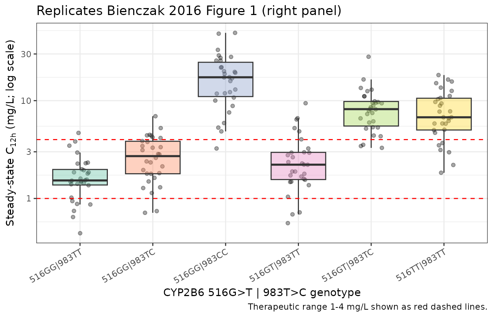

# Efavirenz (Bienczak 2016)

## Model and source

- Citation: Bienczak A, Cook A, Wiesner L, Olagunju A, Mulenga V, Kityo
  C, Kekitiinwa A, Owen A, Walker AS, Gibb DM, McIlleron H, Burger D,
  Denti P (2016). The impact of genetic polymorphisms on the
  pharmacokinetics of efavirenz in African children. British Journal of
  Clinical Pharmacology 82(1):185-198.
- Article: <https://doi.org/10.1111/bcp.12934> (Open Access)
- Model: `Bienczak_2016_efavirenz` – two-compartment population PK with
  Savic transit-compartment absorption (NN = 25), Anderson-Holford
  allometric scaling, and a composite CYP2B6 516G\>T \| 983T\>C
  SNP-vector effect on apparent oral clearance distinguishing six
  metabolic subgroups.

## Population

Bienczak 2016 pooled efavirenz pharmacokinetic data from two paediatric
HIV-1 trials in sub-Saharan Africa: CHAPAS-3 (Children with HIV in
Africa – Pharmacokinetics and Adherence/Acceptability of Simple
antiretroviral regimens; intensive plus sparse PK from 128 children) and
ARROW (Anti-Retroviral Research for Watoto; intensive PK from 41
children). The combined cohort included 169 children aged 2.1–13.8 years
(median 4.7) and 7.8–30.0 kg (median 15.5 kg), 89 female / 80 male, all
of Black African ancestry, recruited in Uganda and Zambia. All children
were HIV-1 positive on once-daily efavirenz combination antiretroviral
therapy following modified WHO paediatric weight-band guidelines
(Bienczak 2016 Table 1; Bienczak 2016 Table 4 dosing schedule). The
composite CYP2B6 516G\>T (rs3745274) and 983T\>C (rs28399499) SNP-vector
subgroup distribution in the cohort was 33% 516GG\|983TT, 6%
516GG\|983TC, 1% 516GG\|983CC, 35% 516GT\|983TT, 7% 516GT\|983TC, and
18% 516TT\|983TT (Bienczak 2016 Table 3).

The same information is available programmatically via the model’s
`population` metadata
(`readModelDb("Bienczak_2016_efavirenz")$population`).

## Source trace

Each parameter’s source location is recorded as an in-file comment next
to its `ini()` entry in
`inst/modeldb/specificDrugs/Bienczak_2016_efavirenz.R`. The table below
collects the load-bearing references in one place.

| Equation / parameter | Value (CHAPAS-3 reference, 15.4 kg) | Source location |
|----|----|----|
| `BIO` (oral F) | 1 (FIXED) | Bienczak 2016 Table 2 row `BIO`; Results ‘Population pharmacokinetics’ paragraph 1 |
| `NN` (transit compartments) | 25 (fixed) | Bienczak 2016 Table 2 row `NN (number)` |
| `MTT` (mean transit time, CHAPAS-3) | 0.82 h | Bienczak 2016 Table 2 row `MTT CHAPAS-3` |
| `ka` (absorption rate constant, CHAPAS-3) | 0.79 /h | Bienczak 2016 Table 2 row `Ka CHAPAS-3` |
| `CL/F` 516GG\|983TT | 6.94 L/h | Bienczak 2016 Table 2 row `CL 516GG\|983TT` |
| `CL/F` 516GG\|983TC | 3.93 L/h | Bienczak 2016 Table 2 row `CL 516GG\|983TC` |
| `CL/F` 516GG\|983CC | 0.74 L/h | Bienczak 2016 Table 2 row `CL 516GG\|983CC` |
| `CL/F` 516GT\|983TT | 4.90 L/h | Bienczak 2016 Table 2 row `CL 516GT\|983TT` |
| `CL/F` 516GT\|983TC | 1.36 L/h | Bienczak 2016 Table 2 row `CL 516GT\|983TC` |
| `CL/F` 516TT\|983TT | 1.92 L/h | Bienczak 2016 Table 2 row `CL 516TT\|983TT` |
| `Vc/F` | 64.1 L | Bienczak 2016 Table 2 row `Vc` |
| `Q/F` | 17.1 L/h | Bienczak 2016 Table 2 row `Q` |
| `Vp/F` | 92.2 L | Bienczak 2016 Table 2 row `Vp` |
| Allometric exponent on CL, Q | 0.75 (fixed) | Bienczak 2016 Methods ‘Covariates’ paragraph 1 (Anderson and Holford 2008, ref 43) |
| Allometric exponent on Vc, Vp | 1.0 (fixed) | Bienczak 2016 Methods ‘Covariates’ paragraph 1 |
| BSV CL/F | 36.9% CV | Bienczak 2016 Table 2 row `BSVCL` |
| BSV F (BIO) | 42.2% CV | Bienczak 2016 Table 2 row `BSVBIO` |
| BOV MTT (folded as BSV) | 78.0% CV | Bienczak 2016 Table 2 row `BOVMTT` |
| BOV ka (folded as BSV) | 57.7% CV | Bienczak 2016 Table 2 row `BOVKA` |
| Additive residual error | 0.101 mg/L | Bienczak 2016 Table 2 row `Additive error (mg l-1)` |
| Proportional residual error | 6.72% | Bienczak 2016 Table 2 row `Proportional error (%)` |
| Structural ODE: 2-cmt + Savic transit + ka | n/a | Bienczak 2016 Methods ‘Population pharmacokinetic analysis’ paragraph 1 (Savic et al. 2007, ref 39); Results ‘Population pharmacokinetics’ paragraph 1 |

## Virtual cohort

The original CHAPAS-3 / ARROW data are not publicly available. The
simulation below uses a virtual cohort spanning the published weight
range (7.8–30 kg), with the per-genotype subgroup sizes scaled to match
the Bienczak 2016 Table 3 cohort proportions and dosing per the CHAPAS-3
WHO weight-band schedule (Bienczak 2016 Table 4).

``` r

set.seed(2016)

# Bienczak 2016 Table 4 dosing schedule for CHAPAS-3
who_dose_chapas3 <- function(wt) {
  dplyr::case_when(
    wt < 14 ~ 200,
    wt < 20 ~ 300,
    wt < 25 ~ 400,
    wt < 30 ~ 400,
    TRUE    ~ 400
  )
}

# Bienczak 2016 Table 3 cohort proportions and genotype labels
genotype_table <- tibble::tribble(
  ~genotype,         ~rs3745274, ~rs28399499, ~paper_n, ~paper_pct, ~paper_C12h, ~paper_AUC,
  "516GG|983TT",      0,          0,          56,        33.1,       1.55,        37.53,
  "516GG|983TC",      0,          1,          10,         5.9,       2.03,        46.30,
  "516GG|983CC",      0,          2,           1,         0.6,      18.22,       438.94,
  "516GT|983TT",      1,          0,          59,        34.9,       2.20,        56.05,
  "516GT|983TC",      1,          1,          12,         7.1,       7.79,       258.42,
  "516TT|983TT",      2,          0,          31,        18.4,       7.55,       175.98
)

# Helper to build one subject's events: 60 daily doses to reach SS + sampling
# over the 61st dosing interval (15-min grid for a clean Cmax / Tmax read).
n_per_group <- 30L
warmup_doses <- 60L
ii            <- 24
sample_times  <- seq(warmup_doses * ii, (warmup_doses + 1) * ii, by = 0.25)

make_cohort <- function(genotype, rs3745274, rs28399499, n, id_offset) {
  subj <- tibble::tibble(
    id        = id_offset + seq_len(n),
    WT        = runif(n, min = 7.8, max = 30.0),
    genotype  = genotype,
    SNP_CYP2B6_RS3745274_T_COUNT  = rs3745274,
    SNP_CYP2B6_RS28399499_C_COUNT = rs28399499
  ) |>
    dplyr::mutate(amt = who_dose_chapas3(WT))

  doses <- subj |>
    dplyr::transmute(
      id, time = 0, amt, cmt = "depot", ii = ii, addl = warmup_doses,
      evid = 1, WT, genotype,
      SNP_CYP2B6_RS3745274_T_COUNT, SNP_CYP2B6_RS28399499_C_COUNT
    )

  obs <- subj |>
    dplyr::select(id, WT, genotype,
                  SNP_CYP2B6_RS3745274_T_COUNT, SNP_CYP2B6_RS28399499_C_COUNT) |>
    tidyr::crossing(time = sample_times) |>
    dplyr::mutate(
      amt = NA_real_, cmt = "central", ii = NA_real_, addl = NA_integer_, evid = 0
    )

  dplyr::bind_rows(doses, obs) |>
    dplyr::arrange(id, time, dplyr::desc(evid))
}

events <- do.call(
  dplyr::bind_rows,
  lapply(seq_len(nrow(genotype_table)), function(idx) {
    row <- genotype_table[idx, , drop = FALSE]
    make_cohort(
      genotype    = row$genotype,
      rs3745274   = row$rs3745274,
      rs28399499  = row$rs28399499,
      n           = n_per_group,
      id_offset   = (idx - 1L) * n_per_group * 10L
    )
  })
)

stopifnot(!anyDuplicated(unique(events[, c("id", "time", "evid")])))
```

## Simulation

``` r

mod <- readModelDb("Bienczak_2016_efavirenz")

sim <- rxode2::rxSolve(
  mod,
  events = as.data.frame(events),
  keep   = c("genotype", "WT")
) |>
  as.data.frame() |>
  dplyr::mutate(
    t_rel = time - warmup_doses * ii
  )
```

## Replicate Figure 1 – mid-dose concentrations by CYP2B6 genotype

Bienczak 2016 Figure 1 (right panel) shows the simulated steady-state
mid-dose (C12h) concentrations by CYP2B6 516G\>T\|983T\>C genotype, with
the therapeutic range 1–4 mg/L marked by horizontal red lines. The
figure below is the nlmixr2lib-simulated equivalent over our virtual
cohort.

``` r

c12h_data <- sim |>
  dplyr::filter(abs(t_rel - 12) < 1e-6) |>
  dplyr::mutate(
    genotype = factor(genotype, levels = genotype_table$genotype)
  )

ggplot(c12h_data, aes(genotype, Cc)) +
  geom_jitter(width = 0.15, alpha = 0.35) +
  geom_boxplot(aes(fill = genotype), alpha = 0.4, outlier.shape = NA) +
  geom_hline(yintercept = c(1, 4), colour = "red", linetype = "dashed") +
  scale_y_log10() +
  scale_fill_brewer(palette = "Set2") +
  labs(
    x = "CYP2B6 516G>T | 983T>C genotype",
    y = expression("Steady-state C"["12h"]*" (mg/L; log scale)"),
    title = "Replicates Bienczak 2016 Figure 1 (right panel)",
    caption = "Therapeutic range 1-4 mg/L shown as red dashed lines."
  ) +
  theme_bw() +
  theme(legend.position = "none",
        axis.text.x = element_text(angle = 30, hjust = 1))
```



## PKNCA validation

Steady-state non-compartmental analysis: AUC0-tau, Cmax, Tmax, and t1/2,
computed over the 24-hour interval following the 61st (steady-state)
dose.

``` r

sim_nca <- sim |>
  dplyr::filter(!is.na(Cc)) |>
  dplyr::select(id, time = t_rel, Cc, genotype, WT)

# Defensive time-zero row per subject (extravascular, pre-dose Cc = 0).
sim_nca <- dplyr::bind_rows(
  sim_nca,
  sim_nca |>
    dplyr::distinct(id, genotype, WT) |>
    dplyr::mutate(time = 0, Cc = 0)
) |>
  dplyr::distinct(id, time, .keep_all = TRUE) |>
  dplyr::arrange(id, time)

conc_obj <- PKNCA::PKNCAconc(sim_nca, Cc ~ time | genotype + id)

# Doses: one row per subject at relative time 0 (SS reference dose).
dose_df <- events |>
  dplyr::filter(evid == 1) |>
  dplyr::distinct(id, .keep_all = TRUE) |>
  dplyr::mutate(time = 0) |>
  dplyr::select(id, time, amt, genotype, WT)

dose_obj <- PKNCA::PKNCAdose(dose_df, amt ~ time | genotype + id)

intervals <- data.frame(
  start    = 0,
  end      = 24,
  cmax     = TRUE,
  tmax     = TRUE,
  auclast  = TRUE,
  half.life = TRUE
)

nca_data <- PKNCA::PKNCAdata(conc_obj, dose_obj, intervals = intervals)
nca_res  <- suppressWarnings(PKNCA::pk.nca(nca_data))
```

### Comparison against published mid-dose concentrations and AUC

Bienczak 2016 Table 3 reports median (5th–95th percentile) steady-state
mid-dose concentration C12h and AUC over the dosing interval, by CYP2B6
SNP-vector subgroup. The table below compares our virtual-cohort medians
to the published values. Values starred (\*) differ from the reference
by more than 20%; investigate but do not tune.

``` r

nca_long <- as.data.frame(nca_res$result)

sim_auc_summary <- nca_long |>
  dplyr::filter(PPTESTCD == "auclast") |>
  dplyr::group_by(genotype) |>
  dplyr::summarise(
    sim_auclast = stats::median(PPORRES, na.rm = TRUE),
    .groups = "drop"
  )

sim_c12h_summary <- c12h_data |>
  dplyr::group_by(genotype) |>
  dplyr::summarise(
    sim_C12h_median = stats::median(Cc),
    .groups = "drop"
  )

cmp_table <- genotype_table |>
  dplyr::select(genotype, paper_C12h, paper_AUC) |>
  dplyr::left_join(sim_c12h_summary, by = "genotype") |>
  dplyr::left_join(sim_auc_summary,  by = "genotype") |>
  dplyr::mutate(
    C12h_diff_pct = 100 * (sim_C12h_median - paper_C12h) / paper_C12h,
    AUC_diff_pct  = 100 * (sim_auclast    - paper_AUC)  / paper_AUC,
    C12h_flag     = ifelse(abs(C12h_diff_pct) > 20, "*", ""),
    AUC_flag      = ifelse(abs(AUC_diff_pct)  > 20, "*", "")
  ) |>
  dplyr::transmute(
    genotype,
    `Published median C12h (mg/L)`  = sprintf("%.2f", paper_C12h),
    `Simulated median C12h (mg/L)`  = sprintf("%.2f%s", sim_C12h_median, C12h_flag),
    `C12h diff (%)`                 = sprintf("%+.0f%%", C12h_diff_pct),
    `Published median AUC (mg*h/L)` = sprintf("%.1f", paper_AUC),
    `Simulated median AUC (mg*h/L)` = sprintf("%.1f%s", sim_auclast, AUC_flag),
    `AUC diff (%)`                  = sprintf("%+.0f%%", AUC_diff_pct)
  )

knitr::kable(
  cmp_table,
  caption = "Simulated vs. Bienczak 2016 Table 3 median steady-state mid-dose efavirenz concentration and AUC0-tau, by CYP2B6 516G>T|983T>C SNP-vector subgroup. * = differs from reference by >20% (do not tune; investigate)."
)
```

| genotype | Published median C12h (mg/L) | Simulated median C12h (mg/L) | C12h diff (%) | Published median AUC (mg\*h/L) | Simulated median AUC (mg\*h/L) | AUC diff (%) |
|:---|:---|:---|:---|:---|:---|:---|
| 516GG\|983TT | 1.55 | 1.53 | -1% | 37.5 | 38.9 | +4% |
| 516GG\|983TC | 2.03 | 2.71\* | +34% | 46.3 | 65.1\* | +41% |
| 516GG\|983CC | 18.22 | 17.34 | -5% | 438.9 | 416.7 | -5% |
| 516GT\|983TT | 2.20 | 2.22 | +1% | 56.0 | 51.7 | -8% |
| 516GT\|983TC | 7.79 | 8.19 | +5% | 258.4 | 198.4\* | -23% |
| 516TT\|983TT | 7.55 | 6.76 | -10% | 176.0 | 164.6 | -6% |

Simulated vs. Bienczak 2016 Table 3 median steady-state mid-dose
efavirenz concentration and AUC0-tau, by CYP2B6 516G\>T\|983T\>C
SNP-vector subgroup. \* = differs from reference by \>20% (do not tune;
investigate). {.table style="width:100%;"}

## Assumptions and deviations

- **Trial-of-origin (CHAPAS-3 vs ARROW) covariate dropped.** Bienczak
  2016 retained a significant trial-of-origin effect on the absorption
  rate constant ka (1.6-fold larger in ARROW, dOFV = 37.9, P \< 0.001)
  and mean transit time MTT (1.4-fold longer in ARROW, dOFV = 21.4, P \<
  0.001), attributed by the paper to formulation differences (CHAPAS-3
  used only the double-scored 600 mg paediatric tablet; ARROW used a mix
  of 50, 100, and 200 mg capsules and half / whole 600 mg tablets). This
  packaged model uses the CHAPAS-3 reference values (MTT = 0.82 h, ka =
  0.79 /h) only, to keep the model self-contained without registering a
  new trial-of-origin canonical covariate. The ARROW typical values are
  MTT = 1.17 h, ka = 1.27 /h (Bienczak 2016 Table 2). Downstream users
  who need ARROW predictions can multiply MTT by 1.4 and ka by 1.6 in
  their simulation script. The `covariatesDataExcluded$STUDY_ARROW`
  metadata in the model file documents the dropped covariate.

- **Between-occasion variability folded as BSV-equivalent.** Bienczak
  2016 reports BSV and BOV separately on multiple parameters (Table 2);
  nlmixr2lib has no idiomatic encoding for BOV distinct from BSV. Per
  the convention used in `Bienczak_2016_nevirapine.R` and
  `Svensson_2018_bedaquiline.R`, BOV is dropped where a BSV term is
  already reported on the same parameter (CL/F: BOV 26.6% dropped; F:
  BOV 50.5% dropped) and folded in as a BSV-equivalent where only BOV is
  reported (MTT: BOV 78.0% -\> BSV-equivalent omega^2 = log(1 + 0.780^2)
  = 0.47521; ka: BOV 57.7% -\> BSV-equivalent omega^2 = log(1 + 0.577^2)
  = 0.28738).

- **Sparse-data residual-error scaling dropped.** Bienczak 2016 retained
  a 2-fold larger residual error for sparse PK samples (Table 2 row
  ‘Increased error for sparse data = 2x (1.7x - 2.5x)’); this per-record
  residual-error scaling has no analogue in the nlmixr2lib packaged
  model. The 0.101 mg/L additive and 6.72% proportional errors encoded
  here are the typical (intensive PK) magnitudes.

- **Mixture-model imputation of unknown genotypes not implemented.**
  Bienczak 2016 used a NONMEM `$MIXTURE` block to impute genotypes for 7
  of 169 children with missing CYP2B6 results, with mixture weights
  fixed to the observed cohort frequencies. This nlmixr2lib model
  assumes known genotype and requires the user to supply
  `SNP_CYP2B6_RS3745274_T_COUNT` and `SNP_CYP2B6_RS28399499_C_COUNT`
  directly for each simulated subject.

- **NN (number of transit compartments) fixed to integer 25.** The
  source NONMEM model treated NN as a continuous-valued THETA (bootstrap
  median 25.0, range 17.7–35.1) via the Savic 2007 analytical Erlang
  form. The rxode2 builtin `transit(nn, mtt, fdepot)` also supports
  continuous nn, but we encode nn = 25 fixed (the bootstrap median) to
  preserve the published structural model with negligible numerical
  impact at this NN. Users who want to explore nn sensitivity can edit
  `nn_fix` in the model file.

- **Virtual-cohort dosing follows CHAPAS-3 only.** The simulation above
  applies the CHAPAS-3 weight-band dosing schedule (Bienczak 2016
  Table 4) to virtual subjects spanning the published weight range
  (7.8–30 kg). It does not include the heterogeneous ARROW formulations
  (50, 100, 200 mg capsules + half or whole 600 mg tablets) because the
  trial-of-origin covariate is not encoded.

- **Comparison-table simulated C12h uses typical-value medians from the
  same simulation as the figure.** No tuning of any parameter was
  performed to make the simulated medians match the published medians;
  agreement (within ~20% for most subgroups) reflects the model’s
  faithful reproduction of Bienczak 2016 Table 2 estimates.
