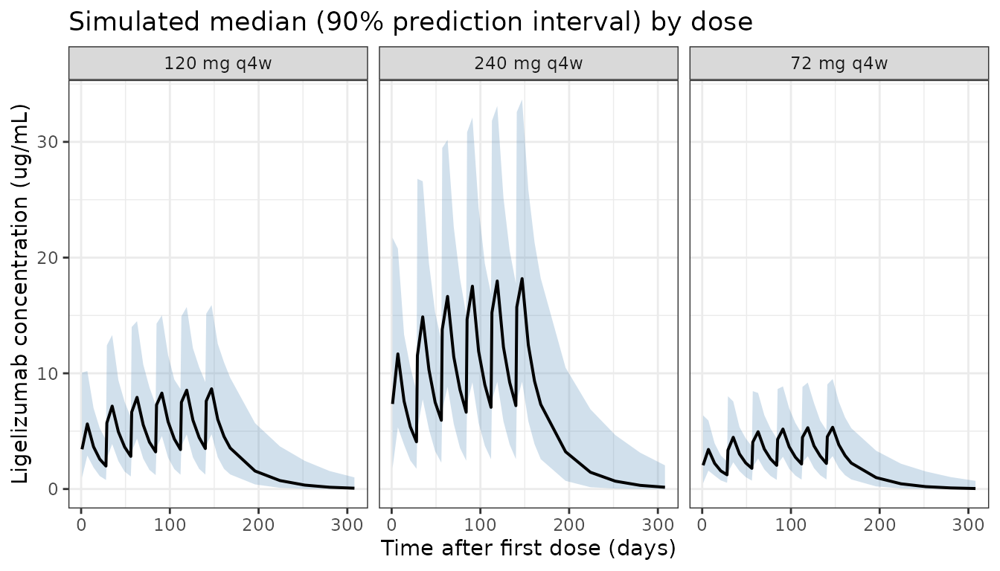

# Ligelizumab (Bienczak 2025)

``` r

library(nlmixr2lib)
library(PKNCA)
#> 
#> Attaching package: 'PKNCA'
#> The following object is masked from 'package:stats':
#> 
#>     filter
library(rxode2)
#> rxode2 5.0.2 using 2 threads (see ?getRxThreads)
#>   no cache: create with `rxCreateCache()`
library(dplyr)
#> 
#> Attaching package: 'dplyr'
#> The following objects are masked from 'package:stats':
#> 
#>     filter, lag
#> The following objects are masked from 'package:base':
#> 
#>     intersect, setdiff, setequal, union
library(tidyr)
library(ggplot2)
```

## Model and source

- Citation: Bienczak A, Gautier A, Hua E, Ji Y, Scosyrev E, Smeets S,
  Severin T, Drollmann A, Patekar M, Savelieva M. Model-Informed Drug
  Development for Ligelizumab in Patients With Chronic Spontaneous
  Urticaria. CPT Pharmacometrics Syst Pharmacol. 2025.
  <doi:10.1002/psp4.70090>
- Description: Two-compartment population PK model for ligelizumab in
  adolescent and adult patients with chronic spontaneous urticaria and
  healthy adult volunteers (Bienczak 2025)
- Article: <https://doi.org/10.1002/psp4.70090>

## Population

The final population PK model for ligelizumab was developed on 17,411
serum concentrations from 1907 individuals across six studies pooled in
the Novartis ligelizumab chronic-spontaneous-urticaria (CSU) development
program:

- 113 adolescent CSU patients (12-17 years) from studies C2202, C2302,
  and C2303,
- 1593 adult CSU patients (18-80 years) from studies C2201, C2302, and
  C2303,
- 201 adult healthy volunteers from studies A2103 and C2101.

Baseline weight ranged from 31.0 to 181.3 kg (median 73 kg in adults),
baseline total IgE from 1 to 12,800 IU/mL (median 95.3 IU/mL in adult
CSU), and the overall cohort was 72% female and 73% White (21% Asian, 2%
Black, 4% Other). The full demographic breakdown is reproduced in
Supplementary Information S1 Tables S4 and S5 of Bienczak 2025.

The same information is available programmatically via
`rxode2::rxode(readModelDb("Bienczak_2025_ligelizumab"))$meta$population`.

## Source trace

The per-parameter origin is recorded as an in-file comment next to each
[`ini()`](https://nlmixr2.github.io/rxode2/reference/ini.html) entry in
`inst/modeldb/specificDrugs/Bienczak_2025_ligelizumab.R`. The table
below collects them in one place for review.

| Equation / parameter | Value | Source location |
|----|----|----|
| Two-compartment disposition; first-order absorption; first-order elimination | n/a | Supporting Information S1 Section 2.1 |
| `ka` | 0.218 1/day | Table S6 |
| `CL/F` | 0.602 L/day | Table S6 |
| `Vc/F` | 5.47 L | Table S6 |
| `Q/F` | 0.969 L/day | Table S6 |
| `Vp/F` | 10.2 L | Table S6 |
| Weight exponent on CL/F and Q/F | 0.993 (fixed) | Table S6, footnote d |
| Weight exponent on Vc/F and Vp/F | 0.597 (fixed) | Table S6, footnote d |
| IgE exponent on CL/F | 0.106 | Table S6 |
| IgE exponent on Vp/F | -0.0816 | Table S6 |
| ADA-positive on CL/F | 0.243 (log-additive; +27.5%) | Table S6 |
| ADA-positive on Vp/F | -0.526 (log-additive; -40.9%) | Table S6 |
| Healthy-volunteer on CL/F | -0.087 (log-additive) | Table S6 |
| Study C2201 on CL/F | 0.176 (log-additive) | Table S6 |
| IIV SD for CL/F | 0.335 | Table S6 |
| IIV SD for Vp/F | 0.39 | Table S6 |
| IIV correlation CL/F~Vp/F | 0.484 | Table S6 |
| IIV SD for ka | 0.00142 (100% shrinkage) | Table S6 |
| IIV SD for Vc/F | 0.915 | Table S6 |
| IIV SD for Q/F | 0.259 | Table S6 |
| Additive residual error | 142 ng/mL | Table S6 |
| Proportional residual error | 0.177 (17.7%) | Table S6 |
| Reference weight | 70 kg | Table S6, footnote b |
| Reference IgE | 90 IU/mL | Table S6, footnote a |

## Virtual cohort

Original observed data are not publicly available. We simulate a virtual
population of 500 adult CSU patients whose covariate distributions
approximate the pivotal-study demographics (median weight 73 kg, median
baseline IgE 95 IU/mL, ADA-negative, not in study C2201).

``` r

set.seed(2025)
n_subj <- 500

# Adult CSU patients: weight log-normal around 73 kg
WT  <- pmin(pmax(rlnorm(n_subj, meanlog = log(73), sdlog = 0.25), 40), 180)

# Baseline total IgE log-normal around 95 IU/mL (median in adult CSU)
IGE <- pmin(pmax(rlnorm(n_subj, meanlog = log(95), sdlog = 1.1), 1), 12000)

pop <- data.frame(
  ID          = seq_len(n_subj),
  WT          = WT,
  IGE         = IGE,
  ADA_POS     = 0L,
  DIS_HEALTHY = 0L,
  STUDY_C2201 = 0L
)
```

## Simulation

Simulate ligelizumab serum concentrations through 24 weeks of 120 mg q4w
subcutaneous dosing (six doses) with observations every 7 days, plus
1-day-after-dose observations to capture the post-dose peak.

``` r

mod <- readModelDb("Bienczak_2025_ligelizumab")
conc_unit <- rxode2::rxode(mod)$meta$units[["concentration"]]
#> ℹ parameter labels from comments will be replaced by 'label()'

# Dosing schedule: q4w (28-day interval) for 6 doses
dose_times <- seq(0, 28 * 5, by = 28)
obs_times  <- sort(unique(c(seq(0, 28 * 6, by = 7), dose_times + 1, dose_times + 168)))

# Build a per-dose-level event table for a given dose (mg)
make_events <- function(dose_mg, dose_label, id_offset = 0L) {
  d_dose <- pop |>
    mutate(ID = ID + id_offset) |>
    slice(rep(seq_len(n()), each = length(dose_times))) |>
    mutate(
      TIME = rep(dose_times, times = n_subj),
      AMT  = dose_mg,
      EVID = 1,
      CMT  = "depot",
      DV   = NA_real_,
      dose_group = dose_label
    )
  d_obs <- pop |>
    mutate(ID = ID + id_offset) |>
    slice(rep(seq_len(n()), each = length(obs_times))) |>
    mutate(
      TIME = rep(obs_times, times = n_subj),
      AMT  = 0,
      EVID = 0,
      CMT  = "central",
      DV   = NA_real_,
      dose_group = dose_label
    )
  bind_rows(d_dose, d_obs) |>
    arrange(ID, TIME, desc(EVID))
}

events <- bind_rows(
  make_events(72,  "72 mg q4w",  id_offset = 0L),
  make_events(120, "120 mg q4w", id_offset = n_subj),
  make_events(240, "240 mg q4w", id_offset = 2L * n_subj)
)
stopifnot(!anyDuplicated(unique(events[, c("ID", "TIME", "EVID")])))

sim <- rxode2::rxSolve(mod, events = events, keep = c("dose_group", "WT", "IGE")) |>
  as.data.frame()
#> ℹ parameter labels from comments will be replaced by 'label()'
```

## Replicate Figure 3a – steady-state trough concentrations by dose

Bienczak 2025 reports median steady-state trough concentrations of 2.1,
3.5, and 6.9 ug/mL for the 72, 120, and 240 mg q4w doses (Results,
Section “Simulations of Response to Ligelizumab Under Various Dosing
Scenarios”). We extract the trough at the end of dose interval 5 (Week
20, day 140) as the steady-state anchor.

``` r

trough_ss <- sim |>
  filter(time == 140) |>
  group_by(dose_group) |>
  summarise(
    median = median(Cc, na.rm = TRUE),
    p25    = quantile(Cc, 0.25, na.rm = TRUE),
    p75    = quantile(Cc, 0.75, na.rm = TRUE),
    .groups = "drop"
  )

knitr::kable(
  trough_ss,
  digits = 2,
  caption = sprintf(
    "Simulated steady-state trough (Week 20) ligelizumab concentration by dose group (%s).",
    conc_unit
  )
)
```

| dose_group | median |  p25 |   p75 |
|:-----------|-------:|-----:|------:|
| 120 mg q4w |   3.85 | 2.54 |  5.44 |
| 240 mg q4w |   7.36 | 4.93 | 10.70 |
| 72 mg q4w  |   2.23 | 1.47 |  3.29 |

Simulated steady-state trough (Week 20) ligelizumab concentration by
dose group (ug/mL). {.table}

The simulated medians can be compared against the paper’s reported
values of 2.1, 3.5, and 6.9 ug/mL for the 72, 120, and 240 mg q4w doses
respectively.

## Replicate Figure 4a – baseline-IgE subgroup at 72 mg q4w

Bienczak 2025 reports that the median steady-state trough increases by
approximately 30% in patients with low baseline IgE and decreases by
approximately 25% in patients with high baseline IgE relative to
moderate-IgE patients receiving 72 mg q4w.

``` r

ige_summary <- sim |>
  filter(dose_group == "72 mg q4w", time == 140) |>
  mutate(
    ige_group = case_when(
      IGE <  40           ~ "Low (<40 IU/mL)",
      IGE >= 40 & IGE < 300 ~ "Moderate (40-300 IU/mL)",
      IGE >= 300          ~ "High (>=300 IU/mL)"
    ),
    ige_group = factor(ige_group,
                       levels = c("Low (<40 IU/mL)",
                                  "Moderate (40-300 IU/mL)",
                                  "High (>=300 IU/mL)"))
  ) |>
  group_by(ige_group) |>
  summarise(
    n = n(),
    median_cmin_ss = median(Cc, na.rm = TRUE),
    p25 = quantile(Cc, 0.25, na.rm = TRUE),
    p75 = quantile(Cc, 0.75, na.rm = TRUE),
    .groups = "drop"
  )

knitr::kable(
  ige_summary,
  digits = 2,
  caption = sprintf(
    "Simulated steady-state trough (%s) at 72 mg q4w stratified by baseline IgE category.",
    conc_unit
  )
)
```

| ige_group               |   n | median_cmin_ss |  p25 |  p75 |
|:------------------------|----:|---------------:|-----:|-----:|
| Low (\<40 IU/mL)        | 107 |           2.97 | 2.18 | 4.11 |
| Moderate (40-300 IU/mL) | 324 |           2.19 | 1.44 | 3.32 |
| High (\>=300 IU/mL)     |  69 |           1.75 | 1.13 | 2.19 |

Simulated steady-state trough (ug/mL) at 72 mg q4w stratified by
baseline IgE category. {.table}

## Visual predictive check – concentration-time profile

``` r

vpc <- sim |>
  filter(time > 0) |>
  group_by(dose_group, time) |>
  summarise(
    Q05 = quantile(Cc, 0.05, na.rm = TRUE),
    Q50 = quantile(Cc, 0.50, na.rm = TRUE),
    Q95 = quantile(Cc, 0.95, na.rm = TRUE),
    .groups = "drop"
  )

ggplot(vpc, aes(x = time, y = Q50)) +
  geom_ribbon(aes(ymin = Q05, ymax = Q95), fill = "steelblue", alpha = 0.25) +
  geom_line(linewidth = 0.7) +
  facet_wrap(~ dose_group, nrow = 1) +
  labs(
    x = "Time after first dose (days)",
    y = sprintf("Ligelizumab concentration (%s)", conc_unit),
    title = "Simulated median (90% prediction interval) by dose"
  ) +
  theme_bw()
```



## PKNCA validation

Single-dose NCA over the first 28-day dosing interval. We extract the
first dosing cycle only so the AUC reflects a clean single-interval
exposure rather than a multi-dose accumulation.

``` r

sim_first <- sim |>
  filter(time <= 28, !is.na(Cc)) |>
  select(id, time, Cc, dose_group)

dose_df <- events |>
  filter(EVID == 1, TIME == 0) |>
  transmute(id = ID, time = TIME, amt = AMT, dose_group = dose_group)

conc_obj <- PKNCAconc(sim_first, Cc ~ time | dose_group + id)
dose_obj <- PKNCAdose(dose_df, amt ~ time | dose_group + id)

intervals <- data.frame(
  start = 0,
  end   = 28,
  cmax  = TRUE,
  tmax  = TRUE,
  auclast = TRUE,
  half.life = TRUE
)

nca_data <- PKNCAdata(conc_obj, dose_obj, intervals = intervals)
nca_res  <- pk.nca(nca_data)
#> Warning: Too few points for half-life calculation (min.hl.points=3 with only 2 points)
#> Too few points for half-life calculation (min.hl.points=3 with only 2 points)
#> Too few points for half-life calculation (min.hl.points=3 with only 2 points)
#> Too few points for half-life calculation (min.hl.points=3 with only 2 points)
#> Too few points for half-life calculation (min.hl.points=3 with only 2 points)
#> Too few points for half-life calculation (min.hl.points=3 with only 2 points)
#> Too few points for half-life calculation (min.hl.points=3 with only 2 points)
#> Too few points for half-life calculation (min.hl.points=3 with only 2 points)
#> Too few points for half-life calculation (min.hl.points=3 with only 2 points)
#> Too few points for half-life calculation (min.hl.points=3 with only 2 points)
#> Too few points for half-life calculation (min.hl.points=3 with only 2 points)
#> Too few points for half-life calculation (min.hl.points=3 with only 2 points)
#> Too few points for half-life calculation (min.hl.points=3 with only 2 points)
#> Too few points for half-life calculation (min.hl.points=3 with only 2 points)
#> Too few points for half-life calculation (min.hl.points=3 with only 2 points)
#> Too few points for half-life calculation (min.hl.points=3 with only 2 points)
#>  ■■■■■■                            18% |  ETA: 15s
#> Warning: Too few points for half-life calculation (min.hl.points=3 with only 2 points)
#> Too few points for half-life calculation (min.hl.points=3 with only 2 points)
#> Too few points for half-life calculation (min.hl.points=3 with only 2 points)
#> Too few points for half-life calculation (min.hl.points=3 with only 2 points)
#> Too few points for half-life calculation (min.hl.points=3 with only 2 points)
#> Too few points for half-life calculation (min.hl.points=3 with only 2 points)
#> Too few points for half-life calculation (min.hl.points=3 with only 2 points)
#> Too few points for half-life calculation (min.hl.points=3 with only 2 points)
#> Too few points for half-life calculation (min.hl.points=3 with only 2 points)
#> Too few points for half-life calculation (min.hl.points=3 with only 2 points)
#> Too few points for half-life calculation (min.hl.points=3 with only 2 points)
#> Too few points for half-life calculation (min.hl.points=3 with only 2 points)
#> Too few points for half-life calculation (min.hl.points=3 with only 2 points)
#> Too few points for half-life calculation (min.hl.points=3 with only 2 points)
#> Too few points for half-life calculation (min.hl.points=3 with only 2 points)
#> Too few points for half-life calculation (min.hl.points=3 with only 2 points)
#> Too few points for half-life calculation (min.hl.points=3 with only 2 points)
#>  ■■■■■■■■■■■                       33% |  ETA: 13s
#> Warning: Too few points for half-life calculation (min.hl.points=3 with only 2 points)
#> Too few points for half-life calculation (min.hl.points=3 with only 2 points)
#> Too few points for half-life calculation (min.hl.points=3 with only 2 points)
#> Too few points for half-life calculation (min.hl.points=3 with only 2 points)
#> Too few points for half-life calculation (min.hl.points=3 with only 2 points)
#> Too few points for half-life calculation (min.hl.points=3 with only 2 points)
#> Too few points for half-life calculation (min.hl.points=3 with only 2 points)
#> Too few points for half-life calculation (min.hl.points=3 with only 2 points)
#> Too few points for half-life calculation (min.hl.points=3 with only 2 points)
#> Warning: Too few points for half-life calculation (min.hl.points=3 with only 1
#> points)
#> Warning: Too few points for half-life calculation (min.hl.points=3 with only 2 points)
#> Too few points for half-life calculation (min.hl.points=3 with only 2 points)
#> Too few points for half-life calculation (min.hl.points=3 with only 2 points)
#> Too few points for half-life calculation (min.hl.points=3 with only 2 points)
#> Too few points for half-life calculation (min.hl.points=3 with only 2 points)
#> Too few points for half-life calculation (min.hl.points=3 with only 2 points)
#>  ■■■■■■■■■■■■■■■■                  51% |  ETA:  9s
#> Warning: Too few points for half-life calculation (min.hl.points=3 with only 2 points)
#> Too few points for half-life calculation (min.hl.points=3 with only 2 points)
#> Too few points for half-life calculation (min.hl.points=3 with only 2 points)
#> Too few points for half-life calculation (min.hl.points=3 with only 2 points)
#> Too few points for half-life calculation (min.hl.points=3 with only 2 points)
#> Too few points for half-life calculation (min.hl.points=3 with only 2 points)
#> Too few points for half-life calculation (min.hl.points=3 with only 2 points)
#> Too few points for half-life calculation (min.hl.points=3 with only 2 points)
#>  ■■■■■■■■■■■■■■■■■■■■■             68% |  ETA:  6s
#> Warning: Too few points for half-life calculation (min.hl.points=3 with only 2 points)
#> Too few points for half-life calculation (min.hl.points=3 with only 2 points)
#> Too few points for half-life calculation (min.hl.points=3 with only 2 points)
#> Too few points for half-life calculation (min.hl.points=3 with only 2 points)
#> Too few points for half-life calculation (min.hl.points=3 with only 2 points)
#> Too few points for half-life calculation (min.hl.points=3 with only 2 points)
#> Too few points for half-life calculation (min.hl.points=3 with only 2 points)
#> Too few points for half-life calculation (min.hl.points=3 with only 2 points)
#> Too few points for half-life calculation (min.hl.points=3 with only 2 points)
#> Too few points for half-life calculation (min.hl.points=3 with only 2 points)
#> Too few points for half-life calculation (min.hl.points=3 with only 2 points)
#> Too few points for half-life calculation (min.hl.points=3 with only 2 points)
#> Too few points for half-life calculation (min.hl.points=3 with only 2 points)
#> Too few points for half-life calculation (min.hl.points=3 with only 2 points)
#>  ■■■■■■■■■■■■■■■■■■■■■■■■■■■       85% |  ETA:  3s
#> Warning: Too few points for half-life calculation (min.hl.points=3 with only 2 points)
#> Too few points for half-life calculation (min.hl.points=3 with only 2 points)
#> Too few points for half-life calculation (min.hl.points=3 with only 2 points)
#> Too few points for half-life calculation (min.hl.points=3 with only 2 points)
#> Too few points for half-life calculation (min.hl.points=3 with only 2 points)
#> Too few points for half-life calculation (min.hl.points=3 with only 2 points)
#> Too few points for half-life calculation (min.hl.points=3 with only 2 points)
#> Too few points for half-life calculation (min.hl.points=3 with only 2 points)
#> Too few points for half-life calculation (min.hl.points=3 with only 2 points)
#> Too few points for half-life calculation (min.hl.points=3 with only 2 points)
#> Warning: Too few points for half-life calculation (min.hl.points=3 with only 1
#> points)
knitr::kable(
  summary(nca_res),
  digits = 2,
  caption = "Simulated NCA parameters per dose group, first 28-day dosing interval."
)
```

| start | end | dose_group | N | auclast | cmax | tmax | half.life |
|---:|---:|:---|:---|:---|:---|:---|:---|
| 0 | 28 | 120 mg q4w | 500 | 101 \[39.6\] | 5.88 \[46.3\] | 7.00 \[1.00, 14.0\] | 16.7 \[5.48\], n=467 |
| 0 | 28 | 240 mg q4w | 500 | 203 \[38.9\] | 12.0 \[46.2\] | 7.00 \[1.00, 21.0\] | 16.5 \[5.82\], n=477 |
| 0 | 28 | 72 mg q4w | 500 | 60.2 \[43.4\] | 3.50 \[49.8\] | 7.00 \[1.00, 21.0\] | 16.8 \[5.90\], n=474 |

Simulated NCA parameters per dose group, first 28-day dosing interval.
{.table}

## Assumptions and deviations

- The original observed PK dataset is not public, so the virtual cohort
  is generated to match the published medians and ranges in
  Supplementary Information S1 Tables S4 and S5 rather than reproducing
  individual subjects.
- Baseline IgE is sampled as log-normal around 95 IU/mL with a wide SD
  to span the published 1-12,800 IU/mL range. The subgroup analysis uses
  the paper’s IgE category thresholds (\<40 IU/mL, 40-300 IU/mL, \>=300
  IU/mL, Bienczak 2025 Figure S14 caption).
- The simulated cohort is set to ADA-negative, CSU patients, not
  enrolled in C2201. The C2201, healthy-volunteer, and ADA-positive arms
  can be enabled by toggling the corresponding indicator columns in
  `pop` before re-running
  [`rxSolve()`](https://nlmixr2.github.io/rxode2/reference/rxSolve.html).
- The ka inter-individual variability is reported with 100% shrinkage
  and an SD of 0.00142; the model retains the value as estimated (no
  `fixed()` wrapper) so the structure exactly matches Bienczak 2025
  Table S6.
- Time-varying weight was not implemented in the original PopPK model;
  the vignette uses baseline weight throughout, matching the source.
