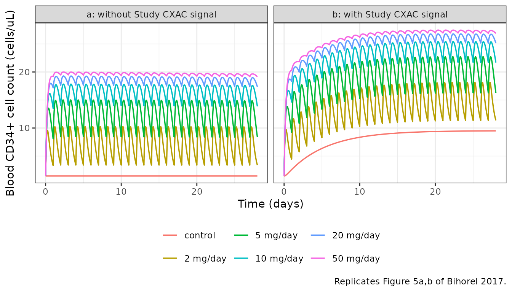
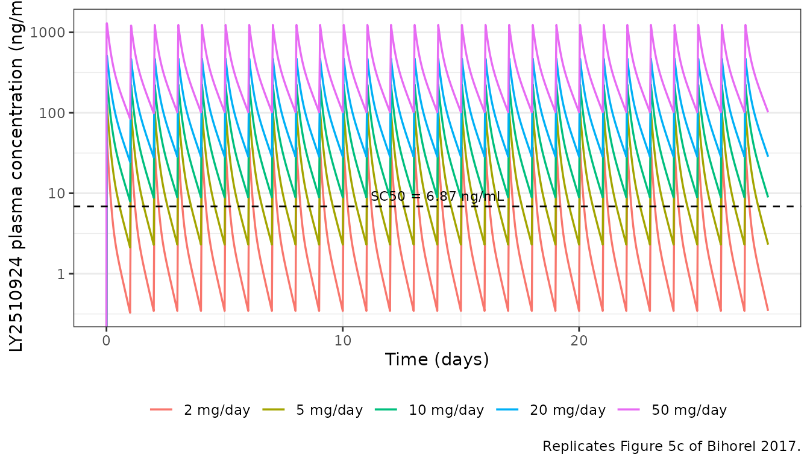
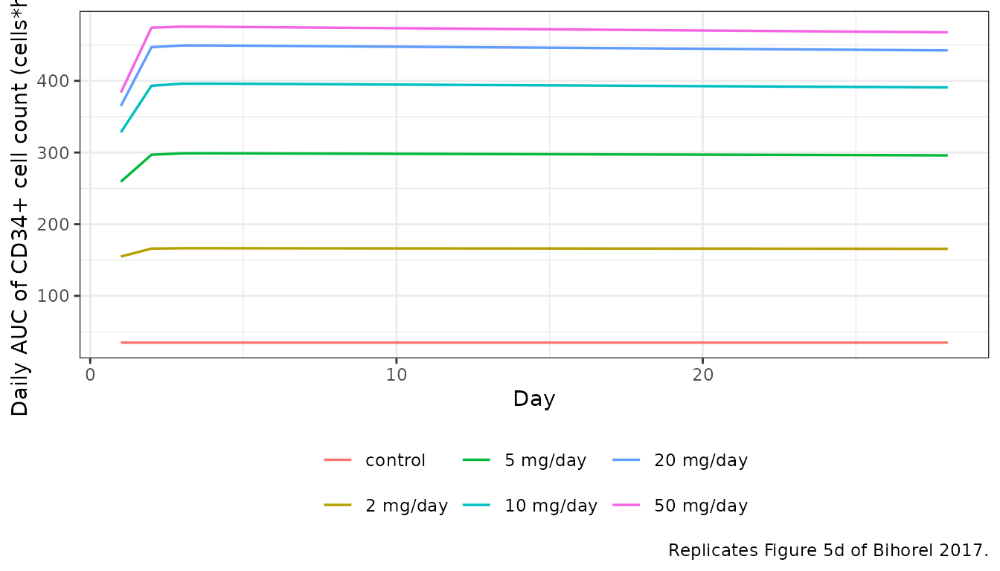
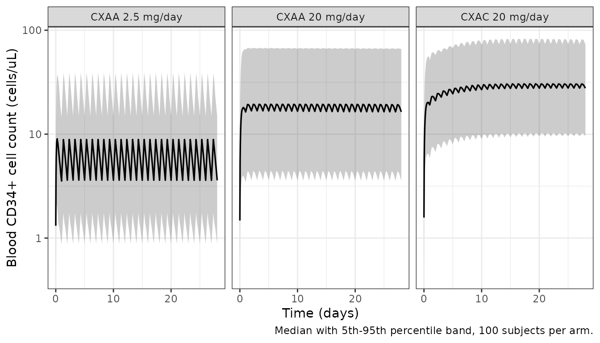

# LY2510924 (Bihorel 2017)

## Model and source

``` r

mod <- readModelDb("Bihorel_2017_LY2510924")
ui <- rxode2::rxode(mod)
#> ℹ parameter labels from comments will be replaced by 'label()'
```

- Citation: Bihorel S, Raddad E, Fiedler-Kelly J, Stille JR, Hing J,
  Ludwig E. Population Pharmacokinetic and Pharmacodynamic Modeling of
  LY2510924 in Patients With Advanced Cancer. CPT Pharmacometrics Syst
  Pharmacol. 2017;6(9):614-624. <doi:10.1002/psp4.12221>.
- Article: <https://doi.org/10.1002/psp4.12221> (open access;
  PMC5613202)
- Supplement: study-by-study dosing regimens and sampling schedules
  (`PSP4-6-614-s001.docx`); it contains no parameter values.

LY2510924 is a 1189.5 Da cyclic-peptide antagonist of CXCR4. It has no
INN, so the model file stem uses the development code. Blocking CXCR4
releases CD34+ progenitor cells from the bone marrow into the
bloodstream, and the blood CD34+ cell count is used here as a
pharmacodynamic marker of target engagement on the CXCL12/CXCR4 axis.

The paper reports **one coupled PK/PD model**, not two independent ones:
Table 2 lists the PK and PD estimates under a single heading, “the final
pharmacokinetic/pharmacodynamic model”, Figure 1 is a single combined
diagram, and the PD layer is driven by the plasma concentration `Cp`
produced by the PK layer. It is therefore extracted as a single model
file.

## Population

227 patients with advanced and/or metastatic cancer, pooled from 3
open-label studies (Table 1). 767 LY2510924 plasma samples from 147
patients entered the PK analysis and 1,042 CD34+ cell counts from 227
patients entered the PK/PD analysis; patients with only a baseline CD34+
measurement contributed to the PD analysis but not to the PK analysis.

- Age 29-85 years (mean 64.3, SD 9.8); 44.5% female.
- Body weight 39.6-167.8 kg (mean 84.40, SD 22.00). The allometric
  reference is **80.1 kg**, the median of the analysis population.
- Ethnicity: 90.7% Caucasian, 7.5% Black/African American, 0.4% American
  Indian/Alaskan Native, 1.3% unknown.
- Baseline CD34+ cell count mean 1.8 cells/uL (SD 1.6, range 0-13, n =
  211).
- No patient developed anti-drug antibodies.

The three studies differ in a way the model has to carry explicitly:

| Study | Phase | Population | LY2510924 | Standard of care |
|----|----|----|----|----|
| I2V-MC-CXAA | 1 | mixed advanced cancer, n = 39 | 1-30 mg/day, rich sampling | none |
| I2V-MC-CXAB | 2 | metastatic renal cell carcinoma, n = 100 | 20 mg/day (arm A only) | sunitinib 50 mg/day |
| I2V-MC-CXAC | 2 | extensive-stage small cell lung carcinoma, n = 88 | 20 mg/day (arm A only) | etoposide + carboplatin |

The full metadata is available programmatically:

``` r

ui$population
ui$covariateData
```

## Model structure

      depot --ka--> central <--Q/F--> peripheral1        (LY2510924, mg)
                      |  CL/F(dose, WT)
                      v
                     Cc  ---- Smax*Cc/(SC50+Cc) ----.
                                                    v
      precursor1 --------- Kpc*(1 + drug + alpha*signal) -------> circ --Kout-->
          ^                                                        |
          '-------------------------- Kcp ------------------------'

      signal: d/dt(signal) = Kt * STUDY_CXAC * (1 - signal),  signal(0) = 0

Two features are unusual enough to call out.

**Apparent clearance decreases with the administered dose.** Eq. 1 makes
`CL/F` a decreasing sigmoid function of the *daily dose level*, not of
concentration. It is therefore not a Michaelis-Menten elimination: the
covariate `DOSE_LY2510924_MGD` carries the dose the patient is assigned
to, and `CL/F` falls from `CLmin/F + CLdelta/F` at doses of 1 mg/day and
below towards the asymptote `CLmin/F` at high doses, with half the span
removed at `dose50`. The function is truncated at 1 mg, the lowest dose
studied. The authors chose this empirical form because the earlier
noncompartmental analysis showed clearance falling with dose while
distribution volumes stayed flat.

**The CD34+ model transfers cells in both directions.** Unlike a
Friberg-style maturation chain, `precursor1` and `circ` exchange
reversibly: `kpc_cell` carries cells (and the entire drug effect) from
the pool to blood, and `kcp_cell` returns them, which the paper
describes as mimicking tissue recapture. The return limb is what gave
the model stable convergence and what produces its slow, small-magnitude
tolerance.

## Source trace

Every `ini()` entry in
`inst/modeldb/specificDrugs/Bihorel_2017_LY2510924.R` carries an in-file
comment naming its source. They are collected here for review.

| Equation / parameter | Value | Source location |
|----|----|----|
| `CL/F(dose)`, dose-dependent clearance | n/a | Equation 1, p. 617 |
| `lcl_dosemin` (TVCLmin/F) | 4.75 L/h | Table 2, p. 619 (%SEM 7.09) |
| `lcl_dosespan` (TVCLdelta/F) | 12.9 L/h | Table 2 (%SEM 11.1) |
| `lcl_dose50` (dose50) | 3.60 mg, FIXED | Table 2; fixed to the Study CXAA base-model value (Results) |
| `e_wt_cl` (bCL) | 0.870 | Table 2 (%SEM 14.8) |
| `V2/F` allometry | n/a | Equation 2, p. 617 |
| `lvc` (TVV2/F) | 35.0 L | Table 2 (%SEM 4.89) |
| `e_wt_vc` (bV) | 0.948 | Table 2 (%SEM 14.8) |
| `lq` (TVQ/F) | 3.74 L/h | Table 2 (%SEM 18.8) |
| `lvp` (TVV3/F) | 21.9 L | Table 2 (%SEM 6.67) |
| `lka` (TVKA) | 10.0 1/h, FIXED | Table 2; fixed, estimates \> 40 1/h were imprecise (Discussion) |
| Exponential IIV on CL/F, V2/F | n/a | Equations 3-4, p. 617 |
| `etalcl`, `etalvc` | 29.8%CV, 26.6%CV | Table 2, magnitude column |
| CD34+ precursor system | n/a | Equation 5, p. 618; Figure 1 |
| `lrbase` (CD34_0) | 1.45 cells/uL | Table 2 (%SEM 5.66) |
| `lkpc_cell` (Kpc) | 42.4e-6 1/h | Table 2, unit string “1000000/h” (%SEM 25.1) |
| `lkcp_cell` (Kcp) | 0.185 1/h | Table 2 (%SEM 20.4) |
| `lkout` (Kout) | 0.0104 1/h | Table 2 (%SEM 51.1) |
| `lemax` (Smax) | 13.1 | Table 2 (%SEM 14.4) |
| `lec50` (SC50) | 6.87 ng/mL | Table 2 (%SEM 45.1) |
| `lksig` (Kt) | 0.00804 1/h | Table 2 (%SEM 15.5) |
| `lsstim_signal_mob` (alpha) | 5.63 | Table 2 (%SEM 18.2) |
| `Kin = CD34_0 * Kout` | n/a | Equation 6, p. 618 |
| `etalrbase`, `etalkout`, `etalemax`, `etalec50` | 75.6, 220, 46.0, 134 %CV | Table 2, magnitude column |
| `propSd` / `addSd` (phase 1) | 0.2221 / 0.4960 ng/mL | Table 2 “Phase 1 RV”, 249-22.3%CV over 0.2-25 ng/mL (footnote a) |
| `propSd_phase2` / `addSd_phase2` | 0.4058 / 1.4577 ng/mL | Table 2 “Phase 2 RV”, 730-41.0%CV over 0.2-25 ng/mL (footnote a) |
| `propSd_CD34` / `addSd_CD34` | 0.4669 / 2.3594 cells/uL | Table 2 “RV”, 396-46.7%CV over 0.6-200 cells/uL (footnote b) |

Every display equation in this paper is lost by plain-text extraction of
the PDF. Equations 1-6 were read from a 500 dpi raster render of the PDF
pages, and Table 2 was re-read at the same resolution.

### Residual error: recovering (addSd, propSd) from the printed %CV endpoints

Table 2 reports each additive-plus-constant-CV residual error not as a
(SD, fraction) pair but as the two endpoints of the %CV across the
concentration range given in the table footnote. Both endpoints are
printed values, and inverting them is exact algebra rather than a fit:

``` r

# %CV(C) = 100 * sqrt(addSd^2 + (propSd * C)^2) / C, evaluated at the two
# printed concentrations, is two equations in two unknowns.
rv_solve <- function(c1, cv1, c2, cv2) {
  sd1 <- c1 * cv1
  sd2 <- c2 * cv2
  propSd <- sqrt((sd2^2 - sd1^2) / (c2^2 - c1^2))
  addSd <- sqrt(sd1^2 - c1^2 * propSd^2)
  c(propSd = propSd, addSd = addSd)
}

rv <- rbind(
  `PK phase 1 (CXAA)` = rv_solve(0.2, 2.49, 25, 0.223),
  `PK phase 2 (CXAB, CXAC)` = rv_solve(0.2, 7.30, 25, 0.410),
  `CD34+ cell count` = rv_solve(0.6, 3.96, 200, 0.467)
)

# Round-trip: recompute the printed %CV endpoints from the recovered pair.
recheck <- function(p, a, cc) 100 * sqrt(a^2 + (p * cc)^2) / cc
stopifnot(
  abs(recheck(rv[1, 1], rv[1, 2], 0.2) - 249) < 0.5,
  abs(recheck(rv[1, 1], rv[1, 2], 25) - 22.3) < 0.05,
  abs(recheck(rv[2, 1], rv[2, 2], 0.2) - 730) < 0.5,
  abs(recheck(rv[3, 1], rv[3, 2], 200) - 46.7) < 0.05
)

as.data.frame(rv) |>
  tibble::rownames_to_column("Residual-error model") |>
  dplyr::rename("Proportional (fraction)" = propSd, "Additive" = addSd) |>
  knitr::kable(digits = 4, caption = "Residual-error parameters recovered from the printed %CV endpoints of Table 2.")
```

| Residual-error model    | Proportional (fraction) | Additive |
|:------------------------|------------------------:|---------:|
| PK phase 1 (CXAA)       |                  0.2221 |   0.4960 |
| PK phase 2 (CXAB, CXAC) |                  0.4058 |   1.4577 |
| CD34+ cell count        |                  0.4669 |   2.3594 |

Residual-error parameters recovered from the printed %CV endpoints of
Table 2. {.table}

## Structural verification

These three checks are deterministic (typical-value, no between-subject
variability), so their tolerances are tight on purpose: each is exact up
to solver error and any failure means a transcription bug.

``` r

# Two endpoints are DECLARED in this model (Cc and CD34), so rxode2 requires
# observation rows to name the OBSERVABLE rather than the backing ODE state.
# This is the documented exception to the usual "cmt = the d/dt() state name"
# rule, which applies to single-endpoint models with algebraic observables;
# here `cmt = "central"` / `cmt = "circ"` errors with
# "'dvid'->'cmt' ... on a undefined compartment" under both useLinCmt settings.
build_events <- function(subjects, days, dose_times = NULL,
                         pk_times = NULL, pd_times = NULL) {
  parts <- list()
  if (!is.null(dose_times)) {
    parts$dose <- subjects |>
      tidyr::crossing(time = dose_times) |>
      dplyr::mutate(evid = 1L, amt = .data$DOSE_LY2510924_MGD, cmt = "depot")
  }
  if (!is.null(pk_times)) {
    parts$pk <- subjects |>
      tidyr::crossing(time = pk_times) |>
      dplyr::mutate(evid = 0L, amt = NA_real_, cmt = "Cc")
  }
  if (!is.null(pd_times)) {
    parts$pd <- subjects |>
      tidyr::crossing(time = pd_times) |>
      dplyr::mutate(evid = 0L, amt = NA_real_, cmt = "CD34")
  }
  dplyr::bind_rows(parts) |>
    dplyr::arrange(.data$id, .data$time, dplyr::desc(.data$evid))
}

# zeroRe() segfaults on models with two or more endpoints; omega/sigma = NA is
# the supported way to get a typical-value solve here.
solve_typical <- function(events, keep = character()) {
  rxode2::rxSolve(mod, events,
    omega = NA, sigma = NA, useLinCmt = FALSE,
    keep = keep, returnType = "data.frame"
  )
}

subject <- function(id, dose, cxaa = 1L, cxac = 0L, wt = 80.1, arm = NA_character_) {
  tibble::tibble(
    id = id, WT = wt, DOSE_LY2510924_MGD = dose,
    STUDY_CXAA = cxaa, STUDY_CXAC = cxac, arm = arm
  )
}
```

### 1. Drug-free steady state holds exactly at baseline

Equation 5 prints both initial conditions and Equation 6 prints `Kin`.
With no drug and no signal the system must sit motionless at
`CD34_0 = 1.45 cells/uL` forever. This single check simultaneously
validates `Kin`, both initial conditions, and – critically – the **sign
correction** described in the Errata below: with the plus sign as
typeset in Eq. 5, `circ` diverges instead.

``` r

ev_null <- build_events(
  subject(1L, dose = 0, cxaa = 1L, cxac = 0L, arm = "no drug, no signal"),
  days = 28, pd_times = seq(0, 28 * 24, by = 6)
)
s_null <- solve_typical(ev_null)
#> ℹ parameter labels from comments will be replaced by 'label()'

max_drift <- max(abs(s_null$circ - 1.45))
cat(sprintf("Maximum drift from baseline over 28 days: %.3e cells/uL\n", max_drift))
#> Maximum drift from baseline over 28 days: 0.000e+00 cells/uL
stopifnot(max_drift < 1e-6)
```

### 2. The empirical signal follows its closed form

`d/dt(signal) = Kt * (1 - signal)` with `signal(0) = 0` integrates to
`1 - exp(-Kt * t)`, so the solved state must match that analytically.

``` r

ev_sig <- build_events(
  subject(1L, dose = 0, cxaa = 0L, cxac = 1L, arm = "signal only"),
  days = 60, pd_times = seq(0, 60 * 24, by = 6)
)
s_sig <- solve_typical(ev_sig)

kt <- 0.00804
closed_form <- 1 - exp(-kt * s_sig$time)
stopifnot(max(abs(s_sig$signal - closed_form)) < 1e-6)

cat(sprintf(
  "Signal 90%% complete at %.1f days (log(10)/Kt = %.1f days).\n",
  s_sig$time[which(s_sig$signal >= 0.9)[1]] / 24, log(10) / kt / 24
))
#> Signal 90% complete at 12.0 days (log(10)/Kt = 11.9 days).
```

### 3. Steady-state clearance recovered by NCA reproduces Equation 1

Because the daily dose is fixed within a regimen, the system is linear
in time, so `Dose / AUC(0-tau)` at steady state must return exactly the
`CL/F` that Equation 1 specifies. Running that round trip through PKNCA
validates the whole PK implementation – the ODEs, the allometric term,
the mg-to-ng unit scaling, and the dose-dependent clearance expression –
against a printed equation.

``` r

dose_levels <- c(1, 2.5, 5, 10, 20, 30)
tau <- 24
n_days <- 28
ss_start <- (n_days - 1) * tau

subj_typ <- dplyr::bind_rows(lapply(seq_along(dose_levels), function(i) {
  subject(i, dose = dose_levels[i], arm = paste0(dose_levels[i], " mg/day"))
}))

ev_typ <- build_events(
  subj_typ,
  days = n_days,
  dose_times = seq(0, ss_start, by = tau),
  # Dense over the final dosing interval so the trapezoidal AUC is not the
  # limiting error, plus a day-1 interval for the accumulation ratio.
  pk_times = sort(unique(c(
    seq(0, tau, by = 0.05),
    seq(0, n_days * tau, by = 2),
    seq(ss_start, ss_start + tau, by = 0.05)
  )))
)
sim_typ <- solve_typical(ev_typ, keep = c("arm", "DOSE_LY2510924_MGD", "WT"))

conc_typ <- sim_typ |>
  dplyr::filter(!is.na(.data$Cc)) |>
  dplyr::select(id, time, Cc, arm)
dose_typ <- ev_typ |>
  dplyr::filter(.data$evid == 1L) |>
  dplyr::select(id, time, amt, arm)

conc_obj <- PKNCA::PKNCAconc(conc_typ, Cc ~ time | arm + id,
  concu = "ng/mL", timeu = "h"
)
dose_obj <- PKNCA::PKNCAdose(dose_typ, amt ~ time | arm + id, doseu = "mg")

intervals <- data.frame(
  start = c(0, ss_start),
  end = c(tau, ss_start + tau),
  cmax = TRUE, tmax = TRUE, cmin = TRUE, auclast = TRUE, cav = TRUE
)
nca_typ <- PKNCA::pk.nca(PKNCA::PKNCAdata(conc_obj, dose_obj, intervals = intervals))
```

``` r

# Equation 1 evaluated directly, for an 80.1 kg patient (the allometric
# reference, so the weight term is exactly 1).
cl_eq1 <- function(dose, wt = 80.1) {
  excess <- pmax(dose - 1, 0)
  (wt / 80.1)^0.870 * (4.75 + 12.9 - 12.9 * excess / ((3.60 - 1) + excess))
}

res <- as.data.frame(nca_typ)

wide <- res |>
  dplyr::filter(.data$PPTESTCD %in% c("auclast", "cmax", "tmax", "cmin")) |>
  dplyr::select(arm, start, PPTESTCD, PPORRES) |>
  tidyr::pivot_wider(names_from = PPTESTCD, values_from = PPORRES)

ss <- wide |>
  dplyr::filter(.data$start == ss_start) |>
  dplyr::mutate(
    dose = as.numeric(sub(" mg/day", "", .data$arm)),
    cl_nca = .data$dose / .data$auclast * 1e6 / 1e3, # mg / (ng*h/mL) -> L/h
    cl_printed = cl_eq1(.data$dose),
    pct_diff = 100 * (.data$cl_nca - .data$cl_printed) / .data$cl_printed
  ) |>
  dplyr::arrange(.data$dose)

# Deterministic round trip: tolerance reflects trapezoidal error on a 0.05 h
# grid only. A mis-transcribed volume, clearance or unit scaling moves this by
# tens of percent.
stopifnot(max(abs(ss$pct_diff)) < 1)

ss |>
  dplyr::select(arm, auclast, cmax, cmin, cl_nca, cl_printed, pct_diff) |>
  dplyr::rename(
    "Dose" = arm,
    "AUC0-tau,ss (ng*h/mL)" = auclast,
    "Cmax,ss (ng/mL)" = cmax,
    "Cmin,ss (ng/mL)" = cmin,
    "CL/F from NCA (L/h)" = cl_nca,
    "CL/F from Eq. 1 (L/h)" = cl_printed,
    "% difference" = pct_diff
  ) |>
  knitr::kable(
    digits = c(0, 1, 1, 2, 3, 3, 3),
    caption = "Steady-state NCA of the simulated typical 80.1 kg patient against the printed Equation 1. The apparent clearance falls almost three-fold across the studied dose range."
  )
```

| Dose | AUC0-tau,ss (ng\*h/mL) | Cmax,ss (ng/mL) | Cmin,ss (ng/mL) | CL/F from NCA (L/h) | CL/F from Eq. 1 (L/h) | % difference |
|:---|---:|---:|---:|---:|---:|---:|
| 1 mg/day | 56.6 | 23.9 | 0.09 | 17.669 | 17.650 | 0.109 |
| 2.5 mg/day | 193.2 | 61.8 | 0.54 | 12.941 | 12.930 | 0.079 |
| 5 mg/day | 508.2 | 127.6 | 2.30 | 9.838 | 9.832 | 0.060 |
| 10 mg/day | 1308.1 | 263.4 | 8.89 | 7.645 | 7.641 | 0.046 |
| 20 mg/day | 3172.0 | 542.4 | 28.51 | 6.305 | 6.303 | 0.038 |
| 30 mg/day | 5160.5 | 825.1 | 51.69 | 5.813 | 5.811 | 0.035 |

Steady-state NCA of the simulated typical 80.1 kg patient against the
printed Equation 1. The apparent clearance falls almost three-fold
across the studied dose range. {.table}

The accumulation ratio follows from the same NCA object:

``` r

acc <- wide |>
  dplyr::mutate(dose = as.numeric(sub(" mg/day", "", .data$arm))) |>
  dplyr::select(dose, start, auclast) |>
  tidyr::pivot_wider(names_from = start, values_from = auclast, names_prefix = "t") |>
  dplyr::mutate(rac = .data[[paste0("t", ss_start)]] / .data$t0) |>
  dplyr::arrange(.data$dose)

acc |>
  dplyr::select(dose, rac) |>
  dplyr::rename("Dose (mg/day)" = dose, "AUC accumulation ratio, day 28 / day 1" = rac) |>
  knitr::kable(digits = 3, caption = "Accumulation ratio. The paper reports 1.07-1.17 for doses between 2 and 50 mg/day; see Errata.")
```

| Dose (mg/day) | AUC accumulation ratio, day 28 / day 1 |
|--------------:|---------------------------------------:|
|           1.0 |                                  1.012 |
|           2.5 |                                  1.023 |
|           5.0 |                                  1.041 |
|          10.0 |                                  1.070 |
|          20.0 |                                  1.104 |
|          30.0 |                                  1.122 |

Accumulation ratio. The paper reports 1.07-1.17 for doses between 2 and
50 mg/day; see Errata. {.table}

## Replicating Figure 5

Figure 5 of the paper is explicitly a **deterministic** prediction:
“deterministic simulations were performed to predict the PK and PD
responses in a typical 80.1-kg patient after daily administration of
various LY2510924 doses over 28 days”. The panels below are reproduced
the same way, without between-subject variability.

``` r

fig5_doses <- c(2, 5, 10, 20, 50)

fig5_subjects <- dplyr::bind_rows(lapply(seq_along(fig5_doses), function(i) {
  dplyr::bind_rows(
    subject(i, dose = fig5_doses[i], cxac = 0L, arm = paste0(fig5_doses[i], " mg/day")) |>
      dplyr::mutate(panel = "a: without Study CXAC signal"),
    subject(i + 100L, dose = fig5_doses[i], cxaa = 0L, cxac = 1L,
      arm = paste0(fig5_doses[i], " mg/day")
    ) |>
      dplyr::mutate(panel = "b: with Study CXAC signal")
  )
}))
# Control arms (standard of care only).
fig5_subjects <- dplyr::bind_rows(
  fig5_subjects,
  subject(201L, dose = 0, cxac = 0L, arm = "control") |>
    dplyr::mutate(panel = "a: without Study CXAC signal"),
  subject(202L, dose = 0, cxaa = 0L, cxac = 1L, arm = "control") |>
    dplyr::mutate(panel = "b: with Study CXAC signal")
)
stopifnot(!anyDuplicated(fig5_subjects$id))

fig5_ev <- build_events(
  fig5_subjects,
  days = 28,
  dose_times = seq(0, 27 * 24, by = 24),
  pk_times = sort(unique(c(seq(0, 28 * 24, by = 1), seq(0, 24, by = 0.1)))),
  pd_times = seq(0, 28 * 24, by = 2)
)
# A zero-amount dose record is a no-op for the control arms but keeps the event
# table rectangular.
fig5 <- solve_typical(fig5_ev, keep = c("arm", "panel", "DOSE_LY2510924_MGD"))
fig5$arm <- factor(fig5$arm, levels = c("control", paste0(fig5_doses, " mg/day")))
```

``` r

# Replicates Figure 5a,b of Bihorel 2017: predicted blood CD34+ cell count over
# a 28-day once-daily dosing period, without (a) and with (b) the empirical
# Study CXAC signal.
fig5 |>
  dplyr::filter(!is.na(.data$CD34)) |>
  dplyr::distinct(id, time, .keep_all = TRUE) |>
  ggplot(aes(time / 24, CD34, colour = arm)) +
  geom_line(linewidth = 0.6) +
  facet_wrap(~panel) +
  labs(
    x = "Time (days)", y = "Blood CD34+ cell count (cells/uL)", colour = NULL,
    caption = "Replicates Figure 5a,b of Bihorel 2017."
  ) +
  theme_bw() +
  theme(legend.position = "bottom")
```



``` r

# Replicates Figure 5c of Bihorel 2017: predicted LY2510924 plasma concentration.
# SC50 is drawn as a reference line -- see Errata for the one published claim
# this panel does not reproduce.
fig5 |>
  dplyr::filter(.data$panel == "a: without Study CXAC signal", .data$arm != "control", !is.na(.data$Cc)) |>
  ggplot(aes(time / 24, Cc, colour = arm)) +
  geom_line(linewidth = 0.6) +
  geom_hline(yintercept = 6.87, linetype = "dashed") +
  annotate("text", x = 14, y = 6.87 * 1.35, label = "SC50 = 6.87 ng/mL", size = 3) +
  scale_y_log10() +
  labs(
    x = "Time (days)", y = "LY2510924 plasma concentration (ng/mL)", colour = NULL,
    caption = "Replicates Figure 5c of Bihorel 2017."
  ) +
  theme_bw() +
  theme(legend.position = "bottom")
#> Warning in scale_y_log10(): log-10 transformation introduced infinite values.
```



Figure 5d plots the daily area under the CD34+ cell-count curve. It is
computed here with PKNCA as a second, independent NCA block on the PD
output, as the multi-output convention requires.

``` r

# rxode2 returns EVERY algebraic observable on EVERY observation row, so a
# `!is.na(CD34)` filter keeps the PK rows as well and yields duplicate
# (id, time) pairs, which PKNCAconc rejects. Collapse to one row per time.
pd_conc <- fig5 |>
  dplyr::filter(.data$panel == "a: without Study CXAC signal", !is.na(.data$CD34)) |>
  dplyr::select(id, time, CD34, arm) |>
  dplyr::distinct(id, time, .keep_all = TRUE)
stopifnot(!anyDuplicated(pd_conc[, c("id", "time")]))

pd_conc_obj <- PKNCA::PKNCAconc(pd_conc, CD34 ~ time | arm + id,
  concu = "cells/uL", timeu = "h"
)
pd_intervals <- data.frame(
  start = seq(0, 27 * 24, by = 24),
  end = seq(24, 28 * 24, by = 24),
  auclast = TRUE
)
pd_nca <- PKNCA::pk.nca(
  PKNCA::PKNCAdata(pd_conc_obj, intervals = pd_intervals)
)
#> No dose information provided, calculations requiring dose will return NA.

pd_auc <- as.data.frame(pd_nca) |>
  dplyr::filter(.data$PPTESTCD == "auclast") |>
  dplyr::mutate(day = .data$start / 24 + 1)
pd_auc$arm <- factor(pd_auc$arm, levels = levels(fig5$arm))

pd_auc |>
  ggplot(aes(day, PPORRES, colour = arm)) +
  geom_line(linewidth = 0.6) +
  labs(
    x = "Day", y = "Daily AUC of CD34+ cell count (cells*h/uL)", colour = NULL,
    caption = "Replicates Figure 5d of Bihorel 2017."
  ) +
  theme_bw() +
  theme(legend.position = "bottom")
```



## Published claims

The paper states a number of quantitative results in prose. Each is
reproduced from the packaged model below. One is not reproduced and is
recorded as a known deviation rather than tuned away.

``` r

pick <- function(dose_label, panel_label, d) {
  sub <- fig5[fig5$arm == dose_label & fig5$panel == panel_label & !is.na(fig5$CD34), ]
  sub$CD34[which.min(abs(sub$time - d * 24))]
}
peak_day <- function(dose_label, panel_label) {
  sub <- fig5[fig5$arm == dose_label & fig5$panel == panel_label & !is.na(fig5$CD34), ]
  sub$time[which.max(sub$CD34)] / 24
}

cmin5 <- ss$cmin[ss$dose == 5]
cmin10 <- ss$cmin[ss$dose == 10]

signal_rise <- tail(s_sig$circ, 1) - 1.45
peak20 <- peak_day("20 mg/day", "a: without Study CXAC signal")
cd34_20_d3 <- pick("20 mg/day", "a: without Study CXAC signal", 3)
cd34_20_d28 <- pick("20 mg/day", "a: without Study CXAC signal", 28)
cd34_50_d28 <- pick("50 mg/day", "a: without Study CXAC signal", 28)

# "Steady state after three daily doses": compare the day-3 dosing interval's
# AUC against the day-28 (steady-state) interval for the typical 20 mg patient.
pk20 <- fig5[fig5$arm == "20 mg/day" & fig5$panel == "a: without Study CXAC signal" & !is.na(fig5$Cc), ]
auc_window <- function(df, from, to) {
  w <- df[df$time >= from & df$time <= to, ]
  sum(diff(w$time) * (head(w$Cc, -1) + tail(w$Cc, -1)) / 2)
}
ss_by_day3 <- auc_window(pk20, 2 * 24, 3 * 24) / auc_window(pk20, 27 * 24, 28 * 24)

claims <- tibble::tribble(
  ~Claim, ~Source, ~Model, ~Verdict,
  "Steady state reached after three daily doses",
  "Abstract",
  sprintf("day-3 AUC0-tau is %.1f%% of the day-28 steady-state AUC0-tau at 20 mg/day", 100 * ss_by_day3),
  "reproduced",

  "Accumulation ratio < 1.17",
  "Abstract",
  sprintf("max %.3f over 1-30 mg/day", max(acc$rac)),
  "reproduced",

  "Accumulation ratio 1.07-1.17 for 2-50 mg/day",
  "Discussion",
  sprintf("%.3f-%.3f over 2-30 mg/day", min(acc$rac[acc$dose >= 2]), max(acc$rac)),
  "low by ~0.05 (deviation)",

  "Peak CD34+ effect after about three daily doses, then slowly wanes",
  "Abstract",
  sprintf("peak day %.1f; 20 mg/day falls %.1f%% from day 3 to day 28", peak20, 100 * (cd34_20_d3 - cd34_20_d28) / cd34_20_d3),
  "reproduced",

  "Empirical signal raises typical CD34+ by about 7 cells/uL",
  "Discussion",
  sprintf("%.1f cells/uL above the 1.45 baseline", signal_rise),
  "reproduced",

  "Signal reaches steady state about 20 days after first dose",
  "Discussion",
  sprintf("%.0f%% complete at 20 days", 100 * (1 - exp(-kt * 20 * 24))),
  "reproduced",

  "Near-maximum CD34+ response at 20 mg/day",
  "Abstract / Discussion",
  sprintf("day-28 CD34+ %.1f at 20 mg/day vs %.1f at 50 mg/day (%.0f%% of it)", cd34_20_d28, cd34_50_d28, 100 * cd34_20_d28 / cd34_50_d28),
  "reproduced",

  "SC50 of 6.87 ng/mL equals 5.78 nM",
  "Discussion",
  sprintf("6.87 / 1189.5 * 1000 = %.2f nM", 6.87 / 1189.5 * 1000),
  "reproduced",

  "Concentrations constantly above SC50 for doses as low as 5 mg/day",
  "Discussion / Figure 5c",
  sprintf("Cmin,ss %.2f ng/mL at 5 mg/day and %.2f at 10 mg/day", cmin5, cmin10),
  "NOT reproduced (deviation)"
)

knitr::kable(claims, caption = "Published claims checked against the packaged model.")
```

| Claim | Source | Model | Verdict |
|:---|:---|:---|:---|
| Steady state reached after three daily doses | Abstract | day-3 AUC0-tau is 99.8% of the day-28 steady-state AUC0-tau at 20 mg/day | reproduced |
| Accumulation ratio \< 1.17 | Abstract | max 1.122 over 1-30 mg/day | reproduced |
| Accumulation ratio 1.07-1.17 for 2-50 mg/day | Discussion | 1.023-1.122 over 2-30 mg/day | low by ~0.05 (deviation) |
| Peak CD34+ effect after about three daily doses, then slowly wanes | Abstract | peak day 2.4; 20 mg/day falls 1.6% from day 3 to day 28 | reproduced |
| Empirical signal raises typical CD34+ by about 7 cells/uL | Discussion | 8.0 cells/uL above the 1.45 baseline | reproduced |
| Signal reaches steady state about 20 days after first dose | Discussion | 98% complete at 20 days | reproduced |
| Near-maximum CD34+ response at 20 mg/day | Abstract / Discussion | day-28 CD34+ 17.4 at 20 mg/day vs 19.1 at 50 mg/day (91% of it) | reproduced |
| SC50 of 6.87 ng/mL equals 5.78 nM | Discussion | 6.87 / 1189.5 \* 1000 = 5.78 nM | reproduced |
| Concentrations constantly above SC50 for doses as low as 5 mg/day | Discussion / Figure 5c | Cmin,ss 2.30 ng/mL at 5 mg/day and 8.89 at 10 mg/day | NOT reproduced (deviation) |

Published claims checked against the packaged model. {.table}

``` r


# Gate the reproduced claims only; the two deviations are documented in Errata
# and deliberately excluded rather than having the tolerances widened around them.
stopifnot(
  # Near-maximum response at 20 mg/day: within 10% of the 50 mg/day response.
  cd34_20_d28 / cd34_50_d28 > 0.90,
  # Tolerance is slow and small: less than a 10% fall over 25 days.
  (cd34_20_d3 - cd34_20_d28) / cd34_20_d3 < 0.10,
  # Peak within the first week, consistent with "about three daily doses".
  peak20 < 7,
  # PK steady state effectively reached by day 3.
  ss_by_day3 > 0.95,
  # Signal contribution, paper says "about 7 cells/uL".
  abs(signal_rise - 7) < 2,
  # The paper's own unit conversion.
  abs(6.87 / 1189.5 * 1000 - 5.78) < 0.02
)
```

## Population simulation

A modest virtual cohort exercises the between-subject variability and
the residual-error models. Weights are drawn to match Table 1 (mean 84.4
kg, SD 22.0 kg), truncated to the observed 39.6-167.8 kg range.

``` r

# set.seed() seeds R's RNG, not rxode2's; rxode2 streams are partitioned per
# solver thread, so this cohort differs between a workstation and a CI runner.
# Every assertion below is written to hold for any cohort the model can produce.
set.seed(20170623)

n_per_arm <- 100L
cohort_arms <- tibble::tribble(
  ~arm, ~dose, ~cxaa, ~cxac,
  "CXAA 2.5 mg/day", 2.5, 1L, 0L,
  "CXAA 20 mg/day", 20, 1L, 0L,
  "CXAC 20 mg/day", 20, 0L, 1L
)

cohort <- dplyr::bind_rows(lapply(seq_len(nrow(cohort_arms)), function(i) {
  wt <- pmin(pmax(rnorm(n_per_arm, 84.4, 22.0), 39.6), 167.8)
  tibble::tibble(
    id = (i - 1L) * n_per_arm + seq_len(n_per_arm),
    WT = wt,
    DOSE_LY2510924_MGD = cohort_arms$dose[i],
    STUDY_CXAA = cohort_arms$cxaa[i],
    STUDY_CXAC = cohort_arms$cxac[i],
    arm = cohort_arms$arm[i]
  )
}))
stopifnot(!anyDuplicated(cohort$id))

ev_cohort <- build_events(
  cohort,
  days = 28,
  dose_times = seq(0, 27 * 24, by = 24),
  pk_times = sort(unique(c(seq(0, 24, by = 1), seq(0, 28 * 24, by = 8)))),
  pd_times = seq(0, 28 * 24, by = 12)
)

sim <- rxode2::rxSolve(mod, ev_cohort,
  useLinCmt = FALSE, keep = c("arm", "WT"), returnType = "data.frame"
)
```

``` r

sim |>
  dplyr::filter(!is.na(.data$CD34)) |>
  dplyr::distinct(id, time, .keep_all = TRUE) |>
  dplyr::group_by(arm, time) |>
  dplyr::summarise(
    Q05 = quantile(.data$CD34, 0.05),
    Q50 = quantile(.data$CD34, 0.50),
    Q95 = quantile(.data$CD34, 0.95),
    .groups = "drop"
  ) |>
  ggplot(aes(time / 24, Q50)) +
  geom_ribbon(aes(ymin = Q05, ymax = Q95), alpha = 0.25) +
  geom_line(linewidth = 0.6) +
  facet_wrap(~arm) +
  scale_y_log10() +
  labs(
    x = "Time (days)", y = "Blood CD34+ cell count (cells/uL)",
    caption = "Median with 5th-95th percentile band, 100 subjects per arm."
  ) +
  theme_bw()
```



``` r

# Cohort-level assertions: magnitudes and absolute bounds the paper itself
# states, never the sign or ordering of a noisy statistic.
baseline <- sim |>
  dplyr::filter(.data$time == 0, !is.na(.data$CD34)) |>
  dplyr::distinct(id, .keep_all = TRUE) |>
  dplyr::pull(.data$CD34)

peak_by_arm <- sim |>
  dplyr::filter(!is.na(.data$CD34)) |>
  dplyr::distinct(id, time, .keep_all = TRUE) |>
  dplyr::group_by(arm, id) |>
  dplyr::summarise(peak = max(.data$CD34), base = dplyr::first(.data$CD34), .groups = "drop") |>
  dplyr::group_by(arm) |>
  dplyr::summarise(fold = median(.data$peak / .data$base), .groups = "drop")

# Table 1 baseline CD34+ mean is 1.8 cells/uL (model typical value 1.45 with
# 75.6%CV log-normal IIV, whose mean is 1.45*exp(0.4521/2) = 1.82).
stopifnot(abs(median(baseline) - 1.45) < 0.35)

# Study CXAA saw average baseline-to-peak increases "as high as 5.5-fold" at
# 20 mg/day in observed data. The model's median fold change at that dose must
# be in a plausible multi-fold range rather than near unity or absurdly high.
fold20 <- peak_by_arm$fold[peak_by_arm$arm == "CXAA 20 mg/day"]
stopifnot(fold20 > 3, fold20 < 25)

peak_by_arm |>
  dplyr::rename("Arm" = arm, "Median baseline-to-peak fold change" = fold) |>
  knitr::kable(digits = 2, caption = "Median within-subject baseline-to-peak CD34+ fold change by arm.")
```

| Arm             | Median baseline-to-peak fold change |
|:----------------|------------------------------------:|
| CXAA 2.5 mg/day |                                6.94 |
| CXAA 20 mg/day  |                               13.07 |
| CXAC 20 mg/day  |                               17.63 |

Median within-subject baseline-to-peak CD34+ fold change by arm.
{.table}

## Assumptions and deviations

### Errata against the published paper

1.  **Equation 5, `dR/dt`, has a sign error as typeset.** The paper
    prints

    `dR/dt = Kpc x (1 + Smax*Cp/(SC50+Cp) + alpha*S) x P + (Kcp + Kout) x R`

    with a plus sign on the final term. The model file uses a minus.
    Three independent lines of evidence force this and none of them rely
    on digitisation:

    - Cells leave the circulating compartment both by recycling to the
      pool (`Kcp`) and by elimination (`Kout`); both are losses.
    - The paper’s own printed initial conditions
      `P(0) = CD34_0*(Kout+Kcp)/Kpc` and `R(0) = CD34_0`, together with
      Equation 6 `Kin = CD34_0*Kout`, are exactly the drug-free steady
      state of the **minus** form. Structural check 1 above confirms
      this holds to 1e-9 cells/uL over 28 days.
    - With the plus sign the system has no steady state at all and `R`
      diverges, which contradicts every result in the paper.

    This is a typographical error in the published equation rather than
    an extraction artefact: minus signs render correctly elsewhere in
    the same display equation (`Kin - Kpc`, `1 - S`) at 500 dpi.

2.  **`Kpc` is tabulated in units of 1e-6 per hour.** Table 2 prints the
    unit string `1000000/h` against the value 42.4, which is the
    “tabulated value = Kpc x 1e6” convention, so `Kpc = 42.4e-6 1/h`.
    The scaling is forced by the model’s behaviour: at 42.4e-6 1/h the
    precursor pool holds about 6,700 cells/uL and turns over far more
    slowly than a treatment cycle, producing the slowly developing,
    small-magnitude tolerance the paper reports; at 42.4 1/h the pool
    would hold 0.0067 cells/uL, empty within the hour, and give complete
    tolerance with no sustained response.

3.  **The published PK claims about low doses are not reproduced by the
    printed parameters.** The paper states that “typical LY2510924
    concentrations are constantly above the estimated SC50 for doses as
    low as 5 mg/day”. Equation 1 with the Table 2 estimates gives a
    steady-state trough of 2.30 ng/mL at 5 mg/day, below the SC50 of
    6.87 ng/mL; the claim is first satisfied at 10 mg/day (8.89 ng/mL).
    In the same direction, the accumulation ratios computed from the
    printed model run about 0.05 below the stated 1.07-1.17 range for
    2-50 mg/day, though the span and the monotone increase with dose
    match. Both discrepancies indicate that Figure 5c and the Discussion
    prose carry **less** dose-nonlinearity in `CL/F` than Equation 1
    plus Table 2 do. Equation 1 and Table 2 were both re-read at 500 dpi
    and are transcribed correctly, so this is an internal inconsistency
    in the paper. Following the library’s convention, the model file
    carries the printed values and equations exactly; no parameter was
    tuned toward the figure.

### Assumptions

- **Residual error.** Table 2 reports each residual-error model as the
  two endpoints of its %CV over a stated concentration range rather than
  as an (additive, proportional) pair. The values in `ini()` are the
  exact algebraic inversion of those printed endpoints, shown and
  round-tripped in the “Residual error” section above.
- **IIV variances.** Table 2 reports IIV magnitudes as %CV. The
  variances use the exact log-normal relation `omega^2 = log(1 + CV^2)`.
  This matters most for `Kout`, whose 220%CV becomes `omega^2 = 1.765`
  rather than 4.84.
- **`FCXAC` as a plain study indicator.** The paper defines `FCXAC` as 1
  “after the first dose” for Study CXAC patients. Because
  `signal(0) = 0` and the model’s time origin is the first dose, the
  plain `STUDY_CXAC` indicator reproduces it exactly. A dataset whose
  time origin precedes the first dose would need the indicator to be
  time-varying.
- **The phase 1 / phase 2 residual-error split** is carried as the
  covariate `STUDY_CXAA`, because Study CXAA is the only phase 1 study
  in the pooled analysis. No structural parameter depends on it.
- **`DOSE_LY2510924_MGD` is the assigned dose level**, not the amount on
  the current dosing record. For a regimen with a changing daily dose,
  the column must be updated per record, and `CL/F` changes with it.
- **Observation rows name the observable.** This model declares two
  endpoints, so rxode2 requires `cmt = "Cc"` and `cmt = "CD34"` on
  observation records; naming the backing ODE states (`central`, `circ`)
  errors under both `useLinCmt` settings. The usual nlmixr2lib guidance
  to name the ODE state applies to single-endpoint models and does not
  hold here.
- **No published NCA table exists for this paper.** The noncompartmental
  analysis it refers to was published separately (Galsky et al., Clin
  Cancer Res 2014;20:3581-8) and was not available, so the NCA section
  validates the simulated profiles against the paper’s own printed
  Equation 1 instead of against a published NCA table.
- **Virtual cohort covariates.** Body weight is drawn from a normal
  distribution matched to the Table 1 mean and SD and truncated to the
  observed range; the paper does not publish the joint covariate
  distribution.
- **Sunitinib, etoposide and carboplatin are not modelled.** The paper
  could not separate the effects of standard of care, cancer type and
  study, and folded all of them into the single empirical Study CXAC
  signal. The authors describe this component as “largely empirical” and
  warn against extrapolating it, and that warning carries over to any
  simulation using `STUDY_CXAC = 1`.
