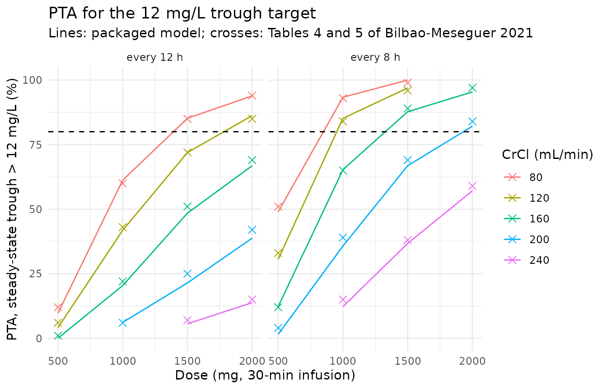
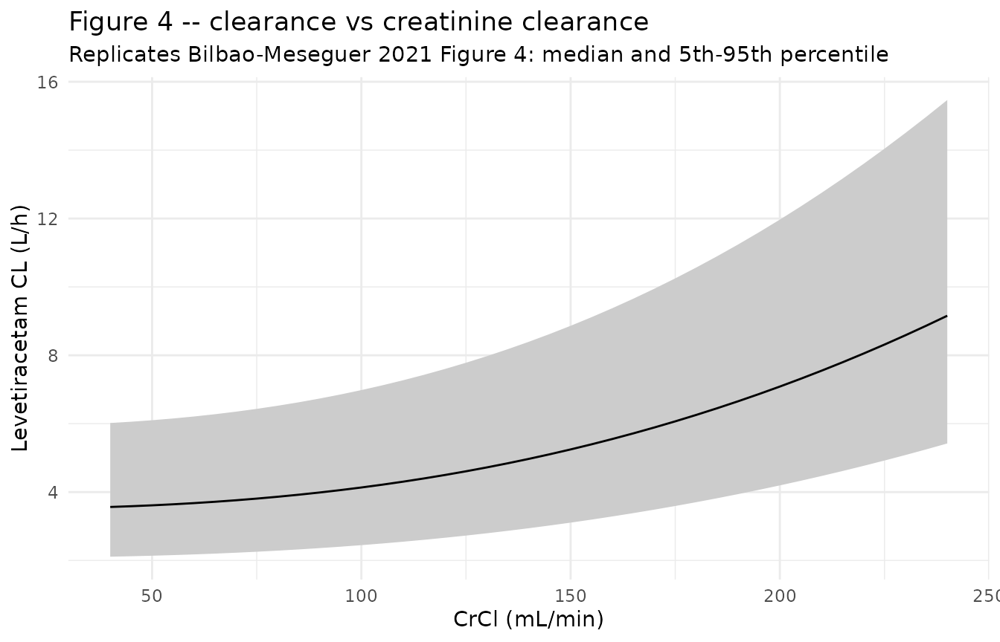
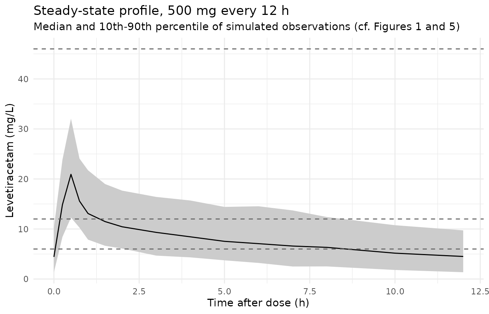

# Levetiracetam (Bilbao-Meseguer 2021)

## Model and source

``` r

mod_fun <- readModelDb("BilbaoMeseguer_2021_levetiracetam")
mod <- rxode2::rxode2(mod_fun)
#> ℹ parameter labels from comments will be replaced by 'label()'
```

- Citation: Bilbao-Meseguer I, Barrasa H, Asin-Prieto E, Alarcia-Lacalle
  A, Rodriguez-Gascon A, Maynar J, Sanchez-Izquierdo JA, Balziskueta G,
  Griffith MS-B, Quilez Trasobares N, Solinis MA, Isla A. Population
  Pharmacokinetics of Levetiracetam and Dosing Evaluation in Critically
  Ill Patients with Normal or Augmented Renal Function. Pharmaceutics.
  2021;13(10):1690. <doi:10.3390/pharmaceutics13101690>
- Description: Two-compartment IV population PK model for levetiracetam
  in critically ill adults with normal or augmented renal clearance,
  with clearance split into a fixed non-renal arm plus a power function
  of measured urinary creatinine clearance (Bilbao-Meseguer 2021)
- Article (open access): <https://doi.org/10.3390/pharmaceutics13101690>

Bilbao-Meseguer et al. (2021) characterised intravenous levetiracetam in
27 critically ill adults whose measured urinary creatinine clearance
(CrCl) exceeded 50 mL/min, ten of whom had augmented renal clearance
(ARC, CrCl above 130 mL/min). The final model is a two-compartment
linear model in which clearance is the sum of a CrCl-independent arm
(3.5 L/h) and a power function of CrCl, `(CrCl/120)^2.5` L/h. The paper
used the model to evaluate probability of target attainment (PTA) for
steady-state troughs across 500-2000 mg every 12 h or every 8 h (Tables
4 and 5).

## Population

Twenty-seven ICU patients were enrolled prospectively at two Spanish
hospitals (Araba University Hospital, Vitoria-Gasteiz; Doce de Octubre
Hospital, Madrid) in 2019-2020 (Section 2.1, Table 1). Median age was 60
years (range 23-81), median weight 80 kg (58-115), and 67% were male.
Diagnoses were haemorrhagic stroke (37%), trauma (30%) and other
neurological conditions (33%); median APACHE II was 18 (5-35). Urinary
CrCl, measured from a urine collection as urine creatinine x urine flow
/ plasma creatinine and **not** normalised to body surface area, had
median 117 mL/min (54-239). Patients received 500, 1000 or 1500 mg every
12 h as a 30-min IV infusion (18 of 27 on 500 mg) and contributed 158
steady-state plasma samples (median 6 per patient).

``` r

str(mod_fun()$population)
#> List of 15
#>  $ species       : chr "human"
#>  $ n_subjects    : int 27
#>  $ n_studies     : int 1
#>  $ n_observations: int 158
#>  $ age_range     : chr "23-81 years"
#>  $ age_median    : chr "60 years"
#>  $ weight_range  : chr "58-115 kg"
#>  $ weight_median : chr "80 kg"
#>  $ sex_female_pct: num 33
#>  $ race_ethnicity: chr "Not reported (Spanish ICU population)"
#>  $ disease_state : chr "Critically ill adults in the ICU treated with levetiracetam (haemorrhagic stroke 37%, trauma 30%, other neurolo"| __truncated__
#>  $ renal_function: chr "Measured urinary creatinine clearance median 117 mL/min (range 54-239); inclusion required CrCl > 50 mL/min; 10"| __truncated__
#>  $ dose_range    : chr "500, 1000 or 1500 mg every 12 h as a 30-min IV infusion (18 of 27 patients on 500 mg q12h); sampled at steady state"
#>  $ regions       : chr "Spain (Araba University Hospital, Vitoria-Gasteiz; Doce de Octubre Hospital, Madrid)"
#>  $ notes         : chr "Baseline demographics per Bilbao-Meseguer 2021 Table 1. Prospective open-label two-centre study, 2019-2020. Med"| __truncated__
```

## Source trace

Every `ini()` value carries an in-file comment pointing at its source;
the table collects them.

| Equation / parameter | Value | Source location |
|----|----|----|
| `lcl_nonren` | log(3.5) L/h | Table 3, theta_nr (final model) |
| `e_crcl_cl_renal` | 2.5 | Table 3, theta_r (final model) |
| `lvc` | log(20.7) L | Table 3, V1 (final model) |
| `lq` | log(31.9) L/h | Table 3, Q (final model) |
| `lvp` | log(33.5) L | Table 3, V2 (final model) |
| `etalcl` | log(0.327^2 + 1) | Table 3, IIV_CL 32.7% |
| `etalvc` | log(0.561^2 + 1) | Table 3, IIV_V1 56.1% |
| `propSd` | 0.223 | Table 3, RE_proportional 22.3% |
| `cl <- (cl_nonren + (CRCL/120)^e_crcl_cl_renal) * exp(etalcl)` | – | Section 3.3 final-model equation; Table 3 row header `CL = theta_nr + (CrCl/120)^theta_r` |
| `vc <- exp(lvc + etalvc)` | – | Section 3.3 final-model equation `V1 = 20.7 x exp(eta2)` |
| two-compartment linear ODEs | – | Section 3.3 (“two-compartment linear model … CL, V1, V2 and Q”) |
| `Cc ~ prop(propSd)` | – | Section 3.3 (“Residual variability was proportionally modelled”) |

### The CrCl term is a power, not a slope

Table 3 prints the covariate model as
`CL = theta_nr + (CrCl/120)^theta_r`, with theta_r set as a superscript,
and the Section 3.3 equation typesets `(CrCl/120)^2.5`. A text
extraction that flattens the superscript reads it as a linear slope,
`3.5 + 2.5 x CrCl/120`. The Discussion settles which one was fitted:
“mean levetiracetam CL increased from 4.5 L/h to 9.2 L/h in patients
with CrCl from 120 to 240 mL/min”, and Ong et al.’s clearance is
compared with “4.1 L/h for a mean CrCl of 100 mL/min”. Only the power
form gives these numbers (the linear reading gives 6.0, 8.5 and 5.6
L/h).

``` r

typical_cl <- function(crcl) 3.5 + (crcl / 120)^2.5
cl_check <- data.frame(
  CRCL = c(100, 120, 240),
  paper = c(4.1, 4.5, 9.2),
  power_form = typical_cl(c(100, 120, 240)),
  linear_form = 3.5 + 2.5 * c(100, 120, 240) / 120
)
knitr::kable(
  cl_check |>
    dplyr::rename(
      "CrCl (mL/min)" = CRCL,
      "Paper Discussion CL (L/h)" = paper,
      "(CrCl/120)^2.5 (L/h)" = power_form,
      "2.5 x CrCl/120 (L/h)" = linear_form
    ),
  digits = 2
)
```

| CrCl (mL/min) | Paper Discussion CL (L/h) | (CrCl/120)^2.5 (L/h) | 2.5 x CrCl/120 (L/h) |
|---:|---:|---:|---:|
| 100 | 4.1 | 4.13 | 5.58 |
| 120 | 4.5 | 4.50 | 6.00 |
| 240 | 9.2 | 9.16 | 8.50 |

``` r

stopifnot(
  all(abs(cl_check$power_form - cl_check$paper) < 0.05),
  all(abs(cl_check$linear_form - cl_check$paper) > 0.5)
)
```

The packaged model is checked against the same closed form below by
solving it with all random effects at zero.

## Typical-value steady state and an exact clearance identity

At steady state the area under one dosing interval equals `Dose / CL`
exactly, whatever the distribution kinetics, so a typical-value solve
over one interval checks the clearance equation as implemented.

``` r

mod_typ <- rxode2::zeroRe(mod)
crcl_grid <- c(80, 120, 160, 200, 240)
ss_times <- sort(unique(c(seq(0, 0.5, by = 0.05), seq(0.5, 12, by = 0.1))))
ev_ss <- bind_rows(lapply(seq_along(crcl_grid), function(i) {
  bind_rows(
    data.frame(
      id = i, time = 0, amt = 1000, rate = 2000, ii = 12, ss = 1,
      evid = 1, cmt = "central"
    ),
    data.frame(
      id = i, time = ss_times, amt = 0, rate = 0, ii = 0, ss = 0,
      evid = 0, cmt = "central"
    )
  ) |>
    mutate(CRCL = crcl_grid[i])
}))
# zeroRe() leaves no omega; rxode2 warns about that for a multi-subject solve.
muffle_no_omega <- function(w) {
  if (grepl("omega", conditionMessage(w))) invokeRestart("muffleWarning")
}
sim_ss <- withCallingHandlers(
  rxode2::rxSolve(
    mod_typ, ev_ss,
    keep = "CRCL", returnType = "data.frame",
    rtol = 1e-10, atol = 1e-12, ssRtol = 1e-10, ssAtol = 1e-12,
    maxsteps = 1e6
  ),
  warning = muffle_no_omega
)
#> ℹ omega/sigma items treated as zero: 'etalcl', 'etalvc'

ss_dat <- sim_ss |> filter(!is.na(Cc)) |> mutate(dose = 1000)
conc_ss <- PKNCA::PKNCAconc(ss_dat, Cc ~ time | CRCL + id)
dose_ss <- PKNCA::PKNCAdose(
  ev_ss |> filter(evid == 1) |> mutate(dose = amt),
  dose ~ time | CRCL + id
)
res_ss <- PKNCA::pk.nca(PKNCA::PKNCAdata(
  conc_ss, dose_ss,
  intervals = data.frame(start = 0, end = 12, auclast = TRUE, cmax = TRUE)
))
auc_ss <- as.data.frame(res_ss) |>
  filter(PPTESTCD == "auclast") |>
  select(CRCL, auc = PPORRES) |>
  left_join(
    sim_ss |> group_by(CRCL) |> summarise(cl = first(cl), .groups = "drop"),
    by = "CRCL"
  ) |>
  mutate(
    cl_closed_form = typical_cl(CRCL),
    dose_over_cl = 1000 / cl,
    rel_err = auc / dose_over_cl - 1
  )
knitr::kable(
  auc_ss |>
    dplyr::rename(
      "CrCl (mL/min)" = CRCL,
      "AUC0-12,ss (mg*h/L)" = auc,
      "Model CL (L/h)" = cl,
      "Closed-form CL (L/h)" = cl_closed_form,
      "Dose/CL (mg*h/L)" = dose_over_cl,
      "Relative error" = rel_err
    ),
  digits = 4
)
```

| CrCl (mL/min) | AUC0-12,ss (mg\*h/L) | Model CL (L/h) | Closed-form CL (L/h) | Dose/CL (mg\*h/L) | Relative error |
|---:|---:|---:|---:|---:|---:|
| 80 | 258.8923 | 3.8629 | 3.8629 | 258.8737 | 1e-04 |
| 120 | 222.2401 | 4.5000 | 4.5000 | 222.2222 | 1e-04 |
| 160 | 180.1062 | 5.5528 | 5.5528 | 180.0893 | 1e-04 |
| 200 | 141.1371 | 7.0861 | 7.0861 | 141.1214 | 1e-04 |
| 240 | 109.2221 | 9.1569 | 9.1569 | 109.2078 | 1e-04 |

``` r

stopifnot(
  # The implemented clearance equals the Section 3.3 closed form.
  max(abs(auc_ss$cl / auc_ss$cl_closed_form - 1)) < 1e-8,
  # AUCtau = Dose/CL at steady state; the residual is the linear-up/log-down
  # trapezoid error on the 0.05-0.1 h grid (measured about 0.01%).
  max(abs(auc_ss$rel_err)) < 0.005
)
```

## Replicate published results

### Tables 4 and 5 – probability of target attainment

The paper simulated 1000 virtual subjects at each of five CrCl values
(80-240 mL/min) and reported the percentage whose steady-state trough
exceeded 6, 12 and 46 mg/L, for 30-min infusions every 12 h (Table 4)
and every 8 h (Table 5), plus a 2-h infusion of 2000 mg every 8 h at 240
mL/min.

The replication below is deterministic. Instead of random draws it uses
a crossed grid of 14 x 14 standard-normal quantiles for the two random
effects (196 virtual subjects per CrCl value), solved with `zeroRe()`
and the etas supplied as data. The model is linear, so one 1000 mg solve
per regimen-CrCl pair is scaled to each dose.

``` r

pub_pta <- read.table(text = "
tau dur CRCL dose p6 p12 p46
12 0.5 80 500 62 12 0
12 0.5 80 1000 93 60 0
12 0.5 80 1500 99 85 3
12 0.5 80 2000 100 94 14
12 0.5 120 500 43 6 0
12 0.5 120 1000 86 43 0
12 0.5 120 1500 95 72 2
12 0.5 120 2000 98 85 6
12 0.5 160 500 22 1 0
12 0.5 160 1000 67 22 0
12 0.5 160 1500 87 51 0
12 0.5 160 2000 94 69 2
12 0.5 200 1000 39 6 0
12 0.5 200 1500 68 25 0
12 0.5 200 2000 80 42 0
12 0.5 240 1500 37 7 0
12 0.5 240 2000 55 15 0
8 0.5 80 500 94 51 0
8 0.5 80 1000 100 93 5
8 0.5 80 1500 100 99 31
8 0.5 120 500 84 33 0
8 0.5 120 1000 99 84 2
8 0.5 120 1500 100 96 17
8 0.5 160 500 65 12 0
8 0.5 160 1000 94 65 0
8 0.5 160 1500 99 89 5
8 0.5 160 2000 100 97 17
8 0.5 200 500 38 4 0
8 0.5 200 1000 83 39 0
8 0.5 200 1500 95 69 1
8 0.5 200 2000 98 84 5
8 0.5 240 1000 61 15 0
8 0.5 240 1500 80 38 0
8 0.5 240 2000 89 59 1
8 2 240 2000 94 67 1
", header = TRUE)

n_grid <- 14
z <- qnorm((seq_len(n_grid) - 0.5) / n_grid)
eta_grid <- expand.grid(zcl = z, zvc = z)
```

``` r

om <- mod$omega
sd_cl <- sqrt(om["etalcl", "etalcl"])
sd_vc <- sqrt(om["etalvc", "etalvc"])

# Steady-state 1000 mg trough for every grid subject, regimen and CrCl.
# `crcl_in` lets the same model be driven with a transformed covariate.
solve_troughs <- function(crcl_map = identity) {
  regimens <- unique(pub_pta[, c("tau", "dur")])
  cohort <- tidyr::crossing(regimens, CRCL = crcl_grid, eta_grid) |>
    mutate(
      id = row_number(),
      etalcl = zcl * sd_cl,
      etalvc = zvc * sd_vc
    )
  ev <- bind_rows(
    cohort |> transmute(
      id, time = 0, amt = 1000, rate = 1000 / dur, ii = tau, ss = 1,
      evid = 1, cmt = "central", CRCL_model = crcl_map(CRCL), etalcl, etalvc
    ),
    cohort |> transmute(
      id, time = tau, amt = 0, rate = 0, ii = 0, ss = 0,
      evid = 0, cmt = "central", CRCL_model = crcl_map(CRCL), etalcl, etalvc
    )
  ) |>
    rename(CRCL = CRCL_model) |>
    arrange(id, time, desc(evid))
  sim <- withCallingHandlers(
    rxode2::rxSolve(mod_typ, ev, returnType = "data.frame", maxsteps = 1e6),
    warning = muffle_no_omega
  )
  sim |>
    select(id, Cc) |>
    left_join(cohort |> select(id, tau, dur, CRCL), by = "id")
}

# PTA (%) for each published row. `resid = TRUE` integrates the proportional
# residual error analytically; `resid = FALSE` uses the individual predictions.
score_pta <- function(troughs, resid) {
  pub_pta |>
    rowwise() |>
    mutate(
      cmin = list(troughs$Cc[troughs$tau == tau & troughs$dur == dur &
        troughs$CRCL == CRCL] * dose / 1000),
      s6 = if (resid) 100 * mean(pnorm(6, cmin, 0.223 * cmin, lower.tail = FALSE)) else 100 * mean(cmin > 6),
      s12 = if (resid) 100 * mean(pnorm(12, cmin, 0.223 * cmin, lower.tail = FALSE)) else 100 * mean(cmin > 12),
      s46 = if (resid) 100 * mean(pnorm(46, cmin, 0.223 * cmin, lower.tail = FALSE)) else 100 * mean(cmin > 46)
    ) |>
    ungroup() |>
    select(-cmin)
}

pta_diff <- function(tab) {
  with(tab, c(s6 - p6, s12 - p12, s46 - p46))
}
```

``` r

troughs <- solve_troughs()
#> ℹ omega/sigma items treated as zero: 'etalcl', 'etalvc'
pta_ipred <- score_pta(troughs, resid = FALSE)
pta_resid <- score_pta(troughs, resid = TRUE)

# Alternative (rejected) reading of the covariate model: 3.5 + 2.5 * CrCl/120.
# (x/120)^2.5 == 2.5 * CrCl/120 when x = 120 * (2.5 * CrCl/120)^(1/2.5), so
# the packaged model can be driven on the linear reading without editing it.
troughs_linear <- solve_troughs(function(crcl) 120 * (2.5 * crcl / 120)^(1 / 2.5))
#> ℹ omega/sigma items treated as zero: 'etalcl', 'etalvc'
pta_linear <- score_pta(troughs_linear, resid = FALSE)

pta_summary <- data.frame(
  variant = c(
    "Power form, individual predictions",
    "Power form, with residual error",
    "Linear reading, individual predictions"
  ),
  d = I(list(pta_diff(pta_ipred), pta_diff(pta_resid), pta_diff(pta_linear)))
) |>
  rowwise() |>
  mutate(
    rmse = sqrt(mean(d^2)),
    median_abs = median(abs(d)),
    p90_abs = unname(quantile(abs(d), 0.9)),
    max_abs = max(abs(d))
  ) |>
  ungroup() |>
  select(-d)
knitr::kable(
  pta_summary |>
    dplyr::rename(
      "Variant" = variant,
      "RMSE (points)" = rmse,
      "Median |diff|" = median_abs,
      "90th pct |diff|" = p90_abs,
      "Max |diff|" = max_abs
    ),
  digits = 2
)
```

| Variant | RMSE (points) | Median \|diff\| | 90th pct \|diff\| | Max \|diff\| |
|:---|---:|---:|---:|---:|
| Power form, individual predictions | 1.55 | 1.00 | 2.51 | 4.47 |
| Power form, with residual error | 2.43 | 1.17 | 4.33 | 6.71 |
| Linear reading, individual predictions | 13.99 | 6.00 | 26.44 | 35.47 |

Over all 105 published PTA cells the packaged model reproduces Tables 4
and 5 with an RMSE of 1.6 percentage points using individual
predictions, and 2.4 points when the residual error is included. The
paper’s PTA therefore appears to have been computed without residual
error, but either way the agreement is close to the Monte Carlo noise of
a 1000-subject simulation (a binomial standard error of up to 1.6
points). The linear reading of the covariate term misses with an RMSE of
14 points.

``` r

d_ipred <- pta_diff(pta_ipred)
d_linear <- pta_diff(pta_linear)
stopifnot(
  # The eta grid is deterministic, so these are exact reruns, not draws.
  median(abs(d_ipred)) < 2.5,
  quantile(abs(d_ipred), 0.9) < 5,
  # Mutation control: the flattened-superscript reading must fail the same gate.
  sqrt(mean(d_linear^2)) > 3 * sqrt(mean(d_ipred^2))
)
```

``` r

knitr::kable(
  pta_ipred |>
    mutate(
      regimen = sprintf("q%dh, %g-min infusion", tau, dur * 60),
      across(c(s6, s12, s46), \(x) round(x))
    ) |>
    select(regimen, CRCL, dose, p6, s6, p12, s12, p46, s46) |>
    dplyr::rename(
      "Regimen" = regimen,
      "CrCl (mL/min)" = CRCL,
      "Dose (mg)" = dose,
      ">6 mg/L paper" = p6,
      ">6 mg/L sim" = s6,
      ">12 mg/L paper" = p12,
      ">12 mg/L sim" = s12,
      ">46 mg/L paper" = p46,
      ">46 mg/L sim" = s46
    ),
  caption = "Replicates Tables 4 and 5 of Bilbao-Meseguer 2021 (PTA, %)."
)
```

| Regimen | CrCl (mL/min) | Dose (mg) | \>6 mg/L paper | \>6 mg/L sim | \>12 mg/L paper | \>12 mg/L sim | \>46 mg/L paper | \>46 mg/L sim |
|:---|---:|---:|---:|---:|---:|---:|---:|---:|
| q12h, 30-min infusion | 80 | 500 | 62 | 61 | 12 | 10 | 0 | 0 |
| q12h, 30-min infusion | 80 | 1000 | 93 | 94 | 60 | 61 | 0 | 0 |
| q12h, 30-min infusion | 80 | 1500 | 99 | 100 | 85 | 85 | 3 | 2 |
| q12h, 30-min infusion | 80 | 2000 | 100 | 100 | 94 | 94 | 14 | 12 |
| q12h, 30-min infusion | 120 | 500 | 43 | 42 | 6 | 4 | 0 | 0 |
| q12h, 30-min infusion | 120 | 1000 | 86 | 86 | 43 | 42 | 0 | 0 |
| q12h, 30-min infusion | 120 | 1500 | 95 | 96 | 72 | 72 | 2 | 0 |
| q12h, 30-min infusion | 120 | 2000 | 98 | 99 | 85 | 86 | 6 | 6 |
| q12h, 30-min infusion | 160 | 500 | 22 | 20 | 1 | 0 | 0 | 0 |
| q12h, 30-min infusion | 160 | 1000 | 67 | 67 | 22 | 20 | 0 | 0 |
| q12h, 30-min infusion | 160 | 1500 | 87 | 87 | 51 | 48 | 0 | 0 |
| q12h, 30-min infusion | 160 | 2000 | 94 | 93 | 69 | 67 | 2 | 0 |
| q12h, 30-min infusion | 200 | 1000 | 39 | 39 | 6 | 6 | 0 | 0 |
| q12h, 30-min infusion | 200 | 1500 | 68 | 64 | 25 | 21 | 0 | 0 |
| q12h, 30-min infusion | 200 | 2000 | 80 | 79 | 42 | 39 | 0 | 0 |
| q12h, 30-min infusion | 240 | 1500 | 37 | 34 | 7 | 6 | 0 | 0 |
| q12h, 30-min infusion | 240 | 2000 | 55 | 51 | 15 | 14 | 0 | 0 |
| q8h, 30-min infusion | 80 | 500 | 94 | 93 | 51 | 49 | 0 | 0 |
| q8h, 30-min infusion | 80 | 1000 | 100 | 100 | 93 | 93 | 5 | 7 |
| q8h, 30-min infusion | 80 | 1500 | 100 | 100 | 99 | 100 | 31 | 27 |
| q8h, 30-min infusion | 120 | 500 | 84 | 85 | 33 | 31 | 0 | 0 |
| q8h, 30-min infusion | 120 | 1000 | 99 | 100 | 84 | 85 | 2 | 0 |
| q8h, 30-min infusion | 120 | 1500 | 100 | 100 | 96 | 97 | 17 | 14 |
| q8h, 30-min infusion | 160 | 500 | 65 | 65 | 12 | 12 | 0 | 0 |
| q8h, 30-min infusion | 160 | 1000 | 94 | 95 | 65 | 65 | 0 | 0 |
| q8h, 30-min infusion | 160 | 1500 | 99 | 100 | 89 | 88 | 5 | 4 |
| q8h, 30-min infusion | 160 | 2000 | 100 | 100 | 97 | 95 | 17 | 15 |
| q8h, 30-min infusion | 200 | 500 | 38 | 36 | 4 | 2 | 0 | 0 |
| q8h, 30-min infusion | 200 | 1000 | 83 | 82 | 39 | 36 | 0 | 0 |
| q8h, 30-min infusion | 200 | 1500 | 95 | 94 | 69 | 67 | 1 | 0 |
| q8h, 30-min infusion | 200 | 2000 | 98 | 99 | 84 | 82 | 5 | 3 |
| q8h, 30-min infusion | 240 | 1000 | 61 | 57 | 15 | 12 | 0 | 0 |
| q8h, 30-min infusion | 240 | 1500 | 80 | 80 | 38 | 37 | 0 | 0 |
| q8h, 30-min infusion | 240 | 2000 | 89 | 90 | 59 | 57 | 1 | 0 |
| q8h, 120-min infusion | 240 | 2000 | 94 | 94 | 67 | 65 | 1 | 0 |

Replicates Tables 4 and 5 of Bilbao-Meseguer 2021 (PTA, %). {.table}

``` r

pta_ipred |>
  select(tau, dur, CRCL, dose, p12, s12) |>
  filter(dur == 0.5) |>
  mutate(regimen = sprintf("every %d h", tau)) |>
  ggplot(aes(dose, s12, colour = factor(CRCL))) +
  geom_line() +
  geom_point(aes(y = p12), shape = 4, size = 2.5) +
  facet_wrap(~regimen) +
  geom_hline(yintercept = 80, linetype = "dashed") +
  labs(
    x = "Dose (mg, 30-min infusion)",
    y = "PTA, steady-state trough > 12 mg/L (%)",
    colour = "CrCl (mL/min)",
    title = "PTA for the 12 mg/L trough target",
    subtitle = "Lines: packaged model; crosses: Tables 4 and 5 of Bilbao-Meseguer 2021"
  ) +
  theme_minimal()
```



### Figure 4 – clearance against CrCl

Figure 4 overlays the 5th, 50th and 95th percentiles of clearance from
1000 simulations at each CrCl value. Clearance is log-normal about the
typical value, so those percentiles follow in closed form from `etalcl`.

``` r

fig4 <- data.frame(CRCL = seq(40, 240, by = 5)) |>
  mutate(
    p50 = typical_cl(CRCL),
    p05 = p50 * exp(qnorm(0.05) * sd_cl),
    p95 = p50 * exp(qnorm(0.95) * sd_cl)
  )
ggplot(fig4, aes(CRCL)) +
  geom_ribbon(aes(ymin = p05, ymax = p95), fill = "grey80") +
  geom_line(aes(y = p50)) +
  labs(
    x = "CrCl (mL/min)",
    y = "Levetiracetam CL (L/h)",
    title = "Figure 4 -- clearance vs creatinine clearance",
    subtitle = "Replicates Bilbao-Meseguer 2021 Figure 4: median and 5th-95th percentile"
  ) +
  theme_minimal()
```



### Figures 1 and 5 – steady-state profiles

Figure 1 shows the observed steady-state profiles and Figure 5 the
prediction-corrected VPC over one 12-h interval. The virtual cohort
below reproduces the study design: 500 mg every 12 h as a 30-min
infusion, sampled over the interval at steady state, with CrCl spread
over the observed range.

``` r

set.seed(20210101)
n_arm <- 200
cohort <- bind_rows(
  data.frame(group = "No ARC", CRCL = runif(n_arm, 54, 130)),
  data.frame(group = "ARC", CRCL = runif(n_arm, 130, 239))
) |>
  mutate(id = row_number())

obs_times <- c(0, 0.25, 0.5, 0.75, 1, 1.5, 2, 3, 4, 5, 6, 7, 8, 10, 12)
ev_vpc <- bind_rows(
  cohort |> transmute(
    id, time = 0, amt = 500, rate = 1000, ii = 12, ss = 1,
    evid = 1, cmt = "central", CRCL
  ),
  tidyr::crossing(cohort, time = obs_times) |> transmute(
    id, time, amt = 0, rate = 0, ii = 0, ss = 0,
    evid = 0, cmt = "central", CRCL
  )
) |>
  arrange(id, time, desc(evid))
stopifnot(!anyDuplicated(ev_vpc[, c("id", "time", "evid")]))

rxode2::rxSetSeed(20210102)
sim_vpc <- rxode2::rxSolve(
  mod, ev_vpc,
  keep = "CRCL", returnType = "data.frame", maxsteps = 1e6
) |>
  left_join(cohort |> select(id, group), by = "id")
```

``` r

vpc_q <- sim_vpc |>
  filter(!is.na(sim)) |>
  group_by(time) |>
  summarise(
    q10 = quantile(sim, 0.10),
    q50 = quantile(sim, 0.50),
    q90 = quantile(sim, 0.90),
    .groups = "drop"
  )
ggplot(vpc_q, aes(time, q50)) +
  geom_ribbon(aes(ymin = q10, ymax = q90), fill = "grey80") +
  geom_line() +
  geom_hline(yintercept = c(6, 12, 46), linetype = "dashed", colour = "grey40") +
  labs(
    x = "Time after dose (h)",
    y = "Levetiracetam (mg/L)",
    title = "Steady-state profile, 500 mg every 12 h",
    subtitle = "Median and 10th-90th percentile of simulated observations (cf. Figures 1 and 5)"
  ) +
  theme_minimal()
```



The simulated median is 20.9 mg/L at the end of the infusion and 4.5
mg/L at 12 h. The median line of the Figure 5 pcVPC runs from about 23
mg/L at 0.5 h to about 6 mg/L at 12 h (read from the figure by the
maintainers). A prediction-corrected VPC is normalised to the typical
prediction of each observed record, so only the shape and rough
magnitude are comparable. The virtual cohort is also half ARC (37% in
the study), which pulls the simulated trough down.

## PKNCA against the published NCA (Table 2)

Table 2 reports the observed steady-state NCA, as group means, for
patients without and with ARC. The dose mix within each group is not
reported, so the comparison uses the dose-normalised quantities
(`Cmax/D`, `AUC12/D`), clearance and half-life, which do not depend on
it.

``` r

nca_dat <- sim_vpc |>
  filter(!is.na(Cc)) |>
  select(id, group, time, Cc)
conc_obj <- PKNCA::PKNCAconc(nca_dat, Cc ~ time | group + id)
dose_obj <- PKNCA::PKNCAdose(
  ev_vpc |>
    filter(evid == 1) |>
    left_join(cohort |> select(id, group), by = "id") |>
    mutate(dose = amt),
  dose ~ time | group + id
)
nca_res <- PKNCA::pk.nca(PKNCA::PKNCAdata(
  conc_obj, dose_obj,
  intervals = data.frame(
    start = 0, end = 12,
    cmax.dn = TRUE, auclast.dn = TRUE, cl.last = TRUE, half.life = TRUE
  )
))

sim_means <- as.data.frame(nca_res) |>
  filter(PPTESTCD %in% c("cmax.dn", "auclast.dn", "cl.last", "half.life")) |>
  group_by(group, PPTESTCD) |>
  summarise(PPORRES = mean(PPORRES, na.rm = TRUE), .groups = "drop")

ref_tab2 <- data.frame(
  group = c("No ARC", "ARC"),
  cmax.dn = c(0.053, 0.036),
  auclast.dn = c(0.267, 0.182),
  cl.last = c(4.28, 6.51),
  half.life = c(8.86, 7.25)
)

# ncaParamLabel() has no friendly label for the dose-normalised and
# clearance codes; it warns and returns the code, which is relabelled below.
cmp <- withCallingHandlers(
  nlmixr2lib::ncaComparisonTable(
    simulated = sim_means,
    reference = ref_tab2,
    by = "group",
    units = c(cmax.dn = "1/L", auclast.dn = "h/L", cl.last = "L/h", half.life = "h")
  ),
  warning = function(w) {
    if (grepl("unknown PKNCA code", conditionMessage(w))) invokeRestart("muffleWarning")
  }
)
cmp[["NCA parameter"]] <- dplyr::recode(
  cmp[["NCA parameter"]],
  "cmax.dn (1/L)" = "Cmax/D (1/L)",
  "auclast.dn (h/L)" = "AUC12/D (h/L)",
  "cl.last (L/h)" = "CL = D/AUC12 (L/h)"
)
knitr::kable(
  cmp |> dplyr::rename("Group" = group),
  caption = "Simulated means vs Table 2 of Bilbao-Meseguer 2021 (means)."
)
```

| NCA parameter      | Group  | Reference | Simulated | % diff   |
|:-------------------|:-------|:----------|:----------|:---------|
| t½ (h)             | No ARC | 8.86      | 11.2      | +25.9%\* |
| t½ (h)             | ARC    | 7.25      | 6.62      | -8.6%    |
| AUC12/D (h/L)      | No ARC | 0.267     | 0.266     | -0.2%    |
| AUC12/D (h/L)      | ARC    | 0.182     | 0.157     | -13.9%   |
| CL = D/AUC12 (L/h) | No ARC | 4.28      | 4.16      | -2.9%    |
| CL = D/AUC12 (L/h) | ARC    | 6.51      | 7.29      | +12.0%   |
| Cmax/D (1/L)       | No ARC | 0.053     | 0.0481    | -9.2%    |
| Cmax/D (1/L)       | ARC    | 0.036     | 0.04      | +11.2%   |

Simulated means vs Table 2 of Bilbao-Meseguer 2021 (means). {.table}

``` r

cl_sim <- sim_means |> filter(PPTESTCD == "cl.last")
cl_ref <- c("No ARC" = 4.28, "ARC" = 6.51)
cl_ratio <- cl_sim$PPORRES / cl_ref[cl_sim$group]
stopifnot(
  # Group-mean clearance of 200 subjects: a mis-transcribed arm or exponent
  # moves it by far more than 25%.
  all(abs(cl_ratio - 1) < 0.25),
  # ARC patients clear faster, the paper's central finding.
  cl_sim$PPORRES[cl_sim$group == "ARC"] > 1.2 * cl_sim$PPORRES[cl_sim$group == "No ARC"]
)
```

- differs from reference by more than ±20%.

Clearance and dose-normalised AUC agree with Table 2 within the
uncertainty of a 17- and a 10-patient group mean (the Table 2 standard
deviations are 30-50% of the means). Half-life is the least comparable
quantity and is the row most likely to be flagged: the paper’s Phoenix
estimates come from a 12-h interval of a two-compartment drug and carry
standard deviations of 57-69% of the mean, and the simulated `half.life`
is fitted to the tail of the same short interval. The simulated no-ARC
half-life also depends on how the virtual cohort spreads CrCl within
54-130 mL/min, which the paper does not report.

## Assumptions and deviations

- **Covariate form.** The final CL model is taken as
  `CL = (3.5 + (CrCl/120)^2.5) x exp(eta)`, the typeset form of the
  Section 3.3 equation and the Table 3 header. The alternative linear
  reading `3.5 + 2.5 x CrCl/120` contradicts the Discussion’s worked
  clearances and misses Tables 4-5 by much more (above). The renal arm
  therefore has an implicit coefficient of 1 L/h at 120 mL/min, and the
  120 mL/min divisor is the value printed in the equation rather than
  the Table 1 median (117).
- **CrCl units.** `CRCL` for this model is the measured urinary
  creatinine clearance in raw mL/min, not normalised to 1.73 m^2.
  Supplying a BSA-normalised or Cockcroft-Gault value changes the
  prediction; with an exponent of 2.5 the renal arm is very sensitive to
  the covariate scale.
- **Extrapolation.** The fitted range of CrCl is 54-239 mL/min. The
  power term grows steeply, so predictions outside that range (in
  particular CrCl below 50 mL/min, which was an exclusion criterion) are
  extrapolations.
- **IIV scale.** The Table 3 IIV percentages are converted with
  `omega^2 = log(CV^2 + 1)`. Reading them as `sqrt(omega)` instead
  (omega^2 = 0.107 and 0.315) changes the PTA replication RMSE by less
  than 0.2 points, so Tables 4 and 5 cannot distinguish the two
  readings.
- **Residual error in the PTA.** The paper does not say whether its PTA
  included residual error. Individual predictions reproduce Tables 4-5
  slightly better (RMSE 1.5 vs 2.4 points).
- **Total volume in the Discussion.** The Discussion quotes a total
  volume of distribution of 54.9 L, which is the sum of the base-model
  V1 and V2 (20.8 + 34.1). The final-model sum is 54.2 L (20.7 + 33.5);
  the packaged model uses the final-model values.
- **Table 2 narrative.** Section 3.2 states that dose-normalised Cmax
  was significantly *higher* in ARC patients, while Table 2 shows it
  lower (0.036 vs 0.053 L^-1, starred as significant). The table values
  are used.
- **Virtual cohort for Table 2.** CrCl was drawn uniformly within 54-130
  and 130-239 mL/min for the two groups because the paper does not
  report the within-group distributions; all subjects received 500 mg
  every 12 h.
- **Screened covariates.** Trauma diagnosis and APACHE II were
  significant on V1 in forward inclusion but were removed at backward
  elimination, and the categorical ARC flag was replaced by continuous
  CrCl. They are recorded in the model’s `covariatesDataExcluded`
  metadata and do not enter the model.
