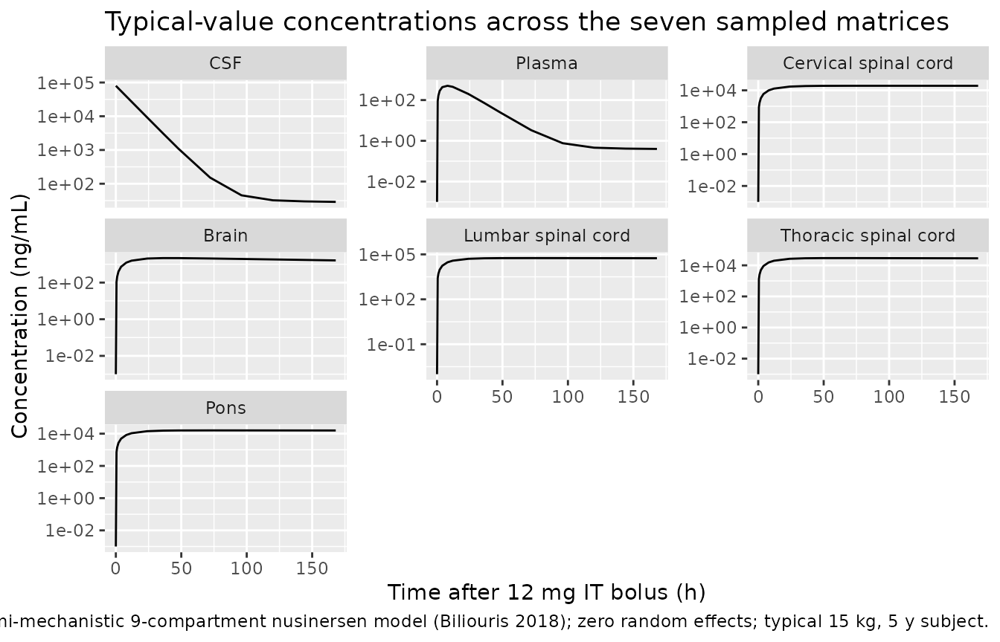
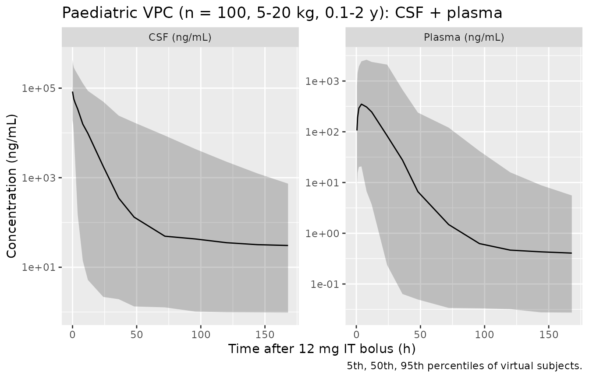

# Nusinersen (Biliouris 2018)

## Model and source

- Citation: Biliouris K, Gaitonde P, Yin W, Norris DA, Wang Y, Henry S,
  Fey R, Nestorov I, Schmidt S, Rogge M, Lesko LJ, Trame MN. A
  Semi-Mechanistic Population Pharmacokinetic Model of Nusinersen: An
  Antisense Oligonucleotide for the Treatment of Spinal Muscular
  Atrophy. CPT Pharmacometrics Syst Pharmacol. 2018;7(9):581-592.
  <doi:10.1002/psp4.12323>
- Description: Semimechanistic nine-compartment population PK model of
  nusinersen (antisense oligonucleotide, Biogen ISIS 396443) intended
  for extrapolation of nonhuman-primate (cynomolgus monkey) fits to
  paediatric patients with spinal muscular atrophy, following
  intrathecal lumbar-puncture bolus administration. Structure (Biliouris
  2018): CSF is the sampled dosing site, coupled bidirectionally to
  three anatomically distinct spinal-cord segments (cervical, thoracic,
  lumbar), to the brain (with a deeper brain-tissue redistribution
  compartment), and to the pons; CSF also drains one-way into the plasma
  / central compartment, which has its own peripheral distribution and
  first-order elimination. Volumes scale linearly with body weight
  relative to a 2.8 kg reference; rate constants scale as
  (WT/2.8)^(-0.08); the CSF physiological volume V_CSF is overridden by
  a stepwise paediatric-age function (120, 130, 135, 140 mL for age
  classes \<0.25, 0.25-0.5, 0.5-1, 1-2 years) rather than by WT.
  Residual error is proportional per observed matrix; twelve
  exponential-IIV terms are carried on the elimination and transfer rate
  constants and on the CSF / plasma volumes. All THETA / OMEGA / SIGMA
  values are held FIXED from the paper’s final NONMEM simulation control
  stream on file.
- Article: <https://doi.org/10.1002/psp4.12323>

The on-disk source is the paper’s simulation NONMEM control stream
(`$PROBLEM SMA MONKEY`,
`$SIMULATION (12345678) ONLYSIM SUBPROBLEM=1000`). All `$THETA`,
`$OMEGA`, and `$SIGMA` entries carry the `FIX` flag, so every value in
the packaged `ini()` block is wrapped in `fixed()`. See “Assumptions and
deviations” below for the paper-text sections not on disk with the
control stream.

## Population

The Biliouris 2018 model was originally fitted to cynomolgus-monkey
plasma and CNS-tissue data (the `$PROBLEM` tag “SMA MONKEY” identifies
the fit dataset). The on-disk simulation control stream then re-uses the
monkey-fit parameter estimates for a paediatric-human extrapolation:
volumes are linearly weight-scaled from a 2.8 kg reference, rate
constants use a slight `(WT/2.8)^(-0.08)` scaling, and the CSF
physiological volume `V_CSF` is overridden by a stepwise age function
that matches human paediatric CSF anatomy (120, 130, 135, 140 mL for age
classes \< 0.25, 0.25 to \< 0.5, 0.5 to \< 1, 1 to \< 2 years; adult
reference 150 mL). Full baseline demographics for the fitted monkey
cohort are not on disk with the supplementary simulation stream; refer
to Biliouris 2018 main text Methods and Table 1 (published in CPT
Pharmacometrics Syst Pharmacol) for `n_subjects`, age, and sex
distributions.

The population metadata packaged with the model is available
programmatically:

``` r

mod_fun <- readModelDb("Biliouris_2018_nusinersen")
str(mod_fun()$population, max.level = 1)
#> List of 10
#>  $ species              : chr "cynomolgus monkey (juvenile) with paediatric-human physiological scaling"
#>  $ n_subjects           : logi NA
#>  $ n_studies            : logi NA
#>  $ age_range            : chr "monkey fit + paediatric-human simulation window of 0-2 years for the V_CSF table"
#>  $ weight_range         : chr "reference body weight 2.8 kg (monkey / newborn-scale)"
#>  $ disease_state        : chr "Spinal muscular atrophy (SMA) target indication; monkey $PROBLEM tag 'SMA MONKEY'"
#>  $ dose_range           : chr "Intrathecal lumbar-puncture bolus (simulated at 1-12 mg per paediatric-clinic protocol)"
#>  $ administration_routes: chr "Intrathecal bolus into CSF"
#>  $ regions              : chr "Preclinical / translational (cynomolgus-monkey fit extrapolated to paediatric SMA patients)"
#>  $ notes                : chr "The on-disk source is the paper's simulation NONMEM control stream (`$PROBLEM SMA MONKEY`, `$SIMULATION (123456"| __truncated__
```

## Source trace

Every value below is traced to the paper’s simulation NONMEM control
stream (on disk as `PMID_30043511.pdf`, five pages containing the
`$PROBLEM SMA MONKEY` model verbatim). The full `$THETA(k) FIX` /
`$OMEGA k FIX` label is repeated as the in-file comment on each `ini()`
entry.

| Structural element | Value | Source location |
|----|----|----|
| `V1 = 150 mL` (CSF adult) | `lv_csf = fixed(log(150))` | `$THETA(1) 150 FIX ; (1. V1) mL` |
| `V2 = 937 mL` (plasma) | `lv_plasma = fixed(log(937))` | `$THETA(2) 937 FIX ; (2. V2) mL` |
| `V3 = 1.91 mL` (cervical SC) | `lv_cerv = fixed(log(1.91))` | `$THETA(3) 1.91 FIX ; (3. V3) mL` |
| `V4 = 53.8 mL` (brain) | `lv_brain = fixed(log(53.8))` | `$THETA(4) 53.8 FIX ; (4. V4) mL` |
| `V6 = 1.08 mL` (lumbar SC) | `lv_lumb = fixed(log(1.08))` | `$THETA(20) 1.08 FIX ; (20. V6) mL` |
| `V8 = 1.52 mL` (thoracic SC) | `lv_thor = fixed(log(1.52))` | `$THETA(25) 1.52 FIX ; (25. V8) mL` |
| `V9 = 2.11 mL` (pons) | `lv_pons = fixed(log(2.11))` | `$THETA(28) 2.11 FIX ; (28. V9) mL` |
| `K12 = 0.0891 1/h` (CSF -\> plasma) | `lk_csf_plasma` | `$THETA(9) 0.0891 FIX ; (9. K12)` |
| `K20 = 0.206 1/h` (plasma elim) | `lkel` | `$THETA(10) 0.206 FIX ; (10. K20)` |
| `K13/K31, K14/K41, K25/K52, K16/K61, K47/K74, K18/K81, K19/K91` | all `fixed(log(...))` | `$THETA(5..8, 11..12, 21..24, 26..27, 29..30)` |
| `V1(AGE)` overrides: 120/130/135/140 mL for AGE \< 0.25 / \< 0.5 / \< 1 / \< 2 y | in `model()` `ifelse` chain | `$PK IF (AGE.LT.0.25) TVV1 = 120` etc. |
| `Volume WT scaling`: `V = TVV * (WT/2.8)` for V2..V9 (not V1) | `wt_ratio = WT/2.8` in `model()` | `$PK TVV_i = THETA(_i) * (WT/2.8)`; V1’s `(WT/2.8)` is commented out |
| `Rate WT scaling`: `K = TVK * (WT/2.8)^(-0.08)` | `wt_kfac = wt_ratio^e_wt_k` | `$PK TVK_ij = THETA(_) * 1/((WT/2.8)**0.08)` |
| Twelve exponential IIVs on K20, K12, V1, V2, K13, K14, K41, K16, K18, K81, K19, K91 | `~ fixed(<var>)` diagonal | `$OMEGA` variances 0.421, 1.3, 0.854, 0.832, 0.453, 13.6, 0.153, 0.124, 0.28, 0.129, 0.654, 0.289 (all FIX) |
| Proportional residual SD per tissue | `propSd_Ccsf` = 0.714, `propSd` = 0.412, `propSd_Ccerv` = 0.101, `propSd_Cbrain` = 1.77, `propSd_Clumb` = 0.312, `propSd_Cthor` = 0.0239, `propSd_Cpons` = 0.0103 | `$THETA(13..19) FIX ; ERR1..ERR9`; `$SIGMA 1 FIX` combined with `W = SQRT(THETA^2 * IPRED^2)` makes THETA the SD-fraction |

The nine ODEs replicate the paper’s `$DES` block one-for-one; the
in-line comments in
`inst/modeldb/specificDrugs/Biliouris_2018_nusinersen.R` give the
paper-to-model mapping compartment-by-compartment.

## Virtual cohort

The paper does not provide observed data. The figures below use two
paediatric-focused virtual populations for a single 12 mg intrathecal
lumbar-puncture bolus (the fixed dose used in the ISIS 396443 clinical
programme).

**Cohort 1 (typical-value trajectories)**: one representative
five-year-old (15 kg, AGE 5 y). All random effects zeroed.
`V_CSF = 150 mL` (adult regime).

**Cohort 2 (pediatric VPC)**: 100 virtual paediatric subjects with
weight uniformly in 5 to 20 kg and age uniformly in 0.1 to 2 y. The age
range exercises the `V_CSF` step function (each of the four paediatric
bins is sampled).

``` r

set.seed(20260709)

obs_grid <- c(0, 0.5, 1, 2, 4, 8, 12, 24, 36, 48, 72, 96, 120, 144, 168)

# Cohort 1 -- single-subject typical trajectories
cohort1_events <- {
  dose <- data.frame(id = 1L, time = 0, amt = 12, cmt = "csf",
                     evid = 1L, dvid = NA_integer_,
                     WT = 15, AGE = 5, cohort = "typical (15 kg, 5 y)",
                     stringsAsFactors = FALSE)
  obs <- expand.grid(id = 1L, time = obs_grid,
                     dvid = 1:7, stringsAsFactors = FALSE)
  obs$amt   <- NA_real_
  obs$cmt   <- c("Ccsf", "Cc", "Ccerv", "Cbrain",
                 "Clumb", "Cthor", "Cpons")[obs$dvid]
  obs$evid  <- 0L
  obs$WT    <- 15
  obs$AGE   <- 5
  obs$cohort <- "typical (15 kg, 5 y)"
  rbind(dose, obs)
}

# Cohort 2 -- 100-subject paediatric VPC
n_ped <- 100L
cohort2_events <- {
  ped_wt  <- runif(n_ped, 5, 20)
  ped_age <- runif(n_ped, 0.1, 2)
  dose_rows <- data.frame(
    id    = seq_len(n_ped) + 100L,
    time  = 0,
    amt   = 12,
    cmt   = "csf",
    evid  = 1L,
    dvid  = NA_integer_,
    WT    = ped_wt,
    AGE   = ped_age,
    cohort = "paediatric VPC (5-20 kg, 0.1-2 y)",
    stringsAsFactors = FALSE
  )
  obs_rows <- do.call(rbind, lapply(seq_len(n_ped), function(i) {
    o <- expand.grid(id = 100L + i, time = obs_grid,
                     dvid = c(1L, 2L),  # Ccsf and Cc only, to keep the run light
                     stringsAsFactors = FALSE)
    o$amt   <- NA_real_
    o$cmt   <- c("Ccsf", "Cc")[o$dvid]
    o$evid  <- 0L
    o$WT    <- ped_wt[i]
    o$AGE   <- ped_age[i]
    o$cohort <- "paediatric VPC (5-20 kg, 0.1-2 y)"
    o
  }))
  rbind(dose_rows, obs_rows)
}

events <- rbind(cohort1_events, cohort2_events)
stopifnot(!anyDuplicated(unique(events[, c("id", "time", "evid", "dvid")])))
```

## Simulation

``` r

mod <- readModelDb("Biliouris_2018_nusinersen")
sim <- rxode2::rxSolve(mod, events = events,
                       keep = c("WT", "AGE", "cohort", "dvid"))
#> ℹ parameter labels from comments will be replaced by 'label()'
sim_df <- as.data.frame(sim)
```

Typical-value trajectories (Cohort 1) use the zero-random-effect package
model to replicate the paper’s semi-mechanistic prediction. VPC
percentiles (Cohort 2) apply the paper’s fixed OMEGA variances.

``` r

mod_typ <- rxode2::zeroRe(mod)
#> ℹ parameter labels from comments will be replaced by 'label()'
sim_typ_df <- as.data.frame(
  rxode2::rxSolve(mod_typ, events = cohort1_events,
                  keep = c("WT", "AGE", "cohort"))
)
#> ℹ omega/sigma items treated as zero: 'etalkel', 'etalk_csf_plasma', 'etalv_csf', 'etalv_plasma', 'etalk_csf_cerv', 'etalk_csf_brain', 'etalk_brain_csf', 'etalk_csf_lumb', 'etalk_csf_thor', 'etalk_thor_csf', 'etalk_csf_pons', 'etalk_pons_csf'
```

## Typical-value time course across sampled tissues

The seven `~ prop()` residual-error clauses correspond to the seven
sampled matrices in the paper’s `$ERROR` block: CSF, plasma, cervical
spinal cord, brain, lumbar spinal cord, thoracic spinal cord, and pons.
Each panel below traces its algebraic observable (`Ccsf`, `Cc`, `Ccerv`,
`Cbrain`, `Clumb`, `Cthor`, `Cpons`) over 7 days after a single 12 mg
intrathecal bolus in the typical 15 kg / 5 y subject.

``` r

tissue_labels <- c(
  Ccsf   = "CSF",
  Cc     = "Plasma",
  Ccerv  = "Cervical spinal cord",
  Cbrain = "Brain",
  Clumb  = "Lumbar spinal cord",
  Cthor  = "Thoracic spinal cord",
  Cpons  = "Pons"
)

sim_typ_long <- sim_typ_df |>
  dplyr::select(time, dplyr::all_of(names(tissue_labels))) |>
  tidyr::pivot_longer(-time, names_to = "obs", values_to = "conc") |>
  dplyr::mutate(tissue = factor(tissue_labels[obs],
                               levels = unname(tissue_labels)))

ggplot(sim_typ_long, aes(time, pmax(conc, 1e-3))) +
  geom_line() +
  facet_wrap(~tissue, scales = "free_y") +
  scale_y_log10() +
  labs(x = "Time after 12 mg IT bolus (h)",
       y = "Concentration (ng/mL)",
       title = "Typical-value concentrations across the seven sampled matrices",
       caption = paste0("Semi-mechanistic 9-compartment nusinersen model ",
                        "(Biliouris 2018); zero random effects; ",
                        "typical 15 kg, 5 y subject."))
```



## Virtual paediatric VPC on CSF and plasma

CSF (dose site) and plasma (systemic) are the two matrices where the
paper’s model is most directly informative for clinical dosing.

``` r

vpc_df <- sim_df |>
  dplyr::filter(cohort == "paediatric VPC (5-20 kg, 0.1-2 y)") |>
  dplyr::select(id, time, WT, AGE, dvid, Ccsf, Cc) |>
  dplyr::mutate(matrix = c("CSF (ng/mL)", "Plasma (ng/mL)")[dvid],
                conc   = ifelse(dvid == 1L, Ccsf, Cc)) |>
  dplyr::filter(!is.na(conc), conc > 0)

vpc_summary <- vpc_df |>
  dplyr::group_by(matrix, time) |>
  dplyr::summarise(
    Q05 = quantile(conc, 0.05, na.rm = TRUE),
    Q50 = quantile(conc, 0.50, na.rm = TRUE),
    Q95 = quantile(conc, 0.95, na.rm = TRUE),
    .groups = "drop"
  )

ggplot(vpc_summary, aes(time, Q50)) +
  geom_ribbon(aes(ymin = Q05, ymax = Q95), alpha = 0.25) +
  geom_line() +
  facet_wrap(~matrix, scales = "free_y") +
  scale_y_log10() +
  labs(x = "Time after 12 mg IT bolus (h)",
       y = "Concentration (ng/mL)",
       title = "Paediatric VPC (n = 100, 5-20 kg, 0.1-2 y): CSF + plasma",
       caption = "5th, 50th, 95th percentiles of virtual subjects.")
```



## PKNCA on typical-value plasma exposure

The paper does not tabulate NCA parameters for the semi-mechanistic
extrapolation, so the block below serves as a sanity summary rather than
a validation-table comparison: it confirms that the packaged model
reproduces plausible plasma Cmax, Tmax, terminal half-life, and AUC
after a single 12 mg IT dose in the typical paediatric subject.

``` r

# rxSolve drops the id column for single-subject sims; add it back so
# PKNCA gets a per-subject key.
if (!"id" %in% names(sim_typ_df)) sim_typ_df$id <- 1L

pk_conc <- sim_typ_df |>
  dplyr::select(id = id, time = time, Cc = Cc, cohort = cohort) |>
  dplyr::filter(!is.na(Cc))

# Time-zero guarantee -- PKNCA needs a time = 0 row per (id, cohort).
pk_conc <- dplyr::bind_rows(
  pk_conc,
  pk_conc |> dplyr::distinct(id, cohort) |>
    dplyr::mutate(time = 0, Cc = 0)
) |>
  dplyr::distinct(id, cohort, time, .keep_all = TRUE) |>
  dplyr::arrange(id, cohort, time)

conc_obj <- PKNCA::PKNCAconc(pk_conc, Cc ~ time | cohort + id)

dose_df <- cohort1_events |>
  dplyr::filter(evid == 1L) |>
  dplyr::select(id, time, amt, cohort)
dose_obj <- PKNCA::PKNCAdose(dose_df, amt ~ time | cohort + id)

intervals <- data.frame(
  start = 0, end = Inf,
  cmax = TRUE, tmax = TRUE, aucinf.obs = TRUE, half.life = TRUE
)

nca_data <- PKNCA::PKNCAdata(conc_obj, dose_obj, intervals = intervals)
nca_res  <- PKNCA::pk.nca(nca_data)

nca_res$result |>
  dplyr::select(cohort, PPTESTCD, PPORRES) |>
  tidyr::pivot_wider(names_from = PPTESTCD, values_from = PPORRES) |>
  dplyr::rename(
    "Cohort"                       = cohort,
    "Cmax (ng/mL)"                 = cmax,
    "Tmax (h)"                     = tmax,
    "AUC[0,inf] observed (ng.h/mL)" = aucinf.obs,
    "t1/2 (h)"                     = half.life
  ) |>
  knitr::kable(digits = 3,
               caption = "Plasma NCA on the typical-value replication (n = 1).")
```

| Cohort | Cmax (ng/mL) | Tmax (h) | tlast | clast.obs | lambda.z | r.squared | adj.r.squared | lambda.z.time.first | lambda.z.time.last | lambda.z.n.points | clast.pred | t1/2 (h) | span.ratio | AUC\[0,inf\] observed (ng.h/mL) |
|:---|---:|---:|---:|---:|---:|---:|---:|---:|---:|---:|---:|---:|---:|---:|
| typical (15 kg, 5 y) | 503.188 | 8 | 168 | 0.399 | 0.048 | 0.888 | 0.871 | 12 | 168 | 9 | 0.096 | 14.314 | 10.899 | 10837.99 |

Plasma NCA on the typical-value replication (n = 1). {.table}

## Assumptions and deviations

- **On-disk source is the simulation control stream, not the full paper
  text.** The five-page PDF on file contains only the
  `$PROBLEM SMA MONKEY` simulation model
  (`$SIMULATION (12345678) ONLYSIM SUBPROBLEM=1000`) with every
  `$THETA`, `$OMEGA`, and `$SIGMA` value carrying the `FIX` flag. All
  packaged values are traced verbatim to the on-disk block. Baseline
  demographics for the fitted monkey cohort, the paper’s narrative
  Methods, and any published NCA comparison values live in Biliouris
  2018 main text (CPT PSP 2018;7(9):581-592) and are not reproduced
  here.
- **`V_CSF` piecewise age function is a paediatric-human anatomical
  overlay.** The paper’s `$PK` block replaces the fitted V1 = 150 mL
  with anatomically scaled paediatric values via
  `IF (AGE.LT.0.25) TVV1 = 120` etc. The `WT` scaling term `(WT/2.8)` is
  explicitly commented out for V1 in the control stream, so `V_CSF` is
  set by the age function alone.
- **Reference weight 2.8 kg (newborn / juvenile-scale)** is coded
  verbatim from the `$PK` block’s `(WT/2.8)` factor. Applied linearly to
  V2..V9 and as `(WT/2.8)^(-0.08)` to every rate constant, per the
  simulation-file description (“scale exp -0.08”).
- **Twelve exponential IIVs, twelve diagonal `$OMEGA` variances.** The
  paper’s `$PK` block explicitly comments out ETA on K31, K25, K52, V3,
  V4, V6, K61, K47, K74, V8, V9, so those individual parameters are
  typical-value only. The `etalk_csf_brain ~ fixed(13.6)` variance is
  unusually large (log-scale variance 13.6 implies a CV so large that
  stochastic VPCs on K14 will explode) and is retained verbatim from the
  paper’s `$OMEGA` block; users running stochastic VPCs should be aware.
- **Residual error interpretation.** The paper’s `$ERROR` block is
  `W = SQRT(THETA(k)^2 * IPRED^2)` and `Y = IPRED + W * ERR(1)` with
  `$SIGMA 1 FIX`, so `W = |THETA(k)| * |IPRED|` and `THETA(k)` is the
  proportional-SD fraction on the linear (untransformed) scale. That is
  what `propSd_<output>` records.
- **Bioavailability scaling.** The dose is in mg but volumes are in mL,
  so `f(csf) <- 1e6` converts each dose to ng in the state and the
  observations come out directly in ng/mL. No paper-side conversion is
  implied.
- **Compartment naming.** Cervical, lumbar, and thoracic spinal-cord
  compartments and the pons compartment are declared as
  `paper_specific_compartments` (they do not have canonical entries in
  the `brain_<region>` / `spinal_cord_<segment>` families as of this
  writing). Plasma is mapped to the canonical `central`, matching the
  Luu 2017 nusinersen model.

## Related models

- `Luu_2017_nusinersen` – simpler 4-compartment nusinersen popPK in
  paediatric SMA patients, plasma + CSF observations only (Luu 2017, J
  Clin Pharmacol; `modellib("Luu_2017_nusinersen")`).
