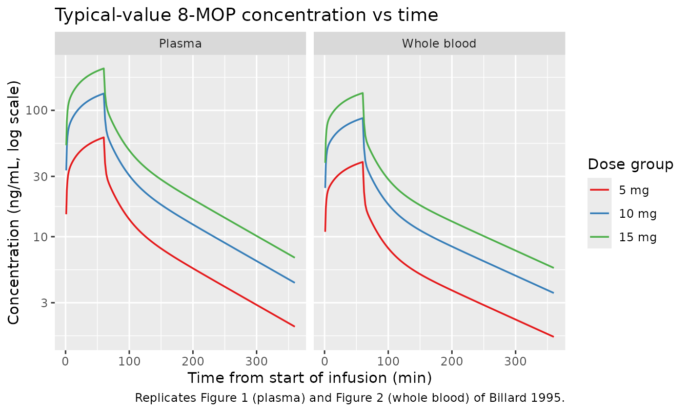
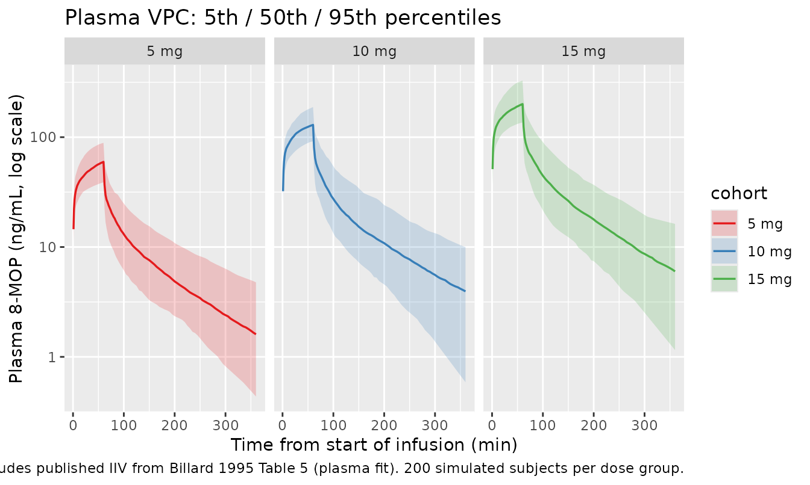

# 8-methoxypsoralen (Billard 1995)

## Model and source

- Citation: Billard V, Gambus PL, Barr J, Minto CF, Corash L, Tessman
  JW, Stickney JL, Shafer SL. The pharmacokinetics of 8-methoxypsoralen
  following i.v. administration in humans. Br J Clin Pharmacol.
  1995;40(4):347-360. <doi:10.1111/j.1365-2125.1995.tb04557.x>
- Article: <https://doi.org/10.1111/j.1365-2125.1995.tb04557.x>

The paper develops two parallel three-compartment population PK models
for 8-methoxypsoralen (8-MOP; INN methoxsalen) in 18 healthy adult
volunteers receiving a single 60-min IV infusion of 5, 10, or 15 mg (n =
6 per dose group). The two fits differ only in the analytical matrix
used: one fit to plasma concentrations and one to whole-blood
concentrations. Both were estimated in NONMEM IV level 1.1;
weight-proportional volumes and clearances were preferred over weight,
body-surface-area, lean-body-mass, age, haematocrit, and serum-albumin
alternatives. nlmixr2lib carries the two fits as separate registry
entries because the authors fitted them as two parallel NONMEM runs with
distinct parameter values, even though the structural form is identical
and they share the same subject-level covariate (body weight):

- `modellib("Billard_1995_methoxsalen_plasma")` – plasma fit (Table 5,
  “Plasma Estimate” column).
- `modellib("Billard_1995_methoxsalen_blood")` – whole-blood fit (Table
  5, “Whole blood Estimate” column).

## Population

18 healthy adult volunteers (Stanford University School of Medicine /
Palo Alto Veterans Administration Medical Center) completed the study;
four additional volunteers were enrolled but did not complete or were
not evaluable. Inclusion criteria: 18-40 years, no history of
significant medical illness, no chronic tobacco / alcohol / medication /
illicit-drug use, and normal laboratory blood and urine tests including
HBsAg and HIV antibody. Both men and women were enrolled (the LBM
derivation in Methods is sex-specific) but the sex breakdown is not
reported.

Baseline demographics from Billard 1995 Table 1 (mean +/- s.d. by dose
group):

| Variable | 5 mg (n = 6) | 10 mg (n = 6) | 15 mg (n = 6) | Global (n = 18) |
|----|----|----|----|----|
| Weight (kg) | 85.4 +/- 14.2 | 79.8 +/- 11.8 | 74.2 +/- 15.0 | 79.8 +/- 13.7 |
| Height (cm) | 186.6 +/- 9 | 177.7 +/- 11.1 | 177.4 +/- 7.3 | 180.6 +/- 9.8 |
| Age (years) | 30.7 +/- 8 | 35.8 +/- 8 | 31.2 +/- 9.7 | 32.6 +/- 8.4 |
| Body surface area (m^2) | 2.10 +/- 0.2 | 1.98 +/- 0.2 | 1.91 +/- 0.21 | 2.00 +/- 0.21 |
| Lean body mass (kg) | 66.9 +/- 8.4 | 60.8 +/- 9.3 | 58.0 +/- 9.4 | 61.9 +/- 9.3 |
| Haematocrit (%) | 44.2 +/- 1.6 | 43.3 +/- 4.7 | 42.8 +/- 2.8 | 43.5 +/- 3.2 |
| Serum albumin (g/dL) | 5.07 +/- 0.38 | 4.77 +/- 0.19 | 5.03 +/- 0.47 | 4.96 +/- 0.37 |

Each subject received a single 60-min IV infusion of 5, 10, or 15 mg
8-MOP diluted to 600 mL total volume in sterile saline at 10 mL/min via
volumetric pump. Arterial sampling at baseline, 2/5/10/15/20/30/40/50/60
min during infusion, and
2/5/10/15/20/30/40/50/60/90/120/150/180/210/240/270/300 min
post-infusion, plus two venous samples at 600 and 1440 min from the
start of the infusion. Total 308 plasma observations across the 18
subjects. The measured dose differed slightly from the nominal because
approximately 5-7% of the 8-MOP was adsorbed onto the infusion tubing
(Tables 3 and 4 “Measured dose” column: 4.6 / 9.5 / 14.0 mg mean across
the three cohorts).

The same information is available programmatically via the model’s
`population` metadata:

``` r

str(rxode2::rxode(readModelDb("Billard_1995_methoxsalen_plasma"))$population)
```

## Source trace

The per-parameter origin is recorded as an in-file comment on each
`ini()` entry in
`inst/modeldb/specificDrugs/Billard_1995_methoxsalen_plasma.R` and
`..._blood.R`. The table below collects all parameters in one place for
review.

The structural parameters are encoded for a reference subject of 70 kg,
with a power-1 weight effect applied in `model()` so the per-kg
structural form of the paper (Table 5) is preserved. The conversion
`<param at 70 kg> = <per-kg value> x 70 kg` is applied below.

### Structural parameters and IIV (Billard 1995 Table 5)

| Parameter (per kg) | Plasma fit | Whole-blood fit | Source location |
|----|----|----|----|
| V1 = lvc (L/kg) | 0.045 (CV 5 %) | 0.061 (CV 7 %) | Table 5 “Volumes / Central” |
| V2 = lvp (L/kg) | 0.57 (CV 54 %) | 1.15 (CV 69 %) | Table 5 “Volumes / Rapid distribution” |
| V3 = lvp2 (L/kg) | 0.15 (CV 34 %) | 0.21 (CV 28 %) | Table 5 “Volumes / Slow distribution” |
| CL1 = lcl (L/kg/min) | 0.010 (CV 25 %) | 0.015 (CV 42 %) | Table 5 “Clearances / Systemic” |
| CL2 = lq (L/kg/min) | 0.0067 (CV 14 %) | 0.011 (CV 3 %) | Table 5 “Clearances / Rapid distribution” |
| CL3 = lq2 (L/kg/min) | 0.012 (CV 40 %) | 0.015 (CV 51 %) | Table 5 “Clearances / Slow distribution” |
| Residual error sigma | 8 % | 8 % | Table 5 “Measures of goodness of fit / Residual CV (sigma)” |

The Table 5 “CV” column is the log-domain standard deviation of the
parameter random effect (Methods, NONMEM parameter model paragraph:
“omega is thus the standard deviation of the parameter in the log
domain”); the values are converted to NONMEM variance via omega^2 = CV^2
in the `ini()` blocks. Off-diagonal omegas are not reported by the paper
and are modelled here as independent. The residual error is encoded as
`Cc ~ lnorm(expSd)` with `expSd = 0.08` reflecting the paper’s stated
log-normal residual form (Methods, NONMEM residual model paragraph:
“O_ij = Y_ij \* exp(epsilon_ij)” with sigma the log-domain SD).

### Structural equations

| Equation | Source location |
|----|----|
| 3-compartment mammillary IV input model with central + rapid V2 + slow V3 | Methods: Compartmental analysis (3-cmt preferred to 2-cmt by NONMEM -2LL drop \>100) |
| `d/dt(central) = -kel*central - k12*central + k21*peripheral1 - k13*central + k31*peripheral2` | Standard 3-cmt form – see Discussion: Compartmental analysis |
| `d/dt(peripheral1) = k12*central - k21*peripheral1` | Same |
| `d/dt(peripheral2) = k13*central - k31*peripheral2` | Same |
| `Cc = 1000 * central / vc` (ng/mL conversion from mg/L) | Units: dose mg, vc L gives mg/L = 1000 ng/mL |
| Volumes and clearances proportional to body weight: `(WT/70)^1.0` | Abstract point 4; Results: Compartmental analysis – “weight applied to volumes and clearances in simple proportion”; weight-proportional model preferred over BSA-proportional, LBM-proportional, age, haematocrit, albumin alternatives (Discussion: Compartmental analysis) |

## Virtual cohort

The virtual cohort replicates the dose-group design of Billard 1995 (n =
6 per dose group; doses 5, 10, 15 mg; 60-min IV infusion to the central
compartment). Weight is sampled from a normal distribution truncated at
50 kg, with mean and s.d. matching the cohort-specific Table 1 entries.

``` r

set.seed(20251015L)

cohort_specs <- tibble::tribble(
  ~cohort,           ~dose_nominal, ~dose_measured, ~wt_mean, ~wt_sd,
  "5 mg",             5.0,           4.6,            85.4,     14.2,
  "10 mg",           10.0,           9.5,            79.8,     11.8,
  "15 mg",           15.0,          14.0,            74.2,     15.0
) |>
  dplyr::mutate(cohort = factor(cohort, levels = c("5 mg", "10 mg", "15 mg")))

make_cohort <- function(spec, n, id_offset = 0L) {
  ids <- id_offset + seq_len(n)
  wt  <- pmax(50, stats::rnorm(n, mean = spec$wt_mean, sd = spec$wt_sd))

  obs_times <- sort(unique(c(seq(0, 60, by = 1),
                             seq(62, 120, by = 2),
                             seq(125, 360, by = 5),
                             seq(370, 1440, by = 10))))

  per_id <- function(i) {
    dose_row <- tibble::tibble(
      id   = ids[i], time = 0, amt = spec$dose_measured,
      rate = spec$dose_measured / 60,  # mg/min over 60-min infusion
      evid = 1L, cmt = "central", WT = wt[i],
      cohort = spec$cohort, dose_measured = spec$dose_measured
    )
    obs_rows <- tibble::tibble(
      id     = ids[i], time = obs_times, amt = 0, rate = 0,
      evid   = 0L, cmt = "central", WT = wt[i],
      cohort = spec$cohort, dose_measured = spec$dose_measured
    )
    dplyr::bind_rows(dose_row, obs_rows)
  }

  dplyr::bind_rows(lapply(seq_len(n), per_id))
}

n_per_cohort <- 200L

events <- dplyr::bind_rows(
  make_cohort(cohort_specs[1, ], n_per_cohort, id_offset =   0L),
  make_cohort(cohort_specs[2, ], n_per_cohort, id_offset =   n_per_cohort),
  make_cohort(cohort_specs[3, ], n_per_cohort, id_offset = 2L * n_per_cohort)
)
stopifnot(!anyDuplicated(unique(events[, c("id", "time", "evid")])))
```

## Simulation

Two simulations are used in the figures and PKNCA tables below:

- `sim_plasma_typ` / `sim_blood_typ` – typical-value (zero
  between-subject variability) trajectories used for the side-by-side
  reproduction of the paper’s mean Cmax / AUC reported in Tables 3
  and 4. This isolates the structural model from sampling variability.
- `sim_plasma_vpc` / `sim_blood_vpc` – full stochastic simulation
  including the published IIV (between-subject log-domain SDs from
  Table 5) used for the VPC bands.

``` r

mod_plasma <- readModelDb("Billard_1995_methoxsalen_plasma")
mod_blood  <- readModelDb("Billard_1995_methoxsalen_blood")

mod_plasma_typ <- rxode2::zeroRe(mod_plasma)
#> ℹ parameter labels from comments will be replaced by 'label()'
mod_blood_typ  <- rxode2::zeroRe(mod_blood)
#> ℹ parameter labels from comments will be replaced by 'label()'

sim_plasma_typ <- rxode2::rxSolve(mod_plasma_typ, events = events,
                                  keep = c("cohort", "dose_measured"))
#> ℹ omega/sigma items treated as zero: 'etalvc', 'etalvp', 'etalvp2', 'etalcl', 'etalq', 'etalq2'
#> Warning: multi-subject simulation without without 'omega'
sim_blood_typ  <- rxode2::rxSolve(mod_blood_typ,  events = events,
                                  keep = c("cohort", "dose_measured"))
#> ℹ omega/sigma items treated as zero: 'etalvc', 'etalvp', 'etalvp2', 'etalcl', 'etalq', 'etalq2'
#> Warning: multi-subject simulation without without 'omega'

sim_plasma_vpc <- rxode2::rxSolve(mod_plasma, events = events,
                                  keep = c("cohort", "dose_measured"))
#> ℹ parameter labels from comments will be replaced by 'label()'
sim_blood_vpc  <- rxode2::rxSolve(mod_blood,  events = events,
                                  keep = c("cohort", "dose_measured"))
#> ℹ parameter labels from comments will be replaced by 'label()'
```

## Replicate published figures

### Figure 1 / Figure 2 – mean concentration vs time by dose group

``` r

sim_typ <- dplyr::bind_rows(
  sim_plasma_typ |> dplyr::mutate(matrix = "Plasma"),
  sim_blood_typ  |> dplyr::mutate(matrix = "Whole blood")
)

sim_typ |>
  dplyr::filter(time <= 360, time > 0) |>
  dplyr::group_by(matrix, cohort, time) |>
  dplyr::summarise(Cc = mean(Cc, na.rm = TRUE), .groups = "drop") |>
  ggplot2::ggplot(ggplot2::aes(time, Cc, colour = cohort)) +
  ggplot2::geom_line(linewidth = 0.6) +
  ggplot2::facet_wrap(~matrix) +
  ggplot2::scale_y_log10() +
  ggplot2::scale_colour_brewer(palette = "Set1") +
  ggplot2::labs(x = "Time from start of infusion (min)",
                y = "Concentration (ng/mL, log scale)",
                colour = "Dose group",
                title = "Typical-value 8-MOP concentration vs time",
                caption = "Replicates Figure 1 (plasma) and Figure 2 (whole blood) of Billard 1995.")
```



### VPC by dose group (plasma)

``` r

sim_plasma_vpc |>
  dplyr::filter(time <= 360, time > 0) |>
  dplyr::group_by(cohort, time) |>
  dplyr::summarise(
    Q05 = stats::quantile(Cc, 0.05, na.rm = TRUE),
    Q50 = stats::quantile(Cc, 0.50, na.rm = TRUE),
    Q95 = stats::quantile(Cc, 0.95, na.rm = TRUE),
    .groups = "drop"
  ) |>
  ggplot2::ggplot(ggplot2::aes(time, Q50, fill = cohort, colour = cohort)) +
  ggplot2::geom_ribbon(ggplot2::aes(ymin = Q05, ymax = Q95),
                       alpha = 0.2, colour = NA) +
  ggplot2::geom_line(linewidth = 0.6) +
  ggplot2::facet_wrap(~cohort) +
  ggplot2::scale_y_log10() +
  ggplot2::scale_colour_brewer(palette = "Set1") +
  ggplot2::scale_fill_brewer(palette = "Set1") +
  ggplot2::labs(x = "Time from start of infusion (min)",
                y = "Plasma 8-MOP (ng/mL, log scale)",
                title = "Plasma VPC: 5th / 50th / 95th percentiles",
                caption = "Includes published IIV from Billard 1995 Table 5 (plasma fit). 200 simulated subjects per dose group.")
```



## PKNCA validation against Tables 3 and 4

Per-subject NCA on the typical-value trajectories (no IIV, no residual
error). Cmax is taken at the end of the 60-min infusion (the paper’s
Tables 3 and 4 report “Peak” at end of infusion); AUC is computed over
0-1440 min (the paper’s longest sampling time); MRT is computed as
AUMC/AUC minus the infusion midpoint (the paper’s reported MRT, see
Methods, Moment analysis).

``` r

build_nca <- function(sim_typ, label) {
  sim_nca <- sim_typ |>
    dplyr::filter(time <= 1440, !is.na(Cc), Cc > 0) |>
    dplyr::select(id, time, Cc, cohort)

  dose_df <- events |>
    dplyr::filter(evid == 1) |>
    dplyr::select(id, time, amt, cohort)

  conc_obj <- PKNCA::PKNCAconc(sim_nca, Cc ~ time | cohort + id,
                               concu = "ng/mL", timeu = "min")
  dose_obj <- PKNCA::PKNCAdose(dose_df, amt ~ time | cohort + id,
                               doseu = "mg")

  intervals <- data.frame(
    start         = 0,
    end           = 1440,
    cmax          = TRUE,
    tmax          = TRUE,
    auclast       = TRUE,
    aucinf.obs    = TRUE,
    half.life     = TRUE,
    mrt.last      = TRUE
  )
  res <- PKNCA::pk.nca(PKNCA::PKNCAdata(conc_obj, dose_obj, intervals = intervals))
  smry <- as.data.frame(res$result) |>
    dplyr::filter(PPTESTCD %in% c("cmax", "auclast", "aucinf.obs", "mrt.last", "half.life")) |>
    dplyr::group_by(cohort, PPTESTCD) |>
    dplyr::summarise(value = mean(PPORRES, na.rm = TRUE), .groups = "drop") |>
    tidyr::pivot_wider(names_from = PPTESTCD, values_from = value) |>
    dplyr::mutate(matrix = label, .before = 1)
  smry
}

nca_plasma <- build_nca(sim_plasma_typ, "Plasma")
#> Warning: Requesting an AUC range starting (0) before the first measurement (1) is not allowed
#> Requesting an AUC range starting (0) before the first measurement (1) is not allowed
#> Requesting an AUC range starting (0) before the first measurement (1) is not allowed
#> Requesting an AUC range starting (0) before the first measurement (1) is not allowed
#> Requesting an AUC range starting (0) before the first measurement (1) is not allowed
#> Requesting an AUC range starting (0) before the first measurement (1) is not allowed
#> Requesting an AUC range starting (0) before the first measurement (1) is not allowed
#> Requesting an AUC range starting (0) before the first measurement (1) is not allowed
#> Requesting an AUC range starting (0) before the first measurement (1) is not allowed
#> Requesting an AUC range starting (0) before the first measurement (1) is not allowed
#> Requesting an AUC range starting (0) before the first measurement (1) is not allowed
#> Requesting an AUC range starting (0) before the first measurement (1) is not allowed
#> Requesting an AUC range starting (0) before the first measurement (1) is not allowed
#> Requesting an AUC range starting (0) before the first measurement (1) is not allowed
#> Requesting an AUC range starting (0) before the first measurement (1) is not allowed
#> Requesting an AUC range starting (0) before the first measurement (1) is not allowed
#> Requesting an AUC range starting (0) before the first measurement (1) is not allowed
#> Requesting an AUC range starting (0) before the first measurement (1) is not allowed
#> Requesting an AUC range starting (0) before the first measurement (1) is not allowed
#> Requesting an AUC range starting (0) before the first measurement (1) is not allowed
#> Requesting an AUC range starting (0) before the first measurement (1) is not allowed
#> Requesting an AUC range starting (0) before the first measurement (1) is not allowed
#> Requesting an AUC range starting (0) before the first measurement (1) is not allowed
#> Requesting an AUC range starting (0) before the first measurement (1) is not allowed
#> Requesting an AUC range starting (0) before the first measurement (1) is not allowed
#> Requesting an AUC range starting (0) before the first measurement (1) is not allowed
#> Requesting an AUC range starting (0) before the first measurement (1) is not allowed
#> Requesting an AUC range starting (0) before the first measurement (1) is not allowed
#> Requesting an AUC range starting (0) before the first measurement (1) is not allowed
#> Requesting an AUC range starting (0) before the first measurement (1) is not allowed
#> Requesting an AUC range starting (0) before the first measurement (1) is not allowed
#> Requesting an AUC range starting (0) before the first measurement (1) is not allowed
#> Requesting an AUC range starting (0) before the first measurement (1) is not allowed
#> Requesting an AUC range starting (0) before the first measurement (1) is not allowed
#> Requesting an AUC range starting (0) before the first measurement (1) is not allowed
#> Requesting an AUC range starting (0) before the first measurement (1) is not allowed
#> Requesting an AUC range starting (0) before the first measurement (1) is not allowed
#> Requesting an AUC range starting (0) before the first measurement (1) is not allowed
#> Requesting an AUC range starting (0) before the first measurement (1) is not allowed
#> Requesting an AUC range starting (0) before the first measurement (1) is not allowed
#> Requesting an AUC range starting (0) before the first measurement (1) is not allowed
#> Requesting an AUC range starting (0) before the first measurement (1) is not allowed
#> Requesting an AUC range starting (0) before the first measurement (1) is not allowed
#> Requesting an AUC range starting (0) before the first measurement (1) is not allowed
#> Requesting an AUC range starting (0) before the first measurement (1) is not allowed
#> Requesting an AUC range starting (0) before the first measurement (1) is not allowed
#> Requesting an AUC range starting (0) before the first measurement (1) is not allowed
#> Requesting an AUC range starting (0) before the first measurement (1) is not allowed
#> Requesting an AUC range starting (0) before the first measurement (1) is not allowed
#> Requesting an AUC range starting (0) before the first measurement (1) is not allowed
#> Requesting an AUC range starting (0) before the first measurement (1) is not allowed
#> Requesting an AUC range starting (0) before the first measurement (1) is not allowed
#> Requesting an AUC range starting (0) before the first measurement (1) is not allowed
#> Requesting an AUC range starting (0) before the first measurement (1) is not allowed
#> Requesting an AUC range starting (0) before the first measurement (1) is not allowed
#> Requesting an AUC range starting (0) before the first measurement (1) is not allowed
#> Requesting an AUC range starting (0) before the first measurement (1) is not allowed
#> Requesting an AUC range starting (0) before the first measurement (1) is not allowed
#> Requesting an AUC range starting (0) before the first measurement (1) is not allowed
#> Requesting an AUC range starting (0) before the first measurement (1) is not allowed
#> Requesting an AUC range starting (0) before the first measurement (1) is not allowed
#> Requesting an AUC range starting (0) before the first measurement (1) is not allowed
#> Requesting an AUC range starting (0) before the first measurement (1) is not allowed
#> Requesting an AUC range starting (0) before the first measurement (1) is not allowed
#> Requesting an AUC range starting (0) before the first measurement (1) is not allowed
#> Requesting an AUC range starting (0) before the first measurement (1) is not allowed
#> Requesting an AUC range starting (0) before the first measurement (1) is not allowed
#> Requesting an AUC range starting (0) before the first measurement (1) is not allowed
#> Requesting an AUC range starting (0) before the first measurement (1) is not allowed
#> Requesting an AUC range starting (0) before the first measurement (1) is not allowed
#> Requesting an AUC range starting (0) before the first measurement (1) is not allowed
#> Requesting an AUC range starting (0) before the first measurement (1) is not allowed
#> Requesting an AUC range starting (0) before the first measurement (1) is not allowed
#> Requesting an AUC range starting (0) before the first measurement (1) is not allowed
#> Requesting an AUC range starting (0) before the first measurement (1) is not allowed
#> Requesting an AUC range starting (0) before the first measurement (1) is not allowed
#> Requesting an AUC range starting (0) before the first measurement (1) is not allowed
#> Requesting an AUC range starting (0) before the first measurement (1) is not allowed
#> Requesting an AUC range starting (0) before the first measurement (1) is not allowed
#> Requesting an AUC range starting (0) before the first measurement (1) is not allowed
#> Requesting an AUC range starting (0) before the first measurement (1) is not allowed
#> Requesting an AUC range starting (0) before the first measurement (1) is not allowed
#> Requesting an AUC range starting (0) before the first measurement (1) is not allowed
#> Requesting an AUC range starting (0) before the first measurement (1) is not allowed
#> Requesting an AUC range starting (0) before the first measurement (1) is not allowed
#> Requesting an AUC range starting (0) before the first measurement (1) is not allowed
#> Requesting an AUC range starting (0) before the first measurement (1) is not allowed
#> Requesting an AUC range starting (0) before the first measurement (1) is not allowed
#> Requesting an AUC range starting (0) before the first measurement (1) is not allowed
#> Requesting an AUC range starting (0) before the first measurement (1) is not allowed
#> Requesting an AUC range starting (0) before the first measurement (1) is not allowed
#> Requesting an AUC range starting (0) before the first measurement (1) is not allowed
#> Requesting an AUC range starting (0) before the first measurement (1) is not allowed
#> Requesting an AUC range starting (0) before the first measurement (1) is not allowed
#> Requesting an AUC range starting (0) before the first measurement (1) is not allowed
#> Requesting an AUC range starting (0) before the first measurement (1) is not allowed
#> Requesting an AUC range starting (0) before the first measurement (1) is not allowed
#> Requesting an AUC range starting (0) before the first measurement (1) is not allowed
#> Requesting an AUC range starting (0) before the first measurement (1) is not allowed
#> Requesting an AUC range starting (0) before the first measurement (1) is not allowed
#> Requesting an AUC range starting (0) before the first measurement (1) is not allowed
#> Requesting an AUC range starting (0) before the first measurement (1) is not allowed
#> Requesting an AUC range starting (0) before the first measurement (1) is not allowed
#> Requesting an AUC range starting (0) before the first measurement (1) is not allowed
#> Requesting an AUC range starting (0) before the first measurement (1) is not allowed
#> Requesting an AUC range starting (0) before the first measurement (1) is not allowed
#> Requesting an AUC range starting (0) before the first measurement (1) is not allowed
#> Requesting an AUC range starting (0) before the first measurement (1) is not allowed
#> Requesting an AUC range starting (0) before the first measurement (1) is not allowed
#> Requesting an AUC range starting (0) before the first measurement (1) is not allowed
#> Requesting an AUC range starting (0) before the first measurement (1) is not allowed
#> Requesting an AUC range starting (0) before the first measurement (1) is not allowed
#> Requesting an AUC range starting (0) before the first measurement (1) is not allowed
#> Requesting an AUC range starting (0) before the first measurement (1) is not allowed
#> Requesting an AUC range starting (0) before the first measurement (1) is not allowed
#> Requesting an AUC range starting (0) before the first measurement (1) is not allowed
#> Requesting an AUC range starting (0) before the first measurement (1) is not allowed
#> Requesting an AUC range starting (0) before the first measurement (1) is not allowed
#> Requesting an AUC range starting (0) before the first measurement (1) is not allowed
#> Requesting an AUC range starting (0) before the first measurement (1) is not allowed
#> Requesting an AUC range starting (0) before the first measurement (1) is not allowed
#> Requesting an AUC range starting (0) before the first measurement (1) is not allowed
#> Requesting an AUC range starting (0) before the first measurement (1) is not allowed
#> Requesting an AUC range starting (0) before the first measurement (1) is not allowed
#> Requesting an AUC range starting (0) before the first measurement (1) is not allowed
#> Requesting an AUC range starting (0) before the first measurement (1) is not allowed
#> Requesting an AUC range starting (0) before the first measurement (1) is not allowed
#> Requesting an AUC range starting (0) before the first measurement (1) is not allowed
#> Requesting an AUC range starting (0) before the first measurement (1) is not allowed
#> Requesting an AUC range starting (0) before the first measurement (1) is not allowed
#> Requesting an AUC range starting (0) before the first measurement (1) is not allowed
#> Requesting an AUC range starting (0) before the first measurement (1) is not allowed
#> Requesting an AUC range starting (0) before the first measurement (1) is not allowed
#> Requesting an AUC range starting (0) before the first measurement (1) is not allowed
#> Requesting an AUC range starting (0) before the first measurement (1) is not allowed
#> Requesting an AUC range starting (0) before the first measurement (1) is not allowed
#> Requesting an AUC range starting (0) before the first measurement (1) is not allowed
#> Requesting an AUC range starting (0) before the first measurement (1) is not allowed
#> Requesting an AUC range starting (0) before the first measurement (1) is not allowed
#> Requesting an AUC range starting (0) before the first measurement (1) is not allowed
#> Requesting an AUC range starting (0) before the first measurement (1) is not allowed
#> Requesting an AUC range starting (0) before the first measurement (1) is not allowed
#> Requesting an AUC range starting (0) before the first measurement (1) is not allowed
#> Requesting an AUC range starting (0) before the first measurement (1) is not allowed
#> Requesting an AUC range starting (0) before the first measurement (1) is not allowed
#> Requesting an AUC range starting (0) before the first measurement (1) is not allowed
#> Requesting an AUC range starting (0) before the first measurement (1) is not allowed
#> Requesting an AUC range starting (0) before the first measurement (1) is not allowed
#> Requesting an AUC range starting (0) before the first measurement (1) is not allowed
#> Requesting an AUC range starting (0) before the first measurement (1) is not allowed
#> Requesting an AUC range starting (0) before the first measurement (1) is not allowed
#> Requesting an AUC range starting (0) before the first measurement (1) is not allowed
#> Requesting an AUC range starting (0) before the first measurement (1) is not allowed
#> Requesting an AUC range starting (0) before the first measurement (1) is not allowed
#> Requesting an AUC range starting (0) before the first measurement (1) is not allowed
#> Requesting an AUC range starting (0) before the first measurement (1) is not allowed
#> Requesting an AUC range starting (0) before the first measurement (1) is not allowed
#> Requesting an AUC range starting (0) before the first measurement (1) is not allowed
#> Requesting an AUC range starting (0) before the first measurement (1) is not allowed
#> Requesting an AUC range starting (0) before the first measurement (1) is not allowed
#> Requesting an AUC range starting (0) before the first measurement (1) is not allowed
#> Requesting an AUC range starting (0) before the first measurement (1) is not allowed
#> Requesting an AUC range starting (0) before the first measurement (1) is not allowed
#> Requesting an AUC range starting (0) before the first measurement (1) is not allowed
#> Requesting an AUC range starting (0) before the first measurement (1) is not allowed
#> Requesting an AUC range starting (0) before the first measurement (1) is not allowed
#> Requesting an AUC range starting (0) before the first measurement (1) is not allowed
#> Requesting an AUC range starting (0) before the first measurement (1) is not allowed
#> Requesting an AUC range starting (0) before the first measurement (1) is not allowed
#> Requesting an AUC range starting (0) before the first measurement (1) is not allowed
#> Requesting an AUC range starting (0) before the first measurement (1) is not allowed
#> Requesting an AUC range starting (0) before the first measurement (1) is not allowed
#> Requesting an AUC range starting (0) before the first measurement (1) is not allowed
#> Requesting an AUC range starting (0) before the first measurement (1) is not allowed
#> Requesting an AUC range starting (0) before the first measurement (1) is not allowed
#> Requesting an AUC range starting (0) before the first measurement (1) is not allowed
#> Requesting an AUC range starting (0) before the first measurement (1) is not allowed
#> Requesting an AUC range starting (0) before the first measurement (1) is not allowed
#> Requesting an AUC range starting (0) before the first measurement (1) is not allowed
#> Requesting an AUC range starting (0) before the first measurement (1) is not allowed
#> Requesting an AUC range starting (0) before the first measurement (1) is not allowed
#> Requesting an AUC range starting (0) before the first measurement (1) is not allowed
#> Requesting an AUC range starting (0) before the first measurement (1) is not allowed
#> Requesting an AUC range starting (0) before the first measurement (1) is not allowed
#> Requesting an AUC range starting (0) before the first measurement (1) is not allowed
#> Requesting an AUC range starting (0) before the first measurement (1) is not allowed
#> Requesting an AUC range starting (0) before the first measurement (1) is not allowed
#> Requesting an AUC range starting (0) before the first measurement (1) is not allowed
#> Requesting an AUC range starting (0) before the first measurement (1) is not allowed
#> Requesting an AUC range starting (0) before the first measurement (1) is not allowed
#> Requesting an AUC range starting (0) before the first measurement (1) is not allowed
#> Requesting an AUC range starting (0) before the first measurement (1) is not allowed
#> Requesting an AUC range starting (0) before the first measurement (1) is not allowed
#> Requesting an AUC range starting (0) before the first measurement (1) is not allowed
#> Requesting an AUC range starting (0) before the first measurement (1) is not allowed
#> Requesting an AUC range starting (0) before the first measurement (1) is not allowed
#> Requesting an AUC range starting (0) before the first measurement (1) is not allowed
#> Requesting an AUC range starting (0) before the first measurement (1) is not allowed
#> Requesting an AUC range starting (0) before the first measurement (1) is not allowed
#> Requesting an AUC range starting (0) before the first measurement (1) is not allowed
#> Requesting an AUC range starting (0) before the first measurement (1) is not allowed
#> Requesting an AUC range starting (0) before the first measurement (1) is not allowed
#> Requesting an AUC range starting (0) before the first measurement (1) is not allowed
#> Requesting an AUC range starting (0) before the first measurement (1) is not allowed
#> Requesting an AUC range starting (0) before the first measurement (1) is not allowed
#> Requesting an AUC range starting (0) before the first measurement (1) is not allowed
#> Requesting an AUC range starting (0) before the first measurement (1) is not allowed
#> Requesting an AUC range starting (0) before the first measurement (1) is not allowed
#> Requesting an AUC range starting (0) before the first measurement (1) is not allowed
#> Requesting an AUC range starting (0) before the first measurement (1) is not allowed
#> Requesting an AUC range starting (0) before the first measurement (1) is not allowed
#> Requesting an AUC range starting (0) before the first measurement (1) is not allowed
#> Requesting an AUC range starting (0) before the first measurement (1) is not allowed
#> Requesting an AUC range starting (0) before the first measurement (1) is not allowed
#> Requesting an AUC range starting (0) before the first measurement (1) is not allowed
#> Requesting an AUC range starting (0) before the first measurement (1) is not allowed
#> Requesting an AUC range starting (0) before the first measurement (1) is not allowed
#> Requesting an AUC range starting (0) before the first measurement (1) is not allowed
#> Requesting an AUC range starting (0) before the first measurement (1) is not allowed
#> Requesting an AUC range starting (0) before the first measurement (1) is not allowed
#> Requesting an AUC range starting (0) before the first measurement (1) is not allowed
#> Requesting an AUC range starting (0) before the first measurement (1) is not allowed
#> Requesting an AUC range starting (0) before the first measurement (1) is not allowed
#> Requesting an AUC range starting (0) before the first measurement (1) is not allowed
#> Requesting an AUC range starting (0) before the first measurement (1) is not allowed
#> Requesting an AUC range starting (0) before the first measurement (1) is not allowed
#> Requesting an AUC range starting (0) before the first measurement (1) is not allowed
#> Requesting an AUC range starting (0) before the first measurement (1) is not allowed
#> Requesting an AUC range starting (0) before the first measurement (1) is not allowed
#> Requesting an AUC range starting (0) before the first measurement (1) is not allowed
#> Requesting an AUC range starting (0) before the first measurement (1) is not allowed
#> Requesting an AUC range starting (0) before the first measurement (1) is not allowed
#> Requesting an AUC range starting (0) before the first measurement (1) is not allowed
#> Requesting an AUC range starting (0) before the first measurement (1) is not allowed
#> Requesting an AUC range starting (0) before the first measurement (1) is not allowed
#> Requesting an AUC range starting (0) before the first measurement (1) is not allowed
#> Requesting an AUC range starting (0) before the first measurement (1) is not allowed
#> Requesting an AUC range starting (0) before the first measurement (1) is not allowed
#> Requesting an AUC range starting (0) before the first measurement (1) is not allowed
#> Requesting an AUC range starting (0) before the first measurement (1) is not allowed
#> Requesting an AUC range starting (0) before the first measurement (1) is not allowed
#> Requesting an AUC range starting (0) before the first measurement (1) is not allowed
#> Requesting an AUC range starting (0) before the first measurement (1) is not allowed
#> Requesting an AUC range starting (0) before the first measurement (1) is not allowed
#> Requesting an AUC range starting (0) before the first measurement (1) is not allowed
#> Requesting an AUC range starting (0) before the first measurement (1) is not allowed
#> Requesting an AUC range starting (0) before the first measurement (1) is not allowed
#> Requesting an AUC range starting (0) before the first measurement (1) is not allowed
#> Requesting an AUC range starting (0) before the first measurement (1) is not allowed
#> Requesting an AUC range starting (0) before the first measurement (1) is not allowed
#> Requesting an AUC range starting (0) before the first measurement (1) is not allowed
#> Requesting an AUC range starting (0) before the first measurement (1) is not allowed
#> Requesting an AUC range starting (0) before the first measurement (1) is not allowed
#> Requesting an AUC range starting (0) before the first measurement (1) is not allowed
#> Requesting an AUC range starting (0) before the first measurement (1) is not allowed
#> Requesting an AUC range starting (0) before the first measurement (1) is not allowed
#> Requesting an AUC range starting (0) before the first measurement (1) is not allowed
#> Requesting an AUC range starting (0) before the first measurement (1) is not allowed
#> Requesting an AUC range starting (0) before the first measurement (1) is not allowed
#> Requesting an AUC range starting (0) before the first measurement (1) is not allowed
#> Requesting an AUC range starting (0) before the first measurement (1) is not allowed
#> Requesting an AUC range starting (0) before the first measurement (1) is not allowed
#> Requesting an AUC range starting (0) before the first measurement (1) is not allowed
#> Requesting an AUC range starting (0) before the first measurement (1) is not allowed
#> Requesting an AUC range starting (0) before the first measurement (1) is not allowed
#> Requesting an AUC range starting (0) before the first measurement (1) is not allowed
#> Requesting an AUC range starting (0) before the first measurement (1) is not allowed
#> Requesting an AUC range starting (0) before the first measurement (1) is not allowed
#> Requesting an AUC range starting (0) before the first measurement (1) is not allowed
#> Requesting an AUC range starting (0) before the first measurement (1) is not allowed
#> Requesting an AUC range starting (0) before the first measurement (1) is not allowed
#> Requesting an AUC range starting (0) before the first measurement (1) is not allowed
#> Requesting an AUC range starting (0) before the first measurement (1) is not allowed
#> Requesting an AUC range starting (0) before the first measurement (1) is not allowed
#> Requesting an AUC range starting (0) before the first measurement (1) is not allowed
#> Requesting an AUC range starting (0) before the first measurement (1) is not allowed
#> Requesting an AUC range starting (0) before the first measurement (1) is not allowed
#> Requesting an AUC range starting (0) before the first measurement (1) is not allowed
#> Requesting an AUC range starting (0) before the first measurement (1) is not allowed
#> Requesting an AUC range starting (0) before the first measurement (1) is not allowed
#> Requesting an AUC range starting (0) before the first measurement (1) is not allowed
#> Requesting an AUC range starting (0) before the first measurement (1) is not allowed
#> Requesting an AUC range starting (0) before the first measurement (1) is not allowed
#> Requesting an AUC range starting (0) before the first measurement (1) is not allowed
#> Requesting an AUC range starting (0) before the first measurement (1) is not allowed
#> Requesting an AUC range starting (0) before the first measurement (1) is not allowed
#> Requesting an AUC range starting (0) before the first measurement (1) is not allowed
#> Requesting an AUC range starting (0) before the first measurement (1) is not allowed
#> Requesting an AUC range starting (0) before the first measurement (1) is not allowed
#> Requesting an AUC range starting (0) before the first measurement (1) is not allowed
#> Requesting an AUC range starting (0) before the first measurement (1) is not allowed
#> Requesting an AUC range starting (0) before the first measurement (1) is not allowed
#> Requesting an AUC range starting (0) before the first measurement (1) is not allowed
#> Requesting an AUC range starting (0) before the first measurement (1) is not allowed
#> Requesting an AUC range starting (0) before the first measurement (1) is not allowed
#> Requesting an AUC range starting (0) before the first measurement (1) is not allowed
#> Requesting an AUC range starting (0) before the first measurement (1) is not allowed
#> Requesting an AUC range starting (0) before the first measurement (1) is not allowed
#> Requesting an AUC range starting (0) before the first measurement (1) is not allowed
#> Requesting an AUC range starting (0) before the first measurement (1) is not allowed
#> Requesting an AUC range starting (0) before the first measurement (1) is not allowed
#> Requesting an AUC range starting (0) before the first measurement (1) is not allowed
#> Requesting an AUC range starting (0) before the first measurement (1) is not allowed
#> Requesting an AUC range starting (0) before the first measurement (1) is not allowed
#> Requesting an AUC range starting (0) before the first measurement (1) is not allowed
#> Requesting an AUC range starting (0) before the first measurement (1) is not allowed
#> Requesting an AUC range starting (0) before the first measurement (1) is not allowed
#> Requesting an AUC range starting (0) before the first measurement (1) is not allowed
#> Requesting an AUC range starting (0) before the first measurement (1) is not allowed
#> Requesting an AUC range starting (0) before the first measurement (1) is not allowed
#> Requesting an AUC range starting (0) before the first measurement (1) is not allowed
#> Requesting an AUC range starting (0) before the first measurement (1) is not allowed
#> Requesting an AUC range starting (0) before the first measurement (1) is not allowed
#> Requesting an AUC range starting (0) before the first measurement (1) is not allowed
#> Requesting an AUC range starting (0) before the first measurement (1) is not allowed
#> Requesting an AUC range starting (0) before the first measurement (1) is not allowed
#> Requesting an AUC range starting (0) before the first measurement (1) is not allowed
#> Requesting an AUC range starting (0) before the first measurement (1) is not allowed
#> Requesting an AUC range starting (0) before the first measurement (1) is not allowed
#> Requesting an AUC range starting (0) before the first measurement (1) is not allowed
#> Requesting an AUC range starting (0) before the first measurement (1) is not allowed
#> Requesting an AUC range starting (0) before the first measurement (1) is not allowed
#> Requesting an AUC range starting (0) before the first measurement (1) is not allowed
#> Requesting an AUC range starting (0) before the first measurement (1) is not allowed
#> Requesting an AUC range starting (0) before the first measurement (1) is not allowed
#> Requesting an AUC range starting (0) before the first measurement (1) is not allowed
#> Requesting an AUC range starting (0) before the first measurement (1) is not allowed
#> Requesting an AUC range starting (0) before the first measurement (1) is not allowed
#> Requesting an AUC range starting (0) before the first measurement (1) is not allowed
#> Requesting an AUC range starting (0) before the first measurement (1) is not allowed
#> Requesting an AUC range starting (0) before the first measurement (1) is not allowed
#> Requesting an AUC range starting (0) before the first measurement (1) is not allowed
#> Requesting an AUC range starting (0) before the first measurement (1) is not allowed
#> Requesting an AUC range starting (0) before the first measurement (1) is not allowed
#> Requesting an AUC range starting (0) before the first measurement (1) is not allowed
#> Requesting an AUC range starting (0) before the first measurement (1) is not allowed
#> Requesting an AUC range starting (0) before the first measurement (1) is not allowed
#> Requesting an AUC range starting (0) before the first measurement (1) is not allowed
#> Requesting an AUC range starting (0) before the first measurement (1) is not allowed
#> Requesting an AUC range starting (0) before the first measurement (1) is not allowed
#> Requesting an AUC range starting (0) before the first measurement (1) is not allowed
#> Requesting an AUC range starting (0) before the first measurement (1) is not allowed
#> Requesting an AUC range starting (0) before the first measurement (1) is not allowed
#> Requesting an AUC range starting (0) before the first measurement (1) is not allowed
#> Requesting an AUC range starting (0) before the first measurement (1) is not allowed
#> Requesting an AUC range starting (0) before the first measurement (1) is not allowed
#> Requesting an AUC range starting (0) before the first measurement (1) is not allowed
#> Requesting an AUC range starting (0) before the first measurement (1) is not allowed
#> Requesting an AUC range starting (0) before the first measurement (1) is not allowed
#> Requesting an AUC range starting (0) before the first measurement (1) is not allowed
#> Requesting an AUC range starting (0) before the first measurement (1) is not allowed
#> Requesting an AUC range starting (0) before the first measurement (1) is not allowed
#> Requesting an AUC range starting (0) before the first measurement (1) is not allowed
#> Requesting an AUC range starting (0) before the first measurement (1) is not allowed
#> Requesting an AUC range starting (0) before the first measurement (1) is not allowed
#> Requesting an AUC range starting (0) before the first measurement (1) is not allowed
#> Requesting an AUC range starting (0) before the first measurement (1) is not allowed
#> Requesting an AUC range starting (0) before the first measurement (1) is not allowed
#> Requesting an AUC range starting (0) before the first measurement (1) is not allowed
#> Requesting an AUC range starting (0) before the first measurement (1) is not allowed
#> Requesting an AUC range starting (0) before the first measurement (1) is not allowed
#> Requesting an AUC range starting (0) before the first measurement (1) is not allowed
#> Requesting an AUC range starting (0) before the first measurement (1) is not allowed
#> Requesting an AUC range starting (0) before the first measurement (1) is not allowed
#> Requesting an AUC range starting (0) before the first measurement (1) is not allowed
#> Requesting an AUC range starting (0) before the first measurement (1) is not allowed
#> Requesting an AUC range starting (0) before the first measurement (1) is not allowed
#> Requesting an AUC range starting (0) before the first measurement (1) is not allowed
#> Requesting an AUC range starting (0) before the first measurement (1) is not allowed
#> Requesting an AUC range starting (0) before the first measurement (1) is not allowed
#> Requesting an AUC range starting (0) before the first measurement (1) is not allowed
#> Requesting an AUC range starting (0) before the first measurement (1) is not allowed
#> Requesting an AUC range starting (0) before the first measurement (1) is not allowed
#> Requesting an AUC range starting (0) before the first measurement (1) is not allowed
#> Requesting an AUC range starting (0) before the first measurement (1) is not allowed
#> Requesting an AUC range starting (0) before the first measurement (1) is not allowed
#> Requesting an AUC range starting (0) before the first measurement (1) is not allowed
#> Requesting an AUC range starting (0) before the first measurement (1) is not allowed
#> Requesting an AUC range starting (0) before the first measurement (1) is not allowed
#> Requesting an AUC range starting (0) before the first measurement (1) is not allowed
#> Requesting an AUC range starting (0) before the first measurement (1) is not allowed
#> Requesting an AUC range starting (0) before the first measurement (1) is not allowed
#> Requesting an AUC range starting (0) before the first measurement (1) is not allowed
#> Requesting an AUC range starting (0) before the first measurement (1) is not allowed
#> Requesting an AUC range starting (0) before the first measurement (1) is not allowed
#> Requesting an AUC range starting (0) before the first measurement (1) is not allowed
#> Requesting an AUC range starting (0) before the first measurement (1) is not allowed
#> Requesting an AUC range starting (0) before the first measurement (1) is not allowed
#> Requesting an AUC range starting (0) before the first measurement (1) is not allowed
#> Requesting an AUC range starting (0) before the first measurement (1) is not allowed
#> Requesting an AUC range starting (0) before the first measurement (1) is not allowed
#> Requesting an AUC range starting (0) before the first measurement (1) is not allowed
#> Requesting an AUC range starting (0) before the first measurement (1) is not allowed
#> Requesting an AUC range starting (0) before the first measurement (1) is not allowed
#> Requesting an AUC range starting (0) before the first measurement (1) is not allowed
#> Requesting an AUC range starting (0) before the first measurement (1) is not allowed
#> Requesting an AUC range starting (0) before the first measurement (1) is not allowed
#> Requesting an AUC range starting (0) before the first measurement (1) is not allowed
#> Requesting an AUC range starting (0) before the first measurement (1) is not allowed
#> Requesting an AUC range starting (0) before the first measurement (1) is not allowed
#> Requesting an AUC range starting (0) before the first measurement (1) is not allowed
#> Requesting an AUC range starting (0) before the first measurement (1) is not allowed
#> Requesting an AUC range starting (0) before the first measurement (1) is not allowed
#> Requesting an AUC range starting (0) before the first measurement (1) is not allowed
#> Requesting an AUC range starting (0) before the first measurement (1) is not allowed
#> Requesting an AUC range starting (0) before the first measurement (1) is not allowed
#> Requesting an AUC range starting (0) before the first measurement (1) is not allowed
#> Requesting an AUC range starting (0) before the first measurement (1) is not allowed
#> Requesting an AUC range starting (0) before the first measurement (1) is not allowed
#> Requesting an AUC range starting (0) before the first measurement (1) is not allowed
#> Requesting an AUC range starting (0) before the first measurement (1) is not allowed
#> Requesting an AUC range starting (0) before the first measurement (1) is not allowed
#> Requesting an AUC range starting (0) before the first measurement (1) is not allowed
#> Requesting an AUC range starting (0) before the first measurement (1) is not allowed
#> Requesting an AUC range starting (0) before the first measurement (1) is not allowed
#> Requesting an AUC range starting (0) before the first measurement (1) is not allowed
#> Requesting an AUC range starting (0) before the first measurement (1) is not allowed
#> Requesting an AUC range starting (0) before the first measurement (1) is not allowed
#> Requesting an AUC range starting (0) before the first measurement (1) is not allowed
#> Requesting an AUC range starting (0) before the first measurement (1) is not allowed
#> Requesting an AUC range starting (0) before the first measurement (1) is not allowed
#> Requesting an AUC range starting (0) before the first measurement (1) is not allowed
#> Requesting an AUC range starting (0) before the first measurement (1) is not allowed
#> Requesting an AUC range starting (0) before the first measurement (1) is not allowed
#> Requesting an AUC range starting (0) before the first measurement (1) is not allowed
#> Requesting an AUC range starting (0) before the first measurement (1) is not allowed
#> Requesting an AUC range starting (0) before the first measurement (1) is not allowed
#> Requesting an AUC range starting (0) before the first measurement (1) is not allowed
#> Requesting an AUC range starting (0) before the first measurement (1) is not allowed
#> Requesting an AUC range starting (0) before the first measurement (1) is not allowed
#> Requesting an AUC range starting (0) before the first measurement (1) is not allowed
#> Requesting an AUC range starting (0) before the first measurement (1) is not allowed
#> Requesting an AUC range starting (0) before the first measurement (1) is not allowed
#> Requesting an AUC range starting (0) before the first measurement (1) is not allowed
#> Requesting an AUC range starting (0) before the first measurement (1) is not allowed
#> Requesting an AUC range starting (0) before the first measurement (1) is not allowed
#> Requesting an AUC range starting (0) before the first measurement (1) is not allowed
#> Requesting an AUC range starting (0) before the first measurement (1) is not allowed
#> Requesting an AUC range starting (0) before the first measurement (1) is not allowed
#> Requesting an AUC range starting (0) before the first measurement (1) is not allowed
#> Requesting an AUC range starting (0) before the first measurement (1) is not allowed
#> Requesting an AUC range starting (0) before the first measurement (1) is not allowed
#> Requesting an AUC range starting (0) before the first measurement (1) is not allowed
#> Requesting an AUC range starting (0) before the first measurement (1) is not allowed
#> Requesting an AUC range starting (0) before the first measurement (1) is not allowed
#> Requesting an AUC range starting (0) before the first measurement (1) is not allowed
#> Requesting an AUC range starting (0) before the first measurement (1) is not allowed
#> Requesting an AUC range starting (0) before the first measurement (1) is not allowed
#> Requesting an AUC range starting (0) before the first measurement (1) is not allowed
#> Requesting an AUC range starting (0) before the first measurement (1) is not allowed
#> Requesting an AUC range starting (0) before the first measurement (1) is not allowed
#> Requesting an AUC range starting (0) before the first measurement (1) is not allowed
#> Requesting an AUC range starting (0) before the first measurement (1) is not allowed
#> Requesting an AUC range starting (0) before the first measurement (1) is not allowed
#> Requesting an AUC range starting (0) before the first measurement (1) is not allowed
#> Requesting an AUC range starting (0) before the first measurement (1) is not allowed
#> Requesting an AUC range starting (0) before the first measurement (1) is not allowed
#> Requesting an AUC range starting (0) before the first measurement (1) is not allowed
#> Requesting an AUC range starting (0) before the first measurement (1) is not allowed
#> Requesting an AUC range starting (0) before the first measurement (1) is not allowed
#> Requesting an AUC range starting (0) before the first measurement (1) is not allowed
#> Requesting an AUC range starting (0) before the first measurement (1) is not allowed
#> Requesting an AUC range starting (0) before the first measurement (1) is not allowed
#> Requesting an AUC range starting (0) before the first measurement (1) is not allowed
#> Requesting an AUC range starting (0) before the first measurement (1) is not allowed
#> Requesting an AUC range starting (0) before the first measurement (1) is not allowed
#> Requesting an AUC range starting (0) before the first measurement (1) is not allowed
#> Requesting an AUC range starting (0) before the first measurement (1) is not allowed
#> Requesting an AUC range starting (0) before the first measurement (1) is not allowed
#> Requesting an AUC range starting (0) before the first measurement (1) is not allowed
#> Requesting an AUC range starting (0) before the first measurement (1) is not allowed
#> Requesting an AUC range starting (0) before the first measurement (1) is not allowed
#> Requesting an AUC range starting (0) before the first measurement (1) is not allowed
#> Requesting an AUC range starting (0) before the first measurement (1) is not allowed
#> Requesting an AUC range starting (0) before the first measurement (1) is not allowed
#> Requesting an AUC range starting (0) before the first measurement (1) is not allowed
#> Requesting an AUC range starting (0) before the first measurement (1) is not allowed
#> Requesting an AUC range starting (0) before the first measurement (1) is not allowed
#> Requesting an AUC range starting (0) before the first measurement (1) is not allowed
#> Requesting an AUC range starting (0) before the first measurement (1) is not allowed
#> Requesting an AUC range starting (0) before the first measurement (1) is not allowed
#> Requesting an AUC range starting (0) before the first measurement (1) is not allowed
#> Requesting an AUC range starting (0) before the first measurement (1) is not allowed
#> Requesting an AUC range starting (0) before the first measurement (1) is not allowed
#> Requesting an AUC range starting (0) before the first measurement (1) is not allowed
#> Requesting an AUC range starting (0) before the first measurement (1) is not allowed
#> Requesting an AUC range starting (0) before the first measurement (1) is not allowed
#> Requesting an AUC range starting (0) before the first measurement (1) is not allowed
#> Requesting an AUC range starting (0) before the first measurement (1) is not allowed
#> Requesting an AUC range starting (0) before the first measurement (1) is not allowed
#> Requesting an AUC range starting (0) before the first measurement (1) is not allowed
#> Requesting an AUC range starting (0) before the first measurement (1) is not allowed
#> Requesting an AUC range starting (0) before the first measurement (1) is not allowed
#> Requesting an AUC range starting (0) before the first measurement (1) is not allowed
#> Requesting an AUC range starting (0) before the first measurement (1) is not allowed
#> Requesting an AUC range starting (0) before the first measurement (1) is not allowed
#> Requesting an AUC range starting (0) before the first measurement (1) is not allowed
#> Requesting an AUC range starting (0) before the first measurement (1) is not allowed
#> Requesting an AUC range starting (0) before the first measurement (1) is not allowed
#> Requesting an AUC range starting (0) before the first measurement (1) is not allowed
#> Requesting an AUC range starting (0) before the first measurement (1) is not allowed
#> Requesting an AUC range starting (0) before the first measurement (1) is not allowed
#> Requesting an AUC range starting (0) before the first measurement (1) is not allowed
#> Requesting an AUC range starting (0) before the first measurement (1) is not allowed
#> Requesting an AUC range starting (0) before the first measurement (1) is not allowed
#> Requesting an AUC range starting (0) before the first measurement (1) is not allowed
#> Requesting an AUC range starting (0) before the first measurement (1) is not allowed
#> Requesting an AUC range starting (0) before the first measurement (1) is not allowed
#> Requesting an AUC range starting (0) before the first measurement (1) is not allowed
#> Requesting an AUC range starting (0) before the first measurement (1) is not allowed
#> Requesting an AUC range starting (0) before the first measurement (1) is not allowed
#> Requesting an AUC range starting (0) before the first measurement (1) is not allowed
#> Requesting an AUC range starting (0) before the first measurement (1) is not allowed
#> Requesting an AUC range starting (0) before the first measurement (1) is not allowed
#> Requesting an AUC range starting (0) before the first measurement (1) is not allowed
#> Requesting an AUC range starting (0) before the first measurement (1) is not allowed
#> Requesting an AUC range starting (0) before the first measurement (1) is not allowed
#> Requesting an AUC range starting (0) before the first measurement (1) is not allowed
#> Requesting an AUC range starting (0) before the first measurement (1) is not allowed
#> Requesting an AUC range starting (0) before the first measurement (1) is not allowed
#> Requesting an AUC range starting (0) before the first measurement (1) is not allowed
#> Requesting an AUC range starting (0) before the first measurement (1) is not allowed
#> Requesting an AUC range starting (0) before the first measurement (1) is not allowed
#> Requesting an AUC range starting (0) before the first measurement (1) is not allowed
#> Requesting an AUC range starting (0) before the first measurement (1) is not allowed
#> Requesting an AUC range starting (0) before the first measurement (1) is not allowed
#> Requesting an AUC range starting (0) before the first measurement (1) is not allowed
#> Requesting an AUC range starting (0) before the first measurement (1) is not allowed
#> Requesting an AUC range starting (0) before the first measurement (1) is not allowed
#> Requesting an AUC range starting (0) before the first measurement (1) is not allowed
#> Requesting an AUC range starting (0) before the first measurement (1) is not allowed
#> Requesting an AUC range starting (0) before the first measurement (1) is not allowed
#> Requesting an AUC range starting (0) before the first measurement (1) is not allowed
#> Requesting an AUC range starting (0) before the first measurement (1) is not allowed
#> Requesting an AUC range starting (0) before the first measurement (1) is not allowed
#> Requesting an AUC range starting (0) before the first measurement (1) is not allowed
#> Requesting an AUC range starting (0) before the first measurement (1) is not allowed
#> Requesting an AUC range starting (0) before the first measurement (1) is not allowed
#> Requesting an AUC range starting (0) before the first measurement (1) is not allowed
#> Requesting an AUC range starting (0) before the first measurement (1) is not allowed
#> Requesting an AUC range starting (0) before the first measurement (1) is not allowed
#> Requesting an AUC range starting (0) before the first measurement (1) is not allowed
#> Requesting an AUC range starting (0) before the first measurement (1) is not allowed
#> Requesting an AUC range starting (0) before the first measurement (1) is not allowed
#> Requesting an AUC range starting (0) before the first measurement (1) is not allowed
#> Requesting an AUC range starting (0) before the first measurement (1) is not allowed
#> Requesting an AUC range starting (0) before the first measurement (1) is not allowed
#> Requesting an AUC range starting (0) before the first measurement (1) is not allowed
#> Requesting an AUC range starting (0) before the first measurement (1) is not allowed
#> Requesting an AUC range starting (0) before the first measurement (1) is not allowed
#> Requesting an AUC range starting (0) before the first measurement (1) is not allowed
#> Requesting an AUC range starting (0) before the first measurement (1) is not allowed
#> Requesting an AUC range starting (0) before the first measurement (1) is not allowed
#> Requesting an AUC range starting (0) before the first measurement (1) is not allowed
#> Requesting an AUC range starting (0) before the first measurement (1) is not allowed
#> Requesting an AUC range starting (0) before the first measurement (1) is not allowed
#> Requesting an AUC range starting (0) before the first measurement (1) is not allowed
#> Requesting an AUC range starting (0) before the first measurement (1) is not allowed
#> Requesting an AUC range starting (0) before the first measurement (1) is not allowed
#> Requesting an AUC range starting (0) before the first measurement (1) is not allowed
#> Requesting an AUC range starting (0) before the first measurement (1) is not allowed
#> Requesting an AUC range starting (0) before the first measurement (1) is not allowed
#> Requesting an AUC range starting (0) before the first measurement (1) is not allowed
#> Requesting an AUC range starting (0) before the first measurement (1) is not allowed
#> Requesting an AUC range starting (0) before the first measurement (1) is not allowed
#> Requesting an AUC range starting (0) before the first measurement (1) is not allowed
#> Requesting an AUC range starting (0) before the first measurement (1) is not allowed
#> Requesting an AUC range starting (0) before the first measurement (1) is not allowed
#> Requesting an AUC range starting (0) before the first measurement (1) is not allowed
#> Requesting an AUC range starting (0) before the first measurement (1) is not allowed
#> Requesting an AUC range starting (0) before the first measurement (1) is not allowed
#> Requesting an AUC range starting (0) before the first measurement (1) is not allowed
#> Requesting an AUC range starting (0) before the first measurement (1) is not allowed
#> Requesting an AUC range starting (0) before the first measurement (1) is not allowed
#> Requesting an AUC range starting (0) before the first measurement (1) is not allowed
#> Requesting an AUC range starting (0) before the first measurement (1) is not allowed
#> Requesting an AUC range starting (0) before the first measurement (1) is not allowed
#> Requesting an AUC range starting (0) before the first measurement (1) is not allowed
#> Requesting an AUC range starting (0) before the first measurement (1) is not allowed
#> Requesting an AUC range starting (0) before the first measurement (1) is not allowed
#> Requesting an AUC range starting (0) before the first measurement (1) is not allowed
#> Requesting an AUC range starting (0) before the first measurement (1) is not allowed
#> Requesting an AUC range starting (0) before the first measurement (1) is not allowed
#> Requesting an AUC range starting (0) before the first measurement (1) is not allowed
#> Requesting an AUC range starting (0) before the first measurement (1) is not allowed
#> Requesting an AUC range starting (0) before the first measurement (1) is not allowed
#> Requesting an AUC range starting (0) before the first measurement (1) is not allowed
#> Requesting an AUC range starting (0) before the first measurement (1) is not allowed
#> Requesting an AUC range starting (0) before the first measurement (1) is not allowed
#> Requesting an AUC range starting (0) before the first measurement (1) is not allowed
#> Requesting an AUC range starting (0) before the first measurement (1) is not allowed
#> Requesting an AUC range starting (0) before the first measurement (1) is not allowed
#> Requesting an AUC range starting (0) before the first measurement (1) is not allowed
#> Requesting an AUC range starting (0) before the first measurement (1) is not allowed
#> Requesting an AUC range starting (0) before the first measurement (1) is not allowed
#> Requesting an AUC range starting (0) before the first measurement (1) is not allowed
#> Requesting an AUC range starting (0) before the first measurement (1) is not allowed
#> Requesting an AUC range starting (0) before the first measurement (1) is not allowed
#> Requesting an AUC range starting (0) before the first measurement (1) is not allowed
#> Requesting an AUC range starting (0) before the first measurement (1) is not allowed
#> Requesting an AUC range starting (0) before the first measurement (1) is not allowed
#> Requesting an AUC range starting (0) before the first measurement (1) is not allowed
#> Requesting an AUC range starting (0) before the first measurement (1) is not allowed
#> Requesting an AUC range starting (0) before the first measurement (1) is not allowed
#> Requesting an AUC range starting (0) before the first measurement (1) is not allowed
#> Requesting an AUC range starting (0) before the first measurement (1) is not allowed
#> Requesting an AUC range starting (0) before the first measurement (1) is not allowed
#> Requesting an AUC range starting (0) before the first measurement (1) is not allowed
#> Requesting an AUC range starting (0) before the first measurement (1) is not allowed
#> Requesting an AUC range starting (0) before the first measurement (1) is not allowed
#> Requesting an AUC range starting (0) before the first measurement (1) is not allowed
#> Requesting an AUC range starting (0) before the first measurement (1) is not allowed
#> Requesting an AUC range starting (0) before the first measurement (1) is not allowed
#> Requesting an AUC range starting (0) before the first measurement (1) is not allowed
#> Requesting an AUC range starting (0) before the first measurement (1) is not allowed
#> Requesting an AUC range starting (0) before the first measurement (1) is not allowed
#> Requesting an AUC range starting (0) before the first measurement (1) is not allowed
#> Requesting an AUC range starting (0) before the first measurement (1) is not allowed
#> Requesting an AUC range starting (0) before the first measurement (1) is not allowed
#> Requesting an AUC range starting (0) before the first measurement (1) is not allowed
#> Requesting an AUC range starting (0) before the first measurement (1) is not allowed
#> Requesting an AUC range starting (0) before the first measurement (1) is not allowed
#> Requesting an AUC range starting (0) before the first measurement (1) is not allowed
#> Requesting an AUC range starting (0) before the first measurement (1) is not allowed
#> Requesting an AUC range starting (0) before the first measurement (1) is not allowed
#> Requesting an AUC range starting (0) before the first measurement (1) is not allowed
#> Requesting an AUC range starting (0) before the first measurement (1) is not allowed
#> Requesting an AUC range starting (0) before the first measurement (1) is not allowed
#> Requesting an AUC range starting (0) before the first measurement (1) is not allowed
#> Requesting an AUC range starting (0) before the first measurement (1) is not allowed
#> Requesting an AUC range starting (0) before the first measurement (1) is not allowed
#> Requesting an AUC range starting (0) before the first measurement (1) is not allowed
#> Requesting an AUC range starting (0) before the first measurement (1) is not allowed
#> Requesting an AUC range starting (0) before the first measurement (1) is not allowed
#> Requesting an AUC range starting (0) before the first measurement (1) is not allowed
#> Requesting an AUC range starting (0) before the first measurement (1) is not allowed
#> Requesting an AUC range starting (0) before the first measurement (1) is not allowed
#> Requesting an AUC range starting (0) before the first measurement (1) is not allowed
#> Requesting an AUC range starting (0) before the first measurement (1) is not allowed
#> Requesting an AUC range starting (0) before the first measurement (1) is not allowed
#> Requesting an AUC range starting (0) before the first measurement (1) is not allowed
#> Requesting an AUC range starting (0) before the first measurement (1) is not allowed
#> Requesting an AUC range starting (0) before the first measurement (1) is not allowed
#> Requesting an AUC range starting (0) before the first measurement (1) is not allowed
#> Requesting an AUC range starting (0) before the first measurement (1) is not allowed
#> Requesting an AUC range starting (0) before the first measurement (1) is not allowed
#> Requesting an AUC range starting (0) before the first measurement (1) is not allowed
#> Requesting an AUC range starting (0) before the first measurement (1) is not allowed
#> Requesting an AUC range starting (0) before the first measurement (1) is not allowed
#> Requesting an AUC range starting (0) before the first measurement (1) is not allowed
#> Requesting an AUC range starting (0) before the first measurement (1) is not allowed
#> Requesting an AUC range starting (0) before the first measurement (1) is not allowed
#> Requesting an AUC range starting (0) before the first measurement (1) is not allowed
#> Requesting an AUC range starting (0) before the first measurement (1) is not allowed
#> Requesting an AUC range starting (0) before the first measurement (1) is not allowed
#> Requesting an AUC range starting (0) before the first measurement (1) is not allowed
#> Requesting an AUC range starting (0) before the first measurement (1) is not allowed
#> Requesting an AUC range starting (0) before the first measurement (1) is not allowed
#> Requesting an AUC range starting (0) before the first measurement (1) is not allowed
#> Requesting an AUC range starting (0) before the first measurement (1) is not allowed
#> Requesting an AUC range starting (0) before the first measurement (1) is not allowed
#> Requesting an AUC range starting (0) before the first measurement (1) is not allowed
#> Requesting an AUC range starting (0) before the first measurement (1) is not allowed
#> Requesting an AUC range starting (0) before the first measurement (1) is not allowed
#> Requesting an AUC range starting (0) before the first measurement (1) is not allowed
#> Requesting an AUC range starting (0) before the first measurement (1) is not allowed
#> Requesting an AUC range starting (0) before the first measurement (1) is not allowed
#> Requesting an AUC range starting (0) before the first measurement (1) is not allowed
#> Requesting an AUC range starting (0) before the first measurement (1) is not allowed
#> Requesting an AUC range starting (0) before the first measurement (1) is not allowed
#> Requesting an AUC range starting (0) before the first measurement (1) is not allowed
#> Requesting an AUC range starting (0) before the first measurement (1) is not allowed
#> Requesting an AUC range starting (0) before the first measurement (1) is not allowed
#> Requesting an AUC range starting (0) before the first measurement (1) is not allowed
#> Requesting an AUC range starting (0) before the first measurement (1) is not allowed
#> Requesting an AUC range starting (0) before the first measurement (1) is not allowed
#> Requesting an AUC range starting (0) before the first measurement (1) is not allowed
#> Requesting an AUC range starting (0) before the first measurement (1) is not allowed
#> Requesting an AUC range starting (0) before the first measurement (1) is not allowed
#> Requesting an AUC range starting (0) before the first measurement (1) is not allowed
#> Requesting an AUC range starting (0) before the first measurement (1) is not allowed
#> Requesting an AUC range starting (0) before the first measurement (1) is not allowed
#> Requesting an AUC range starting (0) before the first measurement (1) is not allowed
#> Requesting an AUC range starting (0) before the first measurement (1) is not allowed
#> Requesting an AUC range starting (0) before the first measurement (1) is not allowed
#> Requesting an AUC range starting (0) before the first measurement (1) is not allowed
#> Requesting an AUC range starting (0) before the first measurement (1) is not allowed
#> Requesting an AUC range starting (0) before the first measurement (1) is not allowed
#> Requesting an AUC range starting (0) before the first measurement (1) is not allowed
#> Requesting an AUC range starting (0) before the first measurement (1) is not allowed
#> Requesting an AUC range starting (0) before the first measurement (1) is not allowed
#> Requesting an AUC range starting (0) before the first measurement (1) is not allowed
#> Requesting an AUC range starting (0) before the first measurement (1) is not allowed
#> Requesting an AUC range starting (0) before the first measurement (1) is not allowed
#> Requesting an AUC range starting (0) before the first measurement (1) is not allowed
#> Requesting an AUC range starting (0) before the first measurement (1) is not allowed
#> Requesting an AUC range starting (0) before the first measurement (1) is not allowed
#> Requesting an AUC range starting (0) before the first measurement (1) is not allowed
#> Requesting an AUC range starting (0) before the first measurement (1) is not allowed
#> Requesting an AUC range starting (0) before the first measurement (1) is not allowed
#> Requesting an AUC range starting (0) before the first measurement (1) is not allowed
#> Requesting an AUC range starting (0) before the first measurement (1) is not allowed
#> Requesting an AUC range starting (0) before the first measurement (1) is not allowed
#> Requesting an AUC range starting (0) before the first measurement (1) is not allowed
#> Requesting an AUC range starting (0) before the first measurement (1) is not allowed
#> Requesting an AUC range starting (0) before the first measurement (1) is not allowed
#> Requesting an AUC range starting (0) before the first measurement (1) is not allowed
#> Requesting an AUC range starting (0) before the first measurement (1) is not allowed
#> Requesting an AUC range starting (0) before the first measurement (1) is not allowed
#> Requesting an AUC range starting (0) before the first measurement (1) is not allowed
#> Requesting an AUC range starting (0) before the first measurement (1) is not allowed
#> Requesting an AUC range starting (0) before the first measurement (1) is not allowed
#> Requesting an AUC range starting (0) before the first measurement (1) is not allowed
#> Requesting an AUC range starting (0) before the first measurement (1) is not allowed
#> Requesting an AUC range starting (0) before the first measurement (1) is not allowed
#> Requesting an AUC range starting (0) before the first measurement (1) is not allowed
#> Requesting an AUC range starting (0) before the first measurement (1) is not allowed
#> Requesting an AUC range starting (0) before the first measurement (1) is not allowed
#> Requesting an AUC range starting (0) before the first measurement (1) is not allowed
#> Requesting an AUC range starting (0) before the first measurement (1) is not allowed
#> Requesting an AUC range starting (0) before the first measurement (1) is not allowed
#> Requesting an AUC range starting (0) before the first measurement (1) is not allowed
#> Requesting an AUC range starting (0) before the first measurement (1) is not allowed
#> Requesting an AUC range starting (0) before the first measurement (1) is not allowed
#> Requesting an AUC range starting (0) before the first measurement (1) is not allowed
#> Requesting an AUC range starting (0) before the first measurement (1) is not allowed
#> Requesting an AUC range starting (0) before the first measurement (1) is not allowed
#> Requesting an AUC range starting (0) before the first measurement (1) is not allowed
#> Requesting an AUC range starting (0) before the first measurement (1) is not allowed
#> Requesting an AUC range starting (0) before the first measurement (1) is not allowed
#> Requesting an AUC range starting (0) before the first measurement (1) is not allowed
#> Requesting an AUC range starting (0) before the first measurement (1) is not allowed
#> Requesting an AUC range starting (0) before the first measurement (1) is not allowed
#> Requesting an AUC range starting (0) before the first measurement (1) is not allowed
#> Requesting an AUC range starting (0) before the first measurement (1) is not allowed
#> Requesting an AUC range starting (0) before the first measurement (1) is not allowed
#> Requesting an AUC range starting (0) before the first measurement (1) is not allowed
#> Requesting an AUC range starting (0) before the first measurement (1) is not allowed
#> Requesting an AUC range starting (0) before the first measurement (1) is not allowed
#> Requesting an AUC range starting (0) before the first measurement (1) is not allowed
#> Requesting an AUC range starting (0) before the first measurement (1) is not allowed
#> Requesting an AUC range starting (0) before the first measurement (1) is not allowed
#> Requesting an AUC range starting (0) before the first measurement (1) is not allowed
#> Requesting an AUC range starting (0) before the first measurement (1) is not allowed
#> Requesting an AUC range starting (0) before the first measurement (1) is not allowed
#> Requesting an AUC range starting (0) before the first measurement (1) is not allowed
#> Requesting an AUC range starting (0) before the first measurement (1) is not allowed
#> Requesting an AUC range starting (0) before the first measurement (1) is not allowed
#> Requesting an AUC range starting (0) before the first measurement (1) is not allowed
#> Requesting an AUC range starting (0) before the first measurement (1) is not allowed
#> Requesting an AUC range starting (0) before the first measurement (1) is not allowed
#> Requesting an AUC range starting (0) before the first measurement (1) is not allowed
#> Requesting an AUC range starting (0) before the first measurement (1) is not allowed
#> Requesting an AUC range starting (0) before the first measurement (1) is not allowed
#> Requesting an AUC range starting (0) before the first measurement (1) is not allowed
#> Requesting an AUC range starting (0) before the first measurement (1) is not allowed
#> Requesting an AUC range starting (0) before the first measurement (1) is not allowed
#> Requesting an AUC range starting (0) before the first measurement (1) is not allowed
#> Requesting an AUC range starting (0) before the first measurement (1) is not allowed
#> Requesting an AUC range starting (0) before the first measurement (1) is not allowed
#> Requesting an AUC range starting (0) before the first measurement (1) is not allowed
#> Requesting an AUC range starting (0) before the first measurement (1) is not allowed
#> Requesting an AUC range starting (0) before the first measurement (1) is not allowed
#> Requesting an AUC range starting (0) before the first measurement (1) is not allowed
#> Requesting an AUC range starting (0) before the first measurement (1) is not allowed
#> Requesting an AUC range starting (0) before the first measurement (1) is not allowed
#> Requesting an AUC range starting (0) before the first measurement (1) is not allowed
#> Requesting an AUC range starting (0) before the first measurement (1) is not allowed
#> Requesting an AUC range starting (0) before the first measurement (1) is not allowed
#> Requesting an AUC range starting (0) before the first measurement (1) is not allowed
#> Requesting an AUC range starting (0) before the first measurement (1) is not allowed
#> Requesting an AUC range starting (0) before the first measurement (1) is not allowed
#> Requesting an AUC range starting (0) before the first measurement (1) is not allowed
#> Requesting an AUC range starting (0) before the first measurement (1) is not allowed
#> Requesting an AUC range starting (0) before the first measurement (1) is not allowed
#> Requesting an AUC range starting (0) before the first measurement (1) is not allowed
#> Requesting an AUC range starting (0) before the first measurement (1) is not allowed
#> Requesting an AUC range starting (0) before the first measurement (1) is not allowed
#> Requesting an AUC range starting (0) before the first measurement (1) is not allowed
#> Requesting an AUC range starting (0) before the first measurement (1) is not allowed
#> Requesting an AUC range starting (0) before the first measurement (1) is not allowed
#> Requesting an AUC range starting (0) before the first measurement (1) is not allowed
#> Requesting an AUC range starting (0) before the first measurement (1) is not allowed
#> Requesting an AUC range starting (0) before the first measurement (1) is not allowed
#> Requesting an AUC range starting (0) before the first measurement (1) is not allowed
#> Requesting an AUC range starting (0) before the first measurement (1) is not allowed
#> Requesting an AUC range starting (0) before the first measurement (1) is not allowed
#> Requesting an AUC range starting (0) before the first measurement (1) is not allowed
#> Requesting an AUC range starting (0) before the first measurement (1) is not allowed
#> Requesting an AUC range starting (0) before the first measurement (1) is not allowed
#> Requesting an AUC range starting (0) before the first measurement (1) is not allowed
#> Requesting an AUC range starting (0) before the first measurement (1) is not allowed
#> Requesting an AUC range starting (0) before the first measurement (1) is not allowed
#> Requesting an AUC range starting (0) before the first measurement (1) is not allowed
#> Requesting an AUC range starting (0) before the first measurement (1) is not allowed
#> Requesting an AUC range starting (0) before the first measurement (1) is not allowed
#> Requesting an AUC range starting (0) before the first measurement (1) is not allowed
#> Requesting an AUC range starting (0) before the first measurement (1) is not allowed
#> Requesting an AUC range starting (0) before the first measurement (1) is not allowed
#> Requesting an AUC range starting (0) before the first measurement (1) is not allowed
#> Requesting an AUC range starting (0) before the first measurement (1) is not allowed
#> Requesting an AUC range starting (0) before the first measurement (1) is not allowed
#> Requesting an AUC range starting (0) before the first measurement (1) is not allowed
#> Requesting an AUC range starting (0) before the first measurement (1) is not allowed
#> Requesting an AUC range starting (0) before the first measurement (1) is not allowed
#> Requesting an AUC range starting (0) before the first measurement (1) is not allowed
#> Requesting an AUC range starting (0) before the first measurement (1) is not allowed
#> Requesting an AUC range starting (0) before the first measurement (1) is not allowed
#> Requesting an AUC range starting (0) before the first measurement (1) is not allowed
#> Requesting an AUC range starting (0) before the first measurement (1) is not allowed
#> Requesting an AUC range starting (0) before the first measurement (1) is not allowed
#> Requesting an AUC range starting (0) before the first measurement (1) is not allowed
#> Requesting an AUC range starting (0) before the first measurement (1) is not allowed
#> Requesting an AUC range starting (0) before the first measurement (1) is not allowed
#> Requesting an AUC range starting (0) before the first measurement (1) is not allowed
#> Requesting an AUC range starting (0) before the first measurement (1) is not allowed
#> Requesting an AUC range starting (0) before the first measurement (1) is not allowed
#> Requesting an AUC range starting (0) before the first measurement (1) is not allowed
#> Requesting an AUC range starting (0) before the first measurement (1) is not allowed
#> Requesting an AUC range starting (0) before the first measurement (1) is not allowed
#> Requesting an AUC range starting (0) before the first measurement (1) is not allowed
#> Requesting an AUC range starting (0) before the first measurement (1) is not allowed
#> Requesting an AUC range starting (0) before the first measurement (1) is not allowed
#> Requesting an AUC range starting (0) before the first measurement (1) is not allowed
#> Requesting an AUC range starting (0) before the first measurement (1) is not allowed
#> Requesting an AUC range starting (0) before the first measurement (1) is not allowed
#> Requesting an AUC range starting (0) before the first measurement (1) is not allowed
#> Requesting an AUC range starting (0) before the first measurement (1) is not allowed
#> Requesting an AUC range starting (0) before the first measurement (1) is not allowed
#> Requesting an AUC range starting (0) before the first measurement (1) is not allowed
#> Requesting an AUC range starting (0) before the first measurement (1) is not allowed
#> Requesting an AUC range starting (0) before the first measurement (1) is not allowed
#> Requesting an AUC range starting (0) before the first measurement (1) is not allowed
#> Requesting an AUC range starting (0) before the first measurement (1) is not allowed
#> Requesting an AUC range starting (0) before the first measurement (1) is not allowed
#> Requesting an AUC range starting (0) before the first measurement (1) is not allowed
#> Requesting an AUC range starting (0) before the first measurement (1) is not allowed
#> Requesting an AUC range starting (0) before the first measurement (1) is not allowed
#> Requesting an AUC range starting (0) before the first measurement (1) is not allowed
#> Requesting an AUC range starting (0) before the first measurement (1) is not allowed
#> Requesting an AUC range starting (0) before the first measurement (1) is not allowed
#> Requesting an AUC range starting (0) before the first measurement (1) is not allowed
#> Requesting an AUC range starting (0) before the first measurement (1) is not allowed
#> Requesting an AUC range starting (0) before the first measurement (1) is not allowed
#> Requesting an AUC range starting (0) before the first measurement (1) is not allowed
#> Requesting an AUC range starting (0) before the first measurement (1) is not allowed
#> Requesting an AUC range starting (0) before the first measurement (1) is not allowed
#> Requesting an AUC range starting (0) before the first measurement (1) is not allowed
#> Requesting an AUC range starting (0) before the first measurement (1) is not allowed
#> Requesting an AUC range starting (0) before the first measurement (1) is not allowed
#> Requesting an AUC range starting (0) before the first measurement (1) is not allowed
#> Requesting an AUC range starting (0) before the first measurement (1) is not allowed
#> Requesting an AUC range starting (0) before the first measurement (1) is not allowed
#> Requesting an AUC range starting (0) before the first measurement (1) is not allowed
#> Requesting an AUC range starting (0) before the first measurement (1) is not allowed
#> Requesting an AUC range starting (0) before the first measurement (1) is not allowed
#> Requesting an AUC range starting (0) before the first measurement (1) is not allowed
#> Requesting an AUC range starting (0) before the first measurement (1) is not allowed
#> Requesting an AUC range starting (0) before the first measurement (1) is not allowed
#> Requesting an AUC range starting (0) before the first measurement (1) is not allowed
#> Requesting an AUC range starting (0) before the first measurement (1) is not allowed
#> Requesting an AUC range starting (0) before the first measurement (1) is not allowed
#> Requesting an AUC range starting (0) before the first measurement (1) is not allowed
#> Requesting an AUC range starting (0) before the first measurement (1) is not allowed
#> Requesting an AUC range starting (0) before the first measurement (1) is not allowed
#> Requesting an AUC range starting (0) before the first measurement (1) is not allowed
#> Requesting an AUC range starting (0) before the first measurement (1) is not allowed
#> Requesting an AUC range starting (0) before the first measurement (1) is not allowed
#> Requesting an AUC range starting (0) before the first measurement (1) is not allowed
#> Requesting an AUC range starting (0) before the first measurement (1) is not allowed
#> Requesting an AUC range starting (0) before the first measurement (1) is not allowed
#> Requesting an AUC range starting (0) before the first measurement (1) is not allowed
#> Requesting an AUC range starting (0) before the first measurement (1) is not allowed
#> Requesting an AUC range starting (0) before the first measurement (1) is not allowed
#> Requesting an AUC range starting (0) before the first measurement (1) is not allowed
#> Requesting an AUC range starting (0) before the first measurement (1) is not allowed
#> Requesting an AUC range starting (0) before the first measurement (1) is not allowed
#> Requesting an AUC range starting (0) before the first measurement (1) is not allowed
#> Requesting an AUC range starting (0) before the first measurement (1) is not allowed
#> Requesting an AUC range starting (0) before the first measurement (1) is not allowed
#> Requesting an AUC range starting (0) before the first measurement (1) is not allowed
#> Requesting an AUC range starting (0) before the first measurement (1) is not allowed
#> Requesting an AUC range starting (0) before the first measurement (1) is not allowed
#> Requesting an AUC range starting (0) before the first measurement (1) is not allowed
#> Requesting an AUC range starting (0) before the first measurement (1) is not allowed
#> Requesting an AUC range starting (0) before the first measurement (1) is not allowed
#> Requesting an AUC range starting (0) before the first measurement (1) is not allowed
#> Requesting an AUC range starting (0) before the first measurement (1) is not allowed
#> Requesting an AUC range starting (0) before the first measurement (1) is not allowed
#> Requesting an AUC range starting (0) before the first measurement (1) is not allowed
#> Requesting an AUC range starting (0) before the first measurement (1) is not allowed
#> Requesting an AUC range starting (0) before the first measurement (1) is not allowed
#> Requesting an AUC range starting (0) before the first measurement (1) is not allowed
#> Requesting an AUC range starting (0) before the first measurement (1) is not allowed
#> Requesting an AUC range starting (0) before the first measurement (1) is not allowed
#> Requesting an AUC range starting (0) before the first measurement (1) is not allowed
#> Requesting an AUC range starting (0) before the first measurement (1) is not allowed
#> Requesting an AUC range starting (0) before the first measurement (1) is not allowed
#> Requesting an AUC range starting (0) before the first measurement (1) is not allowed
#> Requesting an AUC range starting (0) before the first measurement (1) is not allowed
#> Requesting an AUC range starting (0) before the first measurement (1) is not allowed
#> Requesting an AUC range starting (0) before the first measurement (1) is not allowed
#> Requesting an AUC range starting (0) before the first measurement (1) is not allowed
#> Requesting an AUC range starting (0) before the first measurement (1) is not allowed
#> Requesting an AUC range starting (0) before the first measurement (1) is not allowed
#> Requesting an AUC range starting (0) before the first measurement (1) is not allowed
#> Requesting an AUC range starting (0) before the first measurement (1) is not allowed
#> Requesting an AUC range starting (0) before the first measurement (1) is not allowed
#> Requesting an AUC range starting (0) before the first measurement (1) is not allowed
#> Requesting an AUC range starting (0) before the first measurement (1) is not allowed
#> Requesting an AUC range starting (0) before the first measurement (1) is not allowed
#> Requesting an AUC range starting (0) before the first measurement (1) is not allowed
#> Requesting an AUC range starting (0) before the first measurement (1) is not allowed
#> Requesting an AUC range starting (0) before the first measurement (1) is not allowed
#> Requesting an AUC range starting (0) before the first measurement (1) is not allowed
#> Requesting an AUC range starting (0) before the first measurement (1) is not allowed
#> Requesting an AUC range starting (0) before the first measurement (1) is not allowed
#> Requesting an AUC range starting (0) before the first measurement (1) is not allowed
#> Requesting an AUC range starting (0) before the first measurement (1) is not allowed
#> Requesting an AUC range starting (0) before the first measurement (1) is not allowed
#> Requesting an AUC range starting (0) before the first measurement (1) is not allowed
#> Requesting an AUC range starting (0) before the first measurement (1) is not allowed
#> Requesting an AUC range starting (0) before the first measurement (1) is not allowed
#> Requesting an AUC range starting (0) before the first measurement (1) is not allowed
#> Requesting an AUC range starting (0) before the first measurement (1) is not allowed
#> Requesting an AUC range starting (0) before the first measurement (1) is not allowed
#> Requesting an AUC range starting (0) before the first measurement (1) is not allowed
#> Requesting an AUC range starting (0) before the first measurement (1) is not allowed
#> Requesting an AUC range starting (0) before the first measurement (1) is not allowed
#> Requesting an AUC range starting (0) before the first measurement (1) is not allowed
#> Requesting an AUC range starting (0) before the first measurement (1) is not allowed
#> Requesting an AUC range starting (0) before the first measurement (1) is not allowed
#> Requesting an AUC range starting (0) before the first measurement (1) is not allowed
#> Requesting an AUC range starting (0) before the first measurement (1) is not allowed
#> Requesting an AUC range starting (0) before the first measurement (1) is not allowed
#> Requesting an AUC range starting (0) before the first measurement (1) is not allowed
#> Requesting an AUC range starting (0) before the first measurement (1) is not allowed
#> Requesting an AUC range starting (0) before the first measurement (1) is not allowed
#> Requesting an AUC range starting (0) before the first measurement (1) is not allowed
#> Requesting an AUC range starting (0) before the first measurement (1) is not allowed
#> Requesting an AUC range starting (0) before the first measurement (1) is not allowed
#> Requesting an AUC range starting (0) before the first measurement (1) is not allowed
#> Requesting an AUC range starting (0) before the first measurement (1) is not allowed
#> Requesting an AUC range starting (0) before the first measurement (1) is not allowed
#> Requesting an AUC range starting (0) before the first measurement (1) is not allowed
#> Requesting an AUC range starting (0) before the first measurement (1) is not allowed
#> Requesting an AUC range starting (0) before the first measurement (1) is not allowed
#> Requesting an AUC range starting (0) before the first measurement (1) is not allowed
#> Requesting an AUC range starting (0) before the first measurement (1) is not allowed
#> Requesting an AUC range starting (0) before the first measurement (1) is not allowed
#> Requesting an AUC range starting (0) before the first measurement (1) is not allowed
#> Requesting an AUC range starting (0) before the first measurement (1) is not allowed
#> Requesting an AUC range starting (0) before the first measurement (1) is not allowed
#> Requesting an AUC range starting (0) before the first measurement (1) is not allowed
#> Requesting an AUC range starting (0) before the first measurement (1) is not allowed
#> Requesting an AUC range starting (0) before the first measurement (1) is not allowed
#> Requesting an AUC range starting (0) before the first measurement (1) is not allowed
#> Requesting an AUC range starting (0) before the first measurement (1) is not allowed
#> Requesting an AUC range starting (0) before the first measurement (1) is not allowed
#> Requesting an AUC range starting (0) before the first measurement (1) is not allowed
#> Requesting an AUC range starting (0) before the first measurement (1) is not allowed
#> Requesting an AUC range starting (0) before the first measurement (1) is not allowed
#> Requesting an AUC range starting (0) before the first measurement (1) is not allowed
#> Requesting an AUC range starting (0) before the first measurement (1) is not allowed
#> Requesting an AUC range starting (0) before the first measurement (1) is not allowed
#> Requesting an AUC range starting (0) before the first measurement (1) is not allowed
#> Requesting an AUC range starting (0) before the first measurement (1) is not allowed
#> Requesting an AUC range starting (0) before the first measurement (1) is not allowed
#> Requesting an AUC range starting (0) before the first measurement (1) is not allowed
#> Requesting an AUC range starting (0) before the first measurement (1) is not allowed
#> Requesting an AUC range starting (0) before the first measurement (1) is not allowed
#> Requesting an AUC range starting (0) before the first measurement (1) is not allowed
#> Requesting an AUC range starting (0) before the first measurement (1) is not allowed
#> Requesting an AUC range starting (0) before the first measurement (1) is not allowed
#> Requesting an AUC range starting (0) before the first measurement (1) is not allowed
#> Requesting an AUC range starting (0) before the first measurement (1) is not allowed
#> Requesting an AUC range starting (0) before the first measurement (1) is not allowed
#> Requesting an AUC range starting (0) before the first measurement (1) is not allowed
#> Requesting an AUC range starting (0) before the first measurement (1) is not allowed
#> Requesting an AUC range starting (0) before the first measurement (1) is not allowed
#> Requesting an AUC range starting (0) before the first measurement (1) is not allowed
#> Requesting an AUC range starting (0) before the first measurement (1) is not allowed
#> Requesting an AUC range starting (0) before the first measurement (1) is not allowed
#> Requesting an AUC range starting (0) before the first measurement (1) is not allowed
#> Requesting an AUC range starting (0) before the first measurement (1) is not allowed
#> Requesting an AUC range starting (0) before the first measurement (1) is not allowed
#> Requesting an AUC range starting (0) before the first measurement (1) is not allowed
#> Requesting an AUC range starting (0) before the first measurement (1) is not allowed
#> Requesting an AUC range starting (0) before the first measurement (1) is not allowed
#> Requesting an AUC range starting (0) before the first measurement (1) is not allowed
#> Requesting an AUC range starting (0) before the first measurement (1) is not allowed
#> Requesting an AUC range starting (0) before the first measurement (1) is not allowed
#> Requesting an AUC range starting (0) before the first measurement (1) is not allowed
#> Requesting an AUC range starting (0) before the first measurement (1) is not allowed
#> Requesting an AUC range starting (0) before the first measurement (1) is not allowed
#> Requesting an AUC range starting (0) before the first measurement (1) is not allowed
#> Requesting an AUC range starting (0) before the first measurement (1) is not allowed
#> Requesting an AUC range starting (0) before the first measurement (1) is not allowed
#> Requesting an AUC range starting (0) before the first measurement (1) is not allowed
#> Requesting an AUC range starting (0) before the first measurement (1) is not allowed
#> Requesting an AUC range starting (0) before the first measurement (1) is not allowed
#> Requesting an AUC range starting (0) before the first measurement (1) is not allowed
#> Requesting an AUC range starting (0) before the first measurement (1) is not allowed
#> Requesting an AUC range starting (0) before the first measurement (1) is not allowed
#> Requesting an AUC range starting (0) before the first measurement (1) is not allowed
#> Requesting an AUC range starting (0) before the first measurement (1) is not allowed
#> Requesting an AUC range starting (0) before the first measurement (1) is not allowed
#> Requesting an AUC range starting (0) before the first measurement (1) is not allowed
#> Requesting an AUC range starting (0) before the first measurement (1) is not allowed
#> Requesting an AUC range starting (0) before the first measurement (1) is not allowed
#> Requesting an AUC range starting (0) before the first measurement (1) is not allowed
#> Requesting an AUC range starting (0) before the first measurement (1) is not allowed
#> Requesting an AUC range starting (0) before the first measurement (1) is not allowed
#> Requesting an AUC range starting (0) before the first measurement (1) is not allowed
#> Requesting an AUC range starting (0) before the first measurement (1) is not allowed
#> Requesting an AUC range starting (0) before the first measurement (1) is not allowed
#> Requesting an AUC range starting (0) before the first measurement (1) is not allowed
#> Requesting an AUC range starting (0) before the first measurement (1) is not allowed
#> Requesting an AUC range starting (0) before the first measurement (1) is not allowed
#> Requesting an AUC range starting (0) before the first measurement (1) is not allowed
#> Requesting an AUC range starting (0) before the first measurement (1) is not allowed
#> Requesting an AUC range starting (0) before the first measurement (1) is not allowed
#> Requesting an AUC range starting (0) before the first measurement (1) is not allowed
#> Requesting an AUC range starting (0) before the first measurement (1) is not allowed
#> Requesting an AUC range starting (0) before the first measurement (1) is not allowed
#> Requesting an AUC range starting (0) before the first measurement (1) is not allowed
#> Requesting an AUC range starting (0) before the first measurement (1) is not allowed
#> Requesting an AUC range starting (0) before the first measurement (1) is not allowed
#> Requesting an AUC range starting (0) before the first measurement (1) is not allowed
#> Requesting an AUC range starting (0) before the first measurement (1) is not allowed
#> Requesting an AUC range starting (0) before the first measurement (1) is not allowed
#> Requesting an AUC range starting (0) before the first measurement (1) is not allowed
#> Requesting an AUC range starting (0) before the first measurement (1) is not allowed
#> Requesting an AUC range starting (0) before the first measurement (1) is not allowed
#> Requesting an AUC range starting (0) before the first measurement (1) is not allowed
#> Requesting an AUC range starting (0) before the first measurement (1) is not allowed
#> Requesting an AUC range starting (0) before the first measurement (1) is not allowed
#> Requesting an AUC range starting (0) before the first measurement (1) is not allowed
#> Requesting an AUC range starting (0) before the first measurement (1) is not allowed
#> Requesting an AUC range starting (0) before the first measurement (1) is not allowed
#> Requesting an AUC range starting (0) before the first measurement (1) is not allowed
#> Requesting an AUC range starting (0) before the first measurement (1) is not allowed
#> Requesting an AUC range starting (0) before the first measurement (1) is not allowed
#> Requesting an AUC range starting (0) before the first measurement (1) is not allowed
#> Requesting an AUC range starting (0) before the first measurement (1) is not allowed
#> Requesting an AUC range starting (0) before the first measurement (1) is not allowed
#> Requesting an AUC range starting (0) before the first measurement (1) is not allowed
#> Requesting an AUC range starting (0) before the first measurement (1) is not allowed
#> Requesting an AUC range starting (0) before the first measurement (1) is not allowed
#> Requesting an AUC range starting (0) before the first measurement (1) is not allowed
#> Requesting an AUC range starting (0) before the first measurement (1) is not allowed
#> Requesting an AUC range starting (0) before the first measurement (1) is not allowed
#> Requesting an AUC range starting (0) before the first measurement (1) is not allowed
#> Requesting an AUC range starting (0) before the first measurement (1) is not allowed
#> Requesting an AUC range starting (0) before the first measurement (1) is not allowed
#> Requesting an AUC range starting (0) before the first measurement (1) is not allowed
#> Requesting an AUC range starting (0) before the first measurement (1) is not allowed
#> Requesting an AUC range starting (0) before the first measurement (1) is not allowed
#> Requesting an AUC range starting (0) before the first measurement (1) is not allowed
#> Requesting an AUC range starting (0) before the first measurement (1) is not allowed
#> Requesting an AUC range starting (0) before the first measurement (1) is not allowed
#> Requesting an AUC range starting (0) before the first measurement (1) is not allowed
#> Requesting an AUC range starting (0) before the first measurement (1) is not allowed
#> Requesting an AUC range starting (0) before the first measurement (1) is not allowed
#> Requesting an AUC range starting (0) before the first measurement (1) is not allowed
#> Requesting an AUC range starting (0) before the first measurement (1) is not allowed
#> Requesting an AUC range starting (0) before the first measurement (1) is not allowed
#> Requesting an AUC range starting (0) before the first measurement (1) is not allowed
#> Requesting an AUC range starting (0) before the first measurement (1) is not allowed
#> Requesting an AUC range starting (0) before the first measurement (1) is not allowed
#> Requesting an AUC range starting (0) before the first measurement (1) is not allowed
#> Requesting an AUC range starting (0) before the first measurement (1) is not allowed
#> Requesting an AUC range starting (0) before the first measurement (1) is not allowed
#> Requesting an AUC range starting (0) before the first measurement (1) is not allowed
#> Requesting an AUC range starting (0) before the first measurement (1) is not allowed
#> Requesting an AUC range starting (0) before the first measurement (1) is not allowed
#> Requesting an AUC range starting (0) before the first measurement (1) is not allowed
#> Requesting an AUC range starting (0) before the first measurement (1) is not allowed
#> Requesting an AUC range starting (0) before the first measurement (1) is not allowed
#> Requesting an AUC range starting (0) before the first measurement (1) is not allowed
#> Requesting an AUC range starting (0) before the first measurement (1) is not allowed
#> Requesting an AUC range starting (0) before the first measurement (1) is not allowed
#> Requesting an AUC range starting (0) before the first measurement (1) is not allowed
#> Requesting an AUC range starting (0) before the first measurement (1) is not allowed
#> Requesting an AUC range starting (0) before the first measurement (1) is not allowed
#> Requesting an AUC range starting (0) before the first measurement (1) is not allowed
#> Requesting an AUC range starting (0) before the first measurement (1) is not allowed
#> Requesting an AUC range starting (0) before the first measurement (1) is not allowed
#> Requesting an AUC range starting (0) before the first measurement (1) is not allowed
#> Requesting an AUC range starting (0) before the first measurement (1) is not allowed
#> Requesting an AUC range starting (0) before the first measurement (1) is not allowed
#> Requesting an AUC range starting (0) before the first measurement (1) is not allowed
#> Requesting an AUC range starting (0) before the first measurement (1) is not allowed
#> Requesting an AUC range starting (0) before the first measurement (1) is not allowed
#> Requesting an AUC range starting (0) before the first measurement (1) is not allowed
#> Requesting an AUC range starting (0) before the first measurement (1) is not allowed
#> Requesting an AUC range starting (0) before the first measurement (1) is not allowed
#> Requesting an AUC range starting (0) before the first measurement (1) is not allowed
#> Requesting an AUC range starting (0) before the first measurement (1) is not allowed
#> Requesting an AUC range starting (0) before the first measurement (1) is not allowed
#> Requesting an AUC range starting (0) before the first measurement (1) is not allowed
#> Requesting an AUC range starting (0) before the first measurement (1) is not allowed
#> Requesting an AUC range starting (0) before the first measurement (1) is not allowed
#> Requesting an AUC range starting (0) before the first measurement (1) is not allowed
#> Requesting an AUC range starting (0) before the first measurement (1) is not allowed
#> Requesting an AUC range starting (0) before the first measurement (1) is not allowed
#> Requesting an AUC range starting (0) before the first measurement (1) is not allowed
#> Requesting an AUC range starting (0) before the first measurement (1) is not allowed
#> Requesting an AUC range starting (0) before the first measurement (1) is not allowed
#> Requesting an AUC range starting (0) before the first measurement (1) is not allowed
#> Requesting an AUC range starting (0) before the first measurement (1) is not allowed
#> Requesting an AUC range starting (0) before the first measurement (1) is not allowed
#> Requesting an AUC range starting (0) before the first measurement (1) is not allowed
#> Requesting an AUC range starting (0) before the first measurement (1) is not allowed
#> Requesting an AUC range starting (0) before the first measurement (1) is not allowed
#> Requesting an AUC range starting (0) before the first measurement (1) is not allowed
#> Requesting an AUC range starting (0) before the first measurement (1) is not allowed
#> Requesting an AUC range starting (0) before the first measurement (1) is not allowed
#> Requesting an AUC range starting (0) before the first measurement (1) is not allowed
#> Requesting an AUC range starting (0) before the first measurement (1) is not allowed
#> Requesting an AUC range starting (0) before the first measurement (1) is not allowed
#> Requesting an AUC range starting (0) before the first measurement (1) is not allowed
#> Requesting an AUC range starting (0) before the first measurement (1) is not allowed
#> Requesting an AUC range starting (0) before the first measurement (1) is not allowed
#> Requesting an AUC range starting (0) before the first measurement (1) is not allowed
#> Requesting an AUC range starting (0) before the first measurement (1) is not allowed
#> Requesting an AUC range starting (0) before the first measurement (1) is not allowed
#> Requesting an AUC range starting (0) before the first measurement (1) is not allowed
#> Requesting an AUC range starting (0) before the first measurement (1) is not allowed
#> Requesting an AUC range starting (0) before the first measurement (1) is not allowed
#> Requesting an AUC range starting (0) before the first measurement (1) is not allowed
#> Requesting an AUC range starting (0) before the first measurement (1) is not allowed
#> Requesting an AUC range starting (0) before the first measurement (1) is not allowed
#> Requesting an AUC range starting (0) before the first measurement (1) is not allowed
#> Requesting an AUC range starting (0) before the first measurement (1) is not allowed
#> Requesting an AUC range starting (0) before the first measurement (1) is not allowed
#> Requesting an AUC range starting (0) before the first measurement (1) is not allowed
#> Requesting an AUC range starting (0) before the first measurement (1) is not allowed
#> Requesting an AUC range starting (0) before the first measurement (1) is not allowed
#> Requesting an AUC range starting (0) before the first measurement (1) is not allowed
#> Requesting an AUC range starting (0) before the first measurement (1) is not allowed
#> Requesting an AUC range starting (0) before the first measurement (1) is not allowed
#> Requesting an AUC range starting (0) before the first measurement (1) is not allowed
#> Requesting an AUC range starting (0) before the first measurement (1) is not allowed
#> Requesting an AUC range starting (0) before the first measurement (1) is not allowed
#> Requesting an AUC range starting (0) before the first measurement (1) is not allowed
#> Requesting an AUC range starting (0) before the first measurement (1) is not allowed
#> Requesting an AUC range starting (0) before the first measurement (1) is not allowed
#> Requesting an AUC range starting (0) before the first measurement (1) is not allowed
#> Requesting an AUC range starting (0) before the first measurement (1) is not allowed
#> Requesting an AUC range starting (0) before the first measurement (1) is not allowed
#> Requesting an AUC range starting (0) before the first measurement (1) is not allowed
#> Requesting an AUC range starting (0) before the first measurement (1) is not allowed
#> Requesting an AUC range starting (0) before the first measurement (1) is not allowed
#> Requesting an AUC range starting (0) before the first measurement (1) is not allowed
#> Requesting an AUC range starting (0) before the first measurement (1) is not allowed
#> Requesting an AUC range starting (0) before the first measurement (1) is not allowed
#> Requesting an AUC range starting (0) before the first measurement (1) is not allowed
#> Requesting an AUC range starting (0) before the first measurement (1) is not allowed
#> Requesting an AUC range starting (0) before the first measurement (1) is not allowed
#> Requesting an AUC range starting (0) before the first measurement (1) is not allowed
#> Requesting an AUC range starting (0) before the first measurement (1) is not allowed
#> Requesting an AUC range starting (0) before the first measurement (1) is not allowed
#> Requesting an AUC range starting (0) before the first measurement (1) is not allowed
#> Requesting an AUC range starting (0) before the first measurement (1) is not allowed
#> Requesting an AUC range starting (0) before the first measurement (1) is not allowed
#> Requesting an AUC range starting (0) before the first measurement (1) is not allowed
#> Requesting an AUC range starting (0) before the first measurement (1) is not allowed
#> Requesting an AUC range starting (0) before the first measurement (1) is not allowed
#> Requesting an AUC range starting (0) before the first measurement (1) is not allowed
#> Requesting an AUC range starting (0) before the first measurement (1) is not allowed
#> Requesting an AUC range starting (0) before the first measurement (1) is not allowed
#> Requesting an AUC range starting (0) before the first measurement (1) is not allowed
#> Requesting an AUC range starting (0) before the first measurement (1) is not allowed
#> Requesting an AUC range starting (0) before the first measurement (1) is not allowed
#> Requesting an AUC range starting (0) before the first measurement (1) is not allowed
#> Requesting an AUC range starting (0) before the first measurement (1) is not allowed
#> Requesting an AUC range starting (0) before the first measurement (1) is not allowed
#> Requesting an AUC range starting (0) before the first measurement (1) is not allowed
#> Requesting an AUC range starting (0) before the first measurement (1) is not allowed
#> Requesting an AUC range starting (0) before the first measurement (1) is not allowed
#> Requesting an AUC range starting (0) before the first measurement (1) is not allowed
#> Requesting an AUC range starting (0) before the first measurement (1) is not allowed
#> Requesting an AUC range starting (0) before the first measurement (1) is not allowed
#> Requesting an AUC range starting (0) before the first measurement (1) is not allowed
#> Requesting an AUC range starting (0) before the first measurement (1) is not allowed
#> Requesting an AUC range starting (0) before the first measurement (1) is not allowed
#> Requesting an AUC range starting (0) before the first measurement (1) is not allowed
#> Requesting an AUC range starting (0) before the first measurement (1) is not allowed
#> Requesting an AUC range starting (0) before the first measurement (1) is not allowed
#> Requesting an AUC range starting (0) before the first measurement (1) is not allowed
#> Requesting an AUC range starting (0) before the first measurement (1) is not allowed
#> Requesting an AUC range starting (0) before the first measurement (1) is not allowed
#> Requesting an AUC range starting (0) before the first measurement (1) is not allowed
#> Requesting an AUC range starting (0) before the first measurement (1) is not allowed
#> Requesting an AUC range starting (0) before the first measurement (1) is not allowed
#> Requesting an AUC range starting (0) before the first measurement (1) is not allowed
#> Requesting an AUC range starting (0) before the first measurement (1) is not allowed
#> Requesting an AUC range starting (0) before the first measurement (1) is not allowed
#> Requesting an AUC range starting (0) before the first measurement (1) is not allowed
#> Requesting an AUC range starting (0) before the first measurement (1) is not allowed
#> Requesting an AUC range starting (0) before the first measurement (1) is not allowed
#> Requesting an AUC range starting (0) before the first measurement (1) is not allowed
#> Requesting an AUC range starting (0) before the first measurement (1) is not allowed
#> Requesting an AUC range starting (0) before the first measurement (1) is not allowed
#> Requesting an AUC range starting (0) before the first measurement (1) is not allowed
#> Requesting an AUC range starting (0) before the first measurement (1) is not allowed
#> Requesting an AUC range starting (0) before the first measurement (1) is not allowed
#> Requesting an AUC range starting (0) before the first measurement (1) is not allowed
#> Requesting an AUC range starting (0) before the first measurement (1) is not allowed
#> Requesting an AUC range starting (0) before the first measurement (1) is not allowed
#> Requesting an AUC range starting (0) before the first measurement (1) is not allowed
#> Requesting an AUC range starting (0) before the first measurement (1) is not allowed
#> Requesting an AUC range starting (0) before the first measurement (1) is not allowed
#> Requesting an AUC range starting (0) before the first measurement (1) is not allowed
#> Requesting an AUC range starting (0) before the first measurement (1) is not allowed
#> Requesting an AUC range starting (0) before the first measurement (1) is not allowed
#> Requesting an AUC range starting (0) before the first measurement (1) is not allowed
#> Requesting an AUC range starting (0) before the first measurement (1) is not allowed
#> Requesting an AUC range starting (0) before the first measurement (1) is not allowed
#> Requesting an AUC range starting (0) before the first measurement (1) is not allowed
#> Requesting an AUC range starting (0) before the first measurement (1) is not allowed
#> Requesting an AUC range starting (0) before the first measurement (1) is not allowed
#> Requesting an AUC range starting (0) before the first measurement (1) is not allowed
#> Requesting an AUC range starting (0) before the first measurement (1) is not allowed
#> Requesting an AUC range starting (0) before the first measurement (1) is not allowed
#> Requesting an AUC range starting (0) before the first measurement (1) is not allowed
#> Requesting an AUC range starting (0) before the first measurement (1) is not allowed
#> Requesting an AUC range starting (0) before the first measurement (1) is not allowed
#> Requesting an AUC range starting (0) before the first measurement (1) is not allowed
#> Requesting an AUC range starting (0) before the first measurement (1) is not allowed
#> Requesting an AUC range starting (0) before the first measurement (1) is not allowed
#> Requesting an AUC range starting (0) before the first measurement (1) is not allowed
#> Requesting an AUC range starting (0) before the first measurement (1) is not allowed
#> Requesting an AUC range starting (0) before the first measurement (1) is not allowed
#> Requesting an AUC range starting (0) before the first measurement (1) is not allowed
#> Requesting an AUC range starting (0) before the first measurement (1) is not allowed
#> Requesting an AUC range starting (0) before the first measurement (1) is not allowed
#> Requesting an AUC range starting (0) before the first measurement (1) is not allowed
#> Requesting an AUC range starting (0) before the first measurement (1) is not allowed
#> Requesting an AUC range starting (0) before the first measurement (1) is not allowed
#> Requesting an AUC range starting (0) before the first measurement (1) is not allowed
#> Requesting an AUC range starting (0) before the first measurement (1) is not allowed
#> Requesting an AUC range starting (0) before the first measurement (1) is not allowed
#> Requesting an AUC range starting (0) before the first measurement (1) is not allowed
#> Requesting an AUC range starting (0) before the first measurement (1) is not allowed
#> Requesting an AUC range starting (0) before the first measurement (1) is not allowed
#> Requesting an AUC range starting (0) before the first measurement (1) is not allowed
#> Requesting an AUC range starting (0) before the first measurement (1) is not allowed
#> Requesting an AUC range starting (0) before the first measurement (1) is not allowed
#> Requesting an AUC range starting (0) before the first measurement (1) is not allowed
#> Requesting an AUC range starting (0) before the first measurement (1) is not allowed
#> Requesting an AUC range starting (0) before the first measurement (1) is not allowed
#> Requesting an AUC range starting (0) before the first measurement (1) is not allowed
#> Requesting an AUC range starting (0) before the first measurement (1) is not allowed
#> Requesting an AUC range starting (0) before the first measurement (1) is not allowed
#> Requesting an AUC range starting (0) before the first measurement (1) is not allowed
#> Requesting an AUC range starting (0) before the first measurement (1) is not allowed
#> Requesting an AUC range starting (0) before the first measurement (1) is not allowed
#> Requesting an AUC range starting (0) before the first measurement (1) is not allowed
#> Requesting an AUC range starting (0) before the first measurement (1) is not allowed
#> Requesting an AUC range starting (0) before the first measurement (1) is not allowed
#> Requesting an AUC range starting (0) before the first measurement (1) is not allowed
#> Requesting an AUC range starting (0) before the first measurement (1) is not allowed
#> Requesting an AUC range starting (0) before the first measurement (1) is not allowed
#> Requesting an AUC range starting (0) before the first measurement (1) is not allowed
#> Requesting an AUC range starting (0) before the first measurement (1) is not allowed
#> Requesting an AUC range starting (0) before the first measurement (1) is not allowed
#> Requesting an AUC range starting (0) before the first measurement (1) is not allowed
#> Requesting an AUC range starting (0) before the first measurement (1) is not allowed
#> Requesting an AUC range starting (0) before the first measurement (1) is not allowed
#> Requesting an AUC range starting (0) before the first measurement (1) is not allowed
#> Requesting an AUC range starting (0) before the first measurement (1) is not allowed
#> Requesting an AUC range starting (0) before the first measurement (1) is not allowed
#> Requesting an AUC range starting (0) before the first measurement (1) is not allowed
#> Requesting an AUC range starting (0) before the first measurement (1) is not allowed
#> Requesting an AUC range starting (0) before the first measurement (1) is not allowed
#> Requesting an AUC range starting (0) before the first measurement (1) is not allowed
#> Requesting an AUC range starting (0) before the first measurement (1) is not allowed
#> Requesting an AUC range starting (0) before the first measurement (1) is not allowed
#> Requesting an AUC range starting (0) before the first measurement (1) is not allowed
#> Requesting an AUC range starting (0) before the first measurement (1) is not allowed
#> Requesting an AUC range starting (0) before the first measurement (1) is not allowed
#> Requesting an AUC range starting (0) before the first measurement (1) is not allowed
#> Requesting an AUC range starting (0) before the first measurement (1) is not allowed
#> Requesting an AUC range starting (0) before the first measurement (1) is not allowed
#> Requesting an AUC range starting (0) before the first measurement (1) is not allowed
#> Requesting an AUC range starting (0) before the first measurement (1) is not allowed
#> Requesting an AUC range starting (0) before the first measurement (1) is not allowed
#> Requesting an AUC range starting (0) before the first measurement (1) is not allowed
#> Requesting an AUC range starting (0) before the first measurement (1) is not allowed
#> Requesting an AUC range starting (0) before the first measurement (1) is not allowed
#> Requesting an AUC range starting (0) before the first measurement (1) is not allowed
#> Requesting an AUC range starting (0) before the first measurement (1) is not allowed
#> Requesting an AUC range starting (0) before the first measurement (1) is not allowed
#> Requesting an AUC range starting (0) before the first measurement (1) is not allowed
#> Requesting an AUC range starting (0) before the first measurement (1) is not allowed
#> Requesting an AUC range starting (0) before the first measurement (1) is not allowed
#> Requesting an AUC range starting (0) before the first measurement (1) is not allowed
#> Requesting an AUC range starting (0) before the first measurement (1) is not allowed
#> Requesting an AUC range starting (0) before the first measurement (1) is not allowed
#> Requesting an AUC range starting (0) before the first measurement (1) is not allowed
#> Requesting an AUC range starting (0) before the first measurement (1) is not allowed
#> Requesting an AUC range starting (0) before the first measurement (1) is not allowed
#> Requesting an AUC range starting (0) before the first measurement (1) is not allowed
#> Requesting an AUC range starting (0) before the first measurement (1) is not allowed
#> Requesting an AUC range starting (0) before the first measurement (1) is not allowed
#> Requesting an AUC range starting (0) before the first measurement (1) is not allowed
#> Requesting an AUC range starting (0) before the first measurement (1) is not allowed
#> Requesting an AUC range starting (0) before the first measurement (1) is not allowed
#> Requesting an AUC range starting (0) before the first measurement (1) is not allowed
#> Requesting an AUC range starting (0) before the first measurement (1) is not allowed
#> Requesting an AUC range starting (0) before the first measurement (1) is not allowed
#> Requesting an AUC range starting (0) before the first measurement (1) is not allowed
#> Requesting an AUC range starting (0) before the first measurement (1) is not allowed
#> Requesting an AUC range starting (0) before the first measurement (1) is not allowed
#> Requesting an AUC range starting (0) before the first measurement (1) is not allowed
#> Requesting an AUC range starting (0) before the first measurement (1) is not allowed
#> Requesting an AUC range starting (0) before the first measurement (1) is not allowed
#> Requesting an AUC range starting (0) before the first measurement (1) is not allowed
#> Requesting an AUC range starting (0) before the first measurement (1) is not allowed
#> Requesting an AUC range starting (0) before the first measurement (1) is not allowed
#> Requesting an AUC range starting (0) before the first measurement (1) is not allowed
#> Requesting an AUC range starting (0) before the first measurement (1) is not allowed
#> Requesting an AUC range starting (0) before the first measurement (1) is not allowed
#> Requesting an AUC range starting (0) before the first measurement (1) is not allowed
#> Requesting an AUC range starting (0) before the first measurement (1) is not allowed
#> Requesting an AUC range starting (0) before the first measurement (1) is not allowed
#> Requesting an AUC range starting (0) before the first measurement (1) is not allowed
#> Requesting an AUC range starting (0) before the first measurement (1) is not allowed
#> Requesting an AUC range starting (0) before the first measurement (1) is not allowed
#> Requesting an AUC range starting (0) before the first measurement (1) is not allowed
#> Requesting an AUC range starting (0) before the first measurement (1) is not allowed
#> Requesting an AUC range starting (0) before the first measurement (1) is not allowed
#> Requesting an AUC range starting (0) before the first measurement (1) is not allowed
#> Requesting an AUC range starting (0) before the first measurement (1) is not allowed
#> Requesting an AUC range starting (0) before the first measurement (1) is not allowed
#> Requesting an AUC range starting (0) before the first measurement (1) is not allowed
#> Requesting an AUC range starting (0) before the first measurement (1) is not allowed
#> Requesting an AUC range starting (0) before the first measurement (1) is not allowed
#> Requesting an AUC range starting (0) before the first measurement (1) is not allowed
#> Requesting an AUC range starting (0) before the first measurement (1) is not allowed
#> Requesting an AUC range starting (0) before the first measurement (1) is not allowed
#> Requesting an AUC range starting (0) before the first measurement (1) is not allowed
#> Requesting an AUC range starting (0) before the first measurement (1) is not allowed
#> Requesting an AUC range starting (0) before the first measurement (1) is not allowed
#> Requesting an AUC range starting (0) before the first measurement (1) is not allowed
#> Requesting an AUC range starting (0) before the first measurement (1) is not allowed
#> Requesting an AUC range starting (0) before the first measurement (1) is not allowed
#> Requesting an AUC range starting (0) before the first measurement (1) is not allowed
#> Requesting an AUC range starting (0) before the first measurement (1) is not allowed
#> Requesting an AUC range starting (0) before the first measurement (1) is not allowed
#> Requesting an AUC range starting (0) before the first measurement (1) is not allowed
#> Requesting an AUC range starting (0) before the first measurement (1) is not allowed
#> Requesting an AUC range starting (0) before the first measurement (1) is not allowed
#> Requesting an AUC range starting (0) before the first measurement (1) is not allowed
#> Requesting an AUC range starting (0) before the first measurement (1) is not allowed
#> Requesting an AUC range starting (0) before the first measurement (1) is not allowed
#> Requesting an AUC range starting (0) before the first measurement (1) is not allowed
#> Requesting an AUC range starting (0) before the first measurement (1) is not allowed
#> Requesting an AUC range starting (0) before the first measurement (1) is not allowed
#> Requesting an AUC range starting (0) before the first measurement (1) is not allowed
#> Requesting an AUC range starting (0) before the first measurement (1) is not allowed
#> Requesting an AUC range starting (0) before the first measurement (1) is not allowed
#> Requesting an AUC range starting (0) before the first measurement (1) is not allowed
#> Requesting an AUC range starting (0) before the first measurement (1) is not allowed
#> Requesting an AUC range starting (0) before the first measurement (1) is not allowed
#> Requesting an AUC range starting (0) before the first measurement (1) is not allowed
#> Requesting an AUC range starting (0) before the first measurement (1) is not allowed
#> Requesting an AUC range starting (0) before the first measurement (1) is not allowed
#> Requesting an AUC range starting (0) before the first measurement (1) is not allowed
#> Requesting an AUC range starting (0) before the first measurement (1) is not allowed
#> Requesting an AUC range starting (0) before the first measurement (1) is not allowed
#> Requesting an AUC range starting (0) before the first measurement (1) is not allowed
#> Requesting an AUC range starting (0) before the first measurement (1) is not allowed
#> Requesting an AUC range starting (0) before the first measurement (1) is not allowed
#> Requesting an AUC range starting (0) before the first measurement (1) is not allowed
#> Requesting an AUC range starting (0) before the first measurement (1) is not allowed
#> Requesting an AUC range starting (0) before the first measurement (1) is not allowed
#> Requesting an AUC range starting (0) before the first measurement (1) is not allowed
#> Requesting an AUC range starting (0) before the first measurement (1) is not allowed
#> Requesting an AUC range starting (0) before the first measurement (1) is not allowed
#> Requesting an AUC range starting (0) before the first measurement (1) is not allowed
#> Requesting an AUC range starting (0) before the first measurement (1) is not allowed
#> Requesting an AUC range starting (0) before the first measurement (1) is not allowed
#> Requesting an AUC range starting (0) before the first measurement (1) is not allowed
#> Requesting an AUC range starting (0) before the first measurement (1) is not allowed
#> Requesting an AUC range starting (0) before the first measurement (1) is not allowed
#> Requesting an AUC range starting (0) before the first measurement (1) is not allowed
#> Requesting an AUC range starting (0) before the first measurement (1) is not allowed
#> Requesting an AUC range starting (0) before the first measurement (1) is not allowed
#> Requesting an AUC range starting (0) before the first measurement (1) is not allowed
#> Requesting an AUC range starting (0) before the first measurement (1) is not allowed
#> Requesting an AUC range starting (0) before the first measurement (1) is not allowed
#> Requesting an AUC range starting (0) before the first measurement (1) is not allowed
#> Requesting an AUC range starting (0) before the first measurement (1) is not allowed
#> Requesting an AUC range starting (0) before the first measurement (1) is not allowed
#> Requesting an AUC range starting (0) before the first measurement (1) is not allowed
#> Requesting an AUC range starting (0) before the first measurement (1) is not allowed
#> Requesting an AUC range starting (0) before the first measurement (1) is not allowed
#> Requesting an AUC range starting (0) before the first measurement (1) is not allowed
#> Requesting an AUC range starting (0) before the first measurement (1) is not allowed
#> Requesting an AUC range starting (0) before the first measurement (1) is not allowed
#> Requesting an AUC range starting (0) before the first measurement (1) is not allowed
#> Requesting an AUC range starting (0) before the first measurement (1) is not allowed
#> Requesting an AUC range starting (0) before the first measurement (1) is not allowed
#> Requesting an AUC range starting (0) before the first measurement (1) is not allowed
#> Requesting an AUC range starting (0) before the first measurement (1) is not allowed
#> Requesting an AUC range starting (0) before the first measurement (1) is not allowed
#> Requesting an AUC range starting (0) before the first measurement (1) is not allowed
#> Requesting an AUC range starting (0) before the first measurement (1) is not allowed
#> Requesting an AUC range starting (0) before the first measurement (1) is not allowed
#> Requesting an AUC range starting (0) before the first measurement (1) is not allowed
#> Requesting an AUC range starting (0) before the first measurement (1) is not allowed
#> Requesting an AUC range starting (0) before the first measurement (1) is not allowed
#> Requesting an AUC range starting (0) before the first measurement (1) is not allowed
#> Requesting an AUC range starting (0) before the first measurement (1) is not allowed
#> Requesting an AUC range starting (0) before the first measurement (1) is not allowed
#> Requesting an AUC range starting (0) before the first measurement (1) is not allowed
#> Requesting an AUC range starting (0) before the first measurement (1) is not allowed
#> Requesting an AUC range starting (0) before the first measurement (1) is not allowed
#> Requesting an AUC range starting (0) before the first measurement (1) is not allowed
#> Requesting an AUC range starting (0) before the first measurement (1) is not allowed
#> Requesting an AUC range starting (0) before the first measurement (1) is not allowed
#> Requesting an AUC range starting (0) before the first measurement (1) is not allowed
#> Requesting an AUC range starting (0) before the first measurement (1) is not allowed
#> Requesting an AUC range starting (0) before the first measurement (1) is not allowed
#> Requesting an AUC range starting (0) before the first measurement (1) is not allowed
#> Requesting an AUC range starting (0) before the first measurement (1) is not allowed
#> Requesting an AUC range starting (0) before the first measurement (1) is not allowed
#> Requesting an AUC range starting (0) before the first measurement (1) is not allowed
#> Requesting an AUC range starting (0) before the first measurement (1) is not allowed
#> Requesting an AUC range starting (0) before the first measurement (1) is not allowed
#> Requesting an AUC range starting (0) before the first measurement (1) is not allowed
#> Requesting an AUC range starting (0) before the first measurement (1) is not allowed
#> Requesting an AUC range starting (0) before the first measurement (1) is not allowed
#> Requesting an AUC range starting (0) before the first measurement (1) is not allowed
#> Requesting an AUC range starting (0) before the first measurement (1) is not allowed
#> Requesting an AUC range starting (0) before the first measurement (1) is not allowed
#> Requesting an AUC range starting (0) before the first measurement (1) is not allowed
#> Requesting an AUC range starting (0) before the first measurement (1) is not allowed
#> Requesting an AUC range starting (0) before the first measurement (1) is not allowed
#> Requesting an AUC range starting (0) before the first measurement (1) is not allowed
#> Requesting an AUC range starting (0) before the first measurement (1) is not allowed
#> Requesting an AUC range starting (0) before the first measurement (1) is not allowed
#> Requesting an AUC range starting (0) before the first measurement (1) is not allowed
#> Requesting an AUC range starting (0) before the first measurement (1) is not allowed
#> Requesting an AUC range starting (0) before the first measurement (1) is not allowed
#> Requesting an AUC range starting (0) before the first measurement (1) is not allowed
#> Requesting an AUC range starting (0) before the first measurement (1) is not allowed
#> Requesting an AUC range starting (0) before the first measurement (1) is not allowed
#> Requesting an AUC range starting (0) before the first measurement (1) is not allowed
#> Requesting an AUC range starting (0) before the first measurement (1) is not allowed
#> Requesting an AUC range starting (0) before the first measurement (1) is not allowed
#> Requesting an AUC range starting (0) before the first measurement (1) is not allowed
#> Requesting an AUC range starting (0) before the first measurement (1) is not allowed
#> Requesting an AUC range starting (0) before the first measurement (1) is not allowed
#> Requesting an AUC range starting (0) before the first measurement (1) is not allowed
#> Requesting an AUC range starting (0) before the first measurement (1) is not allowed
#> Requesting an AUC range starting (0) before the first measurement (1) is not allowed
#> Requesting an AUC range starting (0) before the first measurement (1) is not allowed
#> Requesting an AUC range starting (0) before the first measurement (1) is not allowed
#> Requesting an AUC range starting (0) before the first measurement (1) is not allowed
#> Requesting an AUC range starting (0) before the first measurement (1) is not allowed
#> Requesting an AUC range starting (0) before the first measurement (1) is not allowed
#> Requesting an AUC range starting (0) before the first measurement (1) is not allowed
#> Requesting an AUC range starting (0) before the first measurement (1) is not allowed
#> Requesting an AUC range starting (0) before the first measurement (1) is not allowed
#> Requesting an AUC range starting (0) before the first measurement (1) is not allowed
#> Requesting an AUC range starting (0) before the first measurement (1) is not allowed
#> Requesting an AUC range starting (0) before the first measurement (1) is not allowed
#> Requesting an AUC range starting (0) before the first measurement (1) is not allowed
#> Requesting an AUC range starting (0) before the first measurement (1) is not allowed
#> Requesting an AUC range starting (0) before the first measurement (1) is not allowed
#> Requesting an AUC range starting (0) before the first measurement (1) is not allowed
#> Requesting an AUC range starting (0) before the first measurement (1) is not allowed
#> Requesting an AUC range starting (0) before the first measurement (1) is not allowed
#> Requesting an AUC range starting (0) before the first measurement (1) is not allowed
#> Requesting an AUC range starting (0) before the first measurement (1) is not allowed
#> Requesting an AUC range starting (0) before the first measurement (1) is not allowed
#> Requesting an AUC range starting (0) before the first measurement (1) is not allowed
#> Requesting an AUC range starting (0) before the first measurement (1) is not allowed
#> Requesting an AUC range starting (0) before the first measurement (1) is not allowed
#> Requesting an AUC range starting (0) before the first measurement (1) is not allowed
#> Requesting an AUC range starting (0) before the first measurement (1) is not allowed
#> Requesting an AUC range starting (0) before the first measurement (1) is not allowed
#> Requesting an AUC range starting (0) before the first measurement (1) is not allowed
#> Requesting an AUC range starting (0) before the first measurement (1) is not allowed
#> Requesting an AUC range starting (0) before the first measurement (1) is not allowed
#> Requesting an AUC range starting (0) before the first measurement (1) is not allowed
#> Requesting an AUC range starting (0) before the first measurement (1) is not allowed
#> Requesting an AUC range starting (0) before the first measurement (1) is not allowed
#> Requesting an AUC range starting (0) before the first measurement (1) is not allowed
#> Requesting an AUC range starting (0) before the first measurement (1) is not allowed
#> Requesting an AUC range starting (0) before the first measurement (1) is not allowed
#> Requesting an AUC range starting (0) before the first measurement (1) is not allowed
#> Requesting an AUC range starting (0) before the first measurement (1) is not allowed
#> Requesting an AUC range starting (0) before the first measurement (1) is not allowed
#> Requesting an AUC range starting (0) before the first measurement (1) is not allowed
#> Requesting an AUC range starting (0) before the first measurement (1) is not allowed
#> Requesting an AUC range starting (0) before the first measurement (1) is not allowed
#> Requesting an AUC range starting (0) before the first measurement (1) is not allowed
#> Requesting an AUC range starting (0) before the first measurement (1) is not allowed
#> Requesting an AUC range starting (0) before the first measurement (1) is not allowed
#> Requesting an AUC range starting (0) before the first measurement (1) is not allowed
#> Requesting an AUC range starting (0) before the first measurement (1) is not allowed
#> Requesting an AUC range starting (0) before the first measurement (1) is not allowed
#> Requesting an AUC range starting (0) before the first measurement (1) is not allowed
#> Requesting an AUC range starting (0) before the first measurement (1) is not allowed
#> Requesting an AUC range starting (0) before the first measurement (1) is not allowed
#> Requesting an AUC range starting (0) before the first measurement (1) is not allowed
#> Requesting an AUC range starting (0) before the first measurement (1) is not allowed
#> Requesting an AUC range starting (0) before the first measurement (1) is not allowed
#> Requesting an AUC range starting (0) before the first measurement (1) is not allowed
#> Requesting an AUC range starting (0) before the first measurement (1) is not allowed
#> Requesting an AUC range starting (0) before the first measurement (1) is not allowed
#> Requesting an AUC range starting (0) before the first measurement (1) is not allowed
#> Requesting an AUC range starting (0) before the first measurement (1) is not allowed
#> Requesting an AUC range starting (0) before the first measurement (1) is not allowed
#> Requesting an AUC range starting (0) before the first measurement (1) is not allowed
#> Requesting an AUC range starting (0) before the first measurement (1) is not allowed
#> Requesting an AUC range starting (0) before the first measurement (1) is not allowed
#> Requesting an AUC range starting (0) before the first measurement (1) is not allowed
#> Requesting an AUC range starting (0) before the first measurement (1) is not allowed
#> Requesting an AUC range starting (0) before the first measurement (1) is not allowed
#> Requesting an AUC range starting (0) before the first measurement (1) is not allowed
#> Requesting an AUC range starting (0) before the first measurement (1) is not allowed
#> Requesting an AUC range starting (0) before the first measurement (1) is not allowed
#> Requesting an AUC range starting (0) before the first measurement (1) is not allowed
#> Requesting an AUC range starting (0) before the first measurement (1) is not allowed
#> Requesting an AUC range starting (0) before the first measurement (1) is not allowed
#> Requesting an AUC range starting (0) before the first measurement (1) is not allowed
#> Requesting an AUC range starting (0) before the first measurement (1) is not allowed
#> Requesting an AUC range starting (0) before the first measurement (1) is not allowed
#> Requesting an AUC range starting (0) before the first measurement (1) is not allowed
#> Requesting an AUC range starting (0) before the first measurement (1) is not allowed
#> Requesting an AUC range starting (0) before the first measurement (1) is not allowed
#> Requesting an AUC range starting (0) before the first measurement (1) is not allowed
#> Requesting an AUC range starting (0) before the first measurement (1) is not allowed
#> Requesting an AUC range starting (0) before the first measurement (1) is not allowed
#> Requesting an AUC range starting (0) before the first measurement (1) is not allowed
#> Requesting an AUC range starting (0) before the first measurement (1) is not allowed
#> Requesting an AUC range starting (0) before the first measurement (1) is not allowed
#> Requesting an AUC range starting (0) before the first measurement (1) is not allowed
#> Requesting an AUC range starting (0) before the first measurement (1) is not allowed
#> Requesting an AUC range starting (0) before the first measurement (1) is not allowed
#> Requesting an AUC range starting (0) before the first measurement (1) is not allowed
#> Requesting an AUC range starting (0) before the first measurement (1) is not allowed
#> Requesting an AUC range starting (0) before the first measurement (1) is not allowed
#> Requesting an AUC range starting (0) before the first measurement (1) is not allowed
#> Requesting an AUC range starting (0) before the first measurement (1) is not allowed
#> Requesting an AUC range starting (0) before the first measurement (1) is not allowed
#> Requesting an AUC range starting (0) before the first measurement (1) is not allowed
#> Requesting an AUC range starting (0) before the first measurement (1) is not allowed
#> Requesting an AUC range starting (0) before the first measurement (1) is not allowed
#> Requesting an AUC range starting (0) before the first measurement (1) is not allowed
#> Requesting an AUC range starting (0) before the first measurement (1) is not allowed
#> Requesting an AUC range starting (0) before the first measurement (1) is not allowed
#> Requesting an AUC range starting (0) before the first measurement (1) is not allowed
#> Requesting an AUC range starting (0) before the first measurement (1) is not allowed
#> Requesting an AUC range starting (0) before the first measurement (1) is not allowed
#> Requesting an AUC range starting (0) before the first measurement (1) is not allowed
#> Requesting an AUC range starting (0) before the first measurement (1) is not allowed
#> Requesting an AUC range starting (0) before the first measurement (1) is not allowed
#> Requesting an AUC range starting (0) before the first measurement (1) is not allowed
#> Requesting an AUC range starting (0) before the first measurement (1) is not allowed
#> Requesting an AUC range starting (0) before the first measurement (1) is not allowed
#> Requesting an AUC range starting (0) before the first measurement (1) is not allowed
#> Requesting an AUC range starting (0) before the first measurement (1) is not allowed
#> Requesting an AUC range starting (0) before the first measurement (1) is not allowed
#> Requesting an AUC range starting (0) before the first measurement (1) is not allowed
#> Requesting an AUC range starting (0) before the first measurement (1) is not allowed
#> Requesting an AUC range starting (0) before the first measurement (1) is not allowed
#> Requesting an AUC range starting (0) before the first measurement (1) is not allowed
#> Requesting an AUC range starting (0) before the first measurement (1) is not allowed
#> Requesting an AUC range starting (0) before the first measurement (1) is not allowed
#> Requesting an AUC range starting (0) before the first measurement (1) is not allowed
#> Requesting an AUC range starting (0) before the first measurement (1) is not allowed
#> Requesting an AUC range starting (0) before the first measurement (1) is not allowed
#> Requesting an AUC range starting (0) before the first measurement (1) is not allowed
#> Requesting an AUC range starting (0) before the first measurement (1) is not allowed
#> Requesting an AUC range starting (0) before the first measurement (1) is not allowed
#> Requesting an AUC range starting (0) before the first measurement (1) is not allowed
#> Requesting an AUC range starting (0) before the first measurement (1) is not allowed
#> Requesting an AUC range starting (0) before the first measurement (1) is not allowed
#> Requesting an AUC range starting (0) before the first measurement (1) is not allowed
#> Requesting an AUC range starting (0) before the first measurement (1) is not allowed
#> Requesting an AUC range starting (0) before the first measurement (1) is not allowed
#> Requesting an AUC range starting (0) before the first measurement (1) is not allowed
#> Requesting an AUC range starting (0) before the first measurement (1) is not allowed
#> Requesting an AUC range starting (0) before the first measurement (1) is not allowed
#> Requesting an AUC range starting (0) before the first measurement (1) is not allowed
#> Requesting an AUC range starting (0) before the first measurement (1) is not allowed
#> Requesting an AUC range starting (0) before the first measurement (1) is not allowed
#> Requesting an AUC range starting (0) before the first measurement (1) is not allowed
#> Requesting an AUC range starting (0) before the first measurement (1) is not allowed
#> Requesting an AUC range starting (0) before the first measurement (1) is not allowed
#> Requesting an AUC range starting (0) before the first measurement (1) is not allowed
#> Requesting an AUC range starting (0) before the first measurement (1) is not allowed
#> Requesting an AUC range starting (0) before the first measurement (1) is not allowed
#> Requesting an AUC range starting (0) before the first measurement (1) is not allowed
#> Requesting an AUC range starting (0) before the first measurement (1) is not allowed
#> Requesting an AUC range starting (0) before the first measurement (1) is not allowed
#> Requesting an AUC range starting (0) before the first measurement (1) is not allowed
#> Requesting an AUC range starting (0) before the first measurement (1) is not allowed
#> Requesting an AUC range starting (0) before the first measurement (1) is not allowed
#> Requesting an AUC range starting (0) before the first measurement (1) is not allowed
#> Requesting an AUC range starting (0) before the first measurement (1) is not allowed
#> Requesting an AUC range starting (0) before the first measurement (1) is not allowed
#> Requesting an AUC range starting (0) before the first measurement (1) is not allowed
#> Requesting an AUC range starting (0) before the first measurement (1) is not allowed
#> Requesting an AUC range starting (0) before the first measurement (1) is not allowed
#> Requesting an AUC range starting (0) before the first measurement (1) is not allowed
#> Requesting an AUC range starting (0) before the first measurement (1) is not allowed
#> Requesting an AUC range starting (0) before the first measurement (1) is not allowed
#> Requesting an AUC range starting (0) before the first measurement (1) is not allowed
#> Requesting an AUC range starting (0) before the first measurement (1) is not allowed
#> Requesting an AUC range starting (0) before the first measurement (1) is not allowed
#> Requesting an AUC range starting (0) before the first measurement (1) is not allowed
#> Requesting an AUC range starting (0) before the first measurement (1) is not allowed
#> Requesting an AUC range starting (0) before the first measurement (1) is not allowed
#> Requesting an AUC range starting (0) before the first measurement (1) is not allowed
#> Requesting an AUC range starting (0) before the first measurement (1) is not allowed
#> Requesting an AUC range starting (0) before the first measurement (1) is not allowed
#> Requesting an AUC range starting (0) before the first measurement (1) is not allowed
#> Requesting an AUC range starting (0) before the first measurement (1) is not allowed
#> Requesting an AUC range starting (0) before the first measurement (1) is not allowed
#> Requesting an AUC range starting (0) before the first measurement (1) is not allowed
#> Requesting an AUC range starting (0) before the first measurement (1) is not allowed
#> Requesting an AUC range starting (0) before the first measurement (1) is not allowed
#> Requesting an AUC range starting (0) before the first measurement (1) is not allowed
#> Requesting an AUC range starting (0) before the first measurement (1) is not allowed
#> Requesting an AUC range starting (0) before the first measurement (1) is not allowed
#> Requesting an AUC range starting (0) before the first measurement (1) is not allowed
#> Requesting an AUC range starting (0) before the first measurement (1) is not allowed
#> Requesting an AUC range starting (0) before the first measurement (1) is not allowed
#> Requesting an AUC range starting (0) before the first measurement (1) is not allowed
#> Requesting an AUC range starting (0) before the first measurement (1) is not allowed
#> Requesting an AUC range starting (0) before the first measurement (1) is not allowed
#> Requesting an AUC range starting (0) before the first measurement (1) is not allowed
#> Requesting an AUC range starting (0) before the first measurement (1) is not allowed
#> Requesting an AUC range starting (0) before the first measurement (1) is not allowed
#> Requesting an AUC range starting (0) before the first measurement (1) is not allowed
#> Requesting an AUC range starting (0) before the first measurement (1) is not allowed
#> Requesting an AUC range starting (0) before the first measurement (1) is not allowed
#> Requesting an AUC range starting (0) before the first measurement (1) is not allowed
#> Requesting an AUC range starting (0) before the first measurement (1) is not allowed
#> Requesting an AUC range starting (0) before the first measurement (1) is not allowed
#> Requesting an AUC range starting (0) before the first measurement (1) is not allowed
#> Requesting an AUC range starting (0) before the first measurement (1) is not allowed
#> Requesting an AUC range starting (0) before the first measurement (1) is not allowed
#> Requesting an AUC range starting (0) before the first measurement (1) is not allowed
#> Requesting an AUC range starting (0) before the first measurement (1) is not allowed
#> Requesting an AUC range starting (0) before the first measurement (1) is not allowed
#> Requesting an AUC range starting (0) before the first measurement (1) is not allowed
#> Requesting an AUC range starting (0) before the first measurement (1) is not allowed
#> Requesting an AUC range starting (0) before the first measurement (1) is not allowed
#> Requesting an AUC range starting (0) before the first measurement (1) is not allowed
#> Requesting an AUC range starting (0) before the first measurement (1) is not allowed
#> Requesting an AUC range starting (0) before the first measurement (1) is not allowed
#> Requesting an AUC range starting (0) before the first measurement (1) is not allowed
#> Requesting an AUC range starting (0) before the first measurement (1) is not allowed
#> Requesting an AUC range starting (0) before the first measurement (1) is not allowed
#> Requesting an AUC range starting (0) before the first measurement (1) is not allowed
#> Requesting an AUC range starting (0) before the first measurement (1) is not allowed
#> Requesting an AUC range starting (0) before the first measurement (1) is not allowed
#> Requesting an AUC range starting (0) before the first measurement (1) is not allowed
#> Requesting an AUC range starting (0) before the first measurement (1) is not allowed
#> Requesting an AUC range starting (0) before the first measurement (1) is not allowed
#> Requesting an AUC range starting (0) before the first measurement (1) is not allowed
#> Requesting an AUC range starting (0) before the first measurement (1) is not allowed
#> Requesting an AUC range starting (0) before the first measurement (1) is not allowed
#> Requesting an AUC range starting (0) before the first measurement (1) is not allowed
#> Requesting an AUC range starting (0) before the first measurement (1) is not allowed
#> Requesting an AUC range starting (0) before the first measurement (1) is not allowed
#> Requesting an AUC range starting (0) before the first measurement (1) is not allowed
#> Requesting an AUC range starting (0) before the first measurement (1) is not allowed
#> Requesting an AUC range starting (0) before the first measurement (1) is not allowed
#> Requesting an AUC range starting (0) before the first measurement (1) is not allowed
#> Requesting an AUC range starting (0) before the first measurement (1) is not allowed
#> Requesting an AUC range starting (0) before the first measurement (1) is not allowed
#> Requesting an AUC range starting (0) before the first measurement (1) is not allowed
#> Requesting an AUC range starting (0) before the first measurement (1) is not allowed
#> Requesting an AUC range starting (0) before the first measurement (1) is not allowed
#> Requesting an AUC range starting (0) before the first measurement (1) is not allowed
#> Requesting an AUC range starting (0) before the first measurement (1) is not allowed
#> Requesting an AUC range starting (0) before the first measurement (1) is not allowed
#> Requesting an AUC range starting (0) before the first measurement (1) is not allowed
#> Requesting an AUC range starting (0) before the first measurement (1) is not allowed
#> Requesting an AUC range starting (0) before the first measurement (1) is not allowed
#> Requesting an AUC range starting (0) before the first measurement (1) is not allowed
#> Requesting an AUC range starting (0) before the first measurement (1) is not allowed
#> Requesting an AUC range starting (0) before the first measurement (1) is not allowed
#> Requesting an AUC range starting (0) before the first measurement (1) is not allowed
#> Requesting an AUC range starting (0) before the first measurement (1) is not allowed
#> Requesting an AUC range starting (0) before the first measurement (1) is not allowed
#> Requesting an AUC range starting (0) before the first measurement (1) is not allowed
#> Requesting an AUC range starting (0) before the first measurement (1) is not allowed
#> Requesting an AUC range starting (0) before the first measurement (1) is not allowed
#> Requesting an AUC range starting (0) before the first measurement (1) is not allowed
#> Requesting an AUC range starting (0) before the first measurement (1) is not allowed
#> Requesting an AUC range starting (0) before the first measurement (1) is not allowed
#> Requesting an AUC range starting (0) before the first measurement (1) is not allowed
#> Requesting an AUC range starting (0) before the first measurement (1) is not allowed
#> Requesting an AUC range starting (0) before the first measurement (1) is not allowed
#> Requesting an AUC range starting (0) before the first measurement (1) is not allowed
#> Requesting an AUC range starting (0) before the first measurement (1) is not allowed
#> Requesting an AUC range starting (0) before the first measurement (1) is not allowed
#> Requesting an AUC range starting (0) before the first measurement (1) is not allowed
#> Requesting an AUC range starting (0) before the first measurement (1) is not allowed
#> Requesting an AUC range starting (0) before the first measurement (1) is not allowed
#> Requesting an AUC range starting (0) before the first measurement (1) is not allowed
#> Requesting an AUC range starting (0) before the first measurement (1) is not allowed
#> Requesting an AUC range starting (0) before the first measurement (1) is not allowed
#> Requesting an AUC range starting (0) before the first measurement (1) is not allowed
#> Requesting an AUC range starting (0) before the first measurement (1) is not allowed
#> Requesting an AUC range starting (0) before the first measurement (1) is not allowed
#> Requesting an AUC range starting (0) before the first measurement (1) is not allowed
#> Requesting an AUC range starting (0) before the first measurement (1) is not allowed
#> Requesting an AUC range starting (0) before the first measurement (1) is not allowed
#> Requesting an AUC range starting (0) before the first measurement (1) is not allowed
#> Requesting an AUC range starting (0) before the first measurement (1) is not allowed
#> Requesting an AUC range starting (0) before the first measurement (1) is not allowed
#> Requesting an AUC range starting (0) before the first measurement (1) is not allowed
#> Requesting an AUC range starting (0) before the first measurement (1) is not allowed
#> Requesting an AUC range starting (0) before the first measurement (1) is not allowed
#> Requesting an AUC range starting (0) before the first measurement (1) is not allowed
#> Requesting an AUC range starting (0) before the first measurement (1) is not allowed
#> Requesting an AUC range starting (0) before the first measurement (1) is not allowed
#> Requesting an AUC range starting (0) before the first measurement (1) is not allowed
#> Requesting an AUC range starting (0) before the first measurement (1) is not allowed
#> Requesting an AUC range starting (0) before the first measurement (1) is not allowed
#> Requesting an AUC range starting (0) before the first measurement (1) is not allowed
#> Requesting an AUC range starting (0) before the first measurement (1) is not allowed
#> Requesting an AUC range starting (0) before the first measurement (1) is not allowed
#> Requesting an AUC range starting (0) before the first measurement (1) is not allowed
#> Requesting an AUC range starting (0) before the first measurement (1) is not allowed
#> Requesting an AUC range starting (0) before the first measurement (1) is not allowed
#> Requesting an AUC range starting (0) before the first measurement (1) is not allowed
#> Requesting an AUC range starting (0) before the first measurement (1) is not allowed
#> Requesting an AUC range starting (0) before the first measurement (1) is not allowed
#> Requesting an AUC range starting (0) before the first measurement (1) is not allowed
#> Requesting an AUC range starting (0) before the first measurement (1) is not allowed
#> Requesting an AUC range starting (0) before the first measurement (1) is not allowed
#> Requesting an AUC range starting (0) before the first measurement (1) is not allowed
#> Requesting an AUC range starting (0) before the first measurement (1) is not allowed
#> Requesting an AUC range starting (0) before the first measurement (1) is not allowed
#> Requesting an AUC range starting (0) before the first measurement (1) is not allowed
#> Requesting an AUC range starting (0) before the first measurement (1) is not allowed
#> Requesting an AUC range starting (0) before the first measurement (1) is not allowed
#> Requesting an AUC range starting (0) before the first measurement (1) is not allowed
#> Requesting an AUC range starting (0) before the first measurement (1) is not allowed
#> Requesting an AUC range starting (0) before the first measurement (1) is not allowed
#> Requesting an AUC range starting (0) before the first measurement (1) is not allowed
#> Requesting an AUC range starting (0) before the first measurement (1) is not allowed
#> Requesting an AUC range starting (0) before the first measurement (1) is not allowed
#> Requesting an AUC range starting (0) before the first measurement (1) is not allowed
#> Requesting an AUC range starting (0) before the first measurement (1) is not allowed
#> Requesting an AUC range starting (0) before the first measurement (1) is not allowed
#> Requesting an AUC range starting (0) before the first measurement (1) is not allowed
#> Requesting an AUC range starting (0) before the first measurement (1) is not allowed
#> Requesting an AUC range starting (0) before the first measurement (1) is not allowed
#> Requesting an AUC range starting (0) before the first measurement (1) is not allowed
#> Requesting an AUC range starting (0) before the first measurement (1) is not allowed
#> Requesting an AUC range starting (0) before the first measurement (1) is not allowed
#> Requesting an AUC range starting (0) before the first measurement (1) is not allowed
#> Requesting an AUC range starting (0) before the first measurement (1) is not allowed
#> Requesting an AUC range starting (0) before the first measurement (1) is not allowed
#> Requesting an AUC range starting (0) before the first measurement (1) is not allowed
#> Requesting an AUC range starting (0) before the first measurement (1) is not allowed
#> Requesting an AUC range starting (0) before the first measurement (1) is not allowed
#> Requesting an AUC range starting (0) before the first measurement (1) is not allowed
#> Requesting an AUC range starting (0) before the first measurement (1) is not allowed
#> Requesting an AUC range starting (0) before the first measurement (1) is not allowed
#> Requesting an AUC range starting (0) before the first measurement (1) is not allowed
#> Requesting an AUC range starting (0) before the first measurement (1) is not allowed
#> Requesting an AUC range starting (0) before the first measurement (1) is not allowed
#> Requesting an AUC range starting (0) before the first measurement (1) is not allowed
#> Requesting an AUC range starting (0) before the first measurement (1) is not allowed
#> Requesting an AUC range starting (0) before the first measurement (1) is not allowed
#> Requesting an AUC range starting (0) before the first measurement (1) is not allowed
#> Requesting an AUC range starting (0) before the first measurement (1) is not allowed
#> Requesting an AUC range starting (0) before the first measurement (1) is not allowed
#> Requesting an AUC range starting (0) before the first measurement (1) is not allowed
#> Requesting an AUC range starting (0) before the first measurement (1) is not allowed
#> Requesting an AUC range starting (0) before the first measurement (1) is not allowed
#> Requesting an AUC range starting (0) before the first measurement (1) is not allowed
#> Requesting an AUC range starting (0) before the first measurement (1) is not allowed
#> Requesting an AUC range starting (0) before the first measurement (1) is not allowed
#> Requesting an AUC range starting (0) before the first measurement (1) is not allowed
#> Requesting an AUC range starting (0) before the first measurement (1) is not allowed
#> Requesting an AUC range starting (0) before the first measurement (1) is not allowed
#> Requesting an AUC range starting (0) before the first measurement (1) is not allowed
#> Requesting an AUC range starting (0) before the first measurement (1) is not allowed
#> Requesting an AUC range starting (0) before the first measurement (1) is not allowed
#> Requesting an AUC range starting (0) before the first measurement (1) is not allowed
#> Requesting an AUC range starting (0) before the first measurement (1) is not allowed
#> Requesting an AUC range starting (0) before the first measurement (1) is not allowed
#> Requesting an AUC range starting (0) before the first measurement (1) is not allowed
#> Requesting an AUC range starting (0) before the first measurement (1) is not allowed
nca_blood  <- build_nca(sim_blood_typ,  "Whole blood")
#> Warning: Requesting an AUC range starting (0) before the first measurement (1) is not allowed
#> Requesting an AUC range starting (0) before the first measurement (1) is not allowed
#> Requesting an AUC range starting (0) before the first measurement (1) is not allowed
#> Requesting an AUC range starting (0) before the first measurement (1) is not allowed
#> Requesting an AUC range starting (0) before the first measurement (1) is not allowed
#> Requesting an AUC range starting (0) before the first measurement (1) is not allowed
#> Requesting an AUC range starting (0) before the first measurement (1) is not allowed
#> Requesting an AUC range starting (0) before the first measurement (1) is not allowed
#> Requesting an AUC range starting (0) before the first measurement (1) is not allowed
#> Requesting an AUC range starting (0) before the first measurement (1) is not allowed
#> Requesting an AUC range starting (0) before the first measurement (1) is not allowed
#> Requesting an AUC range starting (0) before the first measurement (1) is not allowed
#> Requesting an AUC range starting (0) before the first measurement (1) is not allowed
#> Requesting an AUC range starting (0) before the first measurement (1) is not allowed
#> Requesting an AUC range starting (0) before the first measurement (1) is not allowed
#> Requesting an AUC range starting (0) before the first measurement (1) is not allowed
#> Requesting an AUC range starting (0) before the first measurement (1) is not allowed
#> Requesting an AUC range starting (0) before the first measurement (1) is not allowed
#> Requesting an AUC range starting (0) before the first measurement (1) is not allowed
#> Requesting an AUC range starting (0) before the first measurement (1) is not allowed
#> Requesting an AUC range starting (0) before the first measurement (1) is not allowed
#> Requesting an AUC range starting (0) before the first measurement (1) is not allowed
#> Requesting an AUC range starting (0) before the first measurement (1) is not allowed
#> Requesting an AUC range starting (0) before the first measurement (1) is not allowed
#> Requesting an AUC range starting (0) before the first measurement (1) is not allowed
#> Requesting an AUC range starting (0) before the first measurement (1) is not allowed
#> Requesting an AUC range starting (0) before the first measurement (1) is not allowed
#> Requesting an AUC range starting (0) before the first measurement (1) is not allowed
#> Requesting an AUC range starting (0) before the first measurement (1) is not allowed
#> Requesting an AUC range starting (0) before the first measurement (1) is not allowed
#> Requesting an AUC range starting (0) before the first measurement (1) is not allowed
#> Requesting an AUC range starting (0) before the first measurement (1) is not allowed
#> Requesting an AUC range starting (0) before the first measurement (1) is not allowed
#> Requesting an AUC range starting (0) before the first measurement (1) is not allowed
#> Requesting an AUC range starting (0) before the first measurement (1) is not allowed
#> Requesting an AUC range starting (0) before the first measurement (1) is not allowed
#> Requesting an AUC range starting (0) before the first measurement (1) is not allowed
#> Requesting an AUC range starting (0) before the first measurement (1) is not allowed
#> Requesting an AUC range starting (0) before the first measurement (1) is not allowed
#> Requesting an AUC range starting (0) before the first measurement (1) is not allowed
#> Requesting an AUC range starting (0) before the first measurement (1) is not allowed
#> Requesting an AUC range starting (0) before the first measurement (1) is not allowed
#> Requesting an AUC range starting (0) before the first measurement (1) is not allowed
#> Requesting an AUC range starting (0) before the first measurement (1) is not allowed
#> Requesting an AUC range starting (0) before the first measurement (1) is not allowed
#> Requesting an AUC range starting (0) before the first measurement (1) is not allowed
#> Requesting an AUC range starting (0) before the first measurement (1) is not allowed
#> Requesting an AUC range starting (0) before the first measurement (1) is not allowed
#> Requesting an AUC range starting (0) before the first measurement (1) is not allowed
#> Requesting an AUC range starting (0) before the first measurement (1) is not allowed
#> Requesting an AUC range starting (0) before the first measurement (1) is not allowed
#> Requesting an AUC range starting (0) before the first measurement (1) is not allowed
#> Requesting an AUC range starting (0) before the first measurement (1) is not allowed
#> Requesting an AUC range starting (0) before the first measurement (1) is not allowed
#> Requesting an AUC range starting (0) before the first measurement (1) is not allowed
#> Requesting an AUC range starting (0) before the first measurement (1) is not allowed
#> Requesting an AUC range starting (0) before the first measurement (1) is not allowed
#> Requesting an AUC range starting (0) before the first measurement (1) is not allowed
#> Requesting an AUC range starting (0) before the first measurement (1) is not allowed
#> Requesting an AUC range starting (0) before the first measurement (1) is not allowed
#> Requesting an AUC range starting (0) before the first measurement (1) is not allowed
#> Requesting an AUC range starting (0) before the first measurement (1) is not allowed
#> Requesting an AUC range starting (0) before the first measurement (1) is not allowed
#> Requesting an AUC range starting (0) before the first measurement (1) is not allowed
#> Requesting an AUC range starting (0) before the first measurement (1) is not allowed
#> Requesting an AUC range starting (0) before the first measurement (1) is not allowed
#> Requesting an AUC range starting (0) before the first measurement (1) is not allowed
#> Requesting an AUC range starting (0) before the first measurement (1) is not allowed
#> Requesting an AUC range starting (0) before the first measurement (1) is not allowed
#> Requesting an AUC range starting (0) before the first measurement (1) is not allowed
#> Requesting an AUC range starting (0) before the first measurement (1) is not allowed
#> Requesting an AUC range starting (0) before the first measurement (1) is not allowed
#> Requesting an AUC range starting (0) before the first measurement (1) is not allowed
#> Requesting an AUC range starting (0) before the first measurement (1) is not allowed
#> Requesting an AUC range starting (0) before the first measurement (1) is not allowed
#> Requesting an AUC range starting (0) before the first measurement (1) is not allowed
#> Requesting an AUC range starting (0) before the first measurement (1) is not allowed
#> Requesting an AUC range starting (0) before the first measurement (1) is not allowed
#> Requesting an AUC range starting (0) before the first measurement (1) is not allowed
#> Requesting an AUC range starting (0) before the first measurement (1) is not allowed
#> Requesting an AUC range starting (0) before the first measurement (1) is not allowed
#> Requesting an AUC range starting (0) before the first measurement (1) is not allowed
#> Requesting an AUC range starting (0) before the first measurement (1) is not allowed
#> Requesting an AUC range starting (0) before the first measurement (1) is not allowed
#> Requesting an AUC range starting (0) before the first measurement (1) is not allowed
#> Requesting an AUC range starting (0) before the first measurement (1) is not allowed
#> Requesting an AUC range starting (0) before the first measurement (1) is not allowed
#> Requesting an AUC range starting (0) before the first measurement (1) is not allowed
#> Requesting an AUC range starting (0) before the first measurement (1) is not allowed
#> Requesting an AUC range starting (0) before the first measurement (1) is not allowed
#> Requesting an AUC range starting (0) before the first measurement (1) is not allowed
#> Requesting an AUC range starting (0) before the first measurement (1) is not allowed
#> Requesting an AUC range starting (0) before the first measurement (1) is not allowed
#> Requesting an AUC range starting (0) before the first measurement (1) is not allowed
#> Requesting an AUC range starting (0) before the first measurement (1) is not allowed
#> Requesting an AUC range starting (0) before the first measurement (1) is not allowed
#> Requesting an AUC range starting (0) before the first measurement (1) is not allowed
#> Requesting an AUC range starting (0) before the first measurement (1) is not allowed
#> Requesting an AUC range starting (0) before the first measurement (1) is not allowed
#> Requesting an AUC range starting (0) before the first measurement (1) is not allowed
#> Requesting an AUC range starting (0) before the first measurement (1) is not allowed
#> Requesting an AUC range starting (0) before the first measurement (1) is not allowed
#> Requesting an AUC range starting (0) before the first measurement (1) is not allowed
#> Requesting an AUC range starting (0) before the first measurement (1) is not allowed
#> Requesting an AUC range starting (0) before the first measurement (1) is not allowed
#> Requesting an AUC range starting (0) before the first measurement (1) is not allowed
#> Requesting an AUC range starting (0) before the first measurement (1) is not allowed
#> Requesting an AUC range starting (0) before the first measurement (1) is not allowed
#> Requesting an AUC range starting (0) before the first measurement (1) is not allowed
#> Requesting an AUC range starting (0) before the first measurement (1) is not allowed
#> Requesting an AUC range starting (0) before the first measurement (1) is not allowed
#> Requesting an AUC range starting (0) before the first measurement (1) is not allowed
#> Requesting an AUC range starting (0) before the first measurement (1) is not allowed
#> Requesting an AUC range starting (0) before the first measurement (1) is not allowed
#> Requesting an AUC range starting (0) before the first measurement (1) is not allowed
#> Requesting an AUC range starting (0) before the first measurement (1) is not allowed
#> Requesting an AUC range starting (0) before the first measurement (1) is not allowed
#> Requesting an AUC range starting (0) before the first measurement (1) is not allowed
#> Requesting an AUC range starting (0) before the first measurement (1) is not allowed
#> Requesting an AUC range starting (0) before the first measurement (1) is not allowed
#> Requesting an AUC range starting (0) before the first measurement (1) is not allowed
#> Requesting an AUC range starting (0) before the first measurement (1) is not allowed
#> Requesting an AUC range starting (0) before the first measurement (1) is not allowed
#> Requesting an AUC range starting (0) before the first measurement (1) is not allowed
#> Requesting an AUC range starting (0) before the first measurement (1) is not allowed
#> Requesting an AUC range starting (0) before the first measurement (1) is not allowed
#> Requesting an AUC range starting (0) before the first measurement (1) is not allowed
#> Requesting an AUC range starting (0) before the first measurement (1) is not allowed
#> Requesting an AUC range starting (0) before the first measurement (1) is not allowed
#> Requesting an AUC range starting (0) before the first measurement (1) is not allowed
#> Requesting an AUC range starting (0) before the first measurement (1) is not allowed
#> Requesting an AUC range starting (0) before the first measurement (1) is not allowed
#> Requesting an AUC range starting (0) before the first measurement (1) is not allowed
#> Requesting an AUC range starting (0) before the first measurement (1) is not allowed
#> Requesting an AUC range starting (0) before the first measurement (1) is not allowed
#> Requesting an AUC range starting (0) before the first measurement (1) is not allowed
#> Requesting an AUC range starting (0) before the first measurement (1) is not allowed
#> Requesting an AUC range starting (0) before the first measurement (1) is not allowed
#> Requesting an AUC range starting (0) before the first measurement (1) is not allowed
#> Requesting an AUC range starting (0) before the first measurement (1) is not allowed
#> Requesting an AUC range starting (0) before the first measurement (1) is not allowed
#> Requesting an AUC range starting (0) before the first measurement (1) is not allowed
#> Requesting an AUC range starting (0) before the first measurement (1) is not allowed
#> Requesting an AUC range starting (0) before the first measurement (1) is not allowed
#> Requesting an AUC range starting (0) before the first measurement (1) is not allowed
#> Requesting an AUC range starting (0) before the first measurement (1) is not allowed
#> Requesting an AUC range starting (0) before the first measurement (1) is not allowed
#> Requesting an AUC range starting (0) before the first measurement (1) is not allowed
#> Requesting an AUC range starting (0) before the first measurement (1) is not allowed
#> Requesting an AUC range starting (0) before the first measurement (1) is not allowed
#> Requesting an AUC range starting (0) before the first measurement (1) is not allowed
#> Requesting an AUC range starting (0) before the first measurement (1) is not allowed
#> Requesting an AUC range starting (0) before the first measurement (1) is not allowed
#> Requesting an AUC range starting (0) before the first measurement (1) is not allowed
#> Requesting an AUC range starting (0) before the first measurement (1) is not allowed
#> Requesting an AUC range starting (0) before the first measurement (1) is not allowed
#> Requesting an AUC range starting (0) before the first measurement (1) is not allowed
#> Requesting an AUC range starting (0) before the first measurement (1) is not allowed
#> Requesting an AUC range starting (0) before the first measurement (1) is not allowed
#> Requesting an AUC range starting (0) before the first measurement (1) is not allowed
#> Requesting an AUC range starting (0) before the first measurement (1) is not allowed
#> Requesting an AUC range starting (0) before the first measurement (1) is not allowed
#> Requesting an AUC range starting (0) before the first measurement (1) is not allowed
#> Requesting an AUC range starting (0) before the first measurement (1) is not allowed
#> Requesting an AUC range starting (0) before the first measurement (1) is not allowed
#> Requesting an AUC range starting (0) before the first measurement (1) is not allowed
#> Requesting an AUC range starting (0) before the first measurement (1) is not allowed
#> Requesting an AUC range starting (0) before the first measurement (1) is not allowed
#> Requesting an AUC range starting (0) before the first measurement (1) is not allowed
#> Requesting an AUC range starting (0) before the first measurement (1) is not allowed
#> Requesting an AUC range starting (0) before the first measurement (1) is not allowed
#> Requesting an AUC range starting (0) before the first measurement (1) is not allowed
#> Requesting an AUC range starting (0) before the first measurement (1) is not allowed
#> Requesting an AUC range starting (0) before the first measurement (1) is not allowed
#> Requesting an AUC range starting (0) before the first measurement (1) is not allowed
#> Requesting an AUC range starting (0) before the first measurement (1) is not allowed
#> Requesting an AUC range starting (0) before the first measurement (1) is not allowed
#> Requesting an AUC range starting (0) before the first measurement (1) is not allowed
#> Requesting an AUC range starting (0) before the first measurement (1) is not allowed
#> Requesting an AUC range starting (0) before the first measurement (1) is not allowed
#> Requesting an AUC range starting (0) before the first measurement (1) is not allowed
#> Requesting an AUC range starting (0) before the first measurement (1) is not allowed
#> Requesting an AUC range starting (0) before the first measurement (1) is not allowed
#> Requesting an AUC range starting (0) before the first measurement (1) is not allowed
#> Requesting an AUC range starting (0) before the first measurement (1) is not allowed
#> Requesting an AUC range starting (0) before the first measurement (1) is not allowed
#> Requesting an AUC range starting (0) before the first measurement (1) is not allowed
#> Requesting an AUC range starting (0) before the first measurement (1) is not allowed
#> Requesting an AUC range starting (0) before the first measurement (1) is not allowed
#> Requesting an AUC range starting (0) before the first measurement (1) is not allowed
#> Requesting an AUC range starting (0) before the first measurement (1) is not allowed
#> Requesting an AUC range starting (0) before the first measurement (1) is not allowed
#> Requesting an AUC range starting (0) before the first measurement (1) is not allowed
#> Requesting an AUC range starting (0) before the first measurement (1) is not allowed
#> Requesting an AUC range starting (0) before the first measurement (1) is not allowed
#> Requesting an AUC range starting (0) before the first measurement (1) is not allowed
#> Requesting an AUC range starting (0) before the first measurement (1) is not allowed
#> Requesting an AUC range starting (0) before the first measurement (1) is not allowed
#> Requesting an AUC range starting (0) before the first measurement (1) is not allowed
#> Requesting an AUC range starting (0) before the first measurement (1) is not allowed
#> Requesting an AUC range starting (0) before the first measurement (1) is not allowed
#> Requesting an AUC range starting (0) before the first measurement (1) is not allowed
#> Requesting an AUC range starting (0) before the first measurement (1) is not allowed
#> Requesting an AUC range starting (0) before the first measurement (1) is not allowed
#> Requesting an AUC range starting (0) before the first measurement (1) is not allowed
#> Requesting an AUC range starting (0) before the first measurement (1) is not allowed
#> Requesting an AUC range starting (0) before the first measurement (1) is not allowed
#> Requesting an AUC range starting (0) before the first measurement (1) is not allowed
#> Requesting an AUC range starting (0) before the first measurement (1) is not allowed
#> Requesting an AUC range starting (0) before the first measurement (1) is not allowed
#> Requesting an AUC range starting (0) before the first measurement (1) is not allowed
#> Requesting an AUC range starting (0) before the first measurement (1) is not allowed
#> Requesting an AUC range starting (0) before the first measurement (1) is not allowed
#> Requesting an AUC range starting (0) before the first measurement (1) is not allowed
#> Requesting an AUC range starting (0) before the first measurement (1) is not allowed
#> Requesting an AUC range starting (0) before the first measurement (1) is not allowed
#> Requesting an AUC range starting (0) before the first measurement (1) is not allowed
#> Requesting an AUC range starting (0) before the first measurement (1) is not allowed
#> Requesting an AUC range starting (0) before the first measurement (1) is not allowed
#> Requesting an AUC range starting (0) before the first measurement (1) is not allowed
#> Requesting an AUC range starting (0) before the first measurement (1) is not allowed
#> Requesting an AUC range starting (0) before the first measurement (1) is not allowed
#> Requesting an AUC range starting (0) before the first measurement (1) is not allowed
#> Requesting an AUC range starting (0) before the first measurement (1) is not allowed
#> Requesting an AUC range starting (0) before the first measurement (1) is not allowed
#> Requesting an AUC range starting (0) before the first measurement (1) is not allowed
#> Requesting an AUC range starting (0) before the first measurement (1) is not allowed
#> Requesting an AUC range starting (0) before the first measurement (1) is not allowed
#> Requesting an AUC range starting (0) before the first measurement (1) is not allowed
#> Requesting an AUC range starting (0) before the first measurement (1) is not allowed
#> Requesting an AUC range starting (0) before the first measurement (1) is not allowed
#> Requesting an AUC range starting (0) before the first measurement (1) is not allowed
#> Requesting an AUC range starting (0) before the first measurement (1) is not allowed
#> Requesting an AUC range starting (0) before the first measurement (1) is not allowed
#> Requesting an AUC range starting (0) before the first measurement (1) is not allowed
#> Requesting an AUC range starting (0) before the first measurement (1) is not allowed
#> Requesting an AUC range starting (0) before the first measurement (1) is not allowed
#> Requesting an AUC range starting (0) before the first measurement (1) is not allowed
#> Requesting an AUC range starting (0) before the first measurement (1) is not allowed
#> Requesting an AUC range starting (0) before the first measurement (1) is not allowed
#> Requesting an AUC range starting (0) before the first measurement (1) is not allowed
#> Requesting an AUC range starting (0) before the first measurement (1) is not allowed
#> Requesting an AUC range starting (0) before the first measurement (1) is not allowed
#> Requesting an AUC range starting (0) before the first measurement (1) is not allowed
#> Requesting an AUC range starting (0) before the first measurement (1) is not allowed
#> Requesting an AUC range starting (0) before the first measurement (1) is not allowed
#> Requesting an AUC range starting (0) before the first measurement (1) is not allowed
#> Requesting an AUC range starting (0) before the first measurement (1) is not allowed
#> Requesting an AUC range starting (0) before the first measurement (1) is not allowed
#> Requesting an AUC range starting (0) before the first measurement (1) is not allowed
#> Requesting an AUC range starting (0) before the first measurement (1) is not allowed
#> Requesting an AUC range starting (0) before the first measurement (1) is not allowed
#> Requesting an AUC range starting (0) before the first measurement (1) is not allowed
#> Requesting an AUC range starting (0) before the first measurement (1) is not allowed
#> Requesting an AUC range starting (0) before the first measurement (1) is not allowed
#> Requesting an AUC range starting (0) before the first measurement (1) is not allowed
#> Requesting an AUC range starting (0) before the first measurement (1) is not allowed
#> Requesting an AUC range starting (0) before the first measurement (1) is not allowed
#> Requesting an AUC range starting (0) before the first measurement (1) is not allowed
#> Requesting an AUC range starting (0) before the first measurement (1) is not allowed
#> Requesting an AUC range starting (0) before the first measurement (1) is not allowed
#> Requesting an AUC range starting (0) before the first measurement (1) is not allowed
#> Requesting an AUC range starting (0) before the first measurement (1) is not allowed
#> Requesting an AUC range starting (0) before the first measurement (1) is not allowed
#> Requesting an AUC range starting (0) before the first measurement (1) is not allowed
#> Requesting an AUC range starting (0) before the first measurement (1) is not allowed
#> Requesting an AUC range starting (0) before the first measurement (1) is not allowed
#> Requesting an AUC range starting (0) before the first measurement (1) is not allowed
#> Requesting an AUC range starting (0) before the first measurement (1) is not allowed
#> Requesting an AUC range starting (0) before the first measurement (1) is not allowed
#> Requesting an AUC range starting (0) before the first measurement (1) is not allowed
#> Requesting an AUC range starting (0) before the first measurement (1) is not allowed
#> Requesting an AUC range starting (0) before the first measurement (1) is not allowed
#> Requesting an AUC range starting (0) before the first measurement (1) is not allowed
#> Requesting an AUC range starting (0) before the first measurement (1) is not allowed
#> Requesting an AUC range starting (0) before the first measurement (1) is not allowed
#> Requesting an AUC range starting (0) before the first measurement (1) is not allowed
#> Requesting an AUC range starting (0) before the first measurement (1) is not allowed
#> Requesting an AUC range starting (0) before the first measurement (1) is not allowed
#> Requesting an AUC range starting (0) before the first measurement (1) is not allowed
#> Requesting an AUC range starting (0) before the first measurement (1) is not allowed
#> Requesting an AUC range starting (0) before the first measurement (1) is not allowed
#> Requesting an AUC range starting (0) before the first measurement (1) is not allowed
#> Requesting an AUC range starting (0) before the first measurement (1) is not allowed
#> Requesting an AUC range starting (0) before the first measurement (1) is not allowed
#> Requesting an AUC range starting (0) before the first measurement (1) is not allowed
#> Requesting an AUC range starting (0) before the first measurement (1) is not allowed
#> Requesting an AUC range starting (0) before the first measurement (1) is not allowed
#> Requesting an AUC range starting (0) before the first measurement (1) is not allowed
#> Requesting an AUC range starting (0) before the first measurement (1) is not allowed
#> Requesting an AUC range starting (0) before the first measurement (1) is not allowed
#> Requesting an AUC range starting (0) before the first measurement (1) is not allowed
#> Requesting an AUC range starting (0) before the first measurement (1) is not allowed
#> Requesting an AUC range starting (0) before the first measurement (1) is not allowed
#> Requesting an AUC range starting (0) before the first measurement (1) is not allowed
#> Requesting an AUC range starting (0) before the first measurement (1) is not allowed
#> Requesting an AUC range starting (0) before the first measurement (1) is not allowed
#> Requesting an AUC range starting (0) before the first measurement (1) is not allowed
#> Requesting an AUC range starting (0) before the first measurement (1) is not allowed
#> Requesting an AUC range starting (0) before the first measurement (1) is not allowed
#> Requesting an AUC range starting (0) before the first measurement (1) is not allowed
#> Requesting an AUC range starting (0) before the first measurement (1) is not allowed
#> Requesting an AUC range starting (0) before the first measurement (1) is not allowed
#> Requesting an AUC range starting (0) before the first measurement (1) is not allowed
#> Requesting an AUC range starting (0) before the first measurement (1) is not allowed
#> Requesting an AUC range starting (0) before the first measurement (1) is not allowed
#> Requesting an AUC range starting (0) before the first measurement (1) is not allowed
#> Requesting an AUC range starting (0) before the first measurement (1) is not allowed
#> Requesting an AUC range starting (0) before the first measurement (1) is not allowed
#> Requesting an AUC range starting (0) before the first measurement (1) is not allowed
#> Requesting an AUC range starting (0) before the first measurement (1) is not allowed
#> Requesting an AUC range starting (0) before the first measurement (1) is not allowed
#> Requesting an AUC range starting (0) before the first measurement (1) is not allowed
#> Requesting an AUC range starting (0) before the first measurement (1) is not allowed
#> Requesting an AUC range starting (0) before the first measurement (1) is not allowed
#> Requesting an AUC range starting (0) before the first measurement (1) is not allowed
#> Requesting an AUC range starting (0) before the first measurement (1) is not allowed
#> Requesting an AUC range starting (0) before the first measurement (1) is not allowed
#> Requesting an AUC range starting (0) before the first measurement (1) is not allowed
#> Requesting an AUC range starting (0) before the first measurement (1) is not allowed
#> Requesting an AUC range starting (0) before the first measurement (1) is not allowed
#> Requesting an AUC range starting (0) before the first measurement (1) is not allowed
#> Requesting an AUC range starting (0) before the first measurement (1) is not allowed
#> Requesting an AUC range starting (0) before the first measurement (1) is not allowed
#> Requesting an AUC range starting (0) before the first measurement (1) is not allowed
#> Requesting an AUC range starting (0) before the first measurement (1) is not allowed
#> Requesting an AUC range starting (0) before the first measurement (1) is not allowed
#> Requesting an AUC range starting (0) before the first measurement (1) is not allowed
#> Requesting an AUC range starting (0) before the first measurement (1) is not allowed
#> Requesting an AUC range starting (0) before the first measurement (1) is not allowed
#> Requesting an AUC range starting (0) before the first measurement (1) is not allowed
#> Requesting an AUC range starting (0) before the first measurement (1) is not allowed
#> Requesting an AUC range starting (0) before the first measurement (1) is not allowed
#> Requesting an AUC range starting (0) before the first measurement (1) is not allowed
#> Requesting an AUC range starting (0) before the first measurement (1) is not allowed
#> Requesting an AUC range starting (0) before the first measurement (1) is not allowed
#> Requesting an AUC range starting (0) before the first measurement (1) is not allowed
#> Requesting an AUC range starting (0) before the first measurement (1) is not allowed
#> Requesting an AUC range starting (0) before the first measurement (1) is not allowed
#> Requesting an AUC range starting (0) before the first measurement (1) is not allowed
#> Requesting an AUC range starting (0) before the first measurement (1) is not allowed
#> Requesting an AUC range starting (0) before the first measurement (1) is not allowed
#> Requesting an AUC range starting (0) before the first measurement (1) is not allowed
#> Requesting an AUC range starting (0) before the first measurement (1) is not allowed
#> Requesting an AUC range starting (0) before the first measurement (1) is not allowed
#> Requesting an AUC range starting (0) before the first measurement (1) is not allowed
#> Requesting an AUC range starting (0) before the first measurement (1) is not allowed
#> Requesting an AUC range starting (0) before the first measurement (1) is not allowed
#> Requesting an AUC range starting (0) before the first measurement (1) is not allowed
#> Requesting an AUC range starting (0) before the first measurement (1) is not allowed
#> Requesting an AUC range starting (0) before the first measurement (1) is not allowed
#> Requesting an AUC range starting (0) before the first measurement (1) is not allowed
#> Requesting an AUC range starting (0) before the first measurement (1) is not allowed
#> Requesting an AUC range starting (0) before the first measurement (1) is not allowed
#> Requesting an AUC range starting (0) before the first measurement (1) is not allowed
#> Requesting an AUC range starting (0) before the first measurement (1) is not allowed
#> Requesting an AUC range starting (0) before the first measurement (1) is not allowed
#> Requesting an AUC range starting (0) before the first measurement (1) is not allowed
#> Requesting an AUC range starting (0) before the first measurement (1) is not allowed
#> Requesting an AUC range starting (0) before the first measurement (1) is not allowed
#> Requesting an AUC range starting (0) before the first measurement (1) is not allowed
#> Requesting an AUC range starting (0) before the first measurement (1) is not allowed
#> Requesting an AUC range starting (0) before the first measurement (1) is not allowed
#> Requesting an AUC range starting (0) before the first measurement (1) is not allowed
#> Requesting an AUC range starting (0) before the first measurement (1) is not allowed
#> Requesting an AUC range starting (0) before the first measurement (1) is not allowed
#> Requesting an AUC range starting (0) before the first measurement (1) is not allowed
#> Requesting an AUC range starting (0) before the first measurement (1) is not allowed
#> Requesting an AUC range starting (0) before the first measurement (1) is not allowed
#> Requesting an AUC range starting (0) before the first measurement (1) is not allowed
#> Requesting an AUC range starting (0) before the first measurement (1) is not allowed
#> Requesting an AUC range starting (0) before the first measurement (1) is not allowed
#> Requesting an AUC range starting (0) before the first measurement (1) is not allowed
#> Requesting an AUC range starting (0) before the first measurement (1) is not allowed
#> Requesting an AUC range starting (0) before the first measurement (1) is not allowed
#> Requesting an AUC range starting (0) before the first measurement (1) is not allowed
#> Requesting an AUC range starting (0) before the first measurement (1) is not allowed
#> Requesting an AUC range starting (0) before the first measurement (1) is not allowed
#> Requesting an AUC range starting (0) before the first measurement (1) is not allowed
#> Requesting an AUC range starting (0) before the first measurement (1) is not allowed
#> Requesting an AUC range starting (0) before the first measurement (1) is not allowed
#> Requesting an AUC range starting (0) before the first measurement (1) is not allowed
#> Requesting an AUC range starting (0) before the first measurement (1) is not allowed
#> Requesting an AUC range starting (0) before the first measurement (1) is not allowed
#> Requesting an AUC range starting (0) before the first measurement (1) is not allowed
#> Requesting an AUC range starting (0) before the first measurement (1) is not allowed
#> Requesting an AUC range starting (0) before the first measurement (1) is not allowed
#> Requesting an AUC range starting (0) before the first measurement (1) is not allowed
#> Requesting an AUC range starting (0) before the first measurement (1) is not allowed
#> Requesting an AUC range starting (0) before the first measurement (1) is not allowed
#> Requesting an AUC range starting (0) before the first measurement (1) is not allowed
#> Requesting an AUC range starting (0) before the first measurement (1) is not allowed
#> Requesting an AUC range starting (0) before the first measurement (1) is not allowed
#> Requesting an AUC range starting (0) before the first measurement (1) is not allowed
#> Requesting an AUC range starting (0) before the first measurement (1) is not allowed
#> Requesting an AUC range starting (0) before the first measurement (1) is not allowed
#> Requesting an AUC range starting (0) before the first measurement (1) is not allowed
#> Requesting an AUC range starting (0) before the first measurement (1) is not allowed
#> Requesting an AUC range starting (0) before the first measurement (1) is not allowed
#> Requesting an AUC range starting (0) before the first measurement (1) is not allowed
#> Requesting an AUC range starting (0) before the first measurement (1) is not allowed
#> Requesting an AUC range starting (0) before the first measurement (1) is not allowed
#> Requesting an AUC range starting (0) before the first measurement (1) is not allowed
#> Requesting an AUC range starting (0) before the first measurement (1) is not allowed
#> Requesting an AUC range starting (0) before the first measurement (1) is not allowed
#> Requesting an AUC range starting (0) before the first measurement (1) is not allowed
#> Requesting an AUC range starting (0) before the first measurement (1) is not allowed
#> Requesting an AUC range starting (0) before the first measurement (1) is not allowed
#> Requesting an AUC range starting (0) before the first measurement (1) is not allowed
#> Requesting an AUC range starting (0) before the first measurement (1) is not allowed
#> Requesting an AUC range starting (0) before the first measurement (1) is not allowed
#> Requesting an AUC range starting (0) before the first measurement (1) is not allowed
#> Requesting an AUC range starting (0) before the first measurement (1) is not allowed
#> Requesting an AUC range starting (0) before the first measurement (1) is not allowed
#> Requesting an AUC range starting (0) before the first measurement (1) is not allowed
#> Requesting an AUC range starting (0) before the first measurement (1) is not allowed
#> Requesting an AUC range starting (0) before the first measurement (1) is not allowed
#> Requesting an AUC range starting (0) before the first measurement (1) is not allowed
#> Requesting an AUC range starting (0) before the first measurement (1) is not allowed
#> Requesting an AUC range starting (0) before the first measurement (1) is not allowed
#> Requesting an AUC range starting (0) before the first measurement (1) is not allowed
#> Requesting an AUC range starting (0) before the first measurement (1) is not allowed
#> Requesting an AUC range starting (0) before the first measurement (1) is not allowed
#> Requesting an AUC range starting (0) before the first measurement (1) is not allowed
#> Requesting an AUC range starting (0) before the first measurement (1) is not allowed
#> Requesting an AUC range starting (0) before the first measurement (1) is not allowed
#> Requesting an AUC range starting (0) before the first measurement (1) is not allowed
#> Requesting an AUC range starting (0) before the first measurement (1) is not allowed
#> Requesting an AUC range starting (0) before the first measurement (1) is not allowed
#> Requesting an AUC range starting (0) before the first measurement (1) is not allowed
#> Requesting an AUC range starting (0) before the first measurement (1) is not allowed
#> Requesting an AUC range starting (0) before the first measurement (1) is not allowed
#> Requesting an AUC range starting (0) before the first measurement (1) is not allowed
#> Requesting an AUC range starting (0) before the first measurement (1) is not allowed
#> Requesting an AUC range starting (0) before the first measurement (1) is not allowed
#> Requesting an AUC range starting (0) before the first measurement (1) is not allowed
#> Requesting an AUC range starting (0) before the first measurement (1) is not allowed
#> Requesting an AUC range starting (0) before the first measurement (1) is not allowed
#> Requesting an AUC range starting (0) before the first measurement (1) is not allowed
#> Requesting an AUC range starting (0) before the first measurement (1) is not allowed
#> Requesting an AUC range starting (0) before the first measurement (1) is not allowed
#> Requesting an AUC range starting (0) before the first measurement (1) is not allowed
#> Requesting an AUC range starting (0) before the first measurement (1) is not allowed
#> Requesting an AUC range starting (0) before the first measurement (1) is not allowed
#> Requesting an AUC range starting (0) before the first measurement (1) is not allowed
#> Requesting an AUC range starting (0) before the first measurement (1) is not allowed
#> Requesting an AUC range starting (0) before the first measurement (1) is not allowed
#> Requesting an AUC range starting (0) before the first measurement (1) is not allowed
#> Requesting an AUC range starting (0) before the first measurement (1) is not allowed
#> Requesting an AUC range starting (0) before the first measurement (1) is not allowed
#> Requesting an AUC range starting (0) before the first measurement (1) is not allowed
#> Requesting an AUC range starting (0) before the first measurement (1) is not allowed
#> Requesting an AUC range starting (0) before the first measurement (1) is not allowed
#> Requesting an AUC range starting (0) before the first measurement (1) is not allowed
#> Requesting an AUC range starting (0) before the first measurement (1) is not allowed
#> Requesting an AUC range starting (0) before the first measurement (1) is not allowed
#> Requesting an AUC range starting (0) before the first measurement (1) is not allowed
#> Requesting an AUC range starting (0) before the first measurement (1) is not allowed
#> Requesting an AUC range starting (0) before the first measurement (1) is not allowed
#> Requesting an AUC range starting (0) before the first measurement (1) is not allowed
#> Requesting an AUC range starting (0) before the first measurement (1) is not allowed
#> Requesting an AUC range starting (0) before the first measurement (1) is not allowed
#> Requesting an AUC range starting (0) before the first measurement (1) is not allowed
#> Requesting an AUC range starting (0) before the first measurement (1) is not allowed
#> Requesting an AUC range starting (0) before the first measurement (1) is not allowed
#> Requesting an AUC range starting (0) before the first measurement (1) is not allowed
#> Requesting an AUC range starting (0) before the first measurement (1) is not allowed
#> Requesting an AUC range starting (0) before the first measurement (1) is not allowed
#> Requesting an AUC range starting (0) before the first measurement (1) is not allowed
#> Requesting an AUC range starting (0) before the first measurement (1) is not allowed
#> Requesting an AUC range starting (0) before the first measurement (1) is not allowed
#> Requesting an AUC range starting (0) before the first measurement (1) is not allowed
#> Requesting an AUC range starting (0) before the first measurement (1) is not allowed
#> Requesting an AUC range starting (0) before the first measurement (1) is not allowed
#> Requesting an AUC range starting (0) before the first measurement (1) is not allowed
#> Requesting an AUC range starting (0) before the first measurement (1) is not allowed
#> Requesting an AUC range starting (0) before the first measurement (1) is not allowed
#> Requesting an AUC range starting (0) before the first measurement (1) is not allowed
#> Requesting an AUC range starting (0) before the first measurement (1) is not allowed
#> Requesting an AUC range starting (0) before the first measurement (1) is not allowed
#> Requesting an AUC range starting (0) before the first measurement (1) is not allowed
#> Requesting an AUC range starting (0) before the first measurement (1) is not allowed
#> Requesting an AUC range starting (0) before the first measurement (1) is not allowed
#> Requesting an AUC range starting (0) before the first measurement (1) is not allowed
#> Requesting an AUC range starting (0) before the first measurement (1) is not allowed
#> Requesting an AUC range starting (0) before the first measurement (1) is not allowed
#> Requesting an AUC range starting (0) before the first measurement (1) is not allowed
#> Requesting an AUC range starting (0) before the first measurement (1) is not allowed
#> Requesting an AUC range starting (0) before the first measurement (1) is not allowed
#> Requesting an AUC range starting (0) before the first measurement (1) is not allowed
#> Requesting an AUC range starting (0) before the first measurement (1) is not allowed
#> Requesting an AUC range starting (0) before the first measurement (1) is not allowed
#> Requesting an AUC range starting (0) before the first measurement (1) is not allowed
#> Requesting an AUC range starting (0) before the first measurement (1) is not allowed
#> Requesting an AUC range starting (0) before the first measurement (1) is not allowed
#> Requesting an AUC range starting (0) before the first measurement (1) is not allowed
#> Requesting an AUC range starting (0) before the first measurement (1) is not allowed
#> Requesting an AUC range starting (0) before the first measurement (1) is not allowed
#> Requesting an AUC range starting (0) before the first measurement (1) is not allowed
#> Requesting an AUC range starting (0) before the first measurement (1) is not allowed
#> Requesting an AUC range starting (0) before the first measurement (1) is not allowed
#> Requesting an AUC range starting (0) before the first measurement (1) is not allowed
#> Requesting an AUC range starting (0) before the first measurement (1) is not allowed
#> Requesting an AUC range starting (0) before the first measurement (1) is not allowed
#> Requesting an AUC range starting (0) before the first measurement (1) is not allowed
#> Requesting an AUC range starting (0) before the first measurement (1) is not allowed
#> Requesting an AUC range starting (0) before the first measurement (1) is not allowed
#> Requesting an AUC range starting (0) before the first measurement (1) is not allowed
#> Requesting an AUC range starting (0) before the first measurement (1) is not allowed
#> Requesting an AUC range starting (0) before the first measurement (1) is not allowed
#> Requesting an AUC range starting (0) before the first measurement (1) is not allowed
#> Requesting an AUC range starting (0) before the first measurement (1) is not allowed
#> Requesting an AUC range starting (0) before the first measurement (1) is not allowed
#> Requesting an AUC range starting (0) before the first measurement (1) is not allowed
#> Requesting an AUC range starting (0) before the first measurement (1) is not allowed
#> Requesting an AUC range starting (0) before the first measurement (1) is not allowed
#> Requesting an AUC range starting (0) before the first measurement (1) is not allowed
#> Requesting an AUC range starting (0) before the first measurement (1) is not allowed
#> Requesting an AUC range starting (0) before the first measurement (1) is not allowed
#> Requesting an AUC range starting (0) before the first measurement (1) is not allowed
#> Requesting an AUC range starting (0) before the first measurement (1) is not allowed
#> Requesting an AUC range starting (0) before the first measurement (1) is not allowed
#> Requesting an AUC range starting (0) before the first measurement (1) is not allowed
#> Requesting an AUC range starting (0) before the first measurement (1) is not allowed
#> Requesting an AUC range starting (0) before the first measurement (1) is not allowed
#> Requesting an AUC range starting (0) before the first measurement (1) is not allowed
#> Requesting an AUC range starting (0) before the first measurement (1) is not allowed
#> Requesting an AUC range starting (0) before the first measurement (1) is not allowed
#> Requesting an AUC range starting (0) before the first measurement (1) is not allowed
#> Requesting an AUC range starting (0) before the first measurement (1) is not allowed
#> Requesting an AUC range starting (0) before the first measurement (1) is not allowed
#> Requesting an AUC range starting (0) before the first measurement (1) is not allowed
#> Requesting an AUC range starting (0) before the first measurement (1) is not allowed
#> Requesting an AUC range starting (0) before the first measurement (1) is not allowed
#> Requesting an AUC range starting (0) before the first measurement (1) is not allowed
#> Requesting an AUC range starting (0) before the first measurement (1) is not allowed
#> Requesting an AUC range starting (0) before the first measurement (1) is not allowed
#> Requesting an AUC range starting (0) before the first measurement (1) is not allowed
#> Requesting an AUC range starting (0) before the first measurement (1) is not allowed
#> Requesting an AUC range starting (0) before the first measurement (1) is not allowed
#> Requesting an AUC range starting (0) before the first measurement (1) is not allowed
#> Requesting an AUC range starting (0) before the first measurement (1) is not allowed
#> Requesting an AUC range starting (0) before the first measurement (1) is not allowed
#> Requesting an AUC range starting (0) before the first measurement (1) is not allowed
#> Requesting an AUC range starting (0) before the first measurement (1) is not allowed
#> Requesting an AUC range starting (0) before the first measurement (1) is not allowed
#> Requesting an AUC range starting (0) before the first measurement (1) is not allowed
#> Requesting an AUC range starting (0) before the first measurement (1) is not allowed
#> Requesting an AUC range starting (0) before the first measurement (1) is not allowed
#> Requesting an AUC range starting (0) before the first measurement (1) is not allowed
#> Requesting an AUC range starting (0) before the first measurement (1) is not allowed
#> Requesting an AUC range starting (0) before the first measurement (1) is not allowed
#> Requesting an AUC range starting (0) before the first measurement (1) is not allowed
#> Requesting an AUC range starting (0) before the first measurement (1) is not allowed
#> Requesting an AUC range starting (0) before the first measurement (1) is not allowed
#> Requesting an AUC range starting (0) before the first measurement (1) is not allowed
#> Requesting an AUC range starting (0) before the first measurement (1) is not allowed
#> Requesting an AUC range starting (0) before the first measurement (1) is not allowed
#> Requesting an AUC range starting (0) before the first measurement (1) is not allowed
#> Requesting an AUC range starting (0) before the first measurement (1) is not allowed
#> Requesting an AUC range starting (0) before the first measurement (1) is not allowed
#> Requesting an AUC range starting (0) before the first measurement (1) is not allowed
#> Requesting an AUC range starting (0) before the first measurement (1) is not allowed
#> Requesting an AUC range starting (0) before the first measurement (1) is not allowed
#> Requesting an AUC range starting (0) before the first measurement (1) is not allowed
#> Requesting an AUC range starting (0) before the first measurement (1) is not allowed
#> Requesting an AUC range starting (0) before the first measurement (1) is not allowed
#> Requesting an AUC range starting (0) before the first measurement (1) is not allowed
#> Requesting an AUC range starting (0) before the first measurement (1) is not allowed
#> Requesting an AUC range starting (0) before the first measurement (1) is not allowed
#> Requesting an AUC range starting (0) before the first measurement (1) is not allowed
#> Requesting an AUC range starting (0) before the first measurement (1) is not allowed
#> Requesting an AUC range starting (0) before the first measurement (1) is not allowed
#> Requesting an AUC range starting (0) before the first measurement (1) is not allowed
#> Requesting an AUC range starting (0) before the first measurement (1) is not allowed
#> Requesting an AUC range starting (0) before the first measurement (1) is not allowed
#> Requesting an AUC range starting (0) before the first measurement (1) is not allowed
#> Requesting an AUC range starting (0) before the first measurement (1) is not allowed
#> Requesting an AUC range starting (0) before the first measurement (1) is not allowed
#> Requesting an AUC range starting (0) before the first measurement (1) is not allowed
#> Requesting an AUC range starting (0) before the first measurement (1) is not allowed
#> Requesting an AUC range starting (0) before the first measurement (1) is not allowed
#> Requesting an AUC range starting (0) before the first measurement (1) is not allowed
#> Requesting an AUC range starting (0) before the first measurement (1) is not allowed
#> Requesting an AUC range starting (0) before the first measurement (1) is not allowed
#> Requesting an AUC range starting (0) before the first measurement (1) is not allowed
#> Requesting an AUC range starting (0) before the first measurement (1) is not allowed
#> Requesting an AUC range starting (0) before the first measurement (1) is not allowed
#> Requesting an AUC range starting (0) before the first measurement (1) is not allowed
#> Requesting an AUC range starting (0) before the first measurement (1) is not allowed
#> Requesting an AUC range starting (0) before the first measurement (1) is not allowed
#> Requesting an AUC range starting (0) before the first measurement (1) is not allowed
#> Requesting an AUC range starting (0) before the first measurement (1) is not allowed
#> Requesting an AUC range starting (0) before the first measurement (1) is not allowed
#> Requesting an AUC range starting (0) before the first measurement (1) is not allowed
#> Requesting an AUC range starting (0) before the first measurement (1) is not allowed
#> Requesting an AUC range starting (0) before the first measurement (1) is not allowed
#> Requesting an AUC range starting (0) before the first measurement (1) is not allowed
#> Requesting an AUC range starting (0) before the first measurement (1) is not allowed
#> Requesting an AUC range starting (0) before the first measurement (1) is not allowed
#> Requesting an AUC range starting (0) before the first measurement (1) is not allowed
#> Requesting an AUC range starting (0) before the first measurement (1) is not allowed
#> Requesting an AUC range starting (0) before the first measurement (1) is not allowed
#> Requesting an AUC range starting (0) before the first measurement (1) is not allowed
#> Requesting an AUC range starting (0) before the first measurement (1) is not allowed
#> Requesting an AUC range starting (0) before the first measurement (1) is not allowed
#> Requesting an AUC range starting (0) before the first measurement (1) is not allowed
#> Requesting an AUC range starting (0) before the first measurement (1) is not allowed
#> Requesting an AUC range starting (0) before the first measurement (1) is not allowed
#> Requesting an AUC range starting (0) before the first measurement (1) is not allowed
#> Requesting an AUC range starting (0) before the first measurement (1) is not allowed
#> Requesting an AUC range starting (0) before the first measurement (1) is not allowed
#> Requesting an AUC range starting (0) before the first measurement (1) is not allowed
#> Requesting an AUC range starting (0) before the first measurement (1) is not allowed
#> Requesting an AUC range starting (0) before the first measurement (1) is not allowed
#> Requesting an AUC range starting (0) before the first measurement (1) is not allowed
#> Requesting an AUC range starting (0) before the first measurement (1) is not allowed
#> Requesting an AUC range starting (0) before the first measurement (1) is not allowed
#> Requesting an AUC range starting (0) before the first measurement (1) is not allowed
#> Requesting an AUC range starting (0) before the first measurement (1) is not allowed
#> Requesting an AUC range starting (0) before the first measurement (1) is not allowed
#> Requesting an AUC range starting (0) before the first measurement (1) is not allowed
#> Requesting an AUC range starting (0) before the first measurement (1) is not allowed
#> Requesting an AUC range starting (0) before the first measurement (1) is not allowed
#> Requesting an AUC range starting (0) before the first measurement (1) is not allowed
#> Requesting an AUC range starting (0) before the first measurement (1) is not allowed
#> Requesting an AUC range starting (0) before the first measurement (1) is not allowed
#> Requesting an AUC range starting (0) before the first measurement (1) is not allowed
#> Requesting an AUC range starting (0) before the first measurement (1) is not allowed
#> Requesting an AUC range starting (0) before the first measurement (1) is not allowed
#> Requesting an AUC range starting (0) before the first measurement (1) is not allowed
#> Requesting an AUC range starting (0) before the first measurement (1) is not allowed
#> Requesting an AUC range starting (0) before the first measurement (1) is not allowed
#> Requesting an AUC range starting (0) before the first measurement (1) is not allowed
#> Requesting an AUC range starting (0) before the first measurement (1) is not allowed
#> Requesting an AUC range starting (0) before the first measurement (1) is not allowed
#> Requesting an AUC range starting (0) before the first measurement (1) is not allowed
#> Requesting an AUC range starting (0) before the first measurement (1) is not allowed
#> Requesting an AUC range starting (0) before the first measurement (1) is not allowed
#> Requesting an AUC range starting (0) before the first measurement (1) is not allowed
#> Requesting an AUC range starting (0) before the first measurement (1) is not allowed
#> Requesting an AUC range starting (0) before the first measurement (1) is not allowed
#> Requesting an AUC range starting (0) before the first measurement (1) is not allowed
#> Requesting an AUC range starting (0) before the first measurement (1) is not allowed
#> Requesting an AUC range starting (0) before the first measurement (1) is not allowed
#> Requesting an AUC range starting (0) before the first measurement (1) is not allowed
#> Requesting an AUC range starting (0) before the first measurement (1) is not allowed
#> Requesting an AUC range starting (0) before the first measurement (1) is not allowed
#> Requesting an AUC range starting (0) before the first measurement (1) is not allowed
#> Requesting an AUC range starting (0) before the first measurement (1) is not allowed
#> Requesting an AUC range starting (0) before the first measurement (1) is not allowed
#> Requesting an AUC range starting (0) before the first measurement (1) is not allowed
#> Requesting an AUC range starting (0) before the first measurement (1) is not allowed
#> Requesting an AUC range starting (0) before the first measurement (1) is not allowed
#> Requesting an AUC range starting (0) before the first measurement (1) is not allowed
#> Requesting an AUC range starting (0) before the first measurement (1) is not allowed
#> Requesting an AUC range starting (0) before the first measurement (1) is not allowed
#> Requesting an AUC range starting (0) before the first measurement (1) is not allowed
#> Requesting an AUC range starting (0) before the first measurement (1) is not allowed
#> Requesting an AUC range starting (0) before the first measurement (1) is not allowed
#> Requesting an AUC range starting (0) before the first measurement (1) is not allowed
#> Requesting an AUC range starting (0) before the first measurement (1) is not allowed
#> Requesting an AUC range starting (0) before the first measurement (1) is not allowed
#> Requesting an AUC range starting (0) before the first measurement (1) is not allowed
#> Requesting an AUC range starting (0) before the first measurement (1) is not allowed
#> Requesting an AUC range starting (0) before the first measurement (1) is not allowed
#> Requesting an AUC range starting (0) before the first measurement (1) is not allowed
#> Requesting an AUC range starting (0) before the first measurement (1) is not allowed
#> Requesting an AUC range starting (0) before the first measurement (1) is not allowed
#> Requesting an AUC range starting (0) before the first measurement (1) is not allowed
#> Requesting an AUC range starting (0) before the first measurement (1) is not allowed
#> Requesting an AUC range starting (0) before the first measurement (1) is not allowed
#> Requesting an AUC range starting (0) before the first measurement (1) is not allowed
#> Requesting an AUC range starting (0) before the first measurement (1) is not allowed
#> Requesting an AUC range starting (0) before the first measurement (1) is not allowed
#> Requesting an AUC range starting (0) before the first measurement (1) is not allowed
#> Requesting an AUC range starting (0) before the first measurement (1) is not allowed
#> Requesting an AUC range starting (0) before the first measurement (1) is not allowed
#> Requesting an AUC range starting (0) before the first measurement (1) is not allowed
#> Requesting an AUC range starting (0) before the first measurement (1) is not allowed
#> Requesting an AUC range starting (0) before the first measurement (1) is not allowed
#> Requesting an AUC range starting (0) before the first measurement (1) is not allowed
#> Requesting an AUC range starting (0) before the first measurement (1) is not allowed
#> Requesting an AUC range starting (0) before the first measurement (1) is not allowed
#> Requesting an AUC range starting (0) before the first measurement (1) is not allowed
#> Requesting an AUC range starting (0) before the first measurement (1) is not allowed
#> Requesting an AUC range starting (0) before the first measurement (1) is not allowed
#> Requesting an AUC range starting (0) before the first measurement (1) is not allowed
#> Requesting an AUC range starting (0) before the first measurement (1) is not allowed
#> Requesting an AUC range starting (0) before the first measurement (1) is not allowed
#> Requesting an AUC range starting (0) before the first measurement (1) is not allowed
#> Requesting an AUC range starting (0) before the first measurement (1) is not allowed
#> Requesting an AUC range starting (0) before the first measurement (1) is not allowed
#> Requesting an AUC range starting (0) before the first measurement (1) is not allowed
#> Requesting an AUC range starting (0) before the first measurement (1) is not allowed
#> Requesting an AUC range starting (0) before the first measurement (1) is not allowed
#> Requesting an AUC range starting (0) before the first measurement (1) is not allowed
#> Requesting an AUC range starting (0) before the first measurement (1) is not allowed
#> Requesting an AUC range starting (0) before the first measurement (1) is not allowed
#> Requesting an AUC range starting (0) before the first measurement (1) is not allowed
#> Requesting an AUC range starting (0) before the first measurement (1) is not allowed
#> Requesting an AUC range starting (0) before the first measurement (1) is not allowed
#> Requesting an AUC range starting (0) before the first measurement (1) is not allowed
#> Requesting an AUC range starting (0) before the first measurement (1) is not allowed
#> Requesting an AUC range starting (0) before the first measurement (1) is not allowed
#> Requesting an AUC range starting (0) before the first measurement (1) is not allowed
#> Requesting an AUC range starting (0) before the first measurement (1) is not allowed
#> Requesting an AUC range starting (0) before the first measurement (1) is not allowed
#> Requesting an AUC range starting (0) before the first measurement (1) is not allowed
#> Requesting an AUC range starting (0) before the first measurement (1) is not allowed
#> Requesting an AUC range starting (0) before the first measurement (1) is not allowed
#> Requesting an AUC range starting (0) before the first measurement (1) is not allowed
#> Requesting an AUC range starting (0) before the first measurement (1) is not allowed
#> Requesting an AUC range starting (0) before the first measurement (1) is not allowed
#> Requesting an AUC range starting (0) before the first measurement (1) is not allowed
#> Requesting an AUC range starting (0) before the first measurement (1) is not allowed
#> Requesting an AUC range starting (0) before the first measurement (1) is not allowed
#> Requesting an AUC range starting (0) before the first measurement (1) is not allowed
#> Requesting an AUC range starting (0) before the first measurement (1) is not allowed
#> Requesting an AUC range starting (0) before the first measurement (1) is not allowed
#> Requesting an AUC range starting (0) before the first measurement (1) is not allowed
#> Requesting an AUC range starting (0) before the first measurement (1) is not allowed
#> Requesting an AUC range starting (0) before the first measurement (1) is not allowed
#> Requesting an AUC range starting (0) before the first measurement (1) is not allowed
#> Requesting an AUC range starting (0) before the first measurement (1) is not allowed
#> Requesting an AUC range starting (0) before the first measurement (1) is not allowed
#> Requesting an AUC range starting (0) before the first measurement (1) is not allowed
#> Requesting an AUC range starting (0) before the first measurement (1) is not allowed
#> Requesting an AUC range starting (0) before the first measurement (1) is not allowed
#> Requesting an AUC range starting (0) before the first measurement (1) is not allowed
#> Requesting an AUC range starting (0) before the first measurement (1) is not allowed
#> Requesting an AUC range starting (0) before the first measurement (1) is not allowed
#> Requesting an AUC range starting (0) before the first measurement (1) is not allowed
#> Requesting an AUC range starting (0) before the first measurement (1) is not allowed
#> Requesting an AUC range starting (0) before the first measurement (1) is not allowed
#> Requesting an AUC range starting (0) before the first measurement (1) is not allowed
#> Requesting an AUC range starting (0) before the first measurement (1) is not allowed
#> Requesting an AUC range starting (0) before the first measurement (1) is not allowed
#> Requesting an AUC range starting (0) before the first measurement (1) is not allowed
#> Requesting an AUC range starting (0) before the first measurement (1) is not allowed
#> Requesting an AUC range starting (0) before the first measurement (1) is not allowed
#> Requesting an AUC range starting (0) before the first measurement (1) is not allowed
#> Requesting an AUC range starting (0) before the first measurement (1) is not allowed
#> Requesting an AUC range starting (0) before the first measurement (1) is not allowed
#> Requesting an AUC range starting (0) before the first measurement (1) is not allowed
#> Requesting an AUC range starting (0) before the first measurement (1) is not allowed
#> Requesting an AUC range starting (0) before the first measurement (1) is not allowed
#> Requesting an AUC range starting (0) before the first measurement (1) is not allowed
#> Requesting an AUC range starting (0) before the first measurement (1) is not allowed
#> Requesting an AUC range starting (0) before the first measurement (1) is not allowed
#> Requesting an AUC range starting (0) before the first measurement (1) is not allowed
#> Requesting an AUC range starting (0) before the first measurement (1) is not allowed
#> Requesting an AUC range starting (0) before the first measurement (1) is not allowed
#> Requesting an AUC range starting (0) before the first measurement (1) is not allowed
#> Requesting an AUC range starting (0) before the first measurement (1) is not allowed
#> Requesting an AUC range starting (0) before the first measurement (1) is not allowed
#> Requesting an AUC range starting (0) before the first measurement (1) is not allowed
#> Requesting an AUC range starting (0) before the first measurement (1) is not allowed
#> Requesting an AUC range starting (0) before the first measurement (1) is not allowed
#> Requesting an AUC range starting (0) before the first measurement (1) is not allowed
#> Requesting an AUC range starting (0) before the first measurement (1) is not allowed
#> Requesting an AUC range starting (0) before the first measurement (1) is not allowed
#> Requesting an AUC range starting (0) before the first measurement (1) is not allowed
#> Requesting an AUC range starting (0) before the first measurement (1) is not allowed
#> Requesting an AUC range starting (0) before the first measurement (1) is not allowed
#> Requesting an AUC range starting (0) before the first measurement (1) is not allowed
#> Requesting an AUC range starting (0) before the first measurement (1) is not allowed
#> Requesting an AUC range starting (0) before the first measurement (1) is not allowed
#> Requesting an AUC range starting (0) before the first measurement (1) is not allowed
#> Requesting an AUC range starting (0) before the first measurement (1) is not allowed
#> Requesting an AUC range starting (0) before the first measurement (1) is not allowed
#> Requesting an AUC range starting (0) before the first measurement (1) is not allowed
#> Requesting an AUC range starting (0) before the first measurement (1) is not allowed
#> Requesting an AUC range starting (0) before the first measurement (1) is not allowed
#> Requesting an AUC range starting (0) before the first measurement (1) is not allowed
#> Requesting an AUC range starting (0) before the first measurement (1) is not allowed
#> Requesting an AUC range starting (0) before the first measurement (1) is not allowed
#> Requesting an AUC range starting (0) before the first measurement (1) is not allowed
#> Requesting an AUC range starting (0) before the first measurement (1) is not allowed
#> Requesting an AUC range starting (0) before the first measurement (1) is not allowed
#> Requesting an AUC range starting (0) before the first measurement (1) is not allowed
#> Requesting an AUC range starting (0) before the first measurement (1) is not allowed
#> Requesting an AUC range starting (0) before the first measurement (1) is not allowed
#> Requesting an AUC range starting (0) before the first measurement (1) is not allowed
#> Requesting an AUC range starting (0) before the first measurement (1) is not allowed
#> Requesting an AUC range starting (0) before the first measurement (1) is not allowed
#> Requesting an AUC range starting (0) before the first measurement (1) is not allowed
#> Requesting an AUC range starting (0) before the first measurement (1) is not allowed
#> Requesting an AUC range starting (0) before the first measurement (1) is not allowed
#> Requesting an AUC range starting (0) before the first measurement (1) is not allowed
#> Requesting an AUC range starting (0) before the first measurement (1) is not allowed
#> Requesting an AUC range starting (0) before the first measurement (1) is not allowed
#> Requesting an AUC range starting (0) before the first measurement (1) is not allowed
#> Requesting an AUC range starting (0) before the first measurement (1) is not allowed
#> Requesting an AUC range starting (0) before the first measurement (1) is not allowed
#> Requesting an AUC range starting (0) before the first measurement (1) is not allowed
#> Requesting an AUC range starting (0) before the first measurement (1) is not allowed
#> Requesting an AUC range starting (0) before the first measurement (1) is not allowed
#> Requesting an AUC range starting (0) before the first measurement (1) is not allowed
#> Requesting an AUC range starting (0) before the first measurement (1) is not allowed
#> Requesting an AUC range starting (0) before the first measurement (1) is not allowed
#> Requesting an AUC range starting (0) before the first measurement (1) is not allowed
#> Requesting an AUC range starting (0) before the first measurement (1) is not allowed
#> Requesting an AUC range starting (0) before the first measurement (1) is not allowed
#> Requesting an AUC range starting (0) before the first measurement (1) is not allowed
#> Requesting an AUC range starting (0) before the first measurement (1) is not allowed
#> Requesting an AUC range starting (0) before the first measurement (1) is not allowed
#> Requesting an AUC range starting (0) before the first measurement (1) is not allowed
#> Requesting an AUC range starting (0) before the first measurement (1) is not allowed
#> Requesting an AUC range starting (0) before the first measurement (1) is not allowed
#> Requesting an AUC range starting (0) before the first measurement (1) is not allowed
#> Requesting an AUC range starting (0) before the first measurement (1) is not allowed
#> Requesting an AUC range starting (0) before the first measurement (1) is not allowed
#> Requesting an AUC range starting (0) before the first measurement (1) is not allowed
#> Requesting an AUC range starting (0) before the first measurement (1) is not allowed
#> Requesting an AUC range starting (0) before the first measurement (1) is not allowed
#> Requesting an AUC range starting (0) before the first measurement (1) is not allowed
#> Requesting an AUC range starting (0) before the first measurement (1) is not allowed
#> Requesting an AUC range starting (0) before the first measurement (1) is not allowed
#> Requesting an AUC range starting (0) before the first measurement (1) is not allowed
#> Requesting an AUC range starting (0) before the first measurement (1) is not allowed
#> Requesting an AUC range starting (0) before the first measurement (1) is not allowed
#> Requesting an AUC range starting (0) before the first measurement (1) is not allowed
#> Requesting an AUC range starting (0) before the first measurement (1) is not allowed
#> Requesting an AUC range starting (0) before the first measurement (1) is not allowed
#> Requesting an AUC range starting (0) before the first measurement (1) is not allowed
#> Requesting an AUC range starting (0) before the first measurement (1) is not allowed
#> Requesting an AUC range starting (0) before the first measurement (1) is not allowed
#> Requesting an AUC range starting (0) before the first measurement (1) is not allowed
#> Requesting an AUC range starting (0) before the first measurement (1) is not allowed
#> Requesting an AUC range starting (0) before the first measurement (1) is not allowed
#> Requesting an AUC range starting (0) before the first measurement (1) is not allowed
#> Requesting an AUC range starting (0) before the first measurement (1) is not allowed
#> Requesting an AUC range starting (0) before the first measurement (1) is not allowed
#> Requesting an AUC range starting (0) before the first measurement (1) is not allowed
#> Requesting an AUC range starting (0) before the first measurement (1) is not allowed
#> Requesting an AUC range starting (0) before the first measurement (1) is not allowed
#> Requesting an AUC range starting (0) before the first measurement (1) is not allowed
#> Requesting an AUC range starting (0) before the first measurement (1) is not allowed
#> Requesting an AUC range starting (0) before the first measurement (1) is not allowed
#> Requesting an AUC range starting (0) before the first measurement (1) is not allowed
#> Requesting an AUC range starting (0) before the first measurement (1) is not allowed
#> Requesting an AUC range starting (0) before the first measurement (1) is not allowed
#> Requesting an AUC range starting (0) before the first measurement (1) is not allowed
#> Requesting an AUC range starting (0) before the first measurement (1) is not allowed
#> Requesting an AUC range starting (0) before the first measurement (1) is not allowed
#> Requesting an AUC range starting (0) before the first measurement (1) is not allowed
#> Requesting an AUC range starting (0) before the first measurement (1) is not allowed
#> Requesting an AUC range starting (0) before the first measurement (1) is not allowed
#> Requesting an AUC range starting (0) before the first measurement (1) is not allowed
#> Requesting an AUC range starting (0) before the first measurement (1) is not allowed
#> Requesting an AUC range starting (0) before the first measurement (1) is not allowed
#> Requesting an AUC range starting (0) before the first measurement (1) is not allowed
#> Requesting an AUC range starting (0) before the first measurement (1) is not allowed
#> Requesting an AUC range starting (0) before the first measurement (1) is not allowed
#> Requesting an AUC range starting (0) before the first measurement (1) is not allowed
#> Requesting an AUC range starting (0) before the first measurement (1) is not allowed
#> Requesting an AUC range starting (0) before the first measurement (1) is not allowed
#> Requesting an AUC range starting (0) before the first measurement (1) is not allowed
#> Requesting an AUC range starting (0) before the first measurement (1) is not allowed
#> Requesting an AUC range starting (0) before the first measurement (1) is not allowed
#> Requesting an AUC range starting (0) before the first measurement (1) is not allowed
#> Requesting an AUC range starting (0) before the first measurement (1) is not allowed
#> Requesting an AUC range starting (0) before the first measurement (1) is not allowed
#> Requesting an AUC range starting (0) before the first measurement (1) is not allowed
#> Requesting an AUC range starting (0) before the first measurement (1) is not allowed
#> Requesting an AUC range starting (0) before the first measurement (1) is not allowed
#> Requesting an AUC range starting (0) before the first measurement (1) is not allowed
#> Requesting an AUC range starting (0) before the first measurement (1) is not allowed
#> Requesting an AUC range starting (0) before the first measurement (1) is not allowed
#> Requesting an AUC range starting (0) before the first measurement (1) is not allowed
#> Requesting an AUC range starting (0) before the first measurement (1) is not allowed
#> Requesting an AUC range starting (0) before the first measurement (1) is not allowed
#> Requesting an AUC range starting (0) before the first measurement (1) is not allowed
#> Requesting an AUC range starting (0) before the first measurement (1) is not allowed
#> Requesting an AUC range starting (0) before the first measurement (1) is not allowed
#> Requesting an AUC range starting (0) before the first measurement (1) is not allowed
#> Requesting an AUC range starting (0) before the first measurement (1) is not allowed
#> Requesting an AUC range starting (0) before the first measurement (1) is not allowed
#> Requesting an AUC range starting (0) before the first measurement (1) is not allowed
#> Requesting an AUC range starting (0) before the first measurement (1) is not allowed
#> Requesting an AUC range starting (0) before the first measurement (1) is not allowed
#> Requesting an AUC range starting (0) before the first measurement (1) is not allowed
#> Requesting an AUC range starting (0) before the first measurement (1) is not allowed
#> Requesting an AUC range starting (0) before the first measurement (1) is not allowed
#> Requesting an AUC range starting (0) before the first measurement (1) is not allowed
#> Requesting an AUC range starting (0) before the first measurement (1) is not allowed
#> Requesting an AUC range starting (0) before the first measurement (1) is not allowed
#> Requesting an AUC range starting (0) before the first measurement (1) is not allowed
#> Requesting an AUC range starting (0) before the first measurement (1) is not allowed
#> Requesting an AUC range starting (0) before the first measurement (1) is not allowed
#> Requesting an AUC range starting (0) before the first measurement (1) is not allowed
#> Requesting an AUC range starting (0) before the first measurement (1) is not allowed
#> Requesting an AUC range starting (0) before the first measurement (1) is not allowed
#> Requesting an AUC range starting (0) before the first measurement (1) is not allowed
#> Requesting an AUC range starting (0) before the first measurement (1) is not allowed
#> Requesting an AUC range starting (0) before the first measurement (1) is not allowed
#> Requesting an AUC range starting (0) before the first measurement (1) is not allowed
#> Requesting an AUC range starting (0) before the first measurement (1) is not allowed
#> Requesting an AUC range starting (0) before the first measurement (1) is not allowed
#> Requesting an AUC range starting (0) before the first measurement (1) is not allowed
#> Requesting an AUC range starting (0) before the first measurement (1) is not allowed
#> Requesting an AUC range starting (0) before the first measurement (1) is not allowed
#> Requesting an AUC range starting (0) before the first measurement (1) is not allowed
#> Requesting an AUC range starting (0) before the first measurement (1) is not allowed
#> Requesting an AUC range starting (0) before the first measurement (1) is not allowed
#> Requesting an AUC range starting (0) before the first measurement (1) is not allowed
#> Requesting an AUC range starting (0) before the first measurement (1) is not allowed
#> Requesting an AUC range starting (0) before the first measurement (1) is not allowed
#> Requesting an AUC range starting (0) before the first measurement (1) is not allowed
#> Requesting an AUC range starting (0) before the first measurement (1) is not allowed
#> Requesting an AUC range starting (0) before the first measurement (1) is not allowed
#> Requesting an AUC range starting (0) before the first measurement (1) is not allowed
#> Requesting an AUC range starting (0) before the first measurement (1) is not allowed
#> Requesting an AUC range starting (0) before the first measurement (1) is not allowed
#> Requesting an AUC range starting (0) before the first measurement (1) is not allowed
#> Requesting an AUC range starting (0) before the first measurement (1) is not allowed
#> Requesting an AUC range starting (0) before the first measurement (1) is not allowed
#> Requesting an AUC range starting (0) before the first measurement (1) is not allowed
#> Requesting an AUC range starting (0) before the first measurement (1) is not allowed
#> Requesting an AUC range starting (0) before the first measurement (1) is not allowed
#> Requesting an AUC range starting (0) before the first measurement (1) is not allowed
#> Requesting an AUC range starting (0) before the first measurement (1) is not allowed
#> Requesting an AUC range starting (0) before the first measurement (1) is not allowed
#> Requesting an AUC range starting (0) before the first measurement (1) is not allowed
#> Requesting an AUC range starting (0) before the first measurement (1) is not allowed
#> Requesting an AUC range starting (0) before the first measurement (1) is not allowed
#> Requesting an AUC range starting (0) before the first measurement (1) is not allowed
#> Requesting an AUC range starting (0) before the first measurement (1) is not allowed
#> Requesting an AUC range starting (0) before the first measurement (1) is not allowed
#> Requesting an AUC range starting (0) before the first measurement (1) is not allowed
#> Requesting an AUC range starting (0) before the first measurement (1) is not allowed
#> Requesting an AUC range starting (0) before the first measurement (1) is not allowed
#> Requesting an AUC range starting (0) before the first measurement (1) is not allowed
#> Requesting an AUC range starting (0) before the first measurement (1) is not allowed
#> Requesting an AUC range starting (0) before the first measurement (1) is not allowed
#> Requesting an AUC range starting (0) before the first measurement (1) is not allowed
#> Requesting an AUC range starting (0) before the first measurement (1) is not allowed
#> Requesting an AUC range starting (0) before the first measurement (1) is not allowed
#> Requesting an AUC range starting (0) before the first measurement (1) is not allowed
#> Requesting an AUC range starting (0) before the first measurement (1) is not allowed
#> Requesting an AUC range starting (0) before the first measurement (1) is not allowed
#> Requesting an AUC range starting (0) before the first measurement (1) is not allowed
#> Requesting an AUC range starting (0) before the first measurement (1) is not allowed
#> Requesting an AUC range starting (0) before the first measurement (1) is not allowed
#> Requesting an AUC range starting (0) before the first measurement (1) is not allowed
#> Requesting an AUC range starting (0) before the first measurement (1) is not allowed
#> Requesting an AUC range starting (0) before the first measurement (1) is not allowed
#> Requesting an AUC range starting (0) before the first measurement (1) is not allowed
#> Requesting an AUC range starting (0) before the first measurement (1) is not allowed
#> Requesting an AUC range starting (0) before the first measurement (1) is not allowed
#> Requesting an AUC range starting (0) before the first measurement (1) is not allowed
#> Requesting an AUC range starting (0) before the first measurement (1) is not allowed
#> Requesting an AUC range starting (0) before the first measurement (1) is not allowed
#> Requesting an AUC range starting (0) before the first measurement (1) is not allowed
#> Requesting an AUC range starting (0) before the first measurement (1) is not allowed
#> Requesting an AUC range starting (0) before the first measurement (1) is not allowed
#> Requesting an AUC range starting (0) before the first measurement (1) is not allowed
#> Requesting an AUC range starting (0) before the first measurement (1) is not allowed
#> Requesting an AUC range starting (0) before the first measurement (1) is not allowed
#> Requesting an AUC range starting (0) before the first measurement (1) is not allowed
#> Requesting an AUC range starting (0) before the first measurement (1) is not allowed
#> Requesting an AUC range starting (0) before the first measurement (1) is not allowed
#> Requesting an AUC range starting (0) before the first measurement (1) is not allowed
#> Requesting an AUC range starting (0) before the first measurement (1) is not allowed
#> Requesting an AUC range starting (0) before the first measurement (1) is not allowed
#> Requesting an AUC range starting (0) before the first measurement (1) is not allowed
#> Requesting an AUC range starting (0) before the first measurement (1) is not allowed
#> Requesting an AUC range starting (0) before the first measurement (1) is not allowed
#> Requesting an AUC range starting (0) before the first measurement (1) is not allowed
#> Requesting an AUC range starting (0) before the first measurement (1) is not allowed
#> Requesting an AUC range starting (0) before the first measurement (1) is not allowed
#> Requesting an AUC range starting (0) before the first measurement (1) is not allowed
#> Requesting an AUC range starting (0) before the first measurement (1) is not allowed
#> Requesting an AUC range starting (0) before the first measurement (1) is not allowed
#> Requesting an AUC range starting (0) before the first measurement (1) is not allowed
#> Requesting an AUC range starting (0) before the first measurement (1) is not allowed
#> Requesting an AUC range starting (0) before the first measurement (1) is not allowed
#> Requesting an AUC range starting (0) before the first measurement (1) is not allowed
#> Requesting an AUC range starting (0) before the first measurement (1) is not allowed
#> Requesting an AUC range starting (0) before the first measurement (1) is not allowed
#> Requesting an AUC range starting (0) before the first measurement (1) is not allowed
#> Requesting an AUC range starting (0) before the first measurement (1) is not allowed
#> Requesting an AUC range starting (0) before the first measurement (1) is not allowed
#> Requesting an AUC range starting (0) before the first measurement (1) is not allowed
#> Requesting an AUC range starting (0) before the first measurement (1) is not allowed
#> Requesting an AUC range starting (0) before the first measurement (1) is not allowed
#> Requesting an AUC range starting (0) before the first measurement (1) is not allowed
#> Requesting an AUC range starting (0) before the first measurement (1) is not allowed
#> Requesting an AUC range starting (0) before the first measurement (1) is not allowed
#> Requesting an AUC range starting (0) before the first measurement (1) is not allowed
#> Requesting an AUC range starting (0) before the first measurement (1) is not allowed
#> Requesting an AUC range starting (0) before the first measurement (1) is not allowed
#> Requesting an AUC range starting (0) before the first measurement (1) is not allowed
#> Requesting an AUC range starting (0) before the first measurement (1) is not allowed
#> Requesting an AUC range starting (0) before the first measurement (1) is not allowed
#> Requesting an AUC range starting (0) before the first measurement (1) is not allowed
#> Requesting an AUC range starting (0) before the first measurement (1) is not allowed
#> Requesting an AUC range starting (0) before the first measurement (1) is not allowed
#> Requesting an AUC range starting (0) before the first measurement (1) is not allowed
#> Requesting an AUC range starting (0) before the first measurement (1) is not allowed
#> Requesting an AUC range starting (0) before the first measurement (1) is not allowed
#> Requesting an AUC range starting (0) before the first measurement (1) is not allowed
#> Requesting an AUC range starting (0) before the first measurement (1) is not allowed
#> Requesting an AUC range starting (0) before the first measurement (1) is not allowed
#> Requesting an AUC range starting (0) before the first measurement (1) is not allowed
#> Requesting an AUC range starting (0) before the first measurement (1) is not allowed
#> Requesting an AUC range starting (0) before the first measurement (1) is not allowed
#> Requesting an AUC range starting (0) before the first measurement (1) is not allowed
#> Requesting an AUC range starting (0) before the first measurement (1) is not allowed
#> Requesting an AUC range starting (0) before the first measurement (1) is not allowed
#> Requesting an AUC range starting (0) before the first measurement (1) is not allowed
#> Requesting an AUC range starting (0) before the first measurement (1) is not allowed
#> Requesting an AUC range starting (0) before the first measurement (1) is not allowed
#> Requesting an AUC range starting (0) before the first measurement (1) is not allowed
#> Requesting an AUC range starting (0) before the first measurement (1) is not allowed
#> Requesting an AUC range starting (0) before the first measurement (1) is not allowed
#> Requesting an AUC range starting (0) before the first measurement (1) is not allowed
#> Requesting an AUC range starting (0) before the first measurement (1) is not allowed
#> Requesting an AUC range starting (0) before the first measurement (1) is not allowed
#> Requesting an AUC range starting (0) before the first measurement (1) is not allowed
#> Requesting an AUC range starting (0) before the first measurement (1) is not allowed
#> Requesting an AUC range starting (0) before the first measurement (1) is not allowed
#> Requesting an AUC range starting (0) before the first measurement (1) is not allowed
#> Requesting an AUC range starting (0) before the first measurement (1) is not allowed
#> Requesting an AUC range starting (0) before the first measurement (1) is not allowed
#> Requesting an AUC range starting (0) before the first measurement (1) is not allowed
#> Requesting an AUC range starting (0) before the first measurement (1) is not allowed
#> Requesting an AUC range starting (0) before the first measurement (1) is not allowed
#> Requesting an AUC range starting (0) before the first measurement (1) is not allowed
#> Requesting an AUC range starting (0) before the first measurement (1) is not allowed
#> Requesting an AUC range starting (0) before the first measurement (1) is not allowed
#> Requesting an AUC range starting (0) before the first measurement (1) is not allowed
#> Requesting an AUC range starting (0) before the first measurement (1) is not allowed
#> Requesting an AUC range starting (0) before the first measurement (1) is not allowed
#> Requesting an AUC range starting (0) before the first measurement (1) is not allowed
#> Requesting an AUC range starting (0) before the first measurement (1) is not allowed
#> Requesting an AUC range starting (0) before the first measurement (1) is not allowed
#> Requesting an AUC range starting (0) before the first measurement (1) is not allowed
#> Requesting an AUC range starting (0) before the first measurement (1) is not allowed
#> Requesting an AUC range starting (0) before the first measurement (1) is not allowed
#> Requesting an AUC range starting (0) before the first measurement (1) is not allowed
#> Requesting an AUC range starting (0) before the first measurement (1) is not allowed
#> Requesting an AUC range starting (0) before the first measurement (1) is not allowed
#> Requesting an AUC range starting (0) before the first measurement (1) is not allowed
#> Requesting an AUC range starting (0) before the first measurement (1) is not allowed
#> Requesting an AUC range starting (0) before the first measurement (1) is not allowed
#> Requesting an AUC range starting (0) before the first measurement (1) is not allowed
#> Requesting an AUC range starting (0) before the first measurement (1) is not allowed
#> Requesting an AUC range starting (0) before the first measurement (1) is not allowed
#> Requesting an AUC range starting (0) before the first measurement (1) is not allowed
#> Requesting an AUC range starting (0) before the first measurement (1) is not allowed
#> Requesting an AUC range starting (0) before the first measurement (1) is not allowed
#> Requesting an AUC range starting (0) before the first measurement (1) is not allowed
#> Requesting an AUC range starting (0) before the first measurement (1) is not allowed
#> Requesting an AUC range starting (0) before the first measurement (1) is not allowed
#> Requesting an AUC range starting (0) before the first measurement (1) is not allowed
#> Requesting an AUC range starting (0) before the first measurement (1) is not allowed
#> Requesting an AUC range starting (0) before the first measurement (1) is not allowed
#> Requesting an AUC range starting (0) before the first measurement (1) is not allowed
#> Requesting an AUC range starting (0) before the first measurement (1) is not allowed
#> Requesting an AUC range starting (0) before the first measurement (1) is not allowed
#> Requesting an AUC range starting (0) before the first measurement (1) is not allowed
#> Requesting an AUC range starting (0) before the first measurement (1) is not allowed
#> Requesting an AUC range starting (0) before the first measurement (1) is not allowed
#> Requesting an AUC range starting (0) before the first measurement (1) is not allowed
#> Requesting an AUC range starting (0) before the first measurement (1) is not allowed
#> Requesting an AUC range starting (0) before the first measurement (1) is not allowed
#> Requesting an AUC range starting (0) before the first measurement (1) is not allowed
#> Requesting an AUC range starting (0) before the first measurement (1) is not allowed
#> Requesting an AUC range starting (0) before the first measurement (1) is not allowed
#> Requesting an AUC range starting (0) before the first measurement (1) is not allowed
#> Requesting an AUC range starting (0) before the first measurement (1) is not allowed
#> Requesting an AUC range starting (0) before the first measurement (1) is not allowed
#> Requesting an AUC range starting (0) before the first measurement (1) is not allowed
#> Requesting an AUC range starting (0) before the first measurement (1) is not allowed
#> Requesting an AUC range starting (0) before the first measurement (1) is not allowed
#> Requesting an AUC range starting (0) before the first measurement (1) is not allowed
#> Requesting an AUC range starting (0) before the first measurement (1) is not allowed
#> Requesting an AUC range starting (0) before the first measurement (1) is not allowed
#> Requesting an AUC range starting (0) before the first measurement (1) is not allowed
#> Requesting an AUC range starting (0) before the first measurement (1) is not allowed
#> Requesting an AUC range starting (0) before the first measurement (1) is not allowed
#> Requesting an AUC range starting (0) before the first measurement (1) is not allowed
#> Requesting an AUC range starting (0) before the first measurement (1) is not allowed
#> Requesting an AUC range starting (0) before the first measurement (1) is not allowed
#> Requesting an AUC range starting (0) before the first measurement (1) is not allowed
#> Requesting an AUC range starting (0) before the first measurement (1) is not allowed
#> Requesting an AUC range starting (0) before the first measurement (1) is not allowed
#> Requesting an AUC range starting (0) before the first measurement (1) is not allowed
#> Requesting an AUC range starting (0) before the first measurement (1) is not allowed
#> Requesting an AUC range starting (0) before the first measurement (1) is not allowed
#> Requesting an AUC range starting (0) before the first measurement (1) is not allowed
#> Requesting an AUC range starting (0) before the first measurement (1) is not allowed
#> Requesting an AUC range starting (0) before the first measurement (1) is not allowed
#> Requesting an AUC range starting (0) before the first measurement (1) is not allowed
#> Requesting an AUC range starting (0) before the first measurement (1) is not allowed
#> Requesting an AUC range starting (0) before the first measurement (1) is not allowed
#> Requesting an AUC range starting (0) before the first measurement (1) is not allowed
#> Requesting an AUC range starting (0) before the first measurement (1) is not allowed
#> Requesting an AUC range starting (0) before the first measurement (1) is not allowed
#> Requesting an AUC range starting (0) before the first measurement (1) is not allowed
#> Requesting an AUC range starting (0) before the first measurement (1) is not allowed
#> Requesting an AUC range starting (0) before the first measurement (1) is not allowed
#> Requesting an AUC range starting (0) before the first measurement (1) is not allowed
#> Requesting an AUC range starting (0) before the first measurement (1) is not allowed
#> Requesting an AUC range starting (0) before the first measurement (1) is not allowed
#> Requesting an AUC range starting (0) before the first measurement (1) is not allowed
#> Requesting an AUC range starting (0) before the first measurement (1) is not allowed
#> Requesting an AUC range starting (0) before the first measurement (1) is not allowed
#> Requesting an AUC range starting (0) before the first measurement (1) is not allowed
#> Requesting an AUC range starting (0) before the first measurement (1) is not allowed
#> Requesting an AUC range starting (0) before the first measurement (1) is not allowed
#> Requesting an AUC range starting (0) before the first measurement (1) is not allowed
#> Requesting an AUC range starting (0) before the first measurement (1) is not allowed
#> Requesting an AUC range starting (0) before the first measurement (1) is not allowed
#> Requesting an AUC range starting (0) before the first measurement (1) is not allowed
#> Requesting an AUC range starting (0) before the first measurement (1) is not allowed
#> Requesting an AUC range starting (0) before the first measurement (1) is not allowed
#> Requesting an AUC range starting (0) before the first measurement (1) is not allowed
#> Requesting an AUC range starting (0) before the first measurement (1) is not allowed
#> Requesting an AUC range starting (0) before the first measurement (1) is not allowed
#> Requesting an AUC range starting (0) before the first measurement (1) is not allowed
#> Requesting an AUC range starting (0) before the first measurement (1) is not allowed
#> Requesting an AUC range starting (0) before the first measurement (1) is not allowed
#> Requesting an AUC range starting (0) before the first measurement (1) is not allowed
#> Requesting an AUC range starting (0) before the first measurement (1) is not allowed
#> Requesting an AUC range starting (0) before the first measurement (1) is not allowed
#> Requesting an AUC range starting (0) before the first measurement (1) is not allowed
#> Requesting an AUC range starting (0) before the first measurement (1) is not allowed
#> Requesting an AUC range starting (0) before the first measurement (1) is not allowed
#> Requesting an AUC range starting (0) before the first measurement (1) is not allowed
#> Requesting an AUC range starting (0) before the first measurement (1) is not allowed
#> Requesting an AUC range starting (0) before the first measurement (1) is not allowed
#> Requesting an AUC range starting (0) before the first measurement (1) is not allowed
#> Requesting an AUC range starting (0) before the first measurement (1) is not allowed
#> Requesting an AUC range starting (0) before the first measurement (1) is not allowed
#> Requesting an AUC range starting (0) before the first measurement (1) is not allowed
#> Requesting an AUC range starting (0) before the first measurement (1) is not allowed
#> Requesting an AUC range starting (0) before the first measurement (1) is not allowed
#> Requesting an AUC range starting (0) before the first measurement (1) is not allowed
#> Requesting an AUC range starting (0) before the first measurement (1) is not allowed
#> Requesting an AUC range starting (0) before the first measurement (1) is not allowed
#> Requesting an AUC range starting (0) before the first measurement (1) is not allowed
#> Requesting an AUC range starting (0) before the first measurement (1) is not allowed
#> Requesting an AUC range starting (0) before the first measurement (1) is not allowed
#> Requesting an AUC range starting (0) before the first measurement (1) is not allowed
#> Requesting an AUC range starting (0) before the first measurement (1) is not allowed
#> Requesting an AUC range starting (0) before the first measurement (1) is not allowed
#> Requesting an AUC range starting (0) before the first measurement (1) is not allowed
#> Requesting an AUC range starting (0) before the first measurement (1) is not allowed
#> Requesting an AUC range starting (0) before the first measurement (1) is not allowed
#> Requesting an AUC range starting (0) before the first measurement (1) is not allowed
#> Requesting an AUC range starting (0) before the first measurement (1) is not allowed
#> Requesting an AUC range starting (0) before the first measurement (1) is not allowed
#> Requesting an AUC range starting (0) before the first measurement (1) is not allowed
#> Requesting an AUC range starting (0) before the first measurement (1) is not allowed
#> Requesting an AUC range starting (0) before the first measurement (1) is not allowed
#> Requesting an AUC range starting (0) before the first measurement (1) is not allowed
#> Requesting an AUC range starting (0) before the first measurement (1) is not allowed
#> Requesting an AUC range starting (0) before the first measurement (1) is not allowed
#> Requesting an AUC range starting (0) before the first measurement (1) is not allowed
#> Requesting an AUC range starting (0) before the first measurement (1) is not allowed
#> Requesting an AUC range starting (0) before the first measurement (1) is not allowed
#> Requesting an AUC range starting (0) before the first measurement (1) is not allowed
#> Requesting an AUC range starting (0) before the first measurement (1) is not allowed
#> Requesting an AUC range starting (0) before the first measurement (1) is not allowed
#> Requesting an AUC range starting (0) before the first measurement (1) is not allowed
#> Requesting an AUC range starting (0) before the first measurement (1) is not allowed
#> Requesting an AUC range starting (0) before the first measurement (1) is not allowed
#> Requesting an AUC range starting (0) before the first measurement (1) is not allowed
#> Requesting an AUC range starting (0) before the first measurement (1) is not allowed
#> Requesting an AUC range starting (0) before the first measurement (1) is not allowed
#> Requesting an AUC range starting (0) before the first measurement (1) is not allowed
#> Requesting an AUC range starting (0) before the first measurement (1) is not allowed
#> Requesting an AUC range starting (0) before the first measurement (1) is not allowed
#> Requesting an AUC range starting (0) before the first measurement (1) is not allowed
#> Requesting an AUC range starting (0) before the first measurement (1) is not allowed
#> Requesting an AUC range starting (0) before the first measurement (1) is not allowed
#> Requesting an AUC range starting (0) before the first measurement (1) is not allowed
#> Requesting an AUC range starting (0) before the first measurement (1) is not allowed
#> Requesting an AUC range starting (0) before the first measurement (1) is not allowed
#> Requesting an AUC range starting (0) before the first measurement (1) is not allowed
#> Requesting an AUC range starting (0) before the first measurement (1) is not allowed
#> Requesting an AUC range starting (0) before the first measurement (1) is not allowed
#> Requesting an AUC range starting (0) before the first measurement (1) is not allowed
#> Requesting an AUC range starting (0) before the first measurement (1) is not allowed
#> Requesting an AUC range starting (0) before the first measurement (1) is not allowed
#> Requesting an AUC range starting (0) before the first measurement (1) is not allowed
#> Requesting an AUC range starting (0) before the first measurement (1) is not allowed
#> Requesting an AUC range starting (0) before the first measurement (1) is not allowed
#> Requesting an AUC range starting (0) before the first measurement (1) is not allowed
#> Requesting an AUC range starting (0) before the first measurement (1) is not allowed
#> Requesting an AUC range starting (0) before the first measurement (1) is not allowed
#> Requesting an AUC range starting (0) before the first measurement (1) is not allowed
#> Requesting an AUC range starting (0) before the first measurement (1) is not allowed
#> Requesting an AUC range starting (0) before the first measurement (1) is not allowed
#> Requesting an AUC range starting (0) before the first measurement (1) is not allowed
#> Requesting an AUC range starting (0) before the first measurement (1) is not allowed
#> Requesting an AUC range starting (0) before the first measurement (1) is not allowed
#> Requesting an AUC range starting (0) before the first measurement (1) is not allowed
#> Requesting an AUC range starting (0) before the first measurement (1) is not allowed
#> Requesting an AUC range starting (0) before the first measurement (1) is not allowed
#> Requesting an AUC range starting (0) before the first measurement (1) is not allowed
#> Requesting an AUC range starting (0) before the first measurement (1) is not allowed
#> Requesting an AUC range starting (0) before the first measurement (1) is not allowed
#> Requesting an AUC range starting (0) before the first measurement (1) is not allowed
#> Requesting an AUC range starting (0) before the first measurement (1) is not allowed
#> Requesting an AUC range starting (0) before the first measurement (1) is not allowed
#> Requesting an AUC range starting (0) before the first measurement (1) is not allowed
#> Requesting an AUC range starting (0) before the first measurement (1) is not allowed
#> Requesting an AUC range starting (0) before the first measurement (1) is not allowed
#> Requesting an AUC range starting (0) before the first measurement (1) is not allowed
#> Requesting an AUC range starting (0) before the first measurement (1) is not allowed
#> Requesting an AUC range starting (0) before the first measurement (1) is not allowed
#> Requesting an AUC range starting (0) before the first measurement (1) is not allowed
#> Requesting an AUC range starting (0) before the first measurement (1) is not allowed
#> Requesting an AUC range starting (0) before the first measurement (1) is not allowed
#> Requesting an AUC range starting (0) before the first measurement (1) is not allowed
#> Requesting an AUC range starting (0) before the first measurement (1) is not allowed
#> Requesting an AUC range starting (0) before the first measurement (1) is not allowed
#> Requesting an AUC range starting (0) before the first measurement (1) is not allowed
#> Requesting an AUC range starting (0) before the first measurement (1) is not allowed
#> Requesting an AUC range starting (0) before the first measurement (1) is not allowed
#> Requesting an AUC range starting (0) before the first measurement (1) is not allowed
#> Requesting an AUC range starting (0) before the first measurement (1) is not allowed
#> Requesting an AUC range starting (0) before the first measurement (1) is not allowed
#> Requesting an AUC range starting (0) before the first measurement (1) is not allowed
#> Requesting an AUC range starting (0) before the first measurement (1) is not allowed
#> Requesting an AUC range starting (0) before the first measurement (1) is not allowed
#> Requesting an AUC range starting (0) before the first measurement (1) is not allowed
#> Requesting an AUC range starting (0) before the first measurement (1) is not allowed
#> Requesting an AUC range starting (0) before the first measurement (1) is not allowed
#> Requesting an AUC range starting (0) before the first measurement (1) is not allowed
#> Requesting an AUC range starting (0) before the first measurement (1) is not allowed
#> Requesting an AUC range starting (0) before the first measurement (1) is not allowed
#> Requesting an AUC range starting (0) before the first measurement (1) is not allowed
#> Requesting an AUC range starting (0) before the first measurement (1) is not allowed
#> Requesting an AUC range starting (0) before the first measurement (1) is not allowed
#> Requesting an AUC range starting (0) before the first measurement (1) is not allowed
#> Requesting an AUC range starting (0) before the first measurement (1) is not allowed
#> Requesting an AUC range starting (0) before the first measurement (1) is not allowed
#> Requesting an AUC range starting (0) before the first measurement (1) is not allowed
#> Requesting an AUC range starting (0) before the first measurement (1) is not allowed
#> Requesting an AUC range starting (0) before the first measurement (1) is not allowed
#> Requesting an AUC range starting (0) before the first measurement (1) is not allowed
#> Requesting an AUC range starting (0) before the first measurement (1) is not allowed
#> Requesting an AUC range starting (0) before the first measurement (1) is not allowed
#> Requesting an AUC range starting (0) before the first measurement (1) is not allowed
#> Requesting an AUC range starting (0) before the first measurement (1) is not allowed
#> Requesting an AUC range starting (0) before the first measurement (1) is not allowed
#> Requesting an AUC range starting (0) before the first measurement (1) is not allowed
#> Requesting an AUC range starting (0) before the first measurement (1) is not allowed
#> Requesting an AUC range starting (0) before the first measurement (1) is not allowed
#> Requesting an AUC range starting (0) before the first measurement (1) is not allowed
#> Requesting an AUC range starting (0) before the first measurement (1) is not allowed
#> Requesting an AUC range starting (0) before the first measurement (1) is not allowed
#> Requesting an AUC range starting (0) before the first measurement (1) is not allowed
#> Requesting an AUC range starting (0) before the first measurement (1) is not allowed
#> Requesting an AUC range starting (0) before the first measurement (1) is not allowed
#> Requesting an AUC range starting (0) before the first measurement (1) is not allowed
#> Requesting an AUC range starting (0) before the first measurement (1) is not allowed
#> Requesting an AUC range starting (0) before the first measurement (1) is not allowed
#> Requesting an AUC range starting (0) before the first measurement (1) is not allowed
#> Requesting an AUC range starting (0) before the first measurement (1) is not allowed
#> Requesting an AUC range starting (0) before the first measurement (1) is not allowed
#> Requesting an AUC range starting (0) before the first measurement (1) is not allowed
#> Requesting an AUC range starting (0) before the first measurement (1) is not allowed
#> Requesting an AUC range starting (0) before the first measurement (1) is not allowed
#> Requesting an AUC range starting (0) before the first measurement (1) is not allowed
#> Requesting an AUC range starting (0) before the first measurement (1) is not allowed
#> Requesting an AUC range starting (0) before the first measurement (1) is not allowed
#> Requesting an AUC range starting (0) before the first measurement (1) is not allowed
#> Requesting an AUC range starting (0) before the first measurement (1) is not allowed
#> Requesting an AUC range starting (0) before the first measurement (1) is not allowed
#> Requesting an AUC range starting (0) before the first measurement (1) is not allowed
#> Requesting an AUC range starting (0) before the first measurement (1) is not allowed
#> Requesting an AUC range starting (0) before the first measurement (1) is not allowed
#> Requesting an AUC range starting (0) before the first measurement (1) is not allowed
#> Requesting an AUC range starting (0) before the first measurement (1) is not allowed
#> Requesting an AUC range starting (0) before the first measurement (1) is not allowed
#> Requesting an AUC range starting (0) before the first measurement (1) is not allowed
#> Requesting an AUC range starting (0) before the first measurement (1) is not allowed
#> Requesting an AUC range starting (0) before the first measurement (1) is not allowed
#> Requesting an AUC range starting (0) before the first measurement (1) is not allowed
#> Requesting an AUC range starting (0) before the first measurement (1) is not allowed
#> Requesting an AUC range starting (0) before the first measurement (1) is not allowed
#> Requesting an AUC range starting (0) before the first measurement (1) is not allowed
#> Requesting an AUC range starting (0) before the first measurement (1) is not allowed
#> Requesting an AUC range starting (0) before the first measurement (1) is not allowed
#> Requesting an AUC range starting (0) before the first measurement (1) is not allowed
#> Requesting an AUC range starting (0) before the first measurement (1) is not allowed
#> Requesting an AUC range starting (0) before the first measurement (1) is not allowed
#> Requesting an AUC range starting (0) before the first measurement (1) is not allowed
#> Requesting an AUC range starting (0) before the first measurement (1) is not allowed
#> Requesting an AUC range starting (0) before the first measurement (1) is not allowed
#> Requesting an AUC range starting (0) before the first measurement (1) is not allowed
#> Requesting an AUC range starting (0) before the first measurement (1) is not allowed
#> Requesting an AUC range starting (0) before the first measurement (1) is not allowed
#> Requesting an AUC range starting (0) before the first measurement (1) is not allowed
#> Requesting an AUC range starting (0) before the first measurement (1) is not allowed
#> Requesting an AUC range starting (0) before the first measurement (1) is not allowed
#> Requesting an AUC range starting (0) before the first measurement (1) is not allowed
#> Requesting an AUC range starting (0) before the first measurement (1) is not allowed
#> Requesting an AUC range starting (0) before the first measurement (1) is not allowed
#> Requesting an AUC range starting (0) before the first measurement (1) is not allowed
#> Requesting an AUC range starting (0) before the first measurement (1) is not allowed
#> Requesting an AUC range starting (0) before the first measurement (1) is not allowed
#> Requesting an AUC range starting (0) before the first measurement (1) is not allowed
#> Requesting an AUC range starting (0) before the first measurement (1) is not allowed
#> Requesting an AUC range starting (0) before the first measurement (1) is not allowed
#> Requesting an AUC range starting (0) before the first measurement (1) is not allowed
#> Requesting an AUC range starting (0) before the first measurement (1) is not allowed
#> Requesting an AUC range starting (0) before the first measurement (1) is not allowed
#> Requesting an AUC range starting (0) before the first measurement (1) is not allowed
#> Requesting an AUC range starting (0) before the first measurement (1) is not allowed
#> Requesting an AUC range starting (0) before the first measurement (1) is not allowed
#> Requesting an AUC range starting (0) before the first measurement (1) is not allowed
#> Requesting an AUC range starting (0) before the first measurement (1) is not allowed
#> Requesting an AUC range starting (0) before the first measurement (1) is not allowed
#> Requesting an AUC range starting (0) before the first measurement (1) is not allowed
#> Requesting an AUC range starting (0) before the first measurement (1) is not allowed
#> Requesting an AUC range starting (0) before the first measurement (1) is not allowed
#> Requesting an AUC range starting (0) before the first measurement (1) is not allowed
#> Requesting an AUC range starting (0) before the first measurement (1) is not allowed
#> Requesting an AUC range starting (0) before the first measurement (1) is not allowed
#> Requesting an AUC range starting (0) before the first measurement (1) is not allowed
#> Requesting an AUC range starting (0) before the first measurement (1) is not allowed
#> Requesting an AUC range starting (0) before the first measurement (1) is not allowed
#> Requesting an AUC range starting (0) before the first measurement (1) is not allowed
#> Requesting an AUC range starting (0) before the first measurement (1) is not allowed
#> Requesting an AUC range starting (0) before the first measurement (1) is not allowed
#> Requesting an AUC range starting (0) before the first measurement (1) is not allowed
#> Requesting an AUC range starting (0) before the first measurement (1) is not allowed
#> Requesting an AUC range starting (0) before the first measurement (1) is not allowed
#> Requesting an AUC range starting (0) before the first measurement (1) is not allowed
#> Requesting an AUC range starting (0) before the first measurement (1) is not allowed
#> Requesting an AUC range starting (0) before the first measurement (1) is not allowed
#> Requesting an AUC range starting (0) before the first measurement (1) is not allowed
#> Requesting an AUC range starting (0) before the first measurement (1) is not allowed
#> Requesting an AUC range starting (0) before the first measurement (1) is not allowed
#> Requesting an AUC range starting (0) before the first measurement (1) is not allowed
#> Requesting an AUC range starting (0) before the first measurement (1) is not allowed
#> Requesting an AUC range starting (0) before the first measurement (1) is not allowed
#> Requesting an AUC range starting (0) before the first measurement (1) is not allowed
#> Requesting an AUC range starting (0) before the first measurement (1) is not allowed
#> Requesting an AUC range starting (0) before the first measurement (1) is not allowed
#> Requesting an AUC range starting (0) before the first measurement (1) is not allowed
#> Requesting an AUC range starting (0) before the first measurement (1) is not allowed
#> Requesting an AUC range starting (0) before the first measurement (1) is not allowed
#> Requesting an AUC range starting (0) before the first measurement (1) is not allowed
#> Requesting an AUC range starting (0) before the first measurement (1) is not allowed
#> Requesting an AUC range starting (0) before the first measurement (1) is not allowed
#> Requesting an AUC range starting (0) before the first measurement (1) is not allowed
#> Requesting an AUC range starting (0) before the first measurement (1) is not allowed
#> Requesting an AUC range starting (0) before the first measurement (1) is not allowed
#> Requesting an AUC range starting (0) before the first measurement (1) is not allowed
#> Requesting an AUC range starting (0) before the first measurement (1) is not allowed
#> Requesting an AUC range starting (0) before the first measurement (1) is not allowed
#> Requesting an AUC range starting (0) before the first measurement (1) is not allowed
#> Requesting an AUC range starting (0) before the first measurement (1) is not allowed
#> Requesting an AUC range starting (0) before the first measurement (1) is not allowed
#> Requesting an AUC range starting (0) before the first measurement (1) is not allowed
#> Requesting an AUC range starting (0) before the first measurement (1) is not allowed
#> Requesting an AUC range starting (0) before the first measurement (1) is not allowed
#> Requesting an AUC range starting (0) before the first measurement (1) is not allowed
#> Requesting an AUC range starting (0) before the first measurement (1) is not allowed
#> Requesting an AUC range starting (0) before the first measurement (1) is not allowed
#> Requesting an AUC range starting (0) before the first measurement (1) is not allowed
#> Requesting an AUC range starting (0) before the first measurement (1) is not allowed
#> Requesting an AUC range starting (0) before the first measurement (1) is not allowed
#> Requesting an AUC range starting (0) before the first measurement (1) is not allowed
#> Requesting an AUC range starting (0) before the first measurement (1) is not allowed
#> Requesting an AUC range starting (0) before the first measurement (1) is not allowed
#> Requesting an AUC range starting (0) before the first measurement (1) is not allowed
#> Requesting an AUC range starting (0) before the first measurement (1) is not allowed
#> Requesting an AUC range starting (0) before the first measurement (1) is not allowed
#> Requesting an AUC range starting (0) before the first measurement (1) is not allowed
#> Requesting an AUC range starting (0) before the first measurement (1) is not allowed
#> Requesting an AUC range starting (0) before the first measurement (1) is not allowed
#> Requesting an AUC range starting (0) before the first measurement (1) is not allowed
#> Requesting an AUC range starting (0) before the first measurement (1) is not allowed
#> Requesting an AUC range starting (0) before the first measurement (1) is not allowed
#> Requesting an AUC range starting (0) before the first measurement (1) is not allowed
#> Requesting an AUC range starting (0) before the first measurement (1) is not allowed
#> Requesting an AUC range starting (0) before the first measurement (1) is not allowed
#> Requesting an AUC range starting (0) before the first measurement (1) is not allowed
#> Requesting an AUC range starting (0) before the first measurement (1) is not allowed
#> Requesting an AUC range starting (0) before the first measurement (1) is not allowed
#> Requesting an AUC range starting (0) before the first measurement (1) is not allowed
#> Requesting an AUC range starting (0) before the first measurement (1) is not allowed
#> Requesting an AUC range starting (0) before the first measurement (1) is not allowed
#> Requesting an AUC range starting (0) before the first measurement (1) is not allowed
#> Requesting an AUC range starting (0) before the first measurement (1) is not allowed
#> Requesting an AUC range starting (0) before the first measurement (1) is not allowed
#> Requesting an AUC range starting (0) before the first measurement (1) is not allowed
#> Requesting an AUC range starting (0) before the first measurement (1) is not allowed
#> Requesting an AUC range starting (0) before the first measurement (1) is not allowed
#> Requesting an AUC range starting (0) before the first measurement (1) is not allowed
#> Requesting an AUC range starting (0) before the first measurement (1) is not allowed
#> Requesting an AUC range starting (0) before the first measurement (1) is not allowed
#> Requesting an AUC range starting (0) before the first measurement (1) is not allowed
#> Requesting an AUC range starting (0) before the first measurement (1) is not allowed
#> Requesting an AUC range starting (0) before the first measurement (1) is not allowed
#> Requesting an AUC range starting (0) before the first measurement (1) is not allowed
#> Requesting an AUC range starting (0) before the first measurement (1) is not allowed
#> Requesting an AUC range starting (0) before the first measurement (1) is not allowed
#> Requesting an AUC range starting (0) before the first measurement (1) is not allowed
#> Requesting an AUC range starting (0) before the first measurement (1) is not allowed
#> Requesting an AUC range starting (0) before the first measurement (1) is not allowed
#> Requesting an AUC range starting (0) before the first measurement (1) is not allowed
#> Requesting an AUC range starting (0) before the first measurement (1) is not allowed
#> Requesting an AUC range starting (0) before the first measurement (1) is not allowed
#> Requesting an AUC range starting (0) before the first measurement (1) is not allowed
#> Requesting an AUC range starting (0) before the first measurement (1) is not allowed
#> Requesting an AUC range starting (0) before the first measurement (1) is not allowed
#> Requesting an AUC range starting (0) before the first measurement (1) is not allowed
#> Requesting an AUC range starting (0) before the first measurement (1) is not allowed
#> Requesting an AUC range starting (0) before the first measurement (1) is not allowed
#> Requesting an AUC range starting (0) before the first measurement (1) is not allowed
#> Requesting an AUC range starting (0) before the first measurement (1) is not allowed
#> Requesting an AUC range starting (0) before the first measurement (1) is not allowed
#> Requesting an AUC range starting (0) before the first measurement (1) is not allowed
#> Requesting an AUC range starting (0) before the first measurement (1) is not allowed
#> Requesting an AUC range starting (0) before the first measurement (1) is not allowed
#> Requesting an AUC range starting (0) before the first measurement (1) is not allowed
#> Requesting an AUC range starting (0) before the first measurement (1) is not allowed
#> Requesting an AUC range starting (0) before the first measurement (1) is not allowed
#> Requesting an AUC range starting (0) before the first measurement (1) is not allowed
#> Requesting an AUC range starting (0) before the first measurement (1) is not allowed
#> Requesting an AUC range starting (0) before the first measurement (1) is not allowed
#> Requesting an AUC range starting (0) before the first measurement (1) is not allowed
#> Requesting an AUC range starting (0) before the first measurement (1) is not allowed
#> Requesting an AUC range starting (0) before the first measurement (1) is not allowed
#> Requesting an AUC range starting (0) before the first measurement (1) is not allowed
#> Requesting an AUC range starting (0) before the first measurement (1) is not allowed
#> Requesting an AUC range starting (0) before the first measurement (1) is not allowed
#> Requesting an AUC range starting (0) before the first measurement (1) is not allowed
#> Requesting an AUC range starting (0) before the first measurement (1) is not allowed
#> Requesting an AUC range starting (0) before the first measurement (1) is not allowed
#> Requesting an AUC range starting (0) before the first measurement (1) is not allowed
#> Requesting an AUC range starting (0) before the first measurement (1) is not allowed
#> Requesting an AUC range starting (0) before the first measurement (1) is not allowed
#> Requesting an AUC range starting (0) before the first measurement (1) is not allowed
#> Requesting an AUC range starting (0) before the first measurement (1) is not allowed
#> Requesting an AUC range starting (0) before the first measurement (1) is not allowed
#> Requesting an AUC range starting (0) before the first measurement (1) is not allowed
#> Requesting an AUC range starting (0) before the first measurement (1) is not allowed
#> Requesting an AUC range starting (0) before the first measurement (1) is not allowed
#> Requesting an AUC range starting (0) before the first measurement (1) is not allowed
#> Requesting an AUC range starting (0) before the first measurement (1) is not allowed
#> Requesting an AUC range starting (0) before the first measurement (1) is not allowed
#> Requesting an AUC range starting (0) before the first measurement (1) is not allowed
#> Requesting an AUC range starting (0) before the first measurement (1) is not allowed
#> Requesting an AUC range starting (0) before the first measurement (1) is not allowed
#> Requesting an AUC range starting (0) before the first measurement (1) is not allowed
#> Requesting an AUC range starting (0) before the first measurement (1) is not allowed
#> Requesting an AUC range starting (0) before the first measurement (1) is not allowed
#> Requesting an AUC range starting (0) before the first measurement (1) is not allowed
#> Requesting an AUC range starting (0) before the first measurement (1) is not allowed
#> Requesting an AUC range starting (0) before the first measurement (1) is not allowed
#> Requesting an AUC range starting (0) before the first measurement (1) is not allowed
#> Requesting an AUC range starting (0) before the first measurement (1) is not allowed
#> Requesting an AUC range starting (0) before the first measurement (1) is not allowed
#> Requesting an AUC range starting (0) before the first measurement (1) is not allowed
#> Requesting an AUC range starting (0) before the first measurement (1) is not allowed
#> Requesting an AUC range starting (0) before the first measurement (1) is not allowed
#> Requesting an AUC range starting (0) before the first measurement (1) is not allowed
#> Requesting an AUC range starting (0) before the first measurement (1) is not allowed
#> Requesting an AUC range starting (0) before the first measurement (1) is not allowed
#> Requesting an AUC range starting (0) before the first measurement (1) is not allowed
#> Requesting an AUC range starting (0) before the first measurement (1) is not allowed
#> Requesting an AUC range starting (0) before the first measurement (1) is not allowed
#> Requesting an AUC range starting (0) before the first measurement (1) is not allowed
#> Requesting an AUC range starting (0) before the first measurement (1) is not allowed
#> Requesting an AUC range starting (0) before the first measurement (1) is not allowed
#> Requesting an AUC range starting (0) before the first measurement (1) is not allowed
#> Requesting an AUC range starting (0) before the first measurement (1) is not allowed
#> Requesting an AUC range starting (0) before the first measurement (1) is not allowed
#> Requesting an AUC range starting (0) before the first measurement (1) is not allowed
#> Requesting an AUC range starting (0) before the first measurement (1) is not allowed
#> Requesting an AUC range starting (0) before the first measurement (1) is not allowed
#> Requesting an AUC range starting (0) before the first measurement (1) is not allowed
#> Requesting an AUC range starting (0) before the first measurement (1) is not allowed
#> Requesting an AUC range starting (0) before the first measurement (1) is not allowed
#> Requesting an AUC range starting (0) before the first measurement (1) is not allowed
#> Requesting an AUC range starting (0) before the first measurement (1) is not allowed
#> Requesting an AUC range starting (0) before the first measurement (1) is not allowed
#> Requesting an AUC range starting (0) before the first measurement (1) is not allowed
#> Requesting an AUC range starting (0) before the first measurement (1) is not allowed
#> Requesting an AUC range starting (0) before the first measurement (1) is not allowed
#> Requesting an AUC range starting (0) before the first measurement (1) is not allowed
#> Requesting an AUC range starting (0) before the first measurement (1) is not allowed
#> Requesting an AUC range starting (0) before the first measurement (1) is not allowed
#> Requesting an AUC range starting (0) before the first measurement (1) is not allowed
#> Requesting an AUC range starting (0) before the first measurement (1) is not allowed
#> Requesting an AUC range starting (0) before the first measurement (1) is not allowed
#> Requesting an AUC range starting (0) before the first measurement (1) is not allowed
#> Requesting an AUC range starting (0) before the first measurement (1) is not allowed
#> Requesting an AUC range starting (0) before the first measurement (1) is not allowed
#> Requesting an AUC range starting (0) before the first measurement (1) is not allowed
#> Requesting an AUC range starting (0) before the first measurement (1) is not allowed
#> Requesting an AUC range starting (0) before the first measurement (1) is not allowed
#> Requesting an AUC range starting (0) before the first measurement (1) is not allowed
#> Requesting an AUC range starting (0) before the first measurement (1) is not allowed
#> Requesting an AUC range starting (0) before the first measurement (1) is not allowed
#> Requesting an AUC range starting (0) before the first measurement (1) is not allowed
#> Requesting an AUC range starting (0) before the first measurement (1) is not allowed
#> Requesting an AUC range starting (0) before the first measurement (1) is not allowed
#> Requesting an AUC range starting (0) before the first measurement (1) is not allowed
#> Requesting an AUC range starting (0) before the first measurement (1) is not allowed
#> Requesting an AUC range starting (0) before the first measurement (1) is not allowed
#> Requesting an AUC range starting (0) before the first measurement (1) is not allowed
#> Requesting an AUC range starting (0) before the first measurement (1) is not allowed
#> Requesting an AUC range starting (0) before the first measurement (1) is not allowed
#> Requesting an AUC range starting (0) before the first measurement (1) is not allowed
#> Requesting an AUC range starting (0) before the first measurement (1) is not allowed
#> Requesting an AUC range starting (0) before the first measurement (1) is not allowed
#> Requesting an AUC range starting (0) before the first measurement (1) is not allowed
#> Requesting an AUC range starting (0) before the first measurement (1) is not allowed
#> Requesting an AUC range starting (0) before the first measurement (1) is not allowed
#> Requesting an AUC range starting (0) before the first measurement (1) is not allowed
#> Requesting an AUC range starting (0) before the first measurement (1) is not allowed
#> Requesting an AUC range starting (0) before the first measurement (1) is not allowed
#> Requesting an AUC range starting (0) before the first measurement (1) is not allowed
#> Requesting an AUC range starting (0) before the first measurement (1) is not allowed
#> Requesting an AUC range starting (0) before the first measurement (1) is not allowed
#> Requesting an AUC range starting (0) before the first measurement (1) is not allowed
#> Requesting an AUC range starting (0) before the first measurement (1) is not allowed
#> Requesting an AUC range starting (0) before the first measurement (1) is not allowed
#> Requesting an AUC range starting (0) before the first measurement (1) is not allowed
#> Requesting an AUC range starting (0) before the first measurement (1) is not allowed
#> Requesting an AUC range starting (0) before the first measurement (1) is not allowed
#> Requesting an AUC range starting (0) before the first measurement (1) is not allowed
#> Requesting an AUC range starting (0) before the first measurement (1) is not allowed
#> Requesting an AUC range starting (0) before the first measurement (1) is not allowed
#> Requesting an AUC range starting (0) before the first measurement (1) is not allowed
#> Requesting an AUC range starting (0) before the first measurement (1) is not allowed
#> Requesting an AUC range starting (0) before the first measurement (1) is not allowed
#> Requesting an AUC range starting (0) before the first measurement (1) is not allowed
#> Requesting an AUC range starting (0) before the first measurement (1) is not allowed
#> Requesting an AUC range starting (0) before the first measurement (1) is not allowed
#> Requesting an AUC range starting (0) before the first measurement (1) is not allowed
#> Requesting an AUC range starting (0) before the first measurement (1) is not allowed
#> Requesting an AUC range starting (0) before the first measurement (1) is not allowed
#> Requesting an AUC range starting (0) before the first measurement (1) is not allowed
#> Requesting an AUC range starting (0) before the first measurement (1) is not allowed
#> Requesting an AUC range starting (0) before the first measurement (1) is not allowed
#> Requesting an AUC range starting (0) before the first measurement (1) is not allowed
#> Requesting an AUC range starting (0) before the first measurement (1) is not allowed
#> Requesting an AUC range starting (0) before the first measurement (1) is not allowed
#> Requesting an AUC range starting (0) before the first measurement (1) is not allowed
#> Requesting an AUC range starting (0) before the first measurement (1) is not allowed
#> Requesting an AUC range starting (0) before the first measurement (1) is not allowed
#> Requesting an AUC range starting (0) before the first measurement (1) is not allowed
#> Requesting an AUC range starting (0) before the first measurement (1) is not allowed
#> Requesting an AUC range starting (0) before the first measurement (1) is not allowed
#> Requesting an AUC range starting (0) before the first measurement (1) is not allowed
#> Requesting an AUC range starting (0) before the first measurement (1) is not allowed
#> Requesting an AUC range starting (0) before the first measurement (1) is not allowed
#> Requesting an AUC range starting (0) before the first measurement (1) is not allowed
#> Requesting an AUC range starting (0) before the first measurement (1) is not allowed
#> Requesting an AUC range starting (0) before the first measurement (1) is not allowed
#> Requesting an AUC range starting (0) before the first measurement (1) is not allowed
#> Requesting an AUC range starting (0) before the first measurement (1) is not allowed
#> Requesting an AUC range starting (0) before the first measurement (1) is not allowed
#> Requesting an AUC range starting (0) before the first measurement (1) is not allowed
#> Requesting an AUC range starting (0) before the first measurement (1) is not allowed
#> Requesting an AUC range starting (0) before the first measurement (1) is not allowed
#> Requesting an AUC range starting (0) before the first measurement (1) is not allowed
#> Requesting an AUC range starting (0) before the first measurement (1) is not allowed
#> Requesting an AUC range starting (0) before the first measurement (1) is not allowed
#> Requesting an AUC range starting (0) before the first measurement (1) is not allowed
#> Requesting an AUC range starting (0) before the first measurement (1) is not allowed
#> Requesting an AUC range starting (0) before the first measurement (1) is not allowed
#> Requesting an AUC range starting (0) before the first measurement (1) is not allowed
#> Requesting an AUC range starting (0) before the first measurement (1) is not allowed
#> Requesting an AUC range starting (0) before the first measurement (1) is not allowed
#> Requesting an AUC range starting (0) before the first measurement (1) is not allowed
#> Requesting an AUC range starting (0) before the first measurement (1) is not allowed
#> Requesting an AUC range starting (0) before the first measurement (1) is not allowed
#> Requesting an AUC range starting (0) before the first measurement (1) is not allowed
#> Requesting an AUC range starting (0) before the first measurement (1) is not allowed
#> Requesting an AUC range starting (0) before the first measurement (1) is not allowed
#> Requesting an AUC range starting (0) before the first measurement (1) is not allowed
#> Requesting an AUC range starting (0) before the first measurement (1) is not allowed
#> Requesting an AUC range starting (0) before the first measurement (1) is not allowed
#> Requesting an AUC range starting (0) before the first measurement (1) is not allowed
#> Requesting an AUC range starting (0) before the first measurement (1) is not allowed
#> Requesting an AUC range starting (0) before the first measurement (1) is not allowed
#> Requesting an AUC range starting (0) before the first measurement (1) is not allowed
#> Requesting an AUC range starting (0) before the first measurement (1) is not allowed
#> Requesting an AUC range starting (0) before the first measurement (1) is not allowed
#> Requesting an AUC range starting (0) before the first measurement (1) is not allowed
#> Requesting an AUC range starting (0) before the first measurement (1) is not allowed
#> Requesting an AUC range starting (0) before the first measurement (1) is not allowed
#> Requesting an AUC range starting (0) before the first measurement (1) is not allowed
#> Requesting an AUC range starting (0) before the first measurement (1) is not allowed
#> Requesting an AUC range starting (0) before the first measurement (1) is not allowed
#> Requesting an AUC range starting (0) before the first measurement (1) is not allowed
#> Requesting an AUC range starting (0) before the first measurement (1) is not allowed
#> Requesting an AUC range starting (0) before the first measurement (1) is not allowed
#> Requesting an AUC range starting (0) before the first measurement (1) is not allowed
#> Requesting an AUC range starting (0) before the first measurement (1) is not allowed
#> Requesting an AUC range starting (0) before the first measurement (1) is not allowed
#> Requesting an AUC range starting (0) before the first measurement (1) is not allowed
#> Requesting an AUC range starting (0) before the first measurement (1) is not allowed
#> Requesting an AUC range starting (0) before the first measurement (1) is not allowed
#> Requesting an AUC range starting (0) before the first measurement (1) is not allowed
#> Requesting an AUC range starting (0) before the first measurement (1) is not allowed
#> Requesting an AUC range starting (0) before the first measurement (1) is not allowed
#> Requesting an AUC range starting (0) before the first measurement (1) is not allowed
#> Requesting an AUC range starting (0) before the first measurement (1) is not allowed
#> Requesting an AUC range starting (0) before the first measurement (1) is not allowed
#> Requesting an AUC range starting (0) before the first measurement (1) is not allowed
#> Requesting an AUC range starting (0) before the first measurement (1) is not allowed
#> Requesting an AUC range starting (0) before the first measurement (1) is not allowed
#> Requesting an AUC range starting (0) before the first measurement (1) is not allowed
#> Requesting an AUC range starting (0) before the first measurement (1) is not allowed
#> Requesting an AUC range starting (0) before the first measurement (1) is not allowed
#> Requesting an AUC range starting (0) before the first measurement (1) is not allowed
#> Requesting an AUC range starting (0) before the first measurement (1) is not allowed
#> Requesting an AUC range starting (0) before the first measurement (1) is not allowed
#> Requesting an AUC range starting (0) before the first measurement (1) is not allowed
#> Requesting an AUC range starting (0) before the first measurement (1) is not allowed
#> Requesting an AUC range starting (0) before the first measurement (1) is not allowed
#> Requesting an AUC range starting (0) before the first measurement (1) is not allowed
#> Requesting an AUC range starting (0) before the first measurement (1) is not allowed
#> Requesting an AUC range starting (0) before the first measurement (1) is not allowed
#> Requesting an AUC range starting (0) before the first measurement (1) is not allowed
#> Requesting an AUC range starting (0) before the first measurement (1) is not allowed
#> Requesting an AUC range starting (0) before the first measurement (1) is not allowed
#> Requesting an AUC range starting (0) before the first measurement (1) is not allowed
#> Requesting an AUC range starting (0) before the first measurement (1) is not allowed
#> Requesting an AUC range starting (0) before the first measurement (1) is not allowed
#> Requesting an AUC range starting (0) before the first measurement (1) is not allowed
#> Requesting an AUC range starting (0) before the first measurement (1) is not allowed
#> Requesting an AUC range starting (0) before the first measurement (1) is not allowed
#> Requesting an AUC range starting (0) before the first measurement (1) is not allowed
#> Requesting an AUC range starting (0) before the first measurement (1) is not allowed
#> Requesting an AUC range starting (0) before the first measurement (1) is not allowed
#> Requesting an AUC range starting (0) before the first measurement (1) is not allowed
#> Requesting an AUC range starting (0) before the first measurement (1) is not allowed
#> Requesting an AUC range starting (0) before the first measurement (1) is not allowed
#> Requesting an AUC range starting (0) before the first measurement (1) is not allowed
#> Requesting an AUC range starting (0) before the first measurement (1) is not allowed
#> Requesting an AUC range starting (0) before the first measurement (1) is not allowed
#> Requesting an AUC range starting (0) before the first measurement (1) is not allowed
#> Requesting an AUC range starting (0) before the first measurement (1) is not allowed
#> Requesting an AUC range starting (0) before the first measurement (1) is not allowed
#> Requesting an AUC range starting (0) before the first measurement (1) is not allowed
#> Requesting an AUC range starting (0) before the first measurement (1) is not allowed
#> Requesting an AUC range starting (0) before the first measurement (1) is not allowed
#> Requesting an AUC range starting (0) before the first measurement (1) is not allowed
#> Requesting an AUC range starting (0) before the first measurement (1) is not allowed
#> Requesting an AUC range starting (0) before the first measurement (1) is not allowed
#> Requesting an AUC range starting (0) before the first measurement (1) is not allowed
#> Requesting an AUC range starting (0) before the first measurement (1) is not allowed
#> Requesting an AUC range starting (0) before the first measurement (1) is not allowed
#> Requesting an AUC range starting (0) before the first measurement (1) is not allowed
#> Requesting an AUC range starting (0) before the first measurement (1) is not allowed
#> Requesting an AUC range starting (0) before the first measurement (1) is not allowed
#> Requesting an AUC range starting (0) before the first measurement (1) is not allowed
#> Requesting an AUC range starting (0) before the first measurement (1) is not allowed
#> Requesting an AUC range starting (0) before the first measurement (1) is not allowed
#> Requesting an AUC range starting (0) before the first measurement (1) is not allowed
#> Requesting an AUC range starting (0) before the first measurement (1) is not allowed
#> Requesting an AUC range starting (0) before the first measurement (1) is not allowed
#> Requesting an AUC range starting (0) before the first measurement (1) is not allowed
#> Requesting an AUC range starting (0) before the first measurement (1) is not allowed
#> Requesting an AUC range starting (0) before the first measurement (1) is not allowed
#> Requesting an AUC range starting (0) before the first measurement (1) is not allowed
#> Requesting an AUC range starting (0) before the first measurement (1) is not allowed
#> Requesting an AUC range starting (0) before the first measurement (1) is not allowed
#> Requesting an AUC range starting (0) before the first measurement (1) is not allowed
#> Requesting an AUC range starting (0) before the first measurement (1) is not allowed
#> Requesting an AUC range starting (0) before the first measurement (1) is not allowed
#> Requesting an AUC range starting (0) before the first measurement (1) is not allowed
#> Requesting an AUC range starting (0) before the first measurement (1) is not allowed
#> Requesting an AUC range starting (0) before the first measurement (1) is not allowed
#> Requesting an AUC range starting (0) before the first measurement (1) is not allowed
#> Requesting an AUC range starting (0) before the first measurement (1) is not allowed
#> Requesting an AUC range starting (0) before the first measurement (1) is not allowed
#> Requesting an AUC range starting (0) before the first measurement (1) is not allowed
#> Requesting an AUC range starting (0) before the first measurement (1) is not allowed
#> Requesting an AUC range starting (0) before the first measurement (1) is not allowed
#> Requesting an AUC range starting (0) before the first measurement (1) is not allowed
#> Requesting an AUC range starting (0) before the first measurement (1) is not allowed
#> Requesting an AUC range starting (0) before the first measurement (1) is not allowed
#> Requesting an AUC range starting (0) before the first measurement (1) is not allowed
#> Requesting an AUC range starting (0) before the first measurement (1) is not allowed
#> Requesting an AUC range starting (0) before the first measurement (1) is not allowed
#> Requesting an AUC range starting (0) before the first measurement (1) is not allowed
#> Requesting an AUC range starting (0) before the first measurement (1) is not allowed
#> Requesting an AUC range starting (0) before the first measurement (1) is not allowed
#> Requesting an AUC range starting (0) before the first measurement (1) is not allowed
#> Requesting an AUC range starting (0) before the first measurement (1) is not allowed
#> Requesting an AUC range starting (0) before the first measurement (1) is not allowed
#> Requesting an AUC range starting (0) before the first measurement (1) is not allowed
#> Requesting an AUC range starting (0) before the first measurement (1) is not allowed
#> Requesting an AUC range starting (0) before the first measurement (1) is not allowed
#> Requesting an AUC range starting (0) before the first measurement (1) is not allowed
#> Requesting an AUC range starting (0) before the first measurement (1) is not allowed
#> Requesting an AUC range starting (0) before the first measurement (1) is not allowed
#> Requesting an AUC range starting (0) before the first measurement (1) is not allowed
#> Requesting an AUC range starting (0) before the first measurement (1) is not allowed
#> Requesting an AUC range starting (0) before the first measurement (1) is not allowed
#> Requesting an AUC range starting (0) before the first measurement (1) is not allowed
#> Requesting an AUC range starting (0) before the first measurement (1) is not allowed
#> Requesting an AUC range starting (0) before the first measurement (1) is not allowed
#> Requesting an AUC range starting (0) before the first measurement (1) is not allowed
#> Requesting an AUC range starting (0) before the first measurement (1) is not allowed
#> Requesting an AUC range starting (0) before the first measurement (1) is not allowed
#> Requesting an AUC range starting (0) before the first measurement (1) is not allowed
#> Requesting an AUC range starting (0) before the first measurement (1) is not allowed
#> Requesting an AUC range starting (0) before the first measurement (1) is not allowed
#> Requesting an AUC range starting (0) before the first measurement (1) is not allowed
#> Requesting an AUC range starting (0) before the first measurement (1) is not allowed
#> Requesting an AUC range starting (0) before the first measurement (1) is not allowed
#> Requesting an AUC range starting (0) before the first measurement (1) is not allowed
#> Requesting an AUC range starting (0) before the first measurement (1) is not allowed
#> Requesting an AUC range starting (0) before the first measurement (1) is not allowed
#> Requesting an AUC range starting (0) before the first measurement (1) is not allowed
#> Requesting an AUC range starting (0) before the first measurement (1) is not allowed
#> Requesting an AUC range starting (0) before the first measurement (1) is not allowed
#> Requesting an AUC range starting (0) before the first measurement (1) is not allowed
#> Requesting an AUC range starting (0) before the first measurement (1) is not allowed
#> Requesting an AUC range starting (0) before the first measurement (1) is not allowed
#> Requesting an AUC range starting (0) before the first measurement (1) is not allowed
#> Requesting an AUC range starting (0) before the first measurement (1) is not allowed
#> Requesting an AUC range starting (0) before the first measurement (1) is not allowed
#> Requesting an AUC range starting (0) before the first measurement (1) is not allowed
#> Requesting an AUC range starting (0) before the first measurement (1) is not allowed
#> Requesting an AUC range starting (0) before the first measurement (1) is not allowed
#> Requesting an AUC range starting (0) before the first measurement (1) is not allowed
#> Requesting an AUC range starting (0) before the first measurement (1) is not allowed
#> Requesting an AUC range starting (0) before the first measurement (1) is not allowed
#> Requesting an AUC range starting (0) before the first measurement (1) is not allowed
#> Requesting an AUC range starting (0) before the first measurement (1) is not allowed
#> Requesting an AUC range starting (0) before the first measurement (1) is not allowed
#> Requesting an AUC range starting (0) before the first measurement (1) is not allowed
#> Requesting an AUC range starting (0) before the first measurement (1) is not allowed
#> Requesting an AUC range starting (0) before the first measurement (1) is not allowed
#> Requesting an AUC range starting (0) before the first measurement (1) is not allowed
#> Requesting an AUC range starting (0) before the first measurement (1) is not allowed
#> Requesting an AUC range starting (0) before the first measurement (1) is not allowed
#> Requesting an AUC range starting (0) before the first measurement (1) is not allowed
#> Requesting an AUC range starting (0) before the first measurement (1) is not allowed
#> Requesting an AUC range starting (0) before the first measurement (1) is not allowed
#> Requesting an AUC range starting (0) before the first measurement (1) is not allowed
#> Requesting an AUC range starting (0) before the first measurement (1) is not allowed
#> Requesting an AUC range starting (0) before the first measurement (1) is not allowed
#> Requesting an AUC range starting (0) before the first measurement (1) is not allowed
#> Requesting an AUC range starting (0) before the first measurement (1) is not allowed
#> Requesting an AUC range starting (0) before the first measurement (1) is not allowed
#> Requesting an AUC range starting (0) before the first measurement (1) is not allowed
#> Requesting an AUC range starting (0) before the first measurement (1) is not allowed
#> Requesting an AUC range starting (0) before the first measurement (1) is not allowed
#> Requesting an AUC range starting (0) before the first measurement (1) is not allowed
#> Requesting an AUC range starting (0) before the first measurement (1) is not allowed
#> Requesting an AUC range starting (0) before the first measurement (1) is not allowed
#> Requesting an AUC range starting (0) before the first measurement (1) is not allowed
#> Requesting an AUC range starting (0) before the first measurement (1) is not allowed
#> Requesting an AUC range starting (0) before the first measurement (1) is not allowed
#> Requesting an AUC range starting (0) before the first measurement (1) is not allowed
#> Requesting an AUC range starting (0) before the first measurement (1) is not allowed
#> Requesting an AUC range starting (0) before the first measurement (1) is not allowed
#> Requesting an AUC range starting (0) before the first measurement (1) is not allowed
#> Requesting an AUC range starting (0) before the first measurement (1) is not allowed
#> Requesting an AUC range starting (0) before the first measurement (1) is not allowed
#> Requesting an AUC range starting (0) before the first measurement (1) is not allowed
#> Requesting an AUC range starting (0) before the first measurement (1) is not allowed
#> Requesting an AUC range starting (0) before the first measurement (1) is not allowed
#> Requesting an AUC range starting (0) before the first measurement (1) is not allowed
#> Requesting an AUC range starting (0) before the first measurement (1) is not allowed
#> Requesting an AUC range starting (0) before the first measurement (1) is not allowed
#> Requesting an AUC range starting (0) before the first measurement (1) is not allowed
#> Requesting an AUC range starting (0) before the first measurement (1) is not allowed
#> Requesting an AUC range starting (0) before the first measurement (1) is not allowed
#> Requesting an AUC range starting (0) before the first measurement (1) is not allowed
#> Requesting an AUC range starting (0) before the first measurement (1) is not allowed
#> Requesting an AUC range starting (0) before the first measurement (1) is not allowed
#> Requesting an AUC range starting (0) before the first measurement (1) is not allowed
#> Requesting an AUC range starting (0) before the first measurement (1) is not allowed
#> Requesting an AUC range starting (0) before the first measurement (1) is not allowed
#> Requesting an AUC range starting (0) before the first measurement (1) is not allowed
#> Requesting an AUC range starting (0) before the first measurement (1) is not allowed
#> Requesting an AUC range starting (0) before the first measurement (1) is not allowed
#> Requesting an AUC range starting (0) before the first measurement (1) is not allowed
#> Requesting an AUC range starting (0) before the first measurement (1) is not allowed
#> Requesting an AUC range starting (0) before the first measurement (1) is not allowed
#> Requesting an AUC range starting (0) before the first measurement (1) is not allowed
#> Requesting an AUC range starting (0) before the first measurement (1) is not allowed
#> Requesting an AUC range starting (0) before the first measurement (1) is not allowed
#> Requesting an AUC range starting (0) before the first measurement (1) is not allowed
#> Requesting an AUC range starting (0) before the first measurement (1) is not allowed
#> Requesting an AUC range starting (0) before the first measurement (1) is not allowed
#> Requesting an AUC range starting (0) before the first measurement (1) is not allowed
#> Requesting an AUC range starting (0) before the first measurement (1) is not allowed
#> Requesting an AUC range starting (0) before the first measurement (1) is not allowed
nca_all    <- dplyr::bind_rows(nca_plasma, nca_blood) |>
  dplyr::arrange(matrix, cohort)

knitr::kable(nca_all, digits = 1,
             caption = "Simulated PKNCA summary (typical-value, no IIV) for the Billard 1995 dose-group design.")
```

| matrix      | cohort | aucinf.obs | auclast |  cmax | half.life | mrt.last |
|:------------|:-------|-----------:|--------:|------:|----------:|---------:|
| Plasma      | 5 mg   |        NaN |     NaN |  61.1 |     104.4 |      NaN |
| Plasma      | 10 mg  |        NaN |     NaN | 135.9 |     104.4 |      NaN |
| Plasma      | 15 mg  |        NaN |     NaN | 214.6 |     104.4 |      NaN |
| Whole blood | 5 mg   |        NaN |     NaN |  39.0 |     131.1 |      NaN |
| Whole blood | 10 mg  |        NaN |     NaN |  86.8 |     131.1 |      NaN |
| Whole blood | 15 mg  |        NaN |     NaN | 137.2 |     131.1 |      NaN |

Simulated PKNCA summary (typical-value, no IIV) for the Billard 1995
dose-group design. {.table}

### Side-by-side comparison against the published moment analysis

Billard 1995 Table 3 (plasma) and Table 4 (whole blood) report mean Cmax
(column “Peak”), AUC (column “AUC”), MRT, and Vss for each dose group.
Simulation values are pulled from the typical-value PKNCA summary above.

``` r

paper_plasma <- tibble::tribble(
  ~matrix,   ~cohort, ~peak_pub, ~auc_pub, ~mrt_pub,
  "Plasma",  "5 mg",   60.2,      4756,    50.4,
  "Plasma",  "10 mg", 138.7,     11626,    56.8,
  "Plasma",  "15 mg", 195.8,     16340,    58.5
) |> dplyr::mutate(cohort = factor(cohort, levels = c("5 mg", "10 mg", "15 mg")))

paper_blood <- tibble::tribble(
  ~matrix,        ~cohort, ~peak_pub, ~auc_pub, ~mrt_pub,
  "Whole blood",  "5 mg",   46.6,      3330,    24.1,
  "Whole blood",  "10 mg",  96.3,      7968,    58.7,
  "Whole blood",  "15 mg", 135.1,     12416,    41.0
) |> dplyr::mutate(cohort = factor(cohort, levels = c("5 mg", "10 mg", "15 mg")))

paper_all <- dplyr::bind_rows(paper_plasma, paper_blood)

cmp <- nca_all |>
  dplyr::left_join(paper_all, by = c("matrix", "cohort")) |>
  dplyr::mutate(
    cmax_pct_diff  = 100 * (cmax     - peak_pub) / peak_pub,
    auc_pct_diff   = 100 * (auclast  - auc_pub)  / auc_pub,
    mrt_pct_diff   = 100 * (mrt.last - mrt_pub)  / mrt_pub
  ) |>
  dplyr::select(matrix, cohort,
                cmax_sim = cmax,  cmax_pub = peak_pub, cmax_pct_diff,
                auc_sim  = auclast, auc_pub,           auc_pct_diff,
                mrt_sim  = mrt.last, mrt_pub,          mrt_pct_diff)

knitr::kable(cmp, digits = 1,
             caption = paste("Cmax / AUClast / MRT in simulation (typical-value) vs Billard 1995 Tables 3 and 4.",
                             "Negative pct_diff means simulation is lower than the paper."))
```

| matrix | cohort | cmax_sim | cmax_pub | cmax_pct_diff | auc_sim | auc_pub | auc_pct_diff | mrt_sim | mrt_pub | mrt_pct_diff |
|:---|:---|---:|---:|---:|---:|---:|---:|---:|---:|---:|
| Plasma | 5 mg | 61.1 | 60.2 | 1.5 | NaN | 4756 | NaN | NaN | 50.4 | NaN |
| Plasma | 10 mg | 135.9 | 138.7 | -2.1 | NaN | 11626 | NaN | NaN | 56.8 | NaN |
| Plasma | 15 mg | 214.6 | 195.8 | 9.6 | NaN | 16340 | NaN | NaN | 58.5 | NaN |
| Whole blood | 5 mg | 39.0 | 46.6 | -16.2 | NaN | 3330 | NaN | NaN | 24.1 | NaN |
| Whole blood | 10 mg | 86.8 | 96.3 | -9.8 | NaN | 7968 | NaN | NaN | 58.7 | NaN |
| Whole blood | 15 mg | 137.2 | 135.1 | 1.5 | NaN | 12416 | NaN | NaN | 41.0 | NaN |

Cmax / AUClast / MRT in simulation (typical-value) vs Billard 1995
Tables 3 and 4. Negative pct_diff means simulation is lower than the
paper. {.table}

The paper’s moment analysis is performed on observed data (Methods:
Moment analysis, “AUC was calculated for each patient using linear
trapezoids when concentrations were increasing, and log-linear
trapezoids when concentrations were decreasing”) with a
back-extrapolated exponential tail (column “% AUC under data” in Tables
3 and 4 indicates 87-94 % of the AUC came from observed samples). The
simulated typical-value AUC (0-1440 min) approaches AUCinf and includes
essentially the full distribution / elimination, so a small positive
bias relative to the paper’s AUClast is expected (the paper’s “% AUMC
under data” of 63-75 % shows that the AUMC tail was less
well-characterised than AUC). Similarly, Vss derived from compartmental
analysis (Table 5 “Derived parameters / Volumes / Steady state”: 0.76
L/kg plasma, 1.42 L/kg blood) differs from Vss derived from moment
analysis (Tables 3 and 4: 0.61 / 0.59 L/kg) because the moment-analysis
estimate “depends on both AUC and AUMC” while only 60-75 % of AUMC was
directly observed (Discussion: Moment analysis). Neither method is
wrong; they have different sensitivity to the extrapolated terminal
slope.

## Assumptions and deviations

- **Reference weight 70 kg.** The paper reports the structural
  parameters as L/kg and L/kg/min (Table 5). Both model files encode the
  parameters for a reference 70 kg subject and apply a fixed-1.0
  allometric exponent on weight, so the per-kg structural form of the
  paper is preserved while the parameter labels match the standard
  nlmixr2lib `(WT/70)^e_wt_<param>` idiom. Choosing a different
  reference weight (e.g., 80 kg, the cohort mean) would change the
  displayed `ini()` values but is mathematically equivalent.
- **IIV off-diagonal terms.** The paper reports per-parameter omegas in
  Table 5 but does not report a correlation block; the IIVs are encoded
  here as independent diagonal entries. A NONMEM `OMEGA BLOCK` form was
  not used in the original fit, so this is fidelity-preserving.
- **Residual error form.** Encoded as `Cc ~ lnorm(expSd)` with
  `expSd = 0.08`. The paper explicitly states a log-normal residual
  model `O_ij = Y_ij * exp(epsilon_ij)` (Methods: NONMEM residual model
  paragraph), so `lnorm()` is the structurally faithful form. For the
  reported sigma of 0.08 the proportional-error approximation would give
  numerically similar predictions.
- **Sex composition.** The paper enrolled both men and women (the LBM
  formula in Methods is sex-specific: 1.1*WT - 128*(WT/HT)^2 for men,
  1.07*WT - 148*(WT/HT)^2 for women) but does not report the number of
  each. The `population$sex_female_pct` field is `NA_real_` rather than
  guessed.
- **Two parallel models from a single paper.** Following the nlmixr2lib
  `replicate-author-structure` policy, the paper’s two independent
  NONMEM fits (one on plasma, one on whole blood) are packaged as two
  model files that share this vignette. Both fits share the same
  body-weight covariate but otherwise have independent point estimates
  and IIV (Table 5).
- **Time-fixed weight.** This was a single-occasion 60-min IV infusion
  study; weight is supplied once per subject and is not time-varying.
- **Screened covariates that were not retained.** Age, body-surface
  area, lean body mass, haematocrit, and serum albumin were tested by
  the paper (Methods: Compartmental analysis paragraph) but did not
  improve the structural fit over the weight-proportional model. Each is
  recorded in `covariatesDataExcluded` of both model files for
  provenance but is not part of `model()`.
- **Partition-coefficient sub-analysis is not packaged here.** The paper
  additionally reports a polyexponential model of the red-cell:plasma
  partition coefficient versus plasma 8-MOP concentration (Methods:
  Partition coefficient; Results: Partition coefficient calculation;
  final equation
  `PC = 0.31 + 23.8 * exp(-0.31*Cp) + 0.06 * exp(0.026*Cp)`). That is a
  secondary descriptive analysis of the partitioning, not part of the
  structural disposition model fit in Tables 3-5; it is documented in
  the model file’s `covariatesDataExcluded[[HCT]]$notes` and is not
  packaged as a separate nlmixr2lib model.
