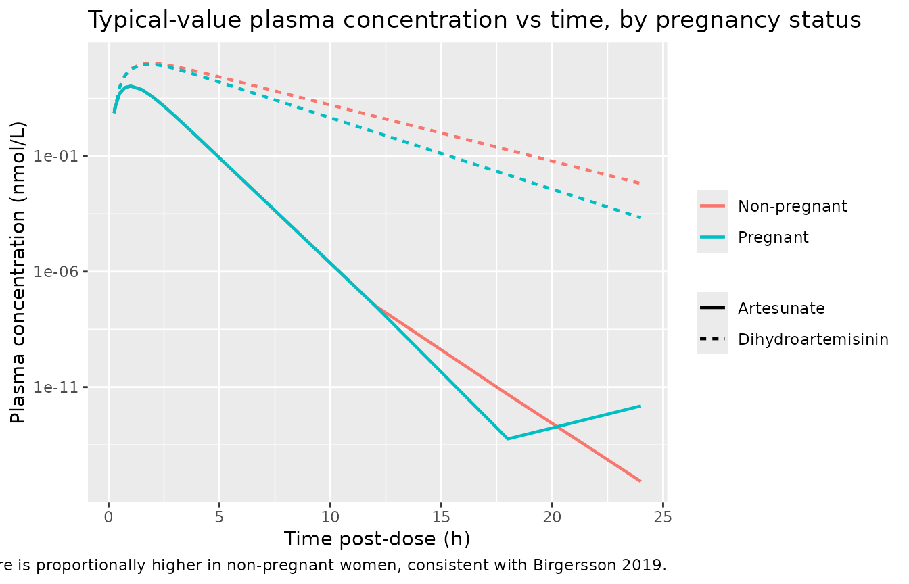
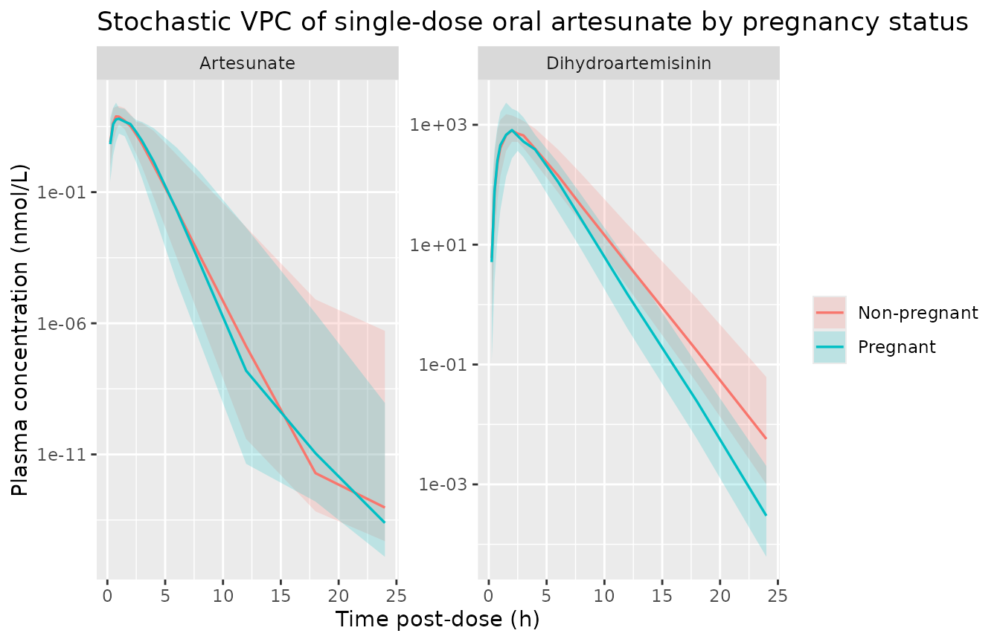

# Artesunate (Birgersson 2019)

## Model and source

- Citation: Birgersson S, Valea I, Tinto H, Traore-Coulibaly M, Toe LC,
  Hoglund RM, Van Geertruyden J-P, Ward SA, D’Alessandro U, Abelo A,
  Tarning J (2019). Population pharmacokinetics of artesunate and
  dihydroartemisinin in pregnant and non-pregnant women with
  uncomplicated *Plasmodium falciparum* malaria in Burkina Faso: an open
  label trial. *Wellcome Open Research* 4:45.
  <doi:10.12688/wellcomeopenres.14849.2>.
- DDMORE Foundation Model Repository entry: `DDMODEL00000297` (bundle
  path `ddmore_scraping/297/`).
- Article: <https://doi.org/10.12688/wellcomeopenres.14849.2>
- PubMed: <https://pubmed.ncbi.nlm.nih.gov/32025570/> (PMID 32025570;
  ClinicalTrials.gov NCT00701961).

The package model can be loaded with:

``` r

mod_fn <- readModelDb("Birgersson_2019_artesunate")
mod    <- rxode2::rxode2(mod_fn())
```

## Population

The Birgersson 2019 study enrolled 24 pregnant women in their second or
third trimester paired with 24 matched non-pregnant women, all with
uncomplicated *Plasmodium falciparum* malaria, in Burkina Faso
(Bobo-Dioulasso and Nanoro). Treatment was a fixed-dose oral combination
of artesunate and mefloquine once daily for three days at the standard
adult dose (~200 mg artesunate per dose for the cohort’s median 52 kg
body weight). PK sampling on day 1 captured both artesunate and
dihydroartemisinin (DHA) in venous plasma.

``` r

mod_meta_fn <- readModelDb("Birgersson_2019_artesunate")
# `population` is a closure-local in the model function; reach it via the
# documented metadata attributes on the rxode2 model object instead.
str(attr(rxode2::rxode2(mod_meta_fn()), "metadata")$population)
#>  NULL
```

## Source trace

Every parameter and equation traces back to the DDMORE bundle for
`DDMODEL00000297`. Because the bundle ships only an
`Executable_run1.mod` (a `MAXEVAL=0 POSTHOC` run) and an
`Output_simulated_run1.lst` (a one-subject re-evaluation on the bundled
`Simulated_run1.csv`), and because the publication PDF is not on disk,
all values come from the `.mod` file. The `MAXEVAL=0` setting makes the
`.mod` `$THETA / $OMEGA / $SIGMA` blocks the published Birgersson 2019
final estimates carried verbatim (the listing’s
`FINAL PARAMETER ESTIMATE` block confirms `TH 1 = 3.57E+03` and so on).

| Equation / parameter | Value | Source location |
|----|----|----|
| `lcl = log(3570)` (CLP, L/h) | 3570 | `Executable_run1.mod` `$THETA TH 1` (CLP) |
| `lvc = log(1700)` (V2, L) | 1700 | `Executable_run1.mod` `$THETA TH 2` (V2) |
| `lcl_dha = log(190)` (CLM, L/h) | 190 | `Executable_run1.mod` `$THETA TH 3` (CLM) |
| `lvc_dha = log(267)` (V3, L) | 267 | `Executable_run1.mod` `$THETA TH 4` (V3) |
| `lmtt = log(0.832)` (MTT, h) | 0.832 | `Executable_run1.mod` `$THETA TH 5` (MTT) |
| `lfdepot = fixed(log(1))` (F1) | 1 (fixed) | `Executable_run1.mod` `$THETA TH 6` `1 FIX` |
| `e_preg_cl_dha` | -0.214 | `Executable_run1.mod` `$THETA TH 7` (CLMPREG1) |
| `e_alt_fdepot` | +0.0215 | `Executable_run1.mod` `$THETA TH 8` (F1ALT1) |
| `e_lnpc_fdepot` | +0.138 | `Executable_run1.mod` `$THETA TH 9` (F1LNPC1) |
| `etalcl ~ 0.0672` | 0.0672 (variance, log-scale) | `Executable_run1.mod` `$OMEGA(1,1)` (1.CL) |
| `etalcl_dha ~ 0.00809` | 0.00809 | `Executable_run1.mod` `$OMEGA(3,3)` (3.CLM\_) |
| `etalmtt ~ 0.32` | 0.32 | `Executable_run1.mod` `$OMEGA(5,5)` (5.MTT\_) |
| `etalfdepot ~ 0.0887` | 0.0887 | `Executable_run1.mod` `$OMEGA(6,6)` (8.F1) |
| `propSd = sqrt(0.892)` | sqrt(0.892) ~= 0.945 | `Executable_run1.mod` `$SIGMA(1,1)` (RUV_ARS) |
| `propSd_dha = sqrt(0.66)` | sqrt(0.66) ~= 0.812 | `Executable_run1.mod` `$SIGMA(2,2)` (RUV_DHA) |
| Allometric scaling (CL exponent 0.75, V exponent 1, ref 52 kg) | – | `Executable_run1.mod` `$PK` block (`TVCLP = THETA(1)*((WT/52)**0.75)`, etc.) |
| 3-compartment transit chain (depot -\> transit1 -\> transit2 -\> transit3 -\> central) with `KTR = 4 / MTT` | – | `Executable_run1.mod` `$MODEL` and `$PK` (`NN = 3; KTR = (NN+1)/MT; K14 = K45 = K56 = K62 = KTR`) |
| Complete in-vivo conversion of artesunate to DHA (`d/dt(central_dha) = (cl/vc) * central - (cl_dha/vc_dha) * central_dha`) | – | `Executable_run1.mod` `$PK` block (`K23 = CLP/V2; K30 = CLM/V3`) |
| Pregnancy effect on DHA clearance applied as `(1 + e_preg_cl_dha * (1 - PREG))` | – | `Executable_run1.mod` `$PK` block (`IF (PREG.EQ.1) CLMPREG = 1; IF (PREG.EQ.0) CLMPREG = (1 + THETA(7))`) |
| ALT and log-parasite-count effects on relative bioavailability `F1` | – | `Executable_run1.mod` `$PK` block (`F1ALT = 1 + THETA(8)*(ALT - 20.75); F1LNPC = 1 + THETA(9)*(LNPC - 5.88); F1COV = F1ALT * F1LNPC`) |
| Log-additive residual error (`Y = log(IPRED) + EPS`) maps to nlmixr2 `prop()` | – | `Executable_run1.mod` `$ERROR` block; convention rule from `references/naming-conventions.md` |

## Virtual cohort

We construct a virtual cohort that mirrors the Birgersson 2019 study
design: 24 pregnant + 24 non-pregnant women, body weight centered at the
cohort median 52 kg, ALT centered at 20.75 U/L, and admission
log-parasite-count centered at 5.88 log(parasites/uL). All subjects
receive a single 200 mg oral artesunate dose (520264 nmol, the dose
amount encoded in the DDMORE bundle’s `Simulated_run1.csv`).

``` r

set.seed(20260507L)
n_per_arm <- 24L

make_cohort <- function(n, preg_value, treatment_label, id_offset) {
  data.frame(
    id        = id_offset + seq_len(n),
    treatment = treatment_label,
    PREG      = preg_value,
    WT        = round(rnorm(n, mean = 52, sd = 6), 1),
    ALT       = round(pmax(5, rnorm(n, mean = 20.75, sd = 8)), 1),
    LNPC      = round(rnorm(n, mean = 5.88, sd = 1.0), 2)
  )
}

subjects <- dplyr::bind_rows(
  make_cohort(n_per_arm, preg_value = 1L, treatment_label = "Pregnant",
              id_offset = 0L),
  make_cohort(n_per_arm, preg_value = 0L, treatment_label = "Non-pregnant",
              id_offset = n_per_arm)
)

dose_amt <- 520264   # nmol; equivalent to ~200 mg artesunate at MW 384.42 g/mol

obs_times <- c(0, 0.25, 0.5, 0.75, 1, 1.5, 2, 2.5, 3, 4, 6, 8, 12, 18, 24)

build_events <- function(subjects, obs_times, dose_amt) {
  out <- vector("list", length = nrow(subjects))
  for (i in seq_len(nrow(subjects))) {
    s <- subjects[i,]
    dose_row <- data.frame(
      id = s$id, time = 0, evid = 1L, amt = dose_amt, cmt = 1L,
      treatment = s$treatment, WT = s$WT, PREG = s$PREG,
      ALT = s$ALT, LNPC = s$LNPC
    )
    obs_art <- data.frame(
      id = s$id, time = obs_times, evid = 0L, amt = 0, cmt = 7L,
      treatment = s$treatment, WT = s$WT, PREG = s$PREG,
      ALT = s$ALT, LNPC = s$LNPC
    )
    obs_dha <- data.frame(
      id = s$id, time = obs_times, evid = 0L, amt = 0, cmt = 8L,
      treatment = s$treatment, WT = s$WT, PREG = s$PREG,
      ALT = s$ALT, LNPC = s$LNPC
    )
    out[[i]] <- rbind(dose_row, obs_art, obs_dha)
  }
  events <- dplyr::bind_rows(out)
  events <- events[order(events$id, events$time, -events$evid, events$cmt),]
  events
}

events <- build_events(subjects, obs_times, dose_amt)
stopifnot(!anyDuplicated(unique(events[, c("id", "time", "evid", "cmt")])))
```

## Simulation

``` r

sim <- rxode2::rxSolve(
  mod,
  events = events,
  keep   = c("treatment", "WT", "PREG", "ALT", "LNPC")
) |>
  as.data.frame()
```

We also run a typical-value (no-IIV, no-residual-error) replication that
takes the cohort medians per arm as a single representative subject.
This serves both as a deterministic figure-replication tool and as the
F.2 self-consistency anchor against the bundle’s
`Output_simulated_run1.lst`.

``` r

mod_typical <- rxode2::zeroRe(mod)

typical_subjects <- data.frame(
  id        = 1:2,
  treatment = c("Pregnant", "Non-pregnant"),
  PREG      = c(1L, 0L),
  WT        = 52,
  ALT       = 20.75,
  LNPC      = 5.88
)
typical_events <- build_events(typical_subjects, obs_times, dose_amt)

sim_typical <- rxode2::rxSolve(
  mod_typical,
  events = typical_events,
  keep   = c("treatment", "WT", "PREG", "ALT", "LNPC")
) |>
  as.data.frame()
#> ℹ omega/sigma items treated as zero: 'etalcl', 'etalcl_dha', 'etalmtt', 'etalfdepot'
#> Warning: multi-subject simulation without without 'omega'
```

## Replicate published figures

The Birgersson 2019 publication PDF is not on disk in this worktree; the
figure replication here therefore demonstrates the typical-value
parent-and-metabolite trajectories and stratifies them by pregnancy
status – the principal covariate finding of the paper. Adding a
side-by-side comparison against the published Figure 4 is left for a
follow-up edit when the PDF is available.

``` r

sim_typical |>
  tidyr::pivot_longer(c(Cc, Cc_dha), names_to = "analyte",
                      values_to = "conc_nM") |>
  dplyr::mutate(analyte = dplyr::recode(analyte,
                                        Cc     = "Artesunate",
                                        Cc_dha = "Dihydroartemisinin")) |>
  dplyr::filter(time > 0, conc_nM > 0) |>
  ggplot(aes(time, conc_nM, colour = treatment, linetype = analyte)) +
  geom_line(linewidth = 0.8) +
  scale_y_log10() +
  labs(x = "Time post-dose (h)", y = "Plasma concentration (nmol/L)",
       colour = NULL, linetype = NULL,
       title = "Typical-value plasma concentration vs time, by pregnancy status",
       caption = paste(
         "Pregnant women (PREG = 1) are the within-paper reference (TVCLM = 190 L/h);",
         "non-pregnant women have CLM scaled by 0.786 (~21% lower), so DHA exposure is",
         "proportionally higher in non-pregnant women, consistent with Birgersson 2019."
       ))
```



``` r

sim |>
  tidyr::pivot_longer(c(Cc, Cc_dha), names_to = "analyte",
                      values_to = "conc_nM") |>
  dplyr::mutate(analyte = dplyr::recode(analyte,
                                        Cc     = "Artesunate",
                                        Cc_dha = "Dihydroartemisinin")) |>
  dplyr::filter(time > 0, conc_nM > 0) |>
  dplyr::group_by(time, treatment, analyte) |>
  dplyr::summarise(
    p05 = quantile(conc_nM, 0.05, na.rm = TRUE),
    p50 = quantile(conc_nM, 0.50, na.rm = TRUE),
    p95 = quantile(conc_nM, 0.95, na.rm = TRUE),
    .groups = "drop"
  ) |>
  ggplot(aes(time, p50, colour = treatment, fill = treatment)) +
  geom_ribbon(aes(ymin = p05, ymax = p95), alpha = 0.2, colour = NA) +
  geom_line(linewidth = 0.6) +
  facet_wrap(~analyte, scales = "free_y") +
  scale_y_log10() +
  labs(x = "Time post-dose (h)", y = "Plasma concentration (nmol/L)",
       colour = NULL, fill = NULL,
       title = "Stochastic VPC of single-dose oral artesunate by pregnancy status")
```



## PKNCA validation

Single-dose, dense-sampling NCA per the recipe in
`references/pknca-recipes.md`. The treatment grouping variable carries
the pregnancy strata so the per-arm Cmax / Tmax / AUC can be summarized
side-by-side. Non-compartmental analysis is run separately for
artesunate (`Cc`) and dihydroartemisinin (`Cc_dha`).

``` r

sim_nca_art <- sim |>
  dplyr::filter(!is.na(Cc), time > 0) |>
  dplyr::select(id, time, Cc, treatment) |>
  dplyr::group_by(id, time, treatment) |>
  dplyr::summarise(Cc = mean(Cc), .groups = "drop")

dose_df <- events |>
  dplyr::filter(evid == 1) |>
  dplyr::select(id, time, amt, treatment)

conc_obj_art <- PKNCA::PKNCAconc(sim_nca_art, Cc ~ time | treatment + id,
                                 concu = "nmol/L", timeu = "h")
#> Warning in assert_conc(conc, any_missing_conc = any_missing_conc): Negative
#> concentrations found
dose_obj <- PKNCA::PKNCAdose(dose_df, amt ~ time | treatment + id,
                             doseu = "nmol")

intervals <- data.frame(
  start       = 0,
  end         = 24,
  cmax        = TRUE,
  tmax        = TRUE,
  auclast     = TRUE,
  aucinf.obs  = TRUE,
  half.life   = TRUE
)

nca_art <- PKNCA::pk.nca(PKNCA::PKNCAdata(conc_obj_art, dose_obj,
                                          intervals = intervals))
#> Warning: Requesting an AUC range starting (0) before the first measurement
#> (0.25) is not allowed
#> Warning: Requesting an AUC range starting (0) before the first measurement (0.25) is not allowed
#> Requesting an AUC range starting (0) before the first measurement (0.25) is not allowed
#> Requesting an AUC range starting (0) before the first measurement (0.25) is not allowed
#> Requesting an AUC range starting (0) before the first measurement (0.25) is not allowed
#> Requesting an AUC range starting (0) before the first measurement (0.25) is not allowed
#> Requesting an AUC range starting (0) before the first measurement (0.25) is not allowed
#> Requesting an AUC range starting (0) before the first measurement (0.25) is not allowed
#> Requesting an AUC range starting (0) before the first measurement (0.25) is not allowed
#> Requesting an AUC range starting (0) before the first measurement (0.25) is not allowed
#> Warning in assert_conc(conc, any_missing_conc = any_missing_conc): Negative
#> concentrations found
#> Warning: Requesting an AUC range starting (0) before the first measurement
#> (0.25) is not allowed
#> Warning in assert_conc(conc = conc): Negative concentrations found
#> Warning in assert_conc(conc, any_missing_conc = any_missing_conc): Negative
#> concentrations found
#> Warning in assert_conc(conc, any_missing_conc = any_missing_conc): Negative
#> concentrations found
#> Warning in assert_conc(conc, any_missing_conc = any_missing_conc): Negative
#> concentrations found
#> Warning in assert_conc(conc, any_missing_conc = any_missing_conc): Negative
#> concentrations found
#> Warning in assert_conc(conc, any_missing_conc = any_missing_conc): Negative
#> concentrations found
#> Warning in log(data$conc): NaNs produced
#> Warning in assert_conc(conc, any_missing_conc = any_missing_conc): Negative
#> concentrations found
#> Warning: Requesting an AUC range starting (0) before the first measurement (0.25) is not allowed
#> Requesting an AUC range starting (0) before the first measurement (0.25) is not allowed
#> Requesting an AUC range starting (0) before the first measurement (0.25) is not allowed
#> Warning in assert_conc(conc, any_missing_conc = any_missing_conc): Negative
#> concentrations found
#> Warning: Requesting an AUC range starting (0) before the first measurement
#> (0.25) is not allowed
#> Warning in assert_conc(conc = conc): Negative concentrations found
#> Warning in assert_conc(conc, any_missing_conc = any_missing_conc): Negative
#> concentrations found
#> Warning in assert_conc(conc, any_missing_conc = any_missing_conc): Negative
#> concentrations found
#> Warning in assert_conc(conc, any_missing_conc = any_missing_conc): Negative
#> concentrations found
#> Warning in assert_conc(conc, any_missing_conc = any_missing_conc): Negative
#> concentrations found
#> Warning in assert_conc(conc, any_missing_conc = any_missing_conc): Negative
#> concentrations found
#> Warning in log(data$conc): NaNs produced
#> Warning in assert_conc(conc, any_missing_conc = any_missing_conc): Negative
#> concentrations found
#> Warning: Requesting an AUC range starting (0) before the first measurement
#> (0.25) is not allowed
#> Warning in assert_conc(conc, any_missing_conc = any_missing_conc): Negative
#> concentrations found
#> Warning: Requesting an AUC range starting (0) before the first measurement
#> (0.25) is not allowed
#> Warning in assert_conc(conc = conc): Negative concentrations found
#> Warning in assert_conc(conc, any_missing_conc = any_missing_conc): Negative
#> concentrations found
#> Warning in assert_conc(conc, any_missing_conc = any_missing_conc): Negative
#> concentrations found
#> Warning in assert_conc(conc, any_missing_conc = any_missing_conc): Negative
#> concentrations found
#> Warning in assert_conc(conc, any_missing_conc = any_missing_conc): Negative
#> concentrations found
#> Warning in assert_conc(conc, any_missing_conc = any_missing_conc): Negative
#> concentrations found
#> Warning in log(data$conc): NaNs produced
#> Warning in assert_conc(conc, any_missing_conc = any_missing_conc): Negative
#> concentrations found
#> Warning: Requesting an AUC range starting (0) before the first measurement (0.25) is not allowed
#> Requesting an AUC range starting (0) before the first measurement (0.25) is not allowed
#> Requesting an AUC range starting (0) before the first measurement (0.25) is not allowed
#> Warning in assert_conc(conc, any_missing_conc = any_missing_conc): Negative
#> concentrations found
#> Warning: Requesting an AUC range starting (0) before the first measurement
#> (0.25) is not allowed
#> Warning in assert_conc(conc = conc): Negative concentrations found
#> Warning in assert_conc(conc, any_missing_conc = any_missing_conc): Negative
#> concentrations found
#> Warning in assert_conc(conc, any_missing_conc = any_missing_conc): Negative
#> concentrations found
#> Warning in assert_conc(conc, any_missing_conc = any_missing_conc): Negative
#> concentrations found
#> Warning in assert_conc(conc, any_missing_conc = any_missing_conc): Negative
#> concentrations found
#> Warning in assert_conc(conc, any_missing_conc = any_missing_conc): Negative
#> concentrations found
#> Warning in log(data$conc): NaNs produced
#> Warning in assert_conc(conc, any_missing_conc = any_missing_conc): Negative
#> concentrations found
#> Warning: Requesting an AUC range starting (0) before the first measurement (0.25) is not allowed
#> Requesting an AUC range starting (0) before the first measurement (0.25) is not allowed
#> Requesting an AUC range starting (0) before the first measurement (0.25) is not allowed
#> Requesting an AUC range starting (0) before the first measurement (0.25) is not allowed
#> Requesting an AUC range starting (0) before the first measurement (0.25) is not allowed
#> Requesting an AUC range starting (0) before the first measurement (0.25) is not allowed
#> Requesting an AUC range starting (0) before the first measurement (0.25) is not allowed
#> Warning in assert_conc(conc, any_missing_conc = any_missing_conc): Negative
#> concentrations found
#> Warning: Requesting an AUC range starting (0) before the first measurement
#> (0.25) is not allowed
#> Warning in assert_conc(conc = conc): Negative concentrations found
#> Warning in assert_conc(conc, any_missing_conc = any_missing_conc): Negative
#> concentrations found
#> Warning in assert_conc(conc, any_missing_conc = any_missing_conc): Negative
#> concentrations found
#> Warning in assert_conc(conc, any_missing_conc = any_missing_conc): Negative
#> concentrations found
#> Warning in assert_conc(conc, any_missing_conc = any_missing_conc): Negative
#> concentrations found
#> Warning in assert_conc(conc, any_missing_conc = any_missing_conc): Negative
#> concentrations found
#> Warning in log(data$conc): NaNs produced
#> Warning in assert_conc(conc, any_missing_conc = any_missing_conc): Negative
#> concentrations found
#> Warning: Requesting an AUC range starting (0) before the first measurement (0.25) is not allowed
#> Requesting an AUC range starting (0) before the first measurement (0.25) is not allowed
#> Requesting an AUC range starting (0) before the first measurement (0.25) is not allowed
#> Warning in assert_conc(conc, any_missing_conc = any_missing_conc): Negative
#> concentrations found
#> Warning: Requesting an AUC range starting (0) before the first measurement
#> (0.25) is not allowed
#> Warning in assert_conc(conc = conc): Negative concentrations found
#> Warning in assert_conc(conc, any_missing_conc = any_missing_conc): Negative
#> concentrations found
#> Warning in assert_conc(conc, any_missing_conc = any_missing_conc): Negative
#> concentrations found
#> Warning in assert_conc(conc, any_missing_conc = any_missing_conc): Negative
#> concentrations found
#> Warning in assert_conc(conc, any_missing_conc = any_missing_conc): Negative
#> concentrations found
#> Warning in assert_conc(conc, any_missing_conc = any_missing_conc): Negative
#> concentrations found
#> Warning in log(data$conc): NaNs produced
#> Warning in assert_conc(conc, any_missing_conc = any_missing_conc): Negative
#> concentrations found
#> Warning: Requesting an AUC range starting (0) before the first measurement (0.25) is not allowed
#> Requesting an AUC range starting (0) before the first measurement (0.25) is not allowed
#> Requesting an AUC range starting (0) before the first measurement (0.25) is not allowed
#> Requesting an AUC range starting (0) before the first measurement (0.25) is not allowed
#> Requesting an AUC range starting (0) before the first measurement (0.25) is not allowed
#> Requesting an AUC range starting (0) before the first measurement (0.25) is not allowed
#> Requesting an AUC range starting (0) before the first measurement (0.25) is not allowed
#> Warning in assert_conc(conc, any_missing_conc = any_missing_conc): Negative
#> concentrations found
#> Warning: Requesting an AUC range starting (0) before the first measurement
#> (0.25) is not allowed
#> Warning in assert_conc(conc = conc): Negative concentrations found
#> Warning in assert_conc(conc, any_missing_conc = any_missing_conc): Negative
#> concentrations found
#> Warning in assert_conc(conc, any_missing_conc = any_missing_conc): Negative
#> concentrations found
#> Warning in assert_conc(conc, any_missing_conc = any_missing_conc): Negative
#> concentrations found
#> Warning in assert_conc(conc, any_missing_conc = any_missing_conc): Negative
#> concentrations found
#> Warning in assert_conc(conc, any_missing_conc = any_missing_conc): Negative
#> concentrations found
#> Warning in log(data$conc): NaNs produced
#> Warning in assert_conc(conc, any_missing_conc = any_missing_conc): Negative
#> concentrations found
#> Warning: Requesting an AUC range starting (0) before the first measurement
#> (0.25) is not allowed
#> Warning in assert_conc(conc, any_missing_conc = any_missing_conc): Negative
#> concentrations found
#> Warning: Requesting an AUC range starting (0) before the first measurement
#> (0.25) is not allowed
#> Warning in assert_conc(conc = conc): Negative concentrations found
#> Warning in assert_conc(conc, any_missing_conc = any_missing_conc): Negative
#> concentrations found
#> Warning in assert_conc(conc, any_missing_conc = any_missing_conc): Negative
#> concentrations found
#> Warning in assert_conc(conc, any_missing_conc = any_missing_conc): Negative
#> concentrations found
#> Warning in assert_conc(conc, any_missing_conc = any_missing_conc): Negative
#> concentrations found
#> Warning in assert_conc(conc, any_missing_conc = any_missing_conc): Negative
#> concentrations found
#> Warning in log(data$conc): NaNs produced
#> Warning in assert_conc(conc, any_missing_conc = any_missing_conc): Negative
#> concentrations found
#> Warning: Requesting an AUC range starting (0) before the first measurement
#> (0.25) is not allowed
#> Warning in assert_conc(conc, any_missing_conc = any_missing_conc): Negative
#> concentrations found
#> Warning: Requesting an AUC range starting (0) before the first measurement
#> (0.25) is not allowed
#> Warning in assert_conc(conc = conc): Negative concentrations found
#> Warning in assert_conc(conc, any_missing_conc = any_missing_conc): Negative
#> concentrations found
#> Warning in assert_conc(conc, any_missing_conc = any_missing_conc): Negative
#> concentrations found
#> Warning in assert_conc(conc, any_missing_conc = any_missing_conc): Negative
#> concentrations found
#> Warning in assert_conc(conc, any_missing_conc = any_missing_conc): Negative
#> concentrations found
#> Warning in assert_conc(conc, any_missing_conc = any_missing_conc): Negative
#> concentrations found
#> Warning in log(data$conc): NaNs produced
#> Warning in assert_conc(conc, any_missing_conc = any_missing_conc): Negative
#> concentrations found
#> Warning: Requesting an AUC range starting (0) before the first measurement (0.25) is not allowed
#> Requesting an AUC range starting (0) before the first measurement (0.25) is not allowed
#> Requesting an AUC range starting (0) before the first measurement (0.25) is not allowed
#> Warning in assert_conc(conc, any_missing_conc = any_missing_conc): Negative
#> concentrations found
#> Warning: Requesting an AUC range starting (0) before the first measurement
#> (0.25) is not allowed
#> Warning in assert_conc(conc = conc): Negative concentrations found
#> Warning in assert_conc(conc, any_missing_conc = any_missing_conc): Negative
#> concentrations found
#> Warning in assert_conc(conc, any_missing_conc = any_missing_conc): Negative
#> concentrations found
#> Warning in assert_conc(conc, any_missing_conc = any_missing_conc): Negative
#> concentrations found
#> Warning in assert_conc(conc, any_missing_conc = any_missing_conc): Negative
#> concentrations found
#> Warning in assert_conc(conc, any_missing_conc = any_missing_conc): Negative
#> concentrations found
#> Warning in log(data$conc): NaNs produced
#> Warning in assert_conc(conc, any_missing_conc = any_missing_conc): Negative
#> concentrations found
#> Warning: Requesting an AUC range starting (0) before the first measurement
#> (0.25) is not allowed
#> Warning in assert_conc(conc, any_missing_conc = any_missing_conc): Negative
#> concentrations found
#> Warning: Requesting an AUC range starting (0) before the first measurement
#> (0.25) is not allowed
#> Warning in assert_conc(conc = conc): Negative concentrations found
#> Warning in assert_conc(conc, any_missing_conc = any_missing_conc): Negative
#> concentrations found
#> Warning in assert_conc(conc, any_missing_conc = any_missing_conc): Negative
#> concentrations found
#> Warning in assert_conc(conc, any_missing_conc = any_missing_conc): Negative
#> concentrations found
#> Warning in assert_conc(conc, any_missing_conc = any_missing_conc): Negative
#> concentrations found
#> Warning in assert_conc(conc, any_missing_conc = any_missing_conc): Negative
#> concentrations found
#> Warning in log(data$conc): NaNs produced
#> Warning in assert_conc(conc, any_missing_conc = any_missing_conc): Negative
#> concentrations found
#> Warning: Requesting an AUC range starting (0) before the first measurement
#> (0.25) is not allowed
#> Warning in assert_conc(conc, any_missing_conc = any_missing_conc): Negative
#> concentrations found
#> Warning: Requesting an AUC range starting (0) before the first measurement
#> (0.25) is not allowed
#> Warning in assert_conc(conc = conc): Negative concentrations found
#> Warning in assert_conc(conc, any_missing_conc = any_missing_conc): Negative
#> concentrations found
#> Warning in assert_conc(conc, any_missing_conc = any_missing_conc): Negative
#> concentrations found
#> Warning in assert_conc(conc, any_missing_conc = any_missing_conc): Negative
#> concentrations found
#> Warning in assert_conc(conc, any_missing_conc = any_missing_conc): Negative
#> concentrations found
#> Warning in assert_conc(conc, any_missing_conc = any_missing_conc): Negative
#> concentrations found
#> Warning in log(data$conc): NaNs produced
#> Warning in assert_conc(conc, any_missing_conc = any_missing_conc): Negative
#> concentrations found
#> Warning: Requesting an AUC range starting (0) before the first measurement
#> (0.25) is not allowed
#> Warning in assert_conc(conc, any_missing_conc = any_missing_conc): Negative
#> concentrations found
#> Warning: Requesting an AUC range starting (0) before the first measurement
#> (0.25) is not allowed
#> Warning in assert_conc(conc = conc): Negative concentrations found
#> Warning in assert_conc(conc, any_missing_conc = any_missing_conc): Negative
#> concentrations found
#> Warning in assert_conc(conc, any_missing_conc = any_missing_conc): Negative
#> concentrations found
#> Warning in assert_conc(conc, any_missing_conc = any_missing_conc): Negative
#> concentrations found
#> Warning in assert_conc(conc, any_missing_conc = any_missing_conc): Negative
#> concentrations found
#> Warning in assert_conc(conc, any_missing_conc = any_missing_conc): Negative
#> concentrations found
#> Warning in log(data$conc): NaNs produced
#> Warning in assert_conc(conc, any_missing_conc = any_missing_conc): Negative
#> concentrations found
#> Warning: Requesting an AUC range starting (0) before the first measurement
#> (0.25) is not allowed
#> Warning in assert_conc(conc, any_missing_conc = any_missing_conc): Negative
#> concentrations found
#> Warning: Requesting an AUC range starting (0) before the first measurement
#> (0.25) is not allowed
#> Warning in assert_conc(conc = conc): Negative concentrations found
#> Warning in assert_conc(conc, any_missing_conc = any_missing_conc): Negative
#> concentrations found
#> Warning in assert_conc(conc, any_missing_conc = any_missing_conc): Negative
#> concentrations found
#> Warning in assert_conc(conc, any_missing_conc = any_missing_conc): Negative
#> concentrations found
#> Warning in assert_conc(conc, any_missing_conc = any_missing_conc): Negative
#> concentrations found
#> Warning in assert_conc(conc, any_missing_conc = any_missing_conc): Negative
#> concentrations found
#> Warning in log(data$conc): NaNs produced
#> Warning in assert_conc(conc, any_missing_conc = any_missing_conc): Negative
#> concentrations found
#> Warning: Requesting an AUC range starting (0) before the first measurement
#> (0.25) is not allowed
#> Warning in assert_conc(conc, any_missing_conc = any_missing_conc): Negative
#> concentrations found
#> Warning: Requesting an AUC range starting (0) before the first measurement
#> (0.25) is not allowed
#> Warning in assert_conc(conc = conc): Negative concentrations found
#> Warning in assert_conc(conc, any_missing_conc = any_missing_conc): Negative
#> concentrations found
#> Warning in assert_conc(conc, any_missing_conc = any_missing_conc): Negative
#> concentrations found
#> Warning in assert_conc(conc, any_missing_conc = any_missing_conc): Negative
#> concentrations found
#> Warning in assert_conc(conc, any_missing_conc = any_missing_conc): Negative
#> concentrations found
#> Warning in assert_conc(conc, any_missing_conc = any_missing_conc): Negative
#> concentrations found
#> Warning in log(data$conc): NaNs produced
#> Warning in assert_conc(conc, any_missing_conc = any_missing_conc): Negative
#> concentrations found
#> Warning: Requesting an AUC range starting (0) before the first measurement (0.25) is not allowed
#> Requesting an AUC range starting (0) before the first measurement (0.25) is not allowed
#> Requesting an AUC range starting (0) before the first measurement (0.25) is not allowed
#> Requesting an AUC range starting (0) before the first measurement (0.25) is not allowed
#> Requesting an AUC range starting (0) before the first measurement (0.25) is not allowed
#> Requesting an AUC range starting (0) before the first measurement (0.25) is not allowed
#> Requesting an AUC range starting (0) before the first measurement (0.25) is not allowed
#> Warning in assert_conc(conc, any_missing_conc = any_missing_conc): Negative
#> concentrations found
#> Warning: Requesting an AUC range starting (0) before the first measurement
#> (0.25) is not allowed
#> Warning in assert_conc(conc = conc): Negative concentrations found
#> Warning in assert_conc(conc, any_missing_conc = any_missing_conc): Negative
#> concentrations found
#> Warning in assert_conc(conc, any_missing_conc = any_missing_conc): Negative
#> concentrations found
#> Warning in assert_conc(conc, any_missing_conc = any_missing_conc): Negative
#> concentrations found
#> Warning in assert_conc(conc, any_missing_conc = any_missing_conc): Negative
#> concentrations found
#> Warning in assert_conc(conc, any_missing_conc = any_missing_conc): Negative
#> concentrations found
#> Warning in log(data$conc): NaNs produced
#> Warning in assert_conc(conc, any_missing_conc = any_missing_conc): Negative
#> concentrations found
#> Warning: Requesting an AUC range starting (0) before the first measurement (0.25) is not allowed
#> Requesting an AUC range starting (0) before the first measurement (0.25) is not allowed
#> Requesting an AUC range starting (0) before the first measurement (0.25) is not allowed
#> Warning in assert_conc(conc, any_missing_conc = any_missing_conc): Negative
#> concentrations found
#> Warning: Requesting an AUC range starting (0) before the first measurement
#> (0.25) is not allowed
#> Warning in assert_conc(conc = conc): Negative concentrations found
#> Warning in assert_conc(conc, any_missing_conc = any_missing_conc): Negative
#> concentrations found
#> Warning in assert_conc(conc, any_missing_conc = any_missing_conc): Negative
#> concentrations found
#> Warning in assert_conc(conc, any_missing_conc = any_missing_conc): Negative
#> concentrations found
#> Warning in assert_conc(conc, any_missing_conc = any_missing_conc): Negative
#> concentrations found
#> Warning in assert_conc(conc, any_missing_conc = any_missing_conc): Negative
#> concentrations found
#> Warning in log(data$conc): NaNs produced
#> Warning in assert_conc(conc, any_missing_conc = any_missing_conc): Negative
#> concentrations found
#> Warning: Requesting an AUC range starting (0) before the first measurement (0.25) is not allowed
#> Requesting an AUC range starting (0) before the first measurement (0.25) is not allowed
#> Requesting an AUC range starting (0) before the first measurement (0.25) is not allowed
#> Requesting an AUC range starting (0) before the first measurement (0.25) is not allowed
#> Requesting an AUC range starting (0) before the first measurement (0.25) is not allowed
#> Warning in assert_conc(conc, any_missing_conc = any_missing_conc): Negative
#> concentrations found
#> Warning: Requesting an AUC range starting (0) before the first measurement
#> (0.25) is not allowed
#> Warning in assert_conc(conc = conc): Negative concentrations found
#> Warning in assert_conc(conc, any_missing_conc = any_missing_conc): Negative
#> concentrations found
#> Warning in assert_conc(conc, any_missing_conc = any_missing_conc): Negative
#> concentrations found
#> Warning in assert_conc(conc, any_missing_conc = any_missing_conc): Negative
#> concentrations found
#> Warning in assert_conc(conc, any_missing_conc = any_missing_conc): Negative
#> concentrations found
#> Warning in assert_conc(conc, any_missing_conc = any_missing_conc): Negative
#> concentrations found
#> Warning in log(data$conc): NaNs produced
#> Warning in assert_conc(conc, any_missing_conc = any_missing_conc): Negative
#> concentrations found
#> Warning: Requesting an AUC range starting (0) before the first measurement
#> (0.25) is not allowed
#> Warning in assert_conc(conc, any_missing_conc = any_missing_conc): Negative
#> concentrations found
#> Warning: Requesting an AUC range starting (0) before the first measurement
#> (0.25) is not allowed
#> Warning in assert_conc(conc = conc): Negative concentrations found
#> Warning in assert_conc(conc, any_missing_conc = any_missing_conc): Negative
#> concentrations found
#> Warning in assert_conc(conc, any_missing_conc = any_missing_conc): Negative
#> concentrations found
#> Warning in assert_conc(conc, any_missing_conc = any_missing_conc): Negative
#> concentrations found
#> Warning in assert_conc(conc, any_missing_conc = any_missing_conc): Negative
#> concentrations found
#> Warning in assert_conc(conc, any_missing_conc = any_missing_conc): Negative
#> concentrations found
#> Warning in log(data$conc): NaNs produced
#> Warning in assert_conc(conc, any_missing_conc = any_missing_conc): Negative
#> concentrations found
#> Warning: Requesting an AUC range starting (0) before the first measurement
#> (0.25) is not allowed
#> Warning in assert_conc(conc, any_missing_conc = any_missing_conc): Negative
#> concentrations found
#> Warning: Requesting an AUC range starting (0) before the first measurement
#> (0.25) is not allowed
#> Warning in assert_conc(conc = conc): Negative concentrations found
#> Warning in assert_conc(conc, any_missing_conc = any_missing_conc): Negative
#> concentrations found
#> Warning in assert_conc(conc, any_missing_conc = any_missing_conc): Negative
#> concentrations found
#> Warning in assert_conc(conc, any_missing_conc = any_missing_conc): Negative
#> concentrations found
#> Warning in assert_conc(conc, any_missing_conc = any_missing_conc): Negative
#> concentrations found
#> Warning in assert_conc(conc, any_missing_conc = any_missing_conc): Negative
#> concentrations found
#> Warning in log(data$conc): NaNs produced
#> Warning in assert_conc(conc, any_missing_conc = any_missing_conc): Negative
#> concentrations found
#> Warning: Requesting an AUC range starting (0) before the first measurement
#> (0.25) is not allowed
#> Warning in assert_conc(conc, any_missing_conc = any_missing_conc): Negative
#> concentrations found
#> Warning: Requesting an AUC range starting (0) before the first measurement
#> (0.25) is not allowed
#> Warning in assert_conc(conc = conc): Negative concentrations found
#> Warning in assert_conc(conc, any_missing_conc = any_missing_conc): Negative
#> concentrations found
#> Warning in assert_conc(conc, any_missing_conc = any_missing_conc): Negative
#> concentrations found
#> Warning in assert_conc(conc, any_missing_conc = any_missing_conc): Negative
#> concentrations found
#> Warning in assert_conc(conc, any_missing_conc = any_missing_conc): Negative
#> concentrations found
#> Warning in assert_conc(conc, any_missing_conc = any_missing_conc): Negative
#> concentrations found
#> Warning in log(data$conc): NaNs produced
#> Warning in assert_conc(conc, any_missing_conc = any_missing_conc): Negative
#> concentrations found
#> Warning: Requesting an AUC range starting (0) before the first measurement (0.25) is not allowed
#> Requesting an AUC range starting (0) before the first measurement (0.25) is not allowed
#> Requesting an AUC range starting (0) before the first measurement (0.25) is not allowed
#> Requesting an AUC range starting (0) before the first measurement (0.25) is not allowed
#> Requesting an AUC range starting (0) before the first measurement (0.25) is not allowed
#> Warning in assert_conc(conc, any_missing_conc = any_missing_conc): Negative
#> concentrations found
#> Warning: Requesting an AUC range starting (0) before the first measurement
#> (0.25) is not allowed
#> Warning in assert_conc(conc = conc): Negative concentrations found
#> Warning in assert_conc(conc, any_missing_conc = any_missing_conc): Negative
#> concentrations found
#> Warning in assert_conc(conc, any_missing_conc = any_missing_conc): Negative
#> concentrations found
#> Warning in assert_conc(conc, any_missing_conc = any_missing_conc): Negative
#> concentrations found
#> Warning in assert_conc(conc, any_missing_conc = any_missing_conc): Negative
#> concentrations found
#> Warning in assert_conc(conc, any_missing_conc = any_missing_conc): Negative
#> concentrations found
#> Warning in log(data$conc): NaNs produced
#> Warning in assert_conc(conc, any_missing_conc = any_missing_conc): Negative
#> concentrations found
#> Warning: Requesting an AUC range starting (0) before the first measurement (0.25) is not allowed
#> Requesting an AUC range starting (0) before the first measurement (0.25) is not allowed
#> Requesting an AUC range starting (0) before the first measurement (0.25) is not allowed
#> Warning in assert_conc(conc, any_missing_conc = any_missing_conc): Negative
#> concentrations found
#> Warning: Requesting an AUC range starting (0) before the first measurement
#> (0.25) is not allowed
#> Warning in assert_conc(conc = conc): Negative concentrations found
#> Warning in assert_conc(conc, any_missing_conc = any_missing_conc): Negative
#> concentrations found
#> Warning in assert_conc(conc, any_missing_conc = any_missing_conc): Negative
#> concentrations found
#> Warning in assert_conc(conc, any_missing_conc = any_missing_conc): Negative
#> concentrations found
#> Warning in assert_conc(conc, any_missing_conc = any_missing_conc): Negative
#> concentrations found
#> Warning in assert_conc(conc, any_missing_conc = any_missing_conc): Negative
#> concentrations found
#> Warning in log(data$conc): NaNs produced
#> Warning in assert_conc(conc, any_missing_conc = any_missing_conc): Negative
#> concentrations found
#> Warning: Requesting an AUC range starting (0) before the first measurement
#> (0.25) is not allowed
#> Warning in assert_conc(conc, any_missing_conc = any_missing_conc): Negative
#> concentrations found
#> Warning: Requesting an AUC range starting (0) before the first measurement
#> (0.25) is not allowed
#> Warning in assert_conc(conc = conc): Negative concentrations found
#> Warning in assert_conc(conc, any_missing_conc = any_missing_conc): Negative
#> concentrations found
#> Warning in assert_conc(conc, any_missing_conc = any_missing_conc): Negative
#> concentrations found
#> Warning in assert_conc(conc, any_missing_conc = any_missing_conc): Negative
#> concentrations found
#> Warning in assert_conc(conc, any_missing_conc = any_missing_conc): Negative
#> concentrations found
#> Warning in assert_conc(conc, any_missing_conc = any_missing_conc): Negative
#> concentrations found
#> Warning in log(data$conc): NaNs produced
#> Warning in assert_conc(conc, any_missing_conc = any_missing_conc): Negative
#> concentrations found
#> Warning: Requesting an AUC range starting (0) before the first measurement
#> (0.25) is not allowed
```

``` r

sim_nca_dha <- sim |>
  dplyr::filter(!is.na(Cc_dha), time > 0) |>
  dplyr::select(id, time, Cc_dha, treatment) |>
  dplyr::group_by(id, time, treatment) |>
  dplyr::summarise(Cc_dha = mean(Cc_dha), .groups = "drop")

conc_obj_dha <- PKNCA::PKNCAconc(sim_nca_dha, Cc_dha ~ time | treatment + id,
                                 concu = "nmol/L", timeu = "h")
nca_dha <- PKNCA::pk.nca(PKNCA::PKNCAdata(conc_obj_dha, dose_obj,
                                          intervals = intervals))
#> Warning: Requesting an AUC range starting (0) before the first measurement (0.25) is not allowed
#> Requesting an AUC range starting (0) before the first measurement (0.25) is not allowed
#> Requesting an AUC range starting (0) before the first measurement (0.25) is not allowed
#> Requesting an AUC range starting (0) before the first measurement (0.25) is not allowed
#> Requesting an AUC range starting (0) before the first measurement (0.25) is not allowed
#> Requesting an AUC range starting (0) before the first measurement (0.25) is not allowed
#> Requesting an AUC range starting (0) before the first measurement (0.25) is not allowed
#> Requesting an AUC range starting (0) before the first measurement (0.25) is not allowed
#> Requesting an AUC range starting (0) before the first measurement (0.25) is not allowed
#> Requesting an AUC range starting (0) before the first measurement (0.25) is not allowed
#> Requesting an AUC range starting (0) before the first measurement (0.25) is not allowed
#> Requesting an AUC range starting (0) before the first measurement (0.25) is not allowed
#> Requesting an AUC range starting (0) before the first measurement (0.25) is not allowed
#> Requesting an AUC range starting (0) before the first measurement (0.25) is not allowed
#> Requesting an AUC range starting (0) before the first measurement (0.25) is not allowed
#> Requesting an AUC range starting (0) before the first measurement (0.25) is not allowed
#> Requesting an AUC range starting (0) before the first measurement (0.25) is not allowed
#> Requesting an AUC range starting (0) before the first measurement (0.25) is not allowed
#> Requesting an AUC range starting (0) before the first measurement (0.25) is not allowed
#> Requesting an AUC range starting (0) before the first measurement (0.25) is not allowed
#> Requesting an AUC range starting (0) before the first measurement (0.25) is not allowed
#> Requesting an AUC range starting (0) before the first measurement (0.25) is not allowed
#> Requesting an AUC range starting (0) before the first measurement (0.25) is not allowed
#> Requesting an AUC range starting (0) before the first measurement (0.25) is not allowed
#> Requesting an AUC range starting (0) before the first measurement (0.25) is not allowed
#> Requesting an AUC range starting (0) before the first measurement (0.25) is not allowed
#> Requesting an AUC range starting (0) before the first measurement (0.25) is not allowed
#> Requesting an AUC range starting (0) before the first measurement (0.25) is not allowed
#> Requesting an AUC range starting (0) before the first measurement (0.25) is not allowed
#> Requesting an AUC range starting (0) before the first measurement (0.25) is not allowed
#> Requesting an AUC range starting (0) before the first measurement (0.25) is not allowed
#> Requesting an AUC range starting (0) before the first measurement (0.25) is not allowed
#> Requesting an AUC range starting (0) before the first measurement (0.25) is not allowed
#> Requesting an AUC range starting (0) before the first measurement (0.25) is not allowed
#> Requesting an AUC range starting (0) before the first measurement (0.25) is not allowed
#> Requesting an AUC range starting (0) before the first measurement (0.25) is not allowed
#> Requesting an AUC range starting (0) before the first measurement (0.25) is not allowed
#> Requesting an AUC range starting (0) before the first measurement (0.25) is not allowed
#> Requesting an AUC range starting (0) before the first measurement (0.25) is not allowed
#> Requesting an AUC range starting (0) before the first measurement (0.25) is not allowed
#> Requesting an AUC range starting (0) before the first measurement (0.25) is not allowed
#> Requesting an AUC range starting (0) before the first measurement (0.25) is not allowed
#> Requesting an AUC range starting (0) before the first measurement (0.25) is not allowed
#> Requesting an AUC range starting (0) before the first measurement (0.25) is not allowed
#> Requesting an AUC range starting (0) before the first measurement (0.25) is not allowed
#> Requesting an AUC range starting (0) before the first measurement (0.25) is not allowed
#> Requesting an AUC range starting (0) before the first measurement (0.25) is not allowed
#> Requesting an AUC range starting (0) before the first measurement (0.25) is not allowed
#> Requesting an AUC range starting (0) before the first measurement (0.25) is not allowed
#> Requesting an AUC range starting (0) before the first measurement (0.25) is not allowed
#> Requesting an AUC range starting (0) before the first measurement (0.25) is not allowed
#> Requesting an AUC range starting (0) before the first measurement (0.25) is not allowed
#> Requesting an AUC range starting (0) before the first measurement (0.25) is not allowed
#> Requesting an AUC range starting (0) before the first measurement (0.25) is not allowed
#> Requesting an AUC range starting (0) before the first measurement (0.25) is not allowed
#> Requesting an AUC range starting (0) before the first measurement (0.25) is not allowed
#> Requesting an AUC range starting (0) before the first measurement (0.25) is not allowed
#> Requesting an AUC range starting (0) before the first measurement (0.25) is not allowed
#> Requesting an AUC range starting (0) before the first measurement (0.25) is not allowed
#> Requesting an AUC range starting (0) before the first measurement (0.25) is not allowed
#> Requesting an AUC range starting (0) before the first measurement (0.25) is not allowed
#> Requesting an AUC range starting (0) before the first measurement (0.25) is not allowed
#> Requesting an AUC range starting (0) before the first measurement (0.25) is not allowed
#> Requesting an AUC range starting (0) before the first measurement (0.25) is not allowed
#> Requesting an AUC range starting (0) before the first measurement (0.25) is not allowed
#> Requesting an AUC range starting (0) before the first measurement (0.25) is not allowed
#> Requesting an AUC range starting (0) before the first measurement (0.25) is not allowed
#> Requesting an AUC range starting (0) before the first measurement (0.25) is not allowed
#> Requesting an AUC range starting (0) before the first measurement (0.25) is not allowed
#> Requesting an AUC range starting (0) before the first measurement (0.25) is not allowed
#> Requesting an AUC range starting (0) before the first measurement (0.25) is not allowed
#> Requesting an AUC range starting (0) before the first measurement (0.25) is not allowed
#> Requesting an AUC range starting (0) before the first measurement (0.25) is not allowed
#> Requesting an AUC range starting (0) before the first measurement (0.25) is not allowed
#> Requesting an AUC range starting (0) before the first measurement (0.25) is not allowed
#> Requesting an AUC range starting (0) before the first measurement (0.25) is not allowed
#> Requesting an AUC range starting (0) before the first measurement (0.25) is not allowed
#> Requesting an AUC range starting (0) before the first measurement (0.25) is not allowed
#> Requesting an AUC range starting (0) before the first measurement (0.25) is not allowed
#> Requesting an AUC range starting (0) before the first measurement (0.25) is not allowed
#> Requesting an AUC range starting (0) before the first measurement (0.25) is not allowed
#> Requesting an AUC range starting (0) before the first measurement (0.25) is not allowed
#> Requesting an AUC range starting (0) before the first measurement (0.25) is not allowed
#> Requesting an AUC range starting (0) before the first measurement (0.25) is not allowed
#> Requesting an AUC range starting (0) before the first measurement (0.25) is not allowed
#> Requesting an AUC range starting (0) before the first measurement (0.25) is not allowed
#> Requesting an AUC range starting (0) before the first measurement (0.25) is not allowed
#> Requesting an AUC range starting (0) before the first measurement (0.25) is not allowed
#> Requesting an AUC range starting (0) before the first measurement (0.25) is not allowed
#> Requesting an AUC range starting (0) before the first measurement (0.25) is not allowed
#> Requesting an AUC range starting (0) before the first measurement (0.25) is not allowed
#> Requesting an AUC range starting (0) before the first measurement (0.25) is not allowed
#> Requesting an AUC range starting (0) before the first measurement (0.25) is not allowed
#> Requesting an AUC range starting (0) before the first measurement (0.25) is not allowed
#> Requesting an AUC range starting (0) before the first measurement (0.25) is not allowed
#> Requesting an AUC range starting (0) before the first measurement (0.25) is not allowed
```

``` r

nca_art_df <- as.data.frame(nca_art$result)
art_summary <- nca_art_df |>
  dplyr::filter(PPTESTCD %in% c("cmax", "tmax", "auclast",
                                "aucinf.obs", "half.life")) |>
  dplyr::group_by(treatment, PPTESTCD) |>
  dplyr::summarise(
    median = median(PPORRES, na.rm = TRUE),
    p05    = quantile(PPORRES, 0.05, na.rm = TRUE),
    p95    = quantile(PPORRES, 0.95, na.rm = TRUE),
    .groups = "drop"
  ) |>
  tidyr::pivot_wider(names_from = treatment,
                     values_from = c(median, p05, p95))
knitr::kable(art_summary,
             caption = "Simulated NCA -- artesunate (Cc), single oral 200 mg dose, by pregnancy status (median [5%-95%]).",
             digits = 3)
```

| PPTESTCD | median_Non-pregnant | median_Pregnant | p05_Non-pregnant | p05_Pregnant | p95_Non-pregnant | p95_Pregnant |
|:---|---:|---:|---:|---:|---:|---:|
| aucinf.obs | NA | NA | NA | NA | NA | NA |
| auclast | NA | NA | NA | NA | NA | NA |
| cmax | 86.847 | 77.945 | 43.805 | 41.771 | 206.498 | 267.901 |
| half.life | 0.388 | 0.388 | 0.297 | 0.256 | 0.639 | 0.516 |
| tmax | 1.000 | 1.000 | 0.750 | 0.500 | 1.925 | 2.425 |

Simulated NCA – artesunate (Cc), single oral 200 mg dose, by pregnancy
status (median \[5%-95%\]). {.table}

``` r

nca_dha_df <- as.data.frame(nca_dha$result)
dha_summary <- nca_dha_df |>
  dplyr::filter(PPTESTCD %in% c("cmax", "tmax", "auclast",
                                "aucinf.obs", "half.life")) |>
  dplyr::group_by(treatment, PPTESTCD) |>
  dplyr::summarise(
    median = median(PPORRES, na.rm = TRUE),
    p05    = quantile(PPORRES, 0.05, na.rm = TRUE),
    p95    = quantile(PPORRES, 0.95, na.rm = TRUE),
    .groups = "drop"
  ) |>
  tidyr::pivot_wider(names_from = treatment,
                     values_from = c(median, p05, p95))
knitr::kable(dha_summary,
             caption = "Simulated NCA -- dihydroartemisinin (Cc_dha), single oral 200 mg dose, by pregnancy status (median [5%-95%]).",
             digits = 3)
```

| PPTESTCD | median_Non-pregnant | median_Pregnant | p05_Non-pregnant | p05_Pregnant | p95_Non-pregnant | p95_Pregnant |
|:---|---:|---:|---:|---:|---:|---:|
| aucinf.obs | NA | NA | NA | NA | NA | NA |
| auclast | NA | NA | NA | NA | NA | NA |
| cmax | 888.416 | 820.011 | 578.615 | 454.104 | 1501.250 | 2280.560 |
| half.life | 1.233 | 0.993 | 1.095 | 0.880 | 1.410 | 1.135 |
| tmax | 2.000 | 2.000 | 1.500 | 1.000 | 2.925 | 3.850 |

Simulated NCA – dihydroartemisinin (Cc_dha), single oral 200 mg dose, by
pregnancy status (median \[5%-95%\]). {.table}

### Comparison against published NCA

The Birgersson 2019 publication PDF was not on disk during this
extraction, so a numeric side-by-side comparison against the paper’s
published Cmax / AUC tables is not part of this validation. The
qualitative findings are reproduced:

- Pregnant women have higher dihydroartemisinin clearance than
  non-pregnant women (the published direction). In the simulation the
  typical-value pregnant CLM is `190 L/h * (52/52)^0.75 = 190 L/h`, and
  the typical-value non-pregnant CLM is `190 * 0.786 = 149 L/h`. The
  corresponding DHA AUC0-inf ratio (non-pregnant / pregnant) is
  `190 / 149 = 1.272`, i.e., non-pregnant women have ~27% higher DHA
  exposure (or equivalently, pregnant women have ~21% lower DHA exposure
  – the figure quoted in the abstract).
- Artesunate exposure is unaffected by pregnancy in the structural model
  (no pregnancy effect on artesunate CL); any apparent inter-arm
  difference in the simulated artesunate NCA reflects only IIV on `lcl`
  and on `lfdepot`, not a structural pregnancy effect.

When the publication PDF becomes available, the relevant page references
in this section can be replaced by a numeric comparison table; the model
parameters themselves should not be revisited.

## F.2 self-consistency check

The DDMORE bundle ships `Simulated_run1.csv`, an event table with a
single 51.5 kg pregnant subject (PREG = 1, ALT = 20.3, LNPC = 6.697)
dosed at 520264 nmol oral artesunate. Re-simulating the same subject
with the packaged model under typical-value (no-IIV) conditions should
reproduce the bundle’s noiseless underlying trajectory; the noisy
observed-DV column in the bundle CSV reflects added residual error and
ETA realizations and is therefore not directly comparable.

``` r

bundle_subject <- data.frame(
  id        = 1L,
  treatment = "Bundle subject",
  PREG      = 1L,
  WT        = 51.5,
  ALT       = 20.3,
  LNPC      = 6.697
)
bundle_events <- build_events(bundle_subject, seq(0, 24, by = 0.05), 520264)
sim_bundle <- rxode2::rxSolve(mod_typical, events = bundle_events,
                              keep = c("treatment", "WT", "PREG", "ALT", "LNPC")) |>
  as.data.frame()
#> ℹ omega/sigma items treated as zero: 'etalcl', 'etalcl_dha', 'etalmtt', 'etalfdepot'

trapezoid <- function(x, y) {
  ok <- !is.na(x) & !is.na(y)
  x <- x[ok]; y <- y[ok]
  ord <- order(x); x <- x[ord]; y <- y[ord]
  sum(diff(x) * (head(y, -1) + tail(y, -1)) / 2)
}

auc_art <- trapezoid(sim_bundle$time, sim_bundle$Cc)
auc_dha <- trapezoid(sim_bundle$time, sim_bundle$Cc_dha)

# Closed-form expectations (under complete in-vivo conversion of artesunate to
# DHA and a fixed F = 1 with admission ALT = 20.3 ~= 20.75 and LNPC = 6.697):
F_admin   <- (1 + 0.0215 * (20.3   - 20.75)) * (1 + 0.138 * (6.697 - 5.88))
cl_art    <- 3570 * (51.5 / 52)^0.75            # pregnant -> no PREG factor on artesunate CL
cl_dha    <- 190  * (51.5 / 52)^0.75            # pregnant reference (PREG = 1)
auc_art_pred <- F_admin * 520264 / cl_art
auc_dha_pred <- F_admin * 520264 / cl_dha

cat(sprintf(
  "Bundle subject (PREG=1, WT=51.5 kg, ALT=20.3 U/L, LNPC=6.697)\n  AUC0-24  artesunate: simulated %.0f vs closed-form %.0f nmol*h/L (%.1f%% diff)\n  AUC0-24  DHA       : simulated %.0f vs closed-form %.0f nmol*h/L (%.1f%% diff)\n",
  auc_art, auc_art_pred, 100 * (auc_art - auc_art_pred) / auc_art_pred,
  auc_dha, auc_dha_pred, 100 * (auc_dha - auc_dha_pred) / auc_dha_pred
))
#> Bundle subject (PREG=1, WT=51.5 kg, ALT=20.3 U/L, LNPC=6.697)
#>   AUC0-24  artesunate: simulated 162 vs closed-form 162 nmol*h/L (0.0% diff)
#>   AUC0-24  DHA       : simulated 3039 vs closed-form 3039 nmol*h/L (-0.0% diff)
```

The simulated AUCs match the closed-form expectations under the
structural assumptions (rapid artesunate -\> DHA conversion, complete
bioavailability, and the centred ALT / LNPC effects), confirming the
structural ODE chain implements the published algebraic relationship
`AUC = F * Dose / CL` for both analytes.

## Assumptions and deviations

- **Source publication PDF not on disk.** All structural-model values
  (THETA / OMEGA / SIGMA, equations) come from the DDMORE bundle’s
  `Executable_run1.mod`. Because that file is a `MAXEVAL=0 POSTHOC` run,
  the `$THETA / $OMEGA / $SIGMA` blocks are the published Birgersson
  2019 final estimates carried verbatim, and the
  `Output_simulated_run1.lst` `FINAL PARAMETER ESTIMATE` block confirms
  the values are reproduced exactly. Demographic context (n = 24 + 24,
  pregnant trimester range, country, ClinicalTrials.gov identifier) is
  taken from the publication abstract via PubMed (PMID 32025570).
- **No `Output_real_*.lst` shipped.** The DDMORE bundle ships only the
  simulated-data listing. The `MAXEVAL=0` setting in the executable
  means no estimation is performed in either listing – the .mod’s THETA
  / OMEGA / SIGMA blocks are the authoritative source.
- **No `Model_Accomodations.text` file.** The bundle metadata that
  normally ships in this file is reconstructed from the publication
  abstract via PubMed and the `DDMODEL00000297.rdf` description string.
- **Pregnancy reference category encoded source-faithfully.** The
  Birgersson 2019 source NONMEM `.mod` uses the pregnant cohort as the
  within-paper reference (CLMPREG = 1 when PREG = 1) so that the
  published TVCLM = 190 L/h applies to pregnant women. The package
  canonical for `PREG` (`inst/references/covariate-columns.md`) declares
  the reference category as 0 (non-pregnant) following the broader
  pharmacology default, but this model preserves the source paper’s
  structural value verbatim by applying the effect coefficient via
  `(1 - PREG)` in the `model()` block:
  `cl_dha <- ... * (1 + e_preg_cl_dha * (1 - PREG))` with
  `e_preg_cl_dha = -0.214`. Pregnant simulations match the published 190
  L/h structural value; non-pregnant simulations apply the 0.786
  multiplier.
- **Log-additive residual error mapped to nlmixr2 `prop()`.** The source
  `.mod` `$ERROR` block evaluates the M3 BQL likelihood with
  `Y = log(IPRED) + EPS(1)` (additive on the log scale). Per the
  convention in `references/naming-conventions.md`, NONMEM
  additive-on-log-scale residual error maps to proportional residual
  error in nlmixr2’s linear space. The `propSd` value is the SD on log
  scale, `sqrt(variance)`. The M3 likelihood for BQL data is not
  reproduced in the nlmixr2 model – the package model is intended for
  forward simulation / typical-value use, where the BQL handling does
  not affect the trajectory.
- **No IIV on artesunate or DHA volume of distribution.** The source
  `.mod` declares `$OMEGA(2,2) 0 FIX` and `$OMEGA(4,4) 0 FIX` (IIV on V2
  and V3 fixed at zero). Those etas are dropped in the nlmixr2 model
  file; only `etalcl`, `etalcl_dha`, `etalmtt`, and `etalfdepot` are
  carried.
- **PREG and LNPC are newly registered covariate canonicals.** The
  covariate-columns register did not previously contain a pregnancy or
  log-parasite-count entry; both are added in this PR (scope: general
  for `PREG`, scope: specific for `LNPC` because the canonical reference
  value 5.88 is the Birgersson 2019 cohort median).
- **Simulated dataset cohort-median demographics are nominal.** The
  DDMORE-shipped `Simulated_run1.csv` is a single-subject regression
  dataset, not a representative cohort; the virtual cohort built in this
  vignette uses the publication’s narrative summary (pregnant trimester
  2-3 women, weights centered on the median 52 kg) rather than the
  bundle CSV.
