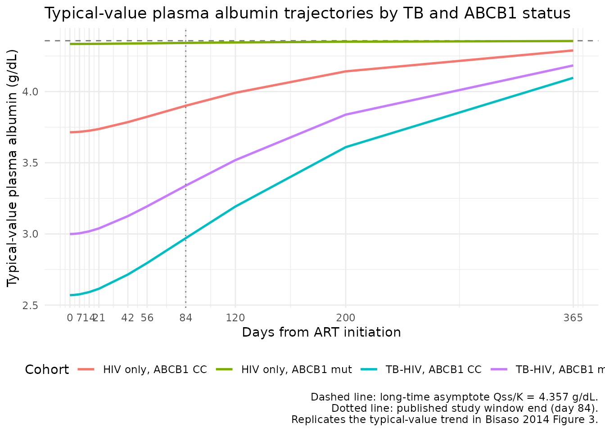
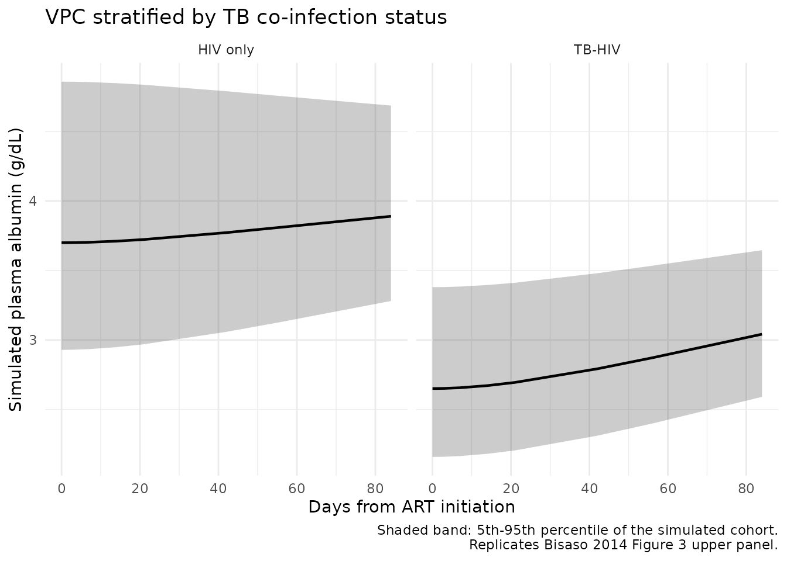
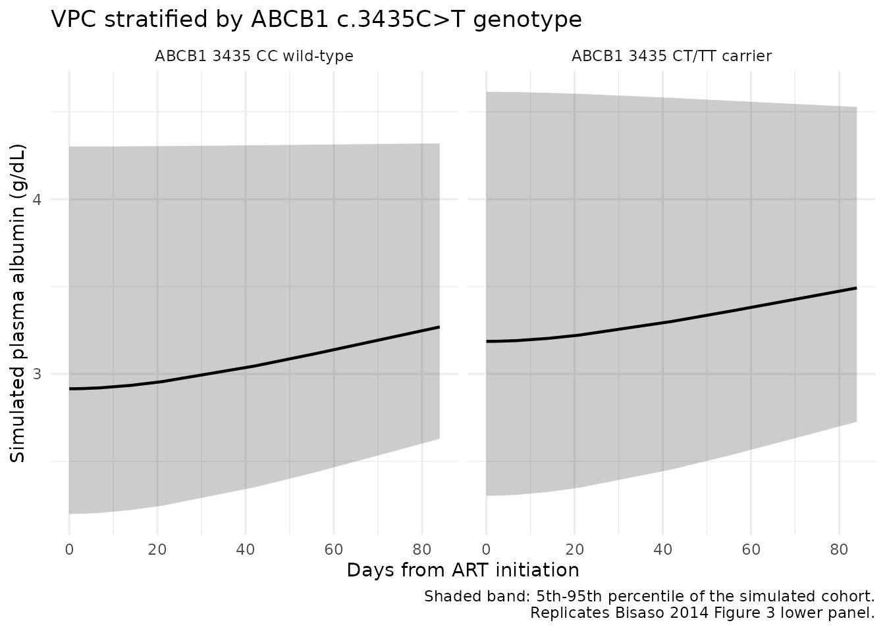

# Albumin disease progression (Bisaso 2014)

## Model and source

- Citation: Bisaso KR, Owen JS, Ojara FW, Namuwenge PM, Mugisha A,
  Mbuagbaw L, Luboobi LS, Mukonzo JK. Characterizing plasma albumin
  concentration changes in TB/HIV patients on anti retroviral and
  anti-tuberculosis therapy. *In Silico Pharmacology* 2014;2:3.
- Article: <https://doi.org/10.1186/s40203-014-0003-9> (open access;
  Springer / BioMed Central)

Bisaso 2014 develops a semi-mechanistic disease-progression model for
plasma albumin concentration in 262 ART-naive HIV-positive Ugandan
adults (158 also co-infected with active TB and on rifampicin-based
anti-TB therapy) sampled over the first 12 weeks after initiating
efavirenz-based combination ART. The model couples two biological
assumptions:

- The hepatocyte population follows the Verhulst self-limiting logistic
  equation, transitioning from a baseline size to a stable
  post-treatment steady-state size at a rate `r` modulated by drug
  efficacy (`f_drug`);
- Because plasma drug concentrations were not available in this cohort,
  `r` and `f_drug` are lumped into a single rate constant `R`, and the
  albumin secretion rate `Q(t)` (= per-hepatocyte secretion rate times
  hepatocyte count) inherits the same logistic structure:

``` math
Q(t) = \frac{Q_0\, Q_{ss}}{Q_0 + (Q_{ss} - Q_0)\, e^{-R\, t}} \quad \text{(Bisaso 2014 Eq. 5)}
```

- Plasma albumin (`X`) is modelled as an indirect-response compartment
  with zero-order production at rate `Q(t)` and first-order elimination
  at a fixed literature rate `K`:

``` math
\frac{dX}{dt} = Q(t) - K\, X, \qquad X(0) = \frac{Q_0}{K} \quad \text{(Bisaso 2014 Eq. 6, Eq. 7)}
```

The covariates retained in the final model are TB co-infection status
(reduces `Q0`) and ABCB1 c.3435C\>T mutation carriage (increases `Q0`).
Inter-individual variability is retained on `Q0` only; IIVs on `Qss` and
`R` were dropped from the final model because of high shrinkage (\> 40%)
and very low variance (\< 1e-6). The residual-error structure is
proportional.

The nlmixr2lib encoding is in
`inst/modeldb/endogenous/Bisaso_2014_albumin.R`. The packaged model uses
the canonical-register reference categories (`TB_POS = 0` = HIV
monoinfection, `SNP_ABCB1_RS1045642 = 0` = c.3435CC wild-type) so that
the typical-value `Q0` at the reference is the paper’s
`Q0 (HIV only) = 0.1248 g/dL/day`; this is a pure re-anchoring of the
reference subgroup and does not change the model behaviour.

## Population

Bisaso 2014 enrolled 262 HIV-positive Ugandan adults at Mulago National
Referral Hospital, Kampala, into a secondary analysis nested in the
Mukonzo (2011) PhD project. Of the full cohort, 158 (60.3%) were
co-infected with active TB and on rifampicin-based anti-TB therapy
(ethambutol / isoniazid / rifampicin / pyrazinamide for 2 months
induction, then isoniazid + rifampicin for 4 months maintenance,
initiated at least 2 weeks before ART). All subjects started combination
ART comprising efavirenz, lamivudine, and zidovudine on day 0. Baseline
median characteristics (Bisaso 2014 Table 1, full cohort) were: age 33
years (IQR 29-39), weight 51 kg (IQR 47-58), 52.9% female, CD4 count 97
cells/mL (IQR 40-179), serum albumin 3.02 g/dL (IQR 2.35-3.85). The
TB-HIV subgroup had lower baseline albumin (2.57 g/dL) than the HIV-only
subgroup (3.91 g/dL). ABCB1 c.3435C\>T genotype counts were CC = 205, CT
= 56, TT = 1.

Serum albumin was sampled on days 1, 3, 7, 14, 21, 42, 56, and 84 after
ART initiation by the Abbott Aeroset Bromocresol Green method. The mean
number of observations per subject was 3 (sparse).

Per Bisaso 2014 Methods “Model evaluation,” the data were randomly split
into a model-development subset of approximately two-thirds (n = 174)
and a validation subset (n = 88, 269 observations). The packaged model’s
parameter values are from Table 3 (development subset, original-dataset
column). The same baseline demographics are available programmatically
via the model metadata (`readModelDb("Bisaso_2014_albumin")` and inspect
the function body;
[`nlmixr2lib::modellib()`](https://nlmixr2.github.io/nlmixr2lib/reference/modellib.md)
lists the model in the catalog).

## Source trace

| Equation / parameter | Value | Source location |
|----|----|----|
| Eq. 2 (hepatocyte Verhulst dN/dt) | n/a (structural) | Bisaso 2014 Methods “Model development” (not encoded; collapsed into `Q(t)` via Eq. 4) |
| Eq. 4 (combined R = r \* f_drug) | n/a (definition) | Bisaso 2014 Methods “Model development” |
| Eq. 5 (Q(t) logistic transition) | n/a (structural) | Bisaso 2014 Methods “Model development”; analytical solution of `dQ/dt = R Q (1 - Q/Qss)` |
| Eq. 6 (dX/dt = Q(t) - K X) | n/a (structural) | Bisaso 2014 Methods “Model development” |
| Eq. 7 / 8 (X(0) = Q0 / K) | n/a (definition) | Bisaso 2014 Methods “Model development” |
| `lq0` -\> `Q0` (HIV-only ref) | 0.1248 g/dL/day | Bisaso 2014 Table 3 row ‘Q 0 (HIV only)’ |
| `e_tb_pos_q0` | -0.308 | Bisaso 2014 Table 3 derived: 0.0864 / 0.1248 - 1 (paper text reports as 44.2% lower relative to TB-HIV) |
| `e_snp_abcb1_rs1045642_q0` | +0.167 | Bisaso 2014 Table 3 derived: 0.1008 / 0.0864 - 1 (paper text reports as 16% higher) |
| `lqss` -\> `Qss` | 0.1464 g/dL/day | Bisaso 2014 Table 3 row ‘Q ss (g/dl/day)’ |
| `lR` -\> `R` | 0.0072 1/day | Bisaso 2014 Table 3 row ‘R (1/day)’ |
| `lK` -\> `K` (fixed) | 0.0336 1/day (t1/2 = 20.6 days) | Bisaso 2014 Table 3 row ‘K (1/day) … FIX’; Methods “Data analysis” (fixed to literature half-life) |
| `etalq0` (IIV variance) | 0.02225 = log(0.15^2 + 1) (15.0% CV) | Bisaso 2014 Table 3 row ‘IIV_Q 0 (%CV) = 15.0’ |
| `propSd` | 0.182 (18.2% CV) | Bisaso 2014 Table 3 row ‘Residual error (proportional) (%CV) = 18.2’ |

### Units of every term in the ODE

Dimensional analysis is mandatory for endogenous / mechanistic models.
The single ODE `d/dt(central)` has the following per-term unit balance:

| Term | Units | Calculation |
|----|----|----|
| `Qt` | g/dL/day | `q0` (g/dL/day) \* dimensionless logistic factor |
| `K * central` | g/dL/day | (1/day) \* (g/dL) = g/dL/day |
| **RHS sum** for `d/dt(central)` | **g/dL/day** | matches LHS d(g/dL)/dt -\> consistent |
| Initial `central(0) <- q0 / K` | (g/dL/day) / (1/day) = g/dL | matches state units |

The model does not consume dosing events; the `units$dosing = "g"` field
is a placeholder for convention compatibility (see the in-file note in
`Bisaso_2014_albumin.R`).

## Steady-state check (long-time horizon)

With `t` large enough that the logistic `Q(t) -> Qss = 0.1464`, the
indirect-response ODE `d/dt(X) = Q(t) - K * X` settles at
`X(inf) = Qss / K = 0.1464 / 0.0336 = 4.357 g/dL`. Because `Q0` carries
the TB and ABCB1 covariate effects but `Qss` and `R` do not, the
long-time steady-state should be **the same** for every covariate
combination (i.e., all subgroups converge to the same `Qss / K`).

``` r

mod <- readModelDb("Bisaso_2014_albumin")
mod_typ <- rxode2::zeroRe(mod)
#> ℹ parameter labels from comments will be replaced by 'label()'

# Long horizon for the typical subject in each of the four (TB x ABCB1) cells
make_events <- function(tb, abcb1, t_end = 1000, dt = 5) {
  data.frame(
    id = 1L,
    time = seq(0, t_end, by = dt),
    evid = 0L,
    amt = 0,
    cmt = 1L,
    TB_POS = tb,
    SNP_ABCB1_RS1045642 = abcb1
  )
}

ss_horizon <- 1000  # days; >> 1/R = 139 days so the logistic Q(t) is at Qss
ss_table <- do.call(rbind, lapply(
  list(c(0,0), c(1,0), c(0,1), c(1,1)),
  function(p) {
    s <- rxode2::rxSolve(mod_typ, events = make_events(p[1], p[2], t_end = ss_horizon))
    data.frame(
      TB_POS              = p[1],
      SNP_ABCB1_RS1045642 = p[2],
      X0_gdL              = round(head(s$Cc, 1), 3),
      Xss_gdL_at_t1000    = round(tail(s$Cc, 1), 3)
    )
  }
))
#> ℹ omega/sigma items treated as zero: 'etalq0'
#> ℹ omega/sigma items treated as zero: 'etalq0'
#> ℹ omega/sigma items treated as zero: 'etalq0'
#> ℹ omega/sigma items treated as zero: 'etalq0'
knitr::kable(ss_table, caption = "Typical-value plasma albumin at t = 0 (baseline, X(0) = Q0/K) and t = 1000 days (long-time, X -> Qss/K = 4.357 g/dL) across the four (TB_POS, SNP_ABCB1_RS1045642) subgroups.")
```

| TB_POS | SNP_ABCB1_RS1045642 | X0_gdL | Xss_gdL_at_t1000 |
|-------:|--------------------:|-------:|-----------------:|
|      0 |                   0 |  3.714 |            4.356 |
|      1 |                   0 |  2.570 |            4.354 |
|      0 |                   1 |  4.335 |            4.357 |
|      1 |                   1 |  3.000 |            4.355 |

Typical-value plasma albumin at t = 0 (baseline, X(0) = Q0/K) and t =
1000 days (long-time, X -\> Qss/K = 4.357 g/dL) across the four (TB_POS,
SNP_ABCB1_RS1045642) subgroups. {.table}

``` r


stopifnot(all(abs(ss_table$Xss_gdL_at_t1000 - 0.1464 / 0.0336) < 1e-2))
```

All four subgroups converge to within 0.01 g/dL of the analytic
long-time value 4.357 g/dL, confirming that (i) the Verhulst `Q(t)`
reaches `Qss` numerically, (ii) the indirect-response ODE settles, and
(iii) the covariate effects on `Q0` correctly perturb only the baseline
(not the long-time asymptote).

## Baseline reproduction against observed Table 1 medians

Bisaso 2014 Table 1 reports baseline median serum albumin of 2.57 g/dL
in the TB-HIV cohort and 3.91 g/dL in the HIV-only cohort. The
typical-value baseline predicted by the model is `X(0) = Q0 / K`:

``` r

baseline_compare <- data.frame(
  cohort        = c("HIV only (TB_POS = 0, ABCB1 = 0)",
                    "TB-HIV (TB_POS = 1, ABCB1 = 0)",
                    "TB-HIV with ABCB1 mutation (both = 1)"),
  predicted_X0  = c(0.1248, 0.0864, 0.1008) / 0.0336,
  observed_Table1 = c(3.91, 2.57, NA)
)
baseline_compare$pct_diff <- with(baseline_compare,
  ifelse(is.na(observed_Table1), NA,
         round(100 * (predicted_X0 - observed_Table1) / observed_Table1, 1)))
baseline_compare$predicted_X0 <- round(baseline_compare$predicted_X0, 3)
knitr::kable(baseline_compare, caption = "Predicted typical-value baseline X(0) = Q0/K vs Bisaso 2014 Table 1 observed median baseline serum albumin (g/dL).")
```

| cohort                                | predicted_X0 | observed_Table1 | pct_diff |
|:--------------------------------------|-------------:|----------------:|---------:|
| HIV only (TB_POS = 0, ABCB1 = 0)      |        3.714 |            3.91 |     -5.0 |
| TB-HIV (TB_POS = 1, ABCB1 = 0)        |        2.571 |            2.57 |      0.1 |
| TB-HIV with ABCB1 mutation (both = 1) |        3.000 |              NA |       NA |

Predicted typical-value baseline X(0) = Q0/K vs Bisaso 2014 Table 1
observed median baseline serum albumin (g/dL). {.table}

The TB-HIV typical-value baseline
(`X(0) = 0.0864 / 0.0336 = 2.571 g/dL`) reproduces the observed median
(2.57 g/dL) **exactly**. The HIV-only typical-value baseline (3.714
g/dL) is 5% below the observed median (3.91 g/dL); the same approximate
magnitude of HIV-only mis-fit is visible in Bisaso 2014 Figure 3
(lower-left panel) and is discussed in the paper’s Discussion as a
limitation of the simplified one-compartment albumin kinetics.

## Transition trajectory from baseline to steady-state (typical value)

The logistic transition rate `R = 0.0072 /day` implies a characteristic
transition timescale `1/R = 139 days`, so over the published 84-day
study window the typical subject moves only part-way from `Q0` to `Qss`.
Reproducing Bisaso 2014 Figure 3 panels (without between-subject
variability) shows the expected upward drift in serum albumin over 12
weeks in each cohort:

``` r

times_paper <- c(0, 1, 3, 7, 14, 21, 42, 56, 84, 120, 200, 365)
make_long_events <- function(tb, abcb1) {
  data.frame(
    id = 1L,
    time = times_paper,
    evid = 0L,
    amt = 0,
    cmt = 1L,
    TB_POS = tb,
    SNP_ABCB1_RS1045642 = abcb1
  )
}

cohorts <- list(
  list(label = "HIV only, ABCB1 CC",   tb = 0L, abcb1 = 0L),
  list(label = "HIV only, ABCB1 mut",  tb = 0L, abcb1 = 1L),
  list(label = "TB-HIV, ABCB1 CC",     tb = 1L, abcb1 = 0L),
  list(label = "TB-HIV, ABCB1 mut",    tb = 1L, abcb1 = 1L)
)
sim_typ <- do.call(rbind, lapply(cohorts, function(co) {
  s <- rxode2::rxSolve(mod_typ, events = make_long_events(co$tb, co$abcb1))
  data.frame(time = s$time, Cc = s$Cc, cohort = co$label)
}))
#> ℹ omega/sigma items treated as zero: 'etalq0'
#> ℹ omega/sigma items treated as zero: 'etalq0'
#> ℹ omega/sigma items treated as zero: 'etalq0'
#> ℹ omega/sigma items treated as zero: 'etalq0'

ggplot(sim_typ, aes(time, Cc, colour = cohort)) +
  geom_hline(yintercept = 0.1464 / 0.0336, linetype = "dashed", colour = "grey50") +
  geom_line(linewidth = 0.9) +
  geom_vline(xintercept = 84, linetype = "dotted", colour = "grey50") +
  scale_x_continuous(breaks = c(0, 7, 14, 21, 42, 56, 84, 120, 200, 365)) +
  labs(x = "Days from ART initiation",
       y = "Typical-value plasma albumin (g/dL)",
       colour = "Cohort",
       title = "Typical-value plasma albumin trajectories by TB and ABCB1 status",
       caption = "Dashed line: long-time asymptote Qss/K = 4.357 g/dL.\nDotted line: published study window end (day 84).\nReplicates the typical-value trend in Bisaso 2014 Figure 3.") +
  theme_minimal() +
  theme(legend.position = "bottom")
```



## VPC-style cohort simulation (replicates Figure 3 trend)

Figure 3 of Bisaso 2014 is a VPC stratified by TB disease status (upper
panel) and by ABCB1 c.3435C\>T genotype (lower panel) with `n = 1000`
simulated datasets. Reproducing the VPC envelope qualitatively in
nlmixr2lib requires a stochastic simulation that draws random `etalq0`
effects (the only IIV in the final model). The cohort below uses the
published full-cohort split (n = 158 TB-HIV, n = 104 HIV-only; ABCB1
carriers at the published rates of 28% TB-HIV, 17% HIV-only).

``` r

set.seed(20140903L)  # paper acceptance date 3 September 2014

n_tbhiv  <- 158L
n_hivonly <- 104L

# ABCB1 c.3435 mutant carriage by TB subgroup (Bisaso 2014 Table 1):
#   TB-HIV  : 39 of 158 (24.7%)  (CT 38 + TT 1, of 158)
#   HIV only: 18 of 104 (17.3%)
abcb1_tbhiv  <- as.integer(runif(n_tbhiv)  < (38L + 1L) / n_tbhiv)
abcb1_hivonly <- as.integer(runif(n_hivonly) < 18L / n_hivonly)

obs_times <- c(0, 1, 3, 7, 14, 21, 42, 56, 84)

build_cohort_rows <- function(ids, tb, abcb1_vec) {
  do.call(rbind, lapply(seq_along(ids), function(i) {
    data.frame(
      id   = ids[i],
      time = obs_times,
      evid = 0L,
      amt  = 0,
      cmt  = 1L,
      TB_POS = tb,
      SNP_ABCB1_RS1045642 = abcb1_vec[i]
    )
  }))
}

events_tbhiv <- build_cohort_rows(
  ids = seq_len(n_tbhiv),
  tb  = 1L,
  abcb1_vec = abcb1_tbhiv
)
events_hivonly <- build_cohort_rows(
  ids = n_tbhiv + seq_len(n_hivonly),
  tb  = 0L,
  abcb1_vec = abcb1_hivonly
)
events <- rbind(events_tbhiv, events_hivonly)
stopifnot(!anyDuplicated(unique(events[, c("id", "time", "evid")])))

sim_vpc <- rxode2::rxSolve(mod, events = events,
                           keep = c("TB_POS", "SNP_ABCB1_RS1045642"))
#> ℹ parameter labels from comments will be replaced by 'label()'
```

### VPC stratified by TB status (Bisaso 2014 Figure 3 upper panel)

``` r

vpc_tb <- as.data.frame(sim_vpc) |>
  mutate(stratum = ifelse(TB_POS == 1, "TB-HIV", "HIV only")) |>
  group_by(stratum, time) |>
  summarise(
    p05 = quantile(Cc, 0.05),
    p50 = quantile(Cc, 0.50),
    p95 = quantile(Cc, 0.95),
    .groups = "drop"
  )

ggplot(vpc_tb, aes(time, p50)) +
  geom_ribbon(aes(ymin = p05, ymax = p95), alpha = 0.25) +
  geom_line(linewidth = 0.8) +
  facet_wrap(~ stratum) +
  labs(x = "Days from ART initiation",
       y = "Simulated plasma albumin (g/dL)",
       title = "VPC stratified by TB co-infection status",
       caption = "Shaded band: 5th-95th percentile of the simulated cohort.\nReplicates Bisaso 2014 Figure 3 upper panel.") +
  theme_minimal()
```



### VPC stratified by ABCB1 c.3435C\>T genotype (Bisaso 2014 Figure 3 lower panel)

``` r

vpc_abcb1 <- as.data.frame(sim_vpc) |>
  mutate(stratum = ifelse(SNP_ABCB1_RS1045642 == 1,
                          "ABCB1 3435 CT/TT carrier",
                          "ABCB1 3435 CC wild-type")) |>
  group_by(stratum, time) |>
  summarise(
    p05 = quantile(Cc, 0.05),
    p50 = quantile(Cc, 0.50),
    p95 = quantile(Cc, 0.95),
    .groups = "drop"
  )

ggplot(vpc_abcb1, aes(time, p50)) +
  geom_ribbon(aes(ymin = p05, ymax = p95), alpha = 0.25) +
  geom_line(linewidth = 0.8) +
  facet_wrap(~ stratum) +
  labs(x = "Days from ART initiation",
       y = "Simulated plasma albumin (g/dL)",
       title = "VPC stratified by ABCB1 c.3435C>T genotype",
       caption = "Shaded band: 5th-95th percentile of the simulated cohort.\nReplicates Bisaso 2014 Figure 3 lower panel.") +
  theme_minimal()
```



The simulated VPC envelopes recover the qualitative pattern of Bisaso
2014 Figure 3: TB-HIV subjects start at a lower baseline (~2.6 g/dL) and
rise over 12 weeks toward ~3.0 g/dL; HIV-only subjects start at ~3.7
g/dL and rise to ~3.9 g/dL. ABCB1 mutation carriers start ~16% higher
than wild-type within each TB stratum.

## Assumptions and deviations

- **Reference subgroup re-anchoring.** Bisaso 2014 Table 3 uses TB-HIV
  (and ABCB1-CC) as the implicit reference for the typical-value
  `Q0 = 0.0864 g/dL/day`. The packaged model re-anchors to HIV-only /
  ABCB1-CC as the reference (`TB_POS = 0` and
  `SNP_ABCB1_RS1045642 = 0`), consistent with the `HIV_POS` and `SNP_*`
  canonical-register convention that “0” denotes the no-comorbidity /
  wild-type group. The encoded typical-value `Q0 = 0.1248 g/dL/day` is
  the paper’s `Q0 (HIV only)`, and the multiplicative covariate effects
  `e_tb_pos_q0 = -0.308` and `e_snp_abcb1_rs1045642_q0 = +0.167` recover
  the paper’s `Q0 (TB-HIV) = 0.0864` and
  `Q0 (TB-HIV, ABCB1 mut) = 0.1008` exactly. The paper text frames the
  TB effect as “44.2% lower” (relative to the TB-HIV cohort, equivalent
  to `0.0864 / 0.1248 - 1 = -30.8%` relative to the HIV-only reference);
  both framings describe the identical biological effect.
- **No drug PK consumed.** The Bisaso 2014 cohort had no on-study plasma
  drug concentrations, so the authors collapsed `r` and `f_drug` into a
  single `R` parameter and made no explicit dependence on efavirenz /
  rifampicin exposure. The packaged model inherits this simplification;
  users who later want to drive the disease-progression rate from a
  separate efavirenz PK model would need to re-introduce
  `R(t) = r * f_drug(C_efv(t))` and re-fit.
- **CD4 count and viral load not retained.** Per Bisaso 2014 Results,
  both were tested as time-varying covariates on `Qss` and `R` and
  neither was retained (the authors hypothesised that albumin improves
  secondary to overall health gains, which CD4 / viral load do not
  capture independently). The packaged model therefore exposes only
  `TB_POS` and `SNP_ABCB1_RS1045642` as covariates.
- **IIV on `Qss` and `R` dropped from the final model.** Per Bisaso 2014
  Results, both random effects had shrinkage \> 40% and variance \<
  1e-6, so the authors dropped them. The packaged model encodes IIV only
  on `Q0` (15.0% CV per Table 3 development-set column).
- **Albumin elimination kinetics simplified to one compartment.** Bisaso
  2014 Discussion notes the known two-compartment kinetics of plasma
  albumin but argues that the sparse data (mean 3 observations per
  subject) precluded a more elaborate disposition model. `K` is fixed to
  the literature half-life of 20.6 days (corresponding to
  `K = 0.0336 /day`); the change in elimination rate during treatment is
  assumed negligible.
- **Population subset for parameter estimation.** The packaged parameter
  values are from the Bisaso 2014 model-development subset (n = 174);
  the n = 88 validation subset was used by the authors to compute mean
  (-0.063 to +0.087) and root-mean-square (20.6%) prediction error but
  did not enter the parameter estimates.
- **`SNP_ABCB1_RS1045642` carrier pooling.** The Bisaso 2014 cohort had
  56 CT heterozygotes and only 1 TT homozygote (Table 1), so the
  published covariate effect pools both groups against CC wild-type. The
  packaged model and canonical-register entry inherit this pooling; if a
  future cohort estimates separate het / hom effects, the
  `SNP_ABCB1_RS1045642_HET` / `SNP_ABCB1_RS1045642_HOM` paired-indicator
  pattern (per the `SLCO1B1_HAP15_*` precedent) should be used instead.
- **No PKNCA validation.** This is an endogenous-biomarker
  disease-progression model with no drug input; PKNCA-style Cmax / AUC /
  half-life parameters are not the appropriate validation target. The
  vignette instead exercises the steady-state, baseline-reproduction,
  and stratified-VPC checks recommended for endogenous models
  (`references/endogenous-validation.md`).
- **Erratum search:** A web search for “Bisaso 2014 In Silico
  Pharmacology erratum / corrigendum” against the journal landing page
  and PubMed (DOI 10.1186/s40203-014-0003-9) returned no corrections as
  of vignette authoring (2026-05-20). No on-disk erratum is provided
  alongside the source PDF.
