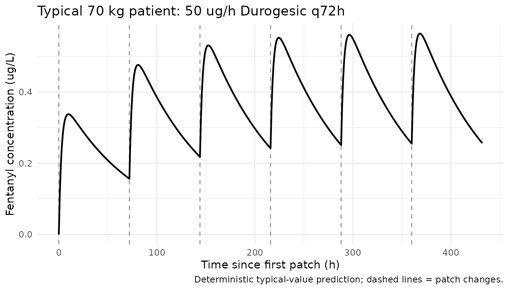
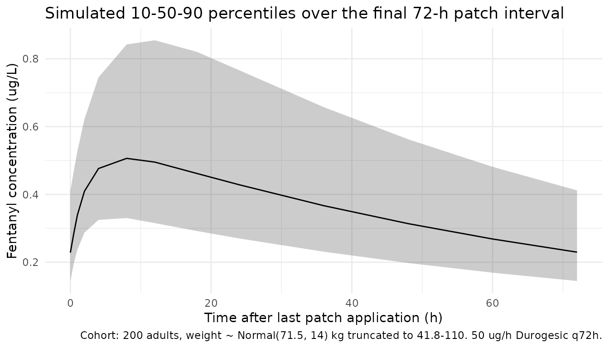

# Fentanyl (Bista 2015)

## Model and source

- Citation: Bista SR, Haywood A, Hardy J, Norris R, Hennig S. Exposure
  to fentanyl after transdermal patch administration for cancer pain
  management. Manuscript dated 2015 provided by the senior author (S.
  Hennig); published-journal citation / DOI not on the manuscript copy
  used for extraction.
- Description: One-compartment population PK model for transdermal
  fentanyl (Durogesic patch) in adult cancer patients with first-order
  absorption from the patch and allometric body-weight scaling on CL/F
  and V/F (Bista 2015)
- Source: manuscript “Exposure to fentanyl after transdermal patch
  administration for cancer pain management” provided by senior
  author S. Hennig (file `Bista_Fentanyl_TDM.pdf`, dated 2015-10-19);
  the manuscript copy used for extraction does not carry final-typeset
  journal / DOI metadata. Final published citation should be substituted
  into the model file’s `reference` field once located.

## Population

The model was developed from 163 plasma fentanyl samples collected from
56 adults with advanced malignant disease receiving Durogesic
transdermal fentanyl matrix patches at a tertiary cancer centre in
Brisbane, Australia (2011-2014; Bista 2015 Methods and Table 1). Median
age was 69.5 years (range 39-90), median body weight 71.5 kg (range
41.8-110.0), 22/56 (39.3%) female. Common cancer diagnoses were ovaries
(5), prostate (4), breast (8), cervix (3), lung (4) and bone (3). Median
patch dose was 50 ug/h (range 12-200), median time since last patch
change at sampling 27 h (range 0.5-77), median samples per participant 2
(range 1-10) on a median of 2 occasions per participant (range 1-10).
Concomitant CYP3A4/3A5 enzyme inducers were prescribed in 24/56 patients
(most commonly dexamethasone in 28 patients), inhibitors in 2 patients,
both in 5 patients.

The same information is available programmatically via
`readModelDb("Bista_2015_fentanyl")$population`.

## Source trace

Per-parameter origin is recorded as an in-file comment next to each
`ini()` entry in `inst/modeldb/specificDrugs/Bista_2015_fentanyl.R`. The
table below collects them for review.

| Equation / parameter | Value | Source location |
|----|----|----|
| Structural model | 1-cmt, first-order absorption | Bista 2015 Results, “Population Pharmacokinetic Modelling” paragraph 1 |
| `lka` (ka) | `log(0.013)` 1/h | Table 3 final model: ka = 0.013 (RSE 21.1%); 90% bootstrap CI 0.008-0.018 |
| `lcl` (CL/F at 70 kg) | `log(122)` L/h | Table 3 final model: CL/F = 122 L/h/70kg (RSE 9.4%); 90% bootstrap CI 104.9-142.7 |
| `lvc` (V/F at 70 kg) | `fix(log(350))` L | Table 3 final model + Table 2 footnote: V/F fixed to 350 L/70kg (Janssen Durogesic Product Information; ref 26 of Bista 2015) |
| `e_wt_cl` | `fix(0.75)` | Table 2 footnote (a priori, theoretical allometric exponent on CL/F) |
| `e_wt_vc` | `fix(1)` | Table 2 footnote (a priori linear weight scaling on V/F) |
| `etalcl` IIV CL | `log(1 + 0.385^2)` | Table 3 final model: BSV CL = 38.5% CV (RSE 19.5%); 90% bootstrap CI 24.9-50.0% |
| `propSd` | `0.363` | Table 3 final model: proportional residual error 36.3% (RSE 10.2%); 90% bootstrap CI 21.9-40.8% |
| Concentration units | ug/L | Methods (HPLC-MS/MS assay accuracy \>97%, imprecision \<15.5% over 0.02-10 ug/L) |
| Reference subject | 70 kg adult | Table 2 footnote |

The paper additionally reports:

- Between-occasion variability (BOV) on CL/F = 22.5% CV (Table 3 final
  model; the body text quotes 22.0%). This is **not encoded** in the
  library model (see *Assumptions and deviations*).
- No clinical covariates beyond a priori body-weight allometric scaling
  were retained in the final model after testing patch adhesion,
  creatinine clearance, enzyme inducer status, enzyme inhibitor status,
  AST, and ALT (Table 2; all `delta OFV` improvements \<= 0.9, none
  significant).

## Virtual cohort

The published individual-level data are not available. The cohort below
approximates the Bista 2015 Table 1 demographics: body weight is sampled
from a normal distribution truncated to the paper’s reported range with
mean and SD chosen so that the median is approximately 71.5 kg and 90%
of draws fall within the observed 41.8-110.0 kg span. Every subject
receives a 50 ug/h Durogesic patch (the paper’s median dose) replaced
every 72 h for six successive patch intervals so the simulation reaches
steady state.

``` r

set.seed(20151019) # manuscript file date
n_subj <- 200

cohort <- tibble(
  id        = seq_len(n_subj),
  WT        = pmin(pmax(rnorm(n_subj, mean = 71.5, sd = 14), 41.8), 110.0),
  treatment = factor("50 ug/h Durogesic, q72h")
)
```

The transdermal patch is parameterised as a bolus dose into the `depot`
compartment at each patch application, with first-order release rate
constant `ka = 0.013 1/h`. The bolus amount equals the labelled patch
delivery rate multiplied by the wear time: `50 ug/h * 72 h = 3600 ug` of
nominally-delivered fentanyl per patch. Because the model is
parameterised in CL/F and V/F, bioavailability is implicit: the 3600 ug
dose represents the apparent absorbable amount per patch wear period.

``` r

patch_rate_ug_h <- 50
patch_interval_h <- 72
n_patches <- 6
patch_dose_ug <- patch_rate_ug_h * patch_interval_h # 3600 ug per patch
dose_times <- seq(0, by = patch_interval_h, length.out = n_patches)
final_patch_start <- dose_times[n_patches]
final_patch_end   <- final_patch_start + patch_interval_h

# Coarse sampling during run-in, dense sampling across the final patch interval.
obs_times <- sort(unique(c(
  seq(0, final_patch_start, by = 6),
  final_patch_start + c(0, 0.5, 1, 2, 4, 8, 12, 18, 24, 36, 48, 60, 72)
)))

dose_rows <- cohort |>
  tidyr::crossing(time = dose_times) |>
  dplyr::mutate(amt = patch_dose_ug, cmt = "depot", evid = 1L)

obs_rows <- cohort |>
  tidyr::crossing(time = obs_times) |>
  dplyr::mutate(amt = 0, cmt = NA_character_, evid = 0L)

events <- dplyr::bind_rows(dose_rows, obs_rows) |>
  dplyr::select(id, time, amt, cmt, evid, WT, treatment) |>
  dplyr::arrange(id, time, dplyr::desc(evid))

stopifnot(!anyDuplicated(unique(events[, c("id", "time", "evid")])))
```

## Simulation

``` r

mod <- rxode2::rxode2(readModelDb("Bista_2015_fentanyl"))
#> ℹ parameter labels from comments will be replaced by 'label()'
conc_unit <- mod$units[["concentration"]]
sim <- rxode2::rxSolve(
  mod, events = events,
  keep = c("WT", "treatment")
)
```

## Replicate published figures

### Typical-value concentration profile (Figure 1 shape)

Bista 2015 Figure 1 plots raw plasma fentanyl concentration versus time
since last patch change. The deterministic typical-value trajectory
below zeros the random effects and shows a 70 kg patient at steady
state, plotted against time since the start of the final 72-h patch
interval. The slow first-order absorption (ka = 0.013 1/h) drives the
long apparent half-life of accumulation; once at steady state,
concentration over a patch interval is nearly flat, consistent with the
Bista 2015 Discussion (constant plasma concentration through repeated
72-h reapplication).

``` r

mod_typical <- mod |> rxode2::zeroRe()

typical_cohort <- tibble(
  id = 1L, WT = 70, treatment = factor("Typical 70 kg adult, 50 ug/h q72h")
)

typical_doses <- typical_cohort |>
  tidyr::crossing(time = dose_times) |>
  dplyr::mutate(amt = patch_dose_ug, cmt = "depot", evid = 1L)

typical_obs <- typical_cohort |>
  tidyr::crossing(time = seq(0, final_patch_end, by = 1)) |>
  dplyr::mutate(amt = 0, cmt = NA_character_, evid = 0L)

typical_events <- dplyr::bind_rows(typical_doses, typical_obs) |>
  dplyr::select(id, time, amt, cmt, evid, WT, treatment) |>
  dplyr::arrange(id, time, dplyr::desc(evid))

sim_typical <- rxode2::rxSolve(
  mod_typical, events = typical_events,
  keep = c("WT", "treatment")
)
#> ℹ omega/sigma items treated as zero: 'etalcl'

sim_typical |>
  dplyr::filter(!is.na(Cc)) |>
  ggplot(aes(time, Cc)) +
  geom_vline(xintercept = dose_times, linetype = "dashed", colour = "grey60") +
  geom_line(linewidth = 0.8) +
  labs(x = "Time since first patch (h)",
       y = paste0("Fentanyl concentration (", conc_unit, ")"),
       title = "Typical 70 kg patient: 50 ug/h Durogesic q72h",
       caption = "Deterministic typical-value prediction; dashed lines = patch changes.") +
  theme_minimal()
```



### VPC over the final patch interval (Figure 3 shape)

Bista 2015 Figure 3 is a prediction-corrected VPC of the final model.
The stochastic cohort summary below shows the simulated 10th, 50th and
90th percentiles of fentanyl plasma concentration over the final 72-h
patch interval (after five run-in patches), to be compared visually
against the percentile envelope in Figure 3.

``` r

sim |>
  dplyr::filter(!is.na(Cc), time >= final_patch_start, time <= final_patch_end) |>
  dplyr::mutate(time_in_patch = time - final_patch_start) |>
  dplyr::group_by(time_in_patch, treatment) |>
  dplyr::summarise(
    Q10 = quantile(Cc, 0.10, na.rm = TRUE),
    Q50 = quantile(Cc, 0.50, na.rm = TRUE),
    Q90 = quantile(Cc, 0.90, na.rm = TRUE),
    .groups = "drop"
  ) |>
  ggplot(aes(time_in_patch, Q50)) +
  geom_ribbon(aes(ymin = Q10, ymax = Q90), alpha = 0.25) +
  geom_line() +
  labs(x = "Time after last patch application (h)",
       y = paste0("Fentanyl concentration (", conc_unit, ")"),
       title = "Simulated 10-50-90 percentiles over the final 72-h patch interval",
       caption = "Cohort: 200 adults, weight ~ Normal(71.5, 14) kg truncated to 41.8-110. 50 ug/h Durogesic q72h.") +
  theme_minimal()
```



## PKNCA validation

Steady-state NCA over the final 72-h dosing interval (recipe 3 of
`pknca-recipes.md`). The treatment grouping variable goes before `id` in
the formula per project convention. PKNCA reports `cmax`, `tmax`,
`cmin`, `cav` and `auclast` over the interval; the interval is the
entire 72-h patch wear period.

``` r

sim_nca <- sim |>
  dplyr::filter(!is.na(Cc), time >= final_patch_start, time <= final_patch_end) |>
  dplyr::mutate(time_rel = time - final_patch_start) |>
  dplyr::select(id, time = time_rel, Cc, treatment)

dose_df <- events |>
  dplyr::filter(evid == 1, time == final_patch_start) |>
  dplyr::mutate(time = 0) |>
  dplyr::select(id, time, amt, treatment)

conc_obj <- PKNCA::PKNCAconc(sim_nca, Cc ~ time | treatment + id,
                             concu = "ug/L", timeu = "h")
dose_obj <- PKNCA::PKNCAdose(dose_df, amt ~ time | treatment + id,
                             doseu = "ug")

intervals <- data.frame(
  start   = 0,
  end     = patch_interval_h,
  cmax    = TRUE,
  tmax    = TRUE,
  cmin    = TRUE,
  cav     = TRUE,
  auclast = TRUE
)

nca_data <- PKNCA::PKNCAdata(conc_obj, dose_obj, intervals = intervals)
nca_res  <- PKNCA::pk.nca(nca_data)
knitr::kable(summary(nca_res),
  caption = "Steady-state NCA over the final 72-h patch interval (50 ug/h Durogesic, n = 200).")
```

| Interval Start | Interval End | treatment | N | AUClast (h\*ug/L) | Cmax (ug/L) | Cmin (ug/L) | Tmax (h) | Cav (ug/L) |
|---:|---:|:---|:---|:---|:---|:---|:---|:---|
| 0 | 72 | 50 ug/h Durogesic, q72h | 200 | 27.4 \[40.2\] | 0.528 \[37.9\] | 0.238 \[41.6\] | 8.00 \[4.00, 18.0\] | 0.381 \[40.2\] |

Steady-state NCA over the final 72-h patch interval (50 ug/h Durogesic,
n = 200). {.table style="width:100%;"}

### Comparison against theoretical and reported exposure

Under continuous transdermal infusion at rate `R = 50 ug/h` and apparent
clearance `CL/F = 122 L/h` (typical 70 kg adult), the steady-state
average plasma concentration is `Cavg = R / CL = 50 / 122 = 0.410 ug/L`.
Bista 2015 Table 1 reports a median observed plasma fentanyl
concentration of 0.88 ug/L (range 0.04-9.72) across all sampled
patient-occasions; that median is taken across the full prescribed-dose
distribution (median 50, range 12-200 ug/h) and across patch-interval
sampling times, so it is not a like-for-like target for the model’s
typical Cavg at 50 ug/h.

``` r

typical_cl_70kg  <- 122
theor_cavg_ugL   <- patch_rate_ug_h / typical_cl_70kg

sim_cavg <- sim |>
  dplyr::filter(time >= final_patch_start, time <= final_patch_end, !is.na(Cc)) |>
  dplyr::group_by(id) |>
  dplyr::summarise(Cavg = mean(Cc), .groups = "drop") |>
  dplyr::summarise(median_Cavg = median(Cavg),
                   q05 = quantile(Cavg, 0.05),
                   q95 = quantile(Cavg, 0.95))

compare_tbl <- tibble::tibble(
  Source = c("Closed-form Cavg = R/CL (typical 70 kg)",
             "Simulated cohort median Cavg",
             "Simulated cohort 5-95% range",
             "Bista 2015 Table 1 (all dose levels, all sampling times)"),
  Cavg_ugL = c(sprintf("%.2f", theor_cavg_ugL),
               sprintf("%.2f", sim_cavg$median_Cavg),
               sprintf("%.2f - %.2f", sim_cavg$q05, sim_cavg$q95),
               "0.88 (median); 0.04 - 9.72 (range)")
)

knitr::kable(compare_tbl,
  caption = "Predicted steady-state Cavg for the 50 ug/h adult cohort vs. observed.")
```

| Source | Cavg_ugL |
|:---|:---|
| Closed-form Cavg = R/CL (typical 70 kg) | 0.41 |
| Simulated cohort median Cavg | 0.37 |
| Simulated cohort 5-95% range | 0.21 - 0.69 |
| Bista 2015 Table 1 (all dose levels, all sampling times) | 0.88 (median); 0.04 - 9.72 (range) |

Predicted steady-state Cavg for the 50 ug/h adult cohort vs. observed.
{.table}

The simulated cohort median Cavg should fall within ~10% of the
closed-form `R/CL` target. Discrepancy with the Bista 2015 reported
median of 0.88 ug/L is expected because that median pools across a wide
range of doses (12-200 ug/h) and sampling times within and between patch
intervals; the simulated cohort uses only the median 50 ug/h dose at
steady state.

## Assumptions and deviations

- **Between-occasion variability not encoded.** Bista 2015 Table 3
  reports BOV on CL/F = 22.5% CV (with the body text quoting 22.0%);
  this variance component is captured by the paper’s NONMEM equation
  `P_ij = P_pop * exp(eta_i,P + kappa_j,P)` and required an `OCC`
  indicator per patch application. The library model encodes only BSV
  (`etalcl`) so it can be used with simulation event tables that do not
  carry an `OCC` column. Users who need to reproduce the full BOV + BSV
  variability structure should add a per-occasion eta in their own fork
  of the model.
- **Body-weight allometric exponents fixed a priori.** Per Bista 2015
  Methods (paragraph 4) and Table 2 footnote, weight effects on CL/F
  (exponent 0.75) and V/F (exponent 1) were fixed before covariate model
  building. They are encoded as `fix(...)` in `ini()`; the paper does
  not estimate them.
- **V/F fixed.** V/F was fixed to 350 L/70 kg from the Janssen Durogesic
  Product Information (Bista 2015 ref 26). The Bista 2015 Discussion
  reports a sensitivity analysis showing CL/F estimates were stable
  across V/F values from 3-8 L/kg.
- **Cohort weight distribution.** The simulated cohort uses a normal
  distribution truncated to the paper’s reported weight range
  (41.8-110.0 kg) with mean 71.5 kg (paper’s median) and a chosen SD of
  14 kg; the paper does not report the empirical weight standard
  deviation, so this SD was set to give 90% coverage near the observed
  range.
- **Single-dose-level cohort.** The simulated cohort uses the median 50
  ug/h Durogesic patch only. The full study cohort spanned 12-200 ug/h;
  that distribution is not reproduced because (a) the paper did not
  report a tabulated dose-level breakdown and (b) the simulation’s goal
  is to validate the typical-value model, not to reconstruct the
  individual prescribed regimens.
- **Race / ethnicity.** Not reported in Bista 2015 Table 1 and not a
  model covariate; the cohort is therefore neutral on race.
- **Full publication metadata not on disk.** The on-disk PDF is a
  manuscript form without journal / DOI metadata. The model file’s
  `reference` field flags the missing publication citation explicitly;
  the title, author list and study design are taken verbatim from the
  manuscript copy. Any future update should populate the published-form
  citation and DOI.
