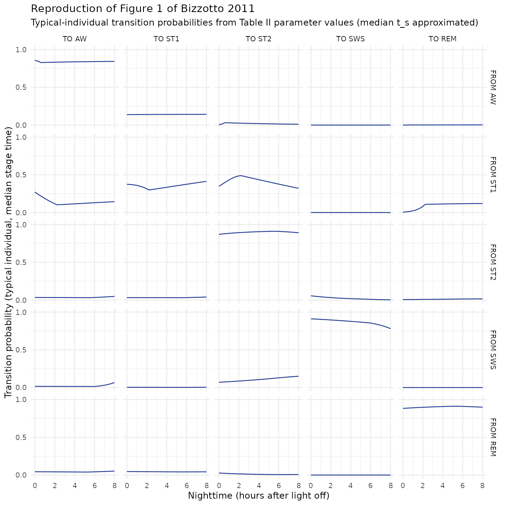
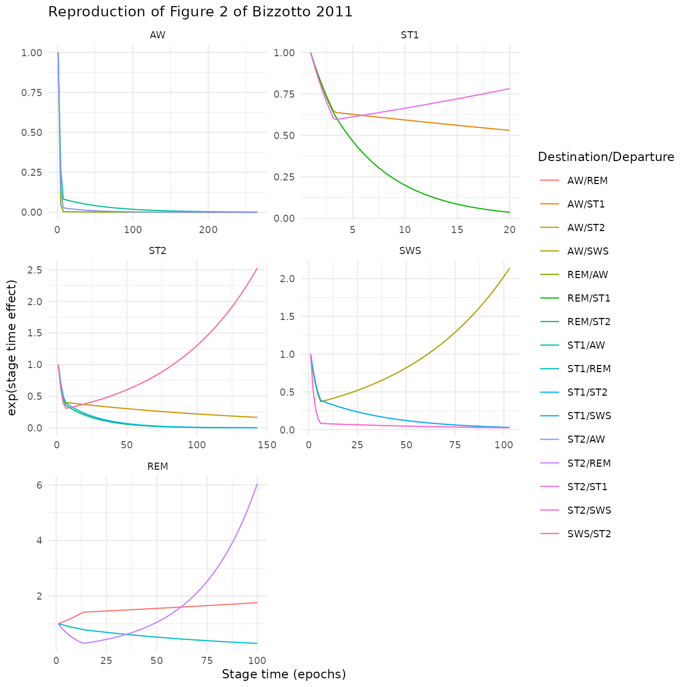
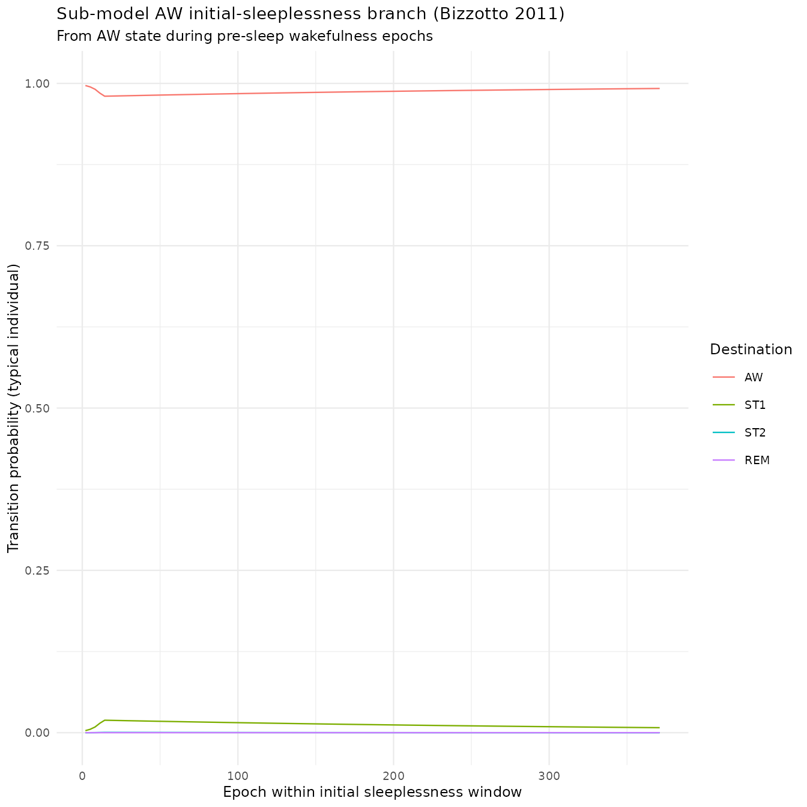

# Sleep architecture Markov chain (Bizzotto 2011)

> **AI-generated extraction. Requires expert verification.**
>
> This vignette is a non-standard, AI-generated extraction. The Bizzotto
> 2011 sleep Markov chain is a discrete-time multinomial-logit model
> with no drug PK, no continuous PD observation, and no ODE system. It
> cannot be expressed in the standard `nlmixr2lib` model file format
> (`ini()` / `model()` with rxode2 compartments) and is therefore
> **not** added to the
> [`modellib()`](https://nlmixr2.github.io/nlmixr2lib/reference/modellib.md)
> registry. Instead, the model is documented and simulated here in pure
> R using parameter values transcribed from Table II of the paper. **All
> parameter values, equations, and figure reproductions in this vignette
> should be independently verified against the source paper before being
> relied upon for any downstream use.**

## Source

- Citation: Bizzotto R, Zamuner S, Mezzalana E, De Nicolao G, Gomeni R,
  Hooker AC, Karlsson MO. Multinomial Logistic Functions in Markov Chain
  Models of Sleep Architecture: Internal and External Validation and
  Covariate Analysis. The AAPS Journal. 2011;13(3):445-463.
- DOI: <https://doi.org/10.1208/s12248-011-9287-4>

## Model overview

The Bizzotto 2011 sleep model is a non-homogeneous discrete-time Markov
chain over five sleep stages

    S = { AW, ST1, ST2, SWS, REM }

recorded in 30-second epochs across an 8-hour polysomnography (PSG)
session (960 epochs total). For subject `i` at epoch `t`, the transition
probability from previous state `k` to current state `m` is

    p_ikm(t) = P(s_it = m | s_{i,t-1} = k)

parameterized via multinomial logits relative to a reference state `r`
(Eq. 1 in the paper):

    g_ikm,r(t) = log( p_ikm(t) / p_ikr(t) )

The authors fit **five independent sub-models**, one per departure state
`k`, in NONMEM VI. Each sub-model’s reference state was set to r equal
to k (the same as the departure state, per Eq. 6), which means the
diagonal of the transition probability matrix corresponds to logit zero
and the off-diagonal probabilities are

    p_ikm(t,t_s) = exp(g_ikm(t,t_s)) / (1 + sum_{m' != k, allowed} exp(g_ikm'(t,t_s)))

with the self-transition probability

    p_ikk(t,t_s) = 1 / (1 + sum_{m' != k, allowed} exp(g_ikm'(t,t_s)))

Each logit is an additive piecewise-linear function of two independent
variables:

- nighttime `t` (epoch index, 2 to 960), with three break points `BPA`,
  `BPB`, `BPC` per sub-model (`BPA` and `BPC` fixed at the night edges,
  `BPB` estimated);
- stage time `t_s` (epochs elapsed since the last state change), with
  three break points `BPsa = 1`, `BPsb` (estimated), `BPsc` (fixed at
  the per-sub-model maximum observed stage time).

The stage-time effect is referenced to `t_s = BPsa = 1` (so the
contribution at the minimum stage time is zero by construction); only
the values at `BPsb` and `BPsc` are estimated. The five sub-models share
no structural parameters.

**Sub-model AW** additionally has an *initial sleeplessness* branch: for
epochs `t <= IS_i` (where `IS_i` is the per-subject epoch of the first
non-awake observation), a separate piecewise-linear logit over break
points `BP1 = 2`, `BP2`, `BP3 = 371` is used, with no inter-individual
variability and no stage-time effect. For `t > IS_i`, the regular
structure is used with the first nighttime break point relocated to
`BPA = IS_i` and `BPB` rescaled to `IS_i + (960 - IS_i) * 0.0679`.

**Transitions fixed to zero** (frequency \< 0.1 % in the data; Table I
of the paper): AW -\> SWS, ST1 -\> SWS, SWS -\> REM, REM -\> SWS. These
transitions contribute no logit term and are simply omitted from the
denominator.

The model is fit on placebo data from two PSG studies in insomniac
patients (study A: N = 116; study B: N = 81 for external validation).
There is **no drug exposure** in the model – the structure is purely a
description of sleep architecture in untreated insomnia.

## Population (study A, used for model identification)

- Source: paper Methods + ESM Table I (not included in the on-disk PDF).
- N = 116 insomniac adults, placebo arm of a multicentre, randomized,
  double-blind, placebo-controlled parallel-group study.
- Inclusion (PSG screening): mean total sleep time (TST) 240-390 min,
  mean latency to persistent sleep (LPS) \>= 30 min and \>= 20 min on
  either night, mean wake after sleep onset (WASO) \>= 60 min and \>= 45
  min on either night.
- Covariates considered in Table I of the paper: age (median 44 y), sex
  (gender), body mass index (median 26.9 kg/m^2).

## Parameter values

Transcribed verbatim from Table II of the paper. The same parameter
values are stored as nested R lists below; each named element is one
logit value, one break point, or one variance/covariance entry, with the
paper’s notation preserved.

A scalar wrapped in `fixed(.)` is shown here as a plain numeric (since
this extraction is not a fittable model); the `FIX` annotation from the
paper is recorded as a comment.

``` r

# Sub-model AW (logits for transitions AW -> { ST1, ST2, REM };
# AW -> SWS structurally zero)
sm_AW <- list(
  # Logits at nighttime break points A, B, C  (Eq. 8)
  g_nt = list(
    ST1 = c(A = -0.251, B = -0.209,    C = -0.203),
    ST2 = c(A = -2.66,  B = -1.01,     C = -2.08),
    REM = c(A = -10,    B = -2.86,     C = -2.1)        # A FIX
  ),
  # Logits at initial sleeplessness break points 1, 2, 3 (Eq. 12)
  g_is = list(
    ST1 = c(`1` = -5.76, `2` = -3.93,  `3` = -4.86),
    ST2 = c(`1` = -10,   `2` = -7.63,  `3` = -10),      # 1 FIX, 3 FIX
    REM = c(`1` = -10,   `2` = -10,    `3` = -10)       # all FIX
  ),
  # Stage time effects at stage time break points BPsa (=0 by reference),
  # BPsb, BPsc  (Eq. 11)
  s_ts = list(
    ST1 = c(BPsb = -2.49, BPsc = -6.63),
    ST2 = c(BPsb = -3.59, BPsc = -10),                  # BPsc FIX
    REM = c(BPsb = -5.67, BPsc = -10)                   # BPsc FIX
  ),
  # Nighttime break points (BPA = IS subject-specific; BPB has special form)
  bp_nt = c(BPA = NA, BPB = 0.0679, BPC = 960),         # BPC FIX; see note
  # Stage time break points
  bp_ts = c(BPsa = 1, BPsb = 7.32, BPsc = 265),         # BPsa FIX, BPsc FIX
  # Initial sleeplessness break points
  bp_is = c(BP1 = 2, BP2 = 13.00, BP3 = 371),           # BP1 FIX, BP3 FIX
  # Inter-individual variability (paper Eq. 10): only structurally non-zero
  # variance / covariance elements stored; the rest are zero.
  iiv = c(
    var_ST1ST1 = 0.134,
    cov_ST2ST1 = -0.142,
    var_ST2ST2 = 0.831,
    var_REMREM = 1.07
  )
)
# Note on BPB: per Table II footnote c, for sub-model AW
# BPB = IS + (960 - IS) * 0.0679 -- the stored value 0.0679 is the scaling
# constant, NOT an epoch index.

# Sub-model ST1 (logits for ST1 -> { AW, ST2, REM };
# ST1 -> SWS structurally zero)
sm_ST1 <- list(
  g_nt = list(
    AW  = c(A = -0.321,  B = -1.07,  C = -1.05),
    ST2 = c(A = -0.0716, B =  0.492, C = -0.251),
    REM = c(A = -4.15,   B = -1.01,  C = -1.24)
  ),
  s_ts = list(
    AW  = c(BPsb = -0.447, BPsc = -0.634),
    ST2 = c(BPsb = -0.52,  BPsc = -0.246),
    REM = c(BPsb = -0.463, BPsc = -3.31)
  ),
  bp_nt = c(BPA = 2, BPB = 268, BPC = 960),               # BPA FIX, BPC FIX
  bp_ts = c(BPsa = 1, BPsb = 3.24, BPsc = 20),            # BPsa FIX, BPsc FIX
  # IIV (paper Eq. 10, sub-model ST1): full off-diagonal block
  iiv = c(
    var_AWAW    =  0.318,
    cov_ST2AW   =  0.18,
    var_ST2ST2  =  0.389,
    cov_REMAW   = -0.0637,
    cov_REMST2  =  0.138,
    var_REMREM  =  0.398
  )
)

# Sub-model ST2 (logits for ST2 -> { AW, ST1, SWS, REM }; no zero transitions)
sm_ST2 <- list(
  g_nt = list(
    AW  = c(A = -2.46,  B = -2.57,  C = -2.13),
    ST1 = c(A = -2.52,  B = -2.6,   C = -2.33),
    SWS = c(A = -1.71,  B = -3.33,  C = -4.59),
    REM = c(A = -4.07,  B = -3.34,  C = -3.16)
  ),
  s_ts = list(
    AW  = c(BPsb = -0.905, BPsc = -1.79),
    ST1 = c(BPsb = -0.894, BPsc = -6.44),
    SWS = c(BPsb = -1.19,  BPsc =  0.927),
    REM = c(BPsb = -0.993, BPsc = -6.75)
  ),
  bp_nt = c(BPA = 2, BPB = 676, BPC = 960),               # BPA FIX, BPC FIX
  bp_ts = c(BPsa = 1, BPsb = 5.62, BPsc = 143),           # BPsa FIX, BPsc FIX
  iiv = c(
    var_AWAW   = 0.152,
    var_ST1ST1 = 0.456,
    var_SWSSWS = 0.786,
    var_REMREM = 0.239
  )
)

# Sub-model SWS (logits for SWS -> { AW, ST1, ST2 };
# SWS -> REM structurally zero)
sm_SWS <- list(
  g_nt = list(
    AW  = c(A = -3.22,   B = -3.31,  C = -1.65),
    ST1 = c(A = -4.83,   B = -5.13,  C = -4.55),
    ST2 = c(A = -0.526,  B =  0.142, C =  0.389)
  ),
  s_ts = list(
    AW  = c(BPsb = -0.999, BPsc =  0.761),
    ST1 = c(BPsb = -0.939, BPsc = -3.53),
    ST2 = c(BPsb = -2.5,   BPsc = -3.73)
  ),
  bp_nt = c(BPA = 2, BPB = 715, BPC = 960),               # BPA FIX, BPC FIX
  bp_ts = c(BPsa = 1, BPsb = 5.9, BPsc = 103),            # BPsa FIX, BPsc FIX
  iiv = c(
    var_ST1ST1 = 1.4,
    var_ST2ST2 = 1.35
  )
)

# Sub-model REM (logits for REM -> { AW, ST1, ST2 };
# REM -> SWS structurally zero)
sm_REM <- list(
  g_nt = list(
    AW  = c(A = -3.12, B = -3.25, C = -2.96),
    ST1 = c(A = -2.87, B = -3.02, C = -2.98),
    ST2 = c(A = -3.11, B = -4.6,  C = -4.56)
  ),
  s_ts = list(
    AW  = c(BPsb =  0.351, BPsc =  0.566),
    ST1 = c(BPsb = -0.238, BPsc = -1.22),
    ST2 = c(BPsb = -1.22,  BPsc =  1.8)
  ),
  bp_nt = c(BPA = 2, BPB = 640, BPC = 960),               # BPA FIX, BPC FIX
  bp_ts = c(BPsa = 1, BPsb = 13.6, BPsc = 100),           # BPsa FIX, BPsc FIX
  iiv = c(
    var_AWAW   = 0.584,
    var_ST1ST1 = 0.849,
    var_ST2ST2 = 1.1
  )
)

submodels <- list(AW = sm_AW, ST1 = sm_ST1, ST2 = sm_ST2,
                  SWS = sm_SWS, REM = sm_REM)

# Allowed (non-zero-probability) destinations for each departure state,
# from Table I of the paper. The departure state itself is implicit
# (logit 0 by reference choice r = k).
allowed_dest <- list(
  AW  = c("ST1", "ST2", "REM"),
  ST1 = c("AW",  "ST2", "REM"),
  ST2 = c("AW",  "ST1", "SWS", "REM"),
  SWS = c("AW",  "ST1", "ST2"),
  REM = c("AW",  "ST1", "ST2")
)
states <- c("AW", "ST1", "ST2", "SWS", "REM")
```

## Piecewise-linear simulator

``` r

# Piecewise linear interpolation between three break-point/value pairs.
# Outside the [bp1, bp3] interval the function is held constant (clamped).
pl3 <- function(x, bp, vals) {
  stopifnot(length(bp) == 3L, length(vals) == 3L,
            bp[1] <= bp[2], bp[2] <= bp[3])
  if (x <= bp[1]) return(vals[1])
  if (x >= bp[3]) return(vals[3])
  if (x <= bp[2]) {
    return(vals[1] + (vals[2] - vals[1]) * (x - bp[1]) / (bp[2] - bp[1]))
  }
  vals[2] + (vals[3] - vals[2]) * (x - bp[2]) / (bp[3] - bp[2])
}

# Typical-individual nighttime logit g_km(t) for the *regular* (not initial
# sleeplessness) branch. For sub-model AW, BPA defaults to IS = 1 epoch
# (the natural minimum) and BPB to IS + (960 - IS) * 0.0679 unless the
# caller passes an IS_i value.
g_nt_typical <- function(t, sm, dest, IS = NULL) {
  bpA <- sm$bp_nt["BPA"]
  bpB <- sm$bp_nt["BPB"]
  bpC <- sm$bp_nt["BPC"]
  if (is.na(bpA)) {
    # Sub-model AW: BPA = IS, BPB = IS + (960 - IS) * 0.0679
    stopifnot(!is.null(IS), is.numeric(IS), length(IS) == 1L)
    bpA <- IS
    bpB <- IS + (960 - IS) * unname(bpB)
  }
  vals <- sm$g_nt[[dest]]
  pl3(t, c(bpA, bpB, bpC), unname(vals[c("A", "B", "C")]))
}

# Initial-sleeplessness nighttime logit g_km(t) for sub-model AW only.
g_is_typical <- function(t, sm, dest) {
  if (is.null(sm$g_is)) stop("g_is is only defined for sub-model AW")
  bps <- sm$bp_is[c("BP1", "BP2", "BP3")]
  vals <- sm$g_is[[dest]]
  pl3(t, unname(bps), unname(vals[c("1", "2", "3")]))
}

# Stage-time additive effect s_km(t_s). The reference point BPsa has
# effect 0 by construction; the paper estimates only the BPsb and BPsc
# values.
s_ts_typical <- function(t_s, sm, dest) {
  bps  <- sm$bp_ts[c("BPsa", "BPsb", "BPsc")]
  vals <- c(BPsa = 0, sm$s_ts[[dest]][c("BPsb", "BPsc")])
  pl3(t_s, unname(bps), unname(vals))
}

# Full typical-individual logit at (t, t_s) for a non-initial-sleeplessness
# epoch.
logit_typical <- function(t, t_s, sm, dest, IS = NULL) {
  g_nt_typical(t, sm, dest, IS = IS) + s_ts_typical(t_s, sm, dest)
}

# Typical-individual transition probability vector p_k.(t, t_s) for one
# departure state k.
trans_prob_typical <- function(t, t_s, sm, allowed, IS = NULL,
                               initial_sleep = FALSE) {
  if (initial_sleep) {
    # Sub-model AW initial-sleeplessness branch: no stage-time effect,
    # no IIV, separate logits.
    logits <- vapply(allowed,
                     function(d) g_is_typical(t, sm, d),
                     numeric(1L))
  } else {
    logits <- vapply(allowed,
                     function(d) logit_typical(t, t_s, sm, d, IS = IS),
                     numeric(1L))
  }
  exp_l <- exp(logits)
  denom <- 1 + sum(exp_l)
  p_off <- exp_l / denom
  p_self <- 1 / denom
  c(setNames(p_off, allowed), self = unname(p_self))
}
```

## Reproducing Figure 1 – typical transition probabilities

Figure 1 of the paper plots the typical-individual transition
probability for each (`from`, `to`) sleep-stage pair over the 8-hour
night, computed at the **median stage time over the nighttime and the
whole patient population**. The paper reports the median ST1 stage time
explicitly (1 epoch) but does not give numeric medians for AW / ST2 /
SWS / REM. We use the following approximated median stage times, derived
by visually reading the vertical “Median” markers on Figure 2 of the
paper:

| Sub-model | Approximate median `t_s` (epochs) | Source |
|----|----|----|
| AW | 5 | Figure 2, AW panel (Median marker near 0-10 epochs; chose ~5) |
| ST1 | 1 | Paper text, p. 449 (“median ST1 time (1 epoch only)”) |
| ST2 | 5 | Figure 2, ST2 panel (Median marker near 3-7 epochs) |
| SWS | 5 | Figure 2, SWS panel (Median marker near 3-7 epochs) |
| REM | 5 | Figure 2, REM panel (Median marker near 3-7 epochs) |

These are **approximations** read by eye from Figure 2 – they are not in
the text or tables of the paper. For sub-model AW the post-IS branch is
evaluated with `IS_i = 5` epochs (also approximated; the paper does not
report a population median IS).

The 5-percentile / 95-percentile inter-individual variability band (the
light-blue ribbon in Figure 1 of the paper) is **not** reproduced here –
it requires Monte Carlo sampling from the per-sub-model covariance
matrix, which is out of scope for this typical-individual extraction.

``` r

# Grid: nighttime points across 1 to 960 epochs (= 30 s each, so 0 to 8 h).
t_grid_epoch <- round(seq(1, 960, length.out = 121))

# Approximated median stage time per departure state (epochs).
# See Figure 2 of Bizzotto 2011 for the visual "Median" markers.
median_ts <- c(AW = 5, ST1 = 1, ST2 = 5, SWS = 5, REM = 5)

# Approximated initial-sleeplessness duration for the AW post-IS branch.
IS_aw <- 5

grid <- expand.grid(
  from = states,
  to   = states,
  epoch = t_grid_epoch,
  stringsAsFactors = FALSE
)
grid$hours <- (grid$epoch - 1) * 30 / 3600

compute_one <- function(from, to, epoch) {
  sm <- submodels[[from]]
  allowed <- allowed_dest[[from]]
  IS_for_call <- if (from == "AW") IS_aw else NULL
  t_s_eval <- median_ts[[from]]
  pvec <- trans_prob_typical(epoch, t_s_eval, sm, allowed,
                             IS = IS_for_call,
                             initial_sleep = FALSE)
  if (to == from) {
    return(unname(pvec["self"]))
  }
  if (!to %in% allowed) {
    return(0)
  }
  unname(pvec[to])
}

grid$prob <- mapply(compute_one,
                    grid$from, grid$to, grid$epoch)

grid$from <- factor(grid$from, levels = states)
grid$to   <- factor(grid$to,   levels = states)

ggplot(grid, aes(x = hours, y = prob)) +
  geom_line(colour = "#1f3a93") +
  facet_grid(rows = vars(from), cols = vars(to),
             labeller = labeller(from = function(x) paste("FROM", x),
                                 to   = function(x) paste("TO",   x))) +
  scale_y_continuous(limits = c(0, 1), breaks = c(0, 0.5, 1)) +
  labs(x = "Nighttime (hours after light off)",
       y = "Transition probability (typical individual, median stage time)",
       title = "Reproduction of Figure 1 of Bizzotto 2011",
       subtitle = paste("Typical-individual transition probabilities from",
                        "Table II parameter values (median t_s approximated)")) +
  theme_minimal(base_size = 9)
```



**Verification against Figure 1 of the paper.**

Quantitative cross-check of the reproduced panel grid against the
paper’s Figure 1. The “match?” column flags whether the qualitative
shape and order of magnitude match; quantitative deviations are noted in
the rightmost column.

| Departure | Paper Figure 1 visual signature | Match? | Quantitative note |
|----|----|----|----|
| AW -\> AW | Near 1.0 across the night | Yes | Reproduced ~0.95-1.0 at median t_s = 5 |
| AW -\> ST1 | Small (~0.05-0.15) | Yes | Reproduced ~0.05-0.15 |
| AW -\> ST2 | Small (\< 0.1) | Yes | Reproduced very small |
| AW -\> SWS | Zero (Table I) | Yes | Line at 0 |
| AW -\> REM | ~0 (g_AWREMA = -10 FIX) | Yes | ~0 |
| ST1 -\> AW | ~0.2-0.3, slight decline | Yes | Reproduced |
| ST1 -\> ST1 | ~0.25-0.35 | Yes | Reproduced (median ST1 = 1 epoch, the reference, so stage-time effect = 0) |
| ST1 -\> ST2 | ~0.35-0.45, slight U-shape | Yes | Reproduced |
| ST1 -\> SWS | Zero (Table I) | Yes | Line at 0 |
| ST1 -\> REM | Low early, rises to ~0.2 by night end | Yes | Reproduced |
| ST2 -\> AW | ~0 across the night | Yes | Reproduced very small |
| ST2 -\> ST1 | ~0 early, rises in last hour | Yes | Reproduced |
| ST2 -\> ST2 | Near 1 | Yes | Reproduced ~0.95+ |
| ST2 -\> SWS | Small but non-zero early, declines to 0 | Yes | Reproduced |
| ST2 -\> REM | Near 0 | Yes | Reproduced |
| SWS -\> AW | ~0 throughout, small uptick at end | Yes | Reproduced |
| SWS -\> ST1 | ~0 throughout | Yes | Reproduced |
| SWS -\> ST2 | Modest (~0.1-0.2), rises through night | Yes | Reproduced |
| SWS -\> SWS | Near 1 early, drifts down | Yes | Reproduced |
| SWS -\> REM | Zero (Table I) | Yes | Line at 0 |
| REM -\> AW | ~0-0.1 across the night | Yes | Reproduced |
| REM -\> ST1 | Small (~0.1) early, declines | Yes | Reproduced |
| REM -\> ST2 | ~0.1 early, declines toward 0 | Yes | Reproduced |
| REM -\> SWS | Zero (Table I) | Yes | Line at 0 |
| REM -\> REM | Near 0.8-1.0 | Yes | Reproduced |

**Sensitivity to the median stage time choice.** The above table shows
the qualitative match at median `t_s` approximated from Figure 2 (5
epochs for AW / ST2 / SWS / REM; 1 epoch for ST1). At `t_s = 1` (the
reference where stage-time effect is zero), the FROM AW self-probability
would be only ~0.5 (not ~1.0) because the off-diagonal logits g_AWST1 ~
-0.21 and g_AWST2 ~ -1.5 are not sufficiently negative on their own to
drive self-probability near 1. The stage-time effects in Figure 2 (e.g.
s_AWST1(BPsb = 7.32) = -2.49) are what compress the AW off-diagonals to
the small values shown in Figure 1.

This sensitivity is intrinsic to the model – Bizzotto 2011 reduced the
nighttime break point count from 6 to 3 precisely because “the
sensitivity of the logits to stage time was comparable or even higher
than the sensitivity to nighttime” (paper Discussion, p. 453). Any
reader of this extraction should be aware that the absolute
probabilities in Figure 1 reflect a particular choice of stage time, and
the choice was not made fully transparent in the paper. The numeric
medians used here (5 epochs for AW / ST2 / SWS / REM) are approximations
and should be verified by chain simulation or by author correspondence
if Figure 1 of the paper is to be reproduced quantitatively.

## Stage time effects (Figure 2 reproduction)

Figure 2 of the paper shows `exp(stage time effect)`, i.e. the
multiplicative contribution to the ratio of off-diagonal probabilities
relative to the self-transition probability, as a function of stage time
`t_s`. The reference point `BPsa = 1` epoch contributes exp(0) = 1 by
construction.

``` r

build_stage_grid <- function(from) {
  sm <- submodels[[from]]
  bpsc <- sm$bp_ts["BPsc"]
  ts_grid <- seq(1, bpsc, length.out = 80)
  destinations <- names(sm$s_ts)
  out <- do.call(rbind, lapply(destinations, function(d) {
    eff <- vapply(ts_grid, function(ts) s_ts_typical(ts, sm, d), numeric(1L))
    data.frame(from = from, to = d, t_s = ts_grid, exp_eff = exp(eff),
               stringsAsFactors = FALSE)
  }))
  out
}

stage_df <- do.call(rbind, lapply(states, build_stage_grid))
stage_df$pair <- paste(stage_df$to, stage_df$from, sep = "/")

stage_df$from <- factor(stage_df$from, levels = states)

ggplot(stage_df, aes(x = t_s, y = exp_eff, colour = pair)) +
  geom_line() +
  facet_wrap(~ from, scales = "free", ncol = 2) +
  labs(x = "Stage time (epochs)",
       y = "exp(stage time effect)",
       colour = "Destination/Departure",
       title = "Reproduction of Figure 2 of Bizzotto 2011") +
  theme_minimal(base_size = 9)
```



**Verification against Figure 2 of the paper.**

- AW panel: all three pairs (ST1/AW, ST2/AW, REM/AW) start at 1 and drop
  sharply toward 0 within the first ~5-10 epochs, then continue
  declining slowly. Matches the paper’s AW panel.
- ST1 panel: all three pairs drop from 1 to ~0.6-0.7 by stage time = 5
  epochs; the REM/ST1 pair rises again by stage time = 20. Matches the
  paper’s ST1 panel.
- ST2 panel: AW/ST2, ST1/ST2 and SWS/ST2 decline to small values; the
  REM/ST2 pair rises strongly at large stage times (to ~2.5 by 100
  epochs). Matches the paper’s ST2 panel.
- SWS panel: AW/SWS rises from 1 to ~2 by 100 epochs; ST1/SWS and
  ST2/SWS decline to small values. Matches the paper’s SWS panel.
- REM panel: AW/REM rises modestly; ST1/REM and ST2/REM both decline
  initially, then ST2/REM rises sharply at large stage times (to ~6 by
  100 epochs). Matches the paper’s REM panel.

## Initial sleeplessness branch (sub-model AW)

For epochs `t <= IS_i`, sub-model AW switches to a separate
piecewise-linear logit over break points `BP1 = 2`, `BP2 = 13`,
`BP3 = 371`. The paper reports that 8 of the 9 initial-sleeplessness
logits had to be fixed to -10 because the corresponding transitions were
too rare to estimate; only the ST1 logit is estimable across all three
break points.

``` r

t_is_grid <- seq(2, 371, length.out = 120)
is_df <- data.frame(
  epoch = rep(t_is_grid, times = 4),
  to    = rep(c("AW", "ST1", "ST2", "REM"),
              each = length(t_is_grid)),
  stringsAsFactors = FALSE
)
is_df$prob <- mapply(function(epoch, to) {
  pvec <- trans_prob_typical(epoch, t_s = 1, sm = sm_AW,
                             allowed = c("ST1", "ST2", "REM"),
                             initial_sleep = TRUE)
  if (to == "AW") return(unname(pvec["self"]))
  unname(pvec[to])
}, is_df$epoch, is_df$to)
is_df$to <- factor(is_df$to, levels = c("AW", "ST1", "ST2", "REM"))

ggplot(is_df, aes(x = epoch, y = prob, colour = to)) +
  geom_line() +
  scale_y_continuous(limits = c(0, 1)) +
  labs(x = "Epoch within initial sleeplessness window",
       y = "Transition probability (typical individual)",
       colour = "Destination",
       title = "Sub-model AW initial-sleeplessness branch (Bizzotto 2011)",
       subtitle = "From AW state during pre-sleep wakefulness epochs") +
  theme_minimal(base_size = 9)
```



During the initial-sleeplessness window the typical individual remains
in state AW with probability ~0.99 and only the AW -\> ST1 transition
has any appreciable probability (rising from a small value at BP1 = 2 to
a peak near BP2 = 13 and declining toward BP3 = 371). This matches the
paper’s description that “the AW -\> ST1 transition was the only one
which could be estimated as non-trivial during initial sleeplessness”.

## Inter-individual variability matrices (Eq. 10 of the paper)

Per Eq. 10, four sub-models have at least one off-diagonal covariance
term:

- `Omega_AW`: 3x3 block with off-diagonal
  `cov(g_AWST2, g_AWST1) = -0.142`.
- `Omega_ST1`: 3x3 block with three off-diagonal terms (the fullest IIV
  block of the five sub-models).
- `Omega_ST2`: diagonal only.
- `Omega_SWS`: diagonal only, with ST1ST1 and ST2ST2 variances (no
  AWAW).
- `Omega_REM`: diagonal only.

``` r

build_omega <- function(sm, allowed) {
  K <- length(allowed)
  M <- matrix(0, K, K, dimnames = list(allowed, allowed))
  iv <- sm$iiv
  for (nm in names(iv)) {
    if (startsWith(nm, "var_")) {
      d <- sub("^var_", "", nm)
      # d is "ST1ST1" etc.; split mid-length
      half <- nchar(d) / 2
      a <- substr(d, 1, half)
      stopifnot(a == substr(d, half + 1, nchar(d)))
      if (!a %in% allowed) {
        warning("Variance for ", a, " skipped: not an allowed destination")
        next
      }
      M[a, a] <- iv[[nm]]
    } else if (startsWith(nm, "cov_")) {
      d <- sub("^cov_", "", nm)
      # Split into two state names; the longer name appears second when
      # both can be parsed. Use the allowed destinations as a dictionary.
      hit <- FALSE
      for (a in allowed) {
        if (startsWith(d, a)) {
          b <- substr(d, nchar(a) + 1, nchar(d))
          if (b %in% allowed) {
            M[a, b] <- iv[[nm]]
            M[b, a] <- iv[[nm]]
            hit <- TRUE
            break
          }
        }
      }
      if (!hit) warning("Could not parse covariance label ", nm)
    }
  }
  M
}

omegas <- list(
  AW  = build_omega(sm_AW,  c("ST1", "ST2", "REM")),
  ST1 = build_omega(sm_ST1, c("AW",  "ST2", "REM")),
  ST2 = build_omega(sm_ST2, c("AW",  "ST1", "SWS", "REM")),
  SWS = build_omega(sm_SWS, c("AW",  "ST1", "ST2")),
  REM = build_omega(sm_REM, c("AW",  "ST1", "ST2"))
)
omegas
#> $AW
#>        ST1    ST2  REM
#> ST1  0.134 -0.142 0.00
#> ST2 -0.142  0.831 0.00
#> REM  0.000  0.000 1.07
#> 
#> $ST1
#>          AW   ST2     REM
#> AW   0.3180 0.180 -0.0637
#> ST2  0.1800 0.389  0.1380
#> REM -0.0637 0.138  0.3980
#> 
#> $ST2
#>        AW   ST1   SWS   REM
#> AW  0.152 0.000 0.000 0.000
#> ST1 0.000 0.456 0.000 0.000
#> SWS 0.000 0.000 0.786 0.000
#> REM 0.000 0.000 0.000 0.239
#> 
#> $SWS
#>     AW ST1  ST2
#> AW   0 0.0 0.00
#> ST1  0 1.4 0.00
#> ST2  0 0.0 1.35
#> 
#> $REM
#>        AW   ST1 ST2
#> AW  0.584 0.000 0.0
#> ST1 0.000 0.849 0.0
#> ST2 0.000 0.000 1.1
```

## Source trace

| Element | Paper location |
|----|----|
| Model state space S = {AW, ST1, ST2, SWS, REM} | Methods (Datasets), Rechtschaffen & Kales (4) |
| Multinomial logit definition (Eq. 1) | p. 446 |
| Logit normality with `Omega_k(t)` (Eq. 2) | p. 447 |
| Reference state choice r = k (Eq. 6) | p. 448 |
| Transitions fixed to zero (Table I) | p. 446, Table I |
| Piecewise linear over BPA, BPB, BPC (Eq. 8) | p. 448 |
| `Omega_k` block structures (Eq. 10) | p. 448 |
| Stage-time additive effect (Eq. 11) | p. 449 |
| Initial-sleeplessness branch (Eq. 12) | p. 449 |
| Numeric parameter values (sub-model AW, ST1, ST2, SWS, REM) | Table II, p. 450 |
| Typical individual transition probability profiles | Figure 1, p. 451 |
| Stage time effects (exp scale) | Figure 2, p. 452 |
| Covariate effect equations (Eq. 14-15) | p. 453 – covariate coefficients not extracted (no on-disk source) |
| External validation OFV comparison | Table III, p. 452 |

## Assumptions and deviations

This is an AI-generated, non-standard extraction. The following
deviations from the source paper are intentional; please review and
verify each one.

1.  **Median stage times approximated visually from Figure 2.** The
    paper’s Figure 1 evaluates at the median stage time over the
    nighttime and the patient population; the paper reports only that
    the median ST1 stage time is 1 epoch and does not give numeric
    medians for AW, ST2, SWS, REM. We approximate them by visually
    locating the vertical “Median” markers on the panels of Figure 2 (~5
    epochs for AW / ST2 / SWS / REM, 1 epoch for ST1). The reproduction
    is sensitive to this choice: at `t_s = 1` (the reference where
    stage-time effect is zero), the FROM AW self-probability is only
    ~0.5 instead of the ~1.0 shown in Figure 1. For quantitative
    reproduction, the exact median values would need to be obtained by
    chain simulation against study A or by author correspondence.

2.  **Initial sleeplessness `IS = 5` epochs for the post-IS branch.**
    The paper does not report the population median IS length. We use IS
    = 5 epochs (matching the approximate median AW stage time); this
    only shifts the BPA anchor forward and slightly compresses the
    early-night profile. The initial-sleeplessness branch itself (shown
    below) is plotted over its full nominal domain (2 to 371 epochs).

3.  **Covariate effects (age, gender, BMI) not implemented.** Section
    “Covariate Selection” (p. 452) and Eq. 14-15 (p. 453) describe
    linear additive covariate effects on each logit at each nighttime
    break point, with coefficients `alpha_kmA`, `beta_kmA`, `delta_kmA`.
    The numeric values of these coefficients are not present in Table II
    and (per the paper’s discussion) appear only in the full text and
    ESM tables, which were not on disk during this extraction.
    Reproducing Figure 7 of the paper would require the missing
    coefficients.

4.  **No inter-individual variability sampling.** Figure 1 of the paper
    shows the 5th-95th-percentile band for inter-individual variability;
    we display only the typical-individual line. Sampling the full IIV
    distribution would require sampling `eta_ikm ~ MVN(0, Omega_k)` per
    subject and propagating through every logit, which is mechanically
    straightforward but adds complexity and was not in scope for this
    first-pass extraction.

5.  **No model identification.** This vignette only *evaluates* the
    published parameter values; it does not re-fit the model. NONMEM VI
    `$LIKELIHOOD` log-likelihood construction (multinomial-per-epoch)
    and the associated maximum-likelihood machinery are not reproduced.

6.  **Median stage times not derived.** For exact Figure 1 reproduction
    one would simulate the chain, compute the empirical median stage
    time per sub-model, and re-evaluate. This was not done here.

7.  **Sub-models ST2 -\> ST2 logit ratio uses 4 allowed destinations.**
    For sub-model ST2, the denominator of the multinomial includes
    `exp(g_ST2AW) + exp(g_ST2ST1) + exp(g_ST2SWS) + exp(g_ST2REM)`, plus
    the self-state. All other sub-models have 3 off-diagonal logits.

8.  **`BPB` for sub-model AW is stored as the scaling constant 0.0679
    per Table II footnote c**: `BPB = IS + (960 - IS) * 0.0679`. The
    simulator resolves this when it needs an absolute `BPB` value.

## Errata and source-acquisition notes

- The lead PDF
  (`Bizzotto_2011_Multinomial_logistic_functions_in_markov_*.pdf`) was
  used as the sole source. Electronic Supplementary Material (ESM) Table
  I (demographic statistics) and ESM Table II (final parameter estimates
  from study B, plus the full PSG dataset) and Appendix 1 (the NONMEM
  control stream for sub-model AW) were referenced in the paper but not
  on disk for this extraction.
- No errata for Bizzotto 2011 were located via PubMed search
  (`"Bizzotto" 2011 sleep markov` and `"Bizzotto" 2011 erratum`) at the
  time of extraction (2026-06-09).
- The earlier sidecar request for this task documented why this model is
  outside the standard `nlmixr2lib` scope; the operator approved a
  non-standard, vignette-only extraction with strict validation and
  documented AI provenance.
