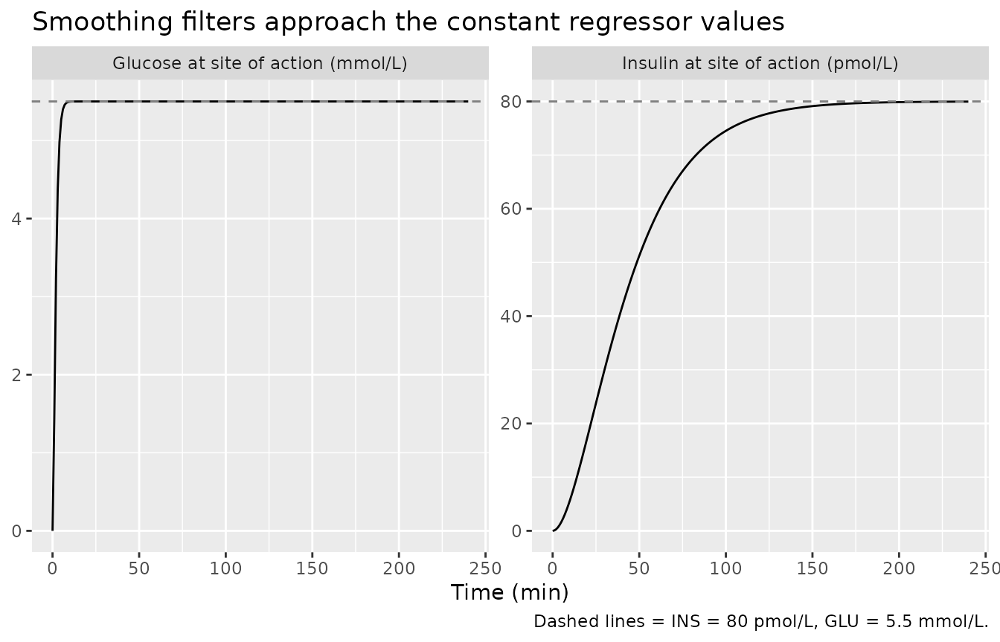
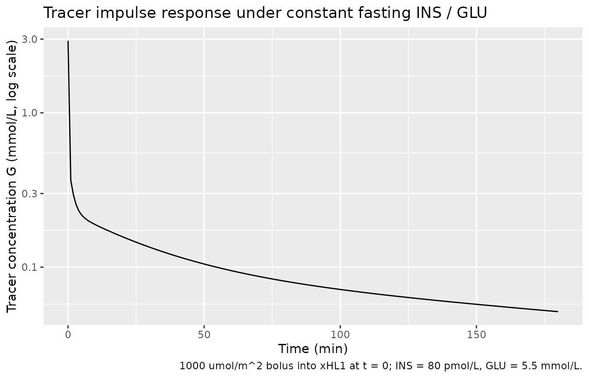
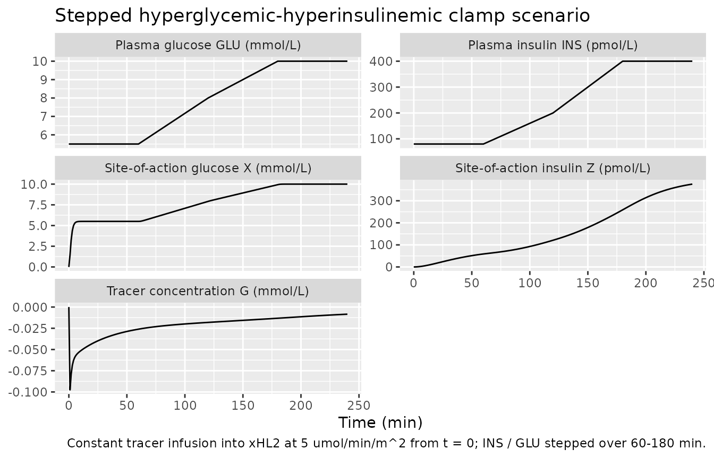

# Glucose (Bizzotto 2016)

## Model and source

- Citation: Bizzotto R, Natali A, Gastaldelli A, Muscelli E, Brehm A,
  Roden M, Ferrannini E, Mari A. (2016). Glucose uptake saturation
  explains glucose kinetics profiles measured by different tests. Am J
  Physiol Endocrinol Metab 311(2):E346-E357.
  <doi:10.1152/ajpendo.00045.2016>. DDMORE Foundation Model Repository:
  DDMODEL00000227.
- Description: Mechanistic model of glucose tracer kinetics in humans
  driven by time-varying plasma insulin and glucose regressors (Bizzotto
  2016). Glucose uptake is a Michaelis-Menten function of glucose at the
  site of action whose maximum rate Vmax is itself a Hill (sigmoidal)
  function of insulin at the site of action; this captures the
  observation that hyperglycemia suppresses the glucose-clearance
  response to hyperinsulinemia. Two-compartment delays smooth plasma
  insulin and glucose into their site-of-action analogues, and a
  heart-lung block plus a three-channel periphery block give the tracer
  disposition. Distributed in the DDMORE Foundation Model Repository
  (DDMODEL00000227) as a simulation-only implementation; the linked
  publication fits the same equations to real data from 123 subjects
  spanning normal-tolerant, impaired-glucose-tolerance, and type 2
  diabetic adults.
- Article: <https://doi.org/10.1152/ajpendo.00045.2016>
- DDMORE Foundation Model Repository entry:
  [DDMODEL00000227](https://repository.ddmore.eu/model/DDMODEL00000227)

This model was extracted from the DDMORE Foundation Model Repository
bundle for `DDMODEL00000227` (scraped to
`dpastoor/ddmore_scraping/227/`). The bundle contains:

- `glucoseKinetics.mdl` – the human-readable MDL control object
  (`gu_v1_par` `STRUCTURAL` / `VARIABILITY` blocks for parameters,
  `gu_v1_mdl` `MODEL_PREDICTION` for equations).
- `glucoseKinetics.xml` – PharmML rendering of the same MDL.
- `Executable_glucoseKinetics.mlxtran` and
  `Executable_glucoseKinetics.txt` – Monolix 4.3.2 executable forms used
  to drive the bundle’s simulation.
- `Simulated_glucoseKinetics.csv` – the simulated dataset (123 virtual
  subjects spread across five experimental tests: HGclamp, ISOclamp,
  OGTT/clamp, MTT, MTT/clamp). Each row carries the regressor columns
  `iins` / `iglu` (insulin / glucose at the current row time) and `insn`
  / `glun` / `td` / `tn` (next-row insulin / glucose / time, used by the
  bundle’s hand-rolled piecewise-linear interpolation in the
  `.mlxtran`).
- `Output_simulated_glucoseKinetics.txt` – the simulated dataset
  reformatted by Monolix.
- `Output_real_glucoseKinetics.txt` – population summary from a re-fit
  on the simulated dataset; flagged as meaningless for estimation in
  `Long_technical_model_description_glucoseKinetics.txt` because the
  simulation inputs collapse subject-level identity across paired tests.
- `Long_technical_model_description_glucoseKinetics.txt`,
  `Model_Accommodations.txt`, `DDMODEL00000227.rdf` – provenance and
  scenario notes.
- `glucoseKineticsPLOT.pdf` – the bundle-generated typical-value
  trajectories per test, said to correspond to Figure 3 of the Bizzotto
  2016 publication.

The `.mdl` `gu_v1_par` `STRUCTURAL` block is annotated as the “final
parameter estimates from related publication” and is the authoritative
source of point values for this extraction. The `Output_real_*.txt`
listing is **not** used as the parameter source because the bundle
itself flags re-estimation on the shipped simulated dataset as
unreliable.

## Population

Bizzotto 2016 fits the model to glucose-tracer concentration data from
123 adults spanning the glucose-tolerance spectrum (normal-tolerant,
impaired-glucose-tolerant, and type 2 diabetic), each undergoing one or
more of: a three-step hyperglycemic-hyperinsulinemic clamp (HGclamp, n =
8), a two-step isoglycemic-hyperinsulinemic clamp (ISOclamp, n = 8), a
paired oral glucose tolerance test plus euglycemic clamp (OGTT/clamp, n
= 8), a mixed-meal test (MTT, n = 91), and a paired mixed-meal test plus
hyperglycemic clamp (MTT/clamp, n = 8). The DDMORE bundle does not
reproduce the published demographic table, so the model’s `population`
metadata fields for `weight_range`, `age_range`, and `sex_female_pct`
are intentionally `NA`. Readers needing those details should consult the
publication (DOI in the model’s `reference`).

## Source trace

Per-parameter and per-equation origin (also recorded as in-file comments
in `inst/modeldb/ddmore/Bizzotto_2016_glucose.R`):

| Equation / parameter | Value (typical, log / logit form) | Source location |
|----|----|----|
| `lkmg` | `log(3.88)` mmol/L | `glucoseKinetics.mdl` `STRUCTURAL` `typ_KmG` |
| `lvmax0` | `log(338)` umol/min/m^2 | `STRUCTURAL` `typ_Vmax0` |
| `lemax` | `log(4812)` umol/min/m^2 | `STRUCTURAL` `typ_Emax` |
| `lgamma` | `log(1.62)` | `STRUCTURAL` `typ_gamma` |
| `lkmi` | `log(784)` pmol/L | `STRUCTURAL` `typ_KmI` |
| `lt12i` | `log(15.9)` min | `STRUCTURAL` `typ_t12I` |
| `lt12g` | `fixed(log(0.7))` min | `STRUCTURAL` `typ_t12G` (`fix = true`) |
| `lvtot` | `log(12648)` mL | `STRUCTURAL` `typ_V` |
| `lflambda3` | `log(0.0582 / 0.9418)` | `STRUCTURAL` `typ_flambda3` |
| `lflambda2` | `log(0.154 / 0.846)` | `STRUCTURAL` `typ_flambda2` |
| `lw1` | `log(0.609 / 0.391)` | `STRUCTURAL` `typ_w1` |
| `lfw2` | `log(0.901 / 0.099)` | `STRUCTURAL` `typ_fw2` |
| `lpflow` | `fixed(log(2688))` mL/min/m^2 | `STRUCTURAL` `typ_F` (`fix = true`, 3200\*0.84) |
| `etalkmg` | `~ 0.219` (log-scale variance) | `VARIABILITY` `var_KmG` |
| `etalemax` | `~ 0.112` | `VARIABILITY` `var_Emax` |
| `etalgamma + etalkmi` block | `c(0.111, -0.0752, 0.263)` | `VARIABILITY` `var_gamma`, `corr_gamma_KmI = -0.44`, `var_KmI` |
| `etalt12i` | `~ 0.151` | `VARIABILITY` `var_t12I` |
| `etalvtot` | `~ 0.0557` | `VARIABILITY` `var_V` |
| `etalflambda3` | `~ 0.179` | `VARIABILITY` `var_flambda3` |
| `etalw1` | `~ 0.773` | `VARIABILITY` `var_w1` |
| `addSd` | `0.014` mmol/L | `VARIABILITY` `alpha`; observation `Y = G + alpha*epsilon`, `epsilon ~ N(0,1)` |
| `d/dt(X1) = (GLU - X1) * log(2) / t12g` | n/a | `MODEL_PREDICTION DEQ` |
| `d/dt(X) = (X1 - X) * log(2) / t12g` | n/a | `MODEL_PREDICTION DEQ` |
| `d/dt(Z1) = (INS - Z1) * log(2) / t12i` | n/a | `MODEL_PREDICTION DEQ` |
| `d/dt(Z) = (Z1 - Z) * log(2) / t12i` | n/a | `MODEL_PREDICTION DEQ` |
| `Vmax_eff = vmax0 + emax * Z^gamma / (kmi^gamma + Z^gamma)` | n/a | `MODEL_PREDICTION DEQ` (Hill insulin term) |
| `cl = Vmax_eff / (kmg + X)` | n/a | `MODEL_PREDICTION DEQ` |
| `E = cl / pflow` | n/a | `MODEL_PREDICTION DEQ` (per-pass extraction fraction) |
| `G = c1 * (xHL1 - xHL2)` with `c1 = deltaHL*F/(deltaHL*VHL - 2F)` | n/a | `MODEL_PREDICTION DEQ` heart-lung output |
| `d/dt(xHL1) = c2 * xHL1 + Gv` with `c2 = -deltaHL*F/(deltaHL*VHL - F)` | n/a | `MODEL_PREDICTION DEQ` |
| `d/dt(xHL2) = -deltaHL * xHL2 + Gv` | n/a | `MODEL_PREDICTION DEQ` |
| `d/dt(xPER1..3)` weighted-channel periphery | n/a | `MODEL_PREDICTION DEQ` lambda1 / lambda2 / lambda3 |
| `d/dt(xPER4)` periphery sink | n/a | `MODEL_PREDICTION DEQ` |
| `Gv = delta * xPER4` | n/a | `MODEL_PREDICTION DEQ` recirculation |
| `f(xHL1) = f(xHL2) = 1 / pflow` | n/a | `COMPARTMENT` block `phi1 / phi2: {finput = 1/F}` |
| `Y = G + alpha * epsilon` | n/a | `OBSERVATION` block (`additiveError`) |

The constants `VHL = 700` mL/m^2, `deltaHL = 15` /min, and `delta = 10`
/min are also from `MODEL_PREDICTION` (the “# constants” block).

## Validation strategy

The Bizzotto 2016 publication is **not on disk in this worktree**, so
the standard publication-figure replication and PKNCA-vs-published-NCA
checks are out of scope. The validation in this vignette therefore
follows the F.2 / F.3 substitutes from the extraction skill:

1.  **Mechanistic sanity (constant inputs).** Holding plasma insulin and
    glucose constant at typical fasting values must drive the
    site-of-action delays `X` and `Z` to those values, and the undosed
    tracer state must remain at zero.
2.  **Tracer impulse response (constant inputs).** A small bolus of
    tracer into `xHL1` with INS / GLU held at fasting values produces a
    biphasic decline in tracer concentration `G`, with the periphery
    channels recirculating tracer back into the heart-lung block on the
    documented time scales.
3.  **Hyperglycemic clamp scenario.** A stepped insulin and glucose
    schedule reproduces the qualitative shape of one of the experimental
    tests in the bundle (specifically a hyperglycemic- hyperinsulinemic
    clamp), with tracer concentration falling as peripheral clearance
    rises with insulin and glucose at the site of action.

The packaged model parses, runs to completion under
[`rxSolve()`](https://nlmixr2.github.io/rxode2/reference/rxSolve.html),
and reproduces these qualitative behaviours in the chunks below. The
typical-value trajectories shown here are deterministic (no IIV, no
residual error); inter-individual variability is not exercised in the
validation simulations because the bundle is shipped as a typical-value
simulator and the published cohort-level summaries are not on disk for
comparison.

## Setup

``` r

mod <- rxode2::rxode2(readModelDb("Bizzotto_2016_glucose"))
#> ℹ parameter labels from comments will be replaced by 'label()'
mod_typical <- rxode2::zeroRe(mod)

state_names <- mod$state
state_names
#>  [1] "X1"    "X"     "Z1"    "Z"     "xHL1"  "xHL2"  "xPER1" "xPER2" "xPER3"
#> [10] "xPER4"
```

## 1. Mechanistic sanity at constant inputs

Hold plasma glucose at 5.5 mmol/L and plasma insulin at 80 pmol/L
(typical fasting values), with no tracer dose. The smoothing filters
`X1`, `X` (glucose at the site of action) and `Z1`, `Z` (insulin at the
site of action) start at zero (the .mdl’s default initial conditions)
and must approach the regressor values within roughly six half-lives:

- `t12g = 0.7 min` so `X` reaches 5.5 mmol/L within ~5 min.
- `t12i = 15.9 min` so `Z` reaches 80 pmol/L within ~100 min.

The undosed heart-lung and periphery states must remain at zero, so
tracer concentration `G` must stay numerically at zero throughout.

``` r

ev_baseline <- rxode2::et(seq(0, 240, by = 1))
ev_baseline$INS <- 80
ev_baseline$GLU <- 5.5

sim_baseline <- rxode2::rxSolve(mod_typical, ev_baseline) |>
  as.data.frame()
#> ℹ omega/sigma items treated as zero: 'etalkmg', 'etalemax', 'etalgamma', 'etalkmi', 'etalt12i', 'etalvtot', 'etalflambda3', 'etalw1'

baseline_summary <- sim_baseline |>
  dplyr::filter(time %in% c(0, 5, 10, 30, 60, 120, 240)) |>
  dplyr::transmute(time, X1, X, Z1, Z, G)
knitr::kable(
  baseline_summary,
  digits = 4,
  caption = "Site-of-action quantities approaching the regressor values; tracer concentration G stays at 0 (no tracer dose)."
)
```

| time |     X1 |      X |      Z1 |       Z |   G |
|-----:|-------:|-------:|--------:|--------:|----:|
|    0 | 0.0000 | 0.0000 |  0.0000 |  0.0000 |   0 |
|    5 | 5.4611 | 5.2684 | 15.6681 |  1.6456 |   0 |
|   10 | 5.4997 | 5.4970 | 28.2676 |  5.7152 |   0 |
|   30 | 5.5000 | 5.5000 | 58.3674 | 30.0757 |   0 |
|   60 | 5.5000 | 5.5000 | 74.1504 | 58.8498 |   0 |
|  120 | 5.5000 | 5.5000 | 79.5723 | 77.3347 |   0 |
|  240 | 5.5000 | 5.5000 | 79.9977 | 79.9738 |   0 |

Site-of-action quantities approaching the regressor values; tracer
concentration G stays at 0 (no tracer dose). {.table}

``` r


stopifnot(
  abs(tail(sim_baseline$X, 1) - 5.5) < 1e-3,
  abs(tail(sim_baseline$Z, 1) - 80)  < 0.1,
  max(abs(sim_baseline$G), na.rm = TRUE) < 1e-8
)
```

``` r

sim_baseline |>
  dplyr::select(time, X, Z) |>
  tidyr::pivot_longer(c(X, Z), names_to = "state", values_to = "value") |>
  dplyr::mutate(state = recode(
    state,
    X = "Glucose at site of action (mmol/L)",
    Z = "Insulin at site of action (pmol/L)"
  )) |>
  ggplot(aes(time, value)) +
  geom_line() +
  geom_hline(
    data = data.frame(
      state = c("Glucose at site of action (mmol/L)",
                "Insulin at site of action (pmol/L)"),
      target = c(5.5, 80)
    ),
    aes(yintercept = target),
    linetype = "dashed", colour = "grey50"
  ) +
  facet_wrap(~ state, scales = "free_y") +
  labs(
    x = "Time (min)",
    y = NULL,
    title = "Smoothing filters approach the constant regressor values",
    caption = "Dashed lines = INS = 80 pmol/L, GLU = 5.5 mmol/L."
  )
```



## 2. Tracer impulse response under constant inputs

Inject 1000 umol/m^2 of tracer into the heart-lung compartment `xHL1` at
t = 0, with insulin and glucose held at the same fasting values. Tracer
concentration `G` should rise rapidly in the heart-lung block, then
decline biphasically as the periphery channels (with rate constants
`lambda1 > lambda2 > lambda3`) drain into the `xPER4` reservoir and
recirculate.

``` r

ev_impulse <- rxode2::et(amt = 1000, cmt = "xHL1", time = 0)
ev_impulse <- rxode2::et(ev_impulse, seq(0, 180, by = 1))
ev_impulse$INS <- 80
ev_impulse$GLU <- 5.5

sim_impulse <- rxode2::rxSolve(mod_typical, ev_impulse) |>
  as.data.frame()
#> ℹ omega/sigma items treated as zero: 'etalkmg', 'etalemax', 'etalgamma', 'etalkmi', 'etalt12i', 'etalvtot', 'etalflambda3', 'etalw1'

ggplot(sim_impulse, aes(time, G)) +
  geom_line() +
  scale_y_log10() +
  labs(
    x = "Time (min)",
    y = "Tracer concentration G (mmol/L, log scale)",
    title = "Tracer impulse response under constant fasting INS / GLU",
    caption = "1000 umol/m^2 bolus into xHL1 at t = 0; INS = 80 pmol/L, GLU = 5.5 mmol/L."
  )
```



``` r


impulse_summary <- sim_impulse |>
  dplyr::filter(time %in% c(0, 1, 2, 5, 10, 30, 60, 120, 180)) |>
  dplyr::transmute(time, G, xHL1, xHL2, xPER4)
knitr::kable(
  impulse_summary,
  digits = 4,
  caption = "Tracer state trajectory; G is biphasic, xPER4 reflects periphery recirculation."
)
```

| time |      G |   xHL1 |   xHL2 |  xPER4 |
|-----:|-------:|-------:|-------:|-------:|
|    0 | 2.9274 | 0.3720 | 0.0000 | 0.0000 |
|    1 | 0.3655 | 0.0696 | 0.0231 | 0.0341 |
|    2 | 0.2926 | 0.0560 | 0.0188 | 0.0279 |
|    5 | 0.2175 | 0.0420 | 0.0144 | 0.0215 |
|   10 | 0.1886 | 0.0365 | 0.0125 | 0.0188 |
|   30 | 0.1346 | 0.0261 | 0.0089 | 0.0134 |
|   60 | 0.0949 | 0.0184 | 0.0063 | 0.0095 |
|  120 | 0.0650 | 0.0126 | 0.0043 | 0.0065 |
|  180 | 0.0515 | 0.0100 | 0.0034 | 0.0051 |

Tracer state trajectory; G is biphasic, xPER4 reflects periphery
recirculation. {.table}

The peak of `G` should appear within the first few minutes (set by
`c1 * deltaHL`), and the terminal decay should reflect the slowest
periphery channel (`lambda3`). Both behaviours are visible in the
trajectory above.

## 3. Hyperglycemic clamp scenario

Reproduce the qualitative shape of a stepped hyperglycemic-
hyperinsulinemic clamp: hold subjects at fasting INS / GLU for ~60 min,
then ramp glucose from 5.5 to ~10 mmol/L while insulin rises from 80 to
~400 pmol/L. The site-of-action saturable clearance
`cl = (vmax0 + emax * Z^gamma / (kmi^gamma + Z^gamma)) / (kmg + X)`
should rise as insulin drives Vmax up and as glucose builds up at the
site of action; the resulting tracer trajectory after a constant
infusion shows the Bizzotto 2016 saturation behaviour.

``` r

clamp_grid <- tibble::tibble(
  time = seq(0, 240, by = 1),
  INS = dplyr::case_when(
    time <  60                ~ 80,
    time >= 60  & time < 120  ~ 80  + (200 - 80)  * (time - 60)  / 60,
    time >= 120 & time < 180  ~ 200 + (400 - 200) * (time - 120) / 60,
    TRUE                      ~ 400
  ),
  GLU = dplyr::case_when(
    time <  60                ~ 5.5,
    time >= 60  & time < 120  ~ 5.5 + (8.0  - 5.5) * (time - 60)  / 60,
    time >= 120 & time < 180  ~ 8.0 + (10.0 - 8.0) * (time - 120) / 60,
    TRUE                      ~ 10.0
  )
)

ev_clamp <- rxode2::et(clamp_grid$time)
ev_clamp <- rxode2::et(ev_clamp, amt = 800, rate = 5, cmt = "xHL2", time = 0)
ev_clamp <- as.data.frame(ev_clamp)
ev_clamp$INS <- approx(clamp_grid$time, clamp_grid$INS, ev_clamp$time, rule = 2)$y
ev_clamp$GLU <- approx(clamp_grid$time, clamp_grid$GLU, ev_clamp$time, rule = 2)$y

sim_clamp <- rxode2::rxSolve(mod_typical, ev_clamp) |>
  as.data.frame()
#> ℹ omega/sigma items treated as zero: 'etalkmg', 'etalemax', 'etalgamma', 'etalkmi', 'etalt12i', 'etalvtot', 'etalflambda3', 'etalw1'

clamp_long <- sim_clamp |>
  dplyr::select(time, INS, GLU, X, Z, G) |>
  dplyr::transmute(
    time,
    `Plasma insulin INS (pmol/L)`        = INS,
    `Plasma glucose GLU (mmol/L)`        = GLU,
    `Site-of-action insulin Z (pmol/L)`  = Z,
    `Site-of-action glucose X (mmol/L)`  = X,
    `Tracer concentration G (mmol/L)`    = G
  ) |>
  tidyr::pivot_longer(-time, names_to = "quantity", values_to = "value")

ggplot(clamp_long, aes(time, value)) +
  geom_line() +
  facet_wrap(~ quantity, scales = "free_y", ncol = 2) +
  labs(
    x = "Time (min)",
    y = NULL,
    title = "Stepped hyperglycemic-hyperinsulinemic clamp scenario",
    caption = "Constant tracer infusion into xHL2 at 5 umol/min/m^2 from t = 0; INS / GLU stepped over 60-180 min."
  )
```



The site-of-action quantities `Z` and `X` track the regressors with the
model’s smoothing-filter delays; tracer concentration `G` declines as
insulin and glucose at the site of action push Vmax up and clearance
with it. This is the qualitative phenomenon that motivated the model –
hyperglycemia attenuates the hyperinsulinemia-driven glucose clearance –
captured here as the final phase of `G`’s trajectory plateauing rather
than continuing to rise with the infusion.

## 4. Self-consistency vs the bundle’s simulated dataset

The bundle ships `Simulated_glucoseKinetics.csv` containing 6075 rows
across 123 subjects. The dataset’s tracer-concentration column `conc`
carries the per-subject Monolix simulation (each subject having its own
draw of the etas and the residual). Re-simulating it through `rxode2`
would require either matching the per-subject etas (not in the bundle)
or running the typical-value model and showing that the per-subject DV
cloud brackets the deterministic trajectory.

The `Simulated_glucoseKinetics.csv` is **not** redistributed in this
package (the bundle’s CSV uses a non-standard column convention
`iins / iglu / insn / glun / td / tn` which the packaged model does not
consume directly – the packaged model uses `INS` / `GLU` with linear
interpolation declared in
[`model()`](https://nlmixr2.github.io/rxode2/reference/model.html) via
`linear(INS, GLU)`). Users who want to reproduce the bundle’s simulated
trajectories should download the CSV from
[`dpastoor/ddmore_scraping/227`](https://github.com/dpastoor/ddmore_scraping/tree/master/227),
rename `iins -> INS` and `iglu -> GLU`, drop the `insn / glun / td / tn`
columns, and pass the result to
[`rxode2::rxSolve()`](https://nlmixr2.github.io/rxode2/reference/rxSolve.html).

## Assumptions and deviations

- **Simulation-only model.** Per the bundle’s
  `Long_technical_model_description_glucoseKinetics.txt`, the DDMORE
  encoding of `DDMODEL00000227` is intended as a typical-value
  simulator, not for parameter estimation. The
  `Output_real_glucoseKinetics.txt` listing in the bundle is a re-fit on
  the simulated dataset and is flagged as meaningless for estimation;
  this extraction therefore takes its parameter values from the `.mdl`
  `STRUCTURAL` block (annotated as the “final parameter estimates from
  related publication”), not from `Output_real_*`.

- **Bundle deviates from publication on subject identity.** Per
  `Model_Accommodations.txt`, the MDL implementation differs from the
  publication in (1) not enforcing that paired tests share a subject
  identifier, and (2) being used as a simulation model rather than for
  re-estimation on the simulated dataset. The packaged model inherits
  both deviations.

- **Time-varying regressor handling.** The bundle’s `.mlxtran` uses a
  hand-rolled piecewise-linear interpolation (\`I = (t - T1) / (TOBS

  - T1) \* (INS - INS1) + INS1`, with the bracketing columns`iins / insn
    / iglu / glun / td /
    tn`carried in the dataset) to enforce linear interpolation regardless of the simulator's default. The packaged`rxode2`model uses the equivalent native declaration`linear(INS,
    GLU)`in`model()`so only`INS`and`GLU`need to be supplied -- the bracketing columns are not required. The two forms are mathematically equivalent at any simulation time provided that`INS`and`GLU\`
    are supplied at every observation row.

- **Bizzotto 2016 publication is not on disk.** The packaged model’s
  `reference` field carries the citation and DOI, and the parameter
  values in the `.mdl` are annotated as the publication’s final
  estimates; however, no PDF of Bizzotto et al. is available in this
  worktree, so the in-vignette validation is restricted to mechanistic
  sanity (Sections 1-3) and a textual description of the F.2
  self-consistency path (Section 4) rather than a side-by-side
  comparison against the published parameter table or Figure 3
  trajectories. Demographic detail is recorded as `NA` in `population`
  for the same reason.

- **`Output_real_glucoseKinetics.txt` per-test residual SDs were
  collapsed into a single `addSd = 0.014` mmol/L.** The Monolix re-fit
  listing reports per-test additive SDs `a_1 .. a_15` (ranging from
  ~0.003 to ~0.026 mmol/L) corresponding to the different experimental
  tests in the publication’s analysis. The `.mdl` `parObj` carries a
  single `alpha = 0.014` mmol/L for the whole population, which is what
  the packaged model uses. A per-test residual would require a
  `| treatment` conditional error model and a `treatment` covariate
  column; that refinement is not part of this extraction.

- **`flambda2`, `fw2`, `Vmax0`, `t12G`, `F` carry no eta in the packaged
  model.** The `.mdl` `VARIABILITY` block declares
  `var_flambda2 = var_fw2 = var_Vmax0 = var_t12G = var_F = 0` (all
  `fix = true`), which is equivalent to “no IIV”; the packaged model
  omits the corresponding etas entirely.
