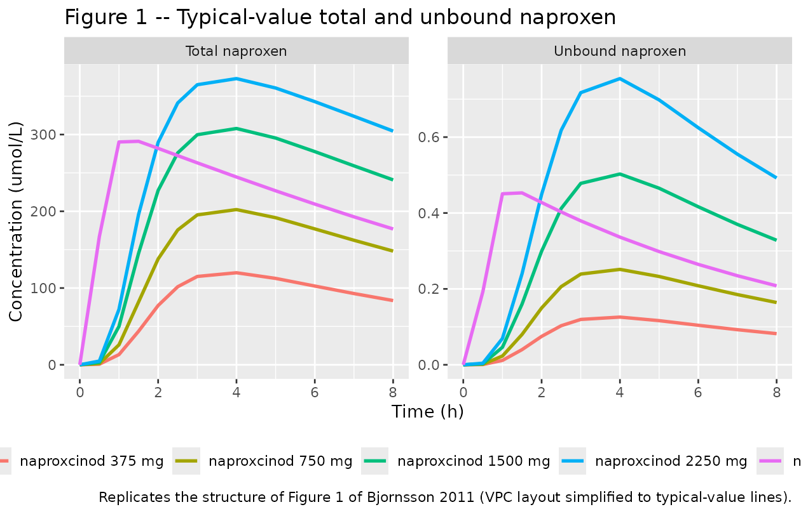
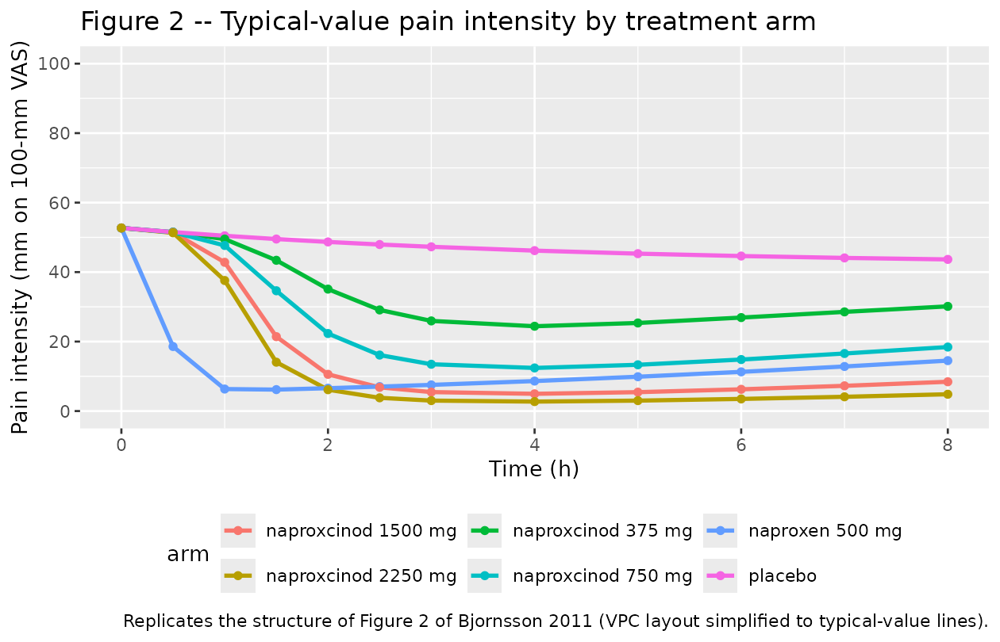
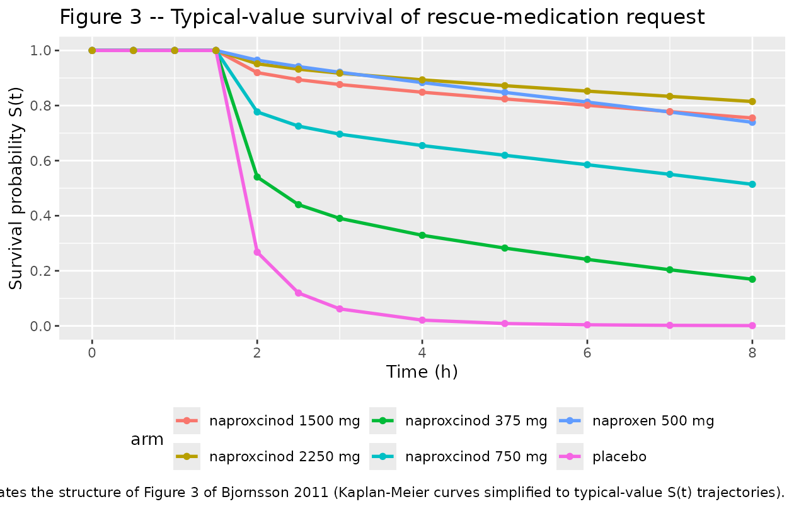

# Naproxcinod (Bjornsson 2011)

## Model and source

- Citation: Bjornsson MA, Simonsson USH. Modelling of pain intensity and
  informative dropout in a dental pain model after naproxcinod, naproxen
  and placebo administration. Br J Clin Pharmacol. 2011;71(6):899-906.
  <doi:10.1111/j.1365-2125.2011.03924.x>.
- Description: Joint population PK / pain intensity (PI) /
  informative-dropout model for naproxen following oral administration
  of naproxcinod (a naproxen nitrate ester prodrug), naproxen, or
  placebo after wisdom-tooth extraction (Bjornsson 2011, 242 patients
  with moderate-to-severe post-surgical dental pain). PK:
  one-compartment disposition of unbound naproxen with parallel Savic
  transit-compartment absorption chains for naproxcinod (MTT 1.77 h, NN
  3.58) and naproxen (MTT 0.500 h, NN 4.23) feeding a shared central
  compartment. Total naproxen is computed from unbound via a saturable
  albumin-binding equation Ctot = Cu + Bmax \* Cu / (Km + Cu) (Bmax =
  643 umol/L, Km = 0.549 umol/L). Relative bioavailability of naproxen
  via naproxcinod vs naproxen is 59.7%. PD: pain intensity on a 100-mm
  visual analogue scale modeled as PI(t) = PI_baseline \* (1 -
  placebo(t)) \* (1 - drug(t)), where placebo(t) = Pmax \* (1 - exp(-kpl
  \* t)) (Pmax 20.2%, kpl 0.237 /h; additive IIV on Pmax allows
  individual PI to either decrease or increase from baseline) and
  drug(t) is a sigmoid Emax function of unbound naproxen with Emax fixed
  at 1, EC50 0.135 umol/L, and Hill exponent 1.61. TTE:
  rescue-medication request modeled as a Weibull hazard (lambda 0.00999,
  alpha 0.729) with log-linear covariate effects of PI(t) and
  (PI_baseline - 55) on the slope of PI(t); the hazard is set to zero
  for t \< 1.5 h to reflect the protocol’s rescue-medication abstention
  window.
- Article: <https://doi.org/10.1111/j.1365-2125.2011.03924.x>

The model is a joint population PK / pain intensity (PI) /
informative-dropout analysis of a randomized, double-blind,
placebo-controlled, single-dose dental-pain study after wisdom-tooth
extraction. Patients received either naproxcinod (a naproxen nitrate
ester prodrug; 375, 750, 1500, or 2250 mg), naproxen (500 mg), or
placebo. The PK of unbound naproxen is described by a one-compartment
disposition with parallel Savic transit-compartment absorption chains
for naproxcinod and naproxen feeding a shared central compartment, and
total naproxen is derived from unbound through a saturable
albumin-binding equation. Pain intensity on a 100-mm VAS is modelled by
a multiplicative placebo + drug-effect model on baseline PI, with
placebo onset described by an exponential and the drug effect by a
sigmoid Emax in unbound naproxen. Rescue-medication request is described
by a Weibull time-to-event hazard with log-linear covariate effects of
PI(t) and baseline PI deviation from the cohort median (55 mm).

## Population

The dataset is the single-dose, single-centre wisdom-tooth-extraction
trial of Bjornsson 2011 Table 1: **242 patients** (48% male, 52%
female), age 19-38 years, BMI 18-31 kg/m^2, randomized between
naproxcinod 375, 750, 1500, and 2250 mg (n = 41, 37, 42, 41), naproxen
500 mg (n = 39), and placebo (n = 42). Baseline pain intensity ranged
7-100 mm on a 100-mm VAS (entry criterion: PI \>= 40 mm within 6 h of
local anaesthetic). The trial was performed at the Eastman International
Centre for Excellence in Dentistry (London, UK), under ICH GCP and
sponsored by AstraZeneca.

PK samples were collected in roughly one-third of patients (15, 12, 18,
15, and 16 patients in the naproxcinod 375 / 750 / 1500 / 2250 mg and
naproxen 500 mg arms respectively) at 0.5, 1, 1.5, 2, 2.5, 3, 4, 5, 6,
7, and 8 h post-dose. Total naproxen concentrations were measured
throughout; unbound concentrations were measured by ultrafiltration at
1, 3, and 8 h. Three subjects who took rescue medication before 1.5 h
were excluded from the dropout analysis.

The same metadata is available programmatically:

``` r

mod <- rxode2::rxode(readModelDb("Bjornsson_2011_naproxcinod"))
str(mod$population, max.level = 1)
#> List of 12
#>  $ species       : chr "human"
#>  $ n_subjects    : int 242
#>  $ n_studies     : int 1
#>  $ age_range     : chr "19-38 years"
#>  $ age_median    : chr "~25 years (per-arm means in Bjornsson 2011 Table 1 ranged 24.0-25.6 years)"
#>  $ weight_range  : chr "not transcribed in the publication (BMI 18-31 kg/m^2 reported in Table 1)"
#>  $ sex_female_pct: num 52
#>  $ race_ethnicity: NULL
#>  $ disease_state : chr "Healthy adults undergoing surgical removal of mandibular wisdom teeth under local anaesthesia, with moderate-to"| __truncated__
#>  $ dose_range    : chr "Single oral dose: naproxcinod 375 mg (1182 umol), 750 mg (2364 umol), 1500 mg (4728 umol), or 2250 mg (7092 umo"| __truncated__
#>  $ regions       : chr "United Kingdom (Eastman International Centre for Excellence in Dentistry, London)"
#>  $ notes         : chr "PI measured on a 100-mm visual analogue scale (VAS) immediately before drug administration (baseline) and at 0."| __truncated__
```

## Source trace

Per-parameter origins are recorded as inline comments next to each
`ini()` entry in
`inst/modeldb/specificDrugs/Bjornsson_2011_naproxcinod.R`. The table
below collects them in one place for review.

| nlmixr2 parameter | Value | Source location |
|----|----|----|
| `lcl` | log(515) | Table 2, CL_u/F = 515 L/h |
| `lvc` | log(4290) | Table 2, V_u/F = 4290 L |
| `lmtt_naproxcinod` | log(1.77) | Table 2, MTT_naproxcinod = 1.77 h |
| `lnn_naproxcinod` | log(3.58) | Table 2, NN_naproxcinod = 3.58 |
| `lmtt_naproxen` | log(0.500) | Table 2, MTT_naproxen = 0.500 h |
| `lnn_naproxen` | log(4.23) | Table 2, NN_naproxen = 4.23 |
| `lbmax` | log(643) | Table 2, Bmax = 643 umol/L |
| `lkm` | log(0.549) | Table 2, Km = 0.549 umol/L |
| `lfdepot_naproxcinod` | log(0.597) | Table 2, F_rel = 59.7% |
| `etalcl` | log(1 + 0.25^2) | Table 2, IIV CL_u/F = 25% |
| `etalvc` | log(1 + 0.44^2) | Table 2, IIV V_u/F = 44% |
| `etalbmax` | log(1 + 0.17^2) | Table 2, IIV Bmax = 17% |
| `etalmtt_naproxcinod`/`etalnn_naproxcinod` block | rho = -0.52 | Table 2, IIV MTT_NC / NN_NC = 58% / 58%; Corr(MTT_NC, NN_NC) = -52% |
| `etalmtt_naproxen` | log(1 + 1.00^2) | Table 2, IIV MTT_naproxen = 100% |
| `etalnn_naproxen` | log(1 + 0.64^2) | Table 2, IIV NN_naproxen = 64% |
| `addSd` | 6.19 | Table 2, sigma_T,add = 6.19 umol/L |
| `propSd` | 0.0843 | Table 2, sigma_T,prop = 8.43% |
| `propSd_Cc_unbound` | 0.186 | Table 2, sigma_U,prop = 18.6% |
| `lrbase` | log(52.7) | Table 3, PI_baseline = 52.7 mm |
| `pmax` | 0.202 | Table 3, P_max = 20.2% (fractional decrease) |
| `lkpl` | log(0.237) | Table 3, k_pl = 0.237 /h |
| `lemax` | fixed(log(1)) | Methods + Table 3: Emax fixed at 1 |
| `lec50` | log(0.135) | Table 3, EC50 = 0.135 umol/L |
| `lhill` | log(1.61) | Table 3, gamma = 1.61 |
| `etalrbase` | log(1 + 0.32^2) | Table 3, IIV PI_baseline = 32% |
| `etapmax` | (1.20 \* 0.202)^2 | Table 3, IIV P_max = 120% (additive) |
| `etalkpl` | log(1 + 0.43^2) | Table 3, IIV k_pl = 43% |
| `etalec50` | log(1 + 1.20^2) | Table 3, IIV EC50 = 120% |
| `addSd_PI` | 7.82 | Table 3, sigma_PI = 7.82 mm |
| `llambda_haz` | log(0.00999) | Table 3, lambda = 0.00999 |
| `lalpha_haz` | log(0.729) | Table 3, alpha = 0.729 |
| `e_pi_haz` | 0.0782 | Table 3, q_PI = 0.0782 |
| `e_pibase_haz` | -0.00261 | Table 3, q_baseline = -0.00261 |
| Saturable binding `Ctot = Cu + Bmax * Cu / (Km + Cu)` | (equation) | Methods, “Pharmacokinetic model” |
| Sigmoid Emax drug effect | (equation) | Methods, “Model for PI” |
| Multiplicative PI combination | (equation, image-encoded) | Methods, “Model for PI” |
| Weibull hazard with log-linear COV term | (equation, image-encoded) | Methods, “Model for request of rescue medication” |
| 1.5 h rescue-medication abstention window | (logic) | Methods, “Model for request of rescue medication” |

## Mechanistic structure

The PK of unbound naproxen is one-compartmental with apparent unbound
clearance CL_u/F = 515 L/h and apparent unbound volume V_u/F = 4290 L.
Two parallel transit-compartment absorption chains feed a shared central
compartment: naproxcinod (MTT 1.77 h, NN 3.58) acts as a prodrug for
naproxen with relative bioavailability F_rel = 59.7%, and naproxen (MTT
0.500 h, NN 4.23) has reference bioavailability of 1. Total naproxen is
derived from unbound by the saturable albumin-binding model

``` math
C_\mathrm{tot} = C_u + \frac{B_\mathrm{max} \cdot C_u}{K_m + C_u}
```

with B_max = 643 umol/L and K_m = 0.549 umol/L. The Bmax corresponds to
approximately one binding site per albumin molecule.

Pain intensity is modelled by

``` math
\mathrm{PI}(t) = \mathrm{PI}_{\mathrm{baseline}} \cdot \big(1 - \mathrm{placebo}(t)\big) \cdot \big(1 - \mathrm{drug}(t)\big)
```

with placebo(t) = P_max \* (1 - exp(-k_pl \* t)) (P_max = 0.202, k_pl =
0.237 /h) and drug(t) = E_max \* Cu^gamma / (EC50^gamma + Cu^gamma)
(E_max fixed at 1, EC50 = 0.135 umol/L, gamma = 1.61). PI is clamped to
\[0, 100\] mm. The IIV on P_max is additive (P_max_i = P_max + eta_pmax)
so the individual placebo effect can cross zero.

Rescue-medication time-to-event is a Weibull baseline hazard with
log-linear covariate effects:

``` math
h(t) = \big[\lambda \cdot \alpha \cdot (\lambda \cdot (t - 1.5))^{\alpha - 1}\big] \cdot \exp\Big(\big[q_{PI} + q_{\mathrm{baseline}} \cdot (\mathrm{PI}_{\mathrm{baseline}} - 55)\big] \cdot \mathrm{PI}(t)\Big)
```

for t \>= 1.5 h (the protocol’s rescue-medication abstention window) and
zero for t \< 1.5 h. The baseline-PI modulator captures the paper’s
clinical finding that subjects entering the study with a high baseline
PI have a lower hazard at a given current PI than those entering with a
low baseline.

## Virtual cohort

The figures below use typical-value (no between-subject variability)
simulations for each treatment arm at the protocol’s PI / PK sampling
grid (0, 0.5, 1, 1.5, 2, 2.5, 3, 4, 5, 6, 7, 8 h). Doses are entered in
**micromoles of the parent compound** dosed (naproxcinod or naproxen).
The molecular weights used for the mg-to-umol conversion are 317.30
g/mol (naproxcinod) and 230.26 g/mol (naproxen), giving the dose
conversions tabulated below.

``` r

arms <- tibble::tribble(
  ~arm,                   ~depot,                  ~mg,    ~mw,    ~umol,
  "placebo",              "depot_naproxen",        0,      230.26, 0,
  "naproxen 500 mg",      "depot_naproxen",        500,    230.26, 500 / 230.26 * 1000,
  "naproxcinod 375 mg",   "depot_naproxcinod",     375,    317.30, 375 / 317.30 * 1000,
  "naproxcinod 750 mg",   "depot_naproxcinod",     750,    317.30, 750 / 317.30 * 1000,
  "naproxcinod 1500 mg",  "depot_naproxcinod",     1500,   317.30, 1500 / 317.30 * 1000,
  "naproxcinod 2250 mg",  "depot_naproxcinod",     2250,   317.30, 2250 / 317.30 * 1000
)
arms$umol <- round(arms$umol, 0)
arms |>
  dplyr::rename(
    "Arm"        = arm,
    "Depot cmt"  = depot,
    "Dose (mg)"  = mg,
    "MW (g/mol)" = mw,
    "Dose (umol)" = umol
  ) |>
  knitr::kable(caption = "Six arms of Bjornsson 2011 single-dose dental-pain trial.")
```

| Arm                 | Depot cmt         | Dose (mg) | MW (g/mol) | Dose (umol) |
|:--------------------|:------------------|----------:|-----------:|------------:|
| placebo             | depot_naproxen    |         0 |     230.26 |           0 |
| naproxen 500 mg     | depot_naproxen    |       500 |     230.26 |        2171 |
| naproxcinod 375 mg  | depot_naproxcinod |       375 |     317.30 |        1182 |
| naproxcinod 750 mg  | depot_naproxcinod |       750 |     317.30 |        2364 |
| naproxcinod 1500 mg | depot_naproxcinod |      1500 |     317.30 |        4727 |
| naproxcinod 2250 mg | depot_naproxcinod |      2250 |     317.30 |        7091 |

Six arms of Bjornsson 2011 single-dose dental-pain trial. {.table}

The PI / PK observation grid mirrors the protocol:

``` r

obs_times <- c(0, 0.5, 1, 1.5, 2, 2.5, 3, 4, 5, 6, 7, 8)
obs_times
#>  [1] 0.0 0.5 1.0 1.5 2.0 2.5 3.0 4.0 5.0 6.0 7.0 8.0
```

## Simulation

Each arm is simulated as a single typical-value subject. Doses target
the arm-specific depot (`depot_naproxcinod` or `depot_naproxen`), and
the placebo arm has no dosing event but is solved on the same
observation grid. Each subject has a unique ID so a `bind_rows()`-ed
multi-arm table satisfies the `rxSolve` per-ID disjointness rule. The PK
/ PD parameters are taken at their population-typical values via
`zeroRe()`.

``` r

mod_typical <- rxode2::zeroRe(mod)

# One typical-value subject per arm. A token `evid = 1, amt = 0` event at
# t = 0 on `depot_naproxen` for the placebo arm primes the transit() reader
# so the rxode2 solver evaluates podo()/tad() on a defined compartment;
# this avoids transient NaN in derived variables when no dose is present.
build_events <- function(arm_row, id) {
  if (arm_row$umol == 0) {
    et <- rxode2::et(amt = 0, cmt = "depot_naproxen", time = 0, evid = 1)
  } else {
    et <- rxode2::et(amt = arm_row$umol, cmt = arm_row$depot, time = 0)
  }
  et <- et |> rxode2::et(obs_times, cmt = "Cc")
  ev_df <- as.data.frame(et)
  ev_df$id  <- id
  ev_df$arm <- arm_row$arm
  ev_df
}

events_all <- dplyr::bind_rows(lapply(seq_len(nrow(arms)),
                                      function(i) build_events(arms[i, ], id = i)))
stopifnot(!anyDuplicated(unique(events_all[, c("id", "time", "evid")])))

sim_typical <- rxode2::rxSolve(
  mod_typical,
  events = events_all,
  keep   = "arm"
) |> as.data.frame()
#> ℹ omega/sigma items treated as zero: 'etalcl', 'etalvc', 'etalbmax', 'etalmtt_naproxcinod', 'etalnn_naproxcinod', 'etalmtt_naproxen', 'etalnn_naproxen', 'etalrbase', 'etapmax', 'etalkpl', 'etalec50'
#> Warning: multi-subject simulation without without 'omega'

# Drop time-0 row for plotting only when needed (concentrations are 0 there).
head(sim_typical, 12)
#>    id time  cl   vc mtt_naproxcinod nn_naproxcinod mtt_naproxen nn_naproxen
#> 1   1  0.0 515 4290            1.77           3.58          0.5        4.23
#> 2   1  0.5 515 4290            1.77           3.58          0.5        4.23
#> 3   1  1.0 515 4290            1.77           3.58          0.5        4.23
#> 4   1  1.5 515 4290            1.77           3.58          0.5        4.23
#> 5   1  2.0 515 4290            1.77           3.58          0.5        4.23
#> 6   1  2.5 515 4290            1.77           3.58          0.5        4.23
#> 7   1  3.0 515 4290            1.77           3.58          0.5        4.23
#> 8   1  4.0 515 4290            1.77           3.58          0.5        4.23
#> 9   1  5.0 515 4290            1.77           3.58          0.5        4.23
#> 10  1  6.0 515 4290            1.77           3.58          0.5        4.23
#> 11  1  7.0 515 4290            1.77           3.58          0.5        4.23
#> 12  1  8.0 515 4290            1.77           3.58          0.5        4.23
#>    bmax    km fdepot_naproxcinod ktr_naproxcinod ktr_naproxen       kel
#> 1   643 0.549              0.597        2.587571        10.46 0.1200466
#> 2   643 0.549              0.597        2.587571        10.46 0.1200466
#> 3   643 0.549              0.597        2.587571        10.46 0.1200466
#> 4   643 0.549              0.597        2.587571        10.46 0.1200466
#> 5   643 0.549              0.597        2.587571        10.46 0.1200466
#> 6   643 0.549              0.597        2.587571        10.46 0.1200466
#> 7   643 0.549              0.597        2.587571        10.46 0.1200466
#> 8   643 0.549              0.597        2.587571        10.46 0.1200466
#> 9   643 0.549              0.597        2.587571        10.46 0.1200466
#> 10  643 0.549              0.597        2.587571        10.46 0.1200466
#> 11  643 0.549              0.597        2.587571        10.46 0.1200466
#> 12  643 0.549              0.597        2.587571        10.46 0.1200466
#>      Cc_unbound           Cc pibase_i pmax_i   kpl emax  ec50 hill       cu_pos
#> 1  0.000000e+00 0.000000e+00     52.7  0.202 0.237    1 0.135 1.61 0.000000e+00
#> 2  1.984840e-20 2.326670e-17     52.7  0.202 0.237    1 0.135 1.61 1.984840e-20
#> 3  4.971793e-20 5.828037e-17     52.7  0.202 0.237    1 0.135 1.61 4.971793e-20
#> 4  5.883689e-20 6.896980e-17     52.7  0.202 0.237    1 0.135 1.61 5.883689e-20
#> 5  6.717272e-20 7.874123e-17     52.7  0.202 0.237    1 0.135 1.61 6.717272e-20
#> 6  7.347448e-20 8.612829e-17     52.7  0.202 0.237    1 0.135 1.61 7.347448e-20
#> 7  7.627882e-20 8.941559e-17     52.7  0.202 0.237    1 0.135 1.61 7.627882e-20
#> 8  7.384486e-20 8.656246e-17     52.7  0.202 0.237    1 0.135 1.61 7.384486e-20
#> 9  6.701966e-20 7.856181e-17     52.7  0.202 0.237    1 0.135 1.61 6.701966e-20
#> 10 5.983534e-20 7.014021e-17     52.7  0.202 0.237    1 0.135 1.61 5.983534e-20
#> 11 9.452360e-20 1.108025e-16     52.7  0.202 0.237    1 0.135 1.61 9.452360e-20
#> 12 2.528741e-17 2.964241e-14     52.7  0.202 0.237    1 0.135 1.61 2.528741e-17
#>       placebo     drug_eff   pi_raw       PI t_haz lambda_haz alpha_haz
#> 1  0.00000000 0.000000e+00 52.70000 52.70000   0.0    0.00999     0.729
#> 2  0.02257313 4.780800e-31 51.51040 51.51040   0.0    0.00999     0.729
#> 3  0.04262376 2.096760e-30 50.45373 50.45373   0.0    0.00999     0.729
#> 4  0.06043377 2.749784e-30 49.51514 49.51514   0.0    0.00999     0.729
#> 5  0.07625353 3.403637e-30 48.68144 48.68144   0.5    0.00999     0.729
#> 6  0.09030547 3.932262e-30 47.94090 47.94090   1.0    0.00999     0.729
#> 7  0.10278713 4.176697e-30 47.28312 47.28312   1.5    0.00999     0.729
#> 8  0.12372191 3.964225e-30 46.17986 46.17986   2.5    0.00999     0.729
#> 9  0.14023927 3.391159e-30 45.30939 45.30939   3.5    0.00999     0.729
#> 10 0.15327132 2.825301e-30 44.62260 44.62260   4.5    0.00999     0.729
#> 11 0.16355350 5.899055e-30 44.08073 44.08073   5.5    0.00999     0.729
#> 12 0.17166605 4.773518e-26 43.65320 43.65320   6.5    0.00999     0.729
#>            h0 slope_pi     hazard         sur     ipredSim          sim
#> 1  1.07253326 0.084203  0.0000000 1.000000000 0.000000e+00 0.000000e+00
#> 2  1.07253326 0.084203  0.0000000 1.000000000 2.326670e-17 2.326670e-17
#> 3  1.07253326 0.084203  0.0000000 1.000000000 5.828037e-17 5.828037e-17
#> 4  1.07253326 0.084203 69.3625270 0.999999993 6.896980e-17 6.896980e-17
#> 5  0.03061891 0.084203  1.8459343 0.267699412 7.874123e-17 7.874123e-17
#> 6  0.02537527 0.084203  1.4373304 0.119411021 8.612829e-17 8.612829e-17
#> 7  0.02273474 0.084203  1.2183764 0.061741845 8.941559e-17 8.941559e-17
#> 8  0.01979561 0.084203  0.9667527 0.020980576 8.656246e-17 8.656246e-17
#> 9  0.01807042 0.084203  0.8201302 0.008634141 7.856181e-17 7.856181e-17
#> 10 0.01688069 0.084203  0.7230853 0.004003268 7.014021e-17 7.014021e-17
#> 11 0.01598720 0.084203  0.6542688 0.002014262 1.108025e-16 1.108025e-16
#> 12 0.01527957 0.084203  0.6031990 0.001075416 2.964241e-14 2.964241e-14
#>    depot_naproxcinod depot_naproxen      central       cumhaz CMT     arm
#> 1       0.000000e+00   0.000000e+00 0.000000e+00 0.000000e+00   5 placebo
#> 2       3.334864e-18   3.822712e-17 8.514962e-17 0.000000e+00   5 placebo
#> 3       2.179654e-17   7.644569e-18 2.132899e-16 0.000000e+00   5 placebo
#> 4       3.785157e-17   4.220442e-19 2.524103e-16 7.290052e-09   5 placebo
#> 5       3.910122e-17   8.667779e-21 2.881709e-16 1.317891e+00   5 placebo
#> 6       2.985604e-17   1.452149e-22 3.152055e-16 2.125184e+00   5 placebo
#> 7       1.888333e-17   4.620260e-24 3.272361e-16 2.784793e+00   5 placebo
#> 8       5.304989e-18   2.593345e-23 3.167945e-16 3.864158e+00   5 placebo
#> 9       1.109134e-18   2.122973e-21 2.875143e-16 4.752031e+00   5 placebo
#> 10      1.912886e-19  -4.261193e-19 2.566936e-16 5.520644e+00   5 placebo
#> 11      3.143441e-20  -1.759837e-16 4.055063e-16 6.207502e+00   5 placebo
#> 12      4.207727e-21  -1.070385e-13 1.084830e-13 6.835048e+00   5 placebo
```

## Replicate published figures

### Figure 1 – VPC of total and unbound naproxen concentrations

Bjornsson 2011 Figure 1 shows VPC of total (top row) and unbound (bottom
row) naproxen concentrations after each PK-sampled arm (naproxcinod 375
/ 750 / 1500 / 2250 mg and naproxen 500 mg). Reproduction is via
typical-value simulation here; published VPCs additionally overlay
observed quantiles which are not available without the underlying trial
data.

``` r

pk_arms <- c("naproxcinod 375 mg", "naproxcinod 750 mg",
             "naproxcinod 1500 mg", "naproxcinod 2250 mg",
             "naproxen 500 mg")

pk_long <- sim_typical |>
  dplyr::filter(arm %in% pk_arms) |>
  tidyr::pivot_longer(c(Cc, Cc_unbound),
                      names_to = "fraction", values_to = "conc") |>
  dplyr::mutate(
    fraction = dplyr::recode(fraction,
                             "Cc" = "Total naproxen",
                             "Cc_unbound" = "Unbound naproxen"),
    arm = factor(arm, levels = pk_arms)
  )

ggplot(pk_long, aes(time, conc, colour = arm)) +
  geom_line(linewidth = 1) +
  facet_wrap(~fraction, scales = "free_y") +
  labs(x = "Time (h)", y = "Concentration (umol/L)",
       title = "Figure 1 -- Typical-value total and unbound naproxen",
       caption = "Replicates the structure of Figure 1 of Bjornsson 2011 (VPC layout simplified to typical-value lines).") +
  theme(legend.position = "bottom")
```



### Figure 2 – Pain intensity vs. time

Bjornsson 2011 Figure 2 shows VPCs of PI by arm without (top row) and
with (bottom row) informative dropout. The typical-value PI trajectory
below illustrates how the placebo + drug effect combination produces the
arm-specific PI time course; the dropout (and thus the
observation-conditional PI) is captured by the survival curve in Figure
3.

``` r

ggplot(sim_typical, aes(time, PI, colour = arm)) +
  geom_line(linewidth = 1) +
  geom_point(size = 1.5) +
  scale_y_continuous(limits = c(0, 100), breaks = seq(0, 100, 20)) +
  labs(x = "Time (h)", y = "Pain intensity (mm on 100-mm VAS)",
       title = "Figure 2 -- Typical-value pain intensity by treatment arm",
       caption = "Replicates the structure of Figure 2 of Bjornsson 2011 (VPC layout simplified to typical-value lines).") +
  theme(legend.position = "bottom")
```



### Figure 3 – Survival (Kaplan-Meier surrogate) for rescue medication

Bjornsson 2011 Figure 3 shows Kaplan-Meier survival for time-to-rescue
per arm. With typical-value simulation, the model produces a single
deterministic S(t) = exp(-cumulative_hazard(t)) per arm. The hazard is
zero for t \< 1.5 h (per protocol), then follows the Weibull baseline
modulated by exp(slope \* PI(t)).

``` r

ggplot(sim_typical, aes(time, sur, colour = arm)) +
  geom_line(linewidth = 1) +
  geom_point(size = 1.5) +
  scale_y_continuous(limits = c(0, 1), breaks = seq(0, 1, 0.2)) +
  labs(x = "Time (h)", y = "Survival probability S(t)",
       title = "Figure 3 -- Typical-value survival of rescue-medication request",
       caption = "Replicates the structure of Figure 3 of Bjornsson 2011 (Kaplan-Meier curves simplified to typical-value S(t) trajectories).") +
  theme(legend.position = "bottom")
```



## PKNCA validation

We run a non-compartmental analysis on the simulated **total naproxen**
concentrations for the five active PK arms (the placebo arm has Cc = 0
throughout and is excluded). PKNCA returns Cmax, Tmax, AUC0-8, and the
terminal half-life per arm. The paper does not tabulate NCA values
directly (only the parametric estimates in Table 2), so the table below
is a forward NCA derived from the packaged model rather than a
comparison against published NCA quantities.

``` r

sim_nca <- sim_typical |>
  dplyr::filter(arm %in% pk_arms, !is.na(Cc)) |>
  dplyr::select(id, time, Cc, arm)

# Guarantee a time=0 record per (id, arm); for extravascular dosing this is
# the correct pre-dose baseline (Cc = 0).
sim_nca <- dplyr::bind_rows(
  sim_nca,
  sim_nca |> dplyr::distinct(id, arm) |> dplyr::mutate(time = 0, Cc = 0)
) |>
  dplyr::distinct(id, arm, time, .keep_all = TRUE) |>
  dplyr::arrange(id, arm, time)

conc_obj <- PKNCA::PKNCAconc(sim_nca, Cc ~ time | arm + id)

dose_df <- events_all |>
  dplyr::filter(evid == 1, amt > 0) |>
  dplyr::select(id, time, amt, arm)

dose_obj <- PKNCA::PKNCAdose(dose_df, amt ~ time | arm + id)

intervals <- data.frame(
  start         = 0,
  end           = 8,
  cmax          = TRUE,
  tmax          = TRUE,
  auclast       = TRUE,
  half.life     = TRUE
)

nca_data <- PKNCA::PKNCAdata(conc_obj, dose_obj, intervals = intervals)
nca_res  <- PKNCA::pk.nca(nca_data)

nca_summary <- as.data.frame(nca_res$result) |>
  dplyr::select(arm, PPTESTCD, PPORRES) |>
  tidyr::pivot_wider(names_from = PPTESTCD, values_from = PPORRES)

knitr::kable(nca_summary,
             digits = 2,
             caption = paste("Typical-value NCA of total naproxen (umol/L)",
                             "over 0-8 h per dose arm."))
```

| arm | auclast | cmax | tmax | tlast | lambda.z | r.squared | adj.r.squared | lambda.z.time.first | lambda.z.time.last | lambda.z.n.points | clast.pred | half.life | span.ratio |
|:---|---:|---:|---:|---:|---:|---:|---:|---:|---:|---:|---:|---:|---:|
| naproxcinod 1500 mg | 1836.04 | 307.86 | 4.0 | 8 | 0.07 | 1 | 1 | 6 | 8 | 3 | 241.07 | 9.73 | 0.21 |
| naproxcinod 2250 mg | 2277.57 | 372.87 | 4.0 | 8 | 0.06 | 1 | 1 | 6 | 8 | 3 | 304.70 | 11.68 | 0.17 |
| naproxcinod 375 mg | 674.15 | 119.93 | 4.0 | 8 | 0.10 | 1 | 1 | 6 | 8 | 3 | 83.74 | 6.80 | 0.29 |
| naproxcinod 750 mg | 1164.88 | 202.23 | 4.0 | 8 | 0.09 | 1 | 1 | 6 | 8 | 3 | 148.24 | 7.78 | 0.26 |
| naproxen 500 mg | 1810.36 | 291.16 | 1.5 | 8 | 0.08 | 1 | 1 | 6 | 8 | 3 | 177.06 | 8.24 | 0.24 |

Typical-value NCA of total naproxen (umol/L) over 0-8 h per dose arm.
{.table style="width:100%;"}

The Cmax and AUC0-8 scale roughly proportionally with
naproxen-equivalent dose, modulated by the saturable albumin binding
(higher doses push the binding closer to saturation, increasing the
apparent free fraction and the total Cmax slightly less than
dose-proportionally) and the slower naproxcinod transit-absorption chain
(MTT 1.77 h vs 0.500 h for naproxen directly). The 8-hour observation
window truncates the terminal phase of naproxen (literature half-life
~14 h), so the PKNCA half-life column reflects the slope over 6-8 h only
and should not be compared against the full absorption-and-elimination
terminal half-life.

## Assumptions and deviations

- **Functional forms image-encoded in the paper.** The PI combination
  formula (paper Methods, “Model for PI”, first display equation) and
  the hazard COV form (paper Methods, “Model for request of rescue
  medication”, display equation following “h(t) = h0(t) \* exp(COV)”)
  are both rendered as figure images in the PDF and were not recoverable
  from the trimmed text. The packaged model implements the most-common
  NONMEM conventions consistent with the surrounding paper prose:
  multiplicative combination
  `PI = PI_baseline * (1 - placebo) * (1 - drug)` for the PI sub-model
  (placebo expressed as a fractional reduction, drug as a sigmoid Emax
  fractional reduction, both clamped through PI’s \[0, 100\] bounds),
  and log-linear `exp(slope_pi * PI(t))` for the hazard’s covariate term
  (with `slope_pi = q_PI + q_baseline * (PI_baseline - 55)`). If the
  paper’s original NONMEM control stream surfaces, this should be
  reaffirmed or corrected.
- **Additive IIV on P_max – variance interpretation.** Table 3 reports
  “IIV 120%” for P_max with the footnote “in % of the parameter
  estimate” and the prose “for Pmax where an additive model was used”.
  The packaged model interprets this as SD(eta_pmax) = 1.20 \* P_max =
  1.20 \* 0.202 = 0.2424 and therefore omega^2 = SD^2 = 0.05876,
  treating “120%” as a ratio of SD-on-the-additive-scale to the
  typical-value estimate (the natural reading of an additive-IIV
  percentage). The alternative reading – SD(eta_pmax) = 1.20 directly –
  would give omega^2 = 1.44 and is inconsistent with the additive-IIV
  convention.
- **Transit-chain depot-drain rate.** The paper reports MTT and NN per
  formulation but does not separately report a depot-drain absorption
  rate constant (typical k_a). The packaged model uses the canonical
  Savic 2007 parameterisation in which the depot drains at k_tr =
  (NN + 1) / MTT, consistent with rxode2’s `transit(n, mtt, bio)`
  analytical input rate combined with a matched `k_tr` first-order
  drain.
- **Dose unit convention.** The packaged model expects dose amounts in
  micromoles of the parent compound dosed (naproxcinod or naproxen). The
  paper does not explicitly state the NONMEM control stream’s dose unit;
  this convention preserves the molar-balance interpretation of F_rel =
  59.7% (the fraction of administered naproxcinod-molecules that yield
  unbound naproxen-equivalents in central). Users dosing in mg should
  convert using MW(naproxcinod) = 317.30 g/mol or MW(naproxen) = 230.26
  g/mol before passing through.
- **No demographic covariates retained in the final model.** The trial
  recorded sex, age, BMI, and baseline PI (Bjornsson 2011 Table 1), but
  none of these (except baseline PI, which enters the hazard via the
  q_baseline modulator) was retained on PK or PD parameters in the
  published model. These covariates are documented in
  `covariatesDataExcluded` for provenance but are not referenced in
  `model()`.
- **Body weight not reported.** Table 1 reports BMI ranges only; body
  weight is not transcribed in the publication. Allometric scaling is
  therefore not implemented and CL_u/F / V_u/F are taken at their
  population-typical values as published.
- **Cc_unbound non-negative clamp.** Inside `model()`,
  `cu_pos <- ifelse(Cc_unbound < 0, 0, Cc_unbound)` is used before
  raising to the Hill exponent in the drug-effect term. rxode2’s stiff
  solver can return numerical-noise-sized negative values (~1e-18) on
  the placebo arm where central is identically zero; raising a slightly
  negative base to a fractional power returns NaN and would poison the
  entire downstream PI / hazard / survival chain. This is a numerical
  guard, not a structural deviation.
- **`Cu` not observed at every PK time-point in the trial.** The trial
  measured unbound concentrations at only 1, 3, and 8 h post-dose (paper
  Methods, “Study design”). The packaged model exposes `Cc_unbound` as a
  continuous output for downstream simulation and validation regardless
  of the original observation cadence.
- **NCA against paper – no comparison table.** Bjornsson 2011 does not
  tabulate NCA quantities (Cmax, AUC, half-life) in the published paper;
  parametric estimates only. The PKNCA section therefore reports forward
  NCA on the packaged-model typical-value simulation, not a side-by-side
  comparison with published values.
