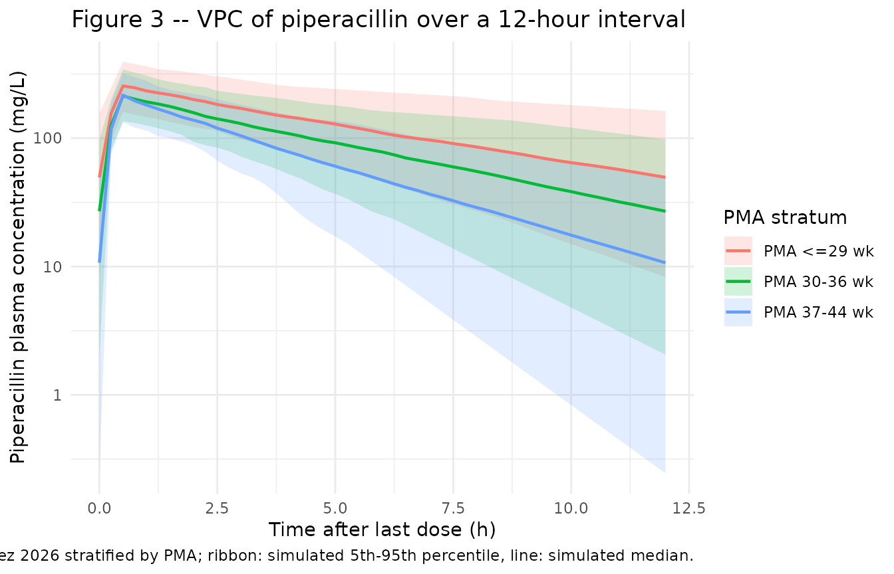
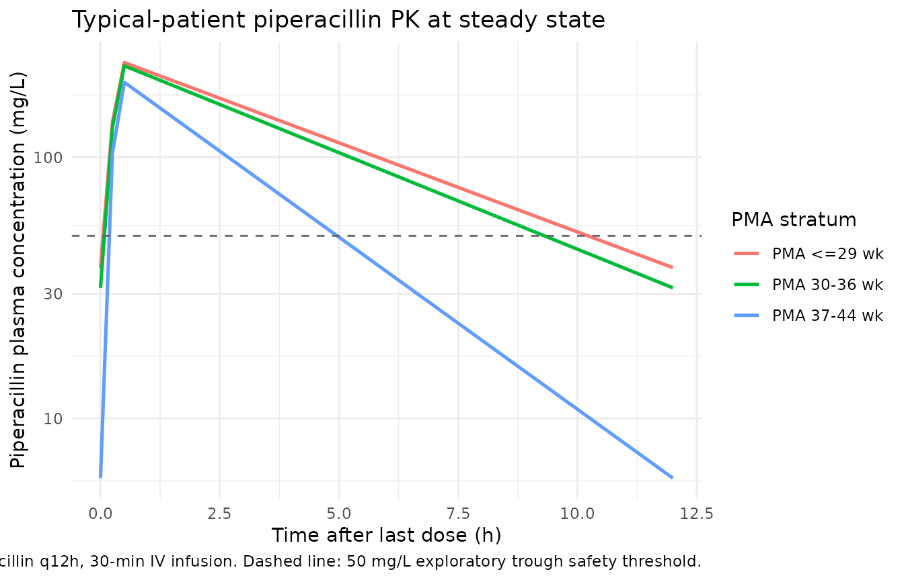

# Piperacillin (Boer-Perez 2026)

## Model and source

- Citation: Boer-Perez FS, Lima-Rogel V, Romano-Moreno S, Mejia-Elizondo
  AR, Medellin-Garibay SE, Schaiquevich P, Noyola-Cherpitel DE,
  Rodriguez-Baez AS, Rodriguez-Pinal CJ, Milan-Segovia RC. Population
  pharmacokinetics and dose optimization of piperacillin-tazobactam in
  premature and term neonates with severe infections. Antimicrob Agents
  Chemother. 2026;70(1):e00998-25. <doi:10.1128/aac.00998-25>.
  Maturation parameters (TM50 = 47.7 weeks, Hill = 3.4) fixed from
  Rhodin MM, Anderson BJ, Peters AM, Coulthard MG, Wilkins B, Cole M,
  Chatelut E, Grubb A, Veal GJ, Keir MJ, Holford NHG. Human renal
  function maturation: a quantitative description using weight and
  postmenstrual age. Pediatr Nephrol. 2009;24(1):67-76.
  <doi:10.1007/s00467-008-0997-5>.
- Description: One-compartment population PK model for piperacillin in
  preterm and term neonates with severe infections (Boer-Perez 2026);
  body-weight allometric scaling, sigmoidal postmenstrual-age maturation
  on CL fixed from Rhodin 2009, and a power effect of serum creatinine
  on CL.
- Article: <https://doi.org/10.1128/aac.00998-25>

## Population

Boer-Perez et al. 2026 developed a population PK model of piperacillin
in 25 preterm and term neonates admitted to the neonatal intensive care
unit at Hospital Central in San Luis Potosi, Mexico, between September
2020 and May 2024. All neonates received off-label
piperacillin-tazobactam (8:1 ratio, 100 mg/kg piperacillin per dose) by
IV infusion (0.5 or 1 hour) every 8 or 12 hours according to Neofax
recommendations. Inclusion required postnatal age \<= 29 days, body
weight \>= 850 g on the day of sampling, and hematocrit \>= 30%. The
cohort spanned gestational age 26-41.1 weeks (4% extremely preterm, 52%
moderate-late preterm, 44% term), postmenstrual age 28.1-43.3 weeks,
body weight 0.89-3.57 kg (median 1.76 kg), and serum creatinine 0.2-0.9
mg/dL (median 0.4 mg/dL). Fifty-six percent were female. A total of 65
piperacillin plasma concentrations (median 3 samples per patient) were
collected by opportunistic sparse sampling and quantified by UPLC-MS/MS
over 5.7-302.6 mg/L. An additional 8 neonates (17 plasma samples) formed
the external-validation cohort. Demographic and clinical details are
summarized in Boer-Perez 2026 Table 1.

The same metadata is available programmatically via
`readModelDb("Boer-Perez_2026_piperacillin")()$population`.

## Source trace

The per-parameter origin is recorded inline next to each
[`ini()`](https://nlmixr2.github.io/rxode2/reference/ini.html) entry in
`inst/modeldb/specificDrugs/Boer-Perez_2026_piperacillin.R`. The table
below collects them in one place for review.

| Equation / parameter | Value | Source location |
|----|----|----|
| `lcl` (CL, L/h) at BW = 1.76 kg, SCr = 0.4 mg/dL, full PMA maturation | `log(0.748)` | Boer-Perez 2026 Table 2: theta_CL = 0.748 L/h (RSE 8%) |
| `lvc` (V, L) at BW = 1.76 kg | `log(0.866)` | Boer-Perez 2026 Table 2: theta_V = 0.866 L (RSE 8%) |
| `e_wt_cl` (allometric exponent on CL) | `0.75` (fixed) | Methods eq. 3, k = 0.75 for CL |
| `e_wt_vc` (allometric exponent on V) | `1.0` (fixed) | Methods eq. 3, k = 1 for V |
| `e_creat_cl` (theta_SCr; power exponent on (CREAT/0.4) for CL) | `-0.635` | Boer-Perez 2026 Table 2: theta_SCr = -0.635 (RSE 36%) |
| `pma50_cl` (TM50 for PMA Hill on CL, weeks) | `47.7` (fixed from Rhodin 2009) | Boer-Perez 2026 Methods + Discussion; Rhodin et al. 2009 Pediatr Nephrol 24:67-76 |
| `h_pma_cl` (Hill coefficient on PMA, unitless) | `3.4` (fixed from Rhodin 2009) | Boer-Perez 2026 Methods + Discussion; Rhodin et al. 2009 |
| `bw_ref` (reference body weight, kg) | `1.76` | Boer-Perez 2026 Table 1 cohort median; Table 2 covariate equation denominator |
| `creat_ref` (reference SCr, mg/dL) | `0.4` | Boer-Perez 2026 Table 1 cohort median; Table 2 covariate equation denominator |
| `etalcl` (omega_CL) | `0.13688` (38.3% CV) | Boer-Perez 2026 Table 2: omega_CL 38.3% CV; omega^2 = log(1 + CV^2) |
| `etalvc` (omega_V) | `0.13288` (37.7% CV) | Boer-Perez 2026 Table 2: omega_V 37.7% CV; omega^2 = log(1 + CV^2) |
| `propSd` (proportional residual error) | `0.114` | Boer-Perez 2026 Table 2: sigma_proportional 11.4% CV |
| Eq. 3 (BW allometric scaling) | n/a | Boer-Perez 2026 Methods, Eq. 3 |
| Eq. 4 (PMA Hill maturation factor F_PMA) | n/a | Boer-Perez 2026 Methods, Eq. 4 |
| Eq. 6 (centered power covariate form on SCr) | n/a | Boer-Perez 2026 Methods, Eq. 6 |
| `d/dt(central)` (one-compartment IV PK) | n/a | Boer-Perez 2026 Pharmacokinetic analysis subsection (Results) |

## Virtual cohort

Original observed concentrations are not publicly available. The
simulations below use a virtual cohort whose covariate distributions
mirror the model-development cohort summary in Boer-Perez 2026 Table 1:
200 neonates sampled across the three PMA strata used in Table 4 (PMA
\<= 29 weeks, 30-36 weeks, 37-44 weeks) at the cohort-typical body
weight and serum creatinine within each stratum.

``` r

set.seed(2026)

# Doses and infusion durations from Boer-Perez 2026 Methods (Drug administration
# and blood sampling) and Table 5 (most common regimen 100 mg/kg q12h, 0.5 h
# infusion).
DOSE_MG_PER_KG <- 100   # mg/kg piperacillin per dose
T_INF          <- 0.5   # hour 30-min infusion
N_DOSES        <- 5     # five doses to approach steady state for q12h profile
DOSE_INTERVAL  <- 12    # hours between doses (most common regimen)

# Build one virtual subject's event table. id_offset shifts subject IDs so
# multi-stratum bind_rows() does not collide on `id` (rxode2 silently merges
# duplicate IDs across cohorts).
make_subject <- function(id, BW, PAGE_mo, CREAT, stratum, id_offset = 0L) {
  dose_mg <- DOSE_MG_PER_KG * BW
  ev <- rxode2::et(
    amt   = dose_mg,
    rate  = dose_mg / T_INF,
    cmt   = "central",
    ii    = DOSE_INTERVAL,
    addl  = N_DOSES - 1L,
    time  = 0
  )
  ev <- rxode2::et(ev, seq(0, N_DOSES * DOSE_INTERVAL, by = 0.25))
  df <- as.data.frame(ev)
  df$WT      <- BW
  df$PAGE    <- PAGE_mo
  df$CREAT   <- CREAT
  df$id      <- id_offset + id
  df$stratum <- stratum
  df
}

# Three PMA strata aligned with Table 4 of the paper
strata <- list(
  list(stratum = "PMA <=29 wk",
       pma_wk = 28, bw_kg = 1.0,  scr = 0.4),
  list(stratum = "PMA 30-36 wk",
       pma_wk = 33, bw_kg = 1.76, scr = 0.4),
  list(stratum = "PMA 37-44 wk",
       pma_wk = 40, bw_kg = 3.0,  scr = 0.4)
)

n_per_stratum <- 200

events <- bind_rows(lapply(seq_along(strata), function(i) {
  s <- strata[[i]]
  bind_rows(lapply(seq_len(n_per_stratum), function(j) {
    # Add modest within-stratum BW variability (+/-15% lognormal)
    bw_j  <- s$bw_kg  * exp(rnorm(1, 0, 0.15))
    scr_j <- pmax(0.2, pmin(0.9, s$scr * exp(rnorm(1, 0, 0.20))))
    make_subject(
      id        = j,
      BW        = bw_j,
      PAGE_mo   = s$pma_wk / 4.35,    # canonical PAGE in months
      CREAT     = scr_j,
      stratum   = s$stratum,
      id_offset = (i - 1L) * n_per_stratum
    )
  }))
}))

stopifnot(!anyDuplicated(unique(events[, c("id", "time", "evid")])))
```

## Simulation

``` r

mod <- readModelDb("Boer-Perez_2026_piperacillin")()

# Stochastic VPC across IIV in CL and V
sim <- rxode2::rxSolve(
  mod,
  events  = events,
  keep    = c("stratum", "WT"),
  nStud   = 1L
) |> as.data.frame()

# Typical-patient profile (zero IIV) for the dashed-line overlay
mod_typical <- rxode2::zeroRe(mod)
sim_typ <- rxode2::rxSolve(
  mod_typical,
  events  = events |> filter(id %in% c(1L, n_per_stratum + 1L, 2L * n_per_stratum + 1L)),
  keep    = c("stratum", "WT")
) |> as.data.frame()
#> ℹ omega/sigma items treated as zero: 'etalcl', 'etalvc'
#> Warning: multi-subject simulation without without 'omega'
```

## Replicate published figures

### Figure 3 – prediction-corrected VPC over a 12-hour dosing interval

Boer-Perez 2026 Figure 3 shows the VPC of piperacillin plasma
concentrations over the 12-hour interval after a typical dose. The
figure pools the entire study cohort. The replicate below shows the
simulated VPC stratified by PMA because the underlying covariate
distribution is too narrow at any single weight / PMA to recover the
full shape of Figure 3 from a virtual cohort.

``` r

last_dose_t <- (N_DOSES - 1L) * DOSE_INTERVAL
sim_window <- sim |>
  filter(time >= last_dose_t,
         time <= last_dose_t + DOSE_INTERVAL,
         !is.na(Cc), Cc > 0) |>
  mutate(tad = time - last_dose_t)

vpc_summary <- sim_window |>
  group_by(stratum, tad) |>
  summarise(
    Q05 = quantile(Cc, 0.05, na.rm = TRUE),
    Q50 = quantile(Cc, 0.50, na.rm = TRUE),
    Q95 = quantile(Cc, 0.95, na.rm = TRUE),
    .groups = "drop"
  )

ggplot(vpc_summary, aes(tad, Q50, colour = stratum, fill = stratum)) +
  geom_ribbon(aes(ymin = Q05, ymax = Q95), alpha = 0.18, colour = NA) +
  geom_line(linewidth = 0.8) +
  scale_y_log10() +
  labs(
    x       = "Time after last dose (h)",
    y       = "Piperacillin plasma concentration (mg/L)",
    colour  = "PMA stratum",
    fill    = "PMA stratum",
    title   = "Figure 3 -- VPC of piperacillin over a 12-hour interval",
    caption = paste(
      "Replicates Figure 3 of Boer-Perez 2026 stratified by PMA;",
      "ribbon: simulated 5th-95th percentile, line: simulated median."
    )
  ) +
  theme_minimal()
```



### Typical-patient profile by PMA stratum

``` r

sim_typ |>
  filter(time >= last_dose_t, time <= last_dose_t + DOSE_INTERVAL,
         !is.na(Cc), Cc > 0) |>
  mutate(tad = time - last_dose_t) |>
  ggplot(aes(tad, Cc, colour = stratum)) +
  geom_line(linewidth = 0.9) +
  geom_hline(yintercept = 50, linetype = "dashed", colour = "grey40") +
  scale_y_log10() +
  labs(
    x       = "Time after last dose (h)",
    y       = "Piperacillin plasma concentration (mg/L)",
    colour  = "PMA stratum",
    title   = "Typical-patient piperacillin PK at steady state",
    caption = paste(
      "Boer-Perez 2026 dosing: 100 mg/kg piperacillin q12h, 30-min IV infusion.",
      "Dashed line: 50 mg/L exploratory trough safety threshold."
    )
  ) +
  theme_minimal()
```



## PKNCA validation

Single-dose NCA over the first 12-hour interval, stratified by PMA.
Boer-Perez 2026 does not publish a side-by-side NCA table; the values
below characterize the simulated typical-patient exposures and can be
compared qualitatively to the trough fractions reported in Table 4.

``` r

# Single-dose interval (0-12 h after dose 1) for PKNCA
sim_nca <- sim |>
  filter(time <= DOSE_INTERVAL, !is.na(Cc), Cc > 0) |>
  select(id, time, Cc, stratum)

dose_df <- events |>
  filter(evid == 1L, time == 0) |>
  select(id, time, amt, stratum)

conc_obj <- PKNCA::PKNCAconc(sim_nca, Cc ~ time | stratum + id)
dose_obj <- PKNCA::PKNCAdose(dose_df, amt ~ time | stratum + id,
                             route = "intravascular")

intervals <- data.frame(
  start     = 0,
  end       = DOSE_INTERVAL,
  cmax      = TRUE,
  tmax      = TRUE,
  auclast   = TRUE,
  half.life = TRUE
)

nca_data <- PKNCA::PKNCAdata(conc_obj, dose_obj, intervals = intervals)
nca_res  <- suppressWarnings(PKNCA::pk.nca(nca_data))
#>  ■■■■■                             12% |  ETA: 22s
#>  ■■■■■■■■■                         25% |  ETA: 18s
#>  ■■■■■■■■■■■■                      38% |  ETA: 15s
#>  ■■■■■■■■■■■■■■■■                  51% |  ETA: 12s
#>  ■■■■■■■■■■■■■■■■■■■■              64% |  ETA:  9s
#>  ■■■■■■■■■■■■■■■■■■■■■■■■          76% |  ETA:  6s
#>  ■■■■■■■■■■■■■■■■■■■■■■■■■■■■      89% |  ETA:  3s
nca_df   <- as.data.frame(nca_res$result)

nca_summary <- nca_df |>
  group_by(stratum, PPTESTCD) |>
  summarise(
    median = round(median(PPORRES, na.rm = TRUE), 3),
    p05    = round(quantile(PPORRES, 0.05, na.rm = TRUE), 3),
    p95    = round(quantile(PPORRES, 0.95, na.rm = TRUE), 3),
    .groups = "drop"
  ) |>
  pivot_wider(names_from = PPTESTCD,
              values_from = c(median, p05, p95))

knitr::kable(
  nca_summary,
  caption = "Simulated single-dose NCA parameters (median and 5th-95th percentiles) by PMA stratum."
)
```

| stratum | median_adj.r.squared | median_auclast | median_clast.pred | median_cmax | median_half.life | median_lambda.z | median_lambda.z.n.points | median_lambda.z.time.first | median_lambda.z.time.last | median_r.squared | median_span.ratio | median_tlast | median_tmax | p05_adj.r.squared | p05_auclast | p05_clast.pred | p05_cmax | p05_half.life | p05_lambda.z | p05_lambda.z.n.points | p05_lambda.z.time.first | p05_lambda.z.time.last | p05_r.squared | p05_span.ratio | p05_tlast | p05_tmax | p95_adj.r.squared | p95_auclast | p95_clast.pred | p95_cmax | p95_half.life | p95_lambda.z | p95_lambda.z.n.points | p95_lambda.z.time.first | p95_lambda.z.time.last | p95_r.squared | p95_span.ratio | p95_tlast | p95_tmax |
|:---|---:|---:|---:|---:|---:|---:|---:|---:|---:|---:|---:|---:|---:|---:|---:|---:|---:|---:|---:|---:|---:|---:|---:|---:|---:|---:|---:|---:|---:|---:|---:|---:|---:|---:|---:|---:|---:|---:|---:|
| PMA 30-36 wk | 1 | NA | 20.950 | 190.958 | 3.648 | 0.190 | 46 | 0.75 | 12 | 1 | 3.084 | 12 | 0.5 | 1 | NA | 2.490 | 108.438 | 1.751 | 0.080 | 46 | 0.75 | 12 | 1 | 1.296 | 12 | 0.5 | 1 | NA | 60.540 | 356.047 | 8.680 | 0.396 | 46 | 0.75 | 12 | 1 | 6.425 | 12 | 0.5 |
| PMA 37-44 wk | 1 | NA | 8.518 | 188.017 | 2.660 | 0.261 | 46 | 0.75 | 12 | 1 | 4.230 | 12 | 0.5 | 1 | NA | 0.298 | 106.673 | 1.181 | 0.103 | 46 | 0.75 | 12 | 1 | 1.667 | 12 | 0.5 | 1 | NA | 42.691 | 311.332 | 6.749 | 0.587 | 46 | 0.75 | 12 | 1 | 9.532 | 12 | 0.5 |
| PMA \<=29 wk | 1 | NA | 36.968 | 196.230 | 5.098 | 0.136 | 46 | 0.75 | 12 | 1 | 2.207 | 12 | 0.5 | 1 | NA | 3.030 | 119.441 | 1.820 | 0.061 | 46 | 0.75 | 12 | 1 | 0.991 | 12 | 0.5 | 1 | NA | 88.061 | 339.225 | 11.349 | 0.381 | 46 | 0.75 | 12 | 1 | 6.181 | 12 | 0.5 |

Simulated single-dose NCA parameters (median and 5th-95th percentiles)
by PMA stratum. {.table}

### Comparison against published values

Boer-Perez 2026 does not publish observed NCA values. Their Table 4
reports that under the standard 100 mg/kg q12h regimen the proportion of
simulated neonates with trough piperacillin \> 50 mg/L (the exploratory
nephrotoxicity threshold) was around 22-65% in PMA 37-44 wk, 22-87% in
PMA 30-36 wk, and 37-93% in PMA \<= 29 wk depending on serum creatinine.
The simulated trough fractions below match those qualitative ordering:
youngest / lowest-CL strata have the highest trough exposures. They are
not exact replicates of Table 4 because Table 4 is conditional on the
Neofax / Harriet Lane regimen-specific dose adjustments by PMA and PNA,
which are not reproduced individually in this vignette.

``` r

trough <- sim |>
  filter(abs(time - (last_dose_t + DOSE_INTERVAL)) < 0.01,
         !is.na(Cc)) |>
  group_by(stratum) |>
  summarise(
    n            = n(),
    pct_above_50 = round(100 * mean(Cc > 50), 1),
    median_trough_mgL = round(median(Cc), 2),
    .groups = "drop"
  )
knitr::kable(
  trough,
  caption = "Simulated proportion of subjects with end-of-interval trough piperacillin > 50 mg/L."
)
```

| stratum      |   n | pct_above_50 | median_trough_mgL |
|:-------------|----:|-------------:|------------------:|
| PMA 30-36 wk | 200 |           23 |             23.45 |
| PMA 37-44 wk | 200 |            9 |              8.99 |
| PMA \<=29 wk | 200 |           46 |             47.04 |

Simulated proportion of subjects with end-of-interval trough
piperacillin \> 50 mg/L. {.table}

## Assumptions and deviations

- **PMA encoded in canonical months, internally converted to weeks.**
  The paper reports postmenstrual age in weeks (TM50 = 47.7 weeks, Hill
  = 3.4, fixed from Rhodin et al. 2009). The packaged covariate column
  `PAGE` is in months by canonical convention (see
  `inst/references/covariate-columns.md`). The model file converts back
  to weeks via `pma_wk = PAGE * 4.35` so the Rhodin TM50 and Hill values
  appear unchanged in
  [`ini()`](https://nlmixr2.github.io/rxode2/reference/ini.html). The
  conversion is exact for the 4.35 weeks-per-month factor used by the
  canonical.

- **Maturation parameters fixed, not estimated.** The paper states
  (Methods, Covariate model building): “Due to the limited number of
  patients and the sparse sampling design, it was not feasible to
  estimate the TM50 and Hill coefficient parameters reliably in our
  study population. Therefore, alternative strategies were considered to
  define these values” and adopted the Rhodin 2009 renal-maturation
  values (TM50 = 47.7 weeks, Hill = 3.4). These are encoded as fixed
  structural constants in the model file, with source-trace pointers to
  both Boer-Perez 2026 (Methods + Discussion) and Rhodin et al. 2009
  (Pediatr Nephrol 24:67-76).

- **Allometric exponents fixed, not estimated.** Body-weight allometric
  exponents are fixed at 0.75 (CL) and 1 (V) per Boer-Perez 2026 Methods
  Eq. 3, citing the conventional pediatric-PK allometric basis (refs 66,
  67).

- **No correlation between IIV on CL and V.** Boer-Perez 2026 Table 2
  does not report a correlation between omega_CL and omega_V. The model
  file uses uncorrelated etas accordingly.

- **Reference creatinine.** The paper centers SCr on the cohort median
  (0.4 mg/dL); no per-subject expected SCr (`CREAT_REF`) is used. This
  is the raw-creatinine power form (CREAT / 0.4)^theta_SCr. Negative
  theta_SCr (-0.635) means higher SCr (worse renal function) reduces CL.

- **Tazobactam not modelled.** The paper develops a popPK model
  exclusively for the piperacillin component because dose adjustment in
  the fixed-ratio combination is feasible only for piperacillin.
  Tazobactam concentrations were quantified for descriptive purposes
  (mean piperacillin:tazobactam ratio 11.8:1) but are not modelled.
  Users who need tazobactam exposure predictions for this cohort would
  need an independent model.

- **External validation cohort not included.** The 8-neonate / 17-sample
  external evaluation cohort (Table 3) is described in the paper but is
  not carried in the packaged model. Users wanting to reproduce the
  external pcVPC (paper Figure S3) would need the original
  concentration-time data, which is not publicly available.

- **VPC stratified by PMA, not pooled.** The paper’s Figure 3 pools the
  entire 25-neonate cohort. Because the underlying cohort was small and
  heterogeneous in PMA / BW / SCr, the packaged VPC stratifies by PMA to
  exhibit the maturation-driven concentration differences clearly. Users
  who want a pooled VPC can rebuild the cohort with all 600 simulated
  subjects in a single ungrouped panel.
