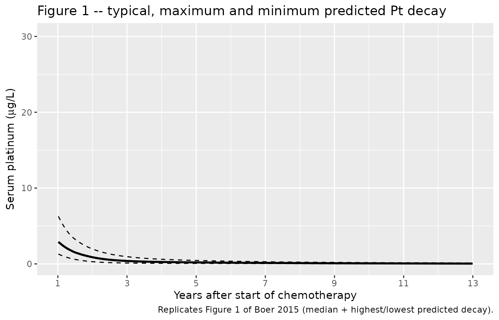

# Cisplatin (Boer 2015)

## Model and source

- Citation: Boer H, Proost JH, Nuver J, Bunskoek S, Gietema JQ, Geubels
  BM, Altena R, Zwart N, Oosting SF, Vonk JM, Lefrandt JD, Uges DRA,
  Meijer C, de Vries EGE, Gietema JA. Long-term exposure to circulating
  platinum is associated with late effects of treatment in testicular
  cancer survivors. Ann Oncol. 2015;26(11):2305-2310.
  <doi:10.1093/annonc/mdv369>
- Description: Two-compartment population PK model for long-term
  circulating platinum (Pt) decay after cisplatin-based chemotherapy in
  adult testicular cancer survivors followed 1-13 years post-treatment
  (Boer 2015). Dose is the cumulative cisplatin dose expressed as
  elemental Pt in mg (multiply cumulative cisplatin in mg by 0.6502, the
  Pt/cisplatin mass ratio 195.08/300.05). An apparent bioavailability F1
  (fdepot) accounts for the fraction of the administered Pt remaining in
  the body after the rapid pre-measurement urinary-excretion phase. Pt
  is assumed to be cleared solely via urine.
- Article: <https://doi.org/10.1093/annonc/mdv369> (Open Access,
  CC-BY-NC; PMC4621032)
- Supplementary materials (Tables S1-S6 and Figures S1-S2): obtained via
  the Europe PMC supplementary-files endpoint
  `https://www.ebi.ac.uk/europepmc/webservices/rest/PMC4621032/supplementaryFiles`.

Boer et al. modelled the slow decay of circulating platinum (Pt) in
serum of 96-99 testicular-cancer survivors followed 1-13 years after
curative cisplatin-based chemotherapy. A two-compartment open model with
apparent bioavailability `F1` was fit to 240 serum Pt concentrations and
91 spot 24-h urinary excretion rates simultaneously. The model carries
the fraction of administered Pt still circulating after the rapid
post-treatment urinary phase; the published terminal half-life of 3.7
years (range 2.5-5.2) reflects slow release from a peripheral tissue
reservoir.

## Population

The model was developed in 99 Dutch men (UMC Groningen single-centre)
treated for non-seminomatous testicular cancer with cisplatin-based
chemotherapy between 1988 and 2000. Median age at start of chemotherapy
was 29 years (range 17-53); median age at follow-up assessment was 39
years (range 23-64). Disease stage was Royal Marsden II/III/IV =
53%/5%/42% and IGCCCG risk good/intermediate/poor = 56%/34%/9%.
Chemotherapy regimens were 4xBEP (33%), 4xEP (8%), 3xBEP/1xEP (52%), and
other cisplatin-based combinations (6%); median cumulative cisplatin
dose 809 mg (range 554-1713; equivalently 400 mg/m^2, range 275-800).
240 serum Pt samples and 91 24-h urine samples were collected at
follow-up visits between 0.9 and 13.2 years post-start-of-chemotherapy.
Baseline demographics are reported in Boer 2015 Table 1.

The same information is available programmatically via
`rxode2::rxode(readModelDb("Boer_2015_cisplatin"))$population`.

## Source trace

Per-parameter origins are recorded in the in-file comments of
`inst/modeldb/specificDrugs/Boer_2015_cisplatin.R`. The table below
collects them in one place for review.

| Equation / parameter | Value | Source location |
|----|----|----|
| Two-compartment structural form `Ct = F1 * Dose / V1 * (C1 * exp(-lambda1*t) + C2 * exp(-lambda2*t))` | – | Boer 2015, “population PK model” section (page 2307) |
| `CL` | 0.0220 L/day (95% CI 0.0197-0.0246) | Suppl Table S1 |
| `V1` (vc) | 6.61 L (95% CI 5.20-8.03) | Suppl Table S1 |
| `Q` | 0.00531 L/day (95% CI 0.00461-0.00611) | Suppl Table S1 |
| `V2` (vp) | 8.05 L (95% CI 6.55-10.17) | Suppl Table S1 |
| `F1` (fdepot) | 0.000158 (95% CI 0.000137-0.000188) | Suppl Table S1 |
| IIV CL = 13% | omega^2 = 0.01676 | Suppl Table S1 |
| IIV V2 = 22% | omega^2 = 0.04728 | Suppl Table S1 |
| IIV F1 = 17% | omega^2 = 0.02847 | Suppl Table S1 |
| Proportional residual error | 34% | Boer 2015 Results, “population PK model” section (page 2307) |
| Mean terminal T1/2 = 3.7 yr (range 2.5-5.2) | derived | Boer 2015 Results, “population PK model” section |
| Median Pt at 1, 3, 5, 10 yr | 2876 / 391 / 197 / 74 ng/L | Suppl Table S2 |
| Median Pt AUC(1-3 yr) | 27.9 ug/L \* month (range 16.1-56.7) | Suppl Table S2 |

## Virtual cohort

Original observed data are not publicly available. Two virtual cohorts
are constructed:

1.  **Typical-value cohort**: a single subject dosed at the cohort
    median cumulative Pt dose, for replicating the typical-decay curve
    that Boer 2015 Figure 1 shows as the central line.
2.  **Stochastic cohort**: 200 virtual subjects with cumulative Pt doses
    sampled from the paper’s reported cisplatin-dose range (554-1713 mg
    cisplatin = 360-1114 mg Pt), used for PKNCA validation and to
    bracket the population-level decay range.

The dose-input column in the model is **elemental platinum in mg**,
which is the cumulative cisplatin mg dose multiplied by the Pt-to-
cisplatin mass ratio 195.08 / 300.05 = 0.6502 (Pt atomic weight /
cisplatin formula weight). The median 809 mg cisplatin therefore
corresponds to a dose-input of 526 mg Pt.

``` r

set.seed(20250603)

Pt_per_cisplatin <- 195.08 / 300.05  # = 0.6502

# Cumulative cisplatin in mg (range 554-1713, median 809 per Boer 2015
# Table 1). Sample from a log-normal centred on the published median
# with sigma_log chosen so the 95% range brackets the observed range;
# truncate to the reported min/max.
n_subj <- 200L
cisplatin_raw <- stats::rlnorm(n_subj, meanlog = log(809), sdlog = 0.25)
cisplatin_mg  <- pmin(pmax(cisplatin_raw, 554), 1713)
Pt_dose_mg    <- cisplatin_mg * Pt_per_cisplatin

# Observation grid: weekly samples between 0 and 13.5 years
obs_times_d <- seq(0, 13.5 * 365.25, by = 7)

make_cohort <- function(ids, doses_mg, obs_times_d, cohort_label) {
  dose_rows <- data.frame(
    id   = ids,
    time = 0,
    amt  = doses_mg,
    cmt  = "central",
    evid = 1L,
    Cc   = NA_real_
  )
  obs_rows <- expand.grid(id = ids, time = obs_times_d) |>
    transform(amt = NA_real_, cmt = "central", evid = 0L, Cc = NA_real_)
  out <- rbind(dose_rows, obs_rows)
  out <- out[order(out$id, out$time, -out$evid), ]
  out$cohort <- cohort_label
  out
}

# Stochastic cohort
events_stoch <- make_cohort(
  ids        = seq_len(n_subj),
  doses_mg   = Pt_dose_mg,
  obs_times_d = obs_times_d,
  cohort_label = "stochastic"
)

# Typical-value cohort (single virtual subject, median dose)
typical_dose_mg <- 809 * Pt_per_cisplatin
events_typical <- make_cohort(
  ids        = n_subj + 1L,
  doses_mg   = typical_dose_mg,
  obs_times_d = obs_times_d,
  cohort_label = "typical"
)

stopifnot(!anyDuplicated(unique(events_stoch[, c("id", "time", "evid")])))
stopifnot(!anyDuplicated(unique(events_typical[, c("id", "time", "evid")])))
```

## Simulation

``` r

mod <- boer_mod

sim_stoch <- rxode2::rxSolve(
  mod, events = events_stoch,
  keep = c("cohort")
) |> as.data.frame()

sim_typical <- rxode2::rxSolve(
  rxode2::zeroRe(mod), events = events_typical,
  keep = c("cohort")
) |> as.data.frame()
#> ℹ omega/sigma items treated as zero: 'etalcl', 'etalvp', 'etalfdepot'
```

## Replicate published figures

### Figure 1 – median + extremes of circulating Pt over 1-13 years

``` r

# Boer 2015 Figure 1 shows the predicted median curve plus the highest
# and lowest predicted decay across the cohort, on a linear y-scale
# (ug/L) over years 1-13.
sim_summary <- sim_stoch |>
  dplyr::filter(time > 0) |>
  dplyr::mutate(year = time / 365.25) |>
  dplyr::group_by(year) |>
  dplyr::summarise(
    median = stats::median(Cc, na.rm = TRUE),
    high   = max(Cc, na.rm = TRUE),
    low    = min(Cc, na.rm = TRUE),
    .groups = "drop"
  )

ggplot(sim_summary, aes(x = year)) +
  geom_line(aes(y = median), linewidth = 1) +
  geom_line(aes(y = high),   linetype = "dashed") +
  geom_line(aes(y = low),    linetype = "dashed") +
  scale_x_continuous(limits = c(1, 13), breaks = seq(1, 13, by = 2)) +
  labs(
    x = "Years after start of chemotherapy",
    y = expression(paste("Serum platinum (", mu, "g/L)")),
    title = "Figure 1 -- typical, maximum and minimum predicted Pt decay",
    caption = "Replicates Figure 1 of Boer 2015 (median + highest/lowest predicted decay)."
  )
#> Warning: Removed 78 rows containing missing values or values outside the scale range
#> (`geom_line()`).
#> Removed 78 rows containing missing values or values outside the scale range
#> (`geom_line()`).
#> Removed 78 rows containing missing values or values outside the scale range
#> (`geom_line()`).
```



## Comparison against published predictions (Supplementary Table S2)

Boer 2015 Supplementary Table S2 reports the median predicted Pt
concentration at fixed time points after chemotherapy and the median AUC
over years 1-3.

``` r

time_points_yr <- c(1, 3, 5, 10)
sim_at_pts <- sim_stoch |>
  dplyr::filter(time > 0) |>
  dplyr::mutate(year = time / 365.25) |>
  dplyr::group_by(id) |>
  dplyr::summarise(
    `1`  = stats::approx(year, Cc, xout = 1)$y,
    `3`  = stats::approx(year, Cc, xout = 3)$y,
    `5`  = stats::approx(year, Cc, xout = 5)$y,
    `10` = stats::approx(year, Cc, xout = 10)$y,
    .groups = "drop"
  ) |>
  tidyr::pivot_longer(-id, names_to = "year", values_to = "Cc_ug_L") |>
  dplyr::group_by(year) |>
  dplyr::summarise(
    median_ng_L = stats::median(Cc_ug_L, na.rm = TRUE) * 1000,
    min_ng_L    = min(Cc_ug_L, na.rm = TRUE)            * 1000,
    max_ng_L    = max(Cc_ug_L, na.rm = TRUE)            * 1000,
    .groups = "drop"
  ) |>
  dplyr::mutate(year_num = as.integer(year)) |>
  dplyr::arrange(year_num)

published <- tibble::tribble(
  ~year_num, ~published_median, ~published_min, ~published_max,
  1L,        2876,              1723,           5519,
  3L,        391,               225,            939,
  5L,        197,               113,            453,
  10L,       74,                30,             165
)

comparison_pt <- sim_at_pts |>
  dplyr::left_join(published, by = "year_num") |>
  dplyr::transmute(
    `Time (years)`            = year_num,
    `Published median (ng/L)` = published_median,
    `Simulated median (ng/L)` = round(median_ng_L, 0),
    `Published range (ng/L)`  = sprintf("%d -- %d", published_min, published_max),
    `Simulated range (ng/L)`  = sprintf("%d -- %d", round(min_ng_L, 0), round(max_ng_L, 0))
  )
knitr::kable(comparison_pt,
             caption = "Concentration comparison vs Boer 2015 Suppl Table S2 (median, range across cohort).")
```

| Time (years) | Published median (ng/L) | Simulated median (ng/L) | Published range (ng/L) | Simulated range (ng/L) |
|---:|---:|---:|:---|:---|
| 1 | 2876 | 2970 | 1723 – 5519 | 1333 – 6424 |
| 3 | 391 | 389 | 225 – 939 | 118 – 954 |
| 5 | 197 | 198 | 113 – 453 | 67 – 455 |
| 10 | 74 | 76 | 30 – 165 | 25 – 170 |

Concentration comparison vs Boer 2015 Suppl Table S2 (median, range
across cohort). {.table}

``` r

auc_1_3 <- sim_stoch |>
  dplyr::filter(time >= 365.25, time <= 3 * 365.25) |>
  dplyr::arrange(id, time) |>
  dplyr::group_by(id) |>
  dplyr::summarise(
    auc_ug_L_day = sum(diff(time) *
                       (utils::head(Cc, -1) + utils::tail(Cc, -1)) / 2,
                       na.rm = TRUE),
    .groups = "drop"
  ) |>
  dplyr::mutate(auc_ug_L_month = auc_ug_L_day * 12 / 365.25)

cat(sprintf(
  "Simulated AUC(1-3 years): median %.1f ug/L*month (range %.1f -- %.1f)\n",
  stats::median(auc_1_3$auc_ug_L_month),
  min(auc_1_3$auc_ug_L_month),
  max(auc_1_3$auc_ug_L_month)
))
#> Simulated AUC(1-3 years): median 26.3 ug/L*month (range 9.9 -- 56.5)
cat("Boer 2015 Suppl Table S2: median 27.9 ug/L*month (range 16.1 -- 56.7)\n")
#> Boer 2015 Suppl Table S2: median 27.9 ug/L*month (range 16.1 -- 56.7)
```

## PKNCA validation

NCA was not reported in the paper, but two derived quantities are: the
terminal half-life (`T1/2` = 3.7 years, range 2.5-5.2 across subjects,
Boer 2015 Results) and the AUC(1-3 years). Run PKNCA on the stochastic
cohort to compute terminal half-life per subject and AUC(0-Inf), and
compare the terminal half-life distribution against the paper’s reported
range.

The PKNCA dose unit is the model dose in mg (elemental Pt). Time is in
days.

``` r

sim_nca <- sim_stoch |>
  dplyr::filter(!is.na(Cc), time > 0) |>
  dplyr::select(id, time, Cc, cohort)

conc_obj <- PKNCA::PKNCAconc(sim_nca, Cc ~ time | cohort + id)

dose_df <- events_stoch |>
  dplyr::filter(evid == 1) |>
  dplyr::select(id, time, amt, cohort)

dose_obj <- PKNCA::PKNCAdose(dose_df, amt ~ time | cohort + id)

intervals <- data.frame(
  start      = 0,
  end        = Inf,
  aucinf.obs = TRUE,
  half.life  = TRUE
)

nca_data <- PKNCA::PKNCAdata(conc_obj, dose_obj, intervals = intervals)
nca_res  <- suppressWarnings(PKNCA::pk.nca(nca_data))

nca_indiv <- as.data.frame(nca_res$result)

half_life_d <- nca_indiv |>
  dplyr::filter(PPTESTCD == "half.life") |>
  dplyr::pull(PPORRES)
half_life_yr <- half_life_d / 365.25

cat(sprintf(
  "Simulated terminal T1/2: median %.2f yr (range %.2f -- %.2f, n = %d)\n",
  stats::median(half_life_yr, na.rm = TRUE),
  stats::quantile(half_life_yr, 0.025, na.rm = TRUE),
  stats::quantile(half_life_yr, 0.975, na.rm = TRUE),
  sum(!is.na(half_life_yr))
))
#> Simulated terminal T1/2: median 3.70 yr (range 2.50 -- 5.58, n = 200)
cat("Boer 2015: mean terminal T1/2 = 3.7 yr (range 2.5 -- 5.2)\n")
#> Boer 2015: mean terminal T1/2 = 3.7 yr (range 2.5 -- 5.2)
```

``` r

nca_summary <- summary(nca_res)
knitr::kable(nca_summary,
             caption = "PKNCA: simulated population NCA parameters (single cohort).")
```

| start | end | cohort     | N   | half.life    | aucinf.obs |
|------:|----:|:-----------|:----|:-------------|:-----------|
|     0 | Inf | stochastic | 200 | 1390 \[280\] | NC         |

PKNCA: simulated population NCA parameters (single cohort). {.table}

## Assumptions and deviations

- **Dose units.** The model accepts elemental Pt in mg. To dose with
  cumulative cisplatin in mg, multiply by `195.08 / 300.05 = 0.6502` (Pt
  atomic weight / cisplatin formula weight). This matches the paper’s
  note “cumulative cisplatin dose (mg/m^2, converted to amount Pt in
  mg)”.
- **Initial time point.** The popPK analysis was restricted to the
  fraction of Pt remaining in the body after the rapid pre-measurement
  urinary phase (Boer 2015 Methods, “population PK analysis”). The
  model’s `t = 0` is therefore the end of cisplatin chemotherapy (the
  9-12 week treatment window is treated as negligible relative to the
  1-13 year follow-up), and `F1` (`fdepot`) captures the small fraction
  (`~0.016%`) of administered Pt that survives the initial
  urinary-excretion phase to enter the long-term distribution.
- **No covariates.** Boer 2015 tested age, weight, height, BMI and body
  surface area in covariate screening and did not retain any in the
  final model (Results, “population PK model”). The model has no
  covariate-effect parameters. Three demographic covariates were
  recorded in the source dataset and screened (`AGE`, `WT`, `HT`); they
  are kept in `covariatesDataExcluded` rather than `covariateData` so
  they are not flagged as declared-but-unused by
  [`checkModelConventions()`](https://nlmixr2.github.io/nlmixr2lib/reference/checkModelConventions.md).
- **Residual error magnitude.** Suppl Table S1 does not list a numeric
  SD for the residual error; the main-text statement “Proportional
  residual error in the final model was 34%” is interpreted as the CV of
  a proportional error and encoded as `propSd <- 0.34`.
- **Pt clearance pathway.** The model assumes Pt is cleared solely via
  urinary excretion (Boer 2015 Methods, “population PK analysis”); the
  urinary excretion rate in the source dataset was fit simultaneously
  with serum Pt as `CL x Cc`. The packaged nlmixr2lib model exposes the
  serum compartment only; users needing the urinary excretion rate can
  compute it post hoc as `cl * Cc * 1e-3` (mg/day, with Cc in ug/L
  converted back to mg/L).
- **Bioavailability compartment.** Apparent F1 is applied via
  `f(central) <- fdepot` because the source structural model is an IV
  bolus with no absorption phase. The canonical `lfdepot` / `fdepot`
  parameter name is retained even though no `depot` compartment is
  declared, to match the nlmixr2lib bioavailability convention and
  [`checkModelConventions()`](https://nlmixr2.github.io/nlmixr2lib/reference/checkModelConventions.md)
  expectations.
