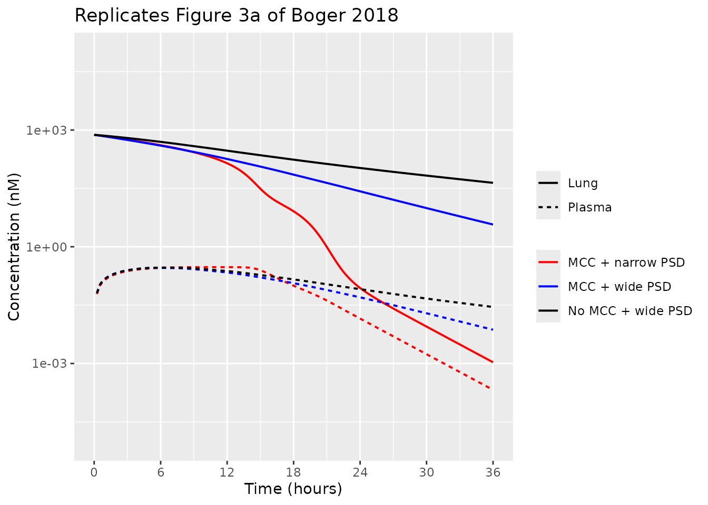
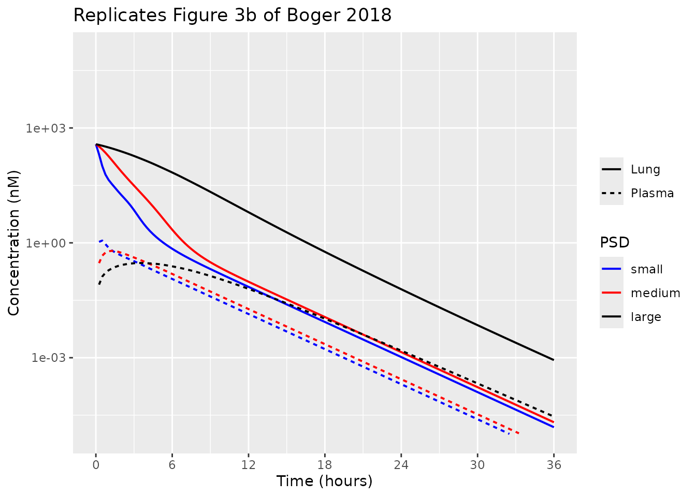
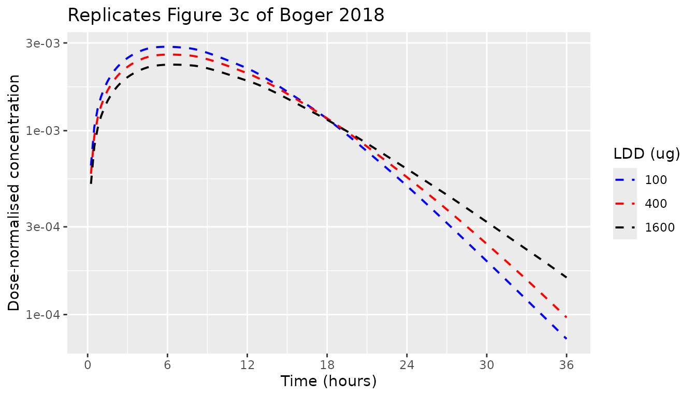

# Inhalation PBPK with a partial-differential-equation lung (Boger 2018)

Boger E, Wigstrom O. *A Partial Differential Equation Approach to
Inhalation Physiologically Based Pharmacokinetic Modeling.* CPT
Pharmacometrics Syst Pharmacol. 2018;7(10):638-646.
[doi:10.1002/psp4.12344](https://doi.org/10.1002/psp4.12344).

This paper presents the first inhalation PBPK model that treats the lung
as a **continuous heterogeneous organ** and the inhaled powder as a
distribution that is continuous in **both lung depth and particle
size**. The authors deposited their complete MATLAB implementation as
Appendix S2, so every constant and every equation used here comes from a
published source: the main text (Eqs 1-9, Tables 1-2), Appendix S1 (Eqs
S1-S41, Tables S1-S3) or the deposited code.

There is no drug. The compound is a hypothetical neutral small molecule
(MW 250 g/mol) relying on transcellular transport, used to demonstrate
the framework in three case studies.

## Model structure

Four processes act on the inhaled powder, and the model resolves all of
them along lung depth `x`:

1.  **Deposition** places particles along the airway tree as a function
    of particle size (typical-path Findeisen-Landahl model over a Weibel
    tree, with Cheng extrathoracic deposition; Eqs S24-S41).
2.  **Dissolution** shrinks each particle by the Nernst-Brunner equation
    into the epithelial lining fluid (ELF) of the slab it occupies (Eq.
    3, recast as the non-singular squared-radius form of Eq. 10).
3.  **Mucociliary clearance** (MCC) sweeps undissolved particles
    proximally at a velocity proportional to the airway cross-section
    (Eqs 2, S7) and delivers them to the gut (Eq. 5), where a fraction
    `F` is absorbed.
4.  **Permeation** carries dissolved drug ELF -\> epithelium -\>
    sub-epithelium -\> blood, and back (Eqs 7-9), into a seven-tissue
    whole-body PBPK model (Eqs S8-S16).

### Discretisation adopted here

rxode2 solves ODEs, so the two continuous coordinates are discretised by
the method of lines, exactly as the authors do (Eq. S17):

| coordinate | states | count |
|----|----|----|
| lung depth, tracheobronchial (`x` in \[0, 2.2554\] dm) | `elf_tb_slab<n>`, `epithelium_tb_slab<n>`, `subepithelium_tb_slab<n>` | 12 slabs |
| lung depth, alveolar (`x` in \[2.2554, 2.3290\] dm) | `elf_alv_slab<n>`, `epithelium_alv_slab<n>`, `subepithelium_alv_slab<n>` | 8 slabs |
| particle size | `particles_<region>_<class>_slab<n>` (number density) and `pmass_<region>_<class>_slab<n>` (z-moment, `z = r^2`) | 8 size classes |
| whole body | `a_spleen`, `a_rapidly_perfused`, `a_slowly_perfused`, `a_fat`, `a_liver`, `a_gut`, `a_arterial`, `a_venous`, `depot` | 9 |

that is, 9 systemic states, `3 * (12 + 8) = 60` lung tissue states and
`2 * 8 * (12 + 8) = 320` particle states: **389 ODEs in total**.

The particle phase carries **two conserved moments per (slab, size
class)** rather than the authors’ shared-shrinkage variable. That choice
is what makes the discretised mass balance close: the number density and
the z-moment advect with the same conservative upwind MCC operator, and
the dissolution sink enters `pmass_*` and the paired `elf_*` slab with
identical magnitude and opposite sign. The authors instead pre-integrate
the MCC characteristics and interpolate a two-dimensional table inside
the right-hand side (Eqs 11-15), which rxode2 cannot express; the
formulation used here is mathematically the same Eq. 1 system, solved
Eulerian in `x` instead of by characteristics.

``` r

# modellib() returns the model function; rxode2() turns it into the rxUi that
# carries the states and the file-level metadata.
mod <- rxode2(modellib("Boger_2018_inhaled_pbpk"))
length(mod$state)
#> [1] 389
```

## Population

``` r

str(mod$meta$population)
#> List of 3
#>  $ species   : chr "human"
#>  $ n_subjects: num 0
#>  $ notes     : chr "No subjects: a theoretical modelling exercise, not a fit to data. System physiology is a single 70 kg reference"| __truncated__
```

A single 70 kg reference adult; no subjects were fitted. Tissue volumes
and blood flows are fractions of body weight and cardiac output from
Table S1 (Brown et al.; Bernareggi and Rowland for the blood volumes),
with a cardiac output of 5.2 L/min. The airway tree is Weibel geometry
scaled to a functional residual capacity of 3,000 mL (Table S3); ELF,
epithelial and sub-epithelial layer heights are from Table S2.
Deposition assumes tidal breathing with a 1,000 mL tidal volume, 15
breaths/min, a 1:1 inspiratory:expiratory ratio and no breath hold.

## Source trace

| Model element | Source |
|----|----|
| `lcl`, `bp`, `fup`, `fuelf`, `lka`, `kpulung`, MW, density | Table 2 (drug-specific parameters) |
| `peff` | Table 2 `P_app = 1.5e-6` cm/s, converted to effective permeability by the Sjogren 2013 relation implemented in Appendix S2 `+drug/CalcPeffFromPapp.m` |
| `vdiff` | Table 2 `v_diff = 8.5e-6` cm^2/s (Stokes-Einstein, MW 250) |
| `kpspleen` … `kpgut` | Table 2, recomputed at full precision by Appendix S2 `+drug/GetUpdatedKpValues_human.m` (Rodgers/Simcyp values rescaled so `Vss` = 140 L) |
| `foral` | Appendix S2 `+drug/loadData.m` (`data.F = 0.05`); Table 2 prints `F = 0.20` - see Errata |
| `cs`, `rmu`, `rsd`, lung-deposited dose | Table 1 and the case-study definitions in Results |
| `mccvel` | Eq. 2, `alpha_0 = 3.6` mm/min (Yeates 1975) |
| tissue volumes / blood flows | Table S1 fractions x 70 kg / x 5.2 L/min |
| airway `N`, `D`, `L`, angles | Table S3 (Weibel, scaled to FRC 3,000 mL) |
| ELF / epithelium / sub-epithelium heights | Table S2 |
| alveolar surface-area correction, `f_al(x)` | Eqs S18-S20; `S_litt = 14,300` dm^2 |
| cross-sectional areas `A_f`, `A_ep`, `A_sub` | Eqs S21-S23 |
| regional blood flows `Q_br(x)`, `Q_CO(x)` | Eqs S4-S6 |
| MCC velocity profile | Eq. S7 |
| ELF / epithelium / sub-epithelium ODEs | Eqs 7-9 |
| whole-body PBPK ODEs | Eqs S8-S16 |
| particle transport / dissolution | Eqs 1, 3, 5, 10; discretised per Eq. S17 |
| deposition model | Eqs S24-S41 (reimplemented below) |

## Regional deposition (Appendix S1 Eqs S24-S41)

The initial particle field is not part of the ODE system - it is the
initial condition. It is computed here by a direct R reimplementation of
Appendix S2’s `+deposition` package, whose equations are printed as Eqs
S24-S41.

### Physiology tables

`lung`: Table S3 airway structure (lengths and diameters in dm), Table
S2 layer heights, and the Eq. S20 alveolarisation fractions. `x` is the
cumulative mid-airway depth, `cumsum(L) - L/2`.

``` r

lung <- data.frame(
  gen = 1:24,
  L = c(1.026, .407, .1624, .065, .1086, .0915, .0769, .065, .0547, .0462,
        .0393, .0333, .0282, .0231, .0197, .0171, .0141, .0121, .01, .0085,
        .0071, .006, .005, .0043),
  D = c(.1539, .1043, .071, .0479, .0385, .0299, .0239, .0197, .0159, .0132,
        .0111, .0093, .0081, .007, .0063, .0056, .0051, .0046, .0043, .004,
        .0038, .0037, .0035, .0035),
  N = 2^(0:23),
  phi = c(20, 31, 43, 39, 39, 40, 36, 39, 45, 43, 45, 45, 60, 60, 60, 60,
          60, 60, 60, 60, 60, 60, 60, 60) * pi / 180,
  theta = c(95.5, 55.9, 32.8, 19.4, 40.4, 43.8, 46, 47.3, 49.3, 50.2, 50.7,
            51.3, 49.8, 47.2, 44.5, 43.4, 39.4, 45, 45, 45, 45, 45, 45, 45) * pi / 180,
  alv_frac = c(rep(0, 17), .002, .007, .02, .07, .139, .282, .48),
  h_tb = c(rep(1.1e-4, 9), rep(6e-5, 15)),
  h_al = rep(7e-7, 24)
)
lung$x <- cumsum(lung$L) - lung$L / 2
al_ind <- 16   # generations 1-16 tracheobronchial, 17-24 alveolar
Q_co <- 312    # L/h (5.2 L/min, Table S1)
BW <- 70
stopifnot(
  # The depth grid derived from Table S3 must reproduce the one in the
  # deposited +phys/lung_weibel.csv, including the tracheobronchial /
  # alveolar boundary at generation 16.
  abs(lung$x[al_ind] - 2.25545) < 1e-5,
  abs(lung$x[24] - 2.32895) < 1e-5,
  # Bare cylinder volume of the Weibel tree; the remaining 2,002 mL of the
  # 3,000 mL FRC is alveolar and is distributed by Eq. S20.
  abs(sum(lung$L * lung$N * pi * (lung$D / 2)^2) * 1000 - 997.86) < 0.1
)
```

### Deposition equations

``` r

trapz_w <- function(x) {
  d <- diff(x)
  c(d[1] / 2, (head(d, -1) + tail(d, -1)) / 2, tail(d, 1) / 2)
}

# MATLAB's shape-preserving pchip, used by the deposited code wherever it
# interpolates a per-generation quantity onto the slab grid. Reimplemented
# rather than swapped for splinefun() so the initial particle field matches
# the one baked into the model file as its default.
pchip <- function(x, y, xi) {
  n <- length(x); h <- diff(x); del <- diff(y) / h; d <- numeric(n)
  k <- which(sign(del[-1]) * sign(del[-(n - 1)]) > 0)
  if (length(k)) {
    hs <- h[k] + h[k + 1]
    w1 <- (h[k] + hs) / (3 * hs); w2 <- (hs + h[k + 1]) / (3 * hs)
    dmax <- pmax(abs(del[k]), abs(del[k + 1]))
    dmin <- pmin(abs(del[k]), abs(del[k + 1]))
    d[k + 1] <- dmin / (w1 * (del[k] / dmax) + w2 * (del[k + 1] / dmax))
  }
  ends <- function(h1, h2, d1, d2) {
    dd <- ((2 * h1 + h2) * d1 - h1 * d2) / (h1 + h2)
    if (sign(dd) != sign(d1)) 0
    else if (sign(d1) != sign(d2) && abs(dd) > abs(3 * d1)) 3 * d1
    else dd
  }
  d[1] <- ends(h[1], h[2], del[1], del[2])
  d[n] <- ends(h[n - 1], h[n - 2], del[n - 1], del[n - 2])
  i <- findInterval(xi, x, all.inside = TRUE)
  hh <- x[i + 1] - x[i]; s <- xi - x[i]
  c3 <- (d[i] + d[i + 1] - 2 * (y[i + 1] - y[i]) / hh) / hh^2
  c2 <- ((y[i + 1] - y[i]) / hh - d[i]) / hh - c3 * hh
  y[i] + s * (d[i] + s * (c2 + s * c3))
}

# Eqs S24-S35: single-particle deposition physics.
part_params <- function(da_um) {
  da <- da_um * 1e-6
  kB <- 1.38064852e-23; Tk <- 273.15 + 37.5; eta <- 1.9224364e-5
  g <- 9.81; rho_a <- 1.1372; lam <- 0.066e-6
  Cd <- 1 + (lam / da) * (2.514 + 0.8 * exp(-0.55 * (da / lam)))
  list(Cd = Cd, eta = eta, rho_a = rho_a,
       vg = 1000 * ((da^2) * g * Cd) / (18 * eta),              # Eq. S29
       Dmol = (kB * Tk * Cd) / (3 * pi * eta * da))             # Eq. S34
}

# Eq. S24 (Cheng 2003 extrathoracic deposition). Q in cm^3/s, Dmol in m^2/s.
oral_dep <- function(Q, da_um, Dmol) {
  Qe <- Q * 60 / 1000
  1 - exp(-0.000278 * Qe * da_um^2 - 20.4 * (10000 * Dmol)^0.66 * Qe^-0.31)
}

# Eqs S25-S33 for one breathing phase; returns the per-generation, per-size
# deposition probability P_i of Eq. S36.
phase_prob <- function(da_um, D_cm, L_cm, N, V_scaled, Q, pp) {
  da <- da_um * 1e-6; D <- D_cm * 1e-2; L <- L_cm * 1e-2
  Qi <- Q / N
  v <- (Qi / (pi * (D_cm / 2)^2)) / 100                          # m/s
  ti <- V_scaled / N / Qi; ti[1] <- 0                            # s
  ng <- length(D); np <- length(da)
  IMP <- SED <- DIF <- matrix(0, ng, np)
  for (j in seq_len(np)) {
    stk <- 1000 * (da[j]^2) * v * pp$Cd[j] / (9 * pp$eta * D)    # Eq. S26
    IMP[, j] <- 0.768 * (L / (4 * D)) * stk                      # Eq. S25
    re <- pp$rho_a * D * v / pp$eta
    eps <- 3 * pp$vg[j] * ti * cos(pi / 4) / (4 * D)             # Eq. S28
    for (i in 2:ng) {
      e <- eps[i]
      # Eq. S27. MATLAB evaluates this in complex arithmetic and takes
      # real(); for eps >= 1 that collapses to complete sedimentation.
      SED[i, j] <- if (e >= 1) 1 else {
        s <- sqrt(1 - e^(2 / 3))
        2 / pi * (2 * e * s - (e^(1 / 3)) * s + asin(e^(1 / 3)))
      }
      sg <- pp$Dmol[j] * L[i] / (v[i] * D[i]^2)                  # Eq. S33
      DIF[i, j] <- if (re[i] > 2000) {                           # Eq. S32
        4 * sqrt(sg) * (1 - 0.444 * sqrt(sg))
      } else {
        1 - 0.819 * exp(-14.63 * sg) - 0.0976 * exp(-89.22 * sg) -
          0.0325 * exp(-228 * sg) - 0.0509 * exp(-125.9 * sg^(2 / 3))
      }
    }
  }
  IMP[1, ] <- oral_dep(Q, da_um, pp$Dmol)   # oral impaction replaces row 1
  1 - (1 - IMP) * (1 - SED) * (1 - DIF)     # Eq. S36
}

# Bolus scaling of Bondesson 2005, as implemented in +deposition/BolusScaling.m.
bolus_scale <- function(V, V_T = 1000, V_B = 1000, FRC = 3000) {
  Vi <- V * FRC / sum(V); n <- length(Vi); cV <- cumsum(Vi)
  scale_f <- sum(Vi) / (sum(Vi) - c(0, cV[-n]))
  scale_t <- vapply(seq_len(n), function(i) {
    (sum(Vi) + V_B) / sum(Vi[if (i == n) i:n else (i + 1):n])
  }, 0)
  chk <- V_T < ((cV[-n] + V_B) / (1 - cV[-n] / sum(Vi)))
  i_wash <- if (any(chk)) which.max(chk) else 1L
  if (all(!chk) == FALSE && i_wash == 1L) i_wash <- n
  scale_t[i_wash:n] <- (sum(Vi) + V_T) / sum(Vi)
  f_ave <- (scale_f + scale_t) / 2
  Vs <- f_ave * Vi; cVs <- cumsum(Vs)
  tst <- V_T < cVs[-n]
  imax <- if (any(tst)) which.max(tst) else n
  Vs[imax] <- V_T - cVs[imax - 1]
  if (imax < n) Vs[(imax + 1):n] <- Vi[(imax + 1):n]
  cVs <- cumsum(Vs)
  fb <- numeric(n); if (i_wash > 1) fb[seq_len(i_wash - 1)] <- 1
  vf <- numeric(n)
  for (i in i_wash:imax) vf[i] <- (V_T - cVs[i - 1]) / V_B
  fb[i_wash:imax] <- pmin(1, vf[i_wash:imax])
  fp <- numeric(n)
  for (i in 2:imax) fp[i] <- if (i < imax) fb[i] - fb[i + 1] else 1 - sum(fp)
  list(f_ave = f_ave, V = Vs, imax = imax, frac_bolus = fb, frac_pause = fp)
}
```

``` r

# Prepend a row for the extrathoracic region (Eqs S37-S41 index it as i = 1).
N <- c(0, lung$N); Lcm <- c(0, lung$L) * 10; Dcm <- c(0, lung$D) * 10
V <- Lcm * N * pi * (Dcm / 2)^2
V <- V + c(0, lung$alv_frac) * (3000 - sum(V))
bs <- bolus_scale(V)
Lsc <- Lcm * bs$f_ave^(1 / 3); Dsc <- Dcm * bs$f_ave^(1 / 3)

da_grid <- 10^seq(log10(0.00015), log10(20), length.out = 1000)   # um, as in +deposition/Deposition.m
pp <- part_params(da_grid)
P_in <- phase_prob(da_grid, Dsc, Lsc, N, bs$V, 1000 / (0.5 / 15) / 60, pp)
P_ex <- phase_prob(da_grid, Dsc, Lsc, N, bs$V, 1000 / (0.5 / 15) / 60, pp)

# Eqs S37-S41 with zero breath-hold time (Table S3 breathing pattern).
ng <- bs$imax; np <- length(da_grid)
Ph <- rbind(0, P_in[seq_len(ng), , drop = FALSE])
fmat <- t(vapply(seq_len(ng + 1), function(i) apply(1 - Ph[seq_len(i), , drop = FALSE], 2, prod), numeric(np)))
beta <- fmat[3:(ng + 1), , drop = FALSE] * bs$frac_pause[2:ng]
xmat <- matrix(0, ng, np)
for (i in (ng - 1):1) xmat[i, ] <- (1 - P_ex[i + 1, ]) * xmat[i + 1, ] + beta[i, ]
df_dep <- fmat[seq_len(ng), , drop = FALSE] * P_in[seq_len(ng), , drop = FALSE] * bs$frac_bolus[seq_len(ng)] +
  xmat * P_ex[seq_len(ng), , drop = FALSE]
df_dep <- rbind(df_dep, matrix(0, length(N) - nrow(df_dep), np))
```

### Gate 1: published extrathoracic deposition fractions

The paper states (Results, case study 2) that extrathoracic deposition
is **1.0%, 3.3% and 10.1%** for the small, medium and large particle
size distributions. Those three printed numbers are the only
quantitative check the paper offers on the deposition model, and they
are reproduced here from the Eqs S24-S41 reimplementation alone.

``` r

psd <- list(small = c(0.75, 0.15), medium = c(1.5, 0.3), large = c(3, 0.6))  # diameter mean, sd (um)

# The particle radius grid is the aerodynamic diameter grid halved: the
# compound's density is 1 g/cm^3 and the shape factor is 1, so aerodynamic and
# geometric diameter coincide (+deposition/Deposition.m, `da_to_d`).
r_um <- da_grid / 2

et_fraction <- function(mu_d, sd_d) {
  y <- dnorm(r_um, mu_d / 2, sd_d / 2)     # mass density over radius
  ydep <- sweep(df_dep, 2, y, `*`)
  w <- trapz_w(r_um)
  c(ET = sum(ydep[1, ] * w), lung = sum(as.vector(ydep[-1, , drop = FALSE] %*% w)))
}
et <- vapply(psd, function(p) et_fraction(p[1], p[2]), numeric(2))
gate1 <- data.frame(
  PSD = names(psd),
  `Simulated ET deposition (%)` = round(100 * et["ET", ], 2),
  `Published ET deposition (%)` = c(1.0, 3.3, 10.1),
  check.names = FALSE
)
knitr::kable(gate1, row.names = FALSE)
```

| PSD    | Simulated ET deposition (%) | Published ET deposition (%) |
|:-------|----------------------------:|----------------------------:|
| small  |                        0.98 |                         1.0 |
| medium |                        3.21 |                         3.3 |
| large  |                        9.43 |                        10.1 |

``` r

stopifnot(
  # Reproduced to better than one percentage point on every arm; the residual
  # is MATLAB-vs-R interpolation in the Eqs S37-S41 exhalation cascade.
  all(abs(100 * et["ET", ] - c(1.0, 3.3, 10.1)) < 1)
)
```

### Building the initial particle field

`p0(x, r)` is the deposited number of particles per unit radius per unit
lung depth. It is binned onto the model’s `K = 8` equal-width radius
classes, integrating in `z = r^2` because that is the measure the
paper’s mass expression (Eq. S1) uses, and then rescaled so the
discretised particle mass equals the lung-deposited dose exactly.

``` r

NU <- 12; NL <- 8; KB <- 8; LET <- letters[1:KB]
dens <- 4e9        # nmol/dm^3 (rho = 1 g/cm^3, MW = 250 g/mol)
MW <- 250
xb <- c(0, lung$x[al_ind], lung$x[24])
x_u <- seq(xb[1], xb[2], length.out = NU); dx_u <- trapz_w(x_u)
x_l <- seq(xb[2], xb[3], length.out = NL); dx_l <- trapz_w(x_l)

particle_field <- function(mu_d, sd_d, ldd_ug) {
  mu <- mu_d / 2 * 1e-5; sg <- sd_d / 2 * 1e-5     # radius mean / sd, dm
  r <- r_um * 1e-5                                  # radius grid, dm
  y <- dnorm(r, mu, sg)
  ydep <- sweep(df_dep, 2, y, `*`)
  w <- trapz_w(r)
  ymd <- ydep / sum(as.vector(ydep %*% w)) * ldd_ug * 1e-6      # g per unit radius
  mp <- r^3 * 4 * pi / 3 * 1000                                 # g per particle
  npart <- sweep(ymd[-1, , drop = FALSE], 2, mp, `/`) / lung$L  # number per unit radius per unit depth

  bin <- function(xg) {
    # rows = slabs on xg, columns = the fine radius grid
    p0 <- apply(npart, 2, function(col) pchip(lung$x, col, xg))
    hr <- 7 * sg / KB
    ctr <- mu + (seq_len(KB) - (KB + 1) / 2) * hr
    n <- matrix(0, length(xg), KB)
    for (j in seq_len(KB)) {
      rr <- seq(ctr[j] - hr / 2, ctr[j] + hr / 2, length.out = 41)
      Y <- apply(p0, 1, function(row) approx(r, row, rr, rule = 2)$y)
      n[, j] <- as.vector(t(Y) %*% (trapz_w(rr) * 2 * rr))       # dz = 2 r dr
    }
    list(n = n, z = ctr^2)
  }
  bu <- bin(x_u); bl <- bin(x_l)
  mass <- dens * 2 / 3 * pi * (sum(dx_u * (bu$n %*% bu$z)) + sum(dx_l * (bl$n %*% bl$z)))
  s <- (ldd_ug * 1e-6 / MW * 1e9) / mass
  ET_df <- sum(ydep[1, ] * w)
  lung_df <- sum(as.vector(ydep[-1, , drop = FALSE] %*% w))
  list(nu = bu$n * s, nl = bl$n * s, z = bu$z, rmu = mu, rsd = sg,
       # Eq. S16 initial condition: the inhaled dose that deposited
       # extrathoracically and was swallowed.
       ET_nmol = (ldd_ug / lung_df * ET_df) * 1e-6 / MW * 1e9)
}

make_inits <- function(pf) {
  v <- c(depot = unname(pf$ET_nmol))
  for (k in seq_len(NU)) for (j in seq_len(KB)) {
    v[sprintf("particles_tb_%s_slab%d", LET[j], k)] <- pf$nu[k, j]
    v[sprintf("pmass_tb_%s_slab%d", LET[j], k)] <- pf$nu[k, j] * pf$z[j]
  }
  for (k in seq_len(NL)) for (j in seq_len(KB)) {
    v[sprintf("particles_alv_%s_slab%d", LET[j], k)] <- pf$nl[k, j]
    v[sprintf("pmass_alv_%s_slab%d", LET[j], k)] <- pf$nl[k, j] * pf$z[j]
  }
  v
}

simulate_case <- function(mu_d, sd_d, ldd_ug, cs, mcc = 2.16, tmax = 36) {
  pf <- particle_field(mu_d, sd_d, ldd_ug)
  s <- rxSolve(mod, et(seq(0, tmax, by = 0.25)),
    params = c(rmu = pf$rmu, rsd = pf$rsd, cs = cs, mccvel = mcc),
    inits = make_inits(pf), returnType = "data.frame", atol = 1e-10, rtol = 1e-8)
  s$ldd_ug <- ldd_ug
  s
}
```

### Gate 2: the particle field carries exactly the lung-deposited dose

``` r

pf <- particle_field(3, 0.6, 100)
carried <- dens * 2 / 3 * pi * (sum(dx_u * (pf$nu %*% pf$z)) + sum(dx_l * (pf$nl %*% pf$z)))
c(carried_nmol = carried, expected_nmol = 100e-6 / MW * 1e9)
#>  carried_nmol expected_nmol 
#>           400           400
stopifnot(abs(carried - 100e-6 / MW * 1e9) < 1e-6)
```

## Gate 3: systemic disposition reproduces the printed CL and Vss

Table 2 states a blood clearance of **70 L/h** and a steady-state volume
of distribution of **140 L**. Both are properties of the whole-body PBPK
half of the model alone, so an intravenous bolus into venous blood -
with no particles and no swallowed dose - recovers them in closed form.
This is a strict check: `AUC(0-inf) = Dose / CL` holds exactly for a
linear system, and `Vss` follows from the mean residence time.

``` r

empty_particles <- setNames(
  rep(0, 2 * KB * (NU + NL)),
  c(outer(LET, seq_len(NU), function(a, k) sprintf("particles_tb_%s_slab%d", a, k)),
    outer(LET, seq_len(NU), function(a, k) sprintf("pmass_tb_%s_slab%d", a, k)),
    outer(LET, seq_len(NL), function(a, k) sprintf("particles_alv_%s_slab%d", a, k)),
    outer(LET, seq_len(NL), function(a, k) sprintf("pmass_alv_%s_slab%d", a, k))))

# The venous pool mixes with a time constant of V_venous / cardiac output =
# 3.6 / 312 = 0.012 h, so the first minutes have to be sampled densely or the
# trapezoidal AUC is badly biased on the steep distribution phase.
t_iv <- unique(c(0, 10^seq(-5, log10(0.5), length.out = 500),
                 seq(0.5, 5, by = 0.005), seq(5, 200, by = 0.05)))
iv <- rxSolve(mod, et(amt = 1000, cmt = "a_venous") %>% et(t_iv),
  inits = c(depot = 0, empty_particles),
  returnType = "data.frame", atol = 1e-12, rtol = 1e-10)

conc <- iv %>% filter(!is.na(Cc)) %>% mutate(id = 1L, treatment = "IV bolus")
o_conc <- PKNCAconc(conc, Cc ~ time | treatment + id, concu = "nM", timeu = "h")
o_dose <- PKNCAdose(data.frame(id = 1L, treatment = "IV bolus", time = 0, dose = 1000),
                    dose ~ time | treatment + id, doseu = "nmol")
res <- pk.nca(PKNCAdata(o_conc, o_dose,
  intervals = data.frame(start = 0, end = Inf, aucinf.obs = TRUE, cmax = TRUE,
                         half.life = TRUE, cl.obs = TRUE, vss.obs = TRUE),
  options = list(auc.method = "lin up/log down")))
nca <- as.data.frame(res) %>% select(PPTESTCD, PPORRES)

gate3 <- data.frame(
  `NCA parameter` = c("CL (L/h)", "Vss (L)"),
  Simulated = c(nca$PPORRES[nca$PPTESTCD == "cl.obs"], nca$PPORRES[nca$PPTESTCD == "vss.obs"]),
  `Table 2` = c(70, 140), check.names = FALSE
)
gate3$`Difference (%)` <- round(100 * (gate3$Simulated / gate3$`Table 2` - 1), 2)
knitr::kable(gate3, digits = 3)
```

| NCA parameter | Simulated | Table 2 | Difference (%) |
|:--------------|----------:|--------:|---------------:|
| CL (L/h)      |    69.999 |      70 |           0.00 |
| Vss (L)       |   139.942 |     140 |          -0.04 |

``` r

stopifnot(
  # Closed-form identities for a linear system: these must be tight, and a
  # transcription error in any Kp, volume or flow breaks them immediately.
  abs(gate3$`Difference (%)`) < 1
)
```

## Gate 4: mass balance closes exactly

Switching off both elimination routes (`cl = 0`, `foral = 1`) makes the
system closed, so the sum over every state must stay at the
lung-deposited dose plus the swallowed extrathoracic dose for all 36
hours. This is the check that the conservative two-moment particle
discretisation was introduced to satisfy.

``` r

pf1 <- particle_field(3, 0.6, 100)
closed <- rxSolve(mod, et(seq(0, 36, by = 1)),
  params = c(rmu = pf1$rmu, rsd = pf1$rsd, cs = 100, mccvel = 2.16, lcl = -30, foral = 1),
  inits = make_inits(pf1), returnType = "data.frame", atol = 1e-12, rtol = 1e-10)

sys_states <- c("a_spleen", "a_rapidly_perfused", "a_slowly_perfused", "a_fat",
                "a_liver", "a_gut", "a_arterial", "a_venous", "depot")
total <- rowSums(closed[, sys_states]) + closed$alung
expected <- 100e-6 / MW * 1e9 + unname(pf1$ET_nmol)
range(total)
#> [1] 460.5744 460.5744
stopifnot(max(abs(total / expected - 1)) < 1e-6)
```

## Case study 1: mucociliary clearance and particle size distribution

Table 1: `C_s = 100` nM, lung-deposited dose 100 ug, wide (large) PSD.
Scenario (ii) replaces the PSD with a narrow one centred on the same
mass median diameter; scenario (iii) switches MCC off.

``` r

cs1 <- bind_rows(
  simulate_case(3, 0.6,  100, 100, mcc = 2.16) %>% mutate(scenario = "MCC + wide PSD"),
  simulate_case(3, 0.06, 100, 100, mcc = 2.16) %>% mutate(scenario = "MCC + narrow PSD"),
  simulate_case(3, 0.6,  100, 100, mcc = 0)    %>% mutate(scenario = "No MCC + wide PSD")
)
cs1_long <- cs1 %>%
  select(time, scenario, Lung = Clung, Plasma = Cc) %>%
  tidyr::pivot_longer(c(Lung, Plasma), names_to = "matrix", values_to = "conc") %>%
  filter(conc > 0)   # the log axis cannot show the t = 0 plasma zero

ggplot(cs1_long, aes(time, conc, colour = scenario, linetype = matrix)) +
  geom_line(linewidth = 0.7) +
  scale_y_log10(limits = c(1e-5, 1e5)) +
  scale_x_continuous(breaks = seq(0, 36, 6)) +
  scale_colour_manual(values = c("MCC + wide PSD" = "blue", "MCC + narrow PSD" = "red",
                                 "No MCC + wide PSD" = "black")) +
  labs(x = "Time (hours)", y = "Concentration (nM)", colour = NULL, linetype = NULL,
       title = "Replicates Figure 3a of Boger 2018")
```



The paper’s three qualitative conclusions from this panel are that
neglecting MCC makes lung retention *erroneously long*, that a narrow
PSD *dissolves more rapidly, giving an earlier and more distinct drop in
lung concentrations*, and that the plasma profile is far less affected
than the lung profile.

``` r

c1 <- cs1 %>%
  mutate(scenario = factor(scenario, c("MCC + wide PSD", "MCC + narrow PSD", "No MCC + wide PSD"))) %>%
  group_by(scenario) %>%
  summarise(Cmax = max(Cc), Tmax = time[which.max(Cc)],
            lung_12h = Clung[time == 12], lung_36h = Clung[time == 36], .groups = "drop")
knitr::kable(c1, digits = c(0, 4, 2, 2, 4))
```

| scenario          |   Cmax |  Tmax | lung_12h | lung_36h |
|:------------------|-------:|------:|---------:|---------:|
| MCC + wide PSD    | 0.2859 |  6.00 |   180.01 |   3.7277 |
| MCC + narrow PSD  | 0.2994 | 10.25 |   139.83 |   0.0011 |
| No MCC + wide PSD | 0.2912 |  6.50 |   294.63 |  43.9455 |

``` r

stopifnot(
  # Switching MCC off leaves several-fold more drug in the lung at 36 h.
  c1$lung_36h[c1$scenario == "No MCC + wide PSD"] >
    3 * c1$lung_36h[c1$scenario == "MCC + wide PSD"],
  # The narrow PSD empties the lung far faster than the wide one.
  c1$lung_36h[c1$scenario == "MCC + narrow PSD"] <
    c1$lung_36h[c1$scenario == "MCC + wide PSD"],
  # Plasma Cmax is comparatively insensitive to all three scenarios.
  max(c1$Cmax) / min(c1$Cmax) < 1.5
)
```

## Case study 2: particle size distribution

Table 1: `C_s = 250` nM, lung-deposited dose 50 ug, three PSDs.

``` r

cs2 <- bind_rows(lapply(names(psd), function(nm) {
  simulate_case(psd[[nm]][1], psd[[nm]][2], 50, 250) %>% mutate(PSD = nm)
})) %>% mutate(PSD = factor(PSD, names(psd)))

cs2 %>%
  select(time, PSD, Lung = Clung, Plasma = Cc) %>%
  tidyr::pivot_longer(c(Lung, Plasma), names_to = "matrix", values_to = "conc") %>%
  filter(conc > 0) %>%
  ggplot(aes(time, conc, colour = PSD, linetype = matrix)) +
  geom_line(linewidth = 0.7) +
  scale_y_log10(limits = c(1e-5, 1e5)) +
  scale_x_continuous(breaks = seq(0, 36, 6)) +
  scale_colour_manual(values = c(small = "blue", medium = "red", large = "black")) +
  labs(x = "Time (hours)", y = "Concentration (nM)", colour = "PSD", linetype = NULL,
       title = "Replicates Figure 3b of Boger 2018")
#> Warning: Removed 25 rows containing missing values or values outside the scale range
#> (`geom_line()`).
```



### PKNCA summary of the simulated plasma profiles

``` r

conc2 <- cs2 %>% filter(!is.na(Cc)) %>% mutate(id = as.integer(PSD), treatment = as.character(PSD))
# Lung-deposited dose, 50 ug = 200 nmol at MW 250.
d2 <- conc2 %>% distinct(id, treatment) %>% mutate(time = 0, dose = 50e-6 / MW * 1e9)
res2 <- pk.nca(PKNCAdata(
  PKNCAconc(conc2, Cc ~ time | treatment + id, concu = "nM", timeu = "h"),
  PKNCAdose(d2, dose ~ time | treatment + id, doseu = "nmol"),
  intervals = data.frame(start = 0, end = 36, cmax = TRUE, tmax = TRUE,
                         auclast = TRUE, half.life = TRUE)))
nca2 <- as.data.frame(res2) %>%
  filter(PPTESTCD %in% c("cmax", "tmax", "auclast", "half.life")) %>%
  select(treatment, PPTESTCD, PPORRES) %>%
  tidyr::pivot_wider(names_from = PPTESTCD, values_from = PPORRES) %>%
  mutate(treatment = factor(treatment, names(psd))) %>%
  arrange(treatment) %>%
  rename("PSD" = treatment, "Cmax (nM)" = cmax, "Tmax (h)" = tmax,
         "AUC0-36 (nM*h)" = auclast, "t-half (h)" = half.life)
knitr::kable(nca2, digits = 3)
```

| PSD    | AUC0-36 (nM\*h) | Cmax (nM) | Tmax (h) | t-half (h) |
|:-------|----------------:|----------:|---------:|-----------:|
| small  |           2.783 |     1.146 |     0.50 |      1.968 |
| medium |           2.718 |     0.618 |     1.25 |      1.978 |
| large  |           2.537 |     0.298 |     3.50 |      2.126 |

``` r

stopifnot(
  # The paper's headline result for this panel, reproducing Usmani 2014:
  # "smaller particles achieve a higher and earlier plasma peak".
  nca2$`Cmax (nM)`[1] > nca2$`Cmax (nM)`[2], nca2$`Cmax (nM)`[2] > nca2$`Cmax (nM)`[3],
  nca2$`Tmax (h)`[1] < nca2$`Tmax (h)`[2], nca2$`Tmax (h)`[2] < nca2$`Tmax (h)`[3]
)
```

The paper reports no NCA of its own, so there is no published table to
compare against; the ordering assertions above are the quantitative form
of the conclusion the authors draw from Figure 3b.

The paper also notes that larger PSDs deposit more in the extrathoracic
region, quantified in Gate 1 above (1.0 / 3.3 / 10.1%).

## Case study 3: overdosing

Table 1: `C_s = 100` nM, wide PSD, lung-deposited doses of 100, 400 and
1,600 ug. The paper’s finding is a *small* nonlinearity in
dose-normalised plasma concentration, “particularly pronounced at t \>
24 hour”, alongside a *marked* loss of lung targeting.

``` r

cs3 <- bind_rows(lapply(c(100, 400, 1600), function(d) {
  simulate_case(3, 0.6, d, 100) %>% mutate(LDD = factor(d, c(100, 400, 1600)))
}))

ggplot(filter(cs3, Cc > 0), aes(time, Cc / ldd_ug, colour = LDD)) +
  geom_line(linewidth = 0.7, linetype = "dashed") +
  scale_y_log10() + scale_x_continuous(breaks = seq(0, 36, 6)) +
  scale_colour_manual(values = c("100" = "blue", "400" = "red", "1600" = "black")) +
  labs(x = "Time (hours)", y = "Dose-normalised concentration",
       colour = "LDD (ug)", title = "Replicates Figure 3c of Boger 2018")
```



``` r

dn <- cs3 %>% group_by(LDD) %>%
  summarise(peak = max(Cc / ldd_ug), at6 = (Cc / ldd_ug)[time == 6],
            at36 = (Cc / ldd_ug)[time == 36], .groups = "drop")
knitr::kable(dn, digits = 6)
```

| LDD  |     peak |      at6 |     at36 |
|:-----|---------:|---------:|---------:|
| 100  | 0.002859 | 0.002859 | 0.000074 |
| 400  | 0.002594 | 0.002593 | 0.000096 |
| 1600 | 0.002287 | 0.002285 | 0.000159 |

``` r

stopifnot(
  # Figure 3c: the dose-normalised curves are ordered 100 > 400 > 1600 early
  # and reverse by 36 h - a nonlinearity, but a small one.
  dn$at6[1] > dn$at6[2], dn$at6[2] > dn$at6[3],
  dn$at36[1] < dn$at36[2], dn$at36[2] < dn$at36[3],
  max(dn$peak) / min(dn$peak) < 1.5
)
```

### Lung targeting

The paper defines lung targeting as the ratio of free concentration in a
pulmonary sub-region to free plasma concentration, and reports that it
*markedly decreases with increasing dose* and converges to 1 at long
times (Figure 4g-i).

The epithelial slab volumes are fixed constants of the discretisation
and are identical across the three arms, so the ratio of total
tracheobronchial epithelial *amount* to free plasma concentration is
proportional to the paper’s targeting metric with the same constant of
proportionality in every arm. Expressing each arm relative to the 100 ug
arm therefore cancels that constant and gives the dose effect the paper
reports, without needing the slab volumes.

``` r

epi_slabs <- sprintf("epithelium_tb_slab%d", seq_len(NU))
tgt <- cs3 %>%
  mutate(free_plasma = 0.75 * Cc,
         free_epi = rowSums(across(all_of(epi_slabs)))) %>%
  group_by(LDD) %>%
  summarise(`1 h` = (free_epi / free_plasma)[time == 1],
            `6 h` = (free_epi / free_plasma)[time == 6],
            `36 h` = (free_epi / free_plasma)[time == 36], .groups = "drop")
tgt[, -1] <- sweep(as.matrix(tgt[, -1]), 2, as.numeric(tgt[1, -1]), `/`)
knitr::kable(tgt, digits = 3,
             caption = "Relative lung targeting (100 ug arm = 1 at each time)")
```

| LDD  |   1 h |   6 h |  36 h |
|:-----|------:|------:|------:|
| 100  | 1.000 | 1.000 | 1.000 |
| 400  | 0.641 | 0.733 | 1.749 |
| 1600 | 0.378 | 0.468 | 2.820 |

Relative lung targeting (100 ug arm = 1 at each time) {.table}

``` r

stopifnot(
  # Targeting falls monotonically with dose at every time point examined.
  tgt$`1 h`[1] >= tgt$`1 h`[2], tgt$`1 h`[2] >= tgt$`1 h`[3],
  tgt$`6 h`[1] >= tgt$`6 h`[2], tgt$`6 h`[2] >= tgt$`6 h`[3]
)
```

## Grid convergence

The slab and size-class counts are numerical choices, not properties of
the paper, so they have to be auditable. The table below was produced by
regenerating the model at five discretisations and simulating case study
1 scenario (i); it is reproduced here rather than recomputed at render
time because each row requires a different model file.

| N_tb   | N_alv | K     | ODEs    | Cmax (nM)  | AUC(0-36) | Clung(12 h) | solve (s) |
|--------|-------|-------|---------|------------|-----------|-------------|-----------|
| 4      | 3     | 4     | 86      | 0.2673     | 4.851     | 258.7       | 1.5       |
| 6      | 4     | 5     | 139     | 0.2716     | 4.618     | 216.3       | 2.1       |
| 8      | 6     | 6     | 219     | 0.2879     | 4.710     | 199.2       | 3.5       |
| **12** | **8** | **8** | **389** | **0.2859** | **4.633** | **180.0**   | **8.5**   |
| 16     | 12    | 10    | 653     | 0.2899     | 4.617     | 169.6       | 24.8      |

Relative to the finest grid, the shipped `12 / 8 / 8` discretisation is
within **1.4%** on plasma Cmax, **0.3%** on plasma AUC and **6.1%** on
lung concentration at 12 h. The systemic endpoints - the ones the
published figures can be read against - are converged; the lung
concentration converges more slowly because each discrete size class
dissolves at a discrete time, which smooths the terminal lung profile. A
user who needs the lung profile at higher fidelity should regenerate at
a finer grid.

## Assumptions and deviations

### Errata and source conflicts

- **Oral bioavailability.** Table 2 prints `F = 0.20`; the deposited
  code (`+drug/loadData.m`) uses `data.F = 0.05`, and that is the value
  used to produce the published figures. The code value is adopted, per
  the standing rule that a deposited implementation outranks the printed
  table. Setting `foral = 0.2` recovers the Table 2 reading.
- **Eq. S15 (venous blood) is internally inconsistent.** As printed, it
  subtracts `Q_i * C_ve` for every tissue, which would make venous blood
  perfuse the tissues *in addition to* the arterial supply already
  written in Eqs S8-S11; the resulting system does not conserve mass. It
  also routes the bronchial circulation from venous blood, whereas
  Figure 2 and the deposited `CreateModel.m` route it from arterial
  blood, which is the physiologically correct source. The deposited code
  is followed.
- **Eq. S17 sign.** The printed forward-difference scheme writes
  `d(delta_k)/dt = gamma + alpha(x_k) * (delta_{k+1} - delta_k)/(x_{k+1} - x_k)`.
  For the advection equation `d(delta)/dt + alpha * d(delta)/dx = gamma`
  with the `alpha <= 0` convention of Eq. S7, the advective term carries
  a minus sign, which is what the deposited code implements. The code is
  followed.
- **Particle mass convention.** The paper’s mass expression (Eq. S1,
  `m = rho * (2/3) * pi * integral z * p dz`) is exact only at `t = 0`;
  once particles have shrunk by `delta`,
  `rho * (2/3) * pi * integral (z + delta) * p_0 dz` is not identical to
  `rho * (4/3) * pi * integral r^3 p dr`. The authors’ convention is
  nevertheless self-consistent - their mass-transfer rate (Eq. S2) is
  the exact derivative of their mass - so the model conserves mass
  within its own bookkeeping, and it is that bookkeeping that produced
  the published figures. It is reproduced unchanged here.
- **Table 2 partition coefficients are rounded.** Table 2 prints `Kp` to
  two significant figures; the deposited
  `+drug/GetUpdatedKpValues_human.m` computes them from Rodgers/Simcyp
  values rescaled by a single factor so that `Vss` = 140 L exactly. The
  full-precision values are used, and they round to the printed ones
  (3.88 -\> 3.9, 3.08 -\> 3.1, 2.32 -\> 2.3, 0.556 -\> 0.56, 5.93 -\>
  5.9, 3.70 -\> 3.7, 4.875 -\> 4.9).
- **A stale comment in the deposited code** describes the parameter set
  as “salbutamol in humans” and a second describes the partition
  coefficients as “rat Kp-values”. Neither is consistent with the
  manuscript, which never names a drug and describes the compound only
  as a neutral small molecule; the Table 2 values do not match
  salbutamol. The model is documented as a generic compound.
- **An extra factor of two on permeability.** `+drug/loadData.m` sets
  `data.P = 2 * data.P * data.scaleP`. The manuscript describes only the
  ten-fold alveolar scaling (Appendix S1 section 1.2), not the factor of
  two. The code is followed, since it generated the published figures.

### Numerical deviations from the authors’ implementation

- **Eulerian rather than characteristic particle transport.** The
  authors reduce the two-dimensional particle PDE by pre-integrating the
  MCC characteristics (`x0`, `nu`; Eqs 11-14) and interpolating a
  two-dimensional table of the initial distribution inside the ODE
  right-hand side (Eq. 15). rxode2 has no in-model interpolation, so the
  same Eq. 1 system is solved directly on a fixed `(x, size-class)` grid
  with two conserved moments per cell. This is a different numerical
  scheme for the same equations, not a different model; Gate 4 shows it
  conserves mass exactly.
- **Coarser grids.** The paper uses 100 slabs per region and a
  continuous 1,000-point particle size distribution; this model uses 12
  / 8 slabs and 8 size classes, with the convergence evidence tabulated
  above.
- **Extrathoracic deposition** reproduces to 0.98 / 3.21 / 9.43% against
  the published 1.0 / 3.3 / 10.1%. The residual comes from MATLAB-vs-R
  differences in the cubic interpolation used inside the Eqs S37-S41
  exhalation cascade.

### Assumptions

- The deposited MATLAB code is treated as authoritative wherever it
  conflicts with the printed equations, per the errata above. Every such
  conflict is listed; none was resolved silently.
- No inter-individual variability and no residual-error model are
  encoded, because the paper reports none: this is a deterministic
  forward-simulation model, not a fit to data.
- The particle size distribution is normal in *radius* with the mean and
  standard deviation given as diameters in the paper, matching the
  deposited `+deposition/Deposition.m`, and it is interpreted as a
  *mass* density over radius (which is what makes `y_dep` a mass in the
  deposited code, and is the usual convention for a mass median
  aerodynamic diameter).
- Scenario inputs (particle size distribution, lung-deposited dose,
  solubility, MCC on/off) are supplied through
  `rxSolve(params = , inits = )`; the model file ships case study 1
  scenario (i) as its default initial state.
