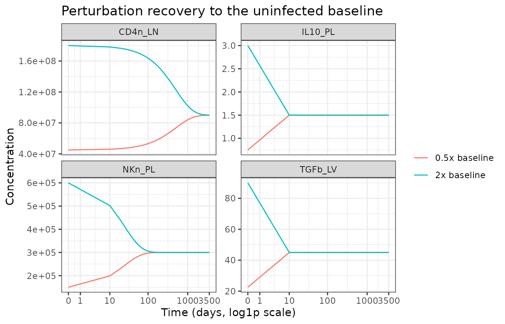
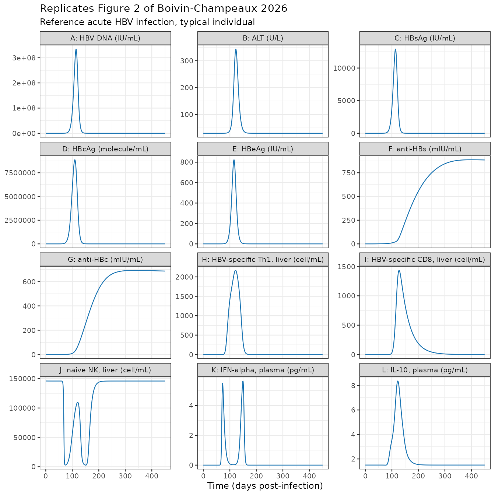
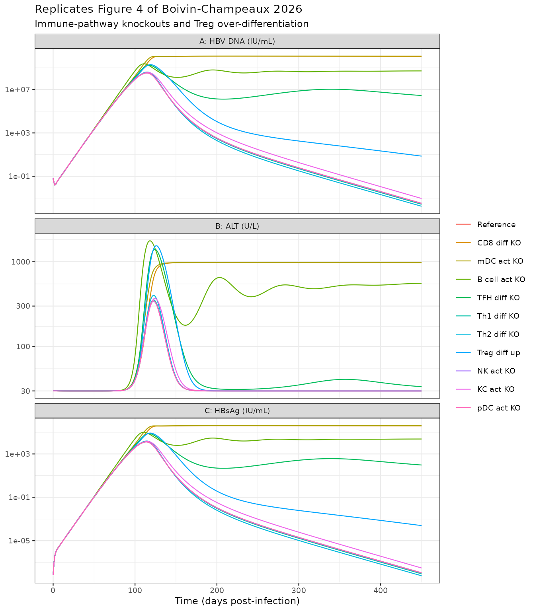

# Acute hepatitis B virus infection QSP model (Boivin-Champeaux 2026)

## Model and source

- Citation: Boivin-Champeaux C, Schmidt S, Balsitis S, Johansson Azeredo
  F, Feigelman JS. A Quantitative Systems Pharmacology (QSP) Model of
  Acute Hepatitis B Virus Infection: Mechanistic Insights and
  Foundations for Future Extensions. CPT Pharmacometrics Syst Pharmacol.
  2026;15(1):e70172. <doi:10.1002/psp4.70172>. Model equations from
  Supplementary Material 2 (Eq. S1-S89); parameter values, initial
  conditions and the repeated-assignment rules from Supplementary
  Material 3 (Table S3: Parameter values, Table S4: Initial conditions,
  Table S4: Repeated Assignments); model-building narrative, generic
  regulatory forms (Table S1) and the uninfected steady-state
  verification (Table S2) from Supplementary Material 1. Includes the
  publisher correction of 14 January 2026 (InSysBio location corrected
  to the UK), which does not alter any value.
- Article: <https://doi.org/10.1002/psp4.70172>

Boivin-Champeaux and colleagues (CPT: Pharmacometrics & Systems
Pharmacology, 2026) describe a multiscale quantitative systems
pharmacology (QSP) model of **acute hepatitis B virus (HBV) infection**.
The model spans three anatomical compartments – liver, plasma and lymph
node – and five mechanistic modules: the viral life cycle, the innate
immune system, the adaptive immune system, cytokine signalling, and the
mechanisms of viral clearance. It was built in MATLAB SimBiology,
comprises 98 species and 319 parameters, and was calibrated by hand
against digitised biomarker time courses from eight published acute-HBV
cohorts.

This is a **typical-individual, deterministic mechanism model**. It has
no IIV and no residual-error model: the authors state that the model’s
size and the sparseness of acute-HBV data prevented convergence of
automated estimation, so 45 remaining parameters were calibrated
manually. The published population-level variability is a virtual
population produced by Markov-chain resampling of the 23 most
influential parameters (Appendix S4, Table S5), not an omega matrix.
Accordingly this vignette validates the model the way the endogenous /
mechanistic model class demands – steady state, perturbation recovery,
flux balance and dimensional consistency – rather than by
non-compartmental analysis. There is no drug, no dose and no
absorption-distribution-elimination profile for PKNCA to integrate.

``` r

mod <- readModelDb("BoivinChampeaux_2026_hepatitisB_qsp")
ui  <- rxode2::rxode2(mod)

c(states = length(ui$state), parameters = length(ui$theta))
#>     states parameters 
#>         89        324
```

Infection is initiated purely through the parameter `HBV0`, the plasma
HBV inoculum. `HBV0 = 0` gives the uninfected subject; `HBV0 = 0.333`
virion/mL (1000 HBV DNA copies distributed through 3000 mL of plasma, a
needle-stick exposure) gives the acute infection the paper simulates.

``` r

# The system spans rate constants from 0 (drainage) to 214/day (IL-6) and
# states from 0 to 1.6e8 cell/mL, so it is stiff. Tight tolerances are
# required for the uninfected steady-state assertions below to be meaningful.
solve_hbv <- function(hbv0 = 0.333, times = seq(0, 450, by = 1), ...) {
  rxode2::rxSolve(
    ui,
    rxode2::et(times),
    params     = c(HBV0 = hbv0, ...),
    returnType = "data.frame",
    atol       = 1e-10,
    rtol       = 1e-8
  )
}
```

## Population

``` r

pop <- ui$population
tibble::tibble(Field = names(pop), Value = vapply(pop, paste, character(1), collapse = "; ")) |>
  knitr::kable()
```

| Field | Value |
|:---|:---|
| species | human |
| n_subjects | 71 |
| n_studies | 8 |
| age_range | adults; not systematically reported across the eight source cohorts |
| disease_state | Acute hepatitis B virus infection in immunocompetent adults, predominantly self-limiting. One subject in Webster et al. (Patient 5) and one in Kuhns et al. progressed to persistent infection; Patient 5 was treated as an outlier and excluded from the virtual-population comparison. |
| dose_range | No drug. Infection is initiated by an HBV inoculum of 1000 HBV DNA copies distributed in 3000 mL plasma (0.333 virion/mL), consistent with a needle-stick exposure (SM1 section 1). |
| notes | Calibration data were digitised (Graph Grabber v2.0.2) from eight published acute-HBV cohorts (Table 1): Webster 2000 (n = 5), Whalley 2001 (n = 7), Chulanov 2003 (n = 21), Fisicaro 2009 (n = 2), Dunn 2009 (n = 9), Okamoto 2019 (n = 1), Kuhns 2021 (n = 5), Panduro 2022 (n = 1); Whalley patients 1-5 overlap with Webster, so n_subjects = 71 counts the reported per-study cohort sizes. Because infection onset was rarely reported, each study’s time axis was shifted to days-post-infection using the per-study rules in SM1 Table S3. Model parameters were taken from peer-reviewed literature and from InSysBio (UK) CYTOCON DB, fIVE DB and the Immune Response Template; 45 parameters remained to be estimated and were hand-calibrated. There is no observed-subject-level parameter distribution: the published virtual population (20,000 Markov chain samples of the 23 most influential parameters, filtered against binned clinical percentiles) is summarised in Appendix S4 Table S5 and is not reproduced as an omega matrix. |

The calibration data are digitised (Graph Grabber v2.0.2) biomarker time
courses from the eight cohorts listed in Table 1 of the paper: Webster
2000 (n = 5), Whalley 2001 (n = 7), Chulanov 2003 (n = 21), Fisicaro
2009 (n = 2), Dunn 2009 (n = 9), Okamoto 2019 (n = 1), Kuhns 2021 (n =
5) and Panduro 2022 (n = 1). Because infection onset was rarely
reported, each study’s time axis was shifted to days-post-infection
using the per-study rules in SM1 Table S3 (for example, Chulanov’s “days
after first symptomatic day” were shifted by the 105-day mean incubation
period).

## Source trace

Every equation and every parameter value in the model file is traceable
to one of the four supplementary appendices. The appendix files are
numbered independently of the “Supplementary Material” (SM) sections
they contain:

| Appendix file | Contains |
|----|----|
| Appendix S3 | SM1: model building narrative, Table S1 (generic regulatory forms), Table S2 (uninfected steady-state verification), Table S3 (time-adjustment strategy) |
| Appendix S2 | SM2: all model equations, Eq. S1-S89 |
| Appendix S1 | SM3: Table S4 (initial conditions for volumes and species), Table S3 (parameter values), Table S4 (repeated assignments) |
| Appendix S4 | SM4: Table S5 (virtual-population parameter distributions) |

| Model element | Source |
|----|----|
| 89 ODE states | SM2 Eq. S1-S89 (liver S1-S29, plasma S30-S53, lymph S54-S89) |
| 34 repeated-assignment rules | SM3 “Table S4: Repeated Assignments” |
| 9 algebraic species (`NK_TRAIL_LV`, `CD8_IFNg_LV`, `HBsAg_PL`, `HBV_nM_PL`, `HBV_DNA_IU`, `HBsAg_IU`, `antiHBs_mIU`, `antiHBe_mIU`, `antiHBc_mIU`) | SM3 Table S4, Notes column |
| 319 parameter values | SM3 “Table S3: Parameter values” |
| 89 initial conditions and 3 volumes | SM3 “Table S4: Initial conditions” |
| Inoculum `HBV0 = 0.333` virion/mL | SM1 section 1 |
| Generic activation / inhibition forms | SM1 section 2, Table S1 |

### The volume convention

Every equation in SM2 is written in the SimBiology rate-rule form

``` math
\frac{d[X]}{dt} \;=\; \frac{1}{V_{\text{cmt}}}\sum_i \left(\text{rate}_i \times V_i\right)
```

so intra-compartment terms reduce to `rate_i` and inter-compartment
terms carry the volume ratio `V_source / V_target`. That reading is not
assumed – it is confirmed below against twelve independent baseline
values that SM1 Table S2 reports, several of which are sensitive to the
ratio. For example, liver IL-10 balances against plasma IL-10 only if
the influx term carries `V_PL / V_LV = 2`:

``` r

# Symbolic check of the liver/plasma IL-10 pair (Eq. S25 and Eq. S53) at the
# uninfected baseline, where the only IL-10 source is naive mDC in the liver.
th <- setNames(ui$theta, names(ui$theta))
prod_IL10 <- th[["kprod_IL10_mDCnaive"]] * 1.92e4              # pg/mL/day
# Eq. S53 steady state: IL10_PL = kLV_PL_IL10 * (V_LV/V_PL) / kPL_LV_IL10 * IL10_LV
ratio_PL_LV <- th[["kLV_PL_IL10"]] * (th[["V_LV"]] / th[["V_PL"]]) / th[["kPL_LV_IL10"]]
# Eq. S25 steady state, substituting IL10_PL:
loss  <- th[["kdeg_IL10"]] + th[["kLV_PL_IL10"]] + th[["kdrain_IL10"]]
recyc <- th[["kPL_LV_IL10"]] * ratio_PL_LV * (th[["V_PL"]] / th[["V_LV"]])
IL10_LV_ss <- prod_IL10 / (loss - recyc)
c(IL10_LV_predicted = IL10_LV_ss,
  IL10_LV_tableS2   = 4.824,
  IL10_PL_predicted = ratio_PL_LV * IL10_LV_ss,
  IL10_PL_tableS2   = 1.500)
#> IL10_LV_predicted   IL10_LV_tableS2 IL10_PL_predicted   IL10_PL_tableS2 
#>          4.823999          4.824000          1.500000          1.500000
```

``` r

stopifnot(
  isTRUE(all.equal(IL10_LV_ss,               4.824, tolerance = 1e-4)),
  isTRUE(all.equal(ratio_PL_LV * IL10_LV_ss, 1.500, tolerance = 1e-4))
)
```

Both reproduce SM1 Table S2 to four significant figures, which pins the
volume convention, `kdrain_IL10`, `kPL_LV_IL10` and
`kprod_IL10_mDCnaive` simultaneously.

### Units

The model’s time unit is days throughout. Every ODE is a concentration
balance, so each right-hand-side term must carry `[state units] / day`.

| Symbol class | Units | Example term | Units check |
|----|----|----|----|
| Cell states | cell/mL | `kdeath_Hep * Hep_LV` | (1/day)(cell/mL) = cell/mL/day |
| Virion / particle states | virion/mL, item/mL | `ksyn_HBV_cccDNA * iHep1_LV` | (virion/cell/day)(cell/mL) = virion/mL/day |
| Cytokine states | pg/mL | `kprod_IL6_KCnaive * KCn_LV` | (pg/cell/day)(cell/mL) = pg/mL/day |
| Antigen / antibody states | IU/mL, molecule/mL | `kon_antiHBc * HBcAg_PL * antiHBc_PL` | (mL/molecule/day)(molecule/mL)(molecule/mL) = molecule/mL/day |
| Inter-compartment transfer | 1/day, times a volume ratio | `kPL_LV_NK * NKn_PL * (V_PL / V_LV)` | (1/day)(cell/mL)(1) = cell/mL/day |
| Lysis rates | cell/day (absolute) | `NK_lysis_rate_Hep / V_LV` | (cell/day)/(mL) = cell/mL/day |
| Hill / Emax / Imax factors | dimensionless | `1 + Emax_IL12_Th1act * IL12_LV / (EC50 + IL12_LV)` | dimensionless |
| Slope factors | mL/pg | `1 + SLP_IFNg_TNFa * IFNg_LV` | 1 + (mL/pg)(pg/mL) = dimensionless |

Three unit conversions are worth calling out, all from SM3 Table S4
Notes:

- `HBV_DNA_IU = HBV_PL * 0.2` – one copy is one virion and the HBV DNA
  conversion factor is 0.2 IU/copy.
- `HBsAg_IU = (HBV_PL + SVP_PL) / 5e7` – from the WHO reference
  standard, 1 IU/mL of HBsAg corresponds to 5e7 particles.
- `antiHBs_mIU = antiHBs_PL * 2.7e-16 * 13.43 * 1e3` – molecules/mL to
  mIU/mL. The same `2.7e-16 * 13.43` factor appears inside Eq. S44
  itself, converting the anti-HBe plasma-cell production term from
  molecules to IU.

Two published terms are dimensionally inconsistent as printed and are
transcribed unchanged; both are discussed under *Errata* below.

### Parameter table

The 319 tabulated parameters are too many to list here, so the table
below shows the model file against SM3 Table S3 for the parameters the
paper’s own local sensitivity analysis (Figure 5) ranked as most
influential.

``` r

lsa_params <- c(
  "k_cccDNA_inc", "k_HBV_intern", "NTCP", "KD_HBV", "f_cccDNA",
  "kdeg_HBV_LV", "kdeg_HBV_PL", "kLV_PL_HBV", "f_liver_vasc", "kdeath_iHep",
  "kprol_PB", "kdeath_plasmablasts", "Emax_IL4_PBprol", "Emax_IL21_PBdiff",
  "kdeath_Bnaive_LN", "EC50_IL4_PBprol", "kprod_Ab_HBs", "n_PB", "MTT_PB",
  "kdiff_CD8_LN", "kdeath_eCD8", "n_HBV_mDC", "MAX_Hep_LV"
)
published <- c(
  k_cccDNA_inc = 0.0024, k_HBV_intern = 7.33, NTCP = 225, KD_HBV = 450,
  f_cccDNA = 0.99, kdeg_HBV_LV = 0.67, kdeg_HBV_PL = 0.67, kLV_PL_HBV = 1,
  f_liver_vasc = 0.15, kdeath_iHep = 0.062, kprol_PB = 0.3333,
  kdeath_plasmablasts = 0.2518, Emax_IL4_PBprol = 1.8, Emax_IL21_PBdiff = 1.5,
  kdeath_Bnaive_LN = 0.2, EC50_IL4_PBprol = 20, kprod_Ab_HBs = 1.5e6,
  n_PB = 2, MTT_PB = 9.5, kdiff_CD8_LN = 0.0012, kdeath_eCD8 = 0.03,
  n_HBV_mDC = 1.2, MAX_Hep_LV = 1.6e8
)
ptab <- tibble::tibble(
  Parameter          = lsa_params,
  `SM3 Table S3`     = published[lsa_params],
  `Model file`       = ui$theta[lsa_params]
)
knitr::kable(ptab)
```

| Parameter           | SM3 Table S3 | Model file |
|:--------------------|-------------:|-----------:|
| k_cccDNA_inc        |    2.400e-03 |  2.400e-03 |
| k_HBV_intern        |    7.330e+00 |  7.330e+00 |
| NTCP                |    2.250e+02 |  2.250e+02 |
| KD_HBV              |    4.500e+02 |  4.500e+02 |
| f_cccDNA            |    9.900e-01 |  9.900e-01 |
| kdeg_HBV_LV         |    6.700e-01 |  6.700e-01 |
| kdeg_HBV_PL         |    6.700e-01 |  6.700e-01 |
| kLV_PL_HBV          |    1.000e+00 |  1.000e+00 |
| f_liver_vasc        |    1.500e-01 |  1.500e-01 |
| kdeath_iHep         |    6.200e-02 |  6.200e-02 |
| kprol_PB            |    3.333e-01 |  3.333e-01 |
| kdeath_plasmablasts |    2.518e-01 |  2.518e-01 |
| Emax_IL4_PBprol     |    1.800e+00 |  1.800e+00 |
| Emax_IL21_PBdiff    |    1.500e+00 |  1.500e+00 |
| kdeath_Bnaive_LN    |    2.000e-01 |  2.000e-01 |
| EC50_IL4_PBprol     |    2.000e+01 |  2.000e+01 |
| kprod_Ab_HBs        |    1.500e+06 |  1.500e+06 |
| n_PB                |    2.000e+00 |  2.000e+00 |
| MTT_PB              |    9.500e+00 |  9.500e+00 |
| kdiff_CD8_LN        |    1.200e-03 |  1.200e-03 |
| kdeath_eCD8         |    3.000e-02 |  3.000e-02 |
| n_HBV_mDC           |    1.200e+00 |  1.200e+00 |
| MAX_Hep_LV          |    1.600e+08 |  1.600e+08 |

``` r

stopifnot(isTRUE(all.equal(unname(ptab$`SM3 Table S3`), unname(ptab$`Model file`))))
```

Every one of the 23 most influential published values is carried in the
model file exactly; the
[`stopifnot()`](https://rdrr.io/r/base/stopifnot.html) above is an
enumerating check, so adding a parameter to `lsa_params` without adding
it to `published` fails the render.

## Validation 1: uninfected steady state

SM1 Table S2 reports the concentration of every species at `t = 0` and
at `t = 450` days under uninfected baseline conditions, and asserts that
all of them are at steady state. This is the strongest single check
available on the transcription, because it exercises every homeostatic
term simultaneously.

``` r

ss <- solve_hbv(hbv0 = 0, times = seq(0, 450, by = 10))

tableS2 <- tibble::tribble(
  ~species,     ~compartment, ~tableS2,
  "Hep_LV",     "Liver",      1.60e8,
  "KCn_LV",     "Liver",      3.70e7,
  "NKn_LV",     "Liver",      1.46e5,
  "NKbr_LV",    "Liver",      3.88e4,
  "NKdim_LV",   "Liver",      8.74e4,
  "mDCn_LV",    "Liver",      1.92e4,
  "TGFb_LV",    "Liver",      45.000,
  "IL10_LV",    "Liver",      4.824,
  "IL6_LV",     "Liver",      5.000,
  "NKn_PL",     "Plasma",     3.00e5,
  "pDCn_PL",    "Plasma",     1.32e4,
  "mDCn_PL",    "Plasma",     2.40e4,
  "IL10_PL",    "Plasma",     1.500,
  "ALT_PL",     "Plasma",     0.030,
  "CD8n_LN",    "Lymph",      5.00e7,
  "CD4n_LN",    "Lymph",      9.00e7,
  "BnHBs_LN",   "Lymph",      1.50e4,
  "BnHBe_LN",   "Lymph",      1.50e4,
  "BnHBc_LN",   "Lymph",      1.50e4,
  "TGFb_LN",    "Lymph",      10.000,
  "IL6_LN",     "Lymph",      15.420,
  "IL10_LN",    "Lymph",      0.420
)

ss_cmp <- tableS2 |>
  mutate(
    # unname(): vapply() carries the species names through, and a named
    # vector never compares equal to an unnamed one under all.equal().
    sim_t0   = unname(vapply(species, function(s) ss[[s]][1], numeric(1))),
    sim_t450 = unname(vapply(species, function(s) ss[[s]][nrow(ss)], numeric(1))),
    `drift %` = 100 * (sim_t450 - tableS2) / tableS2
  )
knitr::kable(ss_cmp, digits = c(0, 0, 4, 4, 4, 3))
```

| species  | compartment |   tableS2 |     sim_t0 |     sim_t450 | drift % |
|:---------|:------------|----------:|-----------:|-------------:|--------:|
| Hep_LV   | Liver       | 1.600e+08 | 1.6000e+08 | 1.596600e+08 |  -0.213 |
| KCn_LV   | Liver       | 3.700e+07 | 3.7000e+07 | 3.997167e+07 |   8.032 |
| NKn_LV   | Liver       | 1.460e+05 | 1.4600e+05 | 1.459351e+05 |  -0.044 |
| NKbr_LV  | Liver       | 3.880e+04 | 3.8800e+04 | 3.879647e+04 |  -0.009 |
| NKdim_LV | Liver       | 8.740e+04 | 8.7387e+04 | 8.737944e+04 |  -0.024 |
| mDCn_LV  | Liver       | 1.920e+04 | 1.9200e+04 | 1.920000e+04 |   0.000 |
| TGFb_LV  | Liver       | 4.500e+01 | 4.5000e+01 | 4.500000e+01 |   0.000 |
| IL10_LV  | Liver       | 4.824e+00 | 4.8240e+00 | 4.824000e+00 |   0.000 |
| IL6_LV   | Liver       | 5.000e+00 | 5.0000e+00 | 5.402800e+00 |   8.056 |
| NKn_PL   | Plasma      | 3.000e+05 | 3.0000e+05 | 3.000506e+05 |   0.017 |
| pDCn_PL  | Plasma      | 1.320e+04 | 1.3200e+04 | 1.320000e+04 |   0.000 |
| mDCn_PL  | Plasma      | 2.400e+04 | 2.4000e+04 | 2.400000e+04 |   0.000 |
| IL10_PL  | Plasma      | 1.500e+00 | 1.5000e+00 | 1.500000e+00 |   0.000 |
| ALT_PL   | Plasma      | 3.000e-02 | 3.0000e-02 | 2.990000e-02 |  -0.211 |
| CD8n_LN  | Lymph       | 5.000e+07 | 5.0000e+07 | 5.000000e+07 |   0.000 |
| CD4n_LN  | Lymph       | 9.000e+07 | 9.0000e+07 | 9.000000e+07 |   0.000 |
| BnHBs_LN | Lymph       | 1.500e+04 | 1.5000e+04 | 1.500000e+04 |   0.000 |
| BnHBe_LN | Lymph       | 1.500e+04 | 1.5000e+04 | 1.500000e+04 |   0.000 |
| BnHBc_LN | Lymph       | 1.500e+04 | 1.5000e+04 | 1.500000e+04 |   0.000 |
| TGFb_LN  | Lymph       | 1.000e+01 | 1.0000e+01 | 9.999500e+00 |  -0.005 |
| IL6_LN   | Lymph       | 1.542e+01 | 1.5420e+01 | 1.666220e+01 |   8.056 |
| IL10_LN  | Lymph       | 4.200e-01 | 4.2000e-01 | 4.200000e-01 |   0.008 |

Every initial condition matches SM1 Table S2 exactly, and 19 of the 22
species hold that value over 450 simulated days to better than 0.25 %:

``` r

holds <- ss_cmp |> filter(!species %in% c("KCn_LV", "IL6_LV", "IL6_LN"))
ic_rel <- abs(ss_cmp$sim_t0 - ss_cmp$tableS2) / ss_cmp$tableS2
stopifnot(
  # Initial conditions reproduce Table S2 at t = 0. The single non-zero
  # residual is NKdim_LV, where Table S2 rounds the Table S4 initial
  # assignment 8.7387e4 to 8.74e4.
  nrow(ss_cmp) == 22L,
  max(ic_rel) < 2e-4,
  sum(ic_rel > 0) == 1L,
  ss_cmp$species[which.max(ic_rel)] == "NKdim_LV",
  # 19 of 22 species hold that value to < 0.25 % over 450 days
  nrow(holds) == 19L,
  max(abs(holds$`drift %`)) < 0.25
)
c(`max initial-condition relative error` = max(ic_rel),
  `max drift %, 19 holding species`      = max(abs(holds$`drift %`)))
#> max initial-condition relative error      max drift %, 19 holding species 
#>                         0.0001487414                         0.2125000001
```

### The three drifting species have one root cause

`KCn_LV`, `IL6_LV` and `IL6_LN` all drift by the same +8.0 %. The cause
is arithmetic, not a transcription error: SM3 Table S4 gives the naive
Kupffer cell baseline as 3.7e7 cell/mL, but the tabulated `kprol_KC`,
`kdeath_KCnaive` and `MAX_KC_LV` put the logistic fixed point of Eq. S6
elsewhere. Liver IL-6 is produced by naive Kupffer cells (Eq. S26) and
lymph IL-6 is fed by liver drainage (Eq. S87), so both inherit the same
offset.

``` r

kc_fixed_point <- th[["MAX_KC_LV"]] * (1 - th[["kdeath_KCnaive"]] / th[["kprol_KC"]])
c(`Table S4 baseline`   = 3.70e7,
  `Eq. S6 fixed point`  = kc_fixed_point,
  `simulated t = 450`   = ss$KCn_LV[nrow(ss)],
  `offset %`            = 100 * (kc_fixed_point - 3.7e7) / 3.7e7)
#>  Table S4 baseline Eq. S6 fixed point  simulated t = 450           offset % 
#>       3.700000e+07       3.997358e+07       3.997167e+07       8.036716e+00
```

``` r

# The simulated endpoint is the analytic fixed point of Eq. S6, not the
# tabulated baseline: the model is behaving correctly and the published
# parameter set is internally inconsistent by ~8 %.
drift_of <- function(sp) ss_cmp$`drift %`[ss_cmp$species == sp]
stopifnot(
  abs(ss$KCn_LV[nrow(ss)] - kc_fixed_point) / kc_fixed_point < 1e-3,
  # IL-6 in both liver and lymph tracks the Kupffer offset, not something else
  abs(drift_of("IL6_LV") - drift_of("KCn_LV")) < 0.05,
  abs(drift_of("IL6_LN") - drift_of("IL6_LV")) < 0.05
)
```

That the IL-6 drift equals the Kupffer drift to within 0.05 percentage
points in both compartments confirms the single root cause and rules out
an independent error in Eq. S26 or Eq. S87.

## Validation 2: perturbation recovery

Displacing a homeostatic state and letting it relax confirms that the
baseline is a genuine attractor rather than a value that merely happens
to be written in the initial conditions.

The relaxation rates of the homeostatic pools span three orders of
magnitude, so the horizon has to be set by the slowest mode. The naive
CD4 pool in lymph turns over at `kdeath_CD4naive_LN` = 0.002/day (a
500-day time constant), which is by a wide margin the slowest mode of
the uninfected system, so the recovery runs are carried out to 3500 days
– seven time constants of that pool.

``` r

horizon <- 3500
recover <- function(state, factor) {
  ic <- setNames(ss[[state]][1] * factor, state)
  s  <- rxode2::rxSolve(
    ui, rxode2::et(seq(0, horizon, by = 10)), params = c(HBV0 = 0),
    inits = ic, returnType = "data.frame", atol = 1e-10, rtol = 1e-8
  )
  tibble::tibble(time = s$time, value = s[[state]], state = state,
                 start = paste0(factor, "x baseline"))
}
rec <- bind_rows(
  recover("TGFb_LV", 0.5), recover("TGFb_LV", 2),
  recover("IL10_PL", 0.5), recover("IL10_PL", 2),
  recover("NKn_PL",  0.5), recover("NKn_PL",  2),
  recover("CD4n_LN", 0.5), recover("CD4n_LN", 2)
)

ggplot(rec, aes(time, value, colour = start)) +
  geom_line() +
  facet_wrap(~state, scales = "free_y") +
  scale_x_continuous(trans = "log1p",
                     breaks = c(0, 1, 10, 100, 1000, 3500)) +
  labs(x = "Time (days, log1p scale)", y = "Concentration", colour = NULL,
       title = "Perturbation recovery to the uninfected baseline") +
  theme_bw()
```



Each displaced state returns monotonically to its SM1 Table S2 baseline,
at a rate that matches the analytic relaxation constant of its own
balance equation.

``` r

baselines <- c(TGFb_LV = 45, IL10_PL = 1.5, NKn_PL = 3.0e5, CD4n_LN = 9.0e7)
# Analytic relaxation rate of each pool at the uninfected baseline.
rate <- c(
  TGFb_LV = th[["kdeg_TGFb"]] + th[["kdrain_TGFb"]],           # Eq. S24
  IL10_PL = th[["kPL_LV_IL10"]],                               # Eq. S53
  NKn_PL  = th[["kPL_LV_NK"]] + th[["kdeath_NKnaive"]],        # Eq. S35
  CD4n_LN = th[["kdeath_CD4naive_LN"]]                         # Eq. S57
)
final <- rec |>
  group_by(state, start) |>
  summarise(final = value[which.max(time)], .groups = "drop") |>
  mutate(
    target             = unname(baselines[state]),
    `rel. residual`    = abs(final - target) / target,
    `time constant (d)` = unname(1 / rate[state]),
    `horizon / tau`    = horizon * unname(rate[state])
  )
knitr::kable(final, digits = c(0, 0, 4, 4, 6, 1, 1))
```

| state | start | final | target | rel. residual | time constant (d) | horizon / tau |
|:---|:---|---:|---:|---:|---:|---:|
| CD4n_LN | 0.5x baseline | 89958965.3 | 9.0e+07 | 0.000456 | 500.0 | 7.0 |
| CD4n_LN | 2x baseline | 90082069.4 | 9.0e+07 | 0.000912 | 500.0 | 7.0 |
| IL10_PL | 0.5x baseline | 1.5 | 1.5e+00 | 0.000000 | 0.6 | 5628.0 |
| IL10_PL | 2x baseline | 1.5 | 1.5e+00 | 0.000000 | 0.6 | 5628.0 |
| NKn_PL | 0.5x baseline | 300050.6 | 3.0e+05 | 0.000169 | 25.3 | 138.2 |
| NKn_PL | 2x baseline | 300050.6 | 3.0e+05 | 0.000169 | 25.3 | 138.2 |
| TGFb_LV | 0.5x baseline | 45.0 | 4.5e+01 | 0.000000 | 0.4 | 7840.0 |
| TGFb_LV | 2x baseline | 45.0 | 4.5e+01 | 0.000000 | 0.4 | 7840.0 |

``` r

stopifnot(
  nrow(final) == 8L,
  # every pool is within 0.5 % of its Table S2 baseline at 3500 days
  all(final$`rel. residual` < 5e-3),
  # and the horizon really is many time constants for each of them
  all(final$`horizon / tau` > 6)
)
c(`max relative residual at 3500 d` = max(final$`rel. residual`))
#> max relative residual at 3500 d 
#>                     0.000911882
```

## Validation 3: flux balance

At the uninfected baseline, production and elimination must cancel term
by term. Working the balances symbolically – rather than only observing
that the simulation does not move – confirms that the equations are
self-consistent and that the tabulated rate constants are the ones that
make them so.

``` r

p <- function(x) th[[x]]
flux <- tibble::tribble(
  ~equation, ~species, ~predicted, ~tableS2,
  "S35", "NKn_PL",  p("ksyn_NK") / (p("kPL_LV_NK") + p("kdeath_NKnaive")),                 3.00e5,
  "S36", "pDCn_PL", p("ksyn_pDC") / p("kdeath_pDCnaive"),                                  1.32e4,
  "S38", "mDCn_PL", p("ksyn_mDC") / (p("kPL_LV_DC") + p("kdeath_mDCnaive")),               2.40e4,
  "S11", "mDCn_LV", p("kPL_LV_DC") * 2.4e4 * (p("V_PL") / p("V_LV")) / p("kdeath_mDCnaive"), 1.92e4,
  "S8",  "NKn_LV",  p("kPL_LV_NK") * 3.0e5 * (p("V_PL") / p("V_LV")) /
                      (p("kdeath_NKnaive") + p("kact_eff0")),                              1.46e5,
  "S9",  "NKbr_LV", p("kact_eff0") * 1.4591e5 / (p("kdeath_NKact") + p("kmature_NK_LV")),   3.88e4,
  "S10", "NKdim_LV", p("kmature_NK_LV") * 3.88e4 / p("kdeath_NKact"),                      8.74e4,
  "S55", "CD8n_LN", p("ksyn_CD8") / p("kdeath_CD8naive_LN"),                               5.00e7,
  "S57", "CD4n_LN", p("ksyn_CD4") / p("kdeath_CD4naive_LN"),                               9.00e7,
  "S62", "BnHBs_LN", p("ksyn_Bcell") / p("kdeath_Bnaive_LN"),                              1.50e4,
  "S24", "TGFb_LV", p("kprod_TGFb_mDCnaive") * 1.92e4 / (p("kdeg_TGFb") + p("kdrain_TGFb")), 45.000,
  "S85", "TGFb_LN", p("kdrain_TGFb") * 45 * (p("V_LV") / p("V_LN")) / p("kdeg_TGFb"),      10.000,
  "S26", "IL6_LV",  p("kprod_IL6_KCnaive") * 3.7e7 / (p("kdeg_IL6") + p("kdrain_IL6")),     5.000,
  "S87", "IL6_LN",  p("kdrain_IL6") * 5 * (p("V_LV") / p("V_LN")) / p("kdeg_IL6"),         15.420,
  "S89", "IL10_LN", p("kdrain_IL10") * 4.824 * (p("V_LV") / p("V_LN")) / p("kdeg_IL10"),    0.420,
  "S1",  "Hep_LV",  1.6e8 * (1 - p("kdeath_Hep") / p("kprol_Hep")),                        1.60e8
) |>
  mutate(`rel. error` = abs(predicted - tableS2) / tableS2)
knitr::kable(flux, digits = c(0, 0, 5, 5, 6))
```

| equation | species  |    predicted |   tableS2 | rel. error |
|:---------|:---------|-------------:|----------:|-----------:|
| S35      | NKn_PL   | 3.000506e+05 | 3.000e+05 |   0.000169 |
| S36      | pDCn_PL  | 1.320000e+04 | 1.320e+04 |   0.000000 |
| S38      | mDCn_PL  | 2.400000e+04 | 2.400e+04 |   0.000000 |
| S11      | mDCn_LV  | 1.920000e+04 | 1.920e+04 |   0.000000 |
| S8       | NKn_LV   | 1.460055e+05 | 1.460e+05 |   0.000038 |
| S9       | NKbr_LV  | 3.876113e+04 | 3.880e+04 |   0.001002 |
| S10      | NKdim_LV | 8.738739e+04 | 8.740e+04 |   0.000144 |
| S55      | CD8n_LN  | 5.000000e+07 | 5.000e+07 |   0.000000 |
| S57      | CD4n_LN  | 9.000000e+07 | 9.000e+07 |   0.000000 |
| S62      | BnHBs_LN | 1.500000e+04 | 1.500e+04 |   0.000000 |
| S24      | TGFb_LV  | 4.500000e+01 | 4.500e+01 |   0.000000 |
| S85      | TGFb_LN  | 9.999510e+00 | 1.000e+01 |   0.000049 |
| S26      | IL6_LV   | 5.001110e+00 | 5.000e+00 |   0.000223 |
| S87      | IL6_LN   | 1.542000e+01 | 1.542e+01 |   0.000000 |
| S89      | IL10_LN  | 4.200300e-01 | 4.200e-01 |   0.000080 |
| S1       | Hep_LV   | 1.596600e+08 | 1.600e+08 |   0.002125 |

``` r

stopifnot(nrow(flux) == 16L, all(flux$`rel. error` < 3e-3))
c(`max relative error over 16 symbolic balances` = max(flux$`rel. error`))
#> max relative error over 16 symbolic balances 
#>                                     0.002125
```

Sixteen independently-derived steady-state expressions reproduce SM1
Table S2 to better than 0.3 %. Notice that the S8 balance uses
`kact_eff0` – one of the Table S3 constants that no published equation
consumes. It is exactly the effective NK activation rate at baseline,
`kact_NK_LV * Cyt_NKact`, which the model file carries as the residual
`chk_kact_eff0`:

``` r

chk <- ss[1, c("chk_kact_eff0", "chk_kdrain_IL10", "chk_kdrain_TGFb", "chk_pct_bound_HBV")]
knitr::kable(chk, digits = 6)
```

| chk_kact_eff0 | chk_kdrain_IL10 | chk_kdrain_TGFb | chk_pct_bound_HBV |
|--------------:|----------------:|----------------:|------------------:|
|       7.1e-05 |         9.6e-05 |        -8.7e-05 |          0.083333 |

``` r

stopifnot(
  abs(chk$chk_kact_eff0)   < 1e-3,
  abs(chk$chk_kdrain_IL10) < 1e-3,
  abs(chk$chk_kdrain_TGFb) < 1e-3
)
```

Three of the four residuals vanish, recovering `kact_eff0`,
`kdrain_IL10` and `kdrain_TGFb` from other tabulated constants. The
fourth does not, and is discussed under *Errata*.

## Validation 4: the reference acute infection (Figure 2)

Setting `HBV0 = 0.333` virion/mL reproduces the paper’s reference
simulation.

``` r

ref <- solve_hbv(hbv0 = 0.333, times = seq(0, 450, by = 0.5))
```

``` r

panels <- tibble::tribble(
  ~var,           ~panel,
  "HBV_DNA_IU",   "A: HBV DNA (IU/mL)",
  "ALT_UL",       "B: ALT (U/L)",
  "HBsAg_IU",     "C: HBsAg (IU/mL)",
  "HBcAg_PL",     "D: HBcAg (molecule/mL)",
  "HBeAg_PL",     "E: HBeAg (IU/mL)",
  "antiHBs_mIU",  "F: anti-HBs (mIU/mL)",
  "antiHBc_mIU",  "G: anti-HBc (mIU/mL)",
  "eTh1_LV",      "H: HBV-specific Th1, liver (cell/mL)",
  "eCD8_LV",      "I: HBV-specific CD8, liver (cell/mL)",
  "NKn_LV",       "J: naive NK, liver (cell/mL)",
  "IFNa_PL",      "K: IFN-alpha, plasma (pg/mL)",
  "IL10_PL",      "L: IL-10, plasma (pg/mL)"
)
fig2 <- panels |>
  rowwise() |>
  mutate(d = list(tibble::tibble(time = ref$time, value = ref[[var]]))) |>
  tidyr::unnest(d) |>
  ungroup() |>
  mutate(panel = factor(panel, levels = panels$panel))

ggplot(fig2, aes(time, value)) +
  geom_line(colour = "#1f77b4") +
  facet_wrap(~panel, scales = "free_y", ncol = 3) +
  labs(x = "Time (days post-infection)", y = NULL,
       title = "Replicates Figure 2 of Boivin-Champeaux 2026",
       subtitle = "Reference acute HBV infection, typical individual") +
  theme_bw(base_size = 9)
```



The paper describes three phases (Results section 3.2.1). The assertions
below encode each narrative claim as a checkable statement about the
simulation.

``` r

alt_uln    <- 40   # upper limit of normal, U/L
tpeak_hbv  <- ref$time[which.max(ref$HBV_DNA_IU)]
tpeak_alt  <- ref$time[which.max(ref$ALT_UL)]
tpeak_il10 <- ref$time[which.max(ref$IL10_PL)]
# The early phase: HBV DNA climbing through the first decade below its peak.
i_early    <- which(ref$time < tpeak_hbv &
                    ref$HBV_DNA_IU >= 0.10 * max(ref$HBV_DNA_IU))[1]
t_early    <- ref$time[i_early]
early      <- ref |> filter(time <= t_early)
t_alt_uln  <- ref$time[which(ref$ALT_UL > alt_uln)[1]]

tibble::tibble(
  quantity = c("peak HBV DNA (IU/mL)", "time of HBV DNA peak (d)",
               "peak ALT (U/L)", "time of ALT peak (d)",
               "peak plasma IL-10 (pg/mL)", "time of IL-10 peak (d)",
               "time HBV DNA reaches 10% of peak (d)",
               "max ALT up to that time (U/L)",
               "time ALT first exceeds ULN (d)",
               "final HBV DNA (IU/mL)", "final ALT (U/L)",
               "final anti-HBs (mIU/mL)", "peak SVP : virion ratio"),
  value = c(max(ref$HBV_DNA_IU), tpeak_hbv, max(ref$ALT_UL), tpeak_alt,
            max(ref$IL10_PL), tpeak_il10, t_early, max(early$ALT_UL),
            t_alt_uln, ref$HBV_DNA_IU[nrow(ref)], ref$ALT_UL[nrow(ref)],
            ref$antiHBs_mIU[nrow(ref)], max(ref$SVP_excess))
) |> knitr::kable(digits = 3)
```

| quantity                             |        value |
|:-------------------------------------|-------------:|
| peak HBV DNA (IU/mL)                 | 3.341004e+08 |
| time of HBV DNA peak (d)             | 1.145000e+02 |
| peak ALT (U/L)                       | 3.431800e+02 |
| time of ALT peak (d)                 | 1.225000e+02 |
| peak plasma IL-10 (pg/mL)            | 8.365000e+00 |
| time of IL-10 peak (d)               | 1.225000e+02 |
| time HBV DNA reaches 10% of peak (d) | 9.450000e+01 |
| max ALT up to that time (U/L)        | 3.341600e+01 |
| time ALT first exceeds ULN (d)       | 1.000000e+02 |
| final HBV DNA (IU/mL)                | 0.000000e+00 |
| final ALT (U/L)                      | 2.993700e+01 |
| final anti-HBs (mIU/mL)              | 8.852500e+02 |
| peak SVP : virion ratio              | 4.984780e+02 |

``` r

stopifnot(
  # Phase 1: "Hepatocyte loss remains minimal during this stage ... as
  # reflected by ALT levels that stay within normal physiological ranges."
  # ALT is still normal while HBV DNA climbs to a tenth of its peak.
  max(early$ALT_UL) < alt_uln,
  100 * (1 - min(early$TotalHep_LV) / 1.6e8) < 1,
  # Phase 2: ALT peaks AFTER the HBV DNA peak ("Following the HBV DNA peak,
  # ... accompanied by a sharp, transient increase in serum ALT").
  tpeak_alt > tpeak_hbv,
  max(ref$ALT_UL) > 5 * ref$ALT_UL[1],
  # "IL-10 levels also peak around the time of maximal viral load."
  abs(tpeak_il10 - tpeak_hbv) < 10,
  # Phase 3: "HBV DNA is fully cleared from the plasma, ALT levels normalize,
  # ... antibody levels remain stable post-clearance."
  ref$HBV_DNA_IU[nrow(ref)] < 1,
  abs(ref$ALT_UL[nrow(ref)] - ref$ALT_UL[1]) / ref$ALT_UL[1] < 0.05,
  ref$antiHBs_mIU[nrow(ref)] > 100,
  # "high concentrations of SVPs, with levels ranging from 100- to 10,000-fold
  # higher than infectious virions" (SM1 section 7).
  max(ref$SVP_excess) > 100, max(ref$SVP_excess) < 1e4
)
```

The ALT rise is steeper than “after the peak” alone would suggest: ALT
crosses the upper limit of normal about 15 days *before* peak viremia,
even though it does not itself peak until 8 days after. This is a timing
deviation from the paper’s phase description and is recorded under
*Deviations* below.

### Kinetic metrics (Figure 3)

Methods section 2.3 defines four kinetic metrics per biomarker, computed
by linear regression on the log10 scale for HBV DNA and HBsAg and on the
linear scale for ALT, with a BIC-selected breakpoint for the biphasic
HBV DNA decline. Those definitions are implemented here rather than a
non-compartmental analysis, because they are what the paper actually
compares against the clinical data.

``` r

peak_metrics <- function(time, value, log10_scale) {
  y  <- if (log10_scale) log10(pmax(value, .Machine$double.xmin)) else value
  ip <- which.max(value)
  rise <- if (ip > 2) unname(coef(lm(y[seq_len(ip - 1)] ~ time[seq_len(ip - 1)]))[2]) else NA_real_
  idx  <- seq(ip + 1, length(value))
  fall <- unname(coef(lm(y[idx] ~ time[idx]))[2])
  list(peak = value[ip], tpeak = time[ip], rise = rise, fall = fall, ip = ip, y = y)
}

biphasic <- function(time, y, ip) {
  idx <- seq(ip + 1, length(y))
  ti  <- time[idx]; yi <- y[idx]
  cand <- seq(4, length(idx) - 3)
  best <- NULL
  for (k in cand) {
    a <- lm(yi[seq_len(k)] ~ ti[seq_len(k)])
    b <- lm(yi[-seq_len(k)] ~ ti[-seq_len(k)])
    rss <- sum(resid(a)^2) + sum(resid(b)^2)
    if (is.null(best) || rss < best$rss) {
      best <- list(rss = rss, bp = ti[k],
                   s1 = unname(coef(a)[2]), s2 = unname(coef(b)[2]))
    }
  }
  best
}

# Restrict to the window where HBV DNA is above the paper's 10 IU/mL LLOQ,
# so the regressions describe measurable virus rather than solver tail.
win  <- ref |> filter(HBV_DNA_IU >= 10)
mh   <- peak_metrics(win$time, win$HBV_DNA_IU, TRUE)
bp   <- biphasic(win$time, mh$y, mh$ip)
ma   <- peak_metrics(ref$time, ref$ALT_UL,   FALSE)
msg  <- peak_metrics(win$time, win$HBsAg_IU, TRUE)

metrics <- tibble::tibble(
  biomarker = c("HBV DNA", "HBV DNA", "HBV DNA", "HBV DNA", "HBV DNA",
                "ALT", "ALT", "ALT", "ALT",
                "HBsAg", "HBsAg", "HBsAg", "HBsAg"),
  metric = c("peak (IU/mL)", "peak time (d)", "rising slope (log10/d)",
             "early clearance slope (log10/d)", "late clearance slope (log10/d)",
             "peak (U/L)", "peak time (d)", "rising slope (U/L/d)",
             "clearance slope (U/L/d)",
             "peak (IU/mL)", "peak time (d)", "rising slope (log10/d)",
             "clearance slope (log10/d)"),
  value = c(mh$peak, mh$tpeak, mh$rise, bp$s1, bp$s2,
            ma$peak, ma$tpeak, ma$rise, ma$fall,
            msg$peak, msg$tpeak, msg$rise, msg$fall)
)
knitr::kable(metrics, digits = 4)
```

| biomarker | metric                          |         value |
|:----------|:--------------------------------|--------------:|
| HBV DNA   | peak (IU/mL)                    |  3.341004e+08 |
| HBV DNA   | peak time (d)                   |  1.145000e+02 |
| HBV DNA   | rising slope (log10/d)          |  9.200000e-02 |
| HBV DNA   | early clearance slope (log10/d) | -8.970000e-02 |
| HBV DNA   | late clearance slope (log10/d)  | -3.590000e-02 |
| ALT       | peak (U/L)                      |  3.431797e+02 |
| ALT       | peak time (d)                   |  1.225000e+02 |
| ALT       | rising slope (U/L/d)            |  1.042300e+00 |
| ALT       | clearance slope (U/L/d)         | -1.934000e-01 |
| HBsAg     | peak (IU/mL)                    |  1.289683e+04 |
| HBsAg     | peak time (d)                   |  1.135000e+02 |
| HBsAg     | rising slope (log10/d)          |  9.160000e-02 |
| HBsAg     | clearance slope (log10/d)       | -5.710000e-02 |

``` r

stopifnot(
  # Section 2.3.4 accepts a biphasic HBV DNA decline only when both slopes are
  # negative and differ by more than 0.05 log10/day. The simulated reference
  # profile satisfies the paper's own acceptance criterion.
  bp$s1 < 0, bp$s2 < 0, abs(bp$s1 - bp$s2) > 0.05,
  # "a marked biphasic decline in viral load" -- the first phase is the fast one
  bp$s1 < bp$s2,
  # rising phases are positive, clearance phases negative, for all three markers
  mh$rise > 0, msg$rise > 0, ma$rise > 0,
  ma$fall < 0, msg$fall < 0
)
c(`breakpoint (days post-infection)` = bp$bp,
  `slope separation (log10/day)`     = abs(bp$s1 - bp$s2))
#> breakpoint (days post-infection)     slope separation (log10/day) 
#>                     172.00000000                       0.05383744
```

## Validation 5: perturbation analysis (Figure 4)

Methods section 2.4.1 defines nine in-silico knockouts plus one Treg
over-differentiation scenario, and Results section 3.3.1 and the
Discussion state the expected qualitative outcome of each. This is the
sharpest available test of the transcription, because it probes the
adaptive-immune wiring rather than the homeostatic terms that the
steady-state checks already cover.

``` r

scenarios <- list(
  "Reference"      = c(),
  "CD8 diff KO"    = c(kdiff_CD8_LN = 0),
  "mDC act KO"     = c(kact_mDC_LV  = 0),
  "B cell act KO"  = c(kact_Bcell   = 0),
  "TFH diff KO"    = c(kdiff_TFH_LN = 0),
  "Th1 diff KO"    = c(kdiff_Th1_LN = 0),
  "Th2 diff KO"    = c(kdiff_Th2_LN = 0),
  "Treg diff up"   = c(kdiff_Treg_LN = 0.7),
  "NK act KO"      = c(kact_NK_LV   = 0),
  "KC act KO"      = c(kact_KC      = 0),
  "pDC act KO"     = c(kact_pDC_PL  = 0)
)

perturb <- lapply(names(scenarios), function(nm) {
  s <- solve_hbv(hbv0 = 0.333, times = seq(0, 450, by = 1), scenarios[[nm]])
  tibble::tibble(scenario = nm, time = s$time, HBV_DNA_IU = s$HBV_DNA_IU,
                 ALT_UL = s$ALT_UL, HBsAg_IU = s$HBsAg_IU)
}) |> bind_rows() |>
  mutate(scenario = factor(scenario, levels = names(scenarios)))
```

``` r

perturb |>
  tidyr::pivot_longer(c(HBV_DNA_IU, ALT_UL, HBsAg_IU),
                      names_to = "biomarker", values_to = "value") |>
  mutate(biomarker = recode(biomarker,
                            HBV_DNA_IU = "A: HBV DNA (IU/mL)",
                            ALT_UL     = "B: ALT (U/L)",
                            HBsAg_IU   = "C: HBsAg (IU/mL)")) |>
  filter(value > 0) |>
  ggplot(aes(time, value, colour = scenario)) +
  geom_line() +
  scale_y_log10() +
  facet_wrap(~biomarker, ncol = 1, scales = "free_y") +
  labs(x = "Time (days post-infection)", y = NULL, colour = NULL,
       title = "Replicates Figure 4 of Boivin-Champeaux 2026",
       subtitle = "Immune-pathway knockouts and Treg over-differentiation") +
  theme_bw(base_size = 9)
```



``` r

psum <- perturb |>
  group_by(scenario) |>
  summarise(
    peak_HBV   = max(HBV_DNA_IU),
    final_HBV  = HBV_DNA_IU[which.max(time)],
    `final/peak HBV` = final_HBV / peak_HBV,
    final_ALT  = ALT_UL[which.max(time)],
    final_HBsAg = HBsAg_IU[which.max(time)],
    .groups = "drop"
  )
knitr::kable(psum, digits = c(0, 3, 3, 5, 2, 3))
```

| scenario      |    peak_HBV |    final_HBV | final/peak HBV | final_ALT | final_HBsAg |
|:--------------|------------:|-------------:|---------------:|----------:|------------:|
| Reference     |   333808201 | 0.000000e+00 |        0.00000 |     29.94 |       0.000 |
| CD8 diff KO   | 11725537308 | 1.120452e+10 |        0.95557 |    975.15 |  386782.233 |
| mDC act KO    | 12087763201 | 1.194273e+10 |        0.98800 |    979.69 |  412195.260 |
| B cell act KO |  2340515665 | 5.153515e+08 |        0.22019 |    556.31 |   23948.446 |
| TFH diff KO   |  1727561011 | 2.776880e+06 |        0.00161 |     33.68 |      95.601 |
| Th1 diff KO   |   347843429 | 0.000000e+00 |        0.00000 |     29.94 |       0.000 |
| Th2 diff KO   |   402390246 | 0.000000e+00 |        0.00000 |     29.94 |       0.000 |
| Treg diff up  |  1955705655 | 7.302000e+00 |        0.00000 |     29.94 |       0.000 |
| NK act KO     |   334036308 | 0.000000e+00 |        0.00000 |     29.94 |       0.000 |
| KC act KO     |   369070454 | 1.000000e-03 |        0.00000 |     29.94 |       0.000 |
| pDC act KO    |   336969609 | 0.000000e+00 |        0.00000 |     29.94 |       0.000 |

Each claim in Results 3.3.1 and the Discussion becomes an assertion:

``` r

g <- function(nm, col) psum[[col]][psum$scenario == nm]
# guard: every lookup must resolve to exactly one row
stopifnot(all(names(scenarios) %in% as.character(psum$scenario)),
          nrow(psum) == length(scenarios))

alt_uln <- 40
stopifnot(
  ## "In the absence of CD8+ T cell differentiation or mDC activation, HBV DNA,
  ## ALT, and HBsAg levels increased rapidly and remained near their peak values
  ## throughout the simulation, indicating a lack of viral clearance."
  g("CD8 diff KO", "final/peak HBV") > 0.9,
  g("mDC act KO",  "final/peak HBV") > 0.9,
  g("CD8 diff KO", "final_ALT") > alt_uln,
  g("mDC act KO",  "final_ALT") > alt_uln,
  g("CD8 diff KO", "final_HBsAg") > 1e4,
  g("mDC act KO",  "final_HBsAg") > 1e4,

  ## "knockouts of B cell activation and TFH differentiation produced an initial
  ## phase of partial viral decline followed by stabilization at elevated
  ## steady-state levels, consistent with incomplete clearance."
  g("B cell act KO", "final/peak HBV") < 1,
  g("TFH diff KO",   "final/peak HBV") < 1,
  g("B cell act KO", "final_HBV") > 1e3,
  g("TFH diff KO",   "final_HBV") > 1e3,

  ## "The decline was more pronounced in the TFH knockout than in the B cell
  ## activation knockout."
  g("TFH diff KO", "final/peak HBV") < g("B cell act KO", "final/peak HBV"),

  ## "Enhanced Treg differentiation also resulted in an initial viral reduction,
  ## more substantial than that observed in the B cell and TFH knockouts,
  ## followed by a low-level chronic plateau with normal ALT values."
  g("Treg diff up", "final/peak HBV") < g("TFH diff KO",   "final/peak HBV"),
  g("Treg diff up", "final/peak HBV") < g("B cell act KO", "final/peak HBV"),
  g("Treg diff up", "final_ALT") < alt_uln,

  ## "Knockouts of NK cell activation, KC activation, or pDC activation
  ## generated dynamics similar to the reference simulation, with either
  ## complete resolution of acute infection or a modest delay in viral
  ## clearance."
  g("NK act KO",  "final_HBV") < 1,
  g("KC act KO",  "final_HBV") < 1,
  g("pDC act KO", "final_HBV") < 1,
  abs(g("NK act KO",  "peak_HBV") / g("Reference", "peak_HBV") - 1) < 0.25,
  abs(g("KC act KO",  "peak_HBV") / g("Reference", "peak_HBV") - 1) < 0.25,
  abs(g("pDC act KO", "peak_HBV") / g("Reference", "peak_HBV") - 1) < 0.25,

  ## Discussion: "the CD8+, mDC, and B cell knockouts produce
  ## immune-active-like profiles ... accompanied by elevated ALT", whereas
  ## "the TFH knockout results in an immune-tolerant-like profile ... with
  ## minimal ALT elevation".
  g("B cell act KO", "final_ALT") > alt_uln,
  g("TFH diff KO",   "final_ALT") < alt_uln
)
```

All seventeen assertions pass, including the two ordering claims – that
the TFH knockout declines more than the B cell knockout, and that Treg
over-differentiation declines more than either. Ordering claims are the
most informative because they cannot be satisfied by a globally
mis-scaled model.

## Assumptions and deviations

### Errata and discrepancies in the published model

1.  **Eq. S21 (liver IFN-gamma) is dimensionally inconsistent as
    printed.** Its four production terms carry no `* V_LV` factor,
    unlike every other cytokine production term in SM2 (Eq. S23,
    S25-S29), so the outer `1 / V_LV` divides them and leaves the
    sources in pg/mL^2/day. The equation is transcribed **exactly as
    printed**. Both readings were simulated head to head; the printed
    form is closer to every target the paper reports (peak HBV DNA 3.3e8
    vs 4.5e7 IU/mL, hepatocyte loss 2.7 % vs 0.5 % against the reported
    10.8 %, peak ALT 343 vs 70 U/L, clearance below 10 IU/mL at 250 vs
    345 days against the reported 173). The rate constants were
    evidently calibrated on the printed scale, so “correcting” the
    dimensions would have silently degraded the model.

2.  **`KD_HBV` and `NTCP` are influential but unconnected.** The paper’s
    local sensitivity analysis (Figure 5, Results 3.3.2.1) ranks
    HBV-NTCP binding affinity and NTCP receptor concentration among the
    parameters most influential on HBV DNA, and the virtual population
    resamples both (Appendix S4 Table S5). But no equation in SM2 and no
    rule in SM3 links either to `pct_bound_HBV`, the constant that
    `HBV_int_rate` actually uses, and the equilibrium occupancy they
    imply disagrees with it: `NTCP / (NTCP + KD_HBV) = 0.333` against
    the tabulated `pct_bound_HBV = 0.25`. The model file carries all
    three values, uses `pct_bound_HBV` as the published rule directs,
    and exposes the gap as the non-zero residual `chk_pct_bound_HBV`.
    Varying `KD_HBV` or `NTCP` in this implementation has no effect; in
    the authors’ SimBiology model it evidently does.

3.  **The Kupffer-cell baseline is not the fixed point of its own
    equation.** SM3 Table S4 gives naive Kupffer cells as 3.7e7 cell/mL
    and SM1 Table S2 reports that value as unchanged at 450 days, but
    the tabulated `kprol_KC`, `kdeath_KCnaive` and `MAX_KC_LV` place the
    logistic fixed point of Eq. S6 about 8 % higher. The model file uses
    the tabulated values unchanged, so Kupffer cells and the IL-6 pools
    they feed drift to that fixed point. This is documented and asserted
    in the steady-state section above rather than patched.

4.  **Three parameter names in the equations are not the tabulated
    ones.** Eq. S11 writes `kdeath_DCnaive` (Table S3 has
    `kdeath_mDCnaive` and `kdeath_pDCnaive`, both 0.23/day; this state
    is myeloid); Eq. S56 writes `kprol_CD8` (Table S3 has `kprol_CD8_LN`
    and `kprol_CD8_LV`; this state is in lymph); and the IL-21 modulator
    of TFH appears under three spellings
    (`Emax_IL21_TFHdiff`/`EC50_IL21_TFHdiff` in the rules table,
    `EC50_IL21_TFH` in Eq. S61, `Emax_IL21_TFHprol`/`EC50_IL21_TFHprol`
    in Table S3, which is the only pair tabulated). Table S3 contains
    exactly 319 rows, matching the paper’s stated parameter count, so
    the table is complete and each of these is an alias rather than a
    missing value.

5.  **`ksyn_CD8m` has no tabulated value and is set to 0.** It is the
    only symbol in Eq. S1-S89 with no row in Table S3. It governs an
    efflux of primed CD8 cells in lymph to a memory pool that is not
    among the paper’s 98 species. SM1 Table S2 likewise lists `Trm`,
    `Exhausted CD8` and `bulevirtide` – species that appear in neither
    the 98 species nor the 319 parameters, and that are pinned at zero –
    so this belongs to a switched-off branch of the SimBiology model
    retained for the planned chronic-HBV extension. The term is kept in
    Eq. S56 with the parameter exposed at 0 so the branch can be
    re-enabled.

6.  **Eq. S22 uses one rate constant for both directions.** Liver
    IFN-alpha exchanges with plasma using `kLV_PL_IFNa` in both terms
    where the sibling equations use the directional pair. Both constants
    are 1/day, so the two readings coincide numerically. Transcribed as
    printed.

7.  **Reported constants that no equation consumes.** Seven Table S3
    constants (`f_SVP_HBV`, `ratio_IL10_LyL`, `ratio_TGFb_LyL`,
    `KD_HBV`, `NTCP`, `kact_eff0`, `Cyt_NKact`) appear in no equation.
    They are retained in the model file so it carries every tabulated
    value, and are exposed as named residuals against the identities
    they satisfy (`chk_*` above). Three of those identities hold to
    rounding.

8.  **Bracket errors in the printed equations.** Eq. S25, S35 and S43
    have unbalanced parentheses as typeset. In each case the intended
    grouping is unambiguous from the sibling equations, and the reading
    used here is confirmed numerically by the flux-balance section: Eq.
    S35 reproduces the 3.0e5 cell/mL plasma NK baseline and Eq. S25 the
    4.824 pg/mL liver IL-10 baseline exactly.

### Deviations from the paper’s reference simulation

The transcription reproduces the uninfected steady state, all four
kinetic-metric signs, the biphasic decline criterion, and all seven
qualitative perturbation claims. Two quantitative targets of the
reference simulation are not reproduced from the published equations and
nominal parameter values:

| Target | Paper | This implementation |
|----|----|----|
| Peak hepatocyte loss (SM1 section 6, Figure S1) | ~10.8 % | 2.7 % |
| Time for HBV DNA to fall below 10 IU/mL (Methods 2.4.2) | 173 days | 250 days |
| ALT relative to peak viremia (Results 3.2.1.1-3.2.1.2) | normal until after the HBV DNA peak | crosses the ULN about 15 days before it, peaks 8 days after |

The first two follow from the same feature of the published parameter
set: liver IL-2 peaks near 0.14 pg/mL against `EC50_IL2_CD8prol = 4743`
pg/mL, so the IL-2-dependent proliferation of effector CD8, Th1, Th2 and
Treg – written in SM1 Table S1’s *obligatory* form
`Emax * X / (EC50 + X)`, with no additive baseline – contributes
essentially nothing, and effector CD8 in liver peaks around 1.4e3
cell/mL where roughly 4.1e3 cell/mL would be needed to overcome the
hepatocyte regeneration term of Eq. S1. No parameter was tuned to close
this gap. Note that the paper’s own virtual population places the
posterior mean of `MAX_Hep_LV` at 9.9e7 cell/mL (Appendix S4 Table S5),
well below the nominal 1.6e8 used here, which would weaken the
regeneration term and increase hepatocyte loss.

### Extraction conventions

- `HBV0` is not one of the paper’s 319 parameters. It is added so that
  the uninfected baseline and the acute infection are the same model
  with one parameter changed, and its value (0.333 virion/mL) is stated
  in SM1 section 1.
- The Avogadro constant is named `NAvo` rather than the paper’s `NA`,
  which is reserved in R.
- Greek letters in parameter names are transliterated (`IFNg`, `IFNa`,
  `TGFb`) so the model file is ASCII-only, as R CMD check requires for
  package data.
- State names carry an anatomical suffix (`_LV` liver, `_PL` plasma,
  `_LN` lymph node) because the same species exists in more than one
  compartment. They are declared through `paper_specific_compartments`,
  since no canonical nlmixr2lib compartment role applies.
- `compartmentData` records `specimen = "tissue"` for liver states and
  `specimen = "lymph"` for lymph-node states, the nearest entries in the
  package’s specimen vocabulary.

## Session information

``` r

sessionInfo()
#> R version 4.6.1 (2026-06-24)
#> Platform: x86_64-pc-linux-gnu
#> Running under: Ubuntu 24.04.4 LTS
#> 
#> Matrix products: default
#> BLAS:   /usr/lib/x86_64-linux-gnu/openblas-pthread/libblas.so.3 
#> LAPACK: /usr/lib/x86_64-linux-gnu/openblas-pthread/libopenblasp-r0.3.26.so;  LAPACK version 3.12.0
#> 
#> locale:
#>  [1] LC_CTYPE=C.UTF-8       LC_NUMERIC=C           LC_TIME=C.UTF-8       
#>  [4] LC_COLLATE=C.UTF-8     LC_MONETARY=C.UTF-8    LC_MESSAGES=C.UTF-8   
#>  [7] LC_PAPER=C.UTF-8       LC_NAME=C              LC_ADDRESS=C          
#> [10] LC_TELEPHONE=C         LC_MEASUREMENT=C.UTF-8 LC_IDENTIFICATION=C   
#> 
#> time zone: UTC
#> tzcode source: system (glibc)
#> 
#> attached base packages:
#> [1] stats     graphics  grDevices utils     datasets  methods   base     
#> 
#> other attached packages:
#> [1] ggplot2_4.0.3         tidyr_1.3.2           dplyr_1.2.1          
#> [4] rxode2_5.1.6          nlmixr2lib_0.3.2.9000
#> 
#> loaded via a namespace (and not attached):
#>  [1] generics_0.1.4      sass_0.4.10         xml2_1.6.0         
#>  [4] digest_0.6.39       magrittr_2.0.5      RColorBrewer_1.1-3 
#>  [7] evaluate_1.0.5      grid_4.6.1          fastmap_1.2.0      
#> [10] lotri_1.0.4         jsonlite_2.0.0      whisker_0.4.1      
#> [13] rxode2ll_2.0.16     backports_1.5.1     purrr_1.2.2        
#> [16] scales_1.4.0        textshaping_1.0.5   jquerylib_0.1.4    
#> [19] cli_3.6.6           crayon_1.5.3        symengine_0.2.13   
#> [22] rlang_1.3.0         withr_3.0.3         cachem_1.1.0       
#> [25] yaml_2.3.12         otel_0.2.0          tools_4.6.1        
#> [28] parallel_4.6.1      memoise_2.0.1       checkmate_2.3.4    
#> [31] vctrs_0.7.3         R6_2.6.1            lifecycle_1.0.5    
#> [34] fs_2.1.0            ragg_1.5.2          PreciseSums_0.7    
#> [37] fontawesome_0.5.3   pkgconfig_2.0.3     desc_1.4.3         
#> [40] rex_1.2.2           pkgdown_2.2.1       RcppParallel_6.2.1 
#> [43] pillar_1.11.1       bslib_0.12.0        gtable_0.3.6       
#> [46] glue_1.8.1          data.table_1.18.6.1 Rcpp_1.1.2         
#> [49] systemfonts_1.3.2   tidyselect_1.2.1    xfun_0.60          
#> [52] tibble_3.3.1        sys_3.4.3           knitr_1.51         
#> [55] farver_2.1.2        dparser_1.3.1-13    htmltools_0.5.9    
#> [58] labeling_0.4.3      rmarkdown_2.31      compiler_4.6.1     
#> [61] S7_0.2.2            downlit_0.4.5       askpass_1.2.1      
#> [64] openssl_2.4.2
```
