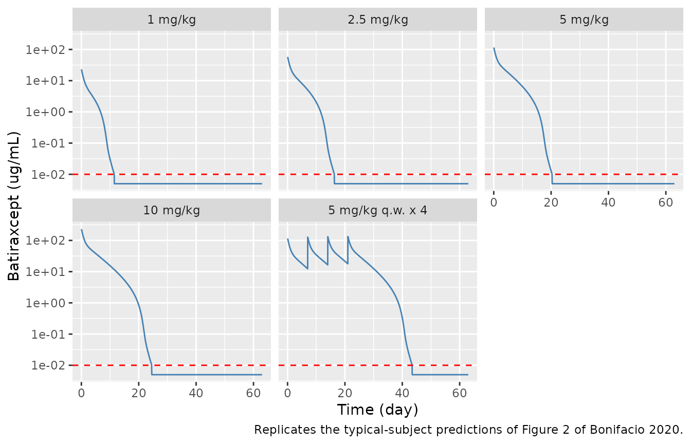
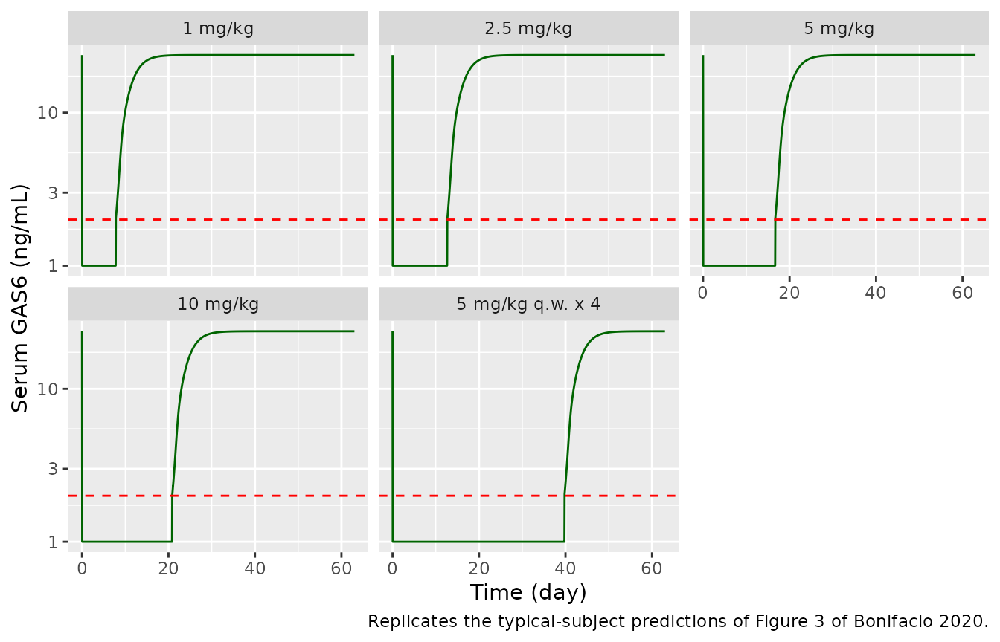
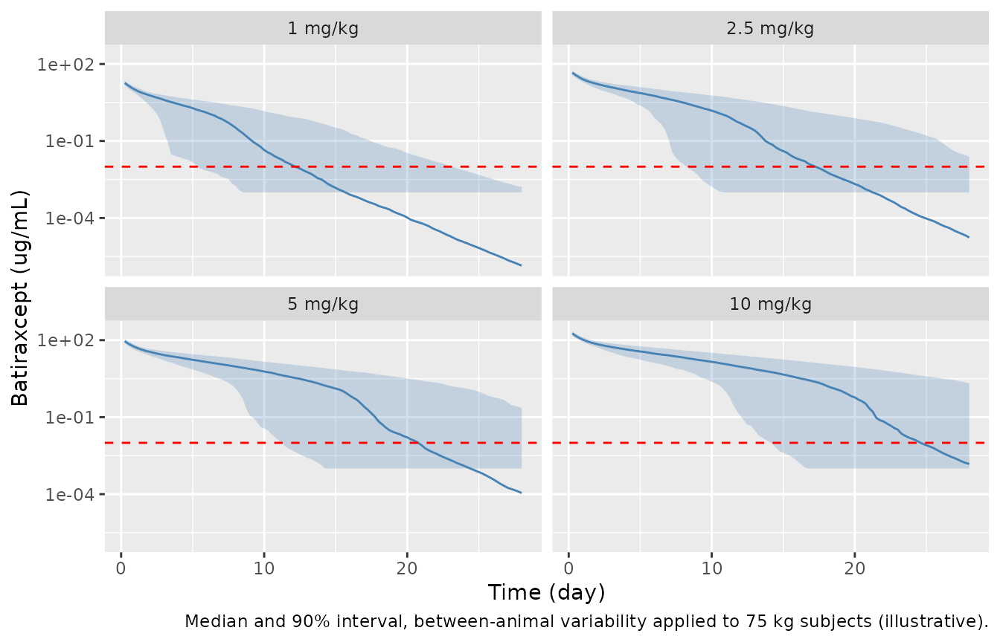

# Batiraxcept (Bonifacio 2020)

## Model and source

- Citation: Bonifacio L, Dodds M, Prohaska D, Moss A, Giaccia A,
  Tabibiazar R, McIntyre G. (2020). Target-Mediated Drug Disposition
  Pharmacokinetic/Pharmacodynamic Model-Informed Dose Selection for the
  First-in-Human Study of AVB-S6-500. Clinical and Translational Science
  13(1), 204-211. <doi:10.1111/cts.12706>. Model equations and the PD
  parameter table are in Supplementary Material CTS-13-204-s001.docx.
- Description: Preclinical (cynomolgus monkey), allometrically scaled to
  human. Two-compartment population PK model for batiraxcept
  (AVB-S6-500, an AXL-ectodomain / IgG1 Fc fusion protein that
  neutralises GAS6) with parallel linear and Michaelis-Menten
  (target-mediated) elimination from the central compartment, fit to
  cynomolgus monkey serum concentrations (0.1-150 mg/kg) with parameters
  centred on a 70 kg subject. CL, Q and Vmax scale with (WT/70)^0.75 and
  VC, VP with (WT/70)^1. A direct (no-hysteresis) inhibitory sigmoid
  Emax relationship drives serum free GAS6 suppression from the drug
  concentration (not scaled between species). The paper used the
  typical-value model to select the first-in-human doses (1, 2.5, 5, 10
  mg/kg IV) in healthy volunteers.
- Article: <https://doi.org/10.1111/cts.12706> (open access, PMC6951457)
- Supplement: Supplementary Material `CTS-13-204-s001.docx` (model
  equations, PK and PD parameter tables, monkey VPCs)

Batiraxcept (AVB-S6-500) is a fusion of the AXL extracellular domain and
a human IgG1 Fc that binds growth arrest-specific 6 (GAS6) protein with
femtomolar affinity. Bonifacio 2020 fit a two-compartment model with
parallel linear and Michaelis-Menten (target-mediated) elimination to
cynomolgus monkey serum concentrations, scaled it allometrically to
humans, and linked the serum drug concentration to serum free GAS6
through a direct inhibitory sigmoid Emax relationship. The typical-value
human projection was used to pick the first-in-human (FIH) doses, and
the FIH study served as an external validation.

## Population

The model was fit to data from five nonclinical cynomolgus monkey
studies covering 0.1 to 150 mg/kg: 2 animals per dose level at 0.1, 0.5
and 1 mg/kg, 4 animals at 5 mg/kg (two studies), 12 animals per dose
level over 30-100 mg/kg (three studies) and 18 animals at 150 mg/kg
(Methods, “Nonclinical studies used for PK/PD model development”). The
total animal count and the animal body weights are not reported. PK
parameters are reported centred on a 70 kg subject.

The external validation cohort (NCT03401528; Table 1) was 31 healthy
volunteers receiving batiraxcept by 60-minute IV infusion: single doses
of 1, 2.5, 5 or 10 mg/kg (6 per group) or 5 mg/kg once weekly for 4
weeks (7), aged 22-54 years, median weight 75.5 kg, predominantly Black
or African American and male. The paper’s pre-study simulations used a
75 kg typical subject; this vignette does the same.

The same information is available programmatically via
`readModelDb("Bonifacio_2020_batiraxcept")()$population`.

## Source trace

| Equation / parameter | Value | Source location |
|----|----|----|
| `lcl` (CL at 70 kg) | 1.10 L/day | Table 2; Supplement Table 1 |
| `lvc` (VC at 70 kg) | 2.97 L | Table 2; Supplement Table 1 |
| `lvp` (VP at 70 kg) | 2.94 L | Table 2; Supplement Table 1 |
| `lq` (Q at 70 kg) | 2.04 L/day | Table 2; Supplement Table 1 |
| `lvmax` (Vmax at 70 kg) | 3.35 mg/day | Table 2; Supplement Table 1 |
| `lkm` (KM) | 102 ng/mL = 0.102 ug/mL | Table 2; Supplement Table 1 |
| `e_wt_cl` | 0.75 (not estimated) | Methods “Model predictions of clinical PK/PD”; Supplement “Scaling to Human Pharmacokinetics” |
| `e_wt_vc` | 1.0 (not estimated) | Same as above |
| `lrbase` (E0, baseline GAS6) | 23.8 ng/mL | Supplement Table 2 |
| `lec50` (EC50) | 21.4 ng/mL = 0.0214 ug/mL | Supplement Table 2 |
| `lhill` (H) | 0.796 | Supplement Table 2 |
| `etalcl`, `etalvc`, `etalvp`, `etalq`, `etalvmax`, `etalkm` | 29.7, 14.0, 14.3, 50.0, 98.6, 103 CV% -\> omega^2 = log(CV^2 + 1) | Table 2; Supplement Table 1 |
| `propSd` | proportional; magnitude not reported, encoded `fixed(0)` | Supplement “Non-Human Primate Pharmacokinetic Analysis” |
| `d/dt(central)`, `d/dt(peripheral1)` | two-compartment with parallel linear + Michaelis-Menten loss of `Ap` | Supplement Methods (dAp/dt, dAt/dt); Figure 1 |
| `GAS6 <- E0 * (1 - C^H / (EC50^H + C^H))` | direct effect | Supplement “Non-Human Primate Pharmacodynamic Analysis” |
| Allometric scaling `(WT/70)^0.75` on CL, Q, Vmax; `(WT/70)^1` on VC, VP |  | Supplement “Scaling to Human Pharmacokinetics” |

## Typical-subject simulation of the FIH regimens

The paper’s human projections (Figures 2 and 3, Table 3) are
typical-value predictions for a 75 kg subject; between-animal
variability was deliberately not propagated (Supplement Results;
Discussion). The random effects are therefore zeroed here.

``` r

wt_sim <- 75
inf_dur <- 1 / 24 # 60-minute infusion, in days

regimens <- tibble::tribble(
  ~treatment,           ~dose_mgkg, ~n_doses,
  "1 mg/kg",            1,          1L,
  "2.5 mg/kg",          2.5,        1L,
  "5 mg/kg",            5,          1L,
  "10 mg/kg",           10,         1L,
  "5 mg/kg q.w. x 4",   5,          4L
)

obs_times <- sort(unique(c(
  seq(0, 63, by = 1 / 24),
  inf_dur + 7 * (0:3)
)))

make_regimen <- function(i) {
  r <- regimens[i, ]
  dose_times <- 7 * (seq_len(r$n_doses) - 1)
  doses <- tibble(
    id = i, time = dose_times, evid = 1L, amt = r$dose_mgkg * wt_sim,
    rate = r$dose_mgkg * wt_sim / inf_dur, cmt = "central"
  )
  obs <- tibble(
    id = i, time = obs_times, evid = 0L, amt = 0, rate = 0, cmt = "central"
  )
  bind_rows(doses, obs) |>
    mutate(treatment = r$treatment, WT = wt_sim) |>
    arrange(time, desc(evid))
}

events_typ <- bind_rows(lapply(seq_len(nrow(regimens)), make_regimen))
stopifnot(!anyDuplicated(events_typ[, c("id", "time", "evid")]))
```

``` r

mod <- readModelDb("Bonifacio_2020_batiraxcept")
mod_typ <- rxode2::zeroRe(mod)
#> ℹ parameter labels from comments will be replaced by 'label()'
sim_typ <- rxode2::rxSolve(
  mod_typ,
  events = events_typ, keep = c("treatment"),
  rtol = 1e-10, atol = 1e-12
) |>
  as.data.frame() |>
  mutate(treatment = factor(treatment, levels = regimens$treatment))
#> ℹ omega/sigma items treated as zero: 'etalcl', 'etalvc', 'etalvp', 'etalq', 'etalvmax', 'etalkm'
#> Warning: multi-subject simulation without without 'omega'
```

### Figure 2: serum batiraxcept

``` r

# Replicates the model lines of Figure 2 of Bonifacio 2020 (typical 75 kg
# subject). LLOQ 10 ng/mL = 0.01 ug/mL; values below LLOQ plotted at LLOQ/2
# as in the paper.
lloq_pk <- 0.01
sim_typ |>
  filter(time > 0) |>
  mutate(Cc_plot = ifelse(Cc < lloq_pk, lloq_pk / 2, Cc)) |>
  ggplot(aes(time, Cc_plot)) +
  geom_line(colour = "steelblue") +
  geom_hline(yintercept = lloq_pk, linetype = "dashed", colour = "red") +
  facet_wrap(~treatment) +
  scale_y_log10() +
  labs(
    x = "Time (day)", y = "Batiraxcept (ug/mL)",
    caption = "Replicates the typical-subject predictions of Figure 2 of Bonifacio 2020."
  )
```



### Figure 3: serum GAS6

``` r

# Replicates the model lines of Figure 3 of Bonifacio 2020. GAS6 LLOQ in the
# FIH study was 2 ng/mL; values below LLOQ plotted at LLOQ/2.
lloq_gas6 <- 2
sim_typ |>
  mutate(GAS6_plot = ifelse(GAS6 < lloq_gas6, lloq_gas6 / 2, GAS6)) |>
  ggplot(aes(time, GAS6_plot)) +
  geom_line(colour = "darkgreen") +
  geom_hline(yintercept = lloq_gas6, linetype = "dashed", colour = "red") +
  facet_wrap(~treatment) +
  scale_y_log10() +
  labs(
    x = "Time (day)", y = "Serum GAS6 (ng/mL)",
    caption = "Replicates the typical-subject predictions of Figure 3 of Bonifacio 2020."
  )
```



## PKNCA validation against Table 3 (model-predicted values)

Table 3 of Bonifacio 2020 lists the model-predicted Cmax and AUC0-tau
for the typical 75 kg subject next to the observed FIH values. The
predicted column is the direct reproduction target for this model; the
observed column is an external comparison that the paper itself reports
as underpredicted for AUC (44.6-72.4% predicted/observed). AUC0-tau is
computed over one week (0-7 days for the single doses and the first
weekly dose, 21-28 days for the fourth weekly dose), which is the
interval that reproduces the paper’s predicted values. Model time is in
days, so the published ug\*h/mL values are divided by 24.

``` r

conc_df <- sim_typ |>
  filter(!is.na(Cc)) |>
  mutate(Cc = pmax(Cc, 0)) |>
  select(id, time, Cc, treatment) |>
  mutate(treatment = as.character(treatment))

dose_df <- events_typ |>
  filter(evid == 1) |>
  select(id, time, amt, treatment)

conc_obj <- PKNCA::PKNCAconc(conc_df, Cc ~ time | treatment + id)
dose_obj <- PKNCA::PKNCAdose(dose_df, amt ~ time | treatment + id)

intervals <- bind_rows(
  data.frame(
    treatment = regimens$treatment, start = 0, end = 7,
    cmax = TRUE, auclast = TRUE
  ),
  data.frame(
    treatment = "5 mg/kg q.w. x 4", start = 21, end = 28,
    cmax = TRUE, auclast = TRUE
  )
)

nca_res <- PKNCA::pk.nca(
  PKNCA::PKNCAdata(conc_obj, dose_obj, intervals = intervals)
)

sim_nca <- as.data.frame(nca_res$result) |>
  mutate(
    group = case_when(
      treatment == "5 mg/kg q.w. x 4" & start == 0 ~ "5 mg/kg q.w. x 4, dose 1",
      treatment == "5 mg/kg q.w. x 4" & start == 21 ~ "5 mg/kg q.w. x 4, dose 4",
      TRUE ~ treatment
    )
  ) |>
  select(group, PPTESTCD, PPORRES)

# Table 3, predicted values (Cmax ug/mL; AUC0-tau ug*h/mL converted to ug*day/mL)
published <- tibble::tribble(
  ~group,                      ~cmax, ~auclast,
  "1 mg/kg",                   23.2,  869 / 24,
  "2.5 mg/kg",                 58.2,  2520 / 24,
  "5 mg/kg",                   116,   5290 / 24,
  "10 mg/kg",                  233,   10800 / 24,
  "5 mg/kg q.w. x 4, dose 1",  116,   5290 / 24,
  "5 mg/kg q.w. x 4, dose 4",  134,   7060 / 24
)

cmp <- nlmixr2lib::ncaComparisonTable(
  simulated = sim_nca,
  reference = published,
  by = "group",
  units = c(cmax = "ug/mL", auclast = "ug*day/mL"),
  tolerance_pct = 20
)
knitr::kable(
  cmp,
  digits = 2,
  caption = "Simulated typical-subject NCA vs. Bonifacio 2020 Table 3 model-predicted values. * differs by >20%."
)
```

| NCA parameter        | group                    | Reference | Simulated | % diff |
|:---------------------|:-------------------------|:----------|:----------|:-------|
| Cmax (ug/mL)         | 1 mg/kg                  | 23.2      | 23        | -0.8%  |
| Cmax (ug/mL)         | 2.5 mg/kg                | 58.2      | 57.6      | -1.0%  |
| Cmax (ug/mL)         | 5 mg/kg                  | 116       | 115       | -0.6%  |
| Cmax (ug/mL)         | 10 mg/kg                 | 233       | 231       | -1.0%  |
| Cmax (ug/mL)         | 5 mg/kg q.w. x 4, dose 1 | 116       | 115       | -0.6%  |
| Cmax (ug/mL)         | 5 mg/kg q.w. x 4, dose 4 | 134       | 133       | -0.7%  |
| AUClast (ug\*day/mL) | 1 mg/kg                  | 36.2      | 36.7      | +1.4%  |
| AUClast (ug\*day/mL) | 2.5 mg/kg                | 105       | 106       | +1.2%  |
| AUClast (ug\*day/mL) | 5 mg/kg                  | 220       | 223       | +1.0%  |
| AUClast (ug\*day/mL) | 10 mg/kg                 | 450       | 455       | +1.1%  |
| AUClast (ug\*day/mL) | 5 mg/kg q.w. x 4, dose 1 | 220       | 223       | +1.0%  |
| AUClast (ug\*day/mL) | 5 mg/kg q.w. x 4, dose 4 | 294       | 300       | +1.8%  |

Simulated typical-subject NCA vs. Bonifacio 2020 Table 3 model-predicted
values. \* differs by \>20%. {.table style="width:100%;"}

``` r

chk <- sim_nca |>
  inner_join(
    published |> pivot_longer(-group, names_to = "PPTESTCD", values_to = "ref"),
    by = c("group", "PPTESTCD")
  ) |>
  mutate(pct_diff = 100 * (PPORRES / ref - 1))
knitr::kable(chk, digits = 2)
```

| group                    | PPTESTCD | PPORRES |    ref | pct_diff |
|:-------------------------|:---------|--------:|-------:|---------:|
| 1 mg/kg                  | auclast  |   36.71 |  36.21 |     1.39 |
| 1 mg/kg                  | cmax     |   23.02 |  23.20 |    -0.75 |
| 2.5 mg/kg                | auclast  |  106.30 | 105.00 |     1.23 |
| 2.5 mg/kg                | cmax     |   57.63 |  58.20 |    -0.98 |
| 5 mg/kg                  | auclast  |  222.52 | 220.42 |     0.96 |
| 5 mg/kg                  | cmax     |  115.30 | 116.00 |    -0.60 |
| 10 mg/kg                 | auclast  |  455.04 | 450.00 |     1.12 |
| 10 mg/kg                 | cmax     |  230.65 | 233.00 |    -1.01 |
| 5 mg/kg q.w. x 4, dose 1 | auclast  |  222.52 | 220.42 |     0.96 |
| 5 mg/kg q.w. x 4, dose 1 | cmax     |  115.30 | 116.00 |    -0.60 |
| 5 mg/kg q.w. x 4, dose 4 | auclast  |  299.61 | 294.17 |     1.85 |
| 5 mg/kg q.w. x 4, dose 4 | cmax     |  133.08 | 134.00 |    -0.68 |

``` r

# Both sides are typical-value predictions of the same model, so the only
# differences are the paper's rounding and its (unreported) output grid and
# integration. Measured: Cmax -0.6% to -1.0%, AUC +1.0% to +1.9%. A 5% bound
# still fails on any mis-transcribed volume, clearance, Vmax or unit, each of
# which moves these values by tens of percent.
stopifnot(nrow(chk) == 12L, all(abs(chk$pct_diff) < 5))
```

## GAS6 suppression versus the paper’s narrative

The Results describe the typical-subject GAS6 prediction qualitatively
at each follow-up visit (GAS6 LLOQ 2 ng/mL, baseline 23.8 ng/mL). The
table below shows the simulated typical GAS6 at those visits.

``` r

gas6_visits <- sim_typ |>
  filter(treatment != "5 mg/kg q.w. x 4", abs(time - round(time)) < 1e-6, round(time) %in% c(7, 14, 21, 28)) |>
  mutate(time = round(time)) |>
  select(treatment, time, Cc, GAS6) |>
  mutate(pct_of_baseline = 100 * GAS6 / 23.8)
knitr::kable(gas6_visits, digits = 3)
```

| treatment | time |     Cc |   GAS6 | pct_of_baseline |
|:----------|-----:|-------:|-------:|----------------:|
| 1 mg/kg   |    7 |  0.820 |  1.239 |           5.204 |
| 1 mg/kg   |   14 |  0.002 | 20.838 |          87.556 |
| 1 mg/kg   |   21 |  0.000 | 23.707 |          99.608 |
| 1 mg/kg   |   28 |  0.000 | 23.797 |          99.989 |
| 2.5 mg/kg |    7 |  5.081 |  0.302 |           1.269 |
| 2.5 mg/kg |   14 |  0.073 |  6.524 |          27.411 |
| 2.5 mg/kg |   21 |  0.000 | 22.733 |          95.515 |
| 2.5 mg/kg |   28 |  0.000 | 23.769 |          99.869 |
| 5 mg/kg   |    7 | 12.311 |  0.150 |           0.631 |
| 5 mg/kg   |   14 |  2.060 |  0.612 |           2.569 |
| 5 mg/kg   |   21 |  0.006 | 17.225 |          72.376 |
| 5 mg/kg   |   28 |  0.000 | 23.559 |          98.986 |
| 10 mg/kg  |    7 | 26.795 |  0.081 |           0.341 |
| 10 mg/kg  |   14 |  6.784 |  0.241 |           1.011 |
| 10 mg/kg  |   21 |  0.371 |  2.225 |           9.348 |
| 10 mg/kg  |   28 |  0.001 | 21.890 |          91.976 |

``` r


g <- function(trt, day) gas6_visits$GAS6[gas6_visits$treatment == trt & gas6_visits$time == day]
stopifnot(
  # "undetectable" at day 7 for every single dose, and at day 14 for 5 and
  # 10 mg/kg (paper Results).
  g("1 mg/kg", 7) < lloq_gas6,
  g("2.5 mg/kg", 7) < lloq_gas6,
  g("5 mg/kg", 14) < lloq_gas6,
  g("10 mg/kg", 14) < lloq_gas6,
  # "nearly baseline" at day 14 for 1 mg/kg and day 21 for 5 mg/kg, and at
  # day 28 for 10 mg/kg (above half of baseline).
  g("1 mg/kg", 14) > 0.5 * 23.8,
  g("5 mg/kg", 21) > 0.5 * 23.8,
  g("10 mg/kg", 28) > 0.5 * 23.8,
  # "just-detectable" at day 14 for 2.5 mg/kg and day 21 for 10 mg/kg: above
  # the LLOQ but well below baseline.
  g("2.5 mg/kg", 14) > lloq_gas6, g("2.5 mg/kg", 14) < 0.5 * 23.8,
  g("10 mg/kg", 21) > lloq_gas6, g("10 mg/kg", 21) < 0.5 * 23.8
)
```

The Supplement also states that batiraxcept concentrations above ~2000
ng/mL suppress GAS6 below the monkey assay LLOQ of 0.78 ng/mL, and that
a concentration at the 10 ng/mL PK LLOQ corresponds to at least 50%
suppression. Checking both against the PD equation:

``` r

pd <- function(C) 23.8 * (1 - C^0.796 / (0.0214^0.796 + C^0.796))
c(GAS6_at_2_ug_per_mL = pd(2), GAS6_at_0.01_ug_per_mL = pd(0.01))
#>    GAS6_at_2_ug_per_mL GAS6_at_0.01_ug_per_mL 
#>               0.625742              15.397095
stopifnot(pd(2) < 0.78)
```

With the printed estimates, GAS6 at 2 ug/mL is below the 0.78 ng/mL
monkey LLOQ, as stated. At the 10 ng/mL PK LLOQ, however, GAS6 is only
35% suppressed, not “at least 50%”: EC50 (21.4 ng/mL) is above the PK
LLOQ, so 50% suppression is reached only at 21.4 ng/mL. This is an
approximation in the paper’s wording and was not tuned.

## Between-subject variability (illustration)

The paper states that, at low doses, the TMDD variability (Vmax and KM
CV ~100%) produces a wide prediction interval while at 5-10 mg/kg the
pathway is saturated and variability matters less. The between-animal
variances are packaged for completeness, but the authors note they have
no known relationship to human variability and did not use them for
human projections. The simulation below (200 virtual 75 kg subjects per
dose, single dose, no residual error because its magnitude was not
reported) illustrates the statement.

``` r

rxode2::rxSetSeed(20200101)
bsv_regs <- regimens |> filter(n_doses == 1L)
events_bsv <- bind_rows(lapply(seq_len(nrow(bsv_regs)), function(i) {
  r <- bsv_regs[i, ]
  ids <- (i - 1L) * 200L + seq_len(200L)
  d <- tibble(
    id = ids, time = 0, evid = 1L, amt = r$dose_mgkg * wt_sim,
    rate = r$dose_mgkg * wt_sim / inf_dur, cmt = "central"
  )
  o <- tidyr::expand_grid(id = ids, time = seq(0, 28, by = 0.25)) |>
    mutate(evid = 0L, amt = 0, rate = 0, cmt = "central")
  bind_rows(d, o) |>
    mutate(treatment = r$treatment, WT = wt_sim) |>
    arrange(id, time, desc(evid))
}))
stopifnot(!anyDuplicated(events_bsv[, c("id", "time", "evid")]))

sim_bsv <- rxode2::rxSolve(mod, events = events_bsv, keep = "treatment") |>
  as.data.frame() |>
  mutate(treatment = factor(treatment, levels = bsv_regs$treatment))
#> ℹ parameter labels from comments will be replaced by 'label()'

sim_bsv |>
  filter(time > 0) |>
  group_by(treatment, time) |>
  summarise(
    Q05 = quantile(Cc, 0.05), Q50 = median(Cc), Q95 = quantile(Cc, 0.95),
    .groups = "drop"
  ) |>
  ggplot(aes(time, Q50)) +
  geom_ribbon(aes(ymin = pmax(Q05, 1e-3), ymax = Q95), alpha = 0.25, fill = "steelblue") +
  geom_line(colour = "steelblue") +
  geom_hline(yintercept = lloq_pk, linetype = "dashed", colour = "red") +
  facet_wrap(~treatment) +
  scale_y_log10() +
  labs(
    x = "Time (day)", y = "Batiraxcept (ug/mL)",
    caption = "Median and 90% interval, between-animal variability applied to 75 kg subjects (illustrative)."
  )
```



``` r

spread <- sim_bsv |>
  filter(abs(time - 14) < 1e-6) |>
  group_by(treatment) |>
  summarise(
    frac_below_lloq = mean(Cc < lloq_pk),
    iqr_log10 = diff(quantile(log10(pmax(Cc, 1e-6)), c(0.25, 0.75))),
    .groups = "drop"
  )
knitr::kable(spread, digits = 2)
```

| treatment | frac_below_lloq | iqr_log10 |
|:----------|----------------:|----------:|
| 1 mg/kg   |            0.64 |      1.99 |
| 2.5 mg/kg |            0.30 |      2.30 |
| 5 mg/kg   |            0.19 |      2.27 |
| 10 mg/kg  |            0.05 |      0.71 |

## Assumptions and deviations

- **Drug name.** The paper refers only to the development code
  AVB-S6-500; the file uses the INN batiraxcept.
- **Residual error.** The Supplement states that residual variability
  was proportional but does not report its magnitude (in either the main
  text or the Supplement), so `propSd` is encoded as `fixed(0)`.
  Simulations with residual error need a user-supplied value.
- **Omega scale and covariances.** Between-animal variability is
  reported as CV%; it was converted with omega^2 = log(CV^2 + 1) (the
  paper does not state which CV convention it used). The Supplement says
  “variance terms were modeled with variance-covariance interactions”
  but the covariances are not reported, so a diagonal omega is used.
  These variances describe monkeys and were not used by the authors for
  human projections.
- **PD model.** The GAS6 Emax model was fit separately (Supplement Table
  2 reports estimate / SE / statistic / p-value, i.e. a regression fit,
  not a joint NONMEM fit), with no residual-error or between-subject
  variability reported. It is packaged as the algebraic output `GAS6`
  (ng/mL) driven by `Cc` (ug/mL; EC50 converted from 21.4 ng/mL) and
  carries no error model. No interspecies scaling was applied to the PD
  (paper Methods), so E0 is the monkey baseline (23.8 ng/mL).
- **LLOQ statements.** The Supplement’s “PK LLOQ implies at least 50%
  suppression” does not hold exactly with the printed EC50 (see above);
  this is recorded, not tuned.
- **External validation.** Observed FIH Cmax and AUC (Table 3) are not
  gated: the paper reports AUC predicted/observed of 44.6-72.4%,
  i.e. the model (as published) underpredicts human exposure at later
  times.
- **Monkey population.** Animal weights and the total animal count are
  not reported, so the monkey fit cannot be re-simulated at animal-level
  covariates; the monkey VPCs (Supplement Figures 2 and 3) are not
  reproduced.
