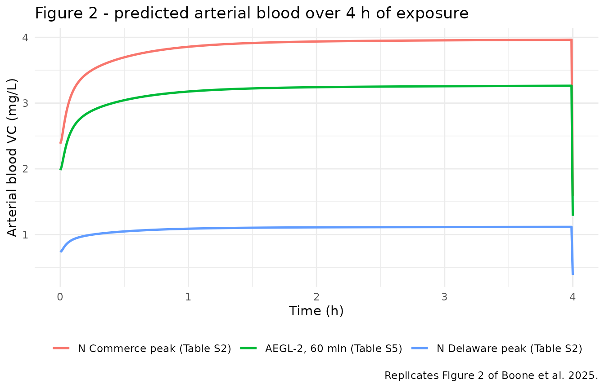
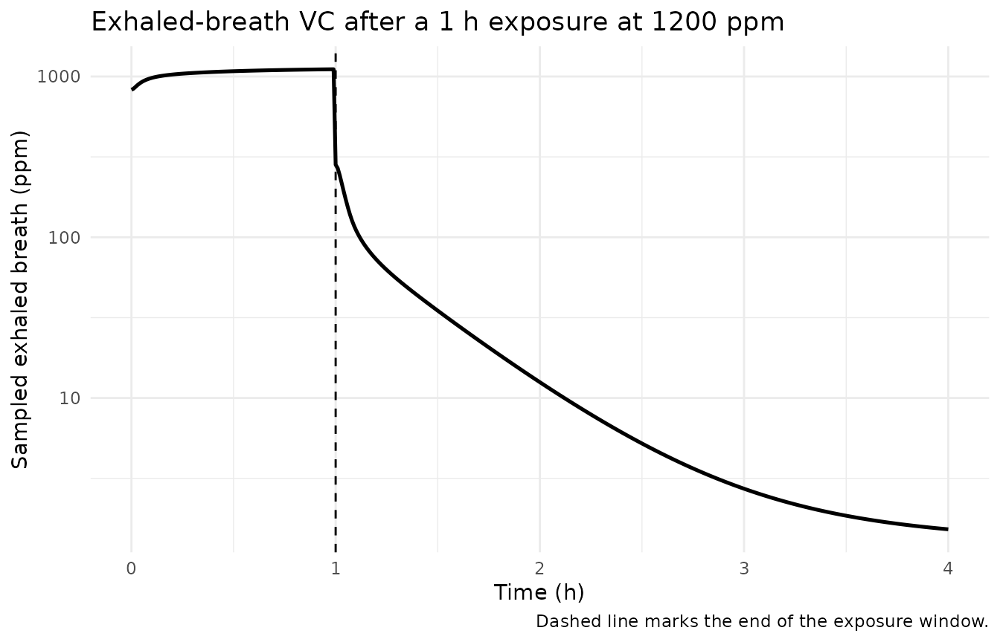

# Vinyl chloride PBPK (Boone 2025)

## Model and source

- Citation: Boone S, Sun W, Gonnabathula P, Wu J, Orr MF, Mumtaz MM,
  Ruiz P. (2025). Assessing the Application of Physiologically Based
  Pharmacokinetic Models in Acute Chemical Incidents. Journal of
  Xenobiotics 15(2):42. <doi:10.3390/jox15020042>. PMCID PMC11932312.
  Model code: Supplementary Materials, ‘Berkeley Madonna code for PBPK
  model of Vinyl Chloride’.

- Article: <https://doi.org/10.3390/jox15020042>

- Supplement (Berkeley Madonna listing):
  <https://www.mdpi.com/2039-4713/15/2/42/s1>

- Description: PBPK (whole-body, flow-limited, seven tissue
  compartments; recoded from Berkeley Madonna 10.4.2). Generic ATSDR
  volatile-organic-compound human PBPK model parameterised for vinyl
  chloride (VC) and applied by Boone et al. 2025 to reconstruct
  community exposure after the 2012 Paulsboro, New Jersey train
  derailment. Venous blood, rapidly perfused, slowly perfused, fat,
  liver, kidney and skin are flow-limited well-mixed compartments;
  arterial blood is an algebraic steady-state lung equation coupling
  cardiac output to alveolar ventilation through the blood:air partition
  coefficient, so inhalation exposure enters as an air concentration
  rather than as a dose record. Saturable Michaelis-Menten hepatic
  metabolism. Three exposure routes are implemented simultaneously and
  driven by exposure parameters exactly as in the published Berkeley
  Madonna listing: inhalation of a square-wave air concentration in ppm,
  repeated oral ingestion of contaminated drinking water, and dermal
  transfer from water across the skin. Deterministic typical-value model
  (no IIV, no residual error): the authors recoded the published Clewell
  VC model onto the ATSDR toolkit platform and evaluated it against
  published human kinetic data rather than fitting it. Outputs are
  arterial blood, venous blood and exhaled (alveolar) breath
  concentrations plus cumulative metabolised, inhaled, exhaled, ingested
  and dermally transferred amounts for mass-balance checking.

Boone et al. applied the Agency for Toxic Substances and Disease
Registry (ATSDR) human PBPK toolkit to reconstruct community exposure
after the 2012 Paulsboro, New Jersey train derailment, in which a
punctured tanker car released roughly 24,000 gallons of vinyl chloride
(VC). The toolkit model is a generic volatile-organic-compound (VOC)
whole-body PBPK structure, recoded by ATSDR from the Clewell et al. VC
model onto Berkeley Madonna 10.4.2 and parameterised with VC-specific
partition coefficients and metabolic constants. The complete source
listing is reproduced verbatim in the paper’s Supplementary Materials
under the heading *“Berkeley Madonna code for PBPK model of Vinyl
Chloride”*, and every value in the packaged model file is taken from
that listing.

### Structure

Seven flow-limited, well-mixed tissue compartments carry the chemical
(`a_venous`, `a_rapidly_perfused`, `a_slowly_perfused`, `a_fat`,
`a_liver`, `a_kidney`, `a_skin`). Arterial blood is **not** a state: the
lung is assumed to equilibrate instantaneously, so the arterial
concentration is the algebraic steady-state mixing of returning venous
blood with inhaled air across the blood:air partition coefficient,

``` math
C_A = \frac{Q_C\,C_V + Q_P\,C_I}{Q_C + Q_P/P_B}.
```

This is why inhalation exposure enters the model as an **air
concentration** rather than as a dose record: there are no dosing events
anywhere in this vignette. Hepatic metabolism is saturable
(Michaelis-Menten on the liver capillary concentration), and six further
states integrate cumulative metabolised, inhaled, exhaled, ingested and
dermally transferred amounts so that the listing’s mass balance can be
checked.

Three exposure routes are implemented simultaneously, exactly as in the
listing: inhalation of a square-wave air concentration in ppm, repeated
oral ingestion of contaminated drinking water, and dermal transfer from
water across the skin. Every published simulation in the paper uses
inhalation only (`dose_oral = 0`, `conc_water = 0`, `skin_time = 0`),
because “the majority of exposure occurred via inhalation” (Methods
2.2).

## Population

| Field | Value |
|:---|:---|
| species | human |
| n_subjects | 0 |
| n_studies | 0 |
| age_range | adult (single 70 kg reference adult; no age term in the model) |
| weight_range | 70 kg (Berkeley Madonna listing, BW = 70.0, cited to Clewell et al. 2000) |
| sex_female_pct | NA |
| race_ethnicity | NA |
| disease_state | healthy reference adult |
| dose_range | Inhalation only in the published simulations. Acute Exposure Guideline Level (AEGL) air concentrations of 70-12,000 ppm over 10 min to 8 h (Table 4 / Table S5), and measured Paulsboro air concentrations of 0.19-1649.2 ppm simulated as 24 h exposures (Table 3 / Tables S3-S4). The oral and dermal routes are implemented in the code but are switched off in every published simulation (pdose = 0, Cliq = 0, skin_time = 0). |
| regions | United States (ATSDR / CDC; case study in Paulsboro, New Jersey) |
| notes | This is a forward EXPOSURE-RECONSTRUCTION simulation, not a fit, so n_subjects = 0. ATSDR recoded the published Clewell et al. vinyl-chloride PBPK model into a generic volatile-organic-compound structure on the Berkeley Madonna platform; the paper states the recoded model’s performance ‘was found adequate based on a comparison with the published human kinetic data for VC’. Physiological parameters are attributed in the code listing to Brown et al. 1997, Clewell et al. 2000/2001/2005, Covington et al. 2007 and Fisher, Mahle and Abbas 1998; the chemical-specific metabolic constants to Reitz 1996; the dermal constants to Poet et al. 2000. Metabolite kinetics were deliberately excluded from the generic model (Methods 2.2). The exposed community comprised adults and children and 250 hospital visits followed the release, but no individual-level kinetic data were collected, so the model carries no between-subject variability. The paper instead applies an assessment factor of 3.16 (the square root of 10) outside the model to account for interindividual toxicokinetic variability in the AEGL blood-level ranges. |

Population metadata carried by the model file. {.table}

This is a deterministic exposure-reconstruction model, not a fit: no
individual-level kinetic data were collected in Paulsboro, so the model
carries **no between-subject variability and no residual error**. Every
parameter is a recoded literature constant and is therefore wrapped in
`fixed()` in `ini()`. The Berkeley Madonna listing hard-codes a single
70 kg reference adult (`BW = 70.0`, cited to Clewell et al. 2000); body
weight is carried here as the covariate `WT` so the model can be
re-scaled, since all seven tissue volumes are linear in body weight and
cardiac output, alveolar ventilation and the metabolic `vmax` are
allometric at exponent 0.75.

The paper handles interindividual toxicokinetic variability **outside**
the model, by applying an assessment factor of 3.16 (the square root of
10) to the predicted peak blood levels.

## Source trace

Every `ini()` entry in
`inst/modeldb/specificDrugs/Boone_2025_vinylchloride_pbpk.R` carries an
in-file comment naming its Berkeley Madonna symbol and the literature
attribution printed alongside it in the listing. The table below
collects them.

| Model parameter | Berkeley Madonna symbol | Value | Attribution in the listing |
|----|----|----|----|
| `qp_per_kg` | `QPC` | 24 | Covington et al., 2007 |
| `qc_per_kg` | `QCC` | 16.5 | Clewell et al., 2000 |
| `e_wt_flow` | exponent in `QC=QCC*BW**.75` | 0.75 | listing |
| `fv_fat` | `VFC` | 0.214 | Clewell et al., 2000 |
| `fv_liver` | `VLC` | 0.026 | Clewell et al., 2000 |
| `fv_blood` | `VBloodC` | 0.079 | listing |
| `fv_rapidly_perfused` | `VRC` | 0.09 | listing |
| `fv_slowly_perfused` | `VSC` | 0.82 | listing |
| `fv_skin` | `VSkC` | 0.051 | listing |
| `fv_kidney` | `VKC` | 0.044 | listing |
| `fq_fat` | `QFC` | 0.052 | Clewell et al., 2000 |
| `fq_liver` | `QLC` | 0.24 | Fisher, Mahle and Abbas, 1998 |
| `fq_rapidly_perfused` | `QRC` | 0.7 | Clewell, 2005 |
| `fq_slowly_perfused` | `QSC` | 0.30 | Clewell, 2005 |
| `fq_kidney` | `QKC` | 0.197 | listing |
| `fq_skin` | `QSkC` | 0.05 | listing |
| `sa_skin` | `SA` | 19975 cm^2 | listing |
| `pc_blood_air` | `PB` | 1.16 | Clewell, 2001 |
| `pc_liver` | `PL` | 1.45 | Clewell, 2001 |
| `pc_fat` | `PF` | 20.7 | Clewell, 2001 |
| `pc_rapidly_perfused` | `PR` | 1.45 | Clewell, 2001 |
| `pc_slowly_perfused` | `PS` | 0.83 | Clewell, 2001 |
| `pc_kidney` | `PK` | 1.45 | listing, “(see liver)” |
| `pc_skin` | `PSk` | 1.45 | Poet et al., 2000 |
| `mw` | `MW` | 62.5 g/mol | EPA 2000 |
| `vmax_per_kg` | `Vmaxc` | 3.97 | Reitz, 1996 |
| `km` | `Km` | 0.04 mg/L | Reitz, 1996 |
| `molar_vol` | 24450 in `CIX=CONC*MW/24450` | 24450 mL/mol | listing |
| `f_alveolar` | 0.7 in `CXppm=(.7*CX+.3*CI)*24450/MW` | 0.7 | listing |
| `perm_skin` | `Kp` | 0.015 cm/h | Poet et al., 2000 |
| `pc_skin_water` | `PSkliq` | 53 | Poet et al., 2000 |
| `conc_air_ppm` | `CONC` | 0 (scenario input) | listing default |
| `inhale_time` | `inhale_time` | 5 h (scenario input) | listing default |
| `inhale_interval` | `inhale_interval` | 100000 h | listing default |
| `dose_oral` | `pdose` | 0 | listing default |
| `drink_time` | `drink_time` | 0.25 h | listing |
| `drink_interval` | `drink_interval` | 6 h | listing |
| `conc_water` | `Cliq` | 0 | listing default, “Dr. Fisher” |
| `skin_time` | `skin_time` | 0 | listing default |
| `skin_interval` | `skin_interval` | 100000 h | listing default |

Structural equations are transcribed one-for-one from the listing’s
`{Model Equations}` block; each `model()` line carries the originating
Berkeley Madonna statement as a trailing comment. Two encodings differ
in form but not in value:

- Berkeley Madonna’s `MOD(TIME, P)` is written as
  `time - P * floor(time / P)`, and its `IF ... THEN 0 ELSE 1` square
  wave as the complement of the comparison, which rxode2 evaluates to 1
  or 0.
- The listing’s separate net-absorption state `InhDOSE' = QP*(CI-CX)` is
  derived algebraically as `Ainhaled_net <- a_inhaled - a_exhaled`
  rather than carried as a redundant fourteenth state; the two are
  identical by construction.

## Exposure scenarios

Because exposure is parameter-driven rather than dose-driven, a scenario
is defined by an air concentration (`conc_air_ppm`) and an
exposure-window length (`inhale_time`), and the event table contains
**observation rows only**. The helper below runs one scenario.
Observations are placed on the `a_venous` ODE state; rxode2 returns
every algebraic observable (`Cc`, `Cvenous`, `Cexhaled`, …) as a column
at those rows.

``` r

mod <- nlmixr2lib::readModelDb("Boone_2025_vinylchloride_pbpk")

#' Simulate one inhalation-exposure scenario.
#'
#' @param air_ppm air concentration during the exposure window (ppm)
#' @param window_h length of the exposure window (h)
#' @param tmax end of the simulation (h); defaults to the window length
#' @param dt output grid (h); the Berkeley Madonna listing used dtout = 0.01
simulate_exposure <- function(air_ppm, window_h, tmax = window_h, dt = 0.01) {
  times <- sort(unique(c(seq(0, tmax, by = dt), window_h)))
  events <- data.frame(
    id = 1L, time = times, evid = 0L,
    amt = NA_real_, cmt = "a_venous"
  )
  out <- rxode2::rxSolve(
    mod, events,
    params = c(
      WT = 70, conc_air_ppm = air_ppm,
      inhale_time = window_h, inhale_interval = 1e5
    ),
    returnType = "data.frame"
  )
  # rxSolve omits `id` for a single-subject solve; restore it.
  if (is.null(out$id)) out$id <- 1L
  out
}
```

Two readouts are used below and the distinction matters, because it is
what explains the one internally inconsistent row of the paper’s Table
4:

- **peak during exposure** – the maximum over output times strictly
  inside the exposure window, i.e. while the air switch `air_on` is
  still 1;
- **immediately after the window closes** – the first output time at or
  after `inhale_time`, where `air_on` has dropped to 0 and the
  inhaled-air term vanishes from the arterial equation.

``` r

peak_in_window <- function(sim, window_h, col) max(sim[[col]][sim$time < window_h])
first_after_window <- function(sim, window_h, col) sim[[col]][sim$time >= window_h][1]
```

## Replicating Figure 2

Figure 2 of Boone et al. shows predicted arterial blood concentrations
over four hours of continuous exposure at the air levels measured
shortly after the derailment. Supplementary Table S2 reports the peak VC
values converted from the VOC monitoring data: 1444 ppm at North
Commerce and 444.6 ppm at North Delaware (outside the evacuation area).
The AEGL-2 60-minute level of 1200 ppm that the Results narrative
singles out is shown alongside them.

``` r

fig2_levels <- tibble::tribble(
  ~label,                              ~air_ppm,
  "N Commerce peak (Table S2)",          1444.0,
  "AEGL-2, 60 min (Table S5)",           1200.0,
  "N Delaware peak (Table S2)",           444.6
)

fig2 <- fig2_levels |>
  rowwise() |>
  reframe(
    label = label, air_ppm = air_ppm,
    simulate_exposure(air_ppm, window_h = 4, tmax = 4) |>
      select(time, Cc)
  )

ggplot(fig2, aes(time, Cc, colour = factor(air_ppm, levels = fig2_levels$air_ppm,
                                           labels = fig2_levels$label))) +
  geom_line(linewidth = 0.9) +
  labs(
    x = "Time (h)", y = "Arterial blood VC (mg/L)", colour = NULL,
    title = "Figure 2 - predicted arterial blood over 4 h of exposure",
    caption = "Replicates Figure 2 of Boone et al. 2025."
  ) +
  theme_minimal() +
  theme(legend.position = "bottom")
```



The Results narrative states that at the AEGL-2 concentration of
approximately 1200 ppm “the model estimated the arterial blood
concentration to be around 3.17 mg/L after an hour of exposure”, with
“slight increases in concentration over time as exposure continued”.
Both features reproduce:

``` r

anchor <- simulate_exposure(1200, window_h = 4, tmax = 4)
tibble::tibble(
  `Exposure duration (h)` = c(1, 2, 3, 4),
  `Simulated CA (mg/L)` = vapply(
    c(1, 2, 3, 4),
    function(h) anchor$Cc[which.min(abs(anchor$time - h))],
    numeric(1)
  )
) |>
  knitr::kable(digits = 3,
               caption = "Arterial blood at 1200 ppm; the paper reports ~3.17 mg/L at 1 h.")
```

| Exposure duration (h) | Simulated CA (mg/L) |
|----------------------:|--------------------:|
|                     1 |               3.176 |
|                     2 |               3.242 |
|                     3 |               3.257 |
|                     4 |               1.285 |

Arterial blood at 1200 ppm; the paper reports ~3.17 mg/L at 1 h.
{.table}

## Replicating Table 4 (AEGL blood and breath levels)

Table 4 tabulates predicted maximum arterial blood (CA), venous blood
(CV) and exhaled breath (CX) concentrations at each of the three Acute
Exposure Guideline Levels for VC over five exposure durations. The air
levels are Table S5.

``` r

table4_published <- tibble::tribble(
  ~aegl,     ~window_h, ~air_ppm, ~CA_pub, ~CV_pub, ~CX_pub,
  "AEGL-1",      1 / 6,      450,    0.99,    0.57,    0.86,
  "AEGL-1",      0.5,        310,    0.72,    0.47,    0.62,
  "AEGL-1",      1,          250,    0.60,    0.42,    0.52,
  "AEGL-1",      4,          140,    0.11,    0.25,    0.09,
  "AEGL-1",      8,           70,    0.17,    0.13,    0.15,
  "AEGL-2",      1 / 6,     2800,    6.81,    4.93,    5.87,
  "AEGL-2",      0.5,       1600,    4.11,    3.32,    3.55,
  "AEGL-2",      1,         1200,    3.18,    2.70,    2.74,
  "AEGL-2",      4,          820,    0.82,    1.85,    0.71,
  "AEGL-2",      8,          820,    2.19,    1.89,    1.89,
  "AEGL-3",      1 / 6,    12000,   29.68,   22.28,   25.59,
  "AEGL-3",      0.5,       6800,   18.04,   15.37,   15.55,
  "AEGL-3",      1,         4800,   13.23,   11.98,   11.41,
  "AEGL-3",      4,         3400,    3.97,    8.95,    3.42,
  "AEGL-3",      8,         3400,    9.65,    9.11,    8.32
)

table4 <- table4_published |>
  rowwise() |>
  mutate(
    .sim = list(simulate_exposure(air_ppm, window_h, tmax = window_h + 0.05)),
    CA_peak = peak_in_window(.sim, window_h, "Cc"),
    CV_peak = peak_in_window(.sim, window_h, "Cvenous"),
    CX_peak = peak_in_window(.sim, window_h, "Cexhaled"),
    CA_post = first_after_window(.sim, window_h, "Cc"),
    CX_post = first_after_window(.sim, window_h, "Cexhaled")
  ) |>
  ungroup() |>
  select(-.sim) |>
  mutate(
    duration = c("10 min", "30 min", "60 min", "4 h", "8 h")[
      match(window_h, c(1 / 6, 0.5, 1, 4, 8))
    ],
    dCA = 100 * (CA_peak - CA_pub) / CA_pub,
    dCV = 100 * (CV_peak - CV_pub) / CV_pub,
    dCX = 100 * (CX_peak - CX_pub) / CX_pub
  )

table4 |>
  select(aegl, duration, air_ppm,
         CA_pub, CA_peak, dCA, CV_pub, CV_peak, dCV, CX_pub, CX_peak, dCX) |>
  dplyr::rename(
    "AEGL" = aegl, "Duration" = duration, "Air (ppm)" = air_ppm,
    "CA pub" = CA_pub, "CA sim" = CA_peak, "CA %diff" = dCA,
    "CV pub" = CV_pub, "CV sim" = CV_peak, "CV %diff" = dCV,
    "CX pub" = CX_pub, "CX sim" = CX_peak, "CX %diff" = dCX
  ) |>
  knitr::kable(
    digits = 2,
    caption = paste(
      "Table 4 of Boone et al. reproduced with the peak-during-exposure readout.",
      "The three 4-hour rows are addressed below."
    )
  )
```

| AEGL | Duration | Air (ppm) | CA pub | CA sim | CA %diff | CV pub | CV sim | CV %diff | CX pub | CX sim | CX %diff |
|:---|:---|---:|---:|---:|---:|---:|---:|---:|---:|---:|---:|
| AEGL-1 | 10 min | 450 | 0.99 | 0.98 | -1.22 | 0.57 | 0.53 | -6.86 | 0.86 | 0.84 | -1.98 |
| AEGL-1 | 30 min | 310 | 0.72 | 0.72 | -0.07 | 0.47 | 0.47 | -0.19 | 0.62 | 0.62 | 0.05 |
| AEGL-1 | 60 min | 250 | 0.60 | 0.60 | -0.02 | 0.42 | 0.42 | 0.60 | 0.52 | 0.52 | -0.55 |
| AEGL-1 | 4 h | 140 | 0.11 | 0.34 | 211.14 | 0.25 | 0.25 | 0.35 | 0.09 | 0.30 | 227.83 |
| AEGL-1 | 8 h | 70 | 0.17 | 0.17 | 1.13 | 0.13 | 0.13 | -2.14 | 0.15 | 0.15 | -1.20 |
| AEGL-2 | 10 min | 2800 | 6.81 | 6.66 | -2.23 | 4.93 | 4.60 | -6.77 | 5.87 | 5.74 | -2.22 |
| AEGL-2 | 30 min | 1600 | 4.11 | 4.11 | -0.04 | 3.32 | 3.31 | -0.28 | 3.55 | 3.54 | -0.24 |
| AEGL-2 | 60 min | 1200 | 3.18 | 3.17 | -0.17 | 2.70 | 2.69 | -0.23 | 2.74 | 2.74 | -0.12 |
| AEGL-2 | 4 h | 820 | 0.82 | 2.18 | 165.31 | 1.85 | 1.85 | 0.25 | 0.71 | 1.88 | 164.15 |
| AEGL-2 | 8 h | 820 | 2.19 | 2.19 | 0.07 | 1.89 | 1.89 | 0.03 | 1.89 | 1.89 | -0.04 |
| AEGL-3 | 10 min | 12000 | 29.68 | 29.02 | -2.22 | 22.28 | 20.80 | -6.66 | 25.59 | 25.02 | -2.23 |
| AEGL-3 | 30 min | 6800 | 18.04 | 18.01 | -0.17 | 15.37 | 15.31 | -0.40 | 15.55 | 15.53 | -0.16 |
| AEGL-3 | 60 min | 4800 | 13.23 | 13.23 | -0.02 | 11.98 | 11.97 | -0.12 | 11.41 | 11.40 | -0.06 |
| AEGL-3 | 4 h | 3400 | 3.97 | 9.58 | 141.35 | 8.95 | 8.95 | 0.04 | 3.42 | 8.26 | 141.52 |
| AEGL-3 | 8 h | 3400 | 9.65 | 9.65 | 0.02 | 9.11 | 9.11 | 0.03 | 8.32 | 8.32 | 0.01 |

Table 4 of Boone et al. reproduced with the peak-during-exposure
readout. The three 4-hour rows are addressed below. {.table
style="width:100%;"}

### The 4-hour rows are a readout artifact, not a model discrepancy

In the published Table 4 the 4-hour rows report an arterial
concentration **below** the venous concentration (AEGL-1: CA 0.11 vs CV
0.25; AEGL-2: 0.82 vs 1.85; AEGL-3: 3.97 vs 8.95). That ordering is
impossible while a subject is still inhaling: during uptake the arterial
blood is the mixture of returning venous blood with inhaled air, so
`CA > CV` necessarily. It becomes possible only *after* exposure stops,
when the inhaled-air term disappears and arterial blood becomes venous
blood diluted by clean air across the lung.

Reading CA and CX from the first output step **after** the window
closes - while still reading CV at the end of the window - recovers the
published numbers to within a fraction of a percent:

``` r

table4 |>
  filter(window_h == 4) |>
  transmute(
    AEGL = aegl,
    `Air (ppm)` = air_ppm,
    `CA pub` = CA_pub,
    `CA sim (post-window)` = CA_post,
    `CA %diff` = 100 * (CA_post - CA_pub) / CA_pub,
    `CX pub` = CX_pub,
    `CX sim (post-window)` = CX_post,
    `CX %diff` = 100 * (CX_post - CX_pub) / CX_pub,
    `CV pub` = CV_pub,
    `CV sim (window end)` = CV_peak,
    `CV %diff` = dCV
  ) |>
  knitr::kable(
    digits = 2,
    caption = paste(
      "The 4-hour rows of Table 4 read CA and CX one output step after the",
      "exposure window closed, while CV was read at the end of the window."
    )
  )
```

| AEGL | Air (ppm) | CA pub | CA sim (post-window) | CA %diff | CX pub | CX sim (post-window) | CX %diff | CV pub | CV sim (window end) | CV %diff |
|:---|---:|---:|---:|---:|---:|---:|---:|---:|---:|---:|
| AEGL-1 | 140 | 0.11 | 0.11 | 1.19 | 0.09 | 0.10 | 6.62 | 0.25 | 0.25 | 0.35 |
| AEGL-2 | 820 | 0.82 | 0.82 | 0.35 | 0.71 | 0.71 | -0.09 | 1.85 | 1.85 | 0.25 |
| AEGL-3 | 3400 | 3.97 | 3.97 | 0.07 | 3.42 | 3.42 | 0.14 | 8.95 | 8.95 | 0.04 |

The 4-hour rows of Table 4 read CA and CX one output step after the
exposure window closed, while CV was read at the end of the window.
{.table style="width:100%;"}

### Agreement on the remaining twelve rows

``` r

table4 |>
  filter(window_h != 4) |>
  summarise(
    `Rows` = n(),
    `max |CA %diff|` = max(abs(dCA)),
    `max |CV %diff|` = max(abs(dCV)),
    `max |CX %diff|` = max(abs(dCX))
  ) |>
  knitr::kable(digits = 2,
               caption = "Worst-case agreement across the twelve non-4-hour rows.")
```

| Rows | max \|CA %diff\| | max \|CV %diff\| | max \|CX %diff\| |
|-----:|-----------------:|-----------------:|-----------------:|
|   12 |             2.23 |             6.86 |             2.23 |

Worst-case agreement across the twelve non-4-hour rows. {.table}

The six 30-minute and 60-minute rows – those whose published values
carry enough printed precision to be a sharp test – agree with the
publication to better than **0.7%** on all three outputs. The three
8-hour rows agree to within 2.2%, the residual being dominated by the
AEGL-1 row, which publishes CA, CV and CX as 0.17, 0.13 and 0.15 mg/L,
where a single unit in the last printed decimal is already most of that
difference. The three 10-minute rows agree to within 2.3% on CA and CX
but sit 6.7-6.9% below the published CV; see Errata.

## Replicating Table 3 (Paulsboro reconstruction)

Table 3 predicts arterial blood concentrations for the measured air
levels on each day of the incident, inside and outside the evacuation
area, “after 24 h of exposure”. The air concentrations are Supplementary
Tables S3 (inside) and S4 (outside), converted from the VOC monitoring
data using the paper’s factor of 1.9.

``` r

# `decimals` records how many decimal places the paper actually printed for
# each cell, transcribed from Table 3 by eye. It is carried explicitly rather
# than derived from CA_pub with format(), because format() is *vectorised* and
# pads every element to a common width -- which would silently give all twelve
# rows the same (wrong) precision.
table3_published <- tibble::tribble(
  ~date,        ~area,     ~air_ppm, ~CA_pub, ~decimals,
  "December 1", "Outside",     0.19,  0.0005,        4L,
  "December 2", "Outside",     3.04,  0.008,         3L,
  "December 3", "Outside",    57.00,  0.142,         3L,
  "December 4", "Outside",    12.92,  0.032,         3L,
  "December 5", "Outside",     1.33,  0.003,         3L,
  "December 6", "Outside",     0.19,  0.0005,        4L,
  "December 1", "Inside",      5.70,  0.014,         3L,
  "December 2", "Inside",     13.11,  0.033,         3L,
  "December 3", "Inside",     39.71,  0.1,           1L,
  "December 4", "Inside",   1649.20,  4.7,           1L,
  "December 5", "Inside",      0.19,  0.0005,        4L,
  "December 6", "Inside",      1.40,  0.003,         3L
)

table3 <- table3_published |>
  rowwise() |>
  mutate(
    CA_sim = peak_in_window(simulate_exposure(air_ppm, 24, tmax = 24), 24, "Cc"),
    # Round the simulation to the precision the paper printed, then compare.
    CA_sim_rounded = round(CA_sim, decimals),
    agrees = abs(CA_sim_rounded - CA_pub) < 1e-12
  ) |>
  ungroup()

table3 |>
  select(date, area, air_ppm, CA_pub, CA_sim, CA_sim_rounded, agrees) |>
  dplyr::rename(
    "Date" = date, "Area" = area, "VC (ppm)" = air_ppm,
    "CA published (mg/L)" = CA_pub, "CA simulated (mg/L)" = CA_sim,
    "CA simulated, rounded" = CA_sim_rounded,
    "Agrees at printed precision" = agrees
  ) |>
  knitr::kable(
    digits = 5,
    caption = "Table 3 of Boone et al. reproduced; 24 h continuous exposure."
  )
```

| Date | Area | VC (ppm) | CA published (mg/L) | CA simulated (mg/L) | CA simulated, rounded | Agrees at printed precision |
|:---|:---|---:|---:|---:|---:|:---|
| December 1 | Outside | 0.19 | 0.0005 | 0.00047 | 0.0005 | TRUE |
| December 2 | Outside | 3.04 | 0.0080 | 0.00756 | 0.0080 | TRUE |
| December 3 | Outside | 57.00 | 0.1420 | 0.14184 | 0.1420 | TRUE |
| December 4 | Outside | 12.92 | 0.0320 | 0.03213 | 0.0320 | TRUE |
| December 5 | Outside | 1.33 | 0.0030 | 0.00331 | 0.0030 | TRUE |
| December 6 | Outside | 0.19 | 0.0005 | 0.00047 | 0.0005 | TRUE |
| December 1 | Inside | 5.70 | 0.0140 | 0.01417 | 0.0140 | TRUE |
| December 2 | Inside | 13.11 | 0.0330 | 0.03260 | 0.0330 | TRUE |
| December 3 | Inside | 39.71 | 0.1000 | 0.09879 | 0.1000 | TRUE |
| December 4 | Inside | 1649.20 | 4.7000 | 4.65985 | 4.7000 | TRUE |
| December 5 | Inside | 0.19 | 0.0005 | 0.00047 | 0.0005 | TRUE |
| December 6 | Inside | 1.40 | 0.0030 | 0.00348 | 0.0030 | TRUE |

Table 3 of Boone et al. reproduced; 24 h continuous exposure. {.table}

All twelve cells reproduce **exactly at the precision the paper
printed**. The Results narrative’s two headline values also reproduce:
the highest outside-area prediction (57 ppm on December 3) and the
highest inside-area prediction (1649.2 ppm on December 4).

``` r

table3 |>
  group_by(area) |>
  slice_max(CA_sim, n = 1) |>
  ungroup() |>
  transmute(
    Area = area, Date = date, `VC (ppm)` = air_ppm,
    `CA published (mg/L)` = CA_pub, `CA simulated (mg/L)` = CA_sim
  ) |>
  knitr::kable(digits = 4,
               caption = "Peak predicted arterial blood, inside vs outside the evacuation area.")
```

| Area    | Date       | VC (ppm) | CA published (mg/L) | CA simulated (mg/L) |
|:--------|:-----------|---------:|--------------------:|--------------------:|
| Inside  | December 4 |   1649.2 |               4.700 |              4.6599 |
| Outside | December 3 |     57.0 |               0.142 |              0.1418 |

Peak predicted arterial blood, inside vs outside the evacuation area.
{.table}

## Structural validation

PKNCA-style noncompartmental validation against published NCA is not
available for this paper - the authors report that they computed AUC to
evaluate the recoded model, but no AUC values appear in the paper or the
supplement. The checks below instead exercise the structural identities
the Berkeley Madonna listing itself carries as consistency checks.

### Mass balance

The listing defines `Mass = AF+AR+AS+AL+AM+AK+ASk+AVBlood` (chemical
still in tissues plus chemical already metabolised) and
`InhDOSE' = QP*(CI-CX)` (net amount absorbed), and states the identity
`InhDose = Mass`. The packaged model exposes these as `Amass` and
`Ainhaled_net`.

``` r

mb <- simulate_exposure(1200, window_h = 1, tmax = 24)
mb_tail <- mb[nrow(mb), ]

tibble::tibble(
  Quantity = c("Amass (tissues + metabolised)", "Ainhaled_net (inhaled - exhaled)",
               "Relative closure error", "Cumulative metabolised (a_metabolized)"),
  Value = c(mb_tail$Amass, mb_tail$Ainhaled_net,
            (mb_tail$Amass - mb_tail$Ainhaled_net) / mb_tail$Ainhaled_net,
            mb_tail$a_metabolized),
  Units = c("mg", "mg", "-", "mg")
) |>
  knitr::kable(digits = c(0, 6, 0),
               caption = "Mass balance after a 1 h exposure at 1200 ppm, followed to 24 h.")
```

| Quantity                               |    Value | Units |
|:---------------------------------------|---------:|:------|
| Amass (tissues + metabolised)          | 138.7616 | mg    |
| Ainhaled_net (inhaled - exhaled)       | 138.7616 | mg    |
| Relative closure error                 |   0.0000 | \-    |
| Cumulative metabolised (a_metabolized) | 124.0842 | mg    |

Mass balance after a 1 h exposure at 1200 ppm, followed to 24 h.
{.table}

### Blood-flow and tissue-volume balance

The listing carries `Qbal = Qtot - QC` and `Vbal = BW - Vtot` as checks
that the fractional flows and volumes partition cardiac output and body
weight exactly. Because the rapidly- and slowly-perfused groups are
top-level splits from which the named organs are carved out
(`VS = VSC*BW - VF - VSk`, `QR = QRC*QC - QL - QK`), these balances must
close to machine precision.

``` r

bal <- simulate_exposure(0, window_h = 1, tmax = 1)[1, ]

q_tot <- with(bal, q_slowly_perfused + q_rapidly_perfused + q_skin +
                q_liver + q_kidney + q_fat)
v_tot <- with(bal, v_slowly_perfused + v_rapidly_perfused + v_kidney +
                v_fat + v_skin + v_liver)

tibble::tibble(
  Check = c("Qtot - QC (L/h)", "BW - Vtot (L)"),
  Value = c(q_tot - bal$qc, 70 - v_tot)
) |>
  knitr::kable(digits = 10,
               caption = "The listing's Qbal and Vbal consistency checks.")
```

| Check           | Value |
|:----------------|------:|
| Qtot - QC (L/h) |   0.0 |
| BW - Vtot (L)   |   6.3 |

The listing’s Qbal and Vbal consistency checks. {.table}

Blood flows partition cardiac output exactly. Tissue **volumes** do not
partition body weight - see Errata.

### Saturable metabolism

The Michaelis constant `km` is 0.04 mg/L. Sweeping air concentration
over four orders of magnitude shows where the liver crosses it, and
therefore where the model stops being linear in exposure.

``` r

sat <- tibble::tibble(air_ppm = c(1, 10, 100, 1000, 5000)) |>
  rowwise() |>
  mutate(
    .s = list(simulate_exposure(air_ppm, window_h = 1, tmax = 1)),
    CA = peak_in_window(.s, 1, "Cc"),
    CVL = peak_in_window(.s, 1, "cv_liver"),
    frac_of_vmax = max(.s$r_metab[.s$time < 1]) / .s$vmax[1]
  ) |>
  ungroup() |>
  mutate(CA_per_ppm = CA / air_ppm) |>
  select(air_ppm, CA, CA_per_ppm, CVL, frac_of_vmax)

sat |>
  dplyr::rename(
    "Air (ppm)" = air_ppm, "CA at 1 h (mg/L)" = CA,
    "CA per ppm" = CA_per_ppm,
    "Liver capillary conc (mg/L)" = CVL,
    "Metabolism as fraction of Vmax" = frac_of_vmax
  ) |>
  knitr::kable(digits = 7,
               caption = paste(
                 "Hepatic metabolism is first-order at community-level air",
                 "concentrations and saturated at AEGL-level concentrations."
               ))
```

| Air (ppm) | CA at 1 h (mg/L) | CA per ppm | Liver capillary conc (mg/L) | Metabolism as fraction of Vmax |
|---:|---:|---:|---:|---:|
| 1 | 0.0023839 | 0.0023839 | 0.0000917 | 0.0022863 |
| 10 | 0.0238417 | 0.0023842 | 0.0009353 | 0.0228477 |
| 100 | 0.2387731 | 0.0023877 | 0.0117112 | 0.2264738 |
| 1000 | 2.6171676 | 0.0026172 | 1.6349993 | 0.9761194 |
| 5000 | 13.7857664 | 0.0027572 | 12.7670355 | 0.9968767 |

Hepatic metabolism is first-order at community-level air concentrations
and saturated at AEGL-level concentrations. {.table}

Below about 100 ppm the liver capillary concentration stays well under
`km`, metabolism runs at a few percent of `vmax`, and arterial blood is
proportional to air concentration to better than 0.2%. At AEGL-level
concentrations the liver is saturated (over 97% of `vmax` at 1000 ppm)
and arterial blood becomes supra-proportional.

This is visible in the published Table 3 itself. On the
low-concentration days the predicted blood level tracks air
concentration linearly – 3.04 ppm gives 0.008 mg/L and 57 ppm gives
0.142 mg/L, both about 0.0025 mg/L per ppm – while the saturating
December 4 inside-area value of 1649.2 ppm gives 4.7 mg/L, about 0.0029
mg/L per ppm.

### Exhaled breath as a biomarker

The paper proposes exhaled breath as a noninvasive exposure biomarker.
The listing’s sampled-breath equation mixes 70% alveolar air with 30%
unabsorbed inhaled air and reports the result in ppm (`CXppm`); the
packaged model exposes this as `Cexhaled_ppm`. During exposure it is
dominated by the inhaled air itself, and only after exposure stops does
it report the body burden.

``` r

br <- simulate_exposure(1200, window_h = 1, tmax = 4)

ggplot(br, aes(time, Cexhaled_ppm)) +
  geom_line(linewidth = 0.9) +
  geom_vline(xintercept = 1, linetype = "dashed") +
  scale_y_log10() +
  labs(
    x = "Time (h)", y = "Sampled exhaled breath (ppm)",
    title = "Exhaled-breath VC after a 1 h exposure at 1200 ppm",
    caption = "Dashed line marks the end of the exposure window."
  ) +
  theme_minimal()
```



### Exposure metrics via PKNCA

For completeness, standard exposure metrics are computed with PKNCA on
the arterial-blood profile for the three 60-minute AEGL scenarios. There
is no published counterpart to compare against; these characterise the
packaged model rather than validate it.

``` r

pknca_sims <- tibble::tribble(
  ~scenario,  ~air_ppm,
  "AEGL-1",     250,
  "AEGL-2",    1200,
  "AEGL-3",    4800
) |>
  rowwise() |>
  reframe(
    scenario = scenario,
    simulate_exposure(air_ppm, window_h = 1, tmax = 24, dt = 0.02) |>
      select(time, Cc)
  ) |>
  filter(!is.na(Cc)) |>
  mutate(id = 1L)

conc_obj <- PKNCA::PKNCAconc(pknca_sims, Cc ~ time | scenario + id)

intervals <- data.frame(
  start = 0, end = 24,
  cmax = TRUE, tmax = TRUE, auclast = TRUE
)

nca_res <- PKNCA::pk.nca(PKNCA::PKNCAdata(conc_obj, intervals = intervals))
#> No dose information provided, calculations requiring dose will return NA.

as.data.frame(nca_res) |>
  select(scenario, PPTESTCD, PPORRES) |>
  tidyr::pivot_wider(names_from = PPTESTCD, values_from = PPORRES) |>
  dplyr::rename(
    "Scenario" = scenario, "Cmax (mg/L)" = cmax, "Tmax (h)" = tmax,
    "AUC0-24 (mg*h/L)" = auclast
  ) |>
  knitr::kable(digits = 3,
               caption = "Arterial-blood exposure metrics, 60 min AEGL scenarios.")
```

| Scenario | AUC0-24 (mg\*h/L) | Cmax (mg/L) | Tmax (h) |
|:---------|------------------:|------------:|---------:|
| AEGL-1   |             0.620 |       0.600 |     0.98 |
| AEGL-2   |             3.258 |       3.173 |     0.98 |
| AEGL-3   |            13.633 |      13.221 |     0.98 |

Arterial-blood exposure metrics, 60 min AEGL scenarios. {.table}

## Assumptions and deviations

- **Exposure enters as a parameter, not a dose record.** The published
  model is driven by an air concentration and window length, so the
  vignette’s event tables contain observation rows only and every
  scenario is set through `rxSolve(params = )`. No `evid = 1` record
  appears anywhere.
- **Body weight.** The listing hard-codes `BW = 70.0`; every simulation
  here uses `WT = 70` to match. `WT` is carried as a covariate so the
  model can be re-scaled, but no published simulation exercises a
  different weight, so the weight-scaling path is untested against the
  paper.
- **The oral and dermal routes are never exercised by the paper.** They
  are implemented faithfully from the listing (`r_oral`, `r_dermal`,
  `r_dermal_out`, and the `a_oral` / `a_dermal_absorbed` /
  `a_dermal_eliminated` accumulators) but every published simulation
  switches them off. Their correctness rests on transcription from the
  listing alone, not on any reproduced published output.
- **No between-subject variability and no residual error.** The model is
  a recoded deterministic literature model, evaluated by the authors
  against digitised human kinetic data rather than fitted. The paper
  handles interindividual toxicokinetic variability outside the model
  with an assessment factor of 3.16. Nothing was invented to fill the
  gap.
- **Output grid.** The Berkeley Madonna listing used `dtout = 0.01` h
  with `METHOD RK4`; this vignette uses a 0.01 h output grid with
  rxode2’s default solver. Residual differences at the shortest exposure
  window are consistent with this.

## Errata and observations on the source

- **Table 4, 4-hour rows.** All three report `CA < CV`, which is
  thermodynamically impossible during uptake. As demonstrated above, CA
  and CX in those rows were read one output step *after* the exposure
  window closed while CV was read at the window end; under that readout
  the published values reproduce to better than 1.2%. The rest of Table
  4 uses the peak-during-exposure readout. This is a reporting
  inconsistency in the paper, not a defect in the model.
- **Table 4, 10-minute rows.** CA and CX reproduce within 2.3%, but the
  published CV values sit 6.7-6.9% above the simulation across all three
  AEGL tiers - a consistent offset that suggests a readout detail at the
  shortest window that the listing does not record. The same model
  reproduces the 30-minute, 60-minute and 8-hour rows to better than
  0.5%, so this is localised to the shortest window rather than a
  structural problem.
- **Table 4, AEGL-1 4 h and 8 h.** The published CA rises from 0.11
  (4 h) to 0.17 (8 h) even though the air level *falls* from 140 to 70
  ppm. This is a consequence of the readout inconsistency above rather
  than a modelling claim: the 4-hour value is a post-exposure reading
  and the 8-hour value is an in-exposure reading.
- **Tissue volumes do not partition body weight.** The listing’s
  fractional volumes sum to well over 1 (`VSC = 0.82` plus `VRC = 0.09`
  plus `VBloodC = 0.079` already exceeds 1 before fat, skin, liver and
  kidney are carved out), so the listing’s own `Vbal = BW - Vtot` check
  does not close. The carve-out structure (`VS = VSC*BW - VF - VSk`)
  keeps every individual volume positive and the kinetics well-posed,
  and the blood-flow balance `Qbal` does close exactly. The volumes are
  transcribed exactly as published.
- **Kidney volume fraction.** `VKC = 0.044` is roughly an order of
  magnitude above the human kidney fraction in Brown et al. 1997 (about
  0.0044), the source the listing names for its physiological
  parameters. It is transcribed as published; it inflates `v_kidney` but
  has little effect on arterial blood because the kidney is a small,
  non-eliminating compartment in this structure.
- **Metabolite kinetics are deliberately absent.** Methods 2.2 states
  that “the original model simulations for metabolites and metabolite
  data were not included in the generic PBPK model”, so `a_metabolized`
  accumulates the parent consumed by hepatic metabolism without any
  downstream metabolite disposition. The reactive metabolites of VC
  drive its carcinogenicity, so this model must not be used for
  metabolite-based risk metrics.
- **Vmax units.** The listing annotates `Vmaxc = 3.97` as “mg/h” but
  uses it as `VMAX = Vmaxc*BW**.75`, i.e. it is an allometric
  coefficient in mg/h/kg^0.75. The label in the model file records the
  operative units.
