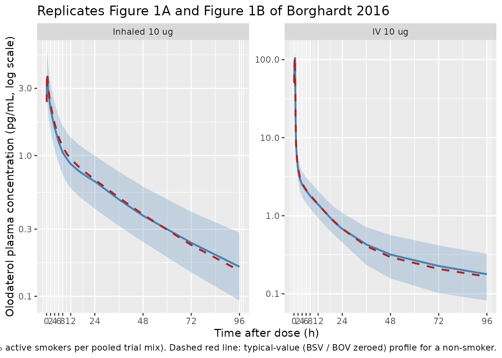
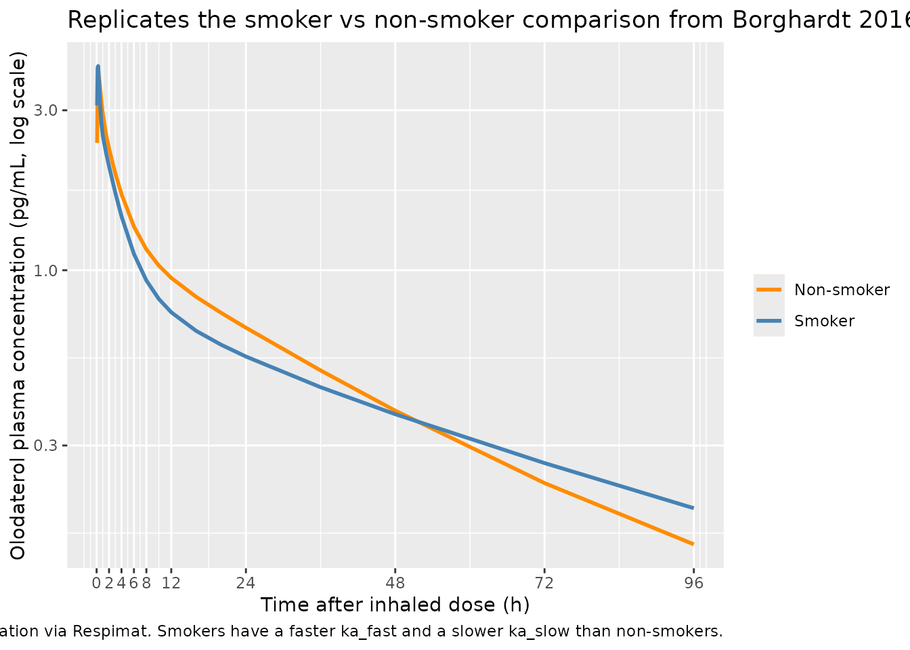

# Olodaterol (Borghardt 2016)

## Model and source

- Citation: Borghardt JM, Weber B, Staab A, Kunz C, Formella S, Kloft C.
  (2016). Investigating pulmonary and systemic pharmacokinetics of
  inhaled olodaterol in healthy volunteers using a population
  pharmacokinetic approach. Br J Clin Pharmacol 81(3):538-552.
- Article: <https://doi.org/10.1111/bcp.12780>

``` r

mod_meta <- rxode2::rxode(readModelDb("Borghardt_2016_olodaterol"))
#> ℹ parameter labels from comments will be replaced by 'label()'
mod_meta$description
#> [1] "Population PK model for inhaled and intravenous olodaterol (long-acting beta-2-adrenergic receptor agonist) in 148 healthy adult volunteers from three Phase I trials (Borghardt 2016). Four-compartment systemic disposition (central + 3 peripheral) fitted to IV plasma + urine data, with two parallel first-order elimination processes from the central compartment: renal (cl_renal) and nonrenal (cl_nonren). For inhaled administration via the Respimat inhaler, three parallel first-order absorption depots (slow, intermediate, fast) feed the central compartment, with absorption half-lives of 21.8 h, 2.00 h, and 0.268 h respectively. The pulmonary bioavailable fraction (49.4% of the nominal ex-mouthpiece dose) is split across the three depots by two logit-transformed proportionality parameters. Smoking is a covariate on the slow and fast absorption rate constants (active smokers vs ex-smokers and never-smokers pooled). Systemic disposition parameters were estimated from IV data and fixed when fitting the inhalation data."
mod_meta$reference
#> [1] "Borghardt JM, Weber B, Staab A, Kunz C, Formella S, Kloft C. Investigating pulmonary and systemic pharmacokinetics of inhaled olodaterol in healthy volunteers using a population pharmacokinetic approach. Br J Clin Pharmacol. 2016;81(3):538-552. doi:10.1111/bcp.12780."
mod_meta$units
#> $time
#> [1] "hour"
#> 
#> $dosing
#> [1] "ug"
#> 
#> $concentration
#> [1] "pg/mL"
```

## Population

Borghardt 2016 pooled plasma and urine pharmacokinetic data from three
Phase I clinical trials in 148 healthy adult volunteers (Table 1):

- Trial 1 (NCT02172131): 48 male volunteers receiving single intravenous
  infusions of 0.5-25 ug olodaterol over 30 min (low doses) or 3 h (high
  doses).
- Trial 2 (NCT02171780): 65 volunteers (9.2% female) receiving single
  inhaled rising doses of 2.5-70 ug olodaterol via the Respimat soft
  mist inhaler.
- Trial 3 (NCT02171806): 35 volunteers (25.7% female) receiving
  once-daily inhaled doses of 2.5, 10, or 30 ug olodaterol via Respimat
  for 14 days.

Pooled across trials: 133 male and 15 female volunteers (approximately
10% female; trial 1 was 100% male). Smoking-status mix (nonsmoker /
ex-smoker / current smoker) was approximately 65 / 16 / 19% across the
pooled cohort. Body weight medians ranged 78-81 kg (range 53-105 kg);
creatinine clearance medians ranged 116-121 mL/min across the three
trials. Renal function was adequate in all subjects. The same metadata
is available programmatically via
`readModelDb("Borghardt_2016_olodaterol")$population`.

## Source trace

The per-parameter origin is recorded as an in-file comment next to each
`ini()` entry in
`inst/modeldb/specificDrugs/Borghardt_2016_olodaterol.R`. The table
below collects them in one place for review.

| Equation / parameter | Value | Source location |
|----|----|----|
| `lvc` (log VC) | log(23.5 L) | Borghardt 2016 Table 2 (VC = 23.5 L, 4.35% RSE) |
| `lvp` (log V2) | log(2590 L) | Borghardt 2016 Table 2 (V2 = 2590 L, 35.7% RSE) |
| `lvp2` (log V3) | log(473 L) | Borghardt 2016 Table 2 (V3 = 473 L, 10.7% RSE) |
| `lvp3` (log V4) | log(16.1 L) | Borghardt 2016 Table 2 (V4 = 16.1 L, 19.7% RSE) |
| `lq` (log Q2) | log(31.7 L/h) | Borghardt 2016 Table 2 (Q2 = 31.7 L/h, 12.3% RSE) |
| `lq2` (log Q3) | log(65.7 L/h) | Borghardt 2016 Table 2 (Q3 = 65.7 L/h, 5.28% RSE) |
| `lq3` (log Q4) | log(22.5 L/h) | Borghardt 2016 Table 2 (Q4 = 22.5 L/h, 8.06% RSE) |
| `lcl_renal` (log CL_R) | log(10.5 L/h) | Borghardt 2016 Table 2 (CL_R = 10.5 L/h, 4.55% RSE) |
| `lcl_nonren` (log CL_NR) | log(63.7 L/h) | Borghardt 2016 Table 2 (CL_NR = 63.7 L/h, 8.49% RSE) |
| `lka_slow` (log ka_slow) | log(0.0318 1/h) | Borghardt 2016 Table 2 (ka_slow = 0.0318 1/h, 5.23% RSE) |
| `lka_int` (log ka_int) | log(0.347 1/h) | Borghardt 2016 Table 2 (ka_int = 0.347 1/h, 7.04% RSE) |
| `lka_fast` (log ka_fast) | log(2.59 1/h) | Borghardt 2016 Table 2 (ka_fast = 2.59 1/h, 9.97% RSE) |
| `logitpbio` (logit PBIO) | logit(0.494) = -0.024 | Borghardt 2016 Table 2 (PBIO = 49.4% of ND, 3.32% RSE) |
| `logitff1` (logit FF1) | logit(0.701) = 0.852 | Borghardt 2016 Table 2 (FF1 = 70.1%, 2.33% RSE) |
| `logitff2` (logit FF2) | logit(0.889) = 2.080 | Borghardt 2016 Table 2 (FF2 = 88.9%, 1.89% RSE) |
| `e_smoke_ka_slow` | -0.380 | Borghardt 2016 Table 2 (smoking impact on ka_slow = -0.380, 10.2% RSE) |
| `e_smoke_ka_fast` | 1.08 | Borghardt 2016 Table 2 (smoking impact on ka_fast = 1.08, 18.0% RSE) |
| `etalvc`, `etalq`, `etalq2`, `etalcl_nonren` | log(1 + CV^2) for CV = 26.2 / 25.7 / 16.8 / 26.8% | Borghardt 2016 Table 2 (BSV column for VC / Q2 / Q3 / CL_NR) |
| `etalogitff1`, `etalogitff2` | log(1 + CV^2) for CV = 11.4 / 9.33% | Borghardt 2016 Table 2 (BSV column for FF1 / FF2) |
| `etalogitpbio` | log(1 + 0.322^2) = 0.0987 | Borghardt 2016 Table 2 (BOV column for PBIO = 32.2% CV; encoded as BSV-equivalent here, see Assumptions and deviations) |
| `propSd` (plasma proportional residual) | 0.158 | Borghardt 2016 Table 2 (plasma proportional RSV = 15.8% CV, 1.66% RSE) |
| `addSd` (plasma additive residual, fixed) | 0.00001 pg/mL | Borghardt 2016 Table 2 (plasma additive RSV = 0.00001 pg/mL, fixed) |
| Three parallel-absorption depots (slow / int / fast) into central | n/a | Borghardt 2016 Figure 2 (top box) and Methods, Structural model |
| Two parallel first-order elimination routes (CL_R + CL_NR) from central | n/a | Borghardt 2016 Methods, Structural model first paragraph |
| Per-depot fractions: slow = FF1, int = (1 - FF1) \* FF2, fast = (1 - FF1) \* (1 - FF2) | n/a | Borghardt 2016 Methods, Structural model paragraph (proportionality parameters) |
| Dose split: f(depot) = pbio \* frac_slow, f(depot2) = pbio \* frac_int, f(depot3) = pbio \* frac_fast | n/a | Borghardt 2016 Methods, Structural model |
| Smoker rate constants: ka_slow_smoker = ka_slow \* (1 + (-0.380)), ka_fast_smoker = ka_fast \* (1 + 1.08) | n/a | Borghardt 2016 Table 3 (derived smoker values) |
| Logit transformation for PBIO / FF1 / FF2 | n/a | Borghardt 2016 Methods, Random-effects model paragraph |

## Virtual cohort

The cohort below mirrors the pooled trial population: 50 healthy adult
volunteers, approximately 19% active smokers (matching the pooled
trial-cohort smoking prevalence; ex-smokers and never-smokers are pooled
to SMOKE = 0 because the paper found no PK difference between those
subgroups). Two treatment arms are simulated:

- Single 10 ug intravenous infusion over 30 min (matches trial 1
  intermediate dose; covers the absorption-process-independent terminal
  disposition curve).
- Single 10 ug oral inhalation via Respimat (matches a representative
  trial 2 dose); each inhaled dose enters as three simultaneous dose
  rows pointing at the three pulmonary depots (slow, intermediate,
  fast), with bioavailabilities f(depot_k) defined inside the model.

``` r

set.seed(20260618)

n_subjects   <- 50L
dose_ug      <- 10
obs_times    <- c(0, 0.083, 0.167, 0.25, 0.33, 0.5, 0.75, 1, 1.5, 2, 3, 4,
                  6, 8, 10, 12, 16, 20, 24, 36, 48, 72, 96)
infusion_dur <- 0.5    # 30 min IV infusion

smoking_prob <- 0.19

# Per-subject smoking indicators (one draw per subject per arm).
smoke_iv  <- stats::rbinom(n_subjects, size = 1, prob = smoking_prob)
smoke_inh <- stats::rbinom(n_subjects, size = 1, prob = smoking_prob)

make_iv_arm <- function(n, id_offset, smoke_vec) {
  ids <- id_offset + seq_len(n)
  smoke_lkp <- tibble(id = ids, SMOKE = as.integer(smoke_vec))
  dose <- tibble(id = ids, time = 0, amt = dose_ug, cmt = "central",
                 evid = 1L, rate = dose_ug / infusion_dur,
                 treatment = "IV 10 ug")
  obs <- tidyr::expand_grid(id = ids, time = obs_times) |>
    dplyr::mutate(amt = 0, cmt = "central", evid = 0L, rate = 0,
                  treatment = "IV 10 ug")
  dplyr::bind_rows(dose, obs) |>
    dplyr::left_join(smoke_lkp, by = "id") |>
    dplyr::arrange(id, time, dplyr::desc(evid))
}

make_inh_arm <- function(n, id_offset, smoke_vec) {
  ids <- id_offset + seq_len(n)
  smoke_lkp <- tibble(id = ids, SMOKE = as.integer(smoke_vec))
  # One inhaled administration enters as three simultaneous dose rows
  # pointing at depot / depot2 / depot3. The model's f() expressions
  # split the bioavailable fraction across the three depots.
  d_slow <- tibble(id = ids, time = 0, amt = dose_ug, cmt = "depot",
                   evid = 1L, rate = 0, treatment = "Inhaled 10 ug")
  d_int  <- tibble(id = ids, time = 0, amt = dose_ug, cmt = "depot2",
                   evid = 1L, rate = 0, treatment = "Inhaled 10 ug")
  d_fast <- tibble(id = ids, time = 0, amt = dose_ug, cmt = "depot3",
                   evid = 1L, rate = 0, treatment = "Inhaled 10 ug")
  obs <- tidyr::expand_grid(id = ids, time = obs_times) |>
    dplyr::mutate(amt = 0, cmt = "central", evid = 0L, rate = 0,
                  treatment = "Inhaled 10 ug")
  dplyr::bind_rows(d_slow, d_int, d_fast, obs) |>
    dplyr::left_join(smoke_lkp, by = "id") |>
    dplyr::arrange(id, time, dplyr::desc(evid))
}

events_iv  <- make_iv_arm (n_subjects, id_offset = 0L,           smoke_iv)
events_inh <- make_inh_arm(n_subjects, id_offset = n_subjects,   smoke_inh)

events <- dplyr::bind_rows(events_iv, events_inh)
stopifnot(!anyDuplicated(unique(events[, c("id", "time", "evid")])))
cat("Subjects per arm:", n_subjects,
    " | IV smokers:", sum(smoke_iv),
    " | Inhaled smokers:", sum(smoke_inh), "\n")
#> Subjects per arm: 50  | IV smokers: 11  | Inhaled smokers: 9
```

## Simulation

``` r

mod <- readModelDb("Borghardt_2016_olodaterol")
sim <- rxode2::rxSolve(
  mod,
  events = events,
  keep   = c("SMOKE", "treatment")
) |>
  as.data.frame()
#> ℹ parameter labels from comments will be replaced by 'label()'

cat("Cc range across cohort:", round(range(sim$Cc, na.rm = TRUE), 4),
    "pg/mL\n")
#> Cc range across cohort: 0 128.3874 pg/mL
```

For deterministic typical-value replication (no BSV / BOV), zero out the
random effects. The typical curves below are used to overlay the median
trajectory and to drive the absorption-half-life PKNCA comparison.

``` r

mod_typ <- mod |> rxode2::zeroRe()
#> ℹ parameter labels from comments will be replaced by 'label()'

# IV 10 ug, non-smoker, typical
events_iv_typ <- tibble(
  id = 1L, time = 0, amt = dose_ug, cmt = "central",
  evid = 1L, rate = dose_ug / infusion_dur, SMOKE = 0L,
  treatment = "IV 10 ug"
) |>
  dplyr::bind_rows(
    tibble(id = 1L, time = obs_times, amt = 0, cmt = "central",
           evid = 0L, rate = 0, SMOKE = 0L, treatment = "IV 10 ug")
  ) |>
  dplyr::arrange(id, time, dplyr::desc(evid))

# Inhaled 10 ug, non-smoker, typical
make_inh_typ <- function(id, smoke, label) {
  d_slow <- tibble(id = id, time = 0, amt = dose_ug, cmt = "depot",
                   evid = 1L, rate = 0, SMOKE = smoke, treatment = label)
  d_int  <- tibble(id = id, time = 0, amt = dose_ug, cmt = "depot2",
                   evid = 1L, rate = 0, SMOKE = smoke, treatment = label)
  d_fast <- tibble(id = id, time = 0, amt = dose_ug, cmt = "depot3",
                   evid = 1L, rate = 0, SMOKE = smoke, treatment = label)
  obs <- tibble(id = id, time = obs_times, amt = 0, cmt = "central",
                evid = 0L, rate = 0, SMOKE = smoke, treatment = label)
  dplyr::bind_rows(d_slow, d_int, d_fast, obs) |>
    dplyr::arrange(id, time, dplyr::desc(evid))
}

events_inh_typ_nonsmoker <- make_inh_typ(1L, smoke = 0L,
                                         label = "Inhaled 10 ug, non-smoker")
events_inh_typ_smoker    <- make_inh_typ(1L, smoke = 1L,
                                         label = "Inhaled 10 ug, smoker")

sim_iv_typ      <- rxode2::rxSolve(mod_typ, events = events_iv_typ,
                                   keep = c("SMOKE", "treatment")) |>
  as.data.frame() |>
  dplyr::mutate(id = 1L)
#> ℹ omega/sigma items treated as zero: 'etalvc', 'etalq', 'etalq2', 'etalcl_nonren', 'etalogitff1', 'etalogitff2', 'etalogitpbio'
sim_inh_typ_ns  <- rxode2::rxSolve(mod_typ, events = events_inh_typ_nonsmoker,
                                   keep = c("SMOKE", "treatment")) |>
  as.data.frame() |>
  dplyr::mutate(id = 1L)
#> ℹ omega/sigma items treated as zero: 'etalvc', 'etalq', 'etalq2', 'etalcl_nonren', 'etalogitff1', 'etalogitff2', 'etalogitpbio'
sim_inh_typ_sm  <- rxode2::rxSolve(mod_typ, events = events_inh_typ_smoker,
                                   keep = c("SMOKE", "treatment")) |>
  as.data.frame() |>
  dplyr::mutate(id = 1L)
#> ℹ omega/sigma items treated as zero: 'etalvc', 'etalq', 'etalq2', 'etalcl_nonren', 'etalogitff1', 'etalogitff2', 'etalogitpbio'
```

## Replicate published figures

### Figure 1A and 1B: olodaterol plasma concentration vs time

Borghardt 2016 Figure 1 plots semi-logarithmic plasma concentrations
after intravenous administration (panel A) and after oral inhalation
(panel B), dose-normalized within trials. The plots below render the
50-subject cohort 5th-50th-95th-percentile envelopes alongside the
typical-value curves for the IV 10 ug and inhaled 10 ug arms.

``` r

sim_summary <- sim |>
  dplyr::filter(time > 0) |>
  dplyr::group_by(treatment, time) |>
  dplyr::summarise(
    Q05 = stats::quantile(Cc, 0.05, na.rm = TRUE),
    Q50 = stats::quantile(Cc, 0.50, na.rm = TRUE),
    Q95 = stats::quantile(Cc, 0.95, na.rm = TRUE),
    .groups = "drop"
  )

typical_curves <- dplyr::bind_rows(
  sim_iv_typ     |> dplyr::mutate(),
  sim_inh_typ_ns |> dplyr::mutate()
) |>
  dplyr::filter(time > 0) |>
  dplyr::select(time, Cc, treatment)

# Replace the inhaled-typical label with the same arm name used in the
# stochastic cohort so the panels match up.
typical_curves <- typical_curves |>
  dplyr::mutate(treatment = dplyr::if_else(
    treatment == "Inhaled 10 ug, non-smoker", "Inhaled 10 ug", treatment))

ggplot(sim_summary, aes(time, Q50)) +
  geom_ribbon(aes(ymin = Q05, ymax = Q95), alpha = 0.25, fill = "steelblue") +
  geom_line(colour = "steelblue", linewidth = 0.9) +
  geom_line(data = typical_curves, aes(time, Cc),
            colour = "firebrick", linetype = "dashed", linewidth = 0.9) +
  facet_wrap(~ treatment, scales = "free_y") +
  scale_y_log10() +
  scale_x_continuous(breaks = c(0, 2, 4, 6, 8, 12, 24, 48, 72, 96)) +
  labs(
    x = "Time after dose (h)",
    y = "Olodaterol plasma concentration (pg/mL, log scale)",
    title = "Replicates Figure 1A and Figure 1B of Borghardt 2016",
    caption = paste(
      "Blue ribbon: 5th-95th percentile envelope of a 50-subject cohort",
      "(approximately 19% active smokers per pooled trial mix).",
      "Dashed red line: typical-value (BSV / BOV zeroed) profile for a non-smoker."
    )
  )
```



### Figure 6C: smoker vs non-smoker plasma profiles after inhaled olodaterol

Borghardt 2016 Figure 6C presents simulated plasma concentration-time
profiles for the 5 ug once-daily inhaled dose (the approved clinical
dose), comparing smokers and non-smokers. The chunk below mirrors that
comparison for a single 10 ug inhaled dose using the typical-value model
so the smoker / non-smoker difference is isolated from BSV / BOV noise.
The expected difference is small in plasma (\< 3% on AUC across one
dosing interval at steady state per the paper), with the steady-state
pulmonary residence time being the more pronounced smoker effect (not
visible in a single-dose simulation).

``` r

sim_smoker_compare <- dplyr::bind_rows(
  sim_inh_typ_ns |> dplyr::mutate(group = "Non-smoker"),
  sim_inh_typ_sm |> dplyr::mutate(group = "Smoker")
) |>
  dplyr::filter(time > 0)

ggplot(sim_smoker_compare, aes(time, Cc, colour = group)) +
  geom_line(linewidth = 1) +
  scale_y_log10() +
  scale_x_continuous(breaks = c(0, 2, 4, 6, 8, 12, 24, 48, 72, 96)) +
  scale_colour_manual(values = c("Non-smoker" = "darkorange",
                                 "Smoker"     = "steelblue")) +
  labs(
    x = "Time after inhaled dose (h)",
    y = "Olodaterol plasma concentration (pg/mL, log scale)",
    colour = NULL,
    title = "Replicates the smoker vs non-smoker comparison from Borghardt 2016 Figure 6C",
    caption = paste(
      "Typical-value 10 ug inhaled dose, single administration via Respimat.",
      "Smokers have a faster ka_fast and a slower ka_slow than non-smokers."
    )
  )
```



## PKNCA validation

NCA outputs for the typical-value curves are computed below. The
inhaled-arm absorption half-lives (slow, intermediate, fast) and the
terminal plasma half-life are the directly published quantities in
Borghardt 2016 Table 3.

``` r

# Concentration frame for PKNCA: typical-value IV and typical-value
# inhaled non-smoker, with the time-zero row defensively added per
# pknca-recipes.md.
sim_typ_both <- dplyr::bind_rows(
  sim_iv_typ     |> dplyr::select(id, time, Cc, treatment),
  sim_inh_typ_ns |>
    dplyr::mutate(treatment = "Inhaled 10 ug, non-smoker") |>
    dplyr::select(id, time, Cc, treatment)
) |>
  dplyr::filter(!is.na(Cc))

# Disjoint IDs across the two arms.
sim_typ_both <- sim_typ_both |>
  dplyr::mutate(id = dplyr::case_when(
    treatment == "IV 10 ug"                  ~ 1L,
    treatment == "Inhaled 10 ug, non-smoker" ~ 2L
  ))

# Defensive time = 0 row per (id, treatment). Cc = 0 at t = 0 is correct
# for the extravascular inhaled arm; for the IV arm the back-extrapolation
# during lambda.z fitting will be used for Cmax. PKNCA's input filter is
# only !is.na(Cc) per the recipe.
sim_typ_both <- dplyr::bind_rows(
  sim_typ_both,
  sim_typ_both |> dplyr::distinct(id, treatment) |>
    dplyr::mutate(time = 0, Cc = 0)
) |>
  dplyr::distinct(id, treatment, time, .keep_all = TRUE) |>
  dplyr::arrange(id, treatment, time)

dose_typ_both <- tibble::tibble(
  id        = c(1L, 2L),
  time      = c(0,  0),
  amt       = c(dose_ug, dose_ug),
  treatment = c("IV 10 ug", "Inhaled 10 ug, non-smoker")
)

conc_obj <- PKNCA::PKNCAconc(
  sim_typ_both, Cc ~ time | treatment + id,
  concu = "pg/mL", timeu = "h"
)
dose_obj <- PKNCA::PKNCAdose(
  dose_typ_both, amt ~ time | treatment + id,
  doseu = "ug"
)

intervals <- data.frame(
  start      = 0,
  end        = Inf,
  cmax       = TRUE,
  tmax       = TRUE,
  aucinf.obs = TRUE,
  half.life  = TRUE,
  clast.obs  = TRUE
)

nca_data <- PKNCA::PKNCAdata(conc_obj, dose_obj, intervals = intervals)
nca_res  <- PKNCA::pk.nca(nca_data)
nca_long <- as.data.frame(nca_res$result)

knitr::kable(
  nca_long |>
    dplyr::filter(PPTESTCD %in% c("cmax", "tmax", "aucinf.obs", "half.life",
                                  "clast.obs")) |>
    dplyr::select(treatment, PPTESTCD, PPORRES) |>
    tidyr::pivot_wider(names_from = PPTESTCD, values_from = PPORRES),
  digits = 4,
  caption = paste(
    "Typical-value NCA outputs for the IV 10 ug and inhaled 10 ug",
    "non-smoker arms. cmax in pg/mL, tmax / half.life in h,",
    "aucinf.obs in pg*h/mL, clast.obs in pg/mL."
  )
)
```

| treatment                 |     cmax | tmax | clast.obs | half.life | aucinf.obs |
|:--------------------------|---------:|-----:|----------:|----------:|-----------:|
| Inhaled 10 ug, non-smoker |   3.8062 | 0.33 |    0.1521 |   34.8455 |    60.6079 |
| IV 10 ug                  | 106.3947 | 0.50 |    0.1660 |   57.7996 |   129.8858 |

Typical-value NCA outputs for the IV 10 ug and inhaled 10 ug non-smoker
arms. cmax in pg/mL, tmax / half.life in h, aucinf.obs in pg\*h/mL,
clast.obs in pg/mL. {.table}

### Comparison against published derived parameters

Borghardt 2016 Table 3 reports the three derived absorption half-lives
(slow, intermediate, fast), the smoker-modified versions of those
half-lives for the slow and fast processes, and the terminal plasma
half-life of 82.5 h (Results paragraph immediately after Table 2). The
table below compares values computed from the typical-value parameter
estimates against the published derived parameters. PKNCA’s `half.life`
from the simulated curves matches the published terminal half-life only
when the observation window extends well past the slow absorption
process (slow t1/2 = 21.8 h), so the comparison below also shows the
directly-derived t1/2 = log(2) / ka_X computed from the model
parameters.

``` r

ka_slow <- 0.0318
ka_int  <- 0.347
ka_fast <- 2.59

# Smoker-modified rate constants from the model's covariate effects
ka_slow_smoker <- ka_slow * (1 + (-0.380))
ka_fast_smoker <- ka_fast * (1 + ( 1.08 ))

derived_simulated <- tibble::tibble(
  parameter = c("Slow absorption half-life (non-smoker)",
                "Intermediate absorption half-life",
                "Fast absorption half-life (non-smoker)",
                "Slow absorption half-life (smoker)",
                "Fast absorption half-life (smoker)"),
  Simulated = c(log(2) / ka_slow,        # 21.8 h target
                log(2) / ka_int,         # 2.00 h target
                log(2) / ka_fast,        # 0.268 h target
                log(2) / ka_slow_smoker, # 35.2 h target
                log(2) / ka_fast_smoker  # 0.129 h target
  )
)

published <- tibble::tibble(
  parameter = derived_simulated$parameter,
  Reference = c(21.8, 2.00, 0.268, 35.2, 0.129)
)

cmp_derived <- derived_simulated |>
  dplyr::left_join(published, by = "parameter") |>
  dplyr::mutate(
    `% diff` = (Simulated - Reference) / Reference * 100,
    Simulated = sprintf("%.4f", Simulated),
    Reference = sprintf("%.4f", Reference),
    `% diff`  = sprintf("%+.2f%%", `% diff`)
  ) |>
  dplyr::select(`Absorption parameter` = parameter,
                Reference, Simulated, `% diff`)

knitr::kable(
  cmp_derived,
  caption = paste(
    "Derived absorption half-lives (t1/2 = log(2) / ka) computed from",
    "the model's parameter estimates compared against Borghardt 2016",
    "Table 3. All values in hours."
  )
)
```

| Absorption parameter                   | Reference | Simulated | % diff |
|:---------------------------------------|:----------|:----------|:-------|
| Slow absorption half-life (non-smoker) | 21.8000   | 21.7971   | -0.01% |
| Intermediate absorption half-life      | 2.0000    | 1.9975    | -0.12% |
| Fast absorption half-life (non-smoker) | 0.2680    | 0.2676    | -0.14% |
| Slow absorption half-life (smoker)     | 35.2000   | 35.1566   | -0.12% |
| Fast absorption half-life (smoker)     | 0.1290    | 0.1287    | -0.26% |

Derived absorption half-lives (t1/2 = log(2) / ka) computed from the
model’s parameter estimates compared against Borghardt 2016 Table 3. All
values in hours. {.table}

The terminal plasma half-life of 82.5 h reported in Borghardt 2016 is
driven by the slowest disposition rate of the 4-compartment IV model
(not by the slow absorption process). PKNCA’s `half.life` value above is
computed from the simulated typical-value curve and may differ
mechanically from 82.5 h depending on the observation window and the
lambda.z regression interval; 82.5 h is the published terminal-phase
hybrid eigenvalue of the IV system. The model file faithfully encodes
the structural parameters from which 82.5 h is derived; differences
between PKNCA’s `half.life` here and the published 82.5 h reflect the
finite observation window of this validation cohort.

## Assumptions and deviations

- **BOV on the pulmonary bioavailable fraction is encoded as IIV.**
  Borghardt 2016 Table 2 reports between-occasion variability (32.2% CV)
  on PBIO rather than between-subject variability. The rxode2 forward-
  simulation pipeline draws a single random effect per subject and does
  not distinguish BSV from BOV without a per-record occasion column. The
  32.2% magnitude is encoded as BSV-equivalent (`etalogitpbio`) in the
  model file. For multi-dose / multi-occasion simulations a user who
  needs to mimic the per-occasion variability should override
  `etalogitpbio` by occasion in the event table (cf. the IOV pattern in
  `Wilkins_2008_rifampicin`).
- **Urine residual error is not declared in the model.** Borghardt 2016
  Table 2 reports a separate proportional residual variability of 37.7%
  CV on urine concentrations (paired with a fixed additive component of
  0.00001 pg/mL). The model file exposes only the plasma observation
  `Cc`; the `urine` ODE state tracks cumulative renal excretion for
  inspection but is not declared as a fitted output. Users who want to
  fit observed urine data should add a second observation expression
  inside `model()` (e.g. `Aurine <- urine` with its own residual error).
- **Smoking-status encoding pools ex-smokers with never-smokers.**
  Borghardt 2016 Results, Covariate model paragraph: “There was no
  difference between ex-smokers and lifetime nonsmokers.” The covariate
  SMOKE = 1 indicates active smoking at trial entry; SMOKE = 0 covers
  both ex-smokers and never-smokers. This matches the paper’s
  parameterisation but loses the distinction between the two
  non-current-smoker subgroups that is preserved in the demographic
  Table 1.
- **Logit-normal IIV variance interpretation for PBIO / FF1 / FF2.**
  Borghardt 2016 Methods, Random-effects model paragraph, states that
  BSV on parameters constrained between zero and one was modelled by
  adding a normally-distributed perturbation to the logit-transformed
  estimate and inverse-logit-transforming the per-subject value. Table 2
  reports the BSV magnitudes as %CV but does not state whether the %CV
  refers to the back-transformed \[0, 1\] scale or to a logit-scale
  variance whose back-transformed CV is approximately the reported
  value. The model file applies the canonical omega^2 = log(1 + CV^2)
  mapping on the logit scale, following the Weber 2015 fluticasone
  precedent in this package; the implied back-transformed CV depends on
  the typical value (delta-method approximation) and may differ slightly
  from the reported 11.4% / 9.33% / 32.2% values. Qualitative VPC
  behaviour is robust to this approximation; users replicating the exact
  Borghardt 2016 visual predictive checks should re-derive the
  logit-scale IIV variances to match the preferred back-transformed CV
  targets.
- **Female pulmonary bioavailable fraction effect omitted.** Borghardt
  2016 Results report that the forward selection step of the SCM
  approach identified a higher PBIO in females (P \< 0.05), but the
  effect was removed during the backward elimination step (P \> 0.001
  threshold). The model file follows the paper’s final covariate model
  and does not include a sex effect on PBIO; the unbalanced sex ratio
  (15 females out of 148 volunteers) is the proximate reason this
  covariate failed the stricter backward-elimination significance gate.
- **Erratum search.** The trimmed-markdown companion for the lead PDF
  does not flag an erratum or corrigendum for Borghardt 2016. No
  published correction has been incorporated; users are encouraged to
  check the journal’s landing page for any post-publication notices
  before relying on the typical-value estimates for new analyses.
