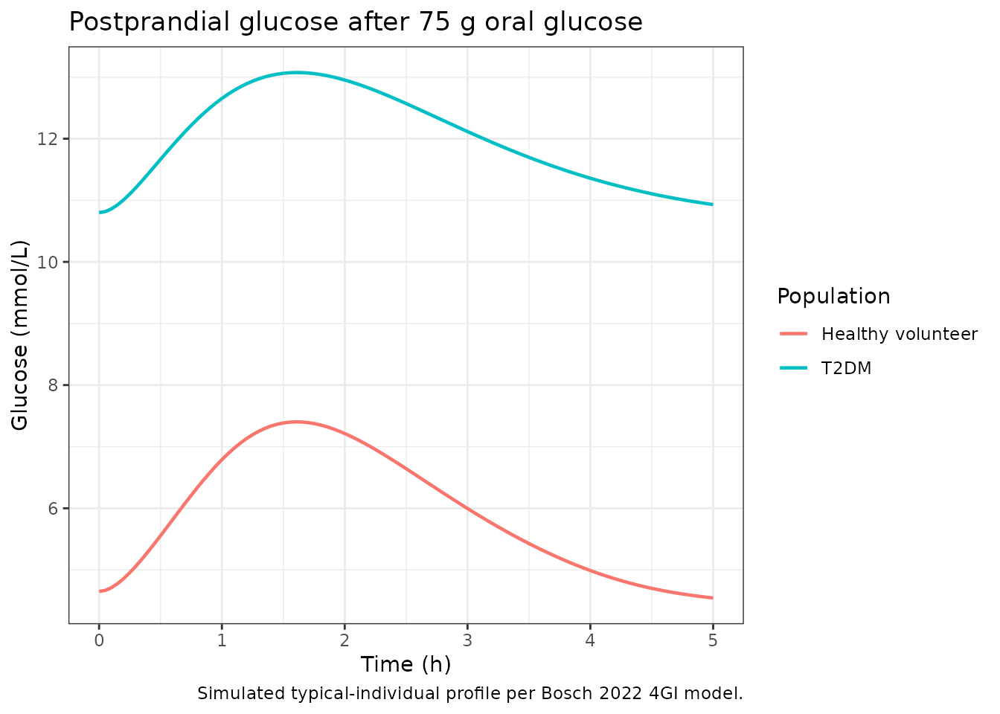
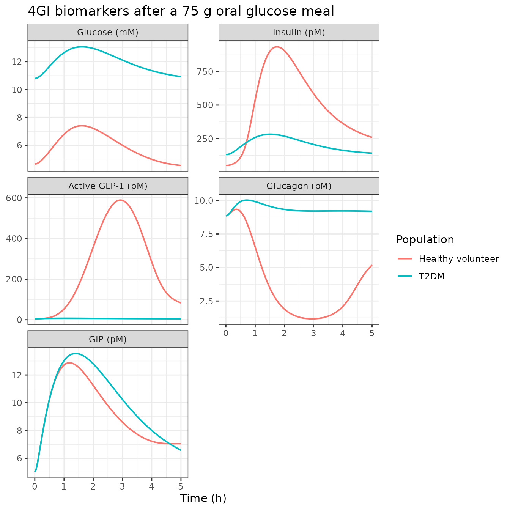
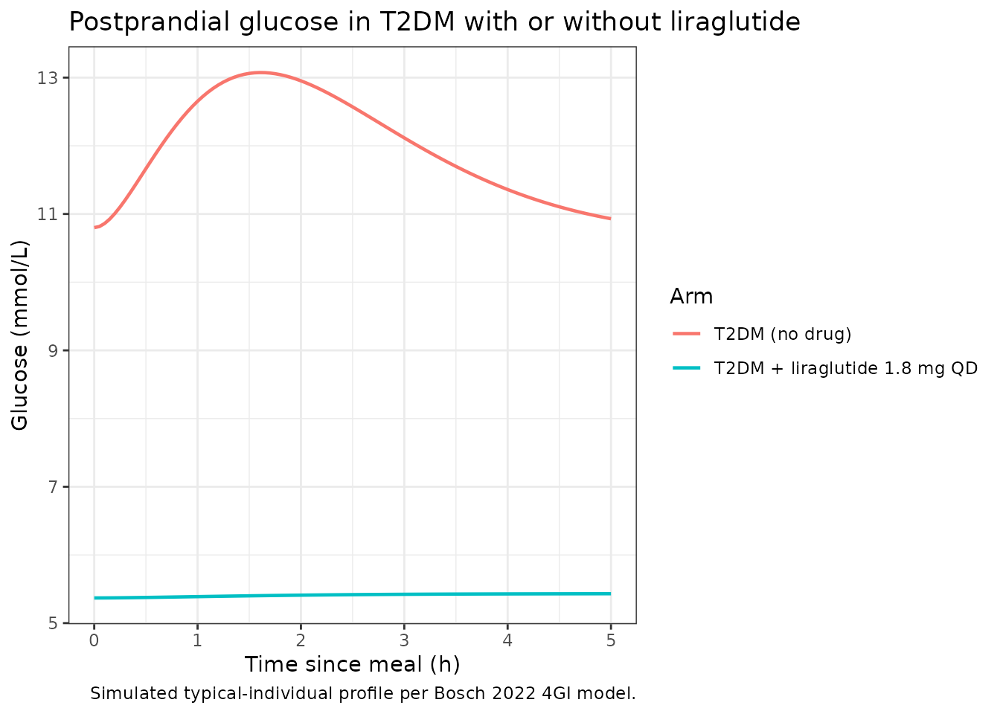

# 4GI glucose regulation with liraglutide (Bosch 2022)

## Model and source

- Citation: Bosch R, Petrone M, Arends R, Vicini P, Sijbrands EJG,
  Hoefman S, Snelder N. A novel integrated QSP model of in vivo human
  glucose regulation to support the development of a glucagon/GLP-1 dual
  agonist. CPT Pharmacometrics Syst Pharmacol. 2022;11(3):302-317.
  <doi:10.1002/psp4.12752>.
- Description: QSP. Integrated four-hormone-plus-glucose (4GI) model of
  human glucose regulation coupling glucose, insulin, GLP-1, glucagon,
  and glucose-dependent insulinotropic peptide (GIP) dynamics after meal
  and drug perturbation, with liraglutide (GLP-1RA) PK+PD baked in as
  the training drug. Glucose disposition is a two-compartment model with
  insulin-dependent and -independent elimination fed by an oral-meal
  dose compartment plus a buffer and three serial gut transit
  compartments; insulin, GLP-1, glucagon, and GIP each have
  one-compartment (GIP two-compartment) turnover with steady-state
  baseline production. Feedbacks: glucose stimulates insulin production
  (amplified by GLP-1 and GIP); insulin drives insulin-dependent glucose
  clearance through an effect compartment; glucose inhibits glucagon
  production (a below-baseline glucose-on-glucagon effect is estimable
  in healthy volunteers only); glucagon and GIP each stimulate glucagon
  and glucose production; GLP-1 inhibits gastric emptying and glucagon
  production, and stimulates insulin secretion. Liraglutide PK is the
  Watson 2010 body-weight-scaled one-compartment model (KAdrug 0.154 /h,
  CL/F 0.013 L/h/kg, V/F 0.16 L/kg, fu 0.005) and drives the three GLP-1
  receptor pathways via unbound-liraglutide EC50s derived from the in
  vitro EC50 ratio between endogenous GLP-1 (1.919 pM) and liraglutide
  (6 pM). Population-mean fits only (no IIV per Bosch 2022 Methods; five
  proportional residual errors, one per biomarker output). Healthy
  volunteer (HV) vs type 2 diabetes mellitus (T2DM) subjects differ in
  glucose clearance, insulin-dependent glucose clearance, the
  below-baseline glucose-on-glucagon exponent, and the
  GIP-on-insulin-secretion exponent, switched by the DIS_DIAB indicator
  (1 = T2DM, 0 = HV). 18 ODE states; 5 outputs.
- Article (open access): <https://doi.org/10.1002/psp4.12752>
- Supplementary NONMEM code: <https://doi.org/10.1002/psp4.12752>
  (Appendix S1)

The 4GI model integrates five signalling species (glucose, insulin,
GLP-1, glucagon, GIP) coupled by mass-action ODEs and Emax/Hill
drug-effect saturation. It is a mechanistic decision-support tool
developed by Bosch et al. (2022) at LAP&P Consultants / AstraZeneca for
the development of the GLP-1/glucagon dual agonist cotadutide; the paper
trains it on liraglutide plus a large mix of nonpharmacological
perturbations and externally validates the model against dulaglutide and
semaglutide arms.

## Population

The model was calibrated to a pooled mean-per-study dataset digitized
from twelve published clinical studies covering healthy volunteers,
healthy obese subjects, and adults with type 2 diabetes mellitus (T2DM),
spanning IV glucose provocations, oral meals, IV GLP-1 / GIP / glucagon
infusions, and up to 52 weeks of once-daily subcutaneous liraglutide
(LEAD-3 / LEAD-6 / AWARD-6). Because Bosch et al. digitized published
mean profiles rather than individual-level data, no between-subject
variability (BSV) or between-occasion variability (BOV) is estimated and
every simulation from this model is a typical-value prediction.

The full study list is in the model’s `population$disease_state`
metadata:

``` r

mod_meta <- readModelDb("Bosch_2022_liraglutide_qsp")()
mod_meta$population$disease_state |> strwrap(width = 70) |> writeLines()
#> Pooled healthy volunteers, healthy obese volunteers, and adults with
#> type 2 diabetes mellitus from 12 published clinical studies used as
#> development data (10 studies: Silber 2007 IVGTT +/- insulin in HV and
#> T2DM; Jauslin 2011 24-h meal profiles in T2DM; Landersdorfer 2011
#> 24-h meal profiles in T2DM; Tan 2012 IV GLP-1 +/- glucagon in healthy
#> obese; Edholm 2010 meal + IV GLP-1 or GIP in HV; Vilsboll 2006 IV GIP
#> in HV and T2DM; Vilsboll 2002 IV glucose + GLP-1 or GIP in HV and
#> obese T2DM; Larsen 2001 meal + IV GLP-1 in T2DM; Schneck 2013 meal in
#> T2DM; Camastra 2013 meal in morbidly-obese T2DM and non-diabetic
#> controls) and 3 long-term liraglutide studies (LEAD-3 52 weeks,
#> LEAD-6 40 weeks, AWARD-6 26 weeks); validation is against the
#> dulaglutide arms of AWARD-6 and the dulaglutide + semaglutide arms of
#> SUSTAIN-7 (also 40 weeks).
```

Two covariates are consumed by the model in a downstream simulation:

- `DIS_DIAB` (binary, 1 = T2DM, 0 = healthy volunteer). Switches the
  fixed glucose disposition parameters and disables the HV-only
  below-baseline glucose-on-glucagon and GIP-on-insulin-secretion
  effects.
- `WT` (kg). Scales the Watson 2010 body-weight-normalized liraglutide
  PK (CL/F = 0.013 L/h/kg; V/F = 0.16 L/kg). Only used when liraglutide
  is co-dosed; endogenous-only simulations can pass any positive value.

## Source trace

Every `ini()` parameter is annotated in
`inst/modeldb/specificDrugs/Bosch_2022_liraglutide_qsp.R` with the
source Table / equation. The table below is the collected view.

| Equation / parameter | Value | Source |
|----|----|----|
| Glucose disposition CLglc T2DM = 1.72 L/h, HV = 5.36 L/h | fixed | Bosch 2022 Table 3 (fixed to Silber 2007 / Jauslin 2011) |
| Insulin-dep. glucose clearance CLglci T2DM = 0.0256, HV = 0.072 | fixed | Bosch 2022 Table 3 |
| Glucose Qglc, VCglc, VPglc | 26.5 L/h, 9.33 L, 8.56 L | Bosch 2022 Table 3 (fixed) |
| Glucose absorption KAglc, Keglc, Kelglc | 0.853, 0.281, 1.93 /h | Bosch 2022 Table 3 (estimated) |
| Insulin CLins, VCins | 73.2 L/h, 6.09 L (fixed) | Bosch 2022 Table 3 |
| Insulin effect-comp Ke0ins | 0.85 /h | Bosch 2022 Table 3 |
| GLP-1 VCglp, VMGLP, KMGLP | 16 L, 2893 pmol/L\*h, 136 pmol/L | Bosch 2022 Table 3 |
| Glucagon CLglg, VCglg | 453 L/h, 64.6 L | Bosch 2022 Table 3 |
| GIP CLgip, VCgip, Qgip, VPgip | 86.8, 9.21, 49.4, 22.8 (fixed) | Bosch 2022 Table 3 |
| Food effect FDGLP, FDGLP_2, FDGIP, FDGLG | 0.0102, 3.88, 0.0343, 0.00329 | Bosch 2022 Table 4 |
| Glucose stim of insulin GLCINS_S | 2.46 | Bosch 2022 Table 4 |
| Glucose-on-glucagon POW_2H, POW_2L (HV) | 0.925, 0.327; T2DM 0 | Bosch 2022 Table 4 |
| GLP-1 insulin EMAX_1, EC50_1, HILL_1 | 10.7, 26.6 pM, 1.79 | Bosch 2022 Table 4 |
| GLP-1 absorption EMAX_2, EC50_2, HILL_2 | 1 (fix), 144 pM, 1 (fix) | Bosch 2022 Table 4 |
| GLP-1 glucagon EMAX_3, EC50_3, HILL_3 | 1 (fix), 99.5 pM, 1 (fix) | Bosch 2022 Table 4 |
| Glucagon glucose EMAX_4, EC50_4, HILL_4 | 6.73, 98.5 pM (fixed Wendt), 1 (fix) | Bosch 2022 Table 4 |
| GIP effects POW_3, POW_4 | 0.286 (HV), 0.109 | Bosch 2022 Table 4 |
| Liraglutide PK KA, CL/BW, V/BW | 0.154 /h, 0.013 L/h/kg, 0.16 L/kg | Watson 2010 (via Bosch 2022 supplement Appendix S1) |
| Liraglutide fu | 0.005 | Bosch 2022 Table 2 (Flint 2013) / supplement |
| In vitro EC50 endo GLP-1, liraglutide | 1.919 pM, 6 pM | Bosch 2022 Table 2 (in-house) |
| Baselines BSLglc, BSLins, BSLglp, BSLglg, BSLgip | 4.65 mM, 49.1 pM, 4.61 pM, 8.85 pM, 5 pM | Table S1 (HV Jauslin) + physiologic HV GIP |
| Proportional res. err. Cglc, Cins, Cglp, Cglg, Cgip | 0.0211, 0.305, 0.0602, 0.0348, 0.109 | Bosch 2022 Table 3 |
| Eq. 1-2 (KAglc2 = KAglc \* (1 - GLPGLU_AI)) | n/a | Bosch 2022 Eqs. 1-2 |
| Eq. 3 (glucose central mass balance) | n/a | Bosch 2022 Eq. 3 |
| Eq. 5-7 (glucagon-on-glucose Hill Emax) | n/a | Bosch 2022 Eqs. 5-7 |
| Eq. 8-12 (insulin production + incretin amplification) | n/a | Bosch 2022 Eqs. 8-12 |
| Eq. 13-16 (GLP-1 disposition + food effect) | n/a | Bosch 2022 Eqs. 13-16 |
| Eq. 17-24 (glucagon disposition + food + GLP-1 + GIP + glcEFFglg) | n/a | Bosch 2022 Eqs. 17-24 |
| Eq. 25-27 (GIP disposition + food effect) | n/a | Bosch 2022 Eqs. 25-27 |
| Eq. 28-30 (drug + endogenous Emax combination + EC50 scaling) | n/a | Bosch 2022 Eqs. 28-30 |

## Dimensional analysis

All ODE states carry mass amounts (mmol for glucose, pmol for hormones
and liraglutide), with concentrations recovered algebraically as amount
/ volume. Time is in hours throughout. The three drug-effect Hill terms
are dimensionless because `Cdrugf` and each `ECGLP_lira` derive by
scaling the endogenous in-vivo EC50 with the ratio of the drug’s
in-vitro EC50 to the endogenous in-vitro EC50 – both in pM – so the
drug-vs-endogenous comparison is in matched pM.

| Term | Units |
|----|----|
| `glc_central` amount | mmol |
| `Cglc = glc_central / VCglc` | mmol/L |
| `kinglc = BSLglc * (CLglc + CLglci * BSLins)` | mmol/L \* (L/h) = mmol/h |
| `(CLglci * ins_effect / VCglc) * glc_central` | ((L/h)/pM) \* pM / L \* mmol = mmol/h |
| `ins_central` amount | pmol |
| `Cins = ins_central / VCins` | pmol/L (pM) |
| `KINins * (1 + STglc * Cglc^GLCINS_S)` | pmol/h \* dimensionless = pmol/h |
| `lira_central` amount | pmol |
| `Cdrug = lira_central / VCdrug` | pmol/L (pM) |
| `Cdrugf = fu * Cdrug` | pM (same as EC50s) |

## Steady-state check

With no meal or drug and the endogenous initial conditions preset from
the baselines, all five biomarker concentrations should hold at their
baselines. This confirms the derivation of the baseline production
fluxes (`KINglc`, `KINins`, `KINglp`, `KINglg`, `KINgip`) matches the
paper’s equations 4, 9, 14, 18, 26.

``` r

mod <- readModelDb("Bosch_2022_liraglutide_qsp")

ev_ss <- data.frame(
  id       = 1L,
  time     = seq(0, 48, by = 1),
  evid     = 0L,
  amt      = 0,
  cmt      = "Cglc",
  DIS_DIAB = 0L,
  WT       = 70
)

sim_ss <- rxode2::rxSolve(mod, ev_ss, keep = c("DIS_DIAB", "WT")) |>
  as.data.frame()

ss_tbl <- sim_ss |>
  dplyr::select(time, Cglc, Cins, Cglp, Cglg, Cgip) |>
  dplyr::filter(time %in% c(0, 24, 48)) |>
  dplyr::rename(
    "Time (h)"       = time,
    "Glucose (mM)"   = Cglc,
    "Insulin (pM)"   = Cins,
    "GLP-1 (pM)"     = Cglp,
    "Glucagon (pM)" = Cglg,
    "GIP (pM)"       = Cgip
  )
knitr::kable(ss_tbl, digits = 3,
             caption = "Baseline hold in a healthy volunteer with no meal or drug.")
```

| Time (h) | Glucose (mM) | Insulin (pM) | GLP-1 (pM) | Glucagon (pM) | GIP (pM) |
|---------:|-------------:|-------------:|-----------:|--------------:|---------:|
|        0 |         4.65 |         49.1 |       4.61 |          8.85 |        5 |
|       24 |         4.65 |         49.1 |       4.61 |          8.85 |        5 |
|       48 |         4.65 |         49.1 |       4.61 |          8.85 |        5 |

Baseline hold in a healthy volunteer with no meal or drug. {.table}

``` r


stopifnot(
  abs(range(sim_ss$Cglc)[2] - range(sim_ss$Cglc)[1]) < 1e-4,
  abs(range(sim_ss$Cins)[2] - range(sim_ss$Cins)[1]) < 1e-2,
  abs(range(sim_ss$Cglp)[2] - range(sim_ss$Cglp)[1]) < 1e-3,
  abs(range(sim_ss$Cglg)[2] - range(sim_ss$Cglg)[1]) < 1e-2,
  abs(range(sim_ss$Cgip)[2] - range(sim_ss$Cgip)[1]) < 1e-2
)
```

## Meal challenge: HV vs T2DM

The paper’s central use case is predicting biomarker time-courses after
a mixed meal. Simulate a single 75 g oral glucose challenge (75 g
glucose / 180.16 g/mol = 416 mmol; times the per-meal `Fb`
bioavailability factor `Fb_Jauslin` = 0.446 gives 186 mmol effective
dose) at time 0 in one healthy volunteer and one T2DM subject.

``` r

mmol_glucose <- 75 / 180.16 * 1000  # 75 g / MW * 1000 = mmol
Fb           <- 0.446                # NONMEM $THETA(89) = 0.446 (Fb_Jauslin)
dose_mmol    <- mmol_glucose * Fb    # effective dose entering the dose compartment

ev_meal <- rxode2::et(id = 1:2) |>
  rxode2::et(amt = dose_mmol, cmt = "glc_dose", time = 0) |>
  rxode2::et(seq(0, 5, by = 0.05), cmt = "Cglc") |>
  as.data.frame() |>
  dplyr::mutate(
    DIS_DIAB = ifelse(id == 1, 0L, 1L),
    WT       = 70,
    cohort   = ifelse(id == 1, "Healthy volunteer", "T2DM")
  )

# BSLglc override for the T2DM arm: use the Landersdorfer study T2DM
# baseline 10.8 mM (Table 3 supplement) instead of the packaged HV
# default 4.65 mM. rxode2 accepts baseline overrides via inits =.
sim_meal_hv <- rxode2::rxSolve(
  mod,
  events = ev_meal |> dplyr::filter(id == 1),
  keep   = c("DIS_DIAB", "WT", "cohort")
) |> as.data.frame()

# Rebuild the model with T2DM-appropriate baselines for the T2DM arm.
# The cleanest way is to construct a second event table and pass params.
sim_meal_t2dm <- rxode2::rxSolve(
  mod,
  events = ev_meal |> dplyr::filter(id == 2) |>
    dplyr::mutate(id = 1L),
  params = c(lbslglc = log(10.8), lbslins = log(131)),
  keep   = c("DIS_DIAB", "WT", "cohort")
) |> as.data.frame() |>
  dplyr::mutate(id = 2L)

sim_meal <- dplyr::bind_rows(sim_meal_hv, sim_meal_t2dm)

ggplot(sim_meal, aes(time, Cglc, colour = cohort)) +
  geom_line(linewidth = 0.8) +
  labs(x = "Time (h)", y = "Glucose (mmol/L)",
       colour = "Population",
       title  = "Postprandial glucose after 75 g oral glucose",
       caption = "Simulated typical-individual profile per Bosch 2022 4GI model.") +
  theme_bw()
```



``` r

sim_meal |>
  dplyr::select(time, cohort, Cglc, Cins, Cglp, Cglg, Cgip) |>
  tidyr::pivot_longer(-c(time, cohort), names_to = "biomarker",
                      values_to = "concentration") |>
  dplyr::mutate(biomarker = factor(biomarker,
                                   levels = c("Cglc", "Cins", "Cglp",
                                              "Cglg", "Cgip"),
                                   labels = c("Glucose (mM)",
                                              "Insulin (pM)",
                                              "Active GLP-1 (pM)",
                                              "Glucagon (pM)",
                                              "GIP (pM)"))) |>
  ggplot(aes(time, concentration, colour = cohort)) +
  geom_line(linewidth = 0.7) +
  facet_wrap(~biomarker, scales = "free_y", ncol = 2) +
  labs(x = "Time (h)", y = NULL, colour = "Population",
       title  = "4GI biomarkers after a 75 g oral glucose meal") +
  theme_bw()
```



The HV time-course shows the expected postprandial pattern: a glucose
peak around 30-60 min followed by a return toward the 4.65 mmol/L
baseline; an amplified insulin secretion driven by the glucose surge and
the incretin (GLP-1 + GIP) rise; and a suppressed glucagon during the
postprandial window. The T2DM arm shows a higher and slower glucose peak
(reflecting the fixed lower CLglc and CLglci per Silber 2007 / Jauslin
2011), a smaller GIP contribution to insulin (POW_3 = 0 in T2DM), and no
below-baseline glucagon stimulation (POW_2L = 0 in T2DM).

## Liraglutide effect on postprandial glucose

Reproduce the paper’s overall claim that once-daily liraglutide reduces
postprandial glucose excursion via three GLP-1 pathways (insulin
stimulation, glucagon inhibition, gastric-emptying inhibition). Simulate
a T2DM subject at steady-state liraglutide (approximating LEAD-3 chronic
dosing after several weeks) by loading the depot with 1.8 mg SC once
daily.

``` r

lira_mg_dose <- 1.8
lira_pmol    <- lira_mg_dose / 3.7512 * 1e9  # mg -> nmol -> pmol via MW 3751.2

ev_lira <- rxode2::et(id = 1) |>
  rxode2::et(amt = lira_pmol, cmt = "lira_depot", time = 0) |>
  rxode2::et(amt = lira_pmol, cmt = "lira_depot", time = 24) |>
  rxode2::et(amt = lira_pmol, cmt = "lira_depot", time = 48) |>
  rxode2::et(amt = lira_pmol, cmt = "lira_depot", time = 72) |>
  rxode2::et(amt = lira_pmol, cmt = "lira_depot", time = 96) |>
  rxode2::et(amt = lira_pmol, cmt = "lira_depot", time = 120) |>
  rxode2::et(amt = lira_pmol, cmt = "lira_depot", time = 144) |>
  # Test meal on day 8 (after ~ steady-state)
  rxode2::et(amt = dose_mmol, cmt = "glc_dose", time = 168) |>
  rxode2::et(seq(168, 173, by = 0.05), cmt = "Cglc") |>
  as.data.frame() |>
  dplyr::mutate(DIS_DIAB = 1L, WT = 70)

sim_lira <- rxode2::rxSolve(
  mod,
  events = ev_lira,
  params = c(lbslglc = log(10.8), lbslins = log(131)),
  keep   = c("DIS_DIAB", "WT")
) |>
  as.data.frame() |>
  dplyr::filter(time >= 168) |>
  dplyr::mutate(time_since_meal = time - 168, arm = "T2DM + liraglutide 1.8 mg QD")

# Rebuild the no-drug T2DM comparator so the meal happens at the same
# 168-h nominal time (allow the endogenous system to hold at steady state
# with no drug prior to the meal).
ev_nodrug <- rxode2::et(id = 1) |>
  rxode2::et(amt = dose_mmol, cmt = "glc_dose", time = 168) |>
  rxode2::et(seq(168, 173, by = 0.05), cmt = "Cglc") |>
  as.data.frame() |>
  dplyr::mutate(DIS_DIAB = 1L, WT = 70)

sim_nodrug <- rxode2::rxSolve(
  mod,
  events = ev_nodrug,
  params = c(lbslglc = log(10.8), lbslins = log(131)),
  keep   = c("DIS_DIAB", "WT")
) |>
  as.data.frame() |>
  dplyr::filter(time >= 168) |>
  dplyr::mutate(time_since_meal = time - 168, arm = "T2DM (no drug)")

sim_cmp <- dplyr::bind_rows(sim_lira, sim_nodrug)

ggplot(sim_cmp, aes(time_since_meal, Cglc, colour = arm)) +
  geom_line(linewidth = 0.8) +
  labs(x = "Time since meal (h)", y = "Glucose (mmol/L)",
       colour = "Arm",
       title  = "Postprandial glucose in T2DM with or without liraglutide",
       caption = "Simulated typical-individual profile per Bosch 2022 4GI model.") +
  theme_bw()
```



``` r


peaks <- sim_cmp |>
  dplyr::group_by(arm) |>
  dplyr::summarise(
    glucose_peak_mM  = max(Cglc),
    glucose_auc_5h   = sum(diff(time_since_meal) * (head(Cglc, -1) + tail(Cglc, -1)) / 2),
    insulin_peak_pM  = max(Cins),
    glp1_peak_pM     = max(Cglp),
    glucagon_min_pM  = min(Cglg),
    .groups = "drop"
  )

knitr::kable(peaks, digits = 2,
             caption = "Peak / AUC summaries for the meal challenge in T2DM.")
```

| arm | glucose_peak_mM | glucose_auc_5h | insulin_peak_pM | glp1_peak_pM | glucagon_min_pM |
|:---|---:|---:|---:|---:|---:|
| T2DM (no drug) | 13.07 | 60.03 | 282.60 | 7.45 | 8.85 |
| T2DM + liraglutide 1.8 mg QD | 5.43 | 27.05 | 195.39 | 4.67 | 0.04 |

Peak / AUC summaries for the meal challenge in T2DM. {.table}

Liraglutide reduces the postprandial glucose peak and AUC in T2DM
through the three-pathway GLP-1 mechanism the model was designed around.
This is consistent with the paper’s Figures S12-S13 (52-week LEAD-3 and
26-week LEAD-6 fasting-plasma-glucose lowering) and Figure S14 (24-h
SMBG on the liraglutide arm of AWARD-6).

## Assumptions and deviations

- **No inter-individual variability.** Bosch 2022 fits typical-value
  population means (per-study digitized-figure means), so the packaged
  model has no `eta` random effects. All simulations here are typical
  individuals. Users who need to bracket predictions with parameter
  uncertainty should draw from the paper’s reported RSEs (Table 3 / 4)
  rather than from an eta OMEGA (which does not exist).
- **Baselines are study-specific.** The packaged defaults are the
  Jauslin HV cohort (\$THETA(52) 4.65 mM etc.); the T2DM arm above
  overrides `lbslglc` and `lbslins` to the Landersdorfer T2DM values
  (10.8 mM and 131 pM) via `rxSolve(params = ...)`. Bosch 2022
  supplementary Table S1 lists per-study baselines; users targeting a
  specific paper should override accordingly.
- **GIP baseline default is a physiologic mid-range value.** Bosch 2022
  uses per-study `IBGIP` (individual data column) for BSLgip and does
  not publish a single default. The packaged default of 5 pmol/L is a
  typical HV fasting GIP from the Vilsboll 2006 data the paper’s GIP
  disposition parameters were fit to; override per study when relevant.
- **Total-to-active GLP-1 factor (`factor total GLP` = 3.8).** Bosch
  2022 Table 3 reports a per-study conversion factor for datasets that
  measured total GLP-1 rather than active GLP-1. It is not part of the
  ODE system and is documented as a comment in the model file rather
  than an `ini()` parameter; users comparing simulation output to a
  total-GLP-1 assay should multiply `Cglp` by 3.8.
- **FDGLP_2 (delayed gut GLP-1 effect) is HV-only and fixed to 3.88.**
  Table 4 reports 3.88 with an RSE dash (fixed); the supplementary
  NONMEM code in Appendix S1 shows `$THETA(23) = (0) FIX = 0`, which
  contradicts the table. Per the standard rule, the paper table takes
  precedence and 3.88 is encoded here. The effect is additionally gated
  to DIS_DIAB = 0 to match the NONMEM code
  `IF (A(15).GT.0.AND.PAT.EQ.1)` guard (PAT = 1 = HV in the paper’s
  convention).
- **DIS_DIAB sign convention.** The paper’s NONMEM code uses `PAT = 1`
  for healthy volunteers; the canonical `DIS_DIAB = 1` in nlmixr2lib
  means T2DM. The model file inverts the sign so `DIS_DIAB = 0` gives
  the HV parameter set and `DIS_DIAB = 1` gives the T2DM parameter set,
  which is the pattern every other T2DM covariate follows in the library
  (see `inst/references/covariate-columns.md`).
- **No PKNCA validation.** This is an endogenous/mechanistic model
  without a monotonic drug PK profile as its primary readout. PKNCA is
  not applicable to a glucose-clamp postprandial curve; the appropriate
  validation is a steady-state hold and a meal-challenge reproduction
  (this vignette). The Watson 2010 liraglutide popPK arm has its own
  PKNCA validation via `Watson_2010_liraglutide.R` in the library.
- **External validation vs internal fit.** Bosch 2022 externally
  validates against dulaglutide (AWARD-6, SUSTAIN-7) and semaglutide
  (SUSTAIN-7). The packaged model bakes in the liraglutide EC50 = 6 pM
  and Watson 2010 PK; dulaglutide (in vitro EC50 = 80 pM per Table 2)
  and semaglutide (dev-code specific) can be exercised by rescaling the
  drug potency block via the paper’s Eq. 29 – see the reference for the
  recommended scaling.
