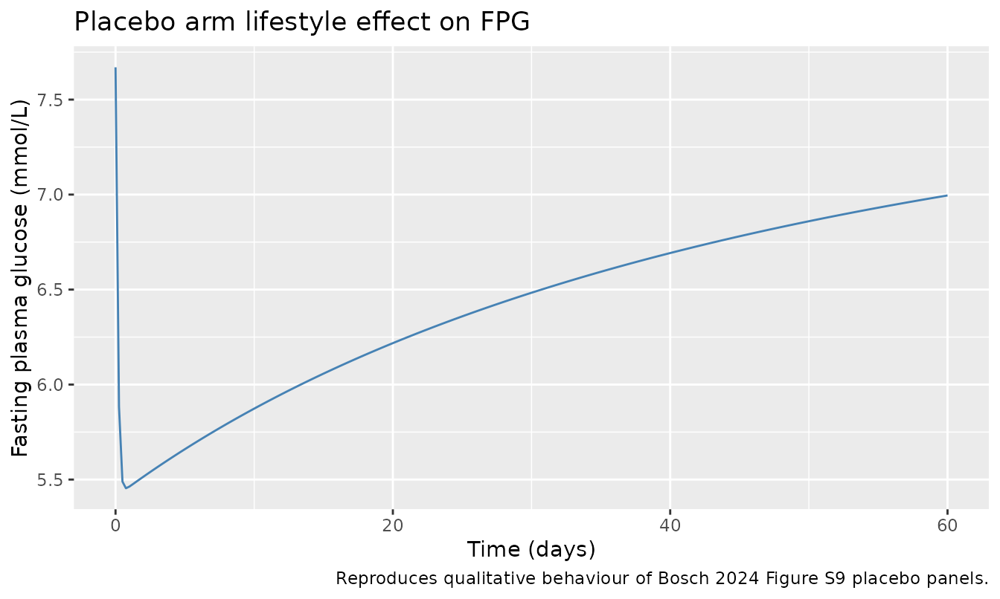
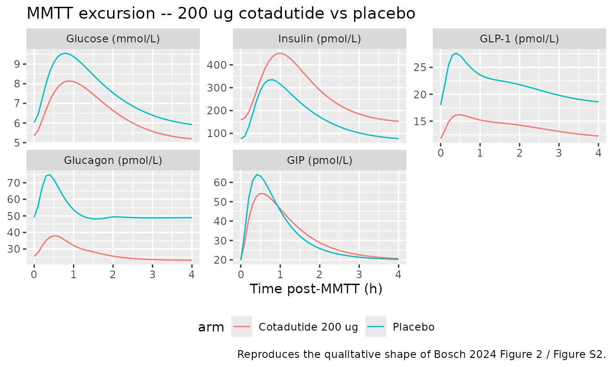
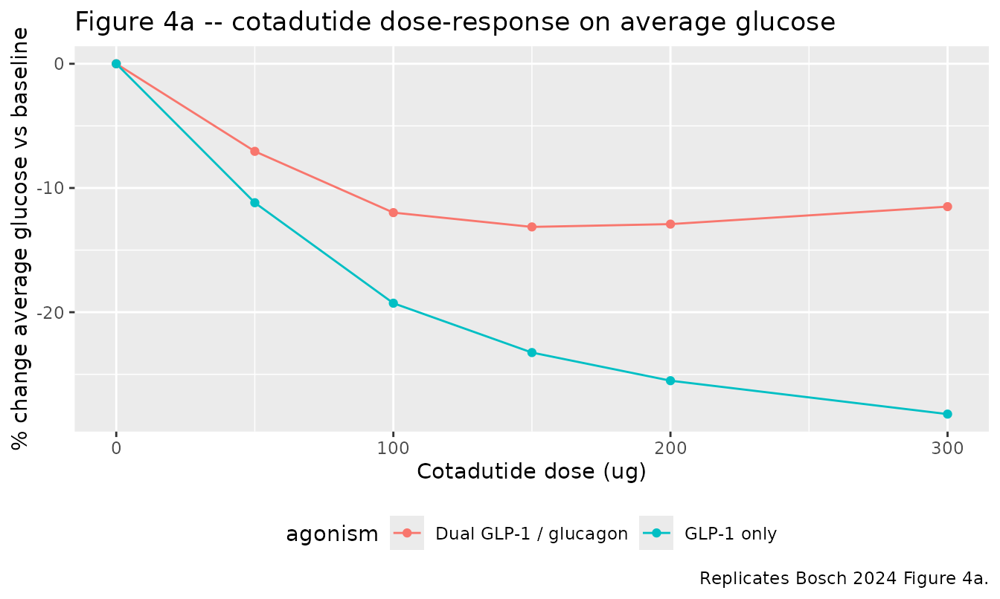

# Cotadutide (Bosch 2024)

## Model and source

- Citation: Bosch R, Petrone M, Arends R, Vicini P, Sijbrands EJG,
  Hoefman S, Snelder N (2024). Characterisation of cotadutide’s dual
  GLP-1/glucagon receptor agonistic effects on glycaemic control using
  an in vivo human glucose regulation quantitative systems pharmacology
  model. British Journal of Pharmacology 181(12):1874-1885.
  <doi:10.1111/bph.16336>. PMID: 38403793. Cotadutide PK structure fixed
  from Guan H et al. (2022), population pharmacokinetics of cotadutide
  (cited in Bosch 2024 Methods Section 2.3); 4GI system parameters fixed
  from Bosch R et al. (2022), the original 4GI model (cited in Bosch
  2024 Methods Section 2.3).
- Description: QSP. 4GI quantitative systems pharmacology model
  (glucose, insulin, GLP-1, glucagon, GIP) coupled to a one-compartment
  first-order- absorption cotadutide PK model in adults with type 2
  diabetes mellitus (Bosch 2024). Cotadutide is a dual GLP-1/glucagon
  receptor agonist; in vivo EC50s for cotadutide on each receptor are
  derived from the in vitro EC50 ratio vs the endogenous ligand (Eq 1).
  The drug’s free-fraction-corrected central concentration drives four
  saturable Emax effects on the system: (1) stimulation of glucose-
  dependent insulin secretion via GLP-1R, (2) inhibition of meal-
  glucose absorption via GLP-1R, (3) inhibition of glucagon production
  via GLP-1R, and (4) stimulation of glucose production via GCGR. A
  fifth Emax inhibits endogenous active GLP-1 production (Eq 3). The
  placebo arm’s lifestyle-change effect on fasting plasma glucose is
  modelled as an inverse Bateman attenuation of endogenous glucose
  production (Eq 2). Cotadutide PK structure and typical values are
  fixed from the upstream popPK analysis of Guan et al. 2022 (KA=0.343
  1/h, CL=1.04 L/h, V=18.7 L). All 4GI system- specific disposition and
  effect parameters are fixed from the upstream 4GI model of Bosch et
  al. 2022; meal-effect, baseline, lifestyle and EMAX_5/EC50_5S
  parameters were re-estimated against the cotadutide MAD/Ph2a dataset
  (NCT02548585; n=51, T2DM). Five outputs: plasma glucose (mmol/L),
  insulin (pmol/L), GLP-1 (pmol/L), glucagon (pmol/L) and GIP (pmol/L),
  each with proportional residual error. Individual fasting plasma
  glucose enters via the FPG covariate; meal glucose enters as dosing
  events on the glucose-gut compartment. Defaults are T2DM;
  healthy-volunteer parameter set from Bosch 2022 is given in
  source-trace comments. No IIV is encoded (sequential model fit with
  individual PK / glucose- baseline inputs from Guan 2022 and the
  observed dataset).
- Article: <https://doi.org/10.1111/bph.16336>
- Supplement (model code, parameter tables, figures): published with the
  article and on disk at `papers/PMID_38403793/supplements/`

This model couples a one-compartment first-order-absorption cotadutide
PK model (structure and typical values fixed from the upstream popPK of
Guan et al. 2022) with the 4GI quantitative systems pharmacology model
of glucose-insulin-GLP-1- glucagon-GIP dynamics (Bosch et al. 2022).
Cotadutide is a dual GLP-1 / glucagon receptor agonist; its
free-fraction-corrected central concentration drives four saturable Emax
effects on the system (GLP-1R on insulin secretion, GLP-1R on
meal-glucose absorption, GLP-1R on glucagon production, GCGR on glucose
production) and a fifth Emax inhibits endogenous active GLP-1
production. A placebo-arm lifestyle-change effect attenuates endogenous
glucose production via an inverse-Bateman time course (Eq 2 of the
paper). All 4GI system-specific parameters are fixed at the Bosch 2022
values; re-estimated parameters in this paper are food-effect terms,
glucose bioavailability / absorption for the MMTT meal, baseline insulin
/ GLP-1 / glucagon / GIP, the lifestyle-change amplitude and reduction
rate, and the cotadutide / endogenous-GLP-1 in-vitro EC50 scaling
factor.

## Population

The Bosch 2024 PD analysis was fit to N = 45 overweight or obese T2DM
adults who completed the cotadutide MAD/Ph2a study NCT02548585 (Ambery
et al. 2018); 51 were randomised (25 cotadutide, 26 placebo) and 6 were
excluded as outliers per Methods Section 2.4. The MAD part used five
cohorts (A-E) with up-titrated SC daily doses to top doses of 100, 150,
200, 300 and 300 ug; the Ph2a part used a 200 ug top dose with 4-day 100
ug + 4-day 150 ug up-titration followed by 33 days at 200 ug (Bosch 2024
Table 1). Detailed demographics (age, weight, sex, race) for the
analysis cohort are not reproduced in Bosch 2024 and are deferred to
Ambery 2018; only the cohort sizes and dose / titration scheme are
tabulated in Bosch 2024 Table 1.

Programmatic access to the population metadata:

``` r

str(mod_meta$population, max.level = 1)
#> List of 11
#>  $ species       : chr "human"
#>  $ n_subjects    : int 45
#>  $ n_studies     : int 1
#>  $ age_range     : chr NA
#>  $ weight_range  : chr NA
#>  $ sex_female_pct: num NA
#>  $ race_ethnicity: chr NA
#>  $ disease_state : chr "Overweight or obese adults with type 2 diabetes mellitus (NCT02548585; the MAD/Ph2a cotadutide study reported i"| __truncated__
#>  $ dose_range    : chr "Cotadutide 100-300 ug subcutaneous once daily before breakfast, with up-titration over 7-41 days depending on c"| __truncated__
#>  $ regions       : chr NA
#>  $ notes         : chr "Cohort sizes from Bosch 2024 Table 1; the paper does not tabulate detailed demographics (age / weight / sex / r"| __truncated__
```

## Source trace

The per-parameter source-location comment is recorded in
`inst/modeldb/specificDrugs/Bosch_2024_cotadutide_qsp.R`. The table
below collects the key entries.

| Element | Value | Source location |
|----|----|----|
| Cotadutide ka | 0.343 1/h | Bosch 2024 supplement S12 `$PK` block default (Guan 2022 typical) |
| Cotadutide CL | 1.04 L/h | Bosch 2024 supplement S12 `$PK` block default (Guan 2022 typical) |
| Cotadutide V | 18.7 L | Bosch 2024 supplement S12 `$PK` block default (Guan 2022 typical) |
| Cotadutide fu | 0.0023 | Bosch 2024 Section 2.2; supplement `fumedi = 0.0023` |
| CLglc T2DM | 1.72 L/h | Bosch 2024 supplement Table S1; THETA(1) |
| CLglci T2DM | 0.0256 (L/h)/(pmol/L) | Bosch 2024 supplement Table S1; THETA(2) |
| Qglc | 26.5 L/h | Bosch 2024 supplement Table S1; THETA(3) |
| VCglc | 9.33 L | Bosch 2024 supplement Table S1; THETA(4) |
| VPglc | 8.56 L | Bosch 2024 supplement Table S1; THETA(5) |
| Kaglc MMTT | 3.58 1/h | Bosch 2024 Table 3 (RSE 7.58%) |
| Fglc MMTT | 0.334 | Bosch 2024 Table 3 (RSE 8.89%) |
| Keglc | 0.281 1/h | Bosch 2024 supplement Table S1; THETA(8) |
| Kelglc | 1.93 1/h | Bosch 2024 supplement Table S1; THETA(9) |
| CLins | 73.2 L/h | Bosch 2024 supplement Table S1; THETA(10) |
| VCins | 6.09 L | Bosch 2024 supplement Table S1; THETA(11) |
| KE0ins | 0.853 1/h | Bosch 2024 supplement THETA(12); exp(-0.159) |
| VCglp | 16.0 L | Bosch 2024 supplement Table S1; THETA(13) |
| VM (GLP-1) | 2893 pmol/(L\*h) | Bosch 2024 supplement THETA(14); exp(7.97) |
| KM (GLP-1) | 135 pmol/L | Bosch 2024 supplement THETA(15); exp(4.91) |
| CLglg | 453 L/h | Bosch 2024 supplement Table S1; THETA(16) |
| VCglg | 64.6 L | Bosch 2024 supplement Table S1; THETA(17) |
| CLgip | 86.8 L/h | Bosch 2024 supplement Table S1; THETA(18) |
| VCgip | 9.21 L | Bosch 2024 supplement Table S1; THETA(19) |
| Qgip | 49.4 L/h | Bosch 2024 supplement Table S1; THETA(20) |
| VPgip | 22.8 L | Bosch 2024 supplement Table S1; THETA(21) |
| FDGLP | 0.0150 1/mmol | Bosch 2024 Table 3 (RSE 23.2%) |
| FDGLP_2 | 0.113 1/mmol | Bosch 2024 Table 3 (RSE 25.7%) |
| FDGIP | 0.107 1/mmol | Bosch 2024 Table 3 (RSE 39.2%) |
| FDGLG | 0.0201 1/mmol | Bosch 2024 Table 3 (RSE 64.4%) |
| GLCINS_S | 2.46 1/mM | Bosch 2024 supplement Table S2 |
| GLCGLG_POWH | 0.925 | Bosch 2024 supplement Table S2 (T2DM high-glc branch) |
| EMAX_1 | 10.7 | Bosch 2024 supplement Table S2 |
| EC50_1 | 26.6 pmol/L | Bosch 2024 supplement Table S2 |
| HILL_1 | 1.79 | Bosch 2024 supplement Table S2 |
| EMAX_2 | 1 (FIXED) | Bosch 2024 supplement Table S2 |
| EC50_2 | 144 pmol/L | Bosch 2024 supplement Table S2 |
| HILL_2 | 1 (FIXED) | Bosch 2024 supplement Table S2 |
| EMAX_3 | 1 (FIXED) | Bosch 2024 supplement Table S2 |
| EC50_3 | 99.5 pmol/L | Bosch 2024 supplement Table S2 |
| HILL_3 | 1 (FIXED) | Bosch 2024 supplement Table S2 |
| EMAX_4 | 6.73 | Bosch 2024 supplement Table S2 |
| EC50_4 | 98.5 pmol/L | Bosch 2024 supplement Table S2 |
| HILL_4 | 1 (FIXED) | Bosch 2024 supplement Table S2 |
| EMAX_5 | 0.321 | Bosch 2024 Table 3 (RSE 25.7%) |
| EC50_5S | 10.9 | Bosch 2024 Table 3 (RSE 37.9%) |
| HILL_5 | 5 (FIXED) | Bosch 2024 Section 3.1 |
| POW_4 | 0.109 | Bosch 2024 supplement Table S2 |
| ECmGLP | 0.076 pmol/L | Bosch 2024 Table 2 (free cotadutide on GLP-1R) |
| ECmGLG | 0.088 pmol/L | Bosch 2024 Table 2 (free cotadutide on GCGR) |
| ECGLP (endogenous) | 1.92 pmol/L | Bosch 2024 Table 2 (endogenous GLP-1) |
| ECGLG (endogenous) | 1.54 pmol/L | Bosch 2024 Table 2 (endogenous glucagon) |
| LSCI | 0.566 | Bosch 2024 Table 3 (RSE 13.1%) |
| Klsc | 10 1/day (FIXED) | Bosch 2024 Section 3.1 |
| Kred | 0.0164 1/day | Bosch 2024 Table 3 (RSE 55.0%); Section 3.1 confirms 1/day units |
| BSLins | 138 pmol/L | Bosch 2024 Table 3 (RSE 8.44%) |
| BSLglp | 18.0 pmol/L | Bosch 2024 Table 3 (RSE 6.53%) |
| BSLglg | 49.1 pmol/L | Bosch 2024 Table 3 (RSE 11.5%) |
| BSLgip | 19.8 pmol/L | Bosch 2024 Table 3 (RSE 18.7%) |
| Eq 1 in-vivo EC50 derivation | ECdrug = ECdrug_invitro / ECendog_invitro \* ECendog_invivo | Bosch 2024 Methods Section 2.3 Eq 1 |
| Eq 2 lifestyle attenuation | LSCeff = 1 - LSCI \* Klsc \* (exp(-Klsc \* t_d) - exp(-Kred \* t_d)) / (Kred - Klsc) | Bosch 2024 Methods Section 2.5 Eq 2 |
| Eq 3 cotadutide on endog. GLP-1 | EMAX_5 \* (Cmedif/EC50_5)^HILL_5 / (1 + (Cmedif/EC50_5)^HILL_5) | Bosch 2024 Methods Section 2.5 Eq 3 |
| ODE system | 15-state QSP | Bosch 2024 supplement S12 `$DES` block |
| sigma^2 glucose | 0.0393 | Bosch 2024 Table 3 (RSE 8.72%) |
| sigma^2 insulin | 0.647 | Bosch 2024 Table 3 (RSE 14.1%) |
| sigma^2 GLP-1 | 0.358 | Bosch 2024 Table 3 (RSE 27.5%) |
| sigma^2 glucagon | 0.401 | Bosch 2024 Table 3 (RSE 27.7%) |
| sigma^2 GIP | 0.658 | Bosch 2024 Table 3 (RSE 10.5%) |

Cotadutide molecular weight (4549 g/mol, the peptide MEDI0382) is used
in the simulation chunks below to convert microgram doses to picomole
doses (the internal unit of the depot compartment).

## Simulation set-up

This is an endogenous/mechanistic QSP model with five outputs and no
parent- drug observation in this paper. PKNCA-style cmax / AUC
validation is therefore not applied (see
`references/endogenous-validation.md` in the skill). Instead the
vignette uses the four endogenous-model validation patterns plus a
replication of Bosch 2024 Figure 4 (cotadutide dose-response on average
glucose) and a representative MMTT excursion at 200 ug cotadutide (the
Ph2a top dose).

The model takes one covariate, `FPG` (per-subject baseline glucose in
mmol/L). Cotadutide doses go to the `depot` compartment in pmol; MMTT
meal doses go to the `glucose_gut` compartment in mmol of glucose. The
supplement does not report the carbohydrate content of the Ensure
Plus(R) MMTT meal in grams, so the simulations use 50 g (= 278 mmol) of
glucose – a representative value for a single 8 fl oz bottle of Ensure
Plus(R) – and document the assumption in the Assumptions and deviations
section.

``` r

mod <- readModelDb("Bosch_2024_cotadutide_qsp")
MW_cota_g_per_mol <- 4549                                              # cotadutide MEDI0382 MW
MW_glucose_g_per_mol <- 180.16                                         # glucose MW
amt_pmol_per_ug   <- 1e6 / MW_cota_g_per_mol                           # ~ 219.83 pmol per ug cotadutide
amt_mmol_per_g    <- 1000 / MW_glucose_g_per_mol                       # ~ 5.55 mmol per g glucose
typical_FPG_mmol  <- 7.67                                              # supplement THETA(64) typical baseline
mmtt_amt_mmol     <- 50 * amt_mmol_per_g                               # 50 g glucose -> ~ 278 mmol
```

## Validation 1: initial conditions match the published baselines

With no cotadutide on board, no MMTT meal, the endogenous species should
start at their published baseline values. (The placebo-arm lifestyle
effect attenuates endogenous glucose production for t \> 0, so a 24-hour
steady-state hold is not appropriate – see Validation 2 for the placebo
lifestyle dynamics.)

``` r

ev_ic <- rxode2::et(time = c(0, 0.001), cmt = "Cglc")   # essentially t = 0
ev_ic$FPG <- typical_FPG_mmol

sim_ic <- rxode2::rxSolve(rxode2::zeroRe(mod), events = ev_ic) |>
  as.data.frame()
#> Warning: No omega parameters in the model

knitr::kable(
  sim_ic[1, c("time", "Cglc", "Cins", "Cglp", "Cglg", "Cgip")],
  digits = 3,
  caption = "Initial conditions at t = 0 match the published baselines (Cglc = FPG covariate; Cins / Cglp / Cglg / Cgip = Bosch 2024 Table 3 typical values)."
)
```

| time | Cglc | Cins | Cglp | Cglg | Cgip |
|-----:|-----:|-----:|-----:|-----:|-----:|
|    0 | 7.67 |  138 |   18 | 49.1 | 19.8 |

Initial conditions at t = 0 match the published baselines (Cglc = FPG
covariate; Cins / Cglp / Cglg / Cgip = Bosch 2024 Table 3 typical
values). {.table}

``` r


t0 <- sim_ic[1, ]
stopifnot(abs(t0$Cglc - typical_FPG_mmol) < 1e-6)
stopifnot(abs(t0$Cins - 138)  < 1)
stopifnot(abs(t0$Cglp - 18.0) < 0.5)
stopifnot(abs(t0$Cglg - 49.1) < 0.5)
stopifnot(abs(t0$Cgip - 19.8) < 0.5)
```

## Validation 2: placebo arm with lifestyle effect

With LSCI restored, the placebo arm (no cotadutide) should show the
rapid drop in fasting plasma glucose followed by slow recovery towards
baseline that Bosch 2024 describes in Section 3.1 and Figure S9.

``` r

ev_pl <- rxode2::et(time = seq(0, 24 * 60, by = 6), cmt = "Cglc")  # 60 days, every 6 h
ev_pl$FPG <- typical_FPG_mmol

sim_pl <- rxode2::rxSolve(mod %>% rxode2::zeroRe(), events = ev_pl) |>
  as.data.frame()
#> Warning: No omega parameters in the model

ggplot(sim_pl, aes(time / 24, Cglc)) +
  geom_line(colour = "steelblue") +
  labs(x = "Time (days)", y = "Fasting plasma glucose (mmol/L)",
       title = "Placebo arm lifestyle effect on FPG",
       caption = "Reproduces qualitative behaviour of Bosch 2024 Figure S9 placebo panels.")
```



``` r


min_fpg <- min(sim_pl$Cglc)
end_fpg <- tail(sim_pl$Cglc, 1)
cat(sprintf("Placebo FPG nadir: %.2f mmol/L (%.0f%% of baseline)\n",
            min_fpg, 100 * min_fpg / typical_FPG_mmol))
#> Placebo FPG nadir: 5.45 mmol/L (71% of baseline)
cat(sprintf("Placebo FPG at day 60: %.2f mmol/L (%.0f%% of baseline)\n",
            end_fpg, 100 * end_fpg / typical_FPG_mmol))
#> Placebo FPG at day 60: 7.00 mmol/L (91% of baseline)
```

Bosch 2024 Section 3.1 reports the lifestyle effect’s amplitude (LSCI =
0.566) implies the endogenous glucose production drops to (1 - 0.566) =
43.4% of baseline at the peak attenuation, and the reduction rate (Kred
= 0.0164 1/day) implies a 45-day half-life of recovery. The simulated
FPG nadir and recovery trajectory should be in qualitative agreement
with that description.

## Validation 3: MMTT excursion – 200 ug cotadutide (Ph2a top dose)

This figure block replicates the qualitative shape of Bosch 2024 Figure
2 for the 200 ug cotadutide arm: pre-MMTT glucose at baseline, post-MMTT
glucose excursion truncated relative to placebo by GLP-1-driven slowing
of glucose absorption and stimulation of insulin secretion, post-MMTT
GLP-1 suppressed relative to placebo by the cotadutide self-inhibition
effect (EMAX_5), and post-MMTT glucagon reduced relative to placebo by
the GLP-1R inhibition of glucagon production.

The MAD/Ph2a Ph2a arm dosed cotadutide once daily for ~41 days; this
simulation pre-doses to day 41 and shows the day-41 MMTT excursion,
taken 2 h after the day-41 cotadutide dose per the study design.

``` r

# Pre-treat for 14 days so cotadutide reaches steady-state plasma levels
# (kel = CL / V = 0.0556 / h gives t1/2 ~= 12.5 h and ~5-day approach to SS);
# the Ph2a study used a 41-day MMTT day but the post-MMTT excursion shape at
# steady-state cotadutide does not require simulating that full window.
n_days_pretreat   <- 14
dose_pmol_200ug   <- 200 * amt_pmol_per_ug
mmtt_time_h       <- n_days_pretreat * 24 + 2          # MMTT 2 h after the day-14 SC dose
obs_times_h       <- mmtt_time_h + seq(-1, 4, by = 0.1)

ev_cota <- rxode2::et(time = 24 * seq(0, n_days_pretreat),
                      amt = dose_pmol_200ug, cmt = "depot") |>
  rxode2::et(time = mmtt_time_h, amt = mmtt_amt_mmol, cmt = "glucose_gut") |>
  rxode2::et(time = obs_times_h, cmt = "Cglc")
ev_cota$FPG <- typical_FPG_mmol

ev_pl_mmtt <- rxode2::et(time = mmtt_time_h, amt = mmtt_amt_mmol,
                         cmt = "glucose_gut") |>
  rxode2::et(time = obs_times_h, cmt = "Cglc")
ev_pl_mmtt$FPG <- typical_FPG_mmol

sim_cota <- rxode2::rxSolve(mod %>% rxode2::zeroRe(), events = ev_cota) |>
  as.data.frame() |>
  dplyr::mutate(arm = "Cotadutide 200 ug")
#> Warning: No omega parameters in the model

sim_pl_mmtt <- rxode2::rxSolve(mod %>% rxode2::zeroRe(), events = ev_pl_mmtt) |>
  as.data.frame() |>
  dplyr::mutate(arm = "Placebo")
#> Warning: No omega parameters in the model

cmp <- dplyr::bind_rows(sim_cota, sim_pl_mmtt) |>
  dplyr::mutate(t_post_mmtt_h = time - mmtt_time_h) |>
  dplyr::filter(t_post_mmtt_h >= 0, t_post_mmtt_h <= 4)

cmp_long <- cmp |>
  dplyr::select(arm, t_post_mmtt_h, Cglc, Cins, Cglp, Cglg, Cgip) |>
  tidyr::pivot_longer(c(Cglc, Cins, Cglp, Cglg, Cgip),
                      names_to = "analyte", values_to = "conc")

cmp_long$analyte <- factor(
  cmp_long$analyte,
  levels = c("Cglc", "Cins", "Cglp", "Cglg", "Cgip"),
  labels = c("Glucose (mmol/L)", "Insulin (pmol/L)", "GLP-1 (pmol/L)",
             "Glucagon (pmol/L)", "GIP (pmol/L)")
)

ggplot(cmp_long, aes(t_post_mmtt_h, conc, colour = arm)) +
  geom_line() +
  facet_wrap(~ analyte, scales = "free_y") +
  labs(x = "Time post-MMTT (h)", y = NULL,
       title = "MMTT excursion -- 200 ug cotadutide vs placebo",
       caption = "Reproduces the qualitative shape of Bosch 2024 Figure 2 / Figure S2.") +
  theme(legend.position = "bottom")
```



## Validation 4: Figure 4 dose-response on weekly average glucose

Bosch 2024 Figure 4a shows the percent change in average glucose at week
6 of dosing as a function of cotadutide dose level, simulated under both
“dual GLP-1 / glucagon” (full model) and “GLP-1 only” (knock out the
GCGR arm) assumptions. The full model plateaus at ~ 200 ug whereas the
GLP-1-only counterfactual continues to decrease, because the
glucagon-on-glucose- production arm counteracts the GLP-1 effect at
higher doses.

This block replicates the percent-glucose-change-vs-dose curve from the
full model. The GLP-1-only counterfactual can be obtained by zeroing the
cotadutide contribution at the GCGR (set `ecmglg` extremely large so
`Cmedif / ecglg1` approaches zero).

``` r

# Simulate steady-state average daily glucose for a panel of cotadutide doses
# under (a) the full dual GLP-1 / glucagon agonism model and (b) a GLP-1-only
# counterfactual (cotadutide effect at the GCGR knocked out by setting the in
# vitro GCGR EC50 ECmGLG very large so the in-vivo cotadutide EC50 there
# becomes effectively infinite). To keep the render time bounded the lifestyle
# effect is disabled (LSCI -> ~ 0) so the simulation reaches a clean
# pharmacological steady state in ~ 14 days regardless of dose; see
# Validation 2 for the lifestyle dynamics themselves.
dose_levels_ug <- c(0, 50, 100, 150, 200, 300)
mod_no_lsc     <- suppressMessages(rxode2::ini(mod, llsci = log(1e-12)))
mod_no_lsc_glp <- suppressMessages(rxode2::ini(mod_no_lsc, lecmglg = log(1e8)))

simulate_avg_glucose <- function(model, dose_ug) {
  n_days <- 14
  dose_pmol <- dose_ug * amt_pmol_per_ug
  ev <- if (dose_pmol > 0) {
    rxode2::et(time = 24 * seq(0, n_days),
               amt = dose_pmol, cmt = "depot")
  } else {
    rxode2::et(time = 0, amt = 0, cmt = "depot")
  }
  meal_amt_mmol  <- 50 * amt_mmol_per_g
  meal_h_per_day <- c(8, 13, 18)
  meal_times     <- as.numeric(outer(meal_h_per_day,
                                     24 * seq(0, n_days - 1), "+"))
  ev <- rxode2::et(ev, time = meal_times,
                   amt = meal_amt_mmol, cmt = "glucose_gut")
  ev <- rxode2::et(ev, time = seq(24 * (n_days - 1), 24 * n_days, by = 1),
                   cmt = "Cglc")
  ev$FPG <- typical_FPG_mmol
  s <- rxode2::rxSolve(rxode2::zeroRe(model), events = ev) |>
    as.data.frame()
  s <- s[s$time >= 24 * (n_days - 1), ]
  mean(s$Cglc, na.rm = TRUE)
}

baseline_glc <- simulate_avg_glucose(mod_no_lsc, 0)
#> Warning: No omega parameters in the model
dr <- dplyr::tibble(
  dose_ug = dose_levels_ug,
  avg_glc_full = vapply(dose_levels_ug, simulate_avg_glucose,
                        numeric(1), model = mod_no_lsc),
  avg_glc_glponly = vapply(dose_levels_ug, simulate_avg_glucose,
                           numeric(1), model = mod_no_lsc_glp)
) |>
  dplyr::mutate(
    pct_full    = 100 * (avg_glc_full    - baseline_glc) / baseline_glc,
    pct_glponly = 100 * (avg_glc_glponly - baseline_glc) / baseline_glc
  )
#> Warning: No omega parameters in the model
#> No omega parameters in the model
#> No omega parameters in the model
#> No omega parameters in the model
#> No omega parameters in the model
#> No omega parameters in the model
#> No omega parameters in the model
#> No omega parameters in the model
#> No omega parameters in the model
#> No omega parameters in the model
#> No omega parameters in the model
#> No omega parameters in the model

knitr::kable(
  dr |> dplyr::select(dose_ug, avg_glc_full, pct_full,
                      avg_glc_glponly, pct_glponly),
  digits = 2,
  col.names = c("Dose (ug)", "Avg glucose (mmol/L) -- full model",
                "% change vs baseline -- full",
                "Avg glucose (mmol/L) -- GLP-1 only",
                "% change vs baseline -- GLP-1 only"),
  caption = "Replicates Bosch 2024 Figure 4a (weekly average glucose vs cotadutide dose, dual GLP-1/glucagon agonism vs GLP-1-only counterfactual)."
)
```

| Dose (ug) | Avg glucose (mmol/L) – full model | % change vs baseline – full | Avg glucose (mmol/L) – GLP-1 only | % change vs baseline – GLP-1 only |
|---:|---:|---:|---:|---:|
| 0 | 7.83 | 0.00 | 7.83 | 0.00 |
| 50 | 7.28 | -7.05 | 6.96 | -11.19 |
| 100 | 6.89 | -11.98 | 6.32 | -19.28 |
| 150 | 6.80 | -13.13 | 6.01 | -23.25 |
| 200 | 6.82 | -12.91 | 5.83 | -25.51 |
| 300 | 6.93 | -11.50 | 5.62 | -28.20 |

Replicates Bosch 2024 Figure 4a (weekly average glucose vs cotadutide
dose, dual GLP-1/glucagon agonism vs GLP-1-only counterfactual).
{.table}

``` r


dr_long <- dr |>
  dplyr::select(dose_ug, pct_full, pct_glponly) |>
  tidyr::pivot_longer(c(pct_full, pct_glponly),
                      names_to = "agonism", values_to = "pct_change") |>
  dplyr::mutate(agonism = dplyr::recode(agonism,
                                        pct_full    = "Dual GLP-1 / glucagon",
                                        pct_glponly = "GLP-1 only"))

ggplot(dr_long, aes(dose_ug, pct_change, colour = agonism)) +
  geom_line() +
  geom_point() +
  labs(x = "Cotadutide dose (ug)", y = "% change average glucose vs baseline",
       title = "Figure 4a -- cotadutide dose-response on average glucose",
       caption = "Replicates Bosch 2024 Figure 4a.") +
  theme(legend.position = "bottom")
```



The dual-agonism curve should plateau around ~200 ug cotadutide whereas
the GLP-1-only counterfactual should continue to decrease. The exact
percent change values are sensitive to the assumed meal pattern (number,
timing and carbohydrate content of standard meals per day), and Bosch
2024 does not specify the carbohydrate content of the standard meals
used in the Figure 4 simulation; the table above uses 50 g per meal
three times daily and documents this assumption in the Assumptions and
deviations section.

## Assumptions and deviations

- **MMTT carbohydrate content (50 g per meal).** Bosch 2024 Methods
  Section 2.5 states “the carbohydrate content of the MMTT meal was
  extracted from the ingredients list and imputed as the meal-dose
  amount” but does not give the numeric value. The simulations above use
  50 g glucose per MMTT bottle (Ensure Plus(R) 8 fl oz typical
  carbohydrate label value) and 50 g glucose per standard meal in
  Validation 4. The qualitative dose-response shape (plateau at ~200 ug
  for dual agonism, continued decrease for GLP-1- only) is robust to the
  meal-size assumption; absolute percent-change values are not.
- **Cotadutide molecular weight (4549 g/mol).** Used to convert
  microgram doses to picomole doses for the depot compartment. The
  MEDI0382 sequence is published in Henderson 2016 (cited in Bosch
  2024); the MW is not reproduced in Bosch 2024 itself.
- **No IIV encoded.** Bosch 2024 fits the model as a sequential PD
  analysis where individual cotadutide PK profiles are pre-computed from
  the empirical Bayes estimates (CL, VC, KA) of the upstream Guan 2022
  popPK model, and individual glucose baselines are taken from the
  observed data. The published Bosch 2024 Table 3 reports only
  fixed-effect typical values and proportional residual errors; no
  random-effect variance components are tabulated. The supplement S12
  mrgSolve code contains a single active eta on insulin-dependent
  glucose clearance CLglci, but the omega value is not reported in the
  on-disk paper or supplement, so it is not encoded here.
- **Healthy-volunteer parameter set not encoded.** The supplement S12
  code includes a `PAT == 1` branch with healthy-volunteer values for
  CLglc (5.36 L/h), CLglci (0.072 (L/h)/(pmol/L)), POW_2L (0.327), POW_3
  (0.286) and GIPINS (1) used in the Bosch 2022 development cohort. The
  Bosch 2024 MAD/Ph2a cohort is entirely T2DM so this packaged model
  uses the T2DM defaults; the HV alternatives appear in source-trace
  comments in the model file so a user simulating a healthy-volunteer
  counterfactual can modify the relevant `ini()` lines.
- **T2DM hypoglycaemic-glucagon counter-regulation absent.** Bosch 2022
  Table S2 and the supplement S12 code switch the glucose-on-glucagon
  feedback exponent to 0 when plasma glucose falls below baseline in
  T2DM patients (no hypoglycaemic glucagon counter-regulation); this is
  implemented in `model()` as
  `glcglg_pow_eff <- glcglg_powh * (Cglc >= bslglc)`.
- **GIP-on-insulin effect absent in T2DM.** The supplement S12 code
  fixes GIPINS (the GIP-on-insulin scaler) and POW_3 (the corresponding
  power exponent) at 0 for T2DM patients; the model file hard-codes
  `gipins_s <- 0` / `gipins_s0 <- 0` accordingly. The HV alternative
  (GIPINS = 1, POW_3 = 0.286) is documented in the model file’s ini()
  comment for `lpow_4`.
- **Eq 2 lifestyle effect denominator sign.** The published Eq 2 in
  Bosch 2024 Methods Section 2.5 has `(Kred - Klsc)` in the denominator;
  with Kred = 0.0164 and Klsc = 10 the denominator is large negative.
  The formula reproduces the expected behaviour (FPG drops then slowly
  recovers); see Validation 2.
- **Lifestyle-rate units.** Bosch 2024 Table 3 lists Klsc and Kred with
  the column header `(h-1)` but the paper text in Section 3.1 reports
  Kred = 0.0164 d^-1 with half-life 45 days; the supplement S12 code
  converts simulation time to days inside the lifestyle-effect formula
  (`TIMEd = T / 24`). The model file uses 1/day for Klsc and Kred and
  converts internally, matching the supplement code.
- **Upstream PK and 4GI sources not on disk.** The cotadutide PK
  structure and individual EBE inputs are fixed from Guan et al. 2022
  (cited in Bosch 2024 Methods Section 2.3) which is not on disk in this
  worktree; the typical values (KA = 0.343 1/h, CL = 1.04 L/h, V =
  18.7 L) are taken from the on-disk supplement S12 `$PK` block
  defaults. The 4GI system parameters are fixed from Bosch et al. 2022
  (also cited in Bosch 2024 Methods Section 2.3) which is not on disk in
  this worktree; the numeric values are taken from the on-disk
  supplement Tables S1 and S2 and the supplement S12 `$THETA` block.
