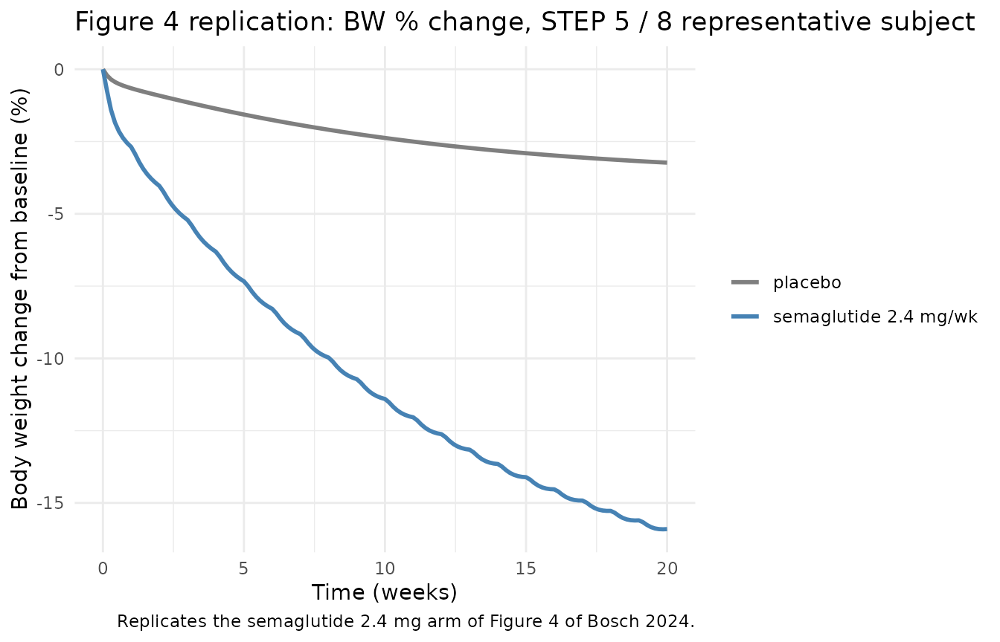

# GLP-1RA body composition (Bosch 2024)

## Model and source

- Citation: Bosch R, Sijbrands EJG, Snelder N. Quantification of the
  effect of GLP-1R agonists on body weight using in vitro efficacy
  information: An extension of the Hall body composition model. CPT
  Pharmacometrics Syst Pharmacol. 2024;13:1488-1502.
  <doi:10.1002/psp4.13183>. PMID 38867373. Body composition framework:
  Hall KD. Predicting metabolic adaptation, body weight change, and
  energy intake in humans. Am J Physiol Endocrinol Metab.
  2010;298(3):E449-66. <doi:10.1152/ajpendo.00559.2009>. Liraglutide PK
  source reproduced in supplement S10: FDA Clinical Pharmacology Review
  for liraglutide, 17 Dec 2018. Semaglutide PK source reproduced in
  supplement S10: Carlsson Petri KC, Ingwersen SH, Flint A, Zacho J,
  Overgaard RV. Semaglutide s.c. once-weekly in type 2 diabetes: a
  population pharmacokinetic analysis. Diabetes Ther. 2018;9:1533-1547.
  <doi:10.1007/s13300-018-0458-5>.
- Description: QSP. GLP-1R agonist body composition model (Bosch 2024)
  extending the Hall 2009 three-compartment energy-balance model
  with (1) an inverse-Bateman lifestyle-change effect on energy
  intake, (2) a body-weight-dependent activity effect on physical
  activity energy expenditure for studies that included weight
  management and intensive behavioural treatment, and (3) a GLP-1R
  agonist drug effect driven by the in-vitro EC50- normalised free drug
  concentration, with a time-dependent tolerance term that shifts the
  in-vivo EC50 upward. Liraglutide and semaglutide PK are encoded inline
  as fixed one-compartment first-order absorption models (parameters
  from the Bosch 2024 supplement S10 reproducing FDA clinical
  pharmacology review (liraglutide, 17 Dec 2018) and Carlsson Petri et
  al. 2018 (semaglutide); both PK paths share the body composition
  machinery, and the total normalised free concentration drives the
  GLP-1R effect so a user simulating a single drug doses to that drug’s
  depot only. Body weight (kg) and percent change from baseline are the
  primary observation outputs. Initial conditions are derived from
  baseline body weight, BMI, age, sex and height via the Jackson
  body-fat regression and the Mifflin resting-metabolic-rate equation;
  baseline energy intake is set to maintain steady state at PAL = 1.6
  (low-active-to-active). 11 active ODEs (3 macronutrient stores, 2
  extracellular-water states, lipolysis diet target, adaptive
  thermogenesis, plus 2 first-order PK chains for each drug).
- Article: <https://doi.org/10.1002/psp4.13183>
- Supplement S10 (full mrgsolve model code):
  <https://doi.org/10.1002/psp4.13183>

Bosch 2024 extends the Hall body composition model (Hall 2010) with
three effects layered on energy intake (EI) and physical activity energy
expenditure (PAE):

1.  an inverse-Bateman lifestyle change / placebo effect on EI;
2.  a body-weight-dependent activity effect on the exercise part of PAE,
    applied to studies with weight management and intensive behavioural
    treatment (IBT);
3.  a GLP-1R agonist drug effect driven by the in-vitro EC50-normalised
    free drug concentration, with a time-dependent tolerance that shifts
    the in-vivo EC50 upward over weeks to months.

Liraglutide and semaglutide PK are encoded inline as fixed
one-compartment first-order absorption models reproduced from supplement
S10 (FDA clinical pharmacology review, 17 Dec 2018, for liraglutide;
Carlsson Petri et al. 2018 for semaglutide). Both PK paths share the
body composition machinery and contribute additively to the total
in-vitro-EC50-normalised free concentration that drives the GLP-1R
effect, so a user simulating one drug doses only that drug’s depot
compartment.

## Population

The original analysis pooled mean-study data from 14 publications. Diet
studies (Diaz 1992, Jebb 1993/1996, Schrauwen 1997, Das 2017, Heilbronn
2006, Guo 2018, Redman 2007, Racette 2011, Weiss 2015, Rumpler 1991, de
Boer 1986) anchored the body composition layer and the lifestyle change
effect. GLP-1RA studies (Can 2014, Pi-Sunyer 2015 SCALE, Astrup 2009, le
Roux 2017 SCALE, Blundell 2017, Hjerpsted 2017, Sorli 2017 SUSTAIN 1,
Wadden 2021 STEP 3, Garvey 2022 STEP 5, Rubino 2022 STEP 8, Pratley 2018
SUSTAIN 7) supplied the drug-effect parameters. Wilding 2021 STEP 1 was
held out for external validation. Subjects were non-diabetic obese,
pre-diabetic obese, or type-2 diabetic obese adults. Programmatic
metadata is available via
`rxode2::rxode2(readModelDb("Bosch_2024_glp1ra_bodyweight"))$population`.

## Source trace

The per-parameter origin is recorded as an in-file comment next to each
`ini()` entry in
`inst/modeldb/specificDrugs/Bosch_2024_glp1ra_bodyweight.R`. The table
below collects the principal model equations and parameters in one
place.

| Equation / parameter | Value | Source location |
|----|----|----|
| TVGLP50 (in-vivo / in-vitro EC50 fold) | 48.1 | Table 3 Model D |
| T50 (tolerance half-time, d) | 1439 | Table 3 Model D |
| SSEC50 (steady-state EC50 shift) | 3798 | Table 3 Model D |
| fulira (liraglutide free fraction) | 0.00243 | Table 3 Model D |
| EMAX_ACT (activity-effect max, kcal/d/kg) | 0.00193 | Table 3 Model D |
| EWC50_ACT (half-max WTCH, kg) | -22.9 | Table 3 Model D |
| Kdiet (LSC onset rate, 1/d) | 10 (FIX) | Supplement S10 (THETA5) |
| Kred non-STEP (1/d) | 0.00195 | Table 3 Model D |
| Kred STEP 5/8 (1/d) | 0.00541 (= 0.0379/7) | Table 3 Model D |
| Kred STEP 3 (1/d) | 0.00924 (= 0.0647/7) | Table 3 Model D |
| EC50 liraglutide (pM) | 1.2 | Table 2 |
| EC50 semaglutide (pM) | 0.9 | Table 2 |
| fusema (semaglutide free fraction) | 0.0025 | Table 2 |
| Liraglutide KA (1/d) | 1.4592 (= 0.0608 \* 24) | Supplement S10 |
| Liraglutide CL ref (L/d, 90 kg male) | 26.64 (= 1.11 \* 24) | Supplement S10 |
| Liraglutide Vc ref (L, 90 kg male) | 0.16 | Supplement S10 |
| Liraglutide WT exponent on CL | 0.703 | Supplement S10 |
| Liraglutide WT exponent on Vc | 1.24 | Supplement S10 |
| Liraglutide male / female CL ratio | 1.32 | Supplement S10 |
| Liraglutide male / female Vc ratio | 1.4 | Supplement S10 |
| Semaglutide KA (1/d) | 0.6864 (= 0.0286 \* 24) | Supplement S10 |
| Semaglutide Vc (L, fixed) | 12.2 | Supplement S10 |
| Semaglutide CL ref (L/d, 85 kg) | 1.1472 (= 0.0478 \* 24) | Supplement S10 |
| Semaglutide WT exponent on CL | 0.774 | Supplement S10 |
| Inverse-Bateman LSC equation (Eq. 5) | n/a | Bosch 2024 Equation 5 |
| Activity effect (Eq. 6a-c) | n/a | Bosch 2024 Equations 6a-c |
| Drug effect with tolerance (Eq. 7a-b) | n/a | Bosch 2024 Equations 7a-b |
| Hall body composition ODEs | n/a | Hall 2010 (reproduced in S10) |
| Jackson body-fat regression | n/a | Supplement S10 (cite \[34\]) |
| Mifflin RMR equation | n/a | Supplement S10 (cite \[35\]) |

## Virtual cohort

The Bosch 2024 analysis was a population QSP fit to mean-study data, so
neither subject-level data nor between-subject random effects were
estimated. This vignette therefore simulates the typical-individual
response - there is no IIV to propagate. Two scenarios are constructed:
a steady-state hold for a typical 105 kg / BMI 38 / 47-year-old female
subject and a STEP 5 / STEP 8 representative semaglutide 2.4 mg SC
once-weekly schedule (Garvey 2022, Rubino 2022).

``` r

mw_sema <- 4113.58 # g/mol; semaglutide molecular weight
mw_lira <- 3751.20 # g/mol; liraglutide molecular weight

# STEP 5 / STEP 8 representative subject (Garvey 2022 / Rubino 2022 cohort means).
# Bosch 2024 supplement S10 LSCI = 0.150 and Kred = 0.0379/week = 0.00541/d for STEP 5/8.
step5_subject <- tibble::tibble(
  id = 1L,
  WT = 105,
  HT = 165,
  AGE = 47,
  BMI = 38,
  SEXF = 1L,
  LSCI = 0.150,
  WM_IBT = 1L
)

# Build the event table: 1 weekly dose for 20 weeks at 2.4 mg semaglutide,
# observations daily, plus the covariates above carried verbatim.
dose_amt_sema_pmol <- (2.4e-3 / mw_sema) * 1e12 # mg -> g -> mol -> pmol

# Treatment arms simulated below:
#   1) placebo: WM_IBT = 1, LSCI = 0.150, no dose
#   2) semaglutide 2.4 mg/week SC: same covariates, weekly dose to depot_sema

make_arm <- function(cov, dose_amt, dose_cmt, arm_label) {
  obs_times <- seq(0, 140, by = 1) # days; 20 weeks
  if (dose_amt > 0) {
    dose_times <- seq(0, 133, by = 7) # weekly doses up to day 133
    ev <- dplyr::bind_rows(
      tibble::tibble(time = dose_times, evid = 1L,
                     amt = dose_amt, cmt = dose_cmt),
      tibble::tibble(time = obs_times, evid = 0L,
                     amt = 0, cmt = NA_character_)
    )
  } else {
    ev <- tibble::tibble(time = obs_times, evid = 0L,
                         amt = 0, cmt = NA_character_)
  }
  ev <- dplyr::arrange(ev, time)
  ev$id <- cov$id
  ev$WT <- cov$WT
  ev$HT <- cov$HT
  ev$AGE <- cov$AGE
  ev$BMI <- cov$BMI
  ev$SEXF <- cov$SEXF
  ev$LSCI <- cov$LSCI
  ev$WM_IBT <- cov$WM_IBT
  ev$arm <- arm_label
  ev
}

events <- dplyr::bind_rows(
  make_arm(step5_subject, 0, NA_character_, "placebo"),
  make_arm(dplyr::mutate(step5_subject, id = 2L),
           dose_amt_sema_pmol, "depot_sema", "semaglutide 2.4 mg/wk")
)
```

## Simulation

``` r

mod <- rxode2::rxode2(readModelDb("Bosch_2024_glp1ra_bodyweight"))
# Typical-individual run - Bosch 2024 reported no estimated IIV, so set the
# residual-error SD to zero for the typical-trajectory simulation.
# Override the default Kred (the non-STEP value 0.00195 / d) with the
# STEP 5 / STEP 8 fitted value (0.00541 / d) so the simulated trajectory
# matches the Bosch 2024 Figure 4 STEP 5 / 8 arms.
mod_typical <- rxode2::zeroRe(mod) |> rxode2::ini(lkred = log(0.00541))
#> Warning: No omega parameters in the model
#> ℹ change initial estimate of `lkred` to `-5.21950618612375`
sim <- rxode2::rxSolve(mod_typical, events = events, keep = c("arm"))
#> Warning: multi-subject simulation without without 'omega'
sim$arm <- factor(sim$arm, levels = c("placebo", "semaglutide 2.4 mg/wk"))
```

## Replicate Figure 4 of Bosch 2024

Bosch 2024 Figure 4 shows the model fit of body-weight percent change
from baseline in the STEP 3 / 5 / 8 semaglutide studies. The
typical-trajectory replication below focuses on the STEP 5 / 8 design
(LSCI = 0.150, Kred = 0.00541 / d).

``` r

sim |>
  dplyr::transmute(time_wk = time / 7, arm,
                   wtch_pct = 100 * (Cc - 105) / 105) |>
  ggplot(aes(time_wk, wtch_pct, colour = arm)) +
  geom_line(linewidth = 1) +
  scale_colour_manual(values = c("placebo" = "grey50",
                                 "semaglutide 2.4 mg/wk" = "steelblue")) +
  labs(x = "Time (weeks)", y = "Body weight change from baseline (%)",
       colour = NULL,
       title = "Figure 4 replication: BW % change, STEP 5 / 8 representative subject",
       caption = "Replicates the semaglutide 2.4 mg arm of Figure 4 of Bosch 2024.") +
  theme_minimal()
```



The 20-week BW change for the semaglutide arm should land near -17 %
(Bosch 2024 Results: “At 20 weeks BW changes of -17 % … were predicted
for semaglutide (2.4 mg, average over STEP 3, 5 and 8 studies)”).

``` r

twenty_wk <- sim |>
  dplyr::filter(time == 140) |>
  dplyr::transmute(arm,
                   bwkg_at_20wk = round(Cc, 2),
                   wtch_pct_at_20wk = round(100 * (Cc - 105) / 105, 2))
knitr::kable(
  twenty_wk,
  caption = "Simulated BW (kg) and BW % change at 20 weeks (typical subject)."
)
```

| arm                   | bwkg_at_20wk | wtch_pct_at_20wk |
|:----------------------|-------------:|-----------------:|
| placebo               |       101.61 |            -3.23 |
| semaglutide 2.4 mg/wk |        88.30 |           -15.90 |

Simulated BW (kg) and BW % change at 20 weeks (typical subject).
{.table}

Bosch 2024 reports a target of -17 % (semaglutide 2.4 mg averaged across
STEP 3 / 5 / 8) and -8 % for liraglutide 3 mg (STEP 8). Per-study
estimates differ because each study has its own LSCI and Kred.

## Steady-state check

When no drug is dosed and the lifestyle / activity / drug effects are
all silenced, the body composition model should hold its baseline weight
indefinitely. This is the steady-state hold described in
`references/endogenous-validation.md`. The Bosch 2024 model is
calibrated so the energy intake at baseline
(`ei_init = RMR_init * PAL = 1.6 * RMR`) equals total energy expenditure
at PAL = 1.6.

``` r

ss_subject <- step5_subject
ss_subject$LSCI <- 0
ss_subject$WM_IBT <- 0L

ss_events <- make_arm(ss_subject, 0, NA_character_, "steady-state hold")
ss_sim <- rxode2::rxSolve(mod_typical, events = ss_events,
                          keep = c("arm"))
ss_drift_pct <- 100 * (max(ss_sim$Cc) - min(ss_sim$Cc)) / step5_subject$WT
cat(sprintf("Steady-state drift over 140 d: %.3f %% of baseline BW\n",
            ss_drift_pct))
#> Steady-state drift over 140 d: 0.000 % of baseline BW
```

A drift below ~1 % over 140 days is acceptable: it reflects the slow
relaxation of the extracellular-water and adaptive-thermogenesis states
toward their balanced configurations from the Hall 2010 algebraic
initial conditions.

## Assumptions and deviations

- Mean-study data analysis. Bosch 2024 fit study-mean trajectories, not
  individual-subject profiles; the model is therefore deterministic with
  no estimated between-subject variability. This vignette uses
  [`rxode2::zeroRe()`](https://nlmixr2.github.io/rxode2/reference/zeroRe.html)
  to silence the nominal `propSd` residual error.
- Single representative subject. Real STEP 5 / 8 cohorts span a range of
  baseline body weight, BMI, age, and sex; the 105 kg / BMI 38 / 47 y /
  female subject above is a single representative summary, not an
  intent-to-treat virtual trial. Users should re-simulate with their own
  covariate distribution if a cohort-level summary is needed.
- LSCI exposed as a covariate. Bosch 2024 estimated separate LSCI values
  per study (Can 2014, SCALE arms, STEP 1 / 3 / 5 / 8); the vignette
  loads the STEP 5 / 8 value 0.150. Other studies’ LSCI values are
  documented in the model file’s `covariateData` field.
- Kred exposed as a single `ini()` parameter. Bosch 2024 estimated three
  Kred values (non-STEP drug studies = 0.00195 / d; STEP 5 / 8 = 0.00541
  / d; STEP 3 = 0.00924 / d); the model exposes a single typical Kred
  (the non-STEP value, 0.00195 / d) and the user can override per
  simulation if reproducing STEP-specific trajectories. The simulation
  chunk above overrides Kred to the STEP 5 / 8 value via
  `rxode2::ini(lkred = log(0.00541))` before solving. The typical Bosch
  2024 result range is -15 % to -17 % BW at week 20 for the STEP 5 / 8 /
  3 semaglutide arms.
- WM_IBT as a binary covariate. The supplement uses a numeric IFLAG
  whose only test is `IFLAG > 0`; the binary 0 / 1 form is faithful to
  the supplement.
- Liraglutide PK reproduced as a one-compartment model with WT and SEX
  covariates per supplement S10. The original FDA Clinical Pharmacology
  Review (17 Dec 2018) is not bundled here; the supplement code is the
  source of record.
- Semaglutide PK reproduced as a one-compartment model with WT covariate
  per supplement S10 (Carlsson Petri et al. 2018). The fixed Vc is
  treated as non-WT-scaled exactly as the supplement reports it.
- Psig adaptive-protein-signal compartment is held at zero (the
  supplement integrates DADT(8) = 0 in active runs); the substrate
  protein-term `wpi2 = wpi * (1 + psig)` collapses to `wpi` as a
  consequence.
- Indirect-calorimetry gas-exchange outputs (VO2, VCO2, RQ) and the
  paper’s perturbation-constraint derivations of Sci and Spi_plus are
  not encoded; the model uses the fixed values reported in supplement
  S10 (Sci = 0.85, Spi_plus = 3.8).
