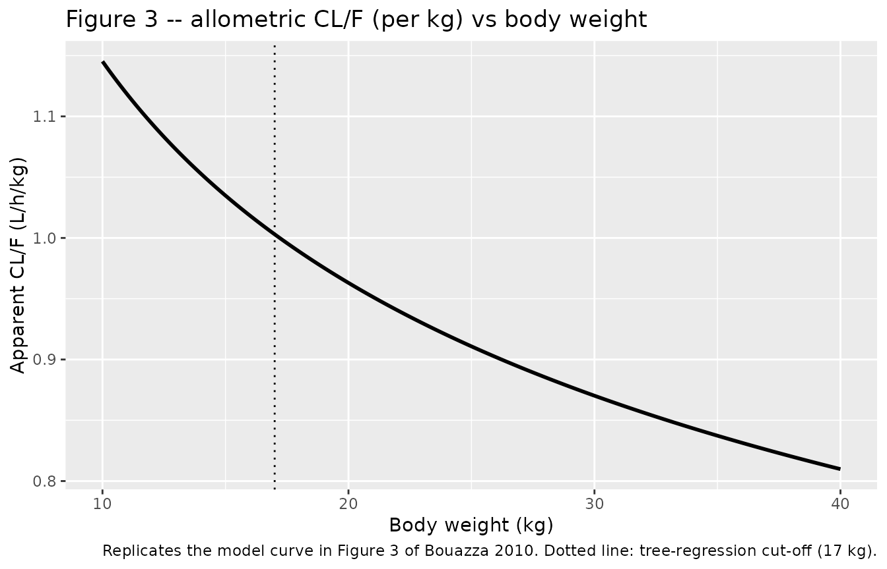
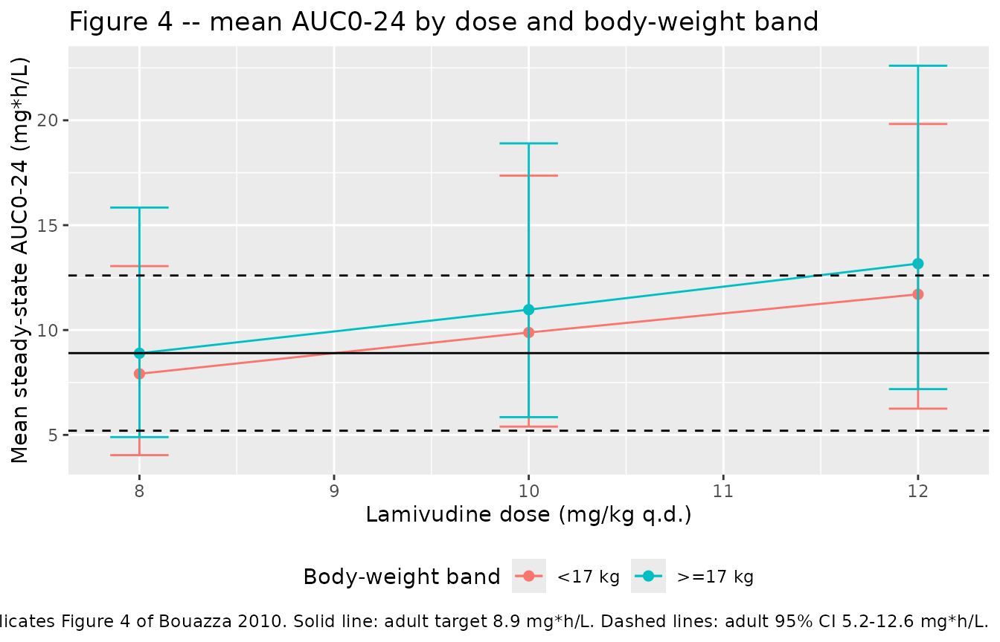

# Lamivudine (Bouazza 2010)

## Model and source

``` r

mod <- rxode2::rxode2(readModelDb("Bouazza_2010_lamivudine"))
#> ℹ parameter labels from comments will be replaced by 'label()'
```

- Citation: Bouazza N et al. Is the recommended once-daily dose of
  lamivudine optimal in West African HIV-infected children? *Antimicrob
  Agents Chemother*. 2010;54(9):3938-3943. <doi:10.1128/AAC.00306-10>
- Article: <https://doi.org/10.1128/AAC.00306-10>
- Trial: BURKINAME-ANRS 12103 (ClinicalTrials.gov NCT00122538)

## Population

The fit population was 45 antiretroviral-naive HIV-1 infected children
(17 girls, 28 boys; age 2.5-14 years, median 6.75 years; body weight
11-37 kg, median 16.8 kg) enrolled in the BURKINAME-ANRS 12103 trial in
Bobo-Dioulasso, Burkina Faso. All received once-daily oral lamivudine 8
mg/kg (median 150 mg, range 90-300 mg) as 150 mg tablet or 10 mg/mL
solution, co-administered with didanosine 240 mg/m^2 and weight-band
efavirenz. A total of 148 plasma lamivudine concentrations were
analysed. Baseline demographics and laboratory covariates (serum
creatinine, ALAT, ASAT, total bilirubin) are summarised in Table 1 of
the source.

The same fields are available programmatically:

``` r

mod$population
#> $species
#> [1] "human"
#> 
#> $n_subjects
#> [1] 45
#> 
#> $n_studies
#> [1] 1
#> 
#> $age_range
#> [1] "2.5-14 years (median 6.75)"
#> 
#> $age_median
#> [1] "6.75 years"
#> 
#> $weight_range
#> [1] "11-37 kg"
#> 
#> $weight_median
#> [1] "16.8 kg"
#> 
#> $sex_female_pct
#> [1] 38
#> 
#> $race_ethnicity
#> [1] "West African (sub-Saharan); ethnic stratification not reported in source."
#> 
#> $disease_state
#> [1] "Antiretroviral-naive HIV-1 infected children, CDC clinical stage A-C, with severe immunological / virological status meeting Burkina Faso HAART initiation criteria."
#> 
#> $dose_range
#> [1] "Lamivudine oral, 8 mg/kg once daily as 150 mg tablet or 10 mg/ml oral solution; median dose 150 mg (range 90-300 mg). Co-administered with didanosine 240 mg/m^2 q.d. and weight-band efavirenz q.d."
#> 
#> $regions
#> [1] "Burkina Faso (Bobo-Dioulasso); BURKINAME-ANRS 12103 trial (ClinicalTrials.gov NCT00122538)."
#> 
#> $n_observations
#> [1] 148
#> 
#> $notes
#> [1] "Forty-nine children enrolled, 45 evaluable for PK (17 girls / 28 boys). Sampling schedule: pre-dose, 1 h, 3 h post-dose (39 children) or pre-dose, 1, 2, 3, 6, 12, 24 h post-dose (10 children). Sampling began on day 15 of treatment for 38 children and between months 2-5 of treatment for 11 children -- assumed to be at steady state for the model. Demographics in Table 1 of the source."
```

## Structural model

The final model is a two-compartment model with first-order absorption.
Sampling in this trial did not capture the absorption phase, so Ka was
set equal to the distribution-phase eigenvalue (alpha) of the
disposition model. Ka was further fixed at 0.71 1/h, the value reported
in an earlier paediatric lamivudine PK study (Tremoulet et al.,
reference 17 of the source). With the final point estimates this
constraint is internally consistent: the disposition eigenvalues
computed from CL/F, Vc/F, Q/F, Vp/F at the cohort median weight are
alpha = 0.71 and beta = 0.059 1/h, so absorption and distribution rates
coincide as assumed.

After allometric scaling of CL/F, Q/F (exponent 0.75) and Vc/F, Vp/F
(exponent 1) to the cohort-median body weight of 16.8 kg, no further
covariate (age, serum creatinine, amylase, ALAT, ASAT, total bilirubin,
or formulation) reached the OFV cut-off of 6.63 units. Inter-subject
variability was retained only on CL/F and described by an exponential
model; residual variability was a multiplicative (proportional) error.

## Source trace

| Element | Value | Source location |
|----|----|----|
| Two-compartment ODE structure | n/a | Results “Population pharmacokinetics” paragraph 1 |
| Ka = alpha constraint | n/a | Methods “Modeling strategy” |
| Allometric exponents | 0.75, 1 | Methods “Modeling strategy” (theoretical values) |
| Reference body weight | 16.8 kg | Table 2 footer (“standardized for a median weight of 16.8 kg”) |
| Ka | 0.71 1/h | Table 2 (fixed; reference 17) |
| CL/F | 16.9 L/h | Table 2 |
| Vc/F | 30.8 L | Table 2 |
| Vp/F | 58.6 L | Table 2 |
| Q/F | 4.48 L/h | Table 2 |
| omega(CL/F) | 0.30 | Table 2 (interpreted as SD on log scale; see Assumptions) |
| sigma (proportional SD) | 0.60 | Table 2 (multiplicative error model) |

## Virtual cohort

``` r

set.seed(20100601)

n_sim <- 1000
# Body-weight distribution matched to Table 1 of the source:
# range 11-37 kg, median 16.8 kg. Use a truncated log-normal anchored on the
# median to approximate the right-skewed paediatric distribution without
# overstating tail weights.
wts <- rlnorm(n_sim, meanlog = log(16.8), sdlog = 0.30)
wts <- pmin(pmax(wts, 11), 37)

# Three weight strata for the dose-recommendation analyses:
#   "<17 kg"  - cohort median is 14 kg; recommended dose 10 mg/kg per source.
#   ">=17 kg" - recommended dose 8 mg/kg per source.
# The source's tree-regression cut-off was 17 kg.
make_cohort <- function(WTs, dose_mgkg, regimen_label, id_offset = 0L) {
  n <- length(WTs)
  ids <- id_offset + seq_len(n)
  obs_times <- seq(0, 24*7, by = 0.5)

  doses <- data.frame(
    id   = ids,
    time = 0,
    amt  = dose_mgkg * WTs,
    cmt  = "depot",
    evid = 1L
  )
  # Dose every 24 h for one week (steady state)
  dose_rows <- do.call(rbind, lapply(0:6, function(d) {
    out <- doses
    out$time <- d * 24
    out
  }))

  obs <- expand.grid(id = ids, time = obs_times)
  obs$amt <- 0
  obs$cmt <- NA
  obs$evid <- 0L

  evt <- dplyr::bind_rows(dose_rows, obs)
  evt$WT <- WTs[match(evt$id - id_offset, seq_len(n))]
  evt$regimen <- regimen_label
  evt[order(evt$id, evt$time, -evt$evid), ]
}

events <- dplyr::bind_rows(
  make_cohort(wts[wts <  17], dose_mgkg =  8, regimen_label = "<17 kg, 8 mg/kg q.d.",  id_offset =      0L),
  make_cohort(wts[wts <  17], dose_mgkg = 10, regimen_label = "<17 kg, 10 mg/kg q.d.", id_offset =  20000L),
  make_cohort(wts[wts >= 17], dose_mgkg =  8, regimen_label = ">=17 kg, 8 mg/kg q.d.", id_offset =  40000L)
)
stopifnot(!anyDuplicated(unique(events[, c("id", "time", "evid")])))
```

## Simulation

``` r

sim <- rxode2::rxSolve(mod, events = events, keep = c("regimen", "WT"))
sim <- as.data.frame(sim)
```

## Replicate published NCA – Table 3 (“This study” row)

Bouazza 2010 Table 3 reports per-cohort NCA values (geometric mean per
the narrative, although the row label is “Median (95% CI)” with IQR-like
spreads): Cmin = 0.04 mg/L (range 0.01-0.14), Cmax = 1.7 mg/L (range
1.34-2.01), AUC0-tau = 7.8 mg\*h/L (range 4.72-14.27), CL/F = 1.03
L/h/kg (range 0.55-1.62). These were computed at the
actually-administered dose of 8 mg/kg q.d., pooling all 45 children
regardless of body weight.

The block below reproduces the same NCA pooling all simulated subjects
on the 8 mg/kg q.d. regimen (the \< 17 kg and \>= 17 kg sub-cohorts
combined) so the comparison is dose- and regimen-matched.

``` r

last_dose <- 6 * 24
sim_ss <- sim |>
  dplyr::filter(time >= last_dose, time <= last_dose + 24,
                regimen %in% c("<17 kg, 8 mg/kg q.d.", ">=17 kg, 8 mg/kg q.d.")) |>
  dplyr::mutate(time = time - last_dose,
                regimen = "8 mg/kg q.d. (pooled)") |>
  dplyr::select(id, time, Cc, regimen, WT)

dose_df <- events |>
  dplyr::filter(evid == 1, time == last_dose,
                regimen %in% c("<17 kg, 8 mg/kg q.d.", ">=17 kg, 8 mg/kg q.d.")) |>
  dplyr::mutate(time = 0,
                regimen = "8 mg/kg q.d. (pooled)") |>
  dplyr::select(id, time, amt, regimen, WT)

conc_obj <- PKNCA::PKNCAconc(sim_ss, Cc ~ time | regimen + id)
dose_obj <- PKNCA::PKNCAdose(dose_df, amt ~ time | regimen + id)

intervals <- data.frame(
  start    = 0,
  end      = 24,
  cmax     = TRUE,
  tmax     = TRUE,
  cmin     = TRUE,
  auclast  = TRUE,
  cl.last  = TRUE
)

nca_res <- PKNCA::pk.nca(PKNCA::PKNCAdata(conc_obj, dose_obj, intervals = intervals))
nca_tbl <- as.data.frame(nca_res$result)

simulated_summary <- nca_tbl |>
  dplyr::filter(PPTESTCD %in% c("cmax", "cmin", "auclast", "cl.last")) |>
  dplyr::group_by(PPTESTCD) |>
  dplyr::summarise(
    median = stats::median(PPORRES, na.rm = TRUE),
    p05    = stats::quantile(PPORRES, 0.05, na.rm = TRUE),
    p95    = stats::quantile(PPORRES, 0.95, na.rm = TRUE),
    .groups = "drop"
  )

# CL/F per kg: PKNCA cl.last has units 1/h after dividing by AUC of
# dose-normalised concentration; convert to L/h/kg by dose / AUC / WT.
clf_per_kg <- nca_tbl |>
  dplyr::filter(PPTESTCD == "auclast") |>
  dplyr::left_join(
    dose_df |> dplyr::select(id, amt, WT) |> dplyr::distinct(),
    by = "id"
  ) |>
  dplyr::mutate(clf_kg = amt / PPORRES / WT) |>
  dplyr::summarise(
    median = stats::median(clf_kg, na.rm = TRUE),
    p05    = stats::quantile(clf_kg, 0.05, na.rm = TRUE),
    p95    = stats::quantile(clf_kg, 0.95, na.rm = TRUE)
  ) |>
  dplyr::mutate(PPTESTCD = "clf_kg") |>
  dplyr::select(PPTESTCD, dplyr::everything())

simulated_summary <- dplyr::bind_rows(simulated_summary, clf_per_kg)

published <- tibble::tibble(
  PPTESTCD = c("cmin",  "cmax",  "auclast", "clf_kg"),
  pub_value = c(0.04,    1.7,     7.8,       1.03),
  pub_range = c("0.01-0.14", "1.34-2.01", "4.72-14.27", "0.55-1.62")
)

comparison <- published |>
  dplyr::left_join(simulated_summary, by = "PPTESTCD") |>
  dplyr::transmute(
    Parameter      = PPTESTCD,
    `Published`    = paste0(pub_value, " (", pub_range, ")"),
    `Simulated`    = sprintf("%.3f (%.3f-%.3f)", median, p05, p95)
  )

knitr::kable(comparison,
             caption = "Simulated steady-state lamivudine NCA at 8 mg/kg q.d., pooled across the cohort body-weight range, vs Table 3 'This study' values.")
```

| Parameter | Published        | Simulated            |
|:----------|:-----------------|:---------------------|
| cmin      | 0.04 (0.01-0.14) | 0.041 (0.015-0.114)  |
| cmax      | 1.7 (1.34-2.01)  | 1.672 (1.318-2.053)  |
| auclast   | 7.8 (4.72-14.27) | 7.910 (4.814-13.138) |
| clf_kg    | 1.03 (0.55-1.62) | 1.011 (0.609-1.662)  |

Simulated steady-state lamivudine NCA at 8 mg/kg q.d., pooled across the
cohort body-weight range, vs Table 3 ‘This study’ values. {.table}

## Replicate Figure 3 – CL/F (L/h/kg) vs body weight

Figure 3 of the source plots apparent elimination clearance in L/h/kg
against body weight, with the line representing the allometric model
`CL/F per kg = CL_pop/WT_pop * (WT/WT_pop)^(0.75 - 1)`. The block below
reproduces the same curve using the typical-value model (`zeroRe()`)
over the cohort weight range.

``` r

wt_grid <- seq(10, 40, length.out = 200)
allom_clf_per_kg <- 16.9 / 16.8 * (wt_grid / 16.8)^(0.75 - 1)

ggplot(data.frame(WT = wt_grid, CLF_per_kg = allom_clf_per_kg),
       aes(WT, CLF_per_kg)) +
  geom_line(linewidth = 1) +
  geom_vline(xintercept = 17, linetype = 3) +
  labs(x = "Body weight (kg)",
       y = "Apparent CL/F (L/h/kg)",
       title = "Figure 3 -- allometric CL/F (per kg) vs body weight",
       caption = "Replicates the model curve in Figure 3 of Bouazza 2010. Dotted line: tree-regression cut-off (17 kg).")
```



## Replicate Figure 4 – mean AUC by dose, by weight band

Figure 4 of the source displays the mean lamivudine AUC0-24 obtained by
simulating 45,000 children (1,000 replicates of the database) at 8, 10,
and 12 mg/kg q.d., split into the two body-weight bands defined by the
tree-regression analysis. The horizontal line at AUC = 8.9 mg\*h/L is
the adult target.

``` r

# Add 12 mg/kg arms for both weight bands so the figure spans the published doses.
events_fig4 <- dplyr::bind_rows(
  events,
  make_cohort(wts[wts <  17], dose_mgkg = 12, regimen_label = "<17 kg, 12 mg/kg q.d.", id_offset =  60000L),
  make_cohort(wts[wts >= 17], dose_mgkg = 10, regimen_label = ">=17 kg, 10 mg/kg q.d.", id_offset =  80000L),
  make_cohort(wts[wts >= 17], dose_mgkg = 12, regimen_label = ">=17 kg, 12 mg/kg q.d.", id_offset = 100000L)
)
stopifnot(!anyDuplicated(unique(events_fig4[, c("id", "time", "evid")])))

sim_fig4 <- as.data.frame(
  rxode2::rxSolve(mod, events = events_fig4, keep = c("regimen", "WT"))
)

auc_summary <- sim_fig4 |>
  dplyr::filter(time >= last_dose, time <= last_dose + 24) |>
  dplyr::mutate(time = time - last_dose) |>
  dplyr::group_by(regimen, id) |>
  dplyr::summarise(
    AUC024 = sum(diff(time) * (utils::head(Cc, -1) + utils::tail(Cc, -1)) / 2),
    .groups = "drop"
  ) |>
  tidyr::separate(regimen, into = c("band", "dose"), sep = ", ", remove = FALSE) |>
  dplyr::mutate(dose_mgkg = as.numeric(sub(" mg/kg q.d.", "", dose)))

auc_band <- auc_summary |>
  dplyr::group_by(band, dose_mgkg) |>
  dplyr::summarise(
    AUC_mean = mean(AUC024),
    AUC_lo   = stats::quantile(AUC024, 0.025),
    AUC_hi   = stats::quantile(AUC024, 0.975),
    .groups  = "drop"
  )

ggplot(auc_band, aes(dose_mgkg, AUC_mean, colour = band, group = band)) +
  geom_point(size = 2) +
  geom_line() +
  geom_errorbar(aes(ymin = AUC_lo, ymax = AUC_hi), width = 0.3) +
  geom_hline(yintercept = 8.9, linetype = 1) +
  geom_hline(yintercept = c(5.2, 12.6), linetype = 2) +
  labs(x = "Lamivudine dose (mg/kg q.d.)",
       y = "Mean steady-state AUC0-24 (mg*h/L)",
       colour = "Body-weight band",
       title = "Figure 4 -- mean AUC0-24 by dose and body-weight band",
       caption = paste("Replicates Figure 4 of Bouazza 2010. Solid line: adult target 8.9 mg*h/L.",
                       "Dashed lines: adult 95% CI 5.2-12.6 mg*h/L.")) +
  theme(legend.position = "bottom")
```



## Assumptions and deviations

- **Omega and sigma scale.** Bouazza 2010 Table 2 reports the
  random-effect point estimates as `omega(CL/F) = 0.30` and
  `sigma = 0.60` without explicit annotation of whether they are SDs or
  variances. The same author group’s follow-up Bouazza 2011 *Antimicrob
  Agents Chemother* paper (PMID 21576437) on lamivudine in 580 children
  reports `omega CL/F = 0.32` in Table 1, paired with `(32%)` in the
  abstract – i.e. the omega is the SD on the log scale (approximately CV
  when small). This vignette adopts the same convention for the 2010
  fit: `omega(CL/F) = 0.30` is encoded as variance `0.30^2 = 0.09` on
  the nlmixr2 `etalcl` line, and `sigma = 0.60` is encoded as the
  proportional SD `propSd <- 0.60`. The published Cmax, Cmin, and AUC
  ranges in Table 3 are reproduced under this reading (see the NCA
  comparison above).
- **Ka structurally fixed.** Ka was fixed to 0.71 1/h per the source,
  taken from a prior paediatric lamivudine study (Tremoulet et al.,
  reference 17 of the source). The literature value also coincides with
  the alpha disposition eigenvalue implied by the fitted CL/F, Q/F,
  Vc/F, Vp/F, so the “Ka = alpha” structural constraint is
  self-consistent. The packaged model encodes Ka as `fixed(log(0.71))`.
- **Body-weight distribution.** The original individual covariates are
  not publicly available. The virtual cohort uses a log-normal weight
  distribution anchored on the cohort median (16.8 kg) and clipped to
  the source range (11-37 kg). The \< 17 kg and \>= 17 kg strata
  reproduce the tree-regression groups described in Results.
- **Steady-state simulation.** The source PK study was conducted between
  day 15 and month 5 of treatment; observations were treated as steady
  state in the model fit. The vignette reproduces this by simulating six
  daily doses before the analysis interval.
- **Galenic form not encoded.** Bouazza 2010 tested an oral-tablet vs
  oral-solution effect on bioavailability and found no significant
  difference; the packaged model therefore does not carry a formulation
  covariate.
- **No covariate beyond body weight.** After allometric scaling, age and
  the biological covariates (serum creatinine, amylase, ALAT, ASAT,
  total bilirubin) did not improve the model. They are not part of the
  packaged model.
