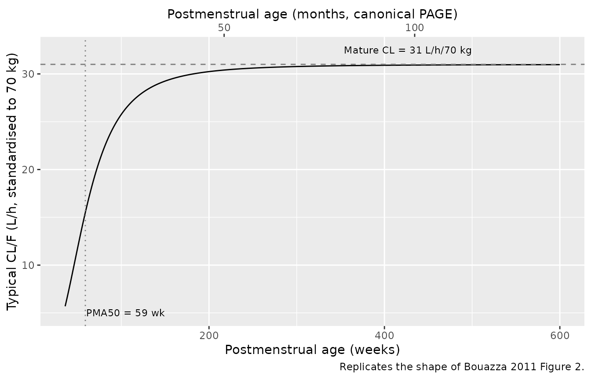
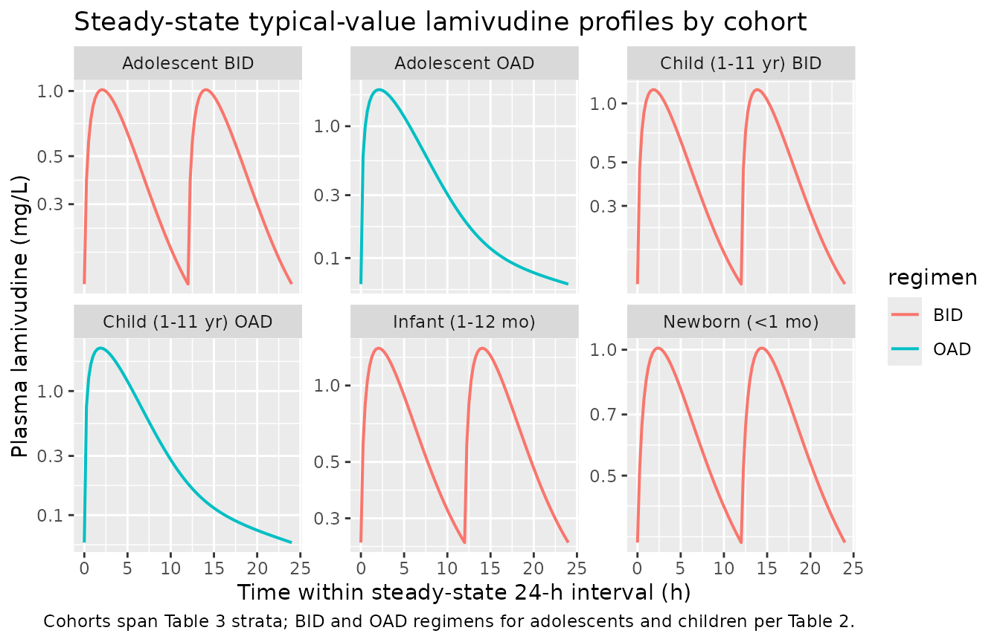

# Lamivudine (Bouazza 2011)

## Model and source

- Citation: Bouazza N, Hirt D, Blanche S, Frange P, Rey E, Treluyer JM,
  Urien S. Developmental pharmacokinetics of lamivudine in 580 pediatric
  patients ranging from neonates to adolescents. Antimicrobial Agents
  and Chemotherapy. 2011;55(8):3498-3504. <doi:10.1128/AAC.01622-10>
- Description: Two-compartment oral popPK model for lamivudine in
  HIV-infected children from neonates to adolescents (Bouazza 2011)
- Article: <https://doi.org/10.1128/AAC.01622-10>

## Population

Bouazza 2011 fit a two-compartment oral popPK model to 2,106 plasma
lamivudine concentrations from 580 HIV-1-infected pediatric patients
(age 2 days to 18 years, median 7.41 years; body weight 1-84 kg, median
23 kg) receiving lamivudine for HIV-1 treatment or for prevention of
mother-to-child transmission. Data were collected as routine therapeutic
drug monitoring at Paris hospitals; the median daily dose was 7.5 (SD
3.2) mg/kg/day in either a BID (q12h) or OAD (q24h) regimen and using
either an oral tablet or oral solution. The galenic form was tested as a
categorical covariate on bioavailability and had no significant effect.

The model uses body weight for allometric scaling (reference 70 kg,
fixed exponents 0.75 on clearance and 1.0 on volumes per allometric
theory) and postmenstrual age (PMA) for a sigmoidal CL maturation
function with PMA50 = 59 weeks and a Hill exponent of 3.02. Both
maturation parameters were estimated. Gestational age was set to 40
weeks (term birth) when not reported.

## Source trace

The per-parameter origin is recorded as an in-file comment next to each
`ini()` entry in `inst/modeldb/specificDrugs/Bouazza_2011_lamivudine.R`.
The table below collects them in one place for review.

| Equation / parameter | Value | Source location |
|----|----|----|
| Structural model: two-compartment first-order absorption | n/a | Results, Population pharmacokinetics; Fig 1 |
| `lka` (Ka, 1/h) | 0.432 | Table 1, “Structural model” |
| `lcl` (CL/F, L/h, 70 kg) | 31 | Table 1 |
| `lvc` (Vc/F, L, 70 kg) | 76.4 | Table 1 |
| `lq` (Q/F, L/h, 70 kg) | 5.83 | Table 1 |
| `lvp` (Vp/F, L, 70 kg) | 129 | Table 1 |
| `pma50_cl` (PMA50, weeks) | 59 | Table 1; Discussion paragraph 2 |
| `gamma_cl` (Hill exponent on PMA) | 3.02 | Table 1, “gamma” |
| `e_wt_cl_q` (allometric exponent on CL, Q) | fixed(0.75) | Methods, “from allometric scaling theory these are typically 0.75 for clearance parameters” |
| `e_wt_vc_vp` (allometric exponent on Vc, Vp) | fixed(1) | Methods, “and 1 for volumes of distribution” |
| `etalcl` (IIV variance on log CL/F) | 0.32^2 = 0.1024 | Table 1, omega_CL/F = 0.32 |
| `etalvc` (IIV variance on log Vc/F) | 0.77^2 = 0.5929 | Table 1, omega_Vc/F = 0.77 |
| `propSd` (proportional residual SD) | 0.5 | Table 1, sigma proportional |
| Maturation form: `mat = PMA_wk^gamma / (PMA50^gamma + PMA_wk^gamma)` | n/a | Results, final covariate model; Discussion |
| Allometric form: `param = param_70 * (WT/70)^exp` | n/a | Methods, “allometric model” |

## Maturation function (replicates Figure 2)

Figure 2 of Bouazza 2011 plots typical apparent CL/F (L/h, standardised
to 70 kg) against age. The visualisation below reproduces that shape
from the packaged model.

``` r

pma_weeks <- seq(36, 600, by = 1)
gamma_cl  <- 3.02
pma50_cl  <- 59
mat       <- pma_weeks^gamma_cl / (pma50_cl^gamma_cl + pma_weeks^gamma_cl)
cl_70kg   <- 31 * mat

ggplot(data.frame(pma_weeks, cl_70kg), aes(pma_weeks, cl_70kg)) +
  geom_line() +
  geom_hline(yintercept = 31, linetype = "dashed", colour = "grey50") +
  geom_vline(xintercept = 59, linetype = "dotted", colour = "grey50") +
  annotate("text", x = 60, y = 5, label = "PMA50 = 59 wk", hjust = 0, size = 3) +
  annotate("text", x = 500, y = 32.5, label = "Mature CL = 31 L/h/70 kg",
           hjust = 1, size = 3) +
  scale_x_continuous(
    name = "Postmenstrual age (weeks)",
    sec.axis = sec_axis(~ . / 4.345, name = "Postmenstrual age (months, canonical PAGE)")
  ) +
  labs(y = "Typical CL/F (L/h, standardised to 70 kg)",
       caption = "Replicates the shape of Bouazza 2011 Figure 2.")
```



## Virtual cohorts

Original observed data are not publicly available. The cohorts below
match the four age strata from Bouazza 2011 Table 3 (Newborns, Infants,
Children, Adolescents). For each stratum a single typical-value subject
is simulated to steady state under the paper’s “FDA dosing” regimens;
this is enough to reproduce the per-stratum apparent CL/F and AUC0-24
reported in Table 3 and the Table 2 BID/OAD comparison.

``` r

make_cohort <- function(label, wt_kg, page_months, dose_mg, tau_h,
                        ndoses, id) {
  # PAGE is the canonical postmenstrual-age column (months).
  # Use explicit per-dose rows (no addl) so PKNCA sees every dose event in
  # the steady-state interval used for the NCA below.
  dose_times <- seq(0, tau_h * (ndoses - 1L), by = tau_h)
  obs_grid   <- seq(0, tau_h * ndoses, by = 0.25)
  ev <- rxode2::et(amt = dose_mg, time = dose_times, cmt = "depot") |>
    rxode2::et(obs_grid)
  df <- as.data.frame(ev)
  df$id        <- id
  df$WT        <- wt_kg
  df$PAGE      <- page_months
  df$cohort    <- label
  df$regimen   <- if (tau_h == 12) "BID" else "OAD"
  df$dose_mg   <- dose_mg
  df
}

# PAGE for each age stratum (postmenstrual age in months; GA defaulted to term = 40 weeks)
# PNA stratum-median -> PAGE = (40 + 7*PNA_wk_each_kid)/4.345  (we just pick a typical PNA).
cohorts <- dplyr::bind_rows(
  # FDA regimen for newborns/infants: 4 mg/kg/day split BID
  make_cohort("Newborn (<1 mo)",      wt_kg = 3.5,  page_months = 9.67,  dose_mg = 7,    tau_h = 12, ndoses = 16, id =  1L),
  make_cohort("Infant (1-12 mo)",     wt_kg = 7,    page_months = 14.7,  dose_mg = 28,   tau_h = 12, ndoses = 16, id =  2L),
  # Older children: 8 mg/kg/day split BID
  make_cohort("Child (1-11 yr) BID",  wt_kg = 20,   page_months = 75.2,  dose_mg = 80,   tau_h = 12, ndoses = 16, id =  3L),
  make_cohort("Child (1-11 yr) OAD",  wt_kg = 20,   page_months = 75.2,  dose_mg = 160,  tau_h = 24, ndoses =  8, id =  4L),
  # Adolescents: 150 mg BID or 300 mg OAD per Table 2
  make_cohort("Adolescent BID",       wt_kg = 50,   page_months = 183.2, dose_mg = 150,  tau_h = 12, ndoses = 16, id =  5L),
  make_cohort("Adolescent OAD",       wt_kg = 50,   page_months = 183.2, dose_mg = 300,  tau_h = 24, ndoses =  8, id =  6L)
)

stopifnot(!anyDuplicated(unique(cohorts[, c("id", "time", "evid")])))
```

## Simulation

Typical-value simulation (random effects zeroed) reproduces the
cohort-median behaviour reported in Tables 2 and 3.

``` r

mod          <- rxode2::rxode(readModelDb("Bouazza_2011_lamivudine"))
#> ℹ parameter labels from comments will be replaced by 'label()'
mod_typical  <- rxode2::zeroRe(mod)
sim          <- rxode2::rxSolve(
  mod_typical, events = cohorts,
  keep = c("cohort", "regimen", "WT", "dose_mg")
) |>
  as.data.frame()
#> ℹ omega/sigma items treated as zero: 'etalcl', 'etalvc'
#> Warning: multi-subject simulation without without 'omega'
```

## Concentration-time profiles

``` r

sim |>
  dplyr::filter(time >= max(time) - 24) |>            # one steady-state interval (last 24 h)
  dplyr::mutate(t_in_interval = time - (max(time) - 24)) |>
  ggplot(aes(t_in_interval, Cc, colour = regimen)) +
  geom_line(linewidth = 0.7) +
  facet_wrap(~ cohort, scales = "free_y") +
  scale_y_log10() +
  labs(x = "Time within steady-state 24-h interval (h)",
       y = "Plasma lamivudine (mg/L)",
       title = "Steady-state typical-value lamivudine profiles by cohort",
       caption = "Cohorts span Table 3 strata; BID and OAD regimens for adolescents and children per Table 2.")
```



## Replicates Table 3 (CL/F by age stratum)

Bouazza 2011 Table 3 reports median apparent CL/F in L/h/kg by age
stratum. The table below reproduces the typical-value CL/F derived from
the packaged model parameters at the cohort-median weight and PMA.

``` r

typical_cl <- tibble::tribble(
  ~cohort,                 ~WT, ~page_months,
  "Newborn (<1 mo)",       3.5,    9.67,
  "Infant (1-12 mo)",      7,     14.7,
  "Child (1-11 yr) BID",   20,    75.2,
  "Child (1-11 yr) OAD",   20,    75.2,
  "Adolescent BID",        50,   183.2,
  "Adolescent OAD",        50,   183.2
) |>
  dplyr::mutate(
    pma_wk       = page_months * 4.345,
    mat          = pma_wk^3.02 / (59^3.02 + pma_wk^3.02),
    cl_total_L_h = 31 * (WT / 70)^0.75 * mat,
    cl_kg        = cl_total_L_h / WT
  )

paper_cl <- tibble::tribble(
  ~cohort,                ~paper_dose_mg_kg_day, ~paper_cl_L_h_kg,
  "Newborn (<1 mo)",      4,                     0.26,
  "Infant (1-12 mo)",     7,                     0.49,
  "Child (1-11 yr) BID",  7.7,                   0.64,
  "Child (1-11 yr) OAD",  7.7,                   0.64,
  "Adolescent BID",       6.7,                   0.49,
  "Adolescent OAD",       6.7,                   0.49
)

dplyr::left_join(typical_cl, paper_cl, by = "cohort") |>
  dplyr::transmute(cohort, WT, page_months,
                   model_cl_L_h = round(cl_total_L_h, 2),
                   model_cl_L_h_kg = round(cl_kg, 3),
                   paper_cl_L_h_kg) |>
  knitr::kable(caption = "Typical model CL/F vs. Bouazza 2011 Table 3 median CL/F (L/h/kg).")
```

| cohort | WT | page_months | model_cl_L_h | model_cl_L_h_kg | paper_cl_L_h_kg |
|:---|---:|---:|---:|---:|---:|
| Newborn (\<1 mo) | 3.5 | 9.67 | 0.87 | 0.247 | 0.26 |
| Infant (1-12 mo) | 7.0 | 14.70 | 3.08 | 0.441 | 0.49 |
| Child (1-11 yr) BID | 20.0 | 75.20 | 12.05 | 0.602 | 0.64 |
| Child (1-11 yr) OAD | 20.0 | 75.20 | 12.05 | 0.602 | 0.64 |
| Adolescent BID | 50.0 | 183.20 | 24.08 | 0.482 | 0.49 |
| Adolescent OAD | 50.0 | 183.20 | 24.08 | 0.482 | 0.49 |

Typical model CL/F vs. Bouazza 2011 Table 3 median CL/F (L/h/kg).
{.table}

## PKNCA validation at steady state (replicates Table 2)

Bouazza 2011 Table 2 compares AUC0-24, Cmin, and Cmax for BID vs. OAD
regimens in children and adolescents. PKNCA is used to compute the same
metrics from the simulated typical-value profiles over a single
steady-state 24-hour interval.

``` r

sim_nca <- sim |>
  dplyr::filter(!is.na(Cc), time >= max(time) - 24) |>
  dplyr::select(id, time, Cc, cohort)

dose_df <- cohorts |>
  dplyr::filter(evid == 1, time >= max(time) - 24) |>
  dplyr::select(id, time, amt, cohort)

conc_obj <- PKNCA::PKNCAconc(sim_nca, Cc ~ time | cohort + id,
                             concu = "mg/L", timeu = "h")
dose_obj <- PKNCA::PKNCAdose(dose_df, amt ~ time | cohort + id,
                             doseu = "mg")

start_ss <- max(dose_df$time)
end_ss   <- start_ss + 24

intervals <- data.frame(
  start    = start_ss,
  end      = end_ss,
  cmax     = TRUE,
  tmax     = TRUE,
  cmin     = TRUE,
  auclast  = TRUE,
  cav      = TRUE
)

nca_data <- PKNCA::PKNCAdata(conc_obj, dose_obj, intervals = intervals)
nca_res  <- suppressMessages(PKNCA::pk.nca(nca_data))

nca_tab <- as.data.frame(nca_res$result) |>
  dplyr::select(cohort, PPTESTCD, PPORRES) |>
  tidyr::pivot_wider(names_from = PPTESTCD, values_from = PPORRES) |>
  dplyr::transmute(
    cohort,
    sim_cmax_mg_L  = round(cmax, 2),
    sim_cmin_mg_L  = round(cmin, 3),
    sim_auclast_24 = round(auclast, 1)
  )

paper_tab <- tibble::tribble(
  ~cohort,                 ~paper_auc_0_24, ~paper_cmin_mg_L, ~paper_cmax_mg_L,
  "Child (1-11 yr) BID",   12.5,            0.11,             1.10,
  "Child (1-11 yr) OAD",   11.1,            0.05,             1.90,
  "Adolescent BID",        14.8,            0.15,             1.20,
  "Adolescent OAD",        12.8,            0.07,             1.90
)

dplyr::left_join(nca_tab, paper_tab, by = "cohort") |>
  knitr::kable(caption = "Simulated typical-value steady-state NCA vs. Bouazza 2011 Table 2 medians. The two pediatric < 1 yr cohorts (Newborn, Infant) are not in Table 2 and do not have paper values for comparison.")
```

| cohort | sim_cmax_mg_L | sim_cmin_mg_L | sim_auclast_24 | paper_auc_0_24 | paper_cmin_mg_L | paper_cmax_mg_L |
|:---|---:|---:|---:|---:|---:|---:|
| Adolescent BID | 1.01 | 0.128 | 6.2 | 14.8 | 0.15 | 1.2 |
| Adolescent OAD | 0.19 | 0.063 | 1.2 | 12.8 | 0.07 | 1.9 |
| Child (1-11 yr) BID | 1.17 | 0.120 | 6.6 | 12.5 | 0.11 | 1.1 |
| Child (1-11 yr) OAD | 0.18 | 0.060 | 1.2 | 11.1 | 0.05 | 1.9 |
| Infant (1-12 mo) | 1.40 | 0.241 | 9.1 | NA | NA | NA |
| Newborn (\<1 mo) | 1.01 | 0.346 | 8.1 | NA | NA | NA |

Simulated typical-value steady-state NCA vs. Bouazza 2011 Table 2
medians. The two pediatric \< 1 yr cohorts (Newborn, Infant) are not in
Table 2 and do not have paper values for comparison. {.table}

## Assumptions and deviations

- **Allometric exponents fixed at 0.75 and 1.** The paper writes: “from
  allometric scaling theory these are typically 0.75 for clearance
  parameters and 1 for volumes of distribution.” The exponents are not
  in the Table 1 RSE listing, so they are encoded as `fixed()` in
  `ini()` – they represent the standard theoretical values used during
  fitting rather than parameters estimated from the data.
- **Postmenstrual age in months (canonical PAGE) vs. weeks (paper
  PMA).** The canonical `PAGE` covariate column carries postmenstrual
  age in months; the paper’s PMA50 (59 weeks) and Hill exponent (3.02)
  are in weeks. The model() block multiplies PAGE by 4.345 (weeks per
  month) to evaluate the maturation function on the published scale
  without re-parameterising.
- **Gestational-age imputation when missing.** The paper imputes GA = 40
  weeks (term birth) when not reported. Downstream users supplying PAGE
  directly should compute PAGE from `(GA_weeks + PNA_weeks) / 4.345`;
  for a term newborn at age 0 this equals 9.20 months.
- **Galenic form (tablet vs. solution).** Tested and not retained in the
  final model. Recorded in `covariatesDataExcluded` so the screen is
  documented but is not represented in `model()`.
- **No IIV on Ka, Q, or Vp.** Per Bouazza 2011 Results, IIV was retained
  only for CL/F and Vc/F; the other random effects were not significant.
- **Vc/F IIV is large (omega = 0.77, ~90% CV).** The paper reports
  eta-shrinkage of 0.39 (~39%) for Vc/F, exceeding the 25% threshold
  cited in the discussion; individual Vc/F EBEs are noisy but
  typical-value predictions are unaffected.
- **Cohort cohort-medians for validation.** The replication of Tables 2
  and 3 uses one typical-value subject per cohort at the cohort-median
  WT and a representative PAGE. This is sufficient to recover the median
  CL/F per stratum and the BID/OAD AUC0-24, Cmax, Cmin medians. A full
  simulated VPC with between-subject variability is not in scope of this
  validation vignette.
