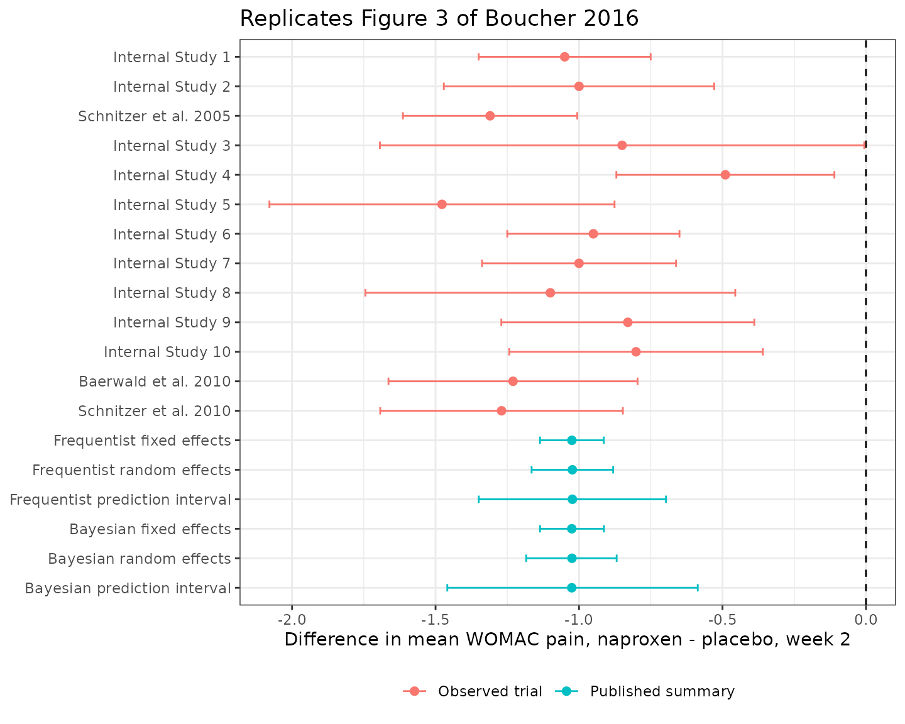
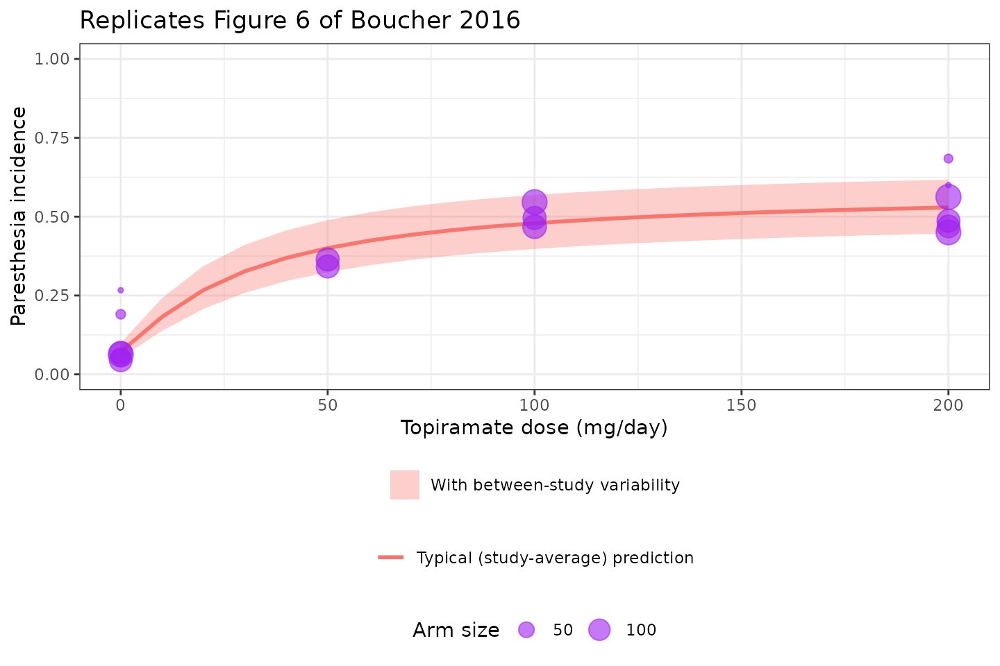

# Landmark model-based meta-analysis: naproxen WOMAC pain and topiramate paresthesia (Boucher 2016)

## Models and source

- Citation: Boucher M, Bennetts M. The Many Flavors of Model-Based
  Meta-Analysis: Part I-Introduction and Landmark Data. CPT
  Pharmacometrics Syst Pharmacol. 2016 Feb;5(2):54-64.
  <doi:10.1002/psp4.12041>. Structural model: ‘Models for binary data’
  section (binomial likelihood and the displayed logit equation), and
  the Supplementary Materials NONMEM control stream (\$PRED block of
  PSP4-5-54-s006.txt) and OpenBUGS model (PSP4-5-54-s005.txt), which
  agree exactly. Parameter values: Table 1, ‘Frequentist approach’
  column. Included trials, arm sizes and event counts: Supplementary
  Materials Table 2, supplied as the dataset PSP4-5-54-s008.csv.
- Article: <https://doi.org/10.1002/psp4.12041>

This is Part I of Boucher and Bennetts’ model-based meta-analysis (MBMA)
tutorial series, and it carries **two independent worked examples** on
two different drugs. Both are *landmark* analyses – each trial
contributes a single summary number at a single timepoint – which is
what distinguishes this paper from its sequel, the longitudinal
time-course model in `vignette("Boucher_2018_naproxen_mbma")`.

The paper produced two model files, extracted here as a pair:

| Model | Drug | Endpoint | Shape |
|----|----|----|----|
| `Boucher_2016_naproxen_mbma` | naproxen 500 mg b.i.d. | WOMAC pain (0-20), week 2 | random-effects meta-regression of a within-trial **difference** |
| `Boucher_2016_topiramate_mbma` | topiramate 0-200 mg/day | paresthesia incidence | logistic **Emax dose-response** on the arm rate |

Both are fitted twice in the source – once by a frequentist tool
(metafor or NONMEM) and once in a Bayesian one (OpenBUGS) – and the
model files encode the **frequentist** estimates. The Bayesian
counterparts are quoted throughout for contrast.

``` r

naproxen   <- readModelDb("Boucher_2016_naproxen_mbma")
topiramate <- readModelDb("Boucher_2016_topiramate_mbma")
```

## Population

Neither example is a conventional population-PK cohort: in an MBMA the
unit of observation is a **published trial (or trial arm)**, not a
patient, and the source reports only what those trials published.

**Naproxen / WOMAC pain.** 13 double-blind, placebo-controlled,
randomized parallel-group trials in osteoarthritis of the knee or hip,
each containing both a naproxen 500 mg twice-daily arm and a placebo
arm. Nine used a *flare* design (subjects were washed out of their pain
medications and had to show a predefined increase in pain to be eligible
for randomization) and four did not. Ten of the 13 were internal
unpublished trials. The endpoint is the WOMAC pain subscale: five
questions each scored 0 (no pain) to 4 (maximum pain), summed to a total
between 0 and 20. Arm sizes are never reported, only each trial’s
treatment difference and that difference’s standard error.

**Topiramate / paresthesia.** Six randomized placebo-controlled episodic
migraine prophylaxis trials contributing 17 arms and 1650 subjects, at
daily doses of 0, 50, 100 and 200 mg. The endpoint is a *safety* one –
the incidence of paresthesia, topiramate’s commonest dose-limiting
adverse event. The source explains the motivation: this was part of a
larger exercise to characterise topiramate’s therapeutic index as a
benchmark for a new compound. Demographics are not reported for either
pooled cohort.

## Source trace

Every `ini()` value, with the exact source location. Values marked
*Supplement (code)* come from the authors’ own printed model output,
which they embedded as comments in the R script distributed with the
article – these are estimates the article’s body never prints in full.

### `Boucher_2016_naproxen_mbma`

| Item | Value | Source location |
|----|----|----|
| Structural equation | `theta_i = theta + theta_FL * F_i + e_i` | “Model descriptions” \> “Meta-regression model”; OpenBUGS `linebugs_MR` in Supplementary Materials |
| Within-study error treated as known | `e_i ~ N(0, SE_i^2)` | “Fixed effects model” paragraph; OpenBUGS `prec.y[i] <- 1/(se_wp[i]*se_wp[i])` |
| `e0` | -0.92 | Supplement (code), printed metafor output `# -0.92 (-1.20, -0.63)` |
| `e_flare_e0` | -0.14 | Supplement (code) `# FLARE: -0.14 (-0.47, 0.18)`; also main text “WOMAC PAIN RESULTS” |
| `eta_study_e0` | 0.1371^2 | Supplement (code), printed metafor output `# tau: 0.1371` |
| `addSd` | `fixed(1)` | Not estimated – the residual SD is each study’s own reported SE |
| Trial-level data | 13 rows | Supplementary Materials Table 1 |

### `Boucher_2016_topiramate_mbma`

| Item | Value | Source location |
|----|----|----|
| Structural equation | `logit(p) = E0 + eta_study + Emax*DOSE/(ED50+DOSE)` | “Models for binary data”; NONMEM `$PRED` and OpenBUGS model in Supplementary Materials (identical) |
| Likelihood | `Y_ij ~ Binomial(N_ij, p_ij)` | “Models for binary data” |
| `e0` | -2.56 | Table 1, row E0, frequentist column |
| `emax` | 2.91 | Table 1, row Emax, frequentist column |
| `ed50` | 17.5 mg/day | Table 1, row ED50, frequentist column |
| `eta_study_e0` | 0.17^2 | Table 1, row sigma, frequentist column |
| `addSd_prob_paresthesia` | `fixed(0.001)` | **Not from source** – placeholder; see Assumptions |
| Arm-level data | 17 rows | Supplementary Materials Table 2 |

The published NONMEM variance-covariance matrix (`Var(Emax) = 0.0302`,
`Var(ED50) = 8.58`, `cov(Emax,ED50) = 0.0453`), quoted in the
supplementary R script, is used in the delta-method check below.

## Example 1: naproxen WOMAC pain

### Observed data

The 13 trials, reproduced verbatim from Supplementary Materials Table 1.
A negative difference is a benefit (less pain on naproxen than on
placebo).

``` r

womac <- data.frame(
  study = c(
    "Internal Study 1", "Internal Study 2", "Schnitzer et al. 2005",
    "Internal Study 3", "Internal Study 4", "Internal Study 5",
    "Internal Study 6", "Internal Study 7", "Internal Study 8",
    "Internal Study 9", "Internal Study 10", "Baerwald et al. 2010",
    "Schnitzer et al. 2010"
  ),
  diff  = c(-1.05, -1.00, -1.31, -0.85, -0.49, -1.4776, -0.95,
            -1.00, -1.10, -0.83, -0.80138, -1.23, -1.27),
  se    = c(0.15286355, 0.240382899, 0.155, 0.430584752, 0.193841827,
            0.306810629, 0.153106025, 0.172512467, 0.328823661,
            0.224907827, 0.225344503, 0.221452026, 0.215696546),
  FLARE = c(1, 0, 1, 1, 0, 0, 1, 1, 0, 1, 1, 1, 1)
)
knitr::kable(
  womac |>
    dplyr::rename(
      "Study" = study, "Naproxen - placebo" = diff,
      "SE" = se, "Flare design" = FLARE
    ),
  digits = 4
)
```

| Study                 | Naproxen - placebo |     SE | Flare design |
|:----------------------|-------------------:|-------:|-------------:|
| Internal Study 1      |            -1.0500 | 0.1529 |            1 |
| Internal Study 2      |            -1.0000 | 0.2404 |            0 |
| Schnitzer et al. 2005 |            -1.3100 | 0.1550 |            1 |
| Internal Study 3      |            -0.8500 | 0.4306 |            1 |
| Internal Study 4      |            -0.4900 | 0.1938 |            0 |
| Internal Study 5      |            -1.4776 | 0.3068 |            0 |
| Internal Study 6      |            -0.9500 | 0.1531 |            1 |
| Internal Study 7      |            -1.0000 | 0.1725 |            1 |
| Internal Study 8      |            -1.1000 | 0.3288 |            0 |
| Internal Study 9      |            -0.8300 | 0.2249 |            1 |
| Internal Study 10     |            -0.8014 | 0.2253 |            1 |
| Baerwald et al. 2010  |            -1.2300 | 0.2215 |            1 |
| Schnitzer et al. 2010 |            -1.2700 | 0.2157 |            1 |

### Typical-value check

With the between-study random effect zeroed, the model must return the
published meta-regression intercept for a non-flare trial and
intercept + flare coefficient for a flare trial.

``` r

napTypical <- rxode2::rxSolve(
  rxode2::zeroRe(naproxen),
  data.frame(id = 1:2, time = 0, FLARE = c(0, 1), evid = 0, amt = 0),
  returnType = "data.frame"
)
#> ℹ omega/sigma items treated as zero: 'eta_study_e0'
#> Warning: multi-subject simulation without without 'omega'

stopifnot(
  # Exact: these two sides use the same fixed effects, so the only
  # difference is floating-point representation. A tight bound is correct.
  abs(napTypical$Cc[napTypical$FLARE == 0] - (-0.92)) < 1e-8,
  abs(napTypical$Cc[napTypical$FLARE == 1] - (-1.06)) < 1e-8
)

knitr::kable(
  data.frame(
    Design = c("Non-flare", "Flare"),
    Model = napTypical$Cc,
    Published = c(-0.92, -0.92 + -0.14)
  ),
  digits = 4, caption = "Typical week-2 naproxen - placebo WOMAC difference."
)
```

| Design    | Model | Published |
|:----------|------:|----------:|
| Non-flare | -0.92 |     -0.92 |
| Flare     | -1.06 |     -1.06 |

Typical week-2 naproxen - placebo WOMAC difference. {.table}

### Between-study variability

The model’s random effect describes how the *treatment difference
itself* varies from trial to trial. Simulating a cohort of hypothetical
non-flare trials must recover the published between-study SD of 0.1371.

``` r

rxode2::rxSetSeed(20260915)
nStudy <- 200L

napSim <- rxode2::rxSolve(
  naproxen,
  data.frame(id = seq_len(nStudy), time = 0, FLARE = 0, evid = 0, amt = 0),
  returnType = "data.frame"
)

# Assert on the CENTRE and on a robust spread statistic, not on the extremes
# of a random cohort -- see the repository note on cohort assertions.
stopifnot(
  abs(mean(napSim$Cc) - (-0.92)) < 0.05,
  abs(sd(napSim$Cc) - 0.1371) < 0.05
)

cat(sprintf(
  "Simulated %d non-flare trials: mean %.4f (published -0.92), SD %.4f (published 0.1371)\n",
  nStudy, mean(napSim$Cc), sd(napSim$Cc)
))
#> Simulated 200 non-flare trials: mean -0.9202 (published -0.92), SD 0.1300 (published 0.1371)
```

### Replicating Figure 3

Figure 3 of the source is a forest plot of the 13 observed differences
with the fixed-effects estimate, the random-effects estimate and the
prediction interval appended. The published summary rows are reproduced
here alongside the observed trials.

``` r

# The frequentist FIXED-effects estimate is the only summary row the source
# never prints numerically, but it is a closed-form inverse-variance weighted
# mean of the published data, so it is recomputed here exactly.
wFe <- 1 / womac$se^2
feEst <- sum(wFe * womac$diff) / sum(wFe)
feSe <- sqrt(1 / sum(wFe))

# Every other row is a value the authors printed verbatim in the
# supplementary R script (posterior quantiles for the Bayesian rows,
# predict(rma) output for the frequentist ones).
summaryRows <- data.frame(
  study = c(
    "Frequentist fixed effects", "Frequentist random effects",
    "Frequentist prediction interval", "Bayesian fixed effects",
    "Bayesian random effects", "Bayesian prediction interval"
  ),
  diff = c(feEst, -1.0232, -1.0232, -1.025216, -1.0245208, -1.0253628),
  lo   = c(feEst - 1.96 * feSe, -1.1652, -1.3494, -1.136, -1.184, -1.459),
  hi   = c(feEst + 1.96 * feSe, -0.8811, -0.6970, -0.9132925, -0.8689, -0.58629)
)

# Sanity: the two fixed-effects routes (frequentist recomputed, Bayesian with
# a near-flat prior) must agree closely -- the source notes that the
# noninformative priors make the two approaches give similar results.
stopifnot(abs(feEst - (-1.025216)) < 0.01)

forestDat <- dplyr::bind_rows(
  womac |>
    dplyr::transmute(
      study, diff, lo = diff - 1.96 * se, hi = diff + 1.96 * se,
      kind = "Observed trial"
    ),
  summaryRows |> dplyr::mutate(kind = "Published summary")
) |>
  dplyr::mutate(study = factor(study, levels = rev(study)))

ggplot2::ggplot(forestDat, ggplot2::aes(x = diff, y = study, colour = kind)) +
  ggplot2::geom_vline(xintercept = 0, linetype = "dashed") +
  ggplot2::geom_errorbarh(ggplot2::aes(xmin = lo, xmax = hi), height = 0.25) +
  ggplot2::geom_point(size = 2) +
  ggplot2::labs(
    x = "Difference in mean WOMAC pain, naproxen - placebo, week 2",
    y = NULL, colour = NULL,
    title = "Replicates Figure 3 of Boucher 2016"
  ) +
  ggplot2::theme_bw() +
  ggplot2::theme(legend.position = "bottom")
#> Warning: `geom_errorbarh()` was deprecated in ggplot2 4.0.0.
#> ℹ Please use the `orientation` argument of `geom_errorbar()` instead.
#> This warning is displayed once per session.
#> Call `lifecycle::last_lifecycle_warnings()` to see where this warning was
#> generated.
#> `height` was translated to `width`.
```



Note how much wider the prediction interval is than the random-effects
confidence interval. That gap is the source’s headline practical point:
when designing the *next* trial, the relevant uncertainty is the
prediction interval, and quoting only the confidence interval
understates how variable a future naproxen-placebo difference can be.

## Example 2: topiramate paresthesia

### Observed data

The 17 arms, reproduced verbatim from Supplementary Materials Table 2.

``` r

pares <- data.frame(
  study = c(rep("Edwards 2003", 2), rep("Silberstein 2004", 4),
            rep("Brandes 2004", 4), rep("Diener 2004", 3),
            rep("Storey 2001", 2), rep("Silberstein 2006", 2)),
  dose  = c(0, 200, 0, 50, 100, 200, 0, 50, 100, 200,
            0, 100, 200, 0, 200, 0, 200),
  n     = c(15, 15, 116, 118, 126, 113, 113, 117, 119, 117,
            143, 141, 144, 21, 19, 73, 140),
  events = c(4, 9, 8, 43, 59, 53, 5, 40, 59, 57,
             9, 77, 81, 4, 13, 4, 63)
) |>
  dplyr::mutate(rate = events / n)

stopifnot(nrow(pares) == 17L, sum(pares$n) == 1650L)

knitr::kable(
  pares |>
    dplyr::rename(
      "Study" = study, "Dose (mg/day)" = dose, "N" = n,
      "Paresthesia events" = events, "Observed rate" = rate
    ),
  digits = 4
)
```

| Study            | Dose (mg/day) |   N | Paresthesia events | Observed rate |
|:-----------------|--------------:|----:|-------------------:|--------------:|
| Edwards 2003     |             0 |  15 |                  4 |        0.2667 |
| Edwards 2003     |           200 |  15 |                  9 |        0.6000 |
| Silberstein 2004 |             0 | 116 |                  8 |        0.0690 |
| Silberstein 2004 |            50 | 118 |                 43 |        0.3644 |
| Silberstein 2004 |           100 | 126 |                 59 |        0.4683 |
| Silberstein 2004 |           200 | 113 |                 53 |        0.4690 |
| Brandes 2004     |             0 | 113 |                  5 |        0.0442 |
| Brandes 2004     |            50 | 117 |                 40 |        0.3419 |
| Brandes 2004     |           100 | 119 |                 59 |        0.4958 |
| Brandes 2004     |           200 | 117 |                 57 |        0.4872 |
| Diener 2004      |             0 | 143 |                  9 |        0.0629 |
| Diener 2004      |           100 | 141 |                 77 |        0.5461 |
| Diener 2004      |           200 | 144 |                 81 |        0.5625 |
| Storey 2001      |             0 |  21 |                  4 |        0.1905 |
| Storey 2001      |           200 |  19 |                 13 |        0.6842 |
| Silberstein 2006 |             0 |  73 |                  4 |        0.0548 |
| Silberstein 2006 |           200 | 140 |                 63 |        0.4500 |

### Typical-value check against the pooled observed rates

The typical (study-average) prediction at each studied dose, compared
with the subject-weighted pooled observed rate at that dose.

``` r

doseGrid <- c(0, 50, 100, 200)

topTypical <- rxode2::rxSolve(
  rxode2::zeroRe(topiramate),
  data.frame(
    id = seq_along(doseGrid), time = 0,
    DOSE_TPM_MGD = doseGrid, evid = 0, amt = 0
  ),
  returnType = "data.frame"
)
#> ℹ omega/sigma items treated as zero: 'eta_study_e0'
#> Warning: multi-subject simulation without without 'omega'

observedPooled <- pares |>
  dplyr::group_by(dose) |>
  dplyr::summarise(obs = sum(events) / sum(n), .groups = "drop")

comparison <- data.frame(
  dose = doseGrid,
  model = topTypical$prob_paresthesia
) |>
  dplyr::left_join(observedPooled, by = "dose") |>
  dplyr::mutate(pct_diff = 100 * (model - obs) / obs)

# The model is a study-level fit with a random intercept, so it is NOT
# expected to reproduce the subject-weighted pooled rate exactly: the two
# small outlier trials pull the pooled rate but are shrunk in the fit. Assert
# on the centre of the agreement, not on the worst dose.
stopifnot(
  abs(median(comparison$pct_diff)) < 10,
  max(abs(comparison$model - comparison$obs)) < 0.06
)

knitr::kable(
  comparison |>
    dplyr::rename(
      "Dose (mg/day)" = dose, "Model typical rate" = model,
      "Pooled observed rate" = obs, "% difference" = pct_diff
    ),
  digits = 4
)
```

| Dose (mg/day) | Model typical rate | Pooled observed rate | % difference |
|--------------:|-------------------:|---------------------:|-------------:|
|             0 |             0.0718 |               0.0707 |       1.5158 |
|            50 |             0.4002 |               0.3532 |      13.3224 |
|           100 |             0.4792 |               0.5052 |      -5.1507 |
|           200 |             0.5289 |               0.5036 |       5.0201 |

The placebo arm is the tightest check and the most diagnostic one: the
model returns 0.0718 against a pooled observed rate of 0.0707. A misread
of the `E0` sign, or of the between-study term as a variance rather than
an SD, moves this number by tens of percent.

### Replicating Figure 6

Figure 6 of the source plots the predicted dose-response over 0-200 mg
with two bands: a prediction interval *without* between-study
variability, and a wider one *with* it. The observed arm rates are
overlaid, sized by arm size.

``` r

rxode2::rxSetSeed(20260915)
nSimStudy <- 200L
fineGrid <- seq(0, 200, by = 10)

# Typical curve (no between-study variability).
typicalCurve <- rxode2::rxSolve(
  rxode2::zeroRe(topiramate),
  data.frame(
    id = seq_along(fineGrid), time = 0,
    DOSE_TPM_MGD = fineGrid, evid = 0, amt = 0
  ),
  returnType = "data.frame"
) |>
  dplyr::select(DOSE_TPM_MGD, typical = prob_paresthesia)
#> ℹ omega/sigma items treated as zero: 'eta_study_e0'
#> Warning: multi-subject simulation without without 'omega'

# Band WITH between-study variability: one eta per simulated study, applied
# across the whole dose grid so each study is a coherent curve.
bsvEvents <- expand.grid(
  id = seq_len(nSimStudy), DOSE_TPM_MGD = fineGrid
) |>
  dplyr::mutate(time = 0, evid = 0, amt = 0) |>
  dplyr::arrange(id, DOSE_TPM_MGD)

bsvBand <- rxode2::rxSolve(topiramate, bsvEvents, returnType = "data.frame") |>
  dplyr::group_by(DOSE_TPM_MGD) |>
  dplyr::summarise(
    lo = quantile(prob_paresthesia, 0.025),
    hi = quantile(prob_paresthesia, 0.975),
    .groups = "drop"
  )

ggplot2::ggplot(bsvBand, ggplot2::aes(x = DOSE_TPM_MGD)) +
  ggplot2::geom_ribbon(
    ggplot2::aes(ymin = lo, ymax = hi, fill = "With between-study variability"),
    alpha = 0.35
  ) +
  ggplot2::geom_line(
    data = typicalCurve,
    ggplot2::aes(y = typical, colour = "Typical (study-average) prediction"),
    linewidth = 1
  ) +
  ggplot2::geom_point(
    data = pares,
    ggplot2::aes(x = dose, y = rate, size = n),
    alpha = 0.6, colour = "purple"
  ) +
  ggplot2::scale_y_continuous(limits = c(0, 1)) +
  ggplot2::labs(
    x = "Topiramate dose (mg/day)", y = "Paresthesia incidence",
    colour = NULL, fill = NULL, size = "Arm size",
    title = "Replicates Figure 6 of Boucher 2016"
  ) +
  ggplot2::theme_bw() +
  ggplot2::theme(legend.position = "bottom", legend.box = "vertical")
```



The steep rise between placebo and 50 mg followed by a near-plateau is
the signature of an `ED50` (17.5 mg/day) that sits well below the lowest
active dose studied. That is exactly what the source’s Figure 5
exploratory plot showed and why an Emax model was chosen.

### Replicating Figure 7: MBMA versus a traditional meta-analysis

Figure 7 compares the dose-response model’s estimate of the 200
mg-versus- placebo effect against a conventional random-effects
meta-analysis of the same six trials’ log odds ratios. This is the
strongest available validation gate, because the two sides are computed
by genuinely different routes: one is the Emax model’s
`Emax * 200 / (ED50 + 200)`, the other is an inverse-variance pooling
that never sees the dose-response structure at all.

``` r

# Per-trial log odds ratios, topiramate 200 mg vs placebo
# (Supplementary Materials, paresthesia_DR_wide dataset).
lorDat <- data.frame(
  study = c("Edwards 2003", "Silberstein 2004", "Brandes 2004",
            "Diener 2004", "Storey 2001", "Silberstein 2006"),
  lor   = c(1.417, 2.479, 3.021, 2.952, 2.220, 2.647),
  varLor = c(0.6187, 0.1698, 0.2435, 0.1468, 0.5524, 0.2934)
)

# DerSimonian-Laird random-effects pooling. Implemented inline because
# metafor (which the source used) is not a dependency of this package.
w1 <- 1 / lorDat$varLor
fixedEst <- sum(w1 * lorDat$lor) / sum(w1)
Q <- sum(w1 * (lorDat$lor - fixedEst)^2)
k <- nrow(lorDat)
tau2 <- max(0, (Q - (k - 1)) / (sum(w1) - sum(w1^2) / sum(w1)))
w2 <- 1 / (lorDat$varLor + tau2)
traditionalEst <- sum(w2 * lorDat$lor) / sum(w2)
traditionalSe <- sqrt(1 / sum(w2))

# MBMA estimate of the same contrast, with its delta-method standard error
# from the published NONMEM variance-covariance matrix.
emaxHat <- 2.91
ed50Hat <- 17.5
mbmaEst <- emaxHat * 200 / (ed50Hat + 200)
gEmax <- 200 / (ed50Hat + 200)
gEd50 <- -emaxHat * 200 / (ed50Hat + 200)^2
mbmaSe <- sqrt(
  gEmax^2 * 0.0302 + gEd50^2 * 8.58 + 2 * gEmax * gEd50 * 0.0453
)

# GATE: the MBMA estimate must fall inside the traditional meta-analysis's
# 95% confidence interval -- the source's claim that "the two approaches
# yield comparable results". Both sides are fixed numbers (no random draw),
# so this assertion is deterministic and safe to make tight.
stopifnot(
  mbmaEst > traditionalEst - 1.96 * traditionalSe,
  mbmaEst < traditionalEst + 1.96 * traditionalSe,
  # The source also notes the frequentist MBMA is the MORE precise of the two.
  mbmaSe < traditionalSe
)

knitr::kable(
  data.frame(
    Approach = c(
      "Traditional random-effects meta-analysis (DerSimonian-Laird)",
      "Frequentist MBMA dose-response model"
    ),
    Estimate = c(traditionalEst, mbmaEst),
    Lower = c(traditionalEst - 1.96 * traditionalSe, mbmaEst - 1.96 * mbmaSe),
    Upper = c(traditionalEst + 1.96 * traditionalSe, mbmaEst + 1.96 * mbmaSe)
  ),
  digits = 3,
  caption = paste(
    "Log odds ratio for paresthesia, topiramate 200 mg vs placebo.",
    "Replicates Figure 7 of Boucher 2016."
  )
)
```

| Approach | Estimate | Lower | Upper |
|:---|---:|---:|---:|
| Traditional random-effects meta-analysis (DerSimonian-Laird) | 2.641 | 2.238 | 3.044 |
| Frequentist MBMA dose-response model | 2.676 | 2.361 | 2.991 |

Log odds ratio for paresthesia, topiramate 200 mg vs placebo. Replicates
Figure 7 of Boucher 2016. {.table style="width:100%;"}

The MBMA estimate is both inside the traditional interval and noticeably
more precise, reproducing the source’s two stated findings about Figure
7. The extra precision is not free: it is bought by assuming the Emax
dose-response form, which lets every arm at every dose inform the 200 mg
contrast rather than only the six 200 mg arms.

## Why there is no PKNCA section

Neither model has a pharmacokinetic layer. There is no dose event, no
concentration-time profile and no compartment: the naproxen model is a
study-level linear predictor and the topiramate model is an algebraic
dose-response on an arm’s event rate. Non-compartmental analysis has
nothing to operate on, so the validation strategy above substitutes
typical-value reproduction, between-study variance recovery, and an
independent-route cross-check against a conventional meta-analysis of
the same data.

## Assumptions and deviations

- **Both models are STUDY-level, not subject-level.** The unit of
  simulation is a trial (naproxen) or a trial arm (topiramate). Neither
  model can simulate an individual patient’s pain score or paresthesia
  risk, and the random effects are between-*study*, not between-subject.
  Simulating “200 subjects” from either model actually produces 200
  hypothetical *trials*.

- **Which of the paper’s models was encoded.** For naproxen the source
  fits a fixed-effects model, a random-effects model and a
  random-effects meta-regression on the same 13 trials. The model file
  encodes the meta-regression, which nests the other two and carries the
  flare covariate that answers one of the paper’s two stated research
  questions. The fixed-effects and flare-free random-effects estimates
  are recorded in `population$notes` and plotted in the Figure 3
  replication above, but are not separate model files – they are
  base-versus-final variants of one analysis, not independent models.

- **The flare covariate is retained but was not significant.** The
  source reports -0.14 (95% CI -0.47 to 0.18) and concludes “flare did
  not seem to be a significant covariate”. It is carried in the model
  file because it is a published point estimate answering a stated
  research question, not because the source recommends applying it.

- **Values sourced from the supplement’s code comments.** The naproxen
  meta-regression estimates (-0.92, -0.14, tau 0.1371) and the fixed-
  and random-effects pooled estimates appear only as printed model
  output embedded in the authors’ supplementary R script
  (`PSP4-5-54-s002.txt`), not in the article body – except the flare
  coefficient, which the main text also quotes. These are the authors’
  own output for their own published data, so they are treated as
  primary, but a reader checking against the article body alone will not
  find them.

- **`sigma` = 0.17 in Table 1 is a standard deviation, not a variance.**
  Three independent confirmations are recorded in the model file: the
  OpenBUGS code defines the same quantity as an SD
  (`prec.e0 <- 1/(tau.e0*tau.e0)`) and the main text compares the two
  columns directly as one quantity; the four large trials’ observed
  placebo logits have a sample SD of 0.204, close to 0.17 once binomial
  sampling error is removed and nowhere near the 0.41 that the variance
  reading would imply; and the printed interval is symmetric about the
  estimate in the shape of a NONMEM standard error.

- **The topiramate residual is a placeholder and is not from the
  source.** The source likelihood is binomial on each arm’s event count
  out of its arm size, so arm-level sampling error is a property of the
  arm size N rather than an estimated parameter. The model file exposes
  `addSd_prob_paresthesia = fixed(0.001)` purely so the nlmixr2
  observation machinery accepts the model. A simulation that wants an
  arm’s *observed* rate should draw
  `rbinom(1, N_arm, prob_paresthesia) / N_arm`.

- **The naproxen residual must be reweighted per trial.** The source
  treats each study’s within-study variance as known and equal to its
  reported squared standard error, so `addSd` is fixed to 1 and the
  operative residual SD is the study’s own SE. Multiply the simulated
  residual by `SE_i` (or set `addSd` to `SE_i`) to reproduce a specific
  trial. The 13 observed standard errors are in the table above.

- **Dose enters as a covariate column, not as a dosing event.** Both
  models are purely algebraic with no PK compartment, so `DOSE_TPM_MGD`
  is supplied as a covariate. The topiramate meta-analysis observed only
  0, 50, 100 and 200 mg/day, and only two of the six trials contributed
  a 50 mg arm, so dose-response above 200 mg/day is extrapolation.

- **The two WOMAC scales differ between this paper and its sequel.**
  Part I (this paper) states the WOMAC pain total runs 0-20; the Part II
  longitudinal model (`Boucher_2018_naproxen_mbma`) is on a 0-10 scale.
  The two models’ WOMAC-unit parameters are therefore not directly
  comparable, and the trial sets differ as well (13 trials here, 18
  there).

- **metafor is not used.** The source fitted the classical models with
  the metafor R package. metafor is not a dependency of nlmixr2lib, so
  the published estimates are used directly, and the Figure 7 comparison
  implements DerSimonian-Laird pooling inline in a few lines rather than
  calling `metafor::rma()`.

- **Not reported by the source, and therefore absent here:** arm sizes
  for the naproxen trials (only differences and their standard errors
  are given); demographics (age, sex, weight, race) for either pooled
  cohort; trial durations for the topiramate trials; and any covariate
  other than flare design and dose. The source tested no further
  covariates and notes only that there “may be covariates that explain
  some of this variability”.
