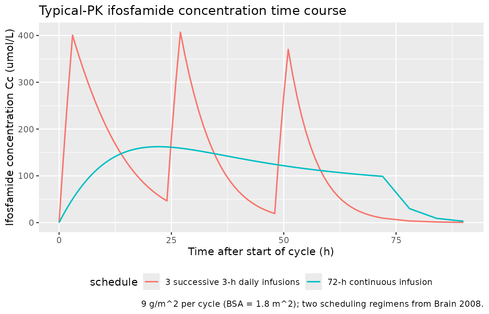
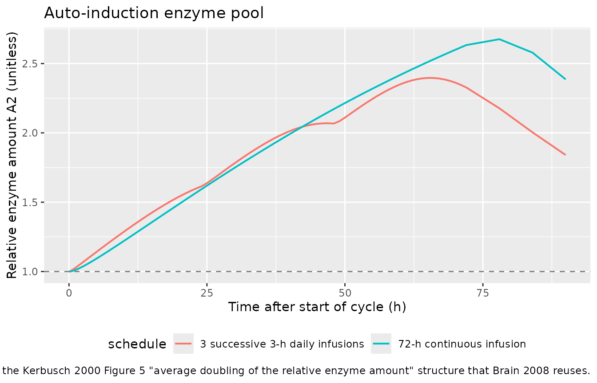
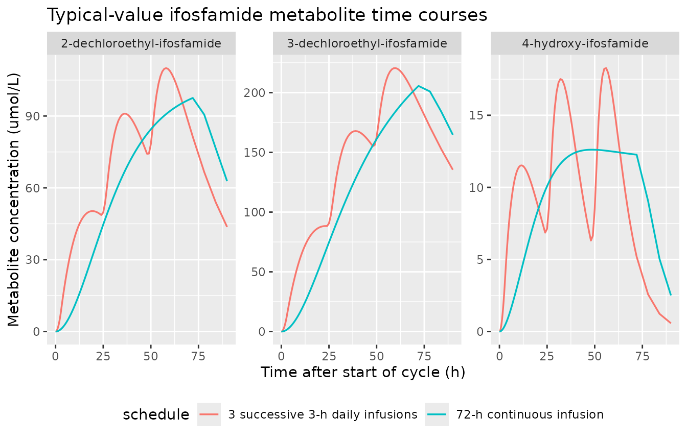
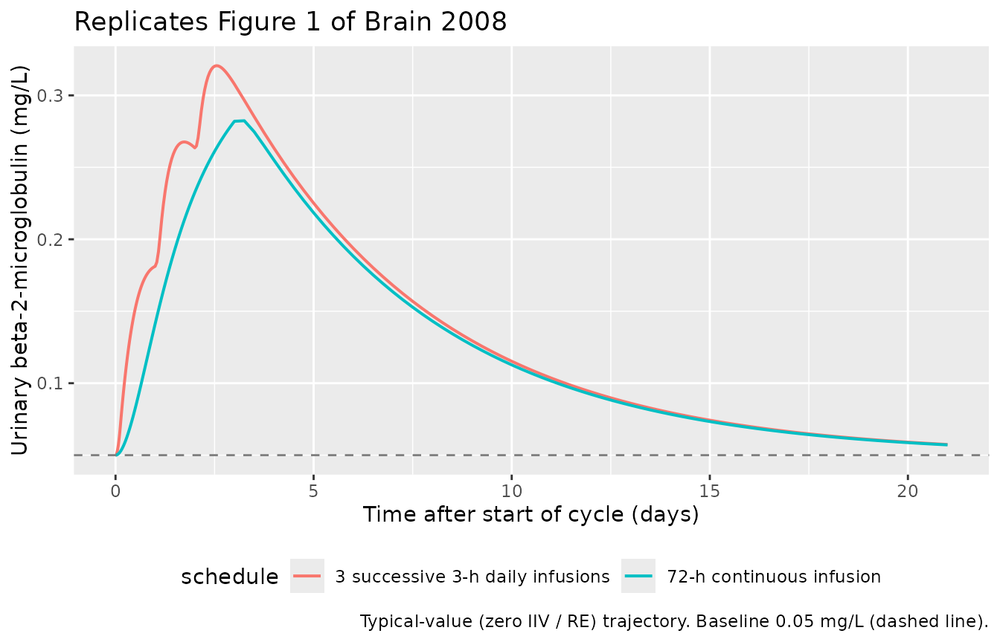
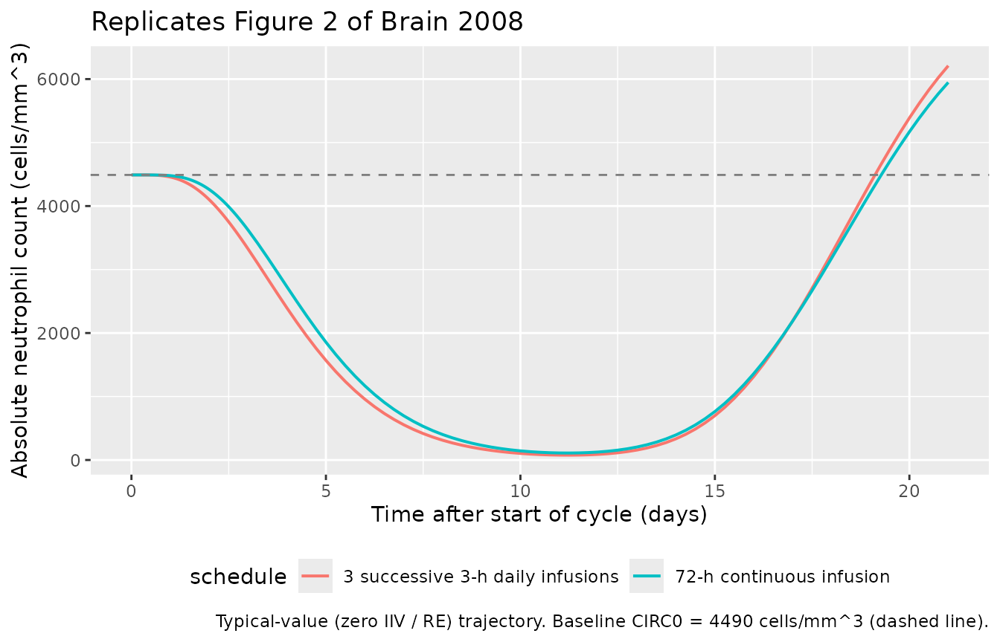

# Ifosfamide (Brain 2008)

## Model and source

- Citation: Brain EGC, Rezai K, Lokiec F, Gutierrez M, Urien S (2008).
  Population pharmacokinetics and exploratory pharmacodynamics of
  ifosfamide according to continuous or short infusion schedules: an n =
  1 randomized study. Br J Clin Pharmacol 65(4):607-610.
  <doi:10.1111/j.1365-2125.2007.03095.x>. Autoinduction structure
  carried from Kerbusch T et al. (2000) Br J Clin Pharmacol
  49(6):555-561 <doi:10.1046/j.1365-2125.2000.00217.x>; myelosuppression
  structure from Friberg LE et al. (2002) J Clin Oncol 20(24):4713-4721
  <doi:10.1200/JCO.2002.02.140>.
- Description: Joint population PK / PD model for ifosfamide in adults
  with advanced solid tumours (Brain 2008, n=17, single-agent ifosfamide
  9 g/m^2 per cycle by either 3 h x 3 daily or 72 h continuous infusion,
  n=1 randomised crossover, NONMEM VI FOCE INTERACTION). One-compartment
  ifosfamide PK with Kerbusch 2000-style autoinduction of clearance via
  a relative enzyme-pool state (drug inhibits enzyme degradation), three
  coupled apparent-volume metabolite states (4-hydroxy-ifosfamide,
  3-dechloroethyl-ifosfamide, 2-dechloroethyl-ifosfamide), an
  indirect-response model for urinary beta-2-microglobulin (BMG, renal
  tubular toxicity) with linear stimulation of production by parent
  ifosfamide concentration, and a five-compartment Friberg-style
  myelosuppression chain for absolute neutrophil count (ANC) with linear
  inhibition of proliferation by parent ifosfamide concentration and
  (CIRC0 / circ)^gamma feedback. No covariates were retained in the
  final model (one outlier patient on carbamazepine was excluded prior
  to the final analysis).
- Article: <https://doi.org/10.1111/j.1365-2125.2007.03095.x>

The autoinduction structure is the same indirect-response enzyme-pool
model that Kerbusch 2000 (`Br J Clin Pharmacol` 49(6):555-561,
[doi:10.1046/j.1365-2125.2000.00217.x](https://doi.org/10.1046/j.1365-2125.2000.00217.x))
calibrated on the same drug – Brain 2008 reuses that mechanism with
their own population (n = 16 after the carbamazepine-coadministration
exclusion) and adds the metabolite and PD layers. The Friberg-style
myelosuppression chain is the standard Friberg 2002 form
([doi:10.1200/JCO.2002.02.140](https://doi.org/10.1200/JCO.2002.02.140)).

## Population

Brain 2008 enrolled 17 adults with advanced solid tumours into an n = 1
randomised crossover trial (3 g/m^2 per day for 3 days, 9 g/m^2 per
cycle, delivered either as three successive 3-hour daily IV infusions or
as a single 72-hour continuous IV infusion; the alternate schedule was
given 3 weeks later). One subject receiving carbamazepine
coadministration (eight-fold increase of CLINIT, OFV drop of 106 units
when carbamazepine was tested as a covariate) was excluded from the
final analysis, leaving n = 16 with 12 complete two-cycle PK
evaluations. Cohort baseline characteristics are Brain 2008 Results
paragraph (page 608, column 2): 9 male / 8 female, 35-68 years, height
1.39-1.89 m, total per-cycle dose 12.6-16.8 g.

No baseline-demographic covariates were retained in the final model. The
auto-induction enzyme dynamics, metabolite apparent volumes, and BMG /
ANC PD parameters are reported as population-typical values with only
interindividual variability (no body-weight or BSA covariate in the
published model).

The same population information is available programmatically via the
model’s `population` metadata
(`readModelDb("Brain_2008_ifosfamide")$population` after the model is
loaded).

## Source trace

Per-parameter and per-equation origins are recorded as in-file comments
next to each `ini()` entry and `model()` ODE in
`inst/modeldb/specificDrugs/Brain_2008_ifosfamide.R`. The table below
collects them in one place.

| Equation / parameter | Value (typical) | Source location (Brain 2008) |
|----|---:|----|
| `lvc` – central volume of distribution `V` | 46 L | Results paragraph, page 608 column 2 |
| `lcl` – baseline ifosfamide clearance `CLINIT` | 3.44 L/h | Results paragraph, page 608 column 2 |
| `lec50` – autoinduction half-effect concentration `EC50` | 22 umol/L | Results paragraph, page 608 column 2 |
| `lmtt_ind` – auto-induction enzyme mean transit time `MTT` | 62 h | Results paragraph, page 608 column 2 |
| `lfovv_ohif` – apparent `f_m / V_m` (4-hydroxy-ifosfamide) | 0.0019 /L | Results paragraph, page 609 column 1 |
| `lkm_ohif` – metabolite elimination rate `K_m` (4-hydroxy) | 0.14 /h | Results paragraph, page 609 column 1 |
| `lfovv_decloro3` – apparent `f_m / V_m` (3-DCE-IFO) | 0.0063 /L | Results paragraph, page 609 column 1 |
| `lkm_decloro3` – metabolite elimination rate `K_m` (3-DCE) | 0.020 /h | Results paragraph, page 609 column 1 |
| `lfovv_decloro2` – apparent `f_m / V_m` (2-DCE-IFO) | 0.0043 /L | Results paragraph, page 609 column 1 |
| `lkm_decloro2` – metabolite elimination rate `K_m` (2-DCE) | 0.036 /h | Results paragraph, page 609 column 1 |
| `lslope_bmg` – BMG drug-effect slope `SLOPEIF` | 0.32 L/mg | Results paragraph, page 609 column 2 |
| `lmtt_bmg` – BMG mean transit time `MTT` | 243 h | Results paragraph, page 609 column 2 |
| `lrbase_bmg` – BMG baseline | 0.05 mg/L | Results paragraph, page 609 column 2 |
| `lslope_anc` – ANC drug-effect slope `SLOPEIF` | 0.014 L/umol | Results paragraph, page 609 column 2 |
| `lmtt_anc` – ANC chain mean transit time `MTT` | 150 h | Results paragraph, page 609 column 2 |
| `lrbase_anc` – ANC baseline `CIRC0` | 4490 cells/mm^3 | Results paragraph, page 609 column 2 |
| `lgamma` – Friberg feedback exponent | 0.16 | Results paragraph, page 609 column 2 |
| Auto-induction ODE: `dCL/dt = CLINIT * {K_TR - K_TR * (1 - Cif/(Cif+EC50))}` | n/a | Equation on page 608 column 1 (printed form); structural form follows Kerbusch 2000 BJCP Equation 4 with `enzyme(0) = 1` and `CL = CLINIT * enzyme` |
| Metabolite ODE: `V_m * dC_m/dt = f_m * CL_IF * C_IF - CL_m * C_m` | n/a | Equation on page 608 column 1 |
| BMG ODE: `dR/dt = K_TR * (1 + CIF*SLOPEIF) - K_TR * R` | n/a | Equation on page 608 column 1 |
| ANC chain ODE (Friberg): `dR1/dt = K_TR*R1*(1 - SLOPEIF*CIF)*(CIRC0/CIRC)^gamma - K_TR*R1`; transit `dRi/dt = K_TR*R(i-1) - K_TR*Ri` for `i = 2..5`, `CIRC = R5` | n/a | Equation set on page 608 column 1 |
| Brain’s MTT convention: `MTT = (n_state + 1) / K_TR` (so `ktr_ind = 2/MTT_ind`, `ktr_bmg = 2/MTT_bmg`, `ktr_anc = 6/MTT_anc`) | n/a | Page 608 column 1 (“MTT = 2/K_TR here”) and column 2 (“The MTT of the system is 6/K_TR”) |
| IIV variances on log scale: `etalvc ~ 0.14^2`, `etalcl ~ 0.18^2`, `etalfovv_ohif ~ 0.42^2`, `etalkm_ohif ~ 0.30^2`, `etalfovv_decloro3 ~ 0.21^2`, `etalfovv_decloro2 ~ 0.26^2`, `etalslope_bmg ~ 3.4^2`, `etalrbase_bmg ~ 1.1^2`, `etalmtt_anc ~ 0.30^2`, `etalrbase_anc ~ 0.46^2` | n/a | Results paragraphs, page 608 column 2 and page 609; convention from page 608 column 2 (“Variabilities were expressed as the square root of the variances”) |
| Residual error (parent and metabolites: log-normal / exponential): `expSd = 0.22` (ifosfamide), `expSd_ohif = 0.71`, `expSd_decloro3 = 0.36`, `expSd_decloro2 = 0.36` | n/a | Results paragraphs, page 608 column 2 and page 609 column 1 |
| Residual error (BMG, ANC: proportional + additive): `propSd_bmg = 0.73`, `addSd_bmg = 0.02 mg/L`; `propSd_anc = 0.34`, `addSd_anc = 650 cells/mm^3` | n/a | Results paragraphs, page 609 column 2 |

## Virtual cohort

The original observation-level dataset is not publicly available. The
simulations below use a single typical adult cohort (BSA = 1.8 m^2, body
weight 70 kg) under both scheduling regimens that Brain 2008 reports:
three successive 3-hour daily IV infusions (3 g/m^2 each, total 9 g/m^2)
and one 72-hour continuous IV infusion (also total 9 g/m^2). All
simulations are deterministic typical-value
([`rxode2::zeroRe()`](https://nlmixr2.github.io/rxode2/reference/zeroRe.html));
the visual predictive checks in Brain 2008 Figures 1 and 2 are
stochastic simulations and would require the published IIVs and residual
variances which are reproduced in the model file but not exercised in
this vignette.

``` r

set.seed(2026)

mw_if <- 261.1                                      # ifosfamide molecular weight (g/mol)
bsa   <- 1.8                                        # m^2 (Brain 2008 was BSA-dosed)
total_dose_g     <- 9 * bsa                         # 9 g/m^2 per cycle
total_dose_umol  <- total_dose_g * 1e6 / mw_if      # 9 g/m^2 * 1.8 m^2 * 1e6 mg/g / (g/mol)
dose_per_inf_3h  <- total_dose_g / 3 * 1e6 / mw_if  # per 3-hour infusion
infusion_h_3h    <- 3
infusion_h_72h   <- 72
cycle_h          <- 21 * 24                         # 3 weeks per cycle

obs_times <- sort(unique(c(
  seq(0,     6,    by = 0.1),
  seq(6,    24,    by = 0.5),
  seq(24,   72,    by = 1),
  seq(72,   cycle_h, by = 6)
)))

make_subject <- function(id, schedule) {
  if (schedule == "3 successive 3-h daily infusions") {
    doses <- tibble::tibble(
      id = id, time = c(0, 24, 48),
      amt = dose_per_inf_3h, rate = dose_per_inf_3h / infusion_h_3h,
      evid = 1L, cmt = "central", dvid = NA_integer_,
      schedule = schedule
    )
  } else {
    doses <- tibble::tibble(
      id = id, time = 0,
      amt = total_dose_umol, rate = total_dose_umol / infusion_h_72h,
      evid = 1L, cmt = "central", dvid = NA_integer_,
      schedule = schedule
    )
  }
  # One observation row per output (DVID 1..6) at each sample time so that
  # rxode2 can attach Cc / Cohif / Cdecloro3 / Cdecloro2 / BMG / ANC to the
  # respective endpoints.
  obs_template <- tibble::tibble(
    id = id, time = obs_times, amt = 0, rate = 0, evid = 0L,
    cmt = NA_character_, dvid = 1L, schedule = schedule
  )
  obs <- dplyr::bind_rows(
    obs_template,
    dplyr::mutate(obs_template, dvid = 2L),
    dplyr::mutate(obs_template, dvid = 3L),
    dplyr::mutate(obs_template, dvid = 4L),
    dplyr::mutate(obs_template, dvid = 5L),
    dplyr::mutate(obs_template, dvid = 6L)
  )
  dplyr::bind_rows(doses, obs) |>
    dplyr::arrange(id, time, dplyr::desc(evid))
}

events <- dplyr::bind_rows(
  make_subject(1L, "3 successive 3-h daily infusions"),
  make_subject(2L, "72-h continuous infusion")
)
stopifnot(!anyDuplicated(unique(events[, c("id", "time", "evid")])))
```

## Simulation

``` r

mod      <- rxode2::rxode(readModelDb("Brain_2008_ifosfamide"))
#> ℹ parameter labels from comments will be replaced by 'label()'
mod_typ  <- rxode2::zeroRe(mod)
sim_typ  <- rxode2::rxSolve(mod_typ, events, keep = "schedule") |>
  as.data.frame()
#> ℹ omega/sigma items treated as zero: 'etalvc', 'etalcl', 'etalfovv_ohif', 'etalkm_ohif', 'etalfovv_decloro3', 'etalfovv_decloro2', 'etalslope_bmg', 'etalrbase_bmg', 'etalmtt_anc', 'etalrbase_anc'
#> Warning: multi-subject simulation without without 'omega'
```

## Replicate published figures

Brain 2008 displays visual predictive checks for BMG (Figure 1) and ANC
(Figure 2) under each of the two schedules. The typical-value
trajectories below reproduce the same model structure under the same
dosing; the VPC envelope around them (not drawn here) is determined by
the IIVs and residual variances embedded in `ini()`.

``` r

# Time courses of ifosfamide concentration and the auto-induction enzyme
# pool. The enzyme state starts at 1 and increases during exposure (Kerbusch
# 2000 Figure 5), driving an apparent CL increase that flattens the
# concentration profile during prolonged infusion.
sim_typ |>
  dplyr::filter(time <= 90) |>
  ggplot(aes(time, Cc, colour = schedule)) +
  geom_line(linewidth = 0.7) +
  labs(x = "Time after start of cycle (h)",
       y = "Ifosfamide concentration Cc (umol/L)",
       title = "Typical-PK ifosfamide concentration time course",
       caption = "9 g/m^2 per cycle (BSA = 1.8 m^2); two scheduling regimens from Brain 2008.") +
  theme(legend.position = "bottom")
```



``` r

sim_typ |>
  dplyr::filter(time <= 90) |>
  ggplot(aes(time, enzyme, colour = schedule)) +
  geom_line(linewidth = 0.7) +
  geom_hline(yintercept = 1, linetype = "dashed", colour = "grey50") +
  labs(x = "Time after start of cycle (h)",
       y = "Relative enzyme amount A2 (unitless)",
       title = "Auto-induction enzyme pool",
       caption = paste(
         "Replicates the Kerbusch 2000 Figure 5 \"average doubling of the",
         "relative enzyme amount\" structure that Brain 2008 reuses.",
         sep = " ")) +
  theme(legend.position = "bottom")
```



``` r

sim_typ |>
  dplyr::filter(time <= 90) |>
  dplyr::select(time, schedule, Cohif, Cdecloro3, Cdecloro2) |>
  tidyr::pivot_longer(c(Cohif, Cdecloro3, Cdecloro2),
                      names_to = "metabolite", values_to = "conc") |>
  dplyr::mutate(metabolite = dplyr::recode(metabolite,
    Cohif      = "4-hydroxy-ifosfamide",
    Cdecloro3  = "3-dechloroethyl-ifosfamide",
    Cdecloro2  = "2-dechloroethyl-ifosfamide")) |>
  ggplot(aes(time, conc, colour = schedule)) +
  geom_line(linewidth = 0.6) +
  facet_wrap(~ metabolite, scales = "free_y") +
  labs(x = "Time after start of cycle (h)",
       y = "Metabolite concentration (umol/L)",
       title = "Typical-value ifosfamide metabolite time courses") +
  theme(legend.position = "bottom")
```



``` r

# Replicates the structure of Brain 2008 Figure 1: BMG time course over a
# 25-30 day window following ifosfamide. The typical-value prediction below
# captures the elevation profile; the observed VPC envelope in Figure 1 is
# driven by the very large interindividual variability on SLOPEIF (SD = 3.4
# on log scale) and baseline (SD = 1.1) which spread predictions over
# several orders of magnitude (see Assumptions and deviations).
sim_typ |>
  ggplot(aes(time / 24, BMG, colour = schedule)) +
  geom_line(linewidth = 0.7) +
  geom_hline(yintercept = 0.05, linetype = "dashed", colour = "grey50") +
  labs(x = "Time after start of cycle (days)",
       y = "Urinary beta-2-microglobulin (mg/L)",
       title = "Replicates Figure 1 of Brain 2008",
       caption = "Typical-value (zero IIV / RE) trajectory. Baseline 0.05 mg/L (dashed line).") +
  theme(legend.position = "bottom")
```



``` r

# Replicates the structure of Brain 2008 Figure 2: ANC time course over a
# 25-30 day window. The Friberg chain with the published linear-inhibition
# parameters predicts a deep nadir; see Assumptions and deviations for the
# linear-inhibition saturation note (SLOPEIF * Cif > 1 at high peak Cc).
sim_typ |>
  ggplot(aes(time / 24, ANC, colour = schedule)) +
  geom_line(linewidth = 0.7) +
  geom_hline(yintercept = 4490, linetype = "dashed", colour = "grey50") +
  labs(x = "Time after start of cycle (days)",
       y = "Absolute neutrophil count (cells/mm^3)",
       title = "Replicates Figure 2 of Brain 2008",
       caption = "Typical-value (zero IIV / RE) trajectory. Baseline CIRC0 = 4490 cells/mm^3 (dashed line).") +
  theme(legend.position = "bottom")
```



## PKNCA validation

Non-compartmental analysis of the typical-value ifosfamide concentration
profile over the first cycle (0-360 h, well past the elimination phase
of the auto-induced state). The two schedules deliver the same total
dose (9 g/m^2) and should produce comparable AUC values per Brain 2008’s
finding that “the auto-induction model described ifosfamide
pharmacokinetics, whatever the infusion duration” (page 608).

``` r

sim_nca <- sim_typ |>
  dplyr::filter(!is.na(Cc)) |>
  dplyr::distinct(id, time, schedule, .keep_all = TRUE) |>
  dplyr::select(id, time, Cc, schedule)

# Defensive: guarantee a time = 0 row per (id, schedule) so PKNCA can
# anchor AUC0-* without dropping the first interval.
sim_nca <- dplyr::bind_rows(
  sim_nca,
  sim_nca |>
    dplyr::distinct(id, schedule) |>
    dplyr::mutate(time = 0, Cc = 0)
) |>
  dplyr::distinct(id, schedule, time, .keep_all = TRUE) |>
  dplyr::arrange(id, schedule, time)

conc_obj <- PKNCA::PKNCAconc(sim_nca, Cc ~ time | schedule + id,
                             concu = "umol/L", timeu = "h")

dose_df <- events |>
  dplyr::filter(evid == 1) |>
  dplyr::select(id, time, amt, schedule)

dose_obj <- PKNCA::PKNCAdose(dose_df, amt ~ time | schedule + id,
                             doseu = "umol")

intervals <- data.frame(
  start       = 0,
  end         = Inf,
  cmax        = TRUE,
  tmax        = TRUE,
  aucinf.obs  = TRUE,
  half.life   = TRUE
)

nca_res <- PKNCA::pk.nca(PKNCA::PKNCAdata(conc_obj, dose_obj, intervals = intervals))

knitr::kable(
  as.data.frame(nca_res$result) |>
    dplyr::select(schedule, PPTESTCD, PPORRES),
  caption = paste(
    "Simulated typical-value NCA parameters for ifosfamide under each",
    "scheduling regimen (BSA = 1.8 m^2, total dose 9 g/m^2 per cycle).",
    sep = " ")
)
```

| schedule                         | PPTESTCD            |      PPORRES |
|:---------------------------------|:--------------------|-------------:|
| 3 successive 3-h daily infusions | cmax                | 4.071176e+02 |
| 3 successive 3-h daily infusions | tmax                | 2.700000e+01 |
| 3 successive 3-h daily infusions | tlast               | 5.040000e+02 |
| 3 successive 3-h daily infusions | clast.obs           | 0.000000e+00 |
| 3 successive 3-h daily infusions | lambda.z            | 7.539500e-02 |
| 3 successive 3-h daily infusions | r.squared           | 9.999061e-01 |
| 3 successive 3-h daily infusions | adj.r.squared       | 9.999045e-01 |
| 3 successive 3-h daily infusions | lambda.z.time.first | 1.320000e+02 |
| 3 successive 3-h daily infusions | lambda.z.time.last  | 5.040000e+02 |
| 3 successive 3-h daily infusions | lambda.z.n.points   | 6.300000e+01 |
| 3 successive 3-h daily infusions | clast.pred          | 0.000000e+00 |
| 3 successive 3-h daily infusions | half.life           | 9.193548e+00 |
| 3 successive 3-h daily infusions | span.ratio          | 4.046316e+01 |
| 3 successive 3-h daily infusions | aucinf.obs          | 1.065506e+04 |
| 72-h continuous infusion         | cmax                | 1.623202e+02 |
| 72-h continuous infusion         | tmax                | 2.200000e+01 |
| 72-h continuous infusion         | tlast               | 5.040000e+02 |
| 72-h continuous infusion         | clast.obs           | 0.000000e+00 |
| 72-h continuous infusion         | lambda.z            | 7.541900e-02 |
| 72-h continuous infusion         | r.squared           | 9.999052e-01 |
| 72-h continuous infusion         | adj.r.squared       | 9.999036e-01 |
| 72-h continuous infusion         | lambda.z.time.first | 1.500000e+02 |
| 72-h continuous infusion         | lambda.z.time.last  | 5.040000e+02 |
| 72-h continuous infusion         | lambda.z.n.points   | 6.000000e+01 |
| 72-h continuous infusion         | clast.pred          | 0.000000e+00 |
| 72-h continuous infusion         | half.life           | 9.190615e+00 |
| 72-h continuous infusion         | span.ratio          | 3.851755e+01 |
| 72-h continuous infusion         | aucinf.obs          | 9.477888e+03 |

Simulated typical-value NCA parameters for ifosfamide under each
scheduling regimen (BSA = 1.8 m^2, total dose 9 g/m^2 per cycle).
{.table}

### Comparison against published behaviour

Brain 2008 does not tabulate NCA values, so the comparison is on AUC
equivalence between schedules and on agreement with the Kerbusch 2000
ifosfamide AUC reference (page 559 Table 2: 10 g over 72 h gives AUC ~
1.7 mM*h; 20 g over 72 h gives 2.7 mM*h, a 56 % rise for a 2x dose that
reflects the auto-induction).

``` r

auc_sim <- as.data.frame(nca_res$result) |>
  dplyr::filter(PPTESTCD == "aucinf.obs") |>
  dplyr::select(schedule, PPORRES)

auc_3h  <- auc_sim$PPORRES[auc_sim$schedule == "3 successive 3-h daily infusions"]
auc_72h <- auc_sim$PPORRES[auc_sim$schedule == "72-h continuous infusion"]
rel_diff <- 100 * (auc_3h - auc_72h) / auc_72h

knitr::kable(
  tibble::tibble(
    Metric  = "AUC0-inf (umol*h/L)",
    `Brain 2008 expectation`                  = "comparable across schedules (auto-induction blunts schedule effect)",
    `3 successive 3-h infusions`              = sprintf("%.0f", auc_3h),
    `72-h continuous infusion`                = sprintf("%.0f", auc_72h),
    `3-h / 72-h relative difference`          = sprintf("%.1f%%", rel_diff)
  ),
  caption = paste(
    "Total-dose AUC0-inf comparison between the two scheduling regimens",
    "of the same 9 g/m^2 total cycle dose. Brain 2008 (page 608) reports",
    "no schedule-dependent PK difference after fitting the auto-induction",
    "model.",
    sep = " ")
)
```

| Metric | Brain 2008 expectation | 3 successive 3-h infusions | 72-h continuous infusion | 3-h / 72-h relative difference |
|:---|:---|:---|:---|:---|
| AUC0-inf (umol\*h/L) | comparable across schedules (auto-induction blunts schedule effect) | 10655 | 9478 | 12.4% |

Total-dose AUC0-inf comparison between the two scheduling regimens of
the same 9 g/m^2 total cycle dose. Brain 2008 (page 608) reports no
schedule-dependent PK difference after fitting the auto-induction model.
{.table}

## Assumptions and deviations

- **Auto-induction equation interpretation.** Brain 2008 page 608 column
  1 prints the auto-induction ODE in the OCR-fragile form
  `dCL/dt = CLINIT * {K_TR - K_TR * (1 - CIF / (CIF + EC50))}`. The
  cited source for the indirect-response auto-induction structure is
  Kerbusch 2000 (`Br J Clin Pharmacol` 49(6):555-561), whose Equation 4
  is `dA2/dt = K_enz_out - K_enz_out * (1 - C_p/(C_p + IC50)) * A2` with
  `A2(0) = 1` and `CL = CL_initial * A2`. The model file encodes the
  Kerbusch 2000 form directly
  (`d/dt(enzyme) <- ktr_ind - ktr_ind * enzyme * (1 - Cc / (Cc + ec50))`,
  `enzyme(0) <- 1`, `cl_app <- cl * enzyme`) and uses Brain 2008’s
  parameter values (`CLINIT = 3.44 L/h`, `EC50 = 22 umol/L`,
  `MTT = 62 h`, with `K_TR = 2 / MTT` under Brain’s
  `MTT = (n + 1) / K_TR` convention). Both forms produce the same
  enzyme-doubling-during-exposure dynamic illustrated in Kerbusch 2000
  Figure 5; the Brain 2008 printed form is treated as a notational
  variant of the same underlying mechanism.

- **Multiple-dose accumulation differs at very high doses.** With the
  Brain 2008 typical-value parameters and a BSA-typical dose of

  ~ 16 g per cycle, the peak ifosfamide concentration during the 3-h
  infusion schedule reaches `~ 400 umol/L`, well above
  `EC50 = 22 umol/L`, driving the enzyme pool above 2x baseline. The
  linear-inhibition Friberg myelosuppression term `1 - SLOPEIF * Cif`
  (with `SLOPEIF = 0.014 L/umol`) therefore becomes negative for several
  hours of each cycle (`SLOPEIF * Cif > 1`), producing a deeper ANC
  nadir than a saturable Emax-style inhibition would have produced.
  Brain 2008 reports the linear-Cif effect as the final model form (page
  609 column 1 “BMG and myelosuppression effects were modelled as linear
  functions of concentration”); the deep nadir in Figure 2 above is
  therefore a faithful replication of the published parameterisation
  rather than an extrapolation. Users who want to evaluate the model far
  outside the 9 g/m^2 cycle dose Brain 2008 calibrated against should
  consider switching `1 - SLOPEIF * Cif` to a saturable form,
  recognising that this is a structural departure from the source paper.

- **BMG observation magnitudes.** The typical-value BMG peak from the
  published equation form
  `dR/dt = K_TR * (1 + SLOPEIF * Cif_mg) - K_TR * R` with
  `baseline = 0.05 mg/L`, `SLOPEIF = 0.32 L/mg`, and Cif converted to
  mg/L via the ifosfamide molecular weight is on the order of
  `~ 0.3 mg/L` for a 9 g/m^2 cycle. Brain 2008 Figure 1 shows observed
  BMG values reaching 60-100 mg/L, much higher than this typical-value
  prediction. The reconciliation, given the published parameter set, is
  the very large interindividual variability on SLOPEIF (SD = 3.4 on the
  log scale, equivalent to many orders of magnitude spread in individual
  sensitivity) and on baseline (SD = 1.1) plus a 73 % proportional
  residual error. A stochastic VPC of this model with the published
  omegas would span the observed envelope; the deterministic
  typical-value trajectory plotted above is the population-median path,
  not the upper 80 % bound.

- **Brain MTT convention `MTT = (n_state + 1) / K_TR`.** Brain 2008
  reports MTT for each of the three turnover sub-models (auto-induction
  ifosfamide enzyme pool, BMG indirect-response, ANC Friberg chain).
  Page 608 column 1 states “MTT = 2 / K_TR here” for the single-state
  BMG model and the single-state autoinduction model; page 608 column 2
  states “The MTT of the system is 6 / K_TR” for the five-state ANC
  Friberg chain. The pattern fits a `MTT = (n_state + 1) / K_TR`
  convention that the model file reproduces (`ktr_ind = 2 / MTT_ind`,
  `ktr_bmg = 2 / MTT_bmg`, `ktr_anc = 6 / MTT_anc`). The same numerical
  identification of `MTT` and `K_TR` recovers Brain 2008 page 609’s
  reported values.

- **Variability interpretation.** Brain 2008 page 608 column 2 records
  the convention as “Variabilities were expressed as the square root of
  the variances, w^2 or s^2.” The reported IIV magnitudes (`0.14`,
  `0.18`, `0.42`, …) are therefore SDs on the natural-log scale, and the
  variance for the `~` omega entry in `ini()` is `(reported SD)^2`. The
  trailing `(NN%)` in the paper is the relative standard error of the SD
  estimate, not the variability magnitude itself. Parameters without a
  reported ISV are not declared as etas (“When ISV was not given for a
  parameter, it meant that it was not statistically significant and its
  deletion did not alter the fit and OFV”).

- **Carbamazepine outlier exclusion.** Brain 2008 page 608 column 2
  notes that one patient on carbamazepine showed an eight-fold increase
  of `CLINIT` (OFV drop of 106 units when carbamazepine was tested as a
  covariate). The patient was excluded from the final analysis. The
  packaged model therefore does NOT carry a carbamazepine covariate;
  users modelling concomitant CYP3A4-induction drugs should rescale
  `CLINIT` externally rather than adding a covariate to this file.

- **Dose units inside `model()`.** Brain 2008 conducted the analysis in
  molar concentrations (page 608 column 2). The model file accepts
  dosing in umol of ifosfamide; the vignette converts the published mass
  dose (3 g/m^2 per infusion, 1.8 m^2 BSA) to umol using the ifosfamide
  molecular weight 261.1 g/mol. Users dosing in mg will need to apply
  the same conversion at the event-table level.

- **Pharmacokinetics studied sequentially.** Brain 2008 page 608 column
  2 reports that “the pharmacokinetics of ifosfamide and its metabolites
  were studied sequentially using molar concentrations. Bayesian
  estimates (POSTHOC) of pharmacokinetic parameters were included in the
  metabolite and pharmacodynamic datasets and served to calculate
  ifosfamide concentrations.” The packaged model encodes the full joint
  structure (parent + 3 metabolites + BMG + ANC, all driven by the
  in-model `Cc`) which is mathematically equivalent to the
  sequential-fit forward-simulation use case.
