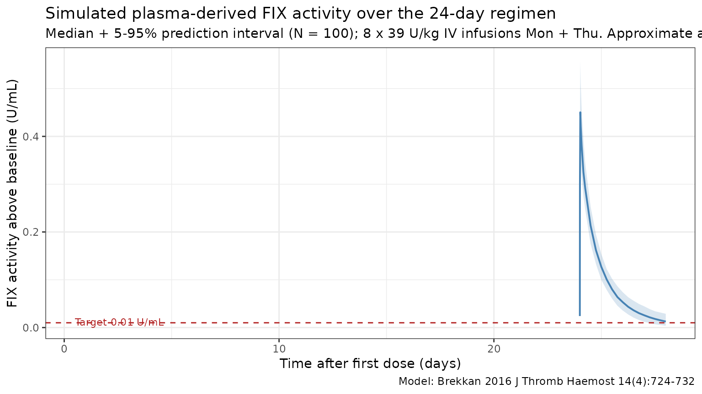

# Factor IX (Brekkan 2016)

## Model and source

- Citation: Brekkan A, Berntorp E, Jensen K, Nielsen EI, Jonsson S.
  Population pharmacokinetics of plasma-derived factor IX: procedures
  for dose individualization. *J Thromb Haemost.* 2016;14(4):724-732.
  <doi:%5B10.1111/jth.13271>\](<https://doi.org/10.1111/jth.13271>)
- Description: Three-compartment population PK model for plasma-derived
  factor IX (FIX) activity in patients with moderate or severe
  haemophilia B.
- Article: <https://doi.org/10.1111/jth.13271>
- Modality: Plasma-derived FIX concentrate, IV infusion.

Brekkan 2016 reevaluated a previously published three-compartment popPK
model for plasma-derived FIX activity (the “original model” of Berntorp
et al., reference 15 in the paper) using an extended pooled data set,
and used the refit to explore sparse sampling schedules for individual
Bayesian dose prediction in haemophilia B. The packaged model implements
the **final re-estimated model** (Brekkan 2016 Table 2, with equations
in Material and methods, p. 725): three-compartment disposition with IV
input and first-order elimination from the central compartment,
allometric weight scaling on all CL / Q (exponent 0.75) and V (exponent
1.0) parameters with reference weight 70 kg, an endogenous FIX-activity
baseline estimated as a structural parameter, two correlated IIV blocks
(CL/V1 and V2/V3) plus an independent IIV on baseline, and a combined
additive + proportional residual error. The final model has five fewer
parameters than the original Berntorp model and an OFV 1941 points lower
(Brekkan 2016 Results, p. 727).

## Population

The development cohort comprised **34 unique patients with moderate or
severe haemophilia B** pooled across five previously published studies
(Brekkan 2016 Table 1):

- 1,794 FIX activity samples; 7-17 samples per patient per occasion; 35
  samples below the typical 0.01 U/mL limit of quantification were
  retained in the data set.
- Mean body weight 66.8 (SD 13.5) kg; per-study means 61.0-69.7 kg.
- Mean age 27.5 (SD 10.9) years; per-study means 23.1-42.8 years.
- Sex: haemophilia B is X-linked recessive, so the cohort is essentially
  all male.
- Race / ethnicity: not reported.
- Disease state: moderate or severe haemophilia B; baseline FIX activity
  estimated as a model parameter (0.01588 U/mL typical value).
- Products: seven plasma-derived FIX concentrates (AlphaNine - the most
  common - plus Factor IX Grifols, Immunine, Octanine, Nanotiv,
  Preconativ, Mononine). Product was tested as a covariate on CL and
  dropped from the final model because no product changed typical CL by
  more than 20% (Brekkan 2016 Results, p. 727).
- Sampling can in general be considered single-dose PK; the shortest and
  longest time periods between occasions were 4 days and \> 4 years.

The Discussion notes the final model should be used with caution to
describe FIX activity following administration of products that are not
plasma-derived. The same metadata is available programmatically via
`readModelDb("Brekkan_2016_factorIX")$population`.

## Source trace

The per-parameter origin is recorded as an in-file comment next to each
`ini()` entry in `inst/modeldb/specificDrugs/Brekkan_2016_factorIX.R`.
The table below collects them in one place for review.

| Parameter (model name) | Value | Source |
|----|----|----|
| `lcl` (typical CL, mL/h) | log(319.8) | Brekkan 2016 Table 2: CL = 319.8 mL/h |
| `lvc` (typical V1, mL) | log(5922) | Brekkan 2016 Table 2: V1 = 5922 mL |
| `lvp` (typical V2, mL) | log(828.9) | Brekkan 2016 Table 2: V2 = 828.9 mL |
| `lq` (typical Q2, mL/h) | log(1049) | Brekkan 2016 Table 2: Q2 = 1049 mL/h |
| `lvp2` (typical V3, mL) | log(2234) | Brekkan 2016 Table 2: V3 = 2234 mL |
| `lq2` (typical Q3, mL/h) | log(160.4) | Brekkan 2016 Table 2: Q3 = 160.4 mL/h |
| `lrbase` (endogenous baseline, U/mL) | log(0.01588) | Brekkan 2016 Table 2: baseline FIX activity = 0.01588 U/mL |
| Allometric exponent on CL, Q2, Q3 | 0.75 (fixed) | Brekkan 2016 Methods p. 725 and Results p. 727 (three approaches gave similar fits) |
| Allometric exponent on V1, V2, V3 | 1.00 (fixed) | Brekkan 2016 Methods p. 725: volume exponent fixed at 1 |
| Reference body weight | 70 kg | Brekkan 2016 Table 2 footnote (typical value defined for 70 kg subject) |
| IIV block `etalcl + etalvc` | c(0.016129, 0.014053, 0.024649) | Brekkan 2016 Table 2: x_CL = 0.127, x_V1 = 0.157, corr(CL,V1) = 0.705 |
| IIV block `etalvp + etalvp2` | c(0.444889, 0.553828, 1.040400) | Brekkan 2016 Table 2: x_V2 = 0.667, x_V3 = 1.020, corr(V2,V3) = 0.814 |
| `etalrbase` (IIV on baseline) | 0.042849 | Brekkan 2016 Table 2: x_BASELINE = 0.207 |
| `propSd` (proportional residual) | 0.0695 | Brekkan 2016 Table 2: proportional residual error = 0.0695 |
| `addSd` (additive residual, U/mL) | 0.0067 | Brekkan 2016 Table 2: additive residual error = 0.0067 U/mL |
| Equation: `d/dt(central)` | n/a | Brekkan 2016 Material and methods, p. 725 (three-compartment IV model) |
| Equation: `d/dt(peripheral1)` | n/a | Brekkan 2016 Material and methods, p. 725 |
| Equation: `d/dt(peripheral2)` | n/a | Brekkan 2016 Material and methods, p. 725 |
| Equation: `Cc = central / vc + rbase` | n/a | Brekkan 2016 Material and methods, p. 725 (baseline estimated as structural parameter) |

The IIV values are reported in Table 2 under the heading “coefficient of
variation of interindividual variability of clearance, volumes and
baseline”. The Brekkan 2016 paper does not include a
`sqrt(variance) * 100` footnote directly, but the sister factor IX
papers from the same modelling lineage do (Diao 2014 Table 3 footnote:
“IIV calculated as sqrt(variance) \* 100”; Koopman 2023 Table 2
footnote: “IIV and IOV coefficient of variation calculated as:
sqrt(variance) \* 100%”). Under that convention the reported value
equals the SD of the log-scale eta directly, so
`omega^2 = (reported_value)^2` and
`cov = corr * sqrt(var1) * sqrt(var2)`. This is the convention encoded
in the packaged model file. See *Assumptions and deviations* for the
small-IIV check.

The final model also estimated inter-occasion variability on CL (21.4%
CV) and V1 (20.1% CV) with correlation 0.902 between the two random
effects (Brekkan 2016 Table 2). IOV is not implemented in this static
library model because the library event grid has no occasion variable;
see *Assumptions and deviations*.

## Virtual cohort

Original observed FIX activity data are not publicly available. The
simulations below use a virtual cohort whose demographics approximate
the Brekkan 2016 development population: body weight is sampled around
the cohort mean of 66.8 kg (capped to a plausible adult haemophilia B
range). Per Brekkan 2016 simulation design (p. 726) all simulated
patients are assigned a baseline FIX activity of 0 U/mL to represent
severe haemophilia B; this is implemented in the rxode2 call by
overriding `rbase = 0`.

``` r

set.seed(2016)

n_per_group <- 100L

cohort <- tibble(
  ID        = seq_len(n_per_group),
  WT        = pmin(pmax(rlnorm(n_per_group, log(66.8), 0.18), 45), 110),
  treatment = "39 U/kg Mon+Thu"
)

stopifnot(!anyDuplicated(cohort$ID))
summary(cohort)
#>        ID               WT            treatment  
#>  Min.   :  1.00   Min.   :45.00   Length   :100  
#>  1st Qu.: 25.75   1st Qu.:58.71   N.unique :  1  
#>  Median : 50.50   Median :63.67   N.blank  :  0  
#>  Mean   : 50.50   Mean   :66.54   Min.nchar: 15  
#>  3rd Qu.: 75.25   3rd Qu.:74.31   Max.nchar: 15  
#>  Max.   :100.00   Max.   :99.15
```

The simulation replicates Brekkan 2016 Figure 1: eight 10-min IV
infusions of 39 U/kg administered on Mondays and Thursdays (interval 72
h, then 96 h, alternating), with dense sampling after the eighth dose
for 96 h. The 8th (final) dose is on the second Thursday of the third
week (study day 24).

``` r

infusion_min <- 10
infusion_h   <- infusion_min / 60

# Dose times in hours (relative to t = 0 on Monday of week 1):
# Mon week1 = 0; Thu week1 = 72; Mon week2 = 168; Thu week2 = 240;
# Mon week3 = 336; Thu week3 = 408; Mon week4 = 504; Thu week4 = 576.
dose_times <- c(0, 72, 168, 240, 336, 408, 504, 576)
last_dose  <- max(dose_times)

# 22-point sampling schedule (Brekkan 2016 Fig. 1) after the last dose,
# expressed as hours after t = 0:
post_last  <- c(0, 0.1, 0.5, 1, 2, 4, 6, 12, 18, 24, 30, 36,
                42, 48, 54, 60, 66, 72, 78, 84, 90, 96)
obs_times  <- last_dose + post_last

build_events <- function(pop) {
  dose <- pop |>
    tidyr::crossing(start = dose_times) |>
    mutate(
      AMT  = WT * 39,
      RATE = AMT / infusion_h,
      TIME = start,
      EVID = 1,
      CMT  = "central",
      DV   = NA_real_
    ) |>
    select(-start)
  obs <- pop |>
    tidyr::crossing(TIME = obs_times) |>
    mutate(AMT = NA_real_, RATE = NA_real_,
           EVID = 0, CMT = "central", DV = NA_real_)
  bind_rows(dose, obs) |>
    arrange(ID, TIME, desc(EVID)) |>
    as.data.frame()
}

events <- build_events(cohort)
```

## Simulation

Run a stochastic VPC-style simulation (between-subject variability on
CL, V1, V2, V3, and baseline) with `rbase` forced to 0 to represent
severe haemophilia B per the paper’s simulation design. A typical-value
simulation with the etas zeroed is included for parameter back-checks.

``` r

mod <- readModelDb("Brekkan_2016_factorIX")

# Force baseline FIX activity to 0 (severe haemophilia B) per
# Brekkan 2016 p. 726: "In the simulations all patients were assumed to
# have a baseline FIX activity level of 0 (i.e. representing patients
# with severe hemophilia B)."
sim <- rxode2::rxSolve(
  mod, events = events,
  params = c(lrbase = -Inf),
  keep   = c("treatment", "WT"),
  returnType = "data.frame"
)
#> ℹ parameter labels from comments will be replaced by 'label()'
sim <- sim[sim$time >= 0, ]

mod_typ <- rxode2::zeroRe(mod)
#> ℹ parameter labels from comments will be replaced by 'label()'
sim_typ <- rxode2::rxSolve(
  mod_typ, events = events,
  params = c(lrbase = -Inf),
  keep   = c("treatment", "WT"),
  returnType = "data.frame"
)
#> ℹ omega/sigma items treated as zero: 'etalcl', 'etalvc', 'etalvp', 'etalvp2', 'etalrbase'
#> Warning: multi-subject simulation without without 'omega'
sim_typ <- sim_typ[sim_typ$time >= 0, ]
```

## Replicate Figure 1: FIX activity over the 24-day regimen

Brekkan 2016 Figure 1 shows the model-predicted FIX activity over the
24-day eight-infusion regimen for the simulation design. The figure
below reproduces the typical-value profile, with the 5th-95th percentile
envelope from the stochastic simulation overlaid.

``` r

sim_summary <- sim |>
  filter(time >= 0) |>
  group_by(time) |>
  summarise(
    median = stats::median(Cc, na.rm = TRUE),
    lo     = stats::quantile(Cc, 0.05, na.rm = TRUE),
    hi     = stats::quantile(Cc, 0.95, na.rm = TRUE),
    .groups = "drop"
  )

ggplot(sim_summary, aes(time / 24, median)) +
  geom_ribbon(aes(ymin = lo, ymax = hi), alpha = 0.20, fill = "steelblue") +
  geom_line(linewidth = 0.7, colour = "steelblue") +
  geom_hline(yintercept = 0.01, linetype = "dashed", colour = "firebrick") +
  annotate("text", x = 0.5, y = 0.012, label = "Target 0.01 U/mL",
           colour = "firebrick", hjust = 0, size = 3) +
  labs(
    x        = "Time after first dose (days)",
    y        = "FIX activity above baseline (U/mL)",
    title    = "Simulated plasma-derived FIX activity over the 24-day regimen",
    subtitle = paste0("Median + 5-95% prediction interval (N = ", n_per_group,
                      "); 8 x 39 U/kg IV infusions Mon + Thu. ",
                      "Approximate analogue of Brekkan 2016 Figure 1."),
    caption  = "Model: Brekkan 2016 J Thromb Haemost 14(4):724-732"
  ) +
  theme_bw()
```



## Trough back-check at 96 h after the eighth dose

Brekkan 2016 p. 726 fixes the simulation dose (39 U/kg) by the criterion
that *“it resulted in a trough FIX activity level of 0.01 U mL-1 in a
patient with a body weight of 70 kg.”* The check below evaluates that
trough in the typical-value simulation (`zeroRe()` + `rbase = 0`) for a
70 kg subject.

``` r

mod_typ_70 <- rxode2::zeroRe(mod)
#> ℹ parameter labels from comments will be replaced by 'label()'
events_70 <- build_events(tibble(ID = 1L, WT = 70, treatment = "70 kg ref"))
sim_typ_70 <- rxode2::rxSolve(
  mod_typ_70, events = events_70,
  params = c(lrbase = -Inf),
  returnType = "data.frame"
)
#> ℹ omega/sigma items treated as zero: 'etalcl', 'etalvc', 'etalvp', 'etalvp2', 'etalrbase'

trough_row <- sim_typ_70[sim_typ_70$time == last_dose + 96, ]
trough_val <- trough_row$Cc

knitr::kable(
  data.frame(
    quantity         = c("Trough at 96 h after dose 8 (typical, 70 kg, 39 U/kg)",
                         "Brekkan 2016 target trough"),
    value_U_per_mL   = c(round(trough_val, 4), 0.01)
  ),
  caption = "Typical-value trough check for the dose-individualisation design.",
  align   = c("l", "r")
)
```

| quantity                                              | value_U_per_mL |
|:------------------------------------------------------|---------------:|
| Trough at 96 h after dose 8 (typical, 70 kg, 39 U/kg) |         0.0127 |
| Brekkan 2016 target trough                            |         0.0100 |

Typical-value trough check for the dose-individualisation design.
{.table}

## Typical CL and Vss back-check

Brekkan 2016 Table 2 reports the structural parameters for a typical 70
kg subject. Reproducing those numbers from a single-bolus typical-value
simulation is the simplest self-consistency check (Vss = V1 + V2 + V3).

``` r

ev_ref <- rxode2::et(amt = 50 * 70, time = 0, cmt = "central") |>
  rxode2::et(0)
sim_ref <- rxode2::rxSolve(
  mod_typ, events = ev_ref,
  params = c(WT = 70, lrbase = -Inf),
  returnType = "data.frame"
)
#> ℹ omega/sigma items treated as zero: 'etalcl', 'etalvc', 'etalvp', 'etalvp2', 'etalrbase'

ref_pars <- sim_ref[1, c("cl", "vc", "q", "vp", "q2", "vp2"), drop = FALSE]
ref_pars$Vss <- ref_pars$vc + ref_pars$vp + ref_pars$vp2

knitr::kable(
  ref_pars,
  caption = "Typical-value PK parameters for the reference 70 kg patient (mL, mL/h).",
  digits  = c(2, 1, 2, 2, 2, 2, 1)
)
```

|    cl |   vc |    q |    vp |    q2 |  vp2 |    Vss |
|------:|-----:|-----:|------:|------:|-----:|-------:|
| 319.8 | 5922 | 1049 | 828.9 | 160.4 | 2234 | 8984.9 |

Typical-value PK parameters for the reference 70 kg patient (mL, mL/h).
{.table}

The model returns CL = 319.8 mL/h, V1 = 5922 mL, Q2 = 1049 mL/h, V2 =
828.9 mL, Q3 = 160.4 mL/h, V3 = 2234 mL, and Vss = V1 + V2 + V3 = 8985
mL — matching the values reported in Brekkan 2016 Table 2 (CL = 319.8
mL/h, V1 = 5922 mL, Q2 = 1049 mL/h, V2 = 828.9 mL, Q3 = 160.4 mL/h, V3 =
2234 mL, Vss = 8985 mL).

## PKNCA validation: single-dose summary

Brekkan 2016 does not tabulate single-dose NCA parameters directly; the
paper’s quantitative results are framed in terms of
dose-individualisation performance rather than NCA descriptors. The
PKNCA summary below provides the standard NCA descriptors (Cmax,
AUC0-inf, terminal half-life) on a single-dose schedule for context.

``` r

single_events <- cohort |>
  mutate(AMT = WT * 50) |>
  tidyr::crossing(TIME = c(0, c(0.1, 0.5, 1, 2, 4, 6, 12, 18, 24,
                                30, 36, 42, 48, 54, 60, 66, 72,
                                78, 84, 90, 96, 120, 144, 168, 240, 336))) |>
  mutate(
    EVID = if_else(TIME == 0, 1L, 0L),
    AMT  = if_else(TIME == 0, AMT, NA_real_),
    RATE = if_else(TIME == 0, AMT / infusion_h, NA_real_),
    CMT  = "central",
    DV   = NA_real_
  ) |>
  arrange(ID, TIME, desc(EVID)) |>
  as.data.frame()

sim_single <- rxode2::rxSolve(
  mod, events = single_events,
  params = c(lrbase = -Inf),
  keep   = c("treatment", "WT"),
  returnType = "data.frame"
)
#> ℹ parameter labels from comments will be replaced by 'label()'
sim_single <- sim_single[sim_single$time >= 0, ]

sim_nca <- sim_single |>
  filter(!is.na(Cc)) |>
  select(id, time, Cc, treatment)

# Guarantee a time=0 row per (id, treatment); IV bolus pre-dose Cc=0.
sim_nca <- bind_rows(
  sim_nca,
  sim_nca |> distinct(id, treatment) |> mutate(time = 0, Cc = 0)
) |>
  distinct(id, treatment, time, .keep_all = TRUE) |>
  arrange(id, treatment, time)

dose_df <- single_events |>
  filter(EVID == 1) |>
  transmute(id = ID, time = TIME, amt = AMT, treatment)

conc_obj <- PKNCA::PKNCAconc(sim_nca, Cc ~ time | treatment + id,
                             concu = "U/mL",
                             timeu = "h")
dose_obj <- PKNCA::PKNCAdose(dose_df, amt ~ time | treatment + id,
                             doseu = "U")

intervals <- data.frame(
  start      = 0,
  end        = Inf,
  cmax       = TRUE,
  tmax       = TRUE,
  aucinf.obs = TRUE,
  half.life  = TRUE,
  clast.obs  = TRUE,
  lambda.z   = TRUE
)

nca_res <- PKNCA::pk.nca(PKNCA::PKNCAdata(conc_obj, dose_obj,
                                          intervals = intervals))
nca_tbl <- as.data.frame(nca_res$result)

summary_by_param <- function(param) {
  nca_tbl |>
    filter(PPTESTCD == param) |>
    group_by(treatment) |>
    summarise(
      n        = sum(!is.na(PPORRES)),
      median   = stats::median(PPORRES, na.rm = TRUE),
      q05      = stats::quantile(PPORRES, 0.05, na.rm = TRUE),
      q95      = stats::quantile(PPORRES, 0.95, na.rm = TRUE),
      .groups  = "drop"
    )
}

nca_summary <- bind_rows(
  summary_by_param("cmax")       |> mutate(parameter = "Cmax (U/mL)"),
  summary_by_param("tmax")       |> mutate(parameter = "Tmax (h)"),
  summary_by_param("aucinf.obs") |> mutate(parameter = "AUC0-inf (U*h/mL)"),
  summary_by_param("half.life")  |> mutate(parameter = "Terminal half-life (h)")
) |>
  select(parameter, n, median, q05, q95)

knitr::kable(
  nca_summary,
  caption = "Simulated plasma-derived FIX NCA after a single 50 U/kg IV infusion.",
  digits  = c(0, 0, 3, 3, 3)
)
```

| parameter              |   n | median |    q05 |    q95 |
|:-----------------------|----:|-------:|-------:|-------:|
| Cmax (U/mL)            | 100 |  0.519 |  0.416 |  0.696 |
| Tmax (h)               | 100 |  0.500 |  0.500 |  0.500 |
| AUC0-inf (U\*h/mL)     | 100 | 10.585 |  8.500 | 12.911 |
| Terminal half-life (h) | 100 | 22.503 | 13.328 | 56.924 |

Simulated plasma-derived FIX NCA after a single 50 U/kg IV infusion.
{.table}

## Errata

No published erratum was located for Brekkan 2016 (*J Thromb Haemost*
2016;14(4):724-732). The packaged parameter values are taken from
Brekkan 2016 Table 2 (final model), which is internally consistent with
the equations on p. 725 and the simulation design on p. 726.

## Assumptions and deviations

- **Inter-occasion variability omitted.** Brekkan 2016 estimated IOV on
  CL (21.4% CV) and V1 (20.1% CV) with a correlation of 0.902 between
  the two random effects (Table 2). The static library model has no
  occasion variable, so IOV is not implemented as a separate eta. For
  Bayesian forecasting use cases that explicitly model occasions, the
  IOV variances (`omega^2_IOV_CL = 0.214^2 = 0.045796` and
  `omega^2_IOV_V1 = 0.201^2 = 0.040401`, covariance
  `0.902 * 0.214 * 0.201 = 0.038804`) can be added on top of the
  packaged IIV.
- **Inter-individual variability convention.** Brekkan 2016 does not
  state the IIV definition formula directly in the Table 2 footnote, but
  the related factor IX papers from the same modelling lineage (Diao
  2014 Table 3 footnote; Koopman 2023 Table 2 footnote) both define the
  IIV column as `sqrt(variance) * 100`, i.e. the reported value equals
  the SD of the log-scale eta directly. The packaged variances were
  computed with `omega^2 = (reported_value)^2` and covariances as
  `corr * sqrt(var1) * sqrt(var2)` to match this convention. For the
  small IIVs (`x_CL = 0.127`, `x_V1 = 0.157`) the two interpretations
  (`omega^2 = reported^2` vs. `omega^2 = log(reported^2 + 1)`) differ by
  less than 1%; for the large IIV on V3 (`x_V3 = 1.020`) they differ by
  ~30%, which is the dominant uncertainty in any user-facing simulation
  of the terminal-phase variability.
- **No IIV on Q2 or Q3.** Brekkan 2016 retained five fewer parameters
  than the original Berntorp model after model simplification, dropping
  IIV on Q2 and Q3 (Results, p. 727: “the original model could be
  reduced by four parameters related to the IIV part”). The packaged
  model carries no `etalq` or `etalq2`.
- **Endogenous baseline FIX activity.** Brekkan 2016 fits the baseline
  FIX activity as a structural parameter rather than baseline-correcting
  the observations. The model output `Cc = central / vc + rbase`
  therefore represents total measured FIX activity
  (exogenous-attributable + endogenous baseline). To represent severe
  haemophilia B (the simulation design of Brekkan 2016 p. 726), set
  `rbase = 0` by passing `params = c(lrbase = -Inf)` to `rxSolve()` (as
  used in the simulations in this vignette). To represent a patient with
  moderate haemophilia B and endogenous activity, leave `lrbase` at its
  default value.
- **Allometric exponents fixed at theoretical values.** Brekkan 2016
  Methods p. 725 fixes the body weight exponent at 1 for volumes and
  0.75 for intercompartmental CL parameters; Results p. 727 fixes the
  exponent on CL at 0.75 after evaluating three approaches (estimated,
  fixed at 1.26 from the original Berntorp model, fixed at 0.75) that
  all gave similar fits. The packaged `model()` block multiplies CL, Q2,
  Q3 by `(WT / 70)^0.75` and V1, V2, V3 by `(WT / 70)^1.00`.
- **FIX product covariate omitted.** Brekkan 2016 tested seven plasma-
  derived FIX products as a categorical covariate on CL. The likelihood-
  ratio test was statistically significant (P \< 0.01, df = 6) but the
  largest deviation from AlphaNine was within +/- 20% of the typical CL
  (range 252-378 mL/h vs. 315 mL/h reference), so the
  clinical-significance criterion was not met and the product effect was
  dropped from the final model (Brekkan 2016 Results, p. 727). The
  Discussion notes the final model “should be used with caution to
  describe the FIX activity following administration of products that
  are not plasma-derived.”
- **Age covariate omitted.** Brekkan 2016 tested age as a
  fractional-change effect on CL (Equation 2 in the paper) and found it
  not statistically significant. The Discussion notes that incorporating
  body weight in the model explains part of the variability related to
  age.
- **Virtual cohort.** Body weight was sampled from a log-normal
  distribution centred at the cohort mean (66.8 kg) and capped at a
  plausible adult haemophilia B range (45-110 kg). The empirical body
  weight distribution in Brekkan 2016 (per-study means 61.0-69.7 kg,
  overall SD 13.5 kg) is approximated, not exactly reproduced.
- **Haemophilia B is X-linked recessive**, so the development cohort and
  the virtual cohort here are essentially all male (`sex_female_pct = 0`
  in the population metadata). The model has no sex covariate.
